# Data-Juicer 架构深度分析

> 本文档基于 data-juicer 本地代码库（v1.5.3 分支）进行深度分析，结合官方论文 *Data-Juicer 2.0* (NeurIPS'25 Spotlight) 和在线文档，从静态架构、动态架构、具身智能（VLA）管线三个维度剖析框架的设计与实现。

---

## 1. 概述

### 1.1 文档目的与阅读指引

本文档回答三个核心问题：

1. **How** — Data-Juicer 是如何设计和实现的？（静态结构 + 动态行为）
2. **Why** — 为什么要这样设计？（设计动机与权衡）
3. **Risk** — 这样做有什么潜在陷阱？如何规避？

**阅读路线**：

| 读者类型 | 推荐路径 |
|---------|---------|
| 初次接触 | §1 → §2.1 → §2.3 → §3.2 → §4.1 |
| 算子开发者 | §2.3 → §2.4 → §3.4 → §3.5 → §5.1 |
| VLA 管线开发者 | §4（全部） → §7.3 |
| 架构评审 | §2（全部） → §6 → §7 |

### 1.2 Data-Juicer 项目定位

Data-Juicer（DJ）是阿里通义实验室开发的**多模态数据处理框架**，面向基础模型（LLM / VLM / VLA）的训练数据生产。核心能力：

- **240+ 可组合算子**（Operator）：覆盖文本、图像、音频、视频、多模态
- **YAML Recipe 驱动**：数据管线以声明式配置描述，无需编码
- **多后端执行**：同一管线可在单机（HuggingFace Dataset）或分布式集群（Ray）上运行
- **算子融合（OP Fusion）**：自动合并共享中间变量的连续 Filter，减少冗余 I/O
- **具身智能支持**：专用 VLA 算子链将自我中心视频转换为 LeRobot 训练格式

### 1.3 技术栈概览

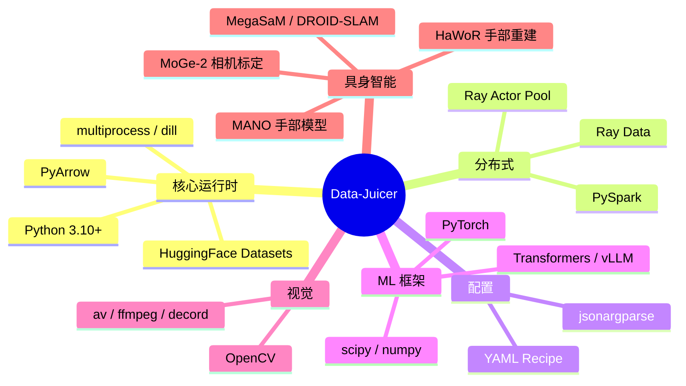
```mermaid
mindmap
  root((Data-Juicer))
    核心运行时
      Python 3.10+
      HuggingFace Datasets
      PyArrow
      multiprocess / dill
    分布式
      Ray Data
      Ray Actor Pool
      PySpark
    配置
      jsonargparse
      YAML Recipe
    ML 框架
      PyTorch
      Transformers / vLLM
      scipy / numpy
    视觉
      OpenCV
      av / ffmpeg / decord
    具身智能
      MoGe-2 相机标定
      HaWoR 手部重建
      MegaSaM / DROID-SLAM
      MANO 手部模型
```

---

## 2. 静态架构分析

### 2.1 顶层组件架构

Data-Juicer 由五大子系统组成，层次分明：

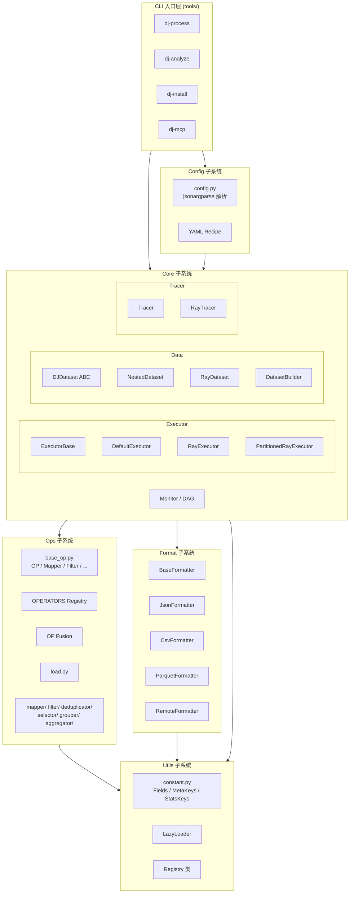
```mermaid
graph TB
    subgraph CLI["CLI 入口层 (tools/)"]
        process[dj-process]
        analyze[dj-analyze]
        install[dj-install]
        mcp[dj-mcp]
    end

    subgraph Config["Config 子系统"]
        cfg[config.py<br/>jsonargparse 解析]
        yaml[YAML Recipe]
    end

    subgraph Core["Core 子系统"]
        subgraph Executor
            base_exec[ExecutorBase]
            default_exec[DefaultExecutor]
            ray_exec[RayExecutor]
            part_exec[PartitionedRayExecutor]
        end
        subgraph Data
            dj_dataset[DJDataset ABC]
            nested[NestedDataset]
            ray_ds[RayDataset]
            builder[DatasetBuilder]
        end
        subgraph Tracer
            local_tracer[Tracer]
            ray_tracer[RayTracer]
        end
        monitor[Monitor / DAG]
    end

    subgraph Ops["Ops 子系统"]
        base_op[base_op.py<br/>OP / Mapper / Filter / ...]
        registry[OPERATORS Registry]
        fusion[OP Fusion]
        load_ops[load.py]
        op_types[mapper/ filter/ deduplicator/<br/>selector/ grouper/ aggregator/]
    end

    subgraph Format["Format 子系统"]
        formatter[BaseFormatter]
        json_fmt[JsonFormatter]
        csv_fmt[CsvFormatter]
        parquet_fmt[ParquetFormatter]
        remote_fmt[RemoteFormatter]
    end

    subgraph Utils["Utils 子系统"]
        constants[constant.py<br/>Fields / MetaKeys / StatsKeys]
        lazy[LazyLoader]
        reg_cls[Registry 类]
    end

    CLI --> Config
    CLI --> Core
    Config --> Core
    Core --> Ops
    Core --> Format
    Ops --> Utils
    Format --> Utils
    Core --> Utils
```

**为什么这样分层？**

| 设计决策 | 理由 |
|---------|------|
| Config 独立于 Core | 解析 YAML 不依赖任何执行引擎，便于静态验证和 IDE 支持 |
| Ops 不知道执行后端 | 算子只实现 `process_single`，由 Executor 决定用 HF `.map()` 还是 Ray `map_batches()` |
| Format 抽象数据源 | JSON / CSV / Parquet / S3 / HuggingFace Hub 统一加载为 `NestedDataset` |
| Utils 底层无依赖 | Registry、常量、LazyLoader 被所有层复用 |

**优点**：层次清晰，算子可独立开发和测试，新增数据格式或执行后端不影响算子代码。

**缺点**：存在跨层泄漏 — 例如 `base_op.py` 中有 `is_ray_mode()` 的判断，Config 系统通过 `update_op_attr()` 直接修改算子实例属性。

---

### 2.2 Registry 系统

#### Registry 类实现

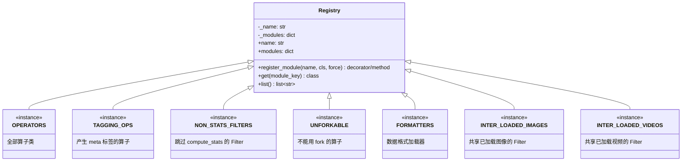
```mermaid
classDiagram
    class Registry {
        -_name: str
        -_modules: dict
        +name: str
        +modules: dict
        +register_module(name, cls, force) decorator/method
        +get(module_key) class
        +list() list~str~
    }

    class OPERATORS {
        <<instance>>
        全部算子类
    }
    class TAGGING_OPS {
        <<instance>>
        产生 meta 标签的算子
    }
    class NON_STATS_FILTERS {
        <<instance>>
        跳过 compute_stats 的 Filter
    }
    class UNFORKABLE {
        <<instance>>
        不能用 fork 的算子
    }
    class FORMATTERS {
        <<instance>>
        数据格式加载器
    }
    class INTER_LOADED_IMAGES {
        <<instance>>
        共享已加载图像的 Filter
    }
    class INTER_LOADED_VIDEOS {
        <<instance>>
        共享已加载视频的 Filter
    }

    Registry <|-- OPERATORS
    Registry <|-- TAGGING_OPS
    Registry <|-- NON_STATS_FILTERS
    Registry <|-- UNFORKABLE
    Registry <|-- FORMATTERS
    Registry <|-- INTER_LOADED_IMAGES
    Registry <|-- INTER_LOADED_VIDEOS
```

#### 注册机制

算子通过装饰器自注册：

```python
@OPERATORS.register_module("text_length_filter")
@INTER_WORDS.register_module("text_length_filter")
class TextLengthFilter(Filter):
    ...
```

`register_module` 的关键副作用：**设置 `module_cls._name = module_name`**，使每个算子类知道自己的注册名。这个名字在 YAML 配置、日志、缓存指纹中都会用到。

#### 设计分析

| 维度 | 评价 |
|------|------|
| **模式** | Service Locator / Plugin 模式 |
| **优点** | 零成本扩展 — 新建 `.py` 文件 + 装饰器即可注册；YAML 通过字符串名引用算子 |
| **缺点** | 导入时副作用 — 所有算子模块必须在使用前被 import（由 `ops/__init__.py` 完成）；无命名空间隔离 — 全局字符串名冲突时仅在 `force=False` 时抛异常 |
| **坑** | 重名算子静默覆盖（若 `force=True`）；自定义算子路径 `custom_operators` 的加载时机在 `load_ops()` 之前，但在 Registry 校验之后 |

---

### 2.3 Operator 类体系

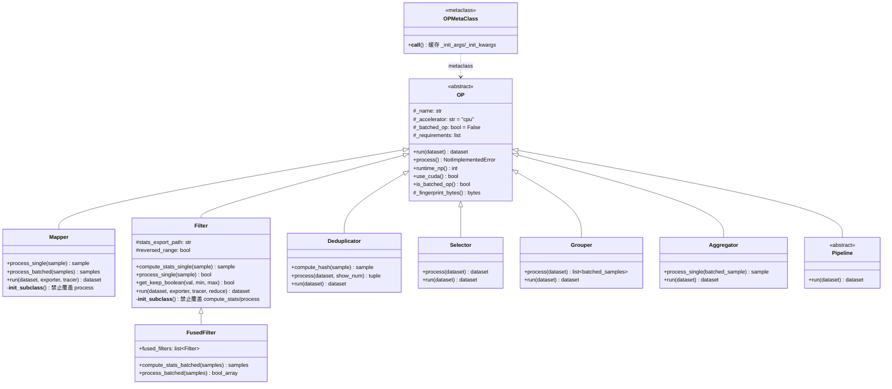
```mermaid
classDiagram
    class OPMetaClass {
        <<metaclass>>
        +__call__() 缓存 _init_args/_init_kwargs
    }

    class OP {
        <<abstract>>
        #_name: str
        #_accelerator: str = "cpu"
        #_batched_op: bool = False
        #_requirements: list
        +run(dataset) dataset
        +process() NotImplementedError
        +runtime_np() int
        +use_cuda() bool
        +is_batched_op() bool
        #_fingerprint_bytes() bytes
    }

    class Mapper {
        +process_single(sample) sample
        +process_batched(samples) samples
        +run(dataset, exporter, tracer) dataset
        -__init_subclass__() 禁止覆盖 process
    }

    class Filter {
        +compute_stats_single(sample) sample
        +process_single(sample) bool
        +get_keep_boolean(val, min, max) bool
        +run(dataset, exporter, tracer, reduce) dataset
        -__init_subclass__() 禁止覆盖 compute_stats/process
        #stats_export_path: str
        #reversed_range: bool
    }

    class Deduplicator {
        +compute_hash(sample) sample
        +process(dataset, show_num) tuple
        +run(dataset) dataset
    }

    class Selector {
        +process(dataset) dataset
        +run(dataset) dataset
    }

    class Grouper {
        +process(dataset) list~batched_samples~
        +run(dataset) dataset
    }

    class Aggregator {
        +process_single(batched_sample) sample
        +run(dataset) dataset
    }

    class Pipeline {
        <<abstract>>
        +run(dataset) dataset
    }

    class FusedFilter {
        +fused_filters: list~Filter~
        +compute_stats_batched(samples) samples
        +process_batched(samples) bool_array
    }

    OPMetaClass ..> OP : metaclass
    OP <|-- Mapper
    OP <|-- Filter
    OP <|-- Deduplicator
    OP <|-- Selector
    OP <|-- Grouper
    OP <|-- Aggregator
    OP <|-- Pipeline
    Filter <|-- FusedFilter
```

#### 关键设计决策

**1. Template Method 模式 — `run()` 方法**

每个子类的 `run()` 首先调用 `super().run(dataset)` 完成通用初始化：

```
OP.run(dataset):
    1. 将 dataset 包装为 NestedDataset（如果还不是的话）
    2. 若算子在 TAGGING_OPS 中 → 添加 Fields.meta 列
    3. 若算子是 Filter 且不在 NON_STATS_FILTERS 中 → 添加 Fields.stats 列
    4. 若配置了 index_key → 添加索引列
```

然后子类执行自身逻辑（如 Mapper 调 `dataset.map()`，Filter 调 `dataset.map()` + `dataset.filter()`）。

**2. `__init_subclass__` 约束 — 封印 `process()`**

`Mapper.__init_subclass__()` 检查子类是否重写了 `process` 方法，若是则**抛出异常**：

> 子类必须实现 `process_single` 或 `process_batched`，不得直接覆盖 `process`。

这是因为基类在 `__init__` 中会将 `self.process` 替换为 `catch_map_single_exception(self.process_single)` — 如果子类覆盖了 `process`，这个错误处理包装就会被跳过。

**3. 构造时方法替换**

`Mapper.__init__` 中：

```python
if self.is_batched_op():
    self.process = catch_map_batches_exception(self.process_batched, ...)
else:
    self.process = catch_map_single_exception(self.process_single, ...)
```

`OP.__init__` 中，`process`、`compute_stats`、`compute_hash` 三个方法都被 `wrap_func_with_nested_access` 包装，使得样本中的嵌套字段可以通过点号路径（如 `sample["meta.camera"]`）访问。

#### 设计分析

| 优点 | 缺点 |
|------|------|
| 强制算子遵守统一契约，保证错误处理和追踪一致性 | `__init_subclass__` 约束可能让不了解框架的开发者困惑 |
| 构造时方法替换实现了关注点分离（算子代码不需要处理错误/追踪） | `**kwargs` 贯穿整个 `OP.__init__`，IDE 无法提供参数补全 |
| `_batched_op` 标志统一了单样本和批量处理的调度 | 方法替换在调试时难以追踪调用栈 |

---

### 2.4 OPMetaClass 与 Actor 重建机制

`OPMetaClass` 是所有算子的元类，其核心作用是**缓存构造参数**：

```python
class OPMetaClass(ABCMeta):
    def __call__(cls, *args, **kwargs):
        instance = super().__call__(*args, **kwargs)
        instance._init_args = args
        instance._init_kwargs = kwargs
        return instance
```

**为什么需要这样做？**

在 Ray 分布式模式下，算子以 **Actor** 身份运行在远程节点上。Ray 需要能够在新节点上重建 Actor — 这要求知道原始构造参数。`OPMetaClass` 在每次实例化时自动保存这些参数，Ray 可以通过 `cls(*instance._init_args, **instance._init_kwargs)` 重建。

**潜在陷阱**：如果算子在 `__init__` 中**修改了传入的参数**（例如将相对路径转为绝对路径），那么 `_init_kwargs` 中保存的是修改前的值。Ray 重建时会使用原始值，可能导致路径解析失败。

---

### 2.5 数据模型

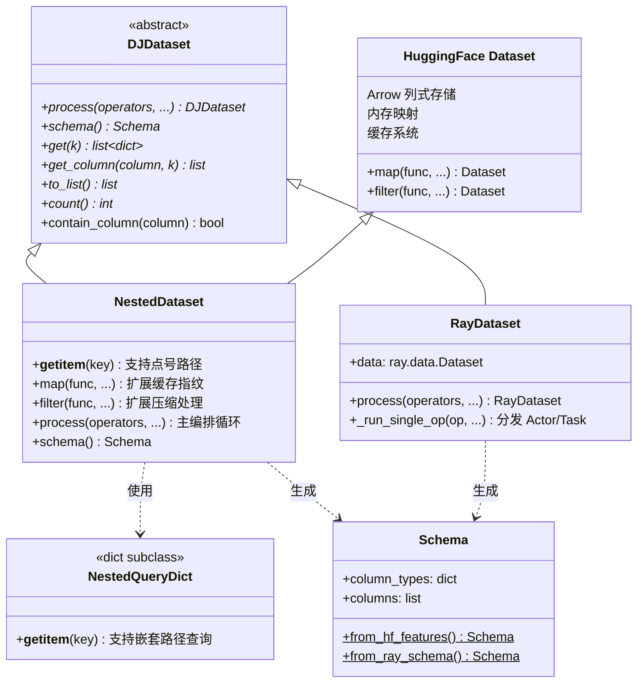
```mermaid
classDiagram
    class DJDataset {
        <<abstract>>
        +process(operators, ...)* DJDataset
        +schema()* Schema
        +get(k)* list~dict~
        +get_column(column, k)* list
        +to_list()* list
        +count()* int
        +contain_column(column) bool
    }

    class HFDataset["HuggingFace Dataset"] {
        Arrow 列式存储
        内存映射
        缓存系统
        +map(func, ...) Dataset
        +filter(func, ...) Dataset
    }

    class NestedDataset {
        +__getitem__(key) 支持点号路径
        +map(func, ...) 扩展缓存指纹
        +filter(func, ...) 扩展压缩处理
        +process(operators, ...) 主编排循环
        +schema() Schema
    }

    class RayDataset {
        +data: ray.data.Dataset
        +process(operators, ...) RayDataset
        +_run_single_op(op, ...) 分发 Actor/Task
    }

    class NestedQueryDict {
        <<dict subclass>>
        +__getitem__(key) 支持嵌套路径查询
    }

    class Schema {
        +column_types: dict
        +columns: list
        +from_hf_features()$ Schema
        +from_ray_schema()$ Schema
    }

    DJDataset <|-- NestedDataset
    HFDataset <|-- NestedDataset
    DJDataset <|-- RayDataset
    NestedDataset ..> NestedQueryDict : 使用
    NestedDataset ..> Schema : 生成
    RayDataset ..> Schema : 生成
```

#### 核心设计：多继承

`NestedDataset` 同时继承自 HuggingFace `Dataset` 和抽象基类 `DJDataset`：

- 从 `Dataset` 获得：Arrow 列式存储、内存映射、自动缓存、`.map()` / `.filter()` / `.select()` 等方法
- 从 `DJDataset` 获得：`process(operators)` 编排接口、`schema()` / `count()` 等标准化访问方法

**嵌套访问机制**：`NestedQueryDict` 和 `nested_query()` 函数支持点号路径访问嵌套字段。例如 `sample["__dj__meta__.camera_calibration.intrinsics"]` 可以逐层解析到 `sample["__dj__meta__"]["camera_calibration"]["intrinsics"]`。`wrap_func_with_nested_access()` 在 `OP.__init__` 中将所有处理方法包装，使样本自动转换为 `NestedQueryDict`。

#### `NestedDataset.process()` — 核心编排循环

```python
def process(self, operators, *, work_dir, exporter, checkpointer, tracer, adapter, open_monitor):
    for op in operators:
        # 1. 设置多进程上下文（CUDA 算子用 forkserver/spawn）
        mp_context = ["forkserver", "spawn"] if (op.use_cuda() or op._name in UNFORKABLE) else None
        setup_mp(mp_context)
        
        # 2. 执行算子（可选 Monitor 包装）
        if open_monitor:
            dataset = Monitor.monitor_func(op.run, args=(dataset,), kwargs={...})
        else:
            dataset = op.run(dataset=dataset, exporter=exporter, tracer=tracer)
        
        # 3. 记录检查点
        if checkpointer:
            checkpointer.record(op._op_cfg)
        
        # 4. 可选：洞察挖掘
        if adapter and enable_insight_mining:
            adapter.analyze_small_batch(dataset, f"{idx}_{op._name}")
```

**为什么编排在 `NestedDataset` 中而不是在 Executor 中？** 这样同一个算子管线可以在不同的 Dataset 实现（HF vs Ray）上运行，Executor 只负责加载数据和导出结果。

#### 设计分析

| 优点 | 缺点 |
|------|------|
| 复用 HF Dataset 的 Arrow 存储、内存映射和缓存生态 | 多继承脆弱 — HF Dataset 内部 API 变更可能破坏 NestedDataset |
| 嵌套访问让算子代码简洁（无需手动层层解包） | `NestedQueryDict` 在每次字段访问时增加开销 |
| 编排循环与执行后端解耦 | `process()` 方法既在 NestedDataset 又在 RayDataset 中实现，逻辑有重复 |

---

### 2.6 Config 系统

Config 系统基于 `jsonargparse`，核心特性是**动态参数注入**：

```
init_configs() 流程：
1. build_base_parser()          → 创建全局参数解析器（project_name, executor_type, dataset_path, ...）
2. 首轮解析                      → 提取 --config 路径和 process 列表
3. 遍历 process 列表中的算子名   → OPERATORS.modules[name] 获取算子类
4. parser.add_class_arguments()  → 从算子类 __init__ 签名动态添加参数
5. 完整解析                      → 合并 YAML + CLI + 环境变量 + 默认值
6. init_setup_from_cfg()         → 创建目录、设置日志、传播全局属性到算子
```

**关键函数 `update_op_attr()`**：将全局属性（`text_key`、`skip_op_error`、`turbo`、`work_dir` 等）注入每个算子的配置字典，但不覆盖已显式设置的值。

**为什么使用 jsonargparse？**
- 支持从 Python 类签名自动生成参数 schema — 新增算子无需手动更新配置模板
- 支持类型校验（`PositiveInt`、`ClosedUnitInterval` 等）
- 支持 `{work_dir}` 等占位符替换

**坑**：算子 `__init__` 使用 `**kwargs` 接收大量参数，配置中的拼写错误会被 `**kwargs` 静默吞掉而非报错。

---

### 2.7 Executor 体系

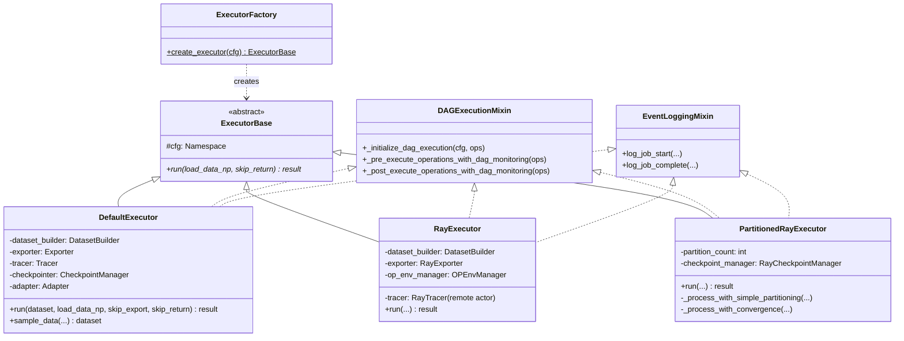
```mermaid
classDiagram
    class ExecutorBase {
        <<abstract>>
        #cfg: Namespace
        +run(load_data_np, skip_return)* result
    }

    class DAGExecutionMixin {
        +_initialize_dag_execution(cfg, ops)
        +_pre_execute_operations_with_dag_monitoring(ops)
        +_post_execute_operations_with_dag_monitoring(ops)
    }

    class EventLoggingMixin {
        +log_job_start(...)
        +log_job_complete(...)
    }

    class DefaultExecutor {
        -dataset_builder: DatasetBuilder
        -exporter: Exporter
        -tracer: Tracer
        -checkpointer: CheckpointManager
        -adapter: Adapter
        +run(dataset, load_data_np, skip_export, skip_return) result
        +sample_data(...) dataset
    }

    class RayExecutor {
        -dataset_builder: DatasetBuilder
        -exporter: RayExporter
        -tracer: RayTracer (remote actor)
        -op_env_manager: OPEnvManager
        +run(...) result
    }

    class PartitionedRayExecutor {
        -partition_count: int
        -checkpoint_manager: RayCheckpointManager
        +run(...) result
        -_process_with_simple_partitioning(...)
        -_process_with_convergence(...)
    }

    class ExecutorFactory {
        +create_executor(cfg)$ ExecutorBase
    }

    ExecutorBase <|-- DefaultExecutor
    ExecutorBase <|-- RayExecutor
    ExecutorBase <|-- PartitionedRayExecutor
    DAGExecutionMixin <|.. DefaultExecutor
    DAGExecutionMixin <|.. RayExecutor
    DAGExecutionMixin <|.. PartitionedRayExecutor
    EventLoggingMixin <|.. DefaultExecutor
    EventLoggingMixin <|.. RayExecutor
    EventLoggingMixin <|.. PartitionedRayExecutor
    ExecutorFactory ..> ExecutorBase : creates
```

| Executor 类型 | 适用场景 | 数据集类型 | 并行机制 |
|-------------|---------|----------|---------|
| `DefaultExecutor` | 单机 / 小数据 | `NestedDataset` | HF Dataset `.map()` 多进程 |
| `RayExecutor` | 分布式集群 | `RayDataset` | Ray `map_batches()` + ActorPool |
| `PartitionedRayExecutor` | 大规模 + 容错 | `RayDataset` | 分区并行 + 检查点恢复 |

**Strategy 模式**：`ExecutorFactory` 根据 `cfg.executor_type` 字符串选择具体实现。三种 Executor 共享相同的算子管线但执行策略不同。

**Mixin 组合**：`DAGExecutionMixin` 提供可观测性（DAG 状态追踪），`EventLoggingMixin` 提供 JSONL 事件日志。这两个 Mixin 是**旁路关注点**，不影响主执行逻辑。

---

### 2.8 Format 加载器体系

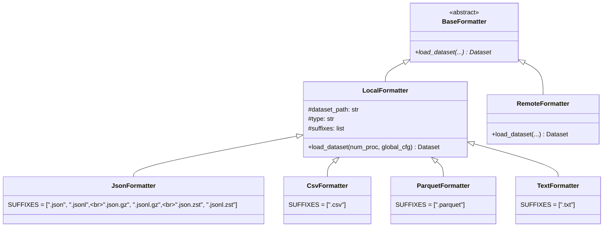
```mermaid
classDiagram
    class BaseFormatter {
        <<abstract>>
        +load_dataset(...)* Dataset
    }

    class LocalFormatter {
        #dataset_path: str
        #type: str
        #suffixes: list
        +load_dataset(num_proc, global_cfg) Dataset
    }

    class RemoteFormatter {
        +load_dataset(...) Dataset
    }

    class JsonFormatter {
        SUFFIXES = [".json", ".jsonl",<br/>".json.gz", ".jsonl.gz",<br/>".json.zst", ".jsonl.zst"]
    }
    class CsvFormatter {
        SUFFIXES = [".csv"]
    }
    class ParquetFormatter {
        SUFFIXES = [".parquet"]
    }
    class TextFormatter {
        SUFFIXES = [".txt"]
    }

    BaseFormatter <|-- LocalFormatter
    BaseFormatter <|-- RemoteFormatter
    LocalFormatter <|-- JsonFormatter
    LocalFormatter <|-- CsvFormatter
    LocalFormatter <|-- ParquetFormatter
    LocalFormatter <|-- TextFormatter
```

`load_formatter()` 函数扫描数据路径，按文件扩展名匹配 `FORMATTERS` 注册表中的格式化器，选择匹配文件数最多的格式化器。加载后统一调用 `unify_format()` 进行数据清洗（过滤空文本、转换相对路径为绝对路径）。

**坑**：`DatasetBuilder` 是后来引入的加载抽象，与 `Formatter` 体系有功能重叠。`DatasetBuilder` 提供了 `DataLoadStrategy` 注册表（支持 S3、HuggingFace Hub 等），而 `Formatter` 仍用于本地文件的具体加载。两套抽象共存增加了维护成本。

---

### 2.9 LazyLoader: Virtual Proxy 模式

`LazyLoader` 继承自 `types.ModuleType`，伪装成真实模块，在首次属性访问时才执行实际导入：

```python
# 模块级声明（导入时不会加载 scipy）
scipy_interpolate = LazyLoader("scipy.interpolate", "scipy")

# 首次使用时触发真正的 import + 自动安装
result = scipy_interpolate.interp1d(x, y)
```

**实现机制**：

1. `__init__` 捕获调用者的 `globals()` 引用（通过 `inspect.currentframe().f_back`）
2. `__getattr__` 触发 `_load()` — 尝试 `importlib.import_module()`
3. 若 `ImportError` 且 `auto_install=True` → 使用 `uv`（优先）或 `pip` 安装
4. 导入成功后更新调用者的 `globals()`，将 `LazyLoader` 替换为真实模块

**为什么使用 LazyLoader？** Data-Juicer 有 240+ 算子，依赖包括 PyTorch、TensorFlow、OpenCV、scipy、各种 SLAM 库等。全部预导入会使启动极慢（>30s）且要求所有依赖都已安装。LazyLoader 实现了**按需加载**和**自动安装**。

| 优点 | 缺点 |
|------|------|
| 启动时间最小化（仅加载使用到的算子的依赖） | 导入错误延迟到运行时，调试时才发现 |
| 自动安装减少用户手动配置 | 生产环境中自动安装可能不安全/不可控 |
| `_parent_module_globals` 使替换对调用者透明 | 若 LazyLoader 在不同作用域创建和使用，全局变量替换会失效 |

---

### 2.10 常量系统

#### Fields — 数据集列名

| 常量 | 值 | 用途 |
|------|---|------|
| `Fields.stats` | `"__dj__stats__"` | Filter 存放计算指标的字典列 |
| `Fields.meta` | `"__dj__meta__"` | 标签算子存放结构化元数据的字典列 |
| `Fields.context` | `"__dj__context__"` | OP Fusion 共享中间变量的字典列 |
| `Fields.batch_meta` | `"__dj__batch_meta__"` | Grouper/Aggregator 批量元数据列 |
| `Fields.suffix` | `"__dj__suffix__"` | 数据文件后缀列 |

#### MetaKeys — 算子间数据契约

`MetaKeys` 定义了 `Fields.meta` 字典中的标准键名。对于 VLA 管线，关键 MetaKeys 包括：

| MetaKey | 写入方 | 读取方 |
|---------|--------|--------|
| `video_frames` | VideoExtractFramesMapper | MoGe, HaWoR, MegaSaM, Overlay, Export |
| `camera_calibration_moge_tags` | MoGe Mapper | HaWoR, MegaSaM |
| `hand_reconstruction_hawor_tags` | HaWoR Mapper | ActionCompute, ClipReassembly |
| `video_camera_pose_tags` | MegaSaM Mapper | ActionCompute, ClipReassembly, Overlay |
| `hand_action_tags` | ActionCompute Mapper | Smooth, ClipReassembly, AtomicSegment, Export |
| `atomic_action_segments` | AtomicSegment Mapper | Export |

#### StatsKeys — 带访问追踪的元类

`StatsKeys` 使用自定义元类 `StatsKeysMeta`，其 `__getattr__` 方法通过 `inspect.currentframe().f_back` 追踪访问者信息。当 `TextLengthFilter` 访问 `StatsKeys.text_len` 时，元类记录下 `{"text_length_filter": {"text_len"}}`。这一追踪数据是 **OP Fusion 的基础** — 系统据此判断哪些 Filter 共享哪些统计量。

**坑**：`inspect.currentframe().f_back` 对调用深度敏感。若统计量在装饰器或闭包中被间接访问，追踪到的调用者可能不正确。

#### CameraCalibrationKeys — VLA 专用

定义相机标定相关的键名：`intrinsics`、`hfov`、`vfov`、`depth`、`cam_c2w`、`dist_coeffs` 等。这些键在多个 VLA 算子之间共享，构成了标定数据的标准化接口。

---

### 2.11 OP Fusion 系统

OP Fusion 将共享中间变量的连续 Filter 合并为一个 `FusedFilter`，避免重复加载图像/视频/音频。

#### 融合过程

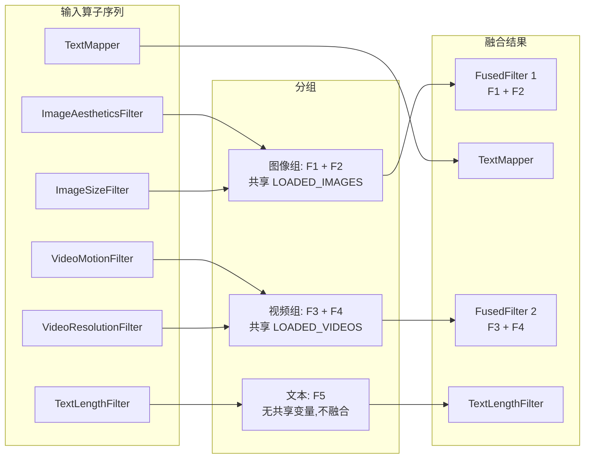
```mermaid
flowchart LR
    subgraph 输入算子序列
        F1[ImageAestheticsFilter]
        F2[ImageSizeFilter]
        M1[TextMapper]
        F3[VideoMotionFilter]
        F4[VideoResolutionFilter]
        F5[TextLengthFilter]
    end

    subgraph 分组
        G1[图像组: F1 + F2<br/>共享 LOADED_IMAGES]
        G2[视频组: F3 + F4<br/>共享 LOADED_VIDEOS]
        G3[文本: F5<br/>无共享变量,不融合]
    end

    subgraph 融合结果
        FF1[FusedFilter 1<br/>F1 + F2]
        M1out[TextMapper]
        FF2[FusedFilter 2<br/>F3 + F4]
        F5out[TextLengthFilter]
    end

    F1 & F2 --> G1 --> FF1
    M1 --> M1out
    F3 & F4 --> G2 --> FF2
    F5 --> G3 --> F5out
```

**融合策略**：
- **greedy**（默认）：保持原始顺序，仅合并相邻且共享变量的 Filter
- **probe**：先在小批量数据上探测各 Filter 速度，然后在可交换约束下将快速 Filter 排在前面

#### FusedFilter 运行时行为

`FusedFilter.compute_stats_batched()` 创建 `Fields.context` 字典，所有融合的 Filter 通过 `context=True` 参数共享中间数据。第一个需要加载图像的 Filter 将图像放入 context，后续 Filter 直接复用。

`FusedFilter.process_batched()` 对所有 Filter 的判定结果做 `np.logical_and` — 样本必须通过所有 Filter 才被保留。

**坑**：融合假设 Filter 之间没有顺序依赖（即 F1 的 stats 不影响 F2 的 stats）。如果两个 Filter 都写入同一个 `StatsKeys` 字段，融合后的行为可能与未融合不同。

---

## 3. 动态架构分析

### 3.1 系统启动与初始化流程

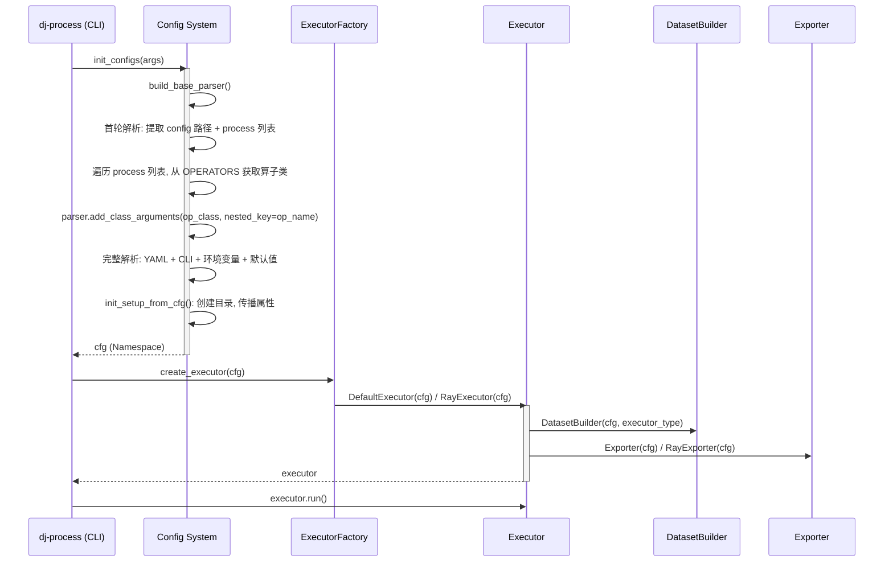
```mermaid
sequenceDiagram
    participant CLI as dj-process (CLI)
    participant Cfg as Config System
    participant Fac as ExecutorFactory
    participant Exe as Executor
    participant Bld as DatasetBuilder
    participant Exp as Exporter

    CLI->>Cfg: init_configs(args)
    activate Cfg
    Cfg->>Cfg: build_base_parser()
    Cfg->>Cfg: 首轮解析: 提取 config 路径 + process 列表
    Cfg->>Cfg: 遍历 process 列表, 从 OPERATORS 获取算子类
    Cfg->>Cfg: parser.add_class_arguments(op_class, nested_key=op_name)
    Cfg->>Cfg: 完整解析: YAML + CLI + 环境变量 + 默认值
    Cfg->>Cfg: init_setup_from_cfg(): 创建目录, 传播属性
    Cfg-->>CLI: cfg (Namespace)
    deactivate Cfg

    CLI->>Fac: create_executor(cfg)
    Fac->>Exe: DefaultExecutor(cfg) / RayExecutor(cfg)
    activate Exe
    Exe->>Bld: DatasetBuilder(cfg, executor_type)
    Exe->>Exp: Exporter(cfg) / RayExporter(cfg)
    Exe-->>CLI: executor
    deactivate Exe

    CLI->>Exe: executor.run()
```

`init_configs()` 的**两轮解析**设计是必要的：第一轮提取 `process` 列表以确定使用了哪些算子，第二轮才能将这些算子的参数动态加入解析器。这意味着 YAML 中的算子参数**不能引用全局参数**（如 `{work_dir}`），因为全局参数在第二轮才完全解析。实际上 `init_setup_from_cfg()` 在解析后通过 `update_op_attr()` 显式传播全局属性来解决这个问题。

---

### 3.2 DefaultExecutor.run() 主流程

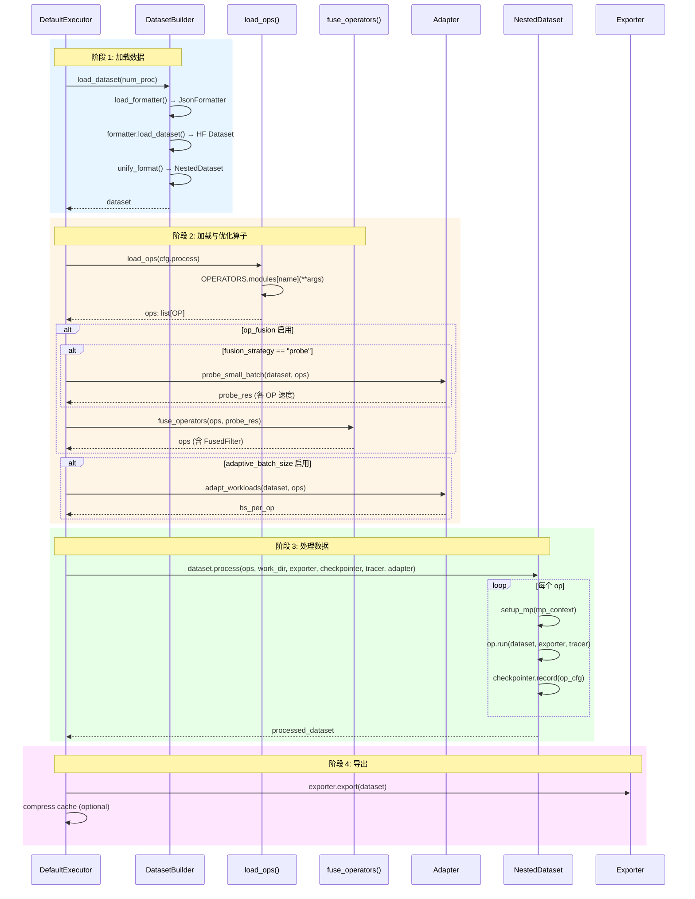
```mermaid
sequenceDiagram
    participant Exe as DefaultExecutor
    participant Bld as DatasetBuilder
    participant Ld as load_ops()
    participant Fus as fuse_operators()
    participant Ada as Adapter
    participant DS as NestedDataset
    participant Exp as Exporter

    rect rgb(230, 245, 255)
    Note over Exe,Bld: 阶段 1: 加载数据
    Exe->>Bld: load_dataset(num_proc)
    Bld->>Bld: load_formatter() → JsonFormatter
    Bld->>Bld: formatter.load_dataset() → HF Dataset
    Bld->>Bld: unify_format() → NestedDataset
    Bld-->>Exe: dataset
    end

    rect rgb(255, 245, 230)
    Note over Exe,Fus: 阶段 2: 加载与优化算子
    Exe->>Ld: load_ops(cfg.process)
    Ld->>Ld: OPERATORS.modules[name](**args)
    Ld-->>Exe: ops: list[OP]
    
    alt op_fusion 启用
        alt fusion_strategy == "probe"
            Exe->>Ada: probe_small_batch(dataset, ops)
            Ada-->>Exe: probe_res (各 OP 速度)
        end
        Exe->>Fus: fuse_operators(ops, probe_res)
        Fus-->>Exe: ops (含 FusedFilter)
    end
    
    alt adaptive_batch_size 启用
        Exe->>Ada: adapt_workloads(dataset, ops)
        Ada-->>Exe: bs_per_op
    end
    end

    rect rgb(230, 255, 230)
    Note over Exe,DS: 阶段 3: 处理数据
    Exe->>DS: dataset.process(ops, work_dir, exporter, checkpointer, tracer, adapter)
    loop 每个 op
        DS->>DS: setup_mp(mp_context)
        DS->>DS: op.run(dataset, exporter, tracer)
        DS->>DS: checkpointer.record(op_cfg)
    end
    DS-->>Exe: processed_dataset
    end

    rect rgb(255, 230, 255)
    Note over Exe,Exp: 阶段 4: 导出
    Exe->>Exp: exporter.export(dataset)
    Exe->>Exe: compress cache (optional)
    end
```

**四阶段设计的理由**：

1. **加载**与**处理**分离 → 支持检查点恢复（跳过加载，直接从检查点恢复 dataset）
2. **优化**阶段独立 → OP Fusion 和自适应批大小是**语义透明**的优化，不改变结果
3. **导出**独立 → 支持 `skip_export` 模式（用于测试或流式处理）

---

### 3.3 NestedDataset.process() 执行循环

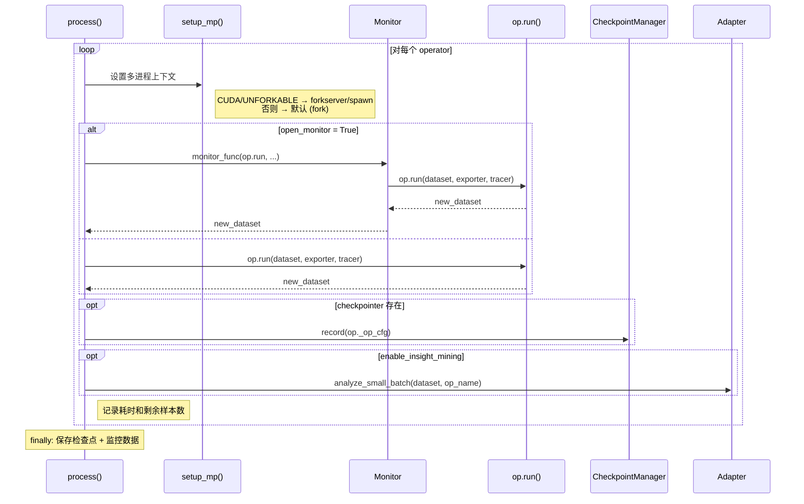
```mermaid
sequenceDiagram
    participant Proc as process()
    participant MP as setup_mp()
    participant Mon as Monitor
    participant OP as op.run()
    participant CKP as CheckpointManager
    participant Ada as Adapter

    loop 对每个 operator
        Proc->>MP: 设置多进程上下文
        Note right of MP: CUDA/UNFORKABLE → forkserver/spawn<br/>否则 → 默认 (fork)
        
        alt open_monitor = True
            Proc->>Mon: monitor_func(op.run, ...)
            Mon->>OP: op.run(dataset, exporter, tracer)
            OP-->>Mon: new_dataset
            Mon-->>Proc: new_dataset
        else
            Proc->>OP: op.run(dataset, exporter, tracer)
            OP-->>Proc: new_dataset
        end

        opt checkpointer 存在
            Proc->>CKP: record(op._op_cfg)
        end

        opt enable_insight_mining
            Proc->>Ada: analyze_small_batch(dataset, op_name)
        end

        Note right of Proc: 记录耗时和剩余样本数
    end

    Note over Proc: finally: 保存检查点 + 监控数据
```

**关键细节**：
- `setup_mp()` 在每个算子前执行，确保 CUDA 算子使用 `forkserver` 或 `spawn`（避免 CUDA context 在 fork 后失效）
- `finally` 块确保即使异常退出，检查点和监控数据也会被保存
- `dataset` 变量在每次 `op.run()` 后被**重新赋值** — 每个算子返回一个新的 dataset 引用

---

### 3.4 Mapper 调用流程

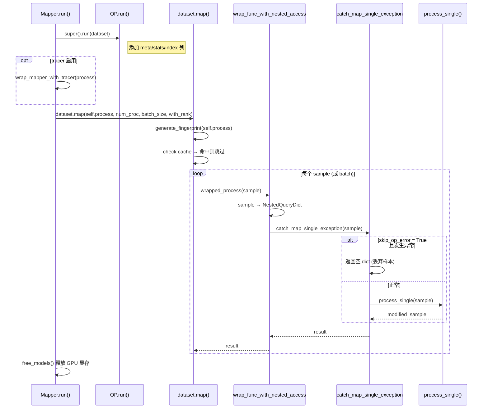
```mermaid
sequenceDiagram
    participant Run as Mapper.run()
    participant Super as OP.run()
    participant Map as dataset.map()
    participant Wrap as wrap_func_with_nested_access
    participant Catch as catch_map_single_exception
    participant User as process_single()

    Run->>Super: super().run(dataset)
    Note right of Super: 添加 meta/stats/index 列

    opt tracer 启用
        Run->>Run: wrap_mapper_with_tracer(process)
    end

    Run->>Map: dataset.map(self.process, num_proc, batch_size, with_rank)
    
    Map->>Map: generate_fingerprint(self.process)
    Map->>Map: check cache → 命中则跳过
    
    loop 每个 sample (或 batch)
        Map->>Wrap: wrapped_process(sample)
        Wrap->>Wrap: sample → NestedQueryDict
        Wrap->>Catch: catch_map_single_exception(sample)
        
        alt skip_op_error = True 且发生异常
            Catch->>Catch: 返回空 dict (丢弃样本)
        else 正常
            Catch->>User: process_single(sample)
            User-->>Catch: modified_sample
        end
        
        Catch-->>Wrap: result
        Wrap-->>Map: result
    end

    Run->>Run: free_models() 释放 GPU 显存
```

**装饰器包装顺序**（由内到外）：

```
用户实现: process_single(sample)
    ↑ 被 catch_map_single_exception 包装 (在 Mapper.__init__ 中)
    ↑ 被 wrap_func_with_nested_access 包装 (在 OP.__init__ 中)
    ↑ 被 wrap_mapper_with_tracer 包装 (在 Mapper.run() 中, 可选)
```

**为什么是这个顺序？**
- `nested_access` 最外层 — 确保所有后续处理都能用点号路径访问嵌套字段
- `error_handling` 在中间 — 捕获用户代码异常，决定跳过还是抛出
- `tracer` 最内层 — 只在正常处理后才记录变更（异常已被外层处理）

实际上 `OP.__init__` 先于 `Mapper.__init__` 执行（Python 构造顺序），所以 `nested_access` 先包装。然后 `Mapper.__init__` 将已包装的方法再用 `error_handling` 包装。`tracer` 在 `run()` 时按需添加。

---

### 3.5 Filter 两阶段调用流程

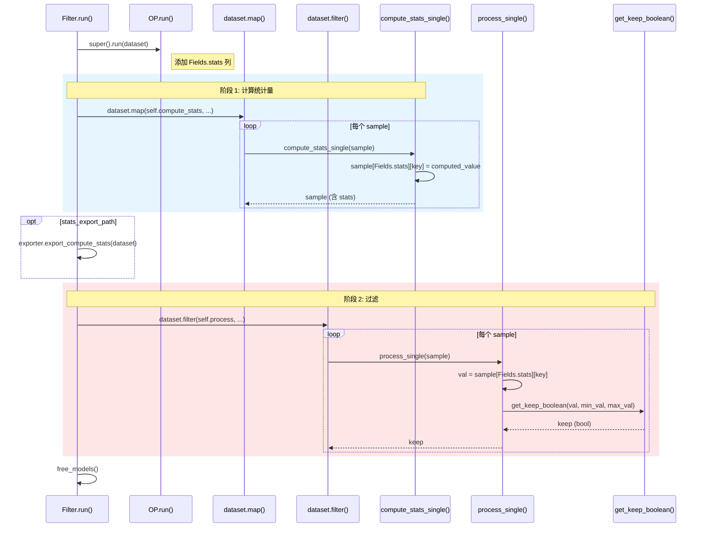
```mermaid
sequenceDiagram
    participant Run as Filter.run()
    participant Super as OP.run()
    participant Map as dataset.map()
    participant Filt as dataset.filter()
    participant CS as compute_stats_single()
    participant PS as process_single()
    participant GKB as get_keep_boolean()

    Run->>Super: super().run(dataset)
    Note right of Super: 添加 Fields.stats 列

    rect rgb(230, 245, 255)
    Note over Run,CS: 阶段 1: 计算统计量
    Run->>Map: dataset.map(self.compute_stats, ...)
    loop 每个 sample
        Map->>CS: compute_stats_single(sample)
        CS->>CS: sample[Fields.stats][key] = computed_value
        CS-->>Map: sample (含 stats)
    end
    end

    opt stats_export_path
        Run->>Run: exporter.export_compute_stats(dataset)
    end

    rect rgb(255, 230, 230)
    Note over Run,GKB: 阶段 2: 过滤
    Run->>Filt: dataset.filter(self.process, ...)
    loop 每个 sample
        Filt->>PS: process_single(sample)
        PS->>PS: val = sample[Fields.stats][key]
        PS->>GKB: get_keep_boolean(val, min_val, max_val)
        GKB-->>PS: keep (bool)
        PS-->>Filt: keep
    end
    end

    Run->>Run: free_models()
```

#### get_keep_boolean 逻辑

对于值 $v$，最小阈值 $v_{\min}$，最大阈值 $v_{\max}$：

$$
\text{keep} = \begin{cases}
v_{\min} \leq v \leq v_{\max} & \text{若 closed interval 且 reversed\_range = False} \\
v_{\min} < v < v_{\max} & \text{若 open interval 且 reversed\_range = False} \\
v < v_{\min} \lor v > v_{\max} & \text{若 reversed\_range = True（取区间外的值）}
\end{cases}
$$

`reversed_range` 的作用是**反转过滤条件** — 例如"保留文本长度不在 100-1000 之间的样本"。当 `reversed_range=True` 时，`__init__` 中区间开闭性也会被反转。

**为什么分两个阶段？**
1. **统计量可复用** — OP Fusion 可以让多个 Filter 共享同一次图像/视频加载的结果来计算各自的统计量
2. **统计量可导出** — `stats_export_path` 支持将统计量导出为 JSON，用于数据分析（`dj-analyze` 只运行阶段 1）
3. **统计量可缓存** — HF Dataset 的 `.map()` 缓存使得重复运行相同 Filter 时可以跳过阶段 1

---

### 3.6 Ray 执行路径

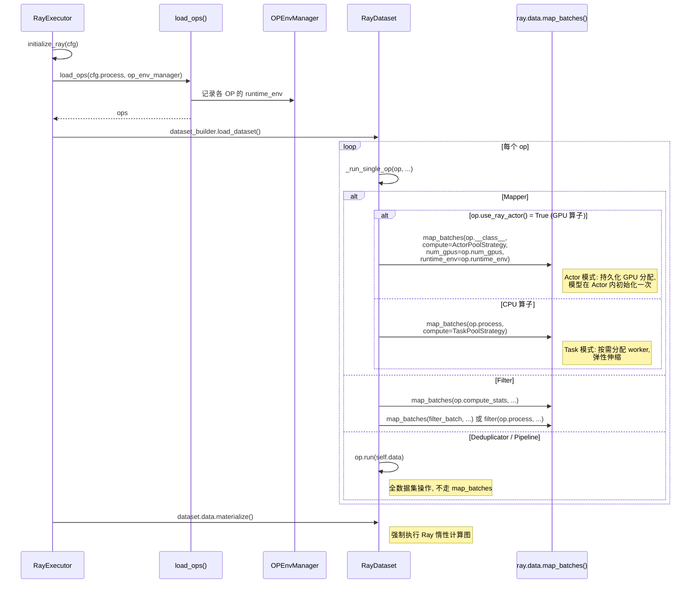
```mermaid
sequenceDiagram
    participant Exe as RayExecutor
    participant Ld as load_ops()
    participant Env as OPEnvManager
    participant RDS as RayDataset
    participant Ray as ray.data.map_batches()

    Exe->>Exe: initialize_ray(cfg)
    Exe->>Ld: load_ops(cfg.process, op_env_manager)
    Ld->>Env: 记录各 OP 的 runtime_env
    Ld-->>Exe: ops

    Exe->>RDS: dataset_builder.load_dataset()

    loop 每个 op
        RDS->>RDS: _run_single_op(op, ...)
        
        alt Mapper
            alt op.use_ray_actor() = True (GPU 算子)
                RDS->>Ray: map_batches(op.__class__,<br/>compute=ActorPoolStrategy,<br/>num_gpus=op.num_gpus,<br/>runtime_env=op.runtime_env)
                Note right of Ray: Actor 模式: 持久化 GPU 分配,<br/>模型在 Actor 内初始化一次
            else CPU 算子
                RDS->>Ray: map_batches(op.process,<br/>compute=TaskPoolStrategy)
                Note right of Ray: Task 模式: 按需分配 worker,<br/>弹性伸缩
            end
        else Filter
            RDS->>Ray: map_batches(op.compute_stats, ...)
            RDS->>Ray: map_batches(filter_batch, ...) 或 filter(op.process, ...)
        else Deduplicator / Pipeline
            RDS->>RDS: op.run(self.data)
            Note right of RDS: 全数据集操作, 不走 map_batches
        end
    end

    Exe->>RDS: dataset.data.materialize()
    Note right of RDS: 强制执行 Ray 惰性计算图
```

**Actor vs Task 模式的权衡**：

| 维度 | Actor 模式 | Task 模式 |
|------|-----------|-----------|
| 适用算子 | GPU 算子（需加载大模型） | CPU 算子（轻量计算） |
| 模型加载 | 初始化一次，复用 | 每个 Task 重新加载 |
| 资源分配 | 固定 GPU 分配 | 弹性分配 |
| 故障恢复 | Actor 重建（需 OPMetaClass 缓存的构造参数） | Task 自动重试 |

**runtime_env 隔离**：VLA 管线中的 `VideoCameraPoseMegaSaMMapper` 使用 `runtime_env: {"conda": "mega-sam"}`，使 Ray 在独立 conda 环境中启动 Actor。这是因为 MegaSaM 依赖的 DROID-SLAM CUDA 扩展与主环境的 PyTorch 版本冲突。

**容错回退**：如果带 `runtime_env` 的算子执行失败，`RayDataset._run_single_op()` 会尝试**不带 runtime_env 重新执行**，作为最后的回退。

---

### 3.7 Tracer 数据追踪机制

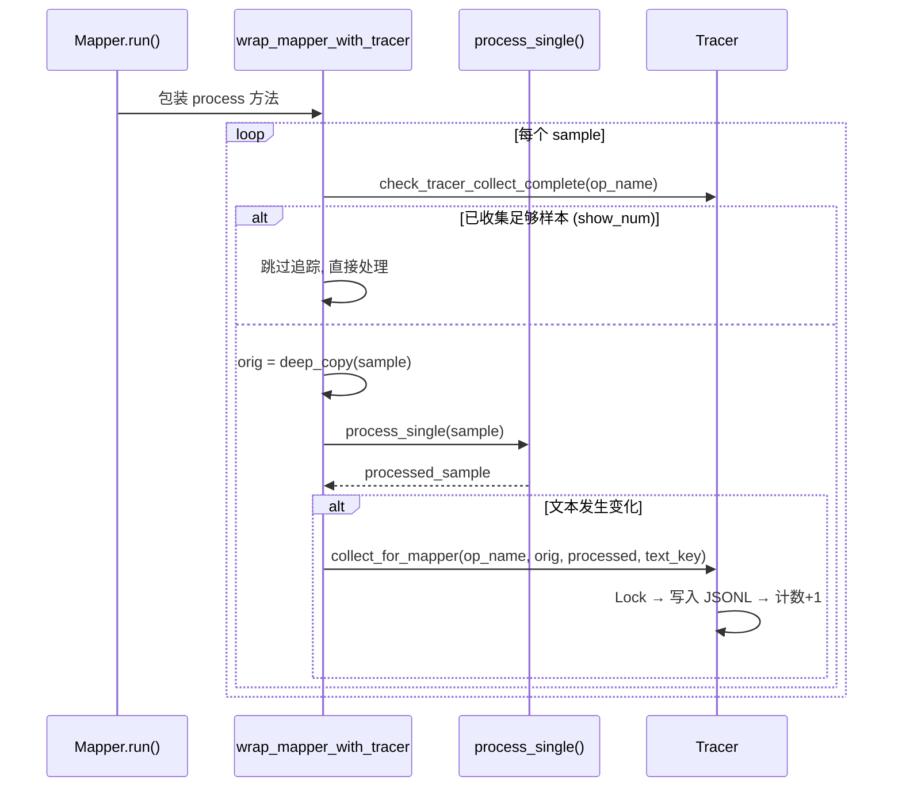
```mermaid
sequenceDiagram
    participant Run as Mapper.run()
    participant Wrap as wrap_mapper_with_tracer
    participant Proc as process_single()
    participant Tr as Tracer

    Run->>Wrap: 包装 process 方法

    loop 每个 sample
        Wrap->>Tr: check_tracer_collect_complete(op_name)
        alt 已收集足够样本 (show_num)
            Wrap->>Wrap: 跳过追踪, 直接处理
        else
            Wrap->>Wrap: orig = deep_copy(sample)
            Wrap->>Proc: process_single(sample)
            Proc-->>Wrap: processed_sample
            
            alt 文本发生变化
                Wrap->>Tr: collect_for_mapper(op_name, orig, processed, text_key)
                Tr->>Tr: Lock → 写入 JSONL → 计数+1
            end
        end
    end
```

**两种实现**：
- `Tracer`（本地模式）：使用 `multiprocessing.Lock` 保证线程安全，直接写入文件
- `RayTracer`（Ray 模式）：`@ray.remote` Actor，在内存中累积追踪数据，最终通过 `finalize_traces()` 一次性写入

**设计要点**：
- 每个算子最多收集 `show_num`（默认 10）个变更样本 → 一旦达到限制就停止追踪，最小化性能影响
- `deep_copy` 在追踪前保存原始样本 → 这是性能开销的主要来源
- Filter 追踪只记录被**过滤掉**的样本（被保留的不追踪）

---

### 3.8 DAG 监控与事件日志

`DAGExecutionMixin` 和 `EventLoggingMixin` 是**旁路关注点**，不影响执行逻辑：

- `DAGExecutionMixin` 将线性算子列表构建为 `PipelineDAG`，追踪每个节点的状态（PENDING → RUNNING → COMPLETED / FAILED）
- `EventLoggingMixin` 将事件写入 JSONL 文件（job_start、op_start、op_complete、job_complete）
- DAG 在 `DefaultExecutor` 中默认**禁用**（`use_dag=False`），仅在 Ray 模式下启用

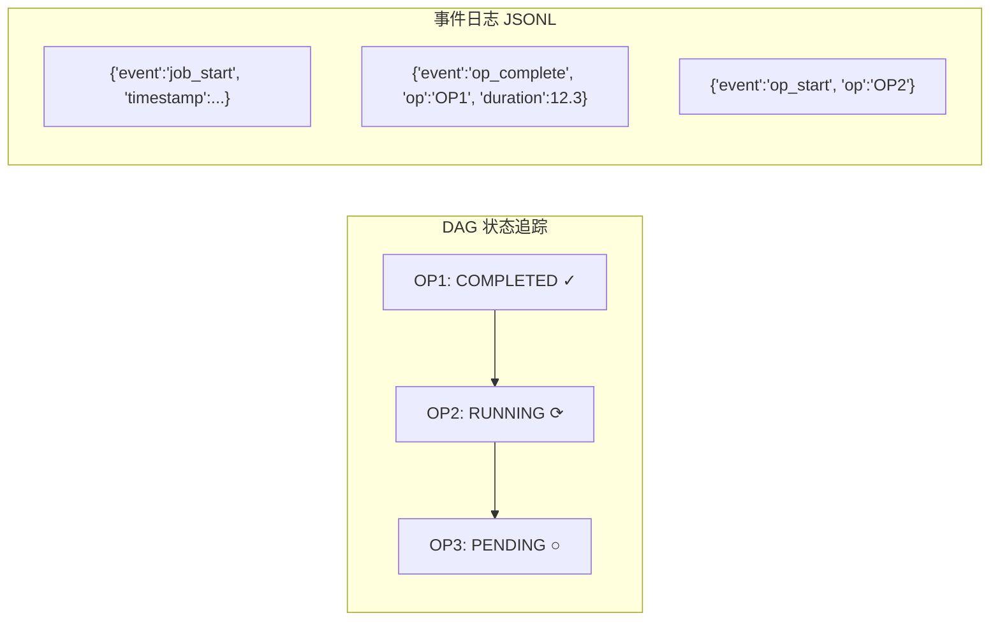
```mermaid
flowchart LR
    subgraph DAG 状态追踪
        N1[OP1: COMPLETED ✓] --> N2[OP2: RUNNING ⟳] --> N3[OP3: PENDING ○]
    end

    subgraph 事件日志 JSONL
        E1["{'event':'job_start', 'timestamp':...}"]
        E2["{'event':'op_complete', 'op':'OP1', 'duration':12.3}"]
        E3["{'event':'op_start', 'op':'OP2'}"]
    end
```

**注意**：DAG 是**观测性工具**，不是执行控制机制。算子仍然是线性顺序执行的，DAG 只用于 UI 展示和日志记录。

---

### 3.9 缓存与 Fingerprint 机制

HuggingFace Dataset 的 `.map()` 和 `.filter()` 内置了基于指纹的缓存：相同的输入数据 + 相同的处理函数 = 直接使用缓存结果。

**Data-Juicer 的指纹计算**：

`OP._fingerprint_bytes()` 将算子的所有属性序列化为字节串，但排除 `_NON_FINGERPRINT_ATTRS`：

```python
_NON_FINGERPRINT_ATTRS = frozenset({
    "work_dir",        # 包含 per-run UUID，每次运行都不同
    "_init_args",      # OPMetaClass 缓存的构造参数（冗余）
    "_init_kwargs",    # 同上
})
```

**为什么排除 `work_dir`？** `work_dir` 包含 `{job_id}` 占位符替换后的唯一路径。如果不排除，每次运行都会生成不同的指纹，导致缓存永远不命中。

**缓存压缩**：`NestedDataset` 支持可选的缓存压缩（`.map()` 后压缩，`.filter()` 时临时解压）。但 `.filter()` 内部调用了 `.map()`（用于应用过滤条件），所以 `.filter()` 会**关闭内部 `.map()` 的压缩**以避免嵌套压缩。

**坑**：如果算子的 `__init__` 存储了不可序列化的对象（如 PyTorch 模型引用），`_fingerprint_bytes()` 会失败。解决方法是在 `_NON_FINGERPRINT_ATTRS` 中添加这些属性名。

---

## 4. VLA Pipeline 深度分析

本章是全文重点，详细剖析 Data-Juicer 中具身智能（VLA — Vision-Language-Action）管线的设计、实现和数据流。

### 4.1 VLA Pipeline 概览

VLA 管线将**自我中心（egocentric）视频**转换为**机器人可训练的 LeRobot v2.0 数据集**。管线包含 11 个算子，按功能分为感知、计算、后处理、导出四个阶段：

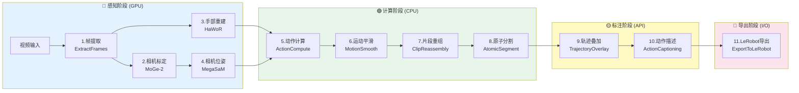
```mermaid
flowchart LR
    subgraph 感知阶段["🔵 感知阶段 (GPU)"]
        V[视频输入] --> E[1.帧提取<br/>ExtractFrames]
        E --> C[2.相机标定<br/>MoGe-2]
        E --> H[3.手部重建<br/>HaWoR]
        C --> P[4.相机位姿<br/>MegaSaM]
    end

    subgraph 计算阶段["🟢 计算阶段 (CPU)"]
        H --> A[5.动作计算<br/>ActionCompute]
        P --> A
        A --> S[6.运动平滑<br/>MotionSmooth]
        S --> R[7.片段重组<br/>ClipReassembly]
        R --> Seg[8.原子分割<br/>AtomicSegment]
    end

    subgraph 标注阶段["🟡 标注阶段 (API)"]
        Seg --> O[9.轨迹叠加<br/>TrajectoryOverlay]
        O --> Cap[10.动作描述<br/>ActionCaptioning]
    end

    subgraph 导出阶段["🔴 导出阶段 (I/O)"]
        Cap --> Exp[11.LeRobot导出<br/>ExportToLeRobot]
    end

    style 感知阶段 fill:#e3f2fd
    style 计算阶段 fill:#e8f5e9
    style 标注阶段 fill:#fff9c4
    style 导出阶段 fill:#fce4ec
```

**参考实现**：
- YAML Recipe: `demos/ego_hand_action_annotation/configs/vla_pipeline.yaml`
- Python 脚本: `demos/ego_hand_action_annotation/vla_pipeline.py`

---

### 4.2 数据契约: MetaKeys 作为 Operator 间的接口协议

VLA 管线中的算子通过 `Fields.meta`（即 `sample["__dj__meta__"]`）字典传递中间结果。每个算子读取特定的 MetaKeys 并写入特定的 MetaKeys，形成隐式的**数据契约**：

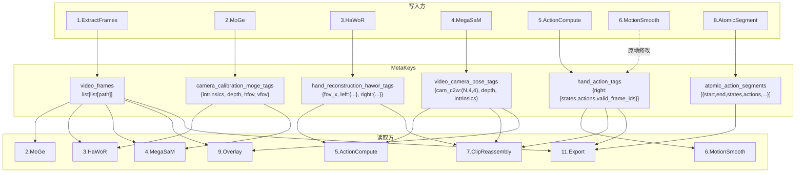
```mermaid
flowchart TB
    subgraph 写入方
        EF[1.ExtractFrames]
        MG[2.MoGe]
        HW[3.HaWoR]
        MS[4.MegaSaM]
        AC[5.ActionCompute]
        SM[6.MotionSmooth]
        AS[8.AtomicSegment]
    end

    subgraph MetaKeys
        VF["video_frames<br/>list[list[path]]"]
        CC["camera_calibration_moge_tags<br/>{intrinsics, depth, hfov, vfov}"]
        HR["hand_reconstruction_hawor_tags<br/>{fov_x, left:{...}, right:{...}}"]
        CP["video_camera_pose_tags<br/>{cam_c2w:(N,4,4), depth, intrinsics}"]
        HA["hand_action_tags<br/>{right:{states,actions,valid_frame_ids}}"]
        AAS["atomic_action_segments<br/>[{start,end,states,actions,...}]"]
    end

    subgraph 读取方
        R_MG[2.MoGe]
        R_HW[3.HaWoR]
        R_MS[4.MegaSaM]
        R_AC[5.ActionCompute]
        R_SM[6.MotionSmooth]
        R_CR[7.ClipReassembly]
        R_OV[9.Overlay]
        R_EX[11.Export]
    end

    EF --> VF
    MG --> CC
    HW --> HR
    MS --> CP
    AC --> HA
    SM -.->|原地修改| HA
    AS --> AAS

    VF --> R_MG & R_HW & R_MS & R_OV & R_EX
    CC --> R_HW & R_MS
    HR --> R_AC & R_CR
    CP --> R_AC & R_CR & R_OV
    HA --> R_SM & R_CR & R_EX
    AAS --> R_EX
```

**设计分析**：

| 维度 | 评价 |
|------|------|
| **松耦合** | 算子之间仅通过字符串键名通信，不存在直接引用。替换任意算子只需保证输出相同的 MetaKeys |
| **可替换性** | 相机标定有 3 个可选实现（MoGe / DeepCalib / DroidCalib），只要输出 `intrinsics` 和 `hfov` 即可 |
| **无 schema 校验** | 数据契约完全隐式 — 没有运行时验证算子的输出是否符合下游期望的格式和类型 |
| **坑** | 如果 MoGe 输出的 `intrinsics` 形状是 `(N, 3, 3)` 而下游期望 `(3, 3)`，错误只会在下游算子运行时才暴露 |

---

### 4.3 帧提取: VideoExtractFramesMapper

**位置**: `data_juicer/ops/mapper/video_extract_frames_mapper.py`

| 项目 | 内容 |
|------|------|
| 输入 | `sample[video_key]`（视频文件路径列表） |
| 输出 | `sample[MetaKeys.video_frames]`（帧路径二维列表 `[[video1_frame1, ...], ...]`） |
| GPU | 否 |
| 采样方法 | `all_keyframes`（仅关键帧）、`all_frames`（全部帧）、`uniform`（均匀采样） |
| 输出格式 | `path`（磁盘路径）或 `bytes`（内存字节） |

**VLA 管线选择 `all_keyframes` + `path` 输出**：关键帧包含场景变化点（对动作分割有意义），路径输出避免大量帧数据在 Ray 序列化时占用网络带宽。

---

### 4.4 相机标定: VideoCameraCalibrationMogeMapper

**位置**: `data_juicer/ops/mapper/video_camera_calibration_moge_mapper.py`

使用 MoGe-2 模型从单目视频估计**逐帧相机内参**和**度量深度图**。

**输出到 `camera_calibration_moge_tags`**：

| 字段 | 类型 | 含义 |
|------|------|------|
| `intrinsics` | `list[(3,3)]` | 逐帧内参矩阵 |
| `hfov` | `list[float]` | 逐帧水平视场角（弧度） |
| `vfov` | `list[float]` | 逐帧垂直视场角（弧度） |
| `depth` | `list[(H,W)]` | 逐帧深度图（可选） |

**相机内参矩阵**：

$$K = \begin{bmatrix} f_x & 0 & c_x \\ 0 & f_y & c_y \\ 0 & 0 & 1 \end{bmatrix}$$

其中 $f_x, f_y$ 是焦距（像素单位），$(c_x, c_y)$ 是主点坐标。水平视场角：

$$\text{hfov} = 2 \arctan\left(\frac{W}{2 f_x}\right)$$

**GPU 内存优化**：`save_dir` 参数将大型 numpy 数组（depth maps）保存到磁盘的 `.npy` 文件，避免 `Fields.meta` 字典中存储大数组导致的内存溢出和 Arrow 序列化开销。

**可替换实现**：
- `DeepCalibMapper` — 基于 TensorFlow 的 DeepCalib，精度较低但速度快
- `DroidCalibMapper` — 基于 DROID-SLAM 的视觉里程计，提供单一全局内参（非逐帧）

---

### 4.5 手部重建: VideoHandReconstructionHaworMapper

**位置**: `data_juicer/ops/mapper/video_hand_reconstruction_hawor_mapper.py`

使用 HaWoR 模型从视频帧中检测和重建三维手部姿态。

**输入**：
- `video_frames`（帧路径）
- `camera_calibration_moge_tags` → `hfov` 或 `intrinsics`（用于计算焦距）

**输出到 `hand_reconstruction_hawor_tags`**：

```python
{
    "fov_x": float,          # 水平视场角
    "img_focal": float,      # 图像焦距（像素）
    "left": {                # 左手（若存在）
        "frame_ids": [int],  # 检测到手的帧索引
        "global_orient": ndarray,  # (T, 3) axis-angle 全局方向
        "hand_pose": ndarray,      # (T, 45) axis-angle 手指关节角
        "betas": ndarray,          # (T, 10) MANO 形状参数
        "transl": ndarray,         # (T, 3) 相机空间平移
        "joints_cam": ndarray,     # (T, 21, 3) 相机空间关节位置
    },
    "right": { ... }         # 右手（同结构）
}
```

**MANO 手部模型**：

$$M(\theta, \beta) = \text{LBS}\big(T_P(\beta, \theta),\; J(\beta),\; \theta,\; W\big)$$

其中：
- $\theta \in \mathbb{R}^{48}$：16 个关节 × 3 轴角 = 手指姿态
- $\beta \in \mathbb{R}^{10}$：形状参数（控制手掌大小、手指长度等）
- $T_P$：姿态依赖的顶点位移
- $J(\beta)$：形状依赖的关节位置
- $W$：线性蒙皮权重
- LBS：线性混合蒙皮（Linear Blend Skinning）

---

### 4.6 相机位姿估计: VideoCameraPoseMegaSaMMapper

**位置**: `data_juicer/ops/mapper/video_camera_pose_megasam_mapper.py`

使用 MegaSaM（基于 DROID-SLAM）估计逐帧相机到世界的 SE(3) 变换。

**输入**：
- `video_frames`（帧路径）
- `camera_calibration_moge_tags` → `depth` 和 `intrinsics`

**输出到 `video_camera_pose_tags`**：

| 字段 | 类型 | 含义 |
|------|------|------|
| `cam_c2w` | `(N, 4, 4)` | 逐帧相机到世界变换矩阵 |
| `depth` | `list[(H,W)]` | 精化后的深度图 |
| `intrinsics` | `list[(3,3)]` | 精化后的内参矩阵 |

**SE(3) 相机到世界变换**：

$$T_{c2w} = \begin{bmatrix} R & t \\ 0^\top & 1 \end{bmatrix} \in SE(3), \quad R \in SO(3),\; t \in \mathbb{R}^3$$

$T_{c2w}$ 将相机坐标系中的点 $p_c$ 映射到世界坐标系：$p_w = R \cdot p_c + t$。

#### conda 环境隔离

MegaSaM 是唯一需要**独立 conda 环境**的算子。原因：

1. MegaSaM 内部使用 DROID-SLAM 的 CUDA 自编译扩展（`droid_backends`、`lietorch`、`torch-scatter`）
2. 这些扩展需要特定版本的 PyTorch + CUDA 编译，与主环境的 PyTorch 版本冲突
3. Ray 的 `runtime_env` 机制允许为单个 Actor 指定不同的 conda 环境

```yaml
# vla_pipeline.yaml
- video_camera_pose_megasam_mapper:
    runtime_env: {'conda': 'mega-sam'}
```

**坑**：
- conda 环境 `mega-sam` 必须预先创建并安装好所有依赖 — Ray 不会自动创建
- 非 Ray 执行（DefaultExecutor）不支持 `runtime_env`，MegaSaM 只能在 Ray 模式下运行
- `_prepare_env` 方法中有对 CUDA 源码的 monkey-patch（`.type()` → `.scalar_type()`），不同 PyTorch 版本可能需要不同的 patch

---

### 4.7 Combined Mapper 模式

**位置**: `demos/ego_hand_action_annotation/vla_pipeline.py`

`VideoHaWorMegaSaMCombinedMapper` 将 HaWoR（算子 3）和 MegaSaM（算子 4）合并为一个算子，在同一个 GPU Actor 中顺序执行：

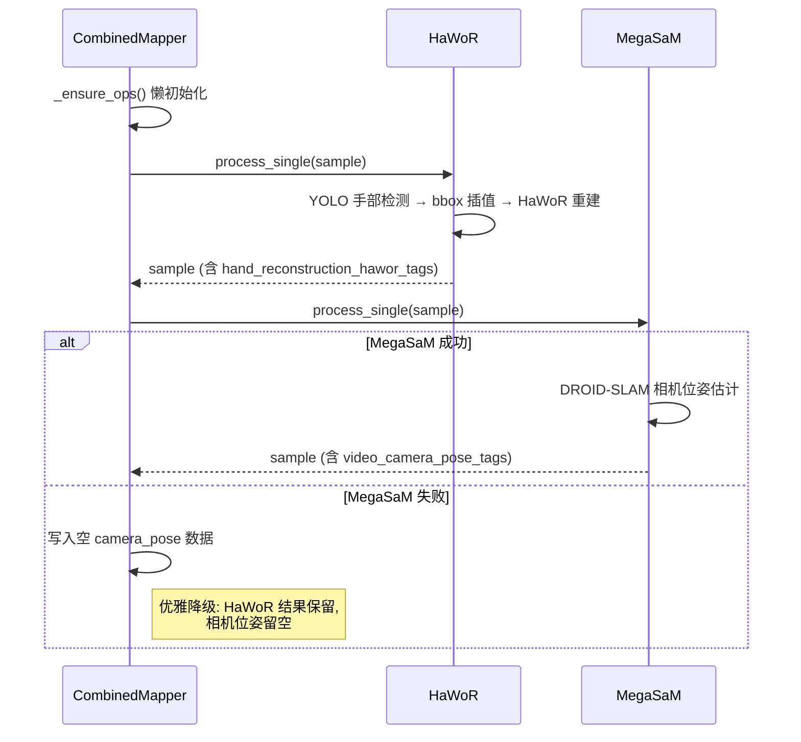
```mermaid
sequenceDiagram
    participant CM as CombinedMapper
    participant HW as HaWoR
    participant MS as MegaSaM

    CM->>CM: _ensure_ops() 懒初始化
    
    CM->>HW: process_single(sample)
    HW->>HW: YOLO 手部检测 → bbox 插值 → HaWoR 重建
    HW-->>CM: sample (含 hand_reconstruction_hawor_tags)
    
    CM->>MS: process_single(sample)
    
    alt MegaSaM 成功
        MS->>MS: DROID-SLAM 相机位姿估计
        MS-->>CM: sample (含 video_camera_pose_tags)
    else MegaSaM 失败
        CM->>CM: 写入空 camera_pose 数据
        Note right of CM: 优雅降级: HaWoR 结果保留,<br/>相机位姿留空
    end
```

**为什么合并？**

| 方案 | 优点 | 缺点 |
|------|------|------|
| 分开两个 Actor | 各自独立调度、容错 | GPU 上下文切换开销；帧数据需通过 Ray 序列化在两个 Actor 间传输 |
| 合并一个 Actor | 共享 GPU 显存和帧数据；零序列化开销 | HaWoR 故障会影响 MegaSaM |

合并方案中，HaWoR 和 MegaSaM 处理的是**同一个视频的同一组帧**，合并后帧数据只加载一次，节省了 Ray 的对象存储传输和 GPU 数据搬运。

**关键设计**：`_ensure_ops()` 采用懒初始化 — 内部的 HaWoR 和 MegaSaM 算子实例在第一次 `process_single` 调用时才创建。这避免了 Ray Actor 初始化阶段的模型加载开销（模型在首次处理数据时才加载到 GPU）。

---

### 4.8 手部动作计算: VideoHandActionComputeMapper

**位置**: `data_juicer/ops/mapper/video_hand_action_compute_mapper.py`

这是 VLA 管线的**核心计算算子**，将手部 MANO 参数和相机位姿转换为**机器人可用的状态-动作对**。

```mermaid
flowchart TB
    subgraph 输入
        HR[hand_reconstruction_hawor_tags<br/>transl, global_orient, hand_pose]
        CP[video_camera_pose_tags<br/>cam_c2w: N×4×4]
    end

    subgraph 坐标变换
        CT[相机空间 → 世界空间<br/>p_w = R·p_c + t]
        OT[方向变换<br/>R_world = R_c2w · R_hand]
        EU[旋转矩阵 → 欧拉角<br/>xyz 外旋约定]
    end

    subgraph 状态构造
        ST["state = [x,y,z, roll,pitch,yaw, pad, gripper]<br/>8 维"]
    end

    subgraph 夹爪估计
        GR[MANO 手指关节角<br/>→ 线性插值<br/>→ gripper ∈ {+1, -1}]
    end

    subgraph 动作计算
        DA["action = [dx,dy,dz, droll,dpitch,dyaw, gripper]<br/>7 维"]
    end

    HR --> CT
    CP --> CT
    HR --> OT
    CP --> OT
    OT --> EU
    CT --> ST
    EU --> ST
    HR --> GR
    GR --> ST
    ST --> DA
```

#### 关键公式

**坐标变换**（相机空间 → 世界空间）：

$$p_{\text{world}} = R_{c2w} \cdot p_{\text{cam}} + t_{c2w}$$

$$R_{\text{world}} = R_{c2w} \cdot R_{\text{hand\_cam}}$$

**增量动作**：

$$\Delta p_t = p_{t+1} - p_t$$

$$R_{\delta} = R_{t+1} \cdot R_t^{-1}$$

$$\text{action}_t = [\Delta x, \Delta y, \Delta z, \Delta \text{roll}, \Delta \text{pitch}, \Delta \text{yaw}, \text{gripper}_{t+1}]$$

**夹爪状态估计**：

从 MANO 手指关节角度估计夹爪开合状态。计算拇指、食指、中指的平均弯曲角度 $\bar{\theta}$，通过线性阈值映射：

$$\text{gripper} = \begin{cases} +1 & \text{若 } \bar{\theta} < \theta_{\text{open}} = 0.15 \text{ rad} \\ -1 & \text{若 } \bar{\theta} > \theta_{\text{closed}} = 0.6 \text{ rad} \\ \text{线性插值} & \text{其他} \end{cases}$$

#### valid_frame_ids

并非每一帧都能检测到手部。`valid_frame_ids` 记录了成功重建手部的帧索引列表。后续所有算子（平滑、导出等）都需要通过这个列表对齐数据。

**为什么使用稀疏索引而不是布尔掩码？** 见 §4.2 MetaKeys — states/actions 数组的长度等于 `len(valid_frame_ids)` 而非视频总帧数，避免了大量全零行占用内存。

---

### 4.9 运动平滑: VideoHandMotionSmoothMapper

**位置**: `data_juicer/ops/mapper/video_hand_motion_smooth_mapper.py`

4 步平滑管线，对 `hand_action_tags` 进行**原地修改**：

**Step 1: MAD 异常替换**

使用中位数绝对偏差（MAD）检测异常帧速度，用线性插值替换（不删除帧！）：

$$\text{MAD} = \text{median}\big(|v_i - \tilde{v}|\big)$$

$$\text{阈值} = \tilde{v} + k \cdot 1.4826 \cdot \text{MAD}$$

其中 $\tilde{v}$ 是速度中位数，$k$ 是 `outlier_velocity_threshold`（默认 5.0），1.4826 是 MAD 到标准差的换算系数（假设正态分布）。

**Step 2: Savitzky-Golay 位置平滑**

窗口 $w=11$，多项式阶数 $p=3$。对位置 $(x, y, z)$ 逐维做 SG 滤波：

$$\hat{x}_t = \sum_{i=-m}^{m} c_i \cdot x_{t+i}$$

其中 $c_i$ 是通过在 $[t-m, t+m]$ 窗口内拟合 $p$ 阶多项式得到的卷积系数。

**Step 3: 四元数方向平滑**

先将欧拉角转为四元数，做半球连续性校正（`dot(q_i, q_{i-1}) < 0` 则 `q_i = -q_i`），逐分量 SG 滤波后重新归一化，最后转回欧拉角。若四元数转换失败，退回到 `np.unwrap()` + SG 的 fallback 方案。

**Step 4: 动作重算**

从平滑后的 states 重新计算 7 维 delta actions。

**关键设计**：整个过程**不删除任何帧** — 异常帧被插值替换而非移除，`valid_frame_ids` 保持不变。这保证了后续的 LeRobot 导出中帧索引对齐正确。

---

### 4.10 片段重组: VideoClipReassemblyMapper

**位置**: `data_juicer/ops/mapper/video_clip_reassembly_mapper.py`

长视频通常被分割为重叠的短片段（clips）以适应 GPU 内存。处理完成后需要将多个片段的结果合并回单一视频：

```mermaid
flowchart LR
    subgraph 输入: 3 个重叠 Clips
        C1["Clip 1<br/>帧 0-49"]
        C2["Clip 2<br/>帧 30-79"]
        C3["Clip 3<br/>帧 60-109"]
    end

    subgraph 重叠检测
        H["帧内容 MD5 哈希匹配<br/>检测实际重叠区间"]
    end

    subgraph 对齐
        T["计算 clip 间变换<br/>T_12 = align(Clip1, Clip2)<br/>T_23 = align(Clip2, Clip3)"]
    end

    subgraph 合并
        M["重叠区: 加权混合<br/>非重叠区: 直接拼接<br/>cam_c2w: 对齐变换"]
    end

    subgraph 输出: 合并结果
        R["统一结果<br/>帧 0-109"]
    end

    C1 & C2 & C3 --> H --> T --> M --> R
```

**为什么使用 MD5 帧哈希？** ffmpeg 的关键帧对齐和时间戳精度可能导致实际提取的帧与预期的 clip 边界有偏移。通过比较帧内容的 MD5 哈希值，可以精确确定两个 clip 的实际重叠区间。

**世界坐标系对齐**：不同 clip 的 MegaSaM 独立运行，各自的世界坐标系原点不同。`ClipReassemblyMapper` 在重叠区计算 clip 间的相对变换（SE(3)），将所有 clip 的 `cam_c2w` 对齐到统一的世界坐标系。

---

### 4.11 原子动作分割: VideoAtomicActionSegmentMapper

**位置**: `data_juicer/ops/mapper/video_atomic_action_segment_mapper.py`

将连续轨迹分割为语义上独立的**原子动作**（如"伸手"、"抓取"、"移动"、"放置"）。分割准则是三维手腕速度的局部极小值：

$$s_t = \|p_{t+1} - p_t\|_2$$

对速度信号 $s_t$ 先做 Savitzky-Golay 平滑（去除噪声），然后检测局部极小值：

$$t^* = \arg\min_{|i - t| \leq w} s_i$$

在极小值点处切割轨迹。附加约束：
- 最短段长度 `min_segment_frames`（避免过碎的分割）
- 最长段长度 `max_segment_frames`（过长则强制等分）
- 相邻极小值的最小间距 `min_window`

**每个原子段包含**：`hand_type`、`segment_id`、`start_frame`、`end_frame`、`states`、`actions`、`valid_frame_ids`、`joints_world`、`joints_cam`。

---

### 4.12 LeRobot 导出: ExportToLeRobotMapper

**位置**: `data_juicer/ops/mapper/export_to_lerobot_mapper.py`

将处理后的数据转换为 LeRobot v2.0 格式（兼容 LIBERO / StarVLA）。

**两阶段设计**：

| 阶段 | 执行方式 | 功能 |
|------|---------|------|
| 1. Staging | 并行（Ray 多 Actor） | 每个 Actor 使用 UUID 命名写入 Parquet/视频/元数据到 `staging/` 目录 |
| 2. Finalize | 单线程 | 扫描 `staging/`，分配顺序 episode_index，生成最终目录结构 |

**为什么两阶段？** Ray Actor 并行处理时无法协调全局唯一的 episode 编号。UUID staging 确保了并行写入的安全性（无文件名冲突），finalization 确保了输出的 episode 编号是连续的。

**输出格式**：

```
output/
├── data/
│   └── chunk-000/
│       ├── episode_000000.parquet   # observation.state(8), action(7), timestamps
│       ├── episode_000001.parquet
│       └── ...
├── videos/
│   └── chunk-000/
│       ├── observation.images.image_episode_000000.mp4
│       └── ...
├── meta/
│   ├── info.json          # fps, shapes, robot_type, features
│   ├── episodes.jsonl     # episode metadata
│   └── tasks.jsonl        # task descriptions
└── modality.json
```

**两种导出模式**：
- **整视频模式**：一个视频 = 一个 episode
- **段模式**：每个 atomic_action_segment = 一个 episode，VLM 生成的 caption 作为 task description

---

### 4.13 VLA Pipeline 的 Ray 调度策略

VLA 管线的 Python 脚本（`vla_pipeline.py`）直接使用 Ray Data API 而非通过 YAML Recipe，以便精细控制资源分配：

```mermaid
flowchart TB
    subgraph GPU_Stage["GPU 阶段"]
        direction LR
        S1["ExtractFrames<br/>CPU only<br/>num_cpus=1"]
        S2["MoGe 标定<br/>GPU 0.15<br/>ActorPool(1-2)"]
        S3["HaWoR+MegaSaM<br/>Combined Mapper<br/>GPU 0.25<br/>ActorPool(1-2)<br/>conda: mega-sam"]
    end

    subgraph CPU_Stage["CPU 阶段"]
        direction LR
        S4["ActionCompute<br/>CPU only"]
        S5["MotionSmooth<br/>CPU only"]
    end

    subgraph API_Stage["API 阶段"]
        S6["VLM Captioning<br/>API call<br/>并发控制"]
    end

    subgraph IO_Stage["I/O 阶段"]
        S7["Export<br/>CPU + Disk I/O"]
        S8["finalize_dataset()<br/>单线程"]
    end

    S1 --> S2 --> S3 --> S4 --> S5 --> S6 --> S7 --> S8
```

**GPU 资源分数分配**：

| 算子 | GPU 分数 | 含义 |
|------|---------|------|
| MoGe | 0.15 | ~6 个 Actor 可共享 1 块 GPU |
| HaWoR+MegaSaM | 0.25 | ~4 个 Actor 可共享 1 块 GPU |

分数分配的依据是**模型显存占用**。MoGe 是轻量级 ViT，显存占用约 2GB；HaWoR + MegaSaM 合计约 4GB。在 A100 40GB 上，分数分配让 GPU 利用率最大化。

**关键约束**：MegaSaM 的 `droid_buffer` 参数控制 DROID-SLAM 的 GPU 缓冲区大小（默认 1024 帧）。缓冲区过大会导致 OOM，过小会降低跟踪精度。在多 Actor 共享 GPU 时需要相应减小。

---

## 5. 关键代码逻辑深度分析

### 5.1 wrap_func_with_nested_access: 装饰器链

这是 Data-Juicer 中最核心的"胶水"机制 — 让所有算子的处理方法自动获得嵌套字段访问能力。

```mermaid
sequenceDiagram
    participant HF as HuggingFace .map()
    participant NA as wrap_func_with_nested_access
    participant CE as catch_map_single_exception
    participant TR as wrap_mapper_with_tracer
    participant USR as 用户的 process_single()

    HF->>NA: 调用 wrapped_process(sample)
    NA->>NA: sample = NestedQueryDict(sample)
    Note right of NA: 现在 sample["meta.camera.hfov"]<br/>可以逐层解析
    
    NA->>CE: 调用 error_wrapped(sample)
    
    alt sample 是 batch (dict of lists)
        CE->>CE: 拆分为单样本列表
        loop 每个 single_sample
            CE->>TR: 调用 traced_process(single_sample)
            TR->>TR: orig = deep_copy(single_sample)
            TR->>USR: process_single(single_sample)
            USR-->>TR: result
            TR->>TR: 比较 orig vs result → 追踪变更
            TR-->>CE: result
        end
        CE->>CE: 合并为 batch
    else 正常单样本
        CE->>TR: traced_process(sample)
        TR->>USR: process_single(sample)
        USR-->>TR: result
        TR-->>CE: result
    end
    
    alt 异常 + skip_op_error
        CE-->>NA: 空 dict (丢弃样本)
    else
        CE-->>NA: result
    end
    
    NA-->>HF: result
```

**包装顺序的重要性**：

```
运行时调用栈（从外到内）：
1. HF .map()
   2. wrap_func_with_nested_access     ← OP.__init__ 中包装
      3. catch_map_single_exception    ← Mapper.__init__ 中包装
         4. wrap_mapper_with_tracer    ← Mapper.run() 中按需包装
            5. process_single()        ← 用户实现
```

如果顺序错误（例如 nested_access 在 error_handling 内部），那么异常处理代码中访问样本的嵌套字段时会失败。

**坑**：`OP.__init__` 中的包装发生在 `Mapper.__init__` 之前（因为 `Mapper.__init__` 调用 `super().__init__()`）。这意味着 `self.process` 在 `OP.__init__` 完成时已被 nested_access 包装，然后在 `Mapper.__init__` 中被 error_handling 再次包装。如果有人在 `OP.__init__` 和 `Mapper.__init__` 之间插入额外的方法替换，包装链就会断裂。

---

### 5.2 catch_map_single_exception: 容错机制

这个包装器实现了**样本级容错** — 单个损坏的数据样本不会导致整个管线崩溃。

**核心逻辑**：

```python
def catch_map_single_exception(method, return_sample=True, skip_op_error=False):
    def wrapped(sample, *args, **kwargs):
        try:
            # 检测 batch → 拆分为单样本
            if is_batched(sample):
                results = [method(single, *args, **kwargs) for single in unbatch(sample)]
                return rebatch(results)
            else:
                return method(sample, *args, **kwargs)
        except Exception as e:
            if skip_op_error:
                logger.warning(f"Skipping sample due to error: {e}")
                return empty_dict_like(sample)  # 返回空样本
            else:
                raise
    return wrapped
```

**关键细节**：

1. **Batch 检测**：通过检查 sample 中所有值是否都是等长列表来判断是否是 batch。这是一个**启发式判断**，如果某个字段恰好是一个列表（而非 batch 维度），可能会误判。

2. **空样本返回**：`skip_op_error=True` 时返回 `{key: [] for key in sample.keys()}`。HF Dataset 的 `.map()` 会**丢弃空样本**（Arrow 表不保留空行）。

3. **坑**：空样本返回可能改变数据集的列类型。例如，原来 `"text"` 列是 `string` 类型，空样本中变成了 `list`。HF Dataset 的 Arrow schema 可能拒绝这种类型变化。

---

### 5.3 StatsKeysMeta: 访问追踪元类

```python
class StatsKeysMeta(type):
    _accessed_by = {}  # {op_module_name: {stat_key, ...}}
    
    def __getattr__(cls, name):
        if name.startswith('_'):
            raise AttributeError(name)
        
        # 追踪访问者
        caller_frame = inspect.currentframe().f_back
        caller_module = caller_frame.f_globals.get('__name__', '')
        caller_class = caller_module.split('.')[-1]
        
        if caller_class not in cls._accessed_by:
            cls._accessed_by[caller_class] = set()
        cls._accessed_by[caller_class].add(name)
        
        return f"{DEFAULT_PREFIX}{name}"
```

**工作原理**：当 Filter 代码中写 `StatsKeys.text_len` 时，元类的 `__getattr__` 被触发。它通过栈帧获取调用者的模块名（如 `text_length_filter`），记录到 `_accessed_by` 字典。OP Fusion 系统后续读取这个字典来判断哪些 Filter 共享哪些统计量。

**返回值**：`f"{DEFAULT_PREFIX}{name}"` = `"__dj__text_len"` — 实际存储在 `sample[Fields.stats]` 中的键名。

**坑**：
- `inspect.currentframe().f_back` 假设直接调用者就是算子类。如果统计量在辅助函数或基类方法中被间接访问，追踪到的 `caller_class` 会是错误的。
- Python 不保证栈帧在所有实现中的行为一致（CPython vs PyPy）。
- 属性名 `name` 必须不以 `_` 开头，否则会抛 `AttributeError`。这意味着以 `_` 开头的统计量键名无法使用。

---

### 5.4 FusedFilter.compute_stats_batched: 共享 Context

```python
def compute_stats_batched(self, samples, rank=None, context=False):
    # 1. 为每个样本创建 context 字典
    samples[Fields.context] = [{} for _ in range(len(samples[next(iter(samples))]))]
    
    # 2. 依次运行每个 fused filter 的 compute_stats
    for op in self.fused_filters:
        samples = op.compute_stats_batched(samples, rank=rank, context=True)
    
    # 3. 清理 context（关闭视频容器等资源）
    for ctx in samples[Fields.context]:
        for key, val in ctx.items():
            if hasattr(val, 'close'):
                val.close()
    del samples[Fields.context]
    
    return samples
```

**共享机制**：当 `context=True` 传递给算子的 `compute_stats_batched` 时，算子会：
1. 检查 `sample[Fields.context]` 中是否已有中间变量（如 `LOADED_IMAGES`）
2. 若有 → 直接复用
3. 若无 → 计算并存入 context

这样，第一个需要加载图像的 Filter 执行加载并存入 context，后续共享 `LOADED_IMAGES` 的 Filter 直接从 context 取用，避免重复加载。

**性能影响**：Data-Juicer 论文报告 OP Fusion + 重排序可节省最多 **70.22%** 的处理时间（对于包含多个图像/视频 Filter 的复杂 Recipe）。

---

### 5.5 _fingerprint_bytes: 缓存指纹计算

```python
def _fingerprint_bytes(self):
    attrs = {}
    for k, v in self.__dict__.items():
        if k in self._NON_FINGERPRINT_ATTRS:
            continue
        if isinstance(v, OP):
            attrs[k] = v._fingerprint_bytes()  # 递归处理嵌套 OP
        elif isinstance(v, (list, tuple)):
            # 处理列表中嵌套的 OP
            attrs[k] = [item._fingerprint_bytes() if isinstance(item, OP) else item 
                        for item in v]
        else:
            attrs[k] = v
    return dill.dumps(attrs, protocol=dill.HIGHEST_PROTOCOL)
```

**关键设计**：
- 排除 `work_dir`（含 per-run UUID）→ 避免每次运行都生成不同指纹
- 递归处理嵌套 OP（如 `FusedFilter.fused_filters` 列表）→ 确保融合后的缓存指纹正确
- 使用 `dill` 而非 `pickle` → dill 支持 lambda、闭包等 pickle 不支持的类型

**坑**：如果算子存储了一个**不可序列化但影响输出的属性**（如依赖于系统时间的随机种子），缓存可能返回错误的结果。开发者需要确保所有影响输出的属性要么可序列化，要么在 `_NON_FINGERPRINT_ATTRS` 中标注。

---

## 6. 设计模式总结

### 6.1 模式清单

| # | 模式 | 位置 | 作用 |
|---|------|------|------|
| 1 | **Registry (Service Locator)** | `utils/registry.py` → OPERATORS 等 | 字符串名 → 类实例的解耦 |
| 2 | **Template Method** | `OP.run()` → 子类 `run()` | 统一初始化流程，子类扩展具体行为 |
| 3 | **Sealed Method** | `__init_subclass__` 禁止覆盖 `process` | 强制使用 `process_single` 以保证错误处理一致性 |
| 4 | **Metaclass (Metadata)** | `OPMetaClass` | 缓存构造参数以支持 Ray Actor 重建 |
| 5 | **Virtual Proxy** | `LazyLoader` | 延迟导入 + 自动安装 |
| 6 | **Factory Method** | `ExecutorFactory` | 按配置创建具体 Executor |
| 7 | **Strategy** | `DefaultExecutor` vs `RayExecutor` | 不同执行后端的可替换性 |
| 8 | **Composite** | `FusedFilter` / `GeneralFusedOP` | 多个算子组合为一个 |
| 9 | **Decorator Chain** | `nested_access` → `error_handling` → `tracer` | 横切关注点的层层包装 |
| 10 | **Adapter** | `NestedDataset` (HF Dataset → DJDataset) | 统一不同数据引擎的接口 |
| 11 | **Facade** | `CombinedMapper` | 将两个 GPU 算子包装为一个简单接口 |
| 12 | **Observer (Access Tracking)** | `StatsKeysMeta` | 追踪哪些算子访问哪些统计量 |
| 13 | **AOP (Aspect-Oriented)** | Tracer wrapping | 在不修改算子代码的情况下插入追踪逻辑 |
| 14 | **Implicit Interface** | MetaKeys 数据契约 | 算子间通过约定的字符串键名通信 |

### 6.2 模式间协作

```mermaid
graph LR
    R[Registry] -->|字符串解析| F[Factory]
    F -->|创建| E[Executor<br/>Strategy]
    E -->|调用| TM[Template Method<br/>OP.run]
    TM -->|包装| DC[Decorator Chain<br/>nested + error + tracer]
    DC -->|触发| AOP[AOP<br/>Tracer]
    
    R -->|注册到| OBS[Observer<br/>StatsKeysMeta]
    OBS -->|驱动| COMP[Composite<br/>OP Fusion]
    
    VP[Virtual Proxy<br/>LazyLoader] -->|延迟加载| R
    
    MC[Metaclass<br/>OPMetaClass] -->|缓存参数| E
    
    AD[Adapter<br/>NestedDataset] -->|统一接口| E
    
    II[Implicit Interface<br/>MetaKeys] -->|数据传递| TM
```

---

## 7. 优缺点与风险分析

### 7.1 架构优势

1. **零成本扩展** — 新增算子只需一个文件 + 一个装饰器，无需修改框架代码。240+ 算子的生态证明了这个设计的有效性。

2. **多后端透明** — 同一管线配置可在本地和 Ray 集群上运行，算子代码无需修改。从开发到生产的切换只需改变 `executor_type`。

3. **智能优化** — OP Fusion 自动合并共享中间变量的 Filter，自适应批大小根据硬件调整。开发者无需手动优化管线性能。

4. **全链路可观测** — Tracer 记录样本级变更，DAG 监控追踪管线进度，Analyzer 提供统计洞察。

5. **复用 HF 生态** — 基于 HuggingFace Datasets 构建，继承了 Arrow 存储、内存映射、自动缓存等成熟能力。

### 7.2 架构劣势

1. **多继承脆弱性** — `NestedDataset` 同时继承 HF `Dataset` 和 `DJDataset`，HF Dataset 内部 API 变更可能悄然破坏 Data-Juicer。

2. **类型安全缺失** — `**kwargs` 贯穿 `OP.__init__`，配置拼写错误静默忽略；MetaKeys 是纯字符串，无编译期类型检查。

3. **隐式数据契约** — 算子间通过 MetaKeys 字符串键名通信，无 schema 校验。上游算子输出格式变化只会在下游运行时才暴露。

4. **导入时副作用** — Registry 的 `@OPERATORS.register_module` 在 import 时执行。所有算子必须在使用前被 import，否则 YAML 中引用会找不到。

5. **跨层泄漏** — `base_op.py` 中存在 `is_ray_mode()` 的判断，Config 系统通过 `update_op_attr()` 直接修改算子属性。层与层之间的边界不够严格。

6. **双套加载抽象** — `Formatter` 体系和 `DatasetBuilder` + `DataLoadStrategy` 体系功能重叠，维护成本高。

### 7.3 潜在陷阱与规避建议

| # | 风险 | 影响 | 概率 | 规避措施 |
|---|------|------|------|---------|
| 1 | **缓存中毒** — 非指纹属性影响输出但未被排除 | 缓存返回错误结果 | 中 | 新增算子属性时检查是否影响输出；编写单元测试验证缓存一致性 |
| 2 | **MetaKeys 契约违反** — 上游改变输出格式 | 下游算子运行时崩溃 | 高 | 添加可选的 schema 校验层；在 CI 中运行端到端管线测试 |
| 3 | **LazyLoader 自动安装** — 生产环境意外安装包 | 安全风险 + 版本冲突 | 中 | 生产环境设置 `auto_install=False`；使用 `dj-install` 预安装依赖 |
| 4 | **StatsKeysMeta 栈帧追踪** — Python 版本升级改变帧行为 | OP Fusion 分组错误 | 低 | 添加 OP Fusion 的回归测试；监控 Python 版本升级的影响 |
| 5 | **HF Dataset API 变更** — NestedDataset 的 override 方法签名不匹配 | 运行时 TypeError | 中 | 锁定 `datasets` 包版本；NestedDataset 重写方法时使用防御性签名 |
| 6 | **Ray Actor 重建失败** — `_init_kwargs` 中的路径在新节点上不存在 | Actor 重建崩溃 | 中 | 使用共享文件系统（NFS/S3）；在 `_init_kwargs` 中使用相对路径 |
| 7 | **OP Fusion 隐藏依赖** — 两个 Filter 写入同一 StatsKeys 字段 | 融合后结果与未融合不同 | 低 | 融合前检查 StatsKeys 写入冲突；避免多个 Filter 共享输出字段 |
| 8 | **conda 环境隔离** — MegaSaM 的 `mega-sam` env 未预创建 | MegaSaM 算子启动失败 | 高 | 提供 Dockerfile 或脚本自动创建 conda env；非 Ray 模式下给出明确错误消息 |
| 9 | **空样本污染** — `catch_map_single_exception` 返回空 dict | 改变列类型，后续算子异常 | 中 | 在空 dict 中保持与原样本相同的列类型；或使用 sentinel 值标记失败样本 |
| 10 | **NestedQueryDict 性能** — 大规模数据集每次字段访问都经过嵌套解析 | 高频访问场景下性能下降 | 低 | 对非嵌套字段的访问路径做缓存；Profile 后针对性优化热点 |

### 7.4 可扩展性分析

**现有扩展点**：

| 扩展点 | 机制 | 示例 |
|--------|------|------|
| 新增算子 | `@OPERATORS.register_module` + 继承基类 | 所有 240+ 算子 |
| 自定义算子 | `custom_operators` 配置项 | 外部 `.py` 文件 |
| 新增数据格式 | `@FORMATTERS.register_module` + 继承 `LocalFormatter` | `JsonFormatter` 等 |
| 新增执行后端 | 继承 `ExecutorBase` + 注册到 `ExecutorFactory` | `PartitionedRayExecutor` |
| 新增负载策略 | `DataLoadStrategyRegistry` | S3、HuggingFace Hub |

**缺失的扩展点**：

1. **算子间数据校验** — 无法声明算子的输入/输出 schema，也无法在运行前验证管线的数据兼容性
2. **管线级钩子** — 无法在算子执行前后插入自定义逻辑（如数据采样、质量检查）
3. **算子命名空间** — 所有算子注册在全局 `OPERATORS` 中，无法隔离第三方算子的名称冲突
4. **声明式并行 DAG** — 当前 DAG 仅用于监控，不支持声明算子间的并行关系（如 HaWoR 和 MegaSaM 可并行执行）

---

## 8. 总结与展望

### 8.1 关键发现总结

1. **Data-Juicer 的核心竞争力在于"可组合性"** — Registry + Template Method + YAML 配置的三位一体设计，使得 240+ 算子可以自由组合为管线，且新算子的添加成本极低。

2. **多后端执行是一等公民** — 从 `OP` 基类到 `NestedDataset`/`RayDataset` 的双实现，再到 `ExecutorFactory`，整个架构围绕"同一管线、多种执行"设计。

3. **OP Fusion 是独特的性能优化** — 基于 `StatsKeysMeta` 的访问追踪自动发现融合机会，无需用户干预。

4. **VLA 管线展示了框架的深度扩展能力** — 11 个专用算子组成了从原始视频到训练数据的完整链路，其中 `CombinedMapper` 和 `runtime_env` conda 隔离展示了框架对复杂 GPU 工作负载的适配能力。

### 8.2 VLA 场景适配评估

| 维度 | 评分 | 说明 |
|------|------|------|
| **功能完备性** | ★★★★★ | 覆盖从帧提取到 LeRobot 导出的完整链路 |
| **GPU 调度** | ★★★★☆ | Ray ActorPool + 分数 GPU 分配，但不支持多 GPU 单算子 |
| **数据契约** | ★★★☆☆ | MetaKeys 提供命名一致性，但缺少类型/shape 校验 |
| **容错性** | ★★★☆☆ | 样本级容错，但空样本返回可能引发级联问题 |
| **环境隔离** | ★★★★☆ | Ray runtime_env 解决了 MegaSaM 的依赖冲突，但只在 Ray 模式可用 |
| **调试体验** | ★★☆☆☆ | 装饰器链使调用栈深且难读；MetaKeys 错误延迟到运行时 |

### 8.3 未来改进建议

1. **类型安全的数据契约** — 为 MetaKeys 引入可选的 Pydantic schema 校验。算子声明 `inputs_schema` 和 `outputs_schema`，框架在管线构建时校验兼容性。

2. **流式/分块处理** — 当前 VLA 管线将所有帧加载到内存。对于超长视频（>1 小时），应支持流式分块处理以控制内存峰值。

3. **结构化错误传播** — 用 `Result<Sample, Error>` 模式替代空 dict 返回。失败样本携带错误信息，下游可选择跳过或重试。

4. **算子命名空间** — 引入 `namespace.operator_name` 模式（如 `vla.video_hand_action_compute_mapper`），避免第三方算子名称冲突。

5. **声明式并行 DAG** — 扩展 YAML Recipe 语法，允许声明算子间的并行关系（如 `parallel: [hawor, megasam]`），由 Executor 自动调度。

6. **DefaultExecutor 的 conda 隔离** — 在非 Ray 模式下也支持 `runtime_env`，可通过 `subprocess` + conda 环境切换实现。

---

## 附录

### 附录 A: VLA Pipeline 完整数据流图

```mermaid
flowchart TB
    Video["📹 输入视频"] --> EF

    EF["1. VideoExtractFramesMapper<br/>提取帧"]
    EF -->|"video_frames<br/>list[list[path]]"| MG
    EF -->|"video_frames"| HW
    EF -->|"video_frames"| MS
    EF -->|"video_frames"| OV
    EF -->|"video_frames"| EX

    MG["2. VideoCameraCalibrationMogeMapper<br/>🔵 GPU | MoGe-2"]
    MG -->|"camera_calibration_moge_tags<br/>{intrinsics:(3,3), depth:(H,W),<br/>hfov:float, vfov:float}"| HW
    MG -->|"camera_calibration_moge_tags"| MS
    MG -->|"camera_calibration_moge_tags"| OV

    HW["3. VideoHandReconstructionHaworMapper<br/>🔵 GPU | HaWoR + MANO"]
    HW -->|"hand_reconstruction_hawor_tags<br/>{left/right: {transl:(T,3),<br/>global_orient:(T,3), joints_cam:(T,21,3)}}"| AC
    HW -->|"hand_reconstruction_hawor_tags"| CR

    MS["4. VideoCameraPoseMegaSaMMapper<br/>🔵 GPU | DROID-SLAM<br/>conda: mega-sam"]
    MS -->|"video_camera_pose_tags<br/>{cam_c2w:(N,4,4),<br/>depth, intrinsics}"| AC
    MS -->|"video_camera_pose_tags"| CR
    MS -->|"video_camera_pose_tags"| OV

    AC["5. VideoHandActionComputeMapper<br/>🟢 CPU"]
    AC -->|"hand_action_tags<br/>{right/left: {states:(T,8),<br/>actions:(T,7), valid_frame_ids}}"| SM

    SM["6. VideoHandMotionSmoothMapper<br/>🟢 CPU | MAD + SG"]
    SM -->|"hand_action_tags (smoothed)"| CR

    CR["7. VideoClipReassemblyMapper<br/>🟢 CPU | MD5 帧匹配"]
    CR -->|"hand_action_tags (merged)"| SEG

    SEG["8. VideoAtomicActionSegmentMapper<br/>🟢 CPU | 速度极小值"]
    SEG -->|"atomic_action_segments<br/>[{start, end, states, actions}]"| OV
    SEG -->|"atomic_action_segments"| EX

    OV["9. VideoTrajectoryOverlayMapper<br/>🟢 CPU | 投影叠加"]
    OV -->|"segment.overlay_frames<br/>[path]"| CAP

    CAP["10. VideoActionCaptioningMapper<br/>🟡 API | VLM"]
    CAP -->|"hand_action_caption<br/>{think, action}"| EX

    EX["11. ExportToLeRobotMapper<br/>🔴 I/O | Parquet + Video"]
    EX --> OUT["📦 LeRobot v2.0 Dataset"]

    style EF fill:#e8f5e9
    style MG fill:#e3f2fd
    style HW fill:#e3f2fd
    style MS fill:#e3f2fd
    style AC fill:#e8f5e9
    style SM fill:#e8f5e9
    style CR fill:#e8f5e9
    style SEG fill:#e8f5e9
    style OV fill:#e8f5e9
    style CAP fill:#fff9c4
    style EX fill:#fce4ec
```

---

### 附录 B: Operator 类型速查表

| 类型 | `run()` 语义 | 关键方法 | 输入/输出粒度 |
|------|------------|---------|-------------|
| **Mapper** | `dataset.map(process)` | `process_single(sample) → sample` | 单样本 → 单样本 |
| **Filter** | `dataset.map(compute_stats)` → `dataset.filter(process)` | `compute_stats_single(sample)` + `process_single(sample) → bool` | 单样本 → 保留/丢弃 |
| **Deduplicator** | `dataset.map(compute_hash)` → `process(dataset)` | `compute_hash(sample)` + `process(dataset) → (dataset, dup_pairs)` | 全数据集 → 去重后数据集 |
| **Selector** | `process(dataset)` | `process(dataset) → dataset` | 全数据集 → 子集 |
| **Grouper** | `process(dataset)` | `process(dataset) → list[batched_samples]` | 全数据集 → 分组 |
| **Aggregator** | `dataset.map(process)` | `process_single(batched_sample) → sample` | 分组 → 单样本 |
| **Pipeline** | `run(dataset)` | `run(dataset) → dataset` | 全数据集 → 全数据集 |
| **FusedFilter** | 多 Filter 的 AND 组合 | `compute_stats_batched` + `process_batched` | 批样本 → 保留/丢弃 |

---

### 附录 C: 关键接口签名速查

```python
# OP 基类
class OP(metaclass=OPMetaClass):
    def __init__(self, *, text_key, image_key, audio_key, video_key,
                 batch_size, num_proc, skip_op_error, turbo, work_dir,
                 num_cpus, num_gpus, memory, runtime_env, **kwargs): ...
    def run(self, dataset, *, exporter=None, tracer=None) -> dataset: ...
    def _fingerprint_bytes(self) -> bytes: ...

# Mapper
class Mapper(OP):
    def process_single(self, sample, rank=None) -> sample: ...
    def process_batched(self, samples, rank=None) -> samples: ...
    def run(self, dataset, *, exporter=None, tracer=None) -> dataset: ...

# Filter
class Filter(OP):
    def __init__(self, *, min_val=None, max_val=None, reversed_range=False,
                 min_closed_interval=True, max_closed_interval=True, **kwargs): ...
    def compute_stats_single(self, sample, context=False) -> sample: ...
    def process_single(self, sample) -> bool: ...
    def get_keep_boolean(self, val, min_val=None, max_val=None) -> bool: ...
    def run(self, dataset, *, exporter=None, tracer=None, reduce=True) -> dataset: ...

# DJDataset
class DJDataset(ABC):
    def process(self, operators, *, work_dir, exporter, checkpointer,
                tracer, adapter, open_monitor) -> DJDataset: ...
    def schema(self) -> Schema: ...
    def count(self) -> int: ...

# NestedDataset
class NestedDataset(Dataset, DJDataset):
    def process(self, operators, **kwargs) -> NestedDataset: ...
    def map(self, func, *, num_proc, batch_size, with_rank, **kwargs) -> NestedDataset: ...
    def filter(self, func, *, num_proc, batch_size, **kwargs) -> NestedDataset: ...
```

---

## 9. Filter 算子全景分析

本节对 Data-Juicer 中全部 **57 个 Filter 算子**进行系统性的全景分析。Filter 是 Data-Juicer 数据处理管线中"质量守门人"的角色——通过计算统计指标并据此接受或拒绝样本，实现数据集的自动化清洗与策展。

> **与前文的关系**：§2.3 介绍了 Filter 在 OP 类层次中的位置，§3.5 分析了 Filter 的两阶段动态调用流程，§5.4 剖析了 FusedFilter 的共享 Context 机制。本节在此基础上，对全部 57 个具体 Filter 实现进行逐类深入分析。

**阅读指引**：

| 读者类型 | 推荐阅读路径 |
|---------|------------|
| 快速查阅特定 Filter | 附录 D（速查表）→ 对应子节 |
| 理解 Filter 架构机制 | §9.2（基类）→ §9.3（Registry）→ §9.10（OP Fusion）|
| 具身智能数据策展 | §9.11（VLA 角色）→ §9.9.2（运动分析）→ §9.4.4（动作检测）|
| 自定义 Filter 开发 | §9.2（基类）→ §9.4.1（简单示例）→ §9.12（设计模式）|

### 9.1 Filter 分类体系

57 个 Filter 可从两个维度分类：**数据模态**（7 大类）和**实现模式**（8 种模式）。

```mermaid
mindmap
  root((Filter 算子<br/>57 个))
    文本类 (20)
      简单数值范围 (5)
      重复率检测 (2)
      语言质量 (6)
      NLP 模型驱动 (2)
      元数据与表达式 (5)
    LLM 类 (8)
      LLMAnalysis 系列 (4)
      LLMPerplexity 系列 (3)
      LLMCondition (1)
    Embedding 类 (1)
      TextEmbdSimilarity
    音频类 (3)
      duration / size / SNR
    图像类 (13)
      基础属性 (3)
      质量评估 (4)
      多模态对齐 (3)
      目标定位 (1)
      人脸相关 (2)
    视频类 (12)
      基础属性 (3)
      运动分析 (3)
      内容分析 (3)
      视频文本对齐 (2)
      标签驱动 (1)
```

**8 种实现模式**：

| 模式 | 特征 | 代表 Filter | 核心机制 |
|-----|------|-----------|---------|
| **简单数值范围** | 计算单一数值 → `get_keep_boolean` | `text_length_filter` | `len(text)` → 范围检查 |
| **多元素 any/all** | 多媒体样本，每个元素独立评分 | `video_motion_score_filter` | 逐视频评分 → 聚合策略 |
| **标签型 (NON_STATS)** | 跳过 `Fields.stats`，写 `Fields.meta` | `video_tagging_from_frames_filter` | 标签集合匹配 |
| **LLM-as-Judge** | 调用 LLM 生成结构化评分 | `llm_analysis_filter` | API/HF/vLLM → JSON 解析 |
| **NLP 模型驱动** | spaCy 等 NLP 模型提取语言特征 | `text_action_filter` | POS tagging → 计数 |
| **表达式驱动** | AST 解析任意布尔表达式 | `general_field_filter` | Python AST → 求值 |
| **多模态 + Context** | CLIP/BLIP 跨模态评分 | `image_text_similarity_filter` | 模型推理 + 融合 Context |
| **继承链 (Strategy)** | 基类定义框架，子类替换算法 | `VideoMotionScore*Filter` | `setup_model` + `compute_flow` 覆写 |

### 9.2 Filter 基类机制深度分析

#### 9.2.1 两阶段执行模型

Filter 的执行遵循严格的两阶段分离（参见 §3.5），其集合语义形式化表述为：

$$D' = \{s \in D \mid \text{process}(\text{compute\_stats}(s)) = \text{true}\}$$

**阶段 1: `compute_stats`** — 通过 `dataset.map()` 对每个样本计算统计指标，结果写入 `sample[Fields.stats]` 字典。每个 Filter 使用独立的 `StatsKeys` 常量键，确保多个 Filter 可以共存于同一 `stats` 字典。

**阶段 2: `process`** — 通过 `dataset.filter()` 对每个样本做布尔判断。仅当 `reduce=True`（默认）时执行。当 `reduce=False` 时，仅计算统计指标但不丢弃样本——这是 **Analyzer** 模式的核心机制，用于数据集分析而非清洗。

**幂等性检查模式**：每个 Filter 的 `compute_stats_single` 必须在入口处检查目标 StatsKey 是否已存在：

```python
# 标准幂等性检查模式（出现在每个 Filter 中）
if StatsKeys.xxx in sample[Fields.stats]:
    return sample  # 已计算，直接返回
```

这一模式确保同一 Filter 在 OP Fusion 中被多次引用时不会重复计算。

#### 9.2.2 `get_keep_boolean` 完整数学语义

`get_keep_boolean(val, min_val, max_val)` 是所有数值范围型 Filter 的核心判断函数（`base_op.py:786`）。其完整语义取决于三个布尔标志：

**正常模式** (`reversed_range=False`)：

$$\text{keep}(v) = \begin{cases} v \geq v_{\min} & \text{if } \texttt{min\_closed} \\ v > v_{\min} & \text{if } \neg\texttt{min\_closed} \end{cases} \wedge \begin{cases} v \leq v_{\max} & \text{if } \texttt{max\_closed} \\ v < v_{\max} & \text{if } \neg\texttt{max\_closed} \end{cases}$$

**反转模式** (`reversed_range=True`)：

在 `__init__` 中，两个区间标志被翻转（`min_closed ← ¬min_closed`，`max_closed ← ¬max_closed`），然后在 `get_keep_boolean` 中对结果取反。等价效果：

$$\text{keep}(v) = \neg\Big(\begin{cases} v \geq v_{\min} & \text{if } \neg\texttt{orig\_min\_closed} \\ v > v_{\min} & \text{if } \texttt{orig\_min\_closed} \end{cases} \wedge \begin{cases} v \leq v_{\max} & \text{if } \neg\texttt{orig\_max\_closed} \\ v < v_{\max} & \text{if } \texttt{orig\_max\_closed} \end{cases}\Big)$$

即保留原始区间 **外部** 的样本。翻转区间闭合标志的巧妙之处在于：原来闭区间的边界点在排除区外部被排除，符合直觉。

**边界处理**：当 `min_val=None` 或 `max_val=None` 时，对应边界不施加约束（默认通过）。

#### 9.2.3 `__init_subclass__` 密封 + 装饰器链

Filter 基类通过 `__init_subclass__`（`base_op.py:772`）**禁止子类覆写** `compute_stats` 和 `process` 方法。子类必须实现 `compute_stats_single`/`compute_stats_batched` 和 `process_single`/`process_batched`。

这一设计的目的：确保错误处理和嵌套字段访问的装饰器链始终被应用，无法被子类绕过。

装饰器包装顺序如下：

```mermaid
flowchart LR
    subgraph Single 模式
        A1["compute_stats_single"] --> B1["catch_map_single_exception"]
        B1 --> C1["wrap_func_with_nested_access"]
        D1["process_single"] --> E1["catch_map_single_exception<br/>(return_sample=False)"]
        E1 --> F1["wrap_func_with_nested_access"]
    end
    subgraph Batched 模式
        A2["compute_stats_batched"] --> B2["catch_map_batches_exception"]
        B2 --> C2["wrap_func_with_nested_access"]
        D2["process_batched"] --> E2["catch_map_batches_exception"]
        E2 --> F2["wrap_func_with_nested_access"]
    end
```

关键细节：`process` 的 single 模式使用 `return_sample=False`，使异常包装器返回 `[bool]` 而非包装后的样本字典。

#### 9.2.4 `any_or_all` 聚合策略

对于多媒体样本（一个样本包含多张图片或多个视频），每个媒体元素独立获得一个布尔判断。聚合策略决定最终的保留/丢弃：

$$\text{keep\_any}(s) = \exists\, i \in [1, n] : \text{keep}(v_i)$$

$$\text{keep\_all}(s) = \forall\, i \in [1, n] : \text{keep}(v_i)$$

大多数多模态 Filter 默认使用 `any` 策略——只要样本中有一个媒体元素满足条件即保留。设计原因：在数据清洗场景下，宁可多保留（高召回）也不过度丢弃（高精确）。

**空值处理**：当样本不包含对应媒体元素时（`keep_bools` 为空数组），不同 Filter 有不同策略：
- 大多数 Filter：返回 `True`（保留，因为不含该类媒体不算违规）
- `text_entity_dependency_filter`：返回 `False`（无实体 = 文本无意义，应丢弃）

### 9.3 特殊 Registry 与元机制

除了统一的 `OPERATORS` 注册表外，部分 Filter 在额外的特殊 Registry 中注册，获得特殊行为：

```mermaid
flowchart TB
    subgraph Registry 归属
        OPERATORS["OPERATORS<br/>(全部 57 个 Filter)"]
        NON["NON_STATS_FILTERS<br/>(2 个)"]
        TAG["TAGGING_OPS<br/>(1 个)"]
        ATTR["ATTRIBUTION_FILTERS<br/>(3 个)"]
        UNFORK["UNFORKABLE<br/>(4 个)"]
    end

    SF["suffix_filter"] --> NON
    VTF["video_tagging_from<br/>_frames_filter"] --> NON
    VTF --> TAG
    VTF --> UNFORK

    ICI["in_context_influence<br/>_filter"] --> ATTR
    TES["text_embd_similarity<br/>_filter"] --> ATTR
    LTR["llm_task_relevance<br/>_filter"] --> ATTR

    VMS["video_motion_score<br/>_filter"] --> UNFORK
    VMR["video_motion_score<br/>_raft_filter"] --> UNFORK
    VMP["video_motion_score<br/>_ptlflow_filter"] --> UNFORK
```

**NON_STATS_FILTERS**（2 个）：跳过 `Fields.stats` 列的创建。
- `suffix_filter`：直接检查 `Fields.suffix` 字段，无需统计计算。
- `video_tagging_from_frames_filter`：将标签写入 `Fields.meta` 而非 `Fields.stats`。

**TAGGING_OPS**（1 个 Filter）：在 `OP.run()` 中触发 `Fields.meta` 列的自动创建。
- `video_tagging_from_frames_filter`：通过内部委托给 `VideoTaggingFromFramesMapper`（RAM 模型）生成视频帧标签，然后进行标签集合匹配判断。

**ATTRIBUTION_FILTERS**（3 个）：需要在使用前调用 `prepare_valid_feature()` 预处理验证集数据。
- `in_context_influence_filter`：计算样本对验证集困惑度的影响比值。
- `text_embd_similarity_filter`：计算样本与验证集的嵌入余弦相似度。
- `llm_task_relevance_filter`：使用 LLM 评估样本与验证集任务的相关度。

这三个 Filter 形成了 Data-Juicer 的 **数据归因 (Data Attribution)** 子系统：不是孤立地评价样本质量，而是评价样本对特定下游任务的贡献度。

**UNFORKABLE**（4 个 Filter）：禁止使用 Python `fork` 多进程。
- 三个 `video_motion_score*_filter` + `video_tagging_from_frames_filter`：OpenCV/PyTorch 在 fork 后的线程安全问题。运行时自动切换为 `spawn` 或单进程模式。

### 9.4 文本类 Filter 详解 (20 个)

#### 9.4.1 简单数值范围型 (5 个)

这 5 个 Filter 遵循最简洁的模式：计算一个整数指标 → 存入 StatsKeys → `get_keep_boolean` 判断。

| Filter | StatsKey | 计算方式 | 默认阈值 | batched |
|--------|----------|---------|---------|---------|
| `text_length_filter` | `text_len` | `len(sample[text_key])` | min=10 | Yes |
| `token_num_filter` | `num_token` | HF Tokenizer token 数 | min=10 | No |
| `words_num_filter` | `num_words` | 分词后词数 | min=10 | No |
| `average_line_length_filter` | `avg_line_length` | 总字符数 ÷ 行数 | min=10 | Yes |
| `maximum_line_length_filter` | `max_line_length` | 最长行的字符数 | min=10 | Yes |

`text_length_filter` 是最简单的 Filter 实现范例，其 `compute_stats_batched` 和 `process_batched` 总共不到 20 行代码，展示了标准模式的最小实现。

`token_num_filter` 值得注意：它使用 HuggingFace Tokenizer（通过 `hf_tokenizer` 参数指定），因此计算的是模型词表意义上的 token 数而非语言学意义上的词数。

YAML 使用示例：

```yaml
process:
  - text_length_filter:
      min_len: 100
      max_len: 10000
  - words_num_filter:
      lang: en
      min_num: 20
      max_num: 5000
```

#### 9.4.2 重复率检测型 (2 个)

**`character_repetition_filter`**：计算字符级 n-gram 的重复比例。

核心算法：将文本切分为长度为 `rep_len` 的字符 n-gram，统计每个 n-gram 出现的次数。选取出现次数最多的前 $\lfloor\sqrt{N}\rfloor$ 个 n-gram（$N$ 为总 n-gram 数），计算其频次之和与总 n-gram 数的比值：

$$\text{char\_rep\_ratio} = \frac{\sum_{i=1}^{\lfloor\sqrt{N}\rfloor} \text{freq}(\text{top}_i)}{N}$$

使用 $\sqrt{N}$ 而非固定 top-K 的设计来自 HuggingFace 的 text-data-filtering 项目：它使阈值自适应于文本长度，对短文本更宽容、对长文本更严格。

**`word_repetition_filter`**：计算词级 n-gram 的重复比例。

核心算法：将文本分词后，提取所有长度为 `rep_len` 的词 n-gram。计算出现次数 > 1 的 n-gram 中所含词数之和与总词数的比值：

$$\text{word\_rep\_ratio} = \frac{\sum_{g : \text{freq}(g) > 1} \text{freq}(g) \times \text{rep\_len}}{|\text{total\_words}|}$$

两个 Filter 都注册在 `INTER_WORDS` 中，可通过 OP Fusion 共享分词结果。

#### 9.4.3 语言质量型 (6 个)

| Filter | StatsKey | 模型/方法 | 默认阈值 |
|--------|----------|---------|---------|
| `perplexity_filter` | `perplexity` | KenLM + SentencePiece | max=1500 |
| `language_id_score_filter` | `lang`, `lang_score` | FastText lid.176.bin | min_score=0.8 |
| `flagged_words_filter` | `flagged_words_ratio` | 自定义词表 + 分词 | max=0.045 |
| `stopwords_filter` | `stopwords_ratio` | NLTK 停用词 + 分词 | min=0.3 |
| `special_characters_filter` | `special_char_ratio` | 正则匹配 | max=0.25 |
| `alphanumeric_filter` | `alnum_ratio` / `alpha_token_ratio` | 字符统计 / 分词统计 | min=0.25 |

**`perplexity_filter` 深度解析**：

使用 KenLM 字符级语言模型计算困惑度。区别于通常的词级 PPL，这里的计算公式为：

$$\text{PPL} = 10^{-\frac{\text{logits}}{L}}$$

其中 $\text{logits}$ 是 KenLM 对 SentencePiece 编码后文本的对数概率，$L$ 是编码后的 token 数。底数为 10（非 $e$）是因为 KenLM 返回 log₁₀ 概率。

高 PPL 表示文本对语言模型来说"意外"，通常意味着语法错误、乱码或非自然语言内容。

**`language_id_score_filter`** 同时写入两个 StatsKey：`lang`（检测到的语言代码）和 `lang_score`（置信度分数）。当指定 `lang` 参数时，仅保留检测语言匹配且置信度达标的样本。

#### 9.4.4 NLP 模型驱动型 — 深度剖析

##### `text_action_filter` — 动作动词检测

**具身智能意义**：在 VLA 数据策展中，指令文本必须包含明确的动作描述（如"grasp the cup"、"拿起杯子"）。`text_action_filter` 通过检测动词数量，过滤掉纯描述性或缺乏动作信息的文本。

**实现机制**（`text_action_filter.py`）：

1. 使用 spaCy 模型对文本进行 POS tagging
2. 遍历每个 token，检查是否同时满足：
   - `token.pos_` 属于 `["VERB"]`（粗粒度词性）
   - `token.tag_` 属于 `["VV", "VB", "VBP", "VBZ", "VBD", "VBG", "VBN"]`（细粒度标签）
3. 计数满足条件的 token 数存入 `StatsKeys.num_action`
4. `process_single` 调用 `get_keep_boolean(num_action, min_action_num)` — 仅设置下限

双重检查（粗粒度 + 细粒度）的设计原因：不同 spaCy 模型对 POS tag 的粒度不同。`pos_` 是通用 Universal Dependencies 标签，`tag_` 是语言特定标签。交叉验证减少误判。

##### `text_entity_dependency_filter` — 实体依赖完整性

**具身智能意义**：VLA 指令中提到的物体（实体）必须在语法上有清晰的依赖关系（如"把红色的杯子放在桌子左边"中，"杯子"有形容词修饰和动词支配）。孤立提及的实体暗示指令结构不完整。

**实现机制**（`text_entity_dependency_filter.py`）：

```mermaid
flowchart TB
    A["输入文本"] --> B["spaCy NLP 模型"]
    B --> C["识别实体<br/>POS: NOUN/PROPN/PRON<br/>Tag: NN/NR/PN/NNS/NNP/NNPS/PRP"]
    C --> D["遍历依赖树"]
    D --> E["计算每个实体的边数"]
    E --> F{"边数 >= min_dependency_num?"}
    F -->|any/all 策略| G["保留/丢弃"]

    subgraph 边数计算规则
        R1["实体自身的 dep_ != ROOT → +1"]
        R2["其他 token 的 head 指向该实体<br/>且 dep_ != ROOT → +1"]
        R3["标点符号 PUNCT → 跳过"]
    end
```

关键设计细节：
- 无实体的文本直接返回 `False`（丢弃），因为没有可操作的对象
- 依赖边的计算考虑双向关系：实体作为子节点的边 + 实体作为父节点的边
- 标点符号被排除在依赖边计数之外

#### 9.4.5 元数据与表达式型 (5 个)

| Filter | 机制 | 典型用途 |
|--------|------|---------|
| `suffix_filter` | 直接检查 `Fields.suffix` | 按文件格式筛选（如仅保留 .json） |
| `specified_field_filter` | 检查字段值是否在目标值列表中 | 按标签/类别筛选 |
| `specified_numeric_field_filter` | 检查数值字段是否在范围内 | 按数值属性筛选 |
| `text_pair_similarity_filter` | CLIP 文本编码器计算两个文本字段的余弦相似度 | 问答对/翻译对质量 |
| `general_field_filter` | AST 解析任意布尔表达式 | 灵活的条件组合 |

##### `general_field_filter` — AST 表达式求值器深度剖析

`general_field_filter` 是最灵活的 Filter，它将过滤条件表达为 Python 语法的布尔表达式字符串，在初始化时解析为 AST，在运行时对每个样本求值。

**核心实现**：`ExpressionTransformer`（继承 `ast.NodeVisitor`）支持：

| AST 节点类型 | 处理方式 |
|------------|---------|
| `Name` | 查找样本字段：`sample[key]`，支持 `__dj__stats__.key` 和 `__dj__meta__.key` 前缀 |
| `Attribute` | 字典 key 访问或对象属性访问 |
| `Constant` | 直接返回字面值 |
| `Compare` | 支持链式比较（`10 < x <= 30`），支持 `>`, `<`, `==`, `!=`, `>=`, `<=` |
| `BoolOp` | `and` → `all()`, `or` → `any()` |

YAML 使用示例：

```yaml
process:
  - general_field_filter:
      filter_condition: "10 < num_words <= 5000 and lang_score > 0.8"
```

**设计优势**：无需为每种条件组合编写新的 Filter 类，一个通用 Filter 覆盖大量场景。

**设计风险**：`filter_condition` 使用 Python AST 求值，虽然 `ExpressionTransformer` 限制了支持的节点类型（不支持函数调用、赋值等），但用户仍可能构造意外的表达式。此外，错误的字段名在运行时才会暴露（返回 `None`，比较时返回 `False`），无编译期检查。

### 9.5 LLM 类 Filter 详解 (8 个)

#### 9.5.1 LLM Filter 家族继承体系

8 个 LLM Filter 形成两条独立的继承链，共享不同的基础能力：

```mermaid
classDiagram
    class Filter {
        +compute_stats_single()
        +process_single()
        +get_keep_boolean()
    }

    class LLMAnalysisFilter {
        -api_or_hf_model
        -system_prompt
        -dim_required_keys
        +build_input(sample)
        +generate_llm_analysis(sample, rank)
        +parse_output(raw_output)
        -_normalize_record()
        -_normalize_tags_to_str()
    }

    class LLMQualityScoreFilter {
        DEFAULT_DIM_REQUIRED_KEYS = accuracy, grammar, informativeness, coherence
    }

    class LLMDifficultyScoreFilter {
        DEFAULT_DIM_REQUIRED_KEYS = linguistic_complexity, conceptual_depth...
    }

    class LLMTaskRelevanceFilter {
        -valid_dataset
        +prepare_valid_feature()
        DEFAULT_DIM_REQUIRED_KEYS = topical_relevance, task_match...
    }

    class LLMPerplexityFilter {
        -hf_model
        +_loss(example, pre_example, rank)
        +sample_with_messages(sample)
    }

    class InstructionFollowingDifficultyFilter {
        IFD = loss_w_query / loss_wo_query
    }

    class InContextInfluenceFilter {
        -valid_dataset
        +prepare_valid_feature()
    }

    class LLMConditionFilter {
        -condition: str
        -strategy: InferenceStrategy
    }

    Filter <|-- LLMAnalysisFilter
    Filter <|-- LLMPerplexityFilter
    Filter <|-- LLMConditionFilter
    LLMAnalysisFilter <|-- LLMQualityScoreFilter
    LLMAnalysisFilter <|-- LLMDifficultyScoreFilter
    LLMAnalysisFilter <|-- LLMTaskRelevanceFilter
    LLMPerplexityFilter <|-- InstructionFollowingDifficultyFilter
    LLMPerplexityFilter <|-- InContextInfluenceFilter
```

**两条继承链的设计逻辑**：
- **LLMAnalysisFilter 系列**：LLM 作为"评审"，输出结构化 JSON（分数 + 标签 + 理由）。适合主观质量评估。
- **LLMPerplexityFilter 系列**：LLM 作为"计算引擎"，通过 loss 值计算客观指标（PPL、IFD）。适合信息论度量。

#### 9.5.2 LLMAnalysisFilter 系列 — 深度剖析

**三后端模型加载**：`__init__` 根据参数选择后端：
1. `enable_vllm=True`：使用 vLLM 的 `SamplingParams`，GPU 推理
2. `is_hf_model=True`：使用 HuggingFace `pipeline`，GPU 推理
3. 以上均 `False`：使用 API 调用（OpenAI 兼容协议），CPU 调度

**核心执行流程**：

```mermaid
sequenceDiagram
    participant CS as compute_stats_single
    participant GLA as generate_llm_analysis
    participant Model as LLM (API/HF/vLLM)
    participant PO as parse_output
    participant Norm as _normalize_*

    CS->>CS: 幂等性检查 StatsKeys.llm_analysis_score
    CS->>GLA: 调用 (sample, rank)
    GLA->>GLA: build_input(sample) 构建 prompt
    loop try_num 次重试
        GLA->>Model: chat(messages, sampling_params)
        Model-->>GLA: raw_output (文本)
        GLA->>PO: parse_output(raw_output)
        PO->>PO: extract_outer_braces (正则提取 JSON)
        PO->>PO: json.loads → data dict
        PO->>PO: 计算 avg_score
        alt 解析成功
            PO-->>GLA: (score, record, tags)
            Note over GLA: break 重试循环
        else 解析失败
            PO-->>GLA: (0.0, None, None)
            Note over GLA: 继续重试
        end
    end
    GLA-->>CS: (score, record, tags)
    CS->>Norm: _normalize_record(record) → JSON 字符串
    CS->>Norm: _normalize_tags_to_str(tags) → JSON 字符串
    CS->>CS: 写入 3 个 StatsKeys
```

**avg_score 计算**：

$$\text{avg\_score} = \frac{\sum_{k \in \text{dim\_required\_keys}} \text{dimension\_scores}[k]}{|\text{dim\_required\_keys}| \times 5}$$

分母乘以 5 是因为每个维度的评分范围是 1-5，归一化到 [0, 1]。

**Arrow Schema 稳定性问题（关键设计挑战）**：

HuggingFace Dataset 使用 Apache Arrow 格式存储数据。当使用 `num_proc > 1` 并行处理时，每个进程生成一个 Arrow shard，最终合并。如果不同 shard 中同一列的数据类型不一致（如某些样本的 `tags` 是 `dict`，另一些是 `string`），合并会失败：`Couldn't cast array of type string to null`。

`LLMAnalysisFilter` 通过三个归一化函数解决此问题：
- `_normalize_record(record)` → 统一序列化为 JSON 字符串
- `_normalize_tags_to_str(tags)` → 统一序列化为 JSON 字符串（避免 dict key 数量不一致）
- `_normalize_recommendation_to_str_list(val)` → 统一为 `List[str]`（"review" vs ["review"]）

**容错策略**：当 LLM 调用失败（所有重试都失败）时，`score` 为 0.0。`process_single` 检测到 `score == 0.0` 时返回 `True`（保留样本），避免因 LLM 服务不稳定导致大量数据丢失。

**子类定制**：`LLMQualityScoreFilter` 和 `LLMDifficultyScoreFilter` 仅覆写两个类变量：
- `DEFAULT_SYSTEM_PROMPT`：不同的评估维度描述
- `DEFAULT_DIM_REQUIRED_KEYS`：不同的评分维度键

这种"覆写常量"的继承模式极其轻量，每个子类仅需改变 prompt 和维度名即可获得完全不同的评估能力。

#### 9.5.3 LLMPerplexityFilter 系列 — 深度剖析

**基类 `LLMPerplexityFilter`**：

使用 HuggingFace LLM 计算困惑度。核心是 `_loss` 方法：将文本拼接为 `[query, response]` 格式，仅对 response 部分计算 loss（通过 `labels[0, :-response_len] = -100` 屏蔽 query 部分的损失）。

$$\text{PPL} = e^{\text{loss}(Q, A)}$$

**`InstructionFollowingDifficultyFilter`（IFD 分数）**：

来自论文 arXiv:2308.12032 的 IFD 指标，衡量指令对模型生成回答的"引导效果"：

$$\text{IFD} = \frac{\text{loss}(Q, A)}{\text{loss}(A)}$$

其中 $\text{loss}(Q, A)$ 是给定查询 Q 后生成回答 A 的损失，$\text{loss}(A)$ 是不给查询直接生成 A 的损失。

- IFD < 1：指令有正向引导作用（模型在有指令时更容易生成正确回答）
- IFD > 1：指令起反作用（可能指令与回答不匹配）
- IFD ≈ 1：指令无实质影响

实现上，`compute_stats_single` 调用 `_loss` 两次：一次带完整 messages，一次仅保留最后一条（response only）。

**`InContextInfluenceFilter`（上下文影响力分数）**：

作为 ATTRIBUTION_FILTER，它评估一个训练样本对验证集的"上下文影响力"——即将该样本作为 few-shot 示例后，验证集 loss 的变化比值。

两种模式：
- `valid_as_demo=True`（默认）：
  $$\text{score} = \frac{\text{loss}(A \mid Q)}{\text{loss}(A \mid Q_v, A_v, Q)}$$
  验证样本作为 demo 放在前面，测量训练样本的回答在有/无 demo 时的 loss 比值。

- `valid_as_demo=False`：
  $$\text{score} = \frac{\text{loss}(A_v \mid Q_v)}{\text{loss}(A_v \mid Q, A, Q_v)}$$
  训练样本作为 demo 放在前面，测量验证样本的 loss 变化。

score > 1 表示有正向影响（加入 demo 降低了 loss），应保留。

**`prepare_valid_feature` 生命周期**：ATTRIBUTION_FILTER 在使用前必须调用 `prepare_valid_feature(valid_dataset, task_desc, n_shot)` 预处理验证集。这是 Filter 中少有的需要手动初始化的场景，违反了"构造即可用"的一般原则。

#### 9.5.4 LLMConditionFilter — 深度剖析

`LLMConditionFilter` 将自然语言条件转换为布尔判断：用户用自然语言描述过滤条件（如 "this text is about cooking"），LLM 对每个样本回答 yes/no。

**推理策略**（`InferenceStrategy` 枚举）：
- `direct`：直接提问，期望 yes/no 回答
- `cot`：Chain-of-Thought，先推理后回答
- `few_shot`：提供示例后提问
- `cot_shot`：CoT + Few-Shot 组合

**知识锚定**（`knowledge_grounding_key`）：可以指定样本中的某个字段作为背景知识，LLM 基于该背景知识进行判断。若设为固定字符串，则所有样本共享同一背景。

YAML 使用示例：

```yaml
process:
  - llm_condition_filter:
      condition: "the text describes a physical manipulation task"
      api_or_hf_model: gpt-4o
      strategy: cot
```

#### 9.5.5 LLMTaskRelevanceFilter (ATTRIBUTION)

继承 `LLMAnalysisFilter`，增加验证集上下文。使用 5 个相关性维度评估样本对特定任务的贡献：

| 维度 | 含义 |
|-----|------|
| `topical_relevance` | 主题相关性 |
| `linguistic_style_match` | 语言风格匹配度 |
| `task_match` | 任务类型匹配度 |
| `knowledge_alignment` | 知识领域对齐度 |
| `potential_utility` | 潜在效用 |

`prepare_valid_feature` 将验证集样本格式化并注入 system prompt，使 LLM 在评分时有具体的任务参照。

### 9.6 Embedding 类 Filter (1 个)

**`text_embd_similarity_filter`**（ATTRIBUTION_FILTER）

计算样本文本与验证集文本的嵌入余弦相似度均值：

$$\text{similarity}(s) = \frac{1}{|V|} \sum_{v_i \in V} \cos\big(\text{emb}(s),\; \text{emb}(v_i)\big)$$

**实现要点**：
- 支持 API 嵌入模型（如 OpenAI text-embedding-ada-002）和 HuggingFace 本地模型
- Pooling 策略：`default`（取最后一个 token）、`mean`（平均所有 token）、`weighted_mean`（加权平均）
- `input_template`：支持字段插值（如 `"Query: {query}\nAnswer: {response}"`）
- 长文本降级：当文本超出模型最大长度时，切分为 10 个子序列，分别编码后取平均
- `prepare_valid_feature` 预先计算验证集的嵌入矩阵，存储在 Filter 实例中

**与 LLM 类 ATTRIBUTION_FILTER 的区别**：此 Filter 使用嵌入空间的几何距离，计算速度远快于 LLM 推理（一次前向传播 vs 多轮对话），适合大规模数据集的初筛。

### 9.7 音频类 Filter (3 个)

| Filter | StatsKey | 计算方式 | 默认阈值 | 典型用途 |
|--------|----------|---------|---------|---------|
| `audio_duration_filter` | `audio_duration` | `sf.info(audio).duration` | min=0, max=∞ | 限制音频时长 |
| `audio_size_filter` | `audio_sizes` | `os.path.getsize` | min=0, max=1TB | 限制文件大小 |
| `audio_nmf_snr_filter` | `audio_nmf_snr` | NMF 分解 + SNR 估算 | min=0, max=∞ | 过滤低质量音频 |

**`audio_nmf_snr_filter`** 使用非负矩阵分解 (NMF) 估算信噪比：

1. 对音频计算 STFT 得到频谱矩阵 $S$
2. 使用 NMF 将 $|S|$ 分解为 $W \cdot H$（`nmf_iter_num=500` 次迭代）
3. 将 NMF 分量划分为信号和噪声
4. 计算 SNR（dB）：

$$\text{SNR} = 10 \log_{10} \frac{P_{\text{signal}}}{P_{\text{noise}}}$$

`any_or_all` 策略用于处理多音频样本。

### 9.8 图像类 Filter 详解 (13 个)

#### 9.8.1 基础属性型 (3 个)

| Filter | StatsKey | 计算方式 | 默认阈值 |
|--------|----------|---------|---------|
| `image_shape_filter` | `image_width`, `image_height` | PIL Image.size | min_width=1, min_height=1 |
| `image_size_filter` | `image_sizes` | os.path.getsize / 换算单位 | min=0, max=1TB |
| `image_aspect_ratio_filter` | `aspect_ratios` | width / height | min=0.333, max=3.0 |

这三个 Filter 均注册在 `LOADED_IMAGES` 中，在 OP Fusion 时共享加载的图像对象，避免重复 I/O。

#### 9.8.2 质量评估型 (4 个)

| Filter | 模型 | StatsKey | 默认阈值 |
|--------|------|----------|---------|
| `image_aesthetics_filter` | simple-aesthetics-predictor | `image_aesthetics_scores` | min=0.5 |
| `image_nsfw_filter` | Falconsai/nsfw_image_detection | `image_nsfw_score` | max=0.5 |
| `image_watermark_filter` | amrul-hzz/watermark_detector | `image_watermark_prob` | prob_threshold=0.8 |
| `image_subplot_filter` | Hough Line Transform (OpenCV) | `image_subplot_confidence` | min_h_lines=3, min_v_lines=3 |

共同模式：加载 HuggingFace 模型 + processor → 图像预处理 → 模型推理 → 提取分数 → `get_keep_boolean`。

`image_subplot_filter` 是例外——它不使用深度学习模型，而是用 OpenCV 的 Canny 边缘检测 + Hough 直线变换，检测图像中的网格线来判断是否为拼图/子图。

#### 9.8.3 多模态对齐型 — 深度剖析

##### `image_text_similarity_filter` — CLIP Chunk 处理模式

这是理解 Data-Juicer 多模态数据模型的关键 Filter。Data-Juicer 的文本字段可以包含特殊标记（`<__dj__image>`、`<__dj__eoc>`），指示图像在文本中的插入位置和内容块的边界。

```mermaid
flowchart TB
    subgraph 输入样本
        T["text: 'A cat <__dj__image> sitting.<__dj__eoc> A dog <__dj__image><__dj__image><__dj__eoc>'"]
        I["images: [cat.jpg, dog1.jpg, dog2.jpg]"]
    end

    T --> S["text.split(eoc)"]
    S --> C1["chunk1: 'A cat &lt;img&gt; sitting.'<br/>count=1 → images[0:1]"]
    S --> C2["chunk2: 'A dog &lt;img&gt;&lt;img&gt;'<br/>count=2 → images[1:3]"]

    C1 --> CLIP1["CLIP(text='A cat sitting', images=[cat.jpg])"]
    C2 --> CLIP2["CLIP(text='A dog', images=[dog1.jpg, dog2.jpg])"]

    CLIP1 --> R1["logits_per_text / 100"]
    CLIP2 --> R2["logits_per_text / 100"]

    R1 --> RED1["reduce_mode(avg/max/min)"]
    R2 --> RED2["reduce_mode(avg/max/min)"]

    RED1 --> SIM["similarity = [0.28, 0.35]"]
    RED2 --> SIM

    SIM --> KEEP["any/all + get_keep_boolean"]
```

关键设计点：
- **Chunk 分割**：通过 `SpecialTokens.eoc` 将文本切分为独立的内容块，每个块与其关联的图像独立计算相似度
- **图像偏移追踪**：通过 `offset` 变量追踪当前处理到第几张图像，确保图像与 chunk 的正确配对
- **Context 感知加载**：`load_data_with_context` 在 OP Fusion 时从共享 context 获取已加载的图像，避免重复解码
- **CLIP logits 归一化**：`outputs.logits_per_text / 100.0` — CLIP 的 logits_per_text 默认是未归一化的对数概率，除以 100 将其映射到 [0,1] 附近

**`image_text_matching_filter`** 使用 BLIP 的 ITM (Image-Text Matching) head，与 CLIP 的对比学习不同，BLIP-ITM 通过交叉注意力直接建模图文匹配概率。

**`image_pair_similarity_filter`** 计算两张图像之间的 CLIP 相似度（非图文，而是图图），通过 `image_key` 和第二个图像字段 `image_key_second` 指定图像对。

#### 9.8.4 目标定位型 — 深度剖析

##### `phrase_grounding_recall_filter` — 视觉定位召回率

**具身智能意义**：在 VLA 数据策展中，指令文本通常提到需要操作的物体（如 "pick up the red cup"）。此 Filter 验证文本中提到的名词短语是否能在对应图像中被定位，确保视觉-语言数据的一致性。

**实现流程**：

1. **名词短语提取**（NLTK NER）：使用上下文无关文法 `NP: {<DT>?<JJ.*>*<NN.*>+}` 从文本中提取名词短语
2. **开放词汇目标检测**（Owl-ViT）：将名词短语作为 text query，在图像中检测对应区域
3. **后处理**：IoU-based NMS 去重、大面积 bbox 过滤（`large_area_ratio_thr`）、置信度阈值（`conf_thr`）
4. **召回率计算**：

$$\text{recall} = \frac{|\{p \in P \mid \exists\, \text{box with conf} > \theta\}|}{|P|}$$

其中 $P$ 是从文本中提取的名词短语集合。

**关键参数**：
- `iou_thr`（0.5）：NMS 的 IoU 阈值
- `large_area_ratio_thr`（0.95）：过滤占图像面积 95% 以上的 bbox（通常是误检）
- `conf_thr`（0.0）：最低检测置信度

#### 9.8.5 人脸相关型 (2 个)

| Filter | StatsKey | 检测方式 | 默认阈值 |
|--------|----------|---------|---------|
| `image_face_count_filter` | `face_counts` | OpenCV Haar Cascade | min=1, max=1 |
| `image_face_ratio_filter` | `face_ratios` | OpenCV Haar Cascade | min=0.0, max=0.4 |

两个 Filter 共享 OpenCV 的 Haar 级联分类器进行人脸检测。`face_ratio` 计算最大人脸面积占图像总面积的比例，用于筛选人脸过大（特写）或过小（远景）的图像。

### 9.9 视频类 Filter 详解 (12 个)

#### 9.9.1 基础属性型 (3 个)

| Filter | StatsKey | 计算方式 | 默认阈值 |
|--------|----------|---------|---------|
| `video_duration_filter` | `video_duration` | av/ffmpeg 容器元数据 | min=0, max=∞ |
| `video_resolution_filter` | `video_width`, `video_height` | 视频流 codec_context | min_width=1, min_height=1 |
| `video_aspect_ratio_filter` | `video_aspect_ratios` | width / height (支持分数 "9/21") | min="9/21", max="21/9" |

`video_aspect_ratio_filter` 支持分数字符串格式（如 `"9/16"`），在内部使用 `eval()` 将其转换为浮点数。

#### 9.9.2 运动分析型 — 深度剖析（具身智能重点）

**具身智能意义**：在采集机器人操作数据时，需要筛选包含有效运动（手部运动、物体位移）的视频片段，排除静止场景（min_score 过滤）和相机剧烈晃动（max_score 过滤）。运动分数是 VLA 数据质量的关键指标。

##### VideoMotionScoreFilter 继承体系 (Strategy 模式)

```mermaid
classDiagram
    class VideoMotionScoreFilter {
        -min_score: float = 0.25
        -max_score: float
        -sampling_fps: float = 2
        -relative: bool = False
        -_default_kwargs: dict
        +setup_model(rank)
        +compute_flow(prev, curr) → flow, frame
        +compute_stats_single(sample, rank)
        +process_single(sample) → bool
        -_compute_motion_scores_from_video(key)
        -_compute_motion_scores_from_frames(frames)
    }

    class VideoMotionScoreRaftFilter {
        -_accelerator = cuda
        -divisible = 8
        +setup_model(rank): RAFT from torchvision
        +compute_flow(prev, curr): GPU inference
    }

    class VideoMotionScorePtlflowFilter {
        -_accelerator = cuda
        -model_name = dpflow
        -ckpt_path = things
        +setup_model(rank): ptlflow model
        +compute_flow(prev, curr): ptlflow inference
    }

    VideoMotionScoreFilter <|-- VideoMotionScoreRaftFilter
    VideoMotionScoreFilter <|-- VideoMotionScorePtlflowFilter

    note for VideoMotionScoreFilter "基类: Farneback (CPU)\nOpenCV calcOpticalFlowFarneback"
    note for VideoMotionScoreRaftFilter "子类: RAFT (GPU)\ntorchvision raft_large"
    note for VideoMotionScorePtlflowFilter "子类: ptlflow (GPU)\n可配置模型 (dpflow, flownet2, etc.)"
```

三种后端的特点比较：

| 特性 | Farneback (基类) | RAFT (子类) | ptlflow (子类) |
|-----|-----------------|------------|---------------|
| 计算设备 | CPU | GPU (CUDA) | GPU (CUDA) |
| 算法类型 | 传统优化 | 深度学习 | 深度学习 |
| 精度 | 中等 | 高 | 高 (可选模型) |
| 速度 | 快 (CPU) | 中等 (需 GPU) | 取决于模型 |
| 依赖 | OpenCV | torchvision | ptlflow 库 |
| 帧尺寸约束 | 无 | divisible=8 | 模型相关 |

**Strategy 模式实现**：基类 `VideoMotionScoreFilter` 定义了完整的帧迭代、采样、缩放和评分逻辑。子类仅覆写两个方法：
- `setup_model(rank)`：初始化模型
- `compute_flow(prev_frame, curr_frame)`：计算两帧间的光流

##### 逐帧光流计算流程

```mermaid
sequenceDiagram
    participant CSS as compute_stats_single
    participant VCap as VideoCapture / frame_field
    participant Flow as compute_flow
    participant Score as motion_score

    CSS->>CSS: 幂等性检查
    CSS->>CSS: setup_model(rank)

    alt frame_field 模式
        CSS->>VCap: 读取预提取帧列表
        loop 每个 frame (按 sampling_step 跳帧)
            VCap-->>CSS: frame (bytes/path)
            CSS->>CSS: cv2.imread / imdecode
            CSS->>CSS: resize (if size/max_size)
            CSS->>Flow: compute_flow(prev_frame, frame)
            Flow-->>CSS: optical_flow (H,W,2)
            CSS->>Score: cartToPolar → mean(magnitude)
            alt relative=True
                Score->>Score: /= hypot(H, W)
            end
        end
    else video file 模式
        CSS->>VCap: cv2.VideoCapture(video_path)
        Note over VCap: fps → sampling_step = round(fps/sampling_fps)
        loop cap.read() → frame
            VCap-->>CSS: frame
            CSS->>CSS: resize
            CSS->>Flow: compute_flow(prev_frame, frame)
            Flow-->>CSS: optical_flow
            CSS->>Score: mean(magnitude)
            CSS->>VCap: cap.set(POS_FRAMES, frame_count += sampling_step)
        end
    end

    CSS->>CSS: motion_score = mean(all frame scores)
    CSS->>CSS: stats[video_motion_score] = [per-video scores]
```

**运动分数计算**：

对每对相邻帧计算光流场 $(u, v)$，将笛卡尔坐标转换为极坐标得到幅值 $\rho$，取全图均值作为帧间运动分数：

$$\text{frame\_score} = \frac{1}{H \times W} \sum_{i,j} \sqrt{u_{i,j}^2 + v_{i,j}^2}$$

当 `relative=True` 时，对帧对角线长度归一化：

$$\text{frame\_score}_{\text{rel}} = \frac{\text{frame\_score}}{\sqrt{H^2 + W^2}}$$

视频的最终运动分数取所有帧间分数的均值。

**UNFORKABLE 注册原因**：OpenCV 的 `VideoCapture` 和视频解码器在 Python `fork` 后可能导致线程死锁，因为 fork 仅复制当前线程而不复制 OpenCV 内部的工作线程。注册 UNFORKABLE 后，框架会自动使用 `spawn` 或单进程模式。

#### 9.9.3 内容分析型 (3 个)

| Filter | 模型 | StatsKey | 采帧方式 | 默认阈值 |
|--------|------|----------|---------|---------|
| `video_nsfw_filter` | HF NSFW 分类器 | `video_nsfw_score` | uniform/all_keyframes | max=0.5 |
| `video_watermark_filter` | HF 水印检测器 | `video_watermark_prob` | uniform/all_keyframes | prob=0.8 |
| `video_ocr_area_ratio_filter` | EasyOCR | `video_ocr_area_ratio` | uniform 采样 | max=1.0 |

这三个 Filter 共享"采帧 → 逐帧检测 → 聚合"的模式。`reduce_mode`（avg/max/min）控制多帧分数的聚合方式。

`video_ocr_area_ratio_filter` 适合过滤 UI 录屏和字幕过多的视频——对 VLA 数据尤为重要，因为操作录像中不应有大面积文字覆盖。

#### 9.9.4 视频-文本对齐型 — 深度剖析

**`video_frames_text_similarity_filter`**

与图像的 `image_text_similarity_filter` 类似，但增加了视频帧采样维度。使用 CLIP 计算视频帧与文本的相似度。

**实现要点**：
- 帧采样：支持 `all_keyframes` 和 `uniform` 两种策略
- Context 共享：同时注册在 `LOADED_VIDEOS` 和 `INTER_SAMPLED_FRAMES` 中
- `sampled_frames_key_suffix`：当多个 Filter 使用不同的采帧参数时，通过后缀区分缓存的帧集合

**具身智能意义**：验证视频中的视觉内容与配对文本指令（如 "robot picks up the block"）的语义一致性。CLIP 相似度低可能表示文本描述与视频内容不匹配。

**`video_aesthetics_filter`**：对采样帧计算美学分数，与 `image_aesthetics_filter` 共享底层模型（simple-aesthetics-predictor），增加帧采样和 reduce_mode 维度。

#### 9.9.5 标签驱动型 — 深度剖析

**`video_tagging_from_frames_filter`**（NON_STATS + TAGGING + UNFORKABLE）

这是最特殊的 Filter——同时注册在三个特殊 Registry 中，且使用了独特的 **Delegation (Facade) 模式**。

**实现机制**：
1. 内部持有一个 `VideoTaggingFromFramesMapper` 实例
2. `compute_stats_single` 委托给 mapper 的 `process` 方法生成标签，存入 `Fields.meta[tag_field_name]`
3. `process_single` 从 `Fields.meta` 读取标签，执行集合匹配

**标签匹配逻辑**：
- `contain='any'`：标签集合与目标标签有交集即保留
- `contain='all'`：目标标签是标签集合的子集才保留
- `reversed_range` 手动应用 `np.logical_not`（不经过 `get_keep_boolean`，因为这不是数值范围）

**为什么不使用 `Fields.stats`**：标签是结构化数据（字符串列表），不适合 StatsKeys 的数值设计。写入 `Fields.meta` 既保留了标签供后续 Mapper 使用，又避免了 Arrow 类型冲突。

**具身智能意义**：按内容标签筛选训练视频（如仅保留包含 "people"、"hand"、"robot" 标签的视频）。

YAML 使用示例：

```yaml
process:
  - video_tagging_from_frames_filter:
      tags: ["people", "hand"]
      contain: any
      frame_sampling_method: uniform
      frame_num: 3
```

### 9.10 Filter 与 OP Fusion 的交互

#### 9.10.1 Context 共享注册表与注册 Filter

OP Fusion（§2.11、§5.4）通过 INTER_* 注册表将连续的 Filter 合并为 `FusedFilter`，共享中间计算结果以避免重复 I/O。

| 注册表 | 共享变量 | 注册的 Filter |
|-------|---------|-------------|
| `LOADED_IMAGES` | 加载的 PIL Image 对象 | image_aesthetics, image_aspect_ratio, image_face_count, image_face_ratio, image_nsfw, image_shape, image_size, image_text_matching, image_text_similarity, image_watermark, image_pair_similarity, image_subplot, phrase_grounding_recall |
| `LOADED_VIDEOS` | 视频容器/帧列表 | video_aesthetics, video_frames_text_similarity, video_nsfw, video_watermark, video_tagging_from_frames |
| `INTER_SAMPLED_FRAMES` | 采样后的视频帧 | video_aesthetics, video_frames_text_similarity, video_nsfw, video_watermark |
| `INTER_WORDS` | 分词后的词列表 | character_repetition, flagged_words, perplexity, stopwords, word_repetition |
| `INTER_LINES` | 按行分割的文本 | average_line_length, maximum_line_length |

#### 9.10.2 融合兼容性

两个 Filter 能够融合的条件：
1. 都是 `Filter` 类型（非 Mapper/Deduplicator 等）
2. 在同一个 INTER_* 注册表中注册
3. 在 YAML 配置中**相邻**排列（中间不能插入非 Filter 算子）

**注意事项**：
- `NON_STATS_FILTERS` 中的 `video_tagging_from_frames_filter` 虽注册在 `LOADED_VIDEOS` 中，但它写 `Fields.meta` 而非 `Fields.stats`，与其他视频 Filter 的融合需要确保 meta 列已创建
- 不同 Filter 使用相同的 `context` key 时（如 `LOADED_IMAGES` 中所有 Filter 都用图像路径作为 key），不会冲突——context 是追加式的
- `UNFORKABLE` Filter 在融合后，整个 `FusedFilter` 也变为 UNFORKABLE

#### 9.10.3 FusedFilter 执行语义

`FusedFilter` 的判断逻辑是所有子 Filter 的 AND 组合：

$$\text{keep}_{\text{fused}}(s) = \bigwedge_{f \in F} \text{process}_f\big(\text{compute\_stats}_f(s)\big)$$

即样本必须通过**所有**融合的 Filter 才会被保留。这与独立执行多个 Filter 的语义完全等价——融合仅是性能优化，不改变结果。

**Context 生命周期**：
1. `compute_stats_batched` 创建空 context 列表
2. 依次调用每个子 Filter 的 `compute_stats_batched(samples, context=True)`
3. 第一个加载图像/视频的 Filter 将结果存入 context
4. 后续 Filter 从 context 中获取已加载的数据
5. 全部子 Filter 计算完成后，关闭 context 中的资源（如 av 容器）
6. 删除 context 列

### 9.11 Filter 在具身智能数据管线中的角色

#### 9.11.1 VLA 管线的 Filter 空白

现有的 VLA 管线（`demos/ego_hand_action_annotation/configs/vla_pipeline.yaml`）是一条纯 Mapper 管线（§4），不包含任何 Filter。这不是设计遗漏，而是架构分层的体现：

- **VLA 管线**（Mapper 链）：负责**格式转换**——从原始视频提取帧、标定相机、重建手部、计算动作、导出 LeRobot 格式
- **数据策展**（Filter 链）：负责**质量筛选**——在 VLA 管线之前，过滤掉低质量、不相关、格式不符的视频

这种分离使得数据策展和格式转换可以独立迭代：更换策展标准无需修改转换逻辑，反之亦然。

#### 9.11.2 推荐的 VLA 数据质量筛选方案

基于对全部 57 个 Filter 的分析，以下是为具身智能（Ego-centric Hand Manipulation）场景推荐的前置策展管线：

```mermaid
flowchart TB
    RAW["📹 原始 Ego-centric 视频集合"] --> F1

    subgraph 格式门控
        F1["video_duration_filter<br/>min=2s, max=120s"] --> F2
        F2["video_resolution_filter<br/>min_width=320, min_height=240"]
    end

    F2 --> F3

    subgraph 运动质量
        F3["video_motion_score_filter<br/>min=0.1, max=50<br/>relative=True"] --> F4
        F4["video_ocr_area_ratio_filter<br/>max=0.3"]
    end

    F4 --> F5

    subgraph 内容相关性
        F5["video_tagging_from_frames_filter<br/>tags=['people','hand']<br/>contain=any"] --> F6
        F6["text_action_filter<br/>min_action_num=1<br/>lang=en"]
    end

    F6 --> F7

    subgraph 视觉语言对齐
        F7["video_frames_text_similarity_filter<br/>min_score=0.15"] --> F8
        F8["text_entity_dependency_filter<br/>min_dependency_num=1"]
    end

    F8 --> CLEAN["✅ 策展后数据集"]
    CLEAN --> VLA["→ VLA Pipeline (§4)"]
```

#### 9.11.3 各 Filter 对 VLA 数据质量的影响

| Filter | VLA 质量维度 | 影响描述 | 推荐配置 |
|--------|------------|---------|---------|
| `video_duration_filter` | 动作完整性 | 过短 → 不完整动作；过长 → 包含无关内容 | min=2s, max=120s |
| `video_resolution_filter` | 视觉细节 | 分辨率不足 → 手部/物体不可辨 | min_width=320 |
| `video_motion_score_filter` | 动作有效性 | 过低 → 静止场景；过高 → 相机晃动 | min=0.1, max=50, relative=True |
| `video_tagging_from_frames_filter` | 内容相关性 | 确保视频包含人手/操作对象 | tags=["people","hand"] |
| `video_ocr_area_ratio_filter` | 视觉干净度 | 过多文字覆盖干扰视觉特征提取 | max=0.3 |
| `text_action_filter` | 指令可操作性 | 指令必须包含动词/动作 | min_action_num=1 |
| `text_entity_dependency_filter` | 指令结构性 | 操作对象必须有语法依赖关系 | min_dependency_num=1 |
| `video_frames_text_similarity_filter` | 视觉-语言对齐 | 确保视频内容与指令语义匹配 | min_score=0.15 |
| `phrase_grounding_recall_filter` | 物体可定位性 | 指令提到的物体必须在图像中可见 | min_recall=0.3 |

#### 9.11.4 具身智能场景缺失的 Filter

基于对 VLA 数据处理需求的分析，以下 Filter 在当前框架中缺失但对具身智能场景有价值：

| 候选 Filter | 功能 | 设计方案 |
|-----------|------|---------|
| `hand_visibility_filter` | 检测手部是否在视频帧中可见 | 复用 HaWoR 或 MediaPipe Hands 检测器，计算手部可见帧比例 |
| `workspace_coverage_filter` | 检测操作工作台/桌面的覆盖率 | 使用语义分割模型检测桌面区域面积比 |
| `action_success_filter` | 判断操作是否成功完成 | 基于物体状态变化（VLM 推理 "did the action succeed?"） |
| `temporal_consistency_filter` | 检测时序一致性 | 检测帧间跳变、重复帧、时间戳异常 |

这些候选 Filter 均可在现有 Filter 架构下实现——继承 `Filter` 基类，注册到 `OPERATORS`，使用标准的两阶段模式。

### 9.12 Filter 设计模式补充与架构评价

#### 9.12.1 Filter 子系统中的设计模式

在 §6 已总结的 14 种设计模式基础上，Filter 子系统引入了额外的模式：

| 模式 | Filter 中的应用 | 说明 |
|-----|---------------|------|
| **Delegation (Facade)** | `video_tagging_from_frames_filter` → `VideoTaggingFromFramesMapper` | Filter 委托 Mapper 执行核心计算 |
| **Strategy (多态)** | `VideoMotionScoreFilter` → Raft/Ptlflow 子类 | 基类定义框架，子类替换光流算法 |
| **Data Attribution** | ATTRIBUTION_FILTERS (3 个) | `prepare_valid_feature` 生命周期管理 |
| **Expression Interpreter** | `general_field_filter` 的 `ExpressionTransformer` | AST 解析 + Visitor 模式求值 |
| **覆写常量继承** | `LLMQualityScoreFilter` / `LLMDifficultyScoreFilter` | 仅覆写 `DEFAULT_*` 类变量 |

#### 9.12.2 Filter 子系统的架构优缺点

**优势**：
1. **统一的两阶段接口**：compute_stats → process 分离使得统计指标可复用（Analyzer 模式）、可导出、可融合
2. **`get_keep_boolean` 提供一致的阈值逻辑**：所有数值型 Filter 共享同一判断函数，减少 bug 风险
3. **`__init_subclass__` 强制错误处理**：无法绕过异常处理装饰器，提高了系统鲁棒性
4. **OP Fusion 透明加速**：Filter 开发者无需感知融合机制，只需注册到 INTER_* 即可获得加速

**劣势**：
1. **NON_STATS_FILTERS 破坏两阶段契约**：这是一种特例化，增加了系统的认知负担
2. **ATTRIBUTION_FILTERS 需要手动生命周期管理**：`prepare_valid_feature` 不在标准的 `run()` 流程中，容易遗漏
3. **LLM Filter 的 Arrow Schema 问题**：多个归一化函数（`_normalize_*`）是补丁式修复，根本原因是 StatsKeys 值类型缺乏形式化约束
4. **参数命名不一致**：`min_score` vs `min_ratio` vs `min_len` vs `min_duration` vs `min_face_count` — 语义相同但命名不统一

#### 9.12.3 潜在陷阱与规避

| 风险 | 影响 | 规避措施 |
|-----|------|---------|
| Arrow Schema 冲突（LLM Filter） | `num_proc > 1` 时 shard 合并失败 | 确保所有 StatsKeys 值类型严格一致；使用归一化函数 |
| UNFORKABLE + num_proc 交互 | 意外的单进程退化 | 检查日志中的 "UNFORKABLE" 警告；改用 spawn |
| Context key 冲突（OP Fusion） | 不同 Filter 覆写同一 context key | 使用 `sampled_frames_key_suffix` 区分不同采帧参数 |
| general_field_filter 运行时错误 | 错误的字段名不报错（返回 None → False） | 先运行 Analyzer 检查 stats 字段存在性 |
| ATTRIBUTION_FILTER 未初始化 | `prepare_valid_feature` 未调用导致空结果 | 在 YAML recipe 中添加注释提醒；考虑在 `run()` 中自动检查 |
| 空样本的 any/all 语义差异 | 不同 Filter 对空集合的处理不一致 | 明确文档化每个 Filter 的空集合行为 |

---

### 附录 D: Filter 算子速查表

| # | 算子名 | 类别 | StatsKey | 默认阈值 | accelerator | any/all | Fusion Registry | 特殊 Registry |
|---|-------|------|----------|---------|------------|---------|----------------|-------------|
| 1 | `alphanumeric_filter` | 文本 | `alnum_ratio` | min=0.25 | — | — | — | — |
| 2 | `average_line_length_filter` | 文本 | `avg_line_length` | min=10 | — | — | INTER_LINES | — |
| 3 | `character_repetition_filter` | 文本 | `char_rep_ratio` | max=0.5 | — | — | INTER_WORDS | — |
| 4 | `flagged_words_filter` | 文本 | `flagged_words_ratio` | max=0.045 | — | — | INTER_WORDS | — |
| 5 | `general_field_filter` | 文本 | `general_field_filter_condition` | — | — | — | — | — |
| 6 | `language_id_score_filter` | 文本 | `lang`, `lang_score` | min_score=0.8 | — | — | — | — |
| 7 | `maximum_line_length_filter` | 文本 | `max_line_length` | min=10 | — | — | INTER_LINES | — |
| 8 | `perplexity_filter` | 文本 | `perplexity` | max=1500 | — | — | INTER_WORDS | — |
| 9 | `special_characters_filter` | 文本 | `special_char_ratio` | max=0.25 | — | — | — | — |
| 10 | `specified_field_filter` | 文本 | 动态 | — | — | — | — | — |
| 11 | `specified_numeric_field_filter` | 文本 | 动态 | — | — | — | — | — |
| 12 | `stopwords_filter` | 文本 | `stopwords_ratio` | min=0.3 | — | — | INTER_WORDS | — |
| 13 | `suffix_filter` | 文本 | — | — | — | — | — | NON_STATS |
| 14 | `text_action_filter` | 文本 | `num_action` | min=1 | — | — | — | — |
| 15 | `text_entity_dependency_filter` | 文本 | `num_dependency_edges` | min=1 | — | any/all | — | — |
| 16 | `text_length_filter` | 文本 | `text_len` | min=10 | — | — | — | — |
| 17 | `text_pair_similarity_filter` | 文本 | `text_pair_similarity` | min=0.1 | cuda | any/all | — | — |
| 18 | `token_num_filter` | 文本 | `num_token` | min=10 | — | — | — | — |
| 19 | `word_repetition_filter` | 文本 | `word_rep_ratio` | max=0.5 | — | — | INTER_WORDS | — |
| 20 | `words_num_filter` | 文本 | `num_words` | min=10 | — | — | — | — |
| 21 | `llm_analysis_filter` | LLM | `llm_analysis_score` | min=0.5, max=1.0 | cuda | — | — | — |
| 22 | `llm_condition_filter` | LLM | `llm_condition_filter_result` | — | cuda/cpu | — | — | — |
| 23 | `llm_difficulty_score_filter` | LLM | `llm_difficulty_score` | min=0.5, max=1.0 | cuda | — | — | — |
| 24 | `llm_perplexity_filter` | LLM | `llm_perplexity` | min=1, max=100 | cuda | — | — | — |
| 25 | `llm_quality_score_filter` | LLM | `llm_quality_score` | min=0.5, max=1.0 | cuda | — | — | — |
| 26 | `llm_task_relevance_filter` | LLM | `llm_task_relevance` | min=0.5, max=1.0 | cuda | — | — | ATTRIBUTION |
| 27 | `instruction_following_difficulty_filter` | LLM | `ifd_score` | min=1, max=100 | cuda | — | — | — |
| 28 | `in_context_influence_filter` | LLM | `in_context_influence` | min=1, max=100 | cuda | — | — | ATTRIBUTION |
| 29 | `text_embd_similarity_filter` | Embedding | `text_embd_similarity` | min=0.1, max=1.0 | cuda | — | — | ATTRIBUTION |
| 30 | `audio_duration_filter` | 音频 | `audio_duration` | min=0 | — | any/all | — | — |
| 31 | `audio_nmf_snr_filter` | 音频 | `audio_nmf_snr` | min=0 | — | any/all | — | — |
| 32 | `audio_size_filter` | 音频 | `audio_sizes` | min=0, max=1TB | — | any/all | — | — |
| 33 | `image_aesthetics_filter` | 图像 | `image_aesthetics_scores` | min=0.5 | cuda | any/all | LOADED_IMAGES | — |
| 34 | `image_aspect_ratio_filter` | 图像 | `aspect_ratios` | min=0.333, max=3.0 | — | any/all | LOADED_IMAGES | — |
| 35 | `image_face_count_filter` | 图像 | `face_counts` | min=1, max=1 | — | any/all | LOADED_IMAGES | — |
| 36 | `image_face_ratio_filter` | 图像 | `face_ratios` | min=0, max=0.4 | — | any/all | LOADED_IMAGES | — |
| 37 | `image_nsfw_filter` | 图像 | `image_nsfw_score` | max=0.5 | cuda | any/all | LOADED_IMAGES | — |
| 38 | `image_pair_similarity_filter` | 图像 | `image_pair_similarity` | min=0.1, max=1.0 | cuda | any/all | LOADED_IMAGES | — |
| 39 | `image_shape_filter` | 图像 | `image_width`, `image_height` | min_w=1, min_h=1 | — | any/all | LOADED_IMAGES | — |
| 40 | `image_size_filter` | 图像 | `image_sizes` | min=0, max=1TB | — | any/all | LOADED_IMAGES | — |
| 41 | `image_subplot_filter` | 图像 | `image_subplot_confidence` | min_h=3, min_v=3 | — | any/all | LOADED_IMAGES | — |
| 42 | `image_text_matching_filter` | 图像 | `image_text_matching_score` | min=0.003 | cuda | any/all | LOADED_IMAGES | — |
| 43 | `image_text_similarity_filter` | 图像 | `image_text_similarity` | min=0.1, max=1.0 | cuda | any/all | LOADED_IMAGES | — |
| 44 | `image_watermark_filter` | 图像 | `image_watermark_prob` | prob=0.8 | cuda | any/all | LOADED_IMAGES | — |
| 45 | `phrase_grounding_recall_filter` | 图像 | `phrase_grounding_recall` | min=0.1, max=1.0 | cuda | any/all | LOADED_IMAGES | — |
| 46 | `video_aesthetics_filter` | 视频 | `video_frames_aesthetics_score` | min=0.4 | cuda | any/all | LOADED_VIDEOS, INTER_SAMPLED_FRAMES | — |
| 47 | `video_aspect_ratio_filter` | 视频 | `video_aspect_ratios` | min=9/21, max=21/9 | — | any/all | — | — |
| 48 | `video_duration_filter` | 视频 | `video_duration` | min=0 | — | any/all | — | — |
| 49 | `video_frames_text_similarity_filter` | 视频 | `video_frames_text_similarity` | min=0.1, max=1.0 | cuda | any/all | LOADED_VIDEOS, INTER_SAMPLED_FRAMES | — |
| 50 | `video_motion_score_filter` | 视频 | `video_motion_score` | min=0.25 | — | any/all | — | UNFORKABLE |
| 51 | `video_motion_score_ptlflow_filter` | 视频 | `video_motion_score` | min=0.25 | cuda | any/all | — | UNFORKABLE |
| 52 | `video_motion_score_raft_filter` | 视频 | `video_motion_score` | min=0.25 | cuda | any/all | — | UNFORKABLE |
| 53 | `video_nsfw_filter` | 视频 | `video_nsfw_score` | max=0.5 | cuda | any/all | LOADED_VIDEOS, INTER_SAMPLED_FRAMES | — |
| 54 | `video_ocr_area_ratio_filter` | 视频 | `video_ocr_area_ratio` | max=1.0 | — | any/all | — | — |
| 55 | `video_resolution_filter` | 视频 | `video_width`, `video_height` | min_w=1, min_h=1 | — | any/all | — | — |
| 56 | `video_tagging_from_frames_filter` | 视频 | — (Fields.meta) | tags=["people"] | cuda | any/all | LOADED_VIDEOS | NON_STATS, TAGGING, UNFORKABLE |
| 57 | `video_watermark_filter` | 视频 | `video_watermark_prob` | prob=0.8 | cuda | any/all | LOADED_VIDEOS, INTER_SAMPLED_FRAMES | — |

---

### 附录 E: Filter StatsKeys 完整映射

| StatsKey | 写入的 Filter | 值类型 | 说明 |
|----------|-------------|-------|------|
| `alnum_ratio` / `alpha_token_ratio` | `alphanumeric_filter` | float | 字母数字比/字母token比 |
| `avg_line_length` | `average_line_length_filter` | float | 平均行长 |
| `char_rep_ratio` | `character_repetition_filter` | float | 字符 n-gram 重复率 |
| `flagged_words_ratio` | `flagged_words_filter` | float | 敏感词比例 |
| `general_field_filter_condition` | `general_field_filter` | bool | 表达式求值结果 |
| `lang` / `lang_score` | `language_id_score_filter` | str / float | 检测语言/置信度 |
| `max_line_length` | `maximum_line_length_filter` | int | 最长行字符数 |
| `perplexity` | `perplexity_filter` | float | KenLM 困惑度 |
| `special_char_ratio` | `special_characters_filter` | float | 特殊字符比例 |
| `stopwords_ratio` | `stopwords_filter` | float | 停用词比例 |
| `text_len` | `text_length_filter` | int | 文本字符数 |
| `num_action` | `text_action_filter` | int | 动作动词数 |
| `num_dependency_edges` | `text_entity_dependency_filter` | List[int] | 每个实体的边数 |
| `num_token` | `token_num_filter` | int | HF tokenizer token 数 |
| `num_words` | `words_num_filter` | int | 词数 |
| `word_rep_ratio` | `word_repetition_filter` | float | 词 n-gram 重复率 |
| `text_pair_similarity` | `text_pair_similarity_filter` | List[float] | 文本对相似度 |
| `text_embd_similarity` | `text_embd_similarity_filter` | float | 嵌入余弦相似度 |
| `llm_analysis_score` / `_record` / `_tags` | `llm_analysis_filter` | float / str / str | LLM 分析结果 |
| `llm_quality_score` / `_record` / `_tags` | `llm_quality_score_filter` | float / str / str | LLM 质量评分 |
| `llm_difficulty_score` / `_record` / `_tags` | `llm_difficulty_score_filter` | float / str / str | LLM 难度评分 |
| `llm_perplexity` | `llm_perplexity_filter` | float | LLM 困惑度 |
| `llm_task_relevance` / `_record` / `_tags` | `llm_task_relevance_filter` | float / str / str | LLM 任务相关度 |
| `llm_condition_filter_result` | `llm_condition_filter` | bool | LLM 条件判断 |
| `ifd_score` | `instruction_following_difficulty_filter` | float | 指令跟随难度 |
| `in_context_influence` | `in_context_influence_filter` | float | 上下文影响力 |
| `audio_duration` | `audio_duration_filter` | List[float] | 音频时长 |
| `audio_nmf_snr` | `audio_nmf_snr_filter` | List[float] | NMF 信噪比 |
| `audio_sizes` | `audio_size_filter` | List[float] | 音频文件大小 |
| `image_aesthetics_scores` | `image_aesthetics_filter` | List[float] | 美学分数 |
| `aspect_ratios` | `image_aspect_ratio_filter` | List[float] | 宽高比 |
| `face_counts` | `image_face_count_filter` | List[int] | 人脸数 |
| `face_ratios` | `image_face_ratio_filter` | List[float] | 人脸面积比 |
| `image_nsfw_score` | `image_nsfw_filter` | List[float] | NSFW 分数 |
| `image_pair_similarity` | `image_pair_similarity_filter` | List[float] | 图像对相似度 |
| `image_width` / `image_height` | `image_shape_filter` | List[int] | 图像宽高 |
| `image_sizes` | `image_size_filter` | List[float] | 图像文件大小 |
| `image_subplot_confidence` | `image_subplot_filter` | List[float] | 子图检测置信度 |
| `image_text_matching_score` | `image_text_matching_filter` | List[float] | BLIP 匹配分数 |
| `image_text_similarity` | `image_text_similarity_filter` | List[float] | CLIP 相似度 |
| `image_watermark_prob` | `image_watermark_filter` | List[float] | 水印概率 |
| `phrase_grounding_recall` | `phrase_grounding_recall_filter` | List[float] | 短语定位召回率 |
| `video_frames_aesthetics_score` | `video_aesthetics_filter` | List[float] | 视频帧美学分数 |
| `video_aspect_ratios` | `video_aspect_ratio_filter` | List[float] | 视频宽高比 |
| `video_duration` | `video_duration_filter` | List[float] | 视频时长 |
| `video_frames_text_similarity` | `video_frames_text_similarity_filter` | List[float] | 视频帧文本相似度 |
| `video_motion_score` | `video_motion_score*_filter` (3个) | List[float] | 运动分数 |
| `video_nsfw_score` | `video_nsfw_filter` | List[float] | 视频 NSFW 分数 |
| `video_ocr_area_ratio` | `video_ocr_area_ratio_filter` | List[float] | OCR 文字面积比 |
| `video_width` / `video_height` | `video_resolution_filter` | List[int] | 视频分辨率 |
| `video_watermark_prob` | `video_watermark_filter` | List[float] | 视频水印概率 |
