# EscherNet 深度解析：用相机位置编码（CaPE）把视图合成变成"坐标系无关"的可扩展生成

> 论文：*EscherNet: A Generative Model for Scalable View Synthesis*（Xin Kong 等，CVPR 2024 **Oral**）
> 本文是配套 [Qwen-RobotManip 深度解析](../QwenRobotmanip/note.md) 的"学术源流"篇：Qwen-RobotManip 在动作专家（DiT）中使用的 **CaPE（Camera Positional Encoding）** 正是源自本论文（见 QwenRobotmanip §4.2.3）。读懂 EscherNet，才能真正理解"视觉空间锚定"这一哲学在生成式 3D 视觉与具身智能（VLA）中的共同根基。

---

## 一句话结论

EscherNet 把"新视图合成"重新表述为**以相机位姿为条件的多视图扩散生成**问题，并用一个不引入任何新参数的 **相机位置编码（CaPE）** 把绝对相机位姿注入 Transformer 的 token；由于 CaPE 让点积注意力**只依赖两台相机的相对位姿**（全局世界原点被代数消去），EscherNet 得以摆脱"场景专用坐标系 + 体渲染"的桎梏，用普通的 2D 带位姿图像即可训练，支持**任意数量参考视图 → 任意数量、任意位姿目标视图**的合成，并随参考视图增多而单调变好。

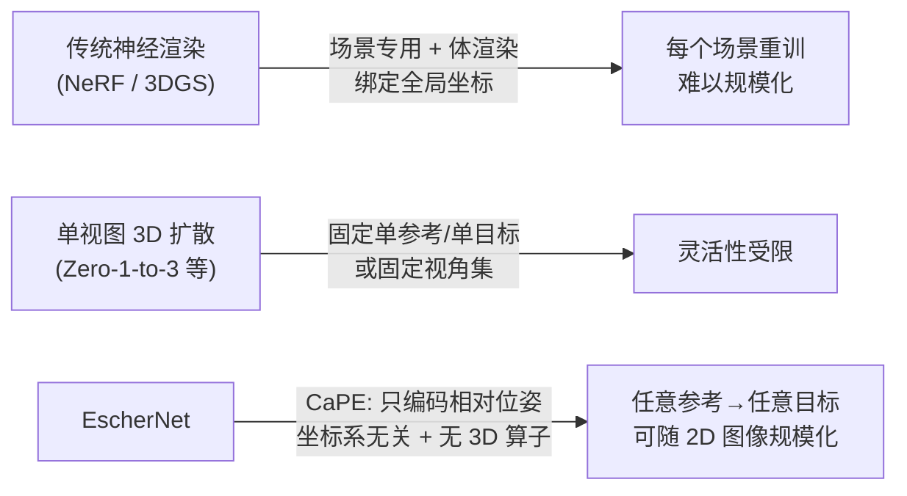

---

## 目录

1. [概览与导读](#1-概览与导读)
2. [问题背景与动机：为什么要"抛弃全局坐标系"](#2-问题背景与动机为什么要抛弃全局坐标系)
3. [纵向：3D 表示学习的演进史](#3-纵向3d-表示学习的演进史)
4. [横向：同期同类方法对比](#4-横向同期同类方法对比)
5. [架构详解：把 Stable Diffusion 改造成多视图生成器](#5-架构详解把-stable-diffusion-改造成多视图生成器)
6. [核心创新：CaPE 深度解析](#6-核心创新cape-深度解析)
7. [训练与实验设置](#7-训练与实验设置)
8. [消融与实验分析：哪些设计有效、哪些更有效、哪些没那么有效](#8-消融与实验分析哪些设计有效哪些更有效哪些没那么有效)
9. [与 Qwen-RobotManip 的关联：CaPE 的血脉传承与"视觉空间锚定"](#9-与-qwen-robotmanip-的关联cape-的血脉传承与视觉空间锚定)
10. [局限与未来工作](#10-局限与未来工作)
11. [总结](#11-总结)
12. [术语表与参考文献](#12-术语表与参考文献)
13. [补篇：CaPE 之后——2024-2026 年的演进图谱与后续方法深度解析](#13-补篇cape-之后2024-2026-年的演进图谱与后续方法深度解析)

---

## 1. 概览与导读

EscherNet（CVPR 2024 Oral）要回答一个根本问题：**如何学习一种通用的 3D 表示，以支撑"可扩展"的视图合成？** 作者给出的答案不是更精细的几何表示，而是一次"视角的转换"——把 3D 表示学习的重心，从"重建一个绑定在全局坐标系里的场景"迁移到"学习多张带位姿图像之间的相对几何关系"。

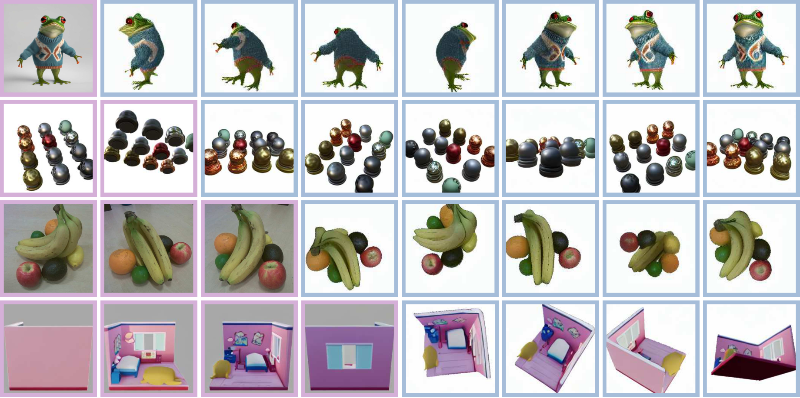

*上图（论文 teaser）：最左列粉框为参考视图（可 1 张、也可多张），右侧蓝框为 EscherNet 在任意指定相机位姿下生成的目标视图。从合成物体（青蛙、棋子）到真实拍摄物体（水果），再到场景级房间，EscherNet 都能给出视角一致的合成结果。*

**核心贡献一览：**

| 特性 | 含义 | 由什么保证 |
|---|---|---|
| **一致性（Consistency）** | 目标↔目标、参考↔目标都视角一致 | self/cross-attention 语义重定义 + CaPE 相对位姿 |
| **可扩展性（Scalability）** | 脱离场景专用优化、无 3D 卷积/体渲染，可随普通 2D 带位姿图像规模化 | CaPE 让表示与坐标系解耦 |
| **泛化性（Generalisation）** | 仅用 3 参考→3 目标训练，却能生成任意数量、任意位姿目标视图，且参考越多越好 | Transformer 对可变 token 数的天然支持 + CaPE |

**阅读地图：** §2–§4 建立"为什么"（动机、纵向演进、横向对比）；§5 讲清架构"是什么"；§6 是全篇重心——CaPE 的数学推导与逐行代码；§7–§8 用实验回答"哪些设计真正有效"；§9 把 EscherNet 与 Qwen-RobotManip 的"视觉空间锚定"打通；§10–§12 收尾。

## 2. 问题背景与动机：为什么要"抛弃全局坐标系"

视图合成（View Synthesis）是计算机视觉与图形学的基础任务：给定若干参考视角的图像，重新渲染出任意新视角下的画面，这模拟了人类视觉的适应能力，对物体操控、导航等日常任务至关重要。EscherNet 的动机建立在作者对既有范式的两点反思上。

### 2.1 观察一：主流方法都"绑定"在场景专用的全局坐标系上

从 NeRF 到 InstantNGP、3D Gaussian Splatting，近年视图合成的进步几乎都聚焦于**训练/渲染效率**，但它们**无一例外依赖体渲染（volumetric rendering）在一个全局 3D 空间坐标系里逐场景优化**。这带来一个结构性缺陷——**场景专用（scene-specific）**：

- 每个新场景都要从头优化一套参数（哪怕只是换了个物体）；
- 表示与"全局 3D 坐标"强耦合，难以跨场景共享先验；
- 因此**难以规模化**——你无法像训练语言模型那样，把海量场景的知识压进同一套权重。

EscherNet 主张一次范式转变：**让 3D 表示只依赖场景的颜色与几何本身，学习隐式表示，既不需要真值 3D 几何，也独立于任何特定坐标系。** 这份"坐标系无关性"正是可扩展性的前提。

### 2.2 观察二：视图合成本质上是"条件生成"问题

当参考视图很稀疏时，正确的做法不是给出一个确定答案，而是像图像修复（in-painting）那样给出**多个合理的预测**——利用生成模型的随机性，从自然图像统计与语义先验中"脑补"看不见的部分。随着信息增多（参考视图变多），生成结果应逐渐收敛到真值。

而当时的 3D 生成模型（Zero-1-to-3、SyncDreamer、Wonder3D 等）大多**只支持单张参考视图**，或只能生成**固定视角集**。EscherNet 认为，理想的生成式表述应当**灵活适配任意信息量**：1 张参考也能生成，10 张参考则更准。

> 这两点观察共同指向同一个设计支点：**把"相对相机位姿"作为一等公民注入模型，而非把"绝对世界坐标"烧进网络。** 这正是下一章 CaPE 要解决的问题。


## 3. 纵向：3D 表示学习的演进史

要理解 EscherNet 的定位，需要把它放回 3D 表示学习十余年的脉络里。下面这条时间线勾勒了"表示如何一步步从显式几何走向隐式、从场景专用走向生成式、最终走向坐标系无关"。

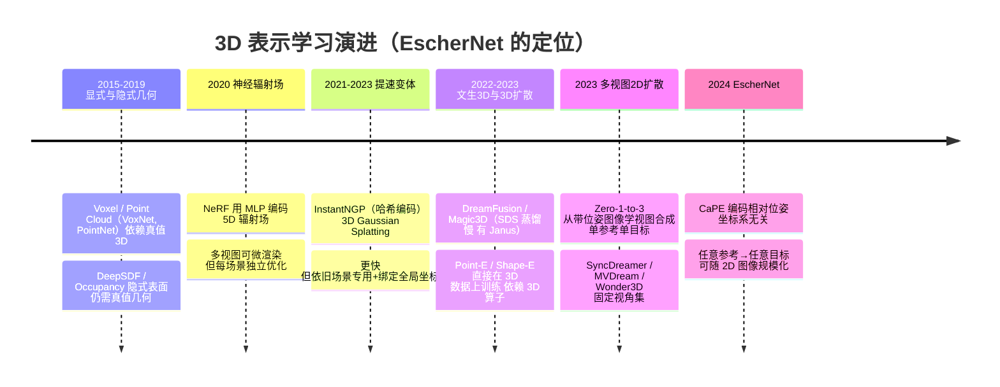

### 3.1 三个阶段的关键转折

**阶段一：显式/隐式几何（依赖真值 3D）。** 早期工作直接在 3D 数据上做文章：体素（VoxNet）、点云（PointNet/++）是显式表示；DeepSDF、Occupancy Networks 把 3D 坐标映射到符号距离/占据概率，是隐式表示。它们的共同软肋是**重度依赖真值 3D 几何**，只能用在 ShapeNet 这类小规模合成数据上。

**阶段二：神经渲染（摆脱真值几何，但绑定坐标系）。** NeRF 用可微体渲染，只需多视图带位姿图像即可优化出高质量辐射场，掀起了视图合成浪潮。后续 InstantNGP（哈希编码）、3D Gaussian Splatting（高斯基元）大幅提速。但它们**把 3D 场景与空间坐标紧耦合**，且**逐场景优化**——这正是 EscherNet 要突破的"场景专用"瓶颈。PixelNeRF 试图跨场景学先验，却受限于体渲染的高计算成本。

**阶段三：生成式（引入 2D 扩散先验）。** 2D 扩散模型的成功催生了文生 3D（DreamFusion/Magic3D，靠 SDS 蒸馏，慢且有多面 Janus 问题）与直接在 3D 数据上训练的 3D 扩散（Point-E/Shape-E，依赖昂贵的 3D 卷积/体渲染）。真正接近 EscherNet 的是**多视图 2D 扩散**：Zero-1-to-3 首次从大规模 3D 数据集渲染出的成对带位姿图像里学会视图合成，但只能"单参考→单目标"。SyncDreamer、MVDream、Wonder3D 等虽支持多视图一致性，却锁死在**固定视角集**上。

### 3.2 为什么 EscherNet 抛弃"全局坐标系"是关键一跃

前两个阶段的方法都隐含一个假设：存在一个**标准化的全局绝对坐标系**，场景/物体被"钉"在里面。EscherNet 指出——**在 3D 空间里，根本不存在标准化的绝对全局相机位姿**；两个视图之间唯一有物理意义的量是它们的**相对相机变换**。

这与语言模型对 token 位置的处理形成鲜明对比（详见 §6.1）：语言里 token 位置总从 0 开始、线性离散无界；而 3D 视觉里旋转是循环、连续、有界的，平移是线性、连续、无界的，且**没有天然的"位置 0"**。EscherNet 的洞见是：**既然只有相对位姿有意义，就应该设计一种位置编码，让注意力天然只看相对位姿**——这就是 CaPE，也是它能"随普通 2D 带位姿图像规模化"的根本原因。


## 4. 横向：同期同类方法对比

把 EscherNet 与同期最相关的多视图生成/重建方法逐项对比，可以清楚看到它在"灵活性"这一维度上的独特性。

| 方法 | 参考视图 | 目标视图 | 视角/仰角约束 | 坐标依赖 | 3D 算子开销 | 多视图一致性 |
|---|---|---|---|---|---|---|
| **Zero-1-to-3** | 单张 | 单张 | 相对位姿（球坐标） | 单目标、无跨目标一致 | 无（2D 扩散） | 目标间**不保证**一致 |
| **SyncDreamer** | 单张 | **固定 16 视** | **固定仰角** | 依赖固定视角布局 | 3D 体素注意力（较重） | 固定视一致 |
| **MVDream / Wonder3D** | 单张（文/图） | **固定视角集** | 固定 | 固定视角布局 | 中 | 固定视一致 |
| **One-2-3-45** | 单张 | 经由 Zero123 预测多视 → SDF | 固定 | 依赖 Zero123 | 中（SDF 解码） | 间接 |
| **GTA**（并行工作） | 多视 | 多视 | 6DoF 场景级 | 相对位姿（几何变换注意力） | 无 | 场景级一致 |
| **EscherNet** | **任意 N** | **任意 M、任意位姿** | **无固定约束** | **仅相对位姿（CaPE）** | **无 3D 算子** | 参考↔目标 **且** 目标↔目标一致 |

### 4.1 与 Zero-1-to-3 的核心差异

Zero-1-to-3 是多视图 2D 扩散的开山之作，也是 EscherNet 最直接的对照：两者用**同一份** Objaverse 训练数据、同一个 Stable Diffusion 骨干。但 Zero-1-to-3 把位姿作为**一个额外的条件向量**喂给网络，架构上只能"单参考→单目标"，且无法保证多个目标视图彼此一致。EscherNet 把位姿**通过 CaPE 注入每个 token**，于是参考数 N、目标数 M 都可任意，且天然获得两类一致性。实验中 EscherNet 用 800K 数据就超过了用 10M 数据（×10）训练的 Zero-1-to-3-XL（见 §8.1）。

### 4.2 与 SyncDreamer / 固定视角方法的差异

SyncDreamer、Wonder3D 等为了保证一致性，把目标视角**固定**（如 SyncDreamer 固定 16 视、固定仰角），并引入较重的 3D 结构（体素/3D 注意力）。这让它们**丧失了"任意位姿"的灵活性**，且难以随非结构化的 2D 图像扩展。EscherNet 靠 CaPE 的相对位姿一致性，不需要固定视角布局，也不需要任何 3D 算子。

### 4.3 与并行工作 GTA / PRoPE 的关系（重要）

论文明确指出：**6DoF CaPE 与 GTA（Geometric Transform Attention，Miyato et al., 2024）是并行、独立提出的**，只是 GTA 聚焦场景级表示。二者共享"用几何变换作用在 token 上，使注意力只看相对位姿"的核心思想。这条线索非常关键——它正是通往 Qwen-RobotManip 的桥梁：后者的 CaPE 实现同时借鉴了 EscherNet（相对位姿编码）与 GTA/PRoPE（把编码扩展到 Value 与注意力输出、并编码相机内参），详见 [§9](#9-与-qwen-robotmanip-的关联cape-的血脉传承与视觉空间锚定)。


## 5. 架构详解：把 Stable Diffusion 改造成多视图生成器

### 5.1 问题形式化

EscherNet 把视图合成写成一个条件生成问题：

$$
\mathcal{X}^T \sim p\big(\mathcal{X}^T \mid \mathcal{X}^R,\ \mathcal{P}^R,\ \mathcal{P}^T\big).
$$

其中：

- $\mathcal{X}^R=\{\mathbf{X}^R_{1:N}\}$、$\mathcal{P}^R=\{\mathbf{P}^R_{1:N}\}$ 是 $N$ 张**参考视图**及其全局相机位姿；
- $\mathcal{X}^T=\{\mathbf{X}^T_{1:M}\}$、$\mathcal{P}^T=\{\mathbf{P}^T_{1:M}\}$ 是 $M$ 张**目标视图**及其全局相机位姿；
- $N$、$M$ 在训练与推理时都可取**任意值**。

关键的架构约束是：每个目标视图 $\mathbf{X}^T_i$ 的生成，**只依赖它与各参考视图的相对相机变换** $(\mathbf{P}^R_j)^{-1}\mathbf{P}^T_i$。注意这里出现的是相对位姿——全局位姿 $\mathbf{P}$ 只是中间量，真正进入注意力的是它们的"差"。这一约束由 CaPE 在数学上强制实现（§6）。

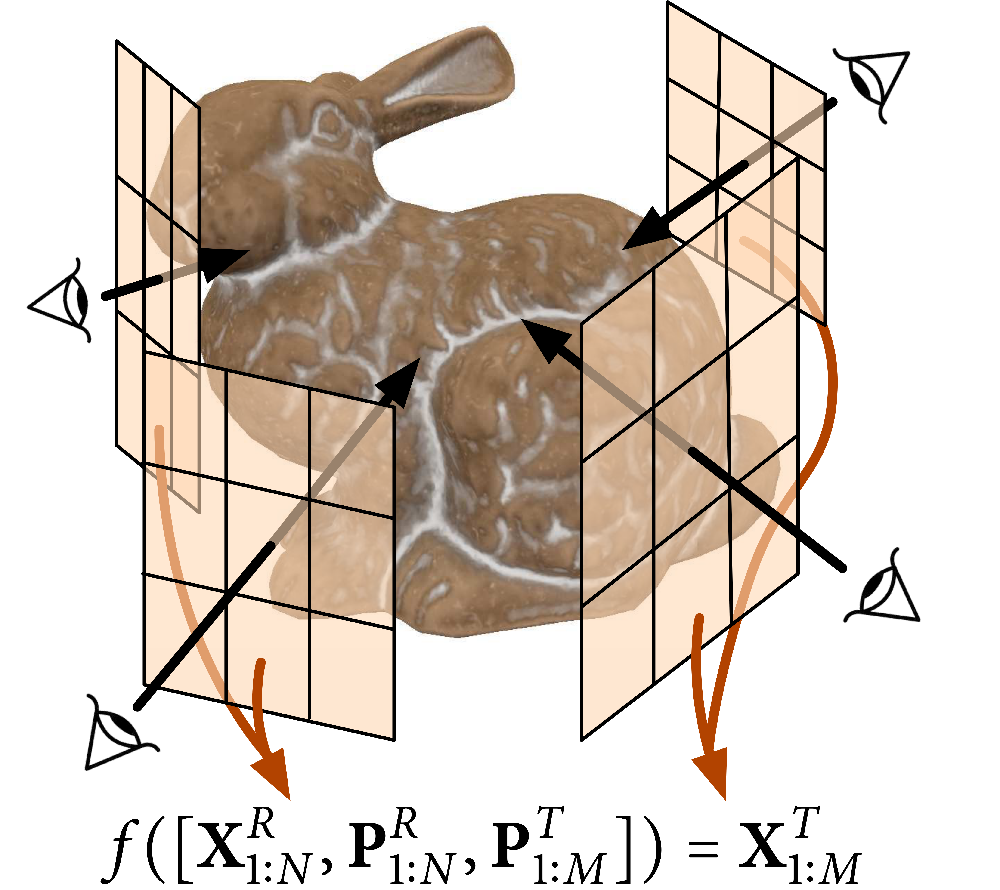

*上图（论文 Fig. 3 的 EscherNet 子图）：EscherNet 用一个函数 $f([\mathbf{X}^R_{1:N},\mathbf{P}^R_{1:N},\mathbf{P}^T_{1:M}])=\mathbf{X}^T_{1:M}$ 表达视图合成——参考视图/位姿是"条件"，目标位姿是"查询"，输出目标视图。它不构建任何显式 3D 体，只学习多视图之间的相对几何关系。*

### 5.2 两条设计原则

1. **站在 2D 扩散模型的肩膀上**：直接复用 Stable Diffusion v1.5，继承其在网络级数据上学到的强 2D 先验；
2. **像语言模型编码 token 位置那样，为每张视图编码相机位姿**——于是模型天然能处理任意数量视图，实现 *any-to-any* 视图合成，且**不引入任何新的可学习参数**。

### 5.3 self-attention 与 cross-attention 的"语义重定义"

这是 EscherNet 最精巧的一步：它没有新增模块，而是**重新诠释了 Stable Diffusion U-Net 里两种注意力的语义**。

| 注意力块 | 原始 Stable Diffusion（文生图） | EscherNet（多视图生成） | 保证的一致性 |
|---|---|---|---|
| **self-attention** | 同一张图内不同 patch 之间的交互 | **$M$ 张目标视图之间**跨图 patch 的交互 | 目标↔目标一致性 |
| **cross-attention** | 把文本信息注入图像 patch | **$N$ 张参考视图 → $M$ 张目标视图**的交互 | 参考↔目标一致性 |

在**每一个注意力块**里，CaPE 都作用于 key 与 query，使注意力图学习到的是**相对相机位姿**，与具体坐标系无关。

### 5.4 参考视图的条件编码：为什么弃用冻结 CLIP，改用 ConvNeXtv2-Tiny

视图合成要求条件信号同时捕捉**高层语义**与**低层纹理**。此前的 3D 扩散（Zero-1-to-3、SyncDreamer）用**冻结的 CLIP ViT** 编码高层语义，再把参考图像**拼接进 U-Net 输入**来补低层信号——但拼接输入的做法**天然只能处理单张参考视图**。

EscherNet 改为把参考视图编码成**一组 token**，高低层信号都由同一个条件编码器承担，从而支持可变数量参考视图。作者发现：

- 仅用**冻结 CLIP-ViT** 无法捕捉低层纹理——即便把参考位姿当作目标位姿，也难以复现原参考视图；
- 微调 CLIP-ViT 可以解决，但训练代价高；
- 最终选择微调一个**轻量的 `ConvNeXtv2-Tiny`**（高效 CNN），把参考视图压成小分辨率图像特征，作为条件 token。实验证明这在生成质量与训练效率上都更优。

### 5.5 静态组件图

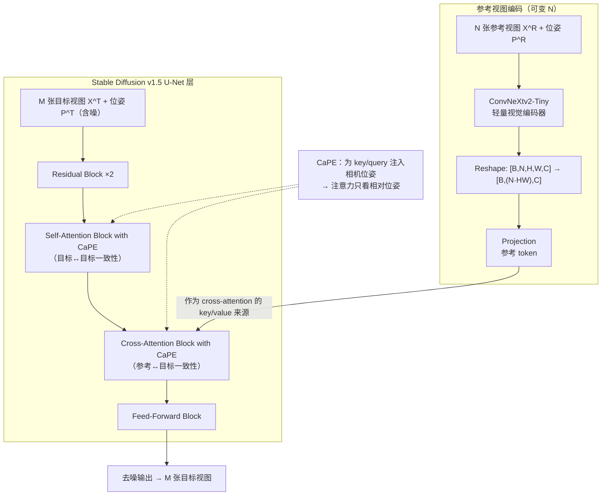

**对照论文原始架构图：**

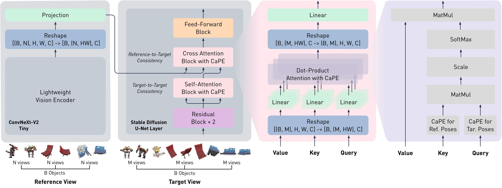

*论文原图从左到右：①参考视图经 ConvNeXtv2-Tiny 编码并 reshape/projection 成 token；②目标视图进入 SD U-Net 层，依次经过 Residual、带 CaPE 的 Self-Attention（目标↔目标）、带 CaPE 的 Cross-Attention（参考↔目标）、Feed-Forward；③右侧展开点积注意力，key/query 分别注入"参考位姿的 CaPE"和"目标位姿的 CaPE"，再走标准的 MatMul→Scale→SoftMax→MatMul。注意 Value **不** 参与 CaPE（这一点在 Qwen-RobotManip 中被 GTA/PRoPE 式改造扩展，见 §9）。*

### 5.6 前向数据流时序图

```mermaid
sequenceDiagram
    autonomber
    participant U as 用户/采样器
    participant E as ConvNeXtv2 编码器
    participant SA as Self-Attn (+CaPE)
    participant CA as Cross-Attn (+CaPE)
    participant D as 扩散去噪循环
    U->>E: 输入 N 张参考视图 X^R + 位姿 P^R
    E-->>CA: 参考 token（key/value 源）
    U->>D: 指定 M 个目标位姿 P^T + 初始噪声
    loop 每个扩散步 t
        D->>SA: M 个含噪目标 token（query/key 注入 P^T 的 CaPE）
        SA-->>D: 目标↔目标一致的特征
        D->>CA: 目标 token 查询参考 token<br/>（query 注入 P^T、key 注入 P^R 的 CaPE）
        CA-->>D: 融合参考信息、参考↔目标一致的特征
        D->>D: 预测噪声 → 更新目标 token
    end
    D-->>U: M 张视角一致的目标视图 X^T
```


## 6. 核心创新：CaPE 深度解析

> 这是全篇重心。CaPE（Camera Positional Encoding，相机位置编码）的目标只有一个：**让点积注意力的分数只依赖两台相机的相对位姿，而与世界坐标系的选取无关**。它借鉴了语言领域的旋转位置编码（RoPE），但针对 3D 相机位姿的特殊结构做了 4DoF 与 6DoF 两种设计。

### 6.1 语言位置 vs 3D 视觉位置：为什么不能照搬 RoPE

CaPE 的出发点是对比两个领域"位置"的本质差异：

| 维度 | 语言（token 位置） | 3D 视觉（相机位姿） |
|---|---|---|
| 结构 | **线性、离散、无界** | 旋转：**循环、连续、有界**；平移：线性、连续、无界 |
| 起点 | 总是从 0 开始 | **没有标准化的绝对全局位姿**；只有相对变换有意义 |
| 挑战 | 外推到超过训练上下文长度 | 必须内建"坐标系无关"性 |

RoPE 用一个**旋转矩阵**作用在 query/key 上，使注意力分数只依赖二者的**相对**位置（角度差）。CaPE 的核心策略与之一脉相承：**直接对嵌入在 token 特征里的全局相机位姿施加一个变换，让点积注意力自动编码相对相机变换**。区别在于——语言只有一维线性位置，而相机位姿是 4DoF（物体中心）或 6DoF（一般情形）的结构化量。

### 6.2 4DoF CaPE：物体中心的球坐标解耦

对物体中心渲染，相机位姿可用**球坐标**表示，四个分量**互相解耦**：

$$
\mathbf{P}=\{\alpha,\ \beta,\ \gamma,\ r\},
$$

其中 $\alpha$ 为方位角（azimuth，$\in[0,2\pi)$）、$\beta$ 为仰角（elevation，$\in[0,\pi)$）、$\gamma$ 为沿光轴的相机朝向/滚转（$\in[0,2\pi)$）、$r$ 为相机到物体的距离（半径，$>0$）。

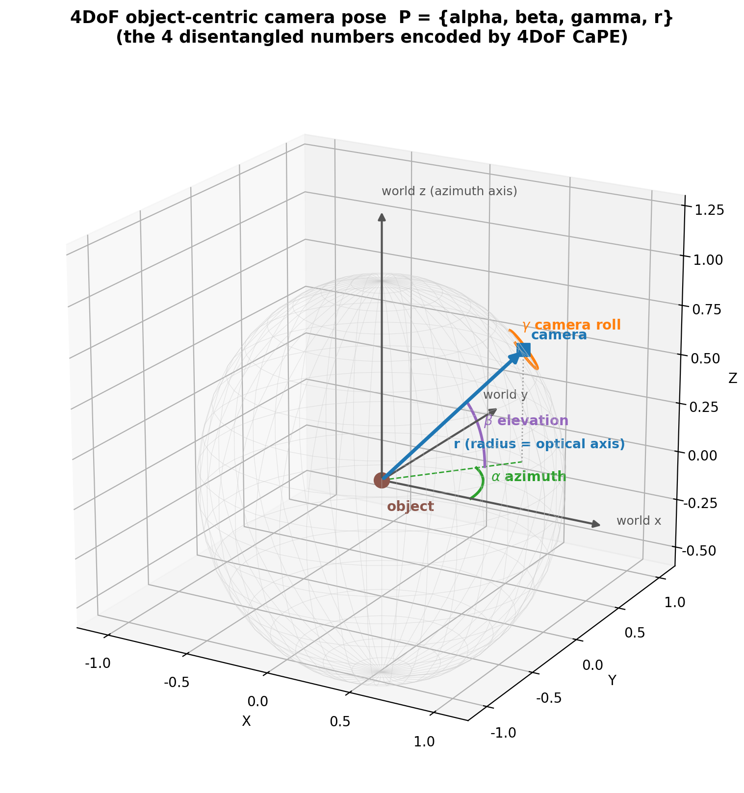

*自绘示意：物体在原点，相机落在观察球面上。方位角 $\alpha$（绿色，绕世界 $z$ 轴）、仰角 $\beta$（紫色）、半径 $r$（蓝色，同时也是光轴方向）、相机滚转 $\gamma$（橙色，绕光轴）。四个量彼此独立，可以像 RoPE 处理"多维位置"那样分别编码。*

#### 6.2.1 位置编码函数应满足的条件

设位置编码函数为 $\pi(\mathbf{v},\mathbf{P})$，作用于 $d$ 维 token 特征 $\mathbf{v}\in\mathbb{R}^d$。要让点积只看相对量，它需满足：

$$
\big\langle \pi(\mathbf{v}_1,\theta_1),\ \pi(\mathbf{v}_2,\theta_2)\big\rangle = \big\langle \pi(\mathbf{v}_1,\theta_1-\theta_2),\ \pi(\mathbf{v}_2,0)\big\rangle, \tag{\text{角度条件}}
$$

$$
\big\langle \pi(\mathbf{v}_1,r_1),\ \pi(\mathbf{v}_2,r_2)\big\rangle = \big\langle \pi(\mathbf{v}_1,r_1/r_2),\ \pi(\mathbf{v}_2,1)\big\rangle, \tag{\text{半径条件}}
$$

其中 $\theta\in\{\alpha,\beta,\gamma\}$。直观含义：**相对 4DoF 变换被分解为旋转的角度差与半径的尺度比**。第一式恰好就是 RoPE 的公式；第二式因为 $\log r_1-\log r_2=\log(s r_1)-\log(s r_2)$（对任意 $s>0$ 成立），也可以化成"差"的形式，于是能和第一式统一。

#### 6.2.2 统一为块对角旋转矩阵

$$
\pi(\mathbf{v},\mathbf{P})=\boldsymbol\phi(\mathbf{P})\,\mathbf{v},\qquad
\boldsymbol\phi(\mathbf{P})=\mathrm{blockdiag}(\boldsymbol\Psi,\dots,\boldsymbol\Psi),\qquad
\boldsymbol\Psi=\mathrm{blockdiag}(\boldsymbol\Psi_\alpha,\boldsymbol\Psi_\beta,\boldsymbol\Psi_\gamma,\boldsymbol\Psi_r).
$$

每个 $2\times2$ 子块都是一个二维旋转：

$$
\boldsymbol\Psi_\theta=\begin{bmatrix}\cos\theta & -\sin\theta\\ \sin\theta & \cos\theta\end{bmatrix},\qquad
\boldsymbol\Psi_r=\begin{bmatrix}\cos f(r) & -\sin f(r)\\ \sin f(r) & \cos f(r)\end{bmatrix},
$$

其中半径经**对数归一化**映射到旋转角区间 $[0,\pi]$：

$$
f(r)=\pi\,\frac{\log r-\log r_{\min}}{\log r_{\max}-\log r_{\min}}\in[0,\pi]. \tag{\text{对数归一化}}
$$

**为什么用对数归一化？** 半径本身是无界正数，直接当角度会绕圈（$2\pi$ 周期），导致"远近"与"点积大小"不再单调。把 $\log r$ 线性压到 $[0,\pi]$（旋转角的"半圈"内），能保证点积随尺度差**单调变化**——远的更远、近的更近，在注意力里有稳定语义。约束：$\dim(\mathbf{v})=d$ 必须能被 $2|\mathbf{P}|=8$ 整除（4 个分量、每个占 2 维）。

### 6.3 6DoF CaPE：SE(3) 纠缠位姿与 Lie 群等价

对一般 6DoF 相机，位姿是一个 $SE(3)$ 齐次矩阵：

$$
\mathbf{P}=\begin{bmatrix}\mathbf{R} & \mathbf{t}\\ \mathbf{0} & 1\end{bmatrix}\in SE(3).
$$

此时旋转与平移**纠缠**在一起，无法像 4DoF 那样拆成多个独立的一维位置。位置编码需满足的条件变为：

$$
\big\langle \pi(\mathbf{v}_1,\mathbf{P}_1),\ \pi(\mathbf{v}_2,\mathbf{P}_2)\big\rangle
=\big\langle \pi(\mathbf{v}_1,\mathbf{P}_2^{-1}\mathbf{P}_1),\ \pi(\mathbf{v}_2,\mathbf{I})\big\rangle. \tag{\text{6DoF 条件}}
$$

即：点积只依赖相对位姿 $\mathbf{P}_2^{-1}\mathbf{P}_1$。

#### 6.3.1 关键推导：为什么 key 用 $\mathbf{P}$、query 用 $\mathbf{P}^{-\top}$

沿用 4DoF 的思路，把 $\mathbf{P}\in\mathbb{R}^{4\times4}$ 扩成块对角矩阵 $\boldsymbol\phi(\mathbf{P})\in\mathbb{R}^{d\times d}$（每个对角块都是 $\mathbf{P}$）。由于 $\boldsymbol\phi(\mathbf{P})$ 也构成一个实 Lie 群，可以做如下等价变形：

$$
\begin{aligned}
\big(\boldsymbol\phi(\mathbf{P}_2^{-1}\mathbf{P}_1)\,\mathbf{v}_1\big)^{\!\top}\big(\boldsymbol\phi(\mathbf{I})\,\mathbf{v}_2\big)
&= \mathbf{v}_1^{\top}\,\boldsymbol\phi\!\big(\mathbf{P}_1^{\top}\mathbf{P}_2^{-\top}\big)\,\mathbf{v}_2 \\
&= \big(\mathbf{v}_1^{\top}\,\boldsymbol\phi(\mathbf{P}_1^{\top})\big)\big(\boldsymbol\phi(\mathbf{P}_2^{-\top})\,\mathbf{v}_2\big) \\
&= \big(\boldsymbol\phi(\mathbf{P}_1)\,\mathbf{v}_1\big)^{\!\top}\big(\boldsymbol\phi(\mathbf{P}_2^{-\top})\,\mathbf{v}_2\big) \\
&= \big\langle \pi(\mathbf{v}_1,\boldsymbol\phi(\mathbf{P}_1)),\ \pi(\mathbf{v}_2,\boldsymbol\phi(\mathbf{P}_2^{-\top}))\big\rangle.
\end{aligned}
$$

**逐步拆解这条推导（这是理解 CaPE 的钥匙）：**

- 第一行到第二行：$\boldsymbol\phi$ 是群同态，$\boldsymbol\phi(\mathbf{P}_2^{-1}\mathbf{P}_1)=\boldsymbol\phi(\mathbf{P}_2^{-1})\boldsymbol\phi(\mathbf{P}_1)$；再用转置恒等式 $(\mathbf{A}\mathbf{v}_1)^\top=\mathbf{v}_1^\top\mathbf{A}^\top$，把作用在 $\mathbf{v}_1$ 上的矩阵转置搬到中间，得到 $\mathbf{v}_1^\top\boldsymbol\phi(\mathbf{P}_1^\top\mathbf{P}_2^{-\top})\mathbf{v}_2$（因为 $(\mathbf{P}_2^{-1}\mathbf{P}_1)^\top=\mathbf{P}_1^\top\mathbf{P}_2^{-\top}$）。
- 第二行到第三行：再次用群同态把 $\boldsymbol\phi(\mathbf{P}_1^\top\mathbf{P}_2^{-\top})$ 拆成 $\boldsymbol\phi(\mathbf{P}_1^\top)\boldsymbol\phi(\mathbf{P}_2^{-\top})$，并把 $\boldsymbol\phi(\mathbf{P}_1^\top)=\boldsymbol\phi(\mathbf{P}_1)^\top$ 归还给 $\mathbf{v}_1$。
- **结论**：只要给 **key** 施加 $\boldsymbol\phi(\mathbf{P}_2)$、给 **query** 施加 $\boldsymbol\phi(\mathbf{P}_2^{-\top})$（更一般地 query 用 $\mathbf{P}^{-\top}$），点积就自动等于"相对位姿 $\mathbf{P}_2^{-1}\mathbf{P}_1$ 作用、参考置为单位阵"的结果——**全局世界原点被代数消去**。

#### 6.3.2 全局原点为何消去：一张图看懂

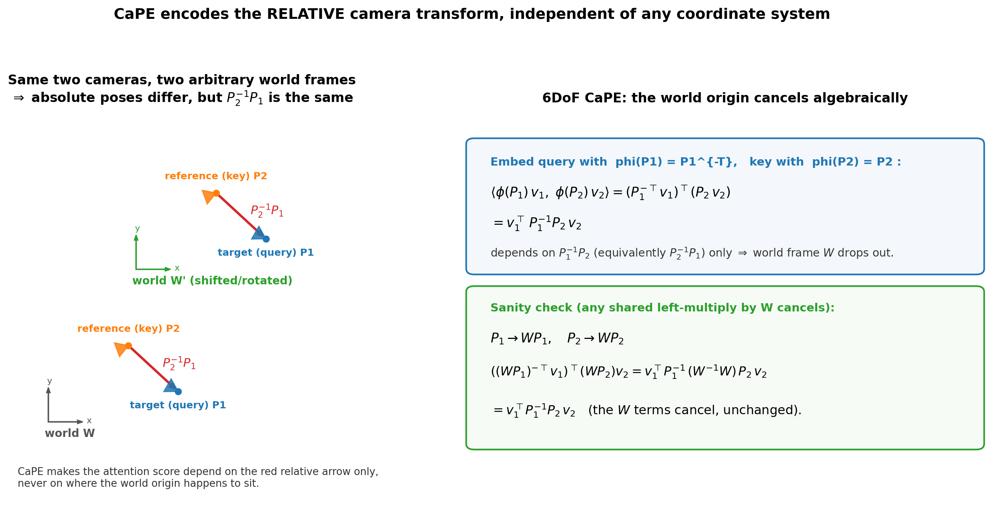

*左：同样两台相机（参考 key = $\mathbf{P}_2$、目标 query = $\mathbf{P}_1$），放在两个任意选取的世界系 $W$ 与 $W'$ 里——绝对位姿完全不同，但相对变换 $\mathbf{P}_2^{-1}\mathbf{P}_1$（红箭头）完全相同。右：3 行代数说明——query 注入 $\mathbf{P}_1^{-\top}$、key 注入 $\mathbf{P}_2$，点积化为 $\mathbf{v}_1^\top\mathbf{P}_1^{-1}\mathbf{P}_2\mathbf{v}_2$；对任意共同左乘的世界变换 $W$（$\mathbf{P}_i\to W\mathbf{P}_i$），$W^{-1}W=\mathbf{I}$ 相消，分数不变。这就是"坐标系无关"的严格含义。*

6DoF CaPE 的形式：

$$
\pi(\mathbf{v},\mathbf{P})=\boldsymbol\phi(\mathbf{P})\,\mathbf{v},\qquad
\boldsymbol\phi(\mathbf{P})=\mathrm{blockdiag}(\boldsymbol\Psi,\dots,\boldsymbol\Psi),\qquad
\boldsymbol\Psi=\begin{cases}\mathbf{P} & \text{若为 key}\\ \mathbf{P}^{-\top} & \text{若为 query}\end{cases}.
$$

约束：$\dim(\mathbf{v})=d$ 必须能被 $\dim(\mathbf{P})=4$ 整除。平移 $\mathbf{t}$ 同样要缩放到单位范围以利训练（代码里用小标量 $s$）。论文特别注明：**6DoF CaPE 与 GTA（Miyato et al., 2024）是并行独立提出的**，GTA 侧重场景级表示。

### 6.4 逐行代码解读

CaPE 的美妙之处在于实现极简。下面并置论文附录的 **numpy 教学版**与官方仓库 `CaPE.py` 的 **PyTorch 工程版**。

#### 6.4.1 numpy 教学版（论文附录）

4DoF：直接按 §6.2.2 拼出 $8\times8$ 的块对角旋转矩阵 $\boldsymbol\Psi$，再右乘特征。

```python
def compute_4dof_cape(v, P, s):
    # v: 特征向量，其维度必须能被 8 整除；P = [alpha, beta, gamma, r]；s: 半径的小标量
    v = v.reshape([-1, 8])              # 把特征切成若干个 8 维块（4 分量 × 每块 2 维）
    psi = np.zeros([8, 8])
    for i in range(4):
        if i < 3:                       # 前三个分量 alpha/beta/gamma：普通 2D 旋转块
            psi[2*i:2*(i+1), 2*i:2*(i+1)] = \
                np.array([[np.cos(P[i]), -np.sin(P[i])],
                          [np.sin(P[i]),  np.cos(P[i])]])
        else:                           # 第四个分量半径 r：先取 log 再乘小标量 s（等价于 §6.2 的 f(r)）
            psi[2*i:2*(i+1), 2*i:2*(i+1)] = \
                np.array([[np.cos(s*np.log(P[i])), -np.sin(s*np.log(P[i]))],
                          [np.sin(s*np.log(P[i])),  np.cos(s*np.log(P[i]))]])
    return v.dot(psi).reshape(-1)       # 右乘块对角旋转矩阵，再摊平回原形状
```

6DoF：更简洁——key 直接用 $\mathbf{P}$，query 用 $\mathbf{P}^{-\top}$（`np.linalg.inv(P).T`）。

```python
def compute_6dof_cape(v, P, s=0.001, key=True):
    # v: 特征向量，其维度必须能被 4 整除；P: 4x4 SE(3) 矩阵；s: 平移缩放标量
    v = v.reshape([-1, 4])              # 把特征切成若干个 4 维块，对应 P 的 4x4
    P[:3, 3] *= s                       # 平移分量缩放到单位范围（数值稳定）
    psi = P if key else np.linalg.inv(P).T   # key: P；query: P^{-T} —— 正是 §6.3.1 的结论
    return v.dot(psi).reshape(-1)
```

#### 6.4.2 PyTorch 工程版（仓库 `CaPE.py`）

**6DoF** 用 `einops` 做批量化，并把"query 用 $\mathbf{P}^{-\top}$、key 用 $\mathbf{P}$"封装进注意力：

```python
class CaPE_6DoF:
    def cape_embed(self, f, P):
        # f: [..., d]；P: 4x4；返回 f 被位姿 P 编码后的特征 f@P
        f = einops.rearrange(f, '... (d k) -> ... d k', k=4)   # 每 4 维一组，准备右乘 4x4
        return einops.rearrange(f @ P, '... d k -> ... (d k)', k=4)

    def attn_with_CaPE(self, f1, f2, p1, p2):
        # f1=query [b,(t1 l),d], f2=key [b,(t2 l),d]; p1,p2: [b,t,4,4]
        l = f1.shape[1] // p1.shape[1]                          # 每个视图内的 token 数
        # query 用 P1 的逆转置：inverse(p1).permute(...,3,2) 即 P1^{-T}
        p1_invT = einops.repeat(torch.inverse(p1).permute(0, 1, 3, 2),
                                'b t m n -> b (t l) m n', l=l)
        query = self.cape_embed(f1, p1_invT)                    # query = f1 @ P1^{-T}
        p2_copy = einops.repeat(p2, 'b t m n -> b (t l) m n', l=l)
        key = self.cape_embed(f2, p2_copy)                      # key   = f2 @ P2
        att = query @ key.permute(0, 2, 1)                      # 相对位姿注意力分数
        return att
```

逐点说明：

- `rearrange('... (d k) -> ... d k', k=4)`：把最后一维每 4 个元素分成一组，以便与 $4\times4$ 位姿相乘——这正对应"$d$ 必须能被 4 整除"。
- `torch.inverse(p1).permute(0,1,3,2)`：先求逆再转置最后两维 → $\mathbf{P}_1^{-\top}$，即 query 侧编码。
- `einops.repeat(..., 'b t m n -> b (t l) m n', l=l)`：一个视图内的 $l$ 个 patch token **共享同一相机位姿**，故把位姿沿 token 维复制 $l$ 份。
- `att = query @ key.T`：施加 CaPE 后的普通点积——分数已只依赖相对位姿。

**不变性验证**（仓库自带的断言）——给 $\mathbf{P}_1,\mathbf{P}_2$ 各右乘同一个随机 $\Delta\mathbf{P}$，注意力分数应完全不变：

```python
att       = cape_6dof.attn_with_CaPE(f1, f2, p1,            p2)
att_delta = cape_6dof.attn_with_CaPE(f1, f2, p1 @ p1_delta, p2 @ p2_delta)  # 同一 delta
assert torch.allclose(att, att_delta, 1e-3)     # 通过 → 世界原点确实被消去
print("6DoF CaPE Verified")
```

这段 `assert` 就是 §6.3.2 那张图的"可执行版证明"：**任意全局变换都不改变注意力**。

**4DoF** 则用 RoPE 式的 `cos/sin` + `rotate_every_two` 实现旋转（等价于块对角旋转矩阵，但更省算力）：

```python
class CaPE_4DoF:
    def rotate_every_two(self, x):
        # 把相邻两维 (x1, x2) 变成 (-x2, x1)，即旋转 90°，用于凑出 cos/sin 旋转
        x = einops.rearrange(x, '... (d j) -> ... d j', j=2)
        x1, x2 = x.unbind(dim=-1)
        x = torch.stack((-x2, x1), dim=-1)
        return einops.rearrange(x, '... d j -> ... (d j)')

    def cape_embed(self, qq, kk, p1, p2):
        m1 = self.cape(qq, p1); m2 = self.cape(kk, p2)          # 把 4 个角度扩展到特征维
        q = (qq * m1.cos()) + (self.rotate_every_two(qq) * m1.sin())   # RoPE 式旋转（query）
        k = (kk * m2.cos()) + (self.rotate_every_two(kk) * m2.sin())   # RoPE 式旋转（key）
        return q, k
```

对应的 4DoF 不变性验证用的是**加法** delta（角度相加，而非矩阵相乘），因为 4DoF 分量是解耦的一维角度：

```python
att       = cape_4dof.attn_with_CaPE(f1, f2, p1,               p2)
att_delta = cape_4dof.attn_with_CaPE(f1, f2, p1 + p1_delta_4dof, p2 + p2_delta_4dof)
assert torch.allclose(att, att_delta, 1e-3)
print("4DoF CaPE Verified")
```

仓库还注释掉了一段"反例"：如果给 4DoF 施加**6DoF 抖动**（真正的 SE(3) 变换），断言会失败——这精准点出 4DoF 的**能力边界**：它只对"物体中心球坐标"下的相对变换不变，而非任意 6DoF 变换。

### 6.5 小结：CaPE 的三个"聪明"之处

1. **零新增参数**：只是对已有 q/k 施加一个由位姿决定的（旋转/矩阵）变换，可插进任何 Transformer。
2. **坐标系无关**：点积天然只看相对位姿，全局原点代数消去——这正是"可扩展"的数学基础。
3. **RoPE 的自然推广**：4DoF 就是"多维 RoPE + 半径对数通道"，6DoF 则借 Lie 群把 RoPE 从"角度差"推广到"SE(3) 相对变换"。


## 7. 训练与实验设置

| 项目 | 配置 |
|---|---|
| 训练数据 | **Objaverse-1.0**（800K 物体），与 Zero-1-to-3 同源；每物体 12 个随机渲染视图 + 随机环境光 |
| 数据清洗 | 过滤空白渲染图（约占 1%） |
| 训练采样 | 每物体从 12 视中**有放回**随机采 **3 参考 + 3 目标**（$N{=}3,M{=}3$） |
| 优化器 | AdamW，lr $1\times10^{-4}$，weight decay 0.01；余弦退火到 $1\times10^{-5}$，100k 步，前 1000 步线性 warmup |
| 分辨率 / 精度 | $256\times256$；`bf16` 自动混合精度 + 梯度检查点（gradient checkpointing） |
| Batch | 总 batch 672（每 GPU 112） |
| 算力 | 6× NVIDIA A100，训练约 **1 周** |
| 2D 指标 | PSNR↑、SSIM↑、LPIPS↓ |
| 3D 指标 | Chamfer Distance↓、Volume IoU↑ |
| 评测公平性 | 每场景每视角只跑一次（不挑选最优），比 SyncDreamer"人工挑参考/挑最优生成"的设置更严格真实 |

评测数据集：**GSO-30**（30 物体，前 10 视为参考、后 15 视为目标，随机位姿+随机光照）、**RTMV**（10 个多物体堆叠复杂场景）、**NeRF-Synthetic**（8 场景，与 InstantNGP/3DGS 对比，后者分别跑 10k/5k 步优化）。


## 8. 消融与实验分析：哪些设计有效、哪些更有效、哪些没那么有效

本章按照"证据强度"组织：先看 EscherNet 相对各类基线的整体胜负，再拆解每个设计选择的边际贡献，最后给出一张"效度总结表"。

### 8.1 新视图合成 vs 3D 扩散模型（GSO / RTMV）

| 方法 | 训练数据 | 参考视图 | GSO-30 PSNR↑ | GSO-30 SSIM↑ | GSO-30 LPIPS↓ | RTMV PSNR↑ |
|---|---|---|---|---|---|---|
| RealFusion | - | 1 | 12.76 | 0.758 | 0.382 | - |
| Zero123 | 800K | 1 | 18.51 | 0.856 | 0.127 | 10.16 |
| Zero123-XL | **10M** | 1 | 18.93 | 0.856 | 0.124 | 10.59 |
| **EscherNet** | 800K | 1 | **20.24** | **0.884** | **0.095** | 10.56 |
| **EscherNet** | 800K | 2 | 22.91 | 0.908 | 0.064 | 12.66 |
| **EscherNet** | 800K | 3 | 24.09 | 0.918 | 0.052 | 13.59 |
| **EscherNet** | 800K | 5 | 25.09 | 0.927 | 0.043 | 14.52 |
| **EscherNet** | 800K | 10 | **25.90** | **0.935** | **0.036** | **15.55** |

**结论（强证据）：** ①即便只有 1 张参考视图，EscherNet（800K 数据）也**超过用 ×10 数据（10M）训练的 Zero123-XL**，说明"把位姿注入每个 token 的相对位姿建模"比"把位姿当额外条件"更高效；②**参考视图越多、质量单调越好**——这正是论文最初的设计目标，也是 Zero-1-to-3 这类单参考方法结构上做不到的。

### 8.2 新视图合成 vs 场景专用神经渲染（NeRF-Synthetic）

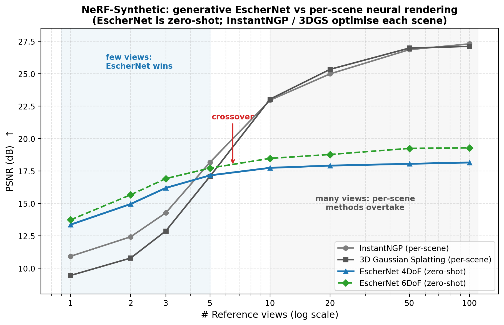

*自绘复刻自论文 Tab. 5（`tab:nerf2`）+ 附录 6DoF 表：横轴为参考视图数（对数轴），纵轴 PSNR。*

**结论（边界证据，最具启发性）：** 存在一个清晰的**交叉点**。当参考视图 **< 5** 时，生成式的 EscherNet 明显胜出——因为 InstantNGP/3DGS 在极稀疏视图下几乎无法优化出有意义的几何；而当参考视图 **> 10** 时，逐场景优化的 InstantNGP/3DGS 快速反超并持续爬升，EscherNet 则趋于饱和（生成模型受限于训练分布，无法无限逼近某个特定场景的真值）。这刻画了"**通用生成先验**"与"**场景专用拟合**"各自的适用区间——EscherNet 不是要取代 NeRF，而是补上"稀疏视图"这一端。

### 8.3 单/多图 3D 重建（GSO）

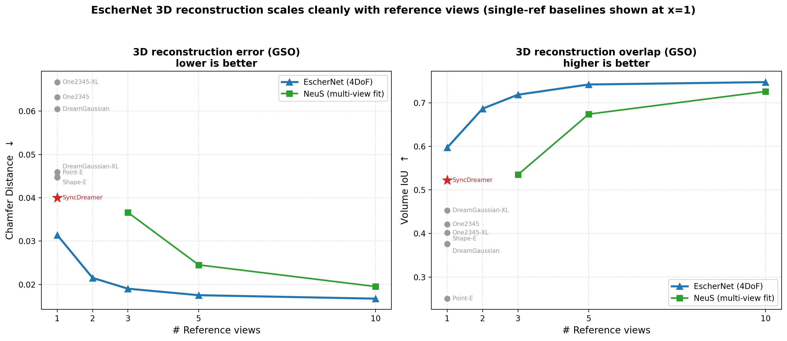

*自绘复刻自论文 Tab. 6（`tab:3D`）：左 Chamfer↓、右 IoU↑；EscherNet(4DoF) 为折线，NeuS 为对照折线，单参考基线（Point-E/Shape-E/One2345(-XL)/DreamGaussian(-XL)/SyncDreamer）标在 x=1。*

**结论（强证据）：** EscherNet 生成的稠密一致视图喂给 NeuS 做重建，**单视图时 Chamfer 比 SyncDreamer 好约 25%，10 视图时好约 60%**；且随参考视图增多，Chamfer 单调下降、IoU 单调上升，扩展性"干净"。相比之下，One-2-3-45-XL、DreamGaussian-XL 即使用更大预训练模型，重建仍偏过平滑/带噪；SyncDreamer 受限于固定稀疏视图，几何约束不紧（沙发、钟的底部尤甚）。

### 8.4 4DoF vs 6DoF CaPE（附录消融）

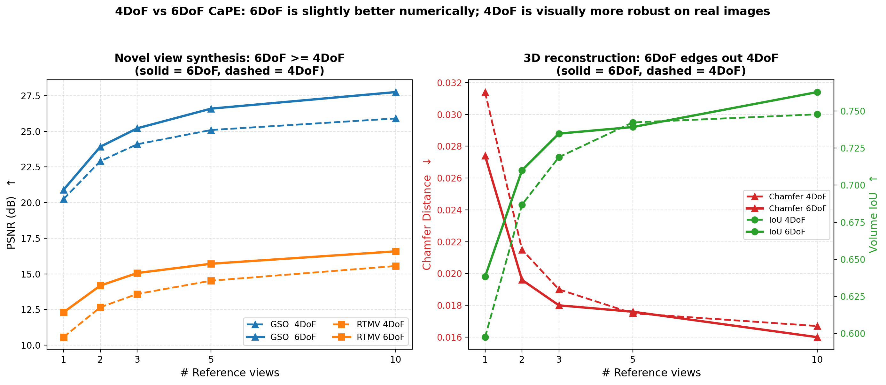

*自绘复刻自附录 Tab. `tab:NVS_6DoF` / `tab:3D_6DoF`：左 PSNR（GSO/RTMV），右 Chamfer/IoU。实线 6DoF、虚线 4DoF。*

**结论（"有效但取决于场景"）：** 6DoF CaPE 在量化指标上**一致地略优**（作者归因于其表示空间更紧凑/更具表达力）；但在**真实世界图像**上，4DoF CaPE **视觉上更一致**。由于训练数据本身就限定在 4DoF 物体中心设定，主论文采用 4DoF，6DoF 结果放附录。这是一个典型的"最优选择取决于数据/场景"的消融——不能简单说"6DoF 更好"。

### 8.5 目标视图数量的影响（随机性 vs 一致性）

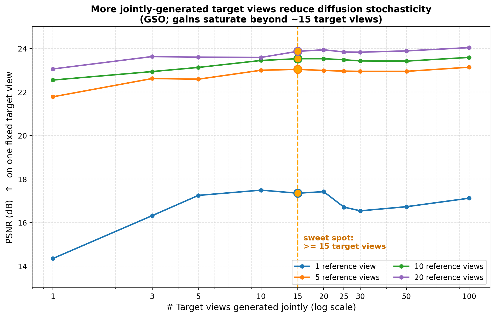

*自绘复刻自论文 Fig. `fig:analysis`（`ablation{1,5,10,20}.tex`）：对一个固定目标视图，联合生成更多（重复的）目标视图会降低扩散随机性、抬升 PSNR。*

**结论（次要设计，边际递减）：** 同时生成多个目标视图（哪怕是同一位姿的重复）能**隐式降低扩散过程的随机性**，提升质量与一致性；论文经验性地确定 **≥15 个目标视图**为甜点，再多则收益边际化。参考视图越少，这个技巧的增益越明显（1 参考时从 14.35 抬到 ~17.5）。

### 8.6 直接生成 vs 自回归生成

**结论（效率 vs 质量的权衡）：** 自回归（逐个生成目标视图）把每个 self-attention 块的推理成本从二次降为线性，**生成 200 视图时快 20 倍以上**；但存在**内容漂移（content drift）**——后生成的视图依赖前面不完美的生成，质量逐步下滑。主实验用直接生成；自回归适合 SLAM 等场景，是未来方向。

### 8.7 训练采样策略

**结论（次要）：** 在 $N,M\in\{1,\dots,5\}$ 中权衡显存/速度/多视对应学习后选定 $N{=}3,M{=}3$；**有放回**采样（允许重复图像）比无放回**略有提升**。

### 8.8 效度总结表（哪些点被证明最有效）

| 设计点 | 效度等级 | 证据 |
|---|---|---|
| **CaPE 相对位姿编码（坐标系无关）** | ⭐⭐⭐ 最有效 | 800K 超越 10M 的 Zero123-XL；一致性/可扩展性的根基 |
| **多参考视图可扩展性** | ⭐⭐⭐ 最有效 | PSNR/SSIM/Chamfer 随参考视图单调变好（§8.1/§8.3） |
| **6DoF CaPE 的紧凑表示** | ⭐⭐ 次之 | 量化略优，但真实图像不如 4DoF 稳（§8.4） |
| **ConvNeXtv2-Tiny 条件编码** | ⭐⭐ 次之 | 优于冻结 CLIP，兼顾低层纹理与训练效率（§5.4） |
| **多目标视图降随机性** | ⭐ 有效但边际 | ≥15 视图后收益递减（§8.5） |
| **有放回采样** | ⭐ 边际 | 仅"略有提升"（§8.7） |
| **自回归生成** | ⚠️ 提速但降质 | 20× 提速伴随内容漂移（§8.6） |


## 9. 与 Qwen-RobotManip 的关联：CaPE 的血脉传承与"视觉空间锚定"

这是本文与 [Qwen-RobotManip 深度解析](../QwenRobotmanip/note.md) 互链的核心章节。EscherNet 的 CaPE 不是一个孤立的视图合成技巧，而是一条延续到具身智能 VLA 模型的思想主线的**源头**。

### 9.1 CaPE 的血脉传承

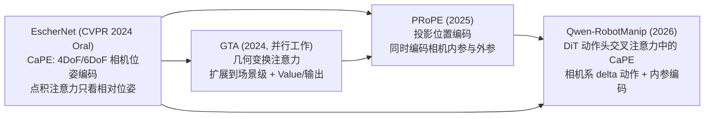

- **EscherNet（2024）** 首创 CaPE：用相机外参（位姿）编码 token，让注意力天然只看相对位姿、世界原点代数消去。
- **GTA（2024，与 6DoF CaPE 并行）**：同一思想的场景级版本，并率先把几何变换扩展到 **Value 与注意力输出**。
- **PRoPE（2025）**：进一步把编码推广为**投影位置编码**，同时纳入**相机内参**（视场角）与外参。
- **Qwen-RobotManip（2026）**：把这条线用进机器人操控——在 DiT 动作头的交叉注意力里用 CaPE，把动作定义为**相机系 delta 位姿**（详见 QwenRobotmanip §4.2.3 / §4.2.4）。

### 9.2 Qwen-RobotManip 如何"改造"CaPE

| 维度 | EscherNet 的 CaPE | Qwen-RobotManip 的 CaPE（改造点） |
|---|---|---|
| 用途 | 多视图**图像生成**的视图一致性 | DiT 动作头**动作去噪**的几何条件 |
| 作用位置 | SD U-Net 的 self/cross-attention | DiT **交叉注意力**（图像 token ↔ 状态/动作 token） |
| 维度分配 | 整个头维度都给位姿旋转 | 每个 64 维头：**32 维 CaPE（外参）+ 32 维 RoPE（时序）** |
| 作用对象 | 仅 query / key | 扩展到 **Value 与注意力输出**（承 GTA/PRoPE） |
| 相机内参 | 未编码（物体中心 4DoF 足够） | **编码内参**：归一化图像平面坐标经线性层加到图像 token，提供逐 token 视场角感知 |
| 位姿来源 | 参考/目标视图的相机位姿 | 图像 token 用各自相机外参；**状态/动作 token 用选定参考相机外参** |
| 下游产物 | 目标视图图像 | **相机系 SE(3) delta 动作**（引导 DiT 在参考相机系去噪动作） |

**共同的数学内核完全一致**：CaPE 是旋转位置编码，点积注意力中**全局世界坐标系原点被代数消去**，只留下 token 间相对位姿——这正是本文 §6.3 推导的性质。Qwen-RobotManip 把"新视图之间的相对位姿"迁移成"视觉 token 与动作 token 之间的相对位姿"。

### 9.3 共同哲学："视觉空间锚定"（Visual Space Anchoring）

EscherNet 与 Qwen-RobotManip 表面上一个做图像生成、一个做机器人控制，内核却是**同一个信念**：

> **把量定义在"看得见的、共享的视觉/相机坐标空间"里，让"视觉上相似 ⇒ 数值上相近"，从而摆脱对任意全局坐标系的依赖。**

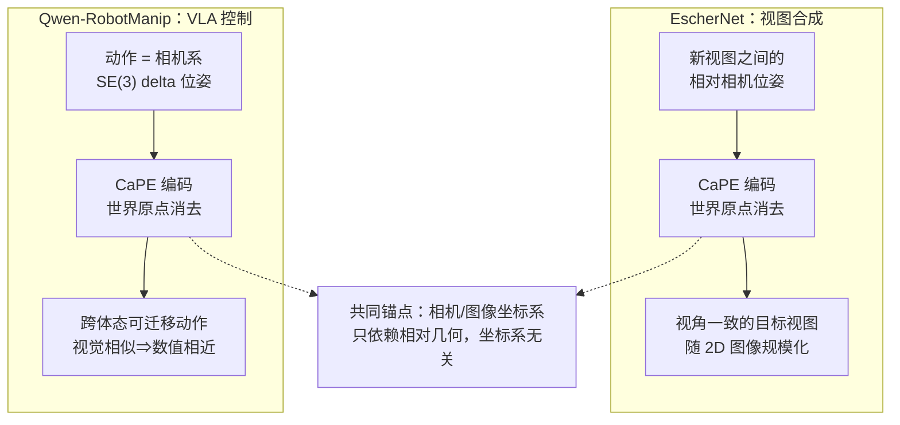

- **EscherNet 侧**：新视图合成的本质是"给定相对位姿，脑补目标视角"。相对位姿是唯一有物理意义的量。
- **Qwen-RobotManip 侧**：跨体态迁移的障碍是"同一技能在不同机器人的 joint/base 空间里数值天差地别"。把动作定义在**所有机器人共享的相机观测空间**里，"视觉相似的操作 ⇒ 数值相近的标签"自然成立（QwenRobotmanip §4.4.6）。
- **共同锚点**：都用 CaPE 把"绝对坐标"从注意力里代数消去，只保留"相对几何"。EscherNet 证明了这在生成式 3D 视觉里可扩展；Qwen-RobotManip 证明了这在具身控制里解锁了规模化（"对齐解锁规模"）。

### 9.4 交叉引用表

| 本文小节 | 对应 Qwen-RobotManip 小节 | 关联点 |
|---|---|---|
| §6 CaPE 数学推导（4DoF/6DoF、世界原点消去） | [§4.2.3 Camera Positional Encoding](../QwenRobotmanip/note.md) | 同一 CaPE 内核；QwenRobotmanip 直接标注"CaPE 学术源流：EscherNet（CVPR 2024 Oral）首先提出" |
| §6.3 6DoF SE(3) 相对位姿 | [§4.2.2 相机坐标系 Delta 位姿](../QwenRobotmanip/note.md) | 相对 SE(3) 变换 → 相机系 delta 动作 |
| §5.5 cross-attention（参考↔目标） | [§4.2.4 多视角参考相机选择](../QwenRobotmanip/note.md) | 图像 token 用各自外参、动作 token 用参考相机外参 |
| §4.3 GTA/PRoPE 并行工作 | [§4.2.3（Value+输出、内参编码）](../QwenRobotmanip/note.md) | QwenRobotmanip 承 GTA/PRoPE 把 CaPE 扩到 Value/输出并编码内参 |
| §3.2 "无标准化绝对全局位姿" | [§4.4.7 是否统一到共同坐标系](../QwenRobotmanip/note.md) | 都用"相对/共享视觉锚点"替代"单一世界原点" |
| §8 消融（相对位姿是有效性根基） | [§4.4.6 视觉空间锚定深层解读](../QwenRobotmanip/note.md) | "视觉相似⇒数值相近"是两文共同证据 |


## 10. 局限与未来工作

1. **自回归的内容漂移**：自回归生成虽能带来 20× 以上的提速（适合 SLAM），但后续视图依赖前面不完美的生成，质量逐步下滑。如何在保留生成式优势的同时实现高保真自回归渲染，是一个开放问题。
2. **受训练数据限制在 4DoF**：主论文使用 4DoF CaPE，因为训练数据（Objaverse 渲染）本身是物体中心的。6DoF CaPE 在真实、复杂 6DoF 场景上的潜力尚未被训练数据充分释放。
3. **多视图多时，被场景专用法反超**：在参考视图充足（>10）时，InstantNGP/3DGS 的逐场景优化质量超过 EscherNet（§8.2）。要同时兼得"生成式的稀疏视图能力"与"逐场景优化的高保真"仍是挑战。
4. **向多视图视频扩展**：EscherNet 只需成对带位姿图像即可构造训练样本，因此天然可从**视频**中获取监督。把它扩展到大规模视频数据源是重要方向——这一点与 Qwen-RobotManip 从人类自中心视频学动作先验的思路遥相呼应。

## 11. 总结

EscherNet 的贡献可以凝练为一句话：**用一个零新增参数的相机位置编码（CaPE），把视图合成从"绑定全局坐标系的场景专用重建"解放为"只依赖相对位姿的坐标系无关生成"。** 具体而言：

- **表述创新**：把视图合成写成以相机位姿为条件的多视图扩散生成 $p(\mathcal{X}^T\mid\mathcal{X}^R,\mathcal{P}^R,\mathcal{P}^T)$，$N/M$ 任意。
- **架构复用**：不改 Stable Diffusion 结构，只重定义 self/cross-attention 的语义（目标↔目标、参考↔目标一致性），并用轻量 ConvNeXtv2-Tiny 支持可变数量参考视图。
- **数学内核**：CaPE 借 RoPE/Lie 群把"角度差/SE(3) 相对变换"编进注意力，世界原点代数消去——这是可扩展性的根本。
- **实验证据**：800K 数据超越 10M 的 Zero123-XL；随参考视图单调变好；稀疏视图胜过场景专用神经渲染。

**对 3D 视觉与具身智能的启示**：EscherNet 展示了一种"可扩展架构"的通用配方——**不要把绝对坐标烧进网络，而要把相对几何注入注意力**。这一配方经 GTA/PRoPE 演进，最终在 Qwen-RobotManip 中落地为跨体态可迁移的相机系动作接口（§9）。"视觉空间锚定"由此成为连接生成式 3D 视觉与具身控制的一条深层主线。

## 12. 术语表与参考文献

### 12.1 术语表

| 术语 | 全称 / 含义 |
|---|---|
| **CaPE** | Camera Positional Encoding，相机位置编码；把相机位姿注入 token，使点积注意力只看相对位姿 |
| **RoPE** | Rotary Position Encoding，旋转位置编码；语言模型中让注意力只依赖 token 相对位置的编码，CaPE 的灵感来源 |
| **SE(3)** | 三维刚体变换群（旋转 $\mathbf{R}\in SO(3)$ + 平移 $\mathbf{t}$），6DoF 位姿的数学载体 |
| **4DoF / 6DoF** | 4 自由度（物体中心球坐标 $\{\alpha,\beta,\gamma,r\}$）/ 6 自由度（一般 SE(3) 位姿） |
| **NVS** | Novel View Synthesis，新视图合成 |
| **NeRF** | Neural Radiance Field，神经辐射场；用 MLP 编码 5D 辐射场做视图合成 |
| **InstantNGP / 3DGS** | 场景专用的快速神经渲染（哈希编码 / 3D 高斯泼溅） |
| **NeuS** | 用神经隐式表面（SDF）从多视图做 3D 重建的方法 |
| **SDS** | Score Distillation Sampling，分数蒸馏采样；DreamFusion 等文生 3D 的优化信号 |
| **Zero-1-to-3 / SyncDreamer** | 代表性多视图 2D 扩散方法（单参考单目标 / 固定 16 视） |
| **GTA / PRoPE** | 几何变换注意力 / 投影位置编码；CaPE 的演进工作，扩展到 Value/输出与内参编码 |
| **PSNR / SSIM / LPIPS** | 视图合成 2D 质量指标（越高越好 / 越高越好 / 越低越好） |
| **Chamfer / Volume IoU** | 3D 重建指标（越低越好 / 越高越好） |
| **Janus 问题** | 文生 3D 中常见的"多面/多头"几何错误 |

### 12.2 参考文献（关键）

- **EscherNet（本文）**：Kong, X., et al. *EscherNet: A Generative Model for Scalable View Synthesis.* CVPR 2024 (Oral). 代码：`https://github.com/kxhit/EscherNet`
- **RoPE**：Su, J., et al. *RoFormer: Enhanced Transformer with Rotary Position Embedding.* 2021.
- **Stable Diffusion / LDM**：Rombach, R., et al. *High-Resolution Image Synthesis with Latent Diffusion Models.* CVPR 2022.
- **Zero-1-to-3**：Liu, R., et al. *Zero-1-to-3: Zero-shot One Image to 3D Object.* ICCV 2023.
- **SyncDreamer**：Liu, Y., et al. *SyncDreamer: Generating Multiview-consistent Images from a Single-view Image.* 2023.
- **NeRF**：Mildenhall, B., et al. *NeRF: Representing Scenes as Neural Radiance Fields for View Synthesis.* ECCV 2020.
- **InstantNGP**：Müller, T., et al. *Instant Neural Graphics Primitives with a Multiresolution Hash Encoding.* SIGGRAPH 2022.
- **3D Gaussian Splatting**：Kerbl, B., et al. *3D Gaussian Splatting for Real-Time Radiance Field Rendering.* SIGGRAPH 2023.
- **ConvNeXtV2**：Woo, S., et al. *ConvNeXt V2: Co-designing and Scaling ConvNets with Masked Autoencoders.* 2023.
- **GTA**：Miyato, T., et al. *GTA: A Geometry-Aware Attention Mechanism for Multi-View Transformers.* 2024.
- **DreamFusion（SDS）**：Poole, B., et al. *DreamFusion: Text-to-3D using 2D Diffusion.* ICLR 2023.
- **关联文档**：[Qwen-RobotManip 深度解析](../QwenRobotmanip/note.md)（本仓库），特别是 §4.2（运动对齐 / CaPE）与 §4.4（视觉空间锚定）。

---

> 本文所有自绘图由 `asset/` 下的 Python 脚本生成（可复现），论文原图由 `asset/convert_paper_figs.py` 从 `TeX_Source/images/` 的 PDF 转换而来。图内文字使用英文以保证跨平台字体兼容。

---

## 13. 补篇：CaPE 之后——2024-2026 年的演进图谱与后续方法深度解析

> **写在前面**：第 1–12 章完整解析了 EscherNet 本身。但 CaPE 提出之后，"如何用相机几何给多视图 Transformer 做位置编码"这条技术脉络并没有停止演进——从 2024 年至今（2026 年 7 月），至少有六篇工作在这条脉络上继续推进。本篇聚焦这条**窄而深**的技术线索本身（而非新视图合成/3D 视觉的泛泛综述），系统回答："CaPE 之后谁更强？强在哪？各自的代价与适用边界是什么？"

### 13.0 本篇范围与阅读方式

本篇不是"随便找几个新论文罗列一下"，而是严格沿着 **CaPE 这一个具体的技术组件**（"用相机几何做相对位置编码，注入点积注意力"）去追踪其后续演进。判断一篇工作是否属于这条脉络的标准很简单：它是否在**同一个数学骨架**——即"用相机相关的矩阵 $D_t$ 去变换 query/key（甚至 value）向量，使得 $Q_{t_1}^\top D_{t_1} D_{t_2}^{-1} K_{t_2}$ 只依赖相对几何"——上做文章。凡是符合这个骨架的工作，我们才纳入本篇；纯粹换个扩散骨干、换个数据集刷榜的工作不在讨论范围内。

读者可以把 §6（CaPE 本身的推导）当作本篇的"公理系统"，本篇每一节都会显式指出：新方法相对 CaPE 的公理系统，究竟**放宽了哪个假设**、**增加了哪个自由度**、**付出了什么代价**。

### 13.1 三条分类轴与演进谱系图

在深入每篇工作之前，先建立一个坐标系。综合 PRoPE、DPPE 两篇论文各自的 Related Work 分类（它们分类方式高度一致，说明这已是社区共识），CaPE 及其后续方法可以沿**三条独立的轴**定位：

| 分类轴 | 含义 | 取值 |
|---|---|---|
| **轴 1：编码层级** | 相机信息注入在网络的哪个位置 | **APE**（绝对，token 级，如 Plücker/Naive raymap，与 RGB 拼接后输入）↔ **RPE**（相对，注意力级，直接改造 $QK^\top$ 甚至 $V$） |
| **轴 2：作用范围** | 相对编码具体改造 attention 的哪些矩阵 | **QK-only**（只变换 query/key，如 CaPE）↔ **QKV**（额外变换 value 与输出，如 GTA/PRoPE 及其后续几乎全部工作） |
| **轴 3：几何完整度** | 编码的几何信息有多"完整" | **仅外参 SE(3)**（如 CaPE、GTA）↔ **完整视锥：内参+外参**（如 PRoPE）↔ **学习的场景几何**（如 RayRoPE，把"相机看到了什么深度"也一并编码，而非只编码"相机在哪里"） |

三条轴组合起来，正好给出一张"谁是谁的严格泛化"的地图——这也是 PRoPE 论文 §3.5 明确证明的三条性质（本文 §13.2 会展开）：**PRoPE 在内参恒等时退化为 GTA/CaPE；GTA/CaPE 只是 PRoPE 在轴 3 上的退化特例。**

把这张地图和第 9 章已有的谱系图（EscherNet → GTA/PRoPE → Qwen-RobotManip）拼在一起，延伸到 2025–2026 年的全貌如下：

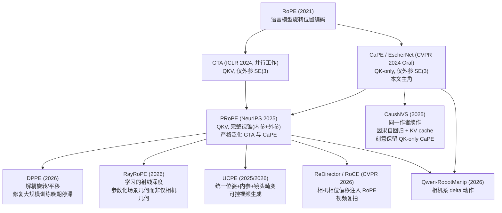

一句话概括这张图：**GTA 与 CaPE 是 2024 年"同一个思想的两种实现"（并行工作），PRoPE 在 2025 年把二者统一并推广到完整视锥，随后 2025–2026 年出现的四篇工作分别沿着"更稳定的训练""更适配的场景""更真实的几何建模""更广的应用战场"四个不同方向继续演进——但没有一篇工作是在"推翻"前作，而是在其未覆盖的约束条件下补位。** 这个"没有银弹、按约束选型"的结论会在 §13.8-§13.9 具体展开。

### 13.2 PRoPE 深度解析：从"相对位姿"到"相对视锥"

#### 13.2.1 问题动机：CaPE/GTA 认识不到"焦距"

CaPE（§6 已推导）与 GTA 都只编码相机的**外参** $T^{cw}\in SE(3)$（旋转+平移），完全不管相机的**内参** $K$（焦距、主点、视场角）。这在 EscherNet 的训练设定下没问题——因为 Objaverse 渲染数据集里所有相机共享同一套内参，"内参"是个常数，不需要编码。

但现实世界的多相机数据几乎不会这么"贴心"：自动驾驶的环视相机阵列、手机变焦镜头拍摄的视频、无人机在飞行中调整焦距——这些场景里，**不同视图对应不同的视场角**。此时 CaPE/GTA 的注意力机制"看不到"这个差异，模型只能靠 RGB 内容本身去猜测"这张图是不是被放大了"，这是一个不必要的额外负担。

PRoPE（*Cameras as Relative Positional Encoding*, Li, Yi, Liu, Gao, Ma, Kanazawa, UC Berkeley, NeurIPS 2025）的核心洞察正是：**SE(3) 位姿只是相机几何的"部分"表示，完整表示应该是"视锥"（frustum）——同时包含内参和外参。**

#### 13.2.2 核心数学：从位姿到投影矩阵

把内参 $K_i \in \mathbb{R}^{3\times3}$ 与外参 $T^{cw}_i=(R_i, t_i)\in SE(3)$ 合并成一个 **"世界到图像"投影矩阵**：

$$
P_i = K_i \begin{bmatrix} R_i^{cw} & t_i^{cw} \end{bmatrix} \in \mathbb{R}^{3\times 4}
$$

为了让它可逆（从而可以像 CaPE 那样构造"相对变换"），把它提升为 $4\times4$ 的齐次形式 $\tilde P_i = \begin{bmatrix} P_i \\ 0\ 0\ 0\ 1\end{bmatrix}$。CaPE 用的是 $T_{i_1}^{cw}(T_{i_2}^{cw})^{-1}$（只有外参的相对变换），PRoPE 则用**相对投影变换**：

$$
\tilde P_{i_1}\tilde P_{i_2}^{-1}
$$

把它展开（对应论文 Eq.20）：

$$
\tilde P_{i_1}\tilde P_{i_2}^{-1} = \begin{bmatrix} K_{i_1} & 0 \\ 0 & 1\end{bmatrix} \underbrace{\begin{bmatrix} R_{i_1}^{cw}(R_{i_2}^{cw})^\top & \cdots \\ 0 & 1 \end{bmatrix}}_{\text{正是 CaPE 用的相对外参}} \begin{bmatrix} K_{i_2}^{-1} & 0 \\ 0 & 1\end{bmatrix}
$$

这一个公式同时揭示了 PRoPE 的**三条关键性质**（论文 §3.5，也是它区别于此前工作的理论依据）：

1. **全局坐标系不变性**：重新定义世界坐标系等价于对两个 $T^{cw}$ 同时右乘同一个矩阵，这在相对变换 $\tilde P_{i_1}\tilde P_{i_2}^{-1}$ 中被代数消去——与 CaPE 的核心性质（§6.3）完全一致，PRoPE 继承了这个"世界原点无关"的好处。
2. **退化为 GTA/CaPE**：当所有相机内参恒等（$K_i=I$）时，上式精确退化为 CaPE/GTA 用的纯 SE(3) 相对变换——即 **PRoPE $\supseteq$ {GTA, CaPE}**，是严格的泛化而非另起炉灶。
3. **退化为 RoPE**：对同一张图像内部的两个 patch token（$i_1=i_2$），上式退化为单位矩阵，只剩下 GTA 式的 2D patch RoPE 项——这与单图像 ViT 中普通 RoPE 的行为一致。

实现上，PRoPE 沿用 GTA 提出的"QKV 式"注入方式（而不是 CaPE 的"QK-only"），把变换同时作用在 query、key、value 与输出上：

$$
\mathrm{Attn}^{\mathrm{PRoPE}}(Q,K,V) = D^{\mathrm{PRoPE}} \odot \mathrm{Attn}\!\left((D^{\mathrm{PRoPE}})^\top \odot Q,\ (D^{\mathrm{PRoPE}})^{-1}\odot K,\ (D^{\mathrm{PRoPE}})^{-1}\odot V\right)
$$

其中 $D_t^{\mathrm{PRoPE}}$ 是一个分块对角矩阵：一半装着 $I_{d/8}\otimes\tilde P_{i(t)}$（相机间的视锥关系），另一半装着 GTA 式的 2D patch RoPE（相机内的 patch 相对位置）——这与本文 §6 中 CaPE 代码实现的"分头分配维度"思路一脉相承，只是把"外参"换成了"完整视锥"。

官方实现极其轻量（PyTorch/JAX 各一个单文件），核心调用方式：

```python
# https://github.com/liruilong940607/prope
output = torch.nn.functional.scaled_dot_product_attention(Q, K, V)
# 只需替换成：
output = prope_dot_product_attention(
    Q, K, V,
    viewmats=viewmats, Ks=Ks,
    patches_x=patches_x, patches_y=patches_y,
    image_width=image_width, image_height=image_height,
)
```

#### 13.2.3 实验证据：变焦场景下 CaPE/GTA 会"坍缩"

下表摘自 PRoPE 论文 Table 1（**定焦**：场景内相机共享同一套内参）与 Table 2（**变焦**：RealEstate10K 每张图随机缩放 1–3 倍，Objaverse 视场角在 35°–50° 间随机采样），在同一个 LVSM 骨架下对比四种编码方式（PSNR，dB，越高越好）：

| 方法 | RE10K 定焦 | RE10K 变焦 | Objaverse 定焦 | Objaverse 变焦 |
|---|---|---|---|---|
| Plücker Raymap（绝对） | 20.48 | 19.89 | 21.44 | 21.43 |
| CaPE（QK-only，仅外参） | 21.11 | **15.94** | 19.68 | **16.78** |
| GTA（QKV，仅外参） | 22.51 | **15.77** | 23.70 | 18.00 |
| **PRoPE（QKV，完整视锥）** | **22.80** | **21.42** | **23.70** | **22.98** |

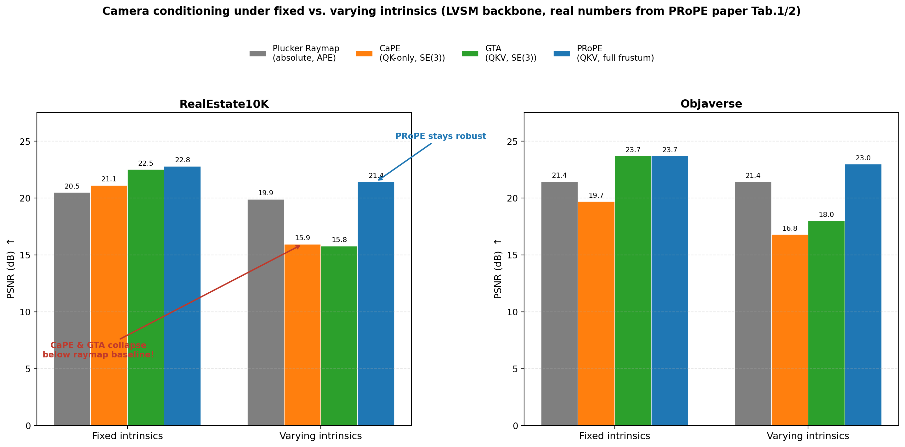

*读数解读：定焦场景下，相对编码全面碾压绝对 raymap（CaPE/GTA/PRoPE 均 > Plücker），这与本文 §8 的消融结论完全一致——"相对而非绝对"是有效性根基，历经多篇后续工作反复验证。但**一旦内参开始变化，CaPE 和 GTA 的 PSNR 甚至跌到绝对 raymap 之下**（RE10K 上 CaPE/GTA 只有 15.9 左右，比什么都不做的 Plücker raymap 的 19.89 还差！）——因为它们的注意力机制里没有任何信息告诉网络"这两张图的视场角不一样"，模型被迫在图像内容里盲猜，反而不如 raymap 直接把这个信息摆在输入层面来得可靠。PRoPE 由于显式编码了内参，两种设定下都保持稳健。*

PRoPE 的其他关键结论（均来自论文原文，未加工）：
- **对未见焦距/未见视图数的泛化更强**：训练时只用 2 个输入视图，测试时外推到 16 个视图，或把焦距放大到训练时的 5 倍，PRoPE 的降质幅度都明显小于 Plücker/CaPE/GTA。
- **可迁移到其他任务**：接入 UniMatch 做立体深度估计（仅改 ~50 行代码），三个数据集上误差全面下降；接入一个"发现相机-图像配对错误"的空间认知任务，PRoPE 让准确率随视图数增加持续上升，而 Plücker 没有这个趋势。
- **规模化仍然有效**：把 LVSM 训练算力扩大 100×，PRoPE 相比 Plücker 的优势幅度收窄但依然显著（22.80→26.56 dB vs. Plücker 20.48→25.64 dB）。
- **产业界已实际采用**：Tencent Hunyuan 的 WorldPlay（世界模型/交互视频生成）、VGGT 系后续工作、CVPR 2026 的 Multi-view Pyramid Transformer、开源实时交互世界模型 minWM 等均在其自注意力层中直接使用 PRoPE 做相机条件注入——这是 CaPE 之后的这条脉络中目前落地最广的一个节点。

#### 13.2.4 小结：PRoPE 的代价

PRoPE 不是没有代价的。论文在结论部分自己指出两个未解决的问题（这也正是 §13.4、§13.5 两篇后续工作分别要解决的）：
1. **数值稳定性**：直接用投影矩阵去乘 Q/K/V，当镀头是超长焦（内参矩阵条件数很差）时可能出现数值病态。
2. **训练稳定性**（PRoPE 论文没提到，但被 DPPE 发现）：大规模、长时间训练后，PRoPE 会出现性能停滞甚至倒退——这正是 §13.4 DPPE 要修的病灶。

### 13.3 CausNVS 深度解析：EscherNet 原作者的"因果化"续作——为什么反而退回 CaPE？

#### 13.3.1 一个直觉例子：为什么绝对编码会让"记忆"失效

设想一个机器人正在一条走廊里边走边看，需要不断地把新看到的画面和之前看到的画面做对照（这正是"世界模型"里的"空间记忆"能力）。如果我们用**绝对位姿编码**（比如 Plücker raymap，直接把每张图相对于"走廊入口"这个固定世界原点的位姿编码进去），会发生什么？

机器人每往前走一步，"当前位置"相对于固定原点的绝对坐标就变大一点。如果我们像 Transformer 里的 KV cache 那样，把之前算过的 attention 中间结果（key/value）缓存起来复用——**这个缓存在下一步就失效了**，因为所有 token 的绝对坐标编码都取决于同一个"世界原点"，而这个原点在训练时是被人为设定的、任意的，一旦机器人走得足够远，绝对坐标的数值会超出训练时见过的范围，模型开始"看走眼"。想要保持数值不超界，唯一办法是不断地重新定义原点——但原点一变，之前所有 token 的编码全部要重新算一遍，缓存彻底失效。

CaPE 的设计恰好没有这个问题：**它编码的从来不是"某个 token 相对于世界原点的位置"，而是"两个 token 之间的相对位姿"**（本文 §6.3 的核心推导）。机器人走到哪一步都不影响"当前帧"和"三步前那一帧"之间的相对位姿计算，缓存永远有效。

这正是 CausNVS（*Causal Autoregressive Multi-view Diffusion for Flexible 3D Novel View Synthesis*，Kong, Watson, Strümpler, Niemeyer, Tombari，2025，与 EscherNet **同一位第一作者 Xin Kong**）这篇工作的核心动机与设计依据。

#### 13.3.2 方法：因果掩码 + 逐帧噪声 + CaPE 驱动的滑窗缓存

CausNVS 要解决的是"流式/自回归"版本的新视图合成：输入视图可能随时间陆续到达，输出视图也要按需逐个生成，而不是像 EscherNet 原始设定那样一次性给定所有参考视图、一次性生成所有目标视图。三个关键设计：

1. **因果掩码 (causal masking) + 逐帧独立噪声**：在预训练的 2D 扩散骨干里插入帧间注意力层，每一帧独立采样噪声水平（借鉴 Diffusion Forcing），使模型既能训练一次就泛化到任意 $N$ 输入 $\to M$ 输出的配置，又能在推理时把"之前生成的帧"当作带噪声的条件输入，缓解自回归漂移。
2. **CaPE 原封不动地用在帧间注意力的 Q/K 上**——这是本节的重点：CausNVS **没有**升级到更强的 PRoPE，而是刻意保留 EscherNet 提出的最简 QK-only 形式：

$$
\pi(\mathbf v, P) = \phi(P)\,\mathbf v,\qquad \phi(P) = I_{d/4}\otimes \Psi,\qquad \Psi = \begin{cases} P & \text{key}\\ P^{-\top} & \text{query}\end{cases}
$$

（这与本文 §6.2 numpy/PyTorch 实现里的 `CaPE_woState` 逻辑完全一致，只是换了个符号。）

3. **位姿感知滑动窗口 + KV 缓存**：由于 CaPE 保证注意力分数只依赖相对位姿，缓存住的 key/value 在滑窗移动时**永远不需要重新计算**，只需要按"相机空间中离当前查询最近的 $K$ 个视图"动态选取窗口。这就把"世界模型式的空间记忆"隐式地融进了 Transformer 本身，而不需要像 CUT3R、WorldMem 那样另开一个外部记忆模块。

#### 13.3.3 实验证据与关键发现

| 设置 | 表现 |
|---|---|
| $N$-to-$M$ 灵活视图配置（Re10K/LLFF/DL3DV，对比 SEVA/4DiM/ViewCrafter/MotionCtrl） | 用仅 20K 场景级样本、915M 参数的小模型，取得与规模大得多的 SEVA（1.5B，训练数据量级更大）相当或更优的 PSNR，且是唯一一个**用单一模型同时支持任意 $N\to M$** 的方案 |
| 自回归 vs 非自回归对比（Re10K，控制变量） | 因果模型从 1 帧泛化到 $8\times$ 训练长度都保持稳定；非因果模型一旦评测长度偏离训练设定就明显掉分，1-to-1 设定下甚至完全失败 |
| 超长 rollout（训练只见过 8 帧，测试 rollout 到数十倍） | 支持稳定的 rollout，长度可达训练时的 10 倍以上仍保持合理质量 |
| 注意力窗口大小消融 | 窗口大小=4 时已能达到接近全量注意力的效果，同时算力大幅下降——证明"位姿感知滑窗+CaPE 缓存"这一设计的有效性 |

#### 13.3.4 落点："更强的编码"不等于"更适合的编码"

这是本篇分析中一个很有意思的"回旋"：EscherNet 的原作者手握 PRoPE（更强、任务无关地更优）这个选项，却在自己的下一篇工作里**主动选择退回最初的 CaPE**。原因不是不知道 PRoPE，而是 PRoPE 的 QKV 式改造会同时变换 value——这意味着当"参考帧"的集合发生变化（比如滑窗移出了某一帧），所有留存 token 的**value 编码本身**都可能因为相对几何关系改变而需要重新计算，缓存优势被削弱。而 CaPE 的 QK-only 设计，配合"世界原点无关"的性质，恰好是"流式、缓存友好"这个新场景下的**充分且必要**的最简方案——多加的 PRoPE/GTA 式 value 变换在这里是纯粹的额外开销，换不来收益。

这给出一个贯穿全篇的方法论：**评价一个位置编码"好不好"，永远要相对于具体的部署约束，而不是相对于某个单一榜单的数字。** §13.9 的选型决策树会把这一点系统化。

### 13.4 DPPE 深度解析：PRoPE 的"大规模训练晚期停滞"病灶与解药

#### 13.4.1 现象：训练越久，反而越差

DPPE（*DPPE: Rethinking Camera-Based Positional Encoding for Scaling Multi-View Transformers*，Kenney & Suzuki，2026）从一个工程实践中的诡异现象出发：把 PRoPE 的训练配置放大（更大模型、更多数据、320k 步训练），本该"越训越好"，但**PSNR 在训练晚期开始下降**。下图用 DPPE 论文 Table 6 的真实 checkpoint 数据还原了这个现象（MVImgNet2 数据集，NVS 任务）：

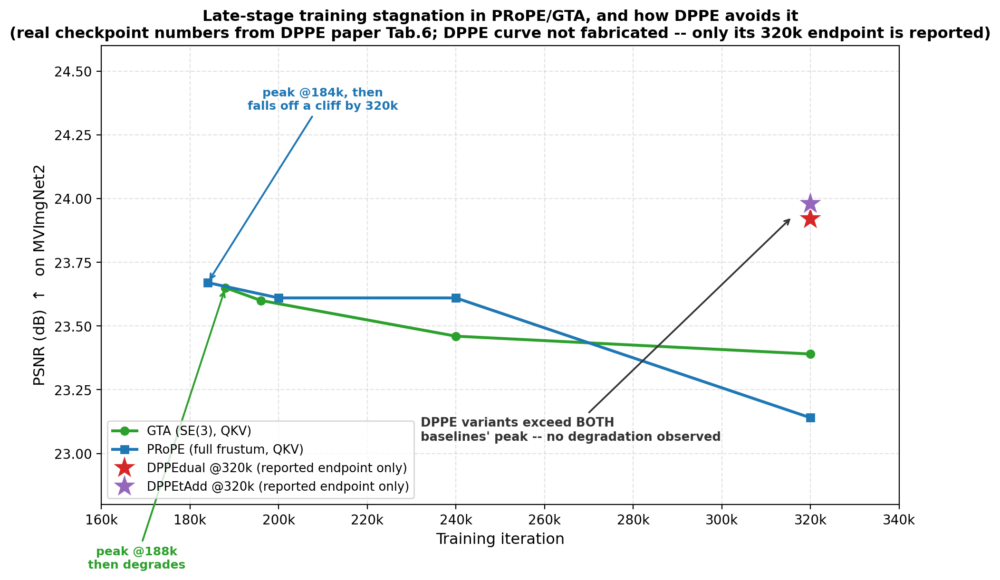

*读数解读：GTA 在 188k 步达到峰值 23.65 dB，此后一路下滑到 320k 步的 23.39 dB；PRoPE 更极端——184k 步峰值 23.67 dB，320k 步骤然跌到 23.14 dB，接近"训练时间越长、最终模型越差"的反直觉结果。DPPE 的两个变体只在论文里报告了 320k 步的终值（23.92 / 23.98 dB），**没有中间过程数据可用，因此图中没有画出一条虚构的 DPPE 曲线**，而是老实地画成两个孤立的终点标记——即便如此，这两个终值已经稳稳超过 GTA 和 PRoPE 各自训练过程中的历史最高点，说明 DPPE 修复的不是"运气好蒙到了一个好 checkpoint"，而是真正移除了导致晚期倒退的病灶。*

#### 13.4.2 病理诊断：旋转与平移在同一组维度里"打架"

DPPE 的贡献不只是"调了一个新的编码"，更重要的是**定位了病灶**。回顾 PRoPE 的 value-output（VO）编码：$\gamma^{\mathrm{Proj}}(i)\gamma^{\mathrm{Proj}}(j)^{-1}\mathbf v_j$。把它的头 4 维展开（论文 Eq.4）：

$$
P_i P_j^{-1}\mathbf v_{j,[1:4]} = \begin{pmatrix} K_i R_i R_j^\top K_j^{-1}\mathbf v_{j,[1:3]} - K_i R_i R_j^\top t_j\, v_{j,4} + K_i t_i\, v_{j,4} \\ v_{j,4}\end{pmatrix}
$$

关键观察：**旋转 $R_i$ 与平移 $t_i$ 同时出现在头 3 维里，彼此耦合**。DPPE 用一个扰动分析证明（论文 Prop.1）：给定任意旋转扰动 $\delta R_i$，总能找到一个平移扰动 $\delta t_i$ 去精确抵消它对输出的影响——也就是说，**单独看一个 token 的 VO 编码输出，根本无法唯一确定这个 token 对应的 $(R_i, t_i)$ 是什么**（数学上称为"不可辨识"，non-identifiable）。模型只能依赖跨 token 聚合、靠"蒙"的方式去消歧，这个额外负担在训练早期还不明显（模型容量绰绰有余），但在长期训练、模型逼近其表达能力极限时，就成了拖累性能的死结。

用一个类比理解这个问题：想象你只被告知"两个数的差是 5"，却要同时猜出这两个数分别是多少——信息不够，猜测无穷多解。DPPE 的诉求是：**让"旋转差异"和"平移差异"分别单独可辨识，不要混在一起问。**

论文用一个精巧的消融证实了这一点（Table 3，MVImgNet2，仅对 VO 编码做实验）：单独用 $R$ 或单独用 $t$ 编码 VO，PSNR 都在 24.17–24.23 之间（几乎无损）；但只要 $(R,t)$ **同时**出现（无论是否搭配内参 $K$），PSNR 立刻跌到 23.30–23.63。**病灶精确定位在"R、t 同时耦合"，而不是"编码本身"。**

#### 13.4.3 解药：两种解耦方案

DPPE 提出两种修复思路，都严格证明满足"逐 token 可辨识性"：

**DPPEtAdd（显式维度切分）**：把特征维度对半切开，一半专门装旋转编码 $\gamma^R(i)=I_{d/6}\otimes K_iR_i$，另一半专门装平移编码 $\gamma^t(i)=\mathbf 1_{d/6}\otimes t_i$（用**加法**而非矩阵乘法注入，类似残差偏置）。两个半区各自独立做 softmax 归一化，**旋转子空间的注意力模式和平移子空间的注意力模式永不互相污染**：

$$
s_{ij}^R = (q_i^R)^\top \gamma^R(i)\gamma^R(j)^{-1}k_j^R,\qquad s_{ij}^t = \big(q_i^t+\gamma^t(i)\big)^\top\big(k_j^t+\gamma^t(j)\big)
$$

**DPPEdual（投影矩阵的对偶形式）**：不做显式维度切分，而是把 $P_i$ 换成它的对偶形式 $P_i^{-\top}$。数学上可以证明（论文 Prop.3）：这样一来输出的前 3 维**只含旋转项、不含任何平移项**，平移信息被"挤"到了唯一的第 4 维——旋转先被唯一确定，然后条件在旋转已知的前提下，平移也变成第 4 维的一个仿射函数、同样可唯一确定。它比 tAdd 更"优雅"（不需要人为切分维度），代价是解耦不如 tAdd 彻底（论文报告 tAdd 略优、但 dual 在同时用于 QK 时更稳）。

两者在 MVImgNet2 上相对 PRoPE 都有明显提升（PSNR 22.91→23.92/24.02），且在训练晚期不再出现倒退（这正是图中孤立终点标记背后的完整实验支撑）。

#### 13.4.4 消融证据：一个典型的"场景依赖性"案例

DPPE 论文自己坦承：这个修复不是在所有数据集上都有感——在 RealEstate10K、SpatialVidHQ 这类**相机轨迹相对简单**（多为平移或纯旋转，很少同时大幅度旋转+平移）的数据集上，DPPE 与 PRoPE 的差距很小（例如 SpatialVidHQ 上仅 19.21→19.28 dB）；但在 **MVImgNet2 这种"围绕物体环拍"**（相机同时经历大幅度的旋转和平移）的数据上，差距显著放大（22.91→24.02 dB，超过 1 dB）。

这给出一个清晰的**适用场景判据**：DPPE 的收益与"数据集里旋转和平移是否经常同时大幅变化"直接相关——环绕拍摄的物体数据集、绕轨道飞行的无人机数据集、多角度机器人抓取观测这类场景是 DPPE 的目标战场；而室内步行录制、云台稳定的无人机航拍这类"简单轨迹"场景，PRoPE 本身已经足够。

### 13.5 RayRoPE 深度解析：从"相机的几何"到"场景的几何"

#### 13.5.1 核心转变：位姿够用吗？

CaPE、GTA、PRoPE、DPPE 有一个共同的隐含假设：**只要把相机的位姿（和内参）关系编码进注意力，模型就能推断出图像内容之间的几何对应关系。** 这个假设在很多场景下是合理的近似，但它忽略了一个事实——**相机位姿只描述了"光线从哪里射出、往哪个方向"，并不描述"这条光线在场景里走了多远才碰到东西"**。

设想一个例子：两台相机同时对着同一个场景——近处站着一个人，远处是一整面墙。仅凭两台相机的相对位姿，模型知道"从相机 A 的视角转到相机 B 的视角需要转过多少角度、平移多远"，但**不知道**"人所在的 3D 点"与"墙所在的 3D 点"在两个视角下的像素位移量差异有多大（近处物体的视差远大于远处物体的视差——这正是立体视觉里"视差与深度成反比"的常识）。相机位姿编码把这两种情况**一视同仁**，而实际上模型需要针对每个 patch 单独知道"它对应的深度大概是多少"，才能正确推断视差。

RayRoPE（*RayRoPE: Projective Ray Positional Encoding for Multi-view Attention*，Wu, Jeon, Chang, Tuzel, Tulsiani，2026）正是抓住了这个缺口：**不再只用相机的刚性几何（位姿+内参）去参数化 token 位置，而是让每个 token 自己学习预测它沿视线方向的深度，把"场景几何"也编码进位置编码里。**

#### 13.5.2 方法：预测深度 + 建模不确定性 + 期望位置编码

具体分三步（对应论文图 2 的三个子图）：

1. **把 patch 位置表示为射线上的一点**：每个 patch 对应一条从相机中心 $c$ 出发、方向为 $d$ 的射线；用一个线性层，让每个 token **自己预测**沿这条射线的深度 $\hat{d}$（**无深度监督**——不需要额外的深度真值标注，纯粹靠端到端的重建损失反传学出来），得到 3D 点 $p^{\hat{d}} = c + \hat{d}\cdot \text{ray}$。
2. **投影到 query 相机系以保证 SE(3) 不变性**：用 query 相机的投影矩阵 $P_i=K_iT_i$ 把 3D 点重新投影，$\tilde x_j = \pi(P_i, x_j)$——这一步保证了不管世界坐标系怎么定义，编码结果都只依赖"相对于 query 相机"的几何关系，延续了 CaPE/GTA/PRoPE 一直坚持的"相对性不变量"设计哲学。
3. **深度不确定性建模**：由于深度预测终究是"猜的"，尤其在高频率分量（RoPE 里的高频项对深度误差最敏感）下容易引入噪声，RayRoPE 额外预测一个不确定性 $\sigma$，得到一个以 $p^{d-\sigma}$ 到 $p^{d+\sigma}$ 为界的射线段，再解析地计算这个区间上的**期望 RoPE 编码** $\mathbb E_{\tilde x}[\rho_D(\tilde x)]$，而不是粗暴地只用一个点估计。

#### 13.5.3 实验证据与任务扩展

- **新视图合成/立体深度估计**：RealEstate10K 上 LPIPS 相对提升 **24%**，CO3D 上 **15%**（均为论文原始数字，相对同类方法的最优基线）。
- **可直接吸收 RGB-D 输入**：当有真实深度传感器数据可用时，RayRoPE 可以直接用真值深度代替"预测的深度"，相比不能利用这类信息的编码方式收益更大。
- **扩展到 feed-forward 3D Gaussian Splatting 重建**：验证了在不需要逐场景优化的前馈式 3DGS 重建任务上同样有效，说明"学习的场景几何"这个思路具有跨任务的普适性。
- **无监督涌现的深度感知**：论文观察到，即便没有深度监督信号，模型在训练后期依然学会了合理的深度预测（尤其在更深的层），且预测的不确定性与深度预测误差呈负相关——这是一个很好的"隐式监督信号从任务目标中涌现"的例证。

#### 13.5.4 定位：与 DPPE 是两个不同方向的演进

值得强调：RayRoPE 和 DPPE **不是竞争关系，而是解决不同层面的问题**——DPPE 修补的是 PRoPE **内部**"如何组织 R、t 这两个已知量"的问题；RayRoPE 问的是更根本的问题："仅有相机几何（R、t、K）这些已知量，是否就够了？"它引入了一个全新的、**需要模型自己学习**的未知量（深度）。两者理论上可以叠加（用 DPPE 的解耦思路去组织 RayRoPE 里的旋转/平移/深度三类信息），但截至 2026 年 7 月，尚未看到公开的工作把二者结合验证。这也说明这条技术脉络仍在快速演进中，远没有收敛到一个"终极形态"。

### 13.6 视频生成分支：UCPE 与 ReDirector/RoCE——同一思想的新战场

前面几节讨论的 PRoPE/DPPE/RayRoPE 主要在"3D 视觉"战场（新视图合成、立体深度、3D 重建）验证。与此同时，"用相机几何做相对位置编码"这个思想也被移植到了**可控视频生成**这个相邻但目标不同的战场——目标不再是"几何精确的新视图"，而是"运镜可控、时序连贯的视频"。

**UCPE（Unified Camera Positional Encoding for Controlled Video Generation，2025/2026）**：现有相机编码方法几乎都假设针孔相机模型，UCPE 指出这在真实世界的手机/运动相机镜头（广角畸变、鱼眼）上会失真。它提出"Relative Ray Encoding"统一表达完整相机信息（6DoF 位姿 + 内参 + 镜头畸变），并额外发现俯仰角 (pitch) 与横滚角 (roll) 对"绝对初始朝向控制"特别有效，于是把两者结合为 UCPE。工程上最值得注意的一点：它通过一个**轻量空间注意力适配器（新增参数 < 1%）**接入已经预训练好的视频 Diffusion Transformer，而不需要从头重训整个模型——这对于想要给现成的大型视频生成模型"加装"相机控制能力的团队非常实用。

**ReDirector / RoCE（Rotary Camera Encoding，CVPR 2026）**：面向"视频复拍"（video retake）任务——给定一段已经拍好的视频和它的相机轨迹，生成同一场景、同一动态内容、但按照新指定相机轨迹拍摄的版本。它的关键技巧是先纠正一个此前工作里"常见的误用"：让输入视频和目标视频**共享同一套时空 RoPE 索引**（而不是各自独立编号），然后在这套共享 RoPE 之上叠加一个**相机条件化的相位偏移**（Rotary Camera Encoding，RoCE）——本质上是把相机差异表达成 RoPE 旋转角度上的一个偏移量，且这个偏移量在微调开始时被**零初始化**（即一开始完全不影响预训练模型的行为，随微调过程慢慢学出非零的相机相位），从而保证微调过程的稳定性。论文强调 RoCE 在值聚合前后都做"几何感知的注意力变换"，即同样落在"QKV 级"这一阵营。

这两篇工作共同说明：**"相机作为相对位置编码"这套数学骨架具有很强的可迁移性**——它不挑架构（U-Net 扩散模型、DiT 视频模型都能用）、不挑任务（图像级 NVS、立体深度、视频复拍都能用），核心不变量始终是本文 §6.3 揭示的那条性质：**把绝对坐标系代数消去，只在注意力里保留"token 对之间的相对几何关系"。**

### 13.7 横向对比大表

把本篇涉及的全部方法（含 §4/§9 已介绍的 CaPE/GTA 作为基准）汇总为一张表，方便按需检索：

| 方法 | 年份 | 编码层级 | 是否编内参 | 是否天然兼容 KV cache | 核心机制一句话 | 主要优点 | 主要缺点 | 最适应用场景 |
|---|---|---|---|---|---|---|---|---|
| Plücker/Naive Raymap | 2019–2024 | APE（token 级，绝对） | 是（隐式，拼接进像素） | 否（绝对坐标，参考帧一变全部失效） | 把光线原点+方向拼接到 RGB 输入通道 | 架构无关、任意骨干都能用、实现最简单 | 依赖任意选定的世界坐标系，视图数/焦距外推能力弱 | 快速在现成 2D 骨干上验证想法；单场景内固定内参训练 |
| CaPE（EscherNet） | 2024 | RPE，QK-only | 否 | **是**（本文 §6.3 核心性质） | 相对 SE(3) 旋转 Q/K，世界原点代数消去 | 零额外参数、最简单、天然缓存友好 | 不改造 Value/输出，无内参信息 | 灵活 $N\to M$ 生成式视图合成；流式/自回归/KV cache 场景（见 CausNVS） |
| GTA | 2024（与 CaPE 并行） | RPE，QKV | 否 | 是 | 在 CaPE 基础上把几何变换扩展到 Value 与输出 | 零额外参数、比 QK-only 精度更高 | 无内参信息，变焦/多内参场景会坍缩（§13.2.3） | 内参恒定的稀疏宽基线场景级 NVS |
| **PRoPE** | 2025 | RPE，QKV | **是**（完整视锥） | 部分（Value 变换使窗口滑动时缓存收益打折） | 相对投影变换 $\tilde P_{i_1}\tilde P_{i_2}^{-1}$，严格泛化 GTA/CaPE/RoPE | 内参变化场景下最稳健、跨任务泛化性最强、产业落地最广 | 矩阵运算更复杂，长焦下可能数值病态；大规模长训练有晚期停滞风险 | 多相机/变焦/异构内参数据（自动驾驶环视、无人机变焦、通用 3D 基础模型） |
| **CausNVS** | 2025 | RPE，QK-only（复用 CaPE 原始形式） | 否 | **是**（专为此设计） | 因果掩码 + 逐帧噪声（diffusion forcing）+ CaPE 驱动的位姿感知滑窗 KV cache | 真正流式/在线生成、单模型支持任意 $N\to M$、无绝对坐标漂移 | 仍需多步扩散去噪，尚非实时；超长 rollout 仍有渐进质量下降 | 交互式/流式 NVS、世界模型、AR/VR、在线机器人视觉 |
| **DPPE** | 2026 | RPE，QKV | 是（延续 PRoPE） | 与 PRoPE 相近 | 显式解耦 VO 编码中的旋转 $R$ 与平移 $t$，恢复逐 token 可辨识性 | 修复大规模训练晚期停滞，外推到更多视图/更大变焦更稳健 | 收益与数据集强相关（简单轨迹数据集收益很小） | 大规模长训练（>10 万步）；环绕拍摄/轨道飞行等旋转平移同时剧变的数据 |
| **RayRoPE** | 2026 | RPE，QK(+多频率) | 是（延续 PRoPE 思路） | 未专门讨论 | 每 token 学习预测沿视线的深度与不确定性，编码"场景几何"而非仅"相机几何" | 显式建模场景深度，立体/重建任务收益明确；可无缝吸收真实深度输入 | 需要额外的深度预测头；大规模验证广度不及 PRoPE 系 | 立体深度估计、feed-forward 3D 重建、深度变化大的场景 |
| **UCPE** | 2025/2026 | RPE，QKV + 绝对朝向编码 | 是（含镜头畸变） | 未针对性设计 | 统一位姿+内参+镜头畸变；轻量 adapter（<1% 参数）接入预训练视频 DiT | 支持真实畸变镜头；改造成本极低，可"外挂"到现成视频模型 | 目前主要验证于可控视频生成，非通用 3D 基准 | 相机可控的文/图生视频，尤其含广角/鱼眼真实镜头 |
| **ReDirector / RoCE** | 2025/2026 | RPE，QKV（RoPE 相位偏移） | 是（隐式，随位姿计算） | 未针对性设计 | 相机条件作为 RoPE 的相位偏移，输入/目标视频共享时空 RoPE 索引 | 动态场景下几何一致性强，对未见轨迹/时长泛化好，零初始化利于稳定微调 | 目前局限于视频复拍这一具体任务 | 相机可控的视频复拍/重新运镜、视频到视频的相机迁移 |

### 13.8 消融式证据总结：哪些改进被反复证明有效，哪些是场景依赖，哪些仍是前沿

延续第 8 章的三分法风格，把本篇跨六篇论文的证据做一次统一盘点：

**广泛证实、跨论文反复验证为有效的改进：**

| 改进 | 证据来源 | 效度评级 |
|---|---|---|
| 相对编码（RPE）全面优于绝对编码（APE/raymap） | PRoPE Table1（定焦场景 CaPE/GTA/PRoPE 均超过 Plücker/Naive raymap）；本文 §8 EscherNet 自身消融 | ✅✅ 强，跨多篇论文一致 |
| QKV 扩展（同时改造 Value/输出）优于 QK-only | PRoPE Table1：GTA(QKV) 全面超过 CaPE(QK-only)（RE10K 22.51 vs 21.11，Objaverse 23.70 vs 19.68） | ✅✅ 强，但见下方"场景依赖"的重要例外 |

**场景依赖、效度取决于数据/任务特性的改进：**

| 改进 | 何时明显有效 | 何时收益很小/甚至反效果 |
|---|---|---|
| 完整视锥编码（内参+外参，PRoPE） | 相机内参在数据中变化（变焦、多相机异构内参） | 内参恒定场景下 PRoPE 与 GTA 数值完全相同（§13.2 已证明二者代数等价）——这不是"谁更强"，而是"该场景下这个自由度根本不起作用" |
| 旋转-平移解耦（DPPE） | 旋转、平移同时大幅共变的数据（物体环绕拍摄） | 简单轨迹（纯平移/纯旋转为主）数据集上收益很小（SpatialVidHQ 仅 +0.07dB） |
| QKV 扩展 vs 保留 QK-only | 追求单指标最优、无缓存约束的离线批量生成 | **流式/KV cache 场景下（CausNVS）**，QKV 式的 Value 变换反而是负担，QK-only 的 CaPE 更合适——这是"更强的编码不代表更适合部署约束"的直接反例 |

**仍处前沿、证据尚不充分或存在争议的方向：**

- **学习的场景几何（RayRoPE）**：目前的实验证据（RE10K/CO3D 上的相对提升）令人鼓舞，但验证的任务广度（NVS + 立体深度 + 初步 3DGS）与规模化程度（论文未报告类似 PRoPE 100× 算力扩展那样的大规模验证）都还不及 PRoPE 系工作充分，其与 DPPE 式"解耦"思路是否能叠加也尚无定论。
- **数值稳定性问题的系统解法**：PRoPE 论文自己提出的"极端焦距下投影矩阵求逆可能病态"这一开放问题，目前尚未看到专门论文给出系统解法（DPPEdual 用对偶形式部分缓解，但并非专门针对这个问题设计）。
- **视频生成分支（UCPE/ReDirector）与 3D 视觉分支（PRoPE/DPPE/RayRoPE）尚未真正融合**：二者目前是并行发展、彼此借用思想但没有统一实现，一个自然的开放问题是：是否存在一个同时兼顾"完整视锥+场景深度+镜头畸变+视频时序"的"大一统"编码？截至 2026 年 7 月未见公开工作给出该答案。

### 13.9 实践选型指南：一张决策树

把 §13.7 的大表转成可执行的选型流程（决策树自上而下，先满足即选，不满足则继续往下判断）：

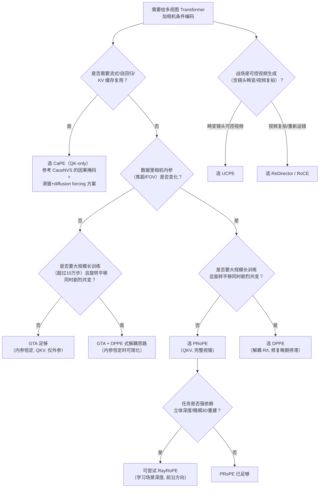

**几条使用提醒**：
1. 这张决策树反映的是**截至 2026 年 7 月的公开证据**，不代表"终局答案"——正如 §13.5-13.6 所示，这条脉络仍在快速演进。
2. 多个判据可能同时成立（比如"既要流式又要变焦鲁棒"），此时需要工程上的权衡取舍——目前还没有公开工作同时把 CausNVS 的因果缓存设计与 PRoPE 的完整视锥编码结合验证，这本身也是一个尚待填补的空白。
3. 第 9 章已经展示的 Qwen-RobotManip 选型（用 CaPE 而非 PRoPE 作为动作头的几何条件，但扩展了 Value/输出与内参编码）恰好落在这张决策树"需要流式+一定程度上仍要内参感知"的交界地带——这是一个很好的、真实产品级系统如何在多个判据间做工程取舍的案例。

### 13.10 小结与回旋：CaPE 并未被"淘汰"

回到本篇开头的问题："CaPE 之后谁更强？" 答案并不是一句简单的"PRoPE 更强，所以用 PRoPE 就好"。梳理完六篇后续工作，更准确的结论是：

> **CaPE 定义了这条技术脉络里最简的范式（QK-only、仅相对外参），后续工作沿着四个基本正交的方向各自演进——更完整的几何（PRoPE：补上内参）、更适配的部署场景（CausNVS：补上流式/缓存）、更稳定的大规模训练（DPPE：补上可辨识性）、更真实的几何建模（RayRoPE：补上场景深度）——但没有一个方向"吞并"了其他方向，它们分别在不同的约束条件下各自成为"当前最优选择"。**

这条脉络最有意思的"回旋"发生在 §13.3：**EscherNet 的原作者在两年后的新工作里，面对一个全新的部署场景（流式世界模型），没有选择"升级"到当时更强的 PRoPE，而是回到了 CaPE 最初、最简的形式**，仅仅是给它配上了因果掩码和位姿感知的 KV 缓存。这恰恰印证了 CaPE 在 EscherNet 论文里最初的设计哲学（本文 §2、§6.3 反复强调的"不要把绝对坐标烧进网络，而要把相对几何注入注意力"）——**"简单"本身在特定约束下就是一种竞争力**，而不是"技术不够先进"的代名词。

这也回应了本文第 9 章的核心论点：Qwen-RobotManip 在设计跨体态可迁移的动作接口时，选择的正是"CaPE 的相对性哲学 + GTA/PRoPE 式的 Value/内参扩展"的**混合体**，而不是照搬任何一篇论文的原始配方——这本身就是"按部署约束在这张演进图谱里就地取材"的一个绝佳工程案例。技术演进的意义，从来不是"新的一定淘汰旧的"，而是**给后来者提供了一整套可以按需组合的工具箱**。

### 13.11 本篇参考文献（补充）

以下 6 篇为本篇新引入、不在原 §12.2 列表中的文献：

- **PRoPE**：Li, R., Yi, B., Liu, J., Gao, H., Ma, Y., Kanazawa, A. *Cameras as Relative Positional Encoding.* NeurIPS 2025. `arXiv:2507.10496`；项目页：`https://www.liruilong.cn/prope/`；代码：`https://github.com/liruilong940607/prope`
- **CausNVS**：Kong, X., Watson, D., Strümpler, Y., Niemeyer, M., Tombari, F. *CausNVS: Autoregressive Multi-view Diffusion for Flexible 3D Novel View Synthesis.* 2025. `arXiv:2509.06579`；项目页：`https://kxhit.github.io/CausNVS.html`
- **DPPE**：Kenney, S., Suzuki, T. *DPPE: Rethinking Camera-Based Positional Encoding for Scaling Multi-View Transformers.* 2026. `arXiv:2606.31585`
- **RayRoPE**：Wu, Y., Jeon, M., Chang, J.-H. R., Tuzel, O., Tulsiani, S. *RayRoPE: Projective Ray Positional Encoding for Multi-view Attention.* 2026. `arXiv:2601.15275`；项目页：`https://rayrope.github.io/`；代码：`https://github.com/Lucas-707/RayRoPE`
- **UCPE**：*Unified Camera Positional Encoding for Controlled Video Generation.* 2025/2026. `arXiv:2512.07237`；代码：`https://github.com/chengzhag/UCPE`
- **ReDirector / RoCE**：Park, B., Kim, B.-H., Chung, H., Ye, J. C. *ReDirector: Creating Any-Length Video Retakes with Rotary Camera Encoding.* CVPR 2026. `arXiv:2511.19827`；项目页：`https://byeongjun-park.github.io/ReDirector/`

---

> 本篇（第 13 章）新增的两张自绘图 `post_cape_nvs_comparison.png`、`dppe_training_stagnation.png` 均由 `asset/` 下同名 Python 脚本生成，数据全部摘自对应论文表格（PRoPE Table 1/2、DPPE Table 6），未做任何编造或外推。
