# LingBot-VLA 2.0 深度解析：从 Foundation 到 Application 的实践之路

> 论文：*From Foundation to Application: Improving VLA Models in Practice*（Wu, Wang, Lu 等，Robbyant / Ant Digital Technologies，arXiv:2607.06403，2026）
> 官网：[technology.robbyant.com/lingbot-vla-v2](https://technology.robbyant.com/lingbot-vla-v2)
> 代码：[github.com/robbyant/lingbot-vla-v2](https://github.com/robbyant/lingbot-vla-v2)
> 权重：[Hugging Face · lingbot-vla-v2-6b](https://huggingface.co/robbyant/lingbot-vla-v2-6b)

---

## 一句话结论

LingBot-VLA 2.0 把 VLA 从“实验室 foundation 模型”推向“可部署 application”的关键，不是单点算法炫技，而是**三轴协同**：用约 **6 万小时**高质量异构数据重做泛化底座、用 **55 维全身规范动作空间**覆盖头/腰/底盘/灵巧手、用 **Dual-Query Distillation**（LingBot-Depth 几何 + DINO-Video 因果语义）把“预测未来”变成可训练的代理任务；再在 Action Expert 里用 **token-level loss-free MoE** 在固定算力预算下更高效地吸收跨本体差异。GM-100 generalist 与长程移动操控实验表明，这套工程—算法一体的配方，比单纯堆参数更能缩小“论文指标 ↔ 真实机器人”的鸿沟。

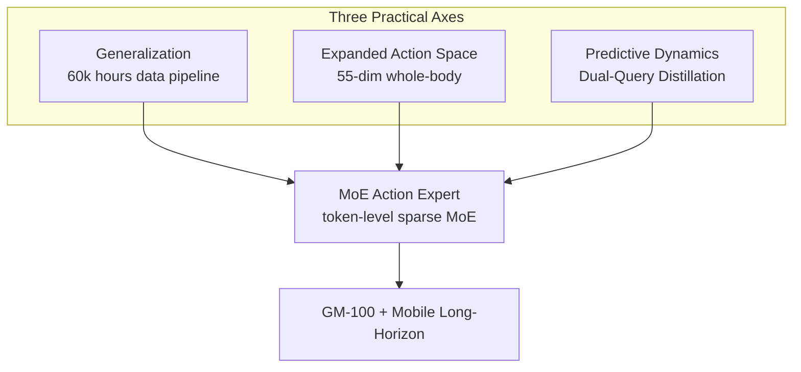
```mermaid
flowchart TB
  subgraph threeAxes [Three Practical Axes]
    G["Generalization<br/>60k hours data pipeline"]
    A["Expanded Action Space<br/>55-dim whole-body"]
    P["Predictive Dynamics<br/>Dual-Query Distillation"]
  end
  G --> M["MoE Action Expert<br/>token-level sparse MoE"]
  A --> M
  P --> M
  M --> R["GM-100 + Mobile Long-Horizon"]
```

---

## 目录

1. [概览与导读](#1-概览与导读)
2. [问题动机：实验室与真实部署的三重缺口](#2-问题动机实验室与真实部署的三重缺口)
3. [纵向演进：VLA 如何走到“应用导向”](#3-纵向演进vla-如何走到应用导向)
4. [横向对比：同期同类方法](#4-横向对比同期同类方法)
5. [数据工程：6 万小时如何炼成](#5-数据工程6-万小时如何炼成)
6. [静态架构：组件、类与职责](#6-静态架构组件类与职责)
7. [动态架构：训练 / 推理 / 部署数据流](#7-动态架构训练--推理--部署数据流)
8. [核心创新精读](#8-核心创新精读)
9. [实验与消融：哪些设计真正有效](#9-实验与消融哪些设计真正有效)
10. [代码解读：开源仓库关键路径](#10-代码解读开源仓库关键路径)
11. [局限、总结与术语表](#11-局限总结与术语表)
12. [参考文献](#12-参考文献)

---

## 1. 概览与导读

### 1.1 这篇报告在回答什么

Vision-Language-Action（VLA）模型近年已成为通用机器人策略的主流范式：预训练视觉—语言模型提供多模态对齐与语义先验，再在机器人轨迹上学习动作生成。π₀、π₀.₅、GR00T、OpenVLA 等已经证明——**模型先验 + 数据规模**可以显著提升跨任务能力。

但论文开篇点出的现实是：实验室基准上的成功，并不自动等于真实部署。真实机器人要求更广的本体多样性、更丰富的可控自由度、以及对动态场景的前瞻推理。LingBot-VLA 2.0 的立场是：

> 实用的 VLA 系统不应只在模型与数据规模上扩张，还应与真实机器人需求对齐——更广的本体支持、更丰富的可控动作空间、以及对动态场景更强的预测理解。

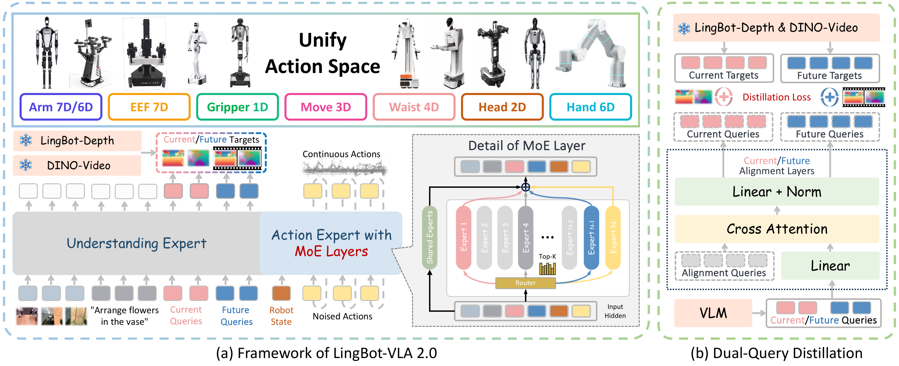

*上图（论文 teaser / framework）：左侧为重做后的数据管线与约 6 万小时预训练语料；中部为支持头、腰、移动基座、灵巧手的扩展动作空间；右侧为以未来预测为代理任务的 Dual-Query 蒸馏（视频语义先验 + 深度几何线索）。*

### 1.2 相对 1.0 的三项功能域改进

| 功能域 | 1.0 的局限（概括） | 2.0 的做法 | 由什么保证 |
|--------|-------------------|------------|------------|
| **Generalization** | 数据覆盖与清洗不足以支撑跨任务/跨本体 | 重做管线；约 50k h 机器人（20 本体）+ 10k h egocentric | 平滑性/对齐/VLM 过滤 + 统一标注 |
| **Expanded action space** | 偏标准双臂 | 55 维规范向量：臂/EEF/夹爪/手/腰/头/移动 | 缺省维度 padding + robot config 映射 |
| **Predictive dynamics** | 主要对当前观测反应 | 当前/未来双 query，蒸馏 Depth + DINO-Video | \(\mathcal{L}_{depth}+\mathcal{L}_{video}\) 代理目标 |

**阅读地图：** §2–§4 建立“为什么”（动机、纵向、横向）；§5 讲清数据“喂什么”；§6–§7 讲清系统“长什么样、怎么跑”；§8 是方法重心（MoE + Dual-Query）；§9 用实验回答“哪些设计真正有效”；§10 对照开源代码落地。

---

## 2. 问题动机：实验室与真实部署的三重缺口

用一个厨房场景帮助直觉化。假设你要让机器人完成“把桌上水果收进冰箱”：

1. **本体异构**：同一任务可能跑在 AgileX 双臂、Galaxea R1 Pro（半人形 + 底盘）、Astribot S1 上。关节数、相机视角、控制频率（15–30 Hz）全不一样。若动作表示不统一，扩大数据只会引入冲突。
2. **自由度不够**：桌面双臂抓取只需臂+夹爪；真实场景还要转头看、弯腰够、底盘挪位、灵巧手捏软物。动作空间若只覆盖双臂，模型再强也“够不着”任务。
3. **只看当下不够**：打开冰箱门后，门的开合角度、篮筐位置、下一秒手要伸向哪里，都依赖对**未来几何与运动**的预期。纯反应式策略容易在长程任务中“走一步算一步”而失败。

这三重缺口对应论文的三轴改进，也对应 related work 里三条并行研究线：扩数据与跨本体、embodiment-aware / 统一动作空间、world-model / latent-action / 预测目标。

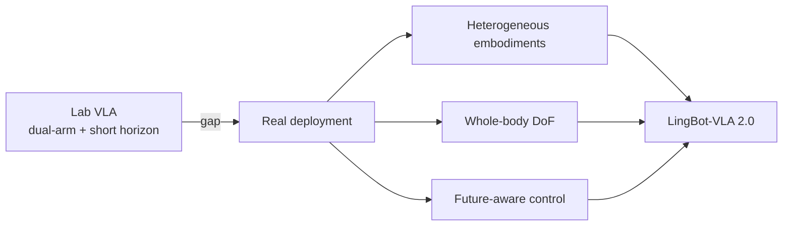
```mermaid
flowchart LR
  Lab["Lab VLA<br/>dual-arm + short horizon"] -->|"gap"| Real["Real deployment"]
  Real --> G1["Heterogeneous embodiments"]
  Real --> G2["Whole-body DoF"]
  Real --> G3["Future-aware control"]
  G1 --> LB["LingBot-VLA 2.0"]
  G2 --> LB
  G3 --> LB
```

---

## 3. 纵向演进：VLA 如何走到“应用导向”

### 3.1 主线时间线

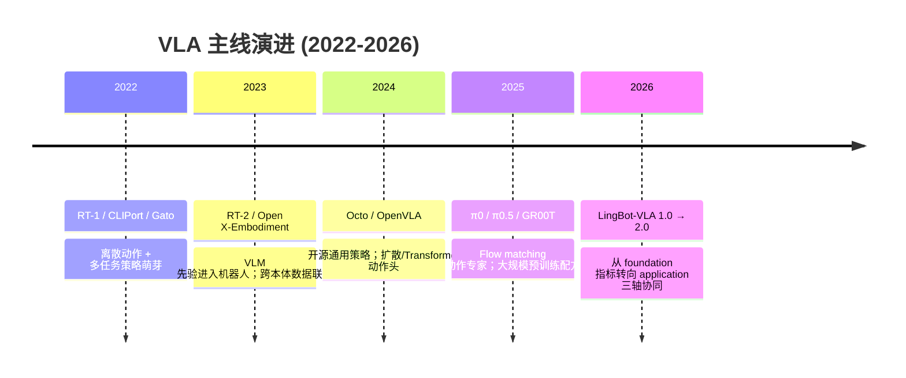
```mermaid
timeline
  title VLA 主线演进 (2022-2026)
  2022 : RT-1 / CLIPort / Gato
       : 离散动作 + 多任务策略萌芽
  2023 : RT-2 / Open X-Embodiment
       : VLM 先验进入机器人；跨本体数据联盟
  2024 : Octo / OpenVLA
       : 开源通用策略；扩散/Transformer 动作头
  2025 : π0 / π0.5 / GR00T
       : Flow matching 动作专家；大规模预训练配方
  2026 : LingBot-VLA 1.0 → 2.0
       : 从 foundation 指标转向 application 三轴协同
```

**阶段一：任务专用到多任务（RT-1 等）。** 用大规模演示学习多任务策略，但语义泛化弱，换物体/指令易崩。

**阶段二：VLM 先验注入（RT-2、OpenVLA）。** 把互联网视觉—语言知识带进控制，指令跟随与开放词汇物体理解显著增强；动作仍多为离散 token 或相对简单的连续头。

**阶段三：生成式动作专家（π₀ / π₀.₅）。** Flow matching / 扩散式动作 chunk 成为主流：在连续高维动作上更稳，适合高频控制。π₀.₅ 进一步强调数据规模与配方。

**阶段四：跨本体与人形（GR00T、Being-H 系列等）。** 关注异构机器人、人形全身、人类视频先验。

**阶段五：应用导向系统（LingBot-VLA 2.0）。** 明确主张：单点模型创新不够，必须同时解决数据质量、动作覆盖、预测目标。2.0 相对 1.0 的增量，正是把这三件事做成可复现的系统工程。

### 3.2 三条支线及其后续演进

#### 支线 A：数据规模与人类先验

- **Open X-Embodiment / RT-X**：跨实验室数据联盟，证明“多本体混合训练”可行，但动作定义仍碎片化。
- **Being-H / egocentric 路线**：用第一人称人类视频学习可迁移的手—物交互先验，缓解机器人数据昂贵问题。
- **LingBot-VLA 2.0 的位置**：同时吃机器人轨迹与 egocentric；对后者做 SLAM+MANO 重建，并统一到**当前相机系**动作表示，避免“人眼晃动”与“手部运动”纠缠。

| 方法 | 优点 | 缺点 | 适合场景 |
|------|------|------|----------|
| 纯机器人大规模 | 动作标签准、可直接监督 | 贵、场景窄 | 固定产线、同构机队 |
| 纯人类视频 | 便宜、多样性高 | 无机器人动作、需重建 | 学语义/手物先验 |
| 2.0 混合 + 统一表示 | 覆盖广、可联合训练 | 管线复杂、需严格质控 | 跨本体 foundation 预训练 |

#### 支线 B：统一动作空间与 embodiment-aware 结构

- 早期做法：每台机器人一个头，或简单 padding。
- 后续：统一末端位姿、相对动作、embodiment embedding、MoE 按身体部位分流（人形 MoE 工作）等。
- **2.0**：55 维**按身体部位分段**的规范向量（见 §5.3），缺省维 padding；不预设“专家=某本体”，而用 token-level MoE 让专家语义由数据涌现。

#### 支线 C：预测 / World Model / Latent Action

- **World model / latent action**（如 DexWorldModel、LDA 等）：显式建模未来或潜动作，改善动态决策。
- **几何监督**（如 GEM 等）：把 3D/深度先验注入 VLA。
- **2.0 Dual-Query**：不另训一个完整 world model，而是在因果 VLM 上挂 \(Q_t, Q_{t+T}\)，分别对齐当前/未来的深度与视频表征——**轻量代理任务**，训练时可蒸馏、推理时可关掉教师。

| 路线 | 优点 | 缺点 | 适合场景 |
|------|------|------|----------|
| 完整 world model | 可规划、可想象 | 训练贵、与控制耦合难 | 长程规划、仿真 |
| Latent action | 压缩决策空间 | 可解释性弱、对齐难 | 接触丰富、多模态传感 |
| Dual-Query 蒸馏 | 实现简单、与 VLA 同骨干 | 依赖教师质量；非显式规划 | 大规模预训练 + 实机微调 |

### 3.3 从 1.0 到 2.0：演进而非推倒重来

2.0 继承 1.0 的 VLM + Flow Matching Action Expert 骨架，增量集中在：数据管线与规模、全身动作维、MoE、Dual-Query。这符合“扩展大于修改”的工程哲学——foundation 权重可继续 post-train 到具体机型（仓库提供 RoboTwin / real_robot 配方）。

---

## 4. 横向对比：同期同类方法

在 **GM-100 generalist（九任务混合训练）** 与 **长程移动操控** 上，论文直接对比 GR00T N1.7、π₀.₅、LingBot-VLA 1.0。

### 4.1 能力维度对照

| 维度 | π₀.₅ | GR00T N1.7 | LingBot-VLA 1.0 | **LingBot-VLA 2.0** |
|------|------|------------|-----------------|---------------------|
| 骨干范式 | VLM + flow matching | 人形/跨本体 foundation | VLM + FM | VLM(Qwen3-VL) + FM + **MoE** |
| 预训练数据 | 大规模机器人 | 大规模（偏人形生态） | 相对较小 | **~60k h**（20 本体 + ego） |
| 动作空间 | 强双臂/多平台 | 全身倾向 | 偏双臂 | **55-D 全身规范** |
| 预测目标 | 动作本身 | 视具体版本 | 动作 | 动作 + **Depth/Video 双 query** |
| MoE | 非核心卖点 | 视版本 | 无/弱 | **token-level loss-free MoE** |
| 开源部署 | 视生态 | 视生态 | — | **完整 train/deploy 仓库** |

与 **Qwen-RobotManip**（“先对齐再规模化”）相比：二者都强调跨本体统一表示；Qwen-RobotManip 更突出开源数据上的三维对齐框架，LingBot-VLA 2.0 更突出**私有大规模实机 + egocentric 管线**、**全身 DoF** 与 **预测蒸馏**，并给出 GM-100 / 移动长程实机数字。

### 4.2 基准数字速览（progress / success，%）

**双臂 GM-100 overall average：**

| 平台 | GR00T N1.7 | π₀.₅ | 1.0 | **2.0** |
|------|------------|------|-----|---------|
| AgileX Cobot Magic | 36.3 / 17.8 | 59.1 / 32.2 | 58.2 / 30.0 | **66.2 / 34.4** |
| Galaxea R1 Pro | 16.4 / 5.6 | 27.4 / 8.9 | 32.7 / **15.6** | **34.6 / 15.6** |

**长程移动操控：**

| 本体 / 任务 | 设置 | 2.0 | π₀.₅ |
|-------------|------|-----|------|
| Astribot S1 · 冰箱分拣 | ID | **77.1 / 60.0** | 65.3 / 46.7 |
| Astribot S1 · 冰箱分拣 | OOD | **37.0 / 13.3** | 30.3 / 6.7 |
| Cobot Magic-ARX · 灶台清洁 | ID | **84.3 / 66.7** | 79.9 / 60.0 |
| Cobot Magic-ARX · 灶台清洁 | OOD | **67.5 / 40.0** | 62.5 / 33.3 |

**适用场景建议：**

- **π₀.₅**：强通用双臂基线；若你的机型与其生态接近、且不需要重度全身/预测蒸馏，仍是有力对照。
- **GR00T**：偏人形与 NVIDIA 生态；桌面双臂 generalist 上本报告中弱于 2.0。
- **LingBot-VLA 2.0**：需要跨 20 类本体预训练、全身控制、长程移动操控，并希望开源 post-train/部署时优先。

---

## 5. 数据工程：6 万小时如何炼成

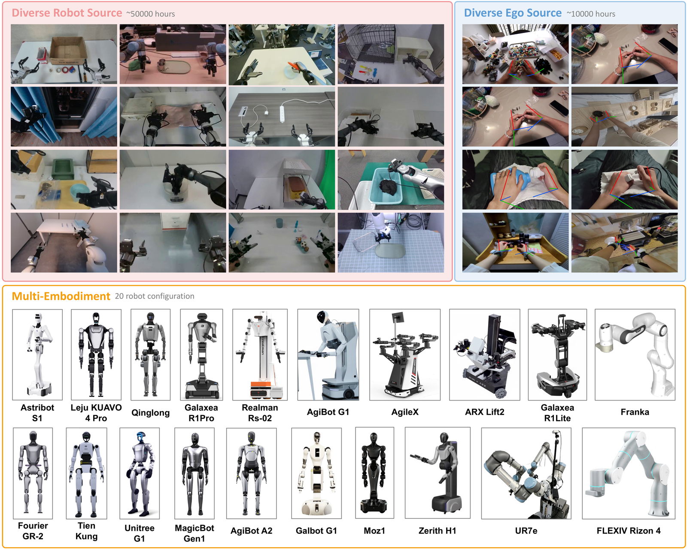

*上图：20 种机器人本体，覆盖单臂、双臂、半人形、人形与 egocentric；自由度含臂、头、腰、移动基座、灵巧手。*

### 5.1 总流程

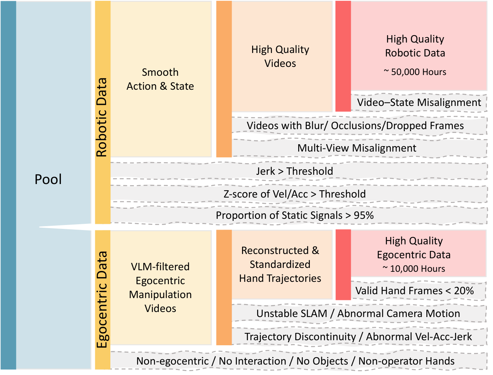

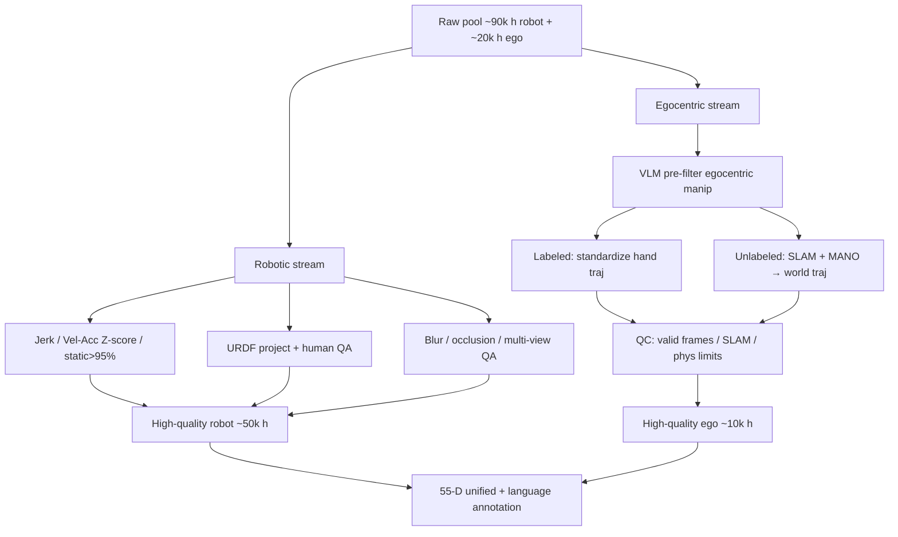
```mermaid
flowchart TB
  Pool["Raw pool ~90k h robot + ~20k h ego"]
  Pool --> R["Robotic stream"]
  Pool --> E["Egocentric stream"]
  R --> R1["Jerk / Vel-Acc Z-score / static>95%"]
  R --> R2["URDF project + human QA"]
  R --> R3["Blur / occlusion / multi-view QA"]
  R1 --> RH["High-quality robot ~50k h"]
  R2 --> RH
  R3 --> RH
  E --> E1["VLM pre-filter egocentric manip"]
  E1 --> E2["Labeled: standardize hand traj"]
  E1 --> E3["Unlabeled: SLAM + MANO → world traj"]
  E2 --> EQ["QC: valid frames / SLAM / phys limits"]
  E3 --> EQ
  EQ --> EH["High-quality ego ~10k h"]
  RH --> U["55-D unified + language annotation"]
  EH --> U
```

### 5.2 机器人数据质控（直觉版）

想象遥操作录到一段“抓杯子”：

- **Jerk（加加速度）过大**：手柄抖了一下，关节指令尖刺 → 丢掉。
- **速度/加速度 Z-score 超阈**：相对该本体常态的离群运动 → 丢掉。
- **95% 时间几乎静止**：人走开聊天，机器人干等 → 丢掉。
- **URDF 投影对不上视频**：状态时钟错了或标定坏了 → 丢掉。
- **糊、遮挡、多视角不同步**：视觉不可用 → 丢掉。

阈值约 90k→50k 小时，说明**质重于量**：脏数据进 foundation，会把冲突写进权重。

### 5.3 Egocentric：世界系存储，相机系训练

对无动作标签的人类视频：VLM 先丢掉非第一人称、无手物交互等；再 SLAM 得相机轨迹，MANO 得手部，抬到世界系存成连续轨迹。训练时，若当前帧为 \(t\)，则把未来手部轨迹变到**当前相机系**：

\[
\mathbf{p}_{\tau}^{C_t} = \mathbf{T}_{C_t \leftarrow W}\, \mathbf{p}_{\tau}^{W}.
\]

这样：存储统一、训练时动作与“此刻看见的画面”对齐，并解耦头部晃动与手部运动——类似“以自我为中心的相对坐标”，而非死绑世界原点。

### 5.4 55 维统一动作表示

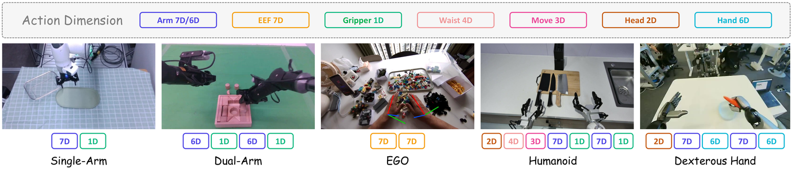

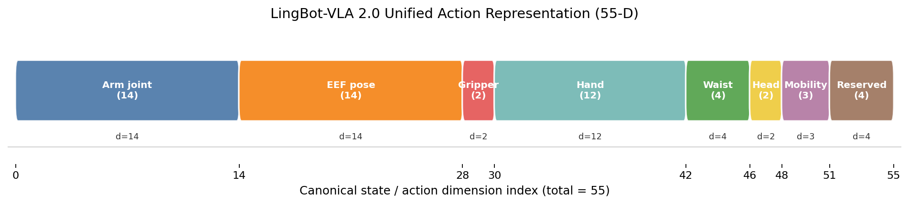

| 字段 | 维数 | 含义 |
|------|------|------|
| Arm joint | 14 | 双臂关节上限；单臂则 padding |
| EEF pose | 14 | 每臂 XYZ + 四元数（7×2） |
| Gripper | 2 | 双夹爪 |
| Hand | 12 | 灵巧手关节 |
| Waist | 4 | 腰 |
| Head | 2 | 头 |
| Mobility | 3 | 移动基座 |
| Reserved | 4 | 预留 |
| **合计** | **55** | 状态与动作共用规范向量 |

开源 post-train 配置（`real_robot.yaml`）中 `action_dim / max_action_dim / max_state_dim = 55`，并按部位指定 `meanstd` 归一化，与论文消融中 MeanStd 最优一致。

### 5.5 语言标注：18 类原子动作 + 开放物体词

用 Qwen3.6-27B 自动切分子任务：闭合词表含 15 个操作原语 + `transit` / `idle` / `other`。切分原则：抓—运—放同一交互合为一段；物体变、动作类型变、或长暂停才切边界。`idle` 不进训练。

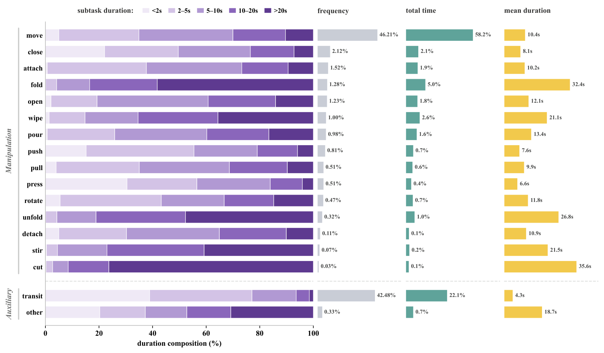

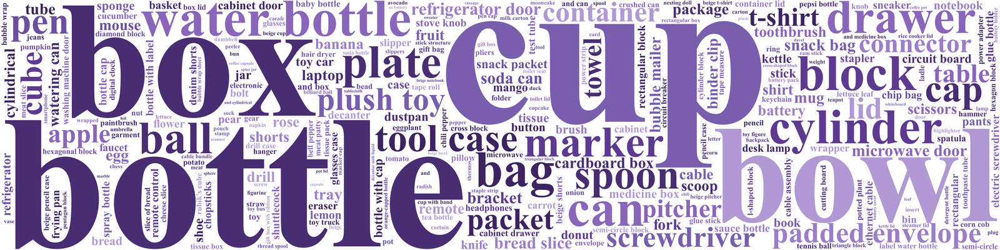

*频率上 `move` / `transit` 占优；`cut` / `fold` / `stir` 少但平均时长更长——长尾精细操作仍是数据瓶颈。*

---

## 6. 静态架构：组件、类与职责

### 6.1 组件图

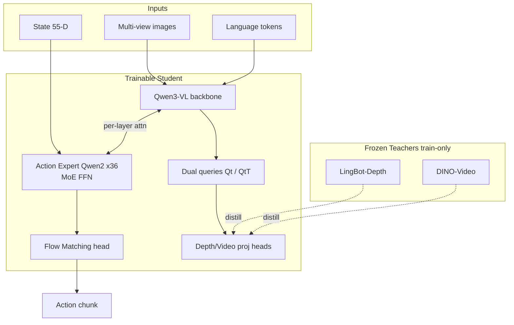
```mermaid
flowchart TB
  subgraph input [Inputs]
    Img["Multi-view images"]
    Lang["Language tokens"]
    State["State 55-D"]
  end
  subgraph teachers [Frozen Teachers train-only]
    DepthT["LingBot-Depth"]
    VideoT["DINO-Video"]
  end
  subgraph student [Trainable Student]
    VLM["Qwen3-VL backbone"]
    Q["Dual queries Qt / QtT"]
    AE["Action Expert Qwen2 x36<br/>MoE FFN"]
    FM["Flow Matching head"]
    Proj["Depth/Video proj heads"]
  end
  Img --> VLM
  Lang --> VLM
  VLM --> Q
  Q --> Proj
  DepthT -.->|distill| Proj
  VideoT -.->|distill| Proj
  State --> AE
  VLM <-->|per-layer attn| AE
  AE --> FM
  FM --> Act["Action chunk"]
```

### 6.2 类图（开源代码映射）

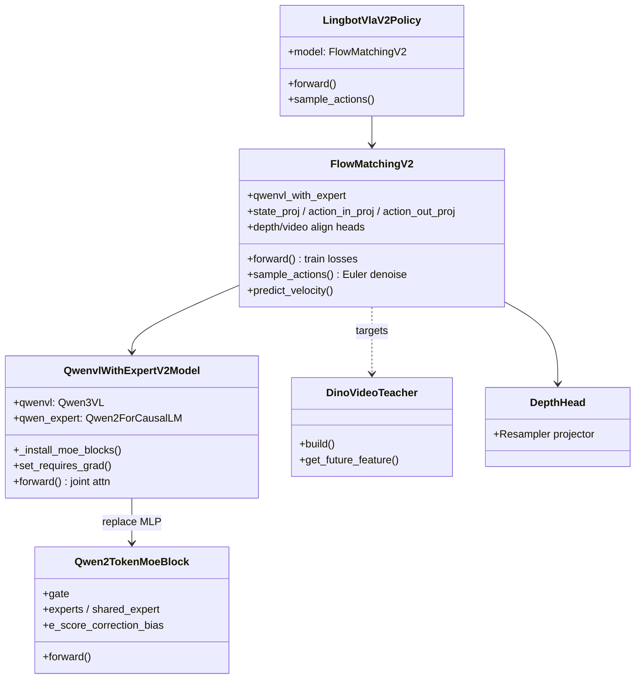
```mermaid
classDiagram
  class LingbotVlaV2Policy {
    +model: FlowMatchingV2
    +forward()
    +sample_actions()
  }
  class FlowMatchingV2 {
    +qwenvl_with_expert
    +state_proj / action_in_proj / action_out_proj
    +depth/video align heads
    +forward() train losses
    +sample_actions() Euler denoise
    +predict_velocity()
  }
  class QwenvlWithExpertV2Model {
    +qwenvl: Qwen3VL
    +qwen_expert: Qwen2ForCausalLM
    +_install_moe_blocks()
    +set_requires_grad()
    +forward() joint attn
  }
  class Qwen2TokenMoeBlock {
    +gate
    +experts / shared_expert
    +e_score_correction_bias
    +forward()
  }
  class DinoVideoTeacher {
    +build()
    +get_future_feature()
  }
  class DepthHead {
    +Resampler projector
  }
  LingbotVlaV2Policy --> FlowMatchingV2
  FlowMatchingV2 --> QwenvlWithExpertV2Model
  QwenvlWithExpertV2Model --> Qwen2TokenMoeBlock : replace MLP
  FlowMatchingV2 --> DepthHead
  FlowMatchingV2 ..> DinoVideoTeacher : targets
```

| 类 / 模块 | 职责 |
|-----------|------|
| `LingbotVlaV2Policy` | 对外策略接口；包装 `FlowMatchingV2` |
| `FlowMatchingV2` | 前缀（视觉+语言+query）/ 后缀（state+noisy action）嵌入；FM 损失；蒸馏损失；推理去噪 |
| `QwenvlWithExpertV2Model` | Qwen3-VL 与 Action Expert 逐层联合注意力；安装 MoE；冻结控制 |
| `Qwen2TokenMoeBlock` | Shared + Routed experts；sigmoid 路由；bias 负载统计 |
| `moe_load_balance.build_moe_load_balance_hook` | 优化器 step 前更新 \(b_j\)，不污染主损失 |
| `DepthHead` / video heads | 把 query 隐状态投影到教师特征空间 |
| `DinoVideoTeacher` | 冻结因果视频教师，产出 \(Z_t, Z_{t+T}\) |
| `deploy/lingbot_vla_v2_policy.py` | 实机 WebSocket 策略；compile；反归一化 |

默认 Action Expert：**36 层**，与 VLM 层数对齐以便逐层交互；配置里 `token_moe_layers = 0..35` 表示**全部 FFN 换 MoE**。

---

## 7. 动态架构：训练 / 推理 / 部署数据流

### 7.1 训练 Forward

Flow matching 对动作 chunk 做线性插值噪声路径。设动作为 \(a\)，噪声 \(\epsilon\)，时间 \(t\sim p(t)\)：

\[
x_t = t\,\epsilon + (1-t)\,a, \qquad u_t = \epsilon - a.
\]

模型预测速度场 \(v_\theta(x_t, o, s, \ell)\)，主损失为 \(\|v_\theta - u_t\|^2\)（消融表明整体优于 L1）。

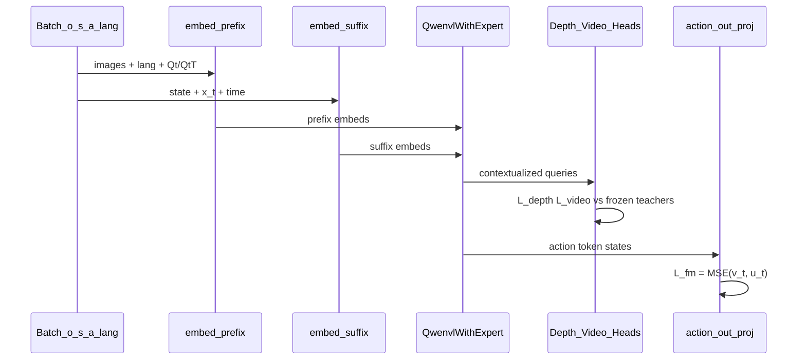
```mermaid
sequenceDiagram
  participant Batch as Batch_o_s_a_lang
  participant Pref as embed_prefix
  participant Suf as embed_suffix
  participant Joint as QwenvlWithExpert
  participant Dist as Depth_Video_Heads
  participant Out as action_out_proj
  Batch->>Pref: images + lang + Qt/QtT
  Batch->>Suf: state + x_t + time
  Pref->>Joint: prefix embeds
  Suf->>Joint: suffix embeds
  Joint->>Dist: contextualized queries
  Dist->>Dist: L_depth L_video vs frozen teachers
  Joint->>Out: action token states
  Out->>Out: L_fm = MSE(v_t, u_t)
```

### 7.2 Backward：谁更新、谁冻结

| 模块 | 训练时 | 说明 |
|------|--------|------|
| LingBot-Depth / DINO-Video **教师** | **冻结** | `requires_grad=False`；只提供 target |
| Qwen3-VL **视觉塔** | 可冻可训 | `freeze_vision_encoder` |
| 整个 VLM | 可只训 expert | `train_expert_only` |
| Action Expert + MoE experts/router | **更新** | 主 FM 梯度 |
| `e_score_correction_bias` | **非梯度更新** | 优化器 pre-hook 按负载符号改 bias |
| Depth/Video **投影头**与 query emb | **更新** | 蒸馏损失反传 |
| 推理时教师与蒸馏 | **关闭** | 只跑 prefix cache + 去噪 |

总损失（概念上）：

\[
\mathcal{L} = \mathcal{L}_{\mathrm{FM}} + \alpha \mathcal{L}_{\mathrm{depth}} + \beta \mathcal{L}_{\mathrm{video}} + \underbrace{\mathcal{L}_{\mathrm{seq\text{-}wise}} + \mathcal{L}_{z}}_{\text{可选 MoE 辅助}}.
\]

论文主推 **auxiliary-loss-free** 负载均衡；仓库 post-train 也可开 `sequence_wise_loss` / `router_z_loss`，或改回 `bias_update_speed` 的 loss-free 设定。

### 7.3 推理：Euler 去噪

`sample_actions`：先对 prefix（图像+语言+query）跑一遍并 **KV cache**；再从 \(x_1=\epsilon\) 出发，用 `num_steps`（默认 **10**）步：

\[
x \leftarrow x + \Delta t \cdot v_\theta(\cdot), \quad \Delta t = -1/N.
\]

官网/README：RTX 4090D 上约 **130 ms / 次**（10 steps）。可用 `torch.compile` 加速 `predict_velocity`。

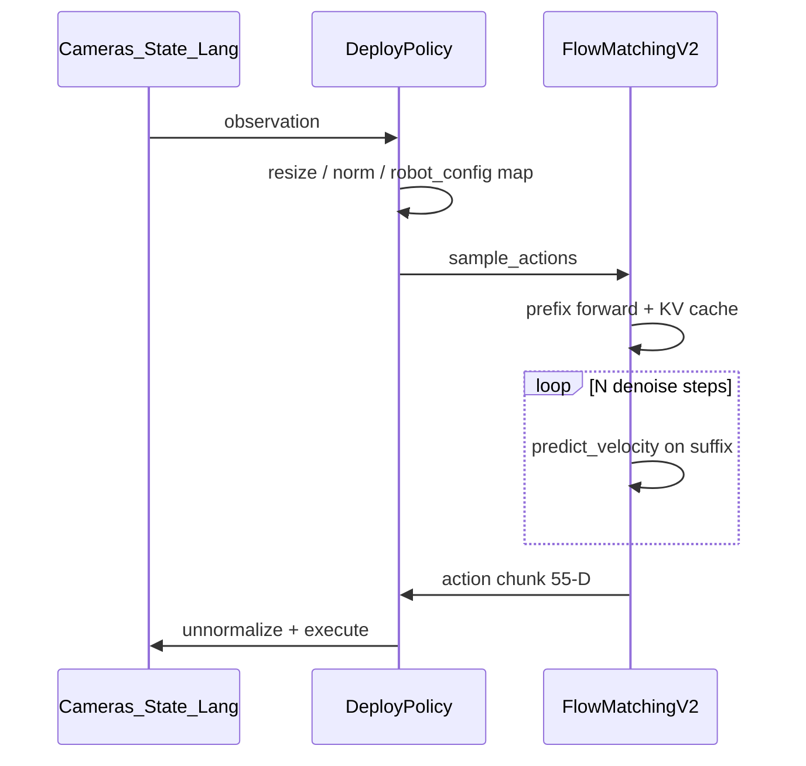
```mermaid
sequenceDiagram
  participant Cam as Cameras_State_Lang
  participant Pol as DeployPolicy
  participant M as FlowMatchingV2
  Cam->>Pol: observation
  Pol->>Pol: resize / norm / robot_config map
  Pol->>M: sample_actions
  M->>M: prefix forward + KV cache
  loop N denoise steps
    M->>M: predict_velocity on suffix
  end
  M->>Pol: action chunk 55-D
  Pol->>Cam: unnormalize + execute
```

### 7.4 部署拓扑

`python -m deploy.lingbot_vla_v2_policy` 起 WebSocket 策略服务；机器人端推观测、收动作。`configs/robot_configs/*.yaml` 负责把具体机型的 joint/EEF/相机字段映射进 55 维规范空间——**换本体主要改 config，而不是改网络结构**。

---

## 8. 核心创新精读

### 8.1 Token-level Loss-free MoE

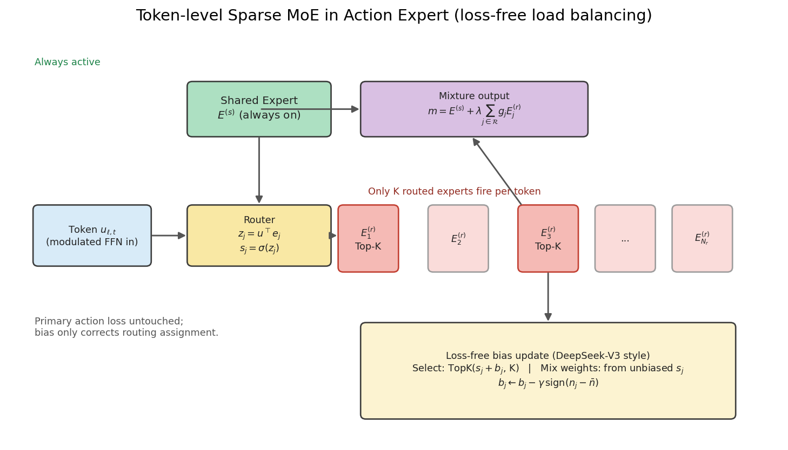

跨本体预训练时，动作分布被**本体动力学、任务逻辑、场景**纠缠。2.0 不在“专家=左臂/右臂/某机器人”上硬编码，而是在 Action Expert 的 FFN 位置插入 **token-level sparse MoE**：

\[
m_{\ell}(u_{\ell,t})
=
E_{\ell}^{(s)}(u_{\ell,t})
+
\lambda
\sum_{j \in \mathcal{R}(u_{\ell,t})}
g_{\ell,j}(u_{\ell,t})\, E_{\ell,j}^{(r)}(u_{\ell,t}).
\]

专家为 SwiGLU MLP。路由 logits \(z_{\ell,j}=u^\top e_j\)（**FP32**），亲和度用 **sigmoid**（避免 softmax 过强竞争）：

\[
s_{\ell,j}=\sigma(z_{\ell,j}).
\]

**选择**用带 bias 的分数，**混合权重**用无 bias 的 \(s\)：

\[
\mathcal{R}=\mathrm{TopK}(s_j+b_j,\,K),
\qquad
g_j=\frac{s_j}{\sum_{k\in\mathcal{R}} s_k}.
\]

Bias 更新（DeepSeek-V3 风格，**不进主损失**）：

\[
b_j \leftarrow b_j - \gamma\,\mathrm{sign}\!\left(n_j-\bar n\right).
\]

**为何有效（直觉）：** 共享专家学“跨本体通用控制语法”；路由专家消化“这台 Galaxea 的腰—底盘耦合”之类局部模式。同 active 参数下，MoE 训练 loss 与 GM-100 验证动作误差均优于 Dense（见论文 `loss_mse_comparison`）。

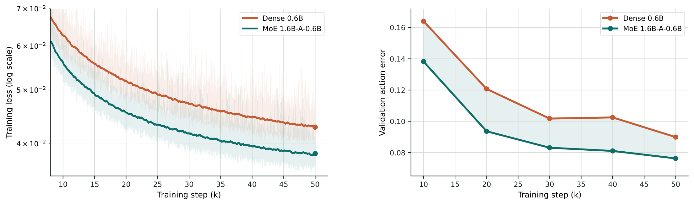

实机配置例：`token_num_experts=32`，`token_top_k=4`，`router_activation=sigmoid`，`routed_scaling_factor=4.0`，`bias_update_speed=0.00025`。

### 8.2 Dual-Query Distillation

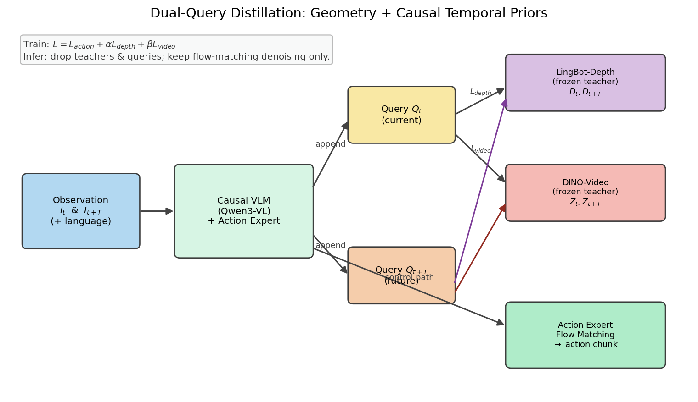

在视觉/文本 token 后追加可学习 query \([Q_t, Q_{t+T}]\)（\(T\) 为 action chunk 视野）。

**深度教师（几何）：**

\[
\mathcal{L}_{\mathrm{depth}}
=
\mathbb{E}\Big[
\|\mathrm{Proj}_{depth}(Q_t)-D_t\|_1
+
\|\mathrm{Proj}_{depth}(Q_{t+T})-D_{t+T}\|_1
\Big].
\]

**DINO-Video 教师（因果语义/运动）：**

\[
\mathcal{L}_{\mathrm{video}}
=
\mathbb{E}\Big[
\|\mathrm{Proj}_{video}(Q_t)-Z_t\|_F^2
+
\|\mathrm{Proj}_{video}(Q_{t+T})-Z_{t+T}\|_F^2
\Big].
\]

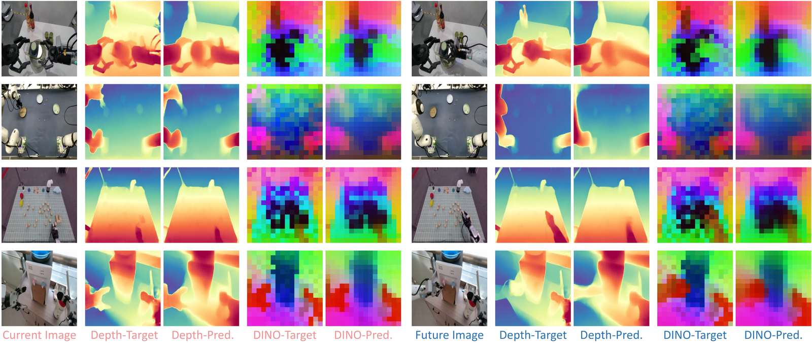

*左：当前帧深度 / DINO-PCA 的真值与预测；右：未来帧。说明 query 在因果推断中确实编码了几何与语义动态——即使最终控制只取动作头。*

**生活化类比：** 教开车时，不只纠正方向盘（动作损失），还要求学员“说出前方 2 秒路面起伏（深度）和车流意图（视频表征）”。考驾照（部署）时不再口头问答，但脑子里的预判能力已经练出来了。

### 8.3 DINO-Video 教师本身

- 初始化自 **DINOv3**，加 **block-wise 因果时序注意力** 与 **3D-RoPE**。
- 在约 5M 片段（互联网 + egocentric + 机器人）上用 video-adapted DINO / iBOT 自蒸馏。
- 每样本 16 帧；按有效帧率赋绝对时间编码，区分不同真实时长。
- **LARYBench**：在 Composite Robot 分类与两条回归基准上优于 V-JEPA 2 / 纯 DINOv3（论文 Table）。

这保证教师不是“通用视频特征”，而是带机器人域归纳偏置的**因果**表征——对 \(Q_{t+T}\) 尤其关键。

---

## 9. 实验与消融：哪些设计真正有效

### 9.1 GM-100 Generalist 双臂

设置：每平台**单策略混合训练九任务**（非每任务一模型），报 progress 与 success。

**结果要点：**

- AgileX 上 2.0 相对 1.0：+8.0 / +4.4；相对 π₀.₅：+7.1 / +2.2。
- 增益集中在强物体 grounding / 目标导向任务（如 Retrieve keychain 100/100，Pick out toy bone 大幅提升）。
- **Progress ≫ Success** 的缺口仍在：常能做完前几步，卡在最终精密放置/释放。
- AgileX ≫ Galaxea：运动学、相机、动作对齐的本体差距仍是硬问题。

### 9.2 长程移动操控

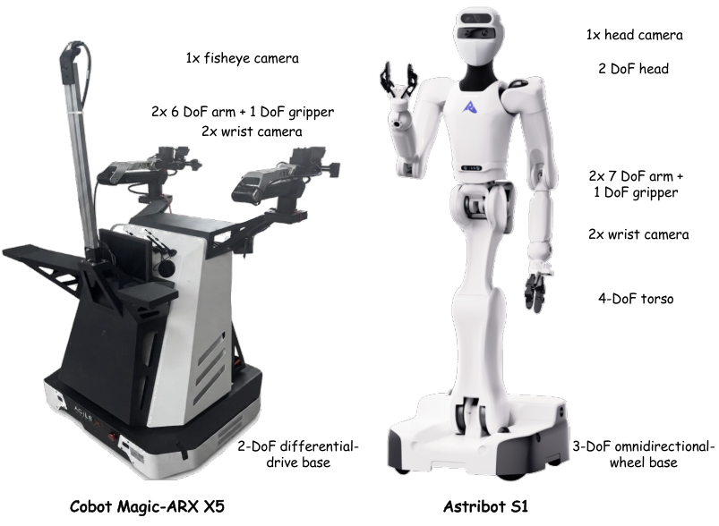

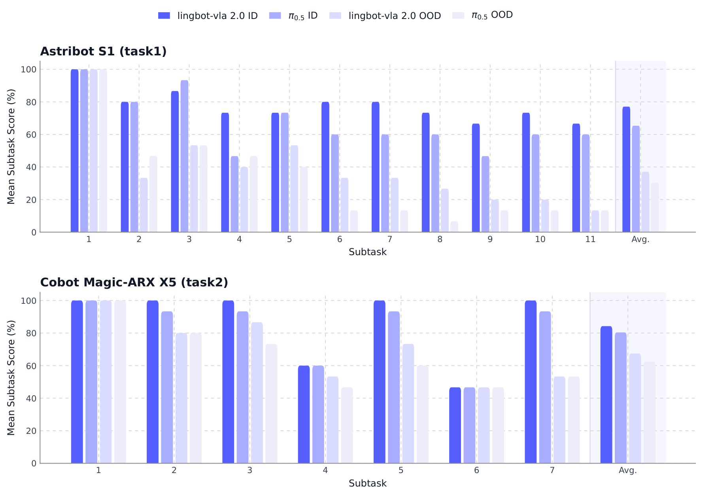

- ID 上冰箱分拣、灶台清洁均超 π₀.₅；OOD（位姿扰动 ±10 cm；冰箱任务还换未见物体）两边都掉点，但 2.0 仍领先。
- 冰箱 OOD 掉点更大：同时改位姿与物体类别，更吃物体级泛化与长程恢复。

全身预训练覆盖底盘/腰/头，是这类任务相对纯桌面 VLA 的关键差异。

### 9.3 消融排序（四任务实机，平均成功率）

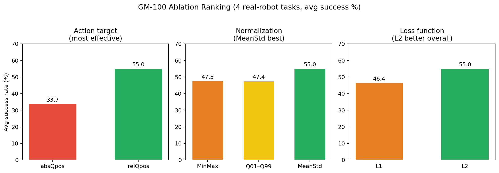

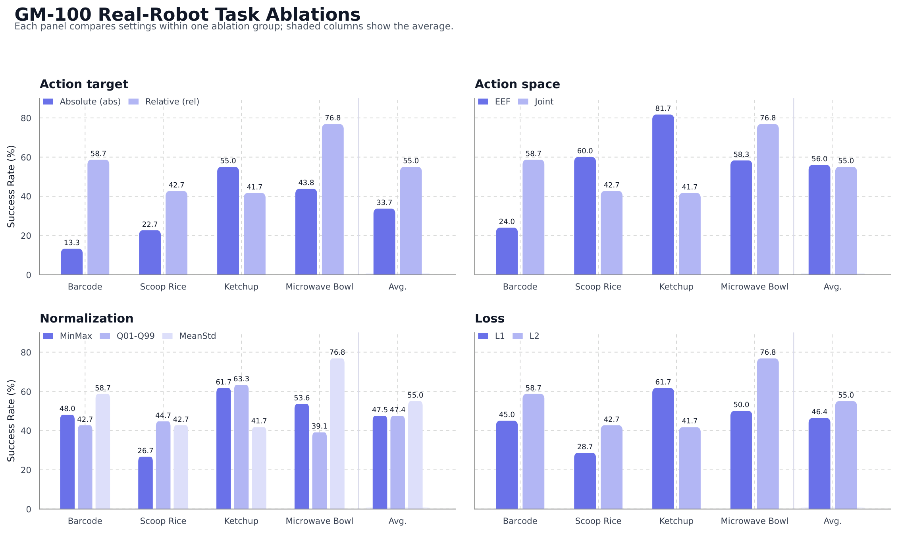

| 排名 | 设计点 | 证据 | 结论 |
|------|--------|------|------|
| 1 最有效 | **relQpos ≫ absQpos** | 55.0 vs 33.7；rel 标准差约为 abs 的 31%–37% | 预测局部增量，目标更居中、低方差 |
| 2 很有效 | **MeanStd ≫ MinMax / Q01–Q99** | 55.0 vs 47.5 / 47.4 | MinMax/分位压缩动态范围；MeanStd 保留长尾纠正动作 |
| 3 很有效 | **L2 ≫ L1**（总体） | 55.0 vs 46.4 | 相对动作多在 0 附近，L2 更贴合高密度区；接触丰富任务 L1 偶发更好 |
| 4 情境依赖 | **EEF ≈ Joint**（56.0 vs 55.0） | Barcode 偏 joint；Squeeze Ketchup 偏 EEF | 分布对齐 + 任务物理结构共同决定 |
| 5 架构 | **MoE ≫ Dense**（同 active 参数） | 更低 train loss / val error | 稀疏激活更会花算力 |
| 6 系统 | 数据+全身+预测 | GM-100 / 移动长程全面优于 1.0 与 π₀.₅ | 三轴缺一则难同时吃到 grounding 与长程 |

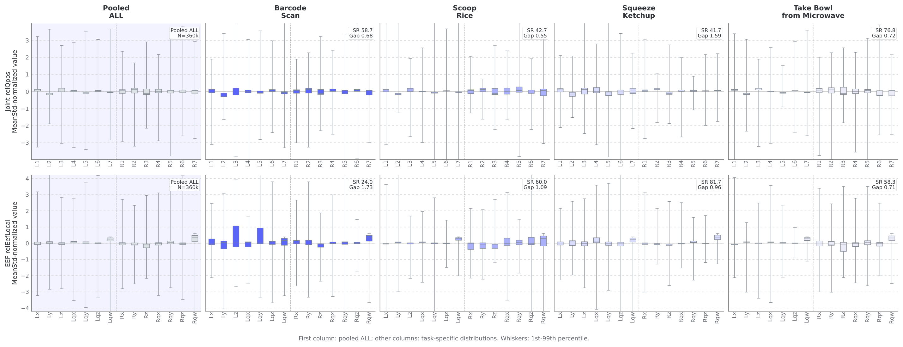

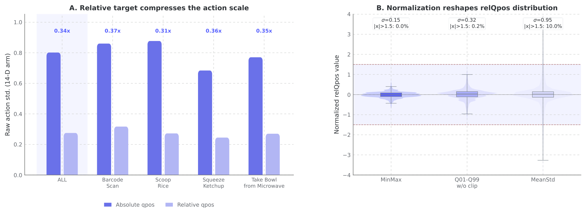

**实践配方（与开源 real_robot 一致）：** 相对关节/部位动作 + MeanStd + L2/FM-MSE + MoE sigmoid 路由 + Dual-Query 蒸馏。

---

## 10. 代码解读：开源仓库关键路径

仓库根布局：`lingbotvla/`（模型与数据）、`tasks/vla/train_lingbotvla.py`、`deploy/`、`configs/vla/`、`configs/robot_configs/`。

### 10.1 MoE 前向（与论文公式一一对应）

```python
# github.com/Robbyant/lingbot-vla-v2
# lingbotvla/models/vla/lingbot_vla/qwen2_action_expert.py :: Qwen2TokenMoeBlock.forward
with torch.amp.autocast(hidden_flat.device.type, enabled=False):
    router_logits = F.linear(hidden_flat.float(), self.gate.weight.float())  # FP32 gate
routing_scores = router_logits.sigmoid()  # or softmax
scores_for_choice = routing_scores + self.e_score_correction_bias.unsqueeze(0)
_, selected_experts = torch.topk(scores_for_choice, self.top_k, dim=-1)
routing_weights = routing_scores.gather(1, selected_experts)  # unbiased mix weights
# ... routed expert compute ...
shared_expert_output = self.shared_expert(hidden_flat)
final_hidden_states = final_hidden_states + shared_expert_output
```

要点：门控 **强制 FP32**（避免 bf16 在近并列分上抖动导致“轮流死专家”）；**Top-K 用 \(s+b\)，权重用 \(s\)**；共享专家始终相加。

### 10.2 Loss-free bias：优化器钩子而非 loss 项

```python
# lingbotvla/models/vla/lingbot_vla/moe_load_balance.py :: optimizer pre-hook
mean_load = tpe.float().mean()
deviation = (tpe.float() - mean_load).sign()
block.e_score_correction_bias.add_(-coeff * deviation)
if bias_centering:
    block.e_score_correction_bias.sub_(block.e_score_correction_bias.mean())
block.tokens_per_expert.zero_()
```

挂在 `optimizer.register_step_pre_hook`：跨 micro-batch 累计 `tokens_per_expert`，再 all-reduce，保证与 grad accum / compile 兼容。

### 10.3 训练一步：FM + 蒸馏

```python
# modeling_lingbot_vla_v2.py :: FlowMatchingV2.forward
x_t = time_expanded * noise + (1 - time_expanded) * actions
u_t = noise - actions
(outputs_embeds, suffix_out), _, router_logits_list = self.qwenvl_with_expert.forward(...)
if self.config.align_params != {}:
    loss_depth, loss_future_depth, ... = self.depth_emb_forward(...)
    loss_video, ... = self.video_emb_forward(...)
v_t = self.action_out_proj(suffix_out)
losses = F.mse_loss(u_t, v_t, reduction="none")  # or L1_fm
```

`embed_prefix` 在 `align_type=="query"` 时把 current/future depth（及 video）query 按 `prefix_query_segments` 拼进序列——这就是论文 Dual-Query 的实现落点。

### 10.4 推理去噪环

```python
# modeling_lingbot_vla_v2.py :: FlowMatchingV2.sample_actions
dt = torch.tensor(-1.0 / self.config.num_steps, dtype=dtype, device=device)
x_t, time = noise, torch.tensor(1.0, dtype=dtype, device=device)
while time >= -dt / 2:
    v_t = predict_velocity_fn(state, prefix_pad_masks, past_key_values, x_t, expanded_time, ...)
    x_t += dt * v_t
    time += dt
return x_t  # denoised action chunk
```

Prefix 只算一次；后缀每步重算——典型的“VLM 条件 + 轻量动作专家迭代”部署形态。

### 10.5 教师冻结

`DinoVideoTeacher.build()` 中 `adapter.eval()` 且全部 `requires_grad=False`；`get_future_feature` 标 `@torch.no_grad()`。深度教师同理只作 target。学生侧 `DepthHead` 是可训 Resampler，把 LLM/query 特征映到教师维度。

### 10.6 Post-train 最小路径（仓库 README）

1. 准备 LeRobot 数据集  
2. 写 `configs/robot_configs/<name>.yaml` 做字段映射  
3. 算 `assets/norm_stats`  
4. `bash train.sh tasks/vla/train_lingbotvla.py ./configs/vla/...`  

这与论文“foundation → application”叙事一致：**预训练吃 60k 小时多样性；落地靠规范空间 + 归一化 + 较短 post-train**。

---

## 11. 局限、总结与术语表

### 11.1 局限（论文结果已暴露）

1. **Progress–Success 缺口**：部分完成常见，终端精密操作仍难。  
2. **跨本体落差**：同策略在 AgileX 与 Galaxea 上差距大。  
3. **OOD 物体+位姿**同时变时，长程任务成功率仍低（冰箱 OOD success 13.3%）。  
4. **数据长尾**：精细动作（cut/fold/stir）少；标注依赖 VLM 自动管线，边界误差会进训练。  
5. **Dual-Query 非显式规划**：改善表征与动作，但不提供可搜索的 world model。

### 11.2 总结

LingBot-VLA 2.0 的贡献，应理解为一次**应用导向的系统整合**：

- 用严苛质控把 6 万小时异构数据压成可联合训练的规范表示；  
- 用 55 维全身空间让 foundation 具备移动操作与灵巧操作的“接口宽度”；  
- 用 Dual-Query 把几何与因果动态变成可缩放的代理监督；  
- 用 loss-free MoE 在固定算力下消化跨本体多模态性。  

消融表明：相对动作、MeanStd、L2、MoE 是高杠杆设计；EEF/Joint 则要按任务物理选型。对从业者，可复用的不是某一层宽度，而是这套**数据—表示—目标—路由**对齐的配方。

### 11.3 术语表

| 术语 | 含义 |
|------|------|
| VLA | Vision-Language-Action，视觉—语言—动作模型 |
| Flow Matching | 用速度场匹配噪声插值路径的生成式动作建模 |
| Action chunk | 一次预测的多步动作序列 |
| Dual-Query | 当前/未来两个可学习 query，用于蒸馏 |
| LingBot-Depth | 几何教师，提供深度表征 |
| DINO-Video | 基于 DINOv3 的因果视频教师 |
| Loss-free MoE balancing | 用路由 bias 均衡负载，不向主损失加 aux loss |
| relQpos | 相对关节位置动作目标 |
| GM-100 | 双臂操作基准；本文用其中九任务 generalist 设置 |
| Egocentric | 第一人称人类操控视频 |

---

## 12. 参考文献

1. Wu et al. *From Foundation to Application: Improving VLA Models in Practice*. arXiv:2607.06403, 2026.  
2. 项目页：https://technology.robbyant.com/lingbot-vla-v2  
3. 代码：https://github.com/robbyant/lingbot-vla-v2  
4. Black et al. π₀ / π₀.₅ 相关工作（Physical Intelligence）。  
5. NVIDIA GR00T N1 / N1.x 系列。  
6. OpenVLA；Octo；RT-1 / RT-2；Open X-Embodiment.  
7. Liu et al. DeepSeek-V3 / Auxiliary-Loss-Free Load Balancing for MoE.  
8. DINOv3；Video-RoPE / 因果视频表征相关工作.  
9. Being-H 系列；DexWorldModel；LDA；ForceVLA；AtomicVLA 等（见论文 related work）.  
10. Yuan et al. Qwen-RobotManip Technical Report（跨本体对齐与规模化，可对照阅读本目录旁 `QwenRobotmanip/note.md`）.

---

*插图：`asset/convert_paper_figs.py` 自论文 PDF 转换；`plot_*.py` 为解读用示意图。*
