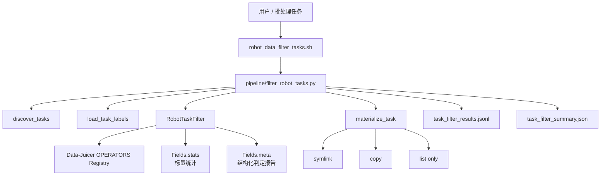
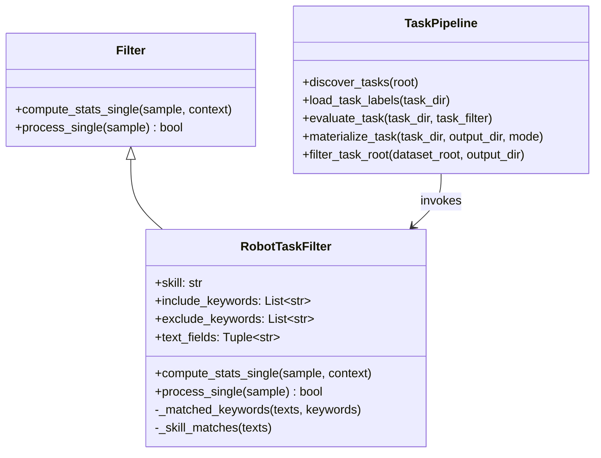
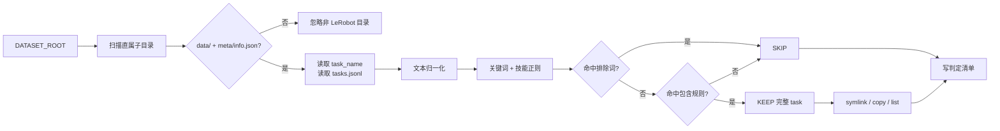
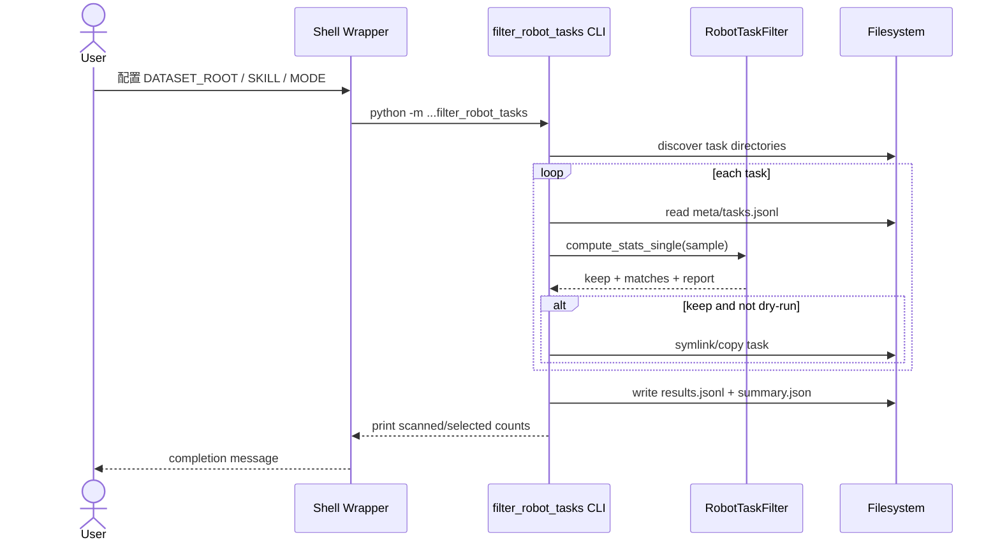

# LeRobot Task 级语义筛选：设计与使用指南

> **文档目的**：说明如何在不读取、切分或改写 episode/帧数据的前提下，根据 task 目录名与 `meta/tasks.jsonl` 中的任务标签，筛出包含目标技能（当前内置 `open_door`）的完整 LeRobot task。
>
> **代码落点**：算子位于 `data_juicer/_au/ops/filter/robot_task_filter.py`，目录编排与 CLI 位于 `data_juicer/_au/pipeline/filter_robot_tasks.py`，批处理入口为 `b/scripts/robot_data_filter_tasks.sh`，测试与验收位于 `tests_au/ops/filter/`。
>
> **核心语义**：匹配发生在 task 级文本元数据上，保留单位也是完整 task。若网线任务的标签中包含“打开冰箱门”，则该网线 task 被整体保留，但不会只抽取其中的开门 episode 或帧。

---

## 目录

- [1. 背景与问题定义](#1-背景与问题定义)
- [2. 设计目标与边界](#2-设计目标与边界)
- [3. 方法演进与方案对比](#3-方法演进与方案对比)
- [4. 静态架构](#4-静态架构)
- [5. 数据模型与判定算法](#5-数据模型与判定算法)
- [6. 动态架构与工作流](#6-动态架构与工作流)
- [7. 关键代码逻辑](#7-关键代码逻辑)
- [8. 使用方法](#8-使用方法)
- [9. 输出协议与可审计性](#9-输出协议与可审计性)
- [10. 测试与验证](#10-测试与验证)
- [11. 消融分析与取舍](#11-消融分析与取舍)
- [12. 边界、风险与后续演进](#12-边界风险与后续演进)
- [13. 文件索引](#13-文件索引)

---

## 1. 背景与问题定义

### 1.1 业务问题

机器人预训练或后训练数据通常按 LeRobot task 目录组织：

```text
<dataset_root>/
├── Connect_Router_Cables_20250625_002/
│   ├── data/
│   ├── meta/
│   │   ├── info.json
│   │   └── tasks.jsonl
│   └── videos/
├── Open_And_Close_The_Door_20250802_012/
└── ...
```

训练前经常需要构造某一技能相关的数据子集，例如：

- 开门：卧室门、柜门、冰箱门、烘干机门；
- 插接：网线、电源线、插座；
- 收纳：抽屉、储物柜、冰箱；
- 清洁：桌面、地面、镜面。

这里的目标不是从一条轨迹中切出动作片段，而是回答：

> 一个完整 task 是否包含目标技能？如果包含，则保留整个 task。

### 1.2 “Task 级”的严格定义

本功能区分“判定信号”和“保留粒度”：

- **判定信号**：task 目录名，以及 `meta/tasks.jsonl` 中该 task 收录的全部任务标签；
- **保留粒度**：完整 task 目录；
- **不执行**：episode 筛除、帧级切段、Parquet 重写、视频裁剪。

例如 `Connect_Router_Cables_20250625_002` 的标签中若存在：

```json
{"task": "左手完全打开冰箱上层的门@Fully open the upper refrigerator door with your left hand."}
```

则它属于“包含开门技能的 task”，会被整体选中。这种定义适合构建“具备目标技能信号”的宽召回训练集合。

### 1.3 为什么不能只看目录名

目录名通常只描述主任务，无法覆盖轨迹中的辅助技能。网线任务可能包含：

1. 打开冰箱门；
2. 拿取物体；
3. 关闭冰箱门；
4. 调整网线；
5. 插入路由器。

只按 `Connect_Router_Cables_*` 匹配会漏掉其中真实存在的开门动作。默认同时检查 `tasks.jsonl`，可以提高跨主任务的技能召回率。

---

## 2. 设计目标与边界

### 2.1 设计目标

1. **Task 级原子性**：一次决策对应一个完整 LeRobot task。
2. **零侵入源数据**：不修改源目录中的 Parquet、JSONL 或视频。
3. **高召回技能检索**：同时利用目录名与细粒度任务标签。
4. **可解释**：记录命中的关键词、排除词和最终决定。
5. **可扩展**：内置技能词表与用户自定义关键词可以组合。
6. **可安全试跑**：支持 `DRY_RUN=1`，不创建任何输出。
7. **低成本物化**：默认使用目录软链接构建子集。
8. **扩展优于修改**：实现放在 `data_juicer/_au/`，不修改 Data-Juicer 核心算子。

### 2.2 非目标

当前版本不负责：

- 判断某个 episode 是否主要属于开门任务；
- 根据 `task_index` 切出连续开门帧；
- 使用视频模型验证机器人是否真的完成开门；
- 对同义词做通用向量检索或 LLM 推理；
- 自动把筛选结果合并成单一 LeRobot 数据集。

这些能力分别属于 episode Filter、时序分割、VLM 验证、语义检索和数据合并模块，不应混入 task 目录筛选器。

---

## 3. 方法演进与方案对比

### 3.1 纵向演进

#### 阶段一：目录名通配

最早可用 Shell 通配符筛选：

```bash
for d in "$ROOT"/*Door*/; do
  ...
done
```

优点是实现简单；缺点是只能看到主任务名称，无法发现网线任务中的冰箱门操作，也无法处理中文标签。

#### 阶段二：结构化元数据关键词

读取 `tasks.jsonl` 后，筛选器可以基于人工任务标注判断技能。该方法成本低、可解释，且不依赖 GPU，是当前实现采用的方法。

#### 阶段三：正则技能模式

连续子串 `"open door"` 无法匹配：

- `open the bedroom door`；
- `open and close the door`；
- `fully open the upper refrigerator door`。

因此当前 `open_door` 技能加入有限窗口正则，允许动作词与对象词之间存在修饰语。

#### 阶段四：语义模型与视觉复核

未来可增加：

- 文本 embedding：处理“进入房间前推开入口”等非显式 door 表述；
- LLM 分类：基于所有标签判断 task 是否包含目标技能；
- VLM 复核：验证标注与视频行为是否一致。

这些方法召回更强，但推理成本、不可重复性与误判调试成本也更高，因此不作为当前默认路径。

### 3.2 横向方案对比

| 方法 | 输入 | 优点 | 缺点 | 适用场景 |
|------|------|------|------|------|
| 目录通配 | 目录名 | 极快、零依赖 | 漏掉辅助技能 | 主任务命名规范 |
| 精确关键词 | 目录名 + 标签 | 快、可解释 | 同义表达召回有限 | 固定技能词表 |
| 有限窗口正则 | 目录名 + 标签 | 可处理修饰词 | 规则需人工维护 | 开门等结构明确的技能 |
| 文本 embedding | 标签文本 | 同义召回更好 | 需模型与阈值 | 大规模开放词汇检索 |
| LLM 分类 | 聚合标签 | 灵活、可自然语言查询 | 慢、成本高、结果波动 | 离线高价值筛选 |
| VLM 行为验证 | 视频帧 | 可检查真实动作 | 计算成本最高 | 高精度数据审核 |

当前实现选择“关键词 + 有限窗口正则”，原因是它在精度、召回、成本和可审计性之间最均衡。

---

## 4. 静态架构

### 4.1 组件图



### 4.2 组件职责

| 组件 | 职责 |
|------|------|
| `RobotTaskFilter` | 归一化文本、执行 include/exclude/技能正则匹配、生成判定统计 |
| `filter_robot_tasks.py` | 发现 task、加载标签、调用算子、生成子集和清单 |
| `robot_data_filter_tasks.sh` | 提供面向批处理的环境变量接口 |
| `embodiment_prompt.load_jsonl` | 复用已有 JSONL 加载逻辑 |
| `tests_au/ops/filter/` | 单元测试与真实数据验收 |

### 4.3 类与函数关系



算子仍遵循 Data-Juicer Filter 的两阶段约定：

1. `compute_stats_single` 计算并写入判定结果；
2. `process_single` 读取标量 `keep` 并返回布尔值。

CLI 不把 Parquet 帧加载成 Dataset，而是为每个 task 构造一条轻量 sample，再直接复用算子的判定逻辑。

---

## 5. 数据模型与判定算法

### 5.1 输入 sample

对每个 task，CLI 构造：

```python
{
    "task_name": "Connect_Router_Cables_20250625_002",
    "task_labels": [
        "connect router cables",
        "左手完全打开冰箱上层的门@Fully open the upper refrigerator door ...",
        # ...
    ],
    "__dj__stats__": {},
    "__dj__meta__": {},
}
```

默认搜索字段为：

```python
("task_name", "task_labels")
```

设置 `INCLUDE_TASK_LABELS=0` 后，仅搜索：

```python
("task_name",)
```

### 5.2 文本归一化

设原始文本为 \(x\)，归一化函数为：

\[
N(x) =
\operatorname{casefold}
\left(
\operatorname{collapseSpaces}
\left(
\operatorname{replace}_{\_, -}(x,\ \text{space})
\right)
\right)
\]

因此：

```text
Open_And_Close-The_Door
```

会归一化为：

```text
open and close the door
```

若启用大小写敏感模式，自定义关键词匹配不执行 `casefold`。内置 `open_door` 英文正则本身使用忽略大小写模式。

### 5.3 关键词集合

包含词由两部分合并：

\[
K_{\mathrm{include}}
= K_{\mathrm{skill}} \cup K_{\mathrm{user}}
\]

其中：

- \(K_{\mathrm{skill}}\)：内置技能词表；
- \(K_{\mathrm{user}}\)：通过 `KEYWORDS` 或 `--keyword` 传入；
- 合并后去空、去重并保持原顺序。

若 `skill` 与用户关键词都为空，构造算子时直接报错，避免一个空条件意外保留全部数据。

### 5.4 `open_door` 技能规则

内置关键词包括：

```text
开门
打开门
open door
open the door
```

此外使用两条有限窗口模式：

```regex
\b(?:open|opening|push|pull)\b.{0,40}\bdoor\b
(?:打开|推开|拉开|开).{0,12}门
```

英文规则要求：

1. 出现 `open/opening/push/pull`；
2. 后续 40 个字符内出现 `door`。

中文规则要求：

1. 出现 `打开/推开/拉开/开`；
2. 后续 12 个字符内出现“门”。

有限窗口比无界 `open.*door` 更保守，可降低两个无关分句跨越过长文本后被误关联的概率。

### 5.5 排除规则与最终决策

设：

- \(M_I\)：命中的包含关键词或技能模式；
- \(M_E\)：命中的排除关键词。

最终决策为：

\[
\mathrm{keep}
=
\bigl(|M_I| > 0\bigr)
\land
\bigl(|M_E| = 0\bigr)
\]

即：

- 至少命中一个 include；
- 任意 exclude 命中时，排除优先。

这使用户可以先高召回检索，再用排除词压制明显不需要的类别。

### 5.6 复杂度

设：

- task 数为 \(T\)；
- 每个 task 搜索文本数为 \(L\)；
- 关键词数为 \(K\)；
- 平均文本长度为 \(C\)。

朴素子串匹配的近似复杂度为：

\[
O(T \cdot L \cdot K \cdot C)
\]

实际 \(K\) 很小，且只读取 metadata，不读取 Parquet 和视频，因此通常 I/O 与计算开销远低于后续清洗或导出阶段。

---

## 6. 动态架构与工作流

### 6.1 总体数据流



### 6.2 调用时序



### 6.3 与现有数据管线的关系

推荐将 task 筛选放在耗时处理之前：


这样未命中的 task 不会进入分析、清洗和导出阶段，可以节省后续计算资源。

---

## 7. 关键代码逻辑

### 7.1 Task 发现

`discover_tasks` 支持两类输入：

1. `DATASET_ROOT` 本身就是一个 LeRobot task；
2. `DATASET_ROOT` 的直属子目录是多个 LeRobot task。

合法 task 至少满足：

```text
<task>/data/
<task>/meta/info.json
```

当前不会递归搜索更深层目录，避免意外把输出目录或嵌套缓存识别为独立 task。

### 7.2 标签加载

`load_task_labels` 复用 `_au.utils.embodiment_prompt.load_jsonl`，读取：

```text
<task>/meta/tasks.jsonl
```

每行取 `task` 字段，空字符串被跳过。中英双语的 `中文@English` 标签保持原样，因为中英文正则都可直接在完整字符串中命中。

### 7.3 Filter 统计字段

算子只把标量写入 `Fields.stats`：

```text
robot_task_filter_keep
robot_task_filter_match_count
```

结构化信息写入 `Fields.meta["robot_task_filter_report"]`，符合 Data-Juicer 对统计字段应保持标量的约定。

### 7.4 物化策略

`materialize_task` 支持：

- `symlink`：默认，几乎不占额外磁盘；
- `copy`：复制完整目录，适合需要独立迁移的数据；
- `list`：只写筛选清单，不创建 task 目录。

目标目录已存在时：

- `ON_EXISTING=error`：默认报错，防止静默覆盖；
- `ON_EXISTING=skip`：保留已有目标并继续处理。

实现不会删除已有目录，也不提供覆盖模式。

---

## 8. 使用方法

### 8.1 默认筛选开门相关 task

先 dry-run：

```bash
DRY_RUN=1 bash b/scripts/robot_data_filter_tasks.sh
```

确认输出后执行：

```bash
DATASET_ROOT=/mnt/r/DATA/Galaxea-Open-World-Dataset/lerobot \
OUT_ROOT=/mnt/r/DATA/Galaxea-Open-World-Dataset/task_subsets/open_door \
bash b/scripts/robot_data_filter_tasks.sh
```

默认配置等价于：

```text
SKILL=open_door
MODE=symlink
INCLUDE_TASK_LABELS=1
ON_EXISTING=error
```

### 8.2 自定义技能关键词

关闭内置技能，使用自定义关键词：

```bash
SKILL="" \
KEYWORDS="插网线,connect router cable,ethernet cable" \
DATASET_ROOT=/path/to/tasks \
OUT_ROOT=/path/to/router_subset \
bash b/scripts/robot_data_filter_tasks.sh
```

逗号分隔的关键词会被拆成独立匹配项。

### 8.3 添加排除词

```bash
SKILL=open_door \
EXCLUDE_KEYWORDS="unqualified,损坏" \
DATASET_ROOT=/path/to/tasks \
OUT_ROOT=/path/to/open_door_subset \
bash b/scripts/robot_data_filter_tasks.sh
```

注意：当前排除词对聚合后的全部 task 标签生效。如果 task 的标签词表中包含 `unqualified`，整个 task 会被排除。使用质量标签作为 exclude 前，应确认这正是期望的 task 级语义。

### 8.4 仅按目录名筛选

```bash
INCLUDE_TASK_LABELS=0 \
SKILL=open_door \
bash b/scripts/robot_data_filter_tasks.sh
```

该模式精度通常更高，但会漏掉主任务名称与目标技能不同的 task，例如包含开冰箱门操作的网线任务。

### 8.5 复制而非软链接

```bash
MODE=copy \
DATASET_ROOT=/path/to/tasks \
OUT_ROOT=/path/to/independent_subset \
bash b/scripts/robot_data_filter_tasks.sh
```

复制会显著增加磁盘占用。除非需要迁移或隔离源数据，否则建议保留默认 `symlink`。

### 8.6 直接调用 Python CLI

```bash
python -m data_juicer._au.pipeline.filter_robot_tasks \
  --dataset-root /path/to/tasks \
  --output /path/to/open_door_subset \
  --skill open_door \
  --mode symlink
```

常用参数：

| CLI 参数 | 含义 |
|----------|------|
| `--skill open_door` | 使用内置开门技能规则 |
| `--keyword ...` | 增加包含关键词，可重复或逗号分隔 |
| `--exclude-keyword ...` | 增加排除关键词 |
| `--task-name-only` | 不读取标签参与匹配 |
| `--case-sensitive` | 自定义关键词大小写敏感 |
| `--mode symlink/copy/list` | 子集物化模式 |
| `--on-existing error/skip` | 已有目标处理策略 |
| `--dry-run` | 只打印判定，不写输出 |

---

## 9. 输出协议与可审计性

### 9.1 输出目录

非 dry-run 模式下：

```text
<OUT_ROOT>/
├── <selected_task_a> -> /absolute/source/task_a
├── <selected_task_b> -> /absolute/source/task_b
├── task_filter_results.jsonl
└── task_filter_summary.json
```

在 `copy` 模式下，task 项是实际目录；在 `list` 模式下，不创建 task 项。

### 9.2 逐 task 判定清单

`task_filter_results.jsonl` 每行对应一个扫描到的 task：

```json
{
  "task_name": "Connect_Router_Cables_20250625_002",
  "source": "/path/to/Connect_Router_Cables_20250625_002",
  "task_labels": ["connect router cables", "打开冰箱门@Open the refrigerator door"],
  "keep": true,
  "skill": "open_door",
  "include_matches": ["skill:open_door"],
  "exclude_matches": [],
  "text_fields": ["task_name", "task_labels"]
}
```

该清单允许回答：

- 为什么某个 task 被保留；
- 命中了哪个包含规则或技能模式；
- 哪个排除词导致 task 被过滤；
- 当时启用了哪些搜索字段。

当前报告不记录命中规则对应的具体原文或字段；若后续审计需要精确区分“目录名命中”与“标签命中”，应在匹配结果中增加 `field` 和 `text` 证据。

### 9.3 汇总文件

`task_filter_summary.json` 包含：

- 输入与输出路径；
- 技能和关键词配置；
- 是否检查 `tasks.jsonl`；
- 物化模式；
- 扫描 task 数；
- 选中 task 数；
- 选中的 task 名称。

---

## 10. 测试与验证

### 10.1 单元测试覆盖

测试文件：

```text
tests_au/ops/filter/test_robot_task_filter.py
```

当前覆盖：

1. 英文目录名直接匹配；
2. 动作词与 `door` 中间存在修饰词；
3. 中英双语标签匹配；
4. 网线 task 因包含开冰箱门子任务而整体保留；
5. `task-name-only` 可忽略子任务标签；
6. 自定义 include 与 exclude；
7. 仅物化命中的 task，并生成清单和汇总。

运行：

```bash
python -m pytest tests_au/ops/filter/test_robot_task_filter.py -v
```

### 10.2 真实数据验收

验收入口：

```bash
bash tests_au/ops/filter/accept_robot_task_filter.sh
```

默认使用：

```text
/mnt/r/DATA/tst/Galaxea-Open-World-Dataset/Connect_Router_Cables_20250625_002
```

验收检查：

- 真实 LeRobot task 能被发现；
- 自定义路由器关键词能命中；
- 输出为指向源 task 的软链接；
- summary 中扫描数和选中数一致。

---

## 11. 消融分析与取舍

当前没有独立人工标注的 task 级开门 benchmark，因此本节给出基于实现行为和真实元数据检查的功能消融，不把它表述为统计显著的精度实验。

### 11.1 去掉 `tasks.jsonl`

配置：

```text
INCLUDE_TASK_LABELS=0
```

效果：

- 优点：只按主任务名判断，集合语义更集中；
- 缺点：漏掉主任务中隐含的辅助开门技能；
- 典型漏例：网线任务中的开冰箱门步骤。

根据当前业务定义，“只要 task 内包含开门就算开门相关”，因此默认保留 `tasks.jsonl` 信号。

### 11.2 去掉有限窗口正则

仅保留连续子串时：

```text
open door
open the door
```

无法稳定匹配：

```text
open and close the door
open the bedroom door
fully open the upper refrigerator door
```

正则窗口是当前召回提升最关键的规则之一。

### 11.3 去掉目录名信号

只检查 `tasks.jsonl` 会依赖元数据完整性。部分数据可能：

- 缺少 `tasks.jsonl`；
- 标签为空；
- 标签只包含质量标识；
- 翻译或标注不完整。

目录名是低成本的回退信号，因此默认同时保留。

### 11.4 去掉排除优先级

若 include 与 exclude 同时命中仍保留，用户无法通过负面规则快速收窄集合。当前采用 exclude 优先，更适合数据治理中的保守策略。

### 11.5 物化方式消融

| 模式 | 磁盘开销 | 独立性 | 适用 |
|------|----------|--------|------|
| `symlink` | 最低 | 依赖源目录 | 本机训练、快速实验 |
| `copy` | 最高 | 完全独立 | 数据迁移、隔离交付 |
| `list` | 仅清单 | 不生成数据树 | 审计、与其他编排器集成 |

默认 `symlink` 对大规模视频数据最实用。

---

## 12. 边界、风险与后续演进

### 12.1 已知边界

1. **标签存在不等于动作成功**：文本标注说明 task 包含该动作，不保证机器人实际完成。
2. **Task 级宽召回会引入非目标内容**：网线 task 被保留后，其中所有非开门 episode 也会进入后续数据集。
3. **正则规则有语言边界**：当前主要覆盖中英文显式门类表达。
4. **只扫描直属子目录**：多层嵌套根目录需要先整理或扩展发现策略。
5. **exclude 是 task 级全局规则**：任一标签命中即可排除整个 task。

### 12.2 何时需要 episode 级 Filter

如果目标从：

> “保留所有包含开门技能的 task”

变为：

> “只保留开门 episode，去掉网线、拿取和关门 episode”

则应新增独立的 episode Filter，根据 episode 的 `tasks`、主 instruction 或 `task_index` 判定。不要改变当前 task 目录筛选器的原子性。

### 12.3 何时需要帧级切分

同一个 episode 同时包含开门和关门时，episode Filter 仍无法分离。此时需要：

1. 从 Parquet 读取逐帧 `task_index`；
2. 将目标标签映射为布尔 mask；
3. 查找连续区间；
4. 设置最短片段与边界扩展；
5. 重写 Parquet、视频和 LeRobot metadata。

这是一个新的时序分割与导出任务，复杂度显著高于当前功能。

### 12.4 可演进方向

#### 扩展技能词表

可将 `_SKILL_KEYWORDS` 与 `_SKILL_PATTERNS` 扩展为：

```text
close_door
open_drawer
connect_cable
press_button
pick_and_place
```

每个技能应配套：

- 正例；
- 修饰词变体；
- 近义动作；
- 容易混淆的负例；
- 中英文测试。

#### 配置外置

当技能数量增多时，可把词表迁移到：

```text
data_juicer/_au/configs/task_skills/*.yaml
```

实现代码负责加载统一 schema，避免 Python 文件持续膨胀。

#### 语义模型二阶段复核

可采用：


规则作为第一阶段可以显著减少模型调用量；模型只处理规则命中的候选或规则无法判断的样本。

---

## 13. 文件索引

| 文件 | 作用 |
|------|------|
| `data_juicer/_au/ops/filter/robot_task_filter.py` | Task 文本匹配 Filter 与内置技能规则 |
| `data_juicer/_au/pipeline/filter_robot_tasks.py` | Task 发现、判定编排、物化、CLI |
| `data_juicer/_au/__init__.py` | 注册自定义 Filter |
| `b/scripts/robot_data_filter_tasks.sh` | 批处理 Shell 入口 |
| `tests_au/ops/filter/test_robot_task_filter.py` | 单元测试 |
| `tests_au/ops/filter/accept_robot_task_filter.py` | 真实数据验收逻辑 |
| `tests_au/ops/filter/accept_robot_task_filter.sh` | 验收调用脚本 |

---

## 结论

该功能以 metadata 为判定依据、以完整 task 为保留单位，在不触碰帧数据的情况下构建技能相关子集。默认同时搜索目录名和 `tasks.jsonl`，符合“网线任务中出现开冰箱门也算开门相关”的宽召回定义；关键词、有限窗口正则、排除优先和可审计清单共同保证了低成本、可解释、可扩展的数据筛选流程。
