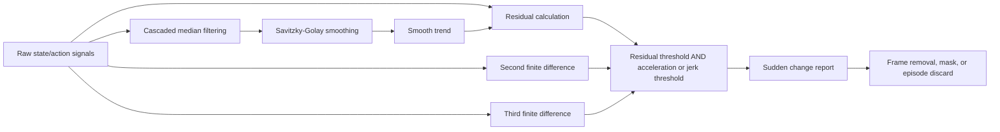
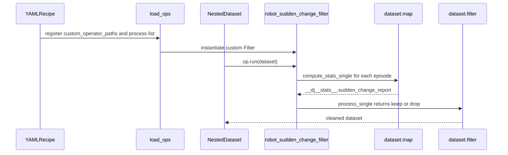
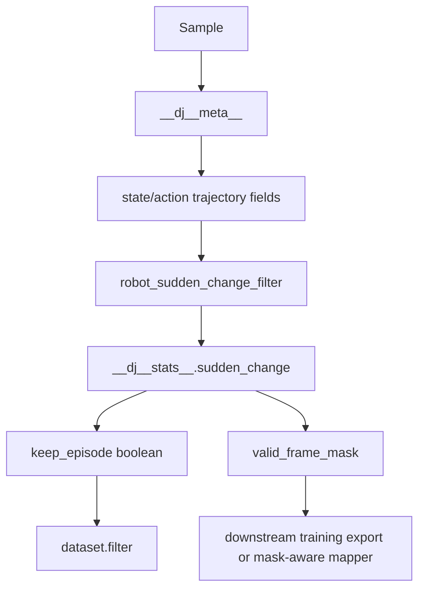
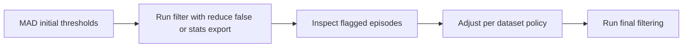
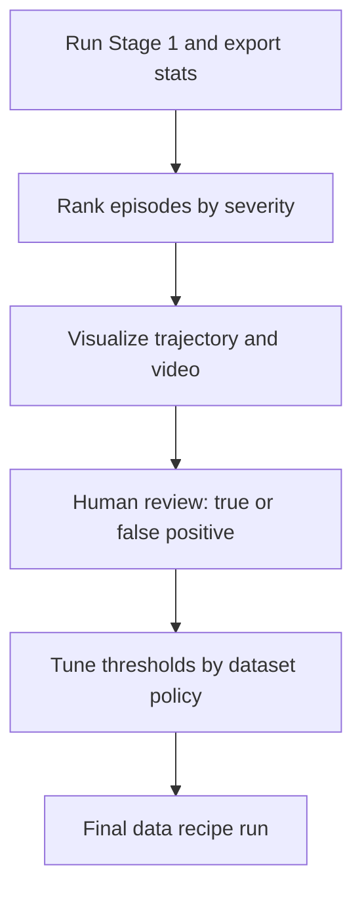

# 用 data-juicer 实现 Qwen-RobotManip Stage 1 突变检测方案

本文目标是给出一个可落地方案：如何用当前 `data-juicer` 代码库实现 Qwen-RobotManip 论文 `Stage 1: Sudden Change Detection` 中的数据过滤方法。分析基于论文 TeX 原文、本地官方文档与真实源码，不修改 `data-juicer` 源码，仅说明应如何配置、扩展与验证。

对应论文位置：`b/d/QwenRobotmanip/TeX_Source/chapter/data.tex` 第 206-211 行。      

翻译为: 阶段1：突变检测。
对于每个信号维度，我们首先通过级联中值滤波和Savitzky–Golay平滑提取平滑趋势，随后计算三个互补的偏差信号：原始轨迹与平滑轨迹之间的绝对残差、二阶有限差分（加速度）以及三阶有限差分（加加速度/跃度）。当某一帧的残差超过缩放阈值，且加速度或跃度中至少有一个同样超过其相应阈值时，该帧即被标记为异常。这种联合判定机制可减少因缓慢漂移导致的误报，同时保持对突发瞬态异常的检测灵敏度。阈值按数据集分别设定，依据包括机器人构型、旋转表示方式、数据来源（真实采集或仿真生成）以及底盘是否可移动等因素。排除策略涵盖从帧级别的移除到整条轨迹的丢弃。例如，在InternData-A1数据集中，突变仅来源于物理碰撞（如夹爪接触刚性物体），因此受损轨迹将被整条丢弃。
第一阶段旨在识别关节及末端执行器状态-动作轨迹中的离散异常值与瞬态不连续性。对于每个信号的每个维度，我们首先通过级联中值滤波和Savitzky–Golay平滑提取平滑趋势，随后计算三个互补的偏差信号：原始轨迹与平滑轨迹之间的绝对残差、二阶有限差分（加速度）以及三阶有限差分（加加速度/跃度）。当某一帧的残差超过缩放阈值，且加速度或跃度中至少有一个同样超过其相应阈值时，该帧即被标记为异常。这种联合判定机制可减少因缓慢漂移导致的误报，同时保持对突发瞬态异常的检测灵敏度。各信号维度的阈值按数据集分别设定，依据包括机器人构型、末端执行器旋转表示方式（欧拉角、四元数或旋转向量）、数据来源（真实采集或仿真生成）以及底盘运动性（固定式或移动式），并通过对标记结果的人工审查进行校准。在识别出异常帧后，我们根据异常的性质，采用数据集特定的排除策略，涵盖从帧级别的移除到整条轨迹的丢弃。例如，在InternData-A1等仿真数据集中，轨迹由优化方法生成，突变仅来源于物理碰撞（如夹爪接触刚性物体），因此受损轨迹将被整条丢弃。

---

## 1. 结论速览

Qwen-RobotManip 的 Stage 1 不是普通的“速度异常值平滑”，而是对每个 state/action 信号维度执行：

1. 级联中值滤波与 Savitzky-Golay 平滑，得到平滑趋势。
2. 计算三类互补偏差信号：残差、二阶有限差分（acceleration）、三阶有限差分（jerk）。
3. 使用联合条件标记突变帧：

$$
\mathrm{flag}_{t,d}
= \left(r_{t,d} > \tau^{(r)}_{d}\right)
\land
\left(
|a_{t,d}| > \tau^{(a)}_{d}
\lor
|j_{t,d}| > \tau^{(j)}_{d}
\right)
$$

4. 根据数据集策略选择帧级删除、mask 删除或整段 episode 丢弃。论文特别指出 InternData-A1 这类仿真/优化轨迹中，突变通常来自物理碰撞，因此 corrupted episode 直接丢弃。

当前 `data-juicer` 已经有很接近的基础能力：

- `video_hand_motion_smooth_mapper` 已实现 MAD 稳健阈值、`np.diff` 速度异常检测、Savitzky-Golay 平滑、四元数方向平滑、异常点插值与动作重算。
- `Filter` 基类天然支持 `compute_stats_single()` 先算统计量、`process_single()` 再决定保留/丢弃。
- 官方开发指南支持通过 `custom_operator_paths` 注册外部自定义算子。
- `python_file_mapper` 支持快速把外部 Python 函数接入 recipe。
- `general_field_filter` 可基于 `__dj__meta__` 或 `__dj__stats__` 中的布尔/数值字段做二次过滤。

但现有算子并不能开箱完全等价实现论文 Stage 1。`video_hand_motion_smooth_mapper` 的行为是“检测手腕速度异常并插值修复”，论文 Stage 1 的行为是“对状态/动作所有相关维度做残差 + acceleration/jerk 联合判定，并按策略删除帧或整段”。因此推荐实现一个专用自定义 Filter：`robot_sudden_change_filter`。快速验证阶段可用 `python_file_mapper` 写报告字段，再接 `general_field_filter` 做 episode 级过滤。

---

## 2. 论文方法形式化

设一个 episode 中的状态/动作信号为：

$$
\mathbf{X} \in \mathbb{R}^{T \times D},
$$

其中 $T$ 是时间步数，$D$ 是被检查的信号维度，可包含关节状态、关节动作、EEF 位置、EEF 方向、夹爪等。第 $t$ 帧第 $d$ 维为 $x_{t,d}$。

### 2.1 平滑趋势

论文描述为 cascaded median filtering + Savitzky-Golay smoothing。可以写成：

$$
\tilde{x}_{:,d}^{(1)} = \operatorname{Median}_{w_1}(x_{:,d}),
$$

$$
\tilde{x}_{:,d}^{(2)} = \operatorname{Median}_{w_2}(\tilde{x}_{:,d}^{(1)}),
$$

$$
\hat{x}_{:,d} = \operatorname{SG}_{w_s,p}(\tilde{x}_{:,d}^{(2)}),
$$

其中 $w_1,w_2$ 是中值滤波窗口，$w_s$ 是 Savitzky-Golay 窗口，$p$ 是多项式阶数。

级联中值滤波负责抑制尖峰，Savitzky-Golay 平滑负责保留局部运动结构与导数趋势。

### 2.2 三类偏差信号

残差：

$$
r_{t,d} = |x_{t,d} - \hat{x}_{t,d}|.
$$

二阶有限差分（acceleration）：

$$
a_{t,d} = x_{t+1,d} - 2x_{t,d} + x_{t-1,d}.
$$

三阶有限差分（jerk）：

$$
j_{t,d} = x_{t+2,d} - 3x_{t+1,d} + 3x_{t,d} - x_{t-1,d}.
$$

实现时可用 `np.diff(x, n=2, axis=0)` 与 `np.diff(x, n=3, axis=0)`，再把短一截的结果 pad 回长度 $T$，保证异常帧索引与原始帧对齐。

### 2.3 联合判定

论文关键点是“残差必须超阈值，同时 acceleration 或 jerk 至少一个超阈值”：

$$
\mathrm{flag}_{t,d}
= \mathbb{1}
\left[
r_{t,d} > \tau^{(r)}_{d}
\land
\left(
|a_{t,d}| > \tau^{(a)}_{d}
\lor
|j_{t,d}| > \tau^{(j)}_{d}
\right)
\right].
$$

某一帧是否异常可对所有维度取 OR：

$$
\mathrm{frameFlag}_{t}
= \bigvee_{d \in \mathcal{D}_{check}} \mathrm{flag}_{t,d}.
$$

某个 episode 是否丢弃则可由异常比例、连续异常长度、关键维度异常数共同决定：

$$
\mathrm{episodeBad}
=
\left(
\frac{1}{T}\sum_{t=1}^{T}\mathrm{frameFlag}_{t}
> \rho_{\max}
\right)
\lor
\left(
\max \operatorname{RunLength}(\mathrm{frameFlag}) > L_{\max}
\right)
\lor
\left(
\sum_{d}\mathbb{1}[\exists t,\mathrm{flag}_{t,d}] > D_{\max}
\right).
$$

### 2.4 核心概念详解：原始轨迹、平滑轨迹与绝对残差

#### 2.4.1 原始轨迹（raw trajectory）

机器人在执行任务时，控制系统会以固定频率（如 30Hz、50Hz）记录各个信号维度的数值。**每个维度单独是一条一维时间序列。**

例如一个 7 自由度机械臂，可能记录的维度包括：
- 7 个关节角度：`q1, q2, ..., q7`
- 末端执行器位置：`x, y, z`
- 末端执行器姿态（如欧拉角）：`roll, pitch, yaw`
- 夹爪宽度：`w`

以其中一个维度（比如关节角 `q3`）为例，原始轨迹就是按时间采样的数值序列：

```
t=0:  0.520
t=1:  0.523
t=2:  0.527
t=3:  0.531
t=4:  1.874   ← 碰撞导致的突变
t=5:  0.538
t=6:  0.542
```

这里 `t=4` 出现了一个因物理碰撞产生的离群值。

#### 2.4.2 平滑轨迹（smoothed trajectory）

对原始轨迹依次施加两种滤波器，得到一条**去除了噪声和突变、只保留整体运动趋势**的曲线：

- **中值滤波**：取窗口内（如 5 帧）的中位数，天然抗尖刺
- **Savitzky–Golay 滤波**：在窗口内拟合低阶多项式取中心点的值，平滑的同时保留趋势形状

对上面的数据做平滑后：

```
原始:  0.520  0.523  0.527  0.531  1.874  0.538  0.542
平滑:  0.521  0.523  0.527  0.531  0.535  0.538  0.541
                                    ↑
                              突变被平滑掉了
```

平滑轨迹代表的是"这个关节**本来应该**走的路径"。

---

**以下是级联中值滤波和 Savitzky–Golay 平滑的深入详解。**

##### 2.4.2a 级联中值滤波详解

###### 什么是中值滤波？

**直觉**：对每个时间步，取以它为中心的一个窗口内所有值的**中位数**，作为该时间步的平滑值。

和"均值滤波"（取窗口内平均值）相比，中值滤波最大的优势是：**一个极端异常值无法影响中位数**。因为中位数只取排序后的"中间那个值"，不管最大值有多大，只要它不占超过一半的位置，中位数就不受影响。

###### 用具体数字走一遍

沿用前文的关节角 `q3` 轨迹，窗口大小 = 3：

```
原始: [0.520, 0.523, 0.527, 0.531, 1.874, 0.538, 0.542]
```

逐帧计算（窗口=3，即取当前帧及左右各 1 帧）：

```
t=0: 窗口=[0.520, 0.520, 0.523]  ← 左边界用 nearest 填充
     排序=[0.520, 0.520, 0.523]  中位数=0.520

t=1: 窗口=[0.520, 0.523, 0.527]
     排序=[0.520, 0.523, 0.527]  中位数=0.523

t=2: 窗口=[0.523, 0.527, 0.531]
     排序=[0.523, 0.527, 0.531]  中位数=0.527

t=3: 窗口=[0.527, 0.531, 1.874]
     排序=[0.527, 0.531, 1.874]  中位数=0.531

t=4: 窗口=[0.531, 1.874, 0.538]   ← 异常值在窗口内
     排序=[0.531, 0.538, 1.874]  中位数=0.538  ← 异常值被排除！

t=5: 窗口=[1.874, 0.538, 0.542]
     排序=[0.538, 0.542, 1.874]  中位数=0.542

t=6: 窗口=[0.538, 0.542, 0.542]  ← 右边界用 nearest 填充
     排序=[0.538, 0.542, 0.542]  中位数=0.542
```

结果：

```
原始:     0.520  0.523  0.527  0.531  1.874  0.538  0.542
中值(w=3): 0.520  0.523  0.527  0.531  0.538  0.542  0.542
                                        ↑
                                   尖峰被消除了
```

关键观察：异常值 1.874 在 `t=4` 被完全消除——中位数从 `{0.531, 1.874, 0.538}` 中选出了 0.538，1.874 作为最大值被排除。这就是中值滤波抗尖峰的核心机制。

但也注意到 `t=5` 的值从 0.538 变成了 0.542——正常值也发生了微小偏移。这是中值滤波的副作用。

###### 什么是"级联"？

论文描述的是 **cascaded** median filtering——用两个不同窗口大小**串联**做两遍：

$$
\tilde{x}^{(1)} = \mathrm{Median}_{w_1}(x), \quad \tilde{x}^{(2)} = \mathrm{Median}_{w_2}(\tilde{x}^{(1)})
$$

例如先用窗口=3 过一遍，再用窗口=5 过一遍。

**为什么要两遍？** 窗口=3 的中值滤波只能消除**单帧**尖峰。如果异常值连续出现 2 帧，窗口=3 就不够了——3 帧窗口中 2 帧都是异常值，中位数会选到异常值。第二遍用更大的窗口（如 5），可以消除残留的宽异常。

用同一组数据演示级联的效果——假设 t=4 和 t=5 都异常：

```
原始:         0.520  0.523  0.527  0.531  1.874  1.650  0.542
                                          ↑      ↑
                                      两帧连续异常
```

**第一遍 (w=3)**：

```
t=3: median(0.527, 0.531, 1.874) = 0.531
t=4: median(0.531, 1.874, 1.650) = 1.650   ← 窗口中2/3是异常，中值仍是异常值！
t=5: median(1.874, 1.650, 0.542) = 1.650   ← 同样

第一遍结果: 0.520  0.523  0.527  0.531  1.650  1.650  0.542
                                         ↑      ↑
                                     尖峰被削了，但还是异常
```

**第二遍 (w=5)**：

```
t=4: median(0.523, 0.527, 0.531, 1.650, 1.650) = 0.531   ← 5帧中3帧正常，中值正常了！
t=5: median(0.527, 0.531, 1.650, 1.650, 0.542) = 0.542

第二遍结果: 0.520  0.523  0.527  0.531  0.531  0.542  0.542
                                         ↑      ↑
                                      异常完全消除
```

级联的好处是：**小窗口先处理单帧尖峰（保留更多细节），大窗口再处理残留的宽异常**。如果直接用大窗口 w=5 做一遍也可以消除，但会损失更多正常信号的细节。

###### 数值与计算上的坑

**坑 1：窗口必须为奇数**

中值滤波的窗口应该是奇数（3, 5, 7, ...），这样窗口中心恰好落在一个数据点上，且排序后中位数是唯一确定的。偶数窗口（如 4）会导致中位数变成两个中间值的平均——失去了"完全免疫极端值"的特性。

```
窗口=4, 数据=[0.5, 0.6, 10.0, 0.7]
排序=[0.5, 0.6, 0.7, 10.0]
"中位数" = (0.6 + 0.7) / 2 = 0.65  ← 其实还行，但如果两个异常值呢？

窗口=4, 数据=[0.5, 10.0, 10.0, 0.7]
排序=[0.5, 0.7, 10.0, 10.0]
"中位数" = (0.7 + 10.0) / 2 = 5.35  ← 异常值渗入了！
```

**规避**：始终使用奇数窗口。如果传入偶数，减 1。

**坑 2：边界处理**

轨迹的首尾帧没有足够的邻居填满窗口。`scipy.ndimage.median_filter` 支持多种 `mode`：

| mode | 行为 | 适用场景 |
|---|---|---|
| `nearest` | 用最近的已有值填充 | 机器人轨迹（静止起始/结束） |
| `reflect` | 镜像反射 | 周期性信号 |
| `constant` | 用固定值（默认 0）填充 | 不推荐——引入不存在的零值 |
| `wrap` | 首尾相连 | 周期信号 |

对机器人轨迹，`nearest` 最合理——假设起始/结束时手臂静止，用边界值填充不会引入虚假变化。本文设计骨架中使用的就是 `mode="nearest"`。

**坑 3：对缓慢趋势的"阶梯化"**

中值滤波的一个根本限制是：它只能输出窗口内**已有的值**之一。如果原始信号是一条平滑的斜线（如 0.50, 0.55, 0.60, 0.65, 0.70），中值滤波后每个点仍然是这些值之一——不会产生 0.575 这样的"中间值"。

对于近似匀速的直线段，影响很小。但对于曲线加速段，中值滤波后趋势会变成"台阶状"——若干帧输出同一个值，然后突然跳到下一个值。这就是为什么论文要在中值滤波后再接 Savitzky-Golay 平滑——SG 能拟合多项式产生平滑的中间值，修复阶梯化。

```
原始（加速曲线）:  0.50  0.52  0.56  0.62  0.70  0.80  0.92
中值(w=3):         0.50  0.52  0.56  0.62  0.70  0.80  0.92  ← 这种情况影响很小

原始（带噪声）:    0.50  0.55  0.51  0.60  0.54  0.65  0.58
中值(w=3):         0.50  0.51  0.55  0.54  0.60  0.58  0.65
                                ↑           ↑
                         趋势被打乱为"之字形"
```

**规避**：中值滤波后始终接 SG 平滑。这正是论文的做法。

**坑 4：短轨迹时窗口可能大于数据长度**

如果一段轨迹只有 4 帧，而中值窗口设为 5，则窗口覆盖了整个轨迹——所有帧输出同一个中位数，轨迹变成一条水平线，所有运动信息丢失。

**规避**：`win = min(window, len(data))`，必要时跳过中值滤波。

###### 中值滤波的优缺点

| 方面 | 优点 | 缺点 |
|---|---|---|
| 抗尖峰能力 | **完全免疫**单帧极端值（不像均值会被拉偏） | 对连续多帧异常需要更大窗口 |
| 参数简单 | 只有一个参数：窗口大小 | 窗口大小选择仍需经验 |
| 保边能力 | 不会模糊阶跃边界（阶跃两侧各取自己的中位数） | — |
| 趋势保持 | — | 破坏斜率/曲率（输出只能是输入值之一） |
| 计算复杂度 | — | $O(N \cdot W \log W)$，每帧要排序一次 |
| 可微性 | — | 输出对输入不可微，不能做梯度优化 |

###### data-juicer 对级联中值滤波的实现情况

**结论：当前 data-juicer 代码库中没有任何 `.py` 文件使用 `scipy.ndimage.median_filter`。** 级联中值滤波仅出现在本文（`data_cur1_1.md`）的设计骨架伪代码中：

```python
# 摘自本文 §5.3 设计骨架（尚未实现为 .py 文件）
def _smooth(self, x):
    y = x.copy()
    for win in self.median_windows:           # 默认 (3, 5) — 级联两遍
        y = median_filter(y, size=(win, 1), mode="nearest")
    # 接 SG 平滑 ...
```

`size=(win, 1)` 表示沿时间轴（axis=0）做窗口为 `win` 的中值滤波，维度轴（axis=1）窗口为 1（即不跨维度）。

**现有管线中的替代方案**：`video_hand_motion_smooth_mapper.py` 用 **MAD 异常替换** 代替了中值滤波。两者的对比：

| 方面 | 级联中值滤波 | MAD 异常替换（data-juicer 现有） |
|---|---|---|
| 处理方式 | 逐帧取窗口中位数，所有帧都被处理 | 只修改速度超过 MAD 阈值的帧，其余不动 |
| 对正常帧的影响 | 有——即使正常帧也可能微小偏移 | 无——正常帧原封不动 |
| 修复方式 | 替换为窗口内中位数 | 替换为前后正常帧的线性插值 |
| 连续异常处理 | 级联大窗口可处理 | 线性插值跨越连续异常段 |
| 计算成本 | 两遍全序列滑动窗口 | 一遍差分 + 一遍插值 |

对 Stage 1 突变**检测**（不是修复）来说，两者殊途同归——都是为了得到一条平滑趋势线，然后与原始信号对比算残差。论文选择中值滤波是因为它对尖峰的鲁棒性有理论保证（不依赖 MAD 的正态假设）。

---

##### 2.4.2b Savitzky–Golay 平滑详解

###### 什么是 SG 滤波？

**直觉**：对每个时间步，取以它为中心的一个窗口，在窗口内用**最小二乘法拟合一条低阶多项式曲线**（如 2 阶或 3 阶），然后取拟合曲线在中心点的值作为平滑结果。

想象你手里有一段弯弯曲曲的轨迹曲线，SG 滤波就是在每个点附近画一小截"最佳拟合抛物线"，然后只取抛物线中心的那个值。

```
    原始数据点:  *   *   *   *   *
                 \  / \  |  / \ /
窗口内拟合曲线:    \_____/      ← 取这条曲线在中心点的值
```

**对比三种滤波器**：

| 滤波器 | 每帧做什么 | 输出 |
|---|---|---|
| 均值滤波 | 取窗口内所有值的**平均** | 平滑，但会模糊边界和趋势 |
| 中值滤波 | 取窗口内所有值的**中位数** | 抗尖峰，但输出只能是输入值之一 |
| SG 滤波 | 窗口内**拟合多项式**，取中心点值 | 平滑、保留趋势形状（斜率/曲率） |

**为什么 SG 能"保形"？** 因为多项式拟合自然保留了局部的一阶导数（斜率）和二阶导数（曲率）。一条匀速直线经过 SG 滤波后仍然是直线；一条加速抛物线经过 SG 滤波后仍然是抛物线——只要多项式阶数 ≥ 原始趋势的阶数。而均值滤波和中值滤波都会把直线/抛物线"拉平"。

###### 用具体数字走一遍

用简化的例子：5 个数据点，窗口=5（即整段数据），多项式阶数=2（抛物线拟合）。

```
数据:  x = [0.50, 0.52, 0.56, 0.62, 0.70]
时间:  t = [-2,   -1,    0,    1,    2]    ← 以中心点 t=0 为原点
```

**Step 1**：对这 5 个点做 2 阶最小二乘拟合 $f(t) = a + bt + ct^2$。

建立方程组（正规方程）后求解得到：

```
a = 0.560,  b = 0.050,  c = 0.005
f(t) = 0.560 + 0.050t + 0.005t²
```

**Step 2**：取中心点 $t=0$ 的拟合值：

```
f(0) = 0.560
```

原始值 $x_2 = 0.56$，拟合值 = 0.560——几乎一样，因为这段数据本身就很光滑。

**加入一个异常值再看**：

```
数据:  x = [0.50, 0.52, 1.20, 0.62, 0.70]
                         ↑
                     异常帧
```

最小二乘拟合会被异常值**拉偏**：

```
拟合结果: f(t) = 0.708 + 0.050t + 0.005t²
f(0) = 0.708   ← 被拉到 0.708，远离正常趋势 0.56
```

这就是 SG 滤波不够鲁棒的地方——**最小二乘法对异常值敏感**（和均值一样，被极端值拉偏）。

所以论文的策略是：**先用中值滤波消除尖峰（鲁棒）→ 再用 SG 平滑修复阶梯化（保形）**。两者互补。

###### 数值与计算上的坑

**坑 1：窗口必须为奇数且 > polyorder + 1**

SG 滤波在窗口内做多项式拟合。如果窗口大小 ≤ 多项式阶数，方程组的未知数比数据点多，无法求解（欠定）。`scipy.signal.savgol_filter` 要求 `window_length > polyorder`。

```
window=3, polyorder=3 → 3个点拟合3阶多项式 → 刚好唯一解，但无平滑效果
window=3, polyorder=4 → 3个点拟合4阶多项式 → 不可能！报错
```

**规避**：确保 `window ≥ polyorder + 2`（至少多一个冗余点才有平滑效果）。data-juicer 中的保护：

```python
if win < polyorder + 2:
    return data.copy()  # 放弃平滑，原样返回
```

**坑 2：边界 mode 选择**

和中值滤波类似，SG 在首尾帧也面临窗口不完整的问题。`savgol_filter` 支持：

| mode | 行为 | 效果 |
|---|---|---|
| `interp`（默认） | 对边界点用较少的数据点拟合同阶多项式 | 最安全，但边界处平滑效果弱 |
| `nearest` | 边界外用最近值填充 | 可能在端点制造人为平坦段 |
| `mirror` | 镜像反射 | 端点处导数为零，可能不符合实际 |

**规避**：对机器人轨迹使用默认 `interp` 即可。

**坑 3：窗口过大会抹平快速动作**

SG 窗口越大，拟合的多项式越"远视"——它会把快速变化也当作噪声平滑掉。例如一次真实的快速抓取动作，关节角在 3 帧内从 0.5 rad 跳到 1.2 rad，如果 SG 窗口设为 21 帧，这个 3 帧的快速变化会被大幅削弱。

```
窗口=5:  快速抓取保留约 90% 幅度
窗口=11: 快速抓取保留约 70% 幅度
窗口=21: 快速抓取保留约 40% 幅度  ← 动作被严重削弱
```

**规避**：窗口大小应与控制频率和最短合理动作时长匹配。data-juicer 默认 `window=11`，在 30Hz 下对应约 0.37 秒——大多数抓取动作持续 > 0.5 秒，所以不会被抹平。

**坑 4：阶数过低会扭曲曲率**

多项式阶数决定了 SG 能保留多少局部形状：

| 阶数 | 能保留的形状 | 不能保留的 |
|---|---|---|
| 0 | 常数（即均值滤波） | 任何变化 |
| 1 | 直线（斜率） | 加速/减速 |
| 2 | 抛物线（曲率） | 更高阶的形状 |
| 3 | 三次曲线（拐点） | 更高阶 |

如果关节角轨迹是一段加速-减速的钟形曲线（曲率变化），但 SG 阶数只设为 1，拟合的直线会把加速段和减速段都拉平——曲率信息丢失。

**规避**：data-juicer 默认 `polyorder=3`，足以保留加速度和简单的曲率变化。

**坑 5：对旋转信号直接使用有 wrapping 问题**

欧拉角的 $\pi/-\pi$ 边界跳变会让 SG 拟合出物理上无意义的中间值：

```
yaw: [..., 3.10, 3.14, -3.08, -3.02, ...]
                  ↑       ↑
             跳变处，SG 会拟合出 0 附近的值——完全错误
```

**规避**：先转四元数（无 wrapping）→ 逐分量 SG → 归一化 → 转回欧拉角。这正是 data-juicer 的做法。

###### SG 的优缺点

| 方面 | 优点 | 缺点 |
|---|---|---|
| 保形能力 | 保留多项式阶数内的趋势（斜率、曲率） | 阶数外的形状仍会被扭曲 |
| 平滑质量 | 输出是连续平滑曲线（可微） | — |
| 参数透明 | 窗口和阶数含义明确 | 需要同时调两个参数 |
| 对异常值 | — | **不鲁棒**——最小二乘被异常值拉偏 |
| 计算效率 | $O(N)$——SG 系数可预计算为固定卷积核 | — |
| 旋转处理 | — | 不能直接用于欧拉角/四元数 |

###### data-juicer 的 SG 实现分析

data-juicer 在 `video_hand_motion_smooth_mapper.py` 中有两个 SG 相关方法：

**1. `_savgol_smooth`（行 170-193）——位置数据平滑**

```python
@staticmethod
def _savgol_smooth(data, window, polyorder):
    from scipy.signal import savgol_filter

    n = len(data)
    win = min(window, n)        # 坑4规避：窗口不超过数据长度
    if win % 2 == 0:
        win -= 1                # 坑1规避：强制奇数
    if win < polyorder + 2:
        return data.copy()      # 坑1规避：点数不够则跳过

    result = np.empty_like(data)
    if data.ndim == 1:
        result = savgol_filter(data, win, polyorder)
    else:
        for d in range(data.shape[1]):                    # 逐列（逐维度）处理
            result[:, d] = savgol_filter(data[:, d], win, polyorder)
    return result
```

**2. `_smooth_orientations`（行 198-248）——方向数据平滑**

```python
@staticmethod
def _smooth_orientations(eulers, window, polyorder):
    from scipy.signal import savgol_filter
    from scipy.spatial.transform import Rotation

    # ... 窗口校验（同上）...

    try:
        rots = Rotation.from_euler("xyz", eulers, degrees=False)
        quats = rots.as_quat()        # 坑5规避：先转四元数

        # 半球连续性修正（四元数双覆盖规避）
        for i in range(1, len(quats)):
            if np.dot(quats[i], quats[i-1]) < 0:
                quats[i] = -quats[i]

        # 逐分量 SG
        smoothed_quats = np.empty_like(quats)
        for d in range(4):
            smoothed_quats[:, d] = savgol_filter(quats[:, d], win, polyorder)

        # 归一化（单位约束漂移规避）
        norms = np.linalg.norm(smoothed_quats, axis=1, keepdims=True)
        norms = np.clip(norms, 1e-8, None)
        smoothed_quats = smoothed_quats / norms

        return Rotation.from_quat(smoothed_quats).as_euler("xyz", degrees=False)
    except Exception:
        # Fallback: 直接在 unwrap 后的欧拉角上做 SG
        smoothed = np.empty_like(eulers)
        for d in range(3):
            unwrapped = np.unwrap(eulers[:, d])
            smoothed[:, d] = savgol_filter(unwrapped, win, polyorder)
        return smoothed
```

**调用位置**：`_smooth_hand_result`（行 253-321）中：
- Step 2 调用 `_savgol_smooth` 处理位置 `states[:, 0:3]`
- Step 3 调用 `_smooth_orientations` 处理姿态 `states[:, 3:6]`
- 默认参数 `savgol_window=11, savgol_polyorder=3`

**实现的优点**：

1. **完整的短轨迹保护**——窗口自适应缩减到数据长度，点数不够直接返回原数据，不崩溃。
2. **旋转正确处理**——专门的 `_smooth_orientations` 方法把欧拉角转四元数再 SG，规避了 wrapping 陷阱。
3. **有 fallback 机制**——四元数转换失败时回退到 `np.unwrap` + SG，保证鲁棒性。
4. **逐维度独立处理**——`for d in range(data.shape[1])` 循环，不会跨维度混淆信号。

**实现的局限**：

1. **没有中值滤波前置**——直接对含异常值的原始数据做 SG，依赖 MAD 异常替换来先消除尖峰。如果 MAD 漏检了异常值，SG 的拟合会被拉偏。论文 Stage 1 的级联中值 + SG 更鲁棒。
2. **位置和旋转用相同的窗口/阶数**——实际上位置信号（缓慢移动）和旋转信号（可能有快速翻转）可能需要不同的平滑参数。
3. **不支持 `mode` 参数**——默认使用 `savgol_filter` 的 `interp` 模式，没有暴露给用户选择。
4. **固定 `"xyz"` 欧拉角约定**——不同数据集可能使用不同的旋转顺序，但代码中硬编码了 `"xyz"`。

###### 级联中值 + SG 的协作关系总结

论文选择"先中值后 SG"的串联方式是有深意的：

```
原始信号 ──→ 中值滤波(w=3) ──→ 中值滤波(w=5) ──→ SG平滑 ──→ 平滑趋势
              │                  │                  │
              消除单帧尖峰        消除残余宽异常        修复阶梯化、恢复平滑曲率
              (鲁棒、抗极端值)     (更大范围鲁棒)        (保形、保留导数)
```

中值滤波**负责安全**——不管异常值多极端，中位数都不受影响。SG 平滑**负责质量**——让平滑后的曲线保持合理的物理形状（速度连续、加速度平滑）。两者缺一不可：单独的中值滤波输出有阶梯化；单独的 SG 滤波对尖峰不鲁棒。

---

#### 2.4.3 绝对残差（absolute residual）

逐帧计算：

$$
r_t = |x_t^{\text{raw}} - x_t^{\text{smooth}}|
$$

对上面的例子：

```
t=0:  |0.520 - 0.521| = 0.001
t=1:  |0.523 - 0.523| = 0.000
t=2:  |0.527 - 0.527| = 0.000
t=3:  |0.531 - 0.531| = 0.000
t=4:  |1.874 - 0.535| = 1.339   ← 残差极大
t=5:  |0.538 - 0.538| = 0.000
t=6:  |0.542 - 0.541| = 0.001
```

绝对残差衡量的是**每一帧偏离正常趋势的程度**。正常帧的残差接近 0，突变帧的残差会远大于阈值。

#### 2.4.4 二阶有限差分（加速度）详解

##### 从物理直觉出发

想象你在看一辆车的行车记录：

- **位置**：车在哪里（原始信号 $x_t$）
- **速度**（一阶差分）：车跑得多快——相邻两帧位置之差
- **加速度**（二阶差分）：速度本身变得多快——衡量的是**运动状态的突变程度**

一辆匀速行驶的车，加速度为 0。只有在急刹车、猛踩油门的瞬间，加速度才会飙升。机器人关节也一样：正常运动时加速度平缓，碰撞或信号跳变时加速度会出现尖峰。

##### 数学定义

二阶有限差分的公式是：

$$
a_t = x_{t+1} - 2x_t + x_{t-1}
$$

可以拆成两步理解：

1. **先算一阶差分（速度）**：$v_t = x_{t+1} - x_t$
2. **再对速度算一阶差分（加速度）**：$a_t = v_t - v_{t-1} = (x_{t+1} - x_t) - (x_t - x_{t-1}) = x_{t+1} - 2x_t + x_{t-1}$

所以二阶差分 = **"速度的变化量"** = **加速度**。

##### 用具体数字走一遍

沿用前面的关节角 `q3` 原始轨迹：

```
t=0:  0.520
t=1:  0.523
t=2:  0.527
t=3:  0.531
t=4:  1.874   ← 碰撞突变
t=5:  0.538
t=6:  0.542
```

**第一步：算一阶差分（速度）**

```
v₀ = x₁ - x₀ = 0.523 - 0.520 = +0.003
v₁ = x₂ - x₁ = 0.527 - 0.523 = +0.004
v₂ = x₃ - x₂ = 0.531 - 0.527 = +0.004
v₃ = x₄ - x₃ = 1.874 - 0.531 = +1.343   ← 速度暴增
v₄ = x₅ - x₄ = 0.538 - 1.874 = -1.336   ← 速度反向暴跌
v₅ = x₆ - x₅ = 0.542 - 0.538 = +0.004
```

可以看到，突变发生在 `t=4`，速度从 `+0.004` 突然跳到 `+1.343`。

**第二步：算二阶差分（加速度）**

$$a_t = v_t - v_{t-1}$$

```
a₁ = v₁ - v₀ = 0.004 - 0.003 = +0.001    （正常：速度几乎没变）
a₂ = v₂ - v₁ = 0.004 - 0.004 =  0.000    （正常：匀速）
a₃ = v₃ - v₂ = 1.343 - 0.004 = +1.339    ← 加速度巨大！突变开始
a₄ = v₄ - v₃ = -1.336 - 1.343 = -2.679   ← 加速度更大！突变反弹
a₅ = v₅ - v₄ = 0.004 - (-1.336) = +1.340  ← 加速度巨大！恢复正常
```

等价地用公式 $a_t = x_{t+1} - 2x_t + x_{t-1}$ 验证 `t=3`：

$$a_3 = x_4 - 2x_3 + x_2 = 1.874 - 2 \times 0.531 + 0.527 = 1.339 \quad \checkmark$$

##### 直观对比表

| 帧 | 位置 $x_t$ | 速度 $v_t$ | 加速度 $a_t$ | 含义 |
|---|---|---|---|---|
| t=0 | 0.520 | +0.003 | — | 正常起步 |
| t=1 | 0.523 | +0.004 | +0.001 | 匀速运动 |
| t=2 | 0.527 | +0.004 | 0.000 | 匀速运动 |
| t=3 | 0.531 | +1.343 | **+1.339** | 突变前一帧，加速度爆表 |
| t=4 | 1.874 | −1.336 | **−2.679** | 突变帧，加速度最大 |
| t=5 | 0.538 | +0.004 | **+1.340** | 回归正常，加速度仍极大 |
| t=6 | 0.542 | — | — | 恢复平稳 |

##### 为什么加速度能抓住突变？

- **匀速运动**（缓慢漂移）：速度恒定 → 加速度 ≈ 0 → **不会被标记**
- **单帧尖峰**（碰撞/信号故障）：速度先暴涨再暴跌 → 加速度出现正负极大值对 → **必定被标记**
- **阶跃跳变**（跳到新值后保持）：跳变边界处速度突变 → 加速度在边界处出现尖峰 → **被标记**

这正是论文设计联合条件的关键：残差抓"偏离趋势"，加速度抓"变化剧烈"。两者同时满足才标记，避免了把缓慢漂移误判为突变。

##### 代码实现

在 NumPy 中，二阶有限差分一行即可：

```python
acc = np.diff(x, n=2, axis=0)  # shape: (T-2, D)
```

注意 `np.diff(x, n=2)` 输出比输入短 2 帧（首尾各缺 1 帧无法计算），实际使用时需要 pad 回长度 $T$，保证帧索引对齐：

```python
acc_full = np.zeros_like(x)               # (T, D)
acc_full[1:-1] = np.diff(x, n=2, axis=0)  # 首尾帧填 0
```

三阶有限差分（跃度/jerk）同理，用 `np.diff(x, n=3)`，输出比输入短 3 帧。

#### 2.4.5 三阶有限差分（跃度/Jerk）详解

##### 从物理直觉出发

继续用开车的类比，把四个层次排列起来：

| 层次 | 物理量 | 感受 |
|---|---|---|
| 0 阶 | **位置** $x_t$ | 车在哪 |
| 1 阶 | **速度** $v_t$ | 车跑多快 |
| 2 阶 | **加速度** $a_t$ | 推背感多强 |
| 3 阶 | **跃度（jerk）** $j_t$ | 推背感变化多猛 |

加速度衡量的是"速度变了多少"，而跃度衡量的是"**加速度本身变了多少**"。

坐过地铁的人都有体会：匀加速时你只是被稳稳地往后推；但列车刚启动或急刹的**那一下**——加速度从 0 瞬间跳到很大值——身体会猛地一晃。这个"晃"就是跃度大的体感。在机器人轨迹中，跃度尖峰意味着运动状态发生了**极其突然的转折**，比碰撞导致的加速度尖峰还要"尖锐"。

##### 数学定义

三阶有限差分的公式是：

$$
j_t = x_{t+2} - 3x_{t+1} + 3x_t - x_{t-1}
$$

可以逐层理解：

1. **一阶差分（速度）**：$v_t = x_{t+1} - x_t$
2. **二阶差分（加速度）**：$a_t = v_t - v_{t-1} = x_{t+1} - 2x_t + x_{t-1}$
3. **三阶差分（跃度）**：$j_t = a_{t+1} - a_t$

展开后：

$$
j_t = (x_{t+2} - 2x_{t+1} + x_t) - (x_{t+1} - 2x_t + x_{t-1}) = x_{t+2} - 3x_{t+1} + 3x_t - x_{t-1}
$$

所以三阶差分 = **"加速度的变化量"** = **跃度**。

##### 用具体数字走一遍

沿用前面的数据。先回顾已经算好的加速度序列：

```
a₁ = +0.001    （正常）
a₂ =  0.000    （正常）
a₃ = +1.339    ← 加速度巨大
a₄ = -2.679    ← 加速度巨大（反向）
a₅ = +1.340    ← 加速度巨大
```

**算三阶差分（跃度）**：$j_t = a_{t+1} - a_t$

```
j₂ = a₃ - a₂ = +1.339 - 0.000  = +1.339    ← 跃度大！加速度从0跳到1.339
j₃ = a₄ - a₃ = -2.679 - 1.339  = -4.018    ← 跃度极大！加速度方向急剧反转
j₄ = a₅ - a₄ = +1.340 - (-2.679) = +4.019  ← 跃度极大！加速度再次反转
```

等价地用公式 $j_t = x_{t+2} - 3x_{t+1} + 3x_t - x_{t-1}$ 验证 `t=3`：

$$j_3 = x_5 - 3x_4 + 3x_3 - x_2 = 0.538 - 3 \times 1.874 + 3 \times 0.531 - 0.527 = 0.538 - 5.622 + 1.593 - 0.527 = -4.018 \quad \checkmark$$

##### 直观对比表（完整四阶信号）

| 帧 | 位置 $x_t$ | 速度 $v_t$ | 加速度 $a_t$ | 跃度 $j_t$ | 含义 |
|---|---|---|---|---|---|
| t=0 | 0.520 | +0.003 | — | — | 正常 |
| t=1 | 0.523 | +0.004 | +0.001 | — | 匀速 |
| t=2 | 0.527 | +0.004 | 0.000 | **+1.339** | 跃度已开始响应 |
| t=3 | 0.531 | +1.343 | **+1.339** | **−4.018** | 跃度最大——加速度急剧反转 |
| t=4 | 1.874 | −1.336 | **−2.679** | **+4.019** | 跃度极大——加速度再次反转 |
| t=5 | 0.538 | +0.004 | **+1.340** | — | 恢复 |
| t=6 | 0.542 | — | — | — | 平稳 |

##### 跃度比加速度"更尖锐"

观察上表的绝对值峰值：

| 信号 | 峰值 | 出现位置 |
|---|---|---|
| 残差 | 1.339 | t=4 |
| 加速度 | 2.679 | t=4 |
| **跃度** | **4.019** | t=3, t=4 |

跃度的峰值最大，而且**提前一帧就开始响应**（`t=2` 处跃度已经 = 1.339，而加速度在 `t=2` 仍是 0）。这意味着：

- **加速度**能抓住"速度突变"，但对**匀加速**阶段不敏感（匀加速时加速度恒定、跃度 = 0）
- **跃度**能抓住"加速度突变"——即使突变不是单帧尖峰，而是一段**急刹急启**的过程，跃度也能在其边界处产生尖峰

论文同时用加速度和跃度，就是为了覆盖不同形状的突变模式。

##### 为什么论文用 OR 连接加速度和跃度？

联合判定公式回顾：

$$
\mathrm{flag}_t = (r_t > \tau^{(r)}) \land (|a_t| > \tau^{(a)} \lor |j_t| > \tau^{(j)})
$$

- 残差是**必要条件**（AND）：必须偏离趋势才算异常
- 加速度和跃度是**补充条件**（OR）：只要其中一个说"变化很急"就够了

这样设计的好处是：
- 单帧尖峰：加速度和跃度**都**会爆表，两个都能抓住
- 短阶跃跳变：可能只有加速度在边界处有尖峰，跃度在边界外侧响应
- 急刹急启式突变：加速度可能恒大但跃度才在转折点处有尖峰

用 OR 连接保证了**不管突变是哪种形状，至少有一个高阶信号能响应**。

##### 代码实现

```python
jerk = np.diff(x, n=3, axis=0)  # shape: (T-3, D)
```

输出比输入短 3 帧，pad 回长度 $T$：

```python
jerk_full = np.zeros_like(x)                # (T, D)
jerk_full[1:-2] = np.diff(x, n=3, axis=0)   # 首1帧+末2帧填0
```

#### 2.4.6 "缓慢漂移导致的误报"详解

##### 什么是缓慢漂移？

前面所有例子都是"单帧尖峰"式的突变——某一帧突然跳到一个离谱的值，下一帧立刻恢复。这种突变很容易抓。但现实中还有另一类信号异常：**值慢慢偏离了趋势，但每一步之间的变化都很平缓**。

以关节角为例，考虑这样一段轨迹——机器人缓慢抬起手臂去够高处的物体：

```
t=0:   0.500
t=1:   0.520
t=2:   0.545
t=3:   0.575
t=4:   0.610
t=5:   0.650
t=6:   0.695
t=7:   0.745
t=8:   0.800
t=9:   0.860
t=10:  0.925
```

这是一段**正常的**、逐渐加速的抬臂运动。每帧只比上一帧大 0.020~0.065，变化非常平缓。

##### 如果只用残差判定会怎样？

平滑轨迹（SG 滤波）会拟合出一条"平均趋势线"。如果 SG 窗口较大或多项式阶数较低，平滑曲线会倾向于更"直"，而原始轨迹是一条逐渐弯曲的加速曲线。两者之间就会出现系统性偏差：

```
帧    原始 x_t   平滑 x̂_t   残差 r_t = |x_t - x̂_t|
t=0   0.500      0.508      0.008
t=1   0.520      0.525      0.005
t=2   0.545      0.544      0.001
t=3   0.575      0.568      0.007
t=4   0.610      0.597      0.013
t=5   0.650      0.633      0.017
t=6   0.695      0.676      0.019
t=7   0.745      0.727      0.018
t=8   0.800      0.787      0.013
t=9   0.860      0.855      0.005
t=10  0.925      0.920      0.005
```

在 `t=5~7` 这几帧，残差达到 0.017~0.019。如果阈值恰好设在 0.015，**这几帧就会被残差判定标记为"异常"**。

但它们真的异常吗？**完全不是。** 这只是一段正常的加速运动，是机器人在执行一个完全合理的抬臂动作。

这就是所谓的**"缓慢漂移导致的误报"**：残差偏大不是因为信号有问题，而是因为平滑滤波器无法完美跟踪曲率变化较大的正常运动。

##### 加速度/跃度为什么能排除这种误报？

来算一下这段正常轨迹的加速度和跃度：

**一阶差分（速度）**：

```
v₀ = 0.020,  v₁ = 0.025,  v₂ = 0.030,  v₃ = 0.035,  v₄ = 0.040
v₅ = 0.045,  v₆ = 0.050,  v₇ = 0.055,  v₈ = 0.060,  v₉ = 0.065
```

速度在平稳增长——每帧只增加 0.005。

**二阶差分（加速度）**：

```
a₁ = v₁ - v₀ = 0.005
a₂ = v₂ - v₁ = 0.005
a₃ = v₃ - v₂ = 0.005
...（全部都是 0.005）
```

加速度**恒定且很小**。

**三阶差分（跃度）**：

```
j₂ = a₃ - a₂ = 0.005 - 0.005 = 0.000
j₃ = a₄ - a₃ = 0.005 - 0.005 = 0.000
...（全部都是 0.000）
```

跃度**为零**。

##### 联合判定的效果

回顾论文的判定公式：

$$
\mathrm{flag}_t = \underbrace{(r_t > \tau^{(r)})}_{\text{残差超阈值}} \land \underbrace{(|a_t| > \tau^{(a)} \lor |j_t| > \tau^{(j)})}_{\text{加速度或跃度超阈值}}
$$

对这段缓慢漂移的正常轨迹：

| 帧 | 残差 $r_t$ | 残差超阈值？ | 加速度 $\|a_t\|$ | 跃度 $\|j_t\|$ | 加速度或跃度超阈值？ | **最终标记？** |
|---|---|---|---|---|---|---|
| t=5 | 0.017 | 是 | 0.005 | 0.000 | **否** | **否** |
| t=6 | 0.019 | 是 | 0.005 | 0.000 | **否** | **否** |
| t=7 | 0.018 | 是 | 0.005 | 0.000 | **否** | **否** |

虽然残差超了阈值，但加速度和跃度都很小——运动是平缓的。AND 条件的第二项不满足，所以**不标记**。误报被成功排除。

##### 对比：真正的突变

回顾前面碰撞突变的例子：

| 帧 | 残差 $r_t$ | 残差超阈值？ | 加速度 $\|a_t\|$ | 跃度 $\|j_t\|$ | 加速度或跃度超阈值？ | **最终标记？** |
|---|---|---|---|---|---|---|
| t=4 | 1.339 | 是 | 2.679 | 4.019 | **是** | **是** |

残差大**且**变化剧烈——两个条件都满足，正确标记为突变。

##### 一句话总结

**缓慢漂移 = 偏但不急；真正的突变 = 又偏又急。** 论文用 AND 把两个条件绑在一起，只有同时满足"偏离趋势"和"变化剧烈"的帧才会被标记，从而避免把正常的加速/减速运动误判为数据异常。

#### 2.4.7 旋转表示、底盘运动性与阈值差异化详解

论文原文提到阈值要按"末端执行器旋转表示方式（欧拉角、四元数或旋转向量）、数据来源（真实采集或仿真生成）以及底盘运动性（固定式或移动式）"分别设定。这不是随意的——不同表示和不同机器人构型在数值特性上有本质差异，用同一套阈值必然导致漏检或误杀。

##### 一、三种旋转表示方式

机器人的末端执行器（夹爪）在空间中不仅有**位置**（x, y, z），还有**朝向**——朝哪个方向、以什么角度握持物体。描述这个朝向有三种常见方式，各有不同的数值范围和数学陷阱。

###### 1. 欧拉角（Euler Angles）

**直觉**：用三次旋转描述朝向——先绕 x 轴转 $\alpha$（roll/翻滚），再绕 y 轴转 $\beta$（pitch/俯仰），再绕 z 轴转 $\gamma$（yaw/偏航）。就像描述飞机姿态：先说机翼倾斜了多少度，再说机头抬了多少度，最后说机头朝左/右偏了多少度。

**数据长什么样**：三个角度值，单位弧度，范围通常 $[-\pi, \pi]$。

```
t=0:  roll=0.10,  pitch=0.30,  yaw=1.50
t=1:  roll=0.12,  pitch=0.31,  yaw=1.55
t=2:  roll=0.11,  pitch=0.32,  yaw=1.60
...
```

**致命陷阱——$\pi/-\pi$ wrapping**：

欧拉角的取值范围是 $[-\pi, \pi]$（即 $[-3.14, 3.14]$）。当 yaw 从 $+3.10$ 转过 $+3.14$，角度值会"跳"到 $-3.08$——物理上只转了 0.06 弧度（约 3.4°），但数值上变化了 $|3.10 - (-3.08)| = 6.18$：

```
t=10: yaw = +3.10
t=11: yaw = +3.14   （接近 π）
t=12: yaw = -3.08   ← 数值跳变 6.18！实际只转了 0.06
t=13: yaw = -3.02
```

如果不做处理，残差和加速度都会在 `t=12` 处爆表，**把一个完全正常的连续旋转误判为突变**。

**解决办法**：在计算差分之前先做 `np.unwrap`，把角度展开为连续值：

```python
yaw_unwrapped = np.unwrap(yaw)
# 展开后:  +3.10, +3.14, +3.18, +3.24  ← 连续，不再跳变
```

**对阈值的影响**：欧拉角的数值范围固定在 $[-\pi, \pi]$（约 $\pm 3.14$），正常旋转速度不会超过每帧几十毫弧度。因此欧拉角维度的残差阈值和加速度阈值都应该**比位置维度小得多**（位置可能是米级的，旋转是弧度级的）。

###### 2. 四元数（Quaternion）

**直觉**：用 4 个数 $(x, y, z, w)$ 表示旋转，满足 $x^2 + y^2 + z^2 + w^2 = 1$（在四维单位球面上的一个点）。四元数没有 wrapping 问题，是数值上最稳定的旋转表示。

**数据长什么样**：四个分量，每个在 $[-1, 1]$ 之间。

```
t=0:  qx=0.001,  qy=0.002,  qz=0.707,  qw=0.707
t=1:  qx=0.003,  qy=0.004,  qz=0.708,  qw=0.706
t=2:  qx=0.005,  qy=0.006,  qz=0.709,  qw=0.705
```

**特有陷阱——双覆盖（double cover）**：

四元数 $q$ 和 $-q$ 表示**完全相同的旋转**。有些采集系统会在相邻帧之间切换 $q$ 和 $-q$，导致所有 4 个分量同时跳变：

```
t=5:  qx=+0.50,  qy=+0.50,  qz=+0.50,  qw=+0.50
t=6:  qx=-0.50,  qy=-0.50,  qz=-0.50,  qw=-0.50   ← 符号翻转！
t=7:  qx=+0.51,  qy=+0.51,  qz=+0.51,  qw=+0.49
```

`t=5` 到 `t=6` 每个分量变化了 1.0，但物理上**朝向完全没变**。

**解决办法**：半球连续性修正——如果相邻帧的四元数点积 < 0，就翻转当前帧的符号：

```python
for i in range(1, len(quats)):
    if np.dot(quats[i], quats[i-1]) < 0:
        quats[i] = -quats[i]
```

这正是 `video_hand_motion_smooth_mapper` 中已经实现的做法。

**对阈值的影响**：四元数每个分量在 $[-1, 1]$ 之间，正常旋转时每帧变化量极小（通常 < 0.01）。但因为有 4 个分量且互相耦合（必须满足单位约束），对四元数做逐分量 SG 平滑后需要重新归一化。阈值量级大致在 $10^{-3}$ 到 $10^{-2}$，比位置维度（可能在 $10^{-2}$ 到 $10^{-1}$ 米）小一到两个数量级。

---

**以下是四元数的深入详解。**

###### 2a. 四元数的发展由来

在三维空间中描述旋转是一个古老的问题。历史上出现过几种方案，各有缺陷：

- **欧拉角（1775）**：直觉，但有万向锁（gimbal lock）——当 pitch = 90° 时，roll 和 yaw 退化为同一个轴，丢失一个自由度，运动学求解不稳定。
- **旋转矩阵（3×3）**：9 个数描述 3 个自由度，冗余多，且两个矩阵相乘后可能因浮点误差不再正交，需要反复做 Gram-Schmidt 正交化。

1843 年，爱尔兰数学家 Hamilton 发明了**四元数**——用 4 个数描述 3 自由度的旋转，没有万向锁，插值平滑（SLERP），乘法运算简洁。代价是多一个冗余维度和一个 $q = -q$ 的双覆盖问题——相比万向锁和 9 参数冗余，这是可以接受的代价。

今天四元数是机器人学、计算机图形学和航天领域最常用的旋转表示。

###### 2b. x, y, z, w 分别是什么？

四元数可以写成：

$$
q = w + x\mathbf{i} + y\mathbf{j} + z\mathbf{k}
$$

其中 $\mathbf{i}, \mathbf{j}, \mathbf{k}$ 是三个"虚数单位"，满足 $\mathbf{i}^2 = \mathbf{j}^2 = \mathbf{k}^2 = \mathbf{ijk} = -1$。

但在机器人数据中，不需要理解虚数代数。只需要知道：**一个单位四元数 $(x, y, z, w)$ 编码了"绕哪个轴转多少度"**：

$$
q = \left(\sin\frac{\theta}{2}\,n_x,\;\sin\frac{\theta}{2}\,n_y,\;\sin\frac{\theta}{2}\,n_z,\;\cos\frac{\theta}{2}\right)
$$

其中 $\hat{\mathbf{n}} = (n_x, n_y, n_z)$ 是单位旋转轴，$\theta$ 是旋转角度。

| 分量 | 含义 | 公式 | 范围 |
|---|---|---|---|
| $x$ | 旋转轴在 x 方向的分量 × sin(半角) | $\sin(\theta/2) \cdot n_x$ | $[-1, 1]$ |
| $y$ | 旋转轴在 y 方向的分量 × sin(半角) | $\sin(\theta/2) \cdot n_y$ | $[-1, 1]$ |
| $z$ | 旋转轴在 z 方向的分量 × sin(半角) | $\sin(\theta/2) \cdot n_z$ | $[-1, 1]$ |
| $w$ | cos(半角)——衡量"转了多少" | $\cos(\theta/2)$ | $[-1, 1]$ |

**约束**：必须满足 $x^2 + y^2 + z^2 + w^2 = 1$（在四维单位球面上）。

###### 2c. 具体例子：数据长什么样？

**例 1：不旋转（恒等旋转）**

$\theta = 0$，$\sin(0) = 0$，$\cos(0) = 1$：

```
q = (x=0, y=0, z=0, w=1)    ← "没转"
验证: 0² + 0² + 0² + 1² = 1  ✓
```

**例 2：绕 z 轴转 90°**

$\theta = 90° = \pi/2$，旋转轴 $\hat{\mathbf{n}} = (0, 0, 1)$：

```
x = sin(π/4) × 0 = 0
y = sin(π/4) × 0 = 0
z = sin(π/4) × 1 = 0.707
w = cos(π/4)     = 0.707

q = (0, 0, 0.707, 0.707)
验证: 0² + 0² + 0.707² + 0.707² = 0.5 + 0.5 = 1  ✓
```

**例 3：绕 z 轴转 180°**

$\theta = 180° = \pi$：

```
x = sin(π/2) × 0 = 0
y = sin(π/2) × 0 = 0
z = sin(π/2) × 1 = 1.000
w = cos(π/2)     = 0.000

q = (0, 0, 1, 0)
```

**例 4：绕 (1,1,0) 对角轴转 60°**

先归一化轴：$\hat{\mathbf{n}} = (1/\sqrt{2}, 1/\sqrt{2}, 0) = (0.707, 0.707, 0)$，$\theta = 60° = \pi/3$：

```
x = sin(π/6) × 0.707 = 0.5 × 0.707 = 0.354
y = sin(π/6) × 0.707 = 0.5 × 0.707 = 0.354
z = sin(π/6) × 0     = 0
w = cos(π/6)          = 0.866

q = (0.354, 0.354, 0, 0.866)
验证: 0.354² + 0.354² + 0² + 0.866² = 0.125 + 0.125 + 0.750 = 1.000  ✓
```

**机器人轨迹中的四元数时间序列**（夹爪缓慢绕 z 轴旋转）：

```
t=0:  (0.000, 0.000, 0.000, 1.000)   θ≈0°
t=1:  (0.000, 0.000, 0.026, 1.000)   θ≈3°
t=2:  (0.000, 0.000, 0.052, 0.999)   θ≈6°
t=3:  (0.000, 0.000, 0.079, 0.997)   θ≈9°
t=4:  (0.000, 0.000, 0.105, 0.994)   θ≈12°
```

可以看到：旋转很慢时，x/y 几乎不变，z 缓慢增长，w 缓慢减小——每帧变化量 < 0.03。

###### 2d. 四元数的计算陷阱与规避

**陷阱 1：双覆盖（Double Cover）——最重要的陷阱**

$q$ 和 $-q$ 表示**完全相同的旋转**。用公式验证——绕 z 轴转 90°：

```
q  = (0,    0,    +0.707, +0.707)   → 绕 z 转 90°
-q = (0,    0,    -0.707, -0.707)   → 绕 -z 转 -90° = 绕 z 转 90° ← 同一个旋转！
```

某些采集系统（如 SLAM、视觉惯性里程计）内部可能在任意时刻输出 $q$ 或 $-q$，导致轨迹数据中出现：

```
t=10: ( 0.00,  0.00, +0.707, +0.707)
t=11: ( 0.00,  0.00, +0.710, +0.704)
t=12: ( 0.00,  0.00, -0.713, -0.701)  ← 符号突然全部翻转！
t=13: ( 0.00,  0.00, -0.716, -0.698)
```

`t=11` 到 `t=12`，z 分量从 +0.710 跳到 -0.713（差值 1.423），w 分量从 +0.704 跳到 -0.701（差值 1.405）。如果直接做差分：

```
v_z(t=12) = -0.713 - 0.710 = -1.423    ← 巨大"速度"
a_z(t=12) = ...                          ← 巨大"加速度"
```

Stage 1 的突变检测会在这里报警——但物理上**什么都没发生**。

**规避方法**：半球连续性修正——检测前逐帧检查，如果 $q_t \cdot q_{t-1} < 0$ 就翻转 $q_t$：

```python
for i in range(1, len(quats)):
    if np.dot(quats[i], quats[i-1]) < 0:
        quats[i] = -quats[i]
```

修正后：

```
t=10: ( 0.00,  0.00, +0.707, +0.707)
t=11: ( 0.00,  0.00, +0.710, +0.704)
t=12: ( 0.00,  0.00, +0.713, +0.701)  ← 翻转回正，连续了
t=13: ( 0.00,  0.00, +0.716, +0.698)
```

**陷阱 2：单位约束漂移（Unit Constraint Drift）**

四元数必须满足 $\|q\| = 1$。但 SG 平滑是逐分量独立做的——分别对 x, y, z, w 做多项式拟合——平滑后各分量的平方和不再严格等于 1：

```
平滑前: q = (0.354, 0.354, 0.000, 0.866)   ‖q‖ = 1.000
SG平滑后: q' = (0.358, 0.351, 0.002, 0.870)  ‖q'‖ = 1.0047 ← 不再是 1！
```

如果不修正，这个非单位四元数转换为旋转矩阵时会引入缩放，下游计算（如 FK）就会出错。

**规避方法**：SG 平滑后立即重新归一化：

```python
norms = np.linalg.norm(smoothed_quats, axis=1, keepdims=True)
norms = np.clip(norms, 1e-8, None)  # 防除零
smoothed_quats = smoothed_quats / norms
```

**陷阱 3：w 分量的半角非线性**

$w = \cos(\theta/2)$ 是角度的非线性函数。当 $\theta$ 接近 180° 时，$w \approx 0$，w 对角度的变化几乎不敏感；而 $\theta$ 接近 0° 时，$w \approx 1$，对微小旋转也很敏感。

这意味着**同样大小的物理旋转变化，在 $\theta \approx 0$ 和 $\theta \approx 180°$ 时，四元数分量的变化幅度不同**。对突变检测来说，固定阈值在不同旋转角度区间的灵敏度不一致。

```
θ 从 0° 变到 5°:   w 从 1.0000 变到 0.9990,  Δw = 0.0010
θ 从 170° 变到 175°: w 从 0.0872 变到 0.0436,  Δw = 0.0436  ← 同样5°，Δw大了44倍
```

**规避方法**：在阈值设定时用 MAD 自适应——MAD 会根据数据本身的分布自动调整，不受这种非线性的影响。或者先把四元数转为旋转向量再做突变检测（旋转向量的分量与角度近似线性关系）。

**陷阱 4：万向锁不会出现——但欧拉角转换时会**

四元数本身**没有**万向锁问题。但如果你把四元数转回欧拉角（比如为了可视化或与其他数据对齐），转换过程中会在 pitch ≈ 90° 时出现欧拉角跳变。

**规避方法**：尽量在四元数空间中完成所有检测和平滑，最后才转回欧拉角。这正是 data-juicer 的做法（见下文）。

###### 2e. 四元数的优缺点

| 方面 | 优点 | 缺点 |
|---|---|---|
| 万向锁 | **无**万向锁，任何角度都稳定 | — |
| 插值 | SLERP 插值产生最短路径、匀速旋转 | — |
| 维度 | 4 维，比旋转矩阵（9 维）紧凑 | 比欧拉角/旋转向量（3 维）多一维 |
| 数值稳定性 | 乘法保持单位约束（精度远优于矩阵正交化） | SG 等逐分量操作后需重新归一化 |
| 双覆盖 | — | $q = -q$，必须做半球连续性修正 |
| 可读性 | — | 人类无法直接从 4 个数读出"转了多少度" |
| 非线性 | — | $w = \cos(\theta/2)$，不同角度区间灵敏度不一致 |

###### 2f. data-juicer 对四元数的实现

data-juicer 在 `video_hand_motion_smooth_mapper.py` 的 `_smooth_orientations` 方法中实现了完整的四元数平滑流程。流程如下：

```
输入: 欧拉角序列 eulers (N×3)
  │
  ├─ Step 1: 欧拉角 → 四元数 (scipy Rotation.from_euler → .as_quat)
  │            输出 shape: (N, 4), 顺序 [x, y, z, w]
  │
  ├─ Step 2: 半球连续性修正
  │            逐帧检查 dot(q[i], q[i-1]) < 0 则翻转 q[i]
  │
  ├─ Step 3: 逐分量 SG 平滑
  │            对 x, y, z, w 四个通道分别做 savgol_filter
  │
  ├─ Step 4: 重新归一化
  │            smoothed_quats /= ‖smoothed_quats‖
  │
  ├─ Step 5: 四元数 → 欧拉角 (Rotation.from_quat → .as_euler)
  │
  └─ 输出: 平滑后的欧拉角 (N×3)
```

对应代码（简化版）：

```python
# video_hand_motion_smooth_mapper.py:215-248
rots = Rotation.from_euler("xyz", eulers, degrees=False)
quats = rots.as_quat()  # (N, 4) — [x, y, z, w]

# 半球连续性修正
for i in range(1, len(quats)):
    if np.dot(quats[i], quats[i - 1]) < 0:
        quats[i] = -quats[i]

# 逐分量 SG 平滑
smoothed_quats = np.empty_like(quats)
for d in range(4):
    smoothed_quats[:, d] = savgol_filter(quats[:, d], win, polyorder)

# 重新归一化
norms = np.linalg.norm(smoothed_quats, axis=1, keepdims=True)
norms = np.clip(norms, 1e-8, None)
smoothed_quats = smoothed_quats / norms

return Rotation.from_quat(smoothed_quats).as_euler("xyz", degrees=False)
```

此外，在 `video_clip_reassembly_mapper.py` 中计算多帧旋转平均值时，也使用了相同的半球修正 + 均值 + 归一化模式：

```python
# video_clip_reassembly_mapper.py:212-218
quats = Rotation.from_matrix(np.array(Rs)).as_quat()
for j in range(1, len(quats)):
    if np.dot(quats[j], quats[j - 1]) < 0:
        quats[j] = -quats[j]
mean_quat = np.mean(quats, axis=0)
mean_quat /= np.linalg.norm(mean_quat)
```

**实现的优点**：

1. **完整处理了双覆盖问题**——在平滑前就做了半球连续性修正，避免符号翻转导致的伪跳变。
2. **SG 平滑后立即归一化**——防止单位约束漂移。`np.clip(norms, 1e-8, None)` 防除零是良好的防御性编程。
3. **在四元数空间中平滑，输入输出都是欧拉角**——调用者不需要关心内部使用了四元数，接口简洁。
4. **有 fallback 机制**——如果四元数转换失败（如输入包含 NaN），回退到对欧拉角做 `np.unwrap` + SG 平滑，保证不崩溃。

**实现的局限**：

1. **逐分量 SG 平滑不是几何上最优的**——四元数在四维球面 $S^3$ 上，"正确"的平滑应该在球面上做（如 SLERP 平滑或 Riemannian 均值）。逐分量平滑等价于在四维欧氏空间中做平滑再投影回球面，对于小角度变化（机器人正常操作）这足够好，但对于大角度快速旋转可能引入微小的路径偏差。
2. **半球修正是逐帧贪心的**——只看相邻帧的点积，不做全局优化。如果轨迹中有快速连续旋转超过 180°（极少见），贪心修正可能选错半球。
3. **固定使用 `"xyz"` 欧拉角约定**——不同数据集可能使用 `"zyx"`、`"ZYX"`（外旋）等其他约定。如果调用时传入了不匹配的欧拉角约定，转换结果会静默出错。
4. **没有 SLERP 插值**——对异常帧的处理是直接 SG 平滑（即加权平均），而不是 SLERP 插值。对于突变帧修复，SLERP 在旋转空间中插值更准确。

**对 Stage 1 突变检测的启示**：

- 做突变检测前，必须先做半球连续性修正，否则双覆盖会产生大量误报
- 可以复用 data-juicer 的半球修正代码模板
- 残差和差分计算应在半球修正后的四元数上进行
- 阈值应按四元数分量的量级设定（$10^{-3}$ 到 $10^{-2}$），远小于位置维度

---

###### 3. 旋转向量（Rotation Vector / Axis-Angle）

**直觉**：用一个三维向量 $\mathbf{r} = \theta \hat{\mathbf{n}}$ 表示旋转——向量方向 $\hat{\mathbf{n}}$ 是旋转轴，向量长度 $\theta$ 是旋转角度（弧度）。绕 z 轴转 90° 就是 $\mathbf{r} = (0, 0, \pi/2) \approx (0, 0, 1.571)$。

**数据长什么样**：三个值，没有固定范围，但通常 $\|\mathbf{r}\| \leq \pi$。

```
t=0:  rx=0.01,  ry=0.02,  rz=1.50
t=1:  rx=0.01,  ry=0.02,  rz=1.55
t=2:  rx=0.01,  ry=0.02,  rz=1.60
```

**特有陷阱——$\pi$ 边界不连续**：

当旋转角度接近 $\pi$（180°）时，旋转向量会出现方向突变——绕轴 $\hat{\mathbf{n}}$ 转 $\pi + \epsilon$ 等价于绕 $-\hat{\mathbf{n}}$ 转 $\pi - \epsilon$，导致三个分量同时跳变。

**对阈值的影响**：旋转向量的分量范围可以达到 $[-\pi, \pi]$，正常旋转速度与欧拉角类似。但它没有 wrapping 问题（只要角度不接近 $\pi$），一般可以直接做差分。需要注意的是旋转向量的各分量之间也是耦合的——改变旋转轴方向时所有三个分量可能同时变化。

###### 三种表示的对比

| 特性 | 欧拉角 | 四元数 | 旋转向量 |
|---|---|---|---|
| 维度数 | 3 | 4 | 3 |
| 数值范围 | $[-\pi, \pi]$ | $[-1, 1]$ | $[-\pi, \pi]$ |
| 正常帧间变化量级 | $10^{-3}$~$10^{-2}$ rad | $10^{-3}$~$10^{-2}$ | $10^{-3}$~$10^{-2}$ rad |
| 主要陷阱 | $\pi/-\pi$ wrapping | 双覆盖符号翻转 | $\pi$ 边界不连续 |
| 预处理 | `np.unwrap` | 半球连续性修正 | 转 `Rotation` 连续化 |
| SG 平滑后处理 | 无需 | 需重新归一化 | 无需 |

**结论**：同一个物理旋转，用不同表示方式记录后，数值差分的大小和突变模式完全不同。用欧拉角的阈值去检测四元数的数据，要么漏检要么误杀。所以阈值**必须按旋转表示方式分别设定**。

##### 二、底盘运动性：固定式 vs. 移动式

**固定式底盘**（如 Franka Panda、UR5e）：机器人的底座固定在桌面上，只有手臂在动。末端执行器的工作空间有限（通常 < 1 米），位置信号的正常变化幅度较小。

```
固定底盘 UR5e，末端执行器 x 坐标：
t=0: 0.450    t=1: 0.452    t=2: 0.455    t=3: 0.458
                        （每帧变化 ~0.003 米）
```

**移动式底盘**（如 Unitree G1 人形机器人、Galaxea 移动双臂）：机器人可以走动，底座本身就在大范围移动。末端执行器的位置变化既包含手臂运动，又包含底盘行走，幅度大得多。

```
移动底盘 Unitree G1，末端执行器 x 坐标：
t=0: 1.200    t=1: 1.350    t=2: 1.500    t=3: 1.650
                        （每帧变化 ~0.150 米）
```

同样的帧间位置变化 0.150 米——对固定底盘来说是灾难性的突变（正常只有 0.003），对移动底盘来说完全正常（机器人在走路）。

**对阈值的影响**：

| 信号维度 | 固定底盘典型阈值 | 移动底盘典型阈值 | 差异原因 |
|---|---|---|---|
| EEF 位置残差 | ~0.01 m | ~0.10 m | 底盘移动带来的大范围位移 |
| EEF 位置加速度 | ~0.005 m | ~0.05 m | 行走时的加减速 |
| 关节角残差 | ~0.02 rad | ~0.05 rad | 移动底盘补偿平衡需要更大关节变化 |

如果用固定底盘的阈值去检测移动底盘数据，几乎每一帧都会被标记为"突变"——全部误杀。反过来，用移动底盘的宽松阈值去检测固定底盘数据，真正的碰撞尖峰可能被阈值淹没——全部漏检。

##### 三、真实采集 vs. 仿真生成

**真实采集数据**的噪声来源多且杂：传感器量化噪声、通信延迟、时钟不同步、物理接触力等，信号本底噪声较高。

```
真实 Franka，关节角 q3（正常无碰撞）：
t=0: 0.5201   t=1: 0.5228   t=2: 0.5197   t=3: 0.5235   t=4: 0.5212
                    （帧间抖动 ~0.003，即使静止也有噪声）
```

**仿真生成数据**是由物理引擎（如 MuJoCo）计算出来的，没有传感器噪声，信号非常干净。正常帧之间几乎没有抖动。

```
仿真 InternData-A1，关节角 q3（正常无碰撞）：
t=0: 0.52000   t=1: 0.52300   t=2: 0.52600   t=3: 0.52900   t=4: 0.53200
                    （帧间变化完全光滑，抖动 < 0.00001）
```

**对阈值的影响**：

| 数据来源 | 信号底噪 | 残差基线 | 建议阈值策略 |
|---|---|---|---|
| 真实采集 | 高（传感器噪声） | 较大 | MAD 缩放系数可以大一些（如 8~10），避免正常噪声被误标 |
| 仿真生成 | 极低（无传感器噪声） | 极小 | MAD 缩放系数可以小一些（如 4~6），因为任何偏离都很可能是真异常 |

论文特别指出，InternData-A1（仿真数据）中的突变**仅来自物理碰撞**——仿真器中不存在传感器噪声、时钟不同步等问题，所以一旦检测到突变就可以确信是碰撞，直接丢弃整条轨迹。而真实数据中的突变可能只是传感器偶尔的噪声脉冲，删帧即可，不必丢弃整段。

##### 四、为什么不同数据集、不同维度必须用不同阈值？

把上面所有因素交叉起来，就能理解阈值差异的必要性：

| 数据集 | 机器人 | 旋转表示 | 底盘 | 数据源 | 位置残差阈值 | 旋转残差阈值 | 策略 |
|---|---|---|---|---|---|---|---|
| OXE-Bridge | WidowX | 旋转向量 | 固定 | 真实 | ~0.01 m | ~0.02 rad | 帧删除 |
| AgibotWorld | AgiBot G1 | 四元数 | 固定 | 真实 | ~0.02 m | ~0.01 | 帧删除 |
| Galaxea | 双臂移动 | 欧拉角 | 移动 | 真实 | ~0.10 m | ~0.05 rad | 帧 mask |
| InternData-A1 | 多种 | 旋转向量 | 固定 | 仿真 | ~0.005 m | ~0.01 rad | 整段丢弃 |
| RoboMIND-UR | UR5e | 欧拉角 | 固定 | 真实 | ~0.01 m | ~0.02 rad | 帧删除 |

（以上阈值为示意数量级，实际需通过 MAD 自动初始化 + 人工校准确定。）

**如果用统一阈值**：
- 设得严（按仿真标准）→ 真实数据的正常噪声被大量误杀
- 设得松（按移动底盘标准）→ 固定底盘的碰撞突变被漏检
- 位置和旋转用同一个值 → 量纲都不一样，完全无意义

##### 五、阈值怎么计算比较好？

论文提到阈值"通过对标记结果的人工审查进行校准"，结合本文 §7 的建议，推荐分三步：

**第一步：MAD 自动初始化**

对每个（数据集, 构型, 旋转表示, 底盘类型, 数据源）组合，分别计算各维度残差/加速度/跃度的 MAD 阈值：

$$
\tau^{(r)}_d = \mathrm{median}(r_{:,d}) + \lambda_r \cdot 1.4826 \cdot \mathrm{MAD}(r_{:,d})
$$

其中 $\lambda_r$ 是缩放系数，不同场景下取不同值：

| 场景 | 建议 $\lambda_r$ | 理由 |
|---|---|---|
| 仿真数据 | 4~6 | 底噪极低，偏差即异常 |
| 真实固定底盘 | 6~8 | 底噪中等，需容忍传感器抖动 |
| 真实移动底盘 | 8~10 | 底噪高，行走带来大幅正常波动 |

##### 五a. MAD 深入详解

###### 什么是 MAD？

MAD（Median Absolute Deviation，中位绝对偏差）是一种**稳健的离散程度度量**，用来衡量"数据有多分散"——和标准差（std）的目标一样，但对异常值免疫。

标准差的计算大家都熟悉：

$$
\sigma = \sqrt{\frac{1}{N}\sum_{i=1}^{N}(x_i - \bar{x})^2}
$$

MAD 的计算方式则完全不同——**全程用中位数，不用均值**：

$$
\mathrm{MAD} = \mathrm{median}\left(|x_i - \mathrm{median}(x)|\right)
$$

用大白话说：
1. 先算所有数据的**中位数**
2. 算每个数据点到中位数的**绝对距离**
3. 再取这些距离的**中位数**

###### 用具体数字走一遍

假设我们有一段关节角残差数据（10 帧）：

```
残差 r = [0.002, 0.003, 0.001, 0.004, 0.002, 0.003, 0.85, 0.002, 0.003, 0.001]
                                                       ↑
                                                   碰撞导致的异常残差
```

**用标准差（std）检测异常**：

```
均值 μ = (0.002+0.003+0.001+0.004+0.002+0.003+0.85+0.002+0.003+0.001) / 10
       = 0.871 / 10 = 0.0871

各项偏差²:
  (0.002-0.0871)² = 0.00725
  (0.003-0.0871)² = 0.00707
  ...
  (0.85 -0.0871)² = 0.58178    ← 异常值把均值拉高了！
  ...

σ = √(各项偏差²的均值) ≈ 0.254

阈值 = μ + 3σ = 0.0871 + 3×0.254 = 0.849
```

结果：阈值被推到 0.849，异常值 0.85 **刚刚超过阈值**——差点漏检！问题在于异常值 0.85 同时拉高了均值（从 ~0.002 拉到 0.087）和标准差（从 ~0.001 拉到 0.254），使得阈值被"撑大"，异常值反而"看起来没那么异常"了。这就是标准差的致命弱点：**异常值污染了统计量本身**。

**用 MAD 检测异常**：

```
Step 1: 中位数
  排序: [0.001, 0.001, 0.002, 0.002, 0.002, 0.003, 0.003, 0.003, 0.004, 0.85]
  median = (0.002 + 0.003) / 2 = 0.0025

Step 2: 各点到中位数的绝对距离
  |0.002 - 0.0025| = 0.0005
  |0.003 - 0.0025| = 0.0005
  |0.001 - 0.0025| = 0.0015
  |0.004 - 0.0025| = 0.0015
  |0.002 - 0.0025| = 0.0005
  |0.003 - 0.0025| = 0.0005
  |0.85  - 0.0025| = 0.8475    ← 异常值的距离很大
  |0.002 - 0.0025| = 0.0005
  |0.003 - 0.0025| = 0.0005
  |0.001 - 0.0025| = 0.0015

Step 3: 这些距离的中位数
  排序: [0.0005, 0.0005, 0.0005, 0.0005, 0.0005, 0.0005, 0.0015, 0.0015, 0.0015, 0.8475]
  MAD = (0.0005 + 0.0005) / 2 = 0.0005

Step 4: 阈值 = median + λ × 1.4826 × MAD
  = 0.0025 + 6 × 1.4826 × 0.0005
  = 0.0025 + 0.0044
  = 0.0069
```

结果：阈值 = 0.0069，异常值 0.85 远远超过阈值（超过 120 倍）——**稳稳抓住**。

关键差异：MAD 在计算中位数时，0.85 这个异常值只是排序后的一个端点，不参与"中间值"的计算，所以**无论有多少个极端异常值，中位数几乎不受影响**。

###### 1.4826 这个"魔法数字"是什么？

公式中的 1.4826 不是随便选的——它是 MAD 到标准差的**一致性缩放因子**。

对于正态分布，MAD 与标准差 $\sigma$ 的关系是：

$$
\sigma \approx 1.4826 \times \mathrm{MAD}
$$

所以 `1.4826 × MAD` 等价于一个**对异常值免疫的"近似标准差"**。乘以 $\lambda = 6$ 就等价于传统的"6 倍标准差"检测——但这里的"标准差"是用 MAD 估计的，不会被异常值污染。

推导来源：正态分布的中位绝对偏差恰好等于 $\sigma \times \Phi^{-1}(3/4) = \sigma \times 0.6745$，所以 $\sigma = \mathrm{MAD} / 0.6745 \approx 1.4826 \times \mathrm{MAD}$。

###### MAD vs. 标准差对比

| 特性 | 标准差（std） | MAD |
|---|---|---|
| 公式 | $\sqrt{\frac{1}{N}\sum(x_i - \bar{x})^2}$ | $\mathrm{median}(\|x_i - \mathrm{median}(x)\|)$ |
| 对异常值的鲁棒性 | **差**——一个极端值就能大幅拉高 | **极强**——需要 > 50% 的数据都异常才会受影响 |
| 统计效率（正态数据） | 最优 | 约 37%（需要更多数据才能达到同精度） |
| 计算复杂度 | $O(N)$ | $O(N \log N)$（需要排序求中位数） |
| 对称性假设 | 隐含假设对称分布 | 隐含假设对称分布 |
| 适用场景 | 数据干净、没有异常值 | 数据包含异常值（正是突变检测的场景！） |

在突变检测这个场景中，数据**天然包含我们要找的异常值**。如果用标准差来设阈值，异常值本身就会把阈值推高，导致自己反而"不够异常"了——用 MAD 完美避免了这个自我矛盾。

###### MAD 的局限

1. **对称性假设**：MAD 隐含假设数据在中位数两侧大致对称。如果数据是强偏态分布（如夹爪宽度：大部分时间全开或全闭），MAD 可能不准。但机器人的位置/关节角残差通常近似对称。

2. **全为零的退化情况**：如果超过一半的数据相同（如仿真数据中大部分帧完全不动），MAD = 0，此时阈值退化为中位数本身，任何非零残差都会被标记。需要加保护：

```python
if mad < 1e-8:
    return result  # MAD 太小，无法设有意义的阈值，跳过检测
```

3. **不区分正负方向**：MAD 只看绝对偏差。对于残差（本身就是绝对值）这无所谓，但对于有方向的信号（如加速度），正方向和负方向的异常阈值可能需要不同——MAD 假设它们一样。

###### data-juicer 对 MAD 的实现

data-juicer 在 `video_hand_motion_smooth_mapper.py` 的 `_replace_outliers` 方法中实现了基于 MAD 的异常检测。以下是核心逻辑逐行解读：

```python
# video_hand_motion_smooth_mapper.py:120-130

# 1. 算帧间速度（一阶差分的范数）
velocities = np.diff(positions, axis=0)       # (N-1, 3)
speed = np.linalg.norm(velocities, axis=1)     # (N-1,) 每帧的速度标量

# 2. 算 MAD
median_speed = np.median(speed)                # 中位数速度
mad = np.median(np.abs(speed - median_speed))  # 中位绝对偏差

# 3. 退化保护
if mad < 1e-8:
    return result  # 几乎所有帧速度一样，无法设阈值

# 4. 算阈值
limit = median_speed + threshold_mad * mad * 1.4826  # MAD→σ 缩放

# 5. 标记异常帧
outlier_mask = speed > limit
```

其中 `threshold_mad` 的默认值是 `5.0`（在构造函数中设定），对应约"5 倍稳健标准差"。

检测到异常帧后，data-juicer **不删除**异常帧，而是用线性插值替换：

```python
# 找到异常帧前后最近的正常帧
prev_good = ...   # 前方最近正常帧索引
next_good = ...   # 后方最近正常帧索引

# 线性插值
alpha = (target - prev_good) / max(next_good - prev_good, 1)
result[target] = (1 - alpha) * result[prev_good] + alpha * result[next_good]
```

**实现的优点**：

1. **正确使用了 MAD + 1.4826 缩放**——这是标准的稳健统计方法，对异常值免疫。
2. **有 `mad < 1e-8` 退化保护**——避免仿真数据中 MAD = 0 导致除零或过度标记。
3. **插值而非删除**——保持帧数不变，不破坏时间对齐。对 H2R 管线中的手部轨迹平滑来说，这是正确的设计（目标是修复，不是过滤）。
4. **先算速度范数再做 MAD**——把三维位移变化聚合为标量速度，避免逐维度检测时的阈值耦合问题。

**实现的局限**：

1. **只检测速度（一阶差分）**——论文 Stage 1 要求残差 + 加速度 + 跃度联合判定，而 data-juicer 只用了速度一个指标。这在 H2R 手部平滑场景下够用，但对通用机器人轨迹突变检测不够全面。

2. **全局 MAD，不分维度**——先对三维速度取范数，再全局算 MAD。这会掩盖某些维度特有的异常模式：比如只有 z 方向出现突变（夹爪撞到桌面），但 x/y 方向正常，合成的速度范数可能不够大而漏检。论文 Stage 1 是**逐维度**设阈值。

3. **不分段/不分数据集**——阈值是在单个轨迹内全局计算的，不区分机器人构型或数据来源。论文则按（数据集, 构型, 旋转表示, 底盘, 数据源）分组设不同阈值。

4. **线性插值对旋转不准确**——异常帧被线性插值替换，但旋转空间中线性插值（逐分量平均）不等于测地线插值（SLERP）。对于小角度变化影响可以忽略，但大旋转异常修复时可能引入微小的路径偏差。

**对 Stage 1 实现的启示**：

- MAD 核心公式可直接复用：`median + λ × 1.4826 × MAD`
- 退化保护 `mad < 1e-8` 必须保留
- 需要扩展为**逐维度**计算 MAD，而非合成标量后再算
- 需要同时对残差、加速度、跃度三个信号分别算 MAD 阈值
- `λ` 的值需要按数据集/构型组合调整（data-juicer 当前是固定的 5.0）

**第二步：试运行 + 导出报告**

用初始阈值跑一遍，导出每条轨迹的 `flagged_ratio`、异常帧位置、最大残差等统计量。

**第三步：人工审查抽样**

从标记结果中抽取 top-K 严重案例，可视化轨迹曲线和对应视频帧：
- 若标记的是真碰撞/真故障 → 阈值合适
- 若标记的是正常快速抓取 → 阈值太严，调大 $\lambda$
- 若已知碰撞未被标记 → 阈值太松，调小 $\lambda$

迭代几轮即可收敛到合理阈值。论文的做法本质上就是这个流程——没有"万能公式"，而是按数据集特性逐组校准。

#### 2.4.8 异常性质与排除策略详解

论文原文说"根据异常的性质，采用数据集特定的排除策略，涵盖从帧级别的移除到整条轨迹的丢弃"。这里的关键词是**"异常的性质"**——不同的异常成因对应不同的最佳处理方式。下面逐一拆解。

##### 一、异常有哪些不同的"性质"？

异常帧被标记后，并不是所有异常都一样严重或一样处理。根据成因和影响范围，可以分为以下几类：

###### 类型 A：孤立噪声脉冲（Isolated Noise Spike）

**成因**：传感器偶发抖动、通信丢包后补值、编码器量化误差。

**数据特征**：单帧或极少数连续帧（1~2 帧）的值偏离趋势，前后帧完全正常。

```
关节角 q3（真实 UR5e 数据）：
t=18: 1.234
t=19: 1.237
t=20: 1.452   ← 单帧跳变，传感器脉冲
t=21: 1.240
t=22: 1.243
```

**特征指标**：
- 异常帧数：1~2 帧
- 连续异常长度（run length）：1
- 异常帧占比极低（如 1/500 = 0.2%）
- 只影响个别维度

**最佳处理**：删除或 mask 这 1~2 帧即可，其余帧完全可用。丢弃整段是浪费。

###### 类型 B：碰撞/接触扰动（Collision Disturbance）

**成因**：物理碰撞（夹爪撞到物体、关节到达限位弹回）、外力干扰。

**数据特征**：异常通常持续数帧到十几帧——碰撞本身是一帧，但碰撞后的振荡会持续一段时间。

```
关节角 q3（仿真 InternData-A1）：
t=45: 0.800
t=46: 0.803
t=47: 1.650   ← 碰撞瞬间
t=48: 0.920   ← 弹回振荡
t=49: 0.760   ← 振荡
t=50: 0.830   ← 振荡
t=51: 0.790   ← 逐渐恢复
t=52: 0.805
t=53: 0.808
```

**特征指标**：
- 异常帧数：3~10+ 帧
- 连续异常长度：3~10+（碰撞 + 振荡）
- 可能影响多个维度（碰撞力沿动力学链传播）
- 仿真数据中，碰撞是**唯一的异常来源**

**最佳处理**：取决于数据来源——
- **仿真数据**（如 InternData-A1）：轨迹由优化器生成，碰撞说明优化失败，整条轨迹的物理合理性已被破坏 → **丢弃整段**
- **真实数据**：碰撞可能只发生在抓取阶段的几秒钟，轨迹其余部分仍然有效 → 可以只 mask 碰撞区间

###### 类型 C：持续性信号错误（Persistent Signal Corruption）

**成因**：时钟不同步导致 state 和 action 错位、传感器标定错误、记录程序 bug。

**数据特征**：大量帧甚至整段轨迹的信号不可靠。异常不是"偶尔跳一下"，而是"持续不对"。

```
关节角 q3 vs. 动作指令 a3（真实 RoboMIND UR 数据，时钟不同步）：
帧    状态 q3    动作 a3     方向一致？
t=0   0.500     +0.010      ✓ 状态在增大，动作指令也是正
t=1   0.510     +0.012      ✓
t=2   0.522     -0.008      ✗ 动作指令说减小，但状态还在增大
t=3   0.530     -0.015      ✗
t=4   0.518     +0.020      ✗ 动作说增大，状态反而在减小
...（整段都对不上）
```

**特征指标**：
- 异常帧比例极高（> 50%）
- 多个维度同时异常
- 异常模式是系统性的，不是随机尖峰

**最佳处理**：这种数据无法修复 → **丢弃整段**。论文提到 RoboMIND UR 数据有 81% 的 episode 因 state-action 不一致（Stage 2 检测）被排除，说明这类系统性问题并非少见。

###### 类型 D：表示不连续（Representation Artifact）

**成因**：欧拉角的 $\pi/-\pi$ wrapping、四元数的双覆盖符号翻转（详见 §2.4.7）。

**数据特征**：旋转维度出现周期性的大跳变，但物理上旋转是连续的。

```
yaw（欧拉角，未做 unwrap）：
t=30: +3.10
t=31: +3.14
t=32: -3.08   ← 数值跳变 6.22，物理上只转了 0.06
t=33: -3.02
```

**特征指标**：
- 只影响旋转维度，位置维度完全正常
- 跳变幅度接近 $2\pi$（欧拉角）或所有分量同时翻转（四元数）
- 跳变后轨迹继续平滑

**最佳处理**：这根本**不是真正的异常**——是表示方式的数学伪影。正确做法是在检测前预处理（`np.unwrap` 或半球连续性修正），而不是删除帧或丢弃轨迹。如果预处理到位，Stage 1 根本不应该在这些帧上触发标记。

##### 二、如何识别异常属于哪种类型？

Stage 1 的联合判定会产出一组统计指标，用这些指标就可以区分异常类型：

| 指标 | 计算方式 | 类型 A 孤立脉冲 | 类型 B 碰撞 | 类型 C 系统错误 |
|---|---|---|---|---|
| `num_flagged_frames` | 异常帧总数 | 1~2 | 3~10+ | 数十~数百 |
| `flagged_ratio` | 异常帧数 / 总帧数 | < 1% | 1%~10% | > 20% |
| `max_run_length` | 最长连续异常段 | 1 | 3~10+ | 整段 |
| `num_bad_dims` | 有异常的维度数 | 1~2 | 多个 | 大部分 |
| `max_residual` | 最大残差 | 中等 | 大 | 中等但持续 |

实现时可以在 `compute_stats_single()` 中计算这些指标，然后在 `process_single()` 中根据指标和策略表做决定。

连续异常长度（run length）的计算方法：

```python
def max_run_length(flags):
    """计算布尔数组中最长连续 True 段的长度。"""
    max_run = 0
    current_run = 0
    for f in flags:
        if f:
            current_run += 1
            max_run = max(max_run, current_run)
        else:
            current_run = 0
    return max_run
```

例如：

```
frame_flags = [F, F, T, F, F, T, T, T, F, T, F]
                     ↑           ↑─────↑     ↑
                  run=1        run=3       run=1
max_run_length = 3
```

##### 三、三种排除策略的详细对比

###### 策略 1：帧级删除（Frame Remove）

**做法**：直接从轨迹中物理删除被标记的帧，缩短 episode 长度。

**数据示例**：

```
删除前（10 帧，t=4 被标记）：
states:  [s0, s1, s2, s3, s4, s5, s6, s7, s8, s9]
actions: [a0, a1, a2, a3, a4, a5, a6, a7, a8, a9]
images:  [i0, i1, i2, i3, i4, i5, i6, i7, i8, i9]

删除后（9 帧）：
states:  [s0, s1, s2, s3, s5, s6, s7, s8, s9]
actions: [a0, a1, a2, a3, a5, a6, a7, a8, a9]   ← a3 原本指向 s4，现在下一帧变成了 s5
images:  [i0, i1, i2, i3, i5, i6, i7, i8, i9]
```

**风险**：
- 删帧后 `a3`（从 s3 到原来 s4 的动作）接上了 s5，时间对齐被破坏
- 如果动作是 delta 模式（$a_t = s_{t+1} - s_t$），删帧后 delta 需要重新计算
- 图像帧和状态帧的对应关系也被打乱

**适用场景**：非自回归训练、或训练侧能处理变长序列且不依赖严格时间对齐的情况。**不建议作为默认策略**。

###### 策略 2：帧级 mask（Frame Mask）

**做法**：不删除任何帧，只在 meta 中标记哪些帧有效。训练时 loss 函数跳过无效帧。

**数据示例**：

```
原始（10 帧，t=4 被标记）：
states:  [s0, s1, s2, s3, s4, s5, s6, s7, s8, s9]    （不变）
actions: [a0, a1, a2, a3, a4, a5, a6, a7, a8, a9]    （不变）
mask:    [ T,  T,  T,  T,  F,  T,  T,  T,  T,  T]    （新增）
```

训练时：

```python
loss = 0
for t in range(T):
    if mask[t]:
        loss += action_loss(pred_action[t], actions[t])
    # mask[t] == False 的帧，loss 不回传梯度
```

**优势**：
- 时间对齐完全不变
- 状态-动作-图像三者的对应关系保持一致
- 可以保留异常帧前后的上下文（模型仍能"看到"异常帧的图像，只是不对该帧的动作预测计算 loss）

**适用场景**：训练侧支持 validity mask 的框架。这是**最安全**的帧级处理方式。

###### 策略 3：整段丢弃（Episode Discard）

**做法**：直接丢弃整条 episode，不保留任何帧。

**数据示例**：

```
episode_047:  200 帧，其中 15 帧被标记（flagged_ratio = 7.5%，max_run = 8）
→ 整条丢弃，不进入训练集

episode_048:  180 帧，0 帧被标记
→ 保留
```

**适用场景**：
- 仿真/优化数据，异常 = 物理碰撞 = 轨迹不可用（论文 InternData-A1 的做法）
- 异常帧比例过高（如 > 5%），修复后的轨迹已不具代表性
- 连续异常段过长（如 > 10 帧），中间的动作序列已无法恢复
- 多个关键维度同时异常，轨迹整体可信度低

##### 四、策略选择的决策流程

结合上面的异常类型和排除策略，可以用以下决策树：

```
异常帧被标记
  │
  ├─ flagged_ratio > ρ_max（如 5%）？
  │    └─ 是 → 整段丢弃（异常太多，轨迹不可用）
  │
  ├─ max_run_length > L_max（如 10 帧）？
  │    └─ 是 → 整段丢弃（长段碰撞振荡，无法修复）
  │
  ├─ num_bad_dims > D_max（如总维度的一半）？
  │    └─ 是 → 整段丢弃（系统性故障）
  │
  ├─ 数据源 == 仿真？
  │    └─ 是 → 整段丢弃（仿真中异常 = 碰撞 = 优化失败）
  │
  └─ 以上都不满足
       ├─ 训练侧支持 mask？
       │    └─ 是 → 帧 mask（最安全）
       └─ 否 → 帧删除（注意重算 delta action）
```

对应到本文 §2.3 的数学表达：

$$
\mathrm{episodeBad}
=
\underbrace{\left(\frac{1}{T}\sum_t \mathrm{frameFlag}_t > \rho_{\max}\right)}_{\text{异常帧比例过高}}
\lor
\underbrace{\left(\max \mathrm{RunLength}(\mathrm{frameFlag}) > L_{\max}\right)}_{\text{连续异常段过长}}
\lor
\underbrace{\left(\sum_d \mathbb{1}[\exists t, \mathrm{flag}_{t,d}] > D_{\max}\right)}_{\text{异常维度过多}}
$$

##### 五、不同数据集的策略配置示例

| 数据集 | 数据源 | 典型异常类型 | $\rho_{\max}$ | $L_{\max}$ | 策略 |
|---|---|---|---|---|---|
| InternData-A1 | 仿真 | 碰撞 | 0（任何异常即丢弃） | 0 | 整段丢弃 |
| DROID | 真实 | 传感器脉冲 | 5% | 5 | 帧 mask |
| RH20T | 真实 | 接触力突变 | 3% | 8 | 帧 mask |
| OXE-Bridge | 真实 | 偶发噪声 | 2% | 3 | 帧 mask |
| AgibotWorld | 真实 | 碰撞 + 噪声 | 5% | 10 | 帧 mask，超限则整段丢弃 |
| RoboMIND-UR | 真实 | 系统性时钟不同步 | 不适用（Stage 2 处理） | — | 整段丢弃（81% 被排除） |

（$\rho_{\max} = 0$ 表示零容忍，任何帧异常即丢弃整段。）

##### 六、完整的排除决策代码骨架

```python
def decide_exclusion(frame_flags, dim_flags, source_type, policy):
    """
    根据异常帧标记和数据集策略决定排除方式。
    
    frame_flags: shape (T,), 每帧是否异常
    dim_flags:   shape (T, D), 每帧每维度是否异常
    source_type: "simulation" 或 "real"
    policy:      数据集策略字典
    """
    T = len(frame_flags)
    num_flagged = frame_flags.sum()
    flagged_ratio = num_flagged / T
    run_len = max_run_length(frame_flags)
    bad_dims = (dim_flags.any(axis=0)).sum()

    # 仿真数据零容忍
    if source_type == "simulation" and num_flagged > 0:
        return "episode_discard"

    # 异常帧比例过高
    if flagged_ratio > policy["max_flagged_ratio"]:
        return "episode_discard"

    # 连续异常段过长
    if run_len > policy["max_run_length"]:
        return "episode_discard"

    # 异常维度过多
    if bad_dims > policy["max_bad_dims"]:
        return "episode_discard"

    # 有少量异常帧，用 mask 保留
    if num_flagged > 0:
        return "frame_mask"

    # 无异常
    return "keep"
```

##### 七、一句话总结

**异常的"性质"由四个指标刻画**：异常帧数量、连续异常长度、受影响维度数、数据来源类型。孤立的传感器脉冲只需 mask 1~2 帧；碰撞振荡要看持续时长和数据源——仿真数据整段丢弃、真实数据可以 mask 碰撞区间；系统性信号错误（时钟不同步等）整段不可用。排除策略的核心原则是：**能救则救（mask 坏帧），不能救就丢（丢弃整段），绝不让坏数据进入训练**。

---

## 3. data-juicer 现有能力映射

### 3.1 可复用能力：`video_hand_motion_smooth_mapper`

`video_hand_motion_smooth_mapper` 是当前代码库里与 Stage 1 最接近的算子。它针对 `VideoHandActionComputeMapper` 产出的手部动作结果执行异常速度替换、Savitzky-Golay 平滑、四元数方向平滑与 action 重算。

```python 
#42:58:data_juicer/ops/mapper/video_hand_motion_smooth_mapper.py
@OPERATORS.register_module(OP_NAME)
class VideoHandMotionSmoothMapper(Mapper):
    """Apply smoothing to world-space hand motions and remove outliers.

    Reads hand action results (states, actions, joints_world) produced by
    ``VideoHandActionComputeMapper`` and applies:

    1. **Extreme outlier replacement** — frames whose instantaneous wrist
       speed exceeds ``median + outlier_velocity_threshold * MAD`` are
       replaced by linear interpolation from neighbors (not deleted).
    2. **Savitzky-Golay smoothing** — positions are smoothed with a
       Savitzky-Golay filter that preserves motion peaks while removing
       high-frequency jitter.
    3. **Quaternion smoothing** — orientations are smoothed in quaternion
       space to avoid gimbal lock and discontinuities.
    4. **Action recomputation** — 7-DoF actions are re-derived from the
       smoothed states so they stay consistent.
```

它的 MAD 速度异常检测逻辑可作为 Stage 1 的阈值模板：

```120:130:data_juicer/ops/mapper/video_hand_motion_smooth_mapper.py
        result = positions.copy()
        velocities = np.diff(positions, axis=0)
        speed = np.linalg.norm(velocities, axis=1)

        median_speed = np.median(speed)
        mad = np.median(np.abs(speed - median_speed))
        if mad < 1e-8:
            return result

        limit = median_speed + threshold_mad * mad * 1.4826  # MAD→σ scale
        outlier_mask = speed > limit
```

Savitzky-Golay 平滑也已经有按列处理的实现：

```170:193:data_juicer/ops/mapper/video_hand_motion_smooth_mapper.py
    def _savgol_smooth(
        data: np.ndarray,
        window: int,
        polyorder: int,
    ) -> np.ndarray:
        """Apply Savitzky-Golay filter to each column of data."""
        from scipy.signal import savgol_filter

        n = len(data)
        # Ensure window is valid
        win = min(window, n)
        if win % 2 == 0:
            win -= 1
        if win < polyorder + 2:
            return data.copy()

        result = np.empty_like(data)
        if data.ndim == 1:
            result = savgol_filter(data, win, polyorder)
        else:
            for d in range(data.shape[1]):
                result[:, d] = savgol_filter(data[:, d], win, polyorder)
        return result
```

方向平滑方面，它已考虑四元数半球连续性与归一化：

```215:238:data_juicer/ops/mapper/video_hand_motion_smooth_mapper.py
        try:
            rots = Rotation.from_euler("xyz", eulers, degrees=False)
            quats = rots.as_quat()  # (N, 4) — [x, y, z, w]

            # Ensure quaternion hemisphere continuity
            for i in range(1, len(quats)):
                if np.dot(quats[i], quats[i - 1]) < 0:
                    quats[i] = -quats[i]

            # Savgol on each component
            smoothed_quats = np.empty_like(quats)
            for d in range(4):
                smoothed_quats[:, d] = savgol_filter(
                    quats[:, d],
                    win,
                    polyorder,
                )
            ...
            return Rotation.from_quat(smoothed_quats).as_euler(
```

但是它与论文 Stage 1 的差异也必须明确：

| 对比项 | `video_hand_motion_smooth_mapper` | Qwen Stage 1 |
|---|---|---|
| 检测信号 | 手腕位置速度范数 | 所有指定 state/action 维度 |
| 偏差信号 | 一阶速度 | 残差 + 二阶 acceleration + 三阶 jerk |
| 判定条件 | speed > median + k·MAD | residual 超阈值 AND (acceleration OR jerk 超阈值) |
| 异常处理 | 插值修复，不删除帧 | 帧级删除、mask 或整 episode 丢弃 |
| 适用对象 | H2R 手部 action 结果 | 所有机器人/仿真/真实数据集 state-action 轨迹 |

因此它不是最终解，但提供了非常好的实现模板。

### 3.2 推荐承载方式：自定义 `Filter`

`Filter` 基类已经把过滤分成两阶段：先 `map(compute_stats)`，再 `filter(process)`。

```832:864:data_juicer/ops/base_op.py
    def run(self, dataset, *, exporter=None, tracer=None, reduce=True):
        dataset = super(Filter, self).run(dataset)
        new_dataset = dataset.map(
            self.compute_stats,
            num_proc=self.runtime_np(),
            with_rank=self.use_cuda(),
            batch_size=self.batch_size,
            desc=self._name + "_compute_stats",
        )
        if exporter and self.stats_export_path is not None:
            exporter.export_compute_stats(new_dataset, self.stats_export_path)
        if reduce:
            ...
            try:
                new_dataset = new_dataset.filter(
                    self.process, num_proc=self.runtime_np(), batch_size=self.batch_size, desc=self._name + "_process"
                )
            finally:
                ...
        free_models()
        return new_dataset
```

这与 Stage 1 非常匹配：`compute_stats_single()` 负责计算异常报告，`process_single()` 根据策略返回 True/False。

`Filter` 也禁止子类覆盖 `compute_stats` / `process`，要求实现 `compute_stats_single` 与 `process_single`：

```771:830:data_juicer/ops/base_op.py
    @classmethod
    def __init_subclass__(cls, **kwargs):
        not_allowed_list = ["compute_stats", "process"]
        ...
                    f"or {method_name}_batched."
                )

    def __call__(self, *args, **kwargs):
        return self.compute_stats(*args, **kwargs)

    ...
    def compute_stats_single(self, sample, context=False):
        """
        Compute stats for the sample which is used as a metric to decide
        whether to filter this sample.
        ...
        """
        raise NotImplementedError

    def process_single(self, sample):
        """
        For sample level, sample --> Boolean.
        ...
        """
        raise NotImplementedError
```

### 3.3 快速验证方式：`python_file_mapper` + `general_field_filter`

`python_file_mapper` 可加载外部 Python 文件中的函数，不需要把算子写进 `data_juicer/ops`：

```10:22:data_juicer/ops/mapper/python_file_mapper.py
@OPERATORS.register_module(OP_NAME)
class PythonFileMapper(Mapper):
    """Executes a Python function defined in a file on input data.

    This operator loads a specified Python function from a given file and applies it to the
    input data. The function must take exactly one argument and return a dictionary. The
    operator can process data either sample by sample or in batches, depending on the
    `batched` parameter. If the file path is not provided, the operator acts as an identity
    function, returning the input sample unchanged. The function is loaded dynamically, and
    its name and file path are configurable. Important notes:
    - The file must be a valid Python file (`.py`).
    - The function must be callable and accept exactly one argument.
    - The function's return value must be a dictionary."""
```

`general_field_filter` 可直接读取 `__dj__meta__` 或普通字段中的布尔值：

```10:18:data_juicer/ops/filter/general_field_filter.py
@OPERATORS.register_module(OP_NAME)
class GeneralFieldFilter(Filter):
    """Filter to keep samples based on a general field filter condition.

    The filter condition is a string that can include logical operators (and/or) and chain
    comparisons. For example: "10 < num <= 30 and text != 'nothing here' and __dj__meta__.a
    == 3". The condition is evaluated for each sample, and only samples that meet the
    condition are kept. The result of the filter condition is stored in the sample's stats
```

官方开发指南也说明了外部算子注册方式：

```24:29:docs/DeveloperGuide_ZH.md

- Data-Juicer 支持每个人灵活、便捷定义自己的算子。
- 在实现新的算子之前，请参考已有 [算子池](Operators.md) 以避免不必要的重复。

> 以下示例的开发过程以直接在源码对应模块中添加算子为例。如果外部添加算子，可以通过传参`--custom-operator-paths` 或 yaml配置文件中配置`custom_operator_paths`参数注册新算子，例如：`custom_operator_paths: ['/path/to/new/op.py', '/path/to/new/ops/directory/]`。
```

### 3.4 帧 mask 机制详解与 data-juicer 支持情况

#### 3.4.1 帧 mask 是什么？

帧 mask 的核心思想是：**不删帧，不丢轨迹，只标记哪些帧有效**。训练时跳过无效帧的 loss 计算。

理想的帧 mask 是一个与轨迹等长的布尔数组：

```
states:  [s0, s1, s2, s3, s4, s5, s6, s7]    ← 8 帧，不变
actions: [a0, a1, a2, a3, a4, a5, a6, a7]    ← 不变
mask:    [ T,  T,  T,  T,  F,  T,  T,  T]    ← t=4 无效
```

训练时 `loss += action_loss(...) * mask[t]`，无效帧的梯度为零，但帧间的时间对齐完全保留。

#### 3.4.2 为什么要用帧 mask？

对比三种处理异常帧的方式：

| 方式 | 做法 | 风险 |
|---|---|---|
| **帧删除** | 物理删掉坏帧 | 破坏时间对齐，delta action 错位，图像-状态对应关系打乱 |
| **整段丢弃** | 丢弃整条轨迹 | 如果只有 1~2 帧异常，丢掉 198 帧好数据太浪费 |
| **帧 mask** | 保留所有帧，标记坏帧 | 无风险，但需要训练侧支持 |

帧 mask 是最安全的帧级处理方式——不破坏任何对齐关系，只告诉下游"这几帧别学"。

#### 3.4.3 data-juicer 的实际支持情况

data-juicer **没有**一个通用的 `valid_frame_mask: [T, T, F, T, ...]` 布尔数组机制，但 VLA 管线中用了一个功能等价的方案——**`valid_frame_ids` 整数列表**：

**1. 生成阶段** — `video_hand_action_compute_mapper.py`：

手部重建并非每帧都能成功（有些帧手被遮挡、出画面等），所以只记录成功的帧索引：

```python
valid_frame_ids = []
for i, fid in enumerate(frame_ids):
    if fid >= len(cam_c2w_all):
        continue  # 跳过无效帧
    state = self._compute_state_for_frame(...)
    states.append(state)
    valid_frame_ids.append(fid)  # 只记录有效帧的原始索引

return {
    "states": states.tolist(),
    "actions": actions.tolist(),
    "valid_frame_ids": valid_frame_ids,  # 如 [0, 1, 2, 3, 5, 6, 7] — 帧4被跳过
}
```

**2. 平滑阶段** — `video_hand_motion_smooth_mapper.py`：

平滑时只处理有效帧的数据，`valid_frame_ids` 原样传递不修改：

```python
valid_frame_ids = hand_result["valid_frame_ids"]
# ... 对 states 做平滑 ...
return {
    "states": smoothed_states.tolist(),
    "valid_frame_ids": valid_frame_ids,  # unchanged! no frames removed
}
```

**3. 分段阶段** — `video_atomic_action_segment_mapper.py`：

切分子任务时用 `valid_frame_ids` 做索引映射：

```python
valid_fids = hand_data.get("valid_frame_ids", list(range(n_frames)))
# 每个 segment 带自己的 valid_frame_ids 子集
seg["valid_frame_ids"] = valid_fids[s:e]
```

**4. 导出阶段** — `export_to_lerobot_mapper.py`：

导出 LeRobot 格式时，用 `valid_frame_ids` 对齐 parquet 行和视频帧：

```python
def _stage_parquet(self, states, actions, ep_uuid, valid_frame_ids=None):
    for t in range(T):
        frame_id = valid_frame_ids[t] if valid_frame_ids else t
        rows.append({
            "observation.state": states_arr[t].tolist(),
            "action": actions_arr[t].tolist(),
            "timestamp": float(frame_id) / self.fps,  # 用原始帧号算时间戳
        })
```

#### 3.4.4 `valid_frame_ids` vs. 布尔 mask 对比

| 方面 | `valid_frame_ids` (data-juicer 现状) | 布尔 mask (理想方案) |
|---|---|---|
| 表示方式 | `[0, 1, 2, 3, 5, 6, 7]` — 有效帧索引列表 | `[T, T, T, T, F, T, T, T]` — 每帧布尔值 |
| states/actions 长度 | = len(valid_frame_ids)，**已经去掉了无效帧** | = 原始总帧数，**无效帧的值仍在** |
| 时间对齐 | 需要通过 frame_id 索引回原始视频帧 | 天然对齐，索引就是帧号 |
| 适用场景 | 上游（手部重建）本来就只产出部分帧的结果 | 上游产出全部帧，只是某些帧质量差 |
| 对 Stage 1 突变检测 | 不太合适——突变检测需要看**完整时间序列**才能算差分 | 更合适——保留全序列，只标记坏帧 |

#### 3.4.5 对 Stage 1 实现的结论

data-juicer 当前的 `valid_frame_ids` 机制本质上是一种**稀疏帧选择**——只保留有效帧的数据，无效帧的 state/action 根本不存在。这对手部重建（天然只在部分帧有结果）是自然的设计。

但对 Stage 1 突变检测来说，**布尔 mask 更合适**——需要保留完整的时间序列来计算残差/加速度/跃度，只是告诉下游训练"这几帧的 loss 别算"。如果要在 data-juicer 中支持帧 mask，最直接的方式是在 `__dj__meta__` 中写入一个布尔数组：

```json
{
  "__dj__meta__": {
    "sudden_change": {
      "valid_frame_mask": [true, true, true, true, false, true, true, true]
    }
  }
}
```

这不需要修改 data-juicer 框架本身——只是在 meta 中加一个字段，由下游训练代码读取。

---

## 4. 整体实现架构

### 4.1 算法流程图



### 4.2 data-juicer 调用序列图



### 4.3 字段数据流图



---

## 5. 推荐方案 A：新增自定义 Filter

推荐实现一个外部自定义算子，例如：

```text
b/d/QwenRobotmanip/dj_custom_ops/robot_sudden_change_filter.py
```

然后在 YAML 中通过 `custom_operator_paths` 注册。本文不创建该源码文件，只给出方案和关键代码骨架。

### 5.1 算子职责

`robot_sudden_change_filter` 应继承 `Filter`，职责如下：

- 从样本中读取一个或多个轨迹字段，例如：
  - `__dj__meta__.hand_action_tags.*.states`
  - `__dj__meta__.hand_action_tags.*.actions`
  - `__dj__meta__.unified_vector`
  - 或数据集原生字段 `states` / `actions`
- 对每个指定信号块做维度级突变检测。
- 在 `__dj__stats__.sudden_change` 中写入详细报告。
- 按策略返回 episode 是否保留。

建议输出统计结构：

```json
{
  "__dj__stats__": {
    "sudden_change": {
      "keep": false,
      "strategy": "episode_discard",
      "num_frames": 120,
      "num_flagged_frames": 4,
      "flagged_ratio": 0.0333,
      "max_run_length": 2,
      "bad_dimensions": ["state.3", "action.5"],
      "flagged_frame_ids": [35, 36, 77, 91],
      "max_residual": 1.42,
      "max_acceleration": 3.81,
      "max_jerk": 7.25
    }
  }
}
```

### 5.2 参数设计

| 参数 | 类型 | 作用 |
|---|---|---|
| `signal_fields` | `list[str]` | 待检查字段路径，如 `__dj__meta__.unified_vector` |
| `check_dims` | `dict/list/null` | 指定检查维度；为空则检查全部连续维度 |
| `median_windows` | `list[int]` | 级联中值滤波窗口，如 `[3, 5]` |
| `savgol_window` | `int` | SG 平滑窗口，必须为奇数 |
| `savgol_polyorder` | `int` | SG 多项式阶数 |
| `threshold_mode` | `str` | `manual` 或 `mad` |
| `residual_thresholds` | `dict/float` | 残差阈值，可全局或按维度 |
| `acc_thresholds` | `dict/float` | acceleration 阈值 |
| `jerk_thresholds` | `dict/float` | jerk 阈值 |
| `mad_scale_residual` | `float` | MAD 模式下残差缩放系数 |
| `mad_scale_acc` | `float` | MAD 模式下 acceleration 缩放系数 |
| `mad_scale_jerk` | `float` | MAD 模式下 jerk 缩放系数 |
| `max_flagged_ratio` | `float` | episode 级丢弃阈值 |
| `max_run_length` | `int` | 连续异常帧最大容忍长度 |
| `exclusion_strategy` | `str` | `episode_discard` / `frame_mask` / `frame_remove` |
| `dataset_policy_key` | `str` | 用于从 meta 中读取 dataset/embodiment 策略 |

### 5.3 关键实现骨架

```python
import numpy as np
from scipy.ndimage import median_filter
from scipy.signal import savgol_filter

from data_juicer.ops.base_op import OPERATORS, Filter
from data_juicer.utils.constant import Fields

OP_NAME = "robot_sudden_change_filter"


@OPERATORS.register_module(OP_NAME)
class RobotSuddenChangeFilter(Filter):
    def __init__(
        self,
        signal_fields,
        median_windows=(3, 5),
        savgol_window=11,
        savgol_polyorder=3,
        threshold_mode="mad",
        mad_scale_residual=6.0,
        mad_scale_acc=6.0,
        mad_scale_jerk=6.0,
        max_flagged_ratio=0.0,
        max_run_length=0,
        exclusion_strategy="episode_discard",
        *args,
        **kwargs,
    ):
        super().__init__(*args, **kwargs)
        self.signal_fields = signal_fields
        self.median_windows = median_windows
        self.savgol_window = savgol_window
        self.savgol_polyorder = savgol_polyorder
        self.threshold_mode = threshold_mode
        self.mad_scale_residual = mad_scale_residual
        self.mad_scale_acc = mad_scale_acc
        self.mad_scale_jerk = mad_scale_jerk
        self.max_flagged_ratio = max_flagged_ratio
        self.max_run_length = max_run_length
        self.exclusion_strategy = exclusion_strategy

    @staticmethod
    def _mad_threshold(values, scale):
        med = np.nanmedian(values, axis=0)
        mad = np.nanmedian(np.abs(values - med), axis=0)
        return med + scale * 1.4826 * np.clip(mad, 1e-8, None)

    def _smooth(self, x):
        y = x.copy()
        for win in self.median_windows:
            y = median_filter(y, size=(win, 1), mode="nearest")
        win = min(self.savgol_window, len(y))
        if win % 2 == 0:
            win -= 1
        if win >= self.savgol_polyorder + 2:
            y = savgol_filter(y, win, self.savgol_polyorder, axis=0, mode="interp")
        return y

    def _detect_matrix(self, x):
        smooth = self._smooth(x)
        residual = np.abs(x - smooth)

        acc = np.zeros_like(x)
        jerk = np.zeros_like(x)
        if len(x) >= 3:
            acc[1:-1] = np.diff(x, n=2, axis=0)
        if len(x) >= 4:
            jerk[1:-2] = np.diff(x, n=3, axis=0)

        tr = self._mad_threshold(residual, self.mad_scale_residual)
        ta = self._mad_threshold(np.abs(acc), self.mad_scale_acc)
        tj = self._mad_threshold(np.abs(jerk), self.mad_scale_jerk)

        dim_flags = (residual > tr) & ((np.abs(acc) > ta) | (np.abs(jerk) > tj))
        frame_flags = np.any(dim_flags, axis=1)
        return residual, acc, jerk, dim_flags, frame_flags

    def compute_stats_single(self, sample, context=False):
        stats = sample.setdefault(Fields.stats, {})
        # 读取 signal_fields，拼接或逐块检测，生成 sudden_change 报告
        # stats["sudden_change"] = {...}
        return sample

    def process_single(self, sample):
        report = sample.get(Fields.stats, {}).get("sudden_change", {})
        return bool(report.get("keep", True))
```

### 5.4 为什么用 Filter 而不是 Mapper

Stage 1 的核心目的是“过滤低质量样本”，不是单纯变换字段。`Filter` 的两阶段模型有三个优势：

1. `compute_stats_single` 先保留完整诊断报告，便于导出审计。
2. `process_single` 只返回布尔值，天然接入 `dataset.filter()`。
3. `stats_export_path` 可导出统计结果，用于人工阈值校准与误杀分析。

如果业务需要“先删除异常帧再保留 episode”，则可采用组合：

```text
robot_sudden_change_filter(reduce=False 或先导出 stats)
→ python_file_mapper / 自定义 Mapper 应用 frame_mask
→ general_field_filter 过滤空 episode
```

---

## 6. 备选方案 B：`python_file_mapper` 快速验证

如果短期只需要验证检测逻辑，不想注册新 `Filter`，可以：

1. 写一个外部 Python 文件，例如 `b/d/QwenRobotmanip/scripts/sudden_change_report.py`。
2. 函数 `process_single(sample)` 计算突变报告。
3. 把报告写入 `sample["__dj__meta__"]["sudden_change_report"]`。
4. 接 `general_field_filter` 保留 `keep == True` 的样本。

示例函数骨架：

```python
import numpy as np
from scipy.ndimage import median_filter
from scipy.signal import savgol_filter

META = "__dj__meta__"


def process_single(sample):
    meta = sample.setdefault(META, {})
    signals = np.asarray(meta["unified_vector"], dtype=np.float64)
    # 这里调用 Stage 1 检测函数，得到 frame_flags
    frame_flags = np.zeros(len(signals), dtype=bool)
    report = {
        "keep": bool(frame_flags.sum() == 0),
        "num_flagged_frames": int(frame_flags.sum()),
        "flagged_frame_ids": np.flatnonzero(frame_flags).tolist(),
    }
    meta["sudden_change_report"] = report
    return sample
```

对应 recipe 片段：

```yaml
process:
  - python_file_mapper:
      file_path: "b/d/QwenRobotmanip/scripts/sudden_change_report.py"
      function_name: "process_single"
      batched: false
  - general_field_filter:
      filter_condition: "__dj__meta__.sudden_change_report.keep == True"
```

这个方式适合快速实验，但有两个限制：

- `python_file_mapper` 是 `Mapper`，自身不负责过滤，必须接 `general_field_filter`。
- 若要导出标准 `__dj__stats__` 并使用 `stats_export_path`，自定义 `Filter` 更合适。

---

## 7. 阈值策略

论文强调阈值不是统一常数，而是按 dataset、embodiment、rotation representation、real/simulation、base mobility 分别设置。建议采用“策略表 + 自动 MAD 初始化 + 人工校准”的方式。

### 7.1 策略键

建议每条样本的 `__dj__meta__` 中至少有：

```json
{
  "dataset": "InternData-A1",
  "embodiment": "ur5e",
  "rotation_repr": "rotvec",
  "source_type": "simulation",
  "base_mobility": "fixed"
}
```

阈值策略键：

$$
k = (\mathrm{dataset}, \mathrm{embodiment}, \mathrm{rotationRepr}, \mathrm{sourceType}, \mathrm{baseMobility})
$$

### 7.2 MAD 自动阈值

对每个维度，建议先用 MAD 给出初始阈值：

$$
\tau^{(r)}_d
=
\operatorname{median}(r_{:,d})
+ \lambda_r \cdot 1.4826 \cdot \operatorname{MAD}(r_{:,d}),
$$

$$
\tau^{(a)}_d
=
\operatorname{median}(|a_{:,d}|)
+ \lambda_a \cdot 1.4826 \cdot \operatorname{MAD}(|a_{:,d}|),
$$

$$
\tau^{(j)}_d
=
\operatorname{median}(|j_{:,d}|)
+ \lambda_j \cdot 1.4826 \cdot \operatorname{MAD}(|j_{:,d}|).
$$

`1.4826` 与 `video_hand_motion_smooth_mapper` 中的 `MAD→σ scale` 一致，用来把 MAD 缩放为近似标准差。

### 7.3 人工校准阈值

建议流程：



对真实数据，阈值可更宽松，避免把真实接触造成的合理瞬时变化误杀；对仿真优化数据，突变多为碰撞或求解失败，阈值可更严格并倾向整段丢弃。

---

## 8. 删除策略

### 8.1 `episode_discard`

适用于：

- 仿真/优化轨迹，如 InternData-A1 这类突变常由物理碰撞产生的数据。
- 时间序列强依赖的训练样本，一旦删帧会破坏 action/state 对齐。
- 异常帧比例超过阈值或连续异常过长。

实现：`process_single()` 对异常 episode 返回 `False`。

### 8.2 `frame_mask`

适用于：

- 训练侧支持 step validity mask。
- 不希望物理删除帧，只想让训练 loss 忽略异常步。

实现：在 `__dj__meta__` 中写入：

```json
{
  "valid_frame_mask": [true, true, false, true]
}
```

此时 `Filter` 不一定要丢弃样本，可以改用 `Mapper` 或 `Filter(reduce=False)` 仅生成报告。

### 8.3 `frame_remove`

适用于：

- 非自回归或非强时间对齐场景。
- 删除少量离散坏帧不会破坏 episode 语义。

风险：需要同步删除 `states`、`actions`、`images/videos frame refs`、`timestamps`、`masks` 等所有时间维字段，并重新计算 delta action。对机器人动作数据不建议作为默认策略。

---

## 9. Recipe 示例

### 9.1 推荐：H2R action 生成后执行专用 Filter

```yaml
project_name: "qwen-robotmanip-stage1-sudden-change"
executor_type: "ray"
dataset_path: "path/to/robot_episodes.jsonl"
export_path: "path/to/cleaned_stage1"

custom_operator_paths:
  - "b/d/QwenRobotmanip/dj_custom_ops/robot_sudden_change_filter.py"

process:
  - video_hand_action_compute_mapper:
      hand_reconstruction_field: "hand_reconstruction_hawor_tags"
      camera_pose_field: "video_camera_pose_tags"
      tag_field_name: "hand_action_tags"
      hand_type: "both"
      batch_mode: true

  - robot_sudden_change_filter:
      signal_fields:
        - "__dj__meta__.hand_action_tags.*.*.states"
        - "__dj__meta__.hand_action_tags.*.*.actions"
      median_windows: [3, 5]
      savgol_window: 11
      savgol_polyorder: 3
      threshold_mode: "mad"
      mad_scale_residual: 6.0
      mad_scale_acc: 6.0
      mad_scale_jerk: 6.0
      max_flagged_ratio: 0.0
      max_run_length: 0
      exclusion_strategy: "episode_discard"
      stats_export_path: "stage1_sudden_change_stats.jsonl"
```

### 9.2 快速验证：`python_file_mapper` + `general_field_filter`

```yaml
project_name: "qwen-robotmanip-stage1-prototype"
executor_type: "default"
dataset_path: "path/to/robot_episodes.jsonl"
export_path: "path/to/stage1_prototype_cleaned"

process:
  - python_file_mapper:
      file_path: "b/d/QwenRobotmanip/scripts/sudden_change_report.py"
      function_name: "process_single"
      batched: false

  - general_field_filter:
      filter_condition: "__dj__meta__.sudden_change_report.keep == True"
```

### 9.3 统一 80 维向量后执行

如果已经先把各机器人状态/动作转成 Qwen 风格统一向量：

```yaml
process:
  - robot_unified_vector_mapper:
      output_field: "__dj__meta__.unified_vector"
      mask_field: "__dj__meta__.unified_mask"

  - robot_sudden_change_filter:
      signal_fields:
        - "__dj__meta__.unified_vector"
      check_dims:
        exclude:
          - "padding_dims"
          - "gripper_bimodal_dims"
      exclusion_strategy: "frame_mask"
```

---

## 10. 关键实现细节

### 10.1 信号字段抽取

不同数据源可能存成：

- `sample["states"]` / `sample["actions"]`
- `sample["__dj__meta__"]["hand_action_tags"]`
- `sample["__dj__meta__"]["unified_vector"]`
- LeRobot 导出前的 nested episode 结构

因此建议实现一个字段解析器：

```python
def get_by_path(sample, path):
    cur = sample
    for part in path.split("."):
        if part == "__dj__meta__":
            cur = cur["__dj__meta__"]
        elif part == "__dj__stats__":
            cur = cur["__dj__stats__"]
        else:
            cur = cur[part]
    return cur
```

对 `hand_action_tags` 这类 nested 结构，建议专门展开为多个 `(name, T x D)` 信号块：

```text
right.states, right.actions, right.joints_world, left.states, left.actions
```

### 10.2 旋转表示处理

论文提到阈值随 rotation representation 而变。建议：

- Euler：先 `np.unwrap`，避免 $\pi$ 到 $-\pi$ 的跳变被误判为突变。
- Quaternion：先做半球连续性修正，即若 $q_t \cdot q_{t-1} < 0$ 则 $q_t \leftarrow -q_t$。
- Rotvec：可直接处理，但接近 $\pi$ 的旋转仍建议转 `Rotation` 后连续化。

`video_hand_motion_smooth_mapper` 已给出 quaternion 半球连续性的本地实现模板。

### 10.3 短轨迹处理

Savitzky-Golay 要求窗口长度为奇数，并且大于多项式阶数。当前 DJ 算子已有防御逻辑：

```179:185:data_juicer/ops/mapper/video_hand_motion_smooth_mapper.py
        n = len(data)
        # Ensure window is valid
        win = min(window, n)
        if win % 2 == 0:
            win -= 1
        if win < polyorder + 2:
            return data.copy()
```

自定义 Stage 1 算子应复用该策略。对于 $T < 4$ 的 episode，无法可靠计算 jerk，应选择：

- 直接保留并标记 `insufficient_length=true`；
- 或按数据集策略丢弃过短 episode。

### 10.4 维度屏蔽

不是所有维度都应检查：

- padding 维度不检查。
- 常量维度不检查。
- gripper 维度可能是双峰跳变，需单独阈值或豁免。
- 离散 mode/action id 不应使用 SG 平滑。
- 有效 mask 为 0 的维度不检查。

建议 `check_dims` 支持 include/exclude 两种配置。

---

## 11. 验证方案

### 11.1 单元测试样例

构造 5 类小 episode：

| 样例 | 预期 |
|---|---|
| 平滑正弦轨迹 | 不标记 |
| 缓慢漂移 | 不标记，因为 acceleration/jerk 不超阈值 |
| 单帧尖峰 | 标记该帧 |
| 阶跃跳变后保持 | residual + acceleration 会标记跳变边界 |
| Euler wrapping | unwrap 后不应误标记 |

### 11.2 指标审计

建议导出：

- `flagged_ratio`
- `max_run_length`
- 每维 `max_residual / max_acc / max_jerk`
- 每个 dataset/embodiment 的异常 episode 数
- top-K 异常 episode 可视化索引

### 11.3 人工复核闭环



---

## 12. 风险与规避

| 风险 | 影响 | 规避 |
|---|---|---|
| SG 窗口过大 | 快速但真实的抓取动作被抹平 | 按控制频率设置窗口，真实高频数据用较小窗口 |
| 阈值统一 | 不同机器人/仿真/真实数据误杀差异大 | 按 dataset、embodiment、rotation representation、source type 建策略表 |
| Euler 角跳变 | $\pi/-\pi$ wrapping 被误判 | `np.unwrap` 或先转四元数/rotvec |
| 夹爪二值/双峰 | 合理开合被误判 | gripper 维度豁免或单独阈值 |
| 删除帧破坏 action 对齐 | 训练样本错位 | 默认 episode_discard 或 frame_mask，不默认 frame_remove |
| `python_file_mapper` 报告写在 meta | 不走标准 stats 导出 | 正式版使用自定义 Filter |
| 多臂 episode 部分异常 | 只一只手异常但整段被删 | 支持 per-hand 策略和 mask 策略 |

---

## 13. 最终建议

最稳妥的落地路径是两阶段：

1. **快速验证阶段**：用 `python_file_mapper` 实现 Stage 1 检测并写入 `__dj__meta__.sudden_change_report`，再用 `general_field_filter` 做 episode 级过滤。这样无需改源码，能快速跑通不同阈值与可视化审计。
2. **生产阶段**：把逻辑固化为外部自定义 `Filter`（`robot_sudden_change_filter`），通过 `custom_operator_paths` 注册。正式算子把完整报告写入 `__dj__stats__.sudden_change`，支持 `stats_export_path`，并提供 `episode_discard`、`frame_mask`、`frame_remove` 三种策略。

在当前 `data-juicer` 代码库中，`video_hand_motion_smooth_mapper` 是最重要的参考实现：它证明了项目已经具备 Savitzky-Golay、MAD 稳健阈值、旋转连续化、轨迹插值与动作重算这些必要基础。但论文 Stage 1 的“残差 AND acceleration/jerk 联合异常判定 + 数据集级删除策略”仍需要一个专用机器人轨迹 Filter 承载。这样实现既符合 `data-juicer` 的算子化架构，也能最大程度复现 Qwen-RobotManip 原文的数据过滤语义。
