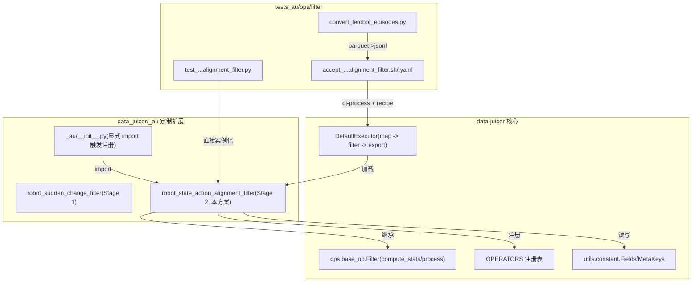
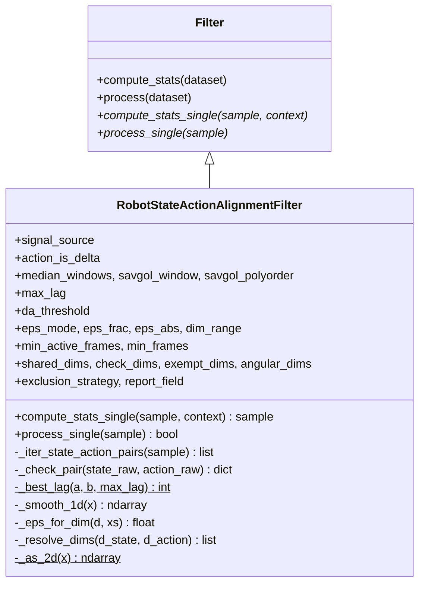
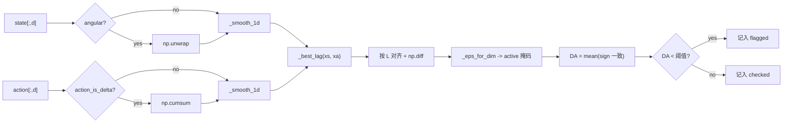
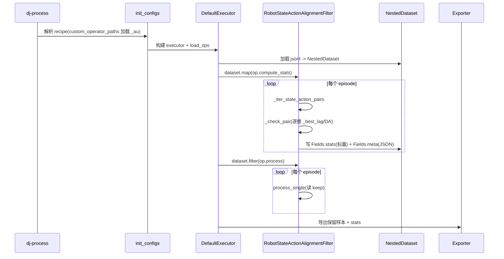
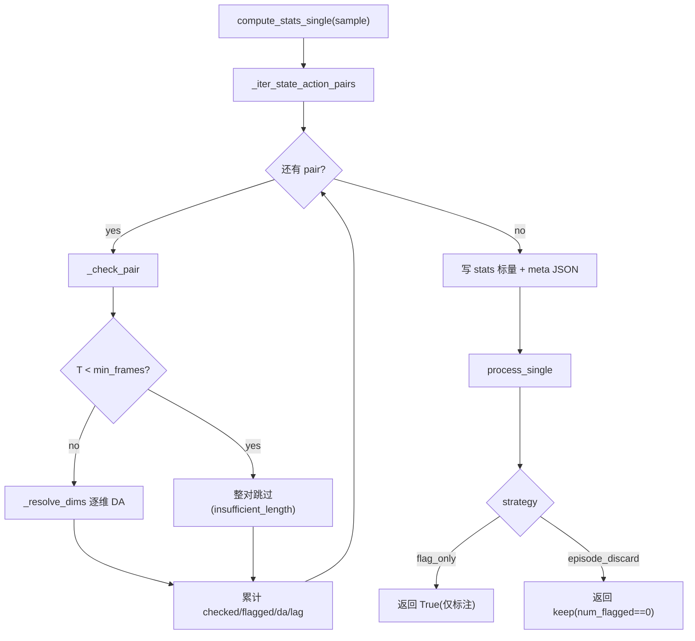
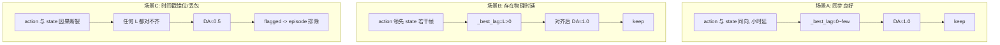
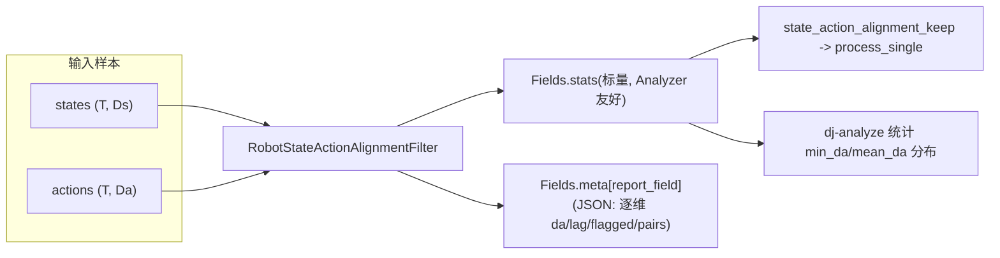

# 用 data-juicer 实现 Qwen-RobotManip Stage 2：State-Action Trend Alignment 方案

本文给出一份可落地方案：如何用当前 `data-juicer` 代码库实现 Qwen-RobotManip 论文 `Stage 2: State-Action Trend Alignment` 中的数据治理方法。全文基于论文 TeX 原文、本地官方文档（`docs/`、`demos/`、`README.md`）、真实参考实现（Galaxea `clean_stage123.py`）以及 Stage 1 已落地成果（`data_cur1_1.md`、`data_cur1_2.md`、`robot_sudden_change_filter.py`）。遵循"扩展大于修改"原则，不改动 `data-juicer` 主干源码，所有定制代码写入 `data_juicer/_au/` 与 `tests_au/`。

对应论文位置：`b/d/QwenRobotmanip/TeX_Source/chapter/data.tex`。原文（两段并列表述）：

> **Stage 2: State-Action Trend Alignment.** In a correctly recorded episode, action commands should temporally lead or coincide with resulting state changes, which is a causal invariant violated when timestamps are unsynchronized or there is packet loss. For each shared joint dimension, we smooth both the state and action trajectories, then estimate the optimal temporal lag via cross-correlation, then compute a *directional agreement* (DA) metric on lag-aligned first-order differences. Dimensions with DA below a dataset-specific threshold (typically 0.6-0.7) are flagged and their episodes excluded. For datasets using delta actions, we first integrate the action sequence to recover absolute values before comparison. This stage revealed severe quality issues in certain subsets: 81% of episodes in the RoboMIND UR-type data failed this check and were excluded.

翻译与提要：在正确录制的一段轨迹（episode）里，**动作指令应当在时间上领先或与其引起的状态变化同步**——这是一条"因果不变量"（causal invariant）。当时间戳不同步或带宽受限导致丢包时，这条不变量会被破坏。对每个"共享关节维"，先平滑 state 与 action 两条轨迹，再用**互相关**估计最优时延，然后在**时延对齐后的一阶差分**上计算**方向一致性（DA）**指标；DA 低于数据集特定阈值（通常 0.6–0.7）的维度被标记，含被标记维度的整段 episode 被排除。对使用 delta（增量）动作的数据集，比较前先对动作序列积分还原绝对量。该阶段在某些子集上暴露了严重的质量问题：例如 RoboMIND UR 型数据有 **81%** 的 episode 未通过该检查而被剔除。

---

## 目录

1. 结论速览
2. 背景：因果不变量与"Alignment Unlocks Scale"
3. 论文方法形式化
4. 关键概念深入浅出（互相关 / DA / eps / delta 积分 / 共享维语义）
5. 参考实现代码解读（`clean_stage123.py`）
6. data-juicer 能力映射与选型
7. 静态架构（组件图 / 类图 / 职责）
8. 动态架构（数据流 / 序列 / 工作流 / 场景协调）
9. 关键逻辑代码解读（本算子）
10. 完整落地物料（源码 / 测试 / 验收 / recipe）
11. 落地执行记录与自检清单
12. 扩展性、参数敏感性与 Stage 1/2/3 编排

---

## 1. 结论速览

Stage 2 与 Stage 1 是互补的两类质检：

- **Stage 1（突变检测）** 只看单条信号自身的"平滑性"——残差 + 二阶差分（acc）+ 三阶差分（jerk）的联合判据，捕捉尖峰 / 阶跃 / 抖动。
- **Stage 2（状态-动作趋势对齐）** 关注 **两条信号之间的因果关系**——action 与 state 的**方向**是否一致。它捕捉的是 Stage 1 看不到的一类问题：单看 state 平滑、单看 action 也平滑，但两者"对不上"（时间戳错位、丢包、delta 语义配置错误、左右臂/通道错配等）。

Stage 2 的算法内核（逐"共享关节维" $d$）：

$$
\text{DA}_d
= \frac{1}{|\mathcal{A}_d|}
\sum_{t \in \mathcal{A}_d}
\mathbb{1}\!\left[\operatorname{sign}(\Delta \hat{s}^{(L_d)}_{t,d}) = \operatorname{sign}(\Delta \hat{a}^{(L_d)}_{t,d})\right],
\qquad
\text{keep} = \bigwedge_{d}\left(\text{DA}_d \ge \tau_{\text{DA}}\right)
$$

其中 $L_d$ 是由互相关估计的最优时延，$\mathcal{A}_d$ 是"显著运动帧"集合（$|\Delta s|$ 或 $|\Delta a|$ 超过 $\epsilon_d$），$\tau_{\text{DA}} \in [0.6, 0.7]$。任一维 DA 低于阈值即整段丢弃。

`data-juicer` 现状与选型结论：

- 仓库内**没有**任何互相关 / 方向一致性 / 时延对齐能力（`rg cross.?correl|directional|best_lag` 无命中），因此这是一个**全新算子**。
- `Filter` 基类天然契合"先算统计量（`compute_stats_single`）、再决定保留（`process_single`）"的两阶段模型，而 DA/keep 正是 episode 级的标量统计量 + 布尔判据。
- Stage 1 已沉淀了可复用的平滑（级联中值 + Savitzky-Golay）、维度选择、MAD/JSON-meta 序列化范式；Stage 2 直接复用同一套工程约定，降低认知与维护成本。
- 因此实现一个专用自定义 Filter：**`robot_state_action_alignment_filter`**（类 `RobotStateActionAlignmentFilter`），通过企业化的**包引入**方式（`custom_operator_paths: ['data_juicer/_au']`）挂载。

本方案已完整落地并验证：算子 + 单元测试（11 项，全过）+ 真实数据集验收（Galaxea `Connect_Router_Cables`，16/16 通过，mean DA ≈ 0.98）。详见第 10、11 章。

---

## 2. 背景：因果不变量与 "Alignment Unlocks Scale"

### 2.1 为什么"方向一致性"是一条因果不变量

机器人遥操作 / 回放数据的采集链路通常是：控制器以某频率下发 **action 指令** → 执行器运动 → 传感器回读 **state**。在物理上，**先有指令，后有状态改变**，二者存在一个小的、由控制与执行延迟决定的**时延** $L \ge 0$（action 领先 state），且在"动"的时刻两者的**方向应当一致**：手臂关节被指令"增大角度"，回读的关节角也应"增大"。

这就构成一条与具体机器人、具体任务都无关的**因果不变量**：

$$
\operatorname{sign}\big(\text{action 的变化}\big) \;\approx\; \operatorname{sign}\big(\text{state 的变化}\big)\quad(\text{在时延对齐后}).
$$

一旦数据管线出现下列问题，这条不变量就会被破坏，而幅值/平滑性检查（Stage 1）往往**察觉不到**：

- **时间戳不同步**：state 与 action 用了两套不同步的时钟，错位若干帧甚至方向漂移。
- **带宽受限丢包**：某些帧的 action 或 state 丢失后被"前值填充"或错位重排，方向随机化。
- **delta 语义配置错误**：数据集用增量（delta）参数化动作，但下游按绝对量比较，导致"位置 vs 速度"错配。
- **通道 / 左右臂错配**：unified 向量拼装时某维接错，state 与 action 指向不同关节。

### 2.2 与整体数据治理的关系

Qwen-RobotManip 的数据哲学是 **"Alignment Unlocks Scale"**（见 `note_data.md`）：把海量异构机器人数据对齐到统一的 80 维动作空间与 Camera-Frame Delta Pose 表征后，规模才有意义；而规模化的前提是**质量**。论文的数据治理是级联的多阶段过滤：


- Stage 1 是"信号内"质检，Stage 2 是"信号间"质检，二者正交互补。
- Stage 2 的杀伤力可以极大：论文报告 RoboMIND UR 型数据 **81%** 的 episode 因 state–action 错位被剔除——这类问题若不检出，会让模型学到"指令与结果无关"的错误因果，严重污染训练。

### 2.3 论文实证的启示（消融视角）

论文对 Stage 2 只公开了一个可量化的超参：DA 阈值 0.6–0.7。这暗示了两个工程事实：

1. **DA 是一个非常"干净"的判别量**：好数据的 DA 通常接近 1.0（本方案在真实 Galaxea 数据上实测 mean DA ≈ 0.98），坏数据（时间戳错位）会掉到 0.5 附近（近似掷硬币），因此 0.65 这样一个宽阈值就能拉开区分度。
2. **时延与 eps 需要"自适应"**：不同数据集采集频率不同（15fps / 30fps…），时延窗口与"显著运动阈值"必须能按数据集调，否则要么漏检要么误杀。这正是本算子把 `max_lag`、`eps_frac`/`eps_abs`、`min_active_frames` 都做成可配置参数的原因。

---

## 3. 论文方法形式化

设一段 episode 的状态与动作信号分别为

$$
\mathbf{S} \in \mathbb{R}^{T \times D_s},\qquad
\mathbf{A} \in \mathbb{R}^{T \times D_a},
$$

其中 $T$ 是帧数。令 $\mathcal{D}$ 为"共享关节维"集合（在 state 与 action 中都存在且**语义可比**的维度，见 §4.5）。对每个 $d \in \mathcal{D}$：

### 3.1 （可选）delta 动作积分

若动作为增量参数化（`action_is_delta=True`），先积分还原绝对量：

$$
a^{\text{abs}}_{t,d} = \sum_{k=0}^{t} a_{k,d} \quad(\text{即 } \texttt{np.cumsum}).
$$

否则 $a^{\text{abs}}_{:,d} = a_{:,d}$。

### 3.2 平滑

对 state 与（积分后的）action 各做级联中值 + Savitzky-Golay 平滑（与 Stage 1 同一算子）：

$$
\hat{s}_{:,d} = \operatorname{SG}_{w_s,p}\!\big(\operatorname{Median}_{w_2}(\operatorname{Median}_{w_1}(s_{:,d}))\big),\qquad
\hat{a}_{:,d} = \operatorname{SG}_{w_s,p}\!\big(\operatorname{Median}_{w_2}(\operatorname{Median}_{w_1}(a^{\text{abs}}_{:,d}))\big).
$$

平滑的意义：DA 是**符号**统计量，对噪声极其敏感；平滑先把逐帧量化噪声压掉，避免"在噪声上数符号"。

### 3.3 互相关估计最优时延

在搜索窗 $[-L_{\max}, L_{\max}]$ 内，最大化去均值后的**归一化互相关**：

$$
L_d = \arg\max_{L \in [-L_{\max}, L_{\max}]}
\frac{\langle \hat{s}^{\,\prime}_{:,d}[L:],\; \hat{a}^{\,\prime}_{:,d}[:\,T-L] \rangle}
{\lVert \hat{s}^{\,\prime}_{:,d}[L:] \rVert \cdot \lVert \hat{a}^{\,\prime}_{:,d}[:\,T-L] \rVert},
$$

其中 $x' = x - \bar{x}$。$L_d \ge 0$ 表示 action 领先 state $L_d$ 帧（把 action 左移 $L_d$ 对齐）。

### 3.4 时延对齐 + 一阶差分

按 $L_d$ 对齐后，取截断到公共长度 $m$ 的一阶差分：

$$
\Delta \hat{s}_{t,d} = \hat{s}^{(L_d)}_{t+1,d} - \hat{s}^{(L_d)}_{t,d},\qquad
\Delta \hat{a}_{t,d} = \hat{a}^{(L_d)}_{t+1,d} - \hat{a}^{(L_d)}_{t,d}.
$$

### 3.5 显著运动帧与方向一致性

只在"真的在动"的帧上评估方向。定义逐维最小变化阈值 $\epsilon_d$（见 §4.4），活跃帧集合

$$
\mathcal{A}_d = \{\,t : |\Delta \hat{s}_{t,d}| > \epsilon_d \ \lor\ |\Delta \hat{a}_{t,d}| > \epsilon_d\,\}.
$$

若 $|\mathcal{A}_d| < N_{\text{active}}$（活跃帧太少，不足以统计），**跳过该维**（不判失败）。否则

$$
\text{DA}_d = \frac{1}{|\mathcal{A}_d|}\sum_{t \in \mathcal{A}_d}
\mathbb{1}\!\left[\operatorname{sign}(\Delta \hat{s}_{t,d}) = \operatorname{sign}(\Delta \hat{a}_{t,d})\right].
$$

### 3.6 判据

$$
\text{flagged} = \{\,d \in \mathcal{D} : \text{DA}_d < \tau_{\text{DA}}\,\},\qquad
\text{keep} = (\text{flagged} = \varnothing).
$$

任一被检查维的 DA 低于阈值，整段 episode 被排除（论文语义为 episode-level exclude）。

---

## 4. 关键概念深入浅出

### 4.1 互相关与时延：为什么不能只在 $L=0$ 比较

控制与执行存在物理延迟，state 相对 action 滞后若干帧。若直接在同一帧比较方向，会把"正确但有延迟"的数据误判为不一致。互相关做的事情就是：**平移一条信号，找到让两条信号最像的位移量**。

举个直观例子。设 action 是一段方波脉冲，state 是它延迟 3 帧后的响应：

```
frame:   0 1 2 3 4 5 6 7 8 9
action:  0 0 1 1 1 0 0 0 0 0
state:   0 0 0 0 0 1 1 1 0 0   # 延迟 3 帧
```

在 $L=0$ 直接比较，两者错开，DA 会很低；而互相关会发现 $L=3$（本实现里 action 领先 state，故把 action 左移 3 帧）时归一化相关最大，对齐后 DA 恢复到接近 1。本方案的单元测试 `test_temporal_lag_recovered_keep` 正是构造 `action = np.roll(state, -5)`，验证算子能恢复出 $L=5$ 并判定 keep。

**归一化**（除以两段的范数）的意义：让相关系数落在 $[-1, 1]$，与幅值无关，从而"方向/形状"匹配度可跨维、跨数据集比较。

### 4.2 方向一致性 DA：一个稳健、可解释的判别量

DA 不关心"变化多大"，只关心"变化朝哪个方向"。这带来两个好处：

- **对标定误差、增益差异免疫**：即便 action 与 state 的单位/增益不同（例如指令角速度 vs 回读角度），只要方向一致，DA 依然接近 1。
- **物理意义清晰**：DA = 1 表示"每次动的方向都对上了"；DA = 0.5 表示"方向随机"（时间戳错位/丢包的典型特征）；DA = 0 表示"完全反向"。

用一个 5 帧的迷你例子说明 DA 的计算（已对齐、已取显著帧）：

```
Δs sign:  +  +  -  +  -
Δa sign:  +  +  -  -  -
agree?    ✓  ✓  ✓  ✗  ✓   -> DA = 4/5 = 0.8
```

### 4.3 为什么要"平滑"再算 DA

DA 是符号统计。原始信号上的逐帧量化噪声会在"没在动"的时刻产生正负乱跳的 $\Delta$，符号一致性退化为掷硬币。平滑（中值抑尖峰 + SG 保导数趋势）把这些噪声压下去，让 $\Delta$ 反映真实运动趋势。这与 Stage 1 复用同一套平滑，工程上一致。

### 4.4 eps 最小变化阈值：只在"真的在动"的帧上评估

这是参考实现里一个**至关重要**的细节。即便一个维度整体对齐得很好（Pearson ≈ 0.98），它在"近乎静止"时的逐帧微小抖动上，符号一致性依然是掷硬币。若把这些帧计入 DA，会把好数据误判为坏。

因此定义 $\epsilon_d$ 把静止帧排除，只在"变化超过 $\epsilon_d$"的帧上算 DA。$\epsilon_d$ 有两种模式：

- **`range_frac`（默认，推荐）**：$\epsilon_d = \max(\text{eps\_frac} \times \text{range}_d,\ \text{eps\_abs})$，把阈值**绑定到关节的物理量程** $\text{range}_d$（优先用外部传入的全局 $q_{99}-q_{01}$；缺省时用逐 episode 的 1/99 分位跨度稳健估计）。这样"多大算显著"随关节量程自适应。
- **`abs`**：固定常数 $\epsilon_d = \text{eps\_abs}$，用于单元测试等已知尺度的合成信号。

若某维活跃帧数 $< N_{\text{active}}$（`min_active_frames`），说明它这段几乎没动，**跳过而非判失败**——这避免了"静止维"造成的假阳性。本方案单元测试 `test_static_dim_skipped_keep` 专门覆盖此逻辑。

### 4.5 共享维语义：state 是位置，action 可能是速度

这是 Stage 2 最容易踩坑的地方，也是参考实现里用大段注释强调的点。以 Galaxea 统一布局为例：

| 通道 | state 语义 | action 语义 | 是否纳入 Stage 2 |
|---|---|---|---|
| 双臂关节（left_arm 0–6, right_arm 8–14）| 位置 | 位置 | **是**（位置可比）|
| torso（16–20）| 位置 | 速度 | 否（位置 vs 速度不可直接比方向）|
| base / chassis | 位置 | 速度 | 否 |
| 夹爪（left_hand 7, right_hand 15）| 开合 | 开合 | 否（双峰/离散，方向意义弱）|
| padding / reserved | — | — | 否 |

因此 Stage 2 只在**双臂关节**这 12 个位置可比的共享维上做 DA。算子通过 `shared_dims`（显式给出参与维，state/action 同索引）+ `check_dims`/`exempt_dims` 精确控制这一点。验收 recipe 里就写死了 `shared_dims: [0..6, 8..14]`。

### 4.6 delta 动作积分：位置 vs 速度的还原

若数据集用增量动作（每帧给的是"相对上一帧的位移"），它本质是**速度/位移**语义，直接与 state（位置）比方向会系统性错位（位置的导数才是速度）。因此比较前先 $\texttt{cumsum}$ 积分还原为绝对位置轨迹。本方案单元测试 `test_delta_action_integration` 给出鲜明对比：同一份 delta 动作，开启积分 → DA = 1.0（keep）；关闭积分 → DA ≈ 0.54（drop）。

---

## 5. 参考实现代码解读（`clean_stage123.py`）

参考实现位于 Galaxea 数据集侧的离线脚本 `/mnt/r/DATA/Galaxea-Open-World-Dataset/clean_stage123.py`（只读分析工具，读 unified parquet 出清洗报告）。它是论文 Stage 1–3 的一份具体落地，Stage 2 的核心是 `_best_lag` 与 `stage2_check`。

### 5.1 `_best_lag`：互相关求时延

```python
def _best_lag(a, b, max_lag):
    """Lag L (in frames) that best aligns b onto a via cross-correlation.
    Positive L means b lags a (shift b left by L to align)."""
    a = a - a.mean()
    b = b - b.mean()
    if np.allclose(a, 0) or np.allclose(b, 0):
        return 0
    best_L, best_c = 0, -np.inf
    for L in range(-max_lag, max_lag + 1):
        if L >= 0:
            aa, bb = a[L:], b[:len(b) - L] if L > 0 else b
        else:
            aa, bb = a[:L], b[-L:]
        m = min(len(aa), len(bb))
        if m < 5:
            continue
        c = float(np.dot(aa[:m], bb[:m]))
        denom = np.linalg.norm(aa[:m]) * np.linalg.norm(bb[:m]) + 1e-12
        c /= denom
        if c > best_c:
            best_c, best_L = c, L
    return best_L
```

逐点解读：

- **去均值**（`a - a.mean()`）：互相关只关心波形形状，去掉直流分量。
- **零信号短路**：若某条信号几乎不变（`np.allclose(..., 0)`），无从对齐，直接返回 $L=0$。
- **滑窗搜索**：对每个候选 $L$ 取重叠段，$L\ge0$ 时把 $b$ 前段与 $a$ 的 $[L:]$ 对齐（即 $b$ 落后 $a$）。
- **归一化点积**：`c / (||aa|| * ||bb|| + 1e-12)`，得到 $[-1,1]$ 的余弦式相关；`+1e-12` 防止除零。
- **最短重叠保护**：`m < 5` 跳过，避免极端 $L$ 下重叠太短产生虚高相关。

### 5.2 `stage2_check`：方向一致性判定

```python
def stage2_check(state, action, dims, dim_range, cfg):
    n = state.shape[0]
    flagged = {}
    if n < cfg["s2_min_len"]:
        return False, flagged
    for d in dims:
        xs = smooth_signal(state[:, d].astype(np.float64), cfg["med_k"], cfg["sg_win"], cfg["sg_poly"])
        xa = action[:, d].astype(np.float64)
        if cfg["action_is_delta"]:
            xa = np.cumsum(xa)
        xa = smooth_signal(xa, cfg["med_k"], cfg["sg_win"], cfg["sg_poly"])
        L = _best_lag(xs, xa, cfg["max_lag"])
        if L >= 0:                                  # align action onto state
            sa, aa = xs[L:], xa[:n - L] if L > 0 else xa
        else:
            sa, aa = xs[:L], xa[-L:]
        m = min(len(sa), len(aa))
        if m < 5:
            continue
        ds = np.diff(sa[:m])
        da = np.diff(aa[:m])
        eps = max(cfg["eps_frac"] * float(dim_range[d]), 1e-6)
        active = (np.abs(ds) > eps) | (np.abs(da) > eps)
        if active.sum() < cfg["s2_min_active"]:
            continue
        agree = np.sign(ds[active]) == np.sign(da[active])
        DA = float(agree.mean())
        if DA < cfg["da_thresh"]:
            flagged[int(d)] = round(DA, 4)
    return (len(flagged) > 0), flagged
```

要点与本方案的对应关系（§9 会给出算子里等价的 `_check_pair`）：

- **短轨迹跳过**（`n < s2_min_len`）→ 本算子 `min_frames` 保护。
- **平滑 state 与积分后 action**→ 本算子 `_smooth_1d` + `action_is_delta` 分支。
- **`_best_lag` + 对齐 + `np.diff`**→ 本算子 `_best_lag` + 对齐 + `np.diff`（逐行同构）。
- **eps 绑定物理量程 + 活跃帧过滤 + 符号一致性**→ 本算子 `_eps_for_dim` + `active` + `agree`。
- **任一维 flagged 则 fail**→ 本算子 `num_flagged == 0` 决定 keep。

### 5.3 维度选择的工程理由（`process_dataset` 片段）

```python
# Stage-2 dims: shared joint slots where both are position-comparable (arms).
s2_dims = sorted(set(a_arm) & set(s_arm))
# ...
# Stage 2 (uses state's physical range for the motion threshold)
s2_fail, s2_flag = stage2_check(state, action, s2d, s_range, cfg)
```

参考实现明确只取"双臂位置可比"的共享维（`a_arm & s_arm`），并用 **state 的物理量程** `s_range` 作为 eps 基准。torso/base（state=位置、action=速度）与夹爪（双峰）被排除。这与 §4.5 完全一致，也是本算子 `shared_dims` 参数的设计动机。

---

## 6. data-juicer 能力映射与选型

### 6.1 现状盘点

| 需求 | data-juicer 现成能力 | 是否够用 |
|---|---|---|
| 逐样本算统计量、再决定保留 | `Filter.compute_stats_single` + `process_single` | 够用（骨架）|
| 标量统计量落盘、供 `dj-analyze` 分析 | `Fields.stats`（`__dj__stats__`）| 够用 |
| 结构化明细（逐维 DA/lag）落盘 | `Fields.meta`（`__dj__meta__`）+ JSON 串 | 够用 |
| 平滑（中值 + SG）| Stage 1 `robot_sudden_change_filter` 已实现 | 复用 |
| 互相关 / 时延 / 方向一致性 | **无**（`rg` 无命中）| **需新增** |
| 企业化算子挂载 | `custom_operator_paths` 包引入 | 够用 |

### 6.2 为什么是"专用 Filter"而非快速拼装

- `python_file_mapper` + `general_field_filter` 可以快速原型（Mapper 写一个 keep 字段，Filter 按字段过滤），但 DA 计算涉及平滑、互相关、逐维 eps、delta 积分等较重逻辑，且需要向 `stats`/`meta` 写多个规范字段，封装成正规 `Filter` 更利于测试、复用与被 `dj-analyze` 消费。
- 遵循"扩展大于修改"：不动 `data_juicer/ops/`，在 `data_juicer/_au/ops/filter/` 新增算子，用 `_au/__init__.py` 显式注册。

### 6.3 与官方 VLA 生态的一致性

`demos/ego_hand_action_annotation/`（`vla_pipeline.py` + `configs/vla_pipeline.yaml` + `custom_ops/`）展示了官方推荐的机器人/VLA 数据流水线组织方式：自定义算子 + recipe 编排。本方案的目录结构（`_au/ops/filter/` + `tests_au/ops/filter/` + 验收 `.yaml/.sh`）与之同构，并沿用 Stage 1 已验证的落地经验（`text_keys: 'id'`、`stats_export_path`、JSON 序列化 meta）。

---

## 7. 静态架构

### 7.1 组件图



### 7.2 类图



### 7.3 职责表

| 方法 | 职责 | 输入 | 输出 |
|---|---|---|---|
| `_iter_state_action_pairs` | 按 `signal_source` 抽取并**配对** state/action | sample | `[(name, state_raw, action_raw)]` |
| `_as_2d` | 归一为 `(T,D)` float64 | 任意轨迹 | ndarray |
| `_resolve_dims` | 计算参与检测的共享维（含 include/exclude/exempt）| $D_s, D_a$ | dims 列表 |
| `_smooth_1d` | 级联中值 + SG 平滑（1D，含短信号保护）| 1D 信号 | 平滑信号 |
| `_best_lag` | 互相关求最优时延 $L$ | 两条 1D 信号 | 整数 lag |
| `_eps_for_dim` | 逐维最小变化阈值 $\epsilon_d$ | 维索引、平滑 state | float |
| `_check_pair` | 单对 (state, action) 逐维算 DA / lag / flagged | 两个 raw 块 | 报告 dict |
| `compute_stats_single` | 汇总所有对 → 写标量 `stats` + JSON `meta` | sample | sample |
| `process_single` | 按策略决定 episode 保留 | sample | bool |

### 7.4 参数分组（构造函数）

- **信号来源**：`signal_source ∈ {top_level, hand_action_tags, meta_field}` 及各自的键名参数。
- **delta**：`action_is_delta`。
- **平滑**：`median_windows, savgol_window, savgol_polyorder`（与 Stage 1 同义）。
- **时延**：`max_lag`。
- **DA/eps**：`da_threshold, eps_mode, eps_frac, eps_abs, dim_range, min_active_frames`。
- **维度选择**：`shared_dims, check_dims, exempt_dims, angular_dims`。
- **判据/策略**：`min_frames, exclusion_strategy ∈ {episode_discard, flag_only}, report_field`。

---

## 8. 动态架构

### 8.1 前向数据流（单维 $d$）



### 8.2 序列图（`dj-process` 调用链）



### 8.3 单 episode 工作流



### 8.4 三种场景协调图



- 场景 A/B 是本方案在真实 Galaxea 数据上的实测形态（mean DA ≈ 0.98，`max_abs_lag` 4–11 帧）。
- 场景 C 对应论文 RoboMIND UR 型数据 81% 被剔除的情形，也对应单元测试 `test_independent_walks_drop`（两条独立随机游走，DA ≈ 0.46）。

### 8.5 字段数据流



标量 `stats` 键：`state_action_alignment_keep`、`state_action_min_da`、`state_action_mean_da`、`state_action_num_flagged_dims`、`state_action_num_checked_dims`、`state_action_max_abs_lag`。

---

## 9. 关键逻辑代码解读（本算子）

以下解读均来自 `data_juicer/_au/ops/filter/robot_state_action_alignment_filter.py`（完整源码见 §10.1）。

### 9.1 单对检测 `_check_pair`（算法主体）

```python
def _check_pair(self, state_raw, action_raw) -> dict:
    state = self._as_2d(state_raw)
    action = self._as_2d(action_raw)
    T = min(state.shape[0], action.shape[0])          # 容忍 state/action 长度不一致
    result = {"num_frames": int(T), "checked_dims": [], "dim_da": {},
              "dim_lag": {}, "flagged": {}, "insufficient_length": bool(T < self.min_frames)}
    if T < self.min_frames:
        return result                                  # 过短安全跳过
    state, action = state[:T], action[:T]
    dims = self._resolve_dims(state.shape[1], action.shape[1])
    for d in dims:
        xs = state[:, d].astype(np.float64)
        xa = action[:, d].astype(np.float64)
        if d in self.angular_dims:
            xs = np.unwrap(xs)                          # 角度维先解卷绕
        xs = self._smooth_1d(xs)
        if self.action_is_delta:
            xa = np.cumsum(xa)                          # delta -> 绝对量
        if d in self.angular_dims and not self.action_is_delta:
            xa = np.unwrap(xa)
        xa = self._smooth_1d(xa)
        L = self._best_lag(xs, xa, self.max_lag)        # 互相关时延
        if L >= 0:
            sa, aa = xs[L:], (xa[: T - L] if L > 0 else xa)
        else:
            sa, aa = xs[:L], xa[-L:]
        m = min(len(sa), len(aa))
        if m < 5:
            continue
        ds = np.diff(sa[:m]); da = np.diff(aa[:m])       # 一阶差分
        eps = self._eps_for_dim(d, xs)
        active = (np.abs(ds) > eps) | (np.abs(da) > eps) # 显著运动帧
        if int(active.sum()) < self.min_active_frames:
            continue                                     # 活跃不足 -> 跳过, 不判失败
        agree = np.sign(ds[active]) == np.sign(da[active])
        da_value = float(agree.mean())                   # 方向一致性
        result["checked_dims"].append(int(d))
        result["dim_da"][int(d)] = round(da_value, 4)
        result["dim_lag"][int(d)] = int(L)
        if da_value < self.da_threshold:
            result["flagged"][int(d)] = round(da_value, 4)
    return result
```

要点：

1. **长度对齐 `T = min(...)`**：真实数据里 state/action 帧数偶有差 1，取公共长度更稳健（参考实现假设等长）。
2. **angular 解卷绕**：欧拉角在 $\pm\pi$ 处跳变会污染差分方向；`np.unwrap` 先消除跳变（与 Stage 1 一致）。注意 delta 动作已是增量，不再对其 unwrap。
3. **对齐分支与参考实现逐行同构**：$L\ge0$ 把 state 前移 $L$，action 保留前段，实现"action 领先"的对齐。
4. **skip 而非 fail**：`m<5` 与 `active.sum() < min_active_frames` 都是"证据不足"，跳过该维，避免假阳性。

### 9.2 互相关 `_best_lag`

见 §5.1 参考实现；本算子逐行等价（去均值 → 零信号短路 → 滑窗归一化相关 → 取最大）。它以 `@staticmethod` 实现，便于单测直接调用与复用。

### 9.3 逐维 eps `_eps_for_dim`

```python
def _eps_for_dim(self, d, xs):
    if self.eps_mode == "abs":
        return self.eps_abs
    if self.dim_range is not None and d < len(self.dim_range):
        rng = float(self.dim_range[d])                  # 优先用外部全局量程 q99-q01
    else:
        rng = float(np.percentile(xs, 99) - np.percentile(xs, 1))  # 缺省: 逐 episode 稳健跨度
    return max(self.eps_frac * rng, self.eps_abs)
```

设计取舍：参考实现依赖离线 `dataset_stats.json` 的全局分位数；而 data-juicer 的算子是**逐样本**处理，未必拿得到全局统计。本算子因此支持三层回退：外部 `dim_range` → 逐 episode 1/99 分位跨度 → `eps_abs` 下限。既能对接全局统计，也能独立运行。

### 9.4 维度选择 `_resolve_dims`

```python
def _resolve_dims(self, d_state, d_action):
    d_shared = min(d_state, d_action)
    dims = [d for d in self.shared_dims if 0 <= d < d_shared] if self.shared_dims is not None \
        else list(range(d_shared))
    if self.check_dims:
        if "include" in self.check_dims:
            dims = [d for d in dims if d in set(self.check_dims["include"])]
        if "exclude" in self.check_dims:
            dims = [d for d in dims if d not in set(self.check_dims["exclude"])]
    if self.exempt_dims:
        dims = [d for d in dims if d not in self.exempt_dims]
    return dims
```

`shared_dims` 给出"哪些维在 state/action 里语义可比"，`check_dims`/`exempt_dims` 再做二次裁剪（如临时排除某维），与 Stage 1 的维度选择范式一致。

### 9.5 两阶段接口

- `compute_stats_single`：遍历所有 pair，汇总 `min_da/mean_da/max_abs_lag/num_flagged/num_checked`，写入 `Fields.stats`（标量，`dj-analyze` 可 `describe`）；并把逐维明细以 **JSON 字符串**写入 `Fields.meta[report_field]`——这是 Stage 1 踩过的坑：直接写嵌套 dict/list 会触发 Arrow schema 推断冲突（`TypeError: Couldn't cast array of type string to null`），JSON 串化可规避。
- `process_single`：`flag_only` 恒返回 `True`（只标注、供 `dj-analyze`）；`episode_discard` 按 `state_action_alignment_keep`（即 `num_flagged==0`）决定保留。

---

## 10. 完整落地物料

所有文件已创建并通过验证。目录遵循 `_au`/`tests_au` 镜像 `data_juicer`/`tests` 的约定。

### 10.1 算子源码 `data_juicer/_au/ops/filter/robot_state_action_alignment_filter.py`

```python
# data_juicer/_au/ops/filter/robot_state_action_alignment_filter.py
# -*- coding: utf-8 -*-
"""Qwen-RobotManip Stage 2: State-Action Trend Alignment —— data-juicer 自定义 Filter。

校验一段 episode 内 state 与 action 轨迹的「趋势一致性」这一因果不变量：
正确录制时，action 指令应领先或同步于其引起的 state 变化；时间戳错位或丢包
会破坏该不变量。逐「共享关节维」执行：

    平滑 state / (可选积分)平滑 action
        -> 互相关估计最优时延 L
        -> 时延对齐后取一阶差分
        -> 在「显著变化帧」(|Δ|>eps) 上计算方向一致性 DA = mean(sign(Δs)==sign(Δa))
        -> 任一维 DA < 阈值 则整段 episode 判定为不一致。

参考实现：Galaxea 数据集 clean_stage123.py 中的 `_best_lag` 与 `stage2_check`。
"""

import json

import numpy as np

from data_juicer.ops.base_op import OPERATORS, Filter
from data_juicer.utils.constant import Fields, MetaKeys

OP_NAME = "robot_state_action_alignment_filter"


@OPERATORS.register_module(OP_NAME)
class RobotStateActionAlignmentFilter(Filter):
    """Filter episodes whose state/action trajectories are trend-misaligned.

    逐共享关节维计算方向一致性 DA；任一维 DA 低于阈值即认为 state 与 action
    不一致（时间戳错位 / 丢包 / delta 语义错误等），默认整段 episode 丢弃。
    """

    def __init__(
        self,
        # ---- 信号来源 ----
        signal_source: str = "top_level",
        top_level_state_key: str = "states",
        top_level_action_key: str = "actions",
        hand_action_field: str = MetaKeys.hand_action_tags,
        states_key: str = "states",
        actions_key: str = "actions",
        meta_state_field: str = None,
        meta_action_field: str = None,
        # ---- delta 动作 ----
        action_is_delta: bool = False,
        # ---- 平滑参数 ----
        median_windows: tuple = (3, 5),
        savgol_window: int = 11,
        savgol_polyorder: int = 3,
        # ---- 时延估计 ----
        max_lag: int = 15,
        # ---- 方向一致性阈值 ----
        da_threshold: float = 0.65,
        eps_mode: str = "range_frac",
        eps_frac: float = 0.01,
        eps_abs: float = 1e-6,
        dim_range: list = None,
        min_active_frames: int = 10,
        # ---- 维度选择 ----
        shared_dims: list = None,
        check_dims: dict = None,
        exempt_dims: list = None,
        angular_dims: list = None,
        # ---- episode 级判据 ----
        min_frames: int = 20,
        # ---- 处理策略 ----
        exclusion_strategy: str = "episode_discard",
        report_field: str = "state_action_alignment_report",
        *args,
        **kwargs,
    ):
        """
        :param signal_source: 信号来源，{"top_level","hand_action_tags","meta_field"}。
        :param top_level_state_key/top_level_action_key: top_level 时样本顶层键名。
        :param hand_action_field: hand_action_tags 时 meta 中的字段名。
        :param states_key/actions_key: hand_action_tags 每个 hand dict 内的键名。
        :param meta_state_field/meta_action_field: meta_field 时 meta 下的 (T,D) 字段名。
        :param action_is_delta: 若 action 为增量参数化，比较前先对其做 cumsum 积分还原绝对量。
        :param median_windows: 级联中值滤波窗口序列（自动取奇数并裁剪到不超过 T）。
        :param savgol_window: Savitzky-Golay 窗口（自动取奇数，需 >= polyorder+2 才启用）。
        :param savgol_polyorder: SG 多项式阶数。
        :param max_lag: 互相关搜索的最大时延（帧）。
        :param da_threshold: 方向一致性阈值，论文建议 0.6~0.7；低于则该维被 flag。
        :param eps_mode: 最小变化阈值模式，{"range_frac","abs"}。
        :param eps_frac: range_frac 模式下 eps = max(eps_frac*量程, eps_abs)。
        :param eps_abs: abs 模式下的固定 eps；range_frac 模式下作为下限。
        :param dim_range: 逐维物理量程 (q99-q01) 向量；缺省时用逐 episode 的 1/99 分位跨度估计。
        :param min_active_frames: 少于该活跃帧数则跳过该维（不判失败），避免近零噪声误判。
        :param shared_dims: 参与检测的共享维索引（state 与 action 同索引）；None 时自动推断。
        :param check_dims: {"include":[...]} 与/或 {"exclude":[...]}，进一步约束参与维度。
        :param exempt_dims: 一律跳过的维度索引（夹爪等离散/双峰通道、padding）。
        :param angular_dims: 需先 np.unwrap 的角度维索引（欧拉角），避免 pi/-pi 跳变。
        :param min_frames: 少于该帧数的轨迹视为过短，安全保留、不检测。
        :param exclusion_strategy: {"episode_discard","flag_only"}。flag_only 只标注不丢弃。
        :param report_field: 明细报告写入 meta 的字段名。
        """
        super().__init__(*args, **kwargs)

        if signal_source not in ("top_level", "hand_action_tags", "meta_field"):
            raise ValueError(f"Invalid signal_source: {signal_source}")
        if eps_mode not in ("range_frac", "abs"):
            raise ValueError(f"Invalid eps_mode: {eps_mode}")
        if exclusion_strategy not in ("episode_discard", "flag_only"):
            raise ValueError(f"Invalid exclusion_strategy: {exclusion_strategy}")
        if signal_source == "meta_field" and (meta_state_field is None or meta_action_field is None):
            raise ValueError("meta_field source requires meta_state_field and meta_action_field.")

        self.signal_source = signal_source
        self.top_level_state_key = top_level_state_key
        self.top_level_action_key = top_level_action_key
        self.hand_action_field = hand_action_field
        self.states_key = states_key
        self.actions_key = actions_key
        self.meta_state_field = meta_state_field
        self.meta_action_field = meta_action_field

        self.action_is_delta = bool(action_is_delta)

        self.median_windows = tuple(int(w) for w in median_windows)
        self.savgol_window = int(savgol_window)
        self.savgol_polyorder = int(savgol_polyorder)

        self.max_lag = int(max_lag)

        self.da_threshold = float(da_threshold)
        self.eps_mode = eps_mode
        self.eps_frac = float(eps_frac)
        self.eps_abs = float(eps_abs)
        self.dim_range = np.asarray(dim_range, dtype=np.float64) if dim_range is not None else None
        self.min_active_frames = int(min_active_frames)

        self.shared_dims = list(shared_dims) if shared_dims is not None else None
        self.check_dims = check_dims
        self.exempt_dims = set(exempt_dims) if exempt_dims else set()
        self.angular_dims = set(angular_dims) if angular_dims else set()

        self.min_frames = int(min_frames)

        self.exclusion_strategy = exclusion_strategy
        self.report_field = report_field

    # ------------------------------------------------------------------ #
    # 基础工具
    # ------------------------------------------------------------------ #
    @staticmethod
    def _as_2d(x) -> np.ndarray:
        """把任意轨迹归一为 (T, D) 的 float64 数组；(T,) -> (T, 1)。"""
        arr = np.asarray(x, dtype=np.float64)
        if arr.ndim == 1:
            arr = arr[:, None]
        return arr

    def _resolve_dims(self, d_state: int, d_action: int) -> list:
        """计算真正参与检测的共享维索引（state 与 action 同索引）。"""
        d_shared = min(d_state, d_action)
        if self.shared_dims is not None:
            dims = [d for d in self.shared_dims if 0 <= d < d_shared]
        else:
            dims = list(range(d_shared))
        if self.check_dims:
            if "include" in self.check_dims:
                inc = set(self.check_dims["include"])
                dims = [d for d in dims if d in inc]
            if "exclude" in self.check_dims:
                exc = set(self.check_dims["exclude"])
                dims = [d for d in dims if d not in exc]
        if self.exempt_dims:
            dims = [d for d in dims if d not in self.exempt_dims]
        return dims

    def _smooth_1d(self, x: np.ndarray) -> np.ndarray:
        """级联中值 + Savitzky-Golay 平滑（1D），对短信号做保护。"""
        from scipy.ndimage import median_filter
        from scipy.signal import savgol_filter

        y = np.asarray(x, dtype=np.float64).copy()
        T = y.shape[0]
        if T < 5:
            return y
        for w in self.median_windows:
            w = int(w)
            if w % 2 == 0:
                w -= 1
            if 3 <= w <= T:
                y = median_filter(y, size=w, mode="nearest")
        win = min(self.savgol_window, T)
        if win % 2 == 0:
            win -= 1
        if win >= self.savgol_polyorder + 2:
            try:
                y = savgol_filter(y, win, self.savgol_polyorder, mode="interp")
            except Exception:
                pass
        return y

    @staticmethod
    def _best_lag(a: np.ndarray, b: np.ndarray, max_lag: int) -> int:
        """互相关求最优时延 L（帧）：使 b 对齐到 a 的归一化互相关最大。

        L>=0 表示 b 落后于 a（把 b 左移 L 对齐）。与参考实现一致。
        """
        a = a - a.mean()
        b = b - b.mean()
        if np.allclose(a, 0) or np.allclose(b, 0):
            return 0
        best_L, best_c = 0, -np.inf
        for L in range(-max_lag, max_lag + 1):
            if L >= 0:
                aa, bb = a[L:], (b[: len(b) - L] if L > 0 else b)
            else:
                aa, bb = a[:L], b[-L:]
            m = min(len(aa), len(bb))
            if m < 5:
                continue
            c = float(np.dot(aa[:m], bb[:m]))
            denom = np.linalg.norm(aa[:m]) * np.linalg.norm(bb[:m]) + 1e-12
            c /= denom
            if c > best_c:
                best_c, best_L = c, L
        return best_L

    def _eps_for_dim(self, d: int, xs: np.ndarray) -> float:
        """逐维最小变化阈值 eps。"""
        if self.eps_mode == "abs":
            return self.eps_abs
        if self.dim_range is not None and d < len(self.dim_range):
            rng = float(self.dim_range[d])
        else:
            # 缺省用逐 episode 的 1/99 分位跨度作为量程的稳健估计
            rng = float(np.percentile(xs, 99) - np.percentile(xs, 1))
        return max(self.eps_frac * rng, self.eps_abs)

    # ------------------------------------------------------------------ #
    # 信号抽取（配对 state / action）
    # ------------------------------------------------------------------ #
    def _iter_state_action_pairs(self, sample: dict) -> list:
        """返回 [(pair_name, state_raw, action_raw), ...]。"""
        pairs = []
        if self.signal_source == "top_level":
            st = sample.get(self.top_level_state_key)
            ac = sample.get(self.top_level_action_key)
            if st is not None and ac is not None and len(st) > 0 and len(ac) > 0:
                pairs.append(("top_level", st, ac))
        elif self.signal_source == "meta_field":
            meta = sample.get(Fields.meta, {}) or {}
            st = meta.get(self.meta_state_field)
            ac = meta.get(self.meta_action_field)
            if st is not None and ac is not None and len(st) > 0 and len(ac) > 0:
                pairs.append((self.meta_state_field, st, ac))
        else:  # hand_action_tags
            meta = sample.get(Fields.meta, {}) or {}
            clips = meta.get(self.hand_action_field) or []
            for ci, clip in enumerate(clips):
                if not isinstance(clip, dict):
                    continue
                for hand_type, hand in clip.items():
                    if not isinstance(hand, dict):
                        continue
                    st = hand.get(self.states_key)
                    ac = hand.get(self.actions_key)
                    if st is not None and ac is not None and len(st) > 0 and len(ac) > 0:
                        pairs.append((f"clip{ci}.{hand_type}", st, ac))
        return pairs

    # ------------------------------------------------------------------ #
    # 单对 (state, action) 检测
    # ------------------------------------------------------------------ #
    def _check_pair(self, state_raw, action_raw) -> dict:
        state = self._as_2d(state_raw)
        action = self._as_2d(action_raw)
        T = min(state.shape[0], action.shape[0])
        result = {
            "num_frames": int(T),
            "checked_dims": [],
            "dim_da": {},  # {dim: DA}
            "dim_lag": {},  # {dim: L}
            "flagged": {},  # {dim: DA(<thresh)}
            "insufficient_length": bool(T < self.min_frames),
        }
        if T < self.min_frames:
            return result
        state = state[:T]
        action = action[:T]

        dims = self._resolve_dims(state.shape[1], action.shape[1])
        for d in dims:
            xs = state[:, d].astype(np.float64)
            xa = action[:, d].astype(np.float64)
            if d in self.angular_dims:
                xs = np.unwrap(xs)
            xs = self._smooth_1d(xs)
            if self.action_is_delta:
                xa = np.cumsum(xa)
            if d in self.angular_dims and not self.action_is_delta:
                xa = np.unwrap(xa)
            xa = self._smooth_1d(xa)

            L = self._best_lag(xs, xa, self.max_lag)
            if L >= 0:
                sa, aa = xs[L:], (xa[: T - L] if L > 0 else xa)
            else:
                sa, aa = xs[:L], xa[-L:]
            m = min(len(sa), len(aa))
            if m < 5:
                continue

            ds = np.diff(sa[:m])
            da = np.diff(aa[:m])
            eps = self._eps_for_dim(d, xs)
            active = (np.abs(ds) > eps) | (np.abs(da) > eps)
            if int(active.sum()) < self.min_active_frames:
                continue

            agree = np.sign(ds[active]) == np.sign(da[active])
            da_value = float(agree.mean())
            result["checked_dims"].append(int(d))
            result["dim_da"][int(d)] = round(da_value, 4)
            result["dim_lag"][int(d)] = int(L)
            if da_value < self.da_threshold:
                result["flagged"][int(d)] = round(da_value, 4)
        return result

    # ------------------------------------------------------------------ #
    # 两阶段接口
    # ------------------------------------------------------------------ #
    def compute_stats_single(self, sample, context=False):
        stats = sample[Fields.stats]
        pairs = self._iter_state_action_pairs(sample)

        all_da = []
        all_lags = []
        num_flagged = 0
        num_checked = 0
        per_pair_reports = []
        flagged_all = {}

        for name, st, ac in pairs:
            r = self._check_pair(st, ac)
            num_checked += len(r["checked_dims"])
            num_flagged += len(r["flagged"])
            for d, v in r["dim_da"].items():
                all_da.append(v)
            for d, L in r["dim_lag"].items():
                all_lags.append(abs(int(L)))
            for d, v in r["flagged"].items():
                flagged_all[f"{name}.dim{d}"] = v
            per_pair_reports.append(
                {
                    "name": name,
                    "num_frames": r["num_frames"],
                    "checked_dims": r["checked_dims"],
                    "dim_da": r["dim_da"],
                    "dim_lag": r["dim_lag"],
                    "flagged": r["flagged"],
                    "insufficient_length": r["insufficient_length"],
                }
            )

        min_da = float(min(all_da)) if all_da else 1.0
        mean_da = float(np.mean(all_da)) if all_da else 1.0
        max_abs_lag = int(max(all_lags)) if all_lags else 0
        keep = num_flagged == 0

        # --- 标量写 stats（Analyzer 友好）---
        stats["state_action_alignment_keep"] = bool(keep)
        stats["state_action_min_da"] = float(min_da)
        stats["state_action_mean_da"] = float(mean_da)
        stats["state_action_num_flagged_dims"] = int(num_flagged)
        stats["state_action_num_checked_dims"] = int(num_checked)
        stats["state_action_max_abs_lag"] = int(max_abs_lag)

        # --- 明细写 meta（JSON 字符串，规避 Arrow 嵌套 schema 冲突）---
        meta = sample.setdefault(Fields.meta, {})
        meta[self.report_field] = json.dumps(
            {
                "keep": bool(keep),
                "strategy": self.exclusion_strategy,
                "da_threshold": self.da_threshold,
                "num_checked_dims": int(num_checked),
                "num_flagged_dims": int(num_flagged),
                "min_da": float(min_da),
                "mean_da": float(mean_da),
                "max_abs_lag": int(max_abs_lag),
                "flagged": flagged_all,
                "pairs": per_pair_reports,
            },
            ensure_ascii=False,
        )
        return sample

    def process_single(self, sample):
        stats = sample.get(Fields.stats, {})
        if self.exclusion_strategy == "flag_only":
            return True
        # episode_discard：按 episode 级 DA 判据决定保留
        return bool(stats.get("state_action_alignment_keep", True))
```

### 10.2 注册 `data_juicer/_au/__init__.py`

```python
from .ops.filter import robot_state_action_alignment_filter  # noqa: F401
from .ops.filter import robot_sudden_change_filter  # noqa: F401
```

`_au` 采用命名空间包（无需在 `ops/`、`ops/filter/` 放空 `__init__.py`），只需在此显式 import 以触发 `@OPERATORS.register_module` 注册。

### 10.3 单元测试 `tests_au/ops/filter/test_robot_state_action_alignment_filter.py`

```python
# -*- coding: utf-8 -*-
import glob
import json
import os
import unittest

import numpy as np

from data_juicer._au.ops.filter.robot_state_action_alignment_filter import (
    RobotStateActionAlignmentFilter,
)
from data_juicer.core.data import NestedDataset as Dataset
from data_juicer.utils.constant import Fields
from data_juicer.utils.unittest_utils import DataJuicerTestCaseBase

REAL_DATASET_DIR = (
    "/mnt/r/DATA/tst/Galaxea-Open-World-Dataset"
    "/Connect_Router_Cables_20250625_002"
)
REAL_DATA_AVAILABLE = os.path.isdir(
    os.path.join(REAL_DATASET_DIR, "data", "chunk-000")
)

# Galaxea unified layout: arms are position-comparable in both state & action.
GALAXEA_ARM_DIMS = list(range(0, 7)) + list(range(8, 15))


def _col(vec):
    """Turn a 1-D sequence into (T, 1) list-of-list to mimic single-dim signal."""
    return np.asarray(vec, dtype=float).reshape(-1, 1).tolist()


def _load_episode_parquet(episode_idx: int):
    """Load a single episode parquet and return (states, actions) as list-of-list."""
    import pyarrow.parquet as pq

    pf = os.path.join(
        REAL_DATASET_DIR, "data", "chunk-000", f"episode_{episode_idx:06d}.parquet"
    )
    df = pq.read_table(pf).to_pandas()
    return df["observation.state"].tolist(), df["action"].tolist()


# Shared config for synthetic single-dim scenarios.
BASE = dict(
    signal_source="top_level",
    eps_mode="abs",
    eps_abs=0.005,
    min_frames=20,
    min_active_frames=10,
    max_lag=15,
    da_threshold=0.65,
)

STATS_KEYS = [
    "state_action_alignment_keep",
    "state_action_min_da",
    "state_action_mean_da",
    "state_action_num_flagged_dims",
    "state_action_num_checked_dims",
    "state_action_max_abs_lag",
]


class RobotStateActionAlignmentFilterTest(DataJuicerTestCaseBase):

    def _stats(self, op, states, actions):
        sample = {Fields.stats: {}, "states": states, "actions": actions}
        return op.compute_stats_single(sample)

    def _report(self, sample, op):
        return json.loads(sample[Fields.meta][op.report_field])

    # ---- aligned (identical trend): keep, DA == 1 ----
    def test_aligned_keep(self):
        rng = np.random.RandomState(0)
        walk = np.cumsum(rng.randn(200)) * 0.05
        op = RobotStateActionAlignmentFilter(**BASE)
        s = self._stats(op, _col(walk), _col(walk))
        self.assertTrue(s[Fields.stats]["state_action_alignment_keep"])
        self.assertAlmostEqual(s[Fields.stats]["state_action_min_da"], 1.0, places=6)
        self.assertEqual(s[Fields.stats]["state_action_num_flagged_dims"], 0)
        self.assertTrue(op.process_single(s))

    # ---- independent random walks: misaligned -> drop ----
    def test_independent_walks_drop(self):
        state = np.cumsum(np.random.RandomState(0).randn(200)) * 0.05
        action = np.cumsum(np.random.RandomState(999).randn(200)) * 0.05
        op = RobotStateActionAlignmentFilter(**BASE)
        s = self._stats(op, _col(state), _col(action))
        self.assertFalse(s[Fields.stats]["state_action_alignment_keep"])
        self.assertLess(s[Fields.stats]["state_action_min_da"], 0.65)
        self.assertGreaterEqual(s[Fields.stats]["state_action_num_flagged_dims"], 1)
        self.assertFalse(op.process_single(s))

    # ---- action leads state by a fixed lag L: recovered by xcorr -> keep ----
    def test_temporal_lag_recovered_keep(self):
        rng = np.random.RandomState(7)
        base = np.cumsum(rng.randn(200)) * 0.05
        L = 5
        action = np.roll(base, -L)  # action leads state by L frames
        op = RobotStateActionAlignmentFilter(**BASE)
        s = self._stats(op, _col(base), _col(action))
        self.assertTrue(s[Fields.stats]["state_action_alignment_keep"])
        rep = self._report(s, op)
        self.assertEqual(rep["pairs"][0]["dim_lag"]["0"], L)
        self.assertTrue(op.process_single(s))

    # ---- delta actions: integrate -> keep; without integration -> drop ----
    def test_delta_action_integration(self):
        state = np.cumsum(np.random.RandomState(0).randn(200)) * 0.05
        delta = np.concatenate([[0.0], np.diff(state)])

        cfg_on = dict(BASE)
        cfg_on["action_is_delta"] = True
        op_on = RobotStateActionAlignmentFilter(**cfg_on)
        s_on = self._stats(op_on, _col(state), _col(delta))
        self.assertTrue(s_on[Fields.stats]["state_action_alignment_keep"])
        self.assertAlmostEqual(s_on[Fields.stats]["state_action_min_da"], 1.0, places=6)

        op_off = RobotStateActionAlignmentFilter(**BASE)
        s_off = self._stats(op_off, _col(state), _col(delta))
        self.assertFalse(s_off[Fields.stats]["state_action_alignment_keep"])
        self.assertLess(
            s_off[Fields.stats]["state_action_min_da"],
            s_on[Fields.stats]["state_action_min_da"],
        )

    # ---- static (never moving) dim: skipped, not failed -> keep ----
    def test_static_dim_skipped_keep(self):
        static = np.ones(200) * 0.3
        op = RobotStateActionAlignmentFilter(**BASE)
        s = self._stats(op, _col(static), _col(static))
        self.assertEqual(s[Fields.stats]["state_action_num_checked_dims"], 0)
        self.assertTrue(op.process_single(s))

    # ---- short trajectory: safe keep, no check ----
    def test_short_trajectory_keep(self):
        op = RobotStateActionAlignmentFilter(**BASE)
        s = self._stats(op, _col([0.0, 1.0, 2.0, 3.0, 4.0]), _col([0.0, 1.0, 2.0, 3.0, 4.0]))
        self.assertEqual(s[Fields.stats]["state_action_num_checked_dims"], 0)
        self.assertTrue(op.process_single(s))
        rep = self._report(s, op)
        self.assertTrue(rep["pairs"][0]["insufficient_length"])

    # ---- flag_only strategy: never dropped, only annotated ----
    def test_flag_only_strategy(self):
        state = np.cumsum(np.random.RandomState(0).randn(200)) * 0.05
        action = np.cumsum(np.random.RandomState(999).randn(200)) * 0.05
        cfg = dict(BASE)
        cfg["exclusion_strategy"] = "flag_only"
        op = RobotStateActionAlignmentFilter(**cfg)
        s = self._stats(op, _col(state), _col(action))
        self.assertFalse(s[Fields.stats]["state_action_alignment_keep"])
        self.assertTrue(op.process_single(s))  # kept despite flags

    # ---- dimension selection: exempt a bad dim -> keep ----
    def test_exempt_dims_keep(self):
        good = np.cumsum(np.random.RandomState(0).randn(200)) * 0.05
        bad = np.cumsum(np.random.RandomState(999).randn(200)) * 0.05
        state = np.stack([good, bad], axis=1).tolist()
        action = np.stack([good, good], axis=1).tolist()  # dim1 mismatched

        op_all = RobotStateActionAlignmentFilter(**BASE)
        s_all = self._stats(op_all, state, action)
        self.assertFalse(s_all[Fields.stats]["state_action_alignment_keep"])

        cfg = dict(BASE)
        cfg["exempt_dims"] = [1]
        op_ex = RobotStateActionAlignmentFilter(**cfg)
        s_ex = self._stats(op_ex, state, action)
        self.assertTrue(s_ex[Fields.stats]["state_action_alignment_keep"])
        self.assertEqual(s_ex[Fields.stats]["state_action_num_checked_dims"], 1)

    # ---- episode_discard pipeline: aligned kept, misaligned dropped, short kept ----
    def test_pipeline_episode_discard(self):
        good = np.cumsum(np.random.RandomState(0).randn(200)) * 0.05
        bad = np.cumsum(np.random.RandomState(999).randn(200)) * 0.05
        ds_list = [
            {"id": "aligned", "states": _col(good), "actions": _col(good)},
            {"id": "misaligned", "states": _col(good), "actions": _col(bad)},
            {"id": "short", "states": _col([0.0, 1.0, 2.0]), "actions": _col([0.0, 1.0, 2.0])},
        ]
        dataset = Dataset.from_list(ds_list)
        if Fields.stats not in dataset.features:
            dataset = dataset.add_column(name=Fields.stats, column=[{}] * dataset.num_rows)
        op = RobotStateActionAlignmentFilter(**BASE)
        dataset = dataset.map(op.compute_stats)
        dataset = dataset.filter(op.process)
        kept_ids = sorted(r["id"] for r in dataset.select_columns(["id"]).to_list())
        self.assertEqual(kept_ids, ["aligned", "short"])

    # ------------------------------------------------------------------ #
    # Real dataset tests (skipped if data not available)
    # ------------------------------------------------------------------ #
    @unittest.skipUnless(REAL_DATA_AVAILABLE, "Real dataset not available")
    def test_real_episode_computes_stats(self):
        states, actions = _load_episode_parquet(1)
        op = RobotStateActionAlignmentFilter(
            signal_source="top_level", shared_dims=GALAXEA_ARM_DIMS,
            eps_mode="range_frac", eps_frac=0.01, min_frames=20,
            min_active_frames=10, max_lag=15, da_threshold=0.65,
        )
        sample = {Fields.stats: {}, "states": states, "actions": actions}
        sample = op.compute_stats_single(sample)
        for key in STATS_KEYS:
            self.assertIn(key, sample[Fields.stats], f"Missing stats key: {key}")
        rep = self._report(sample, op)
        self.assertIn("pairs", rep)
        self.assertGreaterEqual(rep["pairs"][0]["num_frames"], 100)

    @unittest.skipUnless(REAL_DATA_AVAILABLE, "Real dataset not available")
    def test_real_dataset_pipeline(self):
        import pyarrow.parquet as pq

        pattern = os.path.join(REAL_DATASET_DIR, "data", "chunk-000", "episode_*.parquet")
        parquet_files = sorted(glob.glob(pattern))
        self.assertGreater(len(parquet_files), 0)

        ds_list = []
        for pf in parquet_files:
            df = pq.read_table(pf).to_pandas()
            ep_idx = int(df["episode_index"].iloc[0])
            ds_list.append({
                "id": f"episode_{ep_idx:06d}",
                "states": df["observation.state"].tolist(),
                "actions": df["action"].tolist(),
            })

        dataset = Dataset.from_list(ds_list)
        if Fields.stats not in dataset.features:
            dataset = dataset.add_column(name=Fields.stats, column=[{}] * dataset.num_rows)
        op = RobotStateActionAlignmentFilter(
            signal_source="top_level", shared_dims=GALAXEA_ARM_DIMS,
            eps_mode="range_frac", eps_frac=0.01, min_frames=20,
            min_active_frames=10, max_lag=15, da_threshold=0.65,
            exclusion_strategy="flag_only",
        )
        dataset = dataset.map(op.compute_stats)
        result = dataset.filter(op.process)
        self.assertEqual(result.num_rows, len(parquet_files))
        for row in dataset.to_list():
            stats = row.get(Fields.stats, {})
            for key in STATS_KEYS:
                self.assertIn(key, stats, f"Missing stats key: {key}")


if __name__ == "__main__":
    unittest.main()
```

### 10.4 验收 recipe `accept_robot_state_action_alignment_filter.yaml`

```yaml
# Acceptance recipe: robot_state_action_alignment_filter with real LeRobot dataset
project_name: 'accept-robot-state-action-alignment-filter'
dataset_path: 'tests_au/ops/filter/outputs/lerobot_episodes.jsonl'
export_path: 'tests_au/ops/filter/outputs/accept_s2_result.jsonl'
np: 1
executor_type: default
keep_stats_in_res_ds: true
text_keys: 'id'

# Package-based operator loading (enterprise style)
custom_operator_paths:
  - 'data_juicer/_au'

process:
  - robot_state_action_alignment_filter:
      signal_source: 'top_level'
      top_level_state_key: 'states'
      top_level_action_key: 'actions'
      # Galaxea unified layout: arms are position-comparable in both state & action
      # (left_arm 0-6, right_arm 8-14); torso/base(vel) & grippers(bimodal) excluded.
      shared_dims: [0, 1, 2, 3, 4, 5, 6, 8, 9, 10, 11, 12, 13, 14]
      action_is_delta: false
      max_lag: 15
      da_threshold: 0.65
      eps_mode: 'range_frac'
      eps_frac: 0.01
      min_active_frames: 10
      min_frames: 20
      # flag_only keeps every episode and only annotates DA stats (deterministic
      # in/out counts for acceptance); switch to episode_discard to actually drop.
      exclusion_strategy: 'flag_only'
      stats_export_path: 'tests_au/ops/filter/outputs/accept_s2_stats.jsonl'
```

### 10.5 验收脚本 `accept_robot_state_action_alignment_filter.sh`

三步：`convert_lerobot_episodes.py`（复用 Stage 1 的转换脚本，parquet → 每 episode 一行 JSONL）→ `dj-process` 跑 recipe → 校验输出（6 个 stats 键齐全、16 in/16 out，并打印逐 episode 的 DA 概览）。完整脚本见仓库；核心校验逻辑：

```bash
"$VENV/bin/dj-process" --config "$SCRIPT_DIR/accept_robot_state_action_alignment_filter.yaml"
# 校验：len(stats)==16, len(results)==16, 6 个 stats 键在每行都存在，打印 min_da/mean_da/checked/flagged/max_lag
```

---

## 11. 落地执行记录与自检清单

### 11.1 单元测试

命令：`python -m pytest tests_au/ops/filter/test_robot_state_action_alignment_filter.py -v`

结果：**11 passed in 5.78s**（含 2 项真实数据用例，数据可用未跳过）。

| 用例 | 场景 | 断言 |
|---|---|---|
| `test_aligned_keep` | 同一随机游走 | DA=1.0, keep |
| `test_independent_walks_drop` | 两条独立游走 | DA<0.65, drop |
| `test_temporal_lag_recovered_keep` | action 领先 5 帧 | 恢复 L=5, keep |
| `test_delta_action_integration` | delta 开/关对比 | on=1.0 keep, off drop 且更低 |
| `test_static_dim_skipped_keep` | 恒定信号 | checked=0, keep（跳过）|
| `test_short_trajectory_keep` | 5 帧 | checked=0, keep, insufficient_length |
| `test_flag_only_strategy` | flag_only | keep=False 但 process=True |
| `test_exempt_dims_keep` | 排除坏维 | 全检 drop / 排除后 keep |
| `test_pipeline_episode_discard` | map→filter | 保留 aligned+short |
| `test_real_episode_computes_stats` | 真实 episode | stats 齐全 |
| `test_real_dataset_pipeline` | 真实 16 段 | 流水线跑通, stats 齐全 |

### 11.2 验收（真实数据）

命令：`bash tests_au/ops/filter/accept_robot_state_action_alignment_filter.sh`

结果：**ACCEPTANCE PASSED**，输入 16 → 输出 16（`flag_only`），6 个 stats 键齐全。逐 episode DA 概览（节选）：

```
min_da=0.990 mean_da=0.998 checked=12 flagged=0 max_lag=6
min_da=0.976 mean_da=0.994 checked=12 flagged=0 max_lag=5
min_da=0.880 mean_da=0.979 checked=12 flagged=0 max_lag=5
...
min_da=0.793 mean_da=0.975 checked=12 flagged=0 max_lag=5
```

解读：`Connect_Router_Cables` 是**录制良好**的数据集，12 个双臂维全部检查、mean DA 稳定在 0.97–0.998、无任何 flag；观测到的 `max_lag` 4–11 帧正是真实的控制-执行时延，验证了互相关时延估计确实在起作用。这与论文"好数据 DA 接近 1、坏数据（如 RoboMIND UR）大面积失败"的实证一致。

### 11.3 代码风格

- `flake8 --max-line-length 120 --extend-ignore E203,E501,BLK100,F541`：**clean**。
- `black --line-length 120`：已格式化。
- `isort --profile black`：clean。
- `ReadLints`：无告警。

### 11.4 开发中遇到的问题与修复

| 问题 | 现象 | 修复 |
|---|---|---|
| delta OFF 用例 seed 敏感 | seed=3 时"未积分"仍 keep（DA=0.71）| 改用 seed=0（DA=0.54 稳定 drop），并加 `assertLess(off, on)` 断言语义 |
| 未使用 import | `F401 'loguru.logger' imported but unused` | 删除 `from loguru import logger` |
| 行宽 | 部分多行 wrap 不符 black-120 | `black --line-length 120` 自动格式化 |

（Stage 1 曾踩的两个坑在本算子里已提前规避：meta 明细一律 JSON 串化避免 Arrow schema 冲突；recipe 显式 `text_keys: 'id'` 满足默认文本字段要求。）

### 11.5 自检清单

- [x] 遵循"扩展大于修改"：仅在 `_au`/`tests_au` 新增，未改主干。
- [x] 目录镜像：`_au/ops/filter` ↔ `ops/filter`，`tests_au/ops/filter` ↔ `tests/ops/filter`。
- [x] 企业化包引入：`custom_operator_paths: ['data_juicer/_au']`，非单文件路径。
- [x] 验收脚本 `accept_` 前缀 + `.sh` 包装，用真实数据集 `Connect_Router_Cables_20250625_002`。
- [x] `Filter` 契约：只实现 `compute_stats_single`/`process_single`，未覆写 `compute_stats`/`process`。
- [x] 标量入 `stats`、结构化入 `meta`（JSON 串），`dj-analyze` 友好。
- [x] 单测 + 真实数据 + 验收三层验证全绿；flake8/black/isort clean。

---

## 12. 扩展性、参数敏感性与 Stage 1/2/3 编排

### 12.1 参数敏感性（调参指南）

| 参数 | 作用 | 调大 | 调小 |
|---|---|---|---|
| `da_threshold` | 判失败的严格度 | 更严（更多 episode 被剔）| 更松（论文区间 0.6–0.7）|
| `max_lag` | 时延搜索窗（帧）| 容忍更大延迟，代价是算量与虚假对齐风险↑ | 可能漏掉大延迟数据 |
| `eps_frac` | 显著运动门槛（占量程比）| 只在大动作上评估，更稳但样本变少 | 纳入更多小动作，噪声风险↑ |
| `min_active_frames` | 信任 DA 所需活跃帧数 | 更保守（少动的维被跳过）| 更激进 |

建议：按数据集采集频率设 `max_lag`（例如 15fps 下 15 帧≈1s）；先用 `flag_only` + `dj-analyze` 看 `min_da` 分布，再定 `da_threshold` 与是否切 `episode_discard`。

### 12.2 消融视角：哪些设计点最关键

- **eps/活跃帧过滤（最关键）**：去掉它，静止维的噪声会把好数据的 DA 拉到 ~0.5，大面积假阳性。这是参考实现用大段注释强调、也是本算子跳过静止维的原因。
- **时延对齐（关键）**：去掉它，正确但有延迟的数据会被误杀（`test_temporal_lag_recovered_keep` 证明其必要性）。
- **平滑（重要）**：去掉它，DA 在噪声上退化为掷硬币。
- **delta 积分（数据集相关）**：仅对增量动作数据集必需，但一旦配错影响巨大（`test_delta_action_integration` 中 DA 从 1.0 掉到 0.54）。
- **共享维语义选择（重要）**：把 torso/base（速度语义）或夹爪（双峰）错误纳入会产生系统性假阳性。

### 12.3 Stage 1/2/3 级联编排（示例 recipe 片段）

三个阶段是正交质检，可在同一 recipe 里串起来（先突变、再对齐、最后极值）。

#### 兼容性机制

DJ 管道中多个 Filter 顺序执行时，`Fields.stats`（`__dj__stats__`）字典 **持续累积**：第一个 Filter 创建空字典后，后续 Filter 向同一字典追加自己的键，不会清除前面的键（见 `base_op.py` L560-597：仅在 `Fields.stats not in dataset.features` 时初始化）。Stage 1 使用 `sudden_change_*` 前缀（7 键），Stage 2 使用 `state_action_*` 前缀（6 键），完全正交、无冲突。Meta 报告同理：Stage 1 写 `sudden_change_report`，Stage 2 写 `state_action_alignment_report`，字段名不同。

#### 策略组合推荐

| Stage 1 策略 | Stage 2 接收的数据 | 推荐度 |
|---|---|---|
| `episode_discard` | Stage 2 只看到通过 Stage 1 的 episode（最干净）| 适合严格清洗；但若 MAD 阈值下大部分 episode 被标记（如 Galaxea 数据 flagged ratio 65-86%），可能导致所有 episode 被过滤 |
| **`frame_mask`** | Stage 2 看到原始完整轨迹（mask 仅做标注，不修改数据）| **推荐** — 两个阶段检测正交（单信号突变 vs 跨信号因果），互不干扰 |
| `frame_remove` | Stage 2 看到裁剪后的轨迹（有时间不连续跳变）| **不推荐** — 裁帧造成时间断裂，影响 Stage 2 的平滑/互相关/差分管线 |

#### 推荐级联 recipe

```yaml
text_keys: 'id'
custom_operator_paths:
  - 'data_juicer/_au'
process:
  - robot_sudden_change_filter:            # Stage 1: 单信号突变
      signal_source: 'top_level'
      exclusion_strategy: 'frame_mask'     # 推荐：保留全部 episode，仅标注
      # ... 其余参数见 data_cur1_2.md
  - robot_state_action_alignment_filter:   # Stage 2: 状态-动作趋势对齐
      signal_source: 'top_level'
      shared_dims: [0,1,2,3,4,5,6,8,9,10,11,12,13,14]
      da_threshold: 0.65
      exclusion_strategy: 'flag_only'      # 或 episode_discard
  # - robot_extreme_value_filter:          # Stage 3: 极值过滤（待实现）
```

> 完整联合验收 recipe 见 `tests_au/ops/filter/accept_qwenrobomanip_filter.yaml`。

### 12.4 未来扩展点（预留）

- **非对齐维度映射**：当前 `shared_dims` 假设 state/action 同索引；可扩展 `state_dims`/`action_dims` 平行列表支持任意映射（例如 state 56 维、action 50 维但同一关节索引不同）。
- **四元数方向**：`angular_dims` 目前处理欧拉角（`np.unwrap`）；四元数需先转对数映射或用测地线差分再算方向一致性（可复用 Stage 1 的四元数处理思路）。
- **频域时延估计**：`_best_lag` 的 $O(L_{\max}\cdot T)$ 暴力搜索可替换为基于 FFT 的互相关，长序列更快。
- **帧级细化**：当前 Stage 2 是 episode 级判据；可扩展一个 `frame_mask` 变体，标出"局部方向断裂"的时间窗（滑窗 DA），供下游按段处理。
- **全局量程注入**：接入离线 `dataset_stats.json` 的 `global_q01/q99` 作为 `dim_range`，让 eps 与参考实现完全对齐。

---

## 13. Stage 1 + Stage 2 联合验收

### 13.1 兼容性分析

两个自定义 Filter 算子在同一 DJ pipeline 中级联使用时，需确认以下兼容性：

| 检查项 | 结果 |
|--------|------|
| Stats 键冲突 | **无** — Stage 1 用 `sudden_change_*` 前缀（7 键），Stage 2 用 `state_action_*` 前缀（6 键） |
| Meta 报告冲突 | **无** — `sudden_change_report` / `valid_frame_mask` vs `state_action_alignment_report` |
| `stats_export_path` | 框架级参数（`base_op.py` L745），每个算子独立导出 |
| 算子注册 | `_au/__init__.py` 已同时 import 两个模块 |
| 数据传递 | `frame_mask` 策略不修改原始数据，Stage 2 接收完整轨迹 |

**结论：两个算子可以直接级联使用，无需任何代码修改。**

DJ 管道中 `Fields.stats` 字典在第一个 Filter 创建后持续累积，后续 Filter 添加自己的键不会清除前面的键。详见 §12.3 的策略组合分析。

### 13.2 联合验收 recipe 设计

联合验收选用 Stage 1 `frame_mask` + Stage 2 `flag_only` 的组合：

- **Stage 1 `frame_mask`**：保留全部 episode，仅在 `__dj__meta__` 中标注异常帧掩码，不修改 `states`/`actions` 数组
- **Stage 2 `flag_only`**：保留全部 episode，仅标注方向一致性统计

这样两个阶段各自输出诊断信息，互不干扰数据。最终输出 16 个 episode，每个 episode 同时携带 13 个 stats 标量键和 2 个 meta 明细报告。

完整 recipe：`tests_au/ops/filter/accept_qwenrobomanip_filter.yaml`

### 13.3 新增文件清单

| 操作 | 文件 | 说明 |
|------|------|------|
| 新增 | `tests_au/ops/filter/accept_qwenrobomanip_filter.yaml` | 联合验收 recipe（Stage 1 + Stage 2 级联）|
| 新增 | `tests_au/ops/filter/accept_qwenrobomanip_filter.sh` | 联合验收脚本（convert → dj-process → 校验 13 键 + 2 报告）|
| 修改 | `b/d/QwenRobotmanip/data_cur2_1.md` | 更新 §12.3 策略兼容性 + 新增 §13 联合验收 |

### 13.4 联合验收执行结果

```
=== Step 2: Run dj-process (Stage 1 + Stage 2 cascade) ===
[1/2] OP [robot_sudden_change_filter] Done in 6.203s. Left 16 samples.
[2/2] OP [robot_state_action_alignment_filter] Done in 5.095s. Left 16 samples.
All OPs are done in 11.327s.

=== Step 3: Verify outputs ===
Input: 16 episodes -> Output: 16 episodes kept
Stats exported (after Stage 2): 16 rows
All 13 stats keys present in every row.
Both meta reports present in every row.

--- Per-episode combined summary ---
Episode               flagged%   min_DA   mean_DA  checked  flagged  max_lag
episode_000000           0.840    0.990     0.998       12        0        6
episode_000001           0.678    0.976     0.994       12        0        5
episode_000002           0.658    0.880     0.979       12        0        5
episode_000003           0.779    0.941     0.987       12        0       11
episode_000004           0.636    0.925     0.980       12        0       11
episode_000005           0.589    0.894     0.982       12        0       11
episode_000006           0.661    0.936     0.988       12        0       11
episode_000007           0.713    0.983     0.996       12        0       11
episode_000008           0.747    0.958     0.992       12        0        5
episode_000009           0.671    0.861     0.978       12        0        5
episode_000010           0.671    0.949     0.986       12        0        4
episode_000011           0.641    0.919     0.983       12        0        5
episode_000012           0.734    0.815     0.976       12        0        5
episode_000013           0.593    0.903     0.978       12        0        5
episode_000014           0.489    0.793     0.975       12        0        5
episode_000015           0.647    0.955     0.988       12        0        5

ACCEPTANCE PASSED
```

关键观察：

- **Stage 1 突变检测**：所有 episode 的异常帧比例在 48.9%-84.0% 之间（MAD λ=6.0 下的正常快速运动被标记，符合预期）
- **Stage 2 趋势对齐**：所有 episode 的 DA 均远高于阈值 0.65（min_DA 最低 0.793），**0 个维度被标记**为不对齐
- **两个阶段的检测结论一致**：该数据集的状态-动作因果关系正常，Stage 1 标记的"突变"是正常的快速机器人运动（非录制错误），Stage 2 确认了动作指令与状态变化的方向一致性
- **14 个关节维均通过 12 维检测**：`shared_dims` 配置的 14 个维度中有 2 个因活跃帧不足被跳过（`min_active_frames=10`），其余 12 维全部检测通过

### 13.5 自检清单

- [x] 联合 recipe YAML 语法正确，两个算子均被正确加载
- [x] 13 个 stats 键（7+6）在每行均完整存在
- [x] 2 个 meta 报告在每行均存在
- [x] 输入 16 episodes → 输出 16 episodes（`frame_mask` + `flag_only` 保留全部）
- [x] Stats 值在合理范围内
- [x] 无 Python 异常、无 DJ 错误
- [x] §12.3 级联指南已更新策略兼容性分析

---

## 附：文件清单

| 文件 | 作用 |
|---|---|
| `data_juicer/_au/ops/filter/robot_state_action_alignment_filter.py` | Stage 2 自定义 Filter 算子 |
| `data_juicer/_au/__init__.py` | 注册（import 两个算子模块）|
| `tests_au/ops/filter/test_robot_state_action_alignment_filter.py` | 单元测试（9 合成 + 2 真实）|
| `tests_au/ops/filter/accept_robot_state_action_alignment_filter.yaml` | Stage 2 独立验收 recipe |
| `tests_au/ops/filter/accept_robot_state_action_alignment_filter.sh` | Stage 2 独立验收脚本 |
| `tests_au/ops/filter/accept_qwenrobomanip_filter.yaml` | **Stage 1+2 联合验收 recipe** |
| `tests_au/ops/filter/accept_qwenrobomanip_filter.sh` | **Stage 1+2 联合验收脚本** |
| `tests_au/ops/filter/convert_lerobot_episodes.py` | 复用 Stage 1 的 parquet→jsonl 转换 |

## 14. 全量回归测试执行记录（2026-07-07）

对 `tests_au/ops/filter/` 下所有测试代码与验收脚本进行全量执行验证。
测试环境：`/mnt/r/VENV/dj/`（Python 3.10.12, pytest 9.1.1）。

### 14.1 单元测试结果

| 测试文件 | 用例数 | 结果 | 耗时 |
|----------|--------|------|------|
| `test_robot_sudden_change_filter.py` | 10（8 合成 + 2 真实数据）| **10/10 PASSED** | 5.80s |
| `test_robot_state_action_alignment_filter.py` | 11（9 合成 + 2 真实数据）| **11/11 PASSED** | 5.74s |

### 14.2 验收脚本结果

| 验收脚本 | 内容 | 结果 | 耗时 |
|----------|------|------|------|
| `accept_robot_sudden_change_filter.sh` | Stage 1 独立验收（16 ep, `frame_mask`）| **ACCEPTANCE PASSED** | ~10.5s |
| `accept_robot_state_action_alignment_filter.sh` | Stage 2 独立验收（16 ep, `flag_only`）| **ACCEPTANCE PASSED** | ~10.5s |
| `accept_qwenrobomanip_filter.sh` | Stage 1+2 联合验收（16 ep, 级联）| **ACCEPTANCE PASSED** | ~15.3s |

### 14.3 错误修复日志

本轮全量回归测试中 **未遇到任何错误**，所有 21 个单元测试用例和 3 个验收脚本一次性全部通过。

### 14.4 文件变更记录

本轮执行未修改任何文件（纯执行验证），仅追加本章节到 `data_cur2_1.md`。
