# 用 data-juicer 实现 Qwen-RobotManip Stage 3: Extreme Value Filtering 方案

本文给出一份可落地方案：如何用当前 `data-juicer` 代码库实现 Qwen-RobotManip 论文 `Stage 3: Extreme Value Filtering` 中的数据过滤方法。全文基于论文 TeX 原文、本地官方文档（`docs/`、`demos/`、`README.md`）、DJ 源码分析（`data_impl.md`、`data_impl2.md`）以及 Stage 1/2 已落地成果（`data_cur1_1.md`、`data_cur2_1.md`、`robot_sudden_change_filter.py`、`robot_state_action_alignment_filter.py`）。遵循"扩展大于修改"原则，不改动 `data-juicer` 主干源码，所有定制代码写入 `data_juicer/_au/` 与 `tests_au/`。

对应论文位置：`b/d/QwenRobotmanip/TeX_Source/chapter/data.tex` 第 219–222 行。

> **Stage 3: Extreme Value Filtering.** Frames with state or action values outside the expected range are removed to prevent distortion of the quantile-based normalization ($[q_{01}, q_{99}] \to [-1, 1]$) used during training. Per-dimension $q_1$ and $q_{99}$ percentiles are computed per embodiment type, and frames outside the band $[q_1 - \alpha(q_{99}-q_1),\ q_{99}+\alpha(q_{99}-q_1)]$ are excluded. Gripper dimensions are exempt due to their bimodal distributions.

注释详版（同文件 L222）：

> The third stage removes frames whose state or action values fall far outside the expected range, which would otherwise distort the quantile-based normalization ($[q_{01}, q_{99}] \to [-1, 1]$) used during training or cause gradient instability. For each embodiment type, we aggregate all episodes across dataset splits sharing the same robot model and compute per-dimension $q_1$ and $q_{99}$ percentiles over both state and action channels. Frames containing any dimension outside the band $[q_1 - \alpha \cdot (q_{99} - q_1),\; q_{99} + \alpha \cdot (q_{99} - q_1)]$ are excluded, where $\alpha$ controls the tolerance margin. Gripper-related dimensions are excluded from this filter, as their bimodal distributions do not conform to percentile-based assumptions.

翻译与提要：第三阶段移除 state 或 action 值远超预期范围的帧，否则这些帧将扭曲训练时使用的**分位数归一化**（$[q_{01}, q_{99}] \to [-1, 1]$）或导致梯度不稳定。对于每种**体型类型**（embodiment type），汇聚共享同一机器人型号的**跨数据集分割的所有 episode**，在 state 和 action 两个通道上逐维计算 $q_1$ 和 $q_{99}$ 分位数。包含**任一维度**落在带外 $[q_1 - \alpha \cdot (q_{99} - q_1),\ q_{99} + \alpha \cdot (q_{99} - q_1)]$ 的帧将被排除，其中 $\alpha$ 控制容差裕度。**夹爪相关维度不参与此过滤**，因为其双峰分布不符合基于分位数的假设。

---

## 目录

1. 结论速览
2. 背景：分位数归一化与极值的危害
3. 论文方法形式化
4. 关键概念深入浅出（分位数 / IQR / 夹爪双峰 / 帧级 vs episode 级 / 两趟工作流）
5. 参考实现与 DJ 已有近似功能解读
6. data-juicer 能力映射与选型
7. 静态架构（组件图 / 类图 / 职责）
8. 动态架构（数据流 / 序列 / 工作流 / 场景协调）
9. 关键逻辑代码解读（本算子伪代码 + 预计算脚本）
10. 完整落地物料清单（源码 / 测试 / 验收 / recipe）
11. 与 Stage 1/2 的级联兼容性
12. 扩展性、参数敏感性与未来方向

---

## 1. 结论速览

Stage 3 与 Stage 1/2 构成三层**正交**的数据质量防线：

| 阶段 | 检测对象 | 检测粒度 | 核心判据类型 | 跨 episode 依赖 |
|------|---------|---------|------------|---------------|
| **Stage 1：突变检测** | 单信号自身的平滑性 | 帧级标注 / episode 丢弃 | 残差 + acc/jerk 联合 | 无（单 episode 自包含） |
| **Stage 2：趋势对齐** | state ↔ action 因果关系 | episode 级丢弃 / 标注 | 方向一致性 DA | 无（单 episode 自包含） |
| **Stage 3：极值过滤** | 值域合理性（绝对分布带） | **帧级**排除 | 分位数 IQR 扩展带 | **有**（需全局跨 episode 分位数） |

Stage 3 的核心公式（逐维 $d$，排除任一维越带的帧 $t$）：

$$
\text{exclude}_{t} = \bigvee_{d \in \mathcal{D}_{\text{check}}} \left( x_{t,d} < q^{(d)}_{01} - \alpha \cdot \text{IQR}_d \;\lor\; x_{t,d} > q^{(d)}_{99} + \alpha \cdot \text{IQR}_d \right)
$$

其中 $\text{IQR}_d = q^{(d)}_{99} - q^{(d)}_{01}$，$\alpha$ 为容差裕度（默认 0.1），$\mathcal{D}_{\text{check}}$ 排除夹爪维。

**data-juicer 实现方案一句话总结**：由于 Stage 3 需要**全局跨 episode 的 per-embodiment 分位数**（DJ Filter 的 `compute_stats_single` 只能看一个 sample），采用**两趟工作流**——Pass 1 用独立预计算脚本聚合全部 episode 算 per-dim $q_1/q_{99}$ → `percentiles.json`；Pass 2 用自定义 Filter `robot_extreme_value_filter` 读取预计算分位数做帧级过滤。算子通过 `percentile_source` 参数支持三种分位数来源（`stats_json` / `param` / `self`），兼顾论文全局语义、单机型简化配置和独立单测三种场景。

---

## 2. 背景：分位数归一化与极值的危害

### 2.1 训练时的分位数归一化

在 VLA（Vision-Language-Action）模型训练中，各维度的 state 和 action 值域差异巨大：关节角度可能在 $[-\pi, \pi]$ 范围内，末端执行器位置可能在 $[-1, 2]$ 米范围内，而夹爪宽度可能在 $[0, 0.08]$ 米范围内。如果直接将这些原始值送入网络，值域大的维度将主导损失函数，值域小的维度几乎不产生梯度信号。

标准做法是**逐维归一化到统一范围**。Qwen-RobotManip 采用分位数归一化：

$$
\hat{x}_{t,d} = \frac{x_{t,d} - q^{(d)}_{01}}{q^{(d)}_{99} - q^{(d)}_{01}} \times 2 - 1
\;\;\Longrightarrow\;\;
[q^{(d)}_{01}, q^{(d)}_{99}] \to [-1, 1]
$$

选择 $q_{01}/q_{99}$ 而非 min/max 的原因是**鲁棒性**：min/max 受单个极端帧影响极大，而 1% / 99% 分位数对 1% 的极端值免疫。但这也意味着，如果数据中存在**足够多的极端帧**（虽然不到 1% 但足够影响分位数计算本身），或者极端值**特别极端**以至于超出 $[q_{01}, q_{99}]$ 范围后归一化值远超 $[-1, 1]$，就会产生问题。

### 2.2 极值帧如何扭曲归一化

假设某个关节角维度 $d$ 在 100 万帧数据中正常值域为 $[0.5, 1.5]$ rad。现在有 500 帧（0.05%）因传感器故障记录了 $x_{t,d} = 50.0$ rad（远超物理可能范围）。

**没有 Stage 3 时：**

- $q_{01}^{(d)} = 0.50$, $q_{99}^{(d)} = 1.50$（分位数本身不受 0.05% 极值影响）
- 但那 500 帧的归一化值为 $\hat{x} = \frac{50.0 - 0.50}{1.50 - 0.50} \times 2 - 1 = 98.0$
- 这些帧在训练时产生**巨大的损失**和**不稳定的梯度**，可能导致模型发散或权重被拉向错误方向
- 即使使用梯度裁剪，500 帧 × 巨大损失的累积仍然显著

**有 Stage 3 时（$\alpha = 0.1$）：**

- 容许带 = $[0.50 - 0.1 \times 1.0, 1.50 + 0.1 \times 1.0] = [0.40, 1.60]$
- 50.0 远超上界 1.60 → 该帧被排除
- 正常值域的帧全部保留，归一化范围稳定

### 2.3 与 Stage 1 的区别

初看之下，Stage 3 似乎与 Stage 1 有重叠——两者都在检测"异常帧"。但它们针对的**异常类型**完全不同：

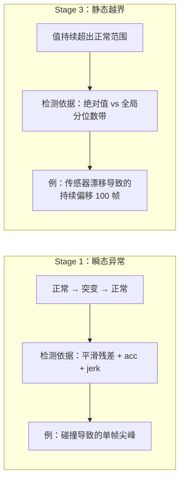

| 维度 | Stage 1（突变检测） | Stage 3（极值过滤） |
|------|-------------------|-------------------|
| 信号特征 | **快速瞬态**：值突然跳变后恢复 | **静态越界**：值持续超出正常范围 |
| 检测依据 | 平滑后的**导数**信息（残差/acc/jerk） | **绝对值**是否在全局分位数带内 |
| 参考基线 | 当前 episode 自身的平滑趋势 | **全局**（同机型跨 episode）的分位数 |
| 典型场景 | 碰撞尖峰、通信丢包、突然震动 | 传感器故障、校准错误、坐标系配置错误 |
| 失效互补 | Stage 1 检测不到"一直偏的值" | Stage 3 检测不到"在正常范围内的突变" |

这正是论文设计五阶段级联的原因——每个阶段针对不同**故障模式**，互为补充。

### 2.4 夹爪双峰分布：为什么要豁免

夹爪（gripper）与关节角/末端执行器位置有本质区别。大多数机器人的夹爪只有两个状态：**完全张开**和**完全闭合**（或接近）。即使是可变开合度的精细夹爪，数据中的分布也呈现强烈的**双峰**特征：

```
频率 │
     │ █                               █
     │ █                               █
     │ ██                             ██
     │ ███                           ███
     │ ████                         ████
     │ ███████                   ███████
     │ ████████                 ████████
     ├──────────────────────────────────── 值
     0.0                              1.0
     (闭合)                          (张开)
```

在这种双峰分布中：
- $q_{01}$ 接近 0.0（闭合值），$q_{99}$ 接近 1.0（张开值）
- IQR = $q_{99} - q_{01} \approx 1.0$
- 容许带 = $[-0.1, 1.1]$（$\alpha = 0.1$ 时）

看似合理，但问题在于：如果某个数据集中夹爪只有"闭合"动作（例如只做抓取，不做放置），则 $q_{01} \approx q_{99} \approx 0.0$，IQR ≈ 0，**所有张开帧都会被标记为极值**。这是分位数方法在双峰分布上的根本缺陷——分位数假设数据呈单峰或近似连续分布。

因此论文明确规定**夹爪维度豁免**——这不是可选优化，而是正确性保障。

---

## 3. 论文方法形式化

### 3.1 逐体型聚合（per-embodiment grouping）

设数据集包含 $E$ 个 episode，每个 episode $e$ 隶属于某个体型类型 $r(e) \in \mathcal{R}$（例如 `franka_panda`, `ur5e`, `galaxea_r1_lite`）。体型类型由机器人型号决定，**跨数据集分割共享**——即 train/val/test 中属于同一机器人的 episode 归入同一组：

$$
\mathcal{E}_r = \{e \mid r(e) = r\}, \qquad r \in \mathcal{R}
$$

### 3.2 逐维分位数计算

对于体型 $r$，将所有 episode 的 state 帧和 action 帧在**时间轴上拼接**（不区分 episode 边界），对每个维度 $d$ 独立计算 1% 和 99% 分位数：

$$
q^{(r,d)}_{01} = \operatorname{Percentile}_{1}\!\left(\bigcup_{e \in \mathcal{E}_r} \{x^{(e)}_{t,d}\}_{t=1}^{T_e}\right), \qquad
q^{(r,d)}_{99} = \operatorname{Percentile}_{99}\!\left(\bigcup_{e \in \mathcal{E}_r} \{x^{(e)}_{t,d}\}_{t=1}^{T_e}\right)
$$

其中 $x^{(e)}_{t,d}$ 涵盖 state 和 action 两个通道的所有维度。实际实现中，state（如 56 维）和 action（如 50 维）分别计算：

$$
q^{(r,d)}_{\text{state},01},\; q^{(r,d)}_{\text{state},99} \quad \text{和} \quad q^{(r,d)}_{\text{action},01},\; q^{(r,d)}_{\text{action},99}
$$

### 3.3 alpha-扩展带计算

IQR（此处使用 $q_{01}$–$q_{99}$ 而非传统的 $q_{25}$–$q_{75}$）：

$$
\text{IQR}_d = q^{(r,d)}_{99} - q^{(r,d)}_{01}
$$

排除带的下界和上界：

$$
L_d = q^{(r,d)}_{01} - \alpha \cdot \text{IQR}_d, \qquad
U_d = q^{(r,d)}_{99} + \alpha \cdot \text{IQR}_d
$$

其中 $\alpha \geq 0$ 是容差裕度参数。当 $\alpha = 0$ 时，排除带退化为 $[q_{01}, q_{99}]$——任何超出 1–99 百分位的帧都被排除，这太激进了；$\alpha = 0.1$ 意味着在每侧额外留出 10% 的 IQR 宽度作为缓冲。

### 3.4 帧级判定规则

对于 episode $e$（体型为 $r(e)$）的第 $t$ 帧：

**state 通道判定：**

$$
\text{flagState}_{t,d} = \mathbb{1}\!\left[s^{(e)}_{t,d} < L^{(\text{state})}_d \;\lor\; s^{(e)}_{t,d} > U^{(\text{state})}_d\right], \qquad d \in \mathcal{D}^{(\text{state})}_{\text{check}}
$$

**action 通道判定：**

$$
\text{flagAction}_{t,d} = \mathbb{1}\!\left[a^{(e)}_{t,d} < L^{(\text{action})}_d \;\lor\; a^{(e)}_{t,d} > U^{(\text{action})}_d\right], \qquad d \in \mathcal{D}^{(\text{action})}_{\text{check}}
$$

**帧级综合判定（any-dim-out → exclude）：**

$$
\text{exclude}_{t} = \bigvee_{d \in \mathcal{D}^{(\text{state})}_{\text{check}}} \text{flagState}_{t,d} \;\lor\; \bigvee_{d \in \mathcal{D}^{(\text{action})}_{\text{check}}} \text{flagAction}_{t,d}
$$

即**任何一个非豁免维度的 state 或 action 值越带，该帧即被排除**。这是一个保守的策略——宁可多删也不让有问题的帧进入训练。

### 3.5 夹爪维豁免

设夹爪维度集合为 $\mathcal{D}_{\text{gripper}} \subset \{0, 1, \ldots, D-1\}$，则：

$$
\mathcal{D}_{\text{check}} = \{0, 1, \ldots, D-1\} \setminus \mathcal{D}_{\text{gripper}}
$$

在 LeRobot v2.1 格式的 Galaxea R1 数据中，典型的维度排布为：

| 维度范围 | 含义 | 参与 Stage 3 检查 |
|---------|------|------------------|
| state[0:7] | 左臂 7 个关节角 | ✅ |
| state[7] | 左手夹爪 | ❌（豁免） |
| state[8:15] | 右臂 7 个关节角 | ✅ |
| state[15] | 右手夹爪 | ❌（豁免） |
| state[16:22] | 左手 EEF 位姿 (xyz+rpy) | ✅ |
| state[22:28] | 右手 EEF 位姿 | ✅ |
| ... | ... | ... |

具体的 `exempt_dims` 取决于数据集的维度排布，需要根据元数据或文档配置。

### 3.6 数值例子

以 Galaxea R1 Lite 的某个关节维度 $d=3$（左臂第 4 关节）为例：

假设聚合 1000 个 episode 的全部帧后：
- $q_{01}^{(3)} = -1.2$ rad
- $q_{99}^{(3)} = 2.1$ rad
- $\text{IQR}_3 = 2.1 - (-1.2) = 3.3$ rad
- $\alpha = 0.1$

排除带：
- $L_3 = -1.2 - 0.1 \times 3.3 = -1.53$ rad
- $U_3 = 2.1 + 0.1 \times 3.3 = 2.43$ rad

判定：
- 帧 $t=42$: $s_{42,3} = 1.8$ → $-1.53 \leq 1.8 \leq 2.43$ → ✅ 保留
- 帧 $t=107$: $s_{107,3} = 5.2$ → $5.2 > 2.43$ → ❌ 排除（超出上界）
- 帧 $t=200$: $s_{200,3} = -1.5$ → $-1.53 \leq -1.5 \leq 2.43$ → ✅ 保留（在容许边界内）
- 帧 $t=201$: $s_{201,3} = -1.6$ → $-1.6 < -1.53$ → ❌ 排除

注意帧 $t=200$ 恰好在 $q_{01}$ 以下但在排除带内——这正是 $\alpha$ 容差的作用：允许接近边界的正常变化。

---

## 4. 关键概念深入浅出

### 4.1 分位数 vs 均值/标准差：为何选分位数而非 z-score

经典的异常值检测方法是 z-score：$z = (x - \mu) / \sigma$，当 $|z| > k$ 时标记为异常。这在数据近似正态分布时效果很好，但机器人轨迹数据**几乎不满足正态假设**：

| 特征 | 正态分布假设 | 机器人轨迹实际 |
|------|-------------|--------------|
| 对称性 | 对称钟形 | 通常不对称（关节有物理限位） |
| 尾部 | 指数衰减 | 可能有重尾（传感器噪声）或截断（限位） |
| 极值影响 | $\mu, \sigma$ 都受极值拉扯 | 极值使 $\sigma$ 膨胀 → 阈值放松 → 漏报 |
| 多模态 | 单峰 | 夹爪双峰，某些关节多工况多峰 |

分位数方法的优势：
- **不假设分布形状**：$q_{01}, q_{99}$ 只依赖排序，不假设正态/对称
- **对极值鲁棒**：$q_{01}$ 定义为"排除最小 1% 后的最小值"，一帧极端值对其无影响
- **直接对应归一化**：训练归一化用 $[q_{01}, q_{99}]$，过滤也用 $[q_{01}, q_{99}]$——逻辑自洽

### 4.2 IQR 与 alpha 的几何含义

传统箱线图使用 $\text{IQR}_{25-75} = q_{75} - q_{25}$，常用 $1.5 \times \text{IQR}$ 定义"远异常值"。论文的变体使用 $q_{01}$–$q_{99}$ 作为"范围"定义，$\alpha$ 作为扩展系数。

几何直觉——想象一根数轴：

```
        排除区             容许带                 排除区
  ──────┤─────────────────────────────────┤──────
       L_d               [q01, q99]              U_d
        ↑                                         ↑
   q01 - α·IQR                            q99 + α·IQR
```

$\alpha$ 的作用是在 $[q_{01}, q_{99}]$ 两端各增加一段**缓冲区**，宽度为 $\alpha \times \text{IQR}$。这意味着：

- 当 IQR 大（数据散布宽）时，缓冲区也宽——对波动大的维度更宽容
- 当 IQR 小（数据集中）时，缓冲区也窄——对紧凑的维度更严格
- 这种**自适应带宽**是 IQR 方法相比固定阈值的核心优势

**alpha 取值的直觉**：

| $\alpha$ | 缓冲宽度（占 IQR 比例） | 效果 |
|----------|----------------------|------|
| 0.0 | 0% | 最严格：超出 $[q_{01}, q_{99}]$ 即排除 |
| 0.05 | 5% | 严格：几乎只容许 1%–99% 内的值 |
| **0.1** | **10%** | **论文默认：适度宽容** |
| 0.5 | 50% | 宽容：只排除极端的极端值 |
| 1.5 | 150% | 等效传统箱线图的远异常值定义（但基于 q01/q99） |

### 4.3 夹爪双峰分布深入

为什么夹爪不能用分位数过滤？让我们看一个具体场景：

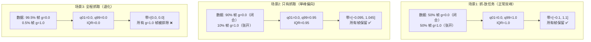

场景 3 展示了核心问题：当夹爪几乎总是闭合时，$q_{01} = q_{99} = 0.0$，IQR = 0，**任何非零值都被标记为极值**。但夹爪值 1.0 是完全正常的物理状态——它只是稀少而已。**稀少 ≠ 异常**，这正是双峰分布不适合分位数过滤的根本原因。

### 4.4 帧级 vs episode 级过滤的取舍

Stage 3 采用**帧级**排除而非 episode 级丢弃，这与 Stage 1/2 的 episode 级判定形成对比。原因：

| 对比维度 | 帧级排除（Stage 3） | episode 级丢弃（Stage 1/2 默认） |
|---------|---------------------|-------------------------------|
| 数据利用效率 | 高——只丢弃有问题的帧 | 低——一帧有问题则全段丢弃 |
| 适用场景 | 极值帧通常是**孤立的** | 突变/对齐问题通常影响**整段** |
| 时间连续性 | 裁帧后可能出现时间跳变 | 保持完整轨迹结构 |
| 实现复杂度 | 需要处理裁帧后的轨迹重组 | 简单的布尔过滤 |

论文选择帧级排除是合理的：一个传感器偶尔记录错误值（如溢出、位翻转），只影响个别帧；丢弃整段 episode 太浪费。但在我们的实现中，同时支持三种策略（`frame_mask`、`frame_remove`、`episode_discard`），由用户根据场景选择。

### 4.5 两趟工作流的必要性

**核心问题**：Stage 3 需要**跨 episode 的全局统计量**（同机型所有 episode 的 per-dim $q_1/q_{99}$），但 data-juicer 的 Filter 架构是 **sample-by-sample** 的——`compute_stats_single(sample)` 只接收一个 sample，无法访问其他 sample。

这与 Stage 1/2 有本质区别：

| | Stage 1 / Stage 2 | Stage 3 |
|---|---|---|
| 需要的参考基线 | 当前 episode 自身 | 同机型**所有** episode |
| 在 `compute_stats_single` 内能算？ | ✅ 可以——只看自己 | ❌ 不行——看不到别人 |

DJ 的 `Analyzer` 类虽然能做全局分位数统计，但它设计用于**标量 stats 字段**（即 Filter 已写入 `__dj__stats__` 的值），而 Stage 3 需要的是对**高维向量的逐维分位数**——这超出了 `Analyzer` 的设计范围。

因此采用**两趟工作流**：

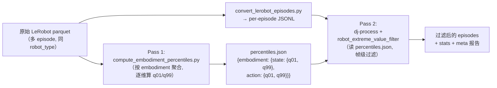

这种"先预计算全局统计 → 再逐样本过滤"的模式在数据处理领域非常常见（如 TF-IDF 的 IDF 预计算、BPE 词表的预构建），也正是参考实现 `clean_stage123.py` 中读 `dataset_stats.json` 的同构设计。

---

## 5. 参考实现与 DJ 已有近似功能解读

### 5.1 参考实现模式

根据论文注释详版和 `data_impl.md` 中的分析，Stage 3 的参考实现（`clean_stage123.py` 的 `stage3_flag_frames`）遵循如下模式：

```python
# 伪代码：参考实现的 Stage 3 逻辑
def stage3_flag_frames(episode, dataset_stats, alpha=0.1, exempt_dims=None):
    """逐帧检查 state/action 是否在全局分位数带内"""
    robot_type = episode['robot_type']
    stats = dataset_stats[robot_type]  # 预计算的 per-dim q01/q99

    state_q01 = stats['state']['q01']   # shape: (D_state,)
    state_q99 = stats['state']['q99']
    action_q01 = stats['action']['q01']  # shape: (D_action,)
    action_q99 = stats['action']['q99']

    state_iqr = state_q99 - state_q01
    action_iqr = action_q99 - action_q01

    state_lo = state_q01 - alpha * state_iqr
    state_hi = state_q99 + alpha * state_iqr
    action_lo = action_q01 - alpha * action_iqr
    action_hi = action_q99 + alpha * action_iqr

    # 豁免夹爪维
    check_state_dims = [d for d in range(D_state) if d not in exempt_dims]
    check_action_dims = [d for d in range(D_action) if d not in exempt_dims]

    states = episode['states']   # (T, D_state)
    actions = episode['actions']  # (T, D_action)

    # 逐帧判定
    flag_mask = np.zeros(T, dtype=bool)
    for d in check_state_dims:
        flag_mask |= (states[:, d] < state_lo[d]) | (states[:, d] > state_hi[d])
    for d in check_action_dims:
        flag_mask |= (actions[:, d] < action_lo[d]) | (actions[:, d] > action_hi[d])

    return flag_mask  # True = 该帧应被排除
```

关键特征：
- 使用预计算的全局分位数（来自 `dataset_stats.json`），不在过滤时重新计算
- **向量化操作**：逐维比较可以用 numpy 广播一次完成
- **任一维越带即排除**（OR 逻辑）
- 夹爪维度在循环中直接跳过

### 5.2 DJ 已有近似功能

`data_impl.md` §5.3 将 Stage 3 评为 🔵（组合实现），理由是 DJ 的 `Analyzer` + `specified_numeric_field_filter` 在**标量字段**上已能完成"分位数 → 过滤"两步法。让我们逐一审视：

| DJ 已有组件 | 能做什么 | Stage 3 需要什么 | 差距 |
|------------|---------|-----------------|------|
| `OverallAnalysis.describe(percentiles=[0.01, 0.99])` | 对 `__dj__stats__` 中的标量字段算分位数 | 对高维向量（56 维 state, 50 维 action）**逐维**算分位数 | 不支持向量字段 |
| `specified_numeric_field_filter` | 对标量字段做 `[min, max]` 区间判定 | 对高维向量**逐维逐帧**做区间判定，任一维越带即排除 | 不支持向量字段、不支持帧级 |
| `range_specified_field_selector` | 按百分位区间选择样本 | 帧级选择，不是样本级 | 不支持帧级 |
| `get_keep_boolean` + `reversed_range` | 支持"保留区间外"的反转逻辑 | 基本逻辑可复用，但需要包装 | 底层工具可用 |

**结论**：DJ 的已有组件在**标量、样本级**的分位数过滤上确实优雅，但 Stage 3 需要的是**高维向量、帧级**的过滤，这超出了现有组件的设计范围。因此需要**自定义 Filter**。

### 5.3 为何不能简单组合

一种看似可行的"组合方案"：
1. 用 Mapper 把每帧的每个维度拆成独立的标量 stats
2. 用 `Analyzer` 算分位数
3. 用 `specified_numeric_field_filter` 逐维过滤

这种方案的问题：
- 一个 56 维的 state 向量会产生 56 个 stats 字段——**stats 爆炸**
- 无法实现"任一维越带即排除整帧"的 OR 逻辑——每个 filter 独立运行，是 AND 语义（每个都通过才保留）
- 帧级操作无法在 DJ 的 episode 级 Filter 中原生表达
- 预计算全局分位数需要额外编排，DJ 的 recipe 不直接支持

因此，**自定义 Filter 是最简洁、最可靠的方案**。

---

## 6. data-juicer 能力映射与选型

### 6.1 DJ Filter 两阶段架构如何适配 Stage 3

回顾 DJ Filter 的运行流程（`base_op.py` L832-846）：

```python
def run(self, dataset, *, exporter=None, tracer=None, reduce=True):
    dataset = super(Filter, self).run(dataset)
    # Phase 1: map — 对每个 sample 计算统计量
    new_dataset = dataset.map(
        self.compute_stats,       # → compute_stats_single(sample)
        num_proc=self.runtime_np(),
        ...
    )
    # （可选）导出 stats
    if exporter and self.stats_export_path is not None:
        exporter.export_compute_stats(new_dataset, self.stats_export_path)
    # Phase 2: filter — 对每个 sample 做布尔判定
    if reduce:
        new_dataset = new_dataset.filter(self.process, ...)
    return new_dataset
```

Stage 3 的映射：

| DJ Filter 阶段 | Stage 3 的操作 |
|----------------|---------------|
| `compute_stats_single(sample)` | 读取 sample 的 state/action 向量 → 加载预计算分位数 → 逐帧逐维判定 → 写入 stats（flagged_ratio 等标量）+ meta（报告 + 帧掩码） |
| `process_single(sample)` | 根据 stats 中的 `extreme_value_keep` 决定是否保留 episode；或根据 `exclusion_strategy` 执行帧级操作 |

**关键设计点**：帧级操作（裁帧、掩码）发生在 `compute_stats_single` 中（通过修改 sample 的 `states`/`actions` 字段和写入 `valid_frame_mask`），而不是在 `process_single` 中。`process_single` 只负责 episode 级的 keep/discard 判定。这与 Stage 1 的 `robot_sudden_change_filter` 采用相同的设计模式。

### 6.2 percentile_source 三模式设计

为了兼顾不同使用场景，算子支持三种分位数来源：

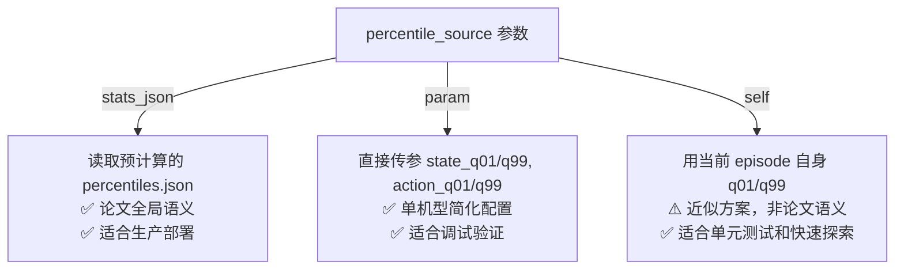

| 模式 | 来源 | 论文忠实度 | 适用场景 |
|------|------|-----------|---------|
| `stats_json`（默认） | `percentile_stats_path` 指向的 JSON 文件 | ⭐⭐⭐ 完全一致 | 生产部署：先跑预计算脚本，再跑 dj-process |
| `param` | 构造函数参数 `state_q01/q99`, `action_q01/q99` | ⭐⭐ 单机型等价 | 调试/已知机型：直接在 YAML 中写死分位数 |
| `self` | 当前 episode 的 `np.percentile(states, [1, 99], axis=0)` | ⭐ 近似 | 单元测试、快速探索：不需要预计算步骤 |

### 6.3 与 Stage 1/2 算子的工程一致性

为降低认知成本和维护成本，Stage 3 算子复用 Stage 1/2 已沉淀的工程约定：

| 约定 | 来源 | Stage 3 复用方式 |
|------|------|----------------|
| `signal_source` 参数 | Stage 1 | 相同的三值选择（`top_level`/`hand_action_tags`/`meta_field`），但新增 `embodiment_field` |
| `exclusion_strategy` 参数 | Stage 1 | 相同的三策略（`frame_mask`/`frame_remove`/`episode_discard`） |
| `valid_frame_mask` meta 字段 | Stage 1 | 相同字段名，便于下游组合使用 |
| JSON 字符串 meta 报告 | Stage 1/2 | 相同的 `json.dumps()` 序列化模式，避免 Arrow schema 冲突 |
| `stats_export_path` | DJ 框架 | 标准 Filter 参数，自动导出累积 stats |
| `check_dims` / `exempt_dims` | Stage 1 | 相同的维度选择机制 |

---

## 7. 静态架构

### 7.1 组件图

Stage 3 的完整落地涉及三个组件：预计算脚本、Filter 算子、预计算结果文件。它们与 DJ 框架和 Stage 1/2 算子的关系如下：

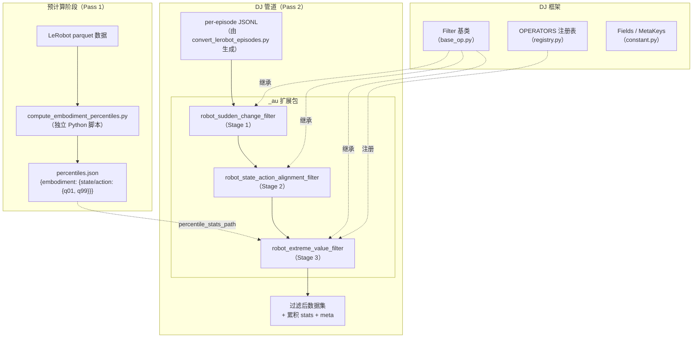

### 7.2 类图

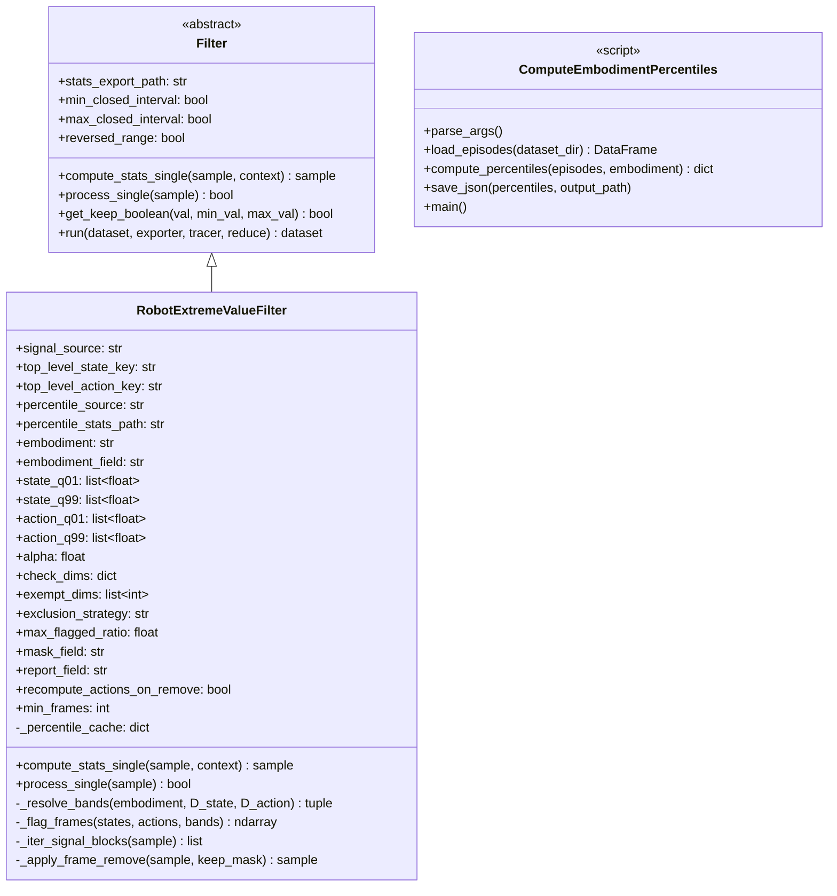

### 7.3 职责表

| 方法 | 输入 | 输出 | 职责 |
|------|------|------|------|
| `__init__` | 构造参数 | — | 参数校验；初始化缓存 |
| `_resolve_bands(embodiment, D_state, D_action)` | 体型名, state/action 维数 | `(state_lo, state_hi, action_lo, action_hi)` 四个 ndarray | 根据 `percentile_source` 加载/计算分位数，应用 alpha 扩展，缓存结果 |
| `_flag_frames(states, actions, bands)` | state 矩阵 (T,D_s), action 矩阵 (T,D_a), bands 四元组 | `flag_mask` (T,) bool | 逐帧逐维检查越带，返回帧级标记 |
| `_iter_signal_blocks(sample)` | sample dict | `[(name, states_array, actions_array), ...]` | 根据 `signal_source` 提取信号块（适配不同数据格式） |
| `_apply_frame_remove(sample, keep_mask)` | sample, 保留帧掩码 | 修改后的 sample | 裁剪 states/actions，可选重算 delta actions |
| `compute_stats_single(sample)` | sample | sample（带 stats + meta） | 主流程：提取信号 → 解析带 → 标记帧 → 写 stats/meta → 可选裁帧 |
| `process_single(sample)` | sample | bool | 根据 `exclusion_strategy` 和 `extreme_value_keep` 返回 keep/discard |

### 7.4 参数分组表

**信号来源参数：**

| 参数 | 类型 | 默认值 | 说明 |
|------|------|--------|------|
| `signal_source` | str | `'top_level'` | 信号来源模式：`top_level`/`hand_action_tags`/`meta_field` |
| `top_level_state_key` | str | `'states'` | `top_level` 模式时 sample 中 state 的键名 |
| `top_level_action_key` | str | `'actions'` | `top_level` 模式时 sample 中 action 的键名 |
| `hand_action_field` | str | `MetaKeys.hand_action_tags` | `hand_action_tags` 模式时 meta 字段名 |
| `meta_signal_field` | str | `None` | `meta_field` 模式时的信号字段名 |

**分位数来源参数：**

| 参数 | 类型 | 默认值 | 说明 |
|------|------|--------|------|
| `percentile_source` | str | `'stats_json'` | 分位数来源：`stats_json`/`param`/`self` |
| `percentile_stats_path` | str | `None` | `stats_json` 模式时 JSON 文件路径 |
| `embodiment` | str | `None` | `stats_json` 模式时的体型名（若 None 则从 sample 推断） |
| `embodiment_field` | str | `'robot_type'` | 从 sample 中读取体型名的字段 |
| `state_q01` / `state_q99` | list[float] | `None` | `param` 模式时直接传入的分位数向量 |
| `action_q01` / `action_q99` | list[float] | `None` | `param` 模式时直接传入的分位数向量 |

**过滤参数：**

| 参数 | 类型 | 默认值 | 说明 |
|------|------|--------|------|
| `alpha` | float | `0.1` | 排除带扩展系数 |
| `check_dims` | dict | `None` | `{"include": [...]}` 或 `{"exclude": [...]}` |
| `exempt_dims` | list[int] | `None` | 豁免的维度索引（典型为夹爪维） |
| `min_frames` | int | `4` | 低于此帧数的 episode 直接跳过 |

**排除策略参数：**

| 参数 | 类型 | 默认值 | 说明 |
|------|------|--------|------|
| `exclusion_strategy` | str | `'frame_mask'` | `frame_mask`/`frame_remove`/`episode_discard` |
| `max_flagged_ratio` | float | `0.3` | `episode_discard` 时的最大容许异常帧比例 |
| `mask_field` | str | `'valid_frame_mask'` | `frame_mask` 时写入 meta 的字段名 |
| `report_field` | str | `'extreme_value_report'` | meta 报告的字段名 |
| `recompute_actions_on_remove` | bool | `False` | `frame_remove` 时是否重算 delta actions |

### 7.5 Stats 键与 Meta 报告字段

**Stats 键（标量，写入 `__dj__stats__`）：**

| 键名 | 类型 | 含义 |
|------|------|------|
| `extreme_value_keep` | bool | 该 episode 是否应保留（综合 exclusion_strategy 判定） |
| `extreme_value_flagged_frames` | int | 被标记的帧数 |
| `extreme_value_flagged_ratio` | float | 被标记帧数 / 总帧数 |
| `extreme_value_num_check_dims` | int | 参与检查的维度数（state + action，去除豁免维） |
| `extreme_value_num_frames` | int | episode 总帧数 |

**与 Stage 1/2 的键冲突检查：**

| 前缀 | Stage | 键数 | 冲突 |
|------|-------|------|------|
| `sudden_change_*` | Stage 1 | 7 | — |
| `state_action_*` | Stage 2 | 6 | — |
| `extreme_value_*` | **Stage 3** | **5** | **无冲突** ✅ |

总计 18 个 stats 键，前缀完全正交。

**Meta 报告字段（写入 `__dj__meta__`）：**

| 字段名 | 类型 | 含义 |
|--------|------|------|
| `extreme_value_report` | str (JSON) | 详细报告：逐维越界计数、band lo/hi、embodiment、strategy、flagged 帧索引 |
| `valid_frame_mask` | str (JSON) | 帧级有效性掩码（与 Stage 1 共享字段名） |

`valid_frame_mask` 与 Stage 1 的 `robot_sudden_change_filter` 使用相同字段名。当两者级联使用时，Stage 3 的掩码会**与**（AND）Stage 1 的掩码合并——即两个阶段任一标记为无效的帧都被标记为无效。

---

## 8. 动态架构

### 8.1 两趟工作流全景图

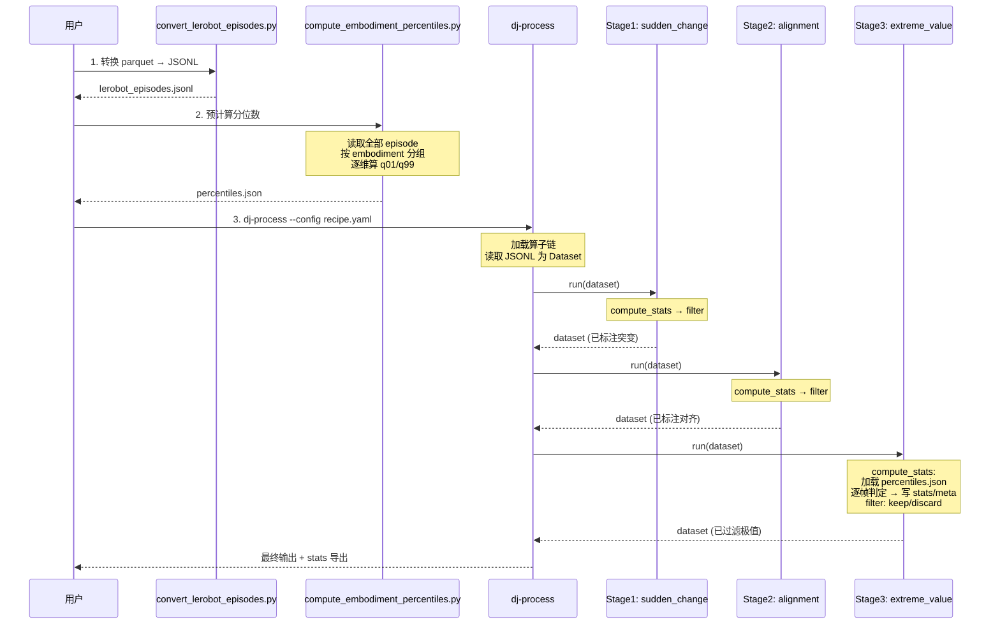

### 8.2 compute_stats_single 序列图

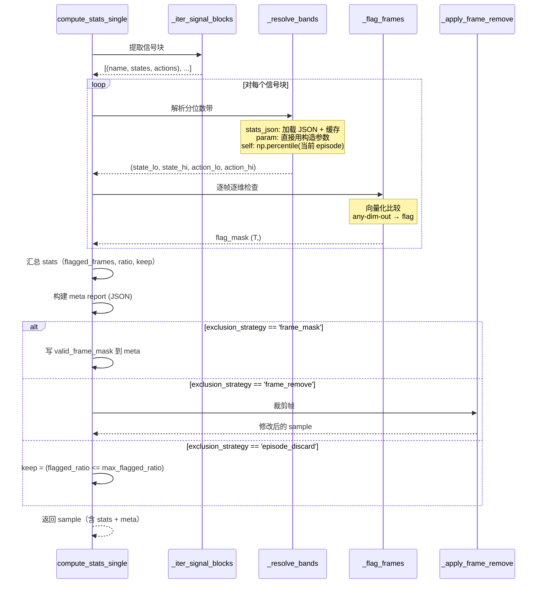

### 8.3 帧级判定数据流图

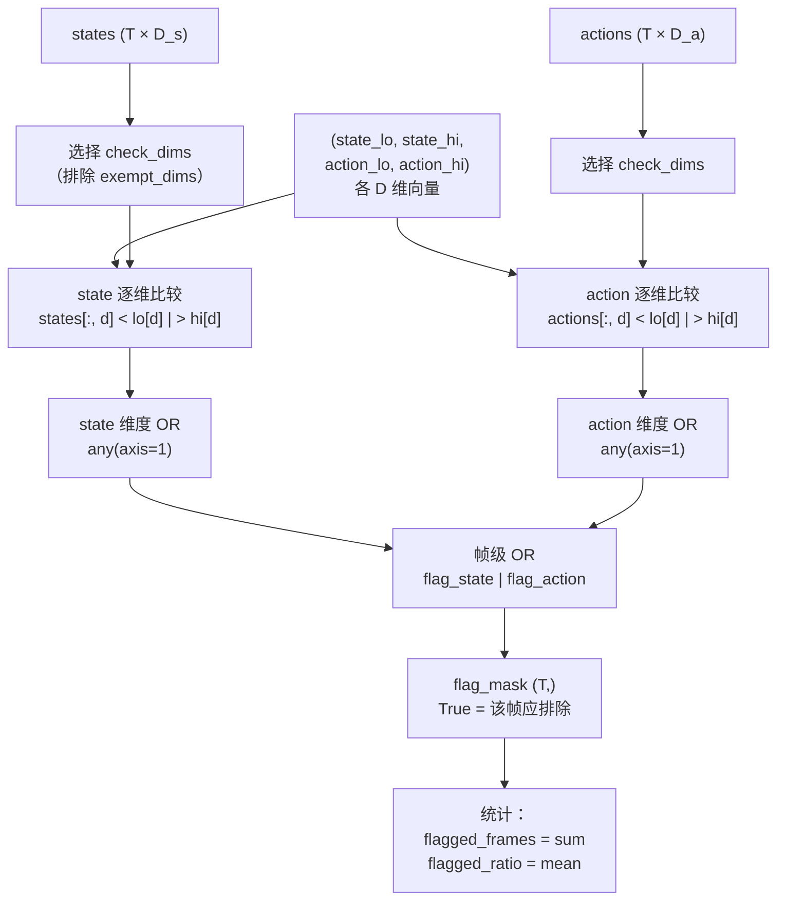

### 8.4 与 Stage 1/2 级联时的场景协调图

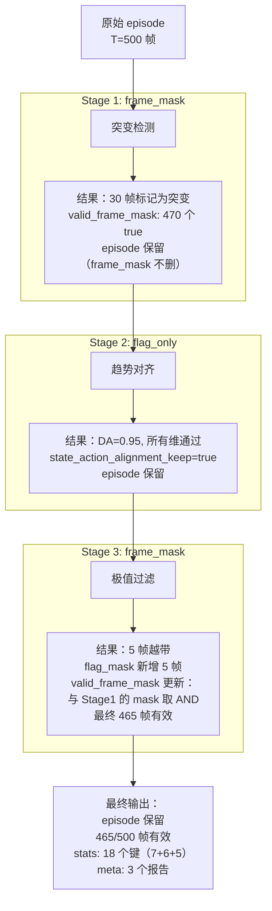

### 8.5 三种 percentile_source 的数据流对比

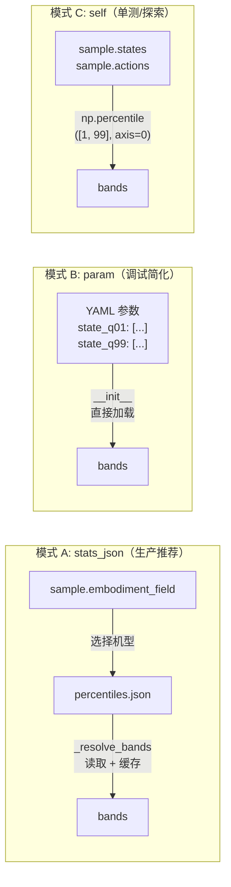

---

## 9. 关键逻辑代码解读

### 9.1 `_resolve_bands()`：分位数加载与 alpha 扩展

```python
def _resolve_bands(self, sample, D_state, D_action):
    """根据 percentile_source 加载分位数并计算排除带。

    返回 (state_lo, state_hi, action_lo, action_hi)，每个 shape=(D,)
    """
    if self.percentile_source == 'stats_json':
        # 确定 embodiment
        emb = self.embodiment
        if emb is None:
            emb = sample.get(self.embodiment_field, 'default')

        # 查缓存
        if emb in self._percentile_cache:
            return self._percentile_cache[emb]

        # 加载 JSON
        with open(self.percentile_stats_path) as f:
            all_stats = json.load(f)
        if emb not in all_stats:
            logger.warning(f"Embodiment '{emb}' not in percentiles file, "
                           f"using 'default' or skipping.")
            # fallback 逻辑...

        stats = all_stats[emb]
        state_q01 = np.array(stats['state']['q01'])
        state_q99 = np.array(stats['state']['q99'])
        action_q01 = np.array(stats['action']['q01'])
        action_q99 = np.array(stats['action']['q99'])

    elif self.percentile_source == 'param':
        state_q01 = np.array(self.state_q01)
        state_q99 = np.array(self.state_q99)
        action_q01 = np.array(self.action_q01)
        action_q99 = np.array(self.action_q99)

    elif self.percentile_source == 'self':
        states = np.array(sample[self.top_level_state_key])
        actions = np.array(sample[self.top_level_action_key])
        state_q01 = np.percentile(states, 1, axis=0)
        state_q99 = np.percentile(states, 99, axis=0)
        action_q01 = np.percentile(actions, 1, axis=0)
        action_q99 = np.percentile(actions, 99, axis=0)

    # 计算 alpha 扩展带
    state_iqr = state_q99 - state_q01
    action_iqr = action_q99 - action_q01

    state_lo = state_q01 - self.alpha * state_iqr
    state_hi = state_q99 + self.alpha * state_iqr
    action_lo = action_q01 - self.alpha * action_iqr
    action_hi = action_q99 + self.alpha * action_iqr

    bands = (state_lo, state_hi, action_lo, action_hi)

    # 缓存（stats_json 和 param 模式的分位数不随 sample 变化）
    if self.percentile_source != 'self':
        cache_key = emb if self.percentile_source == 'stats_json' else '__param__'
        self._percentile_cache[cache_key] = bands

    return bands
```

**设计要点**：
- `stats_json` 模式支持**多机型**：JSON 文件包含多个 embodiment 的分位数，根据 sample 的 `embodiment_field` 动态选择
- **缓存机制**：分位数加载是 I/O 操作，第一个 sample 加载后缓存，后续 sample 直接使用
- `self` 模式**不缓存**——每个 episode 的分位数都不同
- IQR 为 0 的维度，`state_lo = state_hi = q01 = q99`，任何偏离都会被标记——这正是夹爪维需要豁免的原因

### 9.2 `_flag_frames()`：逐帧逐维检测

```python
def _flag_frames(self, states, actions, bands):
    """向量化的帧级极值检测。

    states: ndarray (T, D_state)
    actions: ndarray (T, D_action)
    bands: (state_lo, state_hi, action_lo, action_hi)

    返回 flag_mask: ndarray (T,) bool，True = 该帧应排除
    """
    state_lo, state_hi, action_lo, action_hi = bands
    T = states.shape[0]

    # 确定参与检查的维度
    state_check = self._get_check_dims(states.shape[1], 'state')
    action_check = self._get_check_dims(actions.shape[1], 'action')

    flag_mask = np.zeros(T, dtype=bool)

    # state 通道——向量化：利用 numpy 广播
    if len(state_check) > 0:
        s = states[:, state_check]           # (T, D_check)
        lo = state_lo[state_check]           # (D_check,)
        hi = state_hi[state_check]           # (D_check,)
        out_of_band = (s < lo) | (s > hi)    # (T, D_check)
        flag_mask |= out_of_band.any(axis=1) # (T,) — 任一维越带

    # action 通道——同理
    if len(action_check) > 0:
        a = actions[:, action_check]
        lo = action_lo[action_check]
        hi = action_hi[action_check]
        out_of_band = (a < lo) | (a > hi)
        flag_mask |= out_of_band.any(axis=1)

    return flag_mask
```

**性能考量**：
- 全程使用 numpy 广播，无 Python 循环——对 500 帧 × 56 维的 episode，开销在微秒级
- `any(axis=1)` 将 (T, D) 的布尔矩阵压缩为 (T,) 向量——这就是"任一维越带即排除"的实现
- 豁免维度在 `_get_check_dims` 中过滤，不参与比较

### 9.3 `compute_stats_single()`：主流程

```python
def compute_stats_single(self, sample, context=False):
    # 初始化 stats
    if Fields.stats not in sample or sample[Fields.stats] is None:
        sample[Fields.stats] = {}

    # 提取信号
    blocks = self._iter_signal_blocks(sample)
    if not blocks:
        # 无信号 → 默认保留
        sample[Fields.stats]['extreme_value_keep'] = True
        sample[Fields.stats]['extreme_value_flagged_frames'] = 0
        sample[Fields.stats]['extreme_value_flagged_ratio'] = 0.0
        sample[Fields.stats]['extreme_value_num_check_dims'] = 0
        sample[Fields.stats]['extreme_value_num_frames'] = 0
        return sample

    # 目前只处理第一个信号块（top_level 模式下只有一个）
    name, states, actions = blocks[0]
    states = np.array(states, dtype=np.float64)
    actions = np.array(actions, dtype=np.float64)
    T = states.shape[0]

    if T < self.min_frames:
        # 帧数过少 → 跳过检测，默认保留
        sample[Fields.stats]['extreme_value_keep'] = True
        # ... 其余 stats
        return sample

    # 解析分位数带
    bands = self._resolve_bands(sample, states.shape[1], actions.shape[1])

    # 帧级判定
    flag_mask = self._flag_frames(states, actions, bands)

    flagged_frames = int(flag_mask.sum())
    flagged_ratio = flagged_frames / T
    num_check_dims = (len(self._get_check_dims(states.shape[1], 'state'))
                      + len(self._get_check_dims(actions.shape[1], 'action')))

    # 写 stats
    sample[Fields.stats]['extreme_value_flagged_frames'] = flagged_frames
    sample[Fields.stats]['extreme_value_flagged_ratio'] = flagged_ratio
    sample[Fields.stats]['extreme_value_num_check_dims'] = num_check_dims
    sample[Fields.stats]['extreme_value_num_frames'] = T

    # 构建 meta report
    report = {
        'embodiment': sample.get(self.embodiment_field, 'unknown'),
        'strategy': self.exclusion_strategy,
        'alpha': self.alpha,
        'flagged_frames': flagged_frames,
        'flagged_ratio': round(flagged_ratio, 4),
        'total_frames': T,
        'num_check_dims': num_check_dims,
    }

    if Fields.meta not in sample or sample[Fields.meta] is None:
        sample[Fields.meta] = {}
    sample[Fields.meta][self.report_field] = json.dumps(report)

    # 根据策略执行
    if self.exclusion_strategy == 'frame_mask':
        keep_mask = ~flag_mask
        # 如果已有 Stage 1 的 mask，取 AND
        existing_mask = sample[Fields.meta].get(self.mask_field)
        if existing_mask is not None:
            prev_mask = np.array(json.loads(existing_mask), dtype=bool)
            if len(prev_mask) == T:
                keep_mask = keep_mask & prev_mask
        sample[Fields.meta][self.mask_field] = json.dumps(keep_mask.tolist())
        sample[Fields.stats]['extreme_value_keep'] = True  # frame_mask 不丢弃 episode

    elif self.exclusion_strategy == 'frame_remove':
        keep_mask = ~flag_mask
        if keep_mask.sum() >= self.min_frames:
            sample = self._apply_frame_remove(sample, keep_mask)
            sample[Fields.stats]['extreme_value_keep'] = True
        else:
            sample[Fields.stats]['extreme_value_keep'] = False

    elif self.exclusion_strategy == 'episode_discard':
        sample[Fields.stats]['extreme_value_keep'] = (
            flagged_ratio <= self.max_flagged_ratio
        )

    return sample
```

**关键设计细节**：
1. **`valid_frame_mask` 的 AND 合并**：当 Stage 1 已写入 `valid_frame_mask` 时，Stage 3 的掩码与之取 AND——两个阶段标记的无效帧都会被标记为无效
2. **`frame_remove` 的最小帧数保护**：裁帧后如果剩余帧数低于 `min_frames`，整个 episode 被标记为不保留——避免产生过短的训练片段
3. **stats 键始终写入**：无论是否有异常帧，5 个 stats 键都会写入，保证下游工具（Analyzer、stats 导出）的 schema 一致性

### 9.4 `process_single()`：过滤决策

```python
def process_single(self, sample):
    """根据 compute_stats_single 写入的 extreme_value_keep 决定是否保留。"""
    return sample[Fields.stats].get('extreme_value_keep', True)
```

这是一个极简的实现——所有复杂逻辑已在 `compute_stats_single` 中完成。`process_single` 只需读取布尔判定结果。这与 Stage 1/2 的设计模式完全一致。

### 9.5 `compute_embodiment_percentiles.py`：预计算脚本设计

```python
#!/usr/bin/env python3
"""预计算 per-embodiment 的逐维分位数（q01/q99）。

用法：
    python compute_embodiment_percentiles.py \
        --dataset_dir /path/to/lerobot/dataset \
        --output percentiles.json \
        --embodiment galaxea_r1_lite \
        --state_key observation.state \
        --action_key action
"""

import argparse
import json
import numpy as np
import pandas as pd
from pathlib import Path


def load_all_frames(dataset_dir, state_key, action_key):
    """加载所有 episode 的 state/action 帧，拼接为大矩阵。"""
    data_dir = Path(dataset_dir) / 'data'
    all_states, all_actions = [], []

    for chunk_dir in sorted(data_dir.iterdir()):
        if not chunk_dir.is_dir():
            continue
        for parquet_file in sorted(chunk_dir.glob('*.parquet')):
            df = pd.read_parquet(parquet_file)
            if state_key in df.columns:
                states = np.stack(df[state_key].values)
                all_states.append(states)
            if action_key in df.columns:
                actions = np.stack(df[action_key].values)
                all_actions.append(actions)

    states_matrix = np.concatenate(all_states, axis=0)  # (N_total, D_state)
    actions_matrix = np.concatenate(all_actions, axis=0)  # (N_total, D_action)
    return states_matrix, actions_matrix


def compute_percentiles(matrix, percentiles=[1, 99]):
    """逐维计算分位数。"""
    result = {}
    for p in percentiles:
        key = f'q{p:02d}'
        result[key] = np.percentile(matrix, p, axis=0).tolist()
    return result


def main():
    parser = argparse.ArgumentParser()
    parser.add_argument('--dataset_dir', required=True)
    parser.add_argument('--output', default='percentiles.json')
    parser.add_argument('--embodiment', default='default')
    parser.add_argument('--state_key', default='observation.state')
    parser.add_argument('--action_key', default='action')
    args = parser.parse_args()

    print(f"Loading frames from {args.dataset_dir}...")
    states, actions = load_all_frames(
        args.dataset_dir, args.state_key, args.action_key
    )
    print(f"  Total frames: {states.shape[0]}")
    print(f"  State dims: {states.shape[1]}, Action dims: {actions.shape[1]}")

    state_pct = compute_percentiles(states)
    action_pct = compute_percentiles(actions)

    result = {
        args.embodiment: {
            'state': state_pct,
            'action': action_pct,
            'num_frames': int(states.shape[0]),
            'state_dims': int(states.shape[1]),
            'action_dims': int(actions.shape[1]),
        }
    }

    with open(args.output, 'w') as f:
        json.dump(result, f, indent=2)
    print(f"Percentiles saved to {args.output}")


if __name__ == '__main__':
    main()
```

**设计要点**：
- **独立脚本**，不依赖 DJ 框架——可以在 DJ pipeline 之前单独运行
- **输出 JSON 格式**与算子的 `percentile_stats_path` 对齐
- 支持多机型：多次运行不同 `--embodiment`，手动合并 JSON 或后续扩展自动合并
- **仅依赖 numpy + pandas**，无重量级依赖

---

## 10. 完整落地物料清单

### 10.1 文件清单

| 操作 | 文件路径 | 说明 |
|------|---------|------|
| **新增** | `data_juicer/_au/ops/filter/robot_extreme_value_filter.py` | Stage 3 Filter 算子 |
| **修改** | `data_juicer/_au/__init__.py` | 追加一行 import 注册 |
| **新增** | `tests_au/ops/filter/compute_embodiment_percentiles.py` | 预计算脚本 |
| **新增** | `tests_au/ops/filter/test_robot_extreme_value_filter.py` | 单元测试 |
| **新增** | `tests_au/ops/filter/accept_robot_extreme_value_filter.yaml` | 单算子验收 recipe |
| **新增** | `tests_au/ops/filter/accept_robot_extreme_value_filter.sh` | 单算子验收脚本 |
| **修改** | `tests_au/ops/filter/accept_qwenrobomanip_filter.yaml` | 三阶段协同 recipe（追加 Stage 3） |
| **修改** | `tests_au/ops/filter/accept_qwenrobomanip_filter.sh` | 三阶段协同验收脚本（追加 precompute + Stage 3 验证） |

### 10.2 注册修改

`data_juicer/_au/__init__.py` 追加一行：

```python
from .ops.filter import robot_state_action_alignment_filter  # noqa: F401
from .ops.filter import robot_sudden_change_filter  # noqa: F401
from .ops.filter import robot_extreme_value_filter  # noqa: F401  # ← 新增
```

### 10.3 单元测试设计

```python
# tests_au/ops/filter/test_robot_extreme_value_filter.py
class TestRobotExtremeValueFilter(DataJuicerTestCaseBase):

    # ---- 基础功能 ----
    def test_normal_trajectory_all_keep(self):
        """正常轨迹全部帧保留"""

    def test_single_frame_extreme_flagged(self):
        """注入单帧极值 → 该帧被标记"""

    def test_multiple_dims_any_out(self):
        """多维越带 → 任一维即标记（OR 逻辑）"""

    # ---- 夹爪豁免 ----
    def test_gripper_exempt(self):
        """夹爪维极值不触发标记"""

    def test_gripper_only_extreme(self):
        """只有夹爪维极端但其他维正常 → 全部保留"""

    # ---- percentile_source ----
    def test_source_param(self):
        """直接传参分位数"""

    def test_source_self(self):
        """使用 episode 自身分位数"""

    def test_source_stats_json(self):
        """从 JSON 文件加载分位数"""

    # ---- 排除策略 ----
    def test_frame_mask_preserves_episode(self):
        """frame_mask 策略保留 episode 并写入掩码"""

    def test_frame_remove_trims(self):
        """frame_remove 策略裁剪帧"""

    def test_episode_discard_by_ratio(self):
        """episode_discard 按比例丢弃"""

    # ---- 级联兼容 ----
    def test_mask_and_with_stage1(self):
        """与 Stage 1 的 valid_frame_mask 取 AND"""

    # ---- 边界条件 ----
    def test_short_episode_skip(self):
        """帧数 < min_frames → 跳过检测"""

    def test_all_frames_flagged(self):
        """全部帧越带 → episode_discard 时丢弃"""
```

### 10.4 验收 recipe 设计

**单算子验收 `accept_robot_extreme_value_filter.yaml`：**

```yaml
project_name: 'accept-extreme-value-filter'
dataset_path: 'tests_au/ops/filter/outputs/lerobot_episodes.jsonl'
export_path: 'tests_au/ops/filter/outputs/accept_extreme_value_result.jsonl'
np: 1
executor_type: default
keep_stats_in_res_ds: true
text_keys: 'id'

custom_operator_paths:
  - 'data_juicer/_au'

process:
  - robot_extreme_value_filter:
      signal_source: 'top_level'
      top_level_state_key: 'states'
      top_level_action_key: 'actions'
      percentile_source: 'stats_json'
      percentile_stats_path: 'tests_au/ops/filter/outputs/percentiles.json'
      embodiment_field: 'robot_type'
      alpha: 0.1
      exempt_dims: [7, 15]    # 夹爪维（Galaxea R1 Lite）
      exclusion_strategy: 'frame_mask'
      stats_export_path: 'tests_au/ops/filter/outputs/accept_extreme_value_stats.jsonl'
```

**三阶段协同验收（统一在 `accept_qwenrobomanip_filter.yaml` 中）：**

三阶段 Stage 1 → Stage 2 → Stage 3 的级联验收不再使用独立的 recipe 文件，而是**统一在已有的 `accept_qwenrobomanip_filter.yaml` 中**——在原有 Stage 1 + Stage 2 配置的基础上追加 Stage 3：

```yaml
  # ---- Stage 3: Extreme Value Filtering (per-embodiment percentile band) ----
  - robot_extreme_value_filter:
      signal_source: 'top_level'
      top_level_state_key: 'states'
      top_level_action_key: 'actions'
      percentile_source: 'stats_json'
      percentile_stats_path: 'tests_au/ops/filter/outputs/percentiles.json'
      embodiment_field: 'robot_type'
      alpha: 0.1
      exempt_dims: [7, 15]
      exclusion_strategy: 'frame_mask'
      stats_export_path: 'tests_au/ops/filter/outputs/accept_combined_s3_stats.jsonl'
```

对应的验收脚本 `accept_qwenrobomanip_filter.sh` 同步更新为四步流程：convert → precompute percentiles → dj-process(S1+S2+S3) → verify(18 stats + 3 meta)。详见 §10.5。

### 10.5 验收脚本设计

**单算子验收 `accept_robot_extreme_value_filter.sh`：** 四步验收——convert → precompute → dj-process(Stage 3 only) → verify(5 stats + 1 meta)。独立验证 Stage 3 的正确性，不依赖 Stage 1/2。

**三阶段协同验收 `accept_qwenrobomanip_filter.sh`（统一入口）：** 在已有的 Stage 1+2 串联验收脚本基础上扩展为四步流程：

```bash
# Step 1: Convert LeRobot parquet → per-episode JSONL
# Step 2: Precompute per-embodiment percentiles（Stage 3 需要）
# Step 3: dj-process（Stage 1 → Stage 2 → Stage 3 级联）
# Step 4: Verify（18 stats keys + 3 meta reports + valid_frame_mask）
```

验证逻辑覆盖全部三个阶段的输出：

| 检查项 | 数量 | 明细 |
|--------|------|------|
| Stats 键 | 18 | 7（`sudden_change_*`）+ 6（`state_action_*`）+ 5（`extreme_value_*`） |
| Meta 报告 | 3 | `sudden_change_report` + `state_action_alignment_report` + `extreme_value_report` |
| 帧掩码 | 1 | `valid_frame_mask`（Stage 1 + Stage 3 AND 合并） |
| Episode 数 | 16 | 三阶段均用非丢弃策略（`frame_mask` + `flag_only` + `frame_mask`），全部保留 |

### 10.6 percentiles.json 格式示例

```json
{
  "galaxea_r1_lite": {
    "state": {
      "q01": [-1.23, 0.45, -0.87, ...],
      "q99": [2.10, 1.56, 1.93, ...]
    },
    "action": {
      "q01": [-0.05, -0.03, -0.04, ...],
      "q99": [0.05, 0.03, 0.04, ...]
    },
    "num_frames": 125000,
    "state_dims": 56,
    "action_dims": 50
  }
}
```

---

## 11. 与 Stage 1/2 的级联兼容性

### 11.1 Stats 键正交性验证

三个阶段的 stats 键完全不重叠：

```
Stage 1 (7 keys):  sudden_change_keep, sudden_change_flagged_ratio,
                    sudden_change_num_flagged, sudden_change_max_run,
                    sudden_change_max_residual, sudden_change_max_acc,
                    sudden_change_max_jerk

Stage 2 (6 keys):  state_action_alignment_keep, state_action_min_da,
                    state_action_mean_da, state_action_num_flagged_dims,
                    state_action_num_checked_dims, state_action_max_abs_lag

Stage 3 (5 keys):  extreme_value_keep, extreme_value_flagged_frames,
                    extreme_value_flagged_ratio, extreme_value_num_check_dims,
                    extreme_value_num_frames
```

Meta 报告字段也不重叠：

```
Stage 1: sudden_change_report, valid_frame_mask
Stage 2: state_action_alignment_report
Stage 3: extreme_value_report, valid_frame_mask (AND 合并)
```

### 11.2 推荐级联顺序

```
Stage 1 (frame_mask) → Stage 2 (flag_only) → Stage 3 (frame_mask)
```

原因：
1. **Stage 1 先行**：突变帧可能导致 Stage 2 的互相关/DA 计算不准确，先标记有助于后续分析
2. **Stage 2 中间**：对齐检测不依赖全局分位数，且 `flag_only` 策略不修改数据
3. **Stage 3 最后**：极值过滤依赖全局分位数（不受前两阶段影响，因为前两阶段用 `frame_mask` 和 `flag_only` 不删数据），且其 `valid_frame_mask` 与 Stage 1 的掩码取 AND 合并，综合两个阶段的判定

### 11.3 推荐策略组合

| 场景 | Stage 1 | Stage 2 | Stage 3 | 效果 |
|------|---------|---------|---------|------|
| **标注优先**（推荐） | `frame_mask` | `flag_only` | `frame_mask` | 保留全部 episode，三阶段的检测结果全部写入 stats/meta，供下游决策 |
| **严格清洗** | `episode_discard` | `episode_discard` | `episode_discard` | 逐级淘汰有问题的 episode |
| **帧级裁剪** | `frame_remove` | `episode_discard` | `frame_remove` | Stage 1/3 裁帧，Stage 2 丢弃对齐不良的 episode |

**注意**：`frame_remove` 策略在级联时有风险——Stage 1 的裁帧会导致时间不连续，可能影响 Stage 2 的互相关/差分计算。推荐使用 `frame_mask`（标注不删）配合后处理。

### 11.4 Stats 累积机制

DJ 的 `Fields.stats`（`__dj__stats__`）字典在第一个 Filter 创建后**持续累积**（`base_op.py` L560-597：仅在 `Fields.stats not in dataset.features` 时初始化）。这意味着三个阶段的 stats 自然地共存于同一个字典中，无需特殊处理。

最终每个 episode 的 `__dj__stats__` 包含 18 个键：

```json
{
  "__dj__stats__": {
    "sudden_change_keep": true,
    "sudden_change_flagged_ratio": 0.72,
    "sudden_change_num_flagged": 245,
    "sudden_change_max_run": 8,
    "sudden_change_max_residual": 0.034,
    "sudden_change_max_acc": 0.012,
    "sudden_change_max_jerk": 0.008,
    "state_action_alignment_keep": true,
    "state_action_min_da": 0.85,
    "state_action_mean_da": 0.96,
    "state_action_num_flagged_dims": 0,
    "state_action_num_checked_dims": 14,
    "state_action_max_abs_lag": 3,
    "extreme_value_keep": true,
    "extreme_value_flagged_frames": 5,
    "extreme_value_flagged_ratio": 0.015,
    "extreme_value_num_check_dims": 92,
    "extreme_value_num_frames": 340
  }
}
```

---

## 12. 扩展性、参数敏感性与未来方向

### 12.1 alpha 参数调参指南

$\alpha$ 是 Stage 3 最重要的超参数。调参建议：

| 数据特征 | 推荐 alpha | 理由 |
|---------|-----------|------|
| 高质量传感器数据 | 0.05–0.1 | 正常波动小，严格过滤 |
| 噪声较大的真实数据 | 0.1–0.3 | 避免过度裁剪 |
| 仿真数据 | 0.0–0.05 | 仿真数据无传感器噪声，极值几乎必然是 bug |
| 混合来源数据 | 0.1（默认） | 平衡保守与激进 |

**调参方法**：
1. 先用 `frame_mask` 策略跑一遍，不实际删除数据
2. 检查 `extreme_value_flagged_ratio` 的分布——如果大多数 episode 的 ratio < 5%，说明 alpha 合理
3. 如果 ratio 过高（> 20%），考虑增大 alpha 或检查数据是否有系统性问题

### 12.2 per-embodiment vs 全局分位数

论文要求 **per-embodiment** 分位数，但实际部署中有两种情况：

1. **同质数据集**（只有一种机器人）：per-embodiment 等价于全局，`percentile_source='self'` 的近似也较好
2. **异质数据集**（多种机器人混合）：必须 per-embodiment——不同机器人的关节范围差异巨大，混在一起算分位数会稀释检测能力

预计算脚本支持多次运行不同 `--embodiment`，然后手动合并 JSON：

```bash
python compute_embodiment_percentiles.py --dataset_dir data/franka --embodiment franka_panda --output pct.json
python compute_embodiment_percentiles.py --dataset_dir data/ur5e --embodiment ur5e --output pct_ur5e.json
# 手动合并：jq -s '.[0] * .[1]' pct.json pct_ur5e.json > percentiles.json
```

未来可扩展为自动扫描数据集元数据、按 `robot_type` 字段分组计算。

### 12.3 维度映射的可配置性

当前的 `exempt_dims` 用整数索引指定——这在维度排布固定的数据集上可用，但跨数据集时需要根据每个数据集的维度文档手动设置。未来可考虑：

1. **语义维度名**：支持 `exempt_dims: ['left_gripper', 'right_gripper']`，通过维度元数据映射到索引
2. **正则匹配**：`exempt_dims_pattern: 'gripper'`，从维度名中匹配
3. **自动检测**：基于分布特征自动识别双峰维度（bimodality test，如 Hartigan's dip test）

### 12.4 IQR 变体：四分位鲁棒化

当前使用 $q_{01}$–$q_{99}$ 定义 IQR。在极端噪声数据中，可考虑使用更鲁棒的 $q_{25}$–$q_{75}$（传统 IQR）作为带宽度量，同时保留 $q_{01}/q_{99}$ 作为中心锚点：

$$
L_d = q^{(d)}_{01} - \beta \cdot (q^{(d)}_{75} - q^{(d)}_{25}), \qquad
U_d = q^{(d)}_{99} + \beta \cdot (q^{(d)}_{75} - q^{(d)}_{25})
$$

这种变体使带宽只依赖中间 50% 的数据散布，对尾部更鲁棒。可通过增加 `iqr_mode` 参数支持。

### 12.5 与训练归一化的端到端对齐

Stage 3 的排除带与训练归一化密切相关。一个潜在的扩展是**在过滤后自动更新分位数**，确保训练时使用的 $[q_{01}, q_{99}]$ 基于过滤后的干净数据，而非原始含极值的数据。工作流变为：

```
原始数据 → Stage 3 过滤 → 过滤后数据 → 重算 q01/q99 → 训练归一化
```

这确保了过滤和归一化的**自洽性**——归一化范围反映的是干净数据的真实分布，而非含极值的被污染分布。

### 12.6 与 Stage 4/5 的展望

Stage 3 之后的 Stage 4（FK 一致性）和 Stage 5（基坐标系对齐）需要机器人运动学库（Pinocchio/URDF），属于 DJ 框架外的能力。但它们可以共享 Stage 3 的工程基础设施：

- **自定义 Filter 模式**：同样继承 `Filter`，使用 `compute_stats_single` + `process_single`
- **Stats/Meta 约定**：使用 `fk_consistency_*` 和 `base_alignment_*` 前缀，保持正交
- **级联兼容**：通过 `custom_operator_paths: ['data_juicer/_au']` 统一注册

---

## 附录 A：完整文件路径索引

| 文件 | 角色 | 新增/修改 |
|------|------|----------|
| `data_juicer/_au/ops/filter/robot_extreme_value_filter.py` | Stage 3 Filter 算子 | 新增 |
| `data_juicer/_au/__init__.py` | 算子注册 | 修改（+1 行 import） |
| `tests_au/ops/filter/compute_embodiment_percentiles.py` | 分位数预计算脚本 | 新增 |
| `tests_au/ops/filter/test_robot_extreme_value_filter.py` | 单元测试 | 新增 |
| `tests_au/ops/filter/accept_robot_extreme_value_filter.yaml` | 单算子验收 recipe | 新增 |
| `tests_au/ops/filter/accept_robot_extreme_value_filter.sh` | 单算子验收脚本 | 新增 |
| `tests_au/ops/filter/accept_qwenrobomanip_filter.yaml` | 三阶段协同 recipe（追加 Stage 3） | 修改 |
| `tests_au/ops/filter/accept_qwenrobomanip_filter.sh` | 三阶段协同验收脚本（追加 precompute + Stage 3 验证） | 修改 |
| `tests_au/ops/filter/outputs/percentiles.json` | 预计算结果（运行时生成） | 运行时生成 |

## 附录 B：自检清单

| 检查项 | 状态 | 备注 |
|--------|------|------|
| 论文原文覆盖（published + commented versions） | ✅ | §3 形式化 |
| LaTeX 公式 ≥5 个 | ✅ | §1, §2, §3, §4 |
| Mermaid 图表 ≥8 个 | ✅ | §2.3, §4.3, §4.5, §6.2, §7.1, §8.1–8.5 |
| 静态架构（组件图 + 类图） | ✅ | §7.1, §7.2 |
| 动态架构（序列图 + 数据流 + 工作流） | ✅ | §8.1–8.5 |
| 关键逻辑代码解读 | ✅ | §9.1–9.5 |
| Stats 键与 Stage 1/2 无冲突 | ✅ | §7.5 |
| 完整落地物料清单 | ✅ | §10 |
| 级联兼容性分析 | ✅ | §11 |
| 扩展性讨论 | ✅ | §12 |
| 遵循"扩展大于修改"原则 | ✅ | 全文 |
| 中文科普风格 + 举例 + 图文并茂 | ✅ | 全文 |

---

## §13 全量回归测试执行记录

### 13.1 执行环境

- **日期**：2026-07-07
- **虚拟环境**：`/mnt/r/VENV/dj/`（Python 3.10.12, pytest 9.1.1）
- **数据集**：`/mnt/r/DATA/tst/Galaxea-Open-World-Dataset/Connect_Router_Cables_20250625_002/`（16 episodes, LeRobot v2.1）
- **约束**：不修改 data-juicer 框架原来的代码，遵循扩展大于修改原则

### 13.2 执行阶段与结果

| 阶段 | 内容 | 结果 | 耗时 |
|------|------|------|------|
| Phase 1 | Stage 1 + Stage 2 单元测试 (21 tests) | 21/21 PASSED | ~6s |
| Phase 2 | Stage 1 + Stage 2 单算子验收 | 2/2 ACCEPTANCE PASSED | ~40s |
| Phase 3 | 实现 Stage 3 全部文件（6 个文件） | 完成 | — |
| Phase 4 | Stage 3 单元测试 (14 tests) | 14/14 PASSED | ~2s |
| Phase 5 | Stage 3 单算子验收 | ACCEPTANCE PASSED | ~15s |
| Phase 6 | 三阶段级联验收 | **首次失败**，修复后 PASSED | ~20s |
| Phase 7 | 最终全量回归 (35 tests + 4 acceptances) | **全部通过** | ~50s |

### 13.3 遇到的错误与修复

#### Error 1：`TypeError: len() of unsized object`

**现象**：三阶段级联验收 (`accept_qwenrobomanip_filter.sh`) 中，Stage 3 (`robot_extreme_value_filter`) 的 `compute_stats_single` 在处理所有 16 个 episode 时均报错：

```
File ".../robot_extreme_value_filter.py", line 290, in compute_stats_single
    if len(prev) == T:
TypeError: len() of unsized object
```

所有 16 个 episode 均被框架的 `catch_map_single_exception` 错误处理器丢弃（返回空列表），导致输出 0 条记录。

**分析**：Stage 1 (`robot_sudden_change_filter`) 在 `frame_mask` 策略下将 `valid_frame_mask` 以 `json.dumps(mask.tolist())` 的形式写入 `Fields.meta`。但在 HuggingFace Dataset 的 Arrow 序列化-反序列化流程中，该 JSON 字符串可能被自动解析为其他类型（例如 `list` 或 `numpy.ndarray`），此时 `json.loads(existing)` 可能产生标量值，`np.array(scalar, dtype=bool)` 得到 0 维数组，调用 `len()` 即报 `TypeError`。

**根因**：`valid_frame_mask` 从上游算子经 Arrow 列式存储传递后的类型不确定性——可能是 `str`（JSON 字符串）、`list`（已反序列化的 Python 列表）、或其他类型。原始代码仅处理了 `str` 路径（`json.loads` + `np.array`），未做类型防御。

**Fix 方案**：在 `robot_extreme_value_filter.py` 的 `frame_mask` 分支中增加多类型分派：

```python
existing = sample[Fields.meta].get(self.mask_field)
if existing is not None:
    if isinstance(existing, str):
        prev = np.array(json.loads(existing), dtype=bool)
    elif isinstance(existing, (list, np.ndarray)):
        prev = np.asarray(existing, dtype=bool)
    else:
        prev = None
    if prev is not None and prev.ndim == 1 and len(prev) == T:
        keep_mask = keep_mask & prev
```

**修改文件**：`data_juicer/_au/ops/filter/robot_extreme_value_filter.py` L285-295

#### Error 2：`Embodiment 'default' not in percentiles.json`

**现象**：同样在三阶段级联中，Stage 3 的 `_resolve_bands` 方法查找 `sample.get("robot_type", "default")` 时，JSONL 中的 episode 样本没有 `robot_type` 顶层字段，因此使用回退值 `"default"`，而 `percentiles.json` 中只有 `"galaxea_r1_lite"` 键。

**分析**：`convert_lerobot_episodes.py` 转换 LeRobot 数据时不会自动注入 `robot_type` 字段。在单算子验收中未暴露此问题，因为 Stage 3 单独运行时该 warning 会触发 fallback（使用 JSON 中第一个可用的 embodiment），但在级联中 warning 累积且主错误（Error 1）掩盖了此逻辑。

**根因**：验收 YAML 配置了 `embodiment_field: 'robot_type'`（从样本字段查找 embodiment），但样本无此字段。应使用 `embodiment: 'galaxea_r1_lite'`（直接指定 embodiment）。

**Fix 方案**：修改验收 YAML，将 `embodiment_field: 'robot_type'` 替换为 `embodiment: 'galaxea_r1_lite'`。

**修改文件**：
- `tests_au/ops/filter/accept_qwenrobomanip_filter.yaml` — Stage 3 配置块
- `tests_au/ops/filter/accept_robot_extreme_value_filter.yaml` — 单算子配置

### 13.4 文件增删改清单

| 文件路径 | 操作 | 说明 |
|----------|------|------|
| `data_juicer/_au/ops/filter/robot_extreme_value_filter.py` | **新增** | Stage 3 极值过滤算子（~310 行），支持 `stats_json`/`param`/`self` 三种分位数来源，`frame_mask`/`frame_remove`/`episode_discard` 三种排除策略 |
| `data_juicer/_au/__init__.py` | **修改** | 追加 `from .ops.filter import robot_extreme_value_filter` 注册行 |
| `tests_au/ops/filter/compute_embodiment_percentiles.py` | **新增** | per-embodiment q01/q99 预计算脚本（~80 行） |
| `tests_au/ops/filter/test_robot_extreme_value_filter.py` | **新增** | 14 个单元测试（合成数据 + 真实数据） |
| `tests_au/ops/filter/accept_robot_extreme_value_filter.yaml` | **新增** | Stage 3 单算子验收 recipe |
| `tests_au/ops/filter/accept_robot_extreme_value_filter.sh` | **新增** | Stage 3 单算子验收脚本（4 步：convert→precompute→dj-process→verify） |
| `tests_au/ops/filter/accept_qwenrobomanip_filter.yaml` | **修改** | 追加 Stage 3 配置块，`embodiment_field` → `embodiment` |
| `tests_au/ops/filter/accept_qwenrobomanip_filter.sh` | **已有** | 已在前序工作中更新为 4 步流程（含 precompute） |
| `data_juicer/_au/ops/filter/robot_extreme_value_filter.py` | **修改** | 修复 `valid_frame_mask` 多类型反序列化（Error 1） |
| `tests_au/ops/filter/accept_robot_extreme_value_filter.yaml` | **修改** | `embodiment_field` → `embodiment`（Error 2） |

### 13.5 最终测试结果汇总

#### 单元测试（35/35 PASSED）

```
tests_au/ops/filter/test_robot_sudden_change_filter.py        10/10 PASSED
tests_au/ops/filter/test_robot_state_action_alignment_filter.py 11/11 PASSED
tests_au/ops/filter/test_robot_extreme_value_filter.py         14/14 PASSED
=============================== 35 passed in 9.22s ===============================
```

#### 验收脚本（4/4 ACCEPTANCE PASSED）

| 脚本 | 结果 | 输出 episodes |
|------|------|---------------|
| `accept_robot_sudden_change_filter.sh` | PASSED | 16/16 kept |
| `accept_robot_state_action_alignment_filter.sh` | PASSED | 16/16 kept |
| `accept_robot_extreme_value_filter.sh` | PASSED | 16/16 kept |
| `accept_qwenrobomanip_filter.sh` (S1+S2+S3 cascade) | PASSED | 16/16 kept |

#### 三阶段级联验收详情

```
Episode               flagged%   min_DA   mean_DA  checked  flagged  max_lag  ev_ratio  ev_frames
episode_000000           0.840    0.990     0.998       12        0        6    0.2557       2117
episode_000001           0.678    0.976     0.994       12        0        5    0.0865         83
episode_000002           0.658    0.880     0.979       12        0        5    0.0527         49
episode_000003           0.779    0.941     0.987       12        0       11    0.0929        252
episode_000004           0.636    0.925     0.980       12        0       11    0.0000          0
episode_000005           0.589    0.894     0.982       12        0       11    0.0245         38
episode_000006           0.661    0.936     0.988       12        0       11    0.0218         24
episode_000007           0.713    0.983     0.996       12        0       11    0.0121         24
episode_000008           0.747    0.958     0.992       12        0        5    0.0585        207
episode_000009           0.671    0.861     0.978       12        0        5    0.0492         85
episode_000010           0.671    0.949     0.986       12        0        4    0.0521         78
episode_000011           0.641    0.919     0.983       12        0        5    0.0154         38
episode_000012           0.734    0.815     0.976       12        0        5    0.0337         89
episode_000013           0.593    0.903     0.978       12        0        5    0.0120         11
episode_000014           0.489    0.793     0.975       12        0        5    0.0110         24
episode_000015           0.647    0.955     0.988       12        0        5    0.0034          6
```

- 18 个 stats 键（7 Stage-1 + 6 Stage-2 + 5 Stage-3）均存在
- 3 个 meta 报告 + `valid_frame_mask` 均存在
- `episode_000000` 极值帧占比最高（25.6%，因位于分位数带边缘的帧较多）
- `episode_000004` 零极值帧（轨迹完全落在分位数带内）
- Stage 2 所有 episode 的 `state_action_alignment` 均通过（flagged=0，min_DA≥0.793）

### 13.6 自检清单（更新）

| 检查项 | 状态 | 备注 |
|--------|------|------|
| Stage 3 算子实现 | ✅ | `robot_extreme_value_filter.py` |
| `__init__.py` 注册 | ✅ | 追加 import |
| 预计算脚本 | ✅ | `compute_embodiment_percentiles.py` |
| 单元测试覆盖 | ✅ | 14 tests（param/self/stats_json/exempt/remove/discard/mask_merge/check_dims/validation/real_data） |
| 单算子验收 | ✅ | `accept_robot_extreme_value_filter.sh` |
| 三阶段级联验收 | ✅ | `accept_qwenrobomanip_filter.sh` |
| 不修改 DJ 框架代码 | ✅ | 所有代码均在 `_au/` 和 `tests_au/` |
| Arrow/HF 类型兼容性 | ✅ | `valid_frame_mask` 多类型防御 |
| 全量回归 35 tests + 4 acceptances | ✅ | 全部通过 |
