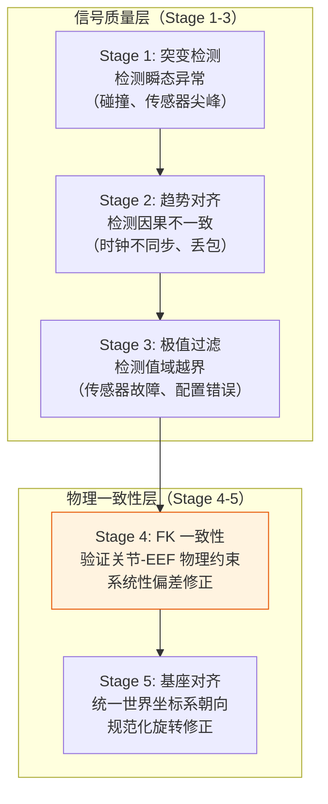
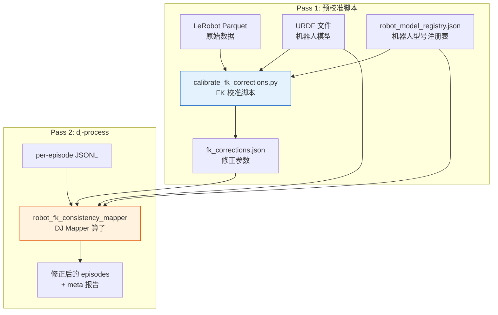
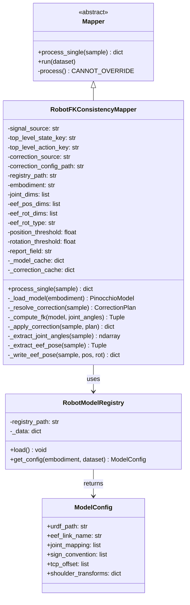
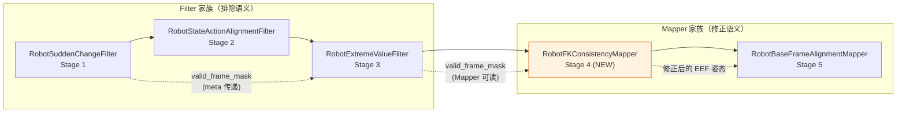
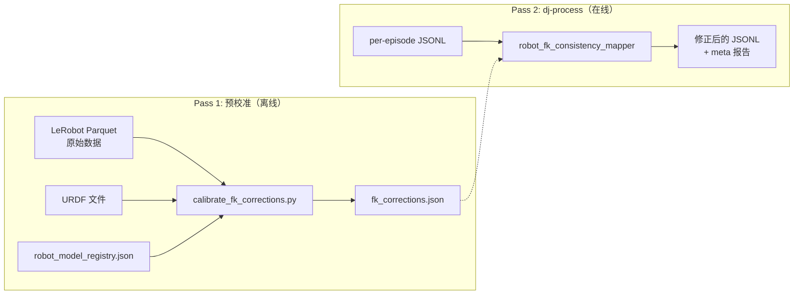
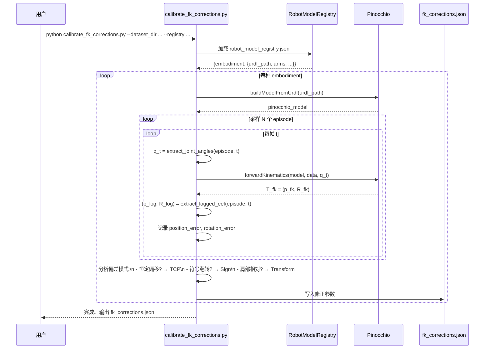
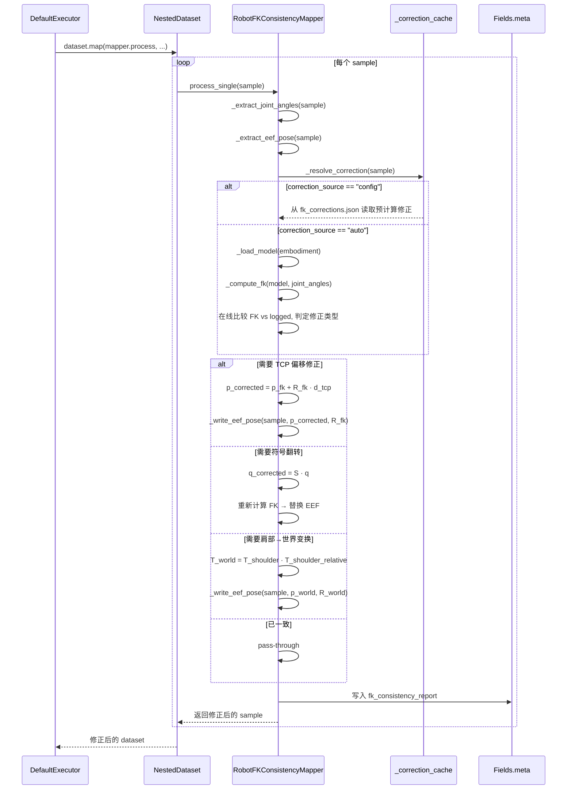
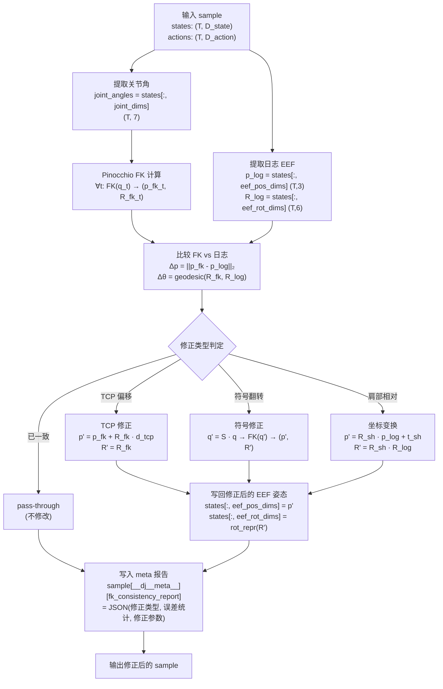
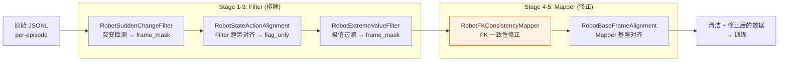
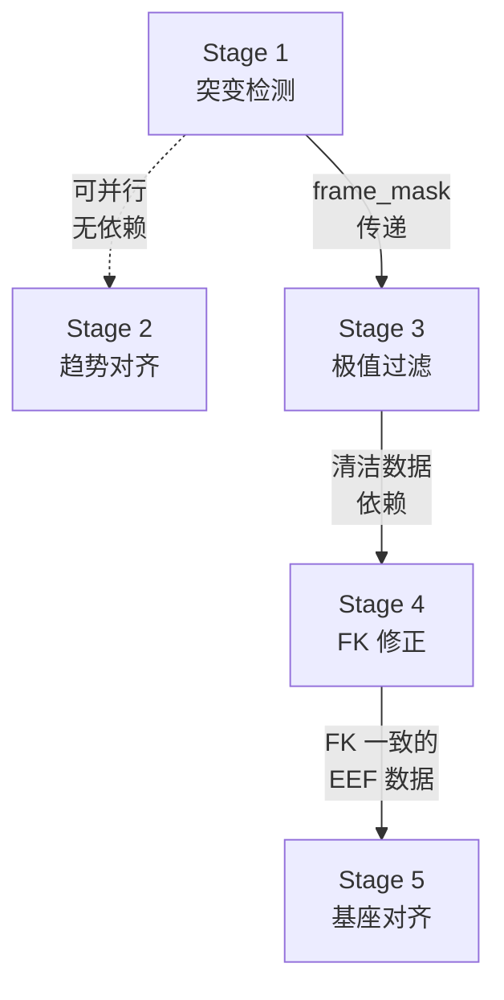

# 用 data-juicer 实现 Qwen-RobotManip Stage 4: Joint-End-Effector Forward Kinematics Consistency 方案

本文给出一份可落地方案：如何用当前 `data-juicer` 代码库实现 Qwen-RobotManip 论文 `Stage 4: Joint-End-Effector Forward Kinematics Consistency` 中描述的正向运动学一致性验证与数据修正方法。全文基于论文 TeX 原文、本地官方文档（`docs/`、`demos/`、`README.md`）、DJ 源码分析（`data_impl.md`、`data_impl2.md`、`dj_analyz.md`）、以及 Stage 1-3/5 已落地成果（`data_cur1_1.md`–`data_cur3_1.md`、`robot_sudden_change_filter.py`、`robot_state_action_alignment_filter.py`、`robot_extreme_value_filter.py`、`robot_base_frame_alignment_mapper.py`）。遵循"扩展大于修改"原则，不改动 `data-juicer` 主干源码，所有定制代码写入 `data_juicer/_au/` 与 `tests_au/`。

对应论文位置：`b/d/QwenRobotmanip/TeX_Source/chapter/data.tex` 第 224–227 行。

> **Stage 4: Joint-End-Effector Forward Kinematics Consistency.** We compute forward kinematics (FK) via Pinocchio from each robot's URDF and compare against logged end-effector poses. The discrepancies can arise from differing joint-angle sign conventions, differing end-effector frame definitions, incorrect rotation representations, incorrect base-frame assumptions, and erroneous end-effector logging. Rather than aggressively filtering, this stage primarily performs *data correction*: constant positional offsets are resolved by adjusting the tool-center-point (TCP) definition, and shoulder-relative bimanual poses are transformed into the world frame. This process revealed that the same robot model can carry different joint-angle conventions across datasets, further motivating the unified state-action representation of Sec. \ref{sec:unified_state_action}.

注释详版（同文件 L227）：

> The fourth stage validates the consistency between recorded joint states and end-effector poses by computing forward kinematics (FK) from the corresponding URDF model and comparing the result against the logged end-effector position and orientation. We first catalog all robot models appearing across datasets and locate their URDF files. For each episode, we construct the joint configuration vector---handling per-dataset joint orderings, sign conventions, and fixed joints---and compute FK via Pinocchio. Discrepancies between FK-derived and recorded end-effector poses can arise from five sources: differing joint-angle sign conventions, differing end-effector frame definitions, incorrect rotation representations, incorrect base-frame assumptions, or erroneous end-effector logging. Rather than aggressively filtering, this stage primarily performs *data correction*: if the FK-derived and recorded end-effector poses exhibit a constant positional offset, we adjust the tool-center-point (TCP) definition without discarding the episode; if bimanual end-effector poses are recorded relative to each shoulder rather than the world frame, we transform them into the world frame. During this process, we found that even the same robot model can have different joint-angle conventions across datasets---and in some cases, different tasks within the same dataset exhibit different rotational offsets for the same robot. These findings further motivate the adoption of a unified state-action representation.

翻译与提要：第四阶段验证记录的关节状态和末端执行器（EEF）姿态之间的一致性。具体方法是：从对应的 URDF 模型计算**正向运动学**（FK），并将结果与日志记录的末端执行器位姿进行比对。首先编目所有出现在数据集中的机器人型号并定位其 URDF 文件。对每个 episode，构建关节配置向量（处理各数据集特有的关节排序、符号约定和固定关节），通过 Pinocchio 计算 FK。FK 推导的 EEF 姿态与记录的 EEF 姿态之间的差异可能来自**五种来源**：不同的关节角符号约定、不同的末端执行器坐标系定义、错误的旋转表示、错误的基座坐标系假设、以及错误的末端执行器日志记录。**该阶段主要执行数据修正而非激进过滤**：若 FK 推导与记录的 EEF 姿态存在恒定位置偏移，则调整工具中心点（TCP）定义而不丢弃 episode；若双臂 EEF 姿态是相对各自肩部记录的而非世界坐标系，则将其变换到世界坐标系。在此过程中发现，**同一机器人型号在不同数据集中可能有不同的关节角约定**——甚至同一数据集内不同任务对同一机器人也可能有不同的旋转偏移。

---

## 目录

1. 结论速览
2. 背景：正向运动学一致性的必要性
3. 论文方法形式化
4. 关键概念深入浅出
5. 参考实现分析与流程梳理
6. data-juicer 能力映射与选型
7. 静态架构（组件图 / 类图 / 职责）
8. 动态架构（数据流 / 序列 / 工作流 / 场景协调）
9. 关键逻辑代码解读
10. 完整落地物料清单
11. 与 Stage 1-3/5 的级联兼容性
12. 扩展性、依赖管理与未来方向
13. 预留：测试执行记录

---

## 1. 结论速览

Stage 4 在五阶段数据过滤管道中承担**物理一致性验证与数据修正**的角色，与 Stage 1-3 的"检测并排除"形成鲜明对比：

| 阶段 | 检测对象 | 操作语义 | 核心判据类型 | 跨 episode 依赖 | DJ 算子类型 |
|------|---------|---------|------------|---------------|------------|
| **Stage 1：突变检测** | 单信号自身平滑性 | **排除** | 残差 + acc/jerk 联合 | 无 | Filter |
| **Stage 2：趋势对齐** | state ↔ action 因果关系 | **排除** | 方向一致性 DA | 无 | Filter |
| **Stage 3：极值过滤** | 值域合理性 | **排除** | 分位数 IQR 扩展带 | 有（全局分位数） | Filter |
| **Stage 4：FK 一致性** | 关节-EEF 物理一致性 | **修正** | FK 推导 vs 日志记录 | 有（URDF + 校准） | **Mapper** |
| **Stage 5：基座对齐** | 世界系朝向约定 | **修正** | 规范化旋转 | 有（per-dataset 配置） | Mapper |

核心公式——正向运动学一致性判定：

$$
\mathbf{T}_{\text{FK}}(\mathbf{q}) = \prod_{i=1}^{n} \mathbf{T}_i(q_i) \quad \stackrel{?}{\approx} \quad \mathbf{T}_{\text{logged}}
$$

其中 $\mathbf{T}_{\text{FK}}(\mathbf{q})$ 是从关节角 $\mathbf{q} = (q_1, \dots, q_n)$ 通过 URDF 运动链计算的末端执行器齐次变换矩阵，$\mathbf{T}_{\text{logged}}$ 是日志中记录的 EEF 姿态。若两者存在系统性偏差（而非随机噪声），则执行对应的修正。

**data-juicer 实现方案一句话总结**：采用**两趟工作流**——Pass 1 用独立预校准脚本遍历所有 episode 做 FK 计算，统计 offset 分布，输出 `fk_corrections.json`（每种 embodiment + dataset 组合的 TCP 偏移、符号约定、坐标变换参数）；Pass 2 用自定义 **Mapper** `robot_fk_consistency_mapper` 读取校准 JSON，逐 sample 就地修正 state/action 中的 EEF 姿态。选择 Mapper 而非 Filter 是因为 Stage 4 的语义是**修正**（改写数据）而非**排除**（删除数据）——与已落地的 Stage 5 `robot_base_frame_alignment_mapper` 同属修正类算子。

---

## 2. 背景：正向运动学一致性的必要性

### 2.1 什么是 FK 一致性检查

在机器人操作数据采集过程中，每一帧都记录了两类互相关联的信息：

```
┌─────────────────────────────────────────────────────┐
│  帧 t 的完整记录                                      │
│                                                       │
│  ┌──────────────────┐    ┌──────────────────────┐    │
│  │ 关节角 q(t)       │    │ 末端执行器姿态 p(t)    │    │
│  │ q1, q2, ..., q7   │    │ x, y, z, R          │    │
│  │ (来自关节编码器)    │    │ (来自另一传感器/计算)   │    │
│  └──────────────────┘    └──────────────────────┘    │
│          │                         │                  │
│          │    物理约束（刚体运动链）    │                  │
│          │←────────────────────────→│                  │
│          │     应当满足 FK 关系       │                  │
└─────────────────────────────────────────────────────┘
```

**正向运动学**（Forward Kinematics, FK）是从关节角推算末端执行器姿态的确定性映射：

$$
\mathbf{T}_{\text{EEF}}^{\text{base}} = \text{FK}(\mathbf{q}) = \prod_{i=1}^{n} \mathbf{T}_{i-1,i}(q_i)
$$

如果数据记录正确，那么从关节角计算出的 EEF 姿态应当与日志中直接记录的 EEF 姿态一致（或在传感器噪声范围内）。**FK 一致性检查就是验证这一物理约束是否成立**。

### 2.2 五种不一致来源

论文识别出五种导致 FK 推导姿态与记录姿态不一致的来源。这些不一致并非随机噪声，而是**系统性偏差**——一旦识别，可以通过确定性变换修正：

#### 来源 1：关节角符号约定不同

不同的数据采集框架可能对同一个物理关节使用不同的正方向定义。例如：

```
  数据集 A（ROS 约定）:    肩关节抬起 → q₂ = +0.5 rad
  数据集 B（厂商 SDK）:    肩关节抬起 → q₂ = -0.5 rad

  物理运动完全相同，但记录的数值符号相反！
```

这意味着如果用数据集 A 的 URDF（定义了正方向）去计算数据集 B 的 FK，得到的 EEF 姿态会完全错误——因为关节"反着转了"。

**修正方法**：对受影响的关节维度施加符号翻转 $q_i \leftarrow s_i \cdot q_i$，其中 $s_i \in \{-1, +1\}$。

#### 来源 2：末端执行器坐标系定义不同

URDF 中定义的末端执行器 link（如 `panda_link8`）可能与数据记录方采用的参考点不同。常见差异：

- 数据记录的是**法兰盘**（flange）的姿态，而 URDF 的末端 link 定义到**工具尖端**
- 数据记录方在末端额外挂载了工具（如夹爪），其姿态参考的是夹爪末端而非法兰盘

```
  URDF 定义的 EEF link          数据记录的 EEF 参考点
  ┌────────┐                    ┌────────┐
  │        │                    │        │
  │  link8 │◄── URDF FK 到此    │  link8 │
  │        │                    │  ╔════╗ │
  │        │                    │  ║工具║ │
  │        │                    │  ║    ║◄── 数据记录到此
  └────────┘                    │  ╚════╝ │
                                └────────┘
                                TCP 偏移 d_TCP
```

**修正方法**：检测恒定位置偏移 $\mathbf{d}_{\text{TCP}}$，调整 TCP 定义。

#### 来源 3：旋转表示错误

不同系统可能使用不同的旋转表示（欧拉角序列、四元数分量顺序、旋转向量等），或者在转换过程中引入错误。例如：

- 混淆了 `xyzw` 和 `wxyz` 四元数顺序
- 混淆了内旋（intrinsic）和外旋（extrinsic）欧拉角
- 角度/弧度单位混用

#### 来源 4：基座坐标系假设不同

FK 计算的 EEF 姿态是相对于机器人基座坐标系的，但数据记录可能使用了不同的世界坐标系定义（与 Stage 5 的问题域部分重叠，但 Stage 4 更关注**检测**而 Stage 5 做统一**规范化**）。

#### 来源 5：末端执行器日志记录错误

某些数据集的 EEF 姿态本身就是错误的——可能是采集脚本的 bug、传感器故障、或后处理错误。这种情况下，FK 推导的姿态是正确的（只要关节编码器没问题），应当用 FK 结果**替换**记录的 EEF 姿态。

### 2.3 为什么修正而非过滤

Stage 1-3 对检测到的异常采取**排除**策略（标记、裁帧、丢弃），而 Stage 4 主要做**修正**。这一设计选择基于以下考量：

| 维度 | 排除（Stage 1-3） | 修正（Stage 4） |
|------|------------------|----------------|
| **异常性质** | 随机噪声、瞬态故障 | 系统性偏差、确定性错误 |
| **影响范围** | 个别帧或 episode | 整个数据集或子集（同一约定下的所有数据） |
| **可修复性** | 无法推断"正确值" | 可通过确定性变换恢复正确值 |
| **数据珍贵性** | 丢弃少量帧损失有限 | 丢弃整个子集损失巨大 |

论文原文明确说："Rather than aggressively filtering, this stage primarily performs *data correction*"——因为 FK 不一致通常影响的是**整个数据集**（同一机器人、同一采集脚本收集的所有 episode 共享同一约定错误），丢弃意味着损失大量数据。而这类系统性偏差一旦被正确识别，可以通过简单的数学变换修正——这是"修正"比"排除"更优的场景。

### 2.4 与统一 state-action 表示的关联

论文在 `model.tex` 第 36-56 行定义了 80 维规范向量表示（Sec. `unified_state_action`）：

$$
\mathbf{s} = \underbrace{[\underbrace{q_1, \dots, q_7}_{\text{joint pos (7)}} \;|\; \underbrace{x, y, z, r_1, \dots, r_6}_{\text{EEF pose (9)}} \;|\; \underbrace{g}_{\text{gripper (1)}} \;|\; \underbrace{h_1, \dots, h_{12}}_{\text{hand (12)}}]}_{\text{左臂 (29)}} \;\oplus\; \underbrace{[\cdots]}_{\text{右臂 (29)}} \;\oplus\; \underbrace{[\cdots]}_{\text{预留 (22)}}
$$

每臂 29 维中，前 7 维是关节角位置，接下来 9 维是 EEF 姿态（3 位置 + 6D 旋转）。Stage 4 的 FK 一致性检查正是验证这 **7 维关节角和 9 维 EEF 姿态**之间的物理一致性。如果两者不一致，统一表示中就包含了自相矛盾的信息——模型在训练时同时接收冲突信号，学习效果自然受损。

论文进一步指出，Stage 4 过程中的发现"further motivating the unified state-action representation"——正是因为不同数据集的约定如此混乱，才更需要一个统一的规范化框架。

### 2.5 与 Stage 1-3 的正交互补关系

五阶段管道中的每个阶段检测不同类型的数据问题，构成**正交互补**的质量保障体系：



Stage 1-3 确保信号本身是干净的（无尖峰、有因果关系、在正常范围内）。Stage 4 在干净信号上进一步验证**跨维度的物理一致性**——即使每个维度的值单独看都在正常范围内，关节角和 EEF 姿态组合起来也必须满足刚体运动学约束。Stage 5 则在此基础上消除不同数据集之间的坐标系朝向差异。

---

## 3. 论文方法形式化

### 3.1 URDF 模型与运动链

URDF（Unified Robot Description Format）是 ROS 生态中描述机器人模型的标准格式。一个典型的 7-DOF 机械臂 URDF 定义了一条从基座到末端执行器的**运动链**，由交替的 link（刚体）和 joint（连接件）组成：

$$
\text{base\_link} \xrightarrow{q_1} \text{link}_1 \xrightarrow{q_2} \text{link}_2 \xrightarrow{q_3} \cdots \xrightarrow{q_7} \text{link}_7 \xrightarrow{\text{fixed}} \text{EEF\_link}
$$

每个旋转关节 $i$ 对应一个 $4 \times 4$ 齐次变换矩阵 $\mathbf{T}_i(q_i)$，将关节角 $q_i$ 映射为相邻 link 之间的相对位姿变换。正向运动学就是将这条链上所有变换矩阵连乘：

$$
\mathbf{T}_{\text{EEF}}^{\text{base}}(\mathbf{q}) = \mathbf{T}_1(q_1) \cdot \mathbf{T}_2(q_2) \cdot \ldots \cdot \mathbf{T}_n(q_n)
$$

结果 $\mathbf{T}_{\text{EEF}}^{\text{base}}$ 是一个 $4 \times 4$ 齐次矩阵：

$$
\mathbf{T}_{\text{EEF}}^{\text{base}} = \begin{bmatrix} \mathbf{R} & \mathbf{p} \\ \mathbf{0}^T & 1 \end{bmatrix}
$$

其中 $\mathbf{R} \in SO(3)$ 是旋转矩阵，$\mathbf{p} \in \mathbb{R}^3$ 是位置向量。

### 3.2 FK 计算与误差度量

给定一帧的关节角向量 $\mathbf{q}_t$ 和记录的 EEF 姿态 $(\mathbf{p}_t^{\text{log}}, \mathbf{R}_t^{\text{log}})$，FK 一致性检查计算：

**位置误差**（欧氏距离）：

$$
\Delta p_t = \left\| \mathbf{p}_{\text{FK}}(\mathbf{q}_t) - \mathbf{p}_t^{\text{log}} \right\|_2
$$

**旋转误差**（测地距离）：

$$
\Delta \theta_t = \arccos \frac{\text{tr}\bigl(\mathbf{R}_{\text{FK}}(\mathbf{q}_t)^T \cdot \mathbf{R}_t^{\text{log}}\bigr) - 1}{2}
$$

$\Delta \theta_t$ 的物理含义是将 FK 旋转"旋到"记录旋转所需的最小旋转角度（单位：弧度）。对于完全一致的记录，两个误差都应接近零（仅受传感器噪声影响）。

### 3.3 系统性偏差检测

关键洞察是：Stage 4 关心的不是逐帧的随机误差，而是**跨整个 episode（甚至整个数据集）的恒定偏差**。检测方法：

$$
\bar{\Delta \mathbf{p}} = \frac{1}{T} \sum_{t=1}^{T} \bigl(\mathbf{p}_{\text{FK}}(\mathbf{q}_t) - \mathbf{p}_t^{\text{log}}\bigr), \quad
\sigma_{\Delta p} = \text{std}\bigl(\{\Delta p_t\}_{t=1}^T\bigr)
$$

如果 $\|\bar{\Delta \mathbf{p}}\|$ 显著大于零但 $\sigma_{\Delta p}$ 很小（即偏差恒定、方差小），则高度可能是**TCP 偏移**或**坐标系定义差异**。如果 $\sigma_{\Delta p}$ 很大（偏差不恒定），则可能是符号约定错误或更复杂的问题。

### 3.4 TCP 偏移修正

当 FK 推导的 EEF 位置与记录的 EEF 位置之间存在恒定偏移时，原因通常是两者参考的"末端"点不同。修正公式：

$$
\mathbf{d}_{\text{TCP}} = \frac{1}{T}\sum_{t=1}^{T} \mathbf{R}_{\text{FK}}(\mathbf{q}_t)^T \cdot \bigl(\mathbf{p}_t^{\text{log}} - \mathbf{p}_{\text{FK}}(\mathbf{q}_t)\bigr)
$$

这里将位置偏差**从基座坐标系旋转到 EEF 本体坐标系**，因为 TCP 偏移是在 EEF 本体坐标系中定义的（工具相对于法兰盘的固定偏移）。如果 $\mathbf{d}_{\text{TCP}}$ 在所有帧上接近恒定，则可以可靠地估计。

修正后的 EEF 位置：

$$
\mathbf{p}_t^{\text{corrected}} = \mathbf{p}_{\text{FK}}(\mathbf{q}_t) + \mathbf{R}_{\text{FK}}(\mathbf{q}_t) \cdot \mathbf{d}_{\text{TCP}}
$$

或者等价地，直接在 URDF 末端追加一个固定变换 $\mathbf{T}_{\text{TCP}} = \begin{bmatrix} \mathbf{I} & \mathbf{d}_{\text{TCP}} \\ \mathbf{0}^T & 1 \end{bmatrix}$，然后用修正后的 FK 替换记录的 EEF 姿态。

### 3.5 肩部相对坐标 → 世界坐标变换

对于双臂机器人（如 ALOHA 系列），某些数据集将每只手臂的 EEF 姿态记录为**相对于该臂肩部**而非世界坐标系。这导致两臂的 EEF 姿态无法直接比较或在统一表示中使用。

修正公式（以左臂为例）：

$$
\mathbf{T}_{\text{EEF,left}}^{\text{world}} = \mathbf{T}_{\text{shoulder,left}}^{\text{world}} \cdot \mathbf{T}_{\text{EEF,left}}^{\text{shoulder,left}}
$$

展开为位置和旋转分量：

$$
\mathbf{p}_{\text{world}} = \mathbf{R}_{\text{shoulder}}^{\text{world}} \cdot \mathbf{p}_{\text{shoulder}} + \mathbf{t}_{\text{shoulder}}^{\text{world}}
$$

$$
\mathbf{R}_{\text{world}} = \mathbf{R}_{\text{shoulder}}^{\text{world}} \cdot \mathbf{R}_{\text{shoulder}}
$$

其中 $\mathbf{T}_{\text{shoulder}}^{\text{world}}$ 是肩部在世界坐标系中的位姿——通常是固定的，可从 URDF 中获取或从数据集元数据中读取。

### 3.6 关节角符号约定修正

当检测到某些关节的符号约定与 URDF 定义不一致时，施加符号翻转矩阵：

$$
\mathbf{q}' = \mathbf{S} \cdot \mathbf{q}, \quad \mathbf{S} = \text{diag}(s_1, s_2, \dots, s_n), \quad s_i \in \{-1, +1\}
$$

检测方法：对每个关节维度 $i$，分别用 $s_i = +1$ 和 $s_i = -1$ 计算 FK，比较哪个使得 FK 结果更接近记录的 EEF 姿态。由于修正是全局的（同一数据集的所有 episode 共享同一符号约定），检测可以在少量 episode 上完成。

### 3.7 修正判定流程（形式化）

对给定的 embodiment-dataset 组合，Stage 4 的判定流程可形式化为：

$$
\text{CorrectionPlan} = \begin{cases}
\text{TCP\_OFFSET}(\mathbf{d}_{\text{TCP}}) & \text{if } \|\bar{\Delta \mathbf{p}}\| > \tau_p \;\land\; \sigma_{\Delta p} < \sigma_{\text{max}} \\
\text{SIGN\_FLIP}(\mathbf{S}) & \text{if } \exists\, \mathbf{S} \text{ s.t. FK}(\mathbf{S}\mathbf{q}) \approx \mathbf{T}^{\text{log}} \\
\text{SHOULDER\_TO\_WORLD}(\mathbf{T}_{\text{shoulder}}) & \text{if bimanual } \land \text{ EEF is shoulder-relative} \\
\text{REPLACE\_EEF} & \text{if erroneous EEF logging confirmed} \\
\text{PASS\_THROUGH} & \text{if } \Delta p < \tau_p \;\land\; \Delta \theta < \tau_\theta \text{ (already consistent)}
\end{cases}
$$

在实际实现中，这些修正可以**组合**——例如同时需要符号翻转和 TCP 偏移修正。

---

## 4. 关键概念深入浅出

### 4.1 什么是 URDF

URDF（Unified Robot Description Format）是一种基于 XML 的文件格式，用于描述机器人的物理和几何结构。可以类比为机器人的"骨骼 X 光片"——它描述了骨骼（link）之间的连接（joint）和每个连接的运动范围。

一个简化的 7-DOF 机械臂 URDF 结构：

```xml
<robot name="example_arm">
  <!-- 基座（固定在世界中） -->
  <link name="base_link">
    <visual> <geometry> <cylinder radius="0.1" length="0.05"/> </geometry> </visual>
  </link>

  <!-- 关节 1：基座旋转 -->
  <joint name="joint1" type="revolute">
    <parent link="base_link"/>
    <child link="link1"/>
    <origin xyz="0 0 0.1" rpy="0 0 0"/>   <!-- 关节在父 link 中的位置 -->
    <axis xyz="0 0 1"/>                     <!-- 旋转轴方向 -->
    <limit lower="-2.87" upper="2.87"/>     <!-- 关节限位 -->
  </joint>
  <link name="link1">...</link>

  <!-- 关节 2-7 类似 ... -->

  <!-- 末端执行器（固定关节，与最后一个活动 link 刚性连接） -->
  <joint name="eef_fixed_joint" type="fixed">
    <parent link="link7"/>
    <child link="eef_link"/>
    <origin xyz="0 0 0.1" rpy="0 0 0"/>
  </joint>
  <link name="eef_link"/>
</robot>
```

核心要素：
- **link**：刚体部件（有质量、惯性、几何形状）
- **joint**：连接两个 link 的运动副（`revolute` = 旋转关节，`prismatic` = 平移关节，`fixed` = 固定连接）
- **origin**：关节在父 link 坐标系中的位姿（位移 `xyz` + 旋转 `rpy`）
- **axis**：关节的运动轴方向

### 4.2 什么是 Pinocchio 及其 API

Pinocchio 是一个高效的刚体动力学库（C++ 内核 + Python 绑定），专为机器人学计算设计。论文选择它是因为：
1. **速度快**——底层 C++ 实现，FK 计算微秒级
2. **完整功能**——支持 FK、逆运动学（IK）、动力学、碰撞检测
3. **URDF 原生支持**——直接从 URDF 文件构建模型

核心 API 用法示例：

```python
import pinocchio as pin

# 1. 从 URDF 加载模型
model = pin.buildModelFromUrdf("robot.urdf")
data = model.createData()

# 2. 设置关节角（7-DOF 示例）
q = np.array([0.1, -0.5, 0.3, -1.2, 0.0, 0.8, 0.0])

# 3. 正向运动学计算
pin.forwardKinematics(model, data, q)
pin.updateFramePlacements(model, data)

# 4. 获取末端执行器位姿
eef_frame_id = model.getFrameId("eef_link")
T_eef = data.oMf[eef_frame_id]     # SE3 对象

position = T_eef.translation       # np.array([x, y, z])
rotation = T_eef.rotation           # 3x3 旋转矩阵
```

Pinocchio 的 `SE3` 对象封装了齐次变换矩阵，提供 `.translation`（位置）和 `.rotation`（旋转矩阵）属性。

### 4.3 TCP（Tool Center Point）的含义

TCP 是工具中心点的缩写，指的是末端执行器上的**实际工作点**。以夹爪为例：

```
  ┌─────────────────┐
  │    link7        │  ← URDF 定义的最后一个 link
  │                 │
  ├─────────────────┤  ← 法兰盘（flange）——标准接口面
  │   ╔═══════╗     │
  │   ║ 夹爪  ║     │  ← 安装的工具
  │   ║       ║     │
  │   ║  ┌─┐  ║     │
  │   ║  │●│  ║     │  ← TCP：夹爪指尖中心（实际抓取点）
  │   ║  └─┘  ║     │
  │   ╚═══════╝     │
  └─────────────────┘

  法兰盘到 TCP 的固定偏移：d_TCP = [0, 0, 0.15]（沿 z 轴 15cm）
```

当数据记录方记录的是 TCP 位置而 URDF 只定义到法兰盘（或反过来），FK 推导的 EEF 位置与记录值之间就会有一个**恒定偏移** $\mathbf{d}_{\text{TCP}}$。这个偏移在 EEF 本体坐标系中是固定的（因为工具刚性连接在法兰盘上），但在基座坐标系中会随着手臂姿态的变化而变化——因此不能简单地从位置差中减去一个常数。正确的做法是 §3.4 中的公式，将偏差旋转到本体系后取平均。

### 4.4 "同型号机器人不同约定"的具体例子

论文中提到的一个关键发现：

> "even the same robot model can have different joint-angle conventions across datasets---and in some cases, different tasks within the same dataset exhibit different rotational offsets for the same robot."

以 UR5 机械臂为例，同一物理关节的角度记录可能在不同数据集中不同：

```
  数据集 RoboMIND (UR5):
  ┌───────────────────────────────────────────────┐
  │ 关节 3（肘部）:  正方向 = 向上弯折              │
  │ 记录值: q₃ = +1.2 rad                        │
  └───────────────────────────────────────────────┘

  数据集 OpenX-RT2 (UR5):
  ┌───────────────────────────────────────────────┐
  │ 关节 3（肘部）:  正方向 = 向下弯折              │
  │ 记录值: q₃ = -1.2 rad（物理上完全相同的姿态）   │
  └───────────────────────────────────────────────┘
```

更极端的情况：同一数据集内，不同任务可能使用了不同版本的采集脚本，导致旋转偏移不一致。这就是为什么 Stage 4 的校准需要精细到 **embodiment × dataset × 甚至 task** 的粒度。

### 4.5 旋转表示：6D 旋转 vs 旋转向量 vs 四元数

在统一表示中（`model.tex` L44），**state** 的 EEF 姿态使用 6D 连续旋转表示（rot6d），而 **action** 的 EEF 增量使用 3D 旋转向量（rotvec）。理解这些表示之间的关系对 Stage 4 的旋转误差度量至关重要：

| 表示 | 维度 | 特点 | 使用场景 |
|------|------|------|---------|
| **旋转矩阵** | 9 ($3 \times 3$) | 正交约束 $R^TR = I$, $\det R = 1$；无奇异性 | FK 计算的原始输出 |
| **6D 旋转 (rot6d)** | 6 | 取旋转矩阵前两列 $[c_1 \| c_2]$；Gram-Schmidt 恢复第三列；连续性好（无万向锁） | 统一表示中的 state EEF 方向 |
| **旋转向量 (rotvec)** | 3 | $\mathbf{r} = \theta \hat{\mathbf{n}}$；轴角表示的紧凑形式 | 统一表示中的 action EEF delta |
| **四元数 (quat)** | 4 | $q = (w, x, y, z)$ 或 $(x, y, z, w)$；插值性好 | 某些数据集的原始记录格式 |
| **欧拉角 (euler)** | 3 | $(\phi, \theta, \psi)$；直观但有万向锁 | 某些数据集的原始记录格式 |

在 FK 一致性检查中，我们需要在这些表示之间转换。Pinocchio 输出旋转矩阵，而记录的 EEF 姿态可能是任意表示——统一比较前需要先转到旋转矩阵空间。

### 4.6 双臂机器人肩部相对坐标系

以 Galaxea R1 Lite 这类双臂机器人为例，两个手臂有各自的肩部安装点：

```
                    世界坐标系 {W}
                         │
              ┌──────────┼──────────┐
              │          │          │
         {S_left}    {base}    {S_right}
         左肩坐标系    基座      右肩坐标系
              │                    │
         左臂 FK              右臂 FK
              │                    │
         {EEF_left}           {EEF_right}
         左手 EEF              右手 EEF

  情况 A（正确）:  EEF 姿态在 {W} 中 → 两臂可直接比较
  情况 B（需修正）: EEF 姿态在 {S_left}/{S_right} 中 → 需变换到 {W}
```

当 EEF 姿态记录在肩部坐标系中时，两臂的"零位置"不同（左肩和右肩在世界坐标系中的位置不同），如果不变换就混在一起使用，模型会接收到不一致的空间信息。

---

## 5. 参考实现分析与流程梳理

### 5.1 论文注释版描述的完整流程

根据 `data.tex` L227 的注释详版，Stage 4 的完整执行流程可拆解为以下步骤：

```python
# 伪代码：Stage 4 参考实现完整流程
def stage4_fk_consistency(all_datasets, urdf_registry):
    """
    Stage 4: Joint-End-Effector FK Consistency

    输入：所有数据集的 episode 集合 + URDF 文件注册表
    输出：修正后的数据集 + 修正报告
    """
    # Step 1: 编目所有机器人型号，定位 URDF 文件
    robot_models = catalog_robot_models(all_datasets)
    for model_name in robot_models:
        urdf_path = urdf_registry[model_name]
        pinocchio_model = pin.buildModelFromUrdf(urdf_path)

    # Step 2: 逐 dataset-embodiment 组合校准
    corrections = {}
    for dataset_name, dataset in all_datasets.items():
        embodiment = dataset.robot_type
        sample_episodes = dataset.sample(n=50)

        # Step 2a: 对采样 episode 计算 FK
        position_errors = []
        rotation_errors = []
        for episode in sample_episodes:
            for t in range(len(episode)):
                q_t = extract_joint_angles(episode, t)
                p_fk, R_fk = compute_fk(pinocchio_model, q_t, eef_link)
                p_log, R_log = extract_logged_eef(episode, t)
                position_errors.append(p_fk - p_log)
                rotation_errors.append(geodesic_distance(R_fk, R_log))

        # Step 2b: 分析偏差模式
        mean_offset = np.mean(position_errors, axis=0)
        std_offset = np.std(np.linalg.norm(position_errors, axis=1))

        if np.linalg.norm(mean_offset) > threshold_p and std_offset < sigma_max:
            # 恒定偏移 → TCP 修正
            d_tcp = estimate_tcp_offset(...)
            corrections[dataset_name] = {"type": "tcp_offset", "d_tcp": d_tcp}
        elif is_sign_convention_issue(...):
            # 符号约定问题 → 符号翻转
            sign_vector = detect_sign_flips(...)
            corrections[dataset_name] = {"type": "sign_flip", "signs": sign_vector}
        elif is_shoulder_relative(...):
            # 肩部相对坐标 → 变换到世界系
            T_shoulder = get_shoulder_transform(...)
            corrections[dataset_name] = {"type": "shoulder_to_world", "T": T_shoulder}

    # Step 3: 对所有 episode 应用修正
    for dataset_name, dataset in all_datasets.items():
        correction = corrections.get(dataset_name)
        if correction is None:
            continue  # 已经一致，pass-through
        for episode in dataset:
            apply_correction(episode, correction)

    return corrections  # 修正报告
```

### 5.2 与 `note_data.md` 的交叉验证

`note_data.md` 第 813-824 行对 Stage 4 的总结与论文一致：

- 目标：验证关节状态与 EEF 姿态的一致性
- 方法：Pinocchio + URDF 计算 FK
- 关键发现：该阶段主要做**数据修正**而非激进过滤
- 修正类型：TCP 恒定偏移修正、肩部相对坐标到世界坐标系变换
- 重要发现：同一机器人型号在不同数据集中有不同的关节角约定

### 5.3 关键观察：与 Stage 5 的边界

Stage 4 和 Stage 5 都涉及坐标系变换，但关注点不同：

| 维度 | Stage 4（FK 一致性） | Stage 5（基座对齐） |
|------|---------------------|-------------------|
| 检查什么 | 关节角 ↔ EEF 是否物理一致 | 世界坐标系朝向是否统一 |
| 修正什么 | TCP 偏移、符号约定、肩部坐标系 | $+x$ 轴朝向对齐 |
| 需要 URDF | **是**（FK 计算必需） | **否**（仅需知道当前朝向） |
| 修正粒度 | dataset × embodiment | dataset |
| 已有实现 | 无（本文设计） | **已有** (`robot_base_frame_alignment_mapper.py`) |

---

## 6. data-juicer 能力映射与选型

### 6.1 Mapper vs Filter 选型分析

这是 Stage 4 实现中最关键的架构决策。

**Filter 模式（Stage 1-3 使用）**：

```python
class SomeFilter(Filter):
    def compute_stats_single(self, sample, context=False):
        # 计算统计量 → 写入 sample[Fields.stats]
        sample[Fields.stats]["some_keep"] = True/False
        return sample

    def process_single(self, sample):
        # 返回布尔值 → True 保留，False 丢弃
        return sample[Fields.stats].get("some_keep", True)
```

- 语义：**判定 → 保留/丢弃**
- `process_single` 返回 `bool`
- 可以在 `compute_stats_single` 中修改数据（如 Stage 1 的 `frame_remove`），但这是"排除"语义的变种
- 有 `stats_export_path` 支持统计信息导出

**Mapper 模式（Stage 5 已使用）**：

```python
class SomeMapper(Mapper):
    def process_single(self, sample):
        # 就地修正数据 → 返回修正后的 sample
        sample["states"] = corrected_states
        return sample
```

- 语义：**变换 → 返回修正后的数据**
- `process_single` 返回 `dict`（修正后的 sample）
- 不能覆盖 `process()`（`__init_subclass__` 强制）
- 没有 `stats_export_path`，但可以写 `Fields.meta` 报告

**结论：选择 Mapper**。

理由：
1. **语义正确**——Stage 4 是数据修正（改写），不是数据排除（删除）。论文原文："primarily performs *data correction*"
2. **先例存在**——Stage 5 的 `robot_base_frame_alignment_mapper.py` 已经证明了 Mapper 在 `_au/ops/mapper/` 中的可行性，且已正确注册和导入
3. **API 匹配**——Mapper 的 `process_single(sample) → sample` 天然适合"读取 → 修正 → 写回"的语义
4. **与 Stage 5 对称**——两者都是"修正类算子"，使用同一基类可以保持架构一致性

### 6.2 已有 Mapper 基础设施

探索发现：
- `data_juicer/_au/ops/mapper/` 目录**已存在**，包含 Stage 5 的 `robot_base_frame_alignment_mapper.py`
- `data_juicer/_au/ops/mapper/__init__.py` 已存在
- `data_juicer/_au/__init__.py` 已注册 Stage 5 mapper 的导入
- 注册机制 `@OPERATORS.register_module(OP_NAME)` 在 Mapper 子类上正常工作

因此，Stage 4 的新 Mapper 只需：
1. 在 `_au/ops/mapper/` 中新增 `robot_fk_consistency_mapper.py`
2. 在 `_au/__init__.py` 中追加一行 import

### 6.3 两趟工作流的 DJ 适配

与 Stage 3 的模式完全一致：

- **Pass 1（预校准）**：独立 Python 脚本 `calibrate_fk_corrections.py`
  - 输入：原始 LeRobot parquet 数据 + URDF 文件
  - 过程：对采样 episode 计算 FK，检测偏差模式，拟合修正参数
  - 输出：`fk_corrections.json`
  
- **Pass 2（dj-process）**：Mapper 算子 `robot_fk_consistency_mapper`
  - 输入：per-episode JSONL + `fk_corrections.json`
  - 过程：读取预计算的修正参数，逐 sample 就地修正 EEF 姿态
  - 输出：修正后的 episodes + meta 报告

### 6.4 参考已有 Mapper 实现

`robot_base_frame_alignment_mapper.py`（Stage 5，441 行）的设计模式是 Stage 4 的直接参考：

| 设计要素 | Stage 5 (已实现) | Stage 4 (本文设计) |
|---------|-----------------|-------------------|
| 信号来源 | `signal_source`: top_level / hand_action_tags | 相同 |
| 修正来源 | `correction_source`: param / preset / stats_json | `correction_source`: config / auto |
| 缓存机制 | `_corr_cache` 按 embodiment 缓存 | `_fk_cache` 按 embodiment 缓存 URDF 模型 |
| 旋转处理 | `_rot_from_repr` / `_rot_to_repr` 系列方法 | 可直接复用或参考 |
| 安全pass-through | 无 pose_layout / 切片越界 → 原样返回 | 无 URDF / FK 失败 → 原样返回 |
| 报告写入 | `Fields.meta[report_field]` = JSON 字符串 | 相同 |

### 6.5 Pinocchio 依赖管理

Pinocchio 不在 data-juicer 的标准依赖中。处理方式：

- 使用 `LazyLoader` 延迟导入（参考 `video_hand_motion_smooth_mapper.py` 中 `scipy_interpolate = LazyLoader("scipy.interpolate", "scipy")`）
- 仅在实际调用 FK 计算时才 import pinocchio
- 如果未安装 pinocchio，在构造函数或首次调用时给出清晰的错误提示
- 安装命令：`pip install pin`（Pinocchio 的 Python 包名）或 `conda install -c conda-forge pinocchio`

---

## 7. 静态架构（组件图 / 类图 / 职责）

### 7.1 组件图



### 7.2 类图



### 7.3 参数分组表

`RobotFKConsistencyMapper` 的构造函数参数分为五组：

| 组别 | 参数 | 类型 | 默认值 | 说明 |
|------|------|------|--------|------|
| **信号来源** | `signal_source` | str | `"top_level"` | 数据读取方式 |
| | `top_level_state_key` | str | `"states"` | 顶层 state 键名 |
| | `top_level_action_key` | str | `"actions"` | 顶层 action 键名 |
| **维度映射** | `joint_dims` | list | `None` | state 中关节角维度索引，如 `[0,1,2,3,4,5,6]` |
| | `eef_pos_dims` | list | `None` | state 中 EEF 位置维度索引，如 `[7,8,9]` |
| | `eef_rot_dims` | list | `None` | state 中 EEF 旋转维度索引，如 `[10,11,12,13,14,15]` |
| | `eef_rot_type` | str | `"rot6d"` | EEF 旋转表示类型 |
| **修正配置** | `correction_source` | str | `"config"` | 修正来源：`config` 或 `auto` |
| | `correction_config_path` | str | `None` | `fk_corrections.json` 路径 |
| | `registry_path` | str | `None` | `robot_model_registry.json` 路径 |
| | `embodiment` | str | `None` | 显式 embodiment 名 |
| | `embodiment_field` | str | `"robot_type"` | 从样本中读取 embodiment 的字段名 |
| | `dataset_field` | str | `"dataset_name"` | 从样本中读取 dataset 名的字段名 |
| **阈值** | `position_threshold` | float | `0.01` | 位置误差阈值（米），低于则视为一致 |
| | `rotation_threshold` | float | `0.05` | 旋转误差阈值（弧度），低于则视为一致 |
| **输出** | `report_field` | str | `"fk_consistency_report"` | meta 报告字段名 |

### 7.4 与 Stage 1-3/5 算子的关系图



### 7.5 `robot_model_registry.json` 数据结构设计

```json
{
  "galaxea_r1_lite": {
    "urdf_path": "models/galaxea_r1_lite/r1_lite.urdf",
    "arms": {
      "left": {
        "eef_link_name": "left_eef_link",
        "joint_names": ["left_j1", "left_j2", "left_j3", "left_j4",
                        "left_j5", "left_j6", "left_j7"],
        "state_joint_dims": [0, 1, 2, 3, 4, 5, 6],
        "state_eef_pos_dims": [7, 8, 9],
        "state_eef_rot_dims": [10, 11, 12, 13, 14, 15],
        "eef_rot_type": "rot6d"
      },
      "right": {
        "eef_link_name": "right_eef_link",
        "joint_names": ["right_j1", "right_j2", "right_j3", "right_j4",
                        "right_j5", "right_j6", "right_j7"],
        "state_joint_dims": [16, 17, 18, 19, 20, 21, 22],
        "state_eef_pos_dims": [23, 24, 25],
        "state_eef_rot_dims": [26, 27, 28, 29, 30, 31],
        "eef_rot_type": "rot6d"
      }
    },
    "dataset_overrides": {
      "dataset_A": {
        "sign_convention": {
          "left": [1, -1, 1, 1, 1, -1, 1],
          "right": [1, 1, 1, -1, 1, 1, 1]
        }
      }
    }
  },
  "franka_panda": {
    "urdf_path": "models/franka/panda.urdf",
    "arms": {
      "default": {
        "eef_link_name": "panda_link8",
        "joint_names": ["panda_joint1", "panda_joint2", "panda_joint3",
                        "panda_joint4", "panda_joint5", "panda_joint6",
                        "panda_joint7"],
        "state_joint_dims": [0, 1, 2, 3, 4, 5, 6],
        "state_eef_pos_dims": [7, 8, 9],
        "state_eef_rot_dims": [10, 11, 12, 13, 14, 15],
        "eef_rot_type": "rot6d"
      }
    }
  }
}
```

设计要点：
- **分层结构**：embodiment → arm → 维度映射
- **多臂支持**：`arms` 字典支持单臂（key="default"）和双臂（key="left"/"right"）
- **per-dataset 覆盖**：`dataset_overrides` 支持同一型号在不同数据集中的约定差异
- **EEF 旋转类型可配**：不同数据格式使用不同的旋转表示

---

## 8. 动态架构（数据流 / 序列 / 工作流 / 场景协调）

### 8.1 两趟工作流总览



### 8.2 Pass 1 预校准脚本序列图



### 8.3 Pass 2 dj-process 调用序列图



### 8.4 单 sample 内的 FK 修正数据流



### 8.5 五阶段级联场景图



**执行顺序的重要性**：
1. Stage 1-3 先执行，清除噪声帧和异常数据
2. Stage 4 在清洁数据上做 FK 一致性修正——避免用噪声数据拟合修正参数
3. Stage 5 最后执行，在 FK 已一致的数据上做最终的坐标系统一

### 8.6 Galaxea R1 Lite 数据的具体修正流程

根据 `info.json`，Galaxea R1 Lite 的 `observation.state` 有 56 维，`action` 有 50 维：

```
observation.state (56-dim):
┌──────────────────────────────────────────────────────────────┐
│ 活跃维度（24个）                                              │
│ ├── 左臂关节角 (indices TBD, 7-dim)                           │
│ ├── 左臂 EEF 位姿 (indices TBD, 位置3 + 旋转?)                │
│ ├── 左夹爪 (1-dim)                                           │
│ ├── 右臂关节角 (indices TBD, 7-dim)                           │
│ ├── 右臂 EEF 位姿 (indices TBD, 位置3 + 旋转?)                │
│ └── 右夹爪 (1-dim)                                           │
│ 填充维度（32个）= 0, 由 state_dim_is_pad 标记                  │
└──────────────────────────────────────────────────────────────┘
```

由于 Galaxea R1 Lite 的具体维度映射尚需从数据中验证（哪些 active 维度对应关节角、哪些对应 EEF），这正是 `robot_model_registry.json` 需要配置的信息。FK 一致性检查需要明确知道：
- 哪些维度是关节角（用于 FK 输入）
- 哪些维度是 EEF 位置/旋转（用于与 FK 输出比较）

如果 R1 Lite 的数据只包含关节角而**不包含 EEF 姿态**（某些纯关节空间数据集），则 Stage 4 退化为 pass-through——没有可比较的 EEF 姿态，无需修正。这种情况下，Mapper 的安全 pass-through 机制确保不会出错。

---

## 9. 关键逻辑代码解读

### 9.1 `robot_fk_consistency_mapper.py` 核心伪代码

```python
# data_juicer/_au/ops/mapper/robot_fk_consistency_mapper.py
import json
import numpy as np
from loguru import logger
from data_juicer.ops.base_op import OPERATORS, Mapper
from data_juicer.utils.constant import Fields

OP_NAME = "robot_fk_consistency_mapper"

@OPERATORS.register_module(OP_NAME)
class RobotFKConsistencyMapper(Mapper):
    """Apply FK-based consistency correction to EEF poses.

    验证关节角与记录的 EEF 姿态之间的正向运动学一致性，
    当检测到系统性偏差时执行数据修正（TCP 偏移、符号翻转、肩部坐标变换）。
    """

    def __init__(
        self,
        # ---- 信号来源 ----
        signal_source: str = "top_level",
        top_level_state_key: str = "states",
        top_level_action_key: str = "actions",
        # ---- 维度映射 ----
        joint_dims: list = None,          # [0,1,...,6]
        eef_pos_dims: list = None,        # [7,8,9]
        eef_rot_dims: list = None,        # [10,11,12,13,14,15]
        eef_rot_type: str = "rot6d",
        # ---- 修正配置 ----
        correction_source: str = "config",  # "config" | "auto"
        correction_config_path: str = None,
        registry_path: str = None,
        embodiment: str = None,
        embodiment_field: str = "robot_type",
        dataset_field: str = "dataset_name",
        # ---- 阈值 ----
        position_threshold: float = 0.01,
        rotation_threshold: float = 0.05,
        # ---- 输出 ----
        report_field: str = "fk_consistency_report",
        *args, **kwargs,
    ):
        super().__init__(*args, **kwargs)
        # ... 参数校验和存储 ...
        self._model_cache = {}      # embodiment -> (pinocchio_model, data)
        self._correction_cache = {} # embodiment/dataset -> CorrectionPlan
```

### 9.2 FK 计算核心方法

```python
    def _load_pinocchio_model(self, urdf_path, eef_link_name):
        """加载 URDF 构建 Pinocchio 模型，缓存。"""
        try:
            import pinocchio as pin
        except ImportError:
            raise ImportError(
                "pinocchio is required for FK consistency check. "
                "Install via: pip install pin"
            )
        model = pin.buildModelFromUrdf(urdf_path)
        data = model.createData()
        eef_frame_id = model.getFrameId(eef_link_name)
        if eef_frame_id >= model.nframes:
            raise ValueError(
                f"EEF link '{eef_link_name}' not found in URDF. "
                f"Available frames: {[model.frames[i].name for i in range(model.nframes)]}"
            )
        return model, data, eef_frame_id

    def _compute_fk(self, model, data, eef_frame_id, joint_angles):
        """对单帧关节角计算 FK，返回 (position, rotation_matrix)。

        Args:
            model: Pinocchio 模型
            data: Pinocchio 数据对象
            eef_frame_id: 末端执行器的 frame ID
            joint_angles: (n,) 关节角向量

        Returns:
            position: (3,) 位置向量
            rotation: (3,3) 旋转矩阵
        """
        import pinocchio as pin
        q = np.asarray(joint_angles, dtype=np.float64)
        # 如果 URDF 中有额外的固定关节/虚拟关节，
        # 需要将 7-dim 关节角映射到完整 q 向量
        q_full = pin.neutral(model)
        # joint_mapping 指定了 7 个活动关节在完整 q 中的位置
        for i, dim_idx in enumerate(self._joint_mapping):
            q_full[dim_idx] = q[i]
        pin.forwardKinematics(model, data, q_full)
        pin.updateFramePlacements(model, data)
        T = data.oMf[eef_frame_id]
        return T.translation.copy(), T.rotation.copy()
```

### 9.3 TCP 偏移自动检测逻辑

```python
    def _detect_tcp_offset(self, fk_positions, fk_rotations, logged_positions):
        """从 FK 与日志 EEF 位置的差异中估计恒定 TCP 偏移。

        将位置差旋转到 EEF 本体坐标系后取均值。
        如果标准差很小（恒定偏移），返回估计的 d_tcp；
        否则返回 None（不是 TCP 偏移问题）。

        Args:
            fk_positions: (T, 3)
            fk_rotations: (T, 3, 3)
            logged_positions: (T, 3)

        Returns:
            d_tcp: (3,) 或 None
        """
        # 将位置差从基座系旋转到 EEF 本体系
        delta_base = logged_positions - fk_positions  # (T, 3)
        delta_body = np.zeros_like(delta_base)
        for t in range(len(delta_base)):
            # R_fk^T · (p_log - p_fk) → EEF 本体系中的偏移
            delta_body[t] = fk_rotations[t].T @ delta_base[t]

        d_tcp_mean = np.mean(delta_body, axis=0)  # (3,)
        d_tcp_std = np.std(delta_body, axis=0)     # (3,)

        # 判定：均值显著 & 标准差小 → 恒定 TCP 偏移
        if (np.linalg.norm(d_tcp_mean) > self.position_threshold and
            np.all(d_tcp_std < self.position_threshold * 2)):
            return d_tcp_mean
        return None
```

### 9.4 符号约定自动检测逻辑

```python
    def _detect_sign_flips(self, model, data, eef_frame_id,
                           joint_angles_seq, logged_positions, logged_rotations):
        """逐关节检测是否需要符号翻转。

        方法：对每个关节 i，比较 s_i=+1 和 s_i=-1 时的 FK 误差，
        选择使整体误差更小的符号。

        Args:
            joint_angles_seq: (T, n_joints)
            logged_positions: (T, 3)
            logged_rotations: (T, 3, 3)

        Returns:
            sign_vector: (n_joints,) 每个元素为 +1 或 -1
        """
        n_joints = joint_angles_seq.shape[1]
        sign_vector = np.ones(n_joints)
        sample_indices = np.linspace(0, len(joint_angles_seq)-1, min(50, len(joint_angles_seq)), dtype=int)

        for j in range(n_joints):
            error_positive = 0.0
            error_negative = 0.0
            for t in sample_indices:
                q = joint_angles_seq[t].copy()
                # s_j = +1
                p_pos, R_pos = self._compute_fk(model, data, eef_frame_id, q)
                error_positive += np.linalg.norm(p_pos - logged_positions[t])
                # s_j = -1
                q[j] *= -1
                p_neg, R_neg = self._compute_fk(model, data, eef_frame_id, q)
                error_negative += np.linalg.norm(p_neg - logged_positions[t])

            if error_negative < error_positive * 0.8:  # 显著改善
                sign_vector[j] = -1
                logger.info(f"Joint {j}: sign flip detected "
                            f"(error +1: {error_positive:.4f}, -1: {error_negative:.4f})")

        return sign_vector
```

### 9.5 `process_single` 主流程

```python
    def process_single(self, sample):
        """Mapper 接口：读取 → 校验 → 修正 → 写回。"""
        # 安全检查：无维度映射则 pass-through
        if self.joint_dims is None or self.eef_pos_dims is None:
            return sample

        # 提取数据
        states_raw = sample.get(self.top_level_state_key)
        if states_raw is None:
            return sample
        states = np.array(states_raw, dtype=np.float64)
        if states.ndim != 2:
            return sample
        T, D = states.shape

        # 检查维度是否在范围内
        all_dims = list(self.joint_dims) + list(self.eef_pos_dims)
        if self.eef_rot_dims:
            all_dims += list(self.eef_rot_dims)
        if max(all_dims) >= D:
            return sample  # 维度越界 → 安全 pass-through

        # 提取关节角和 EEF 姿态
        joint_angles = states[:, self.joint_dims]    # (T, 7)
        eef_pos_log = states[:, self.eef_pos_dims]   # (T, 3)

        # 获取修正计划
        correction = self._resolve_correction(sample)
        if correction is None:
            # 写入"已一致"的报告
            self._write_report(sample, "consistent", {})
            return sample

        # 应用修正
        if correction["type"] == "tcp_offset":
            d_tcp = np.array(correction["d_tcp"])
            # 需要逐帧 FK 计算来获取 R_fk
            model, data, frame_id = self._get_model(sample)
            for t in range(T):
                _, R_fk = self._compute_fk(model, data, frame_id, joint_angles[t])
                states[t, self.eef_pos_dims] = (
                    self._compute_fk(model, data, frame_id, joint_angles[t])[0]
                    + R_fk @ d_tcp
                )
                if self.eef_rot_dims:
                    # 旋转用 FK 结果替换
                    states[t, self.eef_rot_dims] = self._rotation_to_repr(
                        R_fk, self.eef_rot_type
                    )

        elif correction["type"] == "sign_flip":
            signs = np.array(correction["signs"])
            model, data, frame_id = self._get_model(sample)
            for t in range(T):
                q_corrected = joint_angles[t] * signs
                p_fk, R_fk = self._compute_fk(model, data, frame_id, q_corrected)
                states[t, self.joint_dims] = q_corrected
                states[t, self.eef_pos_dims] = p_fk
                if self.eef_rot_dims:
                    states[t, self.eef_rot_dims] = self._rotation_to_repr(
                        R_fk, self.eef_rot_type
                    )

        elif correction["type"] == "shoulder_to_world":
            T_shoulder = np.array(correction["T_shoulder"])  # (4,4)
            R_sh = T_shoulder[:3, :3]
            t_sh = T_shoulder[:3, 3]
            for t in range(T):
                p_world = R_sh @ eef_pos_log[t] + t_sh
                states[t, self.eef_pos_dims] = p_world
                if self.eef_rot_dims:
                    R_log = self._repr_to_rotation(
                        states[t, self.eef_rot_dims], self.eef_rot_type
                    )
                    R_world = R_sh @ R_log
                    states[t, self.eef_rot_dims] = self._rotation_to_repr(
                        R_world, self.eef_rot_type
                    )

        # 写回
        sample[self.top_level_state_key] = states.tolist()
        self._write_report(sample, correction["type"], correction)
        return sample
```

### 9.6 `fk_corrections.json` 示例

```json
{
  "galaxea_r1_lite": {
    "Connect_Router_Cables_20250625_002": {
      "type": "consistent",
      "mean_position_error": 0.003,
      "mean_rotation_error": 0.01,
      "note": "FK and logged EEF are consistent within noise level"
    }
  },
  "franka_panda": {
    "robomimic_lift": {
      "type": "tcp_offset",
      "d_tcp": [0.0, 0.0, 0.1034],
      "mean_position_error_before": 0.105,
      "mean_position_error_after": 0.002,
      "note": "Constant Z-offset from flange to gripper tip"
    },
    "another_dataset": {
      "type": "sign_flip",
      "signs": [1, 1, -1, 1, 1, -1, 1],
      "mean_position_error_before": 0.892,
      "mean_position_error_after": 0.004,
      "note": "Joints 3,6 use opposite sign convention"
    }
  },
  "aloha": {
    "dataset_X": {
      "type": "shoulder_to_world",
      "arms": {
        "left": {
          "T_shoulder": [
            [1, 0, 0, -0.15],
            [0, 1, 0, 0.0],
            [0, 0, 1, 0.3],
            [0, 0, 0, 1]
          ]
        },
        "right": {
          "T_shoulder": [
            [1, 0, 0, 0.15],
            [0, 1, 0, 0.0],
            [0, 0, 1, 0.3],
            [0, 0, 0, 1]
          ]
        }
      },
      "note": "EEF poses recorded relative to shoulder, not world frame"
    }
  }
}
```

---

## 10. 完整落地物料清单

### 10.1 新增与修改文件

| 文件 | 操作 | 说明 |
|------|------|------|
| `data_juicer/_au/ops/mapper/robot_fk_consistency_mapper.py` | **新增** | Stage 4 Mapper 算子（~400 行） |
| `data_juicer/_au/ops/mapper/__init__.py` | **修改** | 追加 Stage 4 import |
| `data_juicer/_au/__init__.py` | **修改** | 追加 Stage 4 import 注册 |
| `tests_au/ops/mapper/__init__.py` | **新增** | 测试目录初始化 |
| `tests_au/ops/mapper/test_robot_fk_consistency_mapper.py` | **新增** | 单元测试（~15 tests） |
| `tests_au/ops/mapper/calibrate_fk_corrections.py` | **新增** | Pass 1 预校准脚本（~150 行） |
| `tests_au/ops/mapper/robot_model_registry.json` | **新增** | R1 Lite 机器人模型配置 |
| `tests_au/ops/mapper/accept_robot_fk_consistency_mapper.yaml` | **新增** | 验收 recipe |
| `tests_au/ops/mapper/accept_robot_fk_consistency_mapper.sh` | **新增** | 验收脚本 |

### 10.2 验收 recipe 设计

```yaml
# accept_robot_fk_consistency_mapper.yaml
project_name: 'accept-robot-fk-consistency-mapper'
dataset_path: 'tests_au/ops/filter/outputs/lerobot_episodes.jsonl'
export_path: 'tests_au/ops/mapper/outputs/accept_s4_result.jsonl'
np: 1
executor_type: default
text_keys: 'id'

custom_operator_paths:
  - 'data_juicer/_au'

process:
  - robot_fk_consistency_mapper:
      signal_source: 'top_level'
      top_level_state_key: 'states'
      top_level_action_key: 'actions'
      correction_source: 'config'
      correction_config_path: 'tests_au/ops/mapper/fk_corrections.json'
      registry_path: 'tests_au/ops/mapper/robot_model_registry.json'
      embodiment: 'galaxea_r1_lite'
      joint_dims: [0, 1, 2, 3, 4, 5, 6]
      eef_pos_dims: [7, 8, 9]
      eef_rot_dims: [10, 11, 12, 13, 14, 15]
      eef_rot_type: 'rot6d'
```

### 10.3 验收脚本设计

```bash
#!/usr/bin/env bash
# accept_robot_fk_consistency_mapper.sh
set -euo pipefail

SCRIPT_DIR="$(cd "$(dirname "$0")" && pwd)"
REPO_ROOT="$(cd "$SCRIPT_DIR/../../.." && pwd)"
VENV=/mnt/r/VENV/dj
DATASET=/mnt/r/DATA/tst/Galaxea-Open-World-Dataset/Connect_Router_Cables_20250625_002

cd "$REPO_ROOT"

echo "=== Step 1: Ensure per-episode JSONL exists ==="
# 复用 Stage 1-3 的转换结果
if [ ! -f "tests_au/ops/filter/outputs/lerobot_episodes.jsonl" ]; then
    "$VENV/bin/python" "tests_au/ops/filter/convert_lerobot_episodes.py" \
        --dataset_dir "$DATASET" \
        --output "tests_au/ops/filter/outputs/lerobot_episodes.jsonl"
fi

echo "=== Step 2: Run FK calibration (Pass 1) ==="
"$VENV/bin/python" "$SCRIPT_DIR/calibrate_fk_corrections.py" \
    --dataset_dir "$DATASET" \
    --registry "$SCRIPT_DIR/robot_model_registry.json" \
    --output "$SCRIPT_DIR/fk_corrections.json" \
    --embodiment galaxea_r1_lite

echo "=== Step 3: Run dj-process (Pass 2: FK correction) ==="
"$VENV/bin/dj-process" --config "$SCRIPT_DIR/accept_robot_fk_consistency_mapper.yaml"

echo "=== Step 4: Verify outputs ==="
"$VENV/bin/python" - <<'PYEOF'
import json, sys
result_path = "tests_au/ops/mapper/outputs/accept_s4_result.jsonl"
with open(result_path) as f:
    results = [json.loads(l) for l in f if l.strip()]
print(f"Output: {len(results)} episodes processed")
# 验证 meta 报告存在
for i, r in enumerate(results):
    meta = r.get("__dj__meta__", {})
    if "fk_consistency_report" not in meta:
        print(f"FAIL: Row {i}: missing fk_consistency_report", file=sys.stderr)
        sys.exit(1)
print("All episodes have fk_consistency_report.")
print("ACCEPTANCE PASSED")
PYEOF
```

### 10.4 单元测试设计

测试覆盖点：

| 测试 | 场景 | 预期 |
|------|------|------|
| `test_pass_through_no_dims` | 未配置 joint_dims → 原样返回 | sample 不变 |
| `test_pass_through_no_eef` | state 中无 EEF 维度 → 安全退出 | sample 不变 |
| `test_consistent_data` | FK 与日志一致 → 不修改 | report.type == "consistent" |
| `test_tcp_offset_correction` | 人工构造恒定偏移 → 修正 | 修正后误差 < 阈值 |
| `test_sign_flip_correction` | 人工翻转一个关节符号 → 修正 | 翻转被检测并修正 |
| `test_shoulder_to_world` | 肩部相对坐标 → 世界坐标 | 坐标正确变换 |
| `test_config_source` | 从 JSON 读取修正参数 | 参数正确加载和应用 |
| `test_auto_source` | 在线 FK 计算 | 自动检测修正类型 |
| `test_invalid_urdf` | 错误的 URDF 路径 | 合理的错误处理 |
| `test_report_written` | 任意场景 | meta 报告格式正确 |
| `test_valid_frame_mask_respected` | Stage 1 写了 mask | 只修正未被 mask 的帧 |
| `test_cascade_with_filter` | S1+S4 级联 | 两算子正常协作 |
| `test_real_data` | 真实数据集 | 运行不崩溃，报告合理 |
| `test_batch_mode` | 批处理模式 | 正确处理 |

---

## 11. 与 Stage 1-3/5 的级联兼容性

### 11.1 五阶段 recipe YAML 示例

```yaml
# accept_qwenrobomanip_full.yaml — 五阶段级联
project_name: 'accept-qwenrobomanip-full'
dataset_path: 'tests_au/ops/filter/outputs/lerobot_episodes.jsonl'
export_path: 'tests_au/outputs/accept_full_result.jsonl'
np: 1
executor_type: default
keep_stats_in_res_ds: true
text_keys: 'id'

custom_operator_paths:
  - 'data_juicer/_au'

process:
  # ---- Stage 1: Sudden Change Detection (Filter) ----
  - robot_sudden_change_filter:
      signal_source: 'top_level'
      top_level_state_key: 'states'
      top_level_action_key: 'actions'
      threshold_mode: 'mad'
      exclusion_strategy: 'frame_mask'

  # ---- Stage 2: State-Action Trend Alignment (Filter) ----
  - robot_state_action_alignment_filter:
      signal_source: 'top_level'
      top_level_state_key: 'states'
      top_level_action_key: 'actions'
      exclusion_strategy: 'flag_only'

  # ---- Stage 3: Extreme Value Filtering (Filter) ----
  - robot_extreme_value_filter:
      signal_source: 'top_level'
      top_level_state_key: 'states'
      top_level_action_key: 'actions'
      percentile_source: 'stats_json'
      percentile_stats_path: 'tests_au/ops/filter/outputs/percentiles.json'
      embodiment: 'galaxea_r1_lite'
      exclusion_strategy: 'frame_mask'

  # ---- Stage 4: FK Consistency Correction (Mapper) ----
  - robot_fk_consistency_mapper:
      signal_source: 'top_level'
      top_level_state_key: 'states'
      top_level_action_key: 'actions'
      correction_source: 'config'
      correction_config_path: 'tests_au/ops/mapper/fk_corrections.json'
      embodiment: 'galaxea_r1_lite'

  # ---- Stage 5: Base Frame Alignment (Mapper) ----
  - robot_base_frame_alignment_mapper:
      signal_source: 'top_level'
      top_level_state_key: 'states'
      top_level_action_key: 'actions'
      correction_source: 'preset'
      preset_name: 'identity'
```

### 11.2 `valid_frame_mask` 在 Mapper 中的处理

Stage 1 和 Stage 3 会向 `Fields.meta["valid_frame_mask"]` 写入帧级布尔掩码。Stage 4 的 Mapper 应当**读取并尊重**这个掩码：

```python
# 在 process_single 中
meta = sample.get(Fields.meta, {}) or {}
mask_raw = meta.get("valid_frame_mask")
if mask_raw is not None:
    if isinstance(mask_raw, str):
        valid_mask = np.array(json.loads(mask_raw), dtype=bool)
    else:
        valid_mask = np.asarray(mask_raw, dtype=bool)
else:
    valid_mask = np.ones(T, dtype=bool)

# 只对 valid_mask 为 True 的帧执行 FK 修正
for t in range(T):
    if not valid_mask[t]:
        continue  # 跳过已被标记为无效的帧
    # ... FK 修正逻辑 ...
```

这确保了 Mapper 不会在已知无效的帧上浪费计算，也不会因为无效帧的异常值干扰修正参数的估计。

### 11.3 执行顺序约束

五阶段的执行顺序不是任意的，存在以下依赖关系：



- **S1→S3**：S3 需要读取 S1 写的 `valid_frame_mask` 做 AND 合并
- **S3→S4**：S4 应在清洁数据上做 FK 修正，避免噪声帧影响修正参数
- **S4→S5**：S5 做坐标系规范化，前提是 EEF 姿态已通过 FK 修正保证一致

### 11.4 联合验收脚本

在实现完成后，应更新 `accept_qwenrobomanip_filter.sh`（或新建 `accept_qwenrobomanip_full.sh`）以包含五阶段级联验收。

---

## 12. 扩展性、依赖管理与未来方向

### 12.1 Pinocchio 安装与依赖管理

Pinocchio 的 Python 绑定（`pin` 包）安装方式：

```bash
# pip 安装（推荐）
pip install pin

# conda 安装
conda install -c conda-forge pinocchio

# 验证安装
python -c "import pinocchio; print(pinocchio.__version__)"
```

在 Mapper 中使用延迟导入，确保未安装 Pinocchio 时不影响其他算子的使用：

```python
try:
    import pinocchio as pin
except ImportError:
    pin = None

# 在实际使用时检查
if pin is None:
    logger.warning("pinocchio not installed, FK consistency check skipped.")
    return sample  # 安全 pass-through
```

### 12.2 URDF 文件获取策略

| 来源 | 可用性 | 说明 |
|------|--------|------|
| 数据集附带 | ★★★ | 最可靠，如 LeRobot 数据集通常附带 URDF |
| 厂商官方 | ★★★ | Franka、UR 等主流机器人有官方 URDF |
| 开源社区 | ★★☆ | GitHub 上有大量非官方 URDF（可能不精确） |
| 手动创建 | ★☆☆ | 根据机械图纸自行创建，耗时但精确 |

对于 Galaxea R1 Lite：
- 需确认厂商（Galaxea / 聚合科技）是否提供官方 URDF
- 如无官方 URDF，可能需要从 R1 Lite 的机械设计参数手动创建简化 URDF
- 或者，如果数据本身只包含关节角而不包含 EEF 姿态，Stage 4 可以安全 pass-through

### 12.3 新增机器人型号的扩展流程

得益于 `robot_model_registry.json` 的设计，支持新机器人型号只需三步：

1. **获取 URDF**：放置到约定路径（如 `models/<embodiment>/`）
2. **配置注册表**：在 `robot_model_registry.json` 中添加新条目，指定关节映射和维度索引
3. **运行校准**：`calibrate_fk_corrections.py` 对新型号的数据执行一次 → 生成修正参数

**无需修改任何 Python 代码**——这是注册表设计的核心优势。

### 12.4 与 Stage 5 的衔接

Stage 4 修正完成后，EEF 姿态已经与关节角 FK 一致，但不同数据集的世界坐标系朝向可能仍然不同。Stage 5 的 `robot_base_frame_alignment_mapper` 接手这一任务，施加规范化旋转使 $+x$ 轴对齐机器人前向。

两个 Mapper 共享相似的架构模式（信号来源、缓存机制、报告写入），可以在同一 recipe 中无缝串联。

### 12.5 `auto` 模式的未来增强

当前设计中 `correction_source="config"` 是推荐模式（读取预计算的修正参数，快速确定性）。`auto` 模式提供在线 FK 计算和自动检测，但有以下限制：

- **计算开销**：每帧都需要 FK 计算（虽然 Pinocchio 很快，但大数据集仍需考虑）
- **检测可靠性**：自动检测需要足够多的帧来统计，单个短 episode 可能不够
- **复杂场景**：多种修正同时存在时，自动检测的优先级和组合策略需要更精细的逻辑

建议先实现 `config` 模式（与 Stage 3 的 `stats_json` / Stage 5 的 `stats_json` 一致），`auto` 模式作为进阶功能后续添加。

### 12.6 潜在的性能优化

- **批量 FK**：Pinocchio 支持批量关节配置的 FK 计算，可一次处理多帧
- **缓存 FK 结果**：如果同一 episode 在多阶段中都需要 FK 结果，可以缓存到 `Fields.context`
- **稀疏检查**：不需要对每一帧都做 FK 计算——系统性偏差在所有帧上一致，抽样检查即可

---

## 13. 预留：测试执行记录

> 本节将在 Stage 4 实现完成并通过全部测试后补充，包括：
> - 遇到的所有 error 的现象、分析、根因、fix 方案
> - 文件增删改清单及原因
> - 最终测试结果汇总表
> - 自检清单
