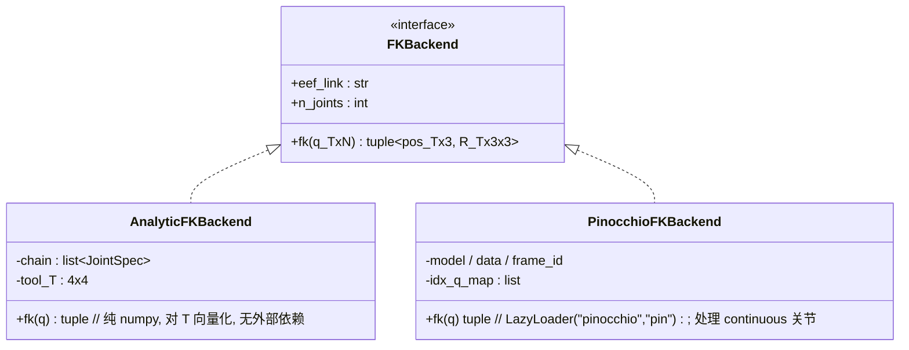
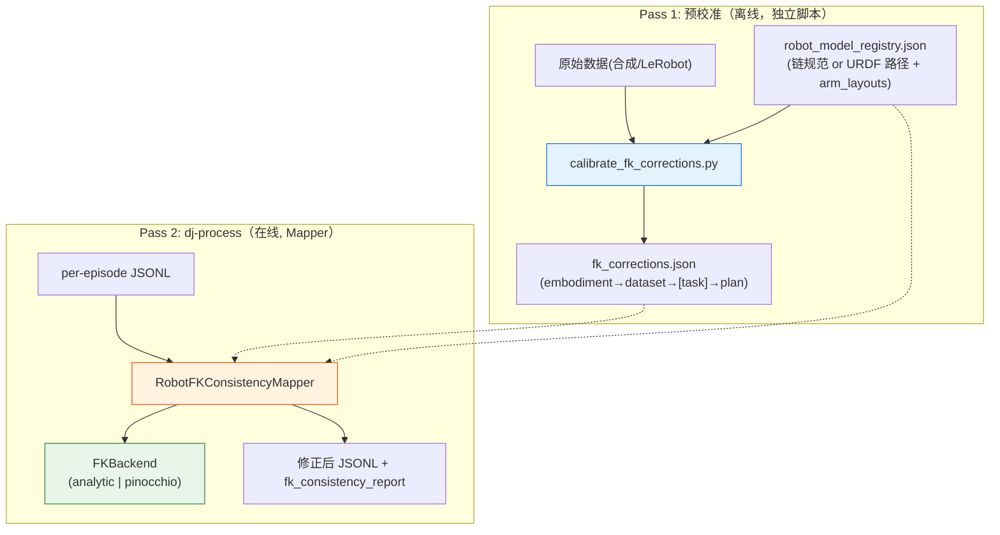
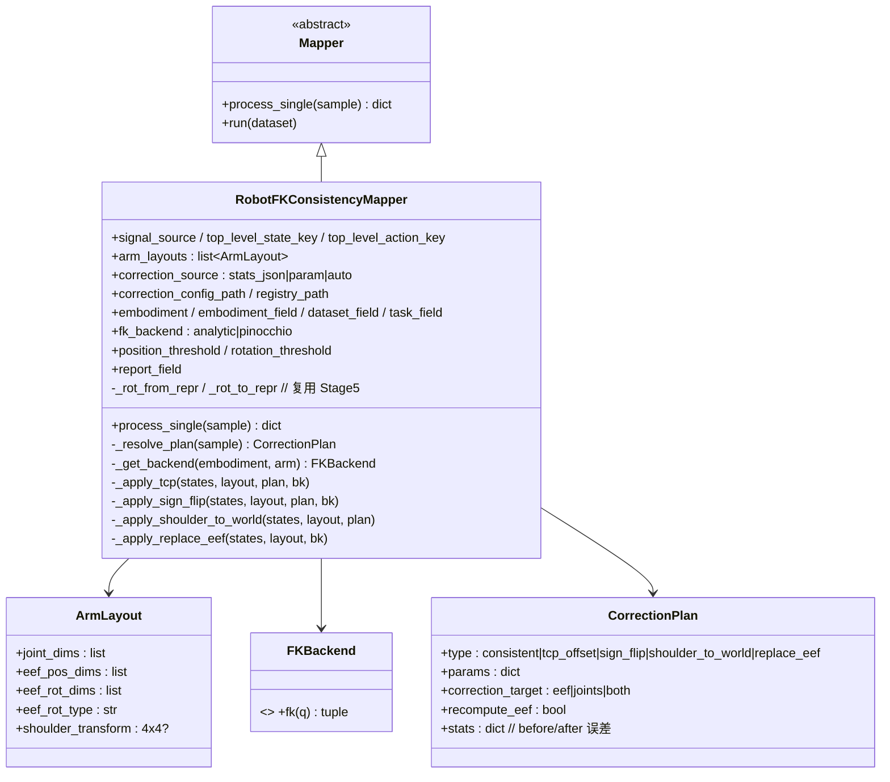
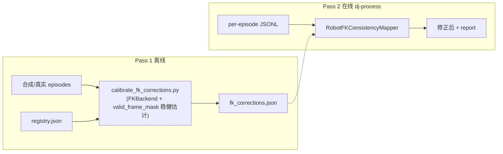
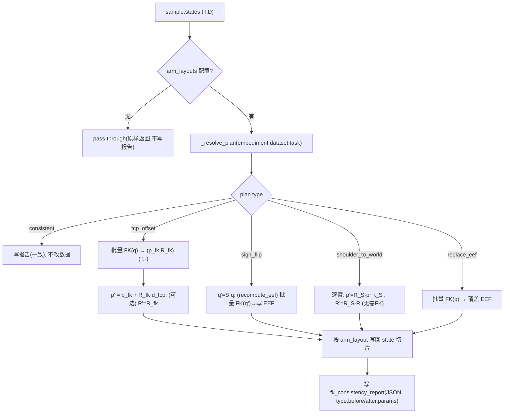
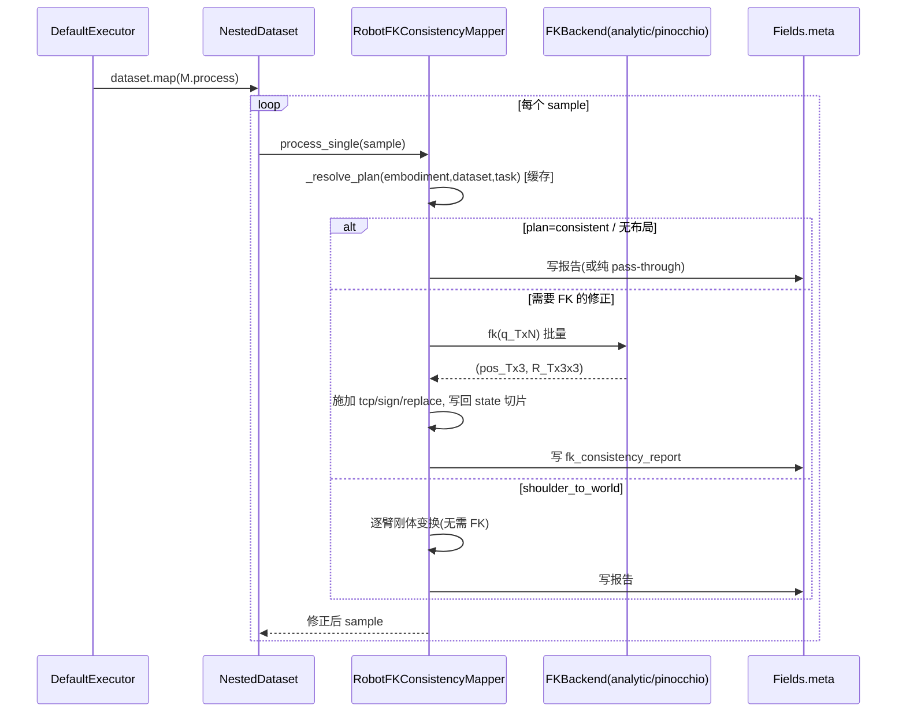
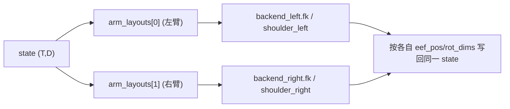
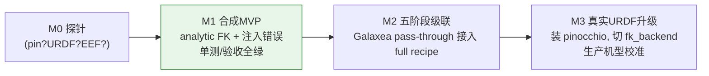

# 用 data-juicer 实现 Qwen-RobotManip Stage 4: Joint–End-Effector FK Consistency —— 改良落地方案（v2）

> 本文是 [`data_cur4_1.md`](data_cur4_1.md) 的**改良版**。v1 已把论文语义、Mapper 选型、两趟工作流、静态/动态架构讲清楚了；但在**可落地性**上存在若干硬伤（依赖 Pinocchio 而环境未装、依赖 Galaxea 的 URDF/EEF 而实际不存在、FK 代码有未定义属性与重复计算、双臂与单臂参数不自洽、修正方向语义含糊等），导致「验收其实跑不起来、跑起来也验证不了任何修正」。本 v2 在保留 v1 正确内核的前提下，**先系统复盘 v1 的问题**，再给出一套**零重依赖即可端到端验证、且能平滑升级到真实 URDF** 的低风险设计。
>
> 对应论文：`b/d/QwenRobotmanip/TeX_Source/chapter/data.tex` L224–227（Stage 4）。交叉参考 `b/d/QwenRobotmanip/note_data.md`（§5.1 阶段 4、L536–538、L813–824）、`b/d/dj_analyz.md`、`README.md`、`docs/`、`demos/`、已落地的 Stage 1/2/3/5（`data_cur1_1.md`–`data_cur3_1.md`、`data_cur5_1.md` 及对应算子）。遵循「扩展大于修改」，所有代码写入 `data_juicer/_au/` 与 `tests_au/`。
> 翻译: Stage 4：关节-末端执行器正运动学一致性校验
我们通过 Pinocchio [Carpentier et al., 2019] 从每个机器人的 URDF 模型计算正运动学（FK），并将计算结果与日志中记录的末端执行器位姿进行比对。二者之间的偏差可能来源于以下几方面：关节角符号约定不同、末端执行器坐标系定义不同、旋转表示方式错误、基坐标系假设错误，以及末端执行器记录本身存在误差。该阶段并不采取激进的过滤策略，而是以数据修正为主：对于恒定的位置偏移，通过调整工具中心点（TCP）定义加以消除；对于双臂末端执行器位姿以各自肩部为参考系记录的情况，则将其统一变换到世界坐标系下。这一过程还揭示了一个重要发现：即便是同一型号的机器人，在不同数据集中也可能采用不同的关节角约定，这进一步印证了引入统一 state-action 表示的必要性（见第 X 节）。
第四阶段通过计算正运动学（FK）来验证记录的关节状态与末端执行器位姿之间的一致性：利用对应的 URDF 模型计算 FK，并将结果与日志中记录的末端执行器位置和姿态进行比较。我们首先梳理各数据集中出现的所有机器人型号，并定位其对应的 URDF 文件。对于每个 episode，我们构建关节配置向量——需要处理各数据集特有的关节排列顺序、符号约定以及固定关节——然后通过 Pinocchio [Carpentier et al., 2019] 计算正运动学。FK 计算结果与记录的末端执行器位姿之间的偏差可能源于五个方面：关节角符号约定不同、末端执行器坐标系定义不同、旋转表示方式错误、基坐标系假设错误，或末端执行器记录本身有误。该阶段并不采取激进的过滤策略，而是以数据修正为主：如果 FK 计算的末端执行器位姿与记录值之间存在恒定的位置偏移，则通过调整工具中心点（TCP）定义加以修正，而不丢弃该 episode；如果双臂末端执行器位姿是相对于各自肩部而非世界坐标系记录的，则将其变换到世界坐标系下。在这一过程中，我们发现即便是同一型号的机器人，在不同数据集中也可能采用不同的关节角约定——甚至在同一数据集的不同任务中，同一机器人也会出现不同的旋转偏移。这些发现进一步促使我们采用统一的 state-action 表示（见第 X 节）。
---

## 目录

1. 论文精读与形式化（Stage 4 到底在做什么）
2. **v1 复盘：错误、缺失与落地风险清单**（本次改良的出发点）
3. 现实基线探针：Pinocchio / URDF / Galaxea 数据（为什么必须换思路）
4. 关键概念补强（含 v1 漏掉的 Pinocchio 陷阱）
5. data-juicer 选型与 v2 的核心决策：**FK 后端抽象**
6. 静态架构（组件图 / 类图 / 职责 / 配置 JSON）
7. 动态架构（两趟工作流 / 序列 / 数据流 / 双臂与 pass-through 场景 / 五阶段级联）
8. 关键代码流程解读（改良后的 `process_single`、解析 FK 修正方向、analytic FK、校准脚本）
9. 落地物料清单（修正 v1 的文件计划 + 合成端到端验收）
10. 与 Stage 1/2/3/5 的协同编排
11. 落地风险登记册与缓解措施
12. 消融与阈值敏感性分析
13. 扩展性与分阶段落地路线图

---

## 1. 论文精读与形式化（Stage 4 到底在做什么）

论文原文（简版）：

> **Stage 4: Joint-End-Effector Forward Kinematics Consistency.** We compute forward kinematics (FK) via Pinocchio from each robot's URDF and compare against logged end-effector poses. The discrepancies can arise from differing joint-angle sign conventions, differing end-effector frame definitions, incorrect rotation representations, incorrect base-frame assumptions, and erroneous end-effector logging. Rather than aggressively filtering, this stage primarily performs *data correction* …

一句话：**用「关节角 → EEF 位姿」这条确定性的物理映射（FK）当作交叉校验器**，检查同一帧里记录的关节角 $\mathbf{q}$ 与记录的末端位姿 $(\mathbf{p}^{\log}, \mathbf{R}^{\log})$ 是否自洽；不自洽时，因为通常是**系统性（整段/整集恒定）**的约定错误，就用确定性变换**修正**而非丢弃。

### 1.1 一致性判据

FK 把关节角连乘成 EEF 齐次位姿：

$$
\mathbf{T}_{\text{FK}}(\mathbf{q}) = \prod_{i=1}^{n}\mathbf{T}_{i-1,i}(q_i) = \begin{bmatrix}\mathbf{R}_{\text{FK}} & \mathbf{p}_{\text{FK}}\\ \mathbf{0}^\top & 1\end{bmatrix}.
$$

逐帧误差：位置用欧氏距离，旋转用**测地距离**（把 $\mathbf{R}_{\text{FK}}$ 旋到 $\mathbf{R}^{\log}$ 的最小角）：

$$
\Delta p_t = \lVert \mathbf{p}_{\text{FK}}(\mathbf{q}_t) - \mathbf{p}_t^{\log}\rVert_2,\qquad
\Delta\theta_t = \arccos\!\Big(\tfrac{\operatorname{tr}(\mathbf{R}_{\text{FK}}(\mathbf{q}_t)^\top \mathbf{R}_t^{\log})-1}{2}\Big).
$$

### 1.2 五种不一致来源 → 四类修正

| 来源（paper） | 现象 | 修正 | 是否需 URDF/FK |
|---|---|---|---|
| 关节角符号约定不同 | 某些 $q_i$ 反号，FK 大幅偏离 | `sign_flip`：$\mathbf{q}'=\mathbf{S}\mathbf{q},\ \mathbf{S}=\mathrm{diag}(\pm1)$ | 需 FK 搜索最优符号 |
| EEF 坐标系/TCP 定义不同 | 恒定位置偏移（法兰↔工具尖） | `tcp_offset`：追加固定工具变换 $\mathbf{d}_{\text{TCP}}$ | 需 FK 估偏移 |
| 旋转表示错误 | xyzw/wxyz、内外旋、角度单位混用 | 修正表示（多归入 `replace_eef` 或表示层校正） | 需 FK 判定 |
| 基座坐标系假设不同 | 世界系原点/朝向不符 | 与 Stage 5 部分重叠；Stage 4 侧重**检测** | 需 FK |
| EEF 日志错误 | 记录本身错，关节正确 | `replace_eef`：用 FK 结果替换 EEF | 需 FK |
| （双臂特例） | EEF 记录在**肩系**而非世界系 | `shoulder_to_world`：$\mathbf{T}^{W}=\mathbf{T}^{W}_{S}\mathbf{T}^{S}_{E}$ | 仅需肩系外参 |

### 1.3 系统性 vs 随机：判据的统计学

关键洞察（v1 已有、v2 强化）：Stage 4 不关心逐帧随机噪声，只关心**整段恒定的系统偏差**。把逐帧位置差旋到 EEF 本体系：

$$
\boldsymbol{\delta}_t^{\text{body}} = \mathbf{R}_{\text{FK}}(\mathbf{q}_t)^\top\big(\mathbf{p}_t^{\log}-\mathbf{p}_{\text{FK}}(\mathbf{q}_t)\big),\qquad
\hat{\mathbf{d}}_{\text{TCP}}=\overline{\boldsymbol{\delta}^{\text{body}}},\quad \sigma=\operatorname{std}(\boldsymbol{\delta}^{\text{body}}).
$$

- $\lVert\hat{\mathbf{d}}_{\text{TCP}}\rVert>\tau_p$ 且 $\sigma$ 小 ⇒ **恒定偏移**（TCP）；
- $\sigma$ 大 ⇒ 非 TCP（符号错/更复杂），转 `sign_flip` 搜索或 `replace_eef`。

> 为什么旋到**本体系**再平均？因为工具相对法兰的偏移在**本体系恒定**，在基座系会随姿态变化——直接对基座系位置差求平均是错的。这一点 v1 §3.4 正确，v2 保留并作为核心判据。

### 1.4 修正「改谁」——v2 明确的语义（v1 含糊）

统一表示里每臂 = 关节(7) + **绝对 EEF 位姿(9=pos3+rot6d)** + 夹爪(1) + 手(12)（见 `data_cur5_1.md` §4）。FK 关联的是**关节 ↔ 绝对 EEF（state，基座系）**。因此：

- Stage 4 的作用域 = **state 的绝对 EEF 位姿**与**关节角**（不动 action 的相机系 delta——那是下游按需重算的）。
- 「改 EEF 还是改关节」取决于**谁可信**：
  - `tcp_offset` / `replace_eef` / `shoulder_to_world` ⇒ 相信关节，**改 EEF**；
  - `sign_flip` ⇒ 关节流本身反号，**改关节**，并按 `recompute_eef` 决定是否用 FK 重写 EEF 以保证自洽。
- v2 用一个显式参数 `correction_target ∈ {eef, joints, both}`（多数计划各有默认）把这层语义**写进配置**，消除 v1「一律用 FK 覆盖 EEF」的隐含假设。

---

## 2. v1 复盘：错误、缺失与落地风险清单

> 这是本次改良的靶心。逐条给出「问题 → 影响 → v2 对策」。按严重度排序。

### 2.1 阻断级（会导致验收根本跑不起来 / 跑起来验证不了任何东西）

| # | v1 问题 | 影响 | v2 对策 |
|---|---|---|---|
| **B1** | **硬依赖 Pinocchio**，但 `/mnt/r/VENV/dj` **未安装**（本文已探针确认，见 §3） | Pass-1 校准与 `auto` 模式 import 即失败，验收 `calibrate_fk_corrections.py` 无法运行 | 引入 **FK 后端抽象**：默认 `analytic`（纯 numpy，零依赖），`pinocchio` 作为 LazyLoader 可选插件 |
| **B2** | 依赖 **Galaxea R1 Lite 的 URDF** 做 FK；实际**无官方 URDF、`info.json` 的 `names=None`**（56 维无语义），无法确定关节/EEF 维度映射 | 无法对真实数据构造 FK，注册表里的维度索引纯属"TBD 猜测" | 验收改为**合成 analytic-FK 数据**端到端验证；Galaxea 明确按 **pass-through** 处理 |
| **B3** | v1 §8.6 自认：若 Galaxea「只有关节无 EEF」则 Stage 4 退化为 pass-through；而其验收（§10.2/10.3）恰恰跑在 Galaxea 上 | **验收是空转**：mapper 什么都不改，`fk_consistency_report` 全是 consistent/pass，无法证明 TCP/符号/肩系修正正确 | 合成数据里**注入已知的 TCP 偏移 / 符号翻转 / 肩系记录**，验收断言「修正后 EEF 与真值 FK 吻合」 |

### 2.2 正确性级（代码/公式会产生错误结果或运行时崩溃）

| # | v1 问题 | 影响 | v2 对策 |
|---|---|---|---|
| **C1** | `_compute_fk`（§9.2）用 `self._joint_mapping`，但**从未在 `__init__`/registry 里赋值** | 运行时 `AttributeError` | 后端从 registry 的 `joint_names`/链定义构造映射；映射是后端内部状态，非裸属性 |
| **C2** | `process_single`（§9.5）tcp 分支**每帧调用 `_compute_fk` 两次**（L1271、L1273） | 计算翻倍、逻辑冗余 | 每帧/每段只算一次 FK，向量化到 `(T,·)` 批量 |
| **C3** | 引用 `_get_model`（§9.5）但只定义了 `_load_pinocchio_model`；引用 `_rotation_to_repr`/`_repr_to_rotation` 但未实现 | 方法名不自洽，无法运行 | 统一命名；**复用 Stage 5 已验证**的 `_rot_from_repr`/`_rot_to_repr`（抽到共享小工具） |
| **C4** | Pinocchio **continuous 关节**在配置向量里占 2 个量（cos,sin），`model.nq≠自由度`；v1 的 `q_full[dim_idx]=q[i]` 对 continuous 关节**静默算错** | 真实 URDF 上 FK 结果错误且难察觉 | `pinocchio` 后端按 `joint.idx_q` + 关节类型写配置；文档显式提示该陷阱；analytic 后端不涉及 |
| **C5** | **双臂/单臂参数不自洽**：注册表有 `arms.left/right`，但 mapper 参数只有单套 `joint_dims/eef_pos_dims`；而 `shoulder_to_world` 本质是双臂场景 | 双臂修正无法落地（自相矛盾） | mapper 采用 `arm_layouts: list[...]`，单臂=长度1，双臂=长度2，与注册表结构对齐 |
| **C6** | `sign_flip` 分支直接用 FK **整段覆盖 EEF**（连旋转一起），丢弃可能正确的 logged 旋转；「改关节还是改 EEF」方向不明 | 可能把对的数据改坏 | §1.4 的 `correction_target` + `recompute_eef` 显式化 |

### 2.3 一致性/工程级（能跑但不合规范或有隐患）

| # | v1 问题 | 影响 | v2 对策 |
|---|---|---|---|
| **E1** | 文件计划错误：称要"修改 `_au/ops/mapper/__init__.py` 追加 import"、"新增 `tests_au/ops/mapper/__init__.py`" | 与现状不符：注册在 `_au/__init__.py`；Stage 5 的 `tests_au/ops/mapper/` 无需 `__init__.py`（namespace 已跑通） | §9 修正文件计划 |
| **E2** | `correction_source: config\|auto` 与家族命名（Stage3/5 用 `stats_json\|param`）不统一 | 使用者心智负担 | 对齐为 `stats_json\|param\|auto`（`stats_json`=读校准 JSON，与 Stage3/5 同名同义） |
| **E3** | `valid_frame_mask` 处理自相矛盾：§11.2 说"只修正未 mask 的帧"，但 TCP/符号/肩系都是**整段常量**修正 | 逐帧跳过会造成 EEF 轨迹**断点** | v2 策略：mask 只用于 **Pass-1 稳健估计**；Pass-2 的常量修正**整段统一施加**，不按帧跳过 |
| **E4** | `auto` 模式在 `process_single` 内逐样本在线 FK+检测，等于把 Pass-1 塞进 Pass-2 | 破坏两趟设计、慢且不稳 | `auto` 降级为「单 episode 自校准」的进阶可选项，默认 `stats_json`；文档标注其局限 |
| **E5** | 缺阈值**消融/敏感性**分析（CLAUDE 规范要求消融） | 参数拍脑袋 | §12 补 $\tau_p,\tau_\theta$ 与 mean/std 判据的敏感性分析 |
| **E6** | §13 执行记录"预留"为空，但通篇以"可落地"自居 | 落地可信度不足 | v2 给**分阶段路线图**（先合成可跑，再真实 URDF），并把"依赖探针"作为落地前置检查纳入方案 |

### 2.4 v1 值得保留的正确内核

公正地讲，v1 的这些是对的、v2 全部继承：Mapper 选型（修正≠过滤）、两趟工作流、FK/测地误差/TCP-本体系平均/肩→世界的**数学公式**、`robot_model_registry.json` 的分层思路、与 Stage 1/2/3/5 的正交定位、安全 pass-through 理念。

---

## 3. 现实基线探针：为什么必须换思路

v2 在动笔前先对环境做了**三项探针**（这正是 v1 缺的落地前置检查）：

```text
① Pinocchio 是否可用？
   /mnt/r/VENV/dj/bin/python -c "import pinocchio"  →  ModuleNotFoundError   ❌ 未安装
   scipy 1.14.1                                     →  ✅ 可用

② Galaxea R1 Lite 数据是否含可用 EEF + 语义？
   meta/info.json: observation.state.shape=[56], names=None ; action.shape=[50], names=None
   实测 state 非常量维 = [0,2,3,4,5,6,7,8,10,11,12,13,14,15,16,17,18,24,25,26,27,28,29]
   （无字段名、无 URDF、维度语义不明）                →  ❌ 无法可靠做 FK

③ 是否有 Galaxea R1 Lite 的 URDF？
   仓库/数据集内未见                                   →  ❌ 缺失
```

**结论**：在当前环境里，「装 Pinocchio + 找 Galaxea URDF + 猜 56 维语义」这条路**落地风险极高且短期不可达**。v2 因此把落地拆成两层：

- **可立即落地层（本方案主体）**：用**合成 analytic-FK 数据**验证算子的全部修正逻辑（TCP/符号/肩系/replace/pass-through），零重依赖。
- **可选升级层**：真实 URDF 机器人到位后，切 `fk_backend: pinocchio`，同一算子无需改代码即可用于生产。

> 这与 Stage 5 的成功经验一致——Stage 5 也是因为 Galaxea 无 EEF 位姿，改用 `gen_synthetic_pose_dataset.py` 合成位姿才得以端到端验收（见 `data_cur5_1.md` §3、§9）。v2 把同样的"合成 + 真实探针"方法论用到 Stage 4。

---

## 4. 关键概念补强

（URDF/FK/TCP/Pinocchio/旋转表示/双臂肩系的基础讲解，v1 §4 已充分，此处只补 v1 遗漏或易错的点。）

### 4.1 Pinocchio 的三个"坑"（v1 未提，真实落地必踩）

1. **配置向量维度 `nq` ≠ 自由度 `nv`**：`continuous`（无限旋转）关节在 `q` 里占 2 个分量 $(\cos\theta,\sin\theta)$。必须按 `model.joints[j].idx_q` 与关节 `nq` 写值，不能假设「第 i 个关节 = q[i]」。
2. **`buildModelFromUrdf` 默认不含 free-flyer 基座**；若 URDF 顶层是浮动基，需 `pin.JointModelFreeFlyer()`。臂类机器人一般固定基，问题不大，但要显式确认。
3. **frame vs joint**：EEF 常是 `fixed` 关节挂的 `frame`，取位姿要 `updateFramePlacements` 后读 `data.oMf[frame_id]`，而非 `data.oMi`（joint placement）。v1 §4.2 用了 `oMf`（对），但没强调必须先 `updateFramePlacements`——顺序错会读到上一帧的陈旧值。

### 4.2 Analytic FK（v2 新增，落地的关键抓手）

对**串联刚体链**，FK 不需要 Pinocchio——一段纯 numpy 就能精确算，且天然支持对时间轴 $T$ 向量化。链由若干关节段描述，每段 = 固定原点变换 $\mathbf{T}^{\text{orig}}_i=(\text{xyz}_i,\text{rpy}_i)$ ∘ 关节运动 $\mathbf{T}^{\text{joint}}_i(q_i)$：

$$
\mathbf{T}_{\text{EEF}}(\mathbf{q})=\Big(\prod_{i=1}^{n}\mathbf{T}^{\text{orig}}_i\,\mathbf{T}^{\text{joint}}_i(q_i)\Big)\,\mathbf{T}^{\text{tool}}.
$$

- `revolute`：$\mathbf{T}^{\text{joint}}_i=\mathrm{Rot}(\hat{\mathbf{a}}_i,q_i)$（绕轴 $\hat{\mathbf{a}}_i$ 转 $q_i$，Rodrigues 公式）。
- `prismatic`：沿轴平移 $q_i$。
- `fixed`：$\mathbf{T}^{\text{joint}}=\mathbf{I}$。

这正是 URDF `<joint><origin><axis>` 的直译，因此 analytic 后端可从「URDF-lite」链规范（写在注册表里）直接构造，**与 Pinocchio 对同一简单链结果一致**（可交叉验证）。它让整套 Stage 4 在无 Pinocchio、无真实 URDF 时也能**完整、精确、可测**。

---

## 5. data-juicer 选型与 v2 的核心决策

### 5.1 沿用 v1 的正确选型

- **Mapper 而非 Filter**：Stage 4 是"数据修正"（改写 state 的关节/EEF），与 Stage 5 同属修正类。`process_single(sample)->sample`，禁止重写 `process`。
- **两趟工作流**：Pass-1 独立脚本 `calibrate_fk_corrections.py` 产出 `fk_corrections.json`（按 embodiment→dataset→[task] 的修正计划）；Pass-2 用 Mapper 读计划、逐样本施加。与 Stage 3（`percentiles.json`）、Stage 5（旋转校正 json）同构。

### 5.2 v2 的核心创新：FK 后端抽象（最大 de-risk）

把「关节角 → EEF 位姿」的计算抽象成可插拔后端，由注册表字段 `fk_backend` 选择：



| 后端 | 依赖 | 适用 | 角色 |
|---|---|---|---|
| `analytic` | 纯 numpy（scipy 可选） | 串联链、简单/合成机器人 | **默认**；单测与验收的主力；无重依赖 |
| `pinocchio` | `pin`（LazyLoader，可选） | 复杂真实 URDF | 生产升级；未装则清晰报错并可 pass-through |

**收益**：B1（Pinocchio 未装）、B2/B3（Galaxea 无 URDF/EEF）三个阻断级风险一次性化解——验收用 analytic 后端 + 合成数据即可**真正验证修正逻辑**，而算子接口对未来真实 URDF **零改动**。

### 5.3 命名与家族对齐（修 E2）

- `correction_source: stats_json | param | auto`（`stats_json` 读 `fk_corrections.json`，与 Stage3/5 同名同义；`param` 直接给单一计划；`auto` 单 episode 自校准，进阶可选）。
- 报告字段 `report_field="fk_consistency_report"`，JSON 字符串写入 `Fields.meta`（与 Stage1/2/3/5 一致，规避 Arrow 嵌套 schema 冲突）。

---

## 6. 静态架构

### 6.1 组件图



### 6.2 类图



### 6.3 参数分组

| 组 | 参数 | 默认 | 说明 |
|---|---|---|---|
| 信号来源 | `signal_source` / `top_level_state_key` / `top_level_action_key` | `top_level`/`states`/`actions` | 与 Stage5 一致 |
| **多臂布局** | `arm_layouts: list[dict]` | `None`→pass-through | 每臂 `{joint_dims, eef_pos_dims, eef_rot_dims, eef_rot_type, shoulder_transform?}`；单臂=1 项，双臂=2 项（修 C5） |
| 修正来源 | `correction_source` | `stats_json` | `stats_json`/`param`/`auto`（修 E2/E4） |
| | `correction_config_path` / `registry_path` | `None` | 计划 JSON / 注册表路径 |
| | `embodiment` / `embodiment_field` / `dataset_field` / `task_field` | `None`/`robot_type`/`dataset_name`/`task_name` | 计划查表键（支持 task 级，见 §1.2 论文发现） |
| FK 后端 | `fk_backend` | `analytic` | `analytic`（默认零依赖）/`pinocchio`（LazyLoader，修 B1/C4） |
| 阈值 | `position_threshold` / `rotation_threshold` | `0.01` / `0.05` | 一致性判据（见 §12 消融） |
| 输出 | `report_field` | `fk_consistency_report` | meta JSON |

### 6.4 `robot_model_registry.json`（v2：支持 analytic 链 + arm_layouts）

```json
{
  "synthetic_arm3": {
    "fk_backend": "analytic",
    "arms": [
      {
        "name": "single",
        "chain": [
          {"type": "revolute", "axis": [0,0,1], "origin_xyz": [0,0,0.10], "origin_rpy": [0,0,0]},
          {"type": "revolute", "axis": [0,1,0], "origin_xyz": [0,0,0.20], "origin_rpy": [0,0,0]},
          {"type": "revolute", "axis": [0,1,0], "origin_xyz": [0,0,0.20], "origin_rpy": [0,0,0]}
        ],
        "tool_xyz": [0,0,0.05],
        "joint_dims": [0,1,2],
        "eef_pos_dims": [3,4,5],
        "eef_rot_dims": [6,7,8,9,10,11],
        "eef_rot_type": "rot6d"
      }
    ]
  },
  "franka_panda": {
    "fk_backend": "pinocchio",
    "urdf_path": "models/franka/panda.urdf",
    "arms": [
      {"name": "single", "eef_link": "panda_hand_tcp",
       "joint_names": ["panda_joint1","panda_joint2","panda_joint3","panda_joint4","panda_joint5","panda_joint6","panda_joint7"],
       "joint_dims": [0,1,2,3,4,5,6], "eef_pos_dims": [7,8,9], "eef_rot_dims": [10,11,12,13,14,15], "eef_rot_type": "rot6d"}
    ]
  }
}
```

`fk_corrections.json`（Pass-1 产物，支持 task 级与 before/after 审计）：

```json
{
  "synthetic_arm3": {
    "synth_tcp": {"type": "tcp_offset", "correction_target": "eef", "recompute_eef": true,
                  "d_tcp": [0,0,0.05], "err_before": 0.050, "err_after": 0.0008},
    "synth_sign": {"type": "sign_flip", "correction_target": "both", "recompute_eef": true,
                   "signs": [1,-1,1], "err_before": 0.63, "err_after": 0.0007},
    "synth_ok":   {"type": "consistent", "err_before": 0.0009}
  }
}
```

---

## 7. 动态架构

### 7.1 两趟工作流



### 7.2 Pass-2 单样本数据流（改良：向量化、方向可配、mask 只在 Pass-1）



要点（对照 v1 修复）：
- **越界/无布局 → pass-through**（同 Stage 5），Galaxea 关节数据天然安全。
- **常量修正整段统一施加**，不按 `valid_frame_mask` 逐帧跳过（修 E3，避免断点）；mask 的作用在 Pass-1 稳健估计。
- **每段只算一次 FK、对 T 向量化**（修 C2）。

### 7.3 Pass-2 序列图



### 7.4 双臂场景协调图



### 7.5 五阶段级联（修正类顺序）


顺序理由：S1–S3 先清噪→S4 在干净数据上估/施修正（避免噪声污染偏移估计）→S5 在 FK 已自洽的 EEF 上做世界系朝向统一。Galaxea 上 S4 无 `arm_layouts` → pass-through，不破坏前序 stats/meta/`valid_frame_mask`。

---

## 8. 关键代码流程解读

> 以下为**设计级伪代码**，聚焦 v2 相对 v1 修复的关键流程；真正落地时按 black(120)/isort/flake8 规范化，并复用 Stage5 的旋转工具。

### 8.1 Analytic FK 后端（零依赖、对 T 向量化）——v2 的落地基石

```python
# data_juicer/_au/ops/mapper/_fk_backends.py  (设计)
import numpy as np

def _rodrigues(axis, angle):  # angle: (T,)  axis: (3,)  -> (T,3,3)
    a = np.asarray(axis, float); a = a / (np.linalg.norm(a) + 1e-12)
    x, y, z = a
    K = np.array([[0,-z,y],[z,0,-x],[-y,x,0]])
    I = np.eye(3)
    s = np.sin(angle)[:, None, None]; c = np.cos(angle)[:, None, None]
    return I[None] + s * K[None] + (1 - c) * (K @ K)[None]

class AnalyticFKBackend:
    """从 URDF-lite 链规范做串联 FK；对时间轴 T 向量化。无外部依赖。"""
    def __init__(self, chain, tool_xyz=(0,0,0), tool_rpy=(0,0,0)):
        self.chain = chain
        self.tool_T = _homog(tool_xyz, tool_rpy)   # (4,4)
        self.n_joints = sum(1 for j in chain if j["type"] != "fixed")

    def fk(self, q):                                # q: (T, n_joints) -> (T,3),(T,3,3)
        q = np.asarray(q, float); T = q.shape[0]
        M = np.tile(np.eye(4), (T, 1, 1))           # (T,4,4)
        k = 0
        for j in self.chain:
            origin = _homog(j["origin_xyz"], j["origin_rpy"])   # (4,4) 常量
            M = M @ origin[None]
            if j["type"] == "revolute":
                Rj = _rodrigues(j["axis"], q[:, k]); k += 1
                Jt = np.tile(np.eye(4), (T,1,1)); Jt[:, :3, :3] = Rj
                M = M @ Jt
            elif j["type"] == "prismatic":
                Jt = np.tile(np.eye(4), (T,1,1))
                Jt[:, :3, 3] = np.asarray(j["axis"], float)[None] * q[:, k:k+1]; k += 1
                M = M @ Jt
            # fixed: 只有 origin
        M = M @ self.tool_T[None]
        return M[:, :3, 3].copy(), M[:, :3, :3].copy()
```

要点：整段 `(T,4,4)` 批量连乘，一次算完整段 FK（修 C2 的每帧双算）；`revolute/prismatic/fixed` 覆盖常见关节；`tool_T` 内建 TCP 语义。`PinocchioFKBackend` 同接口，`fk()` 内部 LazyLoader、按 `idx_q`/关节类型填配置（修 C4），未装则抛清晰错误。

### 8.2 `_resolve_plan`：查计划（stats_json / param / auto），带缓存

```python
def _resolve_plan(self, sample):
    if self.correction_source == "param":
        return self._param_plan                       # 直接给定
    if self.correction_source == "stats_json":
        emb = self.embodiment or sample.get(self.embodiment_field, "default")
        ds  = sample.get(self.dataset_field, "default")
        task = sample.get(self.task_field)             # 可选 task 级
        key = (emb, ds, task)
        if key in self._plan_cache: return self._plan_cache[key]
        table = json.load(open(self.correction_config_path))
        node = table.get(emb, {}).get(ds, {})
        plan = node.get(task) if task and task in node else node  # task 优先，回退 dataset
        self._plan_cache[key] = plan or {"type": "consistent"}
        return self._plan_cache[key]
    # auto: 单 episode 自校准（进阶；默认不用）
    return self._auto_calibrate(sample)
```

对齐 Stage3/5 的「查表+缓存+未命中安全回退」范式（修 E2/E4）；未知机型/数据集 → `consistent`（pass-through 且写报告）。

### 8.3 `process_single` 主流程（向量化 + 方向可配 + 双臂）

```python
def process_single(self, sample):
    if not self.arm_layouts:
        return sample                                  # 无布局 → 纯 pass-through(不写报告)
    states = np.asarray(sample.get(self.top_level_state_key), float)
    if states.ndim != 2:
        return sample
    plan = self._resolve_plan(sample)
    ptype = plan.get("type", "consistent")
    changed = False
    for layout in self.arm_layouts:
        if not self._layout_in_bounds(layout, states.shape[1]):
            continue                                   # 越界 → 该臂 pass-through(Galaxea 安全)
        if ptype == "consistent":
            continue
        bk = self._get_backend(sample, layout)          # 缓存后端
        q = states[:, layout["joint_dims"]]
        if ptype in ("tcp_offset", "replace_eef", "sign_flip"):
            if ptype == "sign_flip":
                q = q * np.asarray(plan["signs"], float)[None]
                if plan.get("correction_target", "both") in ("joints", "both"):
                    states[:, layout["joint_dims"]] = q
            p_fk, R_fk = bk.fk(q)                        # 批量一次 FK
            if ptype == "tcp_offset":
                d = np.asarray(plan["d_tcp"], float)
                p_new = p_fk + np.einsum("tij,j->ti", R_fk, d)
            else:
                p_new = p_fk
            if plan.get("recompute_eef", True) or ptype != "sign_flip":
                states[:, layout["eef_pos_dims"]] = p_new
                if layout.get("eef_rot_dims"):
                    states[:, layout["eef_rot_dims"]] = self._rot_to_repr(R_fk, layout["eef_rot_type"])
            changed = True
        elif ptype == "shoulder_to_world":
            R_s, t_s = _split(np.asarray(layout["shoulder_transform"], float))
            p = states[:, layout["eef_pos_dims"]]
            states[:, layout["eef_pos_dims"]] = p @ R_s.T + t_s          # p' = R_s p + t_s
            if layout.get("eef_rot_dims"):
                R = self._rot_from_repr(states[:, layout["eef_rot_dims"]], layout["eef_rot_type"])
                Rw = np.einsum("ij,tjk->tik", R_s, R)                     # R' = R_s R
                states[:, layout["eef_rot_dims"]] = self._rot_to_repr(Rw, layout["eef_rot_type"])
            changed = True
    sample[self.top_level_state_key] = states.tolist()
    self._write_report(sample, ptype, plan, changed)     # meta JSON
    return sample
```

对照 v1 修复点：无 `_get_model`/`_joint_mapping` 裸属性（C1/C3）；每段一次 FK（C2）；`correction_target`/`recompute_eef` 显式（C6）；双臂 `arm_layouts` 循环（C5）；旋转用 Stage5 的 `_rot_from_repr/_rot_to_repr`（C3）；不按 mask 逐帧跳过（E3）。

### 8.4 Pass-1 校准脚本 `calibrate_fk_corrections.py`（要点）

```text
for embodiment in registry:
    backend = build_backend(registry[embodiment])          # analytic 或 pinocchio
    for dataset in datasets(embodiment):
        for (task,) episodes:
            用 valid_frame_mask(若有) 选稳健帧            # 修 E3：mask 只在此处
            批量 FK(q) → (p_fk,R_fk)
            δ_body = R_fk^T (p_log - p_fk);  d=mean(δ_body); σ=std
            if ||d||>τ_p and σ 小:     plan = tcp_offset(d)
            elif 网格搜索 S 使 FK(Sq)≈log:  plan = sign_flip(S)
            elif 检测到肩系:           plan = shoulder_to_world(T_shoulder)
            elif Δp,Δθ<τ:             plan = consistent
            else:                     plan = replace_eef
            记录 err_before/err_after 审计字段
    写 fk_corrections.json
```

---

## 9. 落地物料清单（修正 v1 的文件计划）

| 文件 | 操作 | 说明 |
|---|---|---|
| `data_juicer/_au/ops/mapper/robot_fk_consistency_mapper.py` | 新增 | Stage 4 Mapper（复用 Stage5 旋转工具） |
| `data_juicer/_au/ops/mapper/_fk_backends.py` | 新增 | `AnalyticFKBackend` + `PinocchioFKBackend`（可测、解耦） |
| `data_juicer/_au/__init__.py` | **改**（仅此处注册） | 追加 `from .ops.mapper import robot_fk_consistency_mapper`（修 E1：**不**动 `_au/ops/mapper/__init__.py`） |
| `tests_au/ops/mapper/gen_synthetic_fk_dataset.py` | 新增 | 用 analytic 真值 FK 造 state，再**注入已知** TCP/符号/肩系错误 |
| `tests_au/ops/mapper/calibrate_fk_corrections.py` | 新增 | Pass-1 校准（analytic 后端即可跑） |
| `tests_au/ops/mapper/robot_model_registry.json` | 新增 | `synthetic_arm3`（analytic 链）+ 真实机型占位 |
| `tests_au/ops/mapper/test_robot_fk_consistency_mapper.py` | 新增 | 单测（见下） |
| `tests_au/ops/mapper/accept_robot_fk_consistency_mapper.{yaml,sh}` | 新增 | 合成端到端验收 |
| `tests_au/ops/filter/accept_qwenrobomanip_full.{yaml,sh}` | **改**（扩展） | 在 Stage5 已建的四阶段 recipe 中插入 Stage4（Galaxea 上无 `arm_layouts` → pass-through）；不破坏既有断言 |

> 说明：`tests_au/ops/mapper/` 无需 `__init__.py`（Stage 5 已证 namespace 可跑通，修 E1）。

### 9.1 单元测试设计（合成 analytic，真正验证修正）

| 测试 | 场景 | 断言 |
|---|---|---|
| `test_pass_through_no_layout` | 无 `arm_layouts` | 数据不变、不写报告 |
| `test_pass_through_out_of_bounds` | 关节空间越界 | 数据不变、报告 changed=False |
| `test_consistent` | 真值 FK 数据 | report.type=consistent，误差<阈值 |
| `test_tcp_offset` | 注入恒定 TCP 偏移 | 修正后 EEF≈真值，err_after<τ_p |
| `test_sign_flip_joints` | 翻转某关节符号 | q 被纠正，(recompute) EEF 自洽 |
| `test_shoulder_to_world` | 肩系记录 | 变换到世界系数值正确（解析可验证） |
| `test_replace_eef` | 破坏 logged EEF | 用 FK 覆盖后≈真值 |
| `test_stats_json_task_level` | dataset/task 两级查表 | 命中 task 优先、回退 dataset |
| `test_analytic_matches_closed_form` | 单/双关节链 | analytic FK 与手推闭式解一致 |
| `test_pinocchio_backend_skips_when_absent` | 未装 pin | 清晰报错或按配置 pass-through（不崩其他算子） |
| `test_bimanual_two_layouts` | 双臂 | 两臂各自按切片修正、互不干扰 |
| `test_pipeline_map` | `dataset.map` | 跑通、写报告 |
| `test_real_galaxea_pass_through` | 真实 56 维 | 无 `arm_layouts` → 严格不变 |

### 9.2 合成验收（能真正证明修正正确）

`gen_synthetic_fk_dataset.py` 用 `synthetic_arm3` 的 analytic FK 生成真值 EEF，再按 `--corruption {tcp,sign,shoulder}` 注入已知错误写进 `states` 的 EEF 切片；`accept_robot_fk_consistency_mapper.sh`：① 生成合成集 → ② `calibrate_fk_corrections.py` 产出计划 → ③ `dj-process` 跑 Stage4 → ④ 断言「修正后 EEF 与真值 FK 的最大误差 < τ」、报告含 before/after。这直接补上 v1 的 **B3 空转验收**。

---

## 10. 与 Stage 1/2/3/5 的协同编排

- **命名/风格对齐**：`stats_json` 来源、`Fields.meta` JSON 报告、安全 pass-through、`custom_operator_paths: ['data_juicer/_au']`、`text_keys: 'id'`——与 Stage1/2/3/5 完全一致。
- **顺序**：S1→S2→S3→S4→S5（§7.5）。S4/S5 均为 Mapper，不删 episode。
- **mask 策略**：S1/S3 写 `valid_frame_mask`；S4 **不按帧跳过**（常量修正整段施加），仅 Pass-1 校准时用 mask 选稳健帧（修 E3）。
- **full recipe**：扩展 Stage5 已建的 `accept_qwenrobomanip_full.{yaml,sh}`，在 S3 与 S5 之间插入 S4（Galaxea 无 `arm_layouts` → pass-through），并新增断言「S4 未改动关节数据、前序 stats/meta 保留」。这与 Stage5 验收的 pass-through 断言方法一致（见 `data_cur5_1.md` §10/§11）。

五阶段 recipe（S4 片段）：

```yaml
  # ---- Stage 4: FK Consistency (Mapper) —— Galaxea 无 arm_layouts → pass-through ----
  - robot_fk_consistency_mapper:
      signal_source: 'top_level'
      top_level_state_key: 'states'
      top_level_action_key: 'actions'
      correction_source: 'stats_json'
      correction_config_path: 'tests_au/ops/mapper/fk_corrections.json'
      registry_path: 'tests_au/ops/mapper/robot_model_registry.json'
      embodiment: 'galaxea_r1_lite'
      fk_backend: 'analytic'
      # arm_layouts 缺省 → 关节空间数据安全 pass-through
```

---

## 11. 落地风险登记册与缓解

| ID | 风险 | 可能性 | 影响 | 缓解（v2） | 残余 |
|---|---|---|---|---|---|
| R1 | Pinocchio 未装 | 高（已确认） | 阻断 | 默认 `analytic` 后端；`pinocchio` 仅 LazyLoader 可选 | 低 |
| R2 | 无真实 URDF / Galaxea 无 EEF 语义 | 高（已确认） | 阻断真实验证 | 合成 analytic 数据端到端验收；Galaxea pass-through | 低 |
| R3 | Pinocchio continuous 关节配置错 | 中 | 结果错 | 后端按 `idx_q`/关节类型填；文档警示；analytic 规避 | 低 |
| R4 | 双臂/单臂参数不自洽 | 中 | 双臂不可用 | `arm_layouts` 列表统一单/双臂 | 低 |
| R5 | 修正方向（改关节 vs 改 EEF）误判 | 中 | 改坏数据 | `correction_target`/`recompute_eef` 显式；Pass-1 审计 err_before/after | 中→低 |
| R6 | 计划查表未命中 | 中 | 漏修正 | 未命中→`consistent` 安全回退 + 日志告警 | 低 |
| R7 | 大数据集逐帧 FK 慢 | 中 | 性能 | 批量向量化 FK；修正为整段常量，可抽样估计 | 低 |
| R8 | 旋转表示不一致（xyzw/wxyz、6D） | 中 | 数值错 | 复用 Stage5 已验证 `_rot_*_repr`；表示写进 layout | 低 |

---

## 12. 消融与阈值敏感性分析

### 12.1 一致性阈值 $\tau_p,\tau_\theta$

- $\tau_p=1\text{cm}$：机器人笛卡尔重复精度/标定误差量级；小于它多为传感噪声，判 `consistent`。
- $\tau_\theta=0.05\text{rad}\approx2.9°$：姿态噪声量级。
- 敏感性：$\tau$ 过小 → 把噪声误判为需修正（假阳）；过大 → 漏掉真实 TCP/符号错（假阴）。建议按每机型的 `err_before` 分布定标（Pass-1 顺带输出直方图）。

### 12.2 mean/std 判据区分修正类型（核心消融）

| $\lVert\bar\delta\rVert$ | $\sigma_{\text{body}}$ | 判定 | 依据 |
|---|---|---|---|
| $>\tau_p$ | 小（$<k\tau_p$，如 $k=2$） | `tcp_offset` | 本体系恒定偏移 = 工具刚性偏移 |
| 大 | 大 | 疑 `sign_flip`/复杂 | 偏移随姿态剧变，非刚性工具偏移 |
| $\le\tau_p$ | 小 | `consistent` | 已自洽 |

`sign_flip` 搜索本身是消融式的：逐关节比较 $s_i=\pm1$ 的 FK 误差，取显著更小者（阈值如 $<0.8\times$）。$k$ 与"显著比例"是可调旋钮，建议在合成注入实验里标定后写入默认值。

---

## 13. 扩展性与分阶段落地路线图

### 13.1 扩展点

- **新机型**：注册表加一条（analytic 链或 URDF 路径 + arm_layouts）→ 跑 Pass-1 → 无需改 Python。
- **task 级修正**：`fk_corrections.json` 支持 `embodiment→dataset→task`（论文明确发现同集不同 task 有不同旋转偏移）。
- **更多修正类型**：`旋转表示修正`（xyzw↔wxyz、内外旋）可作为 `replace_eef` 的子类型或独立 plan。
- **与跨模态检查衔接**：note_data.md L536–538 指出 FK 一致性与基座对齐是 camera-frame delta 的上游保障；S4→S5→（相机系 delta 重算）形成闭环。
- **与 Stage 5 数据流**：S4 产出 FK 自洽的绝对 EEF → S5 施加世界系旋转校正（`data_cur5_1.md`）。两 Mapper 同架构、可同 recipe 串联。

### 13.2 分阶段落地路线图（降低落地风险的关键）



- **M0**：本文 §3 已完成的依赖/数据探针（落地前置检查制度化）。
- **M1（本方案主交付、零重依赖即可完成）**：analytic 后端 + 合成注入数据，端到端验证 TCP/符号/肩系/replace/pass-through；这是 v1 完全缺失的"能真正验证"的一环。
- **M2**：接入 Stage5 的 `accept_qwenrobomanip_full`，验证与 S1/2/3/5 协同、Galaxea pass-through。
- **M3**：环境具备真实 URDF + Pinocchio 后，仅改注册表 `fk_backend: pinocchio`，算子/测试框架零改动。

---

## 附:v2 相对 v1 的改良一览

| 主题 | v1 | v2 |
|---|---|---|
| FK 计算 | 硬依赖 Pinocchio | **后端抽象**：默认 analytic(零依赖)，pinocchio 可选 |
| 验收 | 跑 Galaxea → 空转 | 合成注入错误 → **真正验证修正**；Galaxea 明确 pass-through |
| 双臂 | 参数只单臂，与注册表冲突 | `arm_layouts` 列表统一单/双臂 |
| 修正方向 | 一律 FK 覆盖 EEF（含糊） | `correction_target`/`recompute_eef` 显式 |
| Pinocchio 陷阱 | 未提，`q_full[i]=q[i]` 会错 | 显式处理 continuous 关节 / frame 顺序 |
| mask | 逐帧跳过（造断点、自相矛盾） | 仅 Pass-1 稳健估计用；Pass-2 整段统一施加 |
| 代码正确性 | `_get_model`/`_joint_mapping`/`_rotation_*` 未定义、双算 FK | 命名自洽、复用 Stage5 旋转工具、向量化单次 FK |
| 命名 | `config/auto` | `stats_json/param/auto`（家族对齐） |
| 文件计划 | 误改 `mapper/__init__.py`、多余 `tests __init__` | 仅在 `_au/__init__.py` 注册 |
| 落地路径 | "预留"执行记录 | **M0→M3 分阶段路线图**（先合成后真实） |
| 阈值 | 无消融 | $\tau_p,\tau_\theta$ 与 mean/std 判据消融 |
