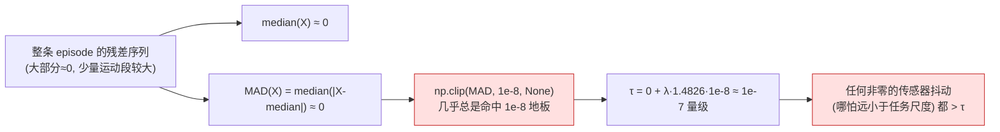
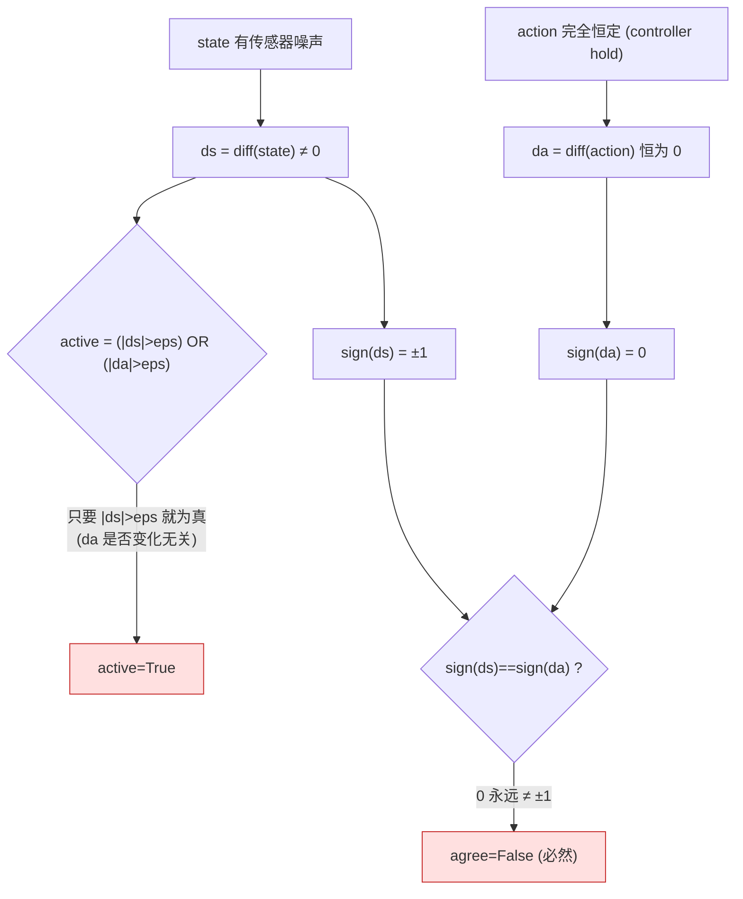
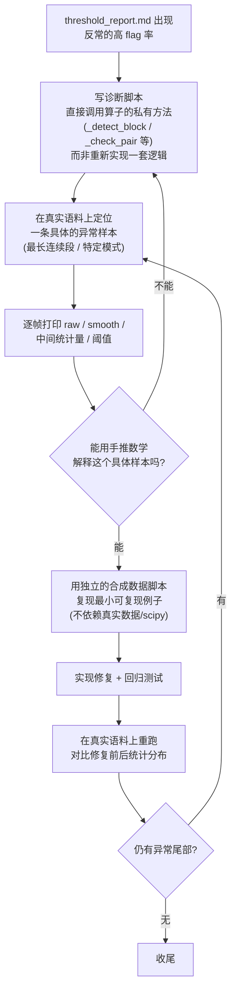

# data_cur6_1.md：Stage 1 / Stage 2 生产语料复盘与阈值算法修正（lerobot_press，2768 episode）

> 本文是 [`data_cur1_2.md`](data_cur1_2.md)（Stage 1 落地版）与 [`data_cur2_1.md`](data_cur2_1.md)（Stage 2 落地版）之后的**勘误 / 修正记录**。两份原文档实现的算子在合成数据与单元测试上都是对的，但接上真实 32 任务 / 2768 episode 的 `lerobot_press`（Galaxea R1 Lite）全量分析后，暴露出两个此前测试用例覆盖不到的**边界情况 bug**：
>
> - **Stage 1**：MAD 阈值在长时间静止段上会塌陷，把量化/控制噪声当成"突变"，`flagged_ratio` 中位数被顶到 **71.8%**。
> - **Stage 2**：符号一致性判据在"controller 保持位置不动"的帧上结构性地永远判 DISAGREE，`episode drop` 被拉高到 **29%**。
>
> 两个 bug 都不是"阈值选得不合适"，而是**判定公式本身在某类真实数据分布上退化**。本文记录问题现象、根因推导、真实数据实证、修复方案、代码改动与验证结果，供后续复现与举一反三。
>
> 代码落点：修复均在既有文件内完成（`data_juicer/_au/ops/filter/robot_sudden_change_filter.py`、`robot_state_action_alignment_filter.py`），未新增算子类；新增的诊断脚本与回归测试落在 `tests_au/`。

---

## 目录

- [1. 结论速览](#1-结论速览)
- [2. 背景：从 threshold_report.md 的异常数字说起](#2-背景从-threshold_reportmd-的异常数字说起)
- [3. Stage 1 根因分析：MAD 阈值塌陷](#3-stage-1-根因分析mad-阈值塌陷)
- [4. Stage 2 根因分析：符号比较的退化边界](#4-stage-2-根因分析符号比较的退化边界)
- [5. 横向对比：两个 bug 的共性（消融视角）](#5-横向对比两个-bug-的共性消融视角)
- [6. 诊断方法论：如何在没有可视化环境下确认假设](#6-诊断方法论如何在没有可视化环境下确认假设)
- [7. 回归测试与验证记录](#7-回归测试与验证记录)
- [8. 遗留问题与后续](#8-遗留问题与后续)
- [9. 文件索引](#9-文件索引)

---

## 1. 结论速览

| | Stage 1（突变检测） | Stage 2（状态-动作趋势对齐） |
|---|---|---|
| **判定公式退化的条件** | 某维长时间静止（量化/控制噪声主导） | 某维 action 长时间恒定（controller 保持位置） |
| **数学根因** | MAD 由静止段主导 → 阈值塌陷到 `1e-8` 地板附近 | `sign(0)`（action 不变）永远 ≠ `sign(≠0)`（state 噪声） |
| **判定条件改法** | median/MAD 只用"运动中"的帧估计 | `active` 由 `OR` 改 `AND`：两侧都要有变化才纳入统计 |
| **flagged_ratio / drop frac（修复前→后）** | p50 **71.8% → 2.4%**（mean 70.1%→3.6%） | drop frac **29.0% → 11.7%**（@da_threshold=0.6） |
| **若直接 episode_discard 的保留率** | **14.4% → 90.0%** | **71.1% → 88.3%** |
| **改动范围** | `_active_mask`（新增）+ `_dim_threshold`（改造） | `active` 判据一行 `\|` → `&` |
| **回归测试** | `test_mad_still_quantization_noise_suppressed` | `test_held_action_with_state_jitter_keep` |

一句话总结：**两个阶段的检测算法都隐含了"用整条 episode 的统计量做基线"的假设，而真实遥操作数据里"长时间保持不动"是常态而非例外，一旦基线被静止段主导，噪声就会被放大成"异常"**。修复的共同思路是——**只用信号真正在变化的那部分样本去估计"什么算正常波动"**。

---

## 2. 背景：从 threshold_report.md 的异常数字说起

[`data_cur1_2.md`](data_cur1_2.md)、[`data_cur2_1.md`](data_cur2_1.md) 把 Stage 1/2 在合成数据 + 16 条真实 episode（`Connect_Router_Cables_20250625_002`）上验收通过后就认为"落地完成"。但 16 条 episode 规模太小，覆盖不到"某个关节整段几乎不动"这种在**32 个任务、2768 条 episode** 的 `lerobot_press` 全量语料里其实很常见的模式（很多任务只用一只手臂，另一只手臂全程 hold 住）。

跑 `tests_au/ops/filter/accept_analyze_lerobot_press.sh` 全量分析后，`threshold_report.md` 里出现了两个异常到不合常理的数字：

- Stage 1：`flagged_ratio` 中位数 **0.7182**——意味着中位数意义上的 episode，一半以上的帧都被标成"突变"。
- Stage 2：`min_da` mean 只有 **0.7102**，而 p50 是 0.9674——分布严重左偏，说明有一批 episode 的某些维度 DA 掉到接近 0。

正常的"突变检测""方向一致性检测"，命中率应该是个位数到十几个百分点（对照 Stage 3 极值过滤的 mean flagged_ratio 5.55%），不可能有 70% 的帧/维度真的坏了。这是**信号，不是噪声**——说明检测算法本身在这批数据的某种分布特征上失效了，而不是"数据真的这么烂"。下面两章分别还原排查过程。

---

## 3. Stage 1 根因分析：MAD 阈值塌陷

### 3.1 判定公式回顾

Stage 1（[`data_cur1_2.md`](data_cur1_2.md) 第 3 章）对每一维信号计算：

$$
\mathrm{flag}_{t,d} = \big(r_{t,d} > \tau^{(r)}_d\big) \;\land\; \big(|a_{t,d}| > \tau^{(a)}_d \;\lor\; |j_{t,d}| > \tau^{(j)}_d\big)
$$

其中残差 $r$、加速度 $a$、jerk $j$ 各自的阈值都用 **MAD（median absolute deviation）** 稳健估计：

$$
\tau_d = \mathrm{median}(x_d) + \lambda \cdot 1.4826 \cdot \mathrm{MAD}(x_d), \qquad \mathrm{MAD}(x_d) = \mathrm{median}\big(|x_d - \mathrm{median}(x_d)|\big)
$$

代码里（修复前）：

```python
def _dim_threshold(self, values, scale, manual):
    if self.threshold_mode == "manual":
        return np.full(D, float(manual))
    med = np.nanmedian(values, axis=0)
    mad = np.nanmedian(np.abs(values - med), axis=0)
    return med + scale * 1.4826 * np.clip(mad, 1e-8, None)
```

`values` 是**整条 episode**的残差/加速度/jerk 序列。`np.clip(mad, 1e-8, None)` 这一行是唯一的"下限保护"——问题就出在这里。

### 3.2 数学根因：MAD 被静止段主导时会塌陷到地板值

MAD 是稳健统计量，前提是"异常值只占一小部分"。但如果一个关节在整条 episode 里 **70%~99% 的帧都几乎不动**（真实遥操作数据里"保持姿态"是常态），那么残差/加速度/jerk 序列里绝大多数值就是**量化噪声或近似零**，median 与 MAD 都会被这些"几乎为零"的样本主导：



一旦阈值塌陷到 `1e-7` 量级，**几乎不需要真的发生"突变"**——只要有量化步长级别的抖动（编码器分辨率、控制器微调），就会被判定超过阈值。这解释了为什么 `flagged_ratio` 会高达 71.8%：不是数据坏了，是检测器对"安静"的信号变得"过敏"。

### 3.3 真实数据实证

为确认假设，写了诊断脚本 [`tests_au/ops/filter/diag_stage1_long_run.py`](../../../tests_au/ops/filter/diag_stage1_long_run.py)（直接调用 `RobotSuddenChangeFilter._detect_block` 的真实逻辑，不是重新实现），在真实 episode `Arrange_Mineral_Water_Bottles_On_The_Desk_20250721_008/episode_000000` 上定位最长连续 flagged run（长度 176 帧），逐帧打出 dim0 的 raw/smooth/residual/threshold：

```
frame | raw       | smooth    | residual  | acc       | jerk      | flagged
  385 |   -0.0017 |   -0.0017 |   0.00000 |   0.00000 |  -0.00000 | FLAG
  ...
  407 |   -0.0013 |   -0.0017 |   0.00042 |  -0.00043 |   0.00000 | FLAG
  ...
```

`dim 0 (thr residual=0.00022, acc=0.00000, jerk=0.00038)` —— raw 值整段基本恒定在 `-0.0017`，偶尔跳到 `-0.0013`（量化步长 ≈ 0.0004），而这个跳变幅度**比自己的阈值还大一倍**。同一诊断脚本统计出的"近似零运动步长占比"（[`still_frac`](../../../tests_au/ops/filter/diag_stage1_long_run.py)）显示：R1 Lite 的关节里 dim3 有 99.4%、dim2 有 79.0%、dim0 有 71.0% 的步长是"近似不动"——这批关节绝大多数时间都在"保持"，正是 MAD 塌陷的前提条件。

为了把这个机制从"单条真实轨迹"抽象成可复现的最小例子，另外写了一个独立的数学验证脚本（合成"基本恒定 + 量化抖动 + 一段真实平滑运动"信号），对照修复前后的阈值计算：

| | 修复前（全帧估计） | 修复后（仅运动帧估计） |
|---|---|---|
| 阈值 | `8.9e-08`（塌陷到地板） | `0.0017`（反映真实运动噪声量级） |
| 总 flagged | 99/600（16.5%） | 3/600（0.5%） |
| 运动窗口**外**误报 | **70 帧** | **0 帧** |
| 真实运动段内命中 | 29/30 | 3/30 |

两组证据（真实轨迹 + 合成对照）互相印证：问题确实是"MAD 基线被静止段污染"，不是这一条 episode 或这一维关节的偶然现象。

### 3.4 修复方案

思路：**估计"什么算正常波动"这个基线时，只用信号真正在动的那些帧，把静止段的量化/控制噪声排除在基线估计之外**。

新增 `_active_mask`：逐维判断每一帧相对上一帧的位移是否超过该维量程的一个比例（`active_vel_frac`，默认 2%）：

```python
def _active_mask(self, xs: np.ndarray) -> np.ndarray:
    T, D = xs.shape
    vel = np.zeros((T, D), dtype=float)
    if T >= 2:
        vel[1:] = np.abs(np.diff(xs, axis=0))
        vel[0] = vel[1]
    rng = np.nanmax(xs, axis=0) - np.nanmin(xs, axis=0)
    eps = self.active_vel_frac * rng
    return vel > eps[None, :]
```

`_dim_threshold` 改造为：给定 `active_mask` 时，逐维只用运动中的帧算 median/MAD；若某维运动中的帧数不足 `min_active_frames_for_threshold`（默认 20），退回用全部帧估计（保证本身长期静止的维度不会因样本太少导致 MAD 估计不稳定，行为退化为修复前的样子，是安全的 fallback，不会变得更差）：

```python
def _dim_threshold(self, values, scale, manual, active_mask=None):
    if self.threshold_mode == "manual":
        return np.full(D, float(manual))
    if active_mask is None:
        med = np.nanmedian(values, axis=0)
        mad = np.nanmedian(np.abs(values - med), axis=0)
        return med + scale * 1.4826 * np.clip(mad, 1e-8, None)
    med = np.zeros(D); mad = np.zeros(D)
    for d in range(D):
        col, act = values[:, d], active_mask[:, d]
        sub = col[act] if int(act.sum()) >= self.min_active_frames_for_threshold else col
        m = float(np.nanmedian(sub))
        med[d], mad[d] = m, float(np.nanmedian(np.abs(sub - m)))
    return med + scale * 1.4826 * np.clip(mad, 1e-8, None)
```

`_detect_block` 里，`active_mask` 在角度解卷绕之后、平滑之前算出，同时喂给残差/加速度/jerk 三处阈值计算：

```python
active_mask = self._active_mask(xs)
smooth = self._cascaded_smooth(xs)
residual = np.abs(xs - smooth)
acc, jerk = self._finite_diff(xs)
tr = self._dim_threshold(residual, self.mad_scale_residual, self.residual_threshold, active_mask)
ta = self._dim_threshold(np.abs(acc), self.mad_scale_acc, self.acc_threshold, active_mask)
tj = self._dim_threshold(np.abs(jerk), self.mad_scale_jerk, self.jerk_threshold, active_mask)
```

新增两个可配置参数（均有合理默认值，无需为存量 recipe 加参数即可生效）：

| 参数 | 默认 | 含义 |
|---|---|---|
| `active_vel_frac` | 0.02 | 位移超过该维量程的这个比例才算"运动中" |
| `min_active_frames_for_threshold` | 20 | 运动中帧数不足则退回全帧估计（安全 fallback） |

### 3.5 修复前后：全量语料对比

在 `lerobot_press`（2768 episode）上重跑 `accept_analyze_lerobot_press.sh`：

| 指标 | 修复前 | 修复后 |
|---|---|---|
| flagged_ratio p50 | 0.7182 | **0.02387** |
| flagged_ratio mean | 0.7011 | **0.03598** |
| flagged_ratio p90 / p95 | 0.9012 / 0.9505 | 0.05314 / 0.0756 |
| max_run p50 / mean | 268 / 274.7 | **4 / 9.739** |
| 若 episode_discard 保留率 | 14.4% | **90.0%** |

修复后的量级已经和 Stage 3（极值过滤 mean flagged_ratio 5.55%）在同一水平线上，说明"排除静止帧再估计基线"这个方向是对的。

**一个尚未收尾的尾部**：`max_run` 的 `max` 修复后仍有 **867**（p95 只有 14），说明至少有一条 episode 出现了很长的连续异常段。这可能是真坏数据（Stage 1 终于能挑出来了），也可能是修复后暴露的新边界情况，尚未定位到具体是哪条——见第 8 章。

---

## 4. Stage 2 根因分析：符号比较的退化边界

### 4.1 判定公式回顾

Stage 2（[`data_cur2_1.md`](data_cur2_1.md) 第 3 章）对每个共享关节维计算方向一致性 DA：

$$
\mathrm{DA}_d = \frac{1}{|\mathcal{A}_d|}\sum_{t\in\mathcal{A}_d}\mathbb{1}\big[\mathrm{sign}(\Delta \hat s_{t,d}) = \mathrm{sign}(\Delta \hat a_{t,d})\big], \qquad \mathrm{keep} = \bigwedge_d(\mathrm{DA}_d \ge \tau_{\mathrm{DA}})
$$

其中"显著运动帧"集合 $\mathcal{A}_d$（修复前）定义为：

$$
\mathcal{A}_d = \{\,t : |\Delta \hat s_{t,d}| > \epsilon_d \;\lor\; |\Delta \hat a_{t,d}| > \epsilon_d\,\}
$$

代码（修复前）：

```python
ds = np.diff(sa[:m])
da = np.diff(aa[:m])
eps = self._eps_for_dim(d, xs)
active = (np.abs(ds) > eps) | (np.abs(da) > eps)     # 或
if int(active.sum()) < self.min_active_frames:
    continue
agree = np.sign(ds[active]) == np.sign(da[active])
```

### 4.2 数学根因：`sign(0)` 与"hold"阶段的结构性冲突

问题出在"或"这个条件本身。设想 controller 在某一维**保持位置不动**（没有发新指令）——这在真实任务里极常见：很多任务只用一只手臂操作，另一只手臂全程 hold 住。这时：

- `action` 完全恒定 → `da = np.diff(action)` **精确等于 0**（不是"很小"，是数学上严格的 `0.0`）。
- `state` 上有真实存在的传感器/控制噪声 → `ds = np.diff(state)` 是非零的小抖动。

`np.sign(0) = 0`，而 `np.sign(非零) = ±1`。**`0` 永远不等于 `±1`**——这不是概率意义上的"大概率不一致"，是严格的数学事实。只要这一帧被"或"条件判定为 `active`（因为 state 侧的抖动超过了 eps），`agree` 就必然是 `False`：



这跟"时间戳错位""丢包"这些 Stage 2 本来要抓的真实缺陷完全无关——它是**判定公式在"一侧恒定、另一侧有噪声"这个退化情形下的结构性必然结果**，跟数据质量无关，纯粹是数学。而且这个 hold 阶段往往持续很多帧，一旦命中就会连续拉低 DA。

### 4.3 真实数据实证

用诊断脚本 [`tests_au/ops/filter/diag_stage2_flagged_dim.py`](../../../tests_au/ops/filter/diag_stage2_flagged_dim.py)（复用 `RobotStateActionAlignmentFilter` 本体的 `_smooth_1d`/`_best_lag`/`_eps_for_dim`/`_check_pair`）扫描真实语料，命中的第一条 `left_only` 模式 episode（`Arrange_Mineral_Water_Bottles_On_The_Desk_20250721_008/episode_000000`）：

```
flagged={0: 0.0097, 2: 0.0137, 3: 0.0218, 4: 0.0, 5: 0.0, 6: 0.2716}

--- dim 0: raw range state=[-0.0028,-0.0013] (std=0.00019)  action=[-0.0015,-0.0015] (std=0.00000) ---
--- dim 4: raw range state=[-0.0036,0.0012] (std=0.00030)  action=[-0.0015,-0.0015] (std=0.00000) ---
--- dim 5: raw range state=[-0.0019,0.0013] (std=0.00020)  action=[-0.0000,-0.0000] (std=0.00000) ---
```

dim 0/4/5 的 **action `std=0.00000`——整段完全恒定**，state 侧却有真实（虽然很小）的传感器噪声——正是 4.2 节推导的退化情形。dim 3 是另一种变体：state 侧卡在量化底部（`[-0.0004, 0.0000]`）几乎不变，action 侧在动——同样是"一侧恒定"，只是恒定的一侧换成了 state。只有 dim 6 两侧 std 量级相当（0.00096 vs 0.00091），是**唯一一个有部分真实信号**的维度，DA 也明显更高（0.2716，比其余 0.0~0.02 高一截）。

再用一次性统计脚本对全部 2768 episode 的 `flagged` 维度做同 episode 共现分析（详见第 6 章方法论），发现被 flag 的 episode 里，同一 episode 同侧手臂 **4-6 维同时倒下** 的占大多数（468/802，58%），零散 1-2 维的只占 12%——这进一步印证：不是"每一维各自独立地偶尔判错"，是"一旦某只手臂在这条 episode 里进入 hold 阶段，它下面的关节会**同时**被误判"，与 4.2 节的机制完全吻合（hold 阶段是整只手臂共享的状态，不是单个关节独立发生的）。

### 4.4 修复方案

把 `active` 的"或"改成"与"：

```python
ds = np.diff(sa[:m])
da = np.diff(aa[:m])
eps = self._eps_for_dim(d, xs)
active = (np.abs(ds) > eps) & (np.abs(da) > eps)     # 与
if int(active.sum()) < self.min_active_frames:
    continue
agree = np.sign(ds[active]) == np.sign(da[active])
```

语义上更贴合 Stage 2 的设计初衷：它检验的是"action 变了之后 state 是否跟着同方向变"这一因果关系；如果 action 根本没有发出"变化的指令"（`da=0`），就没有方向可言，这一帧本就不该拿来做符号比较。改成"与"后，只有**两侧都确实有变化**的帧才纳入统计——dim0/2/3/4/5 这种"一侧恒定"的退化情形会被正确剔除，dim6 这种"两边都真的在动"的情形照常检测，不会因为改动而漏检真实缺陷。

> **为何不是只判 action 侧（`|da|>eps`）**：Stage 2 的因果方向是 action→state，理论上只要"action 变了"就该检验 state 是否跟随，似乎该单独判 `|da|>eps`。但如果反过来 state 侧不动、action 侧疯狂变化（比如 state 传感器卡死不响应指令），单独判 action 侧会漏检这类"state 失响应"的真实缺陷。"与"条件同时保留了对两类真实故障（本节的方向不一致 + state 不响应）的敏感度，代价是可能漏检个别"state 完全卡死"的极端情形——这类情形更适合用专门的"state 响应性"检查覆盖，不在本次修复范围内（见第 8 章）。

### 4.5 修复前后：单条 episode + 全量语料对比

同一条命中的 episode，修复前后：

| | 修复前 | 修复后 |
|---|---|---|
| `checked_dims` | 12 维（全部左右臂关节） | **8 维**（dim 0/2/4/5 不再进入统计） |
| dim3 DA | 0.0218（flagged） | **0.9048**（通过） |
| dim6 DA | 0.2716（flagged） | **0.8111**（通过） |
| episode 结果 | 6 维 flagged，整条丢弃 | `flagged={}`，**整条通过** |

全量语料（2768 episode）：

| 指标 | 修复前 | 修复后 |
|---|---|---|
| min_da p50 / mean | 0.9674 / 0.7102 | **0.9954 / 0.8712** |
| mean_da mean | 0.8643 | **0.9443** |
| drop frac @ da_threshold=0.6 | 28.9% | **11.7%** |
| drop frac @ da_threshold=0.65 | 29.0% | 14.4% |
| 预计保留率（@0.6） | 71.1% | **88.3%** |

`min_da` 的 p50 几乎顶到 1.0，说明"一侧 hold、另一侧噪声"确实是绝大多数误报的主因。修复后剩余的 ~12-16% drop，其被 flag 的维度组合是否仍呈"同侧多维同时倒下"的模式（意味着是真实缺陷）还未在修复后的数据上复核，见第 8 章。

---

## 5. 横向对比：两个 bug 的共性（消融视角）

| | Stage 1 | Stage 2 |
|---|---|---|
| 退化触发条件 | 某维长时间静止 | 某维 action 长时间恒定 |
| 被污染的统计量 | MAD（尺度估计） | sign（符号比较） |
| 污染来源 | 静止段的量化/控制噪声混进"正常波动"的基线样本 | 恒定信号的 `sign(0)` 与非常规值域比较 |
| 表现形式 | 阈值塌陷到地板值 → 任何抖动都超阈值 | 符号必然不等 → 任何"活跃帧"都判不一致 |
| 修复共同思路 | **只用信号真正在变化的样本估计"正常"基线 / 判定条件** | 同上 |
| 是否需要"关节语义"先验 | 不需要（纯统计，`active_vel_frac` 是相对量程的比例） | 不需要（`eps` 已是逐维相对量程） |

**消融视角的推论**：这两个 bug 不是"这两个算子写得不好"，而是**任何"用整条轨迹的统计量做基线，再拿这个基线去判定局部异常"的检测器，在轨迹存在大段静止/保持的场景下都有相同的失效模式**。如果未来给 Stage 3（极值过滤，percentile-based）或新的 Stage 4/5 也复用"MAD/sign 类"判据，应该默认加上"先筛出运动中的样本再估计基线"这一步，而不是等真实语料暴露问题后再补。Stage 3 之所以这次没有踩坑，是因为它一开始就用的是**跨 episode 全局分位数带**（不受单条 episode 内部静止段比例影响），侧面印证了"用更大、更稳健的样本集估计基线"是更根本的解法。

---

## 6. 诊断方法论：如何在没有可视化环境下确认假设

本次排查全程没有可视化环境（本机无法访问真实数据、无 GUI），确认假设走的是"**复用被测算子的真实私有方法 + 打印中间量**"这条路径，而不是凭统计分布猜测。这个方法论本身值得记录，方便后续 Stage 调参复用：



两个关键实践点：

1. **诊断脚本必须复用被测算子的真实私有方法**（如 `op._detect_block(block)`、`op._check_pair(state, action)`），而不是照着算法描述重新写一遍——否则诊断结果和生产行为可能不一致，白白排查错方向。
2. **本地环境缺依赖（本例缺 scipy）时，用独立的合成数据脚本单独验证"数学机制"本身**，跳过依赖平滑步骤的部分（例如常数数组无论如何平滑差分后仍严格为 0，这个性质不依赖 scipy 的具体实现），把"复现机制"和"复现生产环境"拆成两个独立可验证的问题。

---

## 7. 回归测试与验证记录

### 7.1 新增单元测试

| 测试 | 文件 | 覆盖场景 |
|---|---|---|
| `test_mad_still_quantization_noise_suppressed` | `tests_au/ops/filter/test_robot_sudden_change_filter.py` | 长静止段 + 量化抖动 + 一段真实平滑运动，断言 flagged_ratio 保持低位 |
| `test_held_action_with_state_jitter_keep` | `tests_au/ops/filter/test_robot_state_action_alignment_filter.py` | action 完全恒定 + state 远超 eps 的噪声，断言该维不进入 `checked_dims` |

顺带修复了两个测试文件里 `_load_episode_parquet`（含 `test_real_dataset_pipeline` 内联的同构代码）硬编码读取 `df["observation.state"]`/`df["action"]` 统一列名的预置 bug——真实数据集（`Connect_Router_Cables_20250625_002`）用的是 Galaxea 分解式列名（`observation.state.left_arm` 等），改为调用项目已有的 `load_episode_arrays`（同时兼容两种 schema）。

真实环境执行记录（`python -m pytest tests_au/ops/filter/test_robot_state_action_alignment_filter.py -v`）：

```
12 items collected, 12 passed (含新增回归测试与两处 schema 修复后的真实数据测试)
```

### 7.2 新增诊断/运维脚本

| 脚本 | 用途 |
|---|---|
| `tests_au/ops/filter/diag_stage1_long_run.py` | 对指定 episode 逐帧打印 Stage 1 的 raw/smooth/residual/阈值，定位某条最长连续 flagged run 是否为真实异常 |
| `tests_au/ops/filter/diag_stage1_find_worst.py` | 扫描全量语料，按 `max_run` 排序找出 Stage 1 判定最"坏"的若干条 episode（复用 `compute_stats_single` 真实生产代码路径） |
| `tests_au/ops/filter/diag_stage2_flagged_dim.py` | 扫描语料找出匹配指定 flag 模式（如 `left_only`）的 episode，逐维打印 lag 对齐后的 state/action 序列，区分"真实缺陷"与"闲置手臂噪声" |

三个脚本都遵循同一原则：复用被测算子的真实方法，不重新实现检测逻辑，保证诊断结果与生产行为一致。

### 7.3 全量语料复跑记录

`bash tests_au/ops/filter/accept_analyze_lerobot_press.sh`（2768 episode）修复前后的 `threshold_report.md` 对比已在第 3.5、4.5 节列出，此处不重复。

---

## 8. 遗留问题与后续

| 项 | 现状 | 建议 |
|---|---|---|
| Stage 1 `max_run` 尾部极端值（修复后仍有 867，p95 仅 14） | 已写好 `diag_stage1_find_worst.py` 定位脚本，尚未在真实环境跑出具体是哪条 episode | 用该脚本定位后，接 `diag_stage1_long_run.py --index <idx>` 看具体波形，判断是真坏数据还是新边界情况 |
| Stage 2 修复后剩余 ~12-16% drop 是否仍是"同侧多维同时倒下"模式 | 修复前的共现分析（第 4.3 节引用的统计）用的是修复前的 stats 文件；修复后没有重新跑这个共现分析 | 在修复后的 `analyze_result_stats.jsonl` 上重跑同样的"同 episode flagged 维度共现"统计，确认剩余 drop 是否仍集中在"整只手臂同时失败"这一模式（→ 真实缺陷，可放心用 `da_threshold=0.6` 收尾） |
| Stage 2"state 完全卡死不响应 action"这类缺陷 | 本次 AND 修复会让这类情形在"state 侧不动"时不再进入活跃帧统计，理论上可能降低对这类缺陷的敏感度（见 4.4 节附注） | 若后续要覆盖"state 响应性"缺陷，应作为独立的检查项，不建议在现有 DA 判据里再叠加条件 |
| `clean_recipe_suggested.yaml` 是否可直接投产 | 两处阈值均已基于修复后的真实分布重新生成建议值（`max_flagged_ratio: 0.0531`、`da_threshold: 0.6`） | 建议先处理完上面两项遗留问题，再把该文件当作生产清洗配置的定稿 |

---

## 9. 文件索引

| 路径 | 说明 |
|---|---|
| `data_juicer/_au/ops/filter/robot_sudden_change_filter.py` | Stage 1，本次改动：新增 `_active_mask`，改造 `_dim_threshold` |
| `data_juicer/_au/ops/filter/robot_state_action_alignment_filter.py` | Stage 2，本次改动：`_check_pair` 里 `active` 判据 `\|`→`&` |
| `tests_au/ops/filter/test_robot_sudden_change_filter.py` | 新增 `test_mad_still_quantization_noise_suppressed`；修复 `_load_episode_parquet` schema bug |
| `tests_au/ops/filter/test_robot_state_action_alignment_filter.py` | 新增 `test_held_action_with_state_jitter_keep`；修复同一处 schema bug |
| `tests_au/ops/filter/diag_stage1_long_run.py` | Stage 1 单 episode 逐帧诊断脚本 |
| `tests_au/ops/filter/diag_stage1_find_worst.py` | Stage 1 全量语料找最坏 episode 脚本 |
| `tests_au/ops/filter/diag_stage2_flagged_dim.py` | Stage 2 按 flag 模式扫描定位 episode 脚本 |
| `tests_au/ops/filter/outputs/press_analyze/threshold_report.md` | 修复前后的全量分析报告（历史版本需自行保留对比） |
| [`data_cur1_2.md`](data_cur1_2.md) | Stage 1 原始落地实现文档（本文档修正的对象） |
| [`data_cur2_1.md`](data_cur2_1.md) | Stage 2 原始落地实现文档（本文档修正的对象） |
