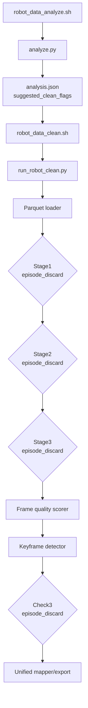
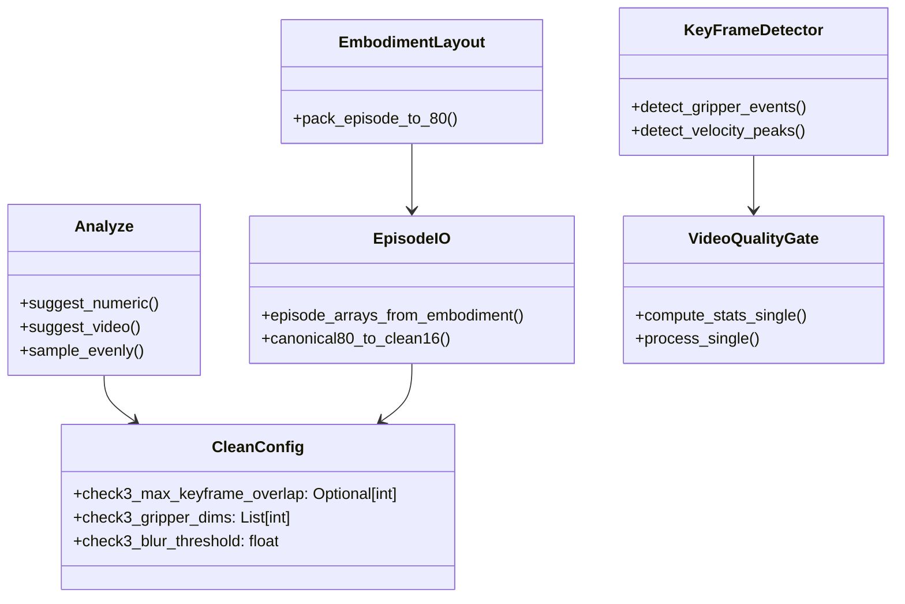
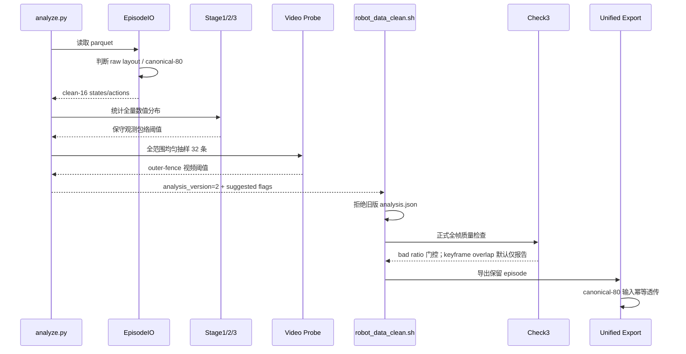

# data_cur_debug_2.md：仿真数据清洗误删与 canonical-80 二次切片修复

> 本文记录 `post_train/stack_bowls_three` 仿真数据清洗时，50 条 episode 最终只保留 33 条（丢弃 34%）的问题定位与修复。
>
> 这次问题不是单一阈值错误，而是四类问题叠加：
>
> 1. 分析器按固定分位数生成阈值，即使数据全部健康也会主动淘汰尾部；
> 2. Check3 对“坏帧与关键帧存在任意重合”采用零容忍整集删除；
> 3. 视频探针只取数据集前 8 条，无法代表后半段 episode；
> 4. 当前源 parquet 已是 canonical-80，但 metadata 仍声明 14 维，loader 会按 ALOHA 原始布局再次切片，静默读取错误维度。
>
> 修复代码均位于 `data_juicer/_au/`，回归测试位于 `tests_au/`。

---

## 目录

- [1. 现象与结论](#1-现象与结论)
- [2. 原流水线的真实删除位置](#2-原流水线的真实删除位置)
- [3. Bug 1：固定淘汰率阈值](#3-bug-1固定淘汰率阈值)
- [4. Bug 2：Check3 关键帧零容忍](#4-bug-2check3-关键帧零容忍)
- [5. Bug 3：视频探针前缀采样](#5-bug-3视频探针前缀采样)
- [6. Bug 4：canonical-80 被再次按原始布局切片](#6-bug-4canonical-80-被再次按原始布局切片)
- [7. 修复后的静态与动态架构](#7-修复后的静态与动态架构)
- [8. 代码改动](#8-代码改动)
- [9. 回归测试与真实数据验证](#9-回归测试与真实数据验证)
- [10. 重新运行方法](#10-重新运行方法)
- [11. 遗留风险](#11-遗留风险)
- [12. 文件索引](#12-文件索引)

---

## 1. 现象与结论

### 1.1 原始统计

数据集：

```text
/mnt/r/DATA/pre_train_v1/post_train/stack_bowls_three
```

原始 metadata：

```text
total_episodes = 50
total_frames   = 23550
fps            = 15
robot_type     = aloha
```

原清洗结果：

```text
kept_episodes = 33
kept_frames   = 15609
```

因此：

$$
\text{episode drop ratio} = \frac{50-33}{50}=34\%
$$

$$
\text{frame drop ratio} = \frac{23550-15609}{23550}\approx33.72\%
$$

这里的帧数减少不是对保留 episode 做了帧级裁剪，而是整条 episode 被删除后，在总帧数上的投影。

### 1.2 分阶段归因

| 阶段 | 输入 | 删除 | 保留 |
|---|---:|---:|---:|
| Pointer | 50 | 0 | 50 |
| Stage1 突变检测 | 50 | 7 | 43 |
| Stage2 状态-动作对齐 | 43 | 0 | 43 |
| Stage3 极值检测 | 43 | 0 | 43 |
| Check3 视频门控 | 43 | 10 | 33 |
| Unified export | 33 | 0 | 33 |

Stage1 删除：

```text
episode_000009
episode_000013
episode_000014
episode_000017
episode_000030
episode_000035
episode_000045
```

Check3 删除：

```text
episode_000000
episode_000020
episode_000021
episode_000023
episode_000037
episode_000038
episode_000040
episode_000041
episode_000043
episode_000044
```

---

## 2. 原流水线的真实删除位置



生产 recipe 中 Stage1、Stage2、Stage3 和 Check3 都是 episode 级门控。

任一阶段返回 `False`，整条 episode 就不会传给后续阶段。Unified export 只遍历 `cleaned.jsonl` 中的保留集，对每条保留 episode 仍写出完整的 $T$ 帧。

---

## 3. Bug 1：固定淘汰率阈值

### 3.1 修复前算法

原分析器定义：

```python
TARGET_KEEP = 0.90
```

Stage1 建议阈值：

$$
\tau_{\mathrm{ratio}}=P_{90}(\mathrm{flagged\ ratio})
$$

$$
\tau_{\mathrm{run}}=\left\lceil P_{90}(\mathrm{max\ run}) \right\rceil
$$

Stage2 则从 $\{0.60,0.65,0.70\}$ 中选择“最接近 10% 淘汰率”的阈值。

### 3.2 为什么这是算法问题

分位数只能描述数据分布的位置，不能直接证明尾部样本是坏数据。

如果输入 50 条 episode 全部健康，使用 P90 作为门槛仍会把约 10% 的尾部定义成异常。Stage1 又同时使用 ratio 和 max-run 两个门控，二者取并集后淘汰率可能超过 10%。

本次正好表现为：

```text
Stage1 ratio gate ∪ max-run gate = 7/50 = 14%
```

这属于“由阈值生成策略制造的异常”，而不是由外部质量标签证明的坏数据。

### 3.3 修复方案：保守观测包络

新策略不再设置固定淘汰目标，而是把当前分析集的完整观测范围作为基线：

$$
\tau_{\mathrm{ratio}}=
\max\left(
0.3,\;
Q_3+3IQR,\;
\max(\mathrm{ratio})
\right)
$$

$$
\tau_{\mathrm{run}}=
\max\left(
10,\;
\left\lceil Q_3+3IQR \right\rceil,\;
\max(\mathrm{run})
\right)
$$

Stage2：

$$
\tau_{\mathrm{DA}}=
\min\left(
0.65,\;
Q_1-3IQR,\;
\min(\mathrm{min\_DA})
\right)
$$

由于算子判定使用严格的 `>` 或 `<`，阈值等于当前观测最大值/最小值时，当前分析集不会被自动删除；未来超出基线的新数据仍会被门控。

这是一种偏保守的策略：在没有人工质量标签时，宁可把可疑尾部写进报告供检查，也不直接把它当成坏数据删除。

---

## 4. Bug 2：Check3 关键帧零容忍

### 4.1 修复前条件

原 Check3 删除条件：

```text
bad_ratio > 0.1
OR good_frames < 20
OR keyframe_overlap > 0
```

其中：

```text
max_keyframe_overlap = 0
```

只要任意坏帧落入关键帧保护窗口，整条 episode 就会被删除。

### 4.2 实际误删证据

两条 episode 的总体坏帧率远低于 10%，仅因关键帧重合被删除：

| Episode | bad ratio | keyframe overlap | 原结果 |
|---|---:|---:|---|
| `episode_000037` | 5.07% | 9 | 删除 |
| `episode_000041` | 2.22% | 2 | 删除 |

一次或少量画面模糊与速度峰值窗口重合，并不足以证明完整演示不可训练。零容忍条件把“值得关注”错误地提升成了“必须删除”。

### 4.3 关键帧本身也不准确

原 recipe 没有给 `robot_key_frame_detector_mapper` 配置 `gripper_dims`，因此：

```text
num_gripper_events = 0
```

所谓关键帧全部来自 state velocity 的 95 分位峰值，并不一定对应真正的抓取、释放或接触事件。

### 4.4 修复方案

1. `max_keyframe_overlap` 默认改为 `None`；
2. 关键帧重合继续写入 stats/report，但默认不参与删除；
3. 如果业务确实需要关键帧硬门控，可以显式传：

```bash
--check3-max-keyframe-overlap <N>
```

4. recipe 显式配置 canonical clean-16 的夹爪维：

```text
gripper_dims = [7, 15]
exempt_dims  = [7, 15]
```

5. 新增相对量程阈值：

$$
\tau_g =
\max\left(
0.05\cdot(q_{99}-q_{01}),\;
\mathrm{median}(|\Delta g|)+6\cdot1.4826\cdot MAD(|\Delta g|)
\right)
$$

它同时兼容 $[0,1]$ 归一化夹爪和 $[0,100]$ 量纲夹爪，不再依赖固定的绝对阈值 `5.0`。

---

## 5. Bug 3：视频探针前缀采样

### 5.1 修复前

```python
vfiles = vfiles[:probe_video_episodes]
```

默认只检查排序后的前 8 个视频，并以 2 FPS 抽帧。

本次被 Check3 删除的 episode 大部分位于 20 以后：

```text
20, 21, 23, 37, 38, 40, 41, 43, 44
```

因此前 8 条无法代表后半段分布。

### 5.2 修复后

默认探针数提升到 32，并通过 `linspace` 在完整有序 episode 列表上均匀取样：

```python
indices = np.linspace(0, len(items) - 1, num=limit, dtype=int)
```


模糊阈值也从固定 P2 改为低侧 outer fence：

$$
\tau_{\mathrm{blur}}=
\max\left(
1.0,\;
Q_1-3IQR
\right)
$$

这样不会再按定义固定把约 2% 的健康帧标记为模糊，只捕获与主体清晰度分布明显分离的低侧尾部。

无分析结果时，保守 fallback 从 `50/20` 统一改为：

```text
blur_threshold = 1.0
```

---

## 6. Bug 4：canonical-80 被再次按原始布局切片

### 6.1 数据与 metadata 不一致

当前 parquet 实际列为：

```text
observation.state: 80 dims
action:            80 dims
action_dim_mask:   80 dims
```

但 `meta/info.json` 仍声明：

```text
observation.state: 14 dims
action:            14 dims
```

80 维数据已经是 Qwen-RobotManip canonical layout：

```text
left arm block : [0, 29)
right arm block: [29, 58)
shared block   : [58, 80)
```

关键位置：

```text
left joints  = [0:7]
left gripper = [16]
right joints = [29:36]
right gripper= [45]
```

### 6.2 原 loader 的错误行为

原 `episode_arrays_from_embodiment` 会优先应用 ALOHA YAML：

```text
left state_slice  = [0, 6]
left gripper      = [6, 7]
right state_slice = [7, 13]
right gripper     = [13, 14]
```

这些 slice 只适用于原始 14 维 ALOHA 数据。对 canonical-80 再切一次不会报错，因为 `[0:14]` 在 80 维数组中合法，但语义已经完全不同。

这是最危险的一类 bug：**shape 合法、程序正常运行、数值语义错误**。

实际复算中，错误 loader + 旧 percentiles 会使 Stage3：

```text
mean flagged ratio = 50.95%
episode drop ratio = 96%
```

### 6.3 修复后的 canonical-80 → clean-16

检测到 state/action 都是 80 维时，不再应用 embodiment 原始 slice，而是按 canonical 固定槽位恢复 clean-16：

$$
x_{16} =
\left[
x^L_{joint,0:7},
x^L_{gripper},
x^R_{joint,0:7},
x^R_{gripper}
\right]
$$

对应实现：

```text
left joints   <- canonical[0:7]
left gripper  <- canonical[16]
right joints  <- canonical[29:36]
right gripper <- canonical[45]
```

`pack_episode_to_80` 同样增加了幂等保护：

```text
输入已经是 canonical-80
    → state/action 原样返回
    → 优先保留现有 action_dim_mask
    → 不再次按 embodiment 打包
```

因此 canonical export 现在满足：

$$
\mathrm{pack80}(\mathrm{canonical80})=\mathrm{canonical80}
$$

---

## 7. 修复后的静态与动态架构

### 7.1 组件职责



### 7.2 动态流程



---

## 8. 代码改动

### 8.1 阈值分析

文件：

```text
data_juicer/_au/pipeline/robot_clean/analyze.py
```

改动：

- 删除 `TARGET_KEEP=0.90`；
- 新增 upper/lower outer fence；
- Stage1/2 使用 conservative observed envelope；
- 视频从完整列表均匀抽取；
- probe 数从 8 提升到 32；
- blur 阈值从 P2 改为 lower outer fence；
- 输出 `analysis_version=2`。

### 8.2 Check3

文件：

```text
data_juicer/_au/pipeline/robot_clean/config.py
data_juicer/_au/pipeline/robot_clean/recipe.py
data_juicer/_au/ops/mapper/robot_key_frame_detector_mapper.py
data_juicer/_au/ops/filter/robot_video_quality_episode_filter.py
```

改动：

- `check3_max_keyframe_overlap` 默认 `None`；
- 夹爪维配置为 `[7,15]`；
- 夹爪不参与 velocity peak；
- 新增尺度自适应夹爪变化阈值；
- overlap 继续进入 stats/report。

### 8.3 Schema 与 canonical 幂等

文件：

```text
data_juicer/_au/utils/lerobot_episode_io.py
data_juicer/_au/utils/embodiment_layout.py
```

改动：

- canonical-80 正确还原 clean-16；
- canonical-80 再导出时幂等透传；
- 保留已有 `action_dim_mask`。

### 8.4 脚本保护

文件：

```text
b/scripts/robot_data_analyze.sh
b/scripts/robot_data_clean.sh
```

改动：

- 默认视频 probe 数改为 32；
- 无分析时 blur fallback 改为 1；
- 清洗拒绝复用 `analysis_version < 2` 的旧分析文件。

旧版分析文件不会被静默接受，而会输出：

```text
[ERROR] analysis.json 由旧版阈值策略生成，拒绝复用以避免误删。
请先重新运行 b/scripts/robot_data_analyze.sh
```

---

## 9. 回归测试与真实数据验证

### 9.1 新增/更新测试

| 测试 | 覆盖内容 |
|---|---|
| `test_numeric_thresholds_do_not_reject_a_fixed_healthy_tail` | 不再按固定比例删除分析集尾部 |
| `test_video_threshold_does_not_mark_a_fixed_percentile_bad` | 健康帧不再固定有 2% 被标坏 |
| `test_video_probe_is_evenly_distributed` | probe 覆盖数据集首尾与中段 |
| `test_recipe_uses_semantic_keyframes_without_default_rejection` | 夹爪维配置正确，overlap 默认关闭 |
| `test_keyframe_overlap_is_report_only_by_default` | overlap 保留统计但不删除 |
| `test_scale_relative_gripper_threshold_on_normalized_states` | 支持归一化夹爪 |
| `test_canonical80_is_not_sliced_as_raw_embodiment_input` | canonical-80 正确恢复 clean-16，重复导出幂等 |

执行：

```bash
python -m pytest \
  tests_au/ops/mapper/test_lerobot_episode_io_embodiment.py \
  tests_au/pipeline/robot_clean/test_analyze.py \
  tests_au/ops/mapper/test_robot_key_frame_detector_mapper.py \
  tests_au/ops/filter/test_robot_video_quality_episode_filter.py -q
```

结果：

```text
25 passed
```

CUDA/NVML warning来自测试环境无法初始化 GPU，不影响这些 CPU 单元测试。

### 9.2 当前 ALOHA 数据复算

修复 canonical loader 并重新计算 16 维 percentiles 后：

```text
episodes = 50
frames   = 23550
dim      = 16
```

建议阈值：

```text
s1_max_flagged_ratio = 0.7867
s1_max_run_length    = 55
s2_da_threshold      = 0.65
s3_alpha             = 0.1
check3_blur_threshold= 1.0
```

分析阶段预计：

| 阶段 | 预计 episode drop |
|---|---:|
| Stage1 | 0% |
| Stage2 | 0% |
| Stage3 | 0% |
| Numeric union | 0% |
| Check3 视频探针 | 0% |

这里的 0% 不表示永久关闭清洗，而是表示当前 50 条数据都落在本次分析建立的健康基线内；未来超过该包络的新样本仍会被标记。

---

## 10. 重新运行方法

旧 `analysis.json` 没有 `analysis_version=2`，必须先重新分析。

### 10.1 重新分析

```bash
DATASET_ROOT=/mnt/r/DATA/pre_train_v1/post_train \
OUT_ROOT=/mnt/r/DATA/pre_train_v1/post_train_clean/analyze \
bash b/scripts/robot_data_analyze.sh
```

检查：

```bash
python - <<'PY'
import json
p = "/mnt/r/DATA/pre_train_v1/post_train_clean/analyze/stack_bowls_three/analysis.json"
d = json.load(open(p))
print("analysis_version:", d["analysis_version"])
print("suggested_clean_flags:", d["suggested_clean_flags"])
print("estimated_wash:", d["estimated_wash"])
PY
```

### 10.2 重新清洗

```bash
DATASET_ROOT=/mnt/r/DATA/pre_train_v1/post_train \
OUT_ROOT=/mnt/r/DATA/pre_train_v1/post_train_clean \
ANALYZE_ROOT=/mnt/r/DATA/pre_train_v1/post_train_clean/analyze \
bash b/scripts/robot_data_clean.sh
```

### 10.3 验证输出

```bash
python - <<'PY'
import json
p = "/mnt/r/DATA/pre_train_v1/post_train_clean/stack_bowls_three/run_summary.json"
d = json.load(open(p))
print("kept_episodes:", d["kept_episodes"])
print("unified_frames:", d.get("unified_parquet", {}).get("total_frames"))
PY
```

同时检查：

```text
pointer.jsonl 行数
cleaned.jsonl 行数
run_summary.json.kept_episodes
unified80_lerobot/export_summary.json.kept_episodes
unified80_lerobot/export_summary.json.total_frames
```

这几个计数应形成一致链路。

---

## 11. 遗留风险

### 11.1 metadata 仍需要单独修复

代码现在能够安全处理“parquet 已是 80 维、info.json 仍写 14 维”的不一致，但 metadata 本身仍然是不正确的。

建议后续增加 dataset schema audit：

```text
info.json feature shape
        vs
parquet 首行真实 vector length
        vs
action_dim_mask length
```

三者不一致时应在正式清洗前明确报警。

### 11.2 保守阈值降低了自动删除强度

observed envelope 的目标是避免在无标签仿真数据上误删，不等同于精确的异常分类器。

如果未来拿到人工标注的 bad episode，应使用监督校准：

$$
\tau^*=\arg\max_\tau F_\beta(\tau)
$$

或根据误删成本选择 ROC/PR operating point，而不是继续依赖无标签分位数。

### 11.3 Check3 仍只检查一个视频流

当前 pointer 只选择 resolved `video_key`，本任务是：

```text
observation.images.cam_high
```

左右 wrist camera 不参与门控。若后续任务质量依赖腕部视角，应把多相机一致性作为独立检查，不建议简单使用“任一相机坏即删除”的 OR 门控。

### 11.4 抽帧分析与全帧清洗仍有差异

分析阶段默认 2 FPS，正式清洗默认检查全部帧。均匀抽 episode 已消除前缀偏差，但时间采样差异仍然存在。

如需最严格复现，可设置：

```bash
PROBE_FPS=15
```

代价是分析时间和解码开销明显增加。

---

## 12. 文件索引

| 路径 | 本次作用 |
|---|---|
| `data_juicer/_au/pipeline/robot_clean/analyze.py` | 保守阈值、分层视频探针、analysis v2 |
| `data_juicer/_au/pipeline/robot_clean/config.py` | Check3 安全默认值 |
| `data_juicer/_au/pipeline/robot_clean/recipe.py` | 注入夹爪语义参数 |
| `data_juicer/_au/pipeline/robot_clean/run_robot_clean.py` | 更新 CLI 默认说明 |
| `data_juicer/_au/ops/mapper/robot_key_frame_detector_mapper.py` | 多夹爪独立检测、尺度自适应阈值 |
| `data_juicer/_au/ops/filter/robot_video_quality_episode_filter.py` | overlap 默认 report-only |
| `data_juicer/_au/utils/lerobot_episode_io.py` | canonical-80 → clean-16 |
| `data_juicer/_au/utils/embodiment_layout.py` | canonical-80 幂等导出 |
| `b/scripts/robot_data_analyze.sh` | 32 条均匀 probe |
| `b/scripts/robot_data_clean.sh` | 拒绝旧分析文件、保守 blur fallback |
| `tests_au/pipeline/robot_clean/test_analyze.py` | 分析器回归测试 |
| `tests_au/ops/mapper/test_lerobot_episode_io_embodiment.py` | canonical schema 回归测试 |
| `tests_au/ops/mapper/test_robot_key_frame_detector_mapper.py` | 夹爪关键帧回归测试 |
| `tests_au/ops/filter/test_robot_video_quality_episode_filter.py` | Check3 门控回归测试 |

---

## 总结

这次 34% 清洗损失并不是“仿真数据真的有三分之一损坏”，而是固定尾部淘汰、关键帧零容忍、视频探针偏差和 canonical schema 二次切片共同造成。

修复后的原则是：

1. **没有质量标签时，不用分位数制造固定淘汰率；**
2. **统计告警与硬删除分离；**
3. **关键帧必须绑定真实机器人语义；**
4. **任何向量切片前先验证 schema，不能只依赖 metadata；**
5. **canonical 数据的转换必须幂等。**

这五条原则也适用于后续其他 embodiment 和多模态机器人数据清洗流水线。
