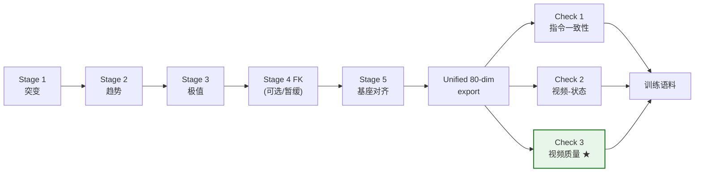
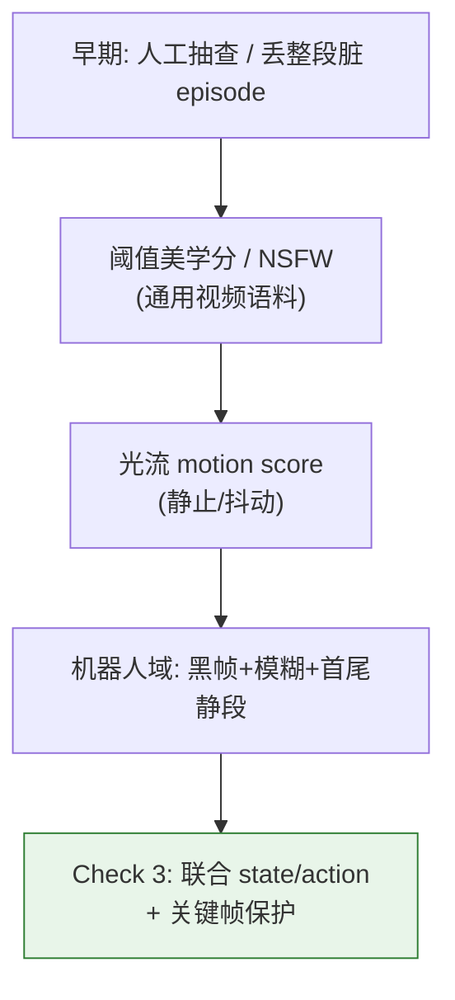
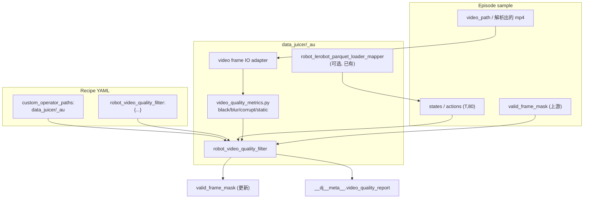
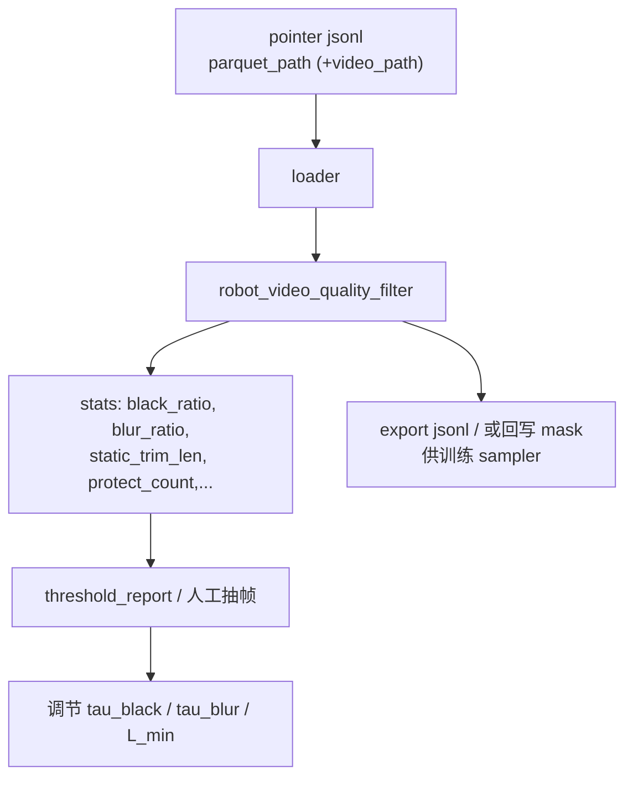

# 用 data-juicer 实现 Qwen-RobotManip Check 3: Video Quality Filtering 方案

本文给出一份**可落地、可运行**的方案：如何用当前 `data-juicer` 代码库实现 Qwen-RobotManip 论文中的 **Check 3: Video Quality Filtering（视频质量过滤）**。全文基于论文 TeX 原文、`b/d/QwenRobotmanip/note_data.md`、`data_impl.md`（跨模态校验③能力缺口）、以及已落地的 Stage 1/2/3/5 与 80 维统一表示（`data_cur1_1.md`–`data_cur5_1.md`、`data_impl_unified80.md`）。遵循「扩展大于修改」原则，不改动 `data-juicer` 主干源码，所有定制代码写入 `data_juicer/_au/` 与 `tests_au/`。

对应论文位置：`b/d/QwenRobotmanip/TeX_Source/chapter/data.tex`（`\paragraph{Check 3: Video Quality Filtering}`）。

> **Check 3: Video Quality Filtering.** We apply video-level data cleaning to remove frames that may degrade policy learning. We remove visually invalid frames including black, corrupted, blurred, and prolonged static segments, using image processing checks applied jointly with state and action signals to detect redundant static periods typically at episode boundaries. Task-critical key frames such as gripper closure events are explicitly preserved to avoid discarding visually subtle but semantically important transitions.

翻译与提要：对视频做**帧级/段级清洗**，去掉会损害策略学习的坏帧——黑帧、损坏帧、模糊帧，以及通常出现在 episode 首尾的**长时间静态段**。静态段判定必须**图像处理 × 关节 state/action 联合**；同时**显式保护任务关键帧**（如夹爪闭合），避免把「视觉上几乎不动、但语义上决定成败」的过渡删掉。

与论文「五阶段轨迹清洗」（Stage 1–5）的关系：Stage 1–5 主要清洗 **state/action 数值质量与几何约定**；Check 3 属于其后的**跨模态校验族**（指令一致性 / 视频–状态一致性 / **视频质量**），专门清洗 **视觉模态**，但判定时对齐同一时间轴上的 state/action。本方案优先落地 Check 3，并可与已 export 的 80 维 unified 语料（`process_test`）级联。

---

## 目录

1. 结论速览
2. 背景：为什么视频质量会毒化 VLA 训练
3. 论文方法形式化（四类坏帧 + 关键帧保护）
4. 纵向 / 横向 / 消融分析
5. 与统一 80 维表示、LeRobot 视频布局的衔接
6. data-juicer 能力映射与选型（为何是 Filter）
7. 静态架构（组件图 / 类图 / 职责）
8. 动态架构（数据流 / 序列 / 工作流）
9. 关键逻辑设计（检测子模块公式与伪代码）
10. 完整落地物料清单（待实现）
11. 与 Stage 1/2/3/5 的级联协同
12. 参数敏感性、验收数据集与自检清单
13. 扩展性与未来方向

---

## 1. 结论速览

| 对比项 | Stage 1–3（已落地） | Stage 5（已落地） | **Check 3（本方案）** |
|--------|-------------------|-----------------|----------------------|
| 主模态 | state / action | EEF 位姿几何 | **视频帧**（辅以 state/action） |
| 算子类型 | Filter | Mapper | **Filter** |
| 动作 | 删 episode / 写 `valid_frame_mask` | 改写数值 | **帧级 mask / 边界 trim / 可选丢 episode** |
| 跨 episode 依赖 | Stage 3 需全局分位数 | 无 | 无（单 episode 自包含） |
| 最易误伤点 | 夹爪突变 / 双峰分布 | 无 pose_layout 时需 pass-through | **把夹爪闭合当「静态」删掉** |

**一句话方案**：新增自定义 Filter `robot_video_quality_filter`，对每条 episode 沿时间轴解码指定相机视频，计算逐帧视觉度量（黑/损坏/模糊）与「视觉+本体感觉」联合静态度量；生成候选剔除掩码后，用 **gripper / 关键 dim 事件保护**把关键帧强制置回保留；再按 `exclusion_strategy` 写成与 Stage 1 一致的 `valid_frame_mask`（或边界硬裁剪后的同步 state/action/视频索引）。全部实现放在 `data_juicer/_au/`，通过 `custom_operator_paths: ['data_juicer/_au']` 企业化包导入。

推荐默认策略（Galaxea / `process_test`）：

- 黑 / 损坏 / 模糊：**帧级 mask**（不整段丢 episode，除非坏帧比例过高）
- 首尾长静态：**边界 trim**（去掉前缀/后缀连续静态，不动中间短暂停顿）
- 夹爪开合沿：**绝对保护**（`mask=1`），即使像素差分接近 0

---

## 2. 背景：为什么视频质量会毒化 VLA 训练

### 2.1 三类「看不见的毒药」

VLA（Vision-Language-Action）同时吃图像与动作监督。坏视频帧带来的危害与「关节炸点」不同——数值看起来可能完全正常，但视觉条件坏了：

1. **黑帧 / 损坏帧**：摄像头掉线、编码花屏、解码失败。模型学到的是「黑暗画面也能出动作」，或梯度被噪声图像带着乱跑。
2. **模糊帧**：快速甩臂时快门拖影、对焦失败。视觉特征坍缩成低频 blob，策略学到错误的「物体位置 ↔ 动作」对应。
3. **长静态段（尤其首尾）**：示教者按录制键后愣几秒、任务结束后迟迟不按结束。模型大量看到「同一画面 + 近零动作」，容易习得**犹豫 / 不动**的先验——论文注释明确写到：*Removing such segments reduces the model’s tendency to learn inactive or hesitant behavior.*

### 2.2 一个直观小例子

假设 15 Hz、600 帧示教：开头 80 帧机械臂悬停、画面几乎不变，夹爪尚未闭合；第 200 帧夹爪闭合（视觉只有指尖几像素变化）；结尾 100 帧任务已完成、人在收手。

| 若粗糙地「像素运动过小就删」 | 实际后果 |
|------------------------------|----------|
| 删掉开头 80 帧 | ✅ 通常正确（冗余） |
| **误删第 200 帧夹爪闭合** | ❌ 丢掉语义上最关键的监督 |
| 删掉结尾 100 帧 | ✅ 通常正确 |

因此 Check 3 **不是**单纯的 `video_motion_score` 阈值过滤；论文特意要求：**图像处理与 state/action 联合**，并 **显式保护 gripper closure 等关键帧**。

### 2.3 在整条数据管线中的位置



对 Galaxea 现状：数值侧 Stage 1–3 analyze 与 Stage 5 accept、80 维 export（`process_test`）已具备；**视觉侧 Check 3 尚无专用算子**（`data_impl.md` 标为 🔵/🟡：运动分可用 stock filter，黑帧/模糊需自定义，且缺少「关键帧保护 + 与 80 维联合」这一环）。

---

## 3. 论文方法形式化

记 episode 长度 \(T\)，选定主相机（或相机集合 \(\mathcal{C}\)）帧序列 \(I_t\)，统一 state/action \(s_t, a_t \in \mathbb{R}^{80}\)。目标是构造保留掩码 \(m_t \in \{0,1\}\)。

### 3.1 视觉无效帧

**（A）黑帧（black）**  
灰度均值过低且对比度过低：

$$
\text{black}_t = \big[\bar{I}_t < \tau_{\text{black}}\big] \;\land\; \big[\mathrm{std}(I_t) < \tau_{\text{blkstd}}\big]
$$

**（B）损坏帧（corrupted）**（启发式，非编解码器状态机）  
满足任一即可：

- 解码失败 / 空帧 / 尺寸异常；
- 通道直方图塌缩（极少数 bin 占统治地位）；
- 与邻帧的结构性不一致：\(\|I_t - I_{t-1}\|_1\) 巨变且同期 \(\|s_t-s_{t-1}\|\) 近 0（更像视频花屏而非真运动）。

**（C）模糊帧（blurred）**  
经典 Laplacian 方差清晰度：

$$
\phi_t = \mathrm{Var}\big(\nabla^2 I_t\big),\qquad
\text{blur}_t = [\phi_t < \tau_{\text{blur}}]
$$

可选强化：仅在 \(\|\Delta s_t\|\) 不大时才因模糊删帧（高速运动拖影有时不可避免，避免过度清洗动态帧）。

视觉无效联合：

$$
\text{visbad}_t = \text{black}_t \lor \text{corrupted}_t \lor \text{blur}_t
$$

### 3.2 长时间静态段（联合检测）

仅看光流/像素差会误伤「微动但关键」；仅看关节会漏掉「机器人不动但场景在变」（少见）或「相机被挡住」。论文要求 **jointly**：

定义视觉静止与本体感觉静止：

$$
\begin{aligned}
v^{\text{img}}_t &= d_{\text{img}}(I_t, I_{t-1}) &&\text{（如灰度 MAD / 下采样 MSE）}\\
v^{\text{ proprio}}_t &= \|\,W_s(s_t - s_{t-1})\,\|_2 + \|\,W_a a_t\,\|_2
\end{aligned}
$$

其中 \(W_s,W_a\) 对 pad 维与（可选）高噪声维降权；\(a_t\) 本身已是增量/指令时，用动作范数比差分更稳。

逐帧「冗余静态」候选：

$$
\text{static}_t = \big[v^{\text{img}}_t < \tau_v\big] \;\land\; \big[v^{\text{proprio}}_t < \tau_p\big]
$$

**边界长静态**（论文强调 typically at episode boundaries）：在 \(m\) 的候选序列上，取最长前缀/后缀连续静态 run，长度 \(\ge L_{\min}\) 则整段标记为可删除：

$$
\begin{aligned}
\text{trim\_prefix} &= \{0,\ldots,k_{\text{pre}}-1\} &&\text{若前缀静跑长}\ge L_{\min}\\
\text{trim\_suffix} &= \{T-k_{\text{suf}},\ldots,T-1\} &&\text{若后缀静跑长}\ge L_{\min}
\end{aligned}
$$

中间短暂静止（思考、对齐）默认**不删**，除非配置 `allow_interior_static_remove=true`（本方案默认 false，减少误伤）。

### 3.3 任务关键帧保护（关键不变量）

设保护集合 \(\mathcal{P}\subseteq\{0,\ldots,T-1\}\)。最少实现 **夹爪事件**：

在统一 80 维中（见 §5）：

- 左夹爪 state/action 维：\(16\)
- 右夹爪 state/action 维：\(45\)

$$
t \in \mathcal{P} \iff
\max\big(|\Delta s_{t,16}|,|\Delta s_{t,45}|,|a_{t,16}|,|a_{t,45}|\big) > \tau_g
$$

或对 state 夹爪做边缘检测：穿越中位阈值的时刻邻域 \([t-w,t+w]\) 一并保护。

最终掩码：

$$
m_t =
\begin{cases}
1 & t\in\mathcal{P}\\
0 & t\in \text{trim\_prefix}\cup\text{trim\_suffix}\ \text{或}\ \text{visbad}_t\\
1 & \text{otherwise}
\end{cases}
$$

（实现上先算「拟删除」，再强制 \(\mathcal{P}\) 覆盖为保留。）

### 3.4 删除策略（与 Stage 1 对齐）

| `exclusion_strategy` | 行为 |
|----------------------|------|
| `frame_mask`（推荐默认） | 写 `valid_frame_mask`，下游导出/训练按 mask 采样 |
| `boundary_trim` | 仅裁首尾静段，同步裁 `states/actions`（及可选写出 trim 后的帧索引） |
| `episode_discard` | 坏帧比例 \(> \rho\) 或有效长度 \(< T_{\min}\) 时丢整段 |

---

## 4. 纵向 / 横向 / 消融分析

### 4.1 纵向：视频清洗方法如何演进到 Check 3



| 代际 | 优点 | 缺点 | 适用 |
|------|------|------|------|
| 整段丢弃 | 实现极简单 | 浪费；首尾脏中间好也被弃 | 极脏演示 |
| 通用 motion/美学 Filter | DJ 现成 | 不知夹爪语义；易误伤关键微动 | 自然语言视频 |
| **Check 3（本方案）** | 对齐策略学习目标；保护关键过渡 | 需解视频 + 阈值标定 | 机器人示教 / VLA |

在 Check 3 之上，后续还可演进到：学习型质量打分、VLM「有无有效操作」判决、与 Check 2（URDF–分割重叠）级联——那些成本更高，本方案不阻塞。

### 4.2 横向：同时期可选技术对比

| 方法 | 黑/模糊 | 静段 | 关键帧保护 | 算力 | 与 80 维协同 |
|------|---------|------|------------|------|--------------|
| `video_motion_score_filter`（DJ 内置） | ❌ | 弱（只看光流均值） | ❌ | 中 | 弱 |
| `video_aesthetics_filter` | 间接 | ❌ | ❌ | 高 | 无 |
| 纯 Laplacian + 亮度 | ✅ | ❌ | ❌ | 低 | 无 |
| 纯 \(\|\Delta s\|\) 静段 | ❌ | 中 | 易做 | 极低 | 强 |
| **联合视觉+proprio + gripper preserve（本方案）** | ✅ | ✅ | ✅ | 中低 | **强** |

结论：DJ 内置运动分可作**对照基线 / 可选子分数**，但不能单独充当 Check 3；黑帧与模糊必须自定义；关键帧保护必须吃到 state/action（或 unified 维）。

### 4.3 消融：哪些点「最有效」

结合论文表述与机器人示教常识，落地优先级（预期有效性）：

| 组件 | 预期收益 | 误伤风险 | 建议 |
|------|----------|----------|------|
| 首尾长静段 trim | **高**（直接减少「学会不动」） | 中（过长 trim 切掉接近） | **必做**，\(L_{\min}\) 用秒标定 |
| 黑帧 | 高（极脏） | 低 | **必做** |
| 模糊 | 中高 | 中（快动作拖影） | 默认开；可加「低速才判模糊」 |
| 损坏启发式 | 中 | 低 | 做解码失败 + 弱启发式即可 |
| 中间静段删除 | 低–中 | **高** | 默认关 |
| gripper 保护 | **高（防灾难性误删）** | 极低 | **必做** |
| 多相机 AND/OR | 中 | 视机位 | Galaxea 默认 `head_rgb`；腕部可选 OR |

消融验收建议（实现后在 `tests_au` 跑）：`full` vs `no_preserve` vs `vision_only` vs `proprio_only`，对比「夹爪事件帧存活率」与「首尾静段删除比」。

---

## 5. 与统一 80 维表示、LeRobot 视频布局的衔接

### 5.1 80 维里 Check 3 要用的切片

Qwen 布局：`[Left 29 | Right 29 | Shared 22]`。单臂内：`joints(7)+EE(9)+gripper(1)+hand(12)`。

| 语义 | 左臂 index | 右臂 index |
|------|------------|------------|
| 关节（静段 proprio） | `0:7`（注意 pad 维 mask=0） | `29:36` |
| EE 位姿（可选加强静段） | `7:16` | `36:45` |
| **夹爪（保护）** | **`16`** | **`45`** |
| Shared 底盘/腰等 | `58:80`（Galaxea R1 Lite 部分占用） | |

`observation.state_dim_mask`（或 recipe 中的 embodiment mask）应乘到 \(W_s\) 上，避免 pad 维「永远静止」干扰。

对仍双轨保留的 16 维 native `states`（Stage 1–3）：夹爪在 `7` / `15`。算子参数用 `gripper_dims` / `proprio_dims` 显式配置，**同时支持 `dim=80` 与 `dim=16`**。

### 5.2 Galaxea `process_test` 视频布局（验收主数据）

根目录：`/mnt/r/DATA/Galaxea-Open-World-Dataset/process_test`

- parquet：`observation.state[80]` / `action[80]` / `observation.state_dim_mask[80]`
- 视频：`videos ->` 指向原始 `lerobot/.../videos`（symlink）
- 路径模板（`info.json`）：  
  `videos/chunk-{episode_chunk:03d}/{video_key}/episode_{episode_index:06d}.mp4`
- 常用 `video_key`：`observation.images.head_rgb`（另有 head_right / left_wrist / right_wrist）
- `fps ≈ 15`

指针样本（与 Stage 5 unified80 accept 相同）带 `parquet_path`；视频路径由 task 根 + episode_index + `video_key` 解析，或在 convert 时写入 `video_path` 字段。

### 5.3 时间轴对齐约定

假设 LeRobot 约定：**第 \(t\) 行 parquet ↔ 视频第 \(t\) 帧**（同 fps）。实现时：

1. 以 `states.shape[0]` 为 \(T\)；
2. 解码至多 \(T\) 帧；若视频更短/更长，取 \(\min(T, T_{\text{vid}})\) 并对齐前缀，差量在 report 中记 `sync_mismatch`；
3. 不对齐时默认 **fail-open（不删）** 或按配置 `strict_sync=true` 丢 episode——Galaxea 验收默认 fail-open + 报警。

---

## 6. data-juicer 能力映射与选型

### 6.1 为什么是 Filter 而不是 Mapper

| 类型 | 行为 | Check 3？ |
|------|------|-----------|
| Mapper | 改写字段内容 | ❌ 主要不是「校正像素」 |
| Filter | `compute_stats` + `process` 决定去留 | ✅ 删/掩码坏帧 |
| Deduplicator | 跨样本去重 | ❌ |

与 Stage 1 相同：输出 **`valid_frame_mask` + JSON report in meta**，保证与既有 analyze / clean recipe 编排一致。

### 6.2 可复用 vs 必须自研

| 能力 | DJ 现状 | 本方案 |
|------|---------|--------|
| 视频解码 | `data_juicer.utils.video_utils` / `mm_utils` | `_au` 封装薄适配层 |
| 光流运动分 | `video_motion_score_*_filter` | **可选**写入 stats 作对照，不单独充当 Check 3 |
| 黑帧 / Laplacian 模糊 | 无现成 Filter | **自研** |
| state/action 联合静段 | 无 | **自研** |
| gripper 保护 | 无 | **自研** |
| 帧 mask 协议 | Stage 1 `mask_field` | **复用同名约定** |

### 6.3 算子命名与注册

- 模块：`data_juicer/_au/ops/filter/robot_video_quality_filter.py`
- 注册名：`robot_video_quality_filter`
- `_au/__init__.py`：`from .ops.filter import robot_video_quality_filter`
- 视觉工具：`data_juicer/_au/utils/video_quality_metrics.py`（纯函数，便于单测）

---

## 7. 静态架构

### 7.1 组件图



### 7.2 类职责

| 类 / 模块 | 职责 |
|-----------|------|
| `RobotVideoQualityFilter` | Filter 生命周期；读视频与轨迹；合并上游 mask；写 report |
| `video_quality_metrics` | 无状态：`is_black` / `blur_var` / `is_corrupted` / `frame_deltas` |
| `resolve_video_path(sample)` | 从显式路径或 LeRobot `task_dir+video_key+ep_idx` 解析 |
| `build_protect_mask(...)` | gripper / 自定义 dim 事件 → \(\mathcal{P}\) |
| `boundary_static_runs(...)` | 前缀/后缀长静段 |

### 7.3 与上游 mask 的合成

若 Stage 1 已写 `valid_frame_mask`：

$$
m^{\text{out}}_t = m^{\text{in}}_t \;\land\; m^{\text{vqf}}_t
$$

保护集 \(\mathcal{P}\) **只覆盖 VQF 自己的删除意图**，不强制复活已被 Stage 1 判为突变的帧（避免把真实碰撞糊帧救回）。即：

$$
m^{\text{vqf}}_t = \neg\big(\text{delete}^{\text{raw}}_t \land [t\notin\mathcal{P}]\big),\quad
m^{\text{out}}=m^{\text{in}}\land m^{\text{vqf}}
$$

---

## 8. 动态架构

### 8.1 单 sample 序列图

```mermaid
sequenceDiagram
    participant EX as DefaultExecutor
    participant LD as parquet_loader
    participant F as robot_video_quality_filter
    participant IO as video IO
    participant M as metrics

    EX->>LD: process_single(pointer)
    LD-->>EX: states, actions (T,80)
    EX->>F: compute_stats_single / process_single
    F->>IO: open(video_path), iterate T frames
    IO->>M: per-frame gray / laplacian / hist
    F->>F: proprio velocity from states/actions
    F->>F: static ∧ vision flags; boundary runs
    F->>F: gripper protect override
    F->>F: AND with upstream valid_frame_mask
    F-->>EX: keep episode? + mask + report
```

### 8.2 工作流（analyze → clean）



建议两阶段使用方式（与 Stage 3 分位数思路类似，但 Check 3 **不强制**全局预计算）：

1. **analyze 模式**：只写 stats/report，不删（`exclusion_strategy: report_only` 或极宽阈值）；
2. **clean 模式**：固化阈值后 `frame_mask` / `boundary_trim`。

### 8.3 典型场景协调

| 场景 | 期望行为 |
|------|----------|
| 录制开头 3 s 停住 | 前缀 trim / mask=0 |
| 夹爪闭合、画面几乎不变 | **保留**（protect） |
| 整段黑屏 | `black_ratio→1` → episode_discard |
| 只有腕部模糊、头部清晰 | 单相机 head；或多相机 `any_bad` vs `all_bad` 策略 |
| 无视频路径 | pass-through + warning（不与纯数值流水线打架） |

---

## 9. 关键逻辑设计（伪代码级）

### 9.1 度量（`video_quality_metrics.py`）

```python
def frame_black(gray, tau_mean, tau_std) -> bool:
    return gray.mean() < tau_mean and gray.std() < tau_std

def frame_blur_laplacian_var(gray) -> float:
    # cv2.Laplacian(gray, CV_64F).var()
    ...

def frame_corrupted(gray, prev_gray, proprio_still) -> bool:
    # decode_fail already handled upstream
    # optional: huge image delta while proprio_still
    ...

def image_delta(prev, cur) -> float:
    # mean abs diff on downscaled gray
    ...
```

### 9.2 Filter 主路径

```python
def compute_frame_flags(frames, states, actions, cfg, dim_mask):
    T = states.shape[0]
    visbad = np.zeros(T, dtype=bool)
    static = np.zeros(T, dtype=bool)
    for t in range(T):
        g = to_gray(frames[t])
        visbad[t] = black(g) or blur(g) or corrupted(g, ...)
        if t > 0:
            static[t] = (image_delta(frames[t-1], frames[t]) < cfg.tau_v
                         and proprio_vel(states, actions, t, dim_mask) < cfg.tau_p)
    protect = gripper_event_mask(states, actions, cfg.gripper_dims, cfg.tau_g, cfg.protect_radius)
    prefix, suffix = boundary_runs(static, cfg.min_static_len)
    delete = visbad | prefix | suffix
    delete[protect] = False
    return ~delete  # valid_frame_mask
```

### 9.3 Report schema（meta JSON 字符串）

```json
{
  "changed": true,
  "num_frames": 998,
  "num_removed": 120,
  "black_ratio": 0.0,
  "blur_ratio": 0.02,
  "corrupt_ratio": 0.0,
  "trim_prefix": 45,
  "trim_suffix": 60,
  "protect_count": 8,
  "video_key": "observation.images.head_rgb",
  "sync_mismatch": 0
}
```

Analyzer 友好的**标量** stats（写入 `__dj__stats__`）：`video_quality_removed_ratio`、`video_quality_trim_prefix`、`video_quality_protect_count` 等，便于 `dj-analyze` 出报告。

### 9.4 默认超参（Galaxea 15 Hz 起点，实现后用 analyze 再标定）

| 参数 | 建议初值 | 含义 |
|------|----------|------|
| `tau_black` | 8/255 | 灰度均值 |
| `tau_blkstd` | 5/255 | 灰度标准差 |
| `tau_blur` | 20–50（分辨率相关） | Laplacian var 下限 |
| `tau_v` | 经验：下采样 MAD | 视觉静 |
| `tau_p` | 与 Stage 1 active 带同量级 | proprio 静 |
| `min_static_len` | `int(1.5*fps)`～`int(3*fps)` | 边界静段最短长度 |
| `tau_g` | 相对满量程 2%–5% | 夹爪事件 |
| `protect_radius` | 1–2 帧 | 事件邻域 |
| `video_keys` | `[observation.images.head_rgb]` | 主相机 |
| `camera_agg` | `any` | 任一相机视坏即坏 |

---

## 10. 完整落地物料清单（待实现）

> 本节是**实现清单**，与 Stage 5 文档「已交付」不同；本文件先定案，编码按下列路径推进。

| 物料 | 路径 |
|------|------|
| 度量工具 | `data_juicer/_au/utils/video_quality_metrics.py` |
| Filter 算子 | `data_juicer/_au/ops/filter/robot_video_quality_filter.py` |
| 注册 | `data_juicer/_au/ops/filter/__init__.py` + `_au/__init__.py` |
| 单元测试 | `tests_au/ops/filter/test_robot_video_quality_filter.py` |
| 合成数据（黑帧/模糊/首尾静/夹爪微动） | `tests_au/ops/filter/gen_synthetic_video_quality_dataset.py` |
| 合成验收 | `tests_au/ops/filter/accept_robot_video_quality_filter.{yaml,sh}` |
| 真实数据验收 | `tests_au/ops/filter/accept_robot_video_quality_process_test.{yaml,sh}` |
|  | `ROOT=/mnt/r/DATA/Galaxea-Open-World-Dataset/process_test` |
| analyze 模板（可选） | `tests_au/ops/filter/analyze_video_quality_process_test.yaml` |

合成验收硬断言（对齐论文语义）：

1. 注入的黑帧 → `valid_frame_mask=0`；
2. 首尾长静段被 trim/mask，**中间短静段保留**；
3. 夹爪闭合帧（像素几乎不动）→ **mask=1**；
4. 无 `video_path` → pass-through，不写破坏性删除；
5. 与上游 `valid_frame_mask` 做 AND，不复活 Stage 1 已删帧。

---

## 11. 与 Stage 1/2/3/5 的级联协同

### 11.1 推荐 recipe 顺序

```yaml
custom_operator_paths:
  - 'data_juicer/_au'

process:
  - robot_lerobot_parquet_loader_mapper: {...}
  # 数值清洗（可沿用既有 clean 阈值）
  - robot_sudden_change_filter: {exclusion_strategy: frame_mask, ...}
  - robot_state_action_alignment_filter: {...}
  - robot_extreme_value_filter: {...}
  # 几何（若输入已是规范系可 identity / 跳过）
  - robot_base_frame_alignment_mapper:
      pose_layout: [...]   # 80 维 EE 切片
      correction_source: preset
      preset_name: identity  # 或真实 R_corr
  # 视觉质量（本方案）
  - robot_video_quality_filter:
      signal_source: top_level
      top_level_state_key: states
      top_level_action_key: actions
      video_path_field: video_path
      video_keys: ['observation.images.head_rgb']
      gripper_dims: [16, 45]
      exclusion_strategy: frame_mask
      mask_field: valid_frame_mask
```

要点：

- Check 3 **放在数值 Filter 之后**，避免先对黑帧做无意义的关节突变统计浪费；也可 analyze 时并行，但 clean 时建议数值 → 视觉。
- Stage 5 改的是 EE 数值，不改视频；与 Check 3 无写冲突。
- 若只跑视觉验收，可 loader → video_quality 单算子。

### 11.2 与「仅 16 维数值流水线」兼容

未配置 `video_path_field` 且无法解析视频时：**安全 pass-through**（`changed=false`，可不写 report 或写 `skipped_no_video`），行为对齐 Stage 5「无 pose_layout 则放行」。

---

## 12. 参数敏感性、验收数据集与自检清单

### 12.1 验收数据

| 用途 | 路径 |
|------|------|
| 真实统一 80 维 + 视频 symlink | `/mnt/r/DATA/Galaxea-Open-World-Dataset/process_test` |
| 小样本数值参照（可选） | `/mnt/r/DATA/tst/Galaxea-Open-World-Dataset/Connect_Router_Cables_20250625_002/` |
| 合成（单测主战场） | `tests_au/ops/filter/outputs/synth_vqf/` |

### 12.2 参数敏感性（实现后必做）

- \(\tau_{\text{blur}}\) 过严 → 快速运动段被挖空 → 动作不连续；过松 → 失焦帧残留。
- \(L_{\min}\) 过短 → 切掉「对准」；过长 → 首尾冗余残留。
- \(\tau_g\) 过严 → 保护不足；过松 → 整段夹爪噪声被保护、静段删不掉。

### 12.3 自检清单

- [ ] 论文四类去除 + 关键帧保护均有对应代码路径
- [ ] 联合静段（图像 ∧ proprio），非单模态
- [ ] 默认只 trim **边界**长静段
- [ ] `gripper_dims` 对 80 维 / 16 维均可配
- [ ] `valid_frame_mask` 与 Stage 1 字段协议一致
- [ ] `__dj__stats__` 只写标量，明细进 meta JSON 字符串
- [ ] 包导入：`custom_operator_paths: ['data_juicer/_au']`
- [ ] `accept_*.sh` + yaml；真实 ROOT 指向 `process_test`
- [ ] 无视频时不破坏纯数值 pipeline
- [ ] 单测覆盖：黑帧、模糊、首尾静、夹爪保护、上游 mask AND

---

## 13. 扩展性与未来方向

1. **多相机投票**：`all`（更保守）/ `any`（更严）/ 主相机加权。  
2. **把 `video_motion_score` 嵌入为第 5 路分数**，进入 report 对照，不直接一票否决。  
3. **学习型质量头**或小 VLM「是否含有效操作」——成本高，作 Check 3.1。  
4. **与 Check 2 级联**：先视频质量，再 URDF–分割重叠（避免在黑帧上跑 SAM）。  
5. **导出侧**：按 mask 重写 parquet + 可选 `ffmpeg` 裁剪视频（IO 重，可二期）。  
6. **Action EE 非零之后**：静段检测可把 EE delta 纳入 \(v^{\text{proprio}}\)（当前 `process_test` 的 action EE 常为 0，主要靠关节+夹爪+图像）。

---

## 附录 A：论文原文锚点与笔记对照

| 来源 | 内容 |
|------|------|
| `TeX_Source/chapter/data.tex` Check 3 段 | black / corrupted / blurred / prolonged static；jointly with state and action；preserve gripper closure |
| `note_data.md`「检查 3」 | 同上中文提要；强调勿删「短暂停顿后的关键动作」 |
| `data_impl.md` §5.8 | DJ 缺口：黑帧/模糊需自定义；motion_score 仅部分覆盖 |

## 附录 B：与用户截图的条款映射

| 截图要点 | 本方案职责 |
|----------|------------|
| remove black, corrupted, blurred | §3.1 `visbad` |
| prolonged static at boundaries | §3.2 boundary runs |
| image processing jointly with state/action | §3.2 \(v^{\text{img}}\land v^{\text{proprio}}\) |
| preserve gripper closure key frames | §3.3 \(\mathcal{P}\) |

---

**文档状态**：方案定稿（设计 + 落地清单），**算子尚未编码**。确认本方案后，按 §10 清单实现 `robot_video_quality_filter` 与 `accept_robot_video_quality_*` 验收。
