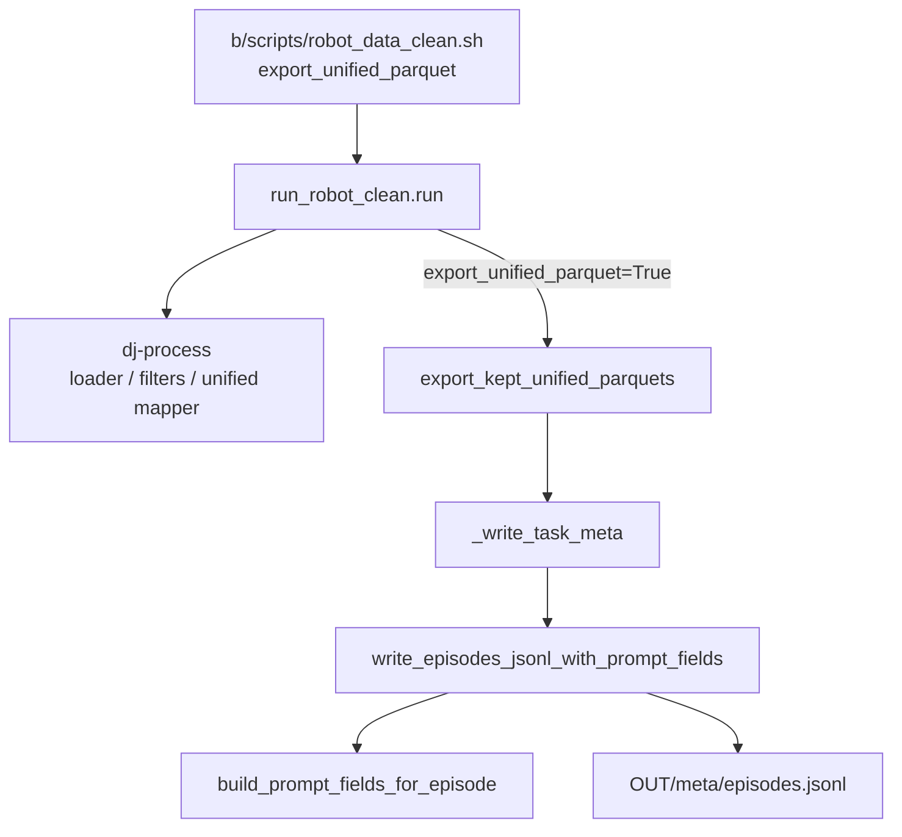

# Embodiment Prompt：`episodes.jsonl` 处理设计与调用链

## 1. 目标

在统一导出（LeRobot v2.1）时，为每条保留的 episode 在 `meta/episodes.jsonl` 上附加结构化字段 `prompt_fields`，供训练侧构造 Embodiment Prompt。

典型产出（嵌在 episode 行内，**不**单独生成 `prompt.json`）：

```json
{
  "episode_index": 0,
  "length": 8278,
  "tasks": ["..."],
  "prompt_fields": {
    "embodiment": "galaxea_r1_lite",
    "instruction": "Place the iced tea...",
    "length": 8278,
    "speed": 8500,
    "fps": 15,
    "camera_view_direction": "opposite side"
  }
}
```

- `length`：原始时间步数
- `speed`：`ceil(length / 500) * 500`（数据侧已离散化）
- Prompt dropout（15%）仍约定在训练侧

---

## 2. 设计原则

| 原则 | 说明 |
|------|------|
| 扩展大于修改 | 逻辑集中在 `_au/utils/embodiment_prompt.py`，export 只调用 |
| 源 meta 透传 | `episodes.jsonl` 原有字段保留；只追加 `prompt_fields` |
| Embodiment 来自 YAML | 不单独传字符串；`cfg = load_embodiment_config(embodiment)` 后从 `prompt.embodiment_id` / `name` 解析 |
| 与 DJ Mapper 解耦 | Clean recipe **不**挂 `robot_embodiment_prompt_mapper`；主路径是 export 后处理 |
| `tasks.jsonl` 不改 | 原样 `copy2`；instruction 解析时可读该 map |

---

## 3. 模块职责

```
data_juicer/_au/
├── utils/embodiment_prompt.py          # 解析 + 写 episodes.jsonl
├── utils/embodiment_layout.py          # load_embodiment_config（YAML）
├── configs/embodiments/*.yaml          # prompt.camera_views / embodiment_id
├── pipeline/robot_clean/
│   ├── run_robot_clean.py              # 开关：export_unified_parquet
│   └── export_unified.py               # _write_task_meta 调用写 episodes
└── ops/mapper/robot_embodiment_prompt_mapper.py  # 可选：写 DJ 样本 meta
```

### 3.1 `embodiment_prompt.py` 核心 API

| 函数 | 作用 |
|------|------|
| `load_tasks_map` / `load_episodes_by_index` / `load_info_fps` | 读源 meta |
| `resolve_instruction` | 从 `tasks` / `task_index` 取指令；过滤 quality 标签；`中文@English` 按 lang 拆 |
| `resolve_camera_view_direction` | YAML `prompt.camera_views` + `default_camera_view_direction` |
| `embodiment_id_from_cfg` | `prompt.embodiment_id` → 否则 `cfg["name"]` |
| `discretize_speed` | `ceil(length/500)*500` |
| `build_prompt_fields_for_episode` | episode 行 + cfg → `prompt_fields` dict |
| `write_episodes_jsonl_with_prompt_fields` | 过滤 keep 集合 + 每行挂 `prompt_fields` 写出 |

### 3.2 `write_episodes_jsonl_with_prompt_fields` / `build_prompt_fields_for_episode` 入参含义

调用处（`export_unified._write_task_meta` → util）典型传参：

| 参数 | 含义 |
|------|------|
| `cfg` | 已加载的 embodiment YAML（含 `name` / `prompt.*`）——**embodiment 由此解析，无独立 `embodiment=` 参数** |
| `row` | 源 `episodes.jsonl` 当前行 |
| `tasks_map` | `{task_index: task}` |
| `fps` | 源 `info.json` 的 fps |
| `length` | 打包后 `T`（fallback；优先用 `row["length"]`） |
| `video_key` | 主相机 key，用于 view 映射 |
| `keep_episode_indices` | 清洗保留的 episode 集合 |

写出逻辑：`out_row = dict(row); out_row["prompt_fields"] = fields`。

`embodiment` 字段在 `build_prompt_fields_for_episode` 内部通过 `embodiment_id_from_cfg(cfg)` 写入，因此调用处看不到单独的 `embodiment=` 参数。

---

## 4. 调用链（Clean Pipeline 主路径）



### 4.1 逐步说明

1. **Shell**（有 embodiment 时）  
   `emb=(--embodiment "$emb_name" --export-unified-parquet)`  
   见 [`b/scripts/robot_data_clean.sh`](../../scripts/robot_data_clean.sh)。

2. **`run_robot_clean.run`**  
   - `prepare` → pointer JSONL  
   - `write_recipe` → `dj-process` → `cleaned.jsonl`  
   - 若 `cfg.export_unified_parquet`：调用  
     `export_kept_unified_parquets(cleaned.jsonl, dataset, unified80_lerobot/, embodiment=...)`  
   见 [`run_robot_clean.py`](../../../data_juicer/_au/pipeline/robot_clean/run_robot_clean.py)。

3. **`export_kept_unified_parquets`**  
   - 读 cleaned 中 kept 的 `parquet_path`  
   - `_export_one_episode`：源 parquet → 80 维 → 写出 `data/chunk-*/episode_*.parquet`  
   - `_write_task_meta(...)` 写整套 `meta/`  
   见 [`export_unified.py`](../../../data_juicer/_au/pipeline/robot_clean/export_unified.py)。

4. **`_write_task_meta` 对 episodes 的处理**  
   - `cfg = load_embodiment_config(embodiment)`  
   - `tasks_map = load_tasks_map(src_meta)`  
   - `video_key = resolve_video_key(src_task)`  
   - `write_episodes_jsonl_with_prompt_fields(源 episodes.jsonl → 出 episodes.jsonl, ...)`  
   - `tasks.jsonl`：`shutil.copy2`  
   - `episodes_stats.jsonl`：按导出 stats 重建  
   - `info.json`：源 info 打底 + 新 features/计数 + `unified_embodiment`

### 4.2 关键代码位置

| 步骤 | 文件 |
|------|------|
| 开关与调用 export | `data_juicer/_au/pipeline/robot_clean/run_robot_clean.py` |
| 写 meta / 调 write_episodes | `data_juicer/_au/pipeline/robot_clean/export_unified.py` → `_write_task_meta` |
| prompt 字段组装 | `data_juicer/_au/utils/embodiment_prompt.py` |
| Shell | `b/scripts/robot_data_clean.sh` |

测试脚本镜像路径：`tests_au/ops/mapper/export_unified_parquets.py`（同样在 `_write_task_meta` 里调用 `write_episodes_jsonl_with_prompt_fields`）。

---

## 5. 旁路：DJ Mapper（非默认 clean recipe）

`robot_embodiment_prompt_mapper` 复用同一套 `build_prompt_fields_for_episode`，把结果写到样本 `Fields.meta["prompt_fields"]`。

- 注册：`data_juicer/_au/__init__.py` 侧导入
- **默认 `recipe.py` 未加入该 OP**
- 验收：`tests_au/ops/mapper/accept_robot_embodiment_prompt_mapper.sh`

与 export 路径对比：

| | Export 后处理 | Mapper |
|--|---------------|--------|
| 触发 | `--export-unified-parquet` | recipe 显式挂 OP |
| 落盘 | `meta/episodes.jsonl` | cleaned JSONL 的 `__dj__meta__` |
| Clean 默认 | 是 | 否 |

---

## 6. 与其它 meta 文件的关系

| 文件 | 处理方式 |
|------|----------|
| `episodes.jsonl` | 过滤 keep + 追加 `prompt_fields` |
| `tasks.jsonl` | 原样拷贝 |
| `episodes_stats.jsonl` | 按 80 维导出结果重写 |
| `info.json` | 源模板 + 覆盖统计/features/unified 标记 |

Merge 多任务（`merge_lerobot.py`）是另一条链路（重映射 `task_index`、合并 video feature 并集），不经过上述 `write_episodes_jsonl_with_prompt_fields`；若源 episodes 已带 `prompt_fields`，合并时需确认是否透传。

---

## 7. 配置依赖（embodiment YAML）

示例（`galaxea_r1_lite.yaml`）：

```yaml
prompt:
  embodiment_id: galaxea_r1_lite
  default_camera_view_direction: opposite side
  camera_views:
    observation.images.head_rgb: opposite side
    observation.images.left_wrist_rgb: arm side
    # ...
```

`build_prompt_fields_for_episode(cfg, ...)` 内通过 `embodiment_id_from_cfg(cfg)` 得到 `prompt_fields["embodiment"]`。

---

## 8. 如何验证

```bash
# 单元测试
python -m pytest tests_au/ops/mapper/test_robot_embodiment_prompt_mapper.py -v

# 验收（DJ mapper + export 富化）
bash tests_au/ops/mapper/accept_robot_embodiment_prompt_mapper.sh

# 生产路径：clean 后检查 unified80_lerobot 下的
#   meta/episodes.jsonl
# 是否含 prompt_fields（含 speed）
```

已清洗过的数据需 **重新 export**（或带 `--export-unified-parquet` 重跑 clean）才会带上最新的 `speed` / `prompt_fields`。
