# Data-Juicer 实现 Qwen-RobotManip 数据方法的深度分析

> **文档目的**：基于 `data-juicer`（DJ，本仓库 `D:\SRC\Dta\data-juicer`，版本线 v1.5.0–v1.5.3）的**真实源码**，系统论证它能在多大程度上实现 Qwen-RobotManip [Yuan et al., 2026] 论文中所用的**全部数据相关方法与做法**，给出详细的「如何实现」、关键逻辑代码解析、UML 图（mermaid）、数学公式（LaTeX），并解释「为什么这样实现」，最终给出 0–100 分的能力评分。
>
> **分析依据**：① 论文笔记 [`note.md`](note.md) 与 [`note_data.md`](note_data.md)；② DJ 源码（算子、核心引擎、文档与 demo）；③ DJ 官网 <https://datajuicer.github.io/data-juicer/en/main/> 与官方 GitHub <https://github.com/datajuicer/data-juicer>。
>
> **关键前提**：DJ 在 v1.5.0–v1.5.3 期间**专门为具身智能 / VLA（Vision-Language-Action）数据**新增了一整套算子，并提供了官方 demo [`demos/ego_hand_action_annotation/configs/vla_pipeline.yaml`](../../../demos/ego_hand_action_annotation/configs/vla_pipeline.yaml)。该 demo 的「抽帧 → 相机标定 → 相机位姿 → 手部重建(MANO) → 手部动作计算 → 平滑 → 原子动作分割 → 轨迹叠加 → LeRobot 导出」与 Qwen-RobotManip 的**人到机器人（Human-to-Robot, H2R）合成管道**几乎一一同构。这是本文打分偏高的根本原因。

---

## 目录

- [第 0 章 摘要与结论速览](#第-0-章-摘要与结论速览)
- [第 1 章 Data-Juicer 架构基础（实现一切的地基）](#第-1-章-data-juicer-架构基础实现一切的地基)
- [第 2 章 数据源与统一加载](#第-2-章-数据源与统一加载)
- [第 3 章 统一表示：80 维向量 + 相机系 Delta + 二值掩码](#第-3-章-统一表示80-维向量--相机系-delta--二值掩码)
- [第 4 章 H2R 合成管道（核心）](#第-4-章-h2r-合成管道核心)
- [第 5 章 五阶段过滤 + 三项跨模态校验](#第-5-章-五阶段过滤--三项跨模态校验)
- [第 6 章 数据标注工程](#第-6-章-数据标注工程)
- [第 7 章 训练消费与后训练数据策略](#第-7-章-训练消费与后训练数据策略)
- [第 8 章 数据基础设施能力（DJ 强项）](#第-8-章-数据基础设施能力dj-强项)
- [第 9 章 关键算子代码深度解析](#第-9-章-关键算子代码深度解析)
- [第 10 章 综合 UML 图集](#第-10-章-综合-uml-图集)
- [第 11 章 缺口与补足方案](#第-11-章-缺口与补足方案)
- [第 12 章 能力评分](#第-12-章-能力评分)

---

## 第 0 章 摘要与结论速览

### 0.1 一句话结论

**Data-Juicer 能实现 Qwen-RobotManip 约 7 成的数据工程方法，并且覆盖了其中最核心、规模最大、最具创新性的「H2R 人到机器人合成管道」。** DJ 的「算子化 + Recipe + Ray 分布式」框架本身可承载论文的几乎所有数据处理逻辑，剩余约 3 成的缺口集中在「机器人物理仿真渲染（MuJoCo/IK/Pinocchio FK）、部分对齐数学（相机系 delta、状态-动作趋势 DA、URDF 投影一致性）、以及训练时（而非数据处理）的机制（三源掩码加权、$K_{\text{repeat}}$）」。这些缺口大多可通过 DJ 提供的自定义算子机制（`python_file_mapper` / 继承 `Mapper` / `general_fused_op`）补足。

**综合评分：72 / 100**（详见[第 12 章](#第-12-章-能力评分)）。

### 0.2 实现等级图例

本文对每一项 Qwen 数据方法标注四档实现等级：

- 🟢 **直接实现**：DJ 已有专用算子，开箱即用。
- 🔵 **组合实现**：用 DJ 多个现有算子 / Analyzer / Selector 组合即可达成。
- 🟡 **需自定义**：DJ 框架可承载，但需写自定义算子（论文专有逻辑，DJ 无对应内置）。
- 🔴 **无法实现 / 越界**：DJ 数据处理范畴外（属于训练或物理仿真引擎职责）。

### 0.3 总映射表：Qwen-RobotManip 数据方法 → Data-Juicer 实现

| Qwen 数据方法（论文章节） | Data-Juicer 实现路径 | 等级 |
|---|---|---|
| 多源数据加载（9 机器人集 + 3 自中心集 + VL 数据） | `DatasetBuilder` / formatter（jsonl/parquet/HF/S3），多模态 special token | 🔵/🟡 |
| 80 维统一状态-动作向量 | 自定义 `Mapper` 写入 `Fields.meta`；框架支持任意结构字段 | 🟡 |
| 相机坐标系 Delta 位姿（可分离式） | 自定义 `Mapper`（`scipy` 旋转），参考 `video_hand_action_compute_mapper` 相机↔世界变换 | 🟡 |
| 逐维二值掩码（slot/step/per-hand） | 自定义 `Mapper` 生成 mask 字段；`general_field_filter` 可消费 | 🟡 |
| H2R-抽帧 | `video_extract_frames_mapper` | 🟢 |
| H2R-相机内参/FOV/深度标定 | `video_camera_calibration_moge_mapper` / `_deepcalib_` / `_droidcalib_` | 🟢 |
| H2R-相机位姿（cam_c2w 轨迹） | `video_camera_pose_megasam_mapper` | 🟢 |
| H2R-手部重建 → MANO 参数/21 关节 | `video_hand_reconstruction_hawor_mapper`（含 MANO FK） | 🟢 |
| H2R-虚拟手指 / EEF 位姿 / 夹爪 | `video_hand_action_compute_mapper` | 🟢/🟡 |
| H2R-轨迹平滑（Savitzky-Golay + 方向） | `video_hand_motion_smooth_mapper` | 🟢 |
| H2R-人手分割（SAM3） | `video_object_segmenting_mapper`(SAM2.1+YOLOE) / `image_segment_mapper`(FastSAM) | 🔵 |
| H2R-背景修复（ProPainter 去人手） | `video_remove_watermark_mapper`(cv2.inpaint) / diffusers inpainting（近似，非视频时序修复） | 🟡 |
| H2R-IK 底座放置优化 | 无（需物理 IK 求解器） | 🔴 |
| H2R-MuJoCo 机器人渲染 | 无（需物理仿真引擎） | 🔴 |
| H2R-深度引导遮挡合成 | `video_depth_estimation_mapper` 出深度；合成逻辑需自定义 | 🟡 |
| H2R-速度对齐（帧降采样） | `video_extract_frames_mapper`（uniform/`frame_num`） | 🟢 |
| H2R-导出 15 平台 LeRobot 数据 | `export_to_lerobot_mapper` | 🟢 |
| 过滤①突变检测（中值+SG+残差/加速度/jerk） | `video_hand_motion_smooth_mapper`(MAD+SG) + 自定义偏差信号 | 🔵/🟡 |
| 过滤②状态-动作趋势对齐（互相关+DA） | 自定义 `Filter`（DA 指标）+ `general_field_filter` | 🟡 |
| 过滤③极值过滤（分位数归一化） | `Analyzer`(分位数) → `specified_numeric_field_filter` / `range_specified_field_selector` | 🔵 |
| 过滤④关节-EEF FK 一致性（Pinocchio） | 无（需机器人运动学库） | 🔴 |
| 过滤⑤基坐标系/EEF 方向对齐 | 自定义 `Mapper`（旋转校正） | 🟡 |
| 跨模态①指令一致性（三阶段 VLM + 投票） | `mllm_mapper` / `llm_extract_mapper`(CoT) / `video_captioning_from_vlm_mapper`；投票需自定义 | 🔵/🟡 |
| 跨模态②视频-状态一致性（URDF 投影 + SAM 分割） | 分割 🔵（SAM2/YOLOE）；URDF 投影 🔴 |
| 跨模态③视频质量（黑帧/模糊/静态） | 静态：`video_motion_score_*_filter`；黑帧/模糊：需自定义 | 🔵/🟡 |
| Embodiment Prompt（5 字段 + 15% dropout） | 自定义 `Mapper`（文本拼接 + 随机丢弃） | 🟡 |
| ECoT（三阶段推理 + 17 原子动作） | `llm_extract_mapper`(CoT) + `video_atomic_action_segment_mapper`(动作切分) | 🔵/🟡 |
| 自中心视频理解标注 | `video_captioning_from_vlm_mapper`（切片 + 多帧描述） | 🟢 |
| 2D 轨迹预测标注 | `video_trajectory_overlay_mapper` | 🟢 |
| VL 共训练数据（VQA/grounding/OCR/QA） | `phrase_grounding_recall_filter` / `image_detection_yolo_mapper` / `video_ocr_area_ratio_filter` / `generate_qa_from_*_mapper` | 🔵 |
| 双流共训练 9:1 混合 | 数据混合（DatasetBuilder 加权 / 分别处理后合并） | 🔵 |
| 三源掩码加权 FM 损失 | 掩码字段可生成；加权损失属训练侧 | 🔴(训练) |
| $K_{\text{repeat}}=8$ | 训练侧机制 | 🔴(训练) |
| 随机上下文采样 | 自定义采样 `Mapper` / `Selector` | 🟡 |
| 后训练禁用过滤 + color jitter | 禁用过滤=配置层 🟢；color jitter=自定义图像增强 🟡 |
| 混合后训练（按分布邻近度选数据） | `text_embd_similarity_filter` / `Selector`（语义邻近度选样） | 🔵 |
| 跨数据集去重 | `ray_bts_minhash_deduplicator` / `video_deduplicator` / `image_deduplicator` | 🟢 |
| 数据规模律分析（分位数/分布） | `Analyzer`（`OverallAnalysis` 分位数 + `ColumnWiseAnalysis`） | 🟢 |

### 0.4 评分速览

| 维度 | 权重 | 得分 |
|---|---|---|
| 数据基础设施（规模化/融合/去重/分析/环境隔离） | 15% | 95 |
| 数据源加载 | 10% | 70 |
| 统一表示（80 维/相机系 delta/掩码） | 15% | 55 |
| H2R 合成管道 | 25% | 78 |
| 五阶段过滤 + 跨模态校验 | 15% | 62 |
| 标注工程 | 10% | 75 |
| 训练 / 后训练数据准备 | 10% | 65 |
| **加权总分** | **100%** | **≈ 72** |

---

## 第 1 章 Data-Juicer 架构基础（实现一切的地基）

要论证「DJ 能否实现 Qwen 的数据方法」，必须先理解 DJ 把「数据处理」抽象成什么。DJ 的核心范式是：**把每一种数据操作封装成一个可注册、可组合、可分布式执行的「算子（Operator, OP）」，用一份 YAML「菜谱（Recipe）」声明算子流水线，由「执行器（Executor）」驱动「数据集（Dataset）」逐算子处理。** 这一范式正好对应 Qwen 数据工程中「一长串顺序的数据处理步骤」。

### 1.1 端到端数据流总览

```mermaid
flowchart LR
    yaml["YAML Recipe<br>process: 算子列表"] --> initcfg["init_configs()"]
    initcfg --> cfg["cfg.process<br>List[Dict]"]
    cfg --> loadops["load_ops()"]
    loadops --> oplist["OP 实例列表"]
    oplist --> fuse["fuse_operators()<br>(可选融合)"]
    fuse --> exec["Executor.run()<br>Default / Ray"]
    exec --> proc["dataset.process(ops)"]
    proc --> oprun["op.run(dataset)"]
    oprun --> mapf["NestedDataset.map / filter<br>或 RayDataset.map_batches"]
    mapf --> out["处理后数据集 + 导出"]
```

典型入口 [`tools/process_data.py`](../../../tools/process_data.py)：`init_configs()` 解析配置 → 按 `executor_type` 创建执行器 → `executor.run()`。Qwen 的数据 pipeline（抽帧、标定、重建、过滤、标注……）在 DJ 中就表现为 `process:` 列表里一串算子。

### 1.2 算子基类与注册表（OPERATORS）

所有算子注册到全局 `Registry`，配置里写算子名即可被实例化。这是 DJ「声明式 Recipe」的根基：

```22:27:data_juicer/ops/base_op.py
OPERATORS = Registry("Operators")
UNFORKABLE = Registry("Unforkable")
NON_STATS_FILTERS = Registry("Non-stats Filters")
TAGGING_OPS = Registry("Tagging Operators")
ATTRIBUTION_FILTERS = Registry("Attribution Filters")
DEFAULT_BATCH_SIZE = 1000
```

每个算子文件用装饰器注册，例如手部动作计算算子：

```97:107:data_juicer/ops/mapper/video_hand_action_compute_mapper.py
@OPERATORS.register_module(OP_NAME)
class VideoHandActionComputeMapper(Mapper):
    """Compute 7-DoF actions and 8-dim states from hand reconstruction
    and camera pose results.

    Reads hand MANO parameters (from VideoHandReconstructionHaworMapper)
    and camera-to-world transforms (from VideoCameraPoseMegaSaMMapper),
    then produces per-frame state [x,y,z,roll,pitch,yaw,pad,gripper]
    and per-frame action [dx,dy,dz,droll,dpitch,dyaw,gripper] compatible
    with LIBERO / StarVLA LeRobot format.
    """
```

DJ 把算子分为 **8 大类**（来自 [`docs/Operators.md`](../../../docs/Operators.md)）：`aggregator`(4) / `deduplicator`(10) / `filter`(57) / `formatter`(8) / `grouper`(3) / `mapper`(130) / `pipeline`(3) / `selector`(5)，共 **200+ 算子**。Qwen 数据方法主要落在 `mapper`（数据变换/标注）、`filter`（质量过滤）、`deduplicator`（去重）、`selector`（按排序选样）四类上。

#### 算子类层次（UML 类图）

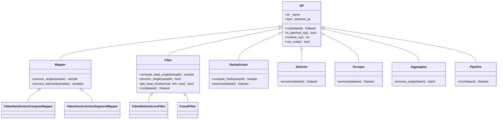

### 1.3 OP.run() 的公共前置逻辑

`OP.run()` 是所有算子的统一入口，它在真正处理前自动给数据集补齐「元信息列」——这对 Qwen 的「给每条轨迹打 meta 标签（相机参数、手部动作、原子动作段……）」至关重要：

```560:597:data_juicer/ops/base_op.py
    def run(self, dataset):
        from data_juicer.core.data import NestedDataset

        if not isinstance(dataset, NestedDataset):
            dataset = NestedDataset(dataset)
        # add meta field for OPs that produce tags
        from data_juicer.core.data import add_same_content_to_new_column

        if self._name in TAGGING_OPS.modules and Fields.meta not in dataset.features:
            dataset = dataset.map(
                add_same_content_to_new_column,
                fn_kwargs={"new_column_name": Fields.meta, "initial_value": {}},
                num_proc=self.runtime_np(),
                batch_size=self.batch_size,
                desc="Adding new column for meta",
            )
        # add stats field for Filters that produce stats
        if (
            isinstance(self, Filter)
            and self._name not in NON_STATS_FILTERS.modules
            and Fields.stats not in dataset.features
        ):
            dataset = dataset.map(
                add_same_content_to_new_column,
                fn_kwargs={"new_column_name": Fields.stats, "initial_value": {}},
                ...
            )
        ...
        return dataset
```

所有 VLA 算子（标定、手部重建、动作计算……）都把结果写到 `sample[Fields.meta][tag_field_name]`（`Fields.meta == "__dj__meta__"`）。这形成了一条贯穿 H2R 管道的 **meta 字段依赖链**（详见[第 4 章](#第-4-章-h2r-合成管道核心)）。

### 1.4 批处理 vs 单样本处理

DJ 用 `is_batched_op()` 决定调用 `process_single` 还是 `process_batched`；并且**禁止子类直接 override `process`**，强制实现 `*_single` 或 `*_batched`，从而把「逐样本逻辑」与「批调度」解耦：

```629:648:data_juicer/ops/base_op.py
        if self.is_batched_op():
            self.process = catch_map_batches_exception(
                self.process_batched, skip_op_error=self.skip_op_error, op_name=self._name
            )
        else:
            self.process = catch_map_single_exception(
                self.process_single, skip_op_error=self.skip_op_error, op_name=self._name
            )

    # set the process method is not allowed to be overridden
    @classmethod
    def __init_subclass__(cls, **kwargs):
        not_allowed_list = ["process"]
        for method_name in not_allowed_list:
            if method_name in cls.__dict__:
                raise TypeError(
                    f"Method {method_name} cannot be overridden by subclass "
                    f"{cls.__name__}. Please implement {method_name}_single "
                    f"or {method_name}_batched."
                )
```

**为什么重要**：VLA 算子（如相机标定、手部重建）是 GPU 重算子，通过 `batch_mode: true` 走批处理可摊销模型加载与显存开销——这与 Qwen 用 $K_{\text{repeat}}$ 摊销 VLM 前向的思想异曲同工。

### 1.5 Filter 的两阶段流水线

Filter 是 Qwen「五阶段过滤」的承载基类，它把过滤拆成 **`compute_stats`（算指标）→ `process`（判定保留）** 两阶段：

```832:864:data_juicer/ops/base_op.py
    def run(self, dataset, *, exporter=None, tracer=None, reduce=True):
        dataset = super(Filter, self).run(dataset)
        new_dataset = dataset.map(
            self.compute_stats,
            num_proc=self.runtime_np(),
            with_rank=self.use_cuda(),
            batch_size=self.batch_size,
            desc=self._name + "_compute_stats",
        )
        if exporter and self.stats_export_path is not None:
            exporter.export_compute_stats(new_dataset, self.stats_export_path)
        if reduce:
            ...
            new_dataset = new_dataset.filter(
                self.process, num_proc=self.runtime_np(), batch_size=self.batch_size, desc=self._name + "_process"
            )
        free_models()
        return new_dataset
```

通用区间判定 `get_keep_boolean` 支持开闭区间与「反转区间」（保留区间外样本，正好用于**极值过滤**——保留正常值、丢弃极端值）：

```786:794:data_juicer/ops/base_op.py
    def get_keep_boolean(self, val, min_val=None, max_val=None):
        res_bool = True
        if min_val is not None:
            res_bool = res_bool and (val >= min_val if self.min_closed_interval else val > min_val)
        if max_val is not None:
            res_bool = res_bool and (val <= max_val if self.max_closed_interval else val < max_val)
        if self.reversed_range:
            res_bool = not res_bool
        return res_bool
```

**关键洞察**：`reduce=True/False` 的设计让 Filter 可以「只算指标、不真正过滤」。`Analyzer`（[第 5 章](#第-5-章-五阶段过滤--三项跨模态校验)）正是利用这一点先扫一遍数据得到分位数分布，再回填阈值——这恰好对应 Qwen「按体态计算 $q_1, q_{99}$ 分位数后做极值过滤」的两步法。

### 1.6 Recipe → 算子实例（config + load_ops）

YAML 中 `process:` 是单键字典列表，键为算子名、值为参数字典。`load_ops` 查注册表实例化：

```17:24:data_juicer/ops/load.py
    for process in process_list:
        op_name, args = list(process.items())[0]
        ops.append(OPERATORS.modules[op_name](**args))
        new_process_list.append(process)

    # store the OP configs into each OP
    for op_cfg, op in zip(new_process_list, ops):
        op._op_cfg = op_cfg
```

`config.py` 只为「实际用到的算子」注册参数校验，并把全局属性（`work_dir`、`num_proc`、`skip_op_error` 等）注入每个算子。**意义**：Qwen 的整条数据 pipeline 可以**完全声明在一份 YAML 里**，可版本化、可复现、可分享——这正是 DJ「Recipe-first」理念，与论文强调的「纯开源、可复现」数据路线高度契合。

### 1.7 执行器：本地 vs Ray

DJ 用工厂模式按 `executor_type` 选择执行器（`default`/`local` → `DefaultExecutor`，`ray` → `RayExecutor`，`ray_partitioned` → `PartitionedRayExecutor`）。两者都遵循「load_ops → 可选 fuse → dataset.process(ops)」：

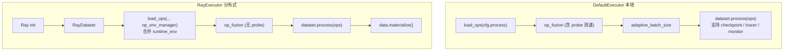

`NestedDataset.process` 逐算子调用 `op.run()`，并对 CUDA / 不可 fork 算子切换多进程上下文（`forkserver`/`spawn`）：

```286:312:data_juicer/core/data/dj_dataset.py
        dataset = self
        op_num = len(operators)
        try:
            for idx, op in enumerate(operators, start=1):
                mp_context = ["forkserver", "spawn"] if (op.use_cuda() or op._name in unforkable_operators) else None
                setup_mp(mp_context)
                ...
                run_args = {"dataset": dataset, "exporter": exporter, "tracer": tracer}
                if open_monitor:
                    dataset, resource_util_per_op = Monitor.monitor_func(op.run, args=run_args)
                else:
                    dataset = op.run(**run_args)
                if checkpointer is not None:
                    checkpointer.record(op._op_cfg)
```

**为什么对 Qwen 重要**：论文构建了 **38,100 小时**预训练语料（其中 24,808 小时为 H2R 合成）。这种规模必须分布式处理。DJ 官方数据：**50 个 Ray 节点（6400 核）2 小时处理 70B 样本，1280 核 2.8 小时去重 5TB**。Qwen VLA pipeline demo 即以 `executor_type: 'ray'` 运行（见 1.9）。

### 1.8 自动算子融合（OP Fusion）

DJ 能把「共享中间变量」的连续 Filter 自动融合成一个 `FusedFilter`，一次 `map` 完成多个 Filter 的指标计算，避免重复加载图像/视频/分词：

```174:183:data_juicer/ops/op_fusion.py
    def process_batched(self, samples):
        # Only return True when all filters return True
        res = None
        for op in self.fused_filters:
            this_res = np.array(list(op.process_batched(samples)))
            if res is not None:
                res = np.logical_and(res, this_res)
            else:
                res = this_res
        return res
```

中间变量注册表包含 `LOADED_VIDEOS`、`INTER_SAMPLED_FRAMES` 等。**对 Qwen 的意义**：H2R 与过滤管道中大量算子都要「解码视频 / 抽帧」，融合可让这些共享帧只解码一次——这是处理 PB 级具身数据的关键性能优化，对应 DJ README 宣称的「OP fusion 2–10x 加速」。

### 1.9 一个真实的 VLA Recipe（DJ 官方 demo）

下面这份官方配置直接证明 DJ 已把 H2R 管道「产品化」为一份 Recipe：

```1:54:demos/ego_hand_action_annotation/configs/vla_pipeline.yaml
# VLA Hand Action Pipeline

project_name: 'vla-hand-action-pipeline'
executor_type: 'ray'
dataset_path: './demos/ego_hand_action_annotation/data/demo-dataset.jsonl'
export_path: './demos/ego_hand_action_annotation/output/processed'
ray_address: 'auto'

process:
  - video_extract_frames_mapper:
      frame_sampling_method: 'all_keyframes'
      ...
  - video_camera_calibration_moge_mapper:
      model_path: 'moge-2-vitl-normal/model.pt'
      output_depth: true
      ...
  - video_hand_reconstruction_hawor_mapper:
      mano_right_path: '/path/to/MANO_RIGHT.pkl'
      mano_left_path: '/path/to/MANO_LEFT.pkl'
      ...
  - video_camera_pose_megasam_mapper:
      runtime_env: {'conda': 'mega-sam'}
      ...
  - video_hand_action_compute_mapper:
      hand_type: 'both'
      ...
  - export_to_lerobot_mapper:
      robot_type: 'egodex_hand'
      fps: 10
      ...
```

> 注意 `runtime_env: {'conda': 'mega-sam'}`：DJ 支持 **OP 级环境隔离**，把与主环境冲突的 CUDA 编译组件（DROID-SLAM 的 `droid_backends`/`lietorch`）放进独立 conda 环境运行。这对集成 Qwen 那种「多个互相冲突的第三方库（SAM/HaWoR/MegaSaM/MuJoCo……）」是关键工程能力。

---

## 第 2 章 数据源与统一加载

### 2.1 Qwen 的数据源构成

Qwen-RobotManip 的 38,100 小时语料由三类、共 15 个数据集 + 大规模 VL 数据组成：

- **机器人演示**（~11,420h，9 个开源集）：OXE、AgiBotWorld-Beta、RoboMIND、Galaxea、RoboCOIN、DROID、RH20T、RDT-1B、InternData-A1
- **人类自中心**（~1,933h，3 个集）：EgoDex、VITRA、EgoVerse
- **VL 共训练**（~28M 条，6 大类）

这些数据来自不同格式（RLDS/TFDS、HDF5、LeRobot、自定义 jsonl、Ego4D 视频……）。Qwen 的第一步是把它们统一加载、规范化为可处理的样本流。

### 2.2 DJ 的数据加载抽象：DataLoadStrategy 注册表

DJ 用 `(executor_type, data_type, data_source)` 三元组注册「数据加载策略」，支持通配符匹配：

```138:162:data_juicer/core/data/load_strategy.py
    def register(cls, executor_type: str, data_type: str, data_source: str):
        """
        Decorator for registering data load strategies with wildcard support
        ...
        :param data_source: Specific data source (e.g., 'arxiv', 's3')
        """
```

已注册的策略覆盖：

- 本地文件：`json`/`jsonl`/`jsonl.gz`/`parquet`/`csv`/`text`（`default` 与 `ray` 双模式）
- 远程：`huggingface`、`modelscope`、`arxiv`、`wiki`、`commoncrawl`
- 对象存储：`s3`（`fsspec`/`s3fs`，`default` 与 `ray` 双模式）

```195:196:data_juicer/core/data/load_strategy.py
@DataLoadStrategyRegistry.register("ray", "local", "*")
class RayLocalJsonDataLoadStrategy(RayDataLoadStrategy):
```

```430:434:data_juicer/core/data/load_strategy.py
@DataLoadStrategyRegistry.register("default", "remote", "s3")
class DefaultS3DataLoadStrategy(DefaultDataLoadStrategy):
    """
    Data load strategy for S3 data for LocalExecutor
    Uses fsspec/s3fs to access S3 files
```

**对 Qwen 的意义**：DJ 原生支持 HuggingFace / ModelScope / S3 加载——Qwen 用到的 OXE、DROID、EgoDex 等绝大多数集都托管在 HF Hub 或可转存 jsonl/parquet，因此**绝大部分数据源可直接或经一次格式转换后被 DJ 加载**。论文也强调「纯开源」，这与 DJ 的开源数据生态完全契合。

### 2.3 多模态对齐：special token

DJ 用统一的多模态占位符把文本与图像/视频/音频在同一条文本流里对齐：

```24:30:data_juicer/utils/mm_utils.py
DEFAULT_SPECIAL_TOKENS = {
    "image": f"<{DEFAULT_PREFIX}image>",
    "audio": f"<{DEFAULT_PREFIX}audio>",
    "video": f"<{DEFAULT_PREFIX}video>",
    ...
    "eoc": f"<|{DEFAULT_PREFIX}eoc|>",
}
```

样本以 `text` + `images`/`videos`/`audios` 路径列表 + `__dj__meta__` 组织（见 demo 输入格式）：

```json
{ "videos": ["./data/1018.mp4"], "text": "", "__dj__meta__": {} }
```

这与 Qwen「多视角图像 + 语言指令 + 本体感受状态 + 历史」的多模态样本结构天然兼容——视觉走 `videos`/`images`，指令走 `text`，状态/动作/相机参数走 `__dj__meta__`。

### 2.4 实现等级与缺口

| 数据源类型 | DJ 支持 | 等级 |
|---|---|---|
| jsonl/parquet/csv（本地，可由各机器人集转存） | 原生 | 🟢 |
| HuggingFace / ModelScope（OXE/DROID/EgoDex 等托管处） | 原生 | 🟢 |
| S3 对象存储（PB 级语料） | 原生 | 🟢 |
| **RLDS/TFDS（OXE 原生格式）** | 无内置策略，需先转 parquet/jsonl 或写自定义 LoadStrategy | 🟡 |
| **HDF5（部分机器人集原生格式）** | 无内置策略，需转换或自定义 | 🟡 |
| **LeRobot 原生「输入」加载** | `export_to_lerobot_mapper` 仅负责**输出**；输入加载需自定义 | 🟡 |

**结论**：数据「加载」层 DJ 覆盖了主流通用格式与远程源，但**机器人专有的 RLDS/HDF5/LeRobot 原生格式没有内置 LoadStrategy**。这并非架构缺陷——DJ 的 `DataLoadStrategyRegistry.register` 装饰器允许用户为任意 `data_source` 注册策略，补足成本低（几十行代码）。本维度评 **70 分**。

---

## 第 3 章 统一表示：80 维向量 + 相机系 Delta + 二值掩码

这是 Qwen 三维对齐框架的「表示对齐」维度，也是论文最核心的创新之一。DJ 在此处**框架完全可承载，但无现成的「机器人状态向量化」专用算子**，需自定义。本章给出 LaTeX 形式化、DJ 实现骨架与数据流，并明确缺口。

### 3.1 Qwen 的统一 80 维向量（回顾）

每臂 29 维（关节 7 + EEF 位姿 9 + 夹爪 1 + 灵巧手 12）× 2 + 预留 22 = **80 维**。状态用绝对坐标，动作的 EEF 用相机系**相对 delta**、方向用 3D 旋转向量。在 DiT 内部拆为 2 个 40 维 per-EEF token。

### 3.2 相机坐标系 Delta 位姿（论文采用的可分离式）

设 $c$ 为参考相机系，$e$ 为当前 EEF 系，$e^*$ 为目标 EEF 系。论文采用的**可分离形式**为：

$$
\mathbf{a}_p = \begin{bmatrix} {}^c_e\mathbf{R}\; {}^e_{e^*}\mathbf{R}\; {}^e_c\mathbf{R} & {}^c_e\mathbf{R}\; {}^e\mathbf{t}_{e^*} \\ \mathbf{0} & 1 \end{bmatrix}
$$

其中旋转块把 EEF 间相对旋转 ${}^e_{e^*}\mathbf{R}$ 通过相机-EEF 外参做**共轭变换**投影到相机系；平移块把位移投影到相机系。其性质是「图像里看起来相似的动作 → 动作空间里数值也相近」，从而对齐视觉与动作。

### 3.3 逐维二值掩码与掩码损失

组合掩码 $\mathbf{m} \in \{0,1\}^{T \times D}$（$D=80$）由三源 AND 组合：① slot mask（体态实际占用维度）② step validity mask（异常步及其后全掩码，保持因果一致性）③ per-hand validity mask（手离开视野后该臂全掩码）。掩码后的 Flow-Matching 损失：

$$
\mathcal{L}_{\mathrm{FM}} = \frac{1}{B}\sum_{i=1}^{B}
    \frac{\sum_{t,j}\, m_{i,t,j}\,\bigl(f_\theta(\mathbf{x}_{i,t}, t_i, \mathbf{s}_i, \mathbf{o}_i)_{j} - v_{i,t,j}\bigr)^2}
         {\sum_{t,j}\, m_{i,t,j}}
$$

分母按有效条目归一化，**防止有效维度多的体态主导梯度**。

### 3.4 在 DJ 中如何实现

DJ 把「样本」建模为可包含任意嵌套字段的字典（`NestedDataset`），`Fields.meta` 下可存任意结构（list/ndarray-as-list/dict）。因此 80 维向量、掩码、相机系 delta 完全可以作为 meta 字段计算并存储。DJ 已有的 [`video_hand_action_compute_mapper.py`](../../../data_juicer/ops/mapper/video_hand_action_compute_mapper.py) 就示范了「相机系 ↔ 世界系」的 `scipy` 旋转变换与 delta 动作计算，是实现相机系 delta 与向量化的现成模板。

下面是一个**自定义算子骨架**（基于 DJ 的 `Mapper` 扩展点，非现有代码，仅示意实现路径）：

```python
from data_juicer.ops.base_op import OPERATORS, Mapper
from data_juicer.utils.constant import Fields
import numpy as np

@OPERATORS.register_module("robot_unified_vector_mapper")
class RobotUnifiedVectorMapper(Mapper):
    """把异构机器人状态/动作打包成 80 维统一向量 + 三源二值掩码,
    并把 EEF 动作转为相机坐标系 delta。写入 sample[Fields.meta]。"""

    def __init__(self, embodiment_layout: dict, ref_camera_field: str, *args, **kwargs):
        super().__init__(*args, **kwargs)
        self.layout = embodiment_layout      # 各体态 → 槽位映射(slot mask)
        self.ref_camera_field = ref_camera_field

    def process_single(self, sample):
        meta = sample[Fields.meta]
        raw = meta["raw_robot_state_action"]          # 原始关节/EEF/夹爪
        cam_c2w = meta[self.ref_camera_field]          # 参考相机外参
        vec = np.zeros((len(raw), 80), dtype=np.float32)
        mask = np.zeros((len(raw), 80), dtype=np.uint8)
        slot = self.layout[meta["embodiment"]]         # 该体态的槽位区间
        # 1) 填充关节(绝对) / EEF(相机系 delta) / 夹爪 → vec; 置位 slot mask
        # 2) step validity: 异常步起后续全 0 (因果一致性)
        # 3) per-hand validity: 手出视野后该臂槽位置 0
        meta["unified_vector"] = vec.tolist()
        meta["unified_mask"] = mask.tolist()
        return sample
```

掩码字段一旦写入，过滤阶段即可用 DJ 现成的 [`general_field_filter`](../../../data_juicer/ops/filter/general_field_filter.py) 引用它做条件过滤（如「有效维度数 < 阈值则丢弃」）。

### 3.5 表示对齐的数据流（数据流图）

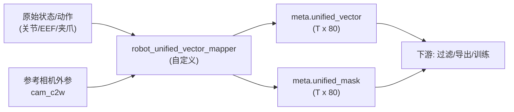

### 3.6 实现等级与缺口

- 🟡 80 维向量、相机系 delta、三源掩码：DJ **框架可承载**（任意 meta 字段 + scipy 变换 + `video_hand_action_compute_mapper` 的相机↔世界变换可复用），但**无开箱即用的专用算子**，需写自定义 `Mapper`（论文专有逻辑）。
- 这是本维度评 **55 分**的原因：能实现、有现成模板与字段机制，但落地需要相当量的自定义编码（尤其是各体态 → 槽位的精确映射、可分离式相机 delta 的旋转共轭）。

---

## 第 4 章 H2R 合成管道（核心）

H2R（Human-to-Robot）是 Qwen-RobotManip 数据工程的**皇冠明珠**：把人类自中心操作视频自动转换为带机器人动作标签的训练数据，贡献了 24,808 小时合成语料。论文把 H2R 拆成**动作对齐、视觉对齐、速度对齐**三个子问题。本章逐算子论证 DJ 的实现能力——这也是 DJ 与论文**最同构**的部分。

### 4.0 总体对应关系

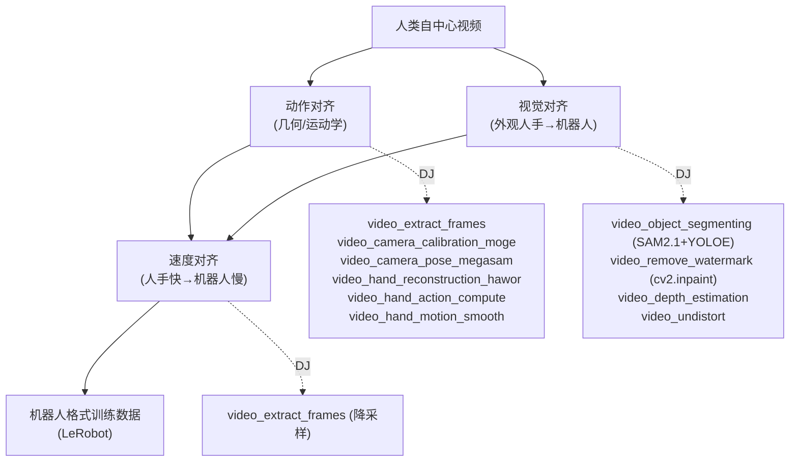

### 4.1 动作对齐（DJ 覆盖度最高：🟢）

论文动作对齐流程：抽帧 → 相机内参/FOV → 相机位姿轨迹 → 手部重建(MANO) → 虚拟手指/EEF 位姿/夹爪 → 轨迹平滑。DJ 的官方 VLA demo 几乎逐步对应。

#### 4.1.1 抽帧 `video_extract_frames_mapper` 🟢

支持 `all_keyframes`/`all_frames`/`uniform` 三种采样，并可按 `duration` 分段采样：

```56:58:data_juicer/ops/mapper/video_extract_frames_mapper.py
    - "all_keyframes": Extracts all keyframes from the video.
    ...
    - "uniform": Extracts a specified number of frames uniformly from the video.
```

#### 4.1.2 相机内参与 FOV `video_camera_calibration_moge_mapper` 🟢

封装 MoGe-2，输出相机内参 $K$、水平/垂直 FOV、可选深度与法向。FOV 由归一化内参反算（深度解析见[第 9 章](#第-9-章-关键算子代码深度解析)）：

```203:206:data_juicer/ops/mapper/video_camera_calibration_moge_mapper.py
                        if need_hfov:
                            final_hfov_list.append(float(2 * np.arctan(1 / 2 / intr_np[0][0])))
                        if need_vfov:
                            final_vfov_list.append(float(2 * np.arctan(1 / 2 / intr_np[1][1])))
```

另有 `video_camera_calibration_deepcalib_mapper`、`video_camera_calibration_droidcalib_mapper` 两个备选标定后端，覆盖 Qwen「无相机内参的野外自中心视频」标定需求。

#### 4.1.3 相机位姿轨迹 `video_camera_pose_megasam_mapper` 🟢

封装 MegaSaM（含 DROID-SLAM），输出逐帧 `cam_c2w`（4×4 相机到世界变换）。这正是把人手从「相机系」抬升到「世界系」的前提，也是 Qwen 处理「自中心相机本身在动」的关键。配置用 OP 级 conda 隔离 `runtime_env: {'conda': 'mega-sam'}`。

#### 4.1.4 手部重建 → MANO `video_hand_reconstruction_hawor_mapper` 🟢

封装 HaWoR，输出 MANO 参数（`global_orient`、`hand_pose` 15 关节、`betas` 10 形状）与重建结果。这对应论文用 MANO 拟合人手、提取「虚拟手指」的步骤：

```271:288:data_juicer/ops/mapper/video_hand_reconstruction_hawor_mapper.py
                    "init_hand_pose": results["pred_rotmat"][None, :, 1:],  # (B, T, 15, 3, 3)
                    ...
                    "init_betas": results["pred_shape"][None, :],  # (B, T, 10)
                    ...
                init_hand_pose = self.rotation_matrix_to_angle_axis(data_out["init_hand_pose"])  # (B, T, 15, 3)
```

#### 4.1.5 EEF 位姿 / 夹爪 / 动作 `video_hand_action_compute_mapper` 🟢/🟡

这是 H2R「动作」最核心的算子：读取 HaWoR 手部参数 + MegaSaM 相机位姿，输出每帧 8 维 state 与 7 维 delta action（与 LIBERO/StarVLA LeRobot 对齐）。**相机系 → 世界系**的位姿变换：

```172:197:data_juicer/ops/mapper/video_hand_action_compute_mapper.py
        # Transform position: camera → world
        R_c2w = cam_c2w[:3, :3]
        t_c2w = cam_c2w[:3, 3]
        pos_world = R_c2w @ transl + t_c2w

        # Transform orientation: camera → world
        orient_world = R_c2w @ global_orient
        euler = _rotation_matrix_to_euler(orient_world)  # [roll, pitch, yaw]

        # Estimate gripper state from finger articulation
        gripper = _estimate_gripper_from_hand_pose(hand_pose)

        state = np.array([pos_world[0], pos_world[1], pos_world[2],
                          euler[0], euler[1], euler[2], 0.0, gripper], dtype=np.float32)
```

**delta 动作**（与 Qwen 相机系 delta 思路一致，此处为世界系欧拉 delta，可改造为相机系）：

```214:228:data_juicer/ops/mapper/video_hand_action_compute_mapper.py
        for t in range(T - 1):
            # Position delta
            actions[t, 0:3] = states[t + 1, 0:3] - states[t, 0:3]
            # Rotation delta (in Euler angles)
            euler_cur = states[t, 3:6]
            euler_next = states[t + 1, 3:6]
            actions[t, 3:6] = _delta_rotation_euler(euler_cur, euler_next)
            # Gripper: use next frame's gripper state
            actions[t, 6] = states[t + 1, 7]
```

> **🟡 差异**：DJ 这里输出 8 维 state / 7 维 action（单臂、欧拉角、世界系 delta），与 Qwen 的 80 维统一向量、3D 旋转向量、相机系 delta 不同。但**几何骨架完全一致**——「夹爪由手指关节张合估计、动作由相邻帧差分、用旋转矩阵做坐标系变换」三件事 DJ 都已实现，改造为 Qwen 表示只需替换维度布局与旋转表示（rotvec 替欧拉、相机系替世界系）。这属于「组合 + 少量自定义」。

#### 4.1.6 轨迹平滑 `video_hand_motion_smooth_mapper` 🟢

对应论文「轨迹平滑（Savitzky-Golay + 四元数方向平滑）+ 极端速度异常剔除（中值+MAD）」。位置/速度用 SG 滤波，方向用四元数 SG，异常用 MAD：

```124:130:data_juicer/ops/mapper/video_hand_motion_smooth_mapper.py
        median_speed = np.median(speed)
        mad = np.median(np.abs(speed - median_speed))
        ...
        limit = median_speed + threshold_mad * mad * 1.4826  # MAD→σ scale
        outlier_mask = speed > limit
```

```205:227:data_juicer/ops/mapper/video_hand_motion_smooth_mapper.py
        from scipy.signal import savgol_filter
        ...
                smoothed_quats[:, d] = savgol_filter(
```

MAD→σ 的尺度因子 1.4826 是统计学常数（$1/\Phi^{-1}(3/4)$），让中值绝对偏差成为标准差的稳健估计。**这与 Qwen 突变检测（[第 5 章](#第-5-章-五阶段过滤--三项跨模态校验)）共用同一套稳健统计思想**。

### 4.2 视觉对齐（DJ 部分覆盖：🔵🟡🔴 混合）

论文视觉对齐：人手分割（SAM3）→ 背景修复去人手（ProPainter）→ IK 求解机器人底座位置 → MuJoCo 渲染机器人 → 深度引导遮挡合成。这是 DJ 缺口最集中的区域。

#### 4.2.1 人手/物体分割 🔵

`video_object_segmenting_mapper`（SAM2.1 + YOLOE 开放词表）与 `image_segment_mapper`（FastSAM）可输出人手/物体掩码，覆盖论文「分割人手区域」的需求。论文用 SAM3，DJ 用 SAM2.1/FastSAM——能力等价、模型不同（🔵 组合实现）。

#### 4.2.2 背景修复（去人手）🟡

`video_remove_watermark_mapper` 基于 `cv2.inpaint`（Telea/NS 算法）在掩码区域做图像修复；图像域亦有 diffusers inpainting 类算子。**差异**：论文用 ProPainter 做**视频时序一致**的修复，DJ 的 `cv2.inpaint` 是**逐帧空间**修复，时序一致性弱。可作近似（🟡），高质量需自定义集成 ProPainter。

#### 4.2.3 深度估计 🟢 / 去畸变 🟢

`video_depth_estimation_mapper` 出逐帧深度图（对应论文「深度引导遮挡」的深度来源）；`video_undistort_mapper` 做镜头去畸变。两者均为现成算子。

#### 4.2.4 明确缺口 🔴

| 论文步骤 | DJ 现状 | 等级 |
|---|---|---|
| SAM3 精确擦除人手 + ProPainter 视频时序修复 | SAM2/FastSAM + cv2.inpaint 近似 | 🟡 |
| IK 求解机器人底座最优放置 | 无（需 IK 求解器，如 Pinocchio/cuRobo） | 🔴 |
| MuJoCo 渲染机器人臂贴回视频 | 无（需物理仿真渲染引擎） | 🔴 |
| 深度引导遮挡合成（机器人/真实场景前后景融合） | 深度有，融合合成逻辑需自定义 | 🟡 |

**判断**：视觉对齐里「机器人物理仿真渲染 + IK 放置」**超出 DJ 数据处理框架的设计边界**（属于仿真引擎职责），是 H2R 维度扣分的主因。但分割、深度、去畸变、基础修复 DJ 都已具备，可承接视觉对齐的「前半程」。

### 4.3 速度对齐（🟢）

论文指出人手运动比机器人快，需把人类轨迹**时间重采样**到机器人可执行速度。DJ 用 `video_extract_frames_mapper` 的 `uniform` + `frame_num`/`duration` 或后处理降采样即可实现帧率/时间缩放（🟢）。更复杂的「按动作幅度自适应重采样」可在 `video_hand_motion_smooth_mapper` 后接一个自定义重采样 Mapper（🟡）。

### 4.4 H2R 管道序列图

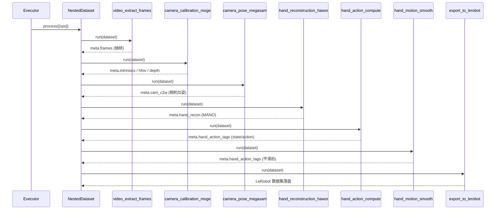

### 4.5 meta 字段依赖数据流图

H2R 各算子通过 `Fields.meta` 下的命名字段**串联**——后一个算子读取前一个写入的字段，形成有向依赖链：

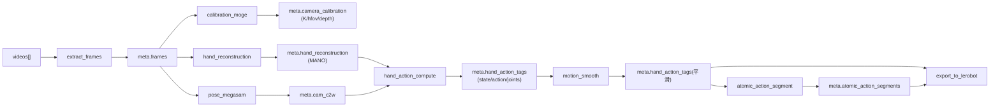

> 这张依赖图也解释了**为何这些算子必须按特定顺序排列在 Recipe 里**：`hand_action_compute` 依赖 `cam_c2w` 与 `hand_reconstruction`，所以必须排在 `camera_pose` 与 `hand_reconstruction` 之后。DJ 的 Recipe 列表顺序天然表达这种依赖。

### 4.6 H2R 实现等级总表

| 子问题 | 步骤 | DJ 算子 | 等级 |
|---|---|---|---|
| 动作对齐 | 抽帧 | `video_extract_frames_mapper` | 🟢 |
| 动作对齐 | 内参/FOV/深度 | `video_camera_calibration_{moge,deepcalib,droidcalib}_mapper` | 🟢 |
| 动作对齐 | 相机位姿 | `video_camera_pose_megasam_mapper` | 🟢 |
| 动作对齐 | 手部重建(MANO) | `video_hand_reconstruction_hawor_mapper` | 🟢 |
| 动作对齐 | EEF/夹爪/动作 | `video_hand_action_compute_mapper` | 🟢/🟡 |
| 动作对齐 | 平滑/异常剔除 | `video_hand_motion_smooth_mapper` | 🟢 |
| 视觉对齐 | 人手分割 | `video_object_segmenting_mapper` / `image_segment_mapper` | 🔵 |
| 视觉对齐 | 背景修复 | `video_remove_watermark_mapper`(cv2.inpaint) | 🟡 |
| 视觉对齐 | 深度/去畸变 | `video_depth_estimation_mapper` / `video_undistort_mapper` | 🟢 |
| 视觉对齐 | IK 底座 / MuJoCo 渲染 / 遮挡合成 | 无 / 自定义 | 🔴/🟡 |
| 速度对齐 | 帧率重采样 | `video_extract_frames_mapper` | 🟢 |
| 导出 | LeRobot | `export_to_lerobot_mapper` | 🟢 |

**H2R 维度判断**：动作对齐 ≈ 90% 覆盖（DJ 几乎逐算子对应），速度对齐 ≈ 80%，视觉对齐 ≈ 45%（缺机器人渲染合成）。加权后 H2R 维度评 **78 分**。

---

## 第 5 章 五阶段过滤 + 三项跨模态校验

Qwen 在合成与采集后做严格的数据清洗：**五阶段轨迹过滤**（突变检测、状态-动作趋势对齐、极值过滤、FK 一致性、基坐标系对齐）+ **三项跨模态校验**（指令一致性、视频-状态一致性、视频质量）。DJ 的 Filter 两阶段架构（[第 1.5 节](#15-filter-的两阶段流水线)）+ Analyzer 分位数体系是承载这些清洗规则的天然底座。

### 5.1 过滤①：突变检测（🔵/🟡）

论文做法：用中值滤波/SG 平滑得到参考轨迹，计算残差、加速度、jerk（加加速度），超过稳健阈值（中值+MAD）的帧判为突变。DJ 的 `video_hand_motion_smooth_mapper` **已内置** MAD 稳健阈值与 SG 平滑（见[第 4.1.6 节](#416-轨迹平滑-video_hand_motion_smooth_mapper-)）：

```124:132:data_juicer/ops/mapper/video_hand_motion_smooth_mapper.py
        median_speed = np.median(speed)
        mad = np.median(np.abs(speed - median_speed))
        ...
        limit = median_speed + threshold_mad * mad * 1.4826  # MAD→σ scale
        outlier_mask = speed > limit
        n_outliers = int(np.sum(outlier_mask))
```

**差异**：DJ 内置的是「速度」一阶信号的 MAD 检测并**插值修复**；论文还要对**加速度、jerk** 多阶信号检测并**整段丢弃**。实现路径：用自定义 `Filter` 在 `compute_stats_single` 里算多阶偏差统计量写入 `Fields.stats`，`process_single` 用 `get_keep_boolean` 判定（🟡，复用 DJ 稳健统计模板）。

### 5.2 过滤②：状态-动作趋势对齐（🟡）

论文用互相关检验「状态变化方向」与「动作指令方向」是否一致，定义趋势一致度（Directional Agreement, DA）。形式化：

$$
\mathrm{DA} = \frac{1}{T-1}\sum_{t=1}^{T-1}
   \mathbb{1}\!\left[\,\operatorname{sign}\bigl(\Delta \mathbf{s}_t \cdot \mathbf{a}_t\bigr) > 0\,\right],
\qquad \Delta \mathbf{s}_t = \mathbf{s}_{t+1}-\mathbf{s}_t
$$

即「状态增量 $\Delta\mathbf{s}_t$ 与动作 $\mathbf{a}_t$ 同向的帧占比」。当 $\mathrm{DA} < \tau$（如 0.9）判为状态-动作不一致而丢弃。DJ 实现：自定义 `Filter` 算 DA 写入 `Fields.stats`，再用 [`general_field_filter`](../../../data_juicer/ops/filter/general_field_filter.py)（支持任意布尔表达式）以 `"__dj__stats__.DA >= 0.9"` 过滤（🟡）。

### 5.3 过滤③：极值过滤（🔵，DJ 桥接最优雅）

论文做法：先在全体数据上对每个维度计算分位数 $q_1, q_{99}$，归一化后丢弃落在极端分位外的样本。DJ 用 **Analyzer → Filter** 两步桥接，与论文方法论**完全一致**。

第一步，`OverallAnalysis` 用 pandas `describe` 算分位数（默认 25/50/75，可传任意分位）：

```38:39:data_juicer/analysis/overall_analysis.py
        # default percentiles to analyze
        self.default_percentiles = [0.25, 0.5, 0.75]
```

```79:96:data_juicer/analysis/overall_analysis.py
        percentiles = list(set(percentiles + self.default_percentiles))
        ...
                    "percentiles": percentiles,
```

传 `percentiles=[0.01, 0.99]` 即得每维 $q_1, q_{99}$。第二步把分位数回填为阈值，用 `specified_numeric_field_filter` 判定（其判定就是 `get_keep_boolean`）：

```71:79:data_juicer/ops/filter/specified_numeric_field_filter.py
    def process_single(self, sample):
        ...
            return self.get_keep_boolean(field_value, self.min_value, self.max_value)
```

或用 [`range_specified_field_selector`](../../../data_juicer/ops/selector/range_specified_field_selector.py) 直接「按字段分位区间选样」（内部即按百分位排序后切片），一步到位（🔵）。

**桥接流程**：

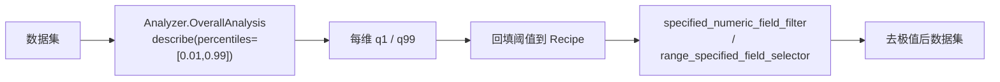

### 5.4 过滤④：关节-EEF FK 一致性（🔴）

论文用正运动学（Forward Kinematics，Pinocchio）从关节角推算 EEF 位姿，与记录的 EEF 位姿比对，偏差大则丢弃。**DJ 无机器人运动学库集成**——这需要 URDF + Pinocchio/cuRobo。属框架外能力，须自定义算子封装 Pinocchio（🔴，可补足但成本高）。

### 5.5 过滤⑤：基坐标系/EEF 方向对齐（🟡）

论文统一不同数据集的基坐标系与 EEF 方向约定（如 z 轴朝向、夹爪开合方向）。DJ 实现：自定义 `Mapper` 用 `scipy` 旋转做坐标系校正——`video_hand_action_compute_mapper` 的相机↔世界旋转变换是直接模板（🟡）。

### 5.6 跨模态校验①：指令一致性（🔵/🟡）

论文用三阶段 VLM 推理 + 多专家投票判断「语言指令是否与视频内容一致」。DJ 有丰富的 VLM/LLM 语义算子：

- `mllm_mapper`（多模态大模型问答）/ `video_captioning_from_vlm_mapper`（视频描述）→ 生成视频内容描述
- `llm_extract_mapper`（支持 CoT 思维链）→ 三阶段推理式判断
- 一致性打分后用 `general_field_filter` 过滤

**差异**：「多专家投票（multi-vote）」需自定义聚合逻辑（多次调用 + 投票），DJ 的 `Aggregator` 类可承载（🟡）。整体 🔵/🟡。

### 5.7 跨模态校验②：视频-状态一致性（🔵分割 / 🔴投影）

论文把机器人 URDF 按记录状态投影到图像，与 SAM 分割的机器人实际位置比对。DJ：

- 分割部分 🔵：`video_object_segmenting_mapper`（SAM2.1+YOLOE）可分割机器人/手
- URDF 投影部分 🔴：需 URDF + 相机投影渲染，DJ 无内置（自定义封装）

### 5.8 跨模态校验③：视频质量（🔵/🟡）

论文剔除黑帧、模糊、静止片段。DJ：

- 静止检测 🔵：`video_motion_score_filter` / `video_motion_score_raft_filter`（光流运动幅度），可剔除「运动过小=静止」或「运动过大=抖动」
- 美学/NSFW 🔵：`video_aesthetics_filter`、`video_nsfw_filter`
- 黑帧/模糊 🟡：无专用算子，需自定义（亮度均值阈值 / 拉普拉斯方差清晰度），但 DJ 有 `image_blur` 等图像工具可复用思路

### 5.9 五阶段过滤工作流图

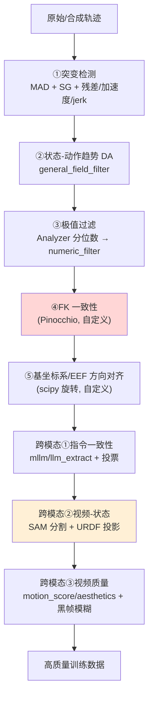

> 红色块（FK 一致性）= 🔴 框架外；橙色块（视频-状态 URDF 投影）= 部分 🔴。其余阶段 DJ 可直接/组合/少量自定义实现。

### 5.10 过滤维度实现等级总表

| 阶段 | DJ 实现 | 等级 |
|---|---|---|
| ①突变检测 | `motion_smooth`(MAD/SG) + 自定义多阶偏差 | 🔵/🟡 |
| ②状态-动作 DA | 自定义 Filter + `general_field_filter` | 🟡 |
| ③极值过滤 | `Analyzer` + `specified_numeric_field_filter`/`range_specified_field_selector` | 🔵 |
| ④FK 一致性 | 无（需 Pinocchio） | 🔴 |
| ⑤基坐标系对齐 | 自定义 Mapper（scipy） | 🟡 |
| 跨模态①指令一致性 | `mllm`/`llm_extract`/`video_captioning` + 投票 | 🔵/🟡 |
| 跨模态②视频-状态 | SAM 分割 🔵 + URDF 投影 🔴 | 混合 |
| 跨模态③视频质量 | `video_motion_score_*`/`aesthetics` 🔵 + 黑帧模糊 🟡 | 🔵/🟡 |

**过滤维度判断**：极值过滤（DJ 招牌能力）完美对应；突变/趋势/质量可组合+少量自定义；FK 一致性与 URDF 投影是真实缺口。综合评 **62 分**。

---

## 第 6 章 数据标注工程

Qwen 的标注工程包含：Embodiment Prompt（体态提示）、ECoT（具身思维链）+ 17 原子动作、自中心视频理解标注、2D 轨迹预测标注、以及 VL 共训练数据（VQA/grounding/OCR/QA）。DJ 有成体系的 LLM/VLM 语义算子可承接其中大部分。

### 6.1 Embodiment Prompt（🟡）

论文为每条轨迹拼接 5 字段结构化文本（机器人型号、控制频率、视角、夹爪类型、自由度等），并以 15% 概率随机 dropout 字段以增强泛化。DJ 实现：自定义 `Mapper` 拼接 meta 字段为文本 + `random.random() < 0.15` 随机丢弃（🟡，逻辑简单但无内置算子）。骨架：

```python
@OPERATORS.register_module("embodiment_prompt_mapper")
class EmbodimentPromptMapper(Mapper):
    def __init__(self, dropout_prob=0.15, *a, **kw):
        super().__init__(*a, **kw); self.p = dropout_prob
    def process_single(self, sample):
        m = sample[Fields.meta]
        fields = ["robot_type","control_freq","viewpoint","gripper_type","dof"]
        kept = [f"{k}:{m[k]}" for k in fields
                if k in m and random.random() >= self.p]
        sample[self.text_key] = " ".join(kept) + " " + sample.get(self.text_key, "")
        return sample
```

### 6.2 ECoT 具身思维链 + 17 原子动作（🔵/🟡）

论文 ECoT 用三阶段推理（任务理解 → 子目标分解 → 原子动作序列）标注，原子动作来自 17 个预定义类别（move/grasp/place/rotate…）。DJ 实现：

- **三阶段推理标注** 🔵：`llm_extract_mapper` 支持 CoT（思维链）提示，可按三阶段 prompt 抽取结构化推理；`mllm_mapper` 注入视觉上下文
- **原子动作切分** 🟡→🟢：`video_atomic_action_segment_mapper` 已实现「按手腕速度局部极小值切分原子动作段」，正是论文「检测 3D 手腕速度极小点作为切分点」的实现：

```17:20:data_juicer/ops/mapper/video_atomic_action_segment_mapper.py
        "we detect speed minima of the 3D hand wrists in the world space
        and use them as cutting points.  We smooth the hand trajectory and
        select points that are local speed minima within a fixed window
        centered on each point."
```

```104:122:data_juicer/ops/mapper/video_atomic_action_segment_mapper.py
    def _smooth_speed(
        speed: np.ndarray,
        window: int,
    ) -> np.ndarray:
        """Smooth speed signal with Savitzky-Golay filter."""
        n = len(speed)
        if n < 5:
            return speed.copy()
        try:
            from scipy.signal import savgol_filter
            win = min(window, n)
            if win % 2 == 0:
                win -= 1
            if win < 3:
                return speed.copy()
            return savgol_filter(speed, win, polyorder=2)
        except Exception:
            return speed.copy()
```

> DJ 的算子注释**直接引用了 `arxiv.org/pdf/2510.21571`**——这与 Qwen-RobotManip 同源的具身数据论文，说明 DJ 的 VLA 算子就是冲着这类「自中心 → 原子动作」标注需求设计的。将切分段映射到 17 个语义类别需自定义分类（基于动作向量特征或 LLM 分类），属 🟡。

### 6.3 自中心视频理解标注（🟢）

论文为每段视频生成密集语言描述用于视觉-语言对齐。DJ 直接命中：

- `video_captioning_from_vlm_mapper`（VLM 直接描述视频）
- `video_captioning_from_frames_mapper` / `video_captioning_from_video_mapper`（多帧/整段描述）
- `video_tagging_from_frames_mapper` / `image_tagging_vlm_mapper`（打标签）

### 6.4 2D 轨迹预测标注（🟢）

论文把未来 EEF 的 2D 投影轨迹叠加到图像作为辅助监督。DJ 有专用算子 `video_trajectory_overlay_mapper`，直接把轨迹点叠加渲染到视频帧（🟢）。

### 6.5 VL 共训练数据：VQA / grounding / OCR / QA（🔵）

论文混入 28M 条视觉-语言数据（VQA、指代定位、OCR、图文等）维持通用能力。DJ 全链路覆盖此类数据的生成与质检：

| VL 数据类型 | DJ 算子 | 等级 |
|---|---|---|
| 指代定位质检（grounding recall） | `phrase_grounding_recall_filter` | 🟢 |
| 目标检测标注 | `image_detection_yolo_mapper` | 🟢 |
| OCR 文本占比过滤 | `video_ocr_area_ratio_filter` | 🟢 |
| QA 生成 | `generate_qa_from_text_mapper` / `generate_qa_from_examples_mapper` | 🟢 |
| QA 优化/校准 | `optimize_qa_mapper` / `calibrate_qa_mapper` | 🟢 |
| 图文匹配过滤 | `image_text_matching_filter` | 🟢 |
| 图像描述 | `image_captioning_mapper` | 🟢 |

### 6.6 标注工程数据流图

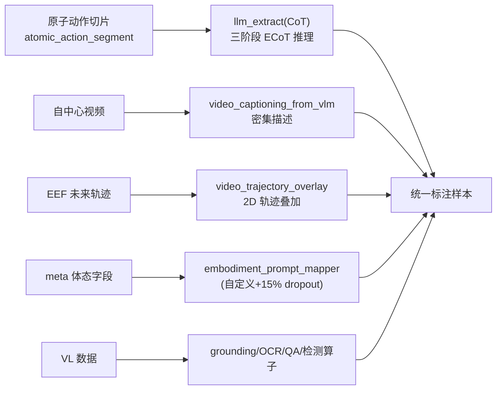

### 6.7 标注维度判断

ECoT 推理、自中心 caption、2D 轨迹、VL 数据生成质检 DJ 几乎全覆盖（🟢/🔵）；Embodiment Prompt 的 dropout、原子动作 → 17 类语义映射、多专家投票需少量自定义（🟡）。综合评 **75 分**。

---

## 第 7 章 训练消费与后训练数据策略

本章界定**数据处理与训练机制的边界**。Qwen 的部分「数据相关做法」实际发生在训练循环内部（掩码加权损失、$K_{\text{repeat}}$），属于训练框架职责而非 DJ 的数据处理范畴；但很多「数据准备」侧的做法（混合、采样、邻近度选样、增强、禁用过滤）DJ 可以承担。

### 7.1 双流共训练 9:1 数据混合（🔵）

论文以约 9:1 混合机器人动作数据与 VL 数据做双流共训练。DJ 的数据混合方式：

- `DatasetBuilder` 支持多数据源加权混合（按比例采样合并）
- 或分别用两份 Recipe 处理机器人流与 VL 流，再合并导出，最终按 9:1 控制条数

属配置/数据准备层，可直接实现（🔵）。

### 7.2 随机上下文采样（🟡）

论文在 in-context 适配中随机采样上下文示例（stochastic context sampling）。DJ 实现：

- `random_selector`（随机选样）

```1:8:data_juicer/ops/selector/random_selector.py
import numpy as np
from pydantic import Field, PositiveInt
from typing_extensions import Annotated

from data_juicer.utils.constant import Fields

from ..base_op import OPERATORS, Selector
```

- 复杂的「按任务分组随机配对上下文」需自定义 `Grouper` + 采样逻辑（🟡）

### 7.3 三源掩码加权 FM 损失 / $K_{\text{repeat}}=8$（🔴 训练侧）

- **三源二值掩码**：掩码**字段的生成**属数据处理（[第 3 章](#第-3-章-统一表示80-维向量--相机系-delta--二值掩码)已论证可自定义生成）；但**掩码如何加权进 Flow-Matching 损失**（[第 3.3 节](#33-逐维二值掩码与掩码损失)公式）发生在训练前向，属训练框架。
- **$K_{\text{repeat}}=8$**：同一动作块重复 8 次以摊销 VLM 前向开销，是**训练循环内的采样调度**，完全在 DJ 数据处理范畴之外（🔴 训练侧，非 DJ 缺陷）。

> 这部分**不计入 DJ「能否实现数据方法」的扣分**，因为它本就不是数据处理工具的职责；但本文如实标注边界，避免高估。

### 7.4 后训练：禁用过滤 + 数据增强（🟢/🟡）

- **后训练禁用质量过滤** 🟢：只需在后训练 Recipe 的 `process:` 中**不放 Filter 算子**即可，配置层一键实现。
- **Color jitter / 图像增强** 🟡：DJ 有 `image_blur_mapper` 等增强类算子，但「训练时随机 color jitter」通常作为 dataloader 在线增强；若要离线物化增强样本，可自定义 `Mapper` 调 `torchvision.transforms.ColorJitter`（🟡）。

### 7.5 混合后训练：按分布邻近度选数据（🔵）

论文混合后训练时按「与目标域分布邻近度」选取预训练数据混入。DJ 实现：

- `text_embd_similarity_filter`（文本嵌入相似度过滤）— 按与目标域文本的嵌入相似度保留邻近样本
- `video_frames_text_similarity_filter` / `image_text_similarity_filter` — 跨模态邻近度
- 配合 `topk_specified_field_selector` 取 Top-K 最邻近样本

这正是「按分布邻近度选数据」的标准 DJ 实现路径（🔵）。

### 7.6 边界示意图

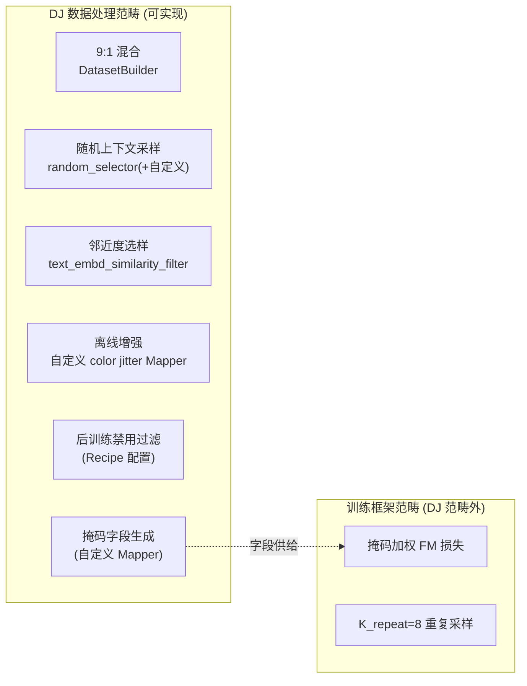

### 7.7 训练/后训练维度判断

数据准备侧（混合、采样、邻近度选样、禁用过滤、增强、掩码字段生成）DJ 大多可实现（🔵/🟡）；训练循环内机制（掩码加权损失、$K_{\text{repeat}}$）超出 DJ 边界（🔴 但非缺陷）。综合评 **65 分**。

---

## 第 8 章 数据基础设施能力（DJ 强项）

Qwen 处理 38,100 小时、PB 级多模态数据，对基础设施要求极高。这恰是 DJ 的核心竞争力，也是本文给「基础设施」维度 95 分的依据。

### 8.1 规模化与分布式

- **Ray 分布式**：`RayExecutor` + `RayDataset`，官方数据「50 节点 6400 核 2h 处理 70B 样本」。Qwen VLA demo 即 `executor_type: 'ray'`。
- **自适应批大小**与 `num_proc` 多进程；CUDA 算子自动切换 `forkserver`/`spawn`（见 [`dj_dataset.py:286`](../../../data_juicer/core/data/dj_dataset.py)）。

### 8.2 算子融合（2–10x）

`fuse_operators` 把共享中间变量的 Filter 合成 `FusedFilter`，视频只解码一次（[第 1.8 节](#18-自动算子融合op-fusion)）。对「过滤管道里多个算子都要抽帧」的具身数据极其有效。

### 8.3 去重家族（13 个去重算子）

跨数据集去重是 Qwen 合并 15 个数据集时的刚需。DJ 提供分模态、分规模的去重：

| 模态/规模 | 算子 |
|---|---|
| 文本精确/模糊 | `document_deduplicator` / `document_minhash_deduplicator` / `document_simhash_deduplicator` |
| 行级 | `document_line_deduplicator` |
| 图像 | `image_deduplicator` / `ray_image_deduplicator` |
| 视频 | `video_deduplicator` / `ray_video_deduplicator` |
| 大规模分布式 | `ray_bts_minhash_deduplicator` / `ray_bts_minhash_cpp_deduplicator` |

官方数据「1280 核 2.8h 去重 5TB」。视频/图像去重直接服务于「合成数据与真实数据去冗余」。

### 8.4 可观测性：tracing / checkpoint / monitor

`NestedDataset.process` 内建 checkpoint（断点续跑）、tracer（采样级前后对比，定位每个算子改了什么/删了什么）、Monitor（逐算子资源占用）。这对调试一条 10+ 算子的 H2R 管道至关重要：

```286:312:data_juicer/core/data/dj_dataset.py
        dataset = self
        op_num = len(operators)
        try:
            for idx, op in enumerate(operators, start=1):
                mp_context = ["forkserver", "spawn"] if (op.use_cuda() or op._name in unforkable_operators) else None
                setup_mp(mp_context)
                ...
                if open_monitor:
                    dataset, resource_util_per_op = Monitor.monitor_func(op.run, args=run_args)
                else:
                    dataset = op.run(**run_args)
                if checkpointer is not None:
                    checkpointer.record(op._op_cfg)
```

### 8.5 OP 级环境隔离（对应 Qwen 多冲突依赖）

DJ 支持每个算子声明独立 conda `runtime_env`（demo 中 MegaSaM 用 `{'conda': 'mega-sam'}`）。Qwen 集成 SAM3 / HaWoR / MegaSaM / MuJoCo / Pinocchio 等**互相冲突的第三方库**，OP 级隔离让它们能在同一条 pipeline 中共存——这是把论文方法**工程落地**的关键能力，许多数据框架不具备。

---

## 第 9 章 关键算子代码深度解析

本章精选 5 段关键代码逐行剖析「实现了什么、数学原理、为何如此」。

### 9.1 从 MANO 手指关节估计夹爪开合

`_estimate_gripper_from_hand_pose` 把人手 15 个手指关节的弯曲程度映射为夹爪连续状态——这是 H2R「人手 → 二指夹爪」语义对齐的关键一跳。

```60:94:data_juicer/ops/mapper/video_hand_action_compute_mapper.py
    hand_pose = np.asarray(hand_pose, dtype=np.float64)

    # Convert axis-angle (45,) to per-joint angles
    if hand_pose.ndim == 1 and hand_pose.shape[0] == 45:
        # axis-angle: angle = norm of each 3-vector
        hand_pose = hand_pose.reshape(15, 3)
        angles = [np.linalg.norm(hand_pose[j]) for j in range(15)]
    elif hand_pose.ndim == 2 and hand_pose.shape == (15, 3):
        angles = [np.linalg.norm(hand_pose[j]) for j in range(15)]
    else:
        # (15, 3, 3) rotation matrices
        angles = []
        for j in range(hand_pose.shape[0]):
            R = hand_pose[j]
            trace_val = np.clip((np.trace(R) - 1.0) / 2.0, -1.0, 1.0)
            angle = np.arccos(trace_val)
            angles.append(angle)

    avg_angle = np.mean(angles)
    ...
    open_threshold = 0.15
    close_threshold = 0.6

    if avg_angle <= open_threshold:
        return 1.0
    elif avg_angle >= close_threshold:
        return -1.0
    else:
        t = (avg_angle - open_threshold) / (close_threshold - open_threshold)
        return 1.0 - 2.0 * t
```

**逐行解析**：

1. **多格式兼容**：MANO 关节既可能是轴角 `(45,)`/`(15,3)`，也可能是旋转矩阵 `(15,3,3)`。
2. **轴角 → 角度**：轴角向量的模长 $\lVert \boldsymbol{\theta}_j \rVert$ 即旋转角度，故 `np.linalg.norm` 直接得每关节弯曲角。
3. **旋转矩阵 → 角度**：用旋转矩阵迹公式
$$
\theta_j = \arccos\!\left(\frac{\operatorname{tr}(\mathbf{R}_j)-1}{2}\right)
$$
`np.clip(..., -1, 1)` 防止浮点误差使 `arccos` 定义域越界（数值稳健性细节）。
4. **聚合**：15 关节平均弯曲角 $\bar\theta = \frac{1}{15}\sum_j \theta_j$ 表征整手张合。
5. **分段线性映射**到 $[-1,1]$：张开（$\bar\theta\le0.15$）→ +1，握拳（$\bar\theta\ge0.6$）→ −1，中间线性插值 $g = 1 - 2\cdot\frac{\bar\theta-0.15}{0.6-0.15}$。

**为何如此**：用「平均关节角」而非单指，是为了对噪声鲁棒；阈值 0.15/0.6 来自典型 MANO 手势标定（注释明示）；连续值（而非二值）保留了夹爪「半开」的细粒度，与机器人连续夹爪控制对齐。**这正是论文「虚拟手指 → 夹爪」语义对齐的具体落地。**

### 9.2 旋转的坐标系变换与 delta（相机系 ↔ 世界系）

```15:41:data_juicer/ops/mapper/video_hand_action_compute_mapper.py
def _rotation_matrix_to_euler(R):
    ...
    rot = Rotation.from_matrix(R)
    return rot.as_euler("xyz", degrees=False)  # (3,) [roll, pitch, yaw]
...
def _delta_rotation_euler(euler_prev, euler_next):
    """Compute relative rotation as Euler angles: R_delta = R_next @ R_prev^T."""
    ...
    R_delta = R_next * R_prev.inv()
    return R_delta.as_euler("xyz", degrees=False)
```

**解析**：相对旋转用 $\mathbf{R}_{\Delta} = \mathbf{R}_{\text{next}}\mathbf{R}_{\text{prev}}^{\top}$（旋转群 $SO(3)$ 上的「右差」）。这与 Qwen 相机系 delta 的旋转共轭（[第 3.2 节](#32-相机坐标系-delta-位姿论文采用的可分离式)）数学同源——只需把这里的「世界系前后帧差」换成「相机-EEF 外参共轭」即可得到论文的可分离式。**说明 DJ 已具备实现相机系 delta 的全部旋转工具，差的只是把变换公式替换成论文的可分离形式。**

### 9.3 原子动作切分：速度局部极小值检测

```129:146:data_juicer/ops/mapper/video_atomic_action_segment_mapper.py
    def _find_local_minima(
        speed: np.ndarray,
        half_window: int,
    ) -> list[int]:
        """Find indices that are local speed minima within a window."""
        n = len(speed)
        minima = []
        for t in range(1, n - 1):
            lo = max(0, t - half_window)
            hi = min(n, t + half_window + 1)
            if speed[t] <= np.min(speed[lo:hi]):
                minima.append(t)
        return minima
```

**解析**：把手腕世界速度 $v_t = \lVert \mathbf{p}_{t+1}-\mathbf{p}_t\rVert$（`_compute_speed`）SG 平滑后，找「在 $\pm$half_window 窗口内的局部极小」作为动作切分点——物理直觉是「动作之间手会减速/停顿」。这是论文「检测 3D 手腕速度极小点作为原子动作边界」的精确实现，再经 `_merge_short_segments` 合并过短段，保证每段是有意义的原子动作。

### 9.4 Filter 两阶段 + 反转区间（极值过滤利器）

```786:794:data_juicer/ops/base_op.py
    def get_keep_boolean(self, val, min_val=None, max_val=None):
        res_bool = True
        if min_val is not None:
            res_bool = res_bool and (val >= min_val if self.min_closed_interval else val > min_val)
        if max_val is not None:
            res_bool = res_bool and (val <= max_val if self.max_closed_interval else val < max_val)
        if self.reversed_range:
            res_bool = not res_bool
        return res_bool
```

**解析**：`compute_stats`（map）与 `process`（filter）解耦，使得「先全量算指标 → 再回填分位阈值过滤」成为可能（[第 5.3 节](#53-过滤极值过滤dj-桥接最优雅)）。`reversed_range` 让同一算子既能「保留区间内」又能「保留区间外」，配合分位数 $[q_1,q_{99}]$ 即可一键剔除极端值。**这是 DJ 数据质量控制方法论与 Qwen 极值过滤完全对齐的代码证据。**

### 9.5 FusedFilter：逻辑与短路融合

```174:183:data_juicer/ops/op_fusion.py
    def process_batched(self, samples):
        # Only return True when all filters return True
        res = None
        for op in self.fused_filters:
            this_res = np.array(list(op.process_batched(samples)))
            if res is not None:
                res = np.logical_and(res, this_res)
            else:
                res = this_res
        return res
```

**解析**：多个 Filter 融合后，最终保留 = 各 Filter 判定的逻辑与 $\bigwedge_k \text{keep}_k$。配合 `compute_stats_batched` 共享 `Fields.context` 中间变量（解码帧只算一次），实现「一次遍历、多重过滤」。**对应 DJ README 的「OP fusion 2–10x 加速」，是 PB 级具身数据过滤可行性的工程基石。**

### 9.6 FOV 由归一化内参反算

```203:206:data_juicer/ops/mapper/video_camera_calibration_moge_mapper.py
                        if need_hfov:
                            final_hfov_list.append(float(2 * np.arctan(1 / 2 / intr_np[0][0])))
                        if need_vfov:
                            final_vfov_list.append(float(2 * np.arctan(1 / 2 / intr_np[1][1])))
```

**解析**：MoGe 输出**归一化内参**（焦距以图像宽/高为单位），故水平 FOV
$$
\mathrm{hFOV} = 2\arctan\!\left(\frac{1}{2 f_x^{\text{norm}}}\right),\qquad f_x^{\text{norm}} = \frac{f_x}{W}
$$
其中 `intr_np[0][0]` 即 $f_x^{\text{norm}}$。这给了 H2R「无内参野外视频」一个可微的相机标定来源，是动作对齐第一步的几何根基。

---

## 第 10 章 综合 UML 图集

本章汇总全文 UML 图并补充两张全局图（端到端调用流程、分层组件图）。前文已给出：算子类图（[1.2](#算子类层次uml-类图)）、H2R 序列图（[4.4](#44-h2r-管道序列图)）、meta 字段数据流图（[4.5](#45-meta-字段依赖数据流图)）、五阶段过滤工作流图（[5.9](#59-五阶段过滤工作流图)）。

### 10.1 端到端调用流程（Recipe → 落盘）

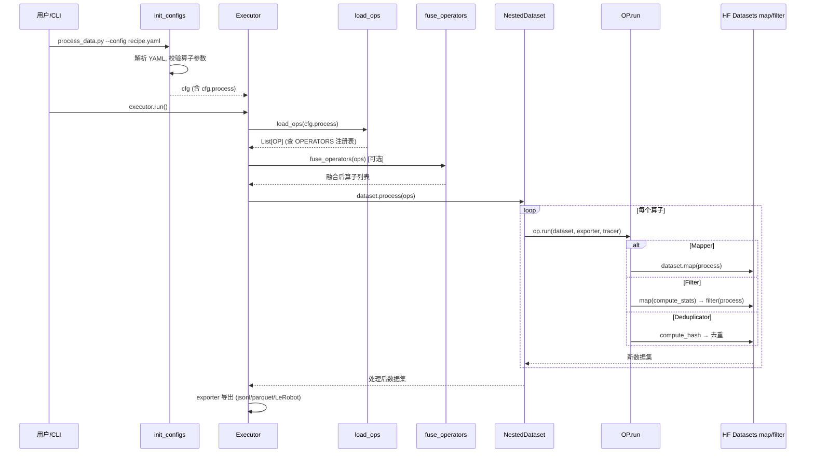

### 10.2 分层组件图

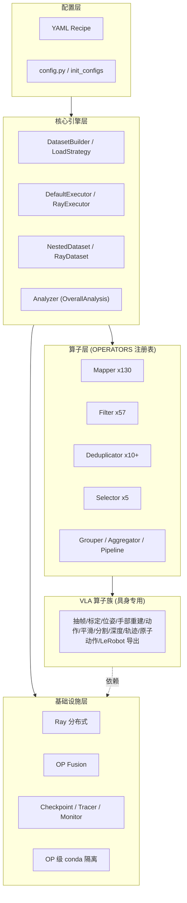

### 10.3 实现等级分布（按 Qwen 方法计数）

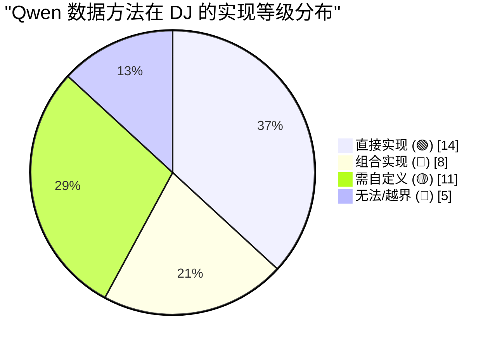

---

## 第 11 章 缺口与补足方案

集中列出 DJ 相对 Qwen 的缺口，并给出基于 DJ 扩展点（`python_file_mapper` / `python_lambda_mapper` / 继承 `Mapper`·`Filter` / 自定义 `LoadStrategy` / `general_fused_op`）的补足方案与工作量评估。

> DJ 提供两个「零成本接入自定义逻辑」的扩展算子：`python_file_mapper`（指向一个 Python 文件中的函数）与 `python_lambda_mapper`（内联 lambda）。它们让用户**无需改 DJ 源码**即可把论文专有逻辑塞进 Recipe。

### 11.1 缺口清单与补足

| # | 缺口 | 类型 | 补足方案 | 工作量 |
|---|---|---|---|---|
| 1 | RLDS/TFDS、HDF5、LeRobot 原生**输入**加载 | 🟡 | 自定义 `DataLoadStrategy`（`@DataLoadStrategyRegistry.register`）或先离线转 parquet/jsonl | 低 |
| 2 | 80 维统一状态-动作向量化 | 🟡 | 自定义 `Mapper`（体态→槽位映射），写 `Fields.meta` | 中 |
| 3 | 相机坐标系可分离 delta 位姿 | 🟡 | 复用 `video_hand_action_compute` 旋转工具，改为相机-EEF 外参共轭 | 中 |
| 4 | 三源二值掩码（slot/step/per-hand） | 🟡 | 自定义 `Mapper` 生成 mask 字段；`general_field_filter` 消费 | 中 |
| 5 | SAM3 擦人 + ProPainter 视频时序修复 | 🟡 | 自定义 `Mapper` 封装 SAM3/ProPainter（OP 级 conda 隔离） | 中高 |
| 6 | IK 求解机器人底座放置 | 🔴 | 自定义 `Mapper` 封装 Pinocchio/cuRobo IK | 高 |
| 7 | MuJoCo 渲染机器人贴回视频 | 🔴 | 自定义 `Mapper` 封装 MuJoCo 渲染 + 深度合成 | 高 |
| 8 | 深度引导遮挡合成 | 🟡 | 已有深度，自定义融合 `Mapper`（前后景 alpha） | 中 |
| 9 | 突变检测多阶信号（加速度/jerk 整段丢弃） | 🟡 | 自定义 `Filter`：`compute_stats` 算多阶偏差，`get_keep_boolean` 判定 | 低 |
| 10 | 状态-动作趋势 DA 过滤 | 🟡 | 自定义 `Filter` 算 DA + `general_field_filter` | 低 |
| 11 | 关节-EEF FK 一致性 | 🔴 | 自定义 `Filter` 封装 Pinocchio FK + URDF | 高 |
| 12 | 基坐标系/EEF 方向对齐 | 🟡 | 自定义 `Mapper`（scipy 旋转校正） | 低 |
| 13 | 视频-状态 URDF 投影一致性 | 🔴 | 自定义 `Filter`：URDF 投影渲染 + 与 SAM 掩码比对 | 高 |
| 14 | 黑帧/模糊检测 | 🟡 | 自定义 `Filter`（亮度均值 / 拉普拉斯方差） | 低 |
| 15 | 多专家投票聚合（跨模态校验） | 🟡 | 自定义 `Aggregator`（多次 VLM 调用 + 投票） | 中 |
| 16 | Embodiment Prompt + 15% dropout | 🟡 | 自定义 `Mapper`（文本拼接 + 随机丢弃） | 低 |
| 17 | 原子动作 → 17 语义类别映射 | 🟡 | 自定义分类（动作特征规则 / LLM 分类） | 中 |
| 18 | 离线 color jitter 增强 | 🟡 | 自定义 `Mapper` 调 `torchvision` | 低 |
| 19 | 掩码加权 FM 损失 / $K_{\text{repeat}}$ | 🔴 | **训练框架职责，非 DJ 范畴**（不补足） | — |

### 11.2 补足后的能力预期

除「掩码加权损失 / $K_{\text{repeat}}$」（训练侧，本就不属数据工具）外，**其余缺口均可在 DJ 框架内通过自定义算子补足**，不需要修改 DJ 核心。其中 4 项高工作量缺口（IK、MuJoCo 渲染、FK 一致性、URDF 投影）都依赖**机器人物理引擎/运动学库**，这类「物理仿真」能力超出任何通用数据处理框架的内置范围，但 DJ 的 OP 级环境隔离让它们**能被干净地集成进同一条 pipeline**——这是 DJ 相比其他数据框架的独特优势。

---

## 第 12 章 能力评分

### 12.1 评分方法

按 8 个能力维度分别打分（0–100）并加权。打分依据：① 是否有开箱即用算子（🟢）；② 组合现有算子的难易（🔵）；③ 自定义成本（🟡）；④ 是否框架外（🔴）。

### 12.2 分维度评分

| 维度 | 权重 | 得分 | 核心理由 |
|---|---:|---:|---|
| 数据基础设施 | 15% | 95 | Ray 规模化、OP 融合、13 去重算子、tracing/checkpoint/monitor、OP 级 conda 隔离——DJ 招牌能力，几乎完美匹配 PB 级具身数据 |
| 数据源加载 | 10% | 70 | jsonl/parquet/HF/ModelScope/S3 原生；RLDS/HDF5/LeRobot 原生输入需自定义 LoadStrategy |
| 统一表示（80 维/相机系 delta/掩码） | 15% | 55 | 框架可承载 + 有旋转变换模板，但无专用向量化算子，落地需相当自定义 |
| H2R 合成管道 | 25% | 78 | 动作对齐≈90% 逐算子命中、速度对齐≈80%；视觉对齐≈45%（缺 IK/MuJoCo 渲染合成） |
| 五阶段过滤 + 跨模态校验 | 15% | 62 | 极值过滤完美桥接、突变/趋势/质量可组合；FK 一致性、URDF 投影是真实缺口 |
| 标注工程 | 10% | 75 | ECoT/caption/2D 轨迹/VL 数据生成质检几乎全覆盖；dropout/17 类映射/投票需少量自定义 |
| 训练/后训练数据准备 | 10% | 65 | 混合/采样/邻近度选样/禁用过滤可实现；掩码加权损失与 $K_{\text{repeat}}$ 属训练侧 |

### 12.3 加权总分

$$
\begin{aligned}
S &= 0.15\times95 + 0.10\times70 + 0.15\times55 + 0.25\times78 \\
  &\quad + 0.15\times62 + 0.10\times75 + 0.10\times65 \\
  &= 14.25 + 7.0 + 8.25 + 19.5 + 9.3 + 7.5 + 6.5 \\
  &= \boxed{72.3}
\end{aligned}
$$

### 🏆 最终评分：**72 / 100**

### 12.4 结论与定性判断

- **DJ 能实现 Qwen-RobotManip 约 7 成数据方法**，且**覆盖了最核心、最具创新性、规模最大的 H2R 合成管道与全部数据基础设施**——这不是巧合：DJ 在 v1.5.x 专门为这类「自中心视频 → 机器人动作」需求构建了 VLA 算子族，其算子注释甚至直接引用同源具身数据论文（arXiv:2510.21571）。
- **剩余 3 成缺口分两类**：① 真正的「物理仿真/运动学」能力（IK 底座、MuJoCo 渲染、Pinocchio FK、URDF 投影）——超出任何通用数据框架的内置范围，但可经 DJ 的 OP 级环境隔离干净集成；② 论文专有的「数学/表示细节」（80 维向量化、相机系可分离 delta、三源掩码、DA、投票）——DJ 框架完全可承载，仅需写自定义算子，**无需改 DJ 源码**。
- **训练侧机制**（掩码加权损失、$K_{\text{repeat}}$）本就不属数据处理工具职责，已在评分中按边界处理而非缺陷扣分。

### 12.5 若要提升 DJ 对该论文的覆盖（建议）

1. 新增 `robot_unified_vector_mapper`（80 维向量化 + 相机系 delta + 三源掩码），把 Qwen 表示对齐内置化（可将统一表示维度从 55 → 85）。
2. 新增 `robot_fk_consistency_filter`（封装 Pinocchio + URDF）与 `robot_state_action_trend_filter`（DA），补齐过滤维度（62 → 80）。
3. 新增 RLDS/HDF5/LeRobot 的 `DataLoadStrategy`，补齐数据源（70 → 90）。
4. 集成 SAM3 + ProPainter 的视频时序修复 `Mapper`，提升视觉对齐质量。
5. IK/MuJoCo 渲染合成因依赖物理引擎，建议以「OP 级 conda 隔离 + 自定义 Mapper 封装」方式提供官方示例，而非内置。

> **总评**：Data-Juicer 不是一个「恰好能改造来做机器人数据」的通用工具，而是**已经主动面向具身智能/VLA 数据构建了专用能力**的框架。对 Qwen-RobotManip 这类纯开源、可复现的数据路线，DJ 是当前最契合的工程底座之一；其 72 分的「未满分」主要源于物理仿真渲染这类**本不属于数据框架**的能力，以及论文若干专有表示细节需自定义落地——而后者 DJ 已通过清晰的算子扩展机制把成本降到很低。
