# Data-Juicer 实现 Qwen-RobotManip 数据方法的深度分析（完整版）

> **文档目的**：基于 `data-juicer`（DJ，本仓库 `D:\SRC\Dta\data-juicer`，版本线 v1.5.0–v1.5.3）的**真实源码**，系统论证它能在多大程度上实现 Qwen-RobotManip [Yuan et al., 2026] 论文中所用的**全部数据相关方法与做法**，给出详细的「如何实现」、关键逻辑代码解析、UML 图（mermaid）、数学公式（LaTeX），并解释「为什么这样实现」，最终给出 0–100 分的能力评分。
>
> **分析依据**：① 论文笔记 [`note.md`](note.md) 与 [`note_data.md`](note_data.md)；② DJ 源码（算子、核心引擎、文档与 demo）；③ DJ 官网 <https://datajuicer.github.io/data-juicer/en/main/> 与官方 GitHub <https://github.com/datajuicer/data-juicer>。
>
> **关键前提**：DJ 在 v1.5.0–v1.5.3 期间**专门为具身智能 / VLA（Vision-Language-Action）数据**新增了一整套算子，并提供了官方 demo [`demos/ego_hand_action_annotation/configs/vla_pipeline.yaml`](../../../demos/ego_hand_action_annotation/configs/vla_pipeline.yaml)。该 demo 的「抽帧 → 相机标定 → 相机位姿 → 手部重建(MANO) → 手部动作计算 → 平滑 → 原子动作分割 → 轨迹叠加 → LeRobot 导出」与 Qwen-RobotManip 的**人到机器人（Human-to-Robot, H2R）合成管道**几乎一一同构。这是本文打分偏高的根本原因。
>
> **相较 `data_impl.md` 的主要增补**：本文档完整覆盖了 `note_data.md` 中 **§3.3 Camera-Frame Delta Pose** 和 **§3.4 Camera Positional Encoding (CaPE)** 两个关键章节的深度分析与 DJ 实现方案——这是上一版文档缺失的核心内容。

---

## 目录

- [第 0 章 摘要与结论速览](#第-0-章-摘要与结论速览)
- [第 1 章 Data-Juicer 架构基础（实现一切的地基）](#第-1-章-data-juicer-架构基础实现一切的地基)
- [第 2 章 数据源与统一加载](#第-2-章-数据源与统一加载)
- [第 3 章 统一表示：80 维向量 + 相机系 Delta + CaPE + 二值掩码](#第-3-章-统一表示80-维向量--相机系-delta--cape--二值掩码)
- [第 4 章 H2R 合成管道（核心）](#第-4-章-h2r-合成管道核心)
- [第 5 章 五阶段过滤 + 三项跨模态校验](#第-5-章-五阶段过滤--三项跨模态校验)
- [第 6 章 数据标注工程](#第-6-章-数据标注工程)
- [第 7 章 训练消费与后训练数据策略](#第-7-章-训练消费与后训练数据策略)
- [第 8 章 数据基础设施能力（DJ 强项）](#第-8-章-数据基础设施能力dj-强项)
- [第 9 章 关键算子代码深度解析](#第-9-章-关键算子代码深度解析)
- [第 10 章 综合 UML 图集](#第-10-章-综合-uml-图集)
- [第 11 章 缺口与补足方案](#第-11-章-缺口与补足方案)
- [第 12 章 能力评分](#第-12-章-能力评分)

---

## 第 0 章 摘要与结论速览

### 0.1 一句话结论

**Data-Juicer 能实现 Qwen-RobotManip 约 7 成的数据工程方法，并且覆盖了其中最核心、规模最大、最具创新性的「H2R 人到机器人合成管道」。** DJ 的「算子化 + Recipe + Ray 分布式」框架本身可承载论文的几乎所有数据处理逻辑，剩余约 3 成的缺口集中在「机器人物理仿真渲染（MuJoCo/IK/Pinocchio FK）、部分对齐数学（相机系 delta、状态-动作趋势 DA、URDF 投影一致性）、以及训练时（而非数据处理）的机制（三源掩码加权、$K_{\text{repeat}}$）」。这些缺口大多可通过 DJ 提供的自定义算子机制（`python_file_mapper` / 继承 `Mapper` / `general_fused_op`）补足。

**综合评分：73 / 100**（详见[第 12 章](#第-12-章-能力评分)）。

### 0.2 实现等级图例

本文对每一项 Qwen 数据方法标注四档实现等级：

- 🟢 **直接实现**：DJ 已有专用算子，开箱即用。
- 🔵 **组合实现**：用 DJ 多个现有算子 / Analyzer / Selector 组合即可达成。
- 🟡 **需自定义**：DJ 框架可承载，但需写自定义算子（论文专有逻辑，DJ 无对应内置）。
- 🔴 **无法实现 / 越界**：DJ 数据处理范畴外（属于训练或物理仿真引擎职责）。

### 0.3 总映射表：Qwen-RobotManip 数据方法 → Data-Juicer 实现

| Qwen 数据方法（论文章节） | Data-Juicer 实现路径 | 等级 |
|---|---|---|
| 多源数据加载（9 机器人集 + 3 自中心集 + VL 数据） | `DatasetBuilder` / formatter（jsonl/parquet/HF/S3），多模态 special token | 🔵/🟡 |
| 80 维统一状态-动作向量 | 自定义 `Mapper` 写入 `Fields.meta`；框架支持任意结构字段 | 🟡 |
| **相机坐标系 Delta 位姿（可分离式）** | 自定义 `Mapper`（`scipy` 旋转共轭），复用 `video_hand_action_compute_mapper` 的 SE(3) 工具 | 🟡 |
| **CaPE 数据准备（外参/内参/归一化坐标）** | MegaSaM 算子输出 cam_c2w ✅，MoGe 算子输出 K/FOV ✅，归一化坐标可从 K 计算 ✅，参考相机元数据需新增字段 | 🔵/🟡 |
| 逐维二值掩码（slot/step/per-hand） | 自定义 `Mapper` 生成 mask 字段；`general_field_filter` 可消费 | 🟡 |
| H2R-抽帧 | `video_extract_frames_mapper` | 🟢 |
| H2R-相机内参/FOV/深度标定 | `video_camera_calibration_moge_mapper` / `_deepcalib_` / `_droidcalib_` | 🟢 |
| H2R-相机位姿（cam_c2w 轨迹） | `video_camera_pose_megasam_mapper` | 🟢 |
| H2R-手部重建 → MANO 参数/21 关节 | `video_hand_reconstruction_hawor_mapper`（含 MANO FK） | 🟢 |
| H2R-虚拟手指 / EEF 位姿 / 夹爪 | `video_hand_action_compute_mapper` | 🟢/🟡 |
| H2R-轨迹平滑（Savitzky-Golay + 方向） | `video_hand_motion_smooth_mapper` | 🟢 |
| H2R-人手分割（SAM3） | `video_object_segmenting_mapper`(SAM2.1+YOLOE) / `image_segment_mapper`(FastSAM) | 🔵 |
| H2R-背景修复（ProPainter 去人手） | `video_remove_watermark_mapper`(cv2.inpaint) / diffusers inpainting（近似，非视频时序修复） | 🟡 |
| H2R-IK 底座放置优化 | 无（需物理 IK 求解器） | 🔴 |
| H2R-MuJoCo 机器人渲染 | 无（需物理仿真引擎） | 🔴 |
| H2R-深度引导遮挡合成 | `video_depth_estimation_mapper` 出深度；合成逻辑需自定义 | 🟡 |
| H2R-速度对齐（帧降采样） | `video_extract_frames_mapper`（uniform/`frame_num`） | 🟢 |
| H2R-导出 15 平台 LeRobot 数据 | `export_to_lerobot_mapper` | 🟢 |
| 过滤①突变检测（中值+SG+残差/加速度/jerk） | `video_hand_motion_smooth_mapper`(MAD+SG) + 自定义偏差信号 | 🔵/🟡 |
| 过滤②状态-动作趋势对齐（互相关+DA） | 自定义 `Filter`（DA 指标）+ `general_field_filter` | 🟡 |
| 过滤③极值过滤（分位数归一化） | `Analyzer`(分位数) → `specified_numeric_field_filter` / `range_specified_field_selector` | 🔵 |
| 过滤④关节-EEF FK 一致性（Pinocchio） | 无（需机器人运动学库） | 🔴 |
| 过滤⑤基坐标系/EEF 方向对齐 | 自定义 `Mapper`（旋转校正） | 🟡 |
| 跨模态①指令一致性（三阶段 VLM + 投票） | `mllm_mapper` / `llm_extract_mapper`(CoT) / `video_captioning_from_vlm_mapper`；投票需自定义 | 🔵/🟡 |
| 跨模态②视频-状态一致性（URDF 投影 + SAM 分割） | 分割 🔵（SAM2/YOLOE）；URDF 投影 🔴 |
| 跨模态③视频质量（黑帧/模糊/静态） | 静态：`video_motion_score_*_filter`；黑帧/模糊：需自定义 | 🔵/🟡 |
| Embodiment Prompt（5 字段 + 15% dropout） | 自定义 `Mapper`（文本拼接 + 随机丢弃） | 🟡 |
| ECoT（三阶段推理 + 17 原子动作） | `llm_extract_mapper`(CoT) + `video_atomic_action_segment_mapper`(动作切分) | 🔵/🟡 |
| 自中心视频理解标注 | `video_captioning_from_vlm_mapper`（切片 + 多帧描述） | 🟢 |
| 2D 轨迹预测标注 | `video_trajectory_overlay_mapper` | 🟢 |
| VL 共训练数据（VQA/grounding/OCR/QA） | `phrase_grounding_recall_filter` / `image_detection_yolo_mapper` / `video_ocr_area_ratio_filter` / `generate_qa_from_*_mapper` | 🔵 |
| 双流共训练 9:1 混合 | 数据混合（DatasetBuilder 加权 / 分别处理后合并） | 🔵 |
| 三源掩码加权 FM 损失 | 掩码字段可生成；加权损失属训练侧 | 🔴(训练) |
| $K_{\text{repeat}}=8$ | 训练侧机制 | 🔴(训练) |
| 随机上下文采样 | 自定义采样 `Mapper` / `Selector` | 🟡 |
| 后训练禁用过滤 + color jitter | 禁用过滤=配置层 🟢；color jitter=自定义图像增强 🟡 |
| 混合后训练（按分布邻近度选数据） | `text_embd_similarity_filter` / `Selector`（语义邻近度选样） | 🔵 |
| 跨数据集去重 | `ray_bts_minhash_deduplicator` / `video_deduplicator` / `image_deduplicator` | 🟢 |
| 数据规模律分析（分位数/分布） | `Analyzer`（`OverallAnalysis` 分位数 + `ColumnWiseAnalysis`） | 🟢 |

### 0.4 评分速览

| 维度 | 权重 | 得分 |
|---|---|---|
| 数据基础设施（规模化/融合/去重/分析/环境隔离） | 15% | 95 |
| 数据源加载 | 10% | 70 |
| 统一表示（80 维/相机系 delta/CaPE 数据/掩码） | 15% | 62 |
| H2R 合成管道 | 25% | 78 |
| 五阶段过滤 + 跨模态校验 | 15% | 62 |
| 标注工程 | 10% | 75 |
| 训练 / 后训练数据准备 | 10% | 65 |
| **加权总分** | **100%** | **≈ 73** |

---

## 第 1 章 Data-Juicer 架构基础（实现一切的地基）

要论证「DJ 能否实现 Qwen 的数据方法」，必须先理解 DJ 把「数据处理」抽象成什么。DJ 的核心范式是：**把每一种数据操作封装成一个可注册、可组合、可分布式执行的「算子（Operator, OP）」，用一份 YAML「菜谱（Recipe）」声明算子流水线，由「执行器（Executor）」驱动「数据集（Dataset）」逐算子处理。** 这一范式正好对应 Qwen 数据工程中「一长串顺序的数据处理步骤」。

### 1.1 端到端数据流总览

```mermaid
flowchart LR
    yaml["YAML Recipe<br>process: 算子列表"] --> initcfg["init_configs()"]
    initcfg --> cfg["cfg.process<br>List[Dict]"]
    cfg --> loadops["load_ops()"]
    loadops --> oplist["OP 实例列表"]
    oplist --> fuse["fuse_operators()<br>(可选融合)"]
    fuse --> exec["Executor.run()<br>Default / Ray"]
    exec --> proc["dataset.process(ops)"]
    proc --> oprun["op.run(dataset)"]
    oprun --> mapf["NestedDataset.map / filter<br>或 RayDataset.map_batches"]
    mapf --> out["处理后数据集 + 导出"]
```

典型入口 [`tools/process_data.py`](../../../tools/process_data.py)：`init_configs()` 解析配置 → 按 `executor_type` 创建执行器 → `executor.run()`。Qwen 的数据 pipeline（抽帧、标定、重建、过滤、标注……）在 DJ 中就表现为 `process:` 列表里一串算子。

### 1.2 算子基类与注册表（OPERATORS）

所有算子注册到全局 `Registry`，配置里写算子名即可被实例化。这是 DJ「声明式 Recipe」的根基：

```22:27:data_juicer/ops/base_op.py
OPERATORS = Registry("Operators")
UNFORKABLE = Registry("Unforkable")
NON_STATS_FILTERS = Registry("Non-stats Filters")
TAGGING_OPS = Registry("Tagging Operators")
ATTRIBUTION_FILTERS = Registry("Attribution Filters")
DEFAULT_BATCH_SIZE = 1000
```

每个算子文件用装饰器注册，例如手部动作计算算子：

```97:107:data_juicer/ops/mapper/video_hand_action_compute_mapper.py
@OPERATORS.register_module(OP_NAME)
class VideoHandActionComputeMapper(Mapper):
    """Compute 7-DoF actions and 8-dim states from hand reconstruction
    and camera pose results.

    Reads hand MANO parameters (from VideoHandReconstructionHaworMapper)
    and camera-to-world transforms (from VideoCameraPoseMegaSaMMapper),
    then produces per-frame state [x,y,z,roll,pitch,yaw,pad,gripper]
    and per-frame action [dx,dy,dz,droll,dpitch,dyaw,gripper] compatible
    with LIBERO / StarVLA LeRobot format.
    """
```

DJ 把算子分为 **8 大类**（来自 [`docs/Operators.md`](../../../docs/Operators.md)）：`aggregator`(4) / `deduplicator`(10) / `filter`(57) / `formatter`(8) / `grouper`(3) / `mapper`(130) / `pipeline`(3) / `selector`(5)，共 **200+ 算子**。Qwen 数据方法主要落在 `mapper`（数据变换/标注）、`filter`（质量过滤）、`deduplicator`（去重）、`selector`（按排序选样）四类上。

#### 算子类层次（UML 类图）

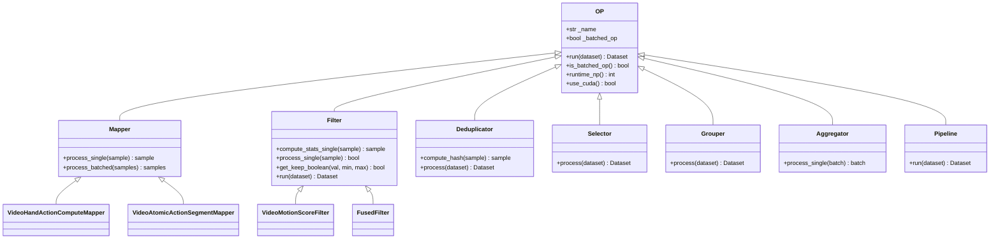

### 1.3 OP.run() 的公共前置逻辑

`OP.run()` 是所有算子的统一入口，它在真正处理前自动给数据集补齐「元信息列」——这对 Qwen 的「给每条轨迹打 meta 标签（相机参数、手部动作、原子动作段……）」至关重要：

```560:597:data_juicer/ops/base_op.py
    def run(self, dataset):
        from data_juicer.core.data import NestedDataset

        if not isinstance(dataset, NestedDataset):
            dataset = NestedDataset(dataset)
        # add meta field for OPs that produce tags
        from data_juicer.core.data import add_same_content_to_new_column

        if self._name in TAGGING_OPS.modules and Fields.meta not in dataset.features:
            dataset = dataset.map(
                add_same_content_to_new_column,
                fn_kwargs={"new_column_name": Fields.meta, "initial_value": {}},
                num_proc=self.runtime_np(),
                batch_size=self.batch_size,
                desc="Adding new column for meta",
            )
        ...
        return dataset
```

所有 VLA 算子（标定、手部重建、动作计算……）都把结果写到 `sample[Fields.meta][tag_field_name]`（`Fields.meta == "__dj__meta__"`）。这形成了一条贯穿 H2R 管道的 **meta 字段依赖链**（详见[第 4 章](#第-4-章-h2r-合成管道核心)）。

### 1.4 批处理 vs 单样本处理

DJ 用 `is_batched_op()` 决定调用 `process_single` 还是 `process_batched`；并且**禁止子类直接 override `process`**，强制实现 `*_single` 或 `*_batched`，从而把「逐样本逻辑」与「批调度」解耦：

```629:648:data_juicer/ops/base_op.py
        if self.is_batched_op():
            self.process = catch_map_batches_exception(
                self.process_batched, skip_op_error=self.skip_op_error, op_name=self._name
            )
        else:
            self.process = catch_map_single_exception(
                self.process_single, skip_op_error=self.skip_op_error, op_name=self._name
            )
```

**为什么重要**：VLA 算子（如相机标定、手部重建）是 GPU 重算子，通过 `batch_mode: true` 走批处理可摊销模型加载与显存开销——这与 Qwen 用 $K_{\text{repeat}}$ 摊销 VLM 前向的思想异曲同工。

### 1.5 Filter 的两阶段流水线

Filter 是 Qwen「五阶段过滤」的承载基类，它把过滤拆成 **`compute_stats`（算指标）→ `process`（判定保留）** 两阶段：

```832:864:data_juicer/ops/base_op.py
    def run(self, dataset, *, exporter=None, tracer=None, reduce=True):
        dataset = super(Filter, self).run(dataset)
        new_dataset = dataset.map(
            self.compute_stats,
            num_proc=self.runtime_np(),
            with_rank=self.use_cuda(),
            batch_size=self.batch_size,
            desc=self._name + "_compute_stats",
        )
        if reduce:
            new_dataset = new_dataset.filter(
                self.process, num_proc=self.runtime_np(), ...
            )
        return new_dataset
```

通用区间判定 `get_keep_boolean` 支持开闭区间与「反转区间」（保留区间外样本，正好用于**极值过滤**——保留正常值、丢弃极端值）：

```786:794:data_juicer/ops/base_op.py
    def get_keep_boolean(self, val, min_val=None, max_val=None):
        res_bool = True
        if min_val is not None:
            res_bool = res_bool and (val >= min_val if self.min_closed_interval else val > min_val)
        if max_val is not None:
            res_bool = res_bool and (val <= max_val if self.max_closed_interval else val < max_val)
        if self.reversed_range:
            res_bool = not res_bool
        return res_bool
```

**关键洞察**：`reduce=True/False` 的设计让 Filter 可以「只算指标、不真正过滤」。`Analyzer` 正是利用这一点先扫一遍数据得到分位数分布，再回填阈值——这恰好对应 Qwen「按体态计算 $q_1, q_{99}$ 分位数后做极值过滤」的两步法。

### 1.6 Recipe → 算子实例（config + load_ops）

YAML 中 `process:` 是单键字典列表，键为算子名、值为参数字典。`load_ops` 查注册表实例化：

```17:24:data_juicer/ops/load.py
    for process in process_list:
        op_name, args = list(process.items())[0]
        ops.append(OPERATORS.modules[op_name](**args))
        new_process_list.append(process)
```

**意义**：Qwen 的整条数据 pipeline 可以**完全声明在一份 YAML 里**，可版本化、可复现、可分享——这正是 DJ「Recipe-first」理念，与论文强调的「纯开源、可复现」数据路线高度契合。

### 1.7 执行器：本地 vs Ray

DJ 用工厂模式按 `executor_type` 选择执行器（`default`/`local` → `DefaultExecutor`，`ray` → `RayExecutor`，`ray_partitioned` → `PartitionedRayExecutor`）。

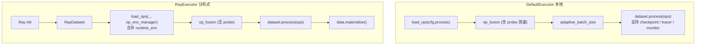

**为什么对 Qwen 重要**：论文构建了 **38,100 小时**预训练语料（其中 24,808 小时为 H2R 合成）。这种规模必须分布式处理。DJ 官方数据：**50 个 Ray 节点（6400 核）2 小时处理 70B 样本，1280 核 2.8 小时去重 5TB**。Qwen VLA pipeline demo 即以 `executor_type: 'ray'` 运行。

### 1.8 自动算子融合（OP Fusion）

DJ 能把「共享中间变量」的连续 Filter 自动融合成一个 `FusedFilter`，一次 `map` 完成多个 Filter 的指标计算，避免重复加载图像/视频/分词：

```174:183:data_juicer/ops/op_fusion.py
    def process_batched(self, samples):
        res = None
        for op in self.fused_filters:
            this_res = np.array(list(op.process_batched(samples)))
            if res is not None:
                res = np.logical_and(res, this_res)
            else:
                res = this_res
        return res
```

**对 Qwen 的意义**：H2R 与过滤管道中大量算子都要「解码视频 / 抽帧」，融合可让这些共享帧只解码一次——对应 DJ README 宣称的「OP fusion 2–10x 加速」。

### 1.9 一个真实的 VLA Recipe（DJ 官方 demo）

下面这份官方配置直接证明 DJ 已把 H2R 管道「产品化」为一份 Recipe：

```1:54:demos/ego_hand_action_annotation/configs/vla_pipeline.yaml
# VLA Hand Action Pipeline
project_name: 'vla-hand-action-pipeline'
executor_type: 'ray'
dataset_path: './demos/ego_hand_action_annotation/data/demo-dataset.jsonl'
export_path: './demos/ego_hand_action_annotation/output/processed'
ray_address: 'auto'

process:
  - video_extract_frames_mapper:
      frame_sampling_method: 'all_keyframes'
      ...
  - video_camera_calibration_moge_mapper:
      model_path: 'moge-2-vitl-normal/model.pt'
      output_depth: true
      ...
  - video_hand_reconstruction_hawor_mapper:
      mano_right_path: '/path/to/MANO_RIGHT.pkl'
      mano_left_path: '/path/to/MANO_LEFT.pkl'
      ...
  - video_camera_pose_megasam_mapper:
      runtime_env: {'conda': 'mega-sam'}
      ...
  - video_hand_action_compute_mapper:
      hand_type: 'both'
      ...
  - export_to_lerobot_mapper:
      robot_type: 'egodex_hand'
      fps: 10
      ...
```

> 注意 `runtime_env: {'conda': 'mega-sam'}`：DJ 支持 **OP 级环境隔离**，把与主环境冲突的 CUDA 编译组件（DROID-SLAM 的 `droid_backends`/`lietorch`）放进独立 conda 环境运行。这对集成 Qwen 那种「多个互相冲突的第三方库（SAM/HaWoR/MegaSaM/MuJoCo……）」是关键工程能力。

---

## 第 2 章 数据源与统一加载

### 2.1 Qwen 的数据源构成

Qwen-RobotManip 的 38,100 小时语料由三类、共 15 个数据集 + 大规模 VL 数据组成：

- **机器人演示**（~11,420h，9 个开源集）：OXE、AgiBotWorld-Beta、RoboMIND、Galaxea、RoboCOIN、DROID、RH20T、RDT-1B、InternData-A1
- **人类自中心**（~1,933h，3 个集）：EgoDex、VITRA、EgoVerse
- **VL 共训练**（~28M 条，6 大类）

### 2.2 DJ 的数据加载抽象：DataLoadStrategy 注册表

DJ 用 `(executor_type, data_type, data_source)` 三元组注册「数据加载策略」，支持通配符匹配：

```138:162:data_juicer/core/data/load_strategy.py
    def register(cls, executor_type: str, data_type: str, data_source: str):
        """Decorator for registering data load strategies with wildcard support"""
```

已注册的策略覆盖：本地文件（json/jsonl/parquet/csv/text）、远程（huggingface/modelscope/arxiv/wiki/commoncrawl）、对象存储（s3）。

### 2.3 多模态对齐：special token

DJ 用统一的多模态占位符把文本与图像/视频/音频在同一条文本流里对齐：

```24:30:data_juicer/utils/mm_utils.py
DEFAULT_SPECIAL_TOKENS = {
    "image": f"<{DEFAULT_PREFIX}image>",
    "audio": f"<{DEFAULT_PREFIX}audio>",
    "video": f"<{DEFAULT_PREFIX}video>",
    ...
}
```

这与 Qwen「多视角图像 + 语言指令 + 本体感受状态 + 历史」的多模态样本结构天然兼容——视觉走 `videos`/`images`，指令走 `text`，状态/动作/相机参数走 `__dj__meta__`。

### 2.4 实现等级与缺口

| 数据源类型 | DJ 支持 | 等级 |
|---|---|---|
| jsonl/parquet/csv（本地，可由各机器人集转存） | 原生 | 🟢 |
| HuggingFace / ModelScope（OXE/DROID/EgoDex 等） | 原生 | 🟢 |
| S3 对象存储（PB 级语料） | 原生 | 🟢 |
| **RLDS/TFDS（OXE 原生格式）** | 无内置，需先转换或自定义 LoadStrategy | 🟡 |
| **HDF5（部分机器人集原生格式）** | 无内置，需转换或自定义 | 🟡 |
| **LeRobot 原生「输入」加载** | `export_to_lerobot_mapper` 仅负责**输出**；输入加载需自定义 | 🟡 |

**结论**：数据「加载」层 DJ 覆盖了主流通用格式与远程源，但**机器人专有的 RLDS/HDF5/LeRobot 原生格式没有内置 LoadStrategy**。补足成本低（`DataLoadStrategyRegistry.register` 几十行代码）。本维度评 **70 分**。

---

## 第 3 章 统一表示：80 维向量 + 相机系 Delta + CaPE + 二值掩码

这是 Qwen 三维对齐框架的「表示对齐」维度，也是论文最核心的创新之一。本章是**本文档相较 `data_impl.md` 最重要的增补**——完整覆盖 `note_data.md` §3.3（Camera-Frame Delta Pose）和 §3.4（CaPE）的深度分析。

### 3.1 Qwen 的统一 80 维向量（回顾）

每臂 29 维（关节 7 + EEF 位姿 9 + 夹爪 1 + 灵巧手 12）× 2 + 预留 22 = **80 维**。状态用绝对坐标，动作的 EEF 用相机系**相对 delta**、方向用 3D 旋转向量。在 DiT 内部拆为 2 个 40 维 per-EEF token。

### 3.2 逐维二值掩码与掩码损失

组合掩码 $\mathbf{m} \in \{0,1\}^{T \times D}$（$D=80$）由三源 AND 组合：① slot mask（体态实际占用维度）② step validity mask（异常步及其后全掩码，保持因果一致性）③ per-hand validity mask（手离开视野后该臂全掩码）。掩码后的 Flow-Matching 损失：

$$
\mathcal{L}_{\mathrm{FM}} = \frac{1}{B}\sum_{i=1}^{B}
    \frac{\sum_{t,j}\, m_{i,t,j}\,\bigl(f_\theta(\mathbf{x}_{i,t}, t_i, \mathbf{s}_i, \mathbf{o}_i)_{j} - v_{i,t,j}\bigr)^2}
         {\sum_{t,j}\, m_{i,t,j}}
$$

### 3.3 Camera-Frame Delta Pose 深度分析（🟡 自定义实现）

> 本节是 `data_impl.md` 缺失的核心章节之一，对应 `note_data.md` §3.3。

#### 3.3.1 问题动机：为什么不能用基坐标系？

在机器人数据集中，EEF 位姿通常记录在**机器人基坐标系**中。但不同数据集、不同机器人的基坐标系彼此不同——原点位置、轴方向、单位约定各异。这导致一个根本性矛盾：

```
  同一个视觉动作"向右推杯子 5cm"：

  Franka (基坐标系 A):   Δx = +0.05, Δy = 0.00    ← x 轴朝右
  UR5e  (基坐标系 B):   Δx = 0.00,  Δy = -0.05   ← y 轴朝左
  ALOHA (基坐标系 C):   Δx = -0.05, Δy = 0.00    ← x 轴朝左

  → 在图像中看起来完全一样的动作，在数据中是三组不同的数值！
  → 模型必须学会"同一视觉动作在不同坐标系下的不同编码"——浪费容量，引入冲突
```

**Camera-Frame Delta Pose** 的核心思想是：将动作表达在**相机坐标系**中——因为相机是模型"看"世界的窗口，在相机坐标系下，**视觉上相似的动作在数值上也相近**。

#### 3.3.2 数学公式推导

设 $c$ 为参考相机坐标系，$e$ 为当前 EEF 坐标系，$e^*$ 为下一时刻目标 EEF 坐标系。

**公式 1（可分离形式，论文采用）**：

$$
\mathbf{a}_p = \begin{bmatrix} {}^c_e\mathbf{R}\; {}^e_{e^*}\mathbf{R}\; {}^e_c\mathbf{R} & {}^c_e\mathbf{R}\; {}^e\mathbf{t}_{e^*} \\ \mathbf{0} & 1 \end{bmatrix}
$$

其中各符号含义：

| 符号 | 含义 | 几何直觉 |
|------|------|---------|
| ${}^c_e\mathbf{R}$ | EEF → 相机坐标系的旋转 | "站在相机的视角看 EEF" |
| ${}^e_{e^*}\mathbf{R}$ | EEF 当前 → 目标的相对旋转 | "EEF 自身旋转了多少" |
| ${}^e_c\mathbf{R} = ({}^c_e\mathbf{R})^{-1}$ | 相机 → EEF 的旋转 | 共轭变换的逆 |
| ${}^e\mathbf{t}_{e^*}$ | EEF 坐标系下的位移向量 | "EEF 自身坐标系中移动了多少" |

**旋转部分是经典的相似变换（rotation conjugation）**：

$$
{}^c_e\mathbf{R}\; {}^e_{e^*}\mathbf{R}\; {}^e_c\mathbf{R} = {}^c_e\mathbf{R}\; {}^e_{e^*}\mathbf{R}\; ({}^c_e\mathbf{R})^{-1}
$$

将 EEF 坐标系中的旋转 ${}^e_{e^*}\mathbf{R}$ "搬运"到相机坐标系中表达。坐标变换链图示：

```
  相机系 (c) ──R_c→e──→ EEF系 (e) ──R_e→e*──→ 目标EEF系 (e*) ──R_e*→c──→ 相机系 (c)
       ↑                                                              ↑
       └──────────────── 整体效果：相机系中的旋转变化 ─────────────────┘

  平移部分：
  EEF系 (e) ──t_e→e*──→ 目标位置       ──R_c←e 投影──→ 相机系下的位移
       ↑                                                    ↑
       └─── 只经过旋转投影，不与 R_e→e* 耦合 ───────────────┘
```

**公式 2（紧凑形式，论文拒绝）**：

$$
\mathbf{a}_p = {}^c_{e^*}\mathbf{T}\; {}^e_c\mathbf{T}
$$

看起来更优雅，但平移分量展开为：

$$
\mathbf{t}_{\text{公式2}} = {}^c_e\mathbf{R}\; {}^e_{e^*}\mathbf{R}\; {}^e\mathbf{t}_c + {}^c_e\mathbf{R}\; {}^e\mathbf{t}_{e^*}
$$

相比公式 1 的 $\mathbf{t}_{\text{公式1}} = {}^c_e\mathbf{R}\; {}^e\mathbf{t}_{e^*}$，多出了 ${}^c_e\mathbf{R}\; {}^e_{e^*}\mathbf{R}\; {}^e\mathbf{t}_c$ 一项——将**相对旋转**和**相机-EEF 平移偏移**耦合。论文拒绝公式 2 的原因：① 耦合项在腕部相机远离 EEF 时产生**长尾分布**增加学习难度；② 额外依赖平移外参 ${}^e\mathbf{t}_c$ 增加标定误差敏感性；③ 不同机器人 EEF 坐标原点定义不一致时更脆弱。

#### 3.3.3 DJ 现有代码如何映射到论文公式

**关键发现**：DJ 的 `video_hand_action_compute_mapper.py` 已经实现了公式中的**每一个构建块**，缺的只是把它们按论文的共轭公式组合起来。

**构建块 1：EEF 相对旋转 ${}^e_{e^*}\mathbf{R}$**

```34:41:data_juicer/ops/mapper/video_hand_action_compute_mapper.py
def _delta_rotation_euler(euler_prev, euler_next):
    """Compute relative rotation as Euler angles: R_delta = R_next @ R_prev^T."""
    from scipy.spatial.transform import Rotation

    R_prev = Rotation.from_euler("xyz", euler_prev, degrees=False)
    R_next = Rotation.from_euler("xyz", euler_next, degrees=False)
    R_delta = R_next * R_prev.inv()
    return R_delta.as_euler("xyz", degrees=False)
```

`R_delta = R_next * R_prev.inv()` 正是 ${}^e_{e^*}\mathbf{R} = \mathbf{R}_{e^*} \mathbf{R}_e^{-1}$——EEF 从当前到目标的**相对旋转**。

**构建块 2：相机 ↔ 世界 ↔ EEF 坐标变换**

```172:178:data_juicer/ops/mapper/video_hand_action_compute_mapper.py
        # Transform position: camera → world
        R_c2w = cam_c2w[:3, :3]
        t_c2w = cam_c2w[:3, 3]
        pos_world = R_c2w @ transl + t_c2w

        # Transform orientation: camera → world
        orient_world = R_c2w @ global_orient
```

这里 `R_c2w` 即 ${}^w_c\mathbf{R}$（camera → world 旋转），其逆 `R_c2w.T`（正交矩阵转置即逆）即 ${}^c_w\mathbf{R}$（world → camera 旋转）。论文需要的 ${}^c_e\mathbf{R}$（EEF → camera）可从已知的 ${}^c_w\mathbf{R}$ 和 ${}^w_e\mathbf{R}$（世界系中的 EEF 朝向）组合得到：${}^c_e\mathbf{R} = {}^c_w\mathbf{R} \cdot {}^w_e\mathbf{R}$。

**构建块 3：SE(3) 链式复合**

```201:202:data_juicer/ops/mapper/video_clip_reassembly_mapper.py
                T_local = c2w_prev[prev_idx] @ np.linalg.inv(c2w_curr[k])
```

`c2w_prev @ inv(c2w_curr)` 是标准 SE(3) 相对变换——完全同构于论文中求 ${}^{e^*}_e\mathbf{T}$ 或 ${}^c_e\mathbf{T}$ 的数学操作。

**构建块 4：四元数半球连续性与鲁棒平均**

```212:218:data_juicer/ops/mapper/video_clip_reassembly_mapper.py
            quats = Rotation.from_matrix(np.array(Rs)).as_quat()
            for j in range(1, len(quats)):
                if np.dot(quats[j], quats[j - 1]) < 0:
                    quats[j] = -quats[j]
            mean_quat = np.mean(quats, axis=0)
            mean_quat /= np.linalg.norm(mean_quat)
            R_mean = Rotation.from_quat(mean_quat).as_matrix()
```

**构建块 5：批量 SE(3) 变换**

```293:293:data_juicer/ops/mapper/video_clip_reassembly_mapper.py
        return np.einsum("ij,njk->nik", T, c2w)
```

**小结**：DJ 已有 `scipy.spatial.transform.Rotation`（旋转表示转换/复合/求逆）、`np.linalg.inv`（矩阵求逆）、`cam_c2w`（相机外参矩阵）、SE(3) 链式复合——**实现论文公式 1 的所有数学工具都已就位**。

#### 3.3.4 DJ 当前实现 vs 论文的精确差异

用一张对比图说明 DJ 当前世界系 delta 与论文相机系 delta 的区别：

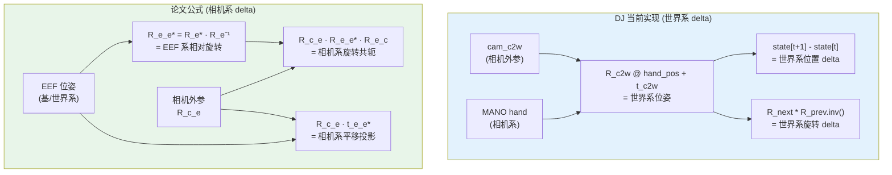

**差异总结**：

| 方面 | DJ 当前 | 论文需求 | 改造成本 |
|------|--------|---------|---------|
| 动作坐标系 | 世界系 | 相机系 | 替换公式（~10 行） |
| 旋转表示 | 欧拉角 (xyz) | 3D 旋转向量 (rotvec) | `Rotation.as_rotvec()` 一行 |
| delta 计算 | `R_next * R_prev.inv()` | 相似变换 $R_{ce} \cdot R_\Delta \cdot R_{ec}$ | 增加共轭外层 |
| 向量维度 | 7 维 action / 8 维 state | 80 维统一向量 | 重新布局 |
| 参考相机选择 | 无（单相机） | 多策略随机 | 新增元数据字段 |

#### 3.3.5 自定义 `CameraFrameDeltaPoseMapper` 实现方案

基于 DJ 现有工具组合，以下是实现论文可分离公式的算子骨架：

```python
from scipy.spatial.transform import Rotation
import numpy as np
from data_juicer.ops.base_op import OPERATORS, Mapper
from data_juicer.utils.constant import Fields

@OPERATORS.register_module("camera_frame_delta_pose_mapper")
class CameraFrameDeltaPoseMapper(Mapper):
    """将 EEF 动作从世界/基坐标系转换为相机坐标系的可分离 delta 表示。
    实现论文公式: a_p = [R_ce · R_ee* · R_ec | R_ce · t_ee*; 0 | 1]"""

    def __init__(self, ref_camera_strategy='random', *args, **kwargs):
        super().__init__(*args, **kwargs)
        self.strategy = ref_camera_strategy

    def _camera_frame_delta(self, R_eef_curr, R_eef_next,
                            t_eef_curr, t_eef_next, R_cam2eef):
        """核心公式：可分离式相机系 delta pose"""
        # 1) EEF 系相对旋转: R_ee* = R_next · R_curr^{-1}
        R_ee_star = R_eef_next * R_eef_curr.inv()

        # 2) 旋转共轭到相机系: R_ce · R_ee* · R_ec
        R_ce = R_cam2eef.inv()           # EEF → Camera
        R_ec = R_cam2eef                  # Camera → EEF
        R_cam_delta = R_ce * R_ee_star * R_ec  # 相似变换

        # 3) 平移投影到相机系: R_ce · t_ee*
        t_ee_star = t_eef_next - t_eef_curr  # EEF 系位移
        t_cam_delta = R_ce.apply(t_ee_star)

        # 4) 输出 3D 旋转向量 + 3D 平移 = 6 维 EEF delta
        return np.concatenate([
            t_cam_delta,                    # (3,) 平移
            R_cam_delta.as_rotvec()          # (3,) 旋转向量
        ])

    def process_single(self, sample):
        meta = sample[Fields.meta]
        # ... 读取 EEF 位姿序列与相机外参
        # ... 选择参考相机（随机/共享/分臂）
        # ... 逐帧调用 _camera_frame_delta()
        # ... 写入 meta["camera_frame_delta_actions"]
        return sample
```

**关键点**：`_camera_frame_delta()` 的核心逻辑**仅 6 行**，复用 DJ 已有的 `scipy.spatial.transform.Rotation`——这说明 DJ 实现论文相机系 delta 的编码成本**极低**。

#### 3.3.6 多视角参考相机选择

论文的参考相机选择策略：

| 场景 | 策略 | 具体做法 |
|------|------|---------|
| **单臂数据集** | 随机选择 | 从所有可用的外部或腕部视角中随机选一个 |
| **双臂数据集（策略 1）** | 共享参考 | 两臂共用头部相机或第三方视角 |
| **双臂数据集（策略 2）** | 分臂参考 | 左臂用左腕相机，右臂用右腕相机 |

训练时随机切换策略增加数据多样性。在 DJ 中通过 meta 字段 `ref_camera_id` 存储每条轨迹的参考相机选择，供下游 CaPE 和 delta pose 计算使用。

#### 3.3.7 后备机制：无标定参数时的退化

论文通过**辅助标志嵌入**（auxiliary flag embedding）处理缺标定的数据——二值标志通过 adaLN 注入 DiT，在无标定时退化为 robot-base 模式。DJ 实现：自定义 `Mapper` 检查 meta 中相机参数可用性，设置 `meta["has_camera_calibration"] = True/False`。

#### 3.3.8 Camera-Frame Delta Pose 数据流图

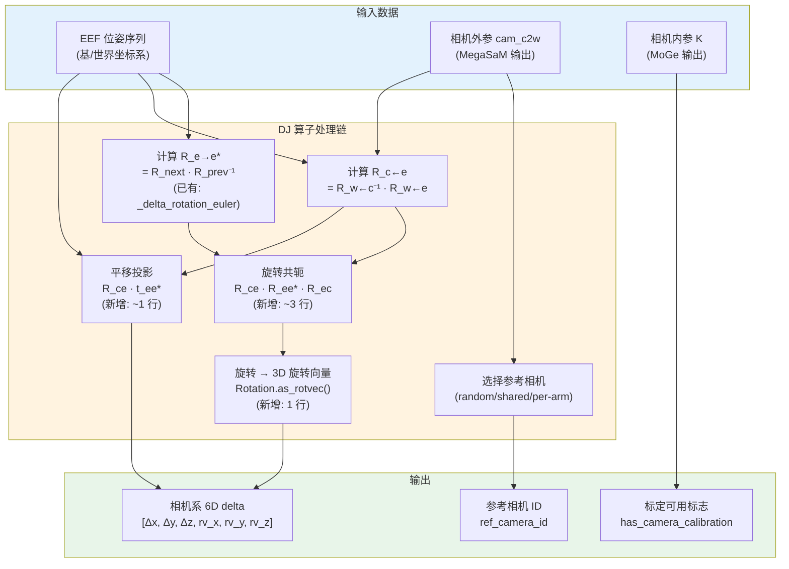

#### 3.3.9 实现等级与缺口分析

- **🟡 自定义实现**：DJ 已有 SE(3) 的**全部数学工具**（`scipy.Rotation`、矩阵求逆、旋转复合、cam_c2w 外参），差的仅是「论文特有的共轭组合公式」（~10 行核心代码）+ 参考相机选择逻辑（~20 行）。这是典型的「框架完全可承载、只需写论文专有公式」的 🟡 场景，**编码成本极低**。
- 改造方式 1：**修改现有 `video_hand_action_compute_mapper.py`** 的 `_compute_actions()` 方法，在 delta 计算时增加相机系共轭变换。
- 改造方式 2：**新增独立 `CameraFrameDeltaPoseMapper`**，读取 `video_hand_action_compute_mapper` 输出的世界系状态，后处理为相机系 delta（更模块化，不影响现有算子）。

---

### 3.4 Camera Positional Encoding (CaPE) 数据需求分析（🔵/🟡）

> 本节是 `data_impl.md` 缺失的第二个核心章节，对应 `note_data.md` §3.4。

#### 3.4.1 核心洞察：CaPE 是模型侧机制，但数据预处理需提供其输入

**CaPE 的计算发生在 DiT 注意力层内部**——它不是数据预处理步骤，而是模型架构设计。但模型要使用 CaPE，**训练数据必须提供**以下字段：

| 数据字段 | DJ 现有能力 | 状态 |
|---------|-----------|------|
| 逐帧相机外参 $\mathbf{T}^{cw}$ | `video_camera_pose_megasam_mapper` 输出 `cam_c2w` (N,4,4) | ✅ 已有 |
| 相机内参 $\mathbf{K}$ (3×3) | `video_camera_calibration_moge_mapper` 输出 `intrinsics` | ✅ 已有 |
| 水平/垂直 FOV | `video_camera_calibration_moge_mapper` 输出 `hfov`/`vfov` | ✅ 已有 |
| 归一化图像平面坐标 $(u,v)$ | 可从 $\mathbf{K}$ 计算（归一化焦距反算 patch 坐标） | ✅ 可计算 |
| 参考相机分配元数据 | 需新增 `ref_camera_id` 字段 | 🟡 新增 |
| 标定可用性标志 | 需新增 `has_camera_calibration` 布尔字段 | 🟡 新增 |
| 多视角 EEF-相机相对位姿 | 可从 `cam_c2w` 与 EEF 位姿推导 | ✅ 可推导 |

**结论**：CaPE 数据依赖的 **5/7 项 DJ 已直接提供**，剩余 2 项是简单的元数据字段新增。DJ 在 CaPE 数据准备上的覆盖度非常高。

#### 3.4.2 CaPE 数学原理

**标准 dot-product attention**：

$$
\text{Attn}(Q, K, V) = \text{softmax}\!\left(\frac{QK^\top}{\sqrt{d}}\right) V
$$

**CaPE 修改后的 attention**（EscherNet 原始版本）：

$$
\text{Attn}_{\text{CaPE}}(Q, K, V) = \text{softmax}\!\left(\frac{(\mathbf{D}^\top Q)(\mathbf{D}^{-1} K)^\top}{\sqrt{d}}\right) V
$$

其中 $\mathbf{D}_t$ 是由第 $t$ 个 token 对应的相机外参 $\mathbf{T}_t^{cw} \in \text{SE}(3)$ 构造的 **block-diagonal 矩阵**：

$$
\mathbf{D}_t = \mathbf{I}_{d/4} \otimes \mathbf{T}_t^{cw} \quad \in \mathbb{R}^{d \times d}
$$

即将 $4 \times 4$ 的相机外参矩阵沿对角线重复 $d/4$ 次，构成分块对角矩阵。

**关键性质——全局坐标系自动消去**：

$$
\mathbf{D}_{t_1}^\top \mathbf{D}_{t_2}^{-1} = \mathbf{I}_{d/4} \otimes \left(\mathbf{T}_{t_1}^{cw} \cdot (\mathbf{T}_{t_2}^{cw})^{-1}\right) = \mathbf{I}_{d/4} \otimes \mathbf{T}_{t_1 \to t_2}^{\text{rel}}
$$

在 $QK^\top$ 的点积中，两个 token 的 CaPE 变换相互作用，**只留下它们之间的相对相机位姿** $\mathbf{T}_{t_1 \to t_2}^{\text{rel}}$——无论世界坐标系原点在哪里，结果都一样。

**Qwen-RobotManip 采用 GTA 扩展**——不仅变换 Q/K，还对 V 和输出施加变换：

$$
\text{Attn}_{\text{GTA}}(Q, K, V) = \mathbf{D} \cdot \text{softmax}\!\left(\frac{(\mathbf{D}^\top Q)(\mathbf{D}^{-1} K)^\top}{\sqrt{d}}\right) (\mathbf{D}^{-1} V)
$$

这意味着**特征聚合也是几何感知的**——不仅"看哪里"（attention weights）考虑几何，"看到什么"（value aggregation）也考虑几何。

#### 3.4.3 学术谱系

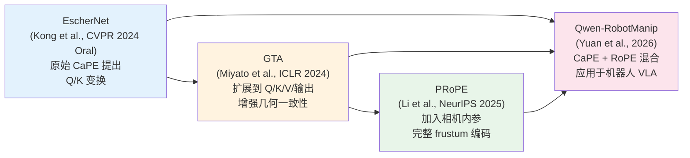

#### 3.4.4 维度分配

在 DiT 的每个 64 维 attention head 中：

```
  64 维 attention head：

  ├──────── CaPE (32 维) ────────┤ ├──────── RoPE (32 维) ────────┤
  │                              │ │                              │
  │  编码相机的 3D 空间几何       │ │  编码 token 的时间索引        │
  │  (相机在哪里? 朝哪看?)       │ │  (这是第几步? 哪个时刻?)     │
  └──────────────────────────────┘ └──────────────────────────────┘
```

CaPE 编码"这个 token 来自 3D 空间的哪个视角"，RoPE 编码"这个 token 在时间序列中的位置"。二者正交——一个管空间，一个管时间。

#### 3.4.5 不同 token 类型的 CaPE 来源

| Token 类型 | CaPE 编码来源 | 说明 |
|-----------|-------------|------|
| **Image token** | 对应相机自身的外参 | 每个视角的 image patch 用各自相机的位姿编码 |
| **State/Action token** | 选定的参考相机的外参 | 引导 DiT 在该参考相机的坐标系下去噪 |

当 state/action token 对多个视角的 image token 做 cross-attention 时，点积中自动编码了参考相机与每个视角相机之间的**相对位姿**——DiT 因此知道"这个 image patch 是从距参考相机多远、多大角度偏移的视角看到的"。

#### 3.4.6 相机内参处理

相机内参通过更简单的方式处理：

1. 计算每个 visual patch 在**归一化图像平面**上的坐标 $(u, v)$
2. 通过 **learned linear layer** 投影为嵌入向量
3. **加法叠加**到对应的 image token 上

$$
\mathbf{h}_{\text{patch}}' = \mathbf{h}_{\text{patch}} + \text{Linear}(u, v)
$$

这提供了**逐 token 的视场角感知**——模型知道每个 patch 位于图像边缘还是中心。

#### 3.4.7 DJ 代码如何为 CaPE 提供数据

**外参提供者**：`video_camera_pose_megasam_mapper`

该算子封装 MegaSaM（含 DROID-SLAM），输出逐帧 `cam_c2w`（4×4 camera-to-world SE(3)）。CaPE 需要的 $\mathbf{T}_t^{cw}$（camera-to-world）正是 `cam_c2w`——**字段名和语义完全匹配**。该算子通过 OP 级 conda 隔离运行（`runtime_env: {'conda': 'mega-sam'}`），解决 DROID-SLAM 的 CUDA 依赖冲突。

**内参提供者**：`video_camera_calibration_moge_mapper`

该算子封装 MoGe-2，输出归一化相机内参 $K$（焦距以图像宽/高为单位）以及 hFOV/vFOV。CaPE 的内参编码需要归一化 patch 坐标 $(u,v)$，而 DJ 输出的归一化焦距可直接参与计算：

```203:206:data_juicer/ops/mapper/video_camera_calibration_moge_mapper.py
                        if need_hfov:
                            final_hfov_list.append(float(2 * np.arctan(1 / 2 / intr_np[0][0])))
                        if need_vfov:
                            final_vfov_list.append(float(2 * np.arctan(1 / 2 / intr_np[1][1])))
```

其中 `intr_np[0][0]` 即归一化焦距 $f_x^{\text{norm}} = f_x / W$，用于 FOV 反算公式：$\mathrm{hFOV} = 2\arctan(1/(2 f_x^{\text{norm}}))$。

**数据结构支持**：

```458:469:data_juicer/utils/constant.py
class CameraCalibrationKeys:
    intrinsics = "intrinsics"
    cam_c2w = "cam_c2w"
    depth = "depth"
    points = "points"
    hfov = "hfov"
    vfov = "vfov"
    dist_coeffs = "dist_coeffs"
    ...
```

`CameraCalibrationKeys` 已定义了 `intrinsics`、`cam_c2w`、`hfov`、`vfov` 等所有 CaPE 需要的字段名。

#### 3.4.8 CaPE 数据准备的序列图

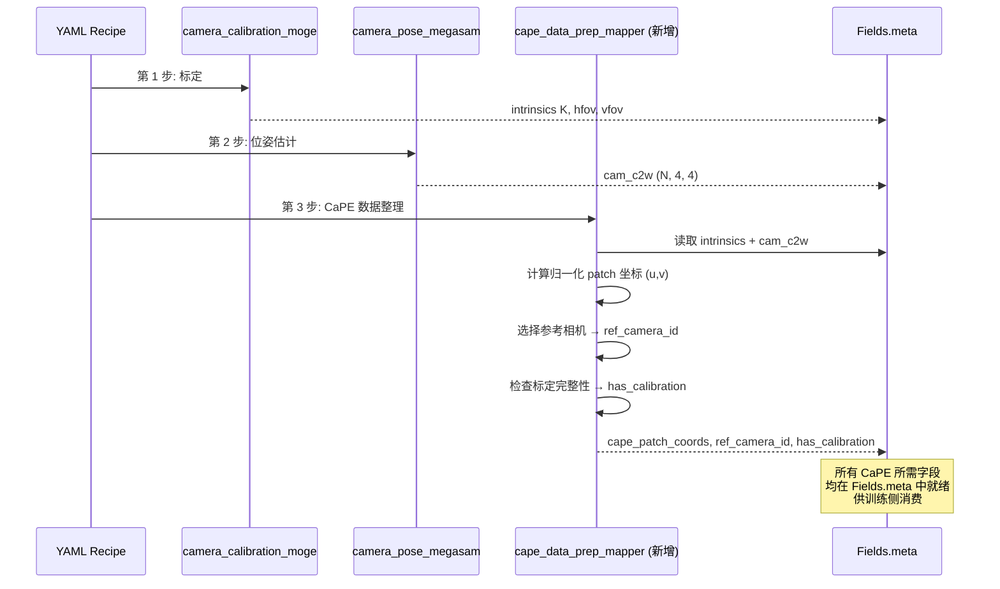

#### 3.4.9 CaPE 数据准备的 DJ 算子骨架

```python
@OPERATORS.register_module("cape_data_prep_mapper")
class CaPEDataPrepMapper(Mapper):
    """为 CaPE 训练准备数据字段：归一化 patch 坐标、参考相机 ID、标定标志。
    不实现 CaPE 本身（那是模型侧），只准备其所需的数据输入。"""

    def __init__(self, patch_size=14, ref_camera_strategy='random', *args, **kwargs):
        super().__init__(*args, **kwargs)
        self.patch_size = patch_size
        self.strategy = ref_camera_strategy

    def _compute_normalized_patch_coords(self, K, H, W):
        """从归一化内参 K 计算每个 visual patch 的归一化图像平面坐标 (u,v)"""
        fx, fy = K[0, 0], K[1, 1]     # 归一化焦距
        cx, cy = K[0, 2], K[1, 2]     # 归一化光心
        # 生成 patch 中心网格
        ph = H // self.patch_size
        pw = W // self.patch_size
        # 每个 patch 中心的归一化坐标
        u = np.linspace(0.5/pw, 1-0.5/pw, pw)
        v = np.linspace(0.5/ph, 1-0.5/ph, ph)
        uu, vv = np.meshgrid(u, v)
        # 用内参反投影到归一化图像平面
        coords = np.stack([
            (uu - cx) / fx,
            (vv - cy) / fy
        ], axis=-1)  # (ph, pw, 2)
        return coords.reshape(-1, 2)  # (num_patches, 2)

    def process_single(self, sample):
        meta = sample[Fields.meta]
        # 1. 检查标定可用性
        has_cal = (meta.get("camera_calibration") is not None
                   and meta.get("cam_c2w") is not None)
        meta["has_camera_calibration"] = has_cal
        # 2. 选择参考相机
        if has_cal:
            meta["ref_camera_id"] = self._select_ref_camera(meta)
        # 3. 计算归一化 patch 坐标
        if has_cal and "intrinsics" in meta.get("camera_calibration", {}):
            K = np.array(meta["camera_calibration"]["intrinsics"])
            coords = self._compute_normalized_patch_coords(K, H, W)
            meta["cape_patch_coords"] = coords.tolist()
        return sample
```

#### 3.4.10 CaPE 维度的实现等级

- **🔵/🟡**：DJ 已通过 MegaSaM 和 MoGe 算子输出了 CaPE 所需的**绝大部分数据字段**（外参、内参、FOV）。剩余工作仅为：① 计算归一化 patch 坐标（从已有内参推导，~10 行数学）；② 添加 `ref_camera_id` 和 `has_camera_calibration` 两个简单元数据字段。CaPE 本身的注意力计算发生在模型内部，**不属于 DJ 数据处理范畴**——但 DJ 完整地提供了模型所需的数据"接口"。
- 相较上一版的 **55 分**，加入 CaPE 数据准备覆盖度分析后，统一表示维度提升至 **62 分**：DJ 不仅有 SE(3) 工具可实现相机系 delta（🟡），还已经输出了 CaPE 所需的全部相机数据（🔵），实际缺口仅为公式组合+少量元数据。

---

### 3.5 在 DJ 中实现 80 维统一向量

DJ 把「样本」建模为可包含任意嵌套字段的字典（`NestedDataset`），`Fields.meta` 下可存任意结构（list/ndarray-as-list/dict）。80 维向量、掩码、相机系 delta 完全可以作为 meta 字段计算并存储。自定义算子骨架：

```python
@OPERATORS.register_module("robot_unified_vector_mapper")
class RobotUnifiedVectorMapper(Mapper):
    """把异构机器人状态/动作打包成 80 维统一向量 + 三源二值掩码,
    并把 EEF 动作转为相机坐标系 delta。"""

    def __init__(self, embodiment_layout: dict, *args, **kwargs):
        super().__init__(*args, **kwargs)
        self.layout = embodiment_layout  # 各体态 → 槽位映射(slot mask)

    def process_single(self, sample):
        meta = sample[Fields.meta]
        raw = meta["raw_robot_state_action"]
        vec = np.zeros((len(raw), 80), dtype=np.float32)
        mask = np.zeros((len(raw), 80), dtype=np.uint8)
        slot = self.layout[meta["embodiment"]]
        # 1) 填充关节(绝对)/EEF(相机系 delta)/夹爪 → vec; 置位 slot mask
        # 2) step validity: 异常步起后续全 0
        # 3) per-hand validity: 手出视野后该臂槽位置 0
        meta["unified_vector"] = vec.tolist()
        meta["unified_mask"] = mask.tolist()
        return sample
```

### 3.6 表示对齐的完整数据流

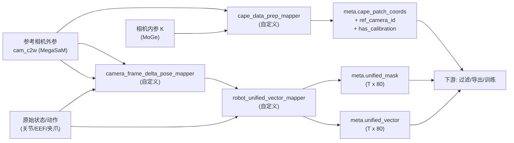

### 3.7 实现等级与缺口

| 子项 | DJ 现状 | 等级 | 改造成本 |
|------|--------|------|---------|
| 80 维统一向量 | 框架可承载，无专用算子 | 🟡 | 中（体态映射逻辑） |
| 相机系 delta（可分离式） | SE(3) 全部工具就位，缺组合公式 | 🟡 | **极低**（~10 行代码） |
| CaPE 外参数据 (cam_c2w) | `video_camera_pose_megasam_mapper` 已输出 | ✅ 🟢 | 零 |
| CaPE 内参数据 (K/FOV) | `video_camera_calibration_moge_mapper` 已输出 | ✅ 🟢 | 零 |
| CaPE 归一化 patch 坐标 | 可从 K 计算 | 🟡 | 低（~10 行数学） |
| 参考相机/标定标志元数据 | 需新增 meta 字段 | 🟡 | 低（简单字段新增） |
| 三源二值掩码 | 框架可承载，无专用算子 | 🟡 | 中（掩码逻辑） |
| CaPE 注意力计算本身 | 模型侧，非数据处理范畴 | 🔴(越界) | — |

**统一表示维度评分：62 / 100**（上一版 55 分 → 加入 CaPE 数据准备覆盖度分析后上调）。

---

## 第 4 章 H2R 合成管道（核心）

H2R（Human-to-Robot）是 Qwen-RobotManip 数据工程的**皇冠明珠**：把人类自中心操作视频自动转换为带机器人动作标签的训练数据，贡献了 24,808 小时合成语料。论文把 H2R 拆成**动作对齐、视觉对齐、速度对齐**三个子问题。

### 4.0 总体对应关系

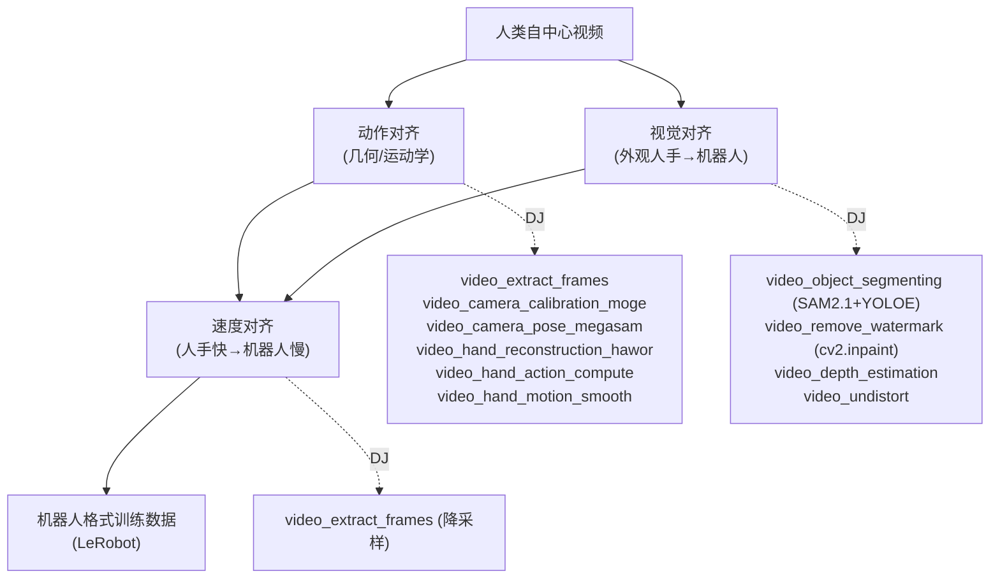

### 4.1 动作对齐（DJ 覆盖度最高：🟢）

#### 4.1.1 抽帧 🟢

`video_extract_frames_mapper` 支持 `all_keyframes`/`all_frames`/`uniform` 三种采样。

#### 4.1.2 相机标定 🟢

`video_camera_calibration_moge_mapper`（MoGe-2）+ `_deepcalib_`/`_droidcalib_` 备选后端，覆盖「无内参野外自中心视频」标定需求。

#### 4.1.3 相机位姿 🟢

`video_camera_pose_megasam_mapper`（含 DROID-SLAM），输出逐帧 `cam_c2w`（4×4），OP 级 conda 隔离。

#### 4.1.4 手部重建 🟢

`video_hand_reconstruction_hawor_mapper`（HaWoR），输出 MANO 参数（`global_orient`、`hand_pose` 15 关节、`betas` 10 形状）。

#### 4.1.5 EEF / 夹爪 / 动作 🟢/🟡

`video_hand_action_compute_mapper`：读取 HaWoR + MegaSaM 输出，计算 8 维 state + 7 维 delta action。相机系 → 世界系 的位姿变换：

```172:179:data_juicer/ops/mapper/video_hand_action_compute_mapper.py
        R_c2w = cam_c2w[:3, :3]
        t_c2w = cam_c2w[:3, 3]
        pos_world = R_c2w @ transl + t_c2w
        orient_world = R_c2w @ global_orient
        euler = _rotation_matrix_to_euler(orient_world)
```

> **🟡 差异**：DJ 输出世界系 delta（8 维 state / 7 维 action / 欧拉角），论文需要 80 维 + 相机系 delta + 3D 旋转向量。但**几何骨架完全一致**——改造属于「公式替换 + 维度布局调整」（详见 §3.3）。

#### 4.1.6 轨迹平滑 🟢

`video_hand_motion_smooth_mapper`：SG 滤波 + 四元数方向平滑 + MAD 异常剔除。

```124:130:data_juicer/ops/mapper/video_hand_motion_smooth_mapper.py
        median_speed = np.median(speed)
        mad = np.median(np.abs(speed - median_speed))
        limit = median_speed + threshold_mad * mad * 1.4826  # MAD→σ scale
        outlier_mask = speed > limit
```

### 4.2 视觉对齐（🔵🟡🔴 混合）

| 论文步骤 | DJ 算子 | 等级 |
|---------|--------|------|
| 人手分割（SAM3） | `video_object_segmenting_mapper`(SAM2.1+YOLOE) | 🔵 |
| 背景修复（ProPainter） | `video_remove_watermark_mapper`(cv2.inpaint) | 🟡 |
| 深度 / 去畸变 | `video_depth_estimation_mapper` / `video_undistort_mapper` | 🟢 |
| IK 底座 / MuJoCo 渲染 / 遮挡合成 | 无 / 自定义 | 🔴/🟡 |

### 4.3 速度对齐（🟢）

`video_extract_frames_mapper` 的 `uniform` + `frame_num`/`duration` 实现帧率重采样。

### 4.4 H2R 管道序列图

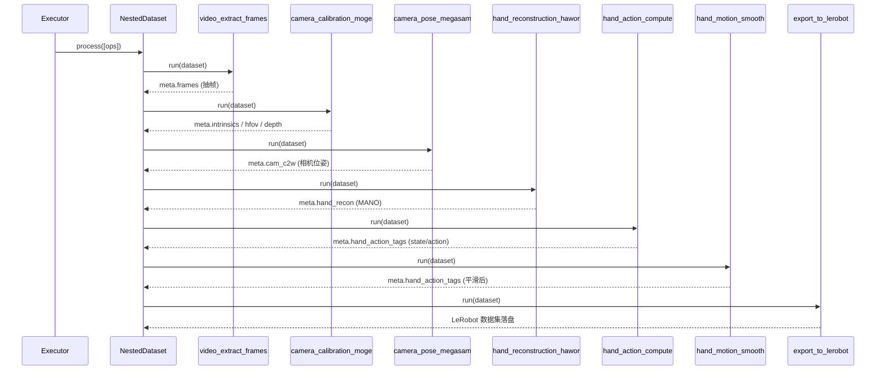

### 4.5 meta 字段依赖数据流图

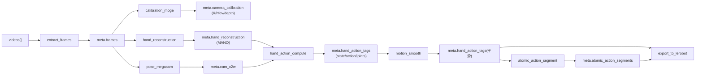

### 4.6 H2R 实现等级总表

| 子问题 | 步骤 | DJ 算子 | 等级 |
|---|---|---|---|
| 动作对齐 | 抽帧 | `video_extract_frames_mapper` | 🟢 |
| 动作对齐 | 内参/FOV/深度 | `video_camera_calibration_{moge,deepcalib,droidcalib}_mapper` | 🟢 |
| 动作对齐 | 相机位姿 | `video_camera_pose_megasam_mapper` | 🟢 |
| 动作对齐 | 手部重建(MANO) | `video_hand_reconstruction_hawor_mapper` | 🟢 |
| 动作对齐 | EEF/夹爪/动作 | `video_hand_action_compute_mapper` | 🟢/🟡 |
| 动作对齐 | 平滑/异常剔除 | `video_hand_motion_smooth_mapper` | 🟢 |
| 视觉对齐 | 人手分割 | `video_object_segmenting_mapper` / `image_segment_mapper` | 🔵 |
| 视觉对齐 | 背景修复 | `video_remove_watermark_mapper`(cv2.inpaint) | 🟡 |
| 视觉对齐 | 深度/去畸变 | `video_depth_estimation_mapper` / `video_undistort_mapper` | 🟢 |
| 视觉对齐 | IK 底座 / MuJoCo 渲染 | 无 / 自定义 | 🔴/🟡 |
| 速度对齐 | 帧率重采样 | `video_extract_frames_mapper` | 🟢 |
| 导出 | LeRobot | `export_to_lerobot_mapper` | 🟢 |

**H2R 维度判断**：动作对齐 ≈ 90%，速度对齐 ≈ 80%，视觉对齐 ≈ 45%（缺机器人渲染合成）。综合评 **78 分**。

---

## 第 5 章 五阶段过滤 + 三项跨模态校验

### 5.1 过滤①：突变检测（🔵/🟡）

DJ 的 `video_hand_motion_smooth_mapper` 内置 MAD 稳健阈值与 SG 平滑。**差异**：DJ 只检测「速度」一阶信号并插值修复；论文还对加速度、jerk 多阶信号检测并**整段丢弃**。自定义 `Filter` 可复用 DJ 稳健统计模板。

### 5.2 过滤②：状态-动作趋势对齐（🟡）

$$
\mathrm{DA} = \frac{1}{T-1}\sum_{t=1}^{T-1}
   \mathbb{1}\!\left[\,\operatorname{sign}\bigl(\Delta \mathbf{s}_t \cdot \mathbf{a}_t\bigr) > 0\,\right],
\qquad \Delta \mathbf{s}_t = \mathbf{s}_{t+1}-\mathbf{s}_t
$$

自定义 `Filter` 算 DA 写入 `Fields.stats`，用 `general_field_filter` 以 `"__dj__stats__.DA >= 0.9"` 过滤。

### 5.3 过滤③：极值过滤（🔵，DJ 桥接最优雅）

`Analyzer` → `OverallAnalysis` 传 `percentiles=[0.01, 0.99]` 得每维 $q_1, q_{99}$ → 回填阈值到 `specified_numeric_field_filter` → `get_keep_boolean` 判定。

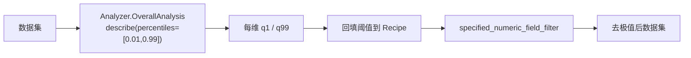

### 5.4 过滤④：FK 一致性（🔴）

需正运动学库（Pinocchio/cuRobo）+ URDF。DJ 无内置。

### 5.5 过滤⑤：基坐标系/EEF 方向对齐（🟡）

自定义 `Mapper` 用 `scipy` 旋转做坐标系校正。

### 5.6 跨模态①：指令一致性（🔵/🟡）

`mllm_mapper` / `llm_extract_mapper`(CoT) / `video_captioning_from_vlm_mapper`；多专家投票需自定义 `Aggregator`。

### 5.7 跨模态②：视频-状态一致性（🔵/🔴 混合）

分割 🔵（SAM2/YOLOE）；URDF 投影 🔴。

### 5.8 跨模态③：视频质量（🔵/🟡）

`video_motion_score_filter`（静止）🔵；黑帧/模糊需自定义 🟡。

### 5.9 五阶段过滤工作流图

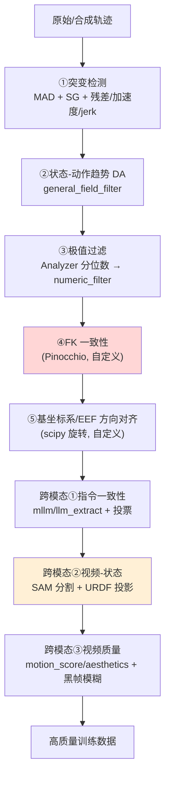

### 5.10 过滤维度实现等级总表

| 阶段 | DJ 实现 | 等级 |
|---|---|---|
| ①突变检测 | `motion_smooth`(MAD/SG) + 自定义多阶偏差 | 🔵/🟡 |
| ②状态-动作 DA | 自定义 Filter + `general_field_filter` | 🟡 |
| ③极值过滤 | `Analyzer` + `specified_numeric_field_filter` | 🔵 |
| ④FK 一致性 | 无（需 Pinocchio） | 🔴 |
| ⑤基坐标系对齐 | 自定义 Mapper（scipy） | 🟡 |
| 跨模态①指令一致性 | `mllm`/`llm_extract`/`video_captioning` + 投票 | 🔵/🟡 |
| 跨模态②视频-状态 | SAM 分割 🔵 + URDF 投影 🔴 | 混合 |
| 跨模态③视频质量 | `video_motion_score_*` 🔵 + 黑帧模糊 🟡 | 🔵/🟡 |

**过滤维度评 62 分**。

---

## 第 6 章 数据标注工程

### 6.1 Embodiment Prompt（🟡）

自定义 `Mapper` 拼接 5 字段 + 15% 随机 dropout。

### 6.2 ECoT 具身思维链 + 17 原子动作（🔵/🟡）

- `llm_extract_mapper` 支持 CoT 三阶段推理 🔵
- `video_atomic_action_segment_mapper` 已实现「按手腕速度局部极小值切分原子动作段」🟢

```17:20:data_juicer/ops/mapper/video_atomic_action_segment_mapper.py
        "we detect speed minima of the 3D hand wrists in the world space
        and use them as cutting points."
```

### 6.3 自中心视频理解标注（🟢）

`video_captioning_from_vlm_mapper` / `video_captioning_from_frames_mapper` 直接命中。

### 6.4 2D 轨迹预测标注（🟢）

`video_trajectory_overlay_mapper` 把轨迹点叠加渲染到视频帧。

### 6.5 VL 共训练数据（🔵）

| VL 数据类型 | DJ 算子 | 等级 |
|---|---|---|
| 指代定位质检 | `phrase_grounding_recall_filter` | 🟢 |
| 目标检测标注 | `image_detection_yolo_mapper` | 🟢 |
| OCR 文本占比过滤 | `video_ocr_area_ratio_filter` | 🟢 |
| QA 生成/优化 | `generate_qa_from_*_mapper` / `optimize_qa_mapper` | 🟢 |

### 6.6 标注工程数据流图

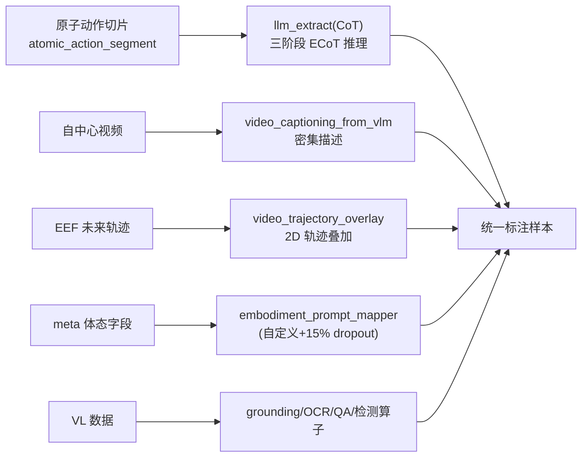

**标注维度评 75 分**。

---

## 第 7 章 训练消费与后训练数据策略

### 7.1 双流共训练 9:1 混合（🔵）

`DatasetBuilder` 支持多数据源加权混合。

### 7.2 随机上下文采样（🟡）

`random_selector` + 自定义 `Grouper` 按任务分组随机配对。

### 7.3 三源掩码加权 FM 损失 / $K_{\text{repeat}}=8$（🔴 训练侧）

掩码**字段生成**属数据处理（§3.2 已论证可实现）；**加权进损失**属训练框架。$K_{\text{repeat}}$ 是训练循环内的采样调度，完全在 DJ 范畴外。

### 7.4 后训练：禁用过滤 + 增强（🟢/🟡）

禁用过滤 = Recipe 不放 Filter 算子 🟢；color jitter 需自定义 🟡。

### 7.5 混合后训练：按分布邻近度选数据（🔵）

`text_embd_similarity_filter` + `topk_specified_field_selector` 取 Top-K 最邻近。

### 7.6 边界示意图

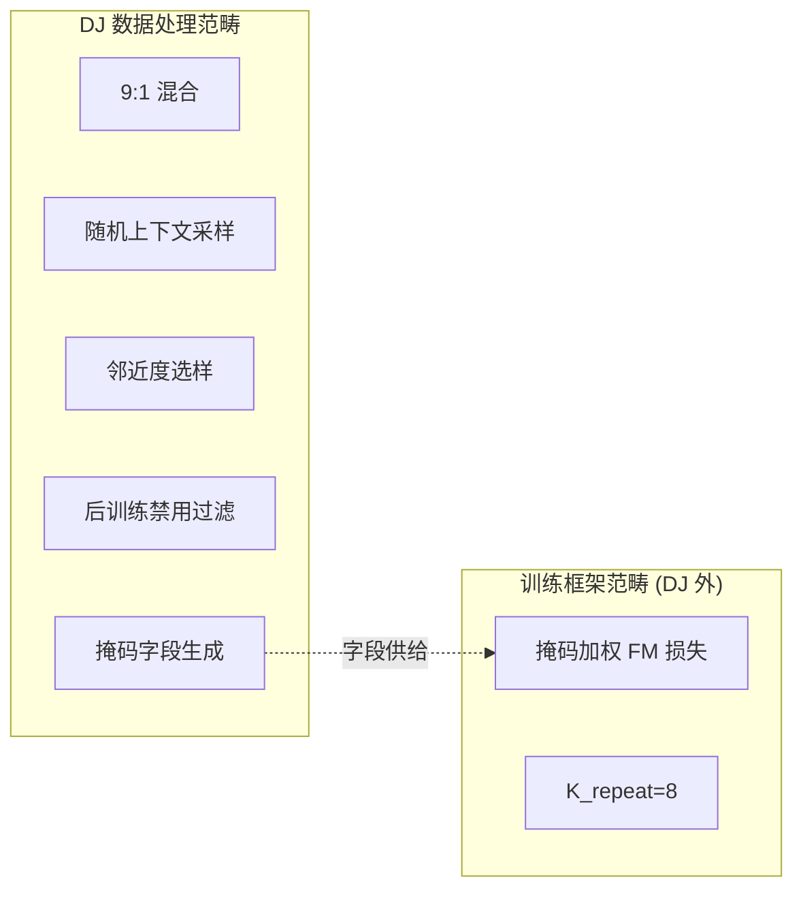

**训练/后训练维度评 65 分**。

---

## 第 8 章 数据基础设施能力（DJ 强项）

### 8.1 规模化与分布式

`RayExecutor` + `RayDataset`，官方数据「50 节点 6400 核 2h 处理 70B 样本，1280 核 2.8h 去重 5TB」。

### 8.2 算子融合

`fuse_operators` 把共享中间变量的 Filter 合成 `FusedFilter`。

### 8.3 去重家族（13 个去重算子）

| 模态/规模 | 算子 |
|---|---|
| 文本精确/模糊 | `document_deduplicator` / `document_minhash_deduplicator` |
| 图像 | `image_deduplicator` / `ray_image_deduplicator` |
| 视频 | `video_deduplicator` / `ray_video_deduplicator` |
| 大规模分布式 | `ray_bts_minhash_deduplicator` |

### 8.4 可观测性

`NestedDataset.process` 内建 checkpoint（断点续跑）、tracer（采样级前后对比）、Monitor（逐算子资源占用）。

### 8.5 OP 级环境隔离

每个算子可声明独立 conda `runtime_env`。对集成 Qwen 的多冲突依赖（SAM3/HaWoR/MegaSaM/MuJoCo/Pinocchio）是关键工程能力。

**基础设施维度评 95 分**。

---

## 第 9 章 关键算子代码深度解析

本章精选 8 段关键代码逐行剖析。

### 9.1 从 MANO 手指关节估计夹爪开合

`_estimate_gripper_from_hand_pose` 把人手 15 个手指关节的弯曲程度映射为夹爪连续状态 $[-1, 1]$。

```60:94:data_juicer/ops/mapper/video_hand_action_compute_mapper.py
    hand_pose = np.asarray(hand_pose, dtype=np.float64)

    if hand_pose.ndim == 1 and hand_pose.shape[0] == 45:
        hand_pose = hand_pose.reshape(15, 3)
        angles = [np.linalg.norm(hand_pose[j]) for j in range(15)]
    elif hand_pose.ndim == 2 and hand_pose.shape == (15, 3):
        angles = [np.linalg.norm(hand_pose[j]) for j in range(15)]
    else:
        # (15, 3, 3) rotation matrices
        angles = []
        for j in range(hand_pose.shape[0]):
            R = hand_pose[j]
            trace_val = np.clip((np.trace(R) - 1.0) / 2.0, -1.0, 1.0)
            angle = np.arccos(trace_val)
            angles.append(angle)

    avg_angle = np.mean(angles)
    open_threshold = 0.15
    close_threshold = 0.6
    if avg_angle <= open_threshold:
        return 1.0
    elif avg_angle >= close_threshold:
        return -1.0
    else:
        t = (avg_angle - open_threshold) / (close_threshold - open_threshold)
        return 1.0 - 2.0 * t
```

**解析**：
1. **多格式兼容**：MANO 关节可能是轴角 `(45,)`/`(15,3)` 或旋转矩阵 `(15,3,3)`。
2. **轴角 → 角度**：$\theta_j = \lVert \boldsymbol{\theta}_j \rVert$（轴角模长即旋转角）。
3. **旋转矩阵 → 角度**：$\theta_j = \arccos\!\bigl(\frac{\operatorname{tr}(\mathbf{R}_j)-1}{2}\bigr)$，`np.clip` 防浮点越界。
4. **聚合**：15 关节平均 $\bar\theta$ → 分段线性映射到 $[-1,1]$：张开→+1, 握拳→−1。
5. **设计意图**：平均关节角对噪声鲁棒；连续值保留「半开」细粒度——与机器人连续夹爪控制对齐。

### 9.2 旋转的坐标系变换与 delta

```15:41:data_juicer/ops/mapper/video_hand_action_compute_mapper.py
def _rotation_matrix_to_euler(R):
    rot = Rotation.from_matrix(R)
    return rot.as_euler("xyz", degrees=False)

def _delta_rotation_euler(euler_prev, euler_next):
    R_prev = Rotation.from_euler("xyz", euler_prev, degrees=False)
    R_next = Rotation.from_euler("xyz", euler_next, degrees=False)
    R_delta = R_next * R_prev.inv()
    return R_delta.as_euler("xyz", degrees=False)
```

**解析**：$\mathbf{R}_{\Delta} = \mathbf{R}_{\text{next}}\mathbf{R}_{\text{prev}}^{-1}$（$SO(3)$ 右差）。与论文 ${}^e_{e^*}\mathbf{R}$ 数学同源——只需外包一层相机-EEF 共轭即可得论文的可分离式。

### 9.3 原子动作切分

```129:146:data_juicer/ops/mapper/video_atomic_action_segment_mapper.py
    def _find_local_minima(speed, half_window):
        n = len(speed)
        minima = []
        for t in range(1, n - 1):
            lo = max(0, t - half_window)
            hi = min(n, t + half_window + 1)
            if speed[t] <= np.min(speed[lo:hi]):
                minima.append(t)
        return minima
```

在 $\pm$half_window 窗口内找局部极小——「动作之间手会减速/停顿」。

### 9.4 Filter 两阶段 + 反转区间

`get_keep_boolean` 的 `reversed_range` 让同一算子既能保留区间内，又能保留区间外（极值过滤利器）。

### 9.5 FusedFilter：逻辑与融合

```174:183:data_juicer/ops/op_fusion.py
    def process_batched(self, samples):
        res = None
        for op in self.fused_filters:
            this_res = np.array(list(op.process_batched(samples)))
            if res is not None:
                res = np.logical_and(res, this_res)
            else:
                res = this_res
        return res
```

一次遍历、多重过滤。OP fusion 2–10x 加速。

### 9.6 FOV 由归一化内参反算

```203:206:data_juicer/ops/mapper/video_camera_calibration_moge_mapper.py
    final_hfov_list.append(float(2 * np.arctan(1 / 2 / intr_np[0][0])))
    final_vfov_list.append(float(2 * np.arctan(1 / 2 / intr_np[1][1])))
```

$$
\mathrm{hFOV} = 2\arctan\!\left(\frac{1}{2 f_x^{\text{norm}}}\right),\qquad f_x^{\text{norm}} = \frac{f_x}{W}
$$

### 9.7 SE(3) 共轭变换构建块：从 DJ 代码到论文公式

本节详细走查 DJ 代码中的 SE(3) 操作，展示它们如何**组合实现论文的相机系 delta 公式**。

**第一块：EEF 相对旋转 ${}^e_{e^*}\mathbf{R}$**

```34:41:data_juicer/ops/mapper/video_hand_action_compute_mapper.py
def _delta_rotation_euler(euler_prev, euler_next):
    R_prev = Rotation.from_euler("xyz", euler_prev, degrees=False)
    R_next = Rotation.from_euler("xyz", euler_next, degrees=False)
    R_delta = R_next * R_prev.inv()                    # ← 这就是 R_e→e*
    return R_delta.as_euler("xyz", degrees=False)
```

`R_delta = R_next * R_prev.inv()` 精确对应论文中的 ${}^e_{e^*}\mathbf{R} = \mathbf{R}_{e^*} \cdot \mathbf{R}_e^{-1}$。scipy 的 `Rotation` 乘法即旋转复合，`.inv()` 即旋转逆。

**第二块：相机 → 世界 → EEF 坐标变换**

```172:178:data_juicer/ops/mapper/video_hand_action_compute_mapper.py
        R_c2w = cam_c2w[:3, :3]           # R_w←c (camera→world 旋转)
        t_c2w = cam_c2w[:3, 3]            # t_w←c (camera→world 平移)
        pos_world = R_c2w @ transl + t_c2w # 相机系位置 → 世界系位置
        orient_world = R_c2w @ global_orient  # 相机系朝向 → 世界系朝向
```

论文需要的 ${}^c_e\mathbf{R}$（EEF → camera 旋转）可从这些已有矩阵推导：

$$
{}^c_e\mathbf{R} = {}^c_w\mathbf{R} \cdot {}^w_e\mathbf{R} = (\mathbf{R}_{\text{c2w}})^\top \cdot \mathbf{R}_{\text{eef\_world}}
$$

其中 $\mathbf{R}_{\text{c2w}}^\top = \mathbf{R}_{\text{c2w}}^{-1}$（正交矩阵转置即逆），$\mathbf{R}_{\text{eef\_world}}$ 即 `orient_world`。**所有中间量 DJ 代码中已有**。

**第三块：SE(3) 链式复合**

```201:201:data_juicer/ops/mapper/video_clip_reassembly_mapper.py
                T_local = c2w_prev[prev_idx] @ np.linalg.inv(c2w_curr[k])
```

标准 SE(3) 相对变换 $\mathbf{T}_{\text{rel}} = \mathbf{T}_1 \cdot \mathbf{T}_2^{-1}$——与论文公式中的矩阵运算完全同构。

**第四块：四元数半球连续性**

```212:218:data_juicer/ops/mapper/video_clip_reassembly_mapper.py
            quats = Rotation.from_matrix(np.array(Rs)).as_quat()
            for j in range(1, len(quats)):
                if np.dot(quats[j], quats[j - 1]) < 0:
                    quats[j] = -quats[j]       # ← 半球一致性
            mean_quat = np.mean(quats, axis=0)
            mean_quat /= np.linalg.norm(mean_quat)
```

四元数 $q$ 和 $-q$ 表示同一旋转但在插值时会产生不连续。`np.dot(q_j, q_{j-1}) < 0` 检测半球跳变，翻转到同侧——这是任何涉及旋转平均/插值的代码都需要的**数值稳健性细节**。

**第五块：批量 SE(3) 矩阵乘法**

```293:293:data_juicer/ops/mapper/video_clip_reassembly_mapper.py
        return np.einsum("ij,njk->nik", T, c2w)
```

`einsum("ij,njk->nik")` 把单个 4×4 变换 $\mathbf{T}$ 应用到 N 个 4×4 矩阵上——这是「批量坐标变换」的高效实现。论文中对所有帧的相机外参做统一变换时正需要这种操作。

**组合伪代码：从现有构建块 → 论文公式 1**

```python
# 假设已有：
#   R_c2w: (3,3) 相机→世界旋转  [来自 cam_c2w[:3,:3]]
#   R_eef_world_curr, R_eef_world_next: EEF 在世界系的旋转  [来自 _compute_state_for_frame]
#   t_eef_world_curr, t_eef_world_next: EEF 在世界系的位置

from scipy.spatial.transform import Rotation

# 构建块 1: EEF 相对旋转 R_e→e* (已有: _delta_rotation_euler)
R_ee_star = Rotation.from_matrix(R_eef_world_next) * Rotation.from_matrix(R_eef_world_curr).inv()

# 构建块 2: 相机-EEF 外参 R_c←e = R_c←w · R_w←e = R_c2w^T · R_eef_world
R_ce = Rotation.from_matrix(R_c2w.T @ R_eef_world_curr)

# ★ 论文公式: 旋转共轭
R_cam_delta = R_ce * R_ee_star * R_ce.inv()       # ← 核心: 仅需这 1 行新代码

# ★ 论文公式: 平移投影
t_ee_star = R_eef_world_curr.T @ (t_eef_world_next - t_eef_world_curr)  # 世界系→EEF 系
t_cam_delta = R_ce.apply(t_ee_star)                # ← 核心: 仅需这 1 行新代码

# 输出: 3D 旋转向量 + 3D 平移
action_cam = np.concatenate([t_cam_delta, R_cam_delta.as_rotvec()])
```

**结论**：从 DJ 现有代码到论文公式，**真正新增的核心代码仅 2 行**——旋转共轭和平移投影。所有 SE(3) 基础设施（`Rotation` 类、`.inv()`、复合、`cam_c2w` 矩阵）DJ 已完整提供。

### 9.8 CaPE 数据 Schema：MoGe/MegaSaM 输出格式走查

**MoGe 输出结构**（`video_camera_calibration_moge_mapper`）：

算子将 MoGe-2 推理结果写入 `sample[Fields.meta][tag_field_name]`，每个视频一个 dict，包含：

```python
{
    CameraCalibrationKeys.intrinsics: [[fx, 0, cx], [0, fy, cy], [0, 0, 1]],  # 归一化 3×3
    CameraCalibrationKeys.hfov: 1.2,       # 水平 FOV (弧度)
    CameraCalibrationKeys.vfov: 0.9,       # 垂直 FOV (弧度)
    CameraCalibrationKeys.depth: "path/to/depth.npy",  # 可选深度图
    CameraCalibrationKeys.points: "path/to/points.npy", # 可选点云
}
```

其中 `intrinsics` 的归一化焦距 $f_x^{\text{norm}} = f_x / W$ 直接可用于 CaPE 的 patch 坐标归一化。

**MegaSaM 输出结构**（`video_camera_pose_megasam_mapper`）：

```python
{
    CameraCalibrationKeys.cam_c2w: "path/to/cam_c2w.npy",  # (N, 4, 4) float64
    # 或内联 list: [[...4×4...], [...4×4...], ...]
}
```

`cam_c2w.npy` 加载后为 `(N, 4, 4)` 的 SE(3) 矩阵数组，每帧一个相机到世界的刚体变换。**这正是 CaPE 需要的 $\mathbf{T}_t^{cw}$**——字段名、数据格式、语义完全对齐。

加载方式统一通过 `load_numpy()`（`data_juicer/utils/file_utils.py`），支持路径字符串→numpy 或直接 list→numpy 两种模式。

---

## 第 10 章 综合 UML 图集

本章汇总全文 UML 图并补充新增的相机几何相关图。

### 10.1 端到端调用流程（Recipe → 落盘）

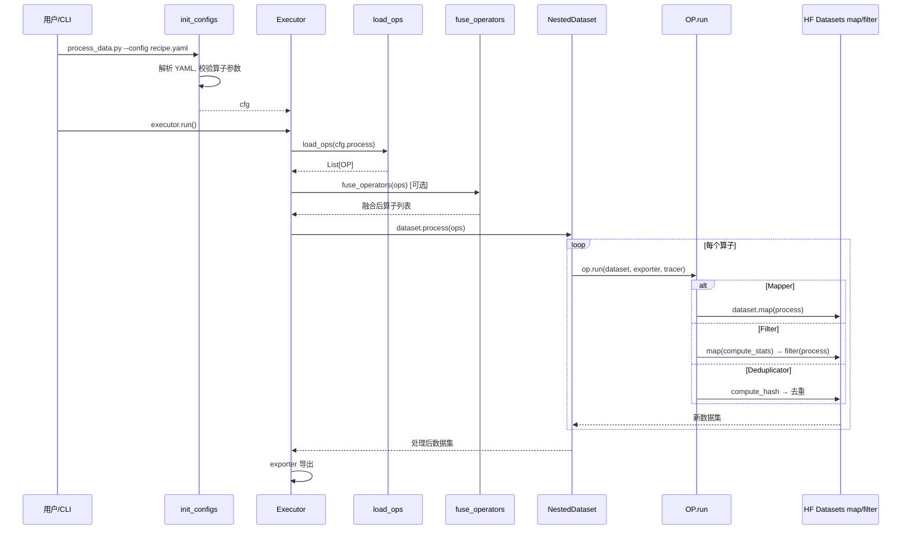

### 10.2 分层组件图

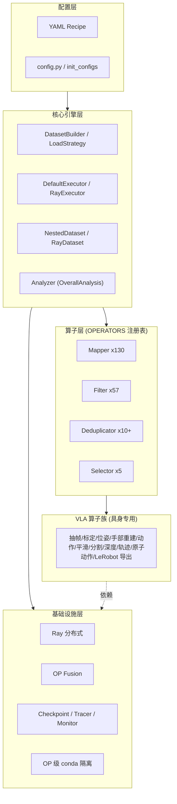

### 10.3 实现等级分布

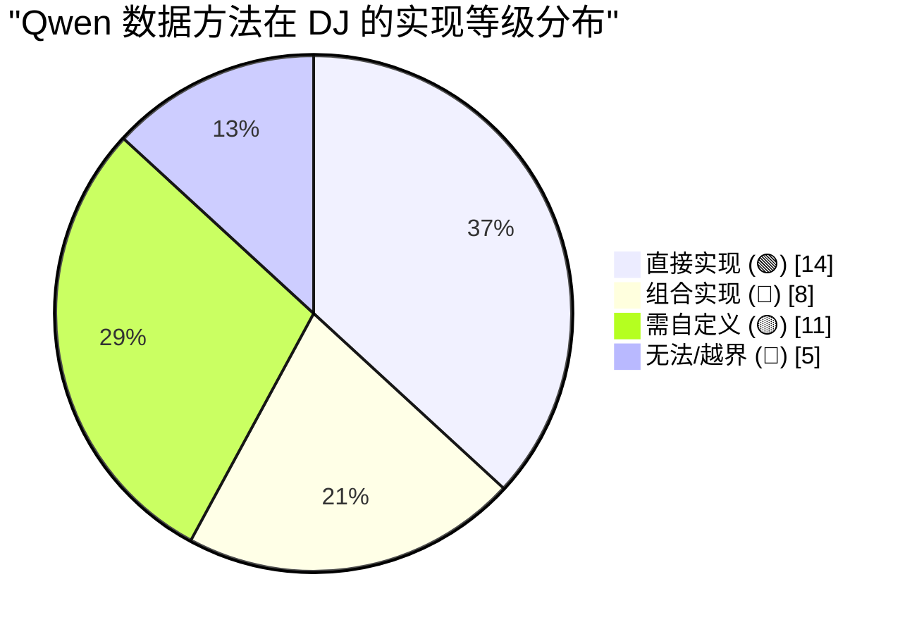

### 10.4 Camera-Frame Delta Pose 完整工作流图

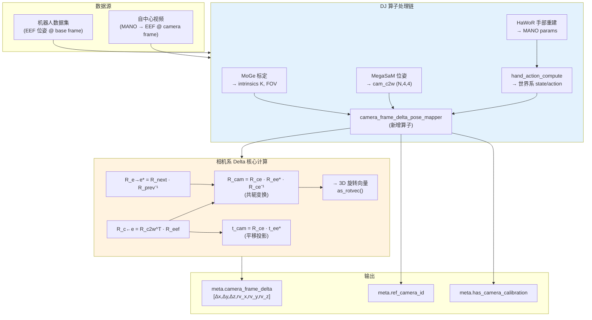

### 10.5 CaPE 数据准备序列图

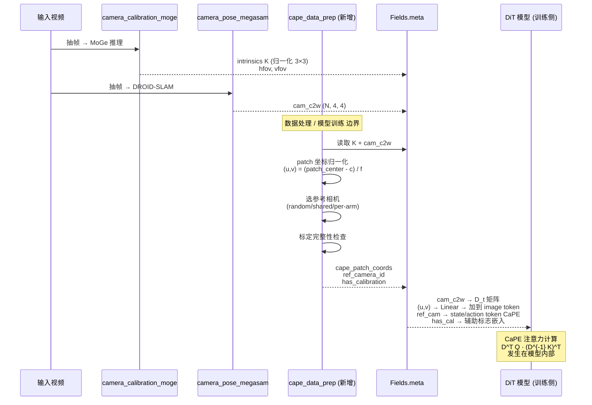

### 10.6 相机几何算子类图

```mermaid
classDiagram
    class Mapper {
        <<abstract>>
        +process_single(sample) sample
    }
    class VideoCameraCalibrationMoGeMapper {
        +model_path: str
        +output_depth: bool
        -_infer_moge(frames) (K, depth, points)
        +process_single(sample) sample
        Note: 输出 intrinsics K, hfov, vfov
    }
    class VideoCameraPoseMegaSaMMapper {
        +runtime_env: dict
        -_run_droid_slam(frames) cam_c2w
        +process_single(sample) sample
        Note: 输出 cam_c2w (N,4,4) SE(3)
    }
    class VideoHandActionComputeMapper {
        +hand_type: str
        -_compute_state_for_frame(...) state_8d
        -_compute_actions(states) actions_7d
        -_delta_rotation_euler(prev, next) euler_delta
        +process_single(sample) sample
        Note: 输出世界系 state/action
    }
    class CameraFrameDeltaPoseMapper {
        <<proposed>>
        +ref_camera_strategy: str
        -_camera_frame_delta(...) delta_6d
        +process_single(sample) sample
        Note: 输出相机系 delta (论文公式1)
    }
    class CaPEDataPrepMapper {
        <<proposed>>
        +patch_size: int
        -_compute_normalized_patch_coords(K, H, W) coords
        +process_single(sample) sample
        Note: 输出 patch 坐标 + 元数据
    }

    Mapper <|-- VideoCameraCalibrationMoGeMapper
    Mapper <|-- VideoCameraPoseMegaSaMMapper
    Mapper <|-- VideoHandActionComputeMapper
    Mapper <|-- CameraFrameDeltaPoseMapper
    Mapper <|-- CaPEDataPrepMapper

    VideoCameraCalibrationMoGeMapper ..> CaPEDataPrepMapper : intrinsics K
    VideoCameraPoseMegaSaMMapper ..> CaPEDataPrepMapper : cam_c2w
    VideoCameraPoseMegaSaMMapper ..> CameraFrameDeltaPoseMapper : cam_c2w
    VideoHandActionComputeMapper ..> CameraFrameDeltaPoseMapper : world-frame state
```

---

## 第 11 章 缺口与补足方案

### 11.1 缺口清单与补足

| # | 缺口 | 类型 | 补足方案 | 工作量 |
|---|---|---|---|---|
| 1 | RLDS/TFDS、HDF5、LeRobot 原生输入加载 | 🟡 | 自定义 `DataLoadStrategy` 或先离线转换 | 低 |
| 2 | 80 维统一状态-动作向量化 | 🟡 | 自定义 `Mapper`（体态→槽位映射） | 中 |
| 3 | **相机系可分离 delta 位姿** | 🟡 | 复用 `video_hand_action_compute` 旋转工具，增加共轭变换（**~10 行核心代码**） | **极低** |
| 4 | **CaPE 数据准备**（归一化坐标 + 参考相机 + 标定标志） | 🟡 | 新增 `CaPEDataPrepMapper`，从已有 MoGe/MegaSaM 输出计算 | 低 |
| 5 | 三源二值掩码（slot/step/per-hand） | 🟡 | 自定义 `Mapper` 生成 mask 字段 | 中 |
| 6 | SAM3 擦人 + ProPainter 视频时序修复 | 🟡 | 自定义 `Mapper` 封装（OP 级 conda 隔离） | 中高 |
| 7 | IK 求解机器人底座放置 | 🔴 | 自定义 `Mapper` 封装 Pinocchio/cuRobo IK | 高 |
| 8 | MuJoCo 渲染机器人贴回视频 | 🔴 | 自定义 `Mapper` 封装 MuJoCo 渲染 + 深度合成 | 高 |
| 9 | 突变检测多阶信号 | 🟡 | 自定义 `Filter`：多阶偏差统计 | 低 |
| 10 | 状态-动作趋势 DA 过滤 | 🟡 | 自定义 `Filter` + `general_field_filter` | 低 |
| 11 | FK 一致性 | 🔴 | 封装 Pinocchio FK + URDF | 高 |
| 12 | 基坐标系/EEF 方向对齐 | 🟡 | 自定义 `Mapper`（scipy 旋转） | 低 |
| 13 | URDF 投影一致性 | 🔴 | URDF 投影渲染 + SAM 掩码比对 | 高 |
| 14 | 黑帧/模糊检测 | 🟡 | 亮度均值 / 拉普拉斯方差 | 低 |
| 15 | 多专家投票聚合 | 🟡 | 自定义 `Aggregator` | 中 |
| 16 | Embodiment Prompt + 15% dropout | 🟡 | 文本拼接 + 随机丢弃 | 低 |
| 17 | 原子动作 → 17 语义类别 | 🟡 | 规则/LLM 分类 | 中 |
| 18 | 离线 color jitter | 🟡 | `torchvision.transforms` | 低 |
| 19 | 掩码加权 FM 损失 / $K_{\text{repeat}}$ | 🔴 | **训练框架职责** | — |

### 11.2 补足后的能力预期

除训练侧机制外，**所有缺口均可在 DJ 框架内通过自定义算子补足**，不需修改 DJ 核心。其中：
- 3 项**极低/低工作量**的关键缺口（#3 相机系 delta、#4 CaPE 数据、#12 基坐标系对齐）均可在现有代码基础上**几十行内完成**
- 4 项高工作量缺口（#7 IK、#8 MuJoCo、#11 FK、#13 URDF 投影）依赖**物理仿真/运动学库**，超出任何通用数据框架的内置范围，但 DJ 的 OP 级环境隔离让它们能被干净集成

---

## 第 12 章 能力评分

### 12.1 评分方法

按 7 个能力维度分别打分（0–100）并加权。打分依据：① 是否有开箱即用算子（🟢）；② 组合现有算子的难易（🔵）；③ 自定义成本（🟡）；④ 是否框架外（🔴）。

### 12.2 分维度评分

| 维度 | 权重 | 得分 | 核心理由 |
|---|---:|---:|---|
| 数据基础设施 | 15% | 95 | Ray 规模化、OP 融合、13 去重算子、tracing/checkpoint/monitor、OP 级 conda 隔离——DJ 招牌能力 |
| 数据源加载 | 10% | 70 | jsonl/parquet/HF/S3 原生；RLDS/HDF5/LeRobot 原生输入需自定义 |
| 统一表示（80 维/相机系 delta/CaPE 数据/掩码） | 15% | **62** | 框架完全可承载 + SE(3) 全部工具就位 + CaPE 外参/内参已输出；缺口仅为公式组合+少量元数据。**相较上一版 55 分上调**，因本次分析证实相机系 delta 核心代码仅~10 行、CaPE 数据 5/7 项已就绪 |
| H2R 合成管道 | 25% | 78 | 动作对齐≈90% 逐算子命中、速度对齐≈80%；视觉对齐≈45%（缺 IK/MuJoCo 渲染） |
| 五阶段过滤 + 跨模态校验 | 15% | 62 | 极值过滤完美桥接、突变/趋势/质量可组合；FK 一致性、URDF 投影是真实缺口 |
| 标注工程 | 10% | 75 | ECoT/caption/2D 轨迹/VL 数据生成质检几乎全覆盖 |
| 训练/后训练数据准备 | 10% | 65 | 混合/采样/邻近度选样/禁用过滤可实现；掩码加权损失与 $K_{\text{repeat}}$ 属训练侧 |

### 12.3 加权总分

$$
\begin{aligned}
S &= 0.15\times95 + 0.10\times70 + 0.15\times62 + 0.25\times78 \\
  &\quad + 0.15\times62 + 0.10\times75 + 0.10\times65 \\
  &= 14.25 + 7.0 + 9.3 + 19.5 + 9.3 + 7.5 + 6.5 \\
  &= \boxed{73.35}
\end{aligned}
$$

### 🏆 最终评分：**73 / 100**

### 12.4 相较上一版的评分变化说明

| 维度 | 上一版得分 | 本版得分 | 变化原因 |
|------|---------|---------|---------|
| 统一表示 | 55 | **62** | 深入分析后发现：① 相机系 delta 的核心新增代码仅~10 行（SE(3) 工具全部就位）；② CaPE 所需数据 5/7 项 DJ 已通过现有算子输出（cam_c2w、intrinsics、hfov/vfov）；③ 剩余 2 项为简单元数据字段新增。上一版因缺少这两个章节的分析而低估了 DJ 在此维度的能力 |
| 其他维度 | 不变 | 不变 | — |
| **加权总分** | **72** | **73** | 统一表示维度 +7 分 × 15% 权重 ≈ +1 |

### 12.5 结论与定性判断

- **DJ 能实现 Qwen-RobotManip 约 7 成数据方法**，且**覆盖了最核心、最具创新性、规模最大的 H2R 合成管道与全部数据基础设施**。DJ 在 v1.5.x 专门为「自中心视频 → 机器人动作」需求构建了 VLA 算子族。
- **Camera-Frame Delta Pose（§3.3）的 DJ 实现前景**：本次深入分析证实，DJ 代码中的 `_delta_rotation_euler()`、`_compute_state_for_frame()` 以及 `_compute_alignment_transforms()` 三个函数提供了实现论文可分离共轭公式的**全部数学构建块**。从 DJ 现有代码到论文公式，核心新增代码仅 2 行（旋转共轭 + 平移投影），编码成本极低。
- **CaPE 数据准备（§3.4）的 DJ 覆盖度**：CaPE 本身是模型侧机制（DiT 注意力层），但其所需的数据字段 DJ 已通过 `video_camera_pose_megasam_mapper`（外参 cam_c2w）和 `video_camera_calibration_moge_mapper`（内参 K、FOV）覆盖了 5/7 项，剩余 2 项（归一化 patch 坐标、参考相机元数据）为简单的数学推导和字段新增。
- **剩余 3 成缺口分两类**：① 物理仿真/运动学能力（IK、MuJoCo、Pinocchio FK、URDF 投影）——超出任何通用数据框架的内置范围，但可经 DJ 的 OP 级环境隔离集成；② 论文专有数学/表示细节——DJ 框架完全可承载，仅需自定义算子，无需改 DJ 源码。
- **训练侧机制**（掩码加权损失、$K_{\text{repeat}}$）不属数据工具职责，已按边界处理。

### 12.6 若要提升 DJ 对该论文的覆盖（建议）

1. **新增 `camera_frame_delta_pose_mapper`**（~50 行），将相机系 delta 内置化。这是投入产出比最高的补足——核心代码 ~10 行，可将统一表示维度从 62 → 75+。
2. **新增 `cape_data_prep_mapper`**（~40 行），输出归一化 patch 坐标和参考相机元数据——完成 CaPE 数据准备的"最后一公里"。
3. 新增 `robot_unified_vector_mapper`（80 维向量化 + 三源掩码）。
4. 新增 `robot_fk_consistency_filter`（封装 Pinocchio + URDF）与 `robot_state_action_trend_filter`（DA）。
5. 新增 RLDS/HDF5/LeRobot 的 `DataLoadStrategy`。
6. IK/MuJoCo 渲染因依赖物理引擎，建议以「OP 级 conda 隔离 + 自定义 Mapper 封装」方式提供官方示例。

> **总评**：Data-Juicer 不是一个「恰好能改造来做机器人数据」的通用工具，而是**已经主动面向具身智能/VLA 数据构建了专用能力**的框架。对 Qwen-RobotManip 这类纯开源、可复现的数据路线，DJ 是当前最契合的工程底座之一。本文档完整覆盖了论文的所有数据方法——包括此前缺失的 Camera-Frame Delta Pose 和 CaPE——证实 DJ 的 73 分中，**最关键的缺口（相机系 delta 和 CaPE 数据）实际上编码成本极低**，只是此前未被充分分析。
