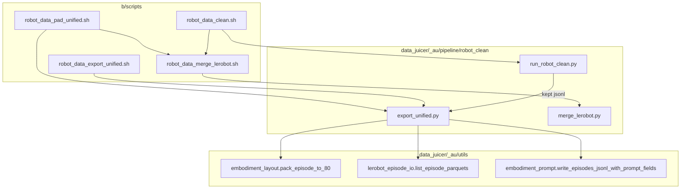
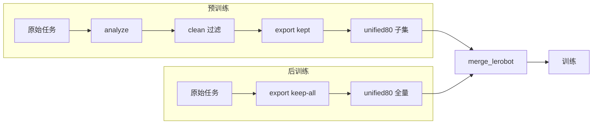
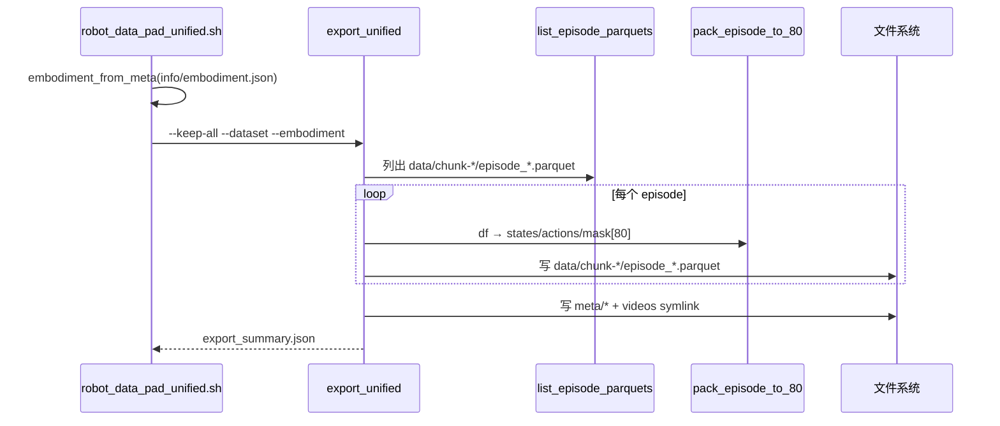

# 后训练 Pad-Only Unified80：设计说明

> **文档目的**：说明「后训练只做 80 维 padding、不做任何数据清洗」的管线设计、与预训练清洗导出的关系、静态/动态架构与使用方法。
>
> **对应实现**：
>
> - Python：`data_juicer/_au/pipeline/robot_clean/export_unified.py`（`--keep-all` / `export_all_unified_parquets`）
> - 批处理：`b/scripts/robot_data_pad_unified.sh`
> - 验收：`tests_au/pipeline/robot_clean/accept_pad_unified.{sh,py}`
>
> **前置阅读**：[`data_impl_unified80.md`](data_impl_unified80.md)（80 维布局与 `pack_episode_to_80`）；[`b/scripts/ROBOT_DATA_SCRIPTS_USAGE.md`](../../scripts/ROBOT_DATA_SCRIPTS_USAGE.md)。

---

## 目录

- [1. 背景与问题](#1-背景与问题)
- [2. 设计目标与原则](#2-设计目标与原则)
- [3. 方案对比与消融](#3-方案对比与消融)
- [4. 静态架构](#4-静态架构)
- [5. 动态架构与数据流](#5-动态架构与数据流)
- [6. 关键逻辑与代码解读](#6-关键逻辑与代码解读)
- [7. 使用方法](#7-使用方法)
- [8. 验收](#8-验收)
- [9. 边界与后续](#9-边界与后续)
- [10. 文件索引](#10-文件索引)

---

## 1. 背景与问题

### 1.1 纵向：预训练清洗 → 后训练复用布局

预训练阶段需要质量门控（Stage1 突变 / Stage2 对齐 / Stage3 极值 / Check3 视频质量），再把**幸存 episode** 映射到统一 80 维：

```text
原始任务 → analyze → clean(+filter) → unified80（子集）→ merge → 预训练
```

后训练（SFT / 下游微调）通常希望：

1. **同一套 80 维槽位与 `action_dim_mask`**，以便与预训练权重、loss mask 对齐；
2. **不删 episode**——标注或下游筛选往往在别处完成，清洗阈值不应二次过滤；
3. **流程更轻**：不必再跑 `dj-process` 与 Check3。

因此需要一条与 `robot_data_clean.sh` **并列**、而不是「关掉所有 stage」的专用管线。

### 1.2 横向：三类导出路径

| 路径 | Episode 集合 | 是否清洗 | 典型用途 |
|------|-------------|---------|---------|
| `run_robot_clean` + `--export-unified-parquet` | 清洗后保留 | 是 | 预训练一站式 |
| `export_unified --cleaned` | `cleaned.jsonl` 中的行 | 已在上游清洗 | 补导出 / 重建 |
| **`export_unified --keep-all`（本文）** | 源任务全部 parquet | **否** | **后训练 pad-only** |

三者共用 `pack_episode_to_80` 与 meta/videos 写出逻辑；差异仅在「哪些 episode 进入导出列表」。

### 1.3 实践对象

- 真实验收数据：`/mnt/r/DATA/tst/Galaxea-Open-World-Dataset/Connect_Router_Cables_20250625_002/`（`robot_type=r1lite` → `galaxea_r1_lite`）
- 批处理默认根目录与 clean 脚本同族（可通过 `DATASET_ROOT` / `OUT_ROOT` 覆盖）

---

## 2. 设计目标与原则

1. **扩展大于修改**：不改清洗语义；在 `export_unified` 上增加 keep-all 模式与独立 shell。
2. **布局一致**：输出仍是 LeRobot v2.1：`observation.state[80]` / `action[80]` / `action_dim_mask[80]` + `meta/` + `videos` symlink。
3. **零过滤**：不调用 Stage1/2/3/5、不调用 Check3、不写 `cleaned.jsonl`。
4. **企业化引入**：`python -m data_juicer._au.pipeline.robot_clean.export_unified`，包路径而非单文件 hack。
5. **下游可复用**：产出目录可直接喂给 `robot_data_merge_lerobot.sh`。

---

## 3. 方案对比与消融

### 3.1 为何不「clean 全关 stage」

```bash
bash robot_data_clean.sh --no-stage1 --no-stage2 --no-stage3 --no-stage5 --no-check3
```

| 点 | 效果 |
|----|------|
| 功能正确性 | 基本可用（recipe 只剩 loader + unified mapper） |
| 开销 | 仍走 `dj-process`、写 pointer/recipe/`cleaned.jsonl`，再二次 pack |
| 语义 | 脚本名与文档仍叫「清洗」，易误用阈值 |
| 维护 | 默认仍读 `analysis.json` 建议旗标，后训练场景多余 |

**结论**：作为应急可跑，不作为正式后训练入口。

### 3.2 为何不直接用 `tests_au/.../export_unified_parquets.py`

测试脚本已实现「全量 pad」，但：

- 位于 `tests_au`，非生产入口；
- 批量时 embodiment 多为单一覆盖，缺少 `b/scripts` 里按任务解析布局的逻辑。

正式路径将其能力提升到 `_au/pipeline/robot_clean/export_unified.py`，验收脚本仍放在 `tests_au/`。

### 3.3 消融：pad-only 相对清洗导出「少了什么」

| 组件 | 预训练 clean 导出 | 后训练 pad-only | 是否必需（后训练） |
|------|------------------|----------------|-------------------|
| `pack_episode_to_80` | ✓ | ✓ | **是**（布局对齐） |
| Stage1/2/3 过滤 | ✓ | ✗ | 否（避免二次删数） |
| Check3 视频门控 | ✓ | ✗ | 否（通常已有人工/任务筛选） |
| Stage5 identity | ✓（默认） | ✗ | 否（identity 无实质变换） |
| `cleaned.jsonl` 门控 | ✓ | ✗ | 否 |
| `action_dim_mask` | ✓ | ✓ | **是**（`loss × mask`） |
| videos symlink | ✓ | ✓ | 视训练是否读视频 |

实践上，后训练质量问题应在「任务选择 / 标注 / 人工抽检」解决，而不是复用预训练自动阈值。

---

## 4. 静态架构

### 4.1 组件图



### 4.2 职责划分

| 组件 | 职责 |
|------|------|
| `robot_data_pad_unified.sh` | 遍历任务、解析 embodiment、调用 `--keep-all` |
| `export_all_unified_parquets` | 列出全部 episode parquet → pack → 写 meta/videos |
| `export_kept_unified_parquets` | 从 `cleaned.jsonl` 取 `parquet_path` 列表（预训练） |
| `_export_parquet_paths` | 两种模式共享的写出核心 |
| `pack_episode_to_80` | 异构 state/action → 固定 80 维 + mask |

### 4.3 输出目录契约

```text
<OUT_ROOT>/<task>/
├── data/chunk-XXX/episode_YYYYYY.parquet
├── meta/
│   ├── info.json              # unified_export_mode=keep_all, unified_dim=80
│   ├── episodes.jsonl
│   ├── tasks.jsonl
│   └── episodes_stats.jsonl
└── videos -> <源任务 videos>
```

`info.json` 增加字段：

- `unified_export_mode`: `"keep_all"` | `"cleaned_kept"`
- `unified_embodiment` / `unified_dim`（与既有一致）

---

## 5. 动态架构与数据流

### 5.1 预训练 vs 后训练



### 5.2 Pad-only 序列



### 5.3 单帧数据流（与清洗导出相同）

```text
源 parquet 行
  → 按 embodiment YAML 抽取关节 / EE / 共享维
  → 填入 80 维槽位（未用维为 0）
  → action_dim_mask：可监督动作维为 1，纯 state 维为 0
  → 写出 observation.state / action / action_dim_mask
```

无 backward / 无权重更新；这是纯数据整形管线。

---

## 6. 关键逻辑与代码解读

### 6.1 模式分流

CLI 用互斥组：`--cleaned` **或** `--keep-all`。

- `--cleaned` → `export_kept_unified_parquets`（读 JSONL 的 `parquet_path`）
- `--keep-all` → `export_all_unified_parquets`（`list_episode_parquets`）

两者汇合到 `_export_parquet_paths`，保证 parquet schema、meta 与 videos 行为一致。

### 6.2 为何不依赖 `cleaned.jsonl`

`export_kept_unified_parquets` 历史上用 cleaned JSONL 做「保留集合」。后训练若强行构造全量 pointer 再伪装成 cleaned，会：

1. 多一次 I/O；
2. 语义上暗示「这些是清洗后幸存」，与事实不符。

因此 `keep_all` 直接从源任务枚举 parquet，并在 `info.json` 标明 `unified_export_mode=keep_all`。

### 6.3 输出路径解析

与既有逻辑一致：

- `--output .../<task_name>` → 文件写在该目录下；
- `--output .../parent` → 写到 `parent/<task_name>/`。

批处理脚本使用前者（`OUT/$task`），验收脚本可传 parent。

---

## 7. 使用方法

### 7.1 批处理（推荐）

```bash
cd /path/to/data-juicer/b/scripts

DATASET_ROOT=/path/to/tasks \
OUT_ROOT=/path/to/process_pad_unified80 \
  bash robot_data_pad_unified.sh

# smoke：每任务最多 2 个 episode
MAX_EPS=2 bash robot_data_pad_unified.sh
```

环境变量：

| 变量 | 默认 | 说明 |
|------|------|------|
| `DATASET_ROOT` | GR00T sim `press` | 原始任务根目录 |
| `OUT_ROOT` | `.../process_pad_unified80` | pad 输出根目录 |
| `DJ_VENV` | `<repo>/.venv` | Python 虚拟环境 |
| `MAX_EPS` | 空 | 非空时传给 `--max-episodes` |

### 7.2 单任务 Python

```bash
.venv/bin/python -m data_juicer._au.pipeline.robot_clean.export_unified \
  --keep-all \
  --dataset /mnt/r/DATA/tst/Galaxea-Open-World-Dataset/Connect_Router_Cables_20250625_002 \
  --output /tmp/pad_unified80/Connect_Router_Cables_20250625_002 \
  --embodiment galaxea_r1_lite
```

### 7.3 合并

```bash
ROOT_SIM=/path/to/process_pad_unified80 \
ROOT_GLX=/path/to/other_pad_unified80 \
OUT_ROOT=/path/to/merged_posttrain \
  bash robot_data_merge_lerobot.sh
```

---

## 8. 验收

```bash
bash tests_au/pipeline/robot_clean/accept_pad_unified.sh
```

默认：

- `SRC=/mnt/r/DATA/tst/Galaxea-Open-World-Dataset/Connect_Router_Cables_20250625_002`
- `MAX_EPS=2`（快速）
- 检查：`unified_export_mode=keep_all`、维数 80、episode 数、meta、videos、parquet 列维

全量验收可设 `MAX_EPS` 为空并改 `accept_pad_unified.py` 的 `--expect-episodes` 逻辑（或扩展 shell 在未设置时省略 max）。

---

## 9. 边界与后续

1. **无布局的任务仍会 skip**（与 clean/export 一致）；需在 `configs/embodiments/` 补 YAML。
2. **不做数值修正**：源数据坏值会原样进入 80 维；后训练若需要清洗，应显式走 `robot_data_clean.sh`。
3. **视频仅 symlink**：搬家到其他机器时需 `merge` 时 `LINK_MODE=copy`，或自行拷贝 videos。
4. **可选增强**：多进程 pack（参考 tests_au 的 ProcessPool）、以及把 `embodiment_from_meta` 抽成共享 shell/python 工具以避免三处脚本重复。

---

## 10. 文件索引

| 路径 | 说明 |
|------|------|
| `data_juicer/_au/pipeline/robot_clean/export_unified.py` | `--keep-all` / `export_all_unified_parquets` |
| `b/scripts/robot_data_pad_unified.sh` | 批量 pad-only |
| `b/scripts/ROBOT_DATA_SCRIPTS_USAGE.md` | 使用说明（含后训练流程） |
| `tests_au/pipeline/robot_clean/accept_pad_unified.sh` | 验收入口 |
| `tests_au/pipeline/robot_clean/accept_pad_unified.py` | 验收断言 |
| `data_juicer/_au/utils/embodiment_layout.py` | `pack_episode_to_80` / `UNIFIED_DIM` |
| `b/d/QwenRobotmanip/data_impl_unified80.md` | 80 维布局总设计 |
