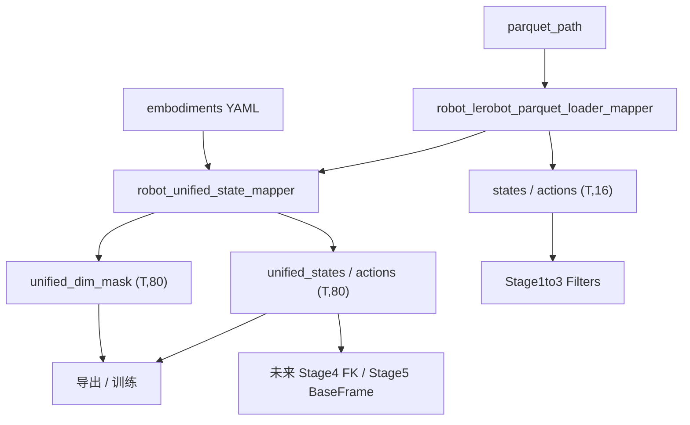
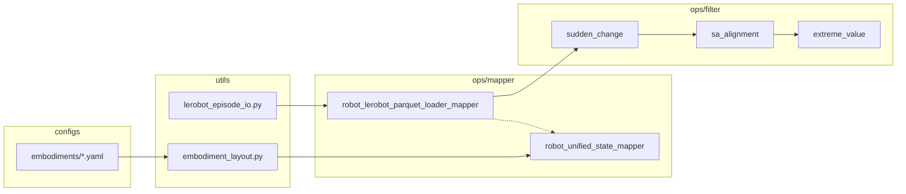
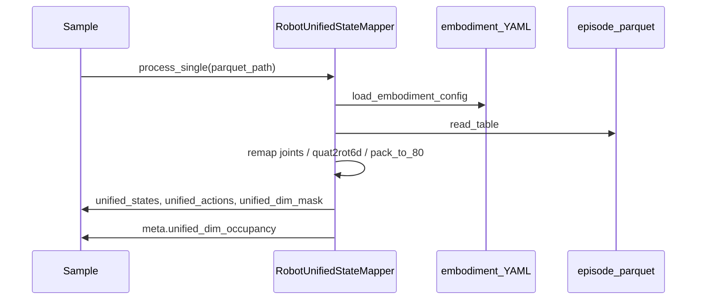
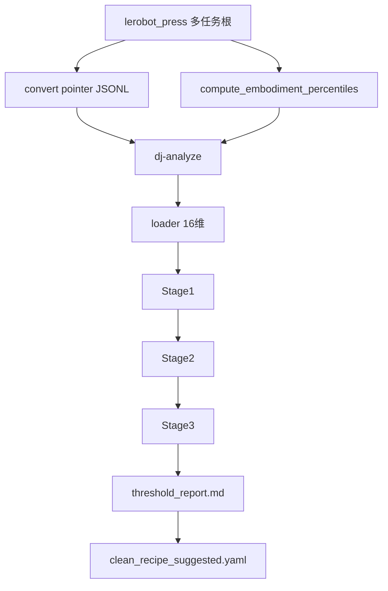

# 80 维统一表征与 Galaxea 清洗管线：设计与使用指南

> **文档目的**：说明本仓库扩展包 `data_juicer/_au/` 中 **80 维跨具身统一 state-action 表征**、**逐维占用掩码**、**按机械臂 YAML 关节映射**，以及 **Galaxea / lerobot_press（R1 Lite）Stage 1–3 分析清洗** 的设计动机、静态/动态架构、关键逻辑与可复现使用方法。
>
> **对应论文概念**：Qwen-RobotManip「Alignment Unlocks Scale」中的 *Unified Representation*（80 维规范化向量 + per-dimension mask）[Yuan et al., 2026]；详见 [`note_data.md`](note_data.md) §3、[`note.md`](note.md) §4.1。
>
> **代码落点**：扩展优于修改——实现均在 `data_juicer/_au/`，验收在 `tests_au/`。

---

## 目录

- [1. 背景与问题](#1-背景与问题)
- [2. 设计目标与原则](#2-设计目标与原则)
- [3. 80 维布局规范](#3-80-维布局规范)
- [4. 标准 7 关节语义槽](#4-标准-7-关节语义槽)
- [5. Embodiment 参数文件](#5-embodiment-参数文件)
- [6. 逐维掩码](#6-逐维掩码)
- [7. 双轨架构（16 维清洗 + 80 维统一）](#7-双轨架构16-维清洗--80-维统一)
- [8. 静态架构](#8-静态架构)
- [9. 动态架构与数据流](#9-动态架构与数据流)
- [10. 关键逻辑与代码解读](#10-关键逻辑与代码解读)
- [11. 使用方法](#11-使用方法)
- [12. 扩展新机械臂](#12-扩展新机械臂)
- [13. 现状边界与后续](#13-现状边界与后续)
- [14. 文件索引](#14-文件索引)

---

## 1. 背景与问题

### 1.1 纵向：为何需要统一表征

VLA 训练语料天然异构：不同机器人自由度不同、关节命名/顺序不同、末端姿态旋转表示不同（四元数 / 欧拉 / 6D）、底盘与躯干是否入向量也不同。论文的洞见是：

> 没有跨具身统一公式时，扩大数据量会放大冲突而非协同 [Yuan et al., 2026]。

统一 80 维向量将异构观测压到固定槽位（左臂 29 + 右臂 29 + 共享 22），再用二值掩码屏蔽未使用维，使 loss 与过滤在**同一语义坐标**上操作。

在此框架上后续演化出：相机系 delta action、Stage 4 FK 一致性、Stage 5 基座坐标系对齐等——它们都以「固定切片可寻址」为前提。本实现先落地 **组装与掩码**，为 Stage 4/5 留稳槽位。

### 1.2 横向：与「只做 16 维打包」的对比

| 方案 | 内容 | 优点 | 缺点 | 适用 |
|------|------|------|------|------|
| Galaxea 16 维 `pack_decomposed_to_16` | 左右臂关节 + 夹爪插空 | 已对接 Stage 1–3；轻量 | 无 EE / 手 / 共享全身；关节槽非标准语义序 | **质量清洗** |
| 论文 80 维统一向量 | 2×29 + 22 + mask | 跨具身、可训练、槽位稳定 | 需 embodiment 配置与坐标变换 | **统一导出 / 训练 / Stage 4–5** |

本仓库采用 **双轨**：清洗继续吃 16 维；统一表征另写 `unified_*` 字段，避免一次性打断已调通的阈值。

### 1.3 实践对象

- 机器：**Galaxea R1 Lite**（6-DoF 双臂 + 夹爪 + EE pose + chassis + torso）
- 语料示例：`/mnt/r/DATA/Galaxea-Open-World-Dataset/lerobot_press`（已确认即 R1 Lite；约 32 任务 / 2768 episode）

---

## 2. 设计目标与原则

1. **扩展大于修改**：新逻辑进 `_au/`，不改核心 `pack_decomposed_to_16`。
2. **参数外置**：关节语义映射只写在 `configs/embodiments/*.yaml`，代码不硬编码「维 0 = shoulder_pitch」一类的机型特例。
3. **掩码必须落盘**：与 `(T,80)` 向量同级写出，供 `dj-process` 导出与训练 `loss × mask`。
4. **企业化引入**：YAML 用 `custom_operator_paths: ['data_juicer/_au']` 包引入，不用单文件脚本式注册。
5. **挂载点清晰**：统一 Mapper 挂在 parquet loader **之后**、质量 Filter **旁路并行**（不覆盖 16 维键）。

---

## 3. 80 维布局规范

### 3.1 总结构

\[
\mathbf{u} = \big[\;
\underbrace{\mathbf{u}_{\mathrm{L}}}_{\mathbb{R}^{29}} \;\Vert\;
\underbrace{\mathbf{u}_{\mathrm{R}}}_{\mathbb{R}^{29}} \;\Vert\;
\underbrace{\mathbf{u}_{\mathrm{shared}}}_{\mathbb{R}^{22}}
\;\big] \in \mathbb{R}^{80}
\]

| 区间（0-based） | 长度 | 内容 |
|-----------------|------|------|
| `[0:29]` | 29 | 左臂 / 臂1 |
| `[29:58]` | 29 | 右臂 / 臂2 |
| `[58:80]` | 22 | 共享预留（底盘、躯干等） |

### 3.2 每臂 29 维语义组

| 组内偏移 | 维度 | 内容 |
|----------|------|------|
| `0:7` | 7 | Joint positions（标准语义序，见 §4） |
| `7:16` | 9 | End-effector：xyz(3) + rot6d(6) |
| `16` | 1 | Gripper |
| `17:29` | 12 | Dexterous hand（无则置 0 + mask 0） |

常量见 `data_juicer/_au/utils/embodiment_layout.py`：`LEFT_BASE=0`，`RIGHT_BASE=29`，`SHARED_BASE=58`，`OFF_EEF=7`，`OFF_GRIPPER=16`，`OFF_HAND=17`。

### 3.3 旋转：四元数 → 6D

对 `quat_wxyz` \((w,x,y,z)\)：先归一化，再转 \(\mathbf{R}\in\mathrm{SO}(3)\)，取前两列按周式 6D 排列：

\[
\mathrm{rot6d}(\mathbf{R}) = (r_{11}, r_{21}, r_{31},\, r_{12}, r_{22}, r_{32})
\]

这样每臂 EE 恰好占 9 维，且旋转表示在 \(\theta=\pi\) 附近比欧拉角更连续 [Zhou et al.]。

### 3.4 State vs Action（首版约定）

| | State | Action（首版） |
|--|-------|----------------|
| 关节 / 夹爪 | 绝对量，按 `joint_map` 填入 | 同源语义映射 |
| EE | 绝对 xyz + rot6d（自 parquet `*_ee_pose`） | **暂缓**（相机系 delta 第二期）；槽位 mask 仍为 1，值可为 0 |
| Shared | chassis / torso 绝对量 | 可选 velocities 按 `action_source_indices` 填入 |

---

## 4. 标准 7 关节语义槽

跨具身对齐的**唯一**关节语义顺序（与硬件 URL 关节编号解耦）：

| 标准槽 | 语义名 |
|--------|--------|
| 0 | `shoulder_pitch` |
| 1 | `shoulder_roll` |
| 2 | `shoulder_yaw` |
| 3 | `elbow_pitch` |
| 4 | `forearm_roll` |
| 5 | `wrist_pitch` |
| 6 | `wrist_roll` |

左臂落在 `unified[0:7]`，右臂 `unified[29:36]`。  
源向量下标 → 标准槽 **只由 YAML `joint_map` 决定**；`null` 表示该槽不存在 → 值 0 且 mask 0。

### 4.1 Galaxea R1 Lite 映射（实例）

R1 Lite 仅 6 个物理关节 `j1..j6`（源下标 `0..5`），且 **无 shoulder_roll**：

| 标准槽 | 语义 | R1 Lite |
|--------|------|---------|
| 0 | shoulder_pitch | j2（源 `1`） |
| 1 | shoulder_roll | **pad** |
| 2 | shoulder_yaw | j1（源 `0`） |
| 3 | elbow_pitch | j3（源 `2`） |
| 4 | forearm_roll | j5（源 `4`） |
| 5 | wrist_pitch | j4（源 `3`） |
| 6 | wrist_roll | j6（源 `5`） |

配置文件：[`data_juicer/_au/configs/embodiments/galaxea_r1_lite.yaml`](../../../data_juicer/_au/configs/embodiments/galaxea_r1_lite.yaml)。

对 R1 Lite，典型占用约 **42 / 80** 维（双手 pad + shoulder_roll pad + 共享未用槽；chassis 占 6 维共享槽，torso 占 4 维）。

---

## 5. Embodiment 参数文件

### 5.1 位置与加载

- 目录：`data_juicer/_au/configs/embodiments/`
- 加载：`load_embodiment_config("galaxea_r1_lite")` 或绝对路径
- Mapper 参数：`embodiment` 或 `embodiment_config`

### 5.2 Schema 要点

```yaml
shared:
  chassis:
    # state 6D = position(3) + feedback velocity(3)
    state_columns:
      - observation.state.chassis
      - observation.state.chassis.velocities
    # action: full twist 6D (linear xyz + angular xyz) in Galaxea LeRobot meta
    action_column: action.chassis.velocities
    action_source_indices: [0, 1, 2, 3, 4, 5]
    slots: [0, 1, 2, 3, 4, 5]
  torso:
    ...
    slots: [6, 7, 8, 9]
```

左右臂可各写一份 `joint_map`（安装对称差异时），也可结构镜像复制。

---

## 6. 逐维掩码

### 6.1 语义

\[
\mathbf{m}_{t,d}\in\{0,1\},\quad d=0,\ldots,79
\]

- `1`：该维对本 embodiment **有语义占用**（即使某帧/某侧值为 0，如 action EE 暂空）
- `0`：padding / 未配置（如灵巧手、shoulder_roll pad）

首版 state/action **共用同一占用 mask**（由 YAML 静态度量 `build_dim_mask` 再 broadcast 到 `(T,80)`）。

### 6.2 必须落盘的字段

| 样本键 | 形状 | 说明 |
|--------|------|------|
| `unified_states` | `(T, 80)` | 统一状态 |
| `unified_actions` | `(T, 80)` | 统一动作 |
| `unified_dim_mask` | `(T, 80)` | 占用掩码（顶层，进导出文件） |

可选 `__dj__meta__.unified_dim_occupancy`：紧凑 `(80,)` 审计 JSON（`num_active`、config 路径等），**不替代**顶层 mask。

---

## 7. 双轨架构（16 维清洗 + 80 维统一）

历史上 Galaxea Stage 1–3（突变 / SA 对齐 / 极值）已在 **16 维**布局上完成阈值与验收：

```
[0:7] left joints(+pad) | [7] left grip | [8:15] right joints | [15] right grip
```

若把 loader 直接改成 80 维，会打坏 `exempt_dims`、`shared_dims`、percentile JSON。因此：



**挂载点**：`robot_unified_state_mapper` 在 loader 之后；Stage 1–3 仍读 `states`/`actions`。

---

## 8. 静态架构

### 8.1 组件图



### 8.2 类与职责

| 符号 | 类型 | 职责 |
|------|------|------|
| `RobotLeRobotParquetLoaderMapper` | Mapper + Tagging | parquet → 16 维 `states`/`actions` |
| `RobotUnifiedStateMapper` | Mapper + Tagging | parquet + YAML → 80 维向量 + mask |
| `load_embodiment_config` / `remap_joints_to_canonical` / `pack_episode_to_80` / `build_dim_mask` | 纯函数工具 | 配置、重映射、打包、掩码 |
| Stage 1–3 Filters | Filter | 基于 16 维做质量统计/标记 |

注册：`data_juicer/_au/__init__.py` 显式 import；recipe 声明 `custom_operator_paths: ['data_juicer/_au']`。

---

## 9. 动态架构与数据流

### 9.1 单条 episode（统一表征）



### 9.2 lerobot_press 全库分析（清洗阈值）



脚本：`tests_au/ops/filter/accept_analyze_lerobot_press.sh`  
配置：`tests_au/ops/filter/analyze_lerobot_press.yaml`  
输出：`tests_au/ops/filter/outputs/press_analyze/`

---

## 10. 关键逻辑与代码解读

### 10.1 `remap_joints_to_canonical`

伪码：

```
out[:, :] = 0; occ[:] = 0
for i, name in CANONICAL_JOINT_NAMES:
    idx = joint_map[name]
    if idx is null: continue
    out[:, i] = src[:, idx] * sign[i]
    occ[i] = 1
```

「硬件顺序 ≠ 标准语义序」时，仅改 YAML，不改 Python。

### 10.2 `pack_episode_to_80`

1. 从任一配置列推断 \(T\)  
2. 零初始化 `(T,80)` state/action  
3. 按臂填充关节 / EE(state) / gripper / hand  
4. 填充 shared  
5. `build_dim_mask(cfg)` → broadcast 为 `(T,80)`

### 10.3 Mapper 与双可编辑安装陷阱

若本机还有另一处 editable 安装（例如 `/home/physical/SRC/Dta/data-juicer`）且其 `_au` **无 `utils`**，直接 `import data_juicer._au.utils` 会失败。验收脚本与 `convert_lerobot_episodes.py` 已优先把**本仓库根**插入 `sys.path` / `PYTHONPATH`。生产环境建议 `uv pip install -e .` 指向本仓库。

---

## 11. 使用方法

以下命令假定仓库根目录为：

```bash
cd /mnt/r/share/zwy/Projects/data-juicer
export VENV=/mnt/r/VENV/dj   # 或你的含 dj-analyze / dj-process 的环境
```

### 11.1 环境检查

```bash
"$VENV/bin/python" -c "from data_juicer._au.utils.embodiment_layout import UNIFIED_DIM; print(UNIFIED_DIM)"
# 期望输出: 80
```

若报 `No module named 'data_juicer._au.utils'`，请导出：

```bash
export PYTHONPATH=/mnt/r/share/zwy/Projects/data-juicer
```

### 11.2 单元测试（统一表征）

```bash
"$VENV/bin/python" -m pytest tests_au/ops/mapper/test_robot_unified_state_mapper.py -v
```

### 11.3 验收：80 维 + mask 落盘

```bash
bash tests_au/ops/mapper/accept_robot_unified_state_mapper.sh
```

验收项包括：导出含 `unified_states` / `unified_actions` / `unified_dim_mask`；R1 Lite 的 `shoulder_roll`（左维 1 / 右维 30）值为 0 且 mask 为 0；活跃维约 42。

### 11.4 分析清洗：lerobot_press（R1 Lite）

**全库**（pointer → percentile → Stage 1–3 → 阈值报告）：

```bash
bash tests_au/ops/filter/accept_analyze_lerobot_press.sh
```

默认：

| 变量 | 默认值 |
|------|--------|
| `ROOT` | `/mnt/r/DATA/Galaxea-Open-World-Dataset/lerobot_press` |
| `EMBODIMENT` | `galaxea_r1_lite` |
| `VENV` | `/mnt/r/VENV/dj` |
| 输出目录 | `tests_au/ops/filter/outputs/press_analyze/` |

主要产物：

- `lerobot_episodes_ptr.jsonl` — 轻量指针  
- `percentiles.json` — Stage 3 分位  
- `s1_stats.jsonl` / `s2_stats.jsonl` / `s3_stats.jsonl`  
- `threshold_report.md` — 阈值建议  
- `clean_recipe_suggested.yaml` — 建议清洗参数  

一次实测规模：**2768** episode；示例建议（以你本地报告为准）：

```yaml
max_flagged_ratio: 0.5
da_threshold: 0.6
alpha: 0.1
```

可覆盖路径：

```bash
ROOT=/path/to/other_r1_lite_root bash tests_au/ops/filter/accept_analyze_lerobot_press.sh
```

### 11.5 Recipe 片段：loader + 统一 +（可选）Stage 1–3

```yaml
custom_operator_paths:
  - 'data_juicer/_au'

process:
  - robot_lerobot_parquet_loader_mapper:
      parquet_field: 'parquet_path'
      state_key: 'states'
      action_key: 'actions'

  - robot_unified_state_mapper:
      embodiment: 'galaxea_r1_lite'
      state_key: 'unified_states'
      action_key: 'unified_actions'
      mask_key: 'unified_dim_mask'
      skip_if_present: false

  # 质量过滤仍用 16 维
  - robot_sudden_change_filter:
      signal_source: 'top_level'
      top_level_state_key: 'states'
      top_level_action_key: 'actions'
      # ...
```

分析 R1 Lite 清洗阈值时也可直接用已写好的：

```bash
dj-analyze --config tests_au/ops/filter/analyze_lerobot_press.yaml
```

（需先准备好同目录脚本生成的 pointer 与 percentiles，或跑完整 `accept_analyze_lerobot_press.sh`。）

### 11.6 真正执行清洗（删/标坏帧）

分析只做 stats。落地清洗请用 `dj-process`，把 `dataset_path`、`percentile_stats_path` 与阈值改成 `press_analyze` 产物，参考：

- [`accept_qwenrobomanip_filter.yaml`](../../../tests_au/ops/filter/accept_qwenrobomanip_filter.yaml)
- `outputs/press_analyze/clean_recipe_suggested.yaml`

---

## 12. 扩展新机械臂

1. 复制 `galaxea_r1_lite.yaml` → `your_robot.yaml`  
2. 填 `joint_map`（源下标或 `null`）、列名、`eef.rot_repr`、`shared.slots`  
3. Recipe / 命令行：`embodiment: your_robot`  
4. 单测：人为打乱源维序，断言标准槽复原；检查 pad 槽 mask=0  
5. 重新跑 `compute_embodiment_percentiles.py --embodiment your_robot`（若仍走 16 维清洗链路，percentile 侧的 embodiment 字符串需与 Stage 3 配置一致）

---

## 13. 现状边界与后续

| 已完成 | 未完成 / 有意延后 |
|--------|-------------------|
| 80 维打包 + YAML 关节语义映射 | Action EEF 相机系 delta |
| `(T,80)` mask 落盘 | Stage 4 FK Consistency Mapper |
| R1 Lite 配置与验收 | Stage 5 接到 80 维 EE 切片的全链路 recipe |
| lerobot_press Stage 1–3 分析入口 | 过滤器直接消费 80 维（需重映射 dim 配置） |
| 双轨不破坏 16 维清洗 | 训练侧三源 mask 合成（质量 × 占用 × 时序） |

消融直觉（与论文一致、待本数据复现）：统一表征 + mask 是跨具身共训的前置条件；仅堆 16 维关节而不对齐 EE/坐标系，规模收益不稳定。Stage 1–3 阈值对 Galaxea 敏感（`mad_scale`、`da_threshold`），应以 **本语料** `threshold_report` 为准，不宜照搬其它采集域。

---

## 14. 文件索引

| 路径 | 说明 |
|------|------|
| `data_juicer/_au/utils/embodiment_layout.py` | 标准槽、加载 YAML、pack80、mask |
| `data_juicer/_au/utils/lerobot_episode_io.py` | 16 维 Galaxea 打包（清洗用） |
| `data_juicer/_au/configs/embodiments/galaxea_r1_lite.yaml` | R1 Lite 映射 |
| `data_juicer/_au/ops/mapper/robot_unified_state_mapper.py` | 80 维 Mapper |
| `data_juicer/_au/ops/mapper/robot_lerobot_parquet_loader_mapper.py` | 16 维 loader |
| `data_juicer/_au/ops/filter/robot_*_filter.py` | Stage 1–3 |
| `tests_au/ops/mapper/test_robot_unified_state_mapper.py` | 单元测试 |
| `tests_au/ops/mapper/accept_robot_unified_state_mapper.{sh,yaml}` | 统一表征验收 |
| `tests_au/ops/filter/analyze_lerobot_press.yaml` | press 分析 recipe |
| `tests_au/ops/filter/accept_analyze_lerobot_press.sh` | press 一键分析 |
| `tests_au/ops/filter/outputs/press_analyze/` | 分析输出（含阈值报告） |

---

## 附录 A：与论文维度编号对照

论文叙述常用 **1-based** 维号；实现与本文档一律 **0-based**。例如论文「左臂关节 dims 1–7」对应实现 `[0:7]`；「共享区 dims 59–80」对应 `[58:80]`。

## 附录 B：最小心智模型

> **YAML 决定「硬件哪一维长在标准槽上」；Mapper 负责「填满 80 维并写出谁真的在用」；Stage 1–3 继续在 16 维上判断「哪段轨迹脏」。**

三者职责分离，才能在不推翻现有清洗阈值的前提下，把 Galaxea R1 Lite（含 `lerobot_press`）接进 Qwen-RobotManip 式的统一训练坐标。
