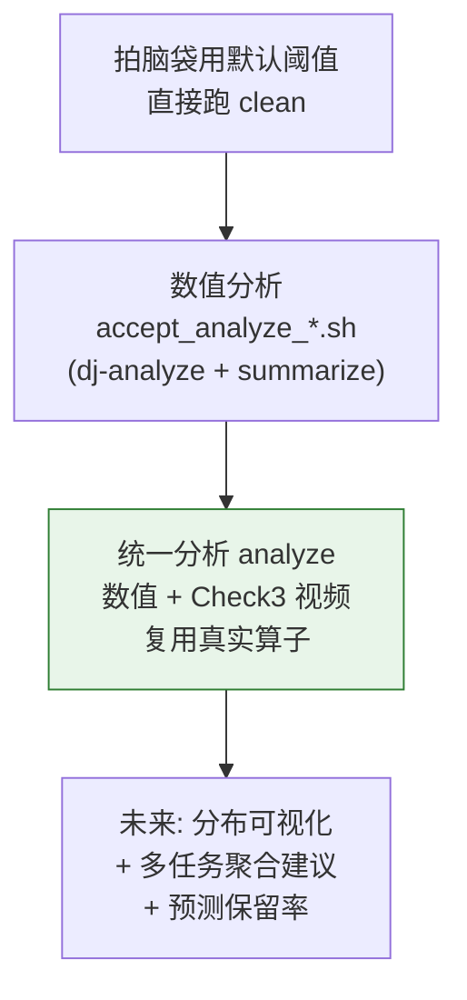
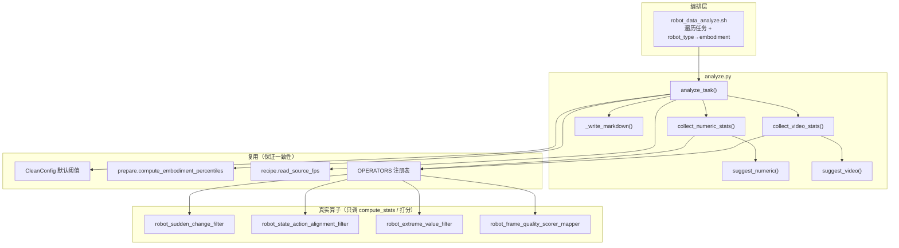
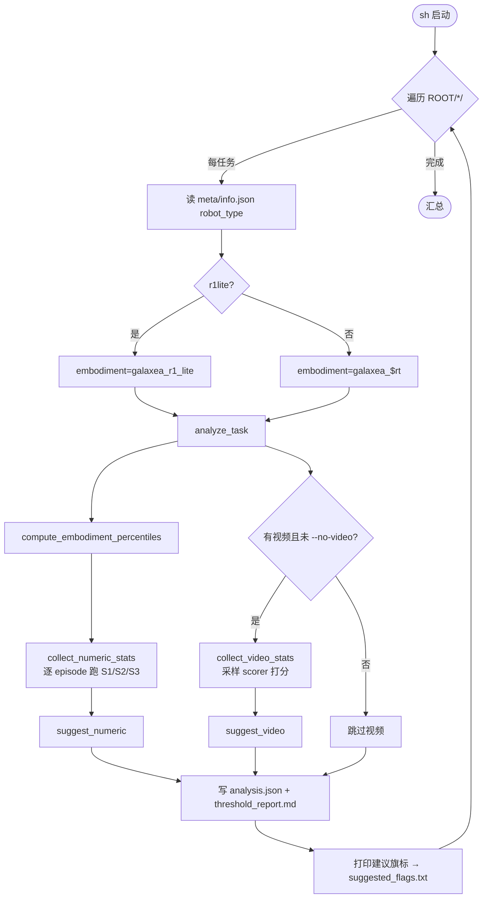
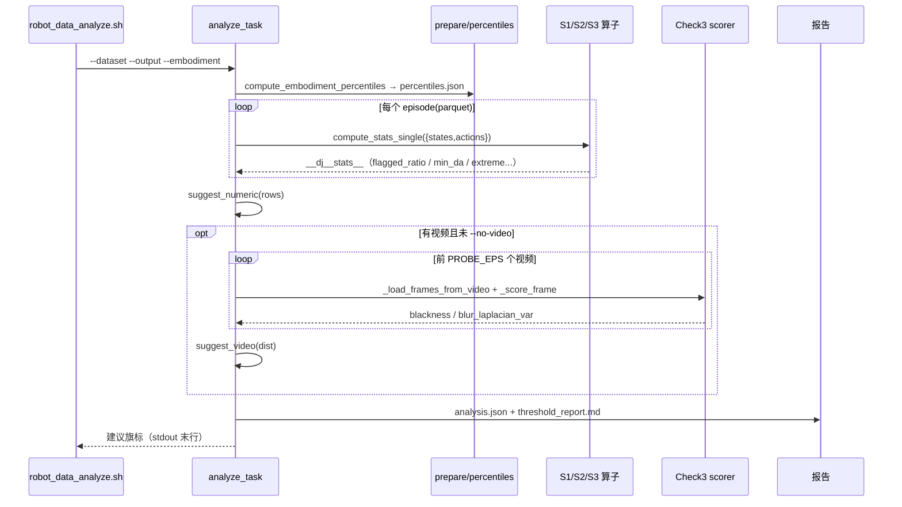
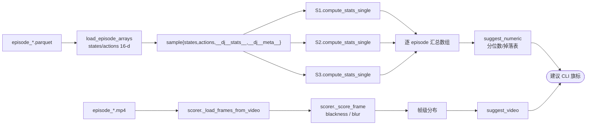
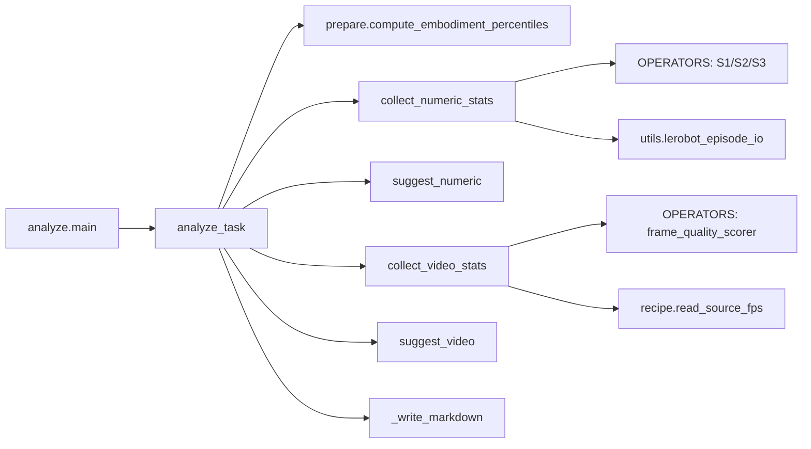

# Robot Analyze 清洗前阈值分析器：设计与使用说明

本文描述 `data_juicer/_au/pipeline/robot_clean/analyze.py` 与根目录 `robot_data_analyze.sh` —— 面向 Qwen-RobotManip / Galaxea / LeRobot 示教数据的**清洗前（pre-clean）阈值标定入口**。它在**不修改任何数据**的前提下，对单个任务同时探测「数值侧（Stage 1/2/3）」与「视觉侧（Check 3）」的分布，直接产出可粘贴到 `run_robot_clean` 的建议旗标。

它与清洗入口 [`data_robot_clean.md`](data_robot_clean.md) 一一对称：

| 维度 | 清洗（clean） | 分析（analyze，本文） |
|------|--------------|----------------------|
| 单任务模块 | `run_robot_clean.py` | `analyze.py` |
| 多任务包装 | `robot_data_clean.sh` | `robot_data_analyze.sh` |
| 是否改数据 | 是（过滤 / 打 mask / 导出） | **否（只读探测）** |
| 产物 | `cleaned.jsonl` + 80 维 parquet | `analysis.json` + `threshold_report.md` |

---

## 目录

- [1. 动机与目标](#1-动机与目标)
- [2. 方法定位：纵向 / 横向 / 消融](#2-方法定位纵向--横向--消融)
- [3. 静态架构](#3-静态架构)
- [4. 动态架构](#4-动态架构)
- [5. 建议逻辑与数学形式](#5-建议逻辑与数学形式)
- [6. 关键实现解读](#6-关键实现解读)
- [7. 使用文档](#7-使用文档)
- [8. 产出物与字段约定](#8-产出物与字段约定)
- [9. 故障排查与注意事项](#9-故障排查与注意事项)
- [10. 扩展点](#10-扩展点)

---

## 1. 动机与目标

### 1.1 问题

清洗流水线的阈值本质上是**逐数据集标定**的，盲用默认值会翻车：

- **数值侧**：Stage 1 的 `max_flagged_ratio`、Stage 2 的 `da_threshold`、Stage 3 的 `alpha` 都依赖轨迹幅度与噪声分布；
- **视觉侧**：Check 3 的 `blur_threshold` 依赖相机 / 分辨率 / 场景纹理。一个真实教训：Galaxea 720p `head_rgb` 的 Laplacian 方差本就在 28–42，而全局默认 `blur_threshold=50` 会把 **100% 帧判为模糊** → 整段被丢 → `cleaned.jsonl` 空。

已有的 `accept_analyze_lerobot_press.sh` 能标定数值侧，但**不碰视频**，恰好漏掉了上面这个坑。

### 1.2 目标

提供一个**统一的只读分析入口**，满足：

1. **一条命令覆盖两块**：数值 S1/S2/S3 + Check3 视频，同时给出建议阈值；
2. **度量一致性**：不重写检测逻辑，直接复用**真实算子**（保证「分析所见 = 清洗所为」）；
3. **可直接落地**：输出即为 `run_robot_clean` 的 CLI 旗标，复制即用；
4. **非破坏**：只读探测，不写清洗结果、不改源数据。

一句话：

> `analyze` = 逐 episode 跑真实算子的 `compute_stats` + 采样 Check3 scorer → 分布统计 → 建议旗标。

---

## 2. 方法定位：纵向 / 横向 / 消融

### 2.1 纵向：定参方式如何演进



| 代际 | 优点 | 缺点 | 适用 |
|------|------|------|------|
| 默认阈值直接清洗 | 零成本 | 极易误杀 / 清空 | 已知同源数据 |
| 数值 dj-analyze | 数值侧可靠 | 不覆盖视频、需起 Executor | 纯数值标定 |
| **analyze（本文）** | 数值+视频、度量一致、只读 | 单任务粒度、视频探针有解码成本 | **日常清洗前定参** |

### 2.2 横向：与其它分析手段对比

| 手段 | 编排 | 数值 | Check3 视频 | 度量与 clean 一致 | 破坏性 |
|------|------|------|-------------|------------------|--------|
| `dj-analyze --config` | 手写 YAML + Executor | ✔ | �’ 需自配算子 | 一致 | 只读 |
| `accept_analyze_lerobot_press.sh` | 固定验收 | ✔ | ✘ | 一致 | 只读 |
| 手写一次性探针脚本 | 临时 | 视写法 | 视写法 | **常不一致** | 只读 |
| **`analyze`** | CLI 单任务 | ✔ | ✔ | **一致（复用算子）** | **只读** |

### 2.3 消融：各探测项「值不值做」

| 探测项 | 价值 | 成本 | 默认 |
|--------|------|------|------|
| S1 flagged_ratio 分布 → `max_flagged_ratio` | 高 | 低（无解码） | 开 |
| S2 min_da 掉落表 → `da_threshold` | 中高 | 低 | 开 |
| S3 extreme flagged → `alpha` + 近常数维告警 | 中（且能暴露病态维） | 低 | 开 |
| Check3 blur/blackness 分布 → 视频阈值 | **高（直接防清空）** | **高（解码）** | 开；可 `--no-video` / 降 `PROBE_EPS` |

---

## 3. 静态架构

### 3.1 目录与组件职责

```
data_juicer/_au/pipeline/robot_clean/
├── analyze.py              # 本文主体：单任务数值+视频分析
├── config.py               # CleanConfig（analyze 复用其默认阈值，保证与 clean 同源）
├── prepare.py              # compute_embodiment_percentiles（analyze 复用）
├── recipe.py               # read_source_fps（analyze 复用）
└── run_robot_clean.py      # 清洗入口（analyze 的建议旗标喂给它）

robot_data_analyze.sh       # 根目录薄包装：遍历多任务 root + robot_type 识别
```

### 3.2 组件图



### 3.3 模块职责

| 模块 / 函数 | 职责 | 不负责 |
|-------------|------|--------|
| `robot_data_analyze.sh` | 遍历 root、识别 robot_type、汇总旗标 | 不做统计算法 |
| `analyze_task` | 单任务生命周期编排、写报告 | 不实现检测算法 |
| `collect_numeric_stats` | 逐 episode 跑 S1/S2/S3 的 `compute_stats_single` | 不做过滤 / 不改数据 |
| `suggest_numeric` | 从分布推建议阈值 + 病态告警 | 不解码视频 |
| `collect_video_stats` | 采样 Check3 scorer 打分，聚合 blur/blackness | 不做 episode 门控判定 |
| `suggest_video` | 从分布推视频阈值 + flag% 表 | 不改数据 |

---

## 4. 动态架构

### 4.1 端到端工作流



### 4.2 序列图（单任务 `analyze_task`）



### 4.3 数据流：一个 episode 如何变成建议



要点：

- **只调 `compute_stats_single`，不调 `process_single`** —— 只算统计、绝不过滤或改数组，天然只读。
- **视频侧直接借用 scorer 的私有方法** `_load_frames_from_video` / `_score_frame`，因此 `blackness`、`blur_laplacian_var` 的定义与清洗时**逐字节一致**。
- S1/S2/S3 的算子参数从 `CleanConfig` 默认值构造（`shared_dims`、`exempt_dims`、`mad_scale_*` 等），保证建议对应的是 clean 的实际行为。

---

## 5. 建议逻辑与数学形式

### 5.1 Stage 1：`max_flagged_ratio`

设第 \(i\) 条 episode 的突变帧比例为 \(r_i = \text{sudden\_change\_flagged\_ratio}\)。目标是让大多数（\(\text{TARGET\_KEEP}=90\%\)）episode 落在阈内：

\[
\texttt{max\_flagged\_ratio} = \mathrm{clip}\big(\; q_{0.90}(\{r_i\}),\; 0.05,\; 0.5 \big)
\]

即取 90 分位并夹到 \([0.05, 0.5]\)，避免过松或过紧。

### 5.2 Stage 2：`da_threshold`

对候选集 \(\mathcal{C}=\{0.60, 0.65, 0.70\}\)，用每条 episode 的 `state_action_min_da` \(= d_i\) 估计掉落比例：

\[
\text{drop}(c) = \frac{1}{n}\sum_{i=1}^{n} \mathbb{1}[\, d_i < c \,]
\]

选择使掉落最接近 10% 的候选：

\[
\texttt{da\_threshold} = \arg\min_{c \in \mathcal{C}} \big| \text{drop}(c) - 0.10 \big|
\]

报告同时给出整张 `da_table`，便于人工在保留率与严格度间权衡。

### 5.3 Stage 3：`alpha` 与近常数维告警

以 probe 值 \(\alpha_0\)（默认 0.1）先跑一遍，得每条 episode 极值标记率 \(e_i\)，令 \(\bar e = \frac1n\sum e_i\)：

\[
\texttt{alpha} =
\begin{cases}
\alpha_0, & \bar e \le 0.15 \\
0.2, & 0.15 < \bar e \le 0.25 \\
0.3, & \bar e > 0.25
\end{cases}
\]

带宽定义（回顾 Stage 3）：\(\big[q_{0.01} - \alpha\,\mathrm{IQR},\; q_{0.99} + \alpha\,\mathrm{IQR}\big]\)，\(\mathrm{IQR}=q_{0.99}-q_{0.01}\)。

> **病态告警**：当 \(\bar e > 0.5\) 时，多半存在**近常数维**（\(q_{0.01}\approx q_{0.99}\Rightarrow \mathrm{IQR}\approx 0\)，带宽退化为一点），此时**增大 \(\alpha\) 也无法缓解**。报告会给出 ⚠️ 提示核查体态分位数 / 扩充 `exempt_dims`，而不是给出误导性的 \(\alpha\)。同时提醒：Stage 3 用 `frame_mask` 时并不会因此丢 episode，只写 mask。

### 5.4 Check 3：`blur_threshold` / `blackness_threshold`

对所有采样帧的 Laplacian 方差集合 \(\{b_j\}\)，取略低于低尾的值，使清晰内容几乎不被误判（约 2% 落入）：

\[
\texttt{blur\_threshold} = \max\big(1.0,\; q_{0.02}(\{b_j\})\big)
\]

黑帧阈值默认保守，仅在数据整体偏暗时才下调（\(k_j\) 为帧均值强度）：

\[
\texttt{blackness\_threshold} =
\begin{cases}
10.0, & q_{0.01}(\{k_j\}) \ge 20 \\
\max\big(1.0,\; 0.5\,q_{0.01}(\{k_j\})\big), & \text{否则}
\end{cases}
\]

报告附 blur 的候选-flag% 表（在 \(q_{0.01},q_{0.02},q_{0.05},q_{0.10}\) 处），若分布是双峰（真有模糊帧），可据此选择切点。

---

## 6. 关键实现解读

### 6.1 只读地复用真实算子

数值侧的核心是构造真实算子并只调 `compute_stats_single`：

```108:111:data_juicer/_au/pipeline/robot_clean/analyze.py
        for op in (s1, s2, s3):
            op.compute_stats_single(sample)
        rows.append({"id": Path(pf).stem, "stats": dict(sample[Fields.stats])})
    return rows
```

`sample` 预置了空的 `Fields.stats` / `Fields.meta`（S1 直接访问 `sample[Fields.stats]`，不初始化会 KeyError）。因为**不调 `process_single`**，样本数组绝不会被裁剪或丢弃 —— 这是「只读」的本质保证。

### 6.2 视频度量与清洗严格一致

不重写模糊/黑帧判据，而是直接借 scorer 算子：

```200:208:data_juicer/_au/pipeline/robot_clean/analyze.py
        for fr in frames:
            sc = scorer._score_frame(fr)
            b_list.append(sc["blackness"])
            bl_list.append(sc["blur_laplacian_var"])
            if sc["corrupt"] or sc["blackness"] < blackness_threshold or sc["blur_laplacian_var"] < blur_threshold:
                bad += 1
        blur_all.extend(bl_list)
        black_all.extend(b_list)
        per_ep_bad_ratio.append(bad / len(frames))
```

因此报告里的 `blur_laplacian_var` 分布与清洗时 Check3 scorer 用的完全是同一函数，避免「分析用一套、清洗用另一套」的偏差。

### 6.3 建议即旗标：一致的参数命名

`analyze_task` 把建议直接组织成 `run_robot_clean` 的 CLI key：

```yaml
suggested_clean_flags:
  --s1-max-flagged-ratio: ...
  --s2-da-threshold: ...
  --s3-alpha: ...
  --check3-blur-threshold: ...
  --check3-blackness-threshold: ...
```

`main()` 末行仅打印这串旗标，`robot_data_analyze.sh` 用 `tail -1` 抓取并写入 `suggested_flags.txt`，形成「分析→清洗」的无缝传递。

---

## 7. 使用文档

### 7.1 环境

```bash
source /mnt/r/VENV/dj/bin/activate
cd /mnt/r/share/zwy/Projects/data-juicer
# 依赖：opencv、av(PyAV)、pyarrow、data-juicer 可编辑安装；AV1 需系统 ffmpeg 含 libdav1d
```

数据集需为 **LeRobot v2.1 任务目录**（含 `data/ meta/ videos/`）。多任务 root 由 `robot_data_analyze.sh` 遍历。

### 7.2 快速开始（推荐）

```bash
# 1) 批量分析多任务 root（默认指向 260711）
bash robot_data_analyze.sh

# 看逐任务报告与建议
#   process_clean/260711_analyze/<task>/threshold_report.md
#   process_clean/260711_analyze/suggested_flags.txt
```

### 7.3 单任务（正式模块）

```bash
python -m data_juicer._au.pipeline.robot_clean.analyze \
  --dataset /mnt/r/DATA/Galaxea-Open-World-Dataset/260711/Storage_Tools_20250802_012 \
  --output /tmp/analyze_storage \
  --embodiment galaxea_r1_lite
```

### 7.4 常用场景

**快速粗探（少量视频 + 高抽帧）**

```bash
PROBE_EPS=4 PROBE_FPS=1 bash robot_data_analyze.sh --max-episodes 20
```

**只要数值、跳过视频（最快）**

```bash
bash robot_data_analyze.sh --no-video
```

**分析 → 清洗 一条龙（单任务示例）**

```bash
FLAGS=$(python -m data_juicer._au.pipeline.robot_clean.analyze \
  --dataset /path/to/task --output /tmp/an --embodiment galaxea_r1_lite | tail -1)

python -m data_juicer._au.pipeline.robot_clean.run_robot_clean \
  --dataset /path/to/task --output /path/clean_out --export-unified-parquet $FLAGS
```

### 7.5 CLI 参数一览（`analyze.py`）

| 参数 | 默认 | 说明 |
|------|------|------|
| `--dataset` | 必填 | LeRobot 任务根目录 |
| `--output` | 必填 | 分析产出目录 |
| `--embodiment` | `galaxea_r1_lite` | 分位数键 & 布局 |
| `--video-key` | `observation.images.head_rgb` | Check3 主相机 |
| `--max-episodes` | 全部 | 数值扫描上限 |
| `--probe-video-episodes` | `8` | 视频探针评分的 episode 数 |
| `--probe-sampling-fps` | `2.0` | 视频探针抽帧 FPS |
| `--probe-alpha` | `0.1` | Stage3 探测所用 alpha |
| `--no-video` | 关 | 跳过 Check3 视频探针 |

### 7.6 Shell 环境变量（`robot_data_analyze.sh`）

| 变量 | 默认 | 说明 |
|------|------|------|
| `DATASET_ROOT` | `.../260711` | 多任务 root |
| `OUT_ROOT` | `.../process_clean/260711_analyze` | 产出根 |
| `DJ_VENV` | `/mnt/r/VENV/dj` | 虚环境 |
| `PROBE_EPS` | `8` | 每任务视频探针数 |
| `PROBE_FPS` | `2` | 视频探针抽帧 FPS |

> 额外参数经 `"$@"` 透传给每个任务的 `analyze`。

---

## 8. 产出物与字段约定

### 8.1 目录结构

```text
<OUT_ROOT>/
  suggested_flags.txt          # 各任务建议旗标汇总（task<TAB>flags）
  <task>/
    percentiles.json           # 该任务体态分位数（analyze 计算）
    analysis.json              # 结构化分析结果（数值 + 视频 + 建议旗标）
    threshold_report.md        # 人读报告
```

### 8.2 `analysis.json` 关键字段

| 字段 | 含义 |
|------|------|
| `num_episodes` | 数值扫描的 episode 数 |
| `numeric.max_flagged_ratio / da_threshold / alpha` | 数值建议 |
| `numeric.s2_da_table` | 各 `da_threshold` 候选的掉落比例 |
| `numeric.s3_warning` | 近常数维/极值病态告警（可为 null） |
| `video.blur_pcts / blackness_pcts` | 帧级分布分位数 |
| `video.suggestion.blur_flag_table` | 各 blur 阈值的 flag% |
| `suggested_clean_flags` | 直接可粘贴到 `run_robot_clean` 的旗标字典 |

### 8.3 `threshold_report.md` 骨架

包含 Stage1/Stage2/Stage3 分位数与建议、Check3 blur/blackness 分布与候选表、以及「建议清洗命令（本任务）」代码块。

---

## 9. 故障排查与注意事项

| 现象 | 原因 | 处理 |
|------|------|------|
| Stage3 `s3_mean_flagged_ratio≈1.0` + ⚠️ 告警 | 近常数维导致带宽≈0 | 核查体态分位数 / 扩 `exempt_dims`；Stage3 用 `frame_mask` 不会丢 episode |
| 小样本时数值建议抖动大 | 分位数在少量 episode 上不稳 | **用全量**（默认不加 `--max-episodes`） |
| `video: no_video_key` | 未挂 videos 或 key 不符 | 确认 `videos/.../<video-key>/`；或 `--no-video` |
| 视频探针很慢 | 解码是主要成本 | 降 `PROBE_EPS` / 提高 `--probe-sampling-fps` |
| OpenCV AV1 报错刷屏 | 预期：`auto` 会走 PyAV | 可忽略 |

**关键注意**：

1. **只读**：analyze 不产生 `cleaned.jsonl`、不改源数据，可放心多跑。
2. **度量一致但抽样不同**：视频探针默认只评前 `PROBE_EPS` 个 episode 的采样帧，是「代表性抽样」；定稿关键任务可加大 `PROBE_EPS` 或对个别任务全量复核。
3. **逐任务体态**：`r1pro` 等无布局配置的任务，analyze 仍能给数值+视频建议（embodiment 仅作分位数键），但其 80 维 unified 布局需另配（见 clean 文档）。

---

## 10. 扩展点

按「扩展大于修改」：

1. **多任务聚合建议**：在 `robot_data_analyze.sh` 汇总各任务 `analysis.json`，产出 root 级中位数建议（当前逐任务）。
2. **预测保留率**：用建议阈值回代，估计 clean 后 kept 比例，写入报告（Check3 侧已有 `bad_ratio_at_probe_threshold` 雏形）。
3. **分布可视化**：用 py 脚本画 blur/flagged_ratio 直方图（符合文档规范中「必要时用 py 画图」）。
4. **验收脚本**：在 `tests_au/` 下补 `accept_robot_analyze.sh`，把分析器纳入回归（符合扩展规范）。

---

## 附录 A：最小可复现（烟测）

```bash
OUT=/tmp/analyze_smoke
rm -rf "$OUT"
python -m data_juicer._au.pipeline.robot_clean.analyze \
  --dataset /mnt/r/DATA/Galaxea-Open-World-Dataset/260711/Put_The_Phone_Back_In_place_20250716_006 \
  --output "$OUT" --embodiment galaxea_r1_lite \
  --max-episodes 12 --probe-video-episodes 4 --probe-sampling-fps 2

cat "$OUT/threshold_report.md"
# 预期：给出 S1/S2/S3 建议 + Check3 blur 分布(约 28-42)与建议阈值(~30)，末行打印建议旗标
```

## 附录 B：模块调用地图


