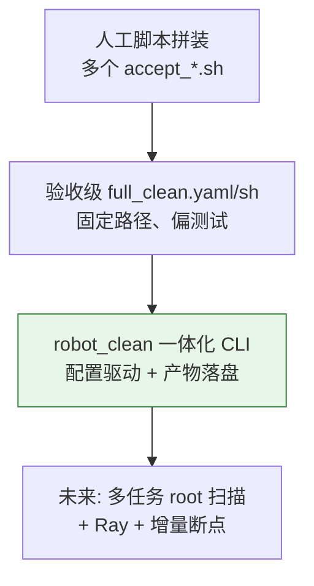
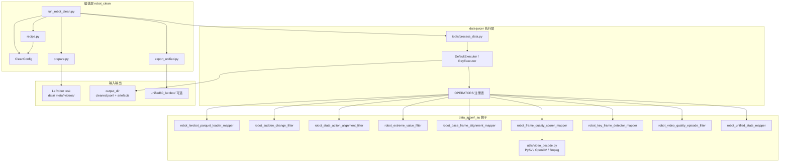
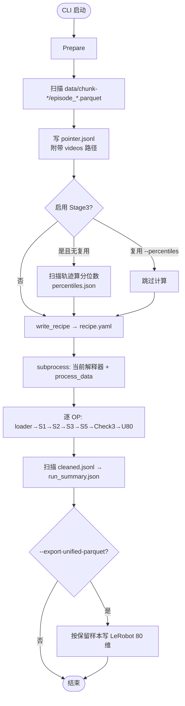
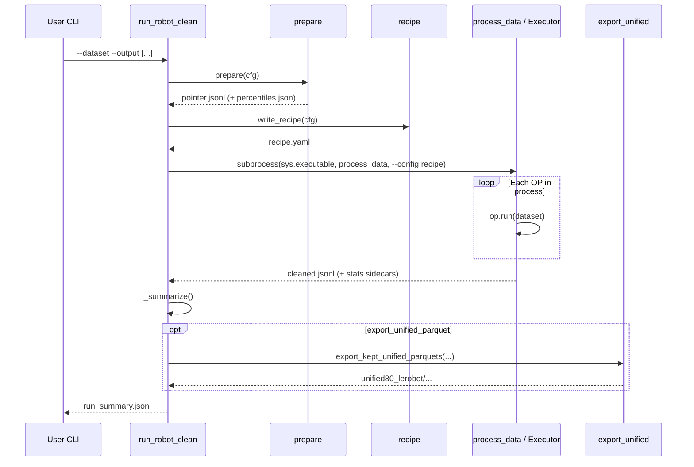
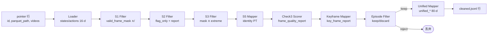
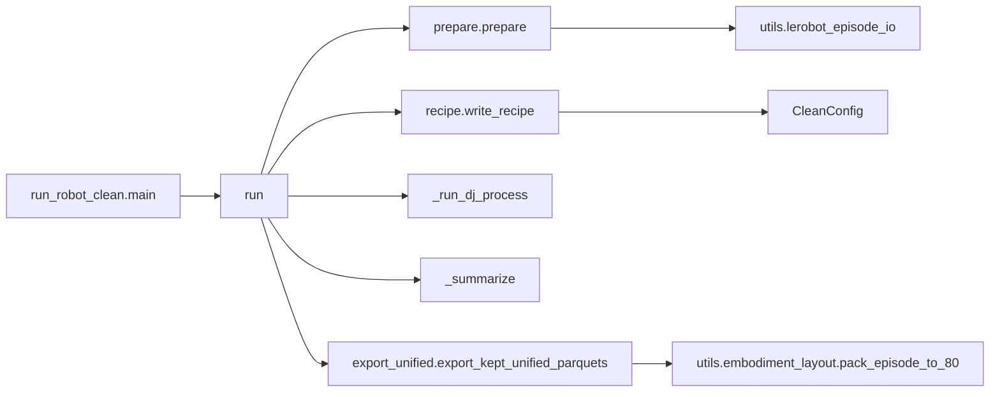

# Robot Clean 一体化数据清洗 Pipeline：设计与使用说明

本文描述 `data_juicer/_au/pipeline/robot_clean` —— 面向 Qwen-RobotManip / Galaxea / LeRobot 示教数据的**生产级一体化清洗入口**。它把原先散落在 `tests_au/ops/*/accept_*.sh` 中的 Stage 1/2/3/5、Check 3（episode 级视频质量门控）以及 80 维统一表示导出，收束为一条可配置、可复现的 CLI 流水线。

相关前置文档：

| 文档 | 内容 |
|------|------|
| [`data_cur1_2.md`](data_cur1_2.md) 等 | Stage 1–5 数值清洗算子设计 |
| [`data_chk3_1_2.md`](data_chk3_1_2.md) | Check 3 改良：Episode 级视频质量过滤 |
| [`data_impl_unified80.md`](data_impl_unified80.md) | 80 维统一表示与导出 |
| [`data_cur_vqf_3.md`](data_cur_vqf_3.md) | Check 3 论文方法形式化（帧级方案对照） |

---

## 目录

- [1. 动机与目标](#1-动机与目标)
- [2. 方法定位：纵向 / 横向 / 消融](#2-方法定位纵向--横向--消融)
- [3. 静态架构](#3-静态架构)
- [4. 动态架构](#4-动态架构)
- [5. 阶段语义与默认判定](#5-阶段语义与默认判定)
- [6. 关键实现解读](#6-关键实现解读)
- [7. 使用文档](#7-使用文档)
- [8. 产出物与字段约定](#8-产出物与字段约定)
- [9. 参数与调参建议](#9-参数与调参建议)
- [10. 故障排查](#10-故障排查)
- [11. 与验收脚本的关系](#11-与验收脚本的关系)
- [12. 扩展点](#12-扩展点)

---

## 1. 动机与目标

### 1.1 问题

在落地 Qwen-RobotManip 数据管线时，数值侧（Stage 1/2/3/5）与视觉侧（Check 3）、表示侧（unified 80-dim）分别以多个 `accept_*.sh` / YAML 验收脚本存在：

- 一次「真正清洗」需要人工串联 3–5 条命令；
- 路径、embodiment、分位数 JSON、pointer JSONL 容易不一致；
- 验收脚本默认写死在 `tests_au/.../outputs/`，不适合作为生产入口。

### 1.2 目标

提供一个**正式入口**，满足：

1. **一条命令完成**：LeRobot 任务目录 → 清洗后 JSONL（含 stats/meta）→ 可选 80 维 LeRobot parquet；
2. **阶段可开关**：支持只跑数值、跳过 Check 3、跳过 / 开启 unified 导出；
3. **企业化扩展**：算子经 `custom_operator_paths: ['data_juicer/_au']` 包导入，不改 DJ 主干；
4. **可复现**：每次运行落盘 `recipe.yaml`、`pointer.jsonl`、`percentiles.json`、`run_summary.json`。

一句话：

> `robot_clean` = Prepare（pointer + 分位数） + 动态拼装 DJ Recipe + `dj-process` + 可选 unified parquet 导出。

---

## 2. 方法定位：纵向 / 横向 / 消融

### 2.1 纵向：清洗入口如何演进



| 代际 | 优点 | 缺点 | 适用 |
|------|------|------|------|
| 多脚本验收 | 单测清晰 | 生产难用、易漏阶段 | CI / 算子回归 |
| 固定 full_clean YAML | 一键串算子 | 路径写死、开关弱 | 小数据集演示 |
| **robot_clean（本文）** | CLI、可开关、产物规范 | 单任务目录为主 | **日常清洗 / 产线** |

### 2.2 横向：与其它入口对比

| 入口 | 编排方式 | Check 3 | 80 维 | 推荐场景 |
|------|----------|---------|-------|----------|
| `dj-process --config xxx.yaml` | 手写 YAML | 需自配 | 需自配 | 高度定制 recipe |
| `accept_qwenrobomanip_full.sh` | 验收固定 | 无 | 无 | Stage1–5 回归 |
| `accept_video_quality_episode_filtering.sh` | 验收固定 | episode 门控（常跳过 Op1） | 无 | Check3 单元验收 |
| `export_unified_to_process_test.sh` | 仅导出 | 无 | 全量源数据 | 未清洗直接转 80 维 |
| **`run_robot_clean`** | CLI 生成 recipe | PyAV 解码 + episode 门控 | JSONL 默认开；parquet 可选 | **端到端清洗** |

### 2.3 消融：各阶段「值不值做」

结合论文与 Galaxea 实践，默认全开时的预期收益：

| 组件 | 预期收益 | 成本 | 默认 |
|------|----------|------|------|
| Stage 1 突变检测 | 高（尖峰/炸点） | 低 | 开（`frame_mask`） |
| Stage 2 状态–动作对齐 | 中高（趋势错位） | 中 | 开（`flag_only`，默认不丢 episode） |
| Stage 3 分位极值 | 高（越界维） | 中（需预扫描） | 开（`frame_mask`） |
| Stage 5 基座/EEF | 视数据：Galaxea 关节空间多为 pass-through | 低 | 开（identity） |
| Check 3 episode 门控 | 高（黑/糊/关键帧污染） | **高**（解码） | 开；可用 `--check3-sampling-fps` 降本 |
| Unified 80 → JSONL | 高（训练表示） | 中 | 开 |
| Unified LeRobot parquet | 高（下游 loader） | 中 | **关**（`--export-unified-parquet` 打开） |

消融建议：先 `--no-check3` 跑通数值链，再开 Check 3；全量前用 `--max-episodes` 小样本标定阈值。

---

## 3. 静态架构

### 3.1 目录与组件职责

```
data_juicer/_au/pipeline/robot_clean/
├── __init__.py              # 导出 CleanConfig
├── config.py                # CleanConfig：路径 / 阶段开关 / 阈值
├── prepare.py               # pointer JSONL + embodiment 分位数
├── recipe.py                # 按开关拼装 process 列表 → YAML
├── export_unified.py        # 保留 episode → LeRobot 80 维 parquet
└── run_robot_clean.py       # CLI 主编排

scripts/run_robot_clean.sh   # 薄包装：固定 venv + PYTHONPATH
```

算子本体仍在 `data_juicer/_au/ops/{filter,mapper}/`，由 recipe 中的

```yaml
custom_operator_paths:
  - 'data_juicer/_au'
```

企业化包导入触发注册（见 `_au/__init__.py`）。

### 3.2 组件图



### 3.3 类 / 模块职责

| 模块 | 职责 | 不负责 |
|------|------|--------|
| `CleanConfig` | 集中配置与路径属性 | 不读磁盘业务数据 |
| `prepare` | 扫 parquet、挂 video 路径、算 q01/q99 | 不跑 Filter |
| `recipe` | 将开关映射为 DJ `process:` 列表 | 不执行算子 |
| `run_robot_clean` | 生命周期编排、调 process_data、写 summary | 不实现检测算法 |
| `export_unified` | 按**清洗后保留**的 episode 写 80 维 parquet | 不重新过滤质量 |

---

## 4. 动态架构

### 4.1 端到端工作流



### 4.2 序列图（单次 `run()`）



### 4.3 单样本在 DJ 内的数据流（默认全开）



要点：

- Stage 1/3 默认 **`frame_mask`**：写/合并 `valid_frame_mask`，**不裁剪** states 数组，也不因数值阶段直接丢整段（除非后续改为 `episode_discard`）。
- Stage 2 默认 **`flag_only`**：只报告对齐质量，不删帧、不丢 episode。
- Check 3 EpisodeFilter 是当前默认链上**真正会减少 episode 数**的硬门控。
- Unified Mapper 只对**存活样本**执行，并从原始 `parquet_path` 重新 pack 80 维（与 mask 清洗正交，保证表示完整）。

---

## 5. 阶段语义与默认判定

### 5.1 数值侧（Stage 1 / 2 / 3 / 5）

| 阶段 | 算子 | 默认策略 | 主要输出 |
|------|------|----------|----------|
| 1 突变 | `robot_sudden_change_filter` | MAD + residual/acc/jerk；`frame_mask` | `sudden_change_*` stats，report，mask |
| 2 对齐 | `robot_state_action_alignment_filter` | 互相关 \(D_a\)；`flag_only` | `state_action_*` stats |
| 3 极值 | `robot_extreme_value_filter` | 体态 q01/q99 ± \(\alpha\)；`frame_mask` | `extreme_value_*`，mask |
| 5 基座 | `robot_base_frame_alignment_mapper` | `preset=identity`（Galaxea 关节空间透传） | 通常无副作用 |

Stage 3 分位数形式（对每个维度）：

\[
[q_{0.01}(x) - \alpha \cdot \mathrm{IQR}_\text{proxy},\; q_{0.99}(x) + \alpha \cdot \mathrm{IQR}_\text{proxy}]
\]

实现上以 embodiment JSON 中预计算的 `q01`/`q99` 与 `alpha` 组成带宽（详见 Stage 3 设计文档）。

### 5.2 Check 3（episode 级，见 `data_chk3_1_2.md`）

坏帧由 Op1 给出（黑 / 糊 / 损坏），扣留整 episode 当满足任一：

\[
\frac{|\mathcal{B}|}{T} > \rho_{\max}
\quad\text{或}\quad
T - |\mathcal{B}| < G_{\min}
\quad\text{或}\quad
|\mathcal{B} \cap \mathcal{P}| > K_{\max}
\]

其中 \(\mathcal{B}\) 为坏帧下标，\(\mathcal{P}\) 为关键帧保护窗，默认 \(\rho_{\max}=0.1\)，\(G_{\min}=20\)，\(K_{\max}=0\)。

**不删帧**：要么原样保留，要么整段丢弃 —— 避免动作不连续级联。

### 5.3 视频解码

Galaxea 视频常为 **AV1**。本机 OpenCV 常失败（无硬件加速且 soft-decode 坏掉），故 `robot_frame_quality_scorer_mapper` 经 `utils/video_decode.py`：

```
auto: PyAV (libdav1d) → OpenCV → ffmpeg CLI
```

解码顺序与 Check 1 的 `frame_utils`「ffmpeg 回退」思路一致，但对**全序列质量评分**优先 PyAV（更快、直接拿 BGR ndarray）。

---

## 6. 关键实现解读

### 6.1 Recipe 拼装（开关 → 算子）

`recipe.build_process_ops` 始终挂 Loader，再按 `enable_*` 追加算子。设计选择是**声明式**：CLI 只改 `CleanConfig`，不手写 YAML。落盘后的 `recipe.yaml` 仍是标准 DJ recipe，可用 `dj-process --config` 单独复跑。

扩展示例：关闭 Check 3 时 `process` 从 9 步减到 6 步（loader+S1+S2+S3+S5+U80）。

### 6.2 为何用 subprocess 调 `process_data`

`init_configs()` 依赖进程 argv。编排层若在同一进程直接调 Executor，易与 CLI 参数冲突。因此：

```text
sys.executable + tools/process_data.py --config <生成的 recipe.yaml>
PYTHONPATH=<repo_root>
```

刻意**不用 PATH 上的任意 `dj-process`**，避免跑到错误虚环境导致 PyAV 被 LazyLoader 二次安装。

### 6.3 Unified 导出与清洗的正交性

JSONL 路径：`robot_unified_state_mapper` 写入 `unified_states` / `unified_actions` / `unified_dim_mask`。

Parquet 路径：`export_unified` **再次**按 `parquet_path` pack —— 这样：

- 下游 LeRobot loader 得到标准 `data/chunk-*/episode_*.parquet`；
- 只包含 Check 3（及任何 episode_discard）后**存活**的 episode；
- `videos/` 默认 symlink 回源，避免复制 TB 级视频。

结果读取（`_iter_result_rows`）兼容三种落盘形态：单个 `cleaned.jsonl` 文件、Ray/多分片写出的目录（递归收敛内部 jsonl 分片）、以及父目录下 `cleaned.jsonl*` 兄弟项中夹带的目录分片；仅挑 json/jsonl，避免误读 parquet 等副产物。因此 `--executor-type ray / ray_partitioned` 搭配 `--export-unified-parquet` 亦可正常导出。

---

## 7. 使用文档

### 7.1 环境

```bash
# 推荐
source /mnt/r/VENV/dj/bin/activate
cd /mnt/r/share/zwy/Projects/data-juicer

# 依赖要点：opencv、av(PyAV)、pyarrow、data-juicer 可编辑安装
# AV1：系统 ffmpeg 含 libdav1d（本机已具备）
```

数据集需为 **LeRobot v2.1 单任务目录**：

```text
<task>/
  data/chunk-XXX/episode_YYYYYY.parquet
  meta/info.json
  videos/chunk-XXX/<video_key>/episode_YYYYYY.mp4   # Check3 需要
```

推荐测试集：

`/mnt/r/DATA/tst/Galaxea-Open-World-Dataset/Connect_Router_Cables_20250625_002/`

### 7.2 快速开始

**方式 A：Python 模块（正式）**

```bash
python -m data_juicer._au.pipeline.robot_clean.run_robot_clean \
  --dataset /mnt/r/DATA/tst/Galaxea-Open-World-Dataset/Connect_Router_Cables_20250625_002 \
  --output /path/to/clean_out
```

**方式 B：Shell 包装**

```bash
bash scripts/run_robot_clean.sh \
  --dataset /mnt/r/DATA/tst/Galaxea-Open-World-Dataset/Connect_Router_Cables_20250625_002 \
  --output /path/to/clean_out
```

`scripts/run_robot_clean.sh` 仅设置 `PYTHONPATH` 与默认 `DJ_VENV=/mnt/r/VENV/dj`，参数原样转给 Python CLI。

### 7.3 常用场景

**小样本试跑（含 Check3 抽帧加速 + 80 维 parquet）**

```bash
python -m data_juicer._au.pipeline.robot_clean.run_robot_clean \
  --dataset /path/to/task \
  --output /tmp/robot_clean_smoke \
  --max-episodes 8 \
  --check3-sampling-fps 1 \
  --export-unified-parquet
```

**只要数值清洗（最快）**

```bash
python -m data_juicer._au.pipeline.robot_clean.run_robot_clean \
  --dataset /path/to/task \
  --output /tmp/numeric_only \
  --no-check3 \
  --no-unified
```

**数值 + Check3，复用已有分位数**

```bash
python -m data_juicer._au.pipeline.robot_clean.run_robot_clean \
  --dataset /path/to/task \
  --output /tmp/clean2 \
  --percentiles /tmp/numeric_only/percentiles.json
```

**生产全量（示例）**

```bash
python -m data_juicer._au.pipeline.robot_clean.run_robot_clean \
  --dataset /mnt/r/DATA/.../Some_Task \
  --output /mnt/r/DATA/.../process_clean/Some_Task_run001 \
  --np 8 \
  --export-unified-parquet
```

> 全量开 Check3 且 `sampling_fps=None` 时，解码是主要耗时；建议先用抽帧标定 \(\rho_{\max}\)，再全帧复跑关键任务。

### 7.4 CLI 参数一览

| 参数 | 默认 | 说明 |
|------|------|------|
| `--dataset` | 必填 | LeRobot 任务根目录 |
| `--output` | 必填 | 工作目录 / 产出根 |
| `--embodiment` | `galaxea_r1_lite` | 分位数键 & unified 布局 |
| `--video-key` | `observation.images.head_rgb` | Check3 主相机 |
| `--max-episodes` | 全部 | 仅处理前 N 条 |
| `--np` | `1` | DJ `num_proc` |
| `--executor-type` | `default` | `default` / `ray` / `ray_partitioned` |
| `--no-stage1` … `--no-stage5` | 关 | 关闭对应数值阶段 |
| `--no-check3` | 关 | 关闭视频门控 |
| `--no-unified` | 关 | JSONL 不写 80 维字段 |
| `--export-unified-parquet` | 关 | 额外写 LeRobot 80 维 |
| `--percentiles` | 自动算 | 复用分位数 JSON |
| `--s1-max-flagged-ratio` | `0.3` | Stage1 episode 级坏帧比例上限 |
| `--s2-da-threshold` | `0.65` | Stage2 方向一致性阈值 \(D_a\) |
| `--s3-alpha` | `0.1` | Stage3 IQR 带宽系数 \(\alpha\) |
| `--check3-max-bad-ratio` | `0.1` | 坏帧比例上限 |
| `--check3-min-good-frames` | `20` | 最少好帧数 |
| `--check3-max-keyframe-overlap` | `0` | 坏帧 ∩ 关键帧保护窗上限 |
| `--check3-blackness-threshold` | `10.0` | 黑帧均值强度阈值 |
| `--check3-blur-threshold` | `50.0` | 模糊帧 Laplacian 方差阈值 |
| `--check3-decoder` | `auto` | `auto\|pyav\|opencv\|ffmpeg` |
| `--check3-sampling-fps` | 无 | 评分抽帧 FPS |

> 数值阶段与 Check3 阈值旗标默认为「不传即用 `CleanConfig` 默认值」：只有显式传入时才覆盖，`CleanConfig` 是唯一真源。

查看帮助：

```bash
python -m data_juicer._au.pipeline.robot_clean.run_robot_clean --help
```

---

## 8. 产出物与字段约定

### 8.1 目录结构

```text
<output>/
  pointer.jsonl              # 输入指针（parquet_path + videos）
  percentiles.json           # Stage3 体态分位数（或复用副本逻辑）
  recipe.yaml                # 本次实际执行的 DJ recipe
  cleaned.jsonl              # 主结果
  cleaned_stats.jsonl        # DJ 导出的 stats 侧车（若有）
  stats/s1_stats.jsonl ...   # 各 Filter stats_export
  run_summary.json           # 运行摘要
  unified80_lerobot/         # 仅 --export-unified-parquet
    <task_name>/
      data/chunk-*/episode_*.parquet
      meta/info.json
      videos -> <源 videos>   # symlink
    export_summary.json
```

### 8.2 `cleaned.jsonl` 单行关键字段

| 字段 | 含义 |
|------|------|
| `id` | episode id（如 `episode_000000`） |
| `parquet_path` | 源 parquet 绝对路径 |
| `states` / `actions` | Loader 物化的原生维（Galaxea 常见 16 维） |
| `unified_states` / `unified_actions` / `unified_dim_mask` | 80 维（默认开启） |
| `__dj__stats__.*` | 各阶段标量 keep / ratio |
| `__dj__meta__.*_report` | JSON 字符串报告 |
| `__dj__meta__.valid_frame_mask` | 帧级保留掩码（S1/S3 `frame_mask` 时） |

Check 3 报告示例字段：`video_quality_episode_report` → `keep`, `bad_ratio`, `good_frames`, `keyframe_overlap`, `reject_reasons`。

### 8.3 `run_summary.json` 示例

```json
{
  "kept_episodes": 1,
  "result": "/path/clean_out/cleaned.jsonl",
  "with_check3_keep_flag": 1,
  "with_unified_fields": 1,
  "recipe": "/path/clean_out/recipe.yaml",
  "pointer": "/path/clean_out/pointer.jsonl",
  "stages": {
    "stage1": true,
    "stage2": true,
    "stage3": true,
    "stage5": true,
    "check3": true,
    "unified": true,
    "export_unified_parquet": true
  },
  "unified_parquet": {
    "kept_episodes": 1,
    "out": ".../unified80_lerobot/<task>",
    "embodiment": "galaxea_r1_lite"
  }
}
```

---

## 9. 参数与调参建议

### 9.1 Galaxea R1 Lite 起点

| 旋钮 | CLI 旗标 | 起点 | 若误杀太多 | 若漏网太多 |
|------|---------|------|------------|------------|
| S1 `max_flagged_ratio` | `--s1-max-flagged-ratio` | 0.3（mask 模式主要看 mask） | 放宽 MAD scale | 收紧 / 改 episode_discard |
| S2 `da_threshold` | `--s2-da-threshold` | 0.65 | 略降阈值或豁免维 | 提高阈值 |
| S3 `alpha` | `--s3-alpha` | 0.1 | 略增 alpha | 略减 / 查 exempt_dims |
| Check3 `max_bad_ratio` | `--check3-max-bad-ratio` | 0.1 | → 0.15–0.2 | → 0.05 |
| Check3 `max_keyframe_overlap` | `--check3-max-keyframe-overlap` | 0 | → 1（极少数坏关键帧） | 保持 0 |

夹爪维默认在 S3 `exempt_dims=[7,15]`（16 维左右臂夹爪），避免开合被当极值。夹爪的黑/模糊阈值另由 `--check3-blackness-threshold` / `--check3-blur-threshold` 控制。

### 9.2 Check3 与解码成本

设 \(T\) 为帧数，抽帧间隔 \(s = \mathrm{round}(\mathrm{fps}/f_s)\)，评分复杂度近似降为 \(T/s\)。其中 `fps` 由 `recipe.read_source_fps` 自动读取数据集 `meta/info.json` 的 `fps` 字段（读取失败回退 15.0），**不再写死 15**。  
例：某任务 `info.json` 标 15 FPS、`--check3-sampling-fps 1` → 约每 15 帧评 1 帧，适合粗筛；定稿应用全帧或更高 \(f_s\)。

---

## 10. 故障排查

| 现象 | 可能原因 | 处理 |
|------|----------|------|
| `dataset must ... data/` | 路径不是 LeRobot 任务根 | 指到含 `data/` 的目录 |
| Check3 全 keep 且 report `no_video_key` / `no_frames_loaded` | 未挂 videos 或解码失败 | 确认 `videos/.../<video_key>/`；设 `--check3-decoder pyav` |
| OpenCV AV1 报错日志刷屏 | 预期：auto 会走 PyAV | 可忽略；或显式 `pyav` |
| Stage3 缺 percentiles | 未启用/计算失败 | 看日志；或 `--percentiles` 复用 |
| `kept_episodes` 骤降 | Check3 过严或视频大面积损坏 | 看 `reject_reasons`；放宽 ratio / 抽查 mp4 |
| LazyLoader 试图往 `/usr` 装 av | 跑到了错误 Python | 用本文 CLI（已固定 `sys.executable`）或 `scripts/run_robot_clean.sh` |
| Unified 维数不对 | embodiment 配置不匹配 | 检查 `--embodiment` 与 YAML |

人工复查单条：

```bash
python - <<'PY'
import json
p=" /path/to/cleaned.jsonl".strip()
row=json.loads(open(p).readline())
print(row["id"])
print(row.get("__dj__stats__",{}).keys())
print(json.loads(row["__dj__meta__"]["video_quality_episode_report"]))
PY
```

---

## 11. 与验收脚本的关系

| 脚本 | 角色 | 是否替代 robot_clean |
|------|------|----------------------|
| `tests_au/**/accept_*.sh` | 算子 / 子链路回归 | **否**；继续服务 CI |
| `accept_qwenrobomanip_full_clean.sh` | 早期一体化验收原型 | 功能已收敛进 `robot_clean`；新流程请用正式 CLI |
| `robot_clean` | **生产清洗入口** | — |

原则：**测试归 `tests_au/`，生产归 `_au/pipeline/robot_clean/`**。

---

## 12. 扩展点

按「扩展大于修改」：

1. **多任务 root**：在 `prepare.build_pointer_jsonl` 扩展为扫描 `iter_task_dirs`（pointer 模式已在 `convert_lerobot_episodes.py` 存在，可复用）。
2. **静段 discard**：在 Check3 EpisodeFilter 增加 `edge_static_duration`（见 `data_chk3_1_2` 评审建议），无需恢复帧级删除链。
3. **frame_mask → 导出时应用**：增加导出后处理，按 `valid_frame_mask` 切 parquet（训练侧若已支持 mask 采样则可暂缓）。
4. **Check 1 挂接**：指令一致性走 Cursor SDK（`pipeline/instruction_consistency`），建议清洗后**另线批跑**，勿默认塞进同一 DJ recipe（成本与依赖不同）。
5. **入口脚本注册**：可在 `pyproject.toml` `[project.scripts]` 增加 `dj-robot-clean = ...:main`（当前可用 `-m` / `scripts/run_robot_clean.sh`）。

---

## 附录 A：最小可复现实验（烟测）

```bash
OUT=/tmp/robot_clean_doc_smoke
rm -rf "$OUT"
python -m data_juicer._au.pipeline.robot_clean.run_robot_clean \
  --dataset /mnt/r/DATA/tst/Galaxea-Open-World-Dataset/Connect_Router_Cables_20250625_002 \
  --output "$OUT" \
  --max-episodes 2 \
  --check3-sampling-fps 1 \
  --export-unified-parquet

cat "$OUT/run_summary.json"
# 预期：kept_episodes ≤ 2；若 Check3 生效可能 < 2；unified 字段与 parquet 目录存在
```

历史烟测记录（同命令）：输入 2 episode，Check3 保留 1，JSONL 含 80 维，parquet 导出成功。

---

## 附录 B：模块导入关系（代码阅读地图）



从 `run()` 顺着读即可把握全链路；检测细节下钻到各 `ops/*/robot_*.py`。
