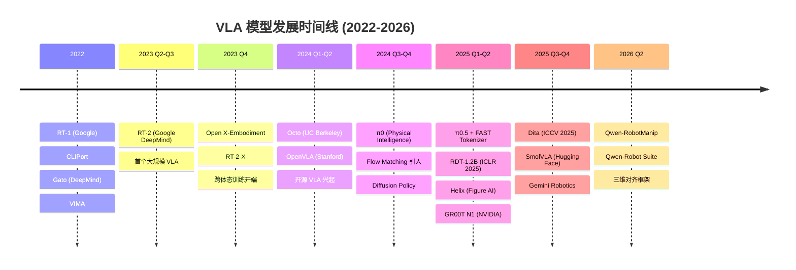
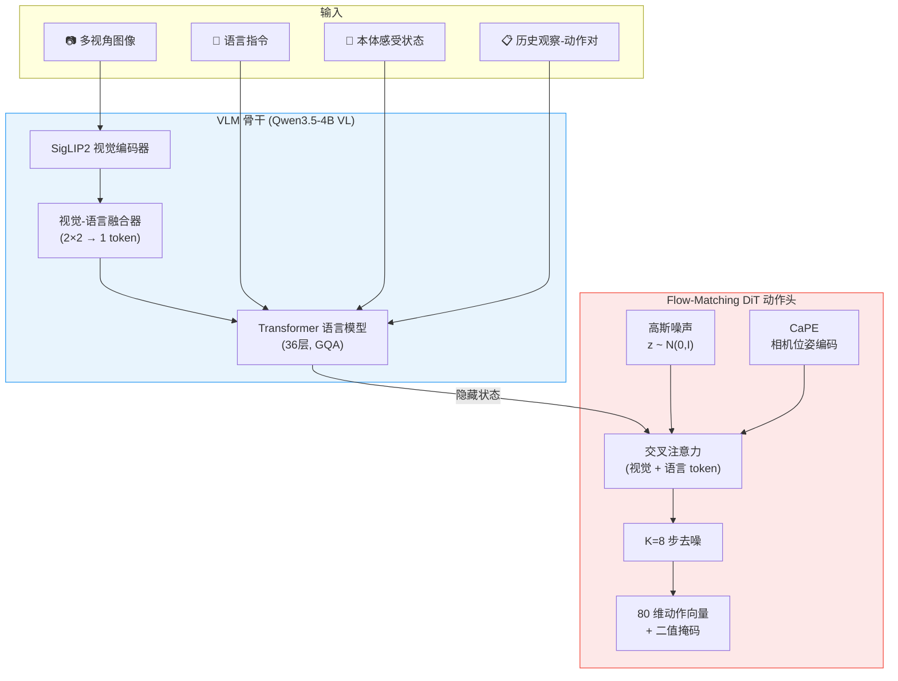
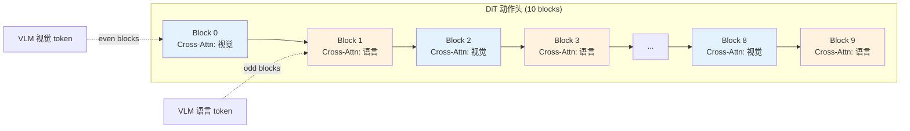
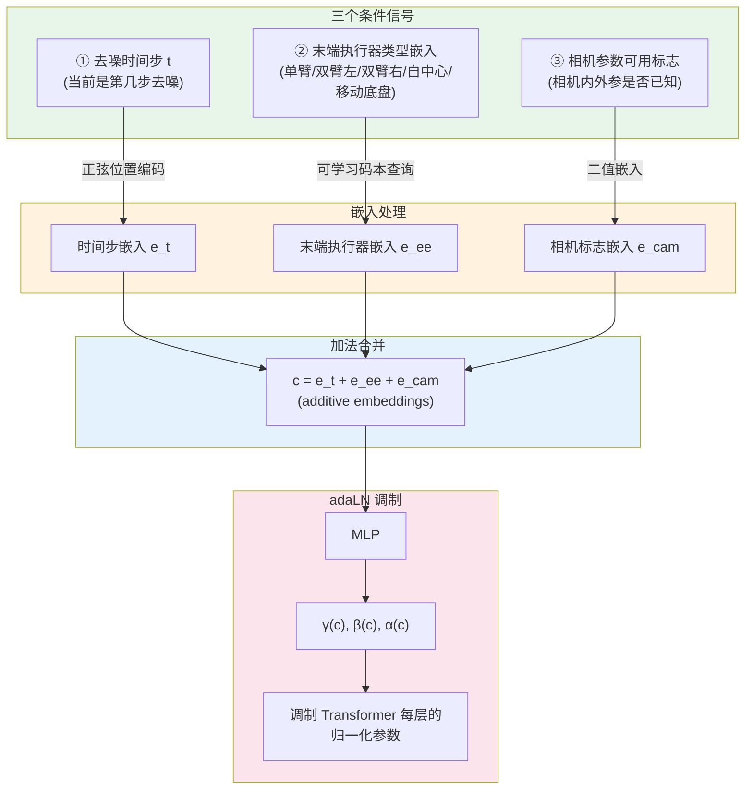
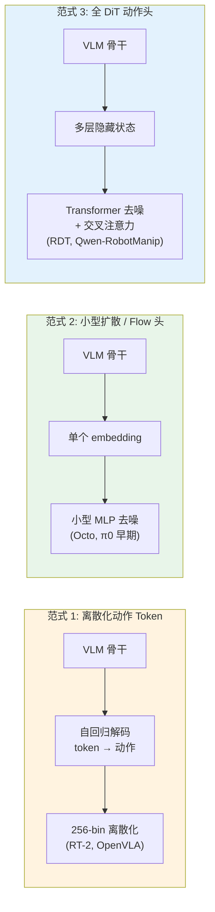
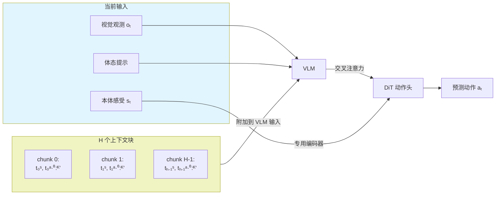
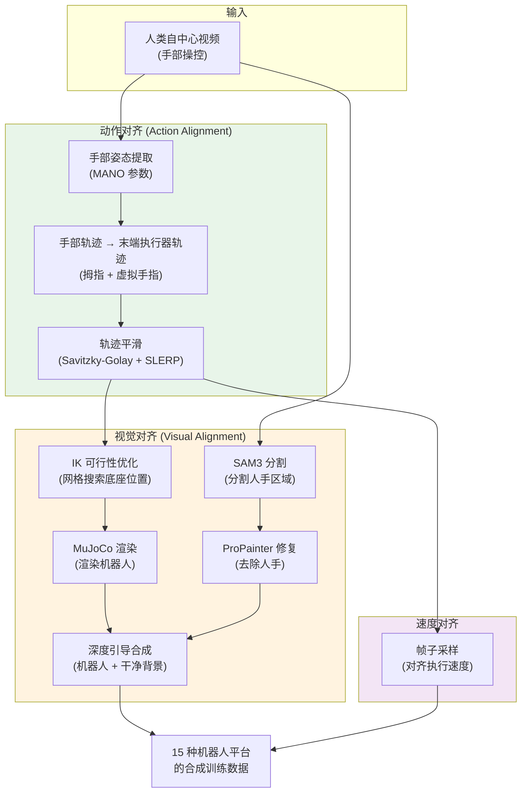
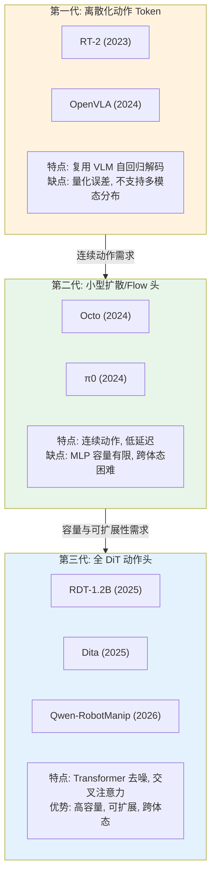
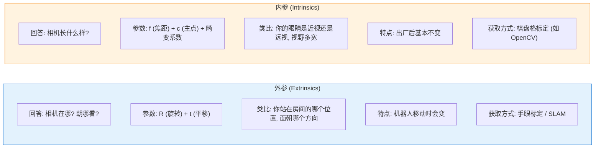
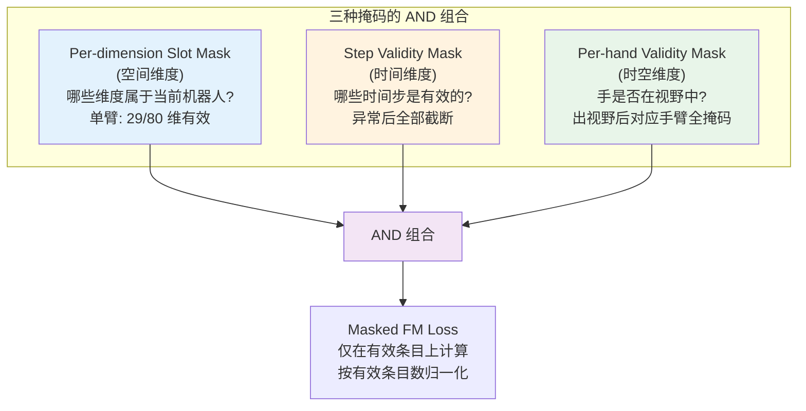

# Qwen-RobotManip 深度解析：对齐如何解锁机器人操控基础模型的规模化

> **论文**: Qwen-RobotManip Technical Report: Alignment Unlocks Scale for Robotic Manipulation Foundation Models  
> **作者**: Haoqi Yuan 等 23 位作者（阿里巴巴通义千问团队）  
> **发表**: arXiv:2606.17846, 2026 年 6 月 16 日  
> **官方博客**: [qwen.ai/blog?id=qwen-robotmanip](https://qwen.ai/blog?id=qwen-robotmanip)  
> **GitHub**: [github.com/QwenLM/Qwen-RobotManip](https://github.com/QwenLM/Qwen-RobotManip)（代码待公开）

---

## 目录

1. [引言与背景](#1-引言与背景)
2. [VLA 模型发展史（纵向分析）](#2-vla-模型发展史纵向分析)
3. [模型架构详解](#3-模型架构详解)
4. [三维对齐框架（核心创新）](#4-三维对齐框架核心创新)
5. [数据工程](#5-数据工程)
6. [训练流程](#6-训练流程)
7. [实验结果与分析](#7-实验结果与分析)
8. [横向对比分析](#8-横向对比分析)
9. [关键洞察与讨论](#9-关键洞察与讨论)
10. [总结](#10-总结)
11. [参考文献](#11-参考文献)

---

## 1. 引言与背景

### 1.1 基础模型的成功范式：对齐与规模化

在自然语言处理（NLP）和计算机视觉（CV）领域，基础模型（Foundation Model）已取得巨大成功。从 GPT 系列到 CLIP、SAM，这些模型遵循一条共同的路径：**将异构数据在统一的表示框架下对齐，然后在大规模数据上进行训练**。这一范式的核心洞见在于——当数据足够多、足够多样，且在一个一致的框架内被组织时，模型会展现出超越训练分布的泛化能力 [Brown et al., 2020; Radford et al., 2021]。

以大语言模型为例：无论训练语料来自维基百科、代码库还是社交媒体，文本都被统一编码为 token 序列。这种天然的对齐使得研究者只需"堆数据、堆参数"就能获得惊人的涌现能力。然而，这种简单优雅的范式在机器人操控（Robotic Manipulation）领域遭遇了严峻挑战。

### 1.2 机器人操控领域的三重困境

为什么基础模型的"规模化"配方难以直接应用于机器人操控？原因至少有三：

**数据异构性（Heterogeneity）**。不同机器人使用不同的关节结构、末端执行器、坐标系和控制频率。一台 Franka Panda 的 7 自由度关节值与一台 UR5 的关节值毫无直接对应关系——即使它们在执行相同的"抓取杯子"任务。这就好比让一个翻译系统同时处理英语、中文和摩尔斯电码，但每种"语言"连基本的语法结构都不相同 [Open X-Embodiment Collaboration, 2023]。

**采集成本（Collection Cost）**。机器人数据的采集需要真实的物理硬件和人工遥操作，每小时的数据采集成本是文本或图像数据的数百倍。截至 2026 年初，整个领域最大的开源机器人数据集 Open X-Embodiment（OXE）约有 100 万条轨迹 [Padalkar et al., 2023]，而语言模型的训练语料可达数万亿 token。

**多样性窄（Narrow Diversity）**。即使在 OXE 中，数据也高度集中于少数几个实验室场景和简单的桌面操控任务。真实世界中无穷无尽的物体形状、材质、光照条件和任务组合，在现有数据集中只有冰山一角。

### 1.3 Qwen-RobotManip 的核心命题

面对这些挑战，Qwen-RobotManip 提出了一个简洁而深刻的命题：

> **"先对齐，再规模化"（Alignment First, Then Scale）** [Yuan et al., 2026]

其核心论点是：异构的机器人操控数据不能简单堆积——如果数据之间的表示不一致，扩大规模只会引入更多冲突，而非更多泛化。因此，必须**先建立一个跨体态（cross-embodiment）、跨坐标系、跨行为模式的统一对齐框架**，使多源数据在同一空间中具有语义一致性，然后才能通过规模化获得真正的泛化能力。

这一命题指导了 Qwen-RobotManip 的全部设计：一个涵盖"表示维度、运动维度和行为维度"的三维对齐框架，使其能够吸收来自 9 个开源机器人数据集、3 个人类视频数据集以及 15 个合成机器人平台的超过 38,100 小时训练数据——**全部使用开源数据，无需任何私有数据采集** [Yuan et al., 2026; Alibaba Cloud Blog, 2026]。

---

## 2. VLA 模型发展史（纵向分析）

要理解 Qwen-RobotManip 的创新之处，我们需要回顾视觉-语言-动作（Vision-Language-Action, VLA）模型从萌芽到成熟的发展历程。

### 2.1 发展时间线



### 2.2 第一阶段：探索期（2022 — 2023 年初）

**代表模型**：RT-1、CLIPort、Gato、VIMA

这一阶段的特征是研究者开始探索将 Transformer 架构应用于机器人控制，但每个模型都局限于单一或少量机器人平台。

**RT-1（Robotics Transformer 1）** 是 Google 于 2022 年推出的开创性工作 [Brohan et al., 2022]。它使用了一个相对轻量的 Transformer 架构，在 Google 自有的 13 台 Everyday Robots 上采集的约 130,000 条轨迹上训练。RT-1 证明了 Transformer 可以有效地学习机器人操控策略，但它只能在训练时见过的特定机器人和环境中工作。

**Gato**（DeepMind, 2022）则走了另一条路——试图用一个统一的 Transformer 同时处理文本、图像和机器人动作 [Reed et al., 2022]。虽然概念前卫，但 Gato 在每个领域的表现都只是"及格"水平，缺乏专家级能力。

**遗留问题**：这些早期模型没有充分利用互联网规模的视觉-语言知识，泛化能力极为有限。

### 2.3 第二阶段：VLM 迁移突破（2023 年中）

**代表模型**：RT-2

**RT-2（Robotics Transformer 2）** 是 Google DeepMind 于 2023 年 7 月发布的里程碑式工作 [Brohan et al., 2023]。它的核心创新是：**将机器人动作编码为文本 token，然后微调一个预训练的视觉-语言模型（VLM）来输出这些 token**。具体来说，RT-2 将 7 自由度的机器人动作离散化为 256 个 bin，每个维度用一个文本 token 表示。

这一看似简单的设计带来了深远的影响：通过复用 PaLI-X（55B 参数）或 PaLM-E 等大型 VLM 的知识，RT-2 首次展现了从互联网知识到物理操控的迁移能力。例如，RT-2 能够理解"把泰勒·斯威夫特的专辑放进垃圾桶"这样的指令——尽管它从未在任何机器人数据中见过这张专辑 [Brohan et al., 2023]。

**遗留问题**：RT-2 使用 55B 参数的闭源模型，推理成本极高；动作的离散化（256 bin）引入了量化误差；且仅在单一机器人平台上验证。

### 2.4 第三阶段：开源与跨体态（2023 年末 — 2024 年）

**代表模型**：Open X-Embodiment、Octo、OpenVLA

**Open X-Embodiment（OXE）** 数据集的发布标志着领域的一个转折点 [Padalkar et al., 2023]。这是一个由 21 个机构合作构建的大规模开源数据集，包含 22 个机器人平台、527 种操控技能、超过 100 万条轨迹。OXE 首次为跨体态训练提供了实验基础。

基于 OXE 训练的 **RT-2-X** 展示了跨体态训练的价值：在"涌现技能"评估中，RT-2-X 比仅在 Google 机器人数据上训练的 RT-2 提升了 50%，证明暴露于多种体态确实能教会模型可迁移的操控基元 [Padalkar et al., 2023]。

然而，OXE 的跨体态对齐是粗粒度的：仅将所有动作统一为 7 自由度末端执行器（EEF）动作向量，并进行逐数据集归一化。不同数据集的相机视角、坐标系和动作语义仍然存在显著差异。

**Octo**（UC Berkeley, 2024）是一个轻量级（93M 参数）开源通用策略 [Team et al., 2024]，采用 Transformer 观测编码器加扩散策略动作头。它体积小到可以在 NVIDIA Jetson AGX Orin 上运行，是目前唯一支持边缘部署的 VLA 模型。

**OpenVLA**（Stanford + UC Berkeley, 2024）则走了另一条路 [Kim et al., 2024]：基于 7B 参数的 LLaMA-2 语言模型，配合 DINOv2 + SigLIP 视觉编码器，在 OXE 上微调。OpenVLA 的意义在于**民主化**——它证明大学实验室用一块 A100 GPU 即可在 24 小时内微调一个功能完备的 VLA 模型，使 VLA 从 Google 的独占研究成果变成了全社区的实用工具。

**遗留问题**：OXE 的粗对齐不足以消除跨体态冲突；离散化动作仍有精度限制；数据规模虽大但仍以桌面操控为主。

### 2.5 第四阶段：连续动作与推理（2024 年末 — 2025 年上半年）

**代表模型**：π0、π0.5、RDT-1.2B、Helix、GR00T N1

这一阶段的两大趋势是**连续动作生成**和**推理能力增强**。

**π0（pi-zero）** 由 Physical Intelligence（由 Chelsea Finn、Sergey Levine 等创立）于 2024 年末发布 [Black et al., 2024]。它引入了两个关键创新：(1) 使用 PaliGemma 作为 VLM 骨干，配合独立的"动作专家"网络；(2) **使用 Flow Matching（流匹配）替代离散化 token 来生成连续动作**。Flow Matching 是一种确定性的生成式建模方法（详见 §3.3），能产生更平滑、更精确的机器人轨迹。π0 在双臂洗衣折叠、三明治制作等高灵巧度任务上展现了惊人能力 [Black et al., 2024]。

**π0.5**（2025 年 4 月）在 π0 基础上做了三大改进 [Physical Intelligence, 2025]：(1) 预训练阶段使用 **FAST tokenizer**（基于 DCT 变换的动作压缩），将 50 步连续动作压缩为 8-16 个离散 token，兼顾了离散化的训练效率和连续动作的精度；(2) 引入**思维链推理（Chain-of-Thought）**，在生成动作前先预测高层子任务；(3) 大幅扩大训练数据规模。

**RDT-1.2B**（Robotics Diffusion Transformer, ICLR 2025）则证明了将整个 Transformer 作为去噪网络（而非小型 MLP 头）的可行性 [Liu et al., 2025]。RDT 使用 1.2B 参数的全 DiT 架构，在当时最大的机器人数据集合上预训练，零样本成功率提升 56%。它还提出了一个"物理可解释的统一动作空间"来处理不同机器人的动作表示。

**遗留问题**：π0/π0.5 依赖大量私有数据且不开源权重；跨体态泛化仍然有限；评估主要在分布内（In-Distribution, IID）基准上进行，未能充分检验真正的泛化能力。

### 2.6 第五阶段：规模化竞赛（2025 年下半年 — 2026 年）

**代表模型**：Dita、SmolVLA、Gemini Robotics、Qwen-RobotManip

进入 2025 年下半年，VLA 领域进入了"规模化竞赛"阶段——各大团队竞相构建更大规模、更强泛化能力的机器人基础模型。

**Dita**（ICCV 2025）进一步验证了全 DiT 架构的优势 [Hou et al., 2025]，在大规模跨体态数据集上预训练后，仅需 10 个示范即可适配新的复杂多任务场景。

**SmolVLA**（Hugging Face, 2025 年 6 月）走了小型化路线——仅 450M 参数的开源 VLA，使用 Flow Matching 生成连续动作，在消费级 GPU 上即可微调 [Hugging Face, 2025]。尽管体积极小，其性能与 Octo、OpenVLA 甚至 π0 相当，展示了 VLA 架构的规模下限。

**Qwen-RobotManip**（2026 年 6 月）在这一阶段脱颖而出。它不是简单地"做更大的模型"或"用更多数据"，而是从根本上重新思考了跨体态训练的对齐问题，提出了涵盖表示、运动和行为三个维度的系统性对齐框架，在纯开源数据路线上实现了对 π0.5 等使用私有数据的模型的全面超越 [Yuan et al., 2026]。

### 2.7 发展脉络总结

回顾整个发展史，我们可以看到几条清晰的演进主线：

1. **动作表示**：离散 token（RT-2）→ 小型 MLP 扩散头（Octo, π0）→ FAST tokenizer（π0.5）→ 全 DiT（RDT, Dita, Qwen-RobotManip）
2. **数据规模**：单一平台（RT-1）→ 多平台开源（OXE）→ 人类视频合成（Qwen-RobotManip）
3. **泛化策略**：任务内泛化（RT-1）→ 互联网知识迁移（RT-2）→ 跨体态粗对齐（OXE）→ 三维精细对齐（Qwen-RobotManip）
4. **模型规模**：93M（Octo）→ 7B（OpenVLA）→ 55B（RT-2）→ 4B 高效设计（Qwen-RobotManip）

---

## 3. 模型架构详解

### 3.1 总体架构：解耦双组件设计

Qwen-RobotManip 采用了一种**解耦双组件架构**：一个负责感知和推理的视觉-语言模型（VLM）骨干，和一个负责生成连续动作的 Flow-Matching 扩散 Transformer（DiT）动作头 [Yuan et al., 2026]。



这种设计的核心优势在于**分工明确**：VLM 骨干专注于理解"做什么"（场景、指令、状态判断），DiT 动作头专注于生成"怎么做"（精确的连续运动轨迹）。两者通过交叉注意力机制连接，但在训练中可以使用不同的损失函数 [Yuan et al., 2026]。

### 3.2 VLM 骨干：Qwen3.5-4B VL

Qwen-RobotManip 选择了 Qwen3.5-4B VL 作为其视觉-语言骨干 [Qwen Team, 2026]。这是通义千问系列中的原生多模态模型，具有以下关键特性：

**视觉编码器**：使用 SigLIP2-Large（约 300M 参数）作为视觉骨干 [Zhai et al., 2023]，支持原生分辨率图像输入，通过 2D-RoPE（旋转位置编码）处理不同尺寸的图像。

**DeepStack 特征融合**：这是 Qwen3-VL 引入的关键架构升级 [Qwen Team, 2025]。传统方法仅使用 ViT（Vision Transformer）最后一层的特征，但 DeepStack 将早期层（包含边缘、纹理等低级特征）与深层（包含语义等高级特征）融合，从而实现更紧密的视觉-语言对齐。

**视觉-语言融合器**：一个基于 MLP 的模块，将 2×2 的视觉特征块压缩为单个视觉 token，与语言模型的隐藏维度对齐。视觉 token 通过动态分辨率空间合并（dynamic-resolution spatial merging）交错插入文本 token 流中。VLM 最终输出维度为 $D_{\text{vlm}} = 2560$，这些最后一层隐藏状态将传递给 DiT 动作头 [Yuan et al., 2026]。

**注意力机制**：使用分组查询注意力（Grouped Query Attention, GQA），配置为 32 个查询头和 8 个键值头，在保持模型容量的同时降低推理内存开销 [Ainslie et al., 2023]。

**为什么不用更大的模型？** Qwen-RobotManip 选择 4B 而非 7B 或更大的骨干，是效率与能力的权衡。机器人控制需要高频（通常 10-50 Hz）的动作输出，过大的模型会成为推理瓶颈。4B 参数在保持强大视觉-语言理解能力的同时，允许在实际机器人系统上实现实时控制 [Yuan et al., 2026]。

**与其他 VLA 模型骨干的对比**：

| 模型 | VLM 骨干 | 参数量 | 视觉编码器 | 特点 |
|------|---------|--------|-----------|------|
| Qwen-RobotManip | Qwen3.5-4B VL | ~4.4B | SigLIP2-Large | 原生多模态, DeepStack |
| π0 | PaliGemma | 未公开 | SigLIP + Gemma | 闭源 |
| π0.5 | 更大 VLM | 未公开 | 未公开 | 闭源, 思维链 |
| OpenVLA | LLaMA-2 | 7B | DINOv2 + SigLIP | 开源, 离散动作 |
| RT-2 | PaLI-X | 55B | ViT-22B | 闭源, 超大规模 |
| Octo | 轻量 Transformer | 93M | 轻量 CNN | 边缘部署 |
| RDT-1.2B | DiT（全扩散） | 1.2B | 预训练 ViT | 开源 |

### 3.3 动作头：Flow-Matching 扩散 Transformer

Qwen-RobotManip 的动作生成采用了 **Flow Matching**（流匹配）技术，这是一种相较于传统扩散模型更高效、更稳定的生成式建模方法。下面我们由浅入深地解释这一技术。

#### 3.3.1 从扩散模型到 Flow Matching

**扩散模型（Diffusion Model）** 的基本思想可以用一个比喻来理解：想象你在白纸上画了一幅精美的图案（目标数据），然后逐步往上撒沙子（添加噪声），直到图案完全被沙子覆盖（纯噪声）。扩散模型就是学习这个"撒沙子"过程的逆过程——给定一堆沙子（噪声），一步步恢复出原始图案（数据）。

数学上，扩散模型通过求解**随机微分方程（SDE）**来实现这一过程，需要估计每一步的"得分函数"（score function）。这个过程虽然强大，但有两个问题：(1) 训练时需要处理复杂的随机过程；(2) 推理时需要很多步迭代（通常 50-100 步），速度慢。

**Flow Matching** 提供了一种更优雅的替代方案 [Lipman et al., 2023]。它不走随机微分方程的路线，而是直接学习一个**确定性的向量场**（velocity field），将简单分布（高斯噪声）沿确定路径"流动"到目标分布（期望的动作轨迹）。

用数学语言表述：设 $p_0$ 为简单的基础分布（标准高斯），$p_1$ 为目标数据分布。Flow Matching 学习一个时间依赖的向量场 $v_t(x)$，使得从 $p_0$ 出发的样本沿 $v_t$ 流动后到达 $p_1$：

$$\frac{dx_t}{dt} = v_t(x_t), \quad x_0 \sim p_0, \quad x_1 \sim p_1$$

训练目标是最小化向量场的回归损失：

$$\mathcal{L}_{FM} = \mathbb{E}_{t, x_0, x_1} \left[ \| v_\theta(x_t, t) - (x_1 - x_0) \|^2 \right]$$

其中 $x_t = (1-t) x_0 + t x_1$ 是线性插值路径上的中间点。

#### 3.3.2 Flow Matching 的优势

相比传统扩散模型，Flow Matching 在机器人操控中有显著优势 [Lipman et al., 2023; Black et al., 2024]：

1. **推理速度快**：1 步 Flow Matching（误差 0.898cm，8.53ms）可达到与 16 步扩散策略（误差 0.884cm，159.72ms）相当的精度，但推理时间缩短约 19 倍 [Zhang & Gienger, 2024]。
2. **训练更稳定**：直接回归确定性向量场，避免了复杂的随机过程和噪声调度。
3. **多模态动作分布**：在许多操控任务中，同一观测可能对应多个合理的动作（例如抓取物体的左侧或右侧）。Flow Matching 天然支持多模态分布建模。

#### 3.3.3 DiT 动作头的具体实现

Qwen-RobotManip 的动作头是一个 **Diffusion Transformer (DiT)**——即使用 Transformer 架构（而非小型 MLP）作为 Flow Matching 的去噪网络。这一选择遵循了 2024-2025 年的研究趋势（RDT, Dita, DiT-Block Policy 等）[Liu et al., 2025; Hou et al., 2025; Dasari et al., 2024]。

**DiT 的精确架构参数**（源自论文 TeX 源码）：

| 参数 | 值 | 说明 |
|------|-----|------|
| Transformer blocks | **$N = 10$** | DiT 的层数 |
| 隐藏维度 | **$D_{\text{act}} = 768$** | 每个 token 的表示维度 |
| 注意力头数 | **12** | 每层的多头注意力 |
| 每头维度 | **64** | $768 / 12 = 64$ |
| 前馈网络 | **SwiGLU** | 门控激活的 FFN |
| 推理去噪步数 | **4 步 Euler 积分** | 实现低延迟实时控制 |

**每个 DiT block 的内部结构**：

1. **自注意力（Self-Attention）**：在拼接的状态-动作 token 序列上进行自注意力，其中本体感受状态（proprioceptive state）通过两层 MLP 编码后前置于带噪声的动作 token 序列前
2. **交叉注意力（Cross-Attention）**：接收 VLM 的最后一层隐藏状态
3. **SwiGLU 前馈网络**：带门控机制的前馈层

**交叉注意力的交替模式**（关键设计细节）：DiT 的交叉注意力并非对所有 VLM token 统一计算，而是**在偶数和奇数 block 之间交替**：

- **偶数 block**（第 0, 2, 4, 6, 8 层）：交叉注意力的 key/value 来自 VLM 的**视觉 token**
- **奇数 block**（第 1, 3, 5, 7, 9 层）：交叉注意力的 key/value 来自 VLM 的**语言 token**



这种交替设计使 DiT 在每一层都能分别关注视觉和语言信息，避免两种模态在注意力计算中互相干扰。

**Qwen-RobotManip 中的 Flow Matching 精确公式**：

给定真实动作块 $\mathbf{a} \in \mathbb{R}^{T \times D}$（$T$ 步、每步 $D$ 维），采样噪声 $\epsilon \sim \mathcal{N}(0, \mathbf{I})$ 和时间步 $t \sim \text{Beta}(1, 1.5)$（注意：这里采用 Beta 分布而非均匀分布，使得训练更偏向接近真实动作的区域），构建插值点：

$$x_t = (1 - t) \epsilon + t \mathbf{a}$$

模型预测目标为速度场 $\mathbf{v} = \mathbf{a} - \epsilon$，损失函数为：

$$\mathcal{L}_{FM} = \mathbb{E}_{\mathbf{a}, \epsilon, t} \left\| f_\theta(x_t, t, \mathbf{s}, \mathbf{o}) - (\mathbf{a} - \epsilon) \right\|_2^2$$

其中 $f_\theta$ 是完整模型，$\mathbf{s}$ 是本体感受状态，$\mathbf{o}$ 是视觉-语言观测。推理时使用 **4 步 Euler 积分**从纯噪声恢复出动作序列，实现低延迟实时控制 [Yuan et al., 2026]。

**$K_{repeat} = 8$ 的设计动机**：VLM 的前向传播计算成本远高于 DiT。为了摊销这一成本，Qwen-RobotManip 对每个输入样本执行 8 次 Flow Matching 去噪步骤——采样 8 组独立的噪声和时间步，对同一动作块进行 8 次独立的去噪训练。VLM 只需运行一次，其输出被 DiT 复用 8 次，在不增加数据消耗的前提下将训练效率提升约 8 倍 [Yuan et al., 2026]。

#### 3.3.4 自适应层归一化（Adaptive Layer Normalization, adaLN）详解

论文中提到：

> "Beyond the denoising timestep, the DiT is further conditioned on two additional signals, both applied via additive embeddings through adaptive layer normalization."

这句话涉及 DiT 的**条件化机制**——模型如何将"我现在在去噪的第几步""我在控制什么类型的末端执行器""相机参数是否可用"等**外部条件信息**注入到 Transformer 的每一层中。**自适应层归一化（adaLN）** 正是实现这一注入的核心技术 [Peebles & Xie, 2023]。

##### （一）从标准层归一化说起

要理解 adaLN，先回顾**标准层归一化（Layer Normalization, LN）**。

在 Transformer 的每一层中，数据经过注意力或前馈网络后，都需要做归一化处理以稳定训练。标准 LN 的公式为：

$$\text{LN}(x) = \gamma \odot \frac{x - \mu}{\sigma} + \beta$$

其中：
- $x$ 是输入特征向量（如 hidden_dim = 512 维）
- $\mu, \sigma$ 是 $x$ 在特征维度上的均值和标准差
- $\gamma$（缩放）和 $\beta$（偏移）是**可学习的参数**，在整个训练和推理过程中保持固定

**关键问题**：标准 LN 的 $\gamma$ 和 $\beta$ 对所有输入都是一样的——无论当前是去噪的第 1 步还是第 8 步，无论在控制单臂还是双臂，归一化的行为都相同。这就好比一个音响系统的均衡器旋钮被胶水固定住了——不管播放什么音乐，高低音调节都不变。

##### （二）adaLN：让归一化"随条件而变"

**自适应层归一化（adaLN）** 的核心思想是：**把 $\gamma$ 和 $\beta$ 从固定参数变成由条件信号动态生成的值** [Peebles & Xie, 2023]。

$$\text{adaLN}(x, c) = \gamma(c) \odot \frac{x - \mu}{\sigma} + \beta(c)$$

其中 $c$ 是**条件嵌入向量**（conditioning embedding），$\gamma(c)$ 和 $\beta(c)$ 通过一个小型 MLP 从 $c$ 中预测出来：

$$[\gamma(c),\ \beta(c)] = \text{MLP}(c)$$

用日常生活类比：adaLN 就像一个**智能均衡器**——它会根据当前播放的音乐类型（古典、摇滚、爵士）自动调节高低音。这里的"音乐类型"就是条件信号 $c$，"高低音调节"就是 $\gamma$ 和 $\beta$。

##### （三）adaLN-Zero：更稳定的变体

原始 DiT 论文 [Peebles & Xie, 2023] 还提出了 **adaLN-Zero** 变体，它在 adaLN 的基础上增加了一个**门控参数 $\alpha$**：

$$\text{Output} = \alpha(c) \odot \text{Block}(\text{adaLN}(x, c)) + x$$

其中 $\text{Block}$ 是自注意力或前馈网络，$\alpha(c)$ 是从条件 $c$ 预测的门控值。

**关键技巧**：预测 $\alpha$ 的 MLP 的权重被初始化为**全零**，这意味着训练开始时 $\alpha = 0$，每个 DiT block 等效于恒等函数（identity function）——输入什么就输出什么。随着训练进行，网络逐渐学会合适的 $\alpha$ 值，让条件信号缓慢地"渗入"计算过程。

这就像教一个新手厨师：一开始让他完全按照原始食谱做（$\alpha = 0$，不加任何个人调整），等他熟练了再逐渐允许他根据食材情况做调味调整（$\alpha > 0$）。

##### （四）Qwen-RobotManip 中的三重条件信号

在 Qwen-RobotManip 的 DiT 动作头中，通过 adaLN 注入的条件信号有**三个** [Yuan et al., 2026]：



详细解释每个信号：

**① 去噪时间步 $t$**（标准 DiT 组件）

告诉模型"当前处于 Flow Matching 去噪过程的哪一步"。在第 1 步（接近纯噪声），模型需要做大幅度调整；在第 8 步（接近最终动作），模型只需做微调。时间步通过正弦位置编码（sinusoidal positional encoding）转化为嵌入向量。

**② 末端执行器类型嵌入**（Qwen-RobotManip 特有）

这是一个**可学习的码本（learned codebook）**，为每种末端执行器类别分配一个嵌入向量 [Yuan et al., 2026]：

| 类别 | 含义 | 场景 |
|------|------|------|
| single-arm | 单臂操控 | Franka Panda 等 |
| dual-arm-left | 双臂（左臂） | AgileX ALOHA 左臂 |
| dual-arm-right | 双臂（右臂） | AgileX ALOHA 右臂 |
| egocentric-head | 自中心视角 | 人类手部演示数据 |
| mobile-base | 移动底盘 | 移动操控平台 |

每个状态/动作 token 都关联对应类别的嵌入，让模型对不同体态应用**特定的动作先验**。例如，"双臂左臂"的 $\gamma, \beta$ 值可能会强调左侧空间的运动特征，而"移动底盘"的 $\gamma, \beta$ 可能会衰减精细手部运动相关的特征、增强底盘导航相关的特征。

**③ 相机参数可用标志**（Qwen-RobotManip 特有）

一个二值信号：相机的内参（焦距等）和外参（位置、朝向）是否已知。因为并非所有数据源都提供了完整的相机标定信息——当这些参数缺失时，模型需要知道"不要依赖精确的相机几何信息来做动作预测" [Yuan et al., 2026]。

##### （五）"additive embeddings"的含义

论文中说这三个信号通过"additive embeddings"注入。具体含义是：

$$c = e_t + e_{\text{ee}} + e_{\text{cam}}$$

三个嵌入向量被**逐元素相加**（而非拼接），合并为一个统一的条件向量 $c$。然后 $c$ 被送入 adaLN 的 MLP 来生成 $\gamma(c), \beta(c)$（以及可能的 $\alpha(c)$）。

加法合并的好处是**维度不变**——无论有多少个条件信号，$c$ 的维度始终等于单个嵌入的维度，MLP 的大小不需要随条件信号数量增长。

##### （六）一个具体的前向传播示例

假设 DiT 正在为一台 AgileX ALOHA 双臂机器人的**左臂**生成去噪的**第 3 步**动作，且**相机参数已知**：

```
步骤 1: 构建条件嵌入
  e_t   = SinusoidalEmbed(t=3)        → [0.12, -0.45, 0.88, ...]  (512维)
  e_ee  = Codebook["dual-arm-left"]   → [0.33, 0.71, -0.22, ...]  (512维)
  e_cam = Embed(flag=True)            → [0.05, 0.05, 0.05, ...]   (512维)
  c     = e_t + e_ee + e_cam          → [0.50, 0.31, 0.71, ...]   (512维)

步骤 2: 生成 adaLN 参数
  [γ, β, α] = MLP(c)                 → 每个都是 512 维向量

步骤 3: 在 DiT 的自注意力层中应用
  x_norm = (x - μ) / σ                  ← 标准归一化
  x_mod  = γ ⊙ x_norm + β               ← adaLN 调制（缩放+偏移）
  x_attn = SelfAttention(x_mod)          ← 自注意力
  x_out  = α ⊙ x_attn + x               ← 门控残差连接

步骤 4: 在 DiT 的前馈网络中重复类似的 adaLN 调制
  （使用同一个 c，但不同的 γ', β', α'）
```

这个过程在 DiT 的每一层都会重复，每一层通过各自的 MLP 从**同一个 $c$** 中预测出不同的 $\gamma, \beta, \alpha$ 值。

##### （七）为什么 adaLN 对 Qwen-RobotManip 至关重要

回到论文的核心命题"对齐解锁规模"——adaLN 在 DiT 动作头中扮演了**行为级对齐**的关键角色：

1. **末端执行器类型嵌入**使得同一个 DiT 网络可以为完全不同的机器人形态生成合适的动作——不需要为每种机器人训练一个单独的动作头。模型通过 adaLN 的 $\gamma, \beta$ 动态调整其"内部处理模式"来适配不同体态。

2. **相机标志**让模型在相机参数缺失时优雅降级——它不会盲目地使用可能不准确的相机几何信息，而是通过 adaLN 切换到一种不依赖精确相机参数的推理模式。

3. **与交叉注意力的分工**：DiT 使用两种机制接收外部信息——**交叉注意力**接收 VLM 的高维语义信息（"做什么"），**adaLN** 接收低维但关键的执行上下文（"在什么条件下做"）。这种分工让每种机制各司其职，互不干扰。

| 信息注入方式 | 注入内容 | 维度 | 作用 |
|-------------|---------|------|------|
| 交叉注意力 | VLM 视觉+语言隐藏状态 | 高维、丰富 | 理解"做什么" |
| CaPE | 相机外参（位姿） | 几何信息 | 空间定位 |
| **adaLN** | **时间步 + 执行器类型 + 相机标志** | **低维、条件性** | **控制"如何做"** |

#### 3.3.5 附：adaLN 的学术源流

adaLN 最早由 Peebles & Xie [2023] 在论文 "Scalable Diffusion Models with Transformers"（DiT 原始论文, ICCV 2023）中提出，灵感来源于 Perez et al. [2018] 的 FiLM（Feature-wise Linear Modulation）技术。adaLN-Zero 进一步借鉴了 Goyal et al. [2017] 关于将残差网络初始化为恒等函数以改善训练动态的研究。

在机器人领域，DiT-Block Policy [Dasari et al., 2024] 首先系统研究了 adaLN 在机器人策略中的设计选择，发现 adaLN-Zero 显著优于标准交叉注意力（在长时间跨度双臂 ALOHA 任务上），且计算效率更高。Qwen-RobotManip 继承了这一设计，并创新性地通过末端执行器类型嵌入和相机标志将其扩展为跨体态条件化机制 [Yuan et al., 2026]。

#### 3.3.6 三种动作生成范式的对比



| 范式 | 代表模型 | 动作精度 | 推理速度 | 多模态支持 | 可扩展性 |
|------|---------|---------|---------|-----------|---------|
| 离散化 Token | RT-2, OpenVLA | 受限于 bin 分辨率 | 快（自回归） | 有限 | 好 |
| 小型扩散/Flow 头 | Octo, π0 (早期) | 高 | 中等 | 好 | 受限于 MLP 容量 |
| 全 DiT | RDT, Dita, Qwen-RobotManip | 最高 | 中等 | 好 | 最佳 |

### 3.4 Embodiment Prompt：结构化体态提示

Qwen-RobotManip 使用一个包含五个字段的结构化提示（Embodiment Prompt）来条件化策略 [Yuan et al., 2026]：

1. **embodiment**：机器人平台标识（如 `robot_aloha`、`robot_franka`）
2. **instruction**：自然语言任务指令（如 "pick up the red cup"）
3. **speed**：以时间步数表示的轨迹长度，离散化为 **500 步的区间**（bins）
4. **fps**：输入序列的时间采样率
5. **camera view direction**：相机相对于机器人臂的位置方向（`arm side` 或 `opposite side`）

**训练时的随机丢弃（Prompt Dropout）**：为了鼓励模型对不完整提示信息的泛化能力，在训练时以 **15% 的概率**随机丢弃 embodiment、speed 和 fps 字段 [Yuan et al., 2026]。这种策略使模型在部署时即使缺少某些元信息也能保持合理的行为。

---

## 4. 三维对齐框架（核心创新）

三维对齐框架是 Qwen-RobotManip 最核心的创新。论文的标题"Alignment Unlocks Scale"正是这一框架的提炼：**只有在表示、运动和行为三个维度上实现对齐，大规模多源数据训练才能产生协同效应而非冲突** [Yuan et al., 2026]。

### 4.1 表示对齐：统一 80 维状态-动作向量

#### 4.1.1 问题描述

不同的机器人有截然不同的"身体结构"：

- **单臂机器人**（如 Franka Panda）：7 个关节 + 1 个夹爪
- **双臂机器人**（如 AgileX ALOHA）：每臂 7 个关节 + 每臂 1 个夹爪
- **灵巧手**：每只手可能有 12 个或更多关节
- **移动底盘**：额外的 2-3 个自由度（平移 + 旋转）

如果简单地为每种机器人设计不同的动作空间，那么在多种机器人上联合训练时，模型无法在它们之间共享知识。这就像让一个人同时学习弹钢琴和打字，但告诉他左手和右手分属不同的"世界"——显然无法利用手指灵活性的共通之处。

#### 4.1.2 解决方案：统一 80 维向量

Qwen-RobotManip 设计了一个覆盖所有已知体态的统一 80 维状态-动作向量 [Yuan et al., 2026]：

| 维度范围 | 含义 | 维数 |
|---------|------|------|
| 1-7 | 左臂关节位置 | 7 |
| 8-16 | 左臂 EEF 位姿（3D 位置 + 6D 连续旋转） | 9 |
| 17 | 左臂夹爪状态 | 1 |
| 18-29 | 左臂灵巧手关节 | 12 |
| 30-36 | 右臂关节位置 | 7 |
| 37-45 | 右臂 EEF 位姿 | 9 |
| 46 | 右臂夹爪状态 | 1 |
| 47-58 | 右臂灵巧手关节 | 12 |
| 59-80 | 预留（未来扩展） | 22 |

**每臂 29 维 × 2 = 58 维 + 22 预留维度 = 80 维**。

**状态向量 vs. 动作向量的关键区别**：

- **状态向量**：所有值采用**绝对坐标**（关节绝对位置、EEF 绝对位姿）
- **动作向量**：关节动作为**绝对值**，但末端执行器动作为**相对 delta**（增量位移）；且方向 delta 使用 **3D 旋转向量**（而非状态中使用的 6D 连续旋转表示），因为增量旋转通常较小，3D 表示更紧凑 [Yuan et al., 2026]

**Per-End-Effector Token：40 维**

在 DiT 内部，80 维向量并非作为整体处理，而是**拆分为两个 40 维的 per-end-effector token**。每臂的 29 个有效维度被打包进 40 维的槽位（slot），剩余 11 维预留扩展。DiT 通过自注意力（self-attention）联合处理这两个 token，使双臂间可以交换信息以实现协调运动 [Yuan et al., 2026]。

**关键机制：逐维二值掩码（Per-Dimension Binary Mask）**

并非每种机器人都会使用全部 80 个维度。例如，单臂 Franka Panda 只需要填充第 1-17 维（左臂关节 + EEF 位姿 + 夹爪），其余维度为空。如果空维度也参与梯度计算，就会引入大量虚假的零梯度信号，干扰学习。

Qwen-RobotManip 使用一个组合二值掩码 $\mathbf{m} \in \{0, 1\}^{T \times D}$（$T$ 为时间步，$D = 80$），由三个来源组合而成 [Yuan et al., 2026]：

1. **逐维槽位掩码（per-dimension slot mask）**：标识当前体态实际使用的维度
2. **步有效性掩码（step validity mask）**：排除异常时间步及其后的因果一致性
3. **逐手有效性掩码（per-hand validity mask）**：针对人类自中心数据，当手离开相机视野时将对应臂的槽位置零

掩码后的损失函数为：

$$\mathcal{L}_{FM} = \frac{1}{B} \sum_{i=1}^{B} \frac{\sum_{t,j} m_{i,t,j} \cdot \left( f_\theta(x_{i,t}, t_i, \mathbf{s}_i, \mathbf{o}_i)_j - v_{i,t,j} \right)^2}{\sum_{t,j} m_{i,t,j}}$$

其中 $B$ 为批量大小，下标 $t, j$ 分别索引时间步和维度，$v_{i,t,j} = a_{i,t,j} - \epsilon_{i,t,j}$ 为目标速度场。分母的归一化确保不同体态（有效维度数不同）的损失具有可比性。

#### 4.1.3 与 OXE 粗对齐的对比

Open X-Embodiment 数据集的对齐策略是将所有动作统一为 7-DoF 的末端执行器动作向量（3D 位移 + 3D 旋转 + 夹爪） [Padalkar et al., 2023]。这种方法的问题是：

1. **信息丢失**：关节级信息被丢弃，而关节信息对于精确控制至关重要
2. **语义不一致**：不同数据集的坐标系未对齐，相同的数值可能对应完全不同的运动
3. **不支持复杂体态**：无法表示灵巧手、双臂或移动底盘

Qwen-RobotManip 的 80 维向量则在**保留关节级细节**的同时实现了统一表示，且通过预留维度支持未来扩展。

#### 4.1.4 消融实验验证

在跨体态技能迁移实验中 [Yuan et al., 2026]：一个策略同时在 6,000 条 CobotMagic 轨迹和 130 条 ARX 轨迹上训练，然后在 ARX 上评估 4 个 ARX 从未有过训练数据的全新任务。

- **完整框架**（统一 80 维 + 相机坐标系 + 上下文适配）：**55.0%** 成功率
- **最佳消融变体**（去掉某个组件）：约 **13%** 成功率
- 提升幅度：**超过 4 倍**

这证明了统一表示对跨体态技能迁移的决定性作用。

### 4.2 运动对齐：相机坐标系 Delta 位姿

#### 4.2.1 问题描述：为什么基坐标系动作会产生冲突？

传统的机器人控制使用**基坐标系（Base Frame）**来表示末端执行器的动作——即相对于机器人底座的位移和旋转。然而，不同机器人的底座位置和方向各不相同，即使执行视觉上完全相同的动作（如"向前推杯子"），在各自基坐标系中的数值表示也可能截然不同。

想象这样一个场景：两台相机从不同角度拍摄同一个"向前推杯子"的动作。在图像中，这两个动作看起来都是"手从画面中央向上方移动"。但如果用各自机器人的基坐标系表示，一个可能是 $(+x, 0, 0)$，另一个可能是 $(0, +y, 0)$——数值上完全不同。

当模型试图从视觉输入预测动作时，它面临的矛盾是：**视觉上相似的场景对应了数值上完全不同的动作标签**。这会严重混淆学习过程。

#### 4.2.2 解决方案：相机坐标系 Delta 位姿

Qwen-RobotManip 将所有末端执行器动作表示为**相机坐标系中的增量位姿（Camera-Frame Delta Pose）** [Yuan et al., 2026; Chen et al., 2025]。其核心性质是：**在图像中看起来相似的动作，在动作空间中也具有相近的数值**，从而直接对齐视觉观测空间与动作表示空间，促进跨体态迁移。

论文提出了两种数学形式。设 $c$ 为参考相机坐标系，$e$ 为当前末端执行器坐标系，$e^*$ 为目标末端执行器坐标系。

**公式 1（可分离形式，论文采用）**：

$$\mathbf{a}_p = \begin{bmatrix} {}^c_e\mathbf{R} \; {}^e_{e^*}\mathbf{R} \; {}^e_c\mathbf{R} & {}^c_e\mathbf{R} \; {}^e\mathbf{t}_{e^*} \\ \mathbf{0} & 1 \end{bmatrix}$$

其中：
- **旋转块** ${}^c_e\mathbf{R} \; {}^e_{e^*}\mathbf{R} \; {}^e_c\mathbf{R}$：将末端执行器间的相对旋转 ${}^e_{e^*}\mathbf{R}$ 通过相机-末端执行器外参进行共轭变换（conjugation），投影到相机坐标系中
- **平移块** ${}^c_e\mathbf{R} \; {}^e\mathbf{t}_{e^*}$：将末端执行器的位移向量投影到相机坐标中

**公式 2（紧凑形式，未采用）** [Zhang et al., 2026]：

$$\mathbf{a}_p = {}^c_{e^*}\mathbf{T} \; {}^e_c\mathbf{T}$$

**为何选择公式 1 而非公式 2？** 公式 2 虽然更简洁，且完全消除了末端执行器定义不一致的问题，但它的**平移分量与相对旋转 ${}^e_{e^*}\mathbf{R}$ 以及相机-末端执行器偏移 ${}^e\mathbf{t}_c$ 耦合**，导致两个问题 [Yuan et al., 2026]：
1. **更容易出现长尾分布**：当旋转和偏移较大时，耦合后的平移值可能出现极端值
2. **对标定误差更敏感**：外参标定中的微小误差会通过耦合被放大

公式 1 将旋转和平移分别投影到相机坐标系，两者解耦（separable），在实践中更稳定。

通俗地说：如果你站在一个固定位置看机器人，"向你左前方移动 10 厘米"这个动作描述，无论机器人底座在哪里、朝向何方，都有相同的含义——因为它是相对于你的视角（即相机坐标系）定义的。

#### 4.2.3 Camera Positional Encoding (CaPE)

为了让 DiT 动作头能够推理相机几何关系，Qwen-RobotManip 在交叉注意力层中注入了 **Camera Positional Encoding (CaPE)**——一种旋转位置编码，直接编码相机外参 [Kong et al., 2024; Yuan et al., 2026]。

**维度分配**：在 DiT 每个 64 维的注意力头中，**32 维分配给 CaPE**（编码相机外参），**32 维分配给 RoPE**（用于时序索引） [Yuan et al., 2026]。这种混合分配让模型同时感知空间几何和时间顺序。

**编码规则**：
- **图像 token**：使用其对应相机的外参进行 CaPE 编码
- **状态/动作 token**：使用其选定的**参考相机**的外参进行 CaPE 编码

由于 CaPE 是旋转位置编码，在点积注意力中**全局世界坐标系原点会代数消去**，留下的仅是每个视觉 token 与查询状态/动作 token 之间的**相对位姿** [Yuan et al., 2026]。

**增强一致性**：遵循 GTA [Miyato et al., 2024] 和 PRoPE [Li et al., 2025] 的实践，CaPE 不仅应用于 Query 和 Key，还应用于 **Value 和注意力输出**，以增强交叉注意力的几何一致性 [Yuan et al., 2026]。

**相机内参编码**：通过将每个视觉 patch 的**归一化图像平面坐标**经可学习线性层投影，并加到对应图像 token 上，提供逐 token 的视场角感知（per-token field-of-view awareness） [Yuan et al., 2026]。

**CaPE 的学术源流**：
- **EscherNet**（CVPR 2024 Oral）首先提出了 CaPE 的概念，用于多视角图像生成中的相机位姿编码 [Kong et al., 2024]
- **PRoPE**（2025）进一步将其扩展为投影位置编码，同时编码内参和外参 [Li et al., 2025]

#### 4.2.4 多视角参考相机选择

在多视角设定下，末端执行器动作相对于选定的**参考相机**坐标系表示 [Yuan et al., 2026]：

- **单臂数据集**：训练时随机选择任意可用的外部视角或腕部相机作为参考
- **双臂数据集**：训练时随机应用两种策略之一：
  1. 双臂共享头部相机或任意第三人称视角作为公共参考系
  2. 左臂使用左腕相机、右臂使用右腕相机作为各自参考系

在 DiT 的交叉注意力中，每个图像 token 使用其对应相机的位姿进行 CaPE，而每个状态/动作 token 使用其选定参考相机的位姿进行 CaPE，引导 DiT 在该参考系中去噪相机 delta 动作。

#### 4.2.4 实验验证

相机坐标系 delta 位姿的效果在跨体态迁移测试 RoboTwin-XE 上得到了戏剧性的验证 [Yuan et al., 2026]：

| 动作表示 | Qwen-RobotManip | π0.5 |
|---------|-----------------|------|
| 相机坐标系 EEF Delta | **23.9%** | **7.5%** |
| 提升倍数 | — | **3.2×** |

在零样本跨体态迁移（模型从未在目标机器人上训练过）的极端设定下，Qwen-RobotManip 实现了 π0.5 的 3.2 倍性能，有力证明了相机坐标系动作表示对跨体态泛化的决定性作用。

### 4.3 行为对齐：上下文策略自适应

#### 4.3.1 问题描述

即使统一了表示和运动，不同机器人平台在**行为层面**仍有差异：执行速度不同、控制频率不同、运动风格不同。例如，一台快速的工业机器人和一台缓慢精确的医疗机器人，即使执行同一任务，其轨迹的时间特征也完全不同。

传统方法通过微调（fine-tuning）或适配器（adapter）来处理这种差异，但这需要额外的训练数据和参数更新。

#### 4.3.2 解决方案：In-Context Policy Adaptation

Qwen-RobotManip 借鉴了大语言模型的**上下文学习（In-Context Learning, ICL）**思想 [Brown et al., 2020]，设计了一个**上下文策略自适应（In-Context Policy Adaptation）**机制 [Yuan et al., 2026]。

其核心思想是：在推理时，将最近的观察-动作历史（称为"上下文块"，context chunk）作为输入的一部分，让模型从中"读取"当前体态的行为模式，从而在**不更新任何参数**的情况下适配不同的机器人和执行风格。

**上下文块的定义**：每个上下文块是一个三元组 $(\mathbf{o}_h, \mathbf{s}_h, \mathbf{a}_h)$，包含 [Yuan et al., 2026]：
- $\mathbf{o}_h$：第 $h$ 个 chunk 的视觉观测
- $\mathbf{s}_h$：本体感受状态（proprioceptive state）
- $\mathbf{a}_h$：执行的 $K$ 步动作序列（即一个完整 action chunk）

**双路径编码**：两种模态通过不同路径处理：

1. **视觉路径**：历史帧 $\mathbf{o}_h$ 前置到当前帧，由 VLM 视觉编码器在**单次前向传播**中联合处理，并在语言指令末尾附加图像数量标注，帮助 VLM 将每个视觉 token 归属到正确的时间位置 [Yuan et al., 2026]

2. **状态-动作路径**：通过两个轻量级 MLP 编码器投影到 VLM 隐藏空间 ($D_{\text{vlm}} = 2560$)：

$$\mathbf{t}_h^s = \text{MLP}_s(\mathbf{s}_h) + \mathbf{e}_h^{\text{temp}} \in \mathbb{R}^{D_{\text{vlm}}}$$

$$[\mathbf{t}_h^{a,0}, \ldots, \mathbf{t}_h^{a,K'-1}] = \text{reshape}\left(\text{MLP}_a\left(\text{flatten}(\mathbf{a}_h)\right)\right) + \mathbf{e}_h^{\text{temp}} + \mathbf{e}_{0:K'}^{\text{slot}} \in \mathbb{R}^{K' \times D_{\text{vlm}}}$$

其中 $\mathbf{e}_h^{\text{temp}}$ 是可学习的时序位置嵌入（区分不同 chunk），$\mathbf{e}_{0:K'}^{\text{slot}}$ 是可学习的槽位嵌入（区分 chunk 内的各动作 token），$K'$ 为压缩后的 token 数 [Yuan et al., 2026]。

所有 $H$ 个 chunk 按时间顺序序列化为一个上下文 token 序列：

$$\mathbf{C} = \left[\underbrace{\mathbf{t}_0^s, \mathbf{t}_0^{a,0:K'}}_{\text{chunk } 0}, \underbrace{\mathbf{t}_1^s, \mathbf{t}_1^{a,0:K'}}_{\text{chunk } 1}, \ldots, \underbrace{\mathbf{t}_{H-1}^s, \mathbf{t}_{H-1}^{a,0:K'}}_{\text{chunk } H-1}\right] \in \mathbb{R}^{H(1+K') \times D_{\text{vlm}}}$$

当前时刻的状态 $\mathbf{s}_t$ **不包含**在上下文序列中，而是通过 DiT 动作头的专用状态编码器处理，保持与基础模型的完全向后兼容。



**Unified vs. Dual 注入模式**

论文研究了两种将上下文注入策略的方式 [Yuan et al., 2026]：

| 模式 | 注入位置 | 特点 |
|------|---------|------|
| **Unified（统一模式）** | 上下文 token $\mathbf{C}$ 附加到 VLM 输入序列末尾，与视觉和语言 token 共同进行因果自注意力处理 | VLM 的完整自注意力可以联合推理行为历史、任务描述和视觉观测，实现**更深层的跨模态上下文整合** |
| Dual（双流模式） | 上下文直接注入 DiT 动作头 | VLM 上下文长度不变，但历史整合较浅 |

论文采用 **Unified 模式作为默认配置**，因为它允许 VLM 在行为历史、任务描述和视觉观测之间进行联合推理，比将历史局限于动作头能实现更丰富的整合 [Yuan et al., 2026]。

**关键训练技巧：随机上下文采样（Stochastic Context Sampling）**

如果在训练中始终提供最近的 $H$ 个 chunk，模型会学到一个退化的捷径：由于最后一个 chunk 在时间上最接近当前步，模型只需**复制最近的动作 chunk** 即可获得低训练损失，而无需真正推理行为动态 [Yuan et al., 2026; Huang et al., 2025]。

为防止这种退化，训练时的上下文窗口从 episode 内的**随机位置**采样，而非总是取最近的 $H$ 个 chunk。采样到的 chunk 可能与当前步在时间上相距很远，迫使模型必须从任意历史子集中提取一致的行为风格（速度模式、抓取策略、交互特征），而非利用时间邻近性走捷径 [Yuan et al., 2026]。

实验证明这一策略至关重要：没有随机采样时，策略获得低训练损失但任务成功率很低（明确的动作复制退化信号）；有随机采样后，模型真正展现了上下文自适应能力 [Yuan et al., 2026]。

#### 4.3.3 与其他适配方法的对比

| 方法 | 参数更新 | 额外数据需求 | 部署复杂度 | 适配灵活性 |
|------|---------|------------|-----------|-----------|
| Fine-tuning | 需要 | 大量目标域数据 | 高 | 好 |
| Adapter (LoRA 等) | 少量参数 | 中等数据 | 中 | 中 |
| **In-Context Adaptation** | **无** | **无** | **低** | **即时适配** |

上下文策略自适应的最大优势是**零参数更新的即时适配**：部署到新机器人时，只需提供几步操作历史，模型即可自动推断当前体态的特征并调整行为。这极大地降低了实际部署的门槛 [Yuan et al., 2026]。

---

## 5. 数据工程

数据是基础模型的"燃料"。Qwen-RobotManip 的一个显著特点是：**完全使用开源数据和人类视频，无需任何私有数据采集**，却构建了总计约 38,100 小时的预训练语料 [Yuan et al., 2026]。这一规模是通过精心的数据工程实现的。

### 5.1 机器人数据集（约 11,000 小时）

Qwen-RobotManip 整合了 **9 个开源机器人数据集**，覆盖单臂、双臂、移动操控和人形机器人，总计超过 11,000 小时 [Yuan et al., 2026]：

| 数据集 | 贡献时长 | 平台/体态 | 特点 |
|-------|---------|----------|------|
| **OXE** [Padalkar et al., 2023] | ~600 h | Google Robot, WidowX（保留 Fractal, Bridge, BC-Z 三个子集） | 高质量单臂桌面操控 |
| **AgiBotWorld-Beta** [Bu et al., 2025] | ~2,400 h | AgiBot G1 双臂人形（夹爪部分） | ~200 种任务类型，大规模真实世界 |
| **RoboMIND** + **2.0** [Wu et al., 2024; 2025] | ~1,400 h | Franka, UR5e, AgileX Cobot Magic, Tien Kung, ARX 等 | 单臂/双臂/ALOHA/人形，6 平台 |
| **Galaxea Open-World** [Galaxea, 2025] | ~500 h | Galaxea 双臂移动操控 | 多样化家庭任务 |
| **RoboCOIN** [Wu et al., 2025] | ~430 h | 10 种体态（AgiBot G1, Airbot MMK2, Alpha Bot 2, AgileX, Unitree G1edu, Leju, Realman 等） | 最多体态覆盖 |
| **DROID** [Khazatsky et al., 2024] | ~500 h | Franka Panda | 86 种真实环境，~95K 条轨迹 |
| **RH20T** [Fang et al., 2023] | ~1,100 h | Flexiv, UR5, Franka, Kuka | 140+ 任务，多模态传感 |
| **RDT-1B** [Liu et al., 2024] | ~29 h | ALOHA | 双臂操控演示 |
| **InternData-A1** [Tian et al., 2025] | ~3,600 h | 多种单/双臂仿真 | 高保真仿真，抓取/关节/长时任务 |

**数据按体态分布**：单臂 ~3,808 h | 双臂 ~6,744 h | 移动/人形 ~868 h [Yuan et al., 2026]

**数据质量控制：五阶段信号过滤**

原始数据质量参差不齐，Qwen-RobotManip 设计了严格的五阶段过滤流程 [Yuan et al., 2026]：

1. **突变检测（Sudden Change Detection）**：对每个信号维度，通过级联中值滤波和 Savitzky-Golay 平滑提取趋势，计算三种偏差信号（绝对残差、加速度、加加速度）。当残差超阈值**且**加速度或加加速度也超阈值时标记异常，减少慢漂移的假阳性。InternData-A1 中突变仅源于物理碰撞，整个 episode 直接丢弃 [Yuan et al., 2026]

2. **状态-动作趋势一致性（State-Action Trend Alignment）**：对共享关节维度平滑状态/动作轨迹，通过互相关估计最优时间延迟，计算延迟对齐后的**方向一致性（Directional Agreement, DA）指标**。DA 低于阈值（通常 0.6-0.7）的维度所在 episode 被排除。**关键发现：81% 的 RoboMIND UR 类型数据因状态-动作不一致被排除** [Yuan et al., 2026]

3. **极端值过滤（Extreme Value Filtering）**：移除超出预期范围的帧，防止扭曲分位数归一化（$[q_{01}, q_{99}] \to [-1, 1]$）。按体态类型计算每维 $q_1, q_{99}$ 百分位数，超出 $[q_1 - \alpha(q_{99}-q_1), q_{99}+\alpha(q_{99}-q_1)]$ 的帧被排除。**夹爪维度豁免**（双峰分布不适用百分位假设） [Yuan et al., 2026]

4. **关节-EEF 正运动学一致性（Joint-EEF FK Consistency）**：通过 Pinocchio [Carpentier et al., 2019] 从 URDF 计算正运动学，与记录的 EEF 位姿比较。此阶段以**数据校正**为主而非过滤：常量位置偏移通过调整 TCP 定义修正，肩部相对坐标转换为世界坐标。发现即使同一机器人型号在不同数据集中也可能有不同的关节角符号约定 [Yuan et al., 2026]

5. **基坐标系/EEF 方向一致性（Base Frame/EEF Orientation Alignment）**：应用逐数据集的旋转校正，确保正 $x$ 轴一致对应机器人前向方向 [Yuan et al., 2026]

**三项跨模态校验**：

1. **指令一致性**：三阶段 VLM 流水线——长 episode 先分解为子任务片段（时间归一化），对每段进行结构化推理引导标注（关注操控物体、动作语义、时间顺序），可疑样本由多个 VLM 独立评审并交叉投票仲裁 [Yuan et al., 2026]
2. **视频-状态一致性**：使用 URDF 和关节状态将机器人投影到图像平面，用微调的 SAM3 分割实际机器人掩码，测量两者重叠度，低重叠样本过滤 [Yuan et al., 2026]
3. **视频质量过滤**：移除黑帧、损坏帧、模糊帧和长时间静态段。联合使用视频和状态/动作信号检测 episode 边界的冗余静态期。**保留任务关键帧**（如夹爪闭合事件）以避免丢弃视觉微妙但语义重要的转折 [Yuan et al., 2026]

### 5.2 人类自中心视角数据（约 1,933 小时）

自中心视角的人手操控视频天然与机器人腕部相机视角对齐，是高效扩展操控数据的来源 [Kareer et al., 2024; Yuan et al., 2026]。Qwen-RobotManip 从三个来源收集了约 **1,933 小时**的带手部姿态标注的自中心视频：

| 数据集 | 使用时长 | 采集设备/来源 | 标注类型 | 特点 |
|-------|---------|-------------|---------|------|
| **EgoDex** [Shaw et al., 2025] | **732 h** | Apple Vision Pro，30 Hz | 双手 25 关节 SE(3) 标注（多标定相机 + V-SLAM） | 338K 演示，194 种桌面任务 |
| **VITRA** [VITRA, 2025] | **247 h** | Ego4D（烹饪+清洁+一般活动） + EPIC-KITCHENS 子集 | 全自动 3D 手部重建 + 相机轨迹估计 + 原子动作分割 | ~1M 轨迹 |
| **EgoVerse** [EgoVerse, 2025] | **954 h** | 1,362 h 总量中的行业贡献部分 | 每手 21 关键点 + 6-DoF 头部位姿（V-SLAM + 基于模型的位姿估计） | 1,965 任务，2,087 演示者 |

所有手部姿态统一转换为 **MANO 手部参数** [Romero et al., 2017] 和 21 关键点表示；对缺少原生 MANO 标注的数据源，通过基于优化的拟合恢复参数。MANO 参数包括全局平移 $\mathbf{t} \in \mathbb{R}^3$、全局旋转 $\mathbf{r} \in \mathbb{R}^3$、**15 个关节的轴角表示** $\boldsymbol{\theta} \in \mathbb{R}^{45}$、和**形状系数** $\boldsymbol{\beta} \in \mathbb{R}^{10}$。21 个手部关节的 3D 坐标和末端执行器 6-DoF 位姿通过正运动学导出 [Yuan et al., 2026]。

### 5.3 人到机器人合成管道（约 24,808 小时）

这是 Qwen-RobotManip 数据工程中最具创新性的部分——一个完整的**人到机器人（Human-to-Robot）合成管道**，将人类自中心操控视频转化为 15 种不同双臂机器人平台的模拟训练数据 [Yuan et al., 2026]。

合成数据占总训练语料的约 **65%**（24,808 / 38,100 小时），是最大的数据来源。



#### 5.3.1 动作对齐（Action Alignment）

人手有 5 根手指、20+ 个关节，而大多数机器人使用简单的平行夹爪（只有"开"和"关"两个状态）。如何将复杂的人手动作映射到简单的夹爪动作？

Qwen-RobotManip 定义机器人动作 $\mathbf{a}_t = (\mathbf{p}_t, \mathbf{R}_t, w_t)$（EEF 位置、夹爪方向、夹爪宽度），然后从 MANO 的 3D 手部关键点 $\mathbf{k}_i$ 中逐步构建 [Yuan et al., 2026]：

**Step 1：虚拟手指与末端执行器位置**

定义**虚拟手指** $\mathbf{k}_{\text{vf}}$ 为食指尖和中指尖的加权组合，然后取拇指尖与虚拟手指的中点为 EEF 位置，两者距离为夹爪宽度：

$$\mathbf{k}_{\text{vf}} = 0.7 \, \mathbf{k}_{\text{index}} + 0.3 \, \mathbf{k}_{\text{middle}}, \quad \mathbf{p} = \frac{1}{2}(\mathbf{k}_{\text{thumb}} + \mathbf{k}_{\text{vf}}), \quad w = \|\mathbf{k}_{\text{thumb}} - \mathbf{k}_{\text{vf}}\|_2$$

**Step 2：夹爪方向构建**

构建右手正交坐标系 $\mathbf{R} = [\mathbf{x} \; \mathbf{y} \; \mathbf{z}]$，其中三个轴的物理含义为 [Yuan et al., 2026]：

$$\mathbf{z} = \frac{s \cdot (\mathbf{k}_{\text{thumb}} - \mathbf{k}_{\text{vf}})}{w}, \quad \mathbf{y} = \frac{\mathbf{z} \times \mathbf{d}}{\|\mathbf{z} \times \mathbf{d}\|}, \quad \mathbf{x} = \mathbf{y} \times \mathbf{z}$$

其中 $\mathbf{d} = \mathbf{k}_{\text{vf}} - \mathbf{k}_{\text{wrist}}$ 是腕到指尖方向，$s = +1$（右手）或 $s = -1$（左手）。符号翻转确保两只手映射到一致的夹爪坐标系：
- $\mathbf{x}$：**接近方向**（approach direction）
- $\mathbf{y}$：**夹爪法线**（垂直于夹爪平面）
- $\mathbf{z}$：**抓取轴**（沿夹爪开合方向）

**Step 3：轨迹平滑**

逐帧手部检测引入高频噪声。使用 **Savitzky-Golay 滤波器** [Savitzky & Golay, 1964] 平滑位置和宽度，使用**高斯加权 SLERP**（球面线性插值）平滑方向，在去噪同时保持运动结构 [Yuan et al., 2026]。

#### 5.3.2 视觉对齐（Visual Alignment）

仅有动作对齐还不够——训练数据还需要看起来像"机器人在操作"而非"人手在操作"。

**人手分割与背景修复**：SAM3 [Carion et al., 2025] 通过文本提示生成人臂二值掩码 $M_t \in \{0,1\}^{H \times W}$；ProPainter [Zhou et al., 2023] 在光流引导下修复掩码区域，生成干净背景序列 $\{\hat{I}_t\}$ [Yuan et al., 2026]。

**机器人底座放置优化**：与机器人-机器人迁移不同，自中心手部轨迹是"无体态的"——没有物理底座可参考。论文将此形式化为底座位置优化问题 [Yuan et al., 2026]：

$$\mathbf{T}_{\text{base}}^* = \arg\max_{\mathbf{T}_{\text{base}}} \frac{1}{|\mathcal{K}|} \sum_{k \in \mathcal{K}} \mathbb{1}\left[\text{IK}(\mathbf{T}_{\text{base}}^{-1} \mathbf{T}_k^{\text{ee}}) \text{ is feasible}\right]$$

其中 $\mathcal{K} \subset \{1, \ldots, N\}$ 是覆盖轨迹空间极端位置的代表性关键帧集合。候选底座位置通过在轨迹质心周围进行**网格搜索**生成，受每种形态的运动学可达半径 $r_{\text{max}}$ 约束。**此搜索对 15 种机器人形态独立进行**，因为不同臂长和关节配置对同一轨迹需要不同的底座位置 [Yuan et al., 2026]。

**MuJoCo 渲染与深度引导合成**：给定优化后的底座位姿，在 MuJoCo [Todorov et al., 2012] 虚拟环境中通过逆运动学跟踪平滑后的轨迹，渲染机器人图像 $I_t^{\text{robot}}$ 和深度图 $D_t^{\text{robot}}$。Depth Anything v3 [Yang et al., 2025] 估计场景度量深度图 $D_t$。通过遮挡掩码实现自然合成 [Yuan et al., 2026]：

$$M_t^{\text{occ}} = \mathbb{1}[D_t^{\text{robot}} \leq D_t], \quad I_t^{\text{syn}} = M_t^{\text{occ}} \odot I_t^{\text{robot}} + (1 - M_t^{\text{occ}}) \odot \hat{I}_t$$

#### 5.3.3 速度对齐（Action Speed Alignment）

自中心手部操控的动作速度显著高于机器人遥操作数据。为对齐速度分布，训练时对每个数据源进行**帧子采样** [Yuan et al., 2026]：

| 数据源 | 降采样比例 | 等效减速 |
|-------|-----------|---------|
| EgoDex | 60% 原始帧率 | ~1.7× 更慢 |
| EgoVerse | 45% 原始帧率 | ~2.2× 更慢 |
| VITRA | 25% 原始帧率 | ~4× 更慢 |

#### 5.3.4 15 种机器人平台

每个人类演示被渲染为 **15 种双臂机器人配置**（每种由两个相同的臂组成）[Yuan et al., 2026]：

> Panda, UR5e, ARX-L5, xArm7, Sawyer, Kinova Gen3, IIWA, Jaco, FR3, UR10e, ViperX, WidowX, Piper, YAM, AgileX ALOHA

#### 5.3.3 与同类管道的对比

| 管道 | 来源 | 动作映射 | 视觉处理 | 规模 | 跨平台 |
|------|------|---------|---------|------|--------|
| **Qwen-RobotManip** | Yuan et al., 2026 | 拇指+虚拟手指→EEF | SAM3+ProPainter+MuJoCo | ~24,800h | **15 平台** |
| EgoMimic | Kareer et al., 2024 | Aria 眼镜→遥操作 | 直接使用 | ~200 demo | 1 平台 |
| H-RDT | 2025 | 手部→EEF adapter | 不处理 | ~829h | 模块化 |
| EgoVLA | 2025 | MANO→IK | 不处理 | 有限 | 有限 |
| RoboPaint | 2025 | 手-物交互跟踪 | 视角转换 | 有限 | 有限 |

Qwen-RobotManip 的管道在**规模**（24,800 小时）和**跨平台覆盖**（15 种机器人）上远超同类工作。

### 5.4 视觉-语言共训练数据（约 2,800 万条）

先前研究 [π0.5; Driess et al., 2025; Fang et al., 2026] 已证明，在 VLA 训练中混入视觉-语言数据能显著提升泛化能力——模型保留 VLM 预训练的视觉语义知识，并通过动作头将其迁移到动作生成。Qwen-RobotManip 构建了约 **2,800 万条** VL 数据，涵盖 6 大类 [Yuan et al., 2026]：

| 类别 | 内容 | 对操控的贡献 |
|------|------|------------|
| (1) 通用视觉理解 | VQA、多图推理、多粒度图像描述 | 保持视觉感知和常识推理 |
| (2) 空间感知与推理 | 2D/3D 视觉定位、点定位、计数、深度/距离估计 | **直接迁移到机器人空间理解** |
| (3) OCR 与文档理解 | 文本/数字/符号识别 | 识别带标签物体（如编号方块） |
| (4) 多模态专业知识 | STEM 问题、图表解读、视觉谜题 | 防止通用推理能力的灾难性遗忘 |
| (5) 指令跟随/多语言/纯文本 | 多语言指令跟随 | **关键**：泛化到新任务指令，支持多语言控制 |
| (6) **体态特定 VL 数据** | ECoT + 自中心视频理解 + 2D 轨迹预测 | **桥接 VL 理解与动作生成** |

**体态思维链（Embodied Chain-of-Thought, ECoT）数据**

ECoT 训练 VLM 执行三阶段结构化推理 [Yuan et al., 2026; Zawalski et al., 2024]：

1. **场景描述（Scene Description）**：从多视角观测描述当前场景（夹爪状态、物体位置、空间布局）
2. **任务进度评估（Task Progress Assessment）**：将当前状态与整体目标对比，以"Task complete / Task not yet complete"结尾
3. **下一个动作预测（Next Action）**：从 **17 种原子操控动作类型**中预测下一步

**17 种原子动作分类表** [Yuan et al., 2026]：

| 大类 | 动作类型 | 示例 |
|------|---------|------|
| **运动（Movement）** | Reach (and grasp), Move (and release) | "Reach toward the red cup and grasp it" |
| **操控（Manipulation）** | Flip, Rotate, Toggle, Open, Close, Push, Pull, Insert, Press, Click, Strike | "Rotate the black knob clockwise" |
| **特殊（Special）** | Handover, Return to home, Other | "Pour the water from the red cup" |

**ECoT 标注流程**（仅在数据合成时使用特权信号，训练时不提供）[Yuan et al., 2026]：

对操控轨迹中采样的时间戳 $t$，构建三种辅助上下文：
1. **记忆摘要（Memory Summary）**：从 episode 开始到 $t$ 均匀采样帧，由强 VLM（Qwen3.6-Plus thinking mode）总结已完成动作
2. **未来预览（Future Preview）**：从 $t$ 起每秒采样 1 帧共 6 帧，VLM 总结即将发生的行为
3. **时间进度（Temporal Progress）**：$t$ 在整个轨迹中的相对位置

给定多视角图像 + 任务指令 + 辅助上下文，VLM 生成三部分 ECoT 响应。**关键：提示要求生成的文本仅基于当前观测和指令表述**，辅助信号仅用于提高标注质量，训练时被排除。

**自中心视频理解数据**：将主相机视频切分为 1.5-3 秒随机时长的非重叠片段，每段均匀抽取 4 帧，由强 VLM 描述手臂运动方向、手-物交互空间关系和物体状态变化。视觉变化极少的片段被过滤 [Yuan et al., 2026]。

**2D 轨迹预测数据**：将 EEF/人手 3D 轨迹通过相机参数投影到图像平面，模型预测归一化 2D 坐标序列。通过包围框准则过滤运动量极小的样本 [Yuan et al., 2026]。

---

## 6. 训练流程

### 6.1 预训练：双流共训练

Qwen-RobotManip 的预训练采用**双流共训练**策略 [Yuan et al., 2026]：

- **VLA 流**：机器人操控数据（真实机器人 + 人类自中心 + H2R 合成），使用 Flow Matching 损失
- **VLM 流**：视觉-语言数据（~28M 条），使用标准自回归语言建模损失

两个流以 **9:1 的比例**混合（VLA 流 90%，VLM 流 10%）。VLM 流的共训练防止预训练的感知和语言能力在动作预测优化过程中退化 [Driess et al., 2025]——这种退化会直接削弱模型解释新指令和泛化到未见视觉上下文的能力。

**Flow Matching 损失**

给定真值动作块 $\mathbf{a} \in \mathbb{R}^{T \times D}$，构建噪声插值：

$$\mathbf{x}_t = (1-t)\boldsymbol{\epsilon} + t\mathbf{a}, \quad \boldsymbol{\epsilon} \sim \mathcal{N}(\mathbf{0}, \mathbf{I}), \quad t \sim \text{Beta}(1, 1.5)$$

模型训练预测速度场 $\mathbf{v} = \mathbf{a} - \boldsymbol{\epsilon}$，基础损失为 [Yuan et al., 2026]：

$$\mathcal{L}_{\text{FM}} = \mathbb{E}_{\mathbf{a}, \boldsymbol{\epsilon}, t} \left\| f_\theta(\mathbf{x}_t, t, \mathbf{s}, \mathbf{o}) - (\mathbf{a} - \boldsymbol{\epsilon}) \right\|_2^2$$

**三源组合掩码**将损失限制在有效维度和时间步上（详见 §4.1.2），归一化后的掩码损失为：

$$\mathcal{L}_{\text{FM}} = \frac{1}{B}\sum_{i=1}^{B} \frac{\sum_{t,j} m_{i,t,j} \left(f_\theta(\mathbf{x}_{i,t}, t_i, \mathbf{s}_i, \mathbf{o}_i)_j - v_{i,t,j}\right)^2}{\sum_{t,j} m_{i,t,j}}$$

分母归一化确保每个样本对梯度的贡献相等，**防止有效维度更多的体态主导优化** [Yuan et al., 2026]。

**VLM 下一 token 预测损失**：

$$\mathcal{L}_{\text{VLM}} = -\mathbb{E}\sum_i \log p_\phi(y_i \mid y_{<i}, \mathbf{c})$$

**总损失**：

$$\mathcal{L} = \mathcal{L}_{\text{FM}} + \lambda \mathcal{L}_{\text{VLM}}, \quad \lambda = 0.1$$

$\lambda = 0.1$ 使 VLM 监督提供稳定正则化而不压倒动作学习。VLM 骨干和动作头使用**独立学习率**，因两者的初始化量级不同 [Yuan et al., 2026]。$\mathcal{L}_{\text{FM}}$ 的梯度**同时流经 VLM 骨干和动作头**，实现端到端联合训练。

**$K_{\text{repeat}} = 8$ 的效率技巧**：对每个输入样本，VLM 前向传播一次，但 DiT 执行 **8 次独立的去噪步骤**（抽取 8 个独立的噪声样本和时间步对同一动作块去噪）。这摊销了 VLM 的计算成本，**在不增加数据消耗的情况下大幅提升训练效率** [Yuan et al., 2026]。

### 6.2 后训练：领域特定微调与 VLA-to-VA 降级问题

#### 6.2.1 VLA-to-VA 降级问题

Qwen-RobotManip 的研究团队发现了一个此前未被充分认识的问题：**VLA-to-VA 降级（VLA-to-VA Degradation）** [Yuan et al., 2026]。

当模型在后训练阶段仅使用机器人操控数据进行微调时，语言条件化能力会逐渐减弱——模型开始依赖"视觉快捷方式"（visual shortcuts），即根据看到的场景直接执行最常见的动作，而忽略语言指令的具体内容。

例如，如果训练数据中"桌上有红色杯子"的场景总是与"拿起红色杯子"的指令配对，模型可能学会"看到红色杯子就去拿"——即使指令说的是"把蓝色方块放到盒子里"。

这一发现与 Fang et al. [2026] 的独立研究 "When Vision Overrides Language" 高度一致。该研究在多个 VLA 模型（包括 π0.5）上系统性地验证了这一现象：

> "在模态消融实验中，所有 VLA 模型即使仅提供视觉输入也能保持高性能，而仅提供语言输入时性能崩溃至接近零，表明对视觉线索的强烈依赖。" [Fang et al., 2026]

论文将 VLA-to-VA 降级归因于**三个叠加因素** [Yuan et al., 2026]：

1. **后训练数据多样性有限**：领域特定 SFT 数据集的视觉布局和指令表达集中，使得场景模式与动作之间的捷径关联容易被学习
2. **训练-测试模式重叠**：训练集和测试集共享相似的视觉模式，允许通过**模式记忆**而非真正的语言条件化来获得高分——此类基准系统性地高估了指令跟随能力
3. **缺乏组合式视觉-语言定位能力**：没有强组合定位能力的模型倾向于在 SFT 过程中将语言视为弱上下文信号，动作越来越被从基准数据中学到的视觉捷径主导

#### 6.2.2 后训练与预训练的关键差异

后训练（SFT）与预训练在四个方面有所不同 [Yuan et al., 2026]：

| 方面 | 预训练 | 后训练 |
|------|--------|--------|
| 损失函数 | $\mathcal{L}_{\text{FM}} + \lambda \mathcal{L}_{\text{VLM}}$ | 仅 $\mathcal{L}_{\text{FM}}$（无 VLM 损失） |
| 数据过滤 | 五阶段过滤流水线 | **禁用过滤**，使用完整未过滤数据 |
| 数据增强 | 无 | 添加 **color jitter** 增强 |
| 计算规模 | 大 GPU 集群，长训练 | 更少 GPU，更少训练步 |

#### 6.2.3 混合后训练策略

为了缓解 VLA-to-VA 降级，Qwen-RobotManip 提出**混合后训练策略**作为标准 SFT 的可选增强 [Yuan et al., 2026]：

不仅在基准训练集上微调，而是**共同训练按分布邻近度筛选的预训练数据子集**。这提供了比狭窄的官方训练集更广泛的适配信号，同时保持基础模型的鲁棒执行能力，且不引入可能稀释领域特定学习的无关数据 [Yuan et al., 2026]。

为直接评估语言跟随能力的保持，论文构建了新基准 **RoboTwin-IF**（Instruction Following），测试模型在相同或相似视觉场景中是否执行指令指定的动作（而非依赖视觉模式匹配选择默认行为）。

### 6.3 部署：实时分块（Real-Time Chunking, RTC）

在实际机器人上部署时，Qwen-RobotManip 使用 **Real-Time Chunking (RTC)** 技术来隐藏推理延迟 [Yuan et al., 2026]。

核心思想：模型不是每个时间步都预测一个动作，而是一次性预测未来一段时间的**动作块（action chunk）**。在模型预测下一个动作块的同时，机器人可以继续执行当前动作块中的剩余动作。这样，模型的推理时间被动作执行时间"覆盖"，实现了有效的实时控制。

---

## 7. 实验结果与分析

### 7.1 OOD 基准测试设计哲学

Qwen-RobotManip 论文中提出了一个重要的评估方法论主张 [Yuan et al., 2026]：

> **标准的分布内（IID）基准系统性地无法捕捉预训练的质量。**

具体发现：在 LIBERO 和 RoboTwin 等传统基准上，**Ours-scratch**（无任何大规模机器人数据预训练，从头训练）在 LIBERO 上达到 **98.2%**，与预训练模型 π0.5 (97.6%) 和 Being-H0.7 (99.2%) 相当。StarVLA（同样无预训练）在 RoboTwin 上也表现出色 [Yuan et al., 2026]。

**IID 基准完整对比** [Yuan et al., 2026]：

| 模型 | 预训练 | LIBERO | RoboTwin-Easy | RoboTwin-Hard |
|------|--------|--------|---------------|---------------|
| π0 | ✓ | 94.4 | 65.9 | 58.4 |
| π0.5 | ✓ | 97.6 | 82.7 | 76.8 |
| StarVLA | ✗ | 98.0 | 85.7 | 87.3 |
| Abot-M0 | ✓ | 98.6 | 86.1 | 85.1 |
| Being-H0.7 | ✓ | **99.2** | 90.2 | 89.6 |
| **Ours-scratch** | **✗** | 98.2 | 88.7 | 88.4 |
| **Ours** | ✓ | 99.1 | 93.4 | 92.5 |
| **Ours-Context** | ✓ | **99.2** | **93.7** | **94.0** |

这张表的关键信息是：**Ours-scratch 无需预训练即可匹敌甚至超越多个预训练模型**——证明 IID 基准无法区分真正的泛化与分布内模式匹配。OOD 基准才是衡量基础模型质量的正确标准。

论文引入或采用了多个**分布外（OOD）基准**来评估真正的泛化能力：

- **LIBERO-Plus**：LIBERO 的 OOD 扩展，沿 7 个正交维度引入受控扰动
- **RoboTwin-Clean2Rand**：从干净场景到随机化场景的泛化
- **RoboCasa365**：365 种家庭场景的大规模评估（原子/组合-已见/组合-未见）
- **EBench**：NVIDIA Isaac Sim 室内移动操控基准（26 种任务类型，794 评估实例）
- **RoboTwin-IF**：使用未见过的指令模板测试指令跟随能力（5 个任务套件）
- **RoboTwin-XE**：跨体态零样本迁移（ARX-X5, UR5-WSG, Franka Panda）

### 7.2 核心实验结果

#### 7.2.1 LIBERO-Plus：7 维 OOD 分解

LIBERO-Plus 沿 7 个正交维度引入受控扰动 [Fei et al., 2025]。完整 7 维分解 [Yuan et al., 2026]：

| 模型 | Camera | Robot | Language | Light | Background | Noise | Layout | **Total** |
|------|--------|-------|----------|-------|------------|-------|--------|-----------|
| π0 | 13.8 | 6.0 | 58.8 | 85.0 | 81.4 | 79.0 | 68.9 | 53.6 |
| π0.5 | 78.4 | 73.6 | 80.8 | 96.2 | 94.1 | 89.0 | 84.5 | 84.4 |
| StarVLA | 52.5 | 49.8 | **88.5** | 95.7 | 95.7 | 73.0 | 76.9 | 74.1 |
| Abot-M0 | 60.4 | 67.9 | 86.4 | 96.2 | 91.6 | 86.4 | 82.6 | 80.5 |
| Cosmos-Policy | 75.8 | 63.3 | 81.7 | 96.5 | 88.9 | 92.7 | 82.2 | 82.2 |
| Being-H0.7 | 82.0 | 59.0 | 82.8 | 97.8 | 90.0 | 93.5 | **88.5** | 84.8 |
| Ours-scratch | 70.4 | 44.9 | 88.1 | 95.8 | 95.5 | 84.4 | 79.1 | 78.3 |
| **Ours** | 87.2 | 75.5 | 85.6 | 96.6 | 97.7 | 97.7 | 87.3 | 89.0 |
| **Ours-Context** | **89.9** | **83.9** | 86.5 | **98.6** | **99.9** | **97.9** | 87.5 | **91.4** |

**关键洞察**：无预训练模型（StarVLA, Ours-scratch）在 Language、Light、Background 上与预训练模型持平——这些鲁棒性由 VLM 预训练本身提供。但在 **Robot 扰动**（未见过的初始状态）上急剧退化（49.8%/44.9% vs. 75.5%），证明跨体态预训练提供了 VLM 无法覆盖的运动学先验 [Yuan et al., 2026]。

**Ours-Context 的 Robot 维度**达 83.9%（+8.4），表明上下文历史提供了隐式运动学先验，帮助策略在 episode 内适配未见过的机器人初始配置。

#### 7.2.2 RoboTwin-Clean2Rand：逐维 OOD 分解

| 模型 | Easy | Background | Light | Clutter | Height | **Hard** |
|------|------|------------|-------|---------|--------|----------|
| StarVLA | 58.1 | 27.1 | 50.9 | 24.2 | 48.4 | 10.6 |
| GR00T-N1.7 | 43.6 | 40.4 | 41.9 | 27.1 | 39.0 | 20.7 |
| π0.5 | 73.1 | 67.0 | 69.2 | 57.9 | 67.6 | 47.9 |
| Abot-M0 | 70.7 | 56.5 | 68.8 | 46.0 | 56.3 | 36.0 |
| Ours-scratch | 71.6 | 60.6 | 70.7 | 24.6 | 63.6 | 22.6 |
| **Ours (joint)** | 73.2 | 74.6 | 68.4 | 61.3 | 71.0 | 62.6 |
| **Ours-Context (joint)** | **84.7** | **82.4** | **84.2** | **75.4** | **79.5** | **69.4** |

Ours 从 Easy 到 Hard 保留约 **86%** 性能（vs. π0.5 的 66%、scratch 的 30%）。**Clutter 维度**的对比尤其显著：Ours-scratch 从 71.6% 崩溃到 24.6%，说明在杂物中关注任务相关物体的能力需要大规模预训练 [Yuan et al., 2026]。

#### 7.2.3 RoboCasa365：三子集分解

| 模型 | Atomic | Composite-Seen | Composite-Unseen | **Total** |
|------|--------|----------------|-------------------|-----------|
| π0 | 36.3 | 5.2 | 0.7 | 15.0 |
| π0.5 | 39.6 | 7.1 | 1.2 | 16.9 |
| GR00T-N1.5 | 50.7 | 14.8 | 2.7 | 23.9 |
| GR00T-N1.6 | 51.1 | 9.4 | 1.7 | 21.9 |
| RLDX-1 | 63.0 | **27.5** | 5.4 | 33.2 |
| **Ours** | **68.6** | 20.1 | **14.9** | **35.9** |

在最关键的 **Composite-Unseen** 子集（OOD 长时任务）上，Ours (14.9%) 近乎是 RLDX-1 (5.4%) 的 **3 倍**，展现了最强的分布外组合泛化能力 [Yuan et al., 2026]。

#### 7.2.4 EBench：三分区分解

| 模型 | Table Top SR | Simple PnP SR | Long Horizon SR | **Overall SR/Score** |
|------|-------------|---------------|-----------------|---------------------|
| π0 | 15.7 | 35.0 | 17.0 | 23.6 / 37 |
| π0.5 | 12.9 | 45.0 | 18.1 | 27.1 / 41 |
| X-VLA | 8.6 | 50.0 | 6.2 | 23.7 / 36 |
| InternVLA-A1 | 4.3 | 43.0 | 17.9 | 23.9 / 36 |
| **Ours** | **50.0** | **56.5** | **29.9** | **45.6 / 60** |

Table Top 上 Ours (50.0%) 近乎 π0.5 (12.9%) 的 **4 倍**。EBench 测试 NVIDIA Isaac Sim 中的室内移动操控（双臂 Lift2 + R5a），是预训练语料中**不存在的体态**——证明对齐框架可迁移到训练中未见过的体态 [Yuan et al., 2026]。

#### 7.2.5 RoboTwin-IF：5 套件指令跟随

| 模型 | Pick-Diverse | Place-Rel. | Ope.-Mic-Dr. | Ope.-Stapler | Ope.-Table | **Avg** |
|------|-------------|------------|-------------|-------------|-----------|---------|
| StarVLA | 11 | 13 | 0 | 49 | 74 | 29.4 |
| GR00T-N1.7 | 20 | 17 | 0 | 14 | 32 | 16.6 |
| π0.5 | 44 | 20 | 15 | **92** | 66 | 49.6 |
| **Ours** | **79** | 57 | **42** | 90 | **93** | **72.2** |

在 4/5 套件上大幅领先，Pick-Diverse (+35)、Place-Relative (+37)、Ope.-Tabletop (+27) 的提升均来自需要解析指令以在多个合理动作中选择正确动作的场景 [Yuan et al., 2026]。

#### 7.2.6 RoboTwin-XE：零样本跨体态迁移（按体态分解）

| 模型 | ARX-X5 | UR5-WSG | Franka | **Total** |
|------|--------|---------|--------|-----------|
| π0.5 (joint) | 24.6 | 2.2 | 0.9 | 9.2 |
| π0.5 (eef) | 11.5 | 10.0 | 1.1 | 7.5 |
| **Ours (joint)** | 37.6 | 4.1 | 1.8 | 14.5 |
| **Ours (eef)** | **42.9** | **22.8** | **5.9** | **23.9** |

性能梯度（ARX > UR5 > Franka）与训练体态（AgileX ALOHA）的视觉和运动学相似度相关：ARX-X5 形态最近，Franka 7-DoF 差异最大 [Yuan et al., 2026]。关节空间迁移极差（UR5/Franka 低于 5%），切换到相机坐标系 EEF 后 UR5 提升 **5.6 倍**，验证了相机坐标系动作表示成功抽象了形态差异。

#### 7.2.7 真实机器人性能

**CobotMagic ALOHA 平台——分布内（ID）逐任务结果** [Yuan et al., 2026]：

| 任务 | π0.5 | StarVLA | **Ours** |
|------|------|---------|----------|
| table-cleanup | 4/5 | 0/5 | **5/5** |
| three-bowl-stacking | 5/5 | 4/5 | **5/5** |
| melon-in-bowl | 2/5 | 0/5 | **5/5** |
| towel-folding | 4/5 | 3/5 | 4/5 |
| block-in-drawer | 0/5 | 0/5 | **5/5** |
| yellow-disc-insertion | 0/5 | 0/5 | 2/5 |
| three-block-stacking | 0/5 | 0/5 | **5/5** |
| **平均** | **42.9%** | **20.0%** | **88.6%** |

**CobotMagic ALOHA 平台——分布外（OOD）** [Yuan et al., 2026]：

| 任务 | OOD 因素 | π0.5 | StarVLA | **Ours** |
|------|---------|------|---------|----------|
| target-object-in-basket | 杂乱背景、未见物体 | 8/10 | 0/10 | **10/10** |
| left-right-bowl-stacking | 杂乱背景、左右参考 | 1/10 | 0/10 | **10/10** |
| tool-on-towel | 未见小物体、干扰物 | 0/10 | 0/10 | **6/10** |
| banana-on-towel | 迪斯科灯动态光照 | 6/10 | 0/10 | **9/10** |
| **平均** | — | **37.5%** | **0.0%** | **87.5%** |

ID 到 OOD 性能衰减极小（88.6% → 87.5%），StarVLA 在 OOD 上完全失败 (0%)。

**ARX ALOHA 平台——少样本适配**（130 条遥操作演示联合微调）[Yuan et al., 2026]：

| 任务 | 子步骤 | StarVLA | π0.5 | **Ours** |
|------|--------|---------|------|----------|
| Put Fruits | 放置 1→2→3 | 13.3% | 53.3% | **56.7%** |
| Put Blocks | 开抽屉→放块 1→2→关抽屉 | 5.0% | 25.0% | **37.5%** |
| Fold Towel | 第一折→第二折 | 0.0% | 20.0% | **30.0%** |
| Insert Screw | 传递→插入 | 0.0% | 10.0% | 10.0% |
| Unscrew Cap | 抓瓶→拧盖→放下 | 13.3% | 40.0% | **53.3%** |

**跨体态技能迁移**（6K CobotMagic + 130 ARX 联合训练，在 ARX 上测试 4 个零样本新任务）[Yuan et al., 2026]：

| 配置 | Stack Plates | Stack Blocks | Fruits in Plate | Trash in Bucket | **Avg** |
|------|-------------|-------------|----------------|----------------|---------|
| w/o UnifiedSpace | 0/10 | 0/10 | 3/10 | 0/10 | 7.5% |
| w/o UnifiedEEF | 0/10 | 0/10 | 5/10 | 0/10 | 12.5% |
| **完整框架** | **3/10** | **5/10** | **7/10** | **7/10** | **55.0%** |

完整框架超过消融基线 **4 倍以上**。

#### 7.2.8 RoboChallenge Table30 v1 竞赛

| 指标 | **Ours** | DM0 | π0.5 | GR00T-MULTI | π0 |
|------|----------|-----|------|-------------|-----|
| 成功率 | **45%** | 37% | 17.67% | 15.33% | 9% |
| 过程分 | **59.83** | 48.43 | 31.27 | 32.29 | 20.22 |

**按平台分解** [Yuan et al., 2026]：
- **ARX5**（11 任务）：Ours 46.4% vs. DM0 45.5%
- **ALOHA**（11 任务）：Ours **41.8%** vs. π0.5 22.7%
- **UR5**（6 任务）：DM0 58.3% vs. Ours 51.7%
- **Franka**（2 任务）：Ours **35.0%** vs. DM0 25.0%

**三个关键发现**：(1) **强双臂协调**——8 个双臂任务上 Ours 平均 40%，是 π0.5 (21.2%) 的近 2 倍；(2) **鲁棒 Pick-and-Place**——12 个抓放任务上 Ours 63.3%，超 DM0 15 个百分点；(3) **涌现的重试行为**——当初始尝试失败时策略自主重试，显著提高容错能力 [Yuan et al., 2026]。

### 7.3 消融实验分析

消融实验系统验证了 Qwen-RobotManip 各核心设计的独立贡献 [Yuan et al., 2026]。

#### 7.3.1 Embodiment Prompt 变体消融

在 RoboTwin-Clean2Rand 上测试不同提示设计（早期 checkpoint，较小数据子集）[Yuan et al., 2026]：

| 配置 | Emb. Tag | FPS | Context | 去噪步数 | Easy | Hard | **Avg** |
|------|----------|-----|---------|---------|------|------|---------|
| w/o UnifiedEEF（基线） | ✗ | ✗ | ✗ | 4 | 71.2 | 54.2 | 62.7 |
| + Soft-Prompt | 可学习软提示 | ✗ | ✗ | 4 | 70.2 | 52.1 | 61.2 |
| + Language Prompt | 自然语言 | 15 | ✗ | 4 | 71.7 | 55.1 | 63.4 |
| **+ Structure Prompt** | **结构化** | **15** | **✗** | **4** | **73.4** | **58.3** | **65.9** |
| + Context（4 步 Euler） | ✓ | 15 | ✓ | 4 | 72.1 | 54.4 | 63.3 |
| + Context（10 步 Euler） | ✓ | 15 | ✓ | 10 | 80.1 | 61.6 | 70.9 |
| + Context（20 步 Euler） | ✓ | 15 | ✓ | 20 | 79.8 | 62.1 | 71.0 |

**关键发现**：可学习软提示反而**略微降低**性能；结构化提示稳定改进 +2.2-3.2 点。引入上下文历史增加了动作分布复杂度——4 步去噪不足以捕捉，导致抖动；**10 步去噪**解锁上下文的全部收益（+5.0 点），20 步无额外增益 [Yuan et al., 2026]。

#### 7.3.2 人到机器人数据消融

**RoboTwin-Clean2Rand 上的 H2R 消融**（固定 7:3 机器人:辅助比例）[Yuan et al., 2026]：

| 配置 | Easy | Background | Light | Clutter | Height | **Hard** |
|------|------|------------|-------|---------|--------|----------|
| Robot-only | 72.9 | 70.4 | 70.3 | 57.2 | 67.8 | 54.7 |
| + Ego（原始自中心数据） | 73.4 | 70.6 | 71.7 | **59.2** | 70.2 | 55.0 |
| **+ H2R（管道合成）** | **74.2** | **71.4** | **73.3** | 58.1 | **71.0** | **58.7** |

**LIBERO-Plus 上的 H2R 消融** [Yuan et al., 2026]：

| 配置 | Camera | Robot | Language | ... | **Total** |
|------|--------|-------|----------|-----|-----------|
| Robot-only | 72.8 | 78.2 | 88.7 | ... | 87.1 |
| + Ego | 77.7 | 79.0 | 88.5 | ... | 88.4 |
| **+ H2R** | **80.0** | **80.2** | **89.3** | ... | **89.0** |

Robot-only → +Ego → +H2R 的**单调递增**趋势确认：原始自中心数据通过视觉多样性贡献增益，H2R 管道通过动作和视觉对齐解锁额外增益 [Yuan et al., 2026]。Camera 维度改善最大（+7.2），因自中心数据天然提供多样化视角。

#### 7.3.3 VL 共训练数据消融

| 配置 | LIBERO | LIBERO-Plus | RT-C2R Easy | RT-C2R Hard | RT-IF |
|------|--------|-------------|-------------|-------------|-------|
| **Ours（默认：预训练有 VL，后训练无 VL）** | **99.1** | 90.1 | 73.2 | **62.6** | 71.6 |
| 预训练无 VL 数据 | 98.2 | 88.9 | 66.5 | 54.4 | 64.6 |
| 后训练加入 VL 数据 | 98.6 | **91.4** | **74.0** | 62.5 | **73.1** |

去除 VL 共训练在简单基准（LIBERO）上仅降 0.9 点，但在**更具挑战性的基准上退化显著**——RoboTwin-C2R Hard 降 **8.2 点**，RT-IF 降 **7.0 点** [Yuan et al., 2026]。

#### 7.3.4 架构变体消融

在 LIBERO-Plus 上测试三种 DiT-VLM 交互架构 [Yuan et al., 2026]：

| 架构 | Total |
|------|-------|
| 逐层自注意力 + VLM 逐层特征融合 | 86.4 |
| 末层自注意力 | 87.0 |
| **末层交叉注意力（论文采用）** | **87.5** |

末层交叉注意力不仅性能最高，且计算成本最低（无需存储 VLM 逐层 token）[Yuan et al., 2026]。

#### 7.3.5 数据规模消融

从完整预训练数据的 1%、5%、10%、25%、50%、100% 子集训练，在 15 种体态 154 个任务的 OOD 验证集上评估。关键发现 [Yuan et al., 2026]：
- 统一表示（Ours 和 w/o UnifiedEEF）展现**近似对数线性**的数据缩放律——验证 MSE 随数据量增长稳定下降
- 无统一空间（w/o UnifiedSpace）的缩放曲线不稳定，MSE 远高
- **IID Easy 设定下无明显上升趋势**——再次证实 IID 评估无法捕捉预训练收益
- Ours 在 EEF 控制下性能优于关节控制；两个消融变体则相反——确认相机坐标系对齐赋予了强 EEF 策略

#### 7.3.6 跨体态技能迁移消融

ARX 4 新任务，6K CobotMagic + 130 ARX 数据联合训练 [Yuan et al., 2026]：

| 配置 | 成功率 |
|------|--------|
| 完整框架（80 维 + 相机系 + 上下文适配） | **55.0%** |
| 去掉统一 80 维表示 | ~13% |
| 去掉相机坐标系动作 | 显著下降 |
| 去掉上下文策略适配 | 下降 |

完整框架的 55% 对比最佳消融变体的 ~13%，**超过 4 倍差距**证明三个对齐组件的**协同效应**远大于各自的独立贡献——这正是"对齐解锁规模"这一命题的最直接实验验证 [Yuan et al., 2026]。

### 7.4 涌现能力

Qwen-RobotManip 展示了多种未经显式编程的涌现能力 [Yuan et al., 2026]：

1. **扰动鲁棒性**：面对杂乱物品、新奇物体、空间布局变化和光照条件变化时，保持稳定的操控性能
2. **零样本指令跟随**：能理解并执行未在训练中出现过的指令模板
3. **反应式错误恢复（Reactive Error Recovery）**：当物体在抓取过程中滑落时，模型会自主重新尝试抓取，直到成功。这种**自主重试行为**是从大规模预训练中涌现的，而非显式编程
4. **跨体态技能迁移**：将从一种机器人上学到的技能零样本迁移到运动学完全不同的机器人上

这些涌现能力的出现强烈暗示：**对齐和规模的结合产生了超越训练分布的理解**——模型不是在记忆特定的操控序列，而是在建立某种关于物理操控的通用理解。

---

## 8. 横向对比分析

### 8.1 综合模型对比

下表整合论文中实际参与评测的全部基线模型 [Yuan et al., 2026]：

| 维度 | Qwen-RobotManip | π0.5 | GR00T-N1.7 | Being-H0.7 | StarVLA | Abot-M0 | Cosmos-Policy |
|------|-----------------|------|------------|------------|---------|---------|---------------|
| **发布时间** | 2026.06 | 2025.04 | 2025 | 2026 | 2026 | 2026 | 2026 |
| **VLM 骨干** | Qwen3.5-4B | 未公开 | Eagle-2 | 未公开 | 可插拔 | 未公开 | Cosmos |
| **动作表示** | Flow-Match DiT | FAST+Flow | DiT | Latent WM | 可插拔 | 流形学习 | 世界模型 |
| **训练数据** | 38,100h (纯开源) | 私有+开源 | NVIDIA 私有 | 人类视频+机器人 | 开源框架 | 开源 | NVIDIA 私有 |
| **IID (LIBERO)** | **99.1** | 97.6 | — | **99.2** | 98.0 | 98.6 | — |
| **OOD (LP Total)** | **91.4** | 84.4 | — | 84.8 | 74.1 | 80.5 | 82.2 |
| **OOD (RT-C2R Hard)** | **69.4** | 47.9 | 20.7 | — | 10.6 | 36.0 | — |
| **RoboCasa365** | **35.9** | 16.9 | 23.9 (N1.5) | — | — | — | — |
| **RoboTwin-IF** | **72.2** | 49.6 | 16.6 | — | 29.4 | — | — |
| **Cross-Emb (XE)** | **23.9** | 7.5 | — | — | — | — | — |

**核心结论**：Being-H0.7 在 IID 上与 Ours 持平（99.2 vs 99.1），但在 OOD 上差距显现（84.8 vs 91.4）；StarVLA 在 IID 上强（98.0），但 OOD 急剧下降（RT-C2R Hard 仅 10.6%）——**IID 排名与 OOD 排名的系统性脱节**再次验证了 §7.1 的洞见 [Yuan et al., 2026]。

### 8.2 架构范式的演进

VLA 模型的架构经历了三代范式演进 [综合多篇文献]：



从第一代到第三代，动作生成的能力边界不断扩展：离散化 token 无法精确表示连续运动；小型 MLP 扩散头容量有限，难以在大规模跨体态数据上学习；全 DiT 架构则既能利用 Transformer 的规模化优势，又通过交叉注意力与 VLM 深度连接。

### 8.3 数据策略对比

VLA 模型在数据策略上呈现出两条截然不同的路线 [综合分析]：

**路线一：私有数据路线**（以 Physical Intelligence 为代表）
- π0/π0.5 使用大量私有遥操作数据，覆盖厨房、仓库、家庭等多种环境
- 优势：数据质量高、动作精确、场景覆盖广
- 劣势：数据采集成本极高、不可复现、受限于特定硬件生态

**路线二：开源数据路线**（以 Qwen-RobotManip 为代表）
- 完全使用开源数据集和人类视频
- 通过人到机器人合成管道大幅扩充数据量（24,808 小时合成数据）
- 优势：可复现、低成本、社区可贡献、覆盖 15 种平台
- 劣势：合成数据与真实数据存在域差距（sim-to-real gap）

Qwen-RobotManip 的成功表明：**开源数据路线 + 精心的合成管道 + 系统性对齐，可以击败依赖大量私有数据的方案**——这对整个领域的民主化具有重要意义。

### 8.4 跨体态方案对比

| 方案 | 模型 | 动作空间维度 | 坐标系 | 掩码机制 | RoboTwin-XE |
|------|------|------------|--------|---------|-------------|
| 粗对齐 (7-DoF 归一化) | OXE / OpenVLA | 7 | 各自基坐标系 | 无 | — |
| FAST Tokenizer | π0.5 | DCT 压缩 | 各自坐标系 | Token 级 | 7.5% |
| Latent 世界模型 | GR00T-N1.7 | 潜空间 | 各自坐标系 | 隐式 | — |
| 物理可解释统一空间 | RDT-1.2B | 可变 | 统一 | 有 | — |
| **80 维 + 相机系 + 二值掩码** | **Qwen-RobotManip** | **80** | **相机坐标系** | **逐维二值掩码** | **23.9% (3.2× π0.5)** |

Qwen-RobotManip 的方案在三个层面超越了前人 [Yuan et al., 2026]：

1. **表示统一性**：80 维向量涵盖关节、EEF、夹爪、灵巧手，比 7-DoF 粗对齐保留了更多信息
2. **坐标系对齐**：相机坐标系使视觉与动作天然对齐，消除了基坐标系差异带来的冲突——论文中的 RoboTwin-XE 实验直接验证：关节空间迁移近乎失败（UR5 <5%），而 EEF 迁移大幅改善（UR5 22.8%，5.6× 关节）
3. **梯度隔离**：逐维二值掩码确保不同体态的训练信号互不干扰，且按有效条目归一化防止槽位多的体态支配梯度

---

## 9. 关键洞察与讨论

### 9.1 "对齐解锁规模"的深层含义

Qwen-RobotManip 论文的核心命题——"对齐解锁规模（Alignment Unlocks Scale）"——包含一个深刻的对偶关系 [Yuan et al., 2026]：

- **没有对齐的规模化是有害的**：如果直接将异构数据堆在一起训练，不同数据源之间的冲突会随规模增长而加剧（不同坐标系的动作互相矛盾、不同体态的行为模式互相干扰）
- **没有规模的对齐是不够的**：仅有对齐框架但数据太少，模型也无法学到足够通用的操控知识

这一洞见对整个领域的启示是：**在追求更大的数据规模之前，先解决数据的一致性问题**。这与大语言模型的成功路径形成了有趣的对照——文本数据天然就是对齐的（都是 token 序列），所以语言模型可以直接"堆规模"；而机器人数据的异构性要求额外的对齐工程。

### 9.2 评估范式转变：从 IID 到 OOD

Qwen-RobotManip 论文中提出的另一个重要观点是对传统评估范式的质疑 [Yuan et al., 2026]：

> "标准基准系统性地无法捕捉预训练的质量。在 LIBERO 和 RoboTwin 等分布内基准上，从零训练的模型可以达到与 SOTA 预训练模型相当的性能。"

这意味着，如果研究社区继续依赖 IID 基准来评价模型，可能会得出**误导性的结论**——一个只会"记住答案"的模型和一个真正理解操控的模型，在 IID 测试中可能得分相同。

这一发现推动了向 OOD 评估的范式转变：LIBERO-Plus、RoboCasa365、EBench 等新基准正是为了检测模型在**未见过的环境、物体和指令**中的表现。Qwen-RobotManip 在所有这些 OOD 基准上的显著优势（相比 π0.5），正是其预训练质量和泛化能力的有力证据。

### 9.3 VLA-to-VA 降级：一个行业性挑战

VLA-to-VA 降级问题的发现 [Yuan et al., 2026; Fang et al., 2026] 揭示了 VLA 模型的一个结构性弱点：**视觉信号的统治性可能覆盖语言条件化**。

这个问题之所以严重，是因为语言条件化是 VLA 模型区别于传统视觉策略的核心能力——如果模型不真正理解语言指令，它就退化为一个花哨的"看图执行"系统。

目前提出的缓解方案包括：

| 方案 | 来源 | 思路 | 适用阶段 |
|------|------|------|---------|
| 混合后训练 | Qwen-RobotManip | 后训练时共训练预训练数据子集 | 训练时 |
| Counterfactual Action Guidance (CAG) | Fang et al., 2026 | 推理时对比有/无语言条件的输出 | 推理时 |
| 梯度隔离 (Knowledge Insulation) | TwinBrainVLA | 隔离 Flow-Matching 梯度与 VLM 梯度 | 训练时 |
| 双脑架构 (DualVLA) | DualVLA | 分离语义理解和动作生成 | 架构层面 |

Qwen-RobotManip 的混合后训练策略是一种简单而有效的方案，但行业对这一问题的根本性解决方案仍在探索中。

### 9.4 局限性与未来方向

论文**明确承认的三个局限性** [Yuan et al., 2026]：

1. **合成数据的分布差距**："The human-to-robot synthesis pipeline, while scalable, introduces distributional gaps from retargeting approximations and inpainting artifacts that bound the effective quality of synthesized data." ——重定向近似和修复伪影限制了合成数据的有效质量上界。
2. **仿真为主的评估**："Our OOD evaluations, though substantially more challenging than standard benchmarks, are still predominantly simulation-based. Broader real-world evaluation across deployment conditions is needed." ——尽管 OOD 评估较 IID 更严格，但仍以仿真为主，需要更广泛的真实世界验证。
3. **固定动作块与推理延迟**："The fixed action chunk length and inference latency of the current system also constrain applicability to tasks requiring reactive sub-second control." ——固定长度的 action chunk 和推理延迟限制了对亚秒级反应式控制任务的适用性。

**其他需要关注的局限性**（综合分析）：

4. **绝对性能仍有提升空间**：在最难的基准上（RoboCasa365 的 35.9%、RoboTwin-XE 的 23.9%），绝对成功率距离实用部署仍有差距。
5. **灵巧操控**：80 维向量虽然预留了灵巧手维度，但实际验证主要集中在平行夹爪上。
6. **上下文启动犹豫**：论文指出的实际部署问题——回合开始时上下文全为零填充占位符，模型在发起运动前倾向于犹豫。因此同时发布了上下文条件版和非上下文版 [Yuan et al., 2026]。

**论文展望的未来方向** [Yuan et al., 2026]：
- 更多机器人形态和任务领域纳入预训练语料
- 通过更精确的手-机器人重定向和物理渲染提高合成保真度
- 集成 Agentic 系统实现更长时间跨度的推理与操控
- 推动社区从 IID 基准排名转向 OOD 泛化评估

---

## 10. 总结

Qwen-RobotManip 是 2026 年机器人操控基础模型领域的标杆性工作 [Yuan et al., 2026]。它的核心贡献可以凝练为以下几点：

1. **方法论贡献**：提出了"先对齐，再规模化（Alignment Unlocks Scale）"的系统性方法论，包含表示对齐（80 维统一向量 + 逐维二值掩码）、运动对齐（相机坐标系 delta 位姿 + CaPE）、行为对齐（上下文策略自适应）三个维度。消融实验证明三者的**协同效应远大于各自的独立贡献**——缺少任一组件，跨体态迁移成功率从 55% 崩溃至 ~13%。

2. **数据工程贡献**：设计了一套完整的人到机器人合成管道（虚拟手指映射、夹爪方向构建、IK 优化、深度合成），在不使用任何私有数据的情况下构建了 38,100 小时的预训练语料，覆盖 15 种机器人平台。

3. **评估贡献**：指出了 IID 基准的局限性（Ours-scratch 在 LIBERO 上达 98.2%，与 SOTA 预训练模型持平），推动了向 OOD 评估的范式转变。构建了 LIBERO-Plus（7 维 OOD）、RoboTwin-IF（指令跟随）、RoboTwin-XE（跨体态）等新评估协议。

4. **性能贡献**：在所有 OOD 基准上大幅超越 π0.5、GR00T-N1.7、Being-H0.7、StarVLA 等先前 SOTA 模型（LIBERO-Plus +7.0、RT-C2R Hard +21.5、RoboTwin-IF +22.6、RoboTwin-XE 3.2× π0.5），在 RoboChallenge 竞赛中排名第一（+20% 相对改进），并在 CobotMagic ALOHA、ARX 等 4 个真实机器人平台上验证。

5. **行业影响**：验证了**开源数据 + 系统性对齐可以击败私有数据路线**——这一发现对机器人 AI 的民主化具有深远意义。

从更宏观的视角看，Qwen-RobotManip 标志着机器人操控基础模型从"简单堆积"到"理解式整合"的范式转变。正如论文所述："without a unified cross-embodiment formulation, scaling data produces conflicts rather than synergy" ——**对齐不是规模化的附属品，而是规模化的先决条件**。

---

## 11. 参考文献

1. **Yuan, H. et al.** (2026). Qwen-RobotManip Technical Report: Alignment Unlocks Scale for Robotic Manipulation Foundation Models. *arXiv:2606.17846*. [链接](https://arxiv.org/abs/2606.17846)

2. **Qwen 官方博客** (2026). Qwen-RobotManip: Alignment Unlocks Scale for Robotic Manipulation Foundation Models. [链接](https://qwen.ai/blog?id=qwen-robotmanip)

3. **Alibaba Cloud Blog** (2026). Entering the Physical AI Era: Introducing the Qwen-Robot Suite. [链接](https://www.alibabacloud.com/blog/entering-the-physical-ai-era-introducing-the-qwen-robot-suite_603261)

4. **Brohan, A. et al.** (2022). RT-1: Robotics Transformer for Real-World Control at Scale. *arXiv:2212.06817*.

5. **Brohan, A. et al.** (2023). RT-2: Vision-Language-Action Models Transfer Web Knowledge to Robotic Control. *arXiv:2307.15818*.

6. **Padalkar, A. et al.** (2023). Open X-Embodiment: Robotic Learning Datasets and RT-X Models. *arXiv:2310.08864*. [链接](https://arxiv.org/abs/2310.08864)

7. **Team, O. et al.** (2024). Octo: An Open-Source Generalist Robot Policy. *arXiv:2405.12213*.

8. **Kim, M. J. et al.** (2024). OpenVLA: An Open-Source Vision-Language-Action Model. *arXiv:2406.09246*. [链接](https://arxiv.org/abs/2406.09246)

9. **Black, K. et al.** (2024). π0: A Vision-Language-Action Flow Model for General Robot Control. *Physical Intelligence Technical Report*.

10. **Physical Intelligence** (2025). π0.5: A Vision-Language-Action Model with Open-World Generalization. [链接](https://www.pi.website/download/pi05.pdf)

11. **Liu, S. et al.** (2025). RDT-1B: A Diffusion Foundation Model for Bimanual Manipulation. *ICLR 2025*. [链接](https://proceedings.iclr.cc/paper_files/paper/2025/file/49f80e4d2471ad4f2edf4f5f1ab62339-Paper-Conference.pdf)

12. **Hou, Y. et al.** (2025). Dita: Scaling Diffusion Transformer for Generalist Vision-Language-Action Policy. *ICCV 2025*. [链接](https://openaccess.thecvf.com/content/ICCV2025/papers/Hou_Dita_Scaling_Diffusion_Transformer_for_Generalist_Vision-Language-Action_Policy_ICCV_2025_paper.pdf)

13. **Dasari, S. et al.** (2024). The Ingredients for Robotic Diffusion Transformers. *DiT-Policy*. [链接](https://dit-policy.github.io/)

14. **Lipman, Y. et al.** (2023). Flow Matching for Generative Modeling. *ICLR 2023*.

15. **Zhang, F. & Gienger, M.** (2024). Robot Manipulation with Flow Matching. *OpenReview*. [链接](https://openreview.net/pdf?id=l8DzhzIcEj)

16. **Fang, X. et al.** (2026). When Vision Overrides Language: Evaluating and Mitigating Counterfactual Failures in VLAs. *arXiv:2602.17659*. [链接](https://arxiv.org/abs/2602.17659)

17. **Kong, X. et al.** (2024). EscherNet: A Generative Model for Scalable View Synthesis. *CVPR 2024 Oral*.

18. **Xiong, P. et al.** (2023). CAPE: Camera View Position Embedding for Multi-View 3D Object Detection. *CVPR 2023*. [链接](https://arxiv.org/abs/2303.10209)

19. **Li, R. et al.** (2025). Cameras as Relative Positional Encoding. *arXiv:2507.10496*.

20. **Qwen Team** (2025). Qwen3-VL Technical Report. *arXiv:2511.21631*. [链接](https://arxiv.org/abs/2511.21631)

21. **Qwen Team** (2026). Qwen3.5: Towards Native Multimodal Agents. [链接](https://qwen.ai/blog?id=qwen3.5)

22. **Reed, S. et al.** (2022). A Generalist Agent (Gato). *arXiv:2205.06175*.

23. **Romero, J. et al.** (2017). Embodied Hands: Modeling and Capturing Hands and Bodies Together. *ACM ToG*.

24. **Brown, T. B. et al.** (2020). Language Models are Few-Shot Learners. *NeurIPS 2020*.

25. **Radford, A. et al.** (2021). Learning Transferable Visual Models From Natural Language Supervision (CLIP). *ICML 2021*.

26. **Zhai, X. et al.** (2023). SigLIP: Sigmoid Loss for Language Image Pre-Training.

27. **Ainslie, J. et al.** (2023). GQA: Training Generalized Multi-Query Transformer Models from Multi-Head Checkpoints.

28. **Kirkpatrick, J. et al.** (2017). Overcoming Catastrophic Forgetting in Neural Networks. *PNAS*.

29. **Kareer, S. et al.** (2024). EgoMimic: Scaling Imitation Learning via Egocentric Video. [链接](https://egomimic.github.io/)

30. **Shaw, K. et al.** (2025). EgoDex: Learning Dexterous Manipulation from Large-Scale Egocentric Video.

31. **Hugging Face** (2025). SmolVLA: A Compact Vision-Language-Action Model.

32. **Wikipedia**. Vision-Language-Action Model. [链接](https://en.wikipedia.org/wiki/Vision-language-action_model)

33. **Bandaru, R.** Foundation Models for Robotics: Vision-Language-Action (VLA). [链接](https://rohitbandaru.github.io/blog/Foundation-Models-for-Robotics-VLA/)

34. **SVRC** (2025). Foundation Models for Robot Manipulation: RT-2, OpenVLA, Octo, and π0. [链接](https://www.roboticscenter.ai/research/foundation-models-robot-manipulation-2025)

35. **Themoonlight.io** (2026). Literature Review: Qwen-RobotManip Technical Report. [链接](https://www.themoonlight.io/en/review/qwen-robotmanip-technical-report-alignment-unlocks-scale-for-robotic-manipulation-foundation-models)

36. **Bjorck, J. et al.** (2025). GR00T N1: An Open Foundation Model for Generalist Humanoid Robots. *NVIDIA Technical Report*.

37. **Community, StarVLA** (2026). StarVLA: A Lego-like Codebase for Vision-Language-Action Model Developing.

38. **Yang, X. et al.** (2026). Abot-M0: VLA Foundation Model for Robotic Manipulation with Action Manifold Learning.

39. **Being-H0.7** (2026). Being-H0.7: A Latent World-Action Model from Egocentric Videos.

40. **Kim, S. et al.** (2026). Cosmos-Policy: Cosmos-based Policy Learning.

41. **Kim, S. et al.** (2026). RLDX-1: Reinforcement Learning for Dexterous Manipulation.

42. **Zheng, X. et al.** (2025). X-VLA: Cross-embodiment Vision-Language-Action Model.

43. **Cai, Z. et al.** (2026). InternVLA-A1: Unifying Understanding, Generation and Action for Robotic Manipulation.

44. **Chen, R. et al.** (2025). RoboTwin 2.0: Dual-Arm Robot Benchmark for Zero-Shot Sim2Real Transfer.

45. **RoboCasa365** (2026). RoboCasa365: A Large-Scale Benchmark for Long-Horizon Household Manipulation.

46. **EBench** (2026). EBench: An Embodied Benchmark for Multi-task Manipulation Evaluation.

---

> **免责声明**：本文基于公开发布的论文、官方博客和 TeX 源码撰写，力求准确反映原始研究的内容和贡献。所有关键数值和公式均来自 TeX 源码的精确提取。
>
> **最后更新**：2026 年 6 月 26 日

---

## 附录 A：相机内参（Intrinsics）与外参（Extrinsics）科普

> 本附录面向初学者，配合图示和直觉性举例，帮助理解机器人学中相机标定的两组核心参数。这些概念在 Qwen-RobotManip 的"运动对齐"（§4.2）和 CaPE（Camera Positional Encoding）中被直接使用。

### A.1 完整投影流程概览

一个 3D 世界中的点 $P$ 最终变成图像上的一个像素 $(u, v)$，需要经过**两步变换**：

```
                        外参                          内参
  世界坐标系 (World)  ──────────>  相机坐标系 (Camera)  ──────────>  像素坐标 (Pixel)
      (X, Y, Z)          R, t         (Xc, Yc, Zc)        K           (u, v)
```

用矩阵表达：

$$
s \begin{bmatrix} u \\ v \\ 1 \end{bmatrix}
= \underbrace{K}_{\text{内参}} \cdot \underbrace{[R \mid t]}_{\text{外参}} \cdot \begin{bmatrix} X \\ Y \\ Z \\ 1 \end{bmatrix}
$$

---

### A.2 外参（Extrinsics）：相机在哪里？朝哪看？

#### 定义

外参描述相机**在世界中的位姿（pose）**——它的位置和朝向。由两部分组成：

| 参数 | 数学形式 | 含义 |
|------|---------|------|
| 旋转矩阵 $R$ | 3×3 正交矩阵 | 相机坐标系相对于世界坐标系的旋转 |
| 平移向量 $t$ | 3×1 向量 | 相机原点在世界坐标系中的位移 |

组合为 3×4 的外参矩阵 $[R \mid t]$：

$$
[R \mid t] = \begin{bmatrix} r_{11} & r_{12} & r_{13} & t_x \\ r_{21} & r_{22} & r_{23} & t_y \\ r_{31} & r_{32} & r_{33} & t_z \end{bmatrix}
$$

#### 图示：相机在世界中的位姿

```
        Y_w (世界)
        ↑
        |    📷 相机
        |   ╱  ↖ Z_cam (相机光轴)
        |  ╱    \
        | ╱  t(平移)
        |╱________→ X_w (世界)
       ╱
      ╱
     Z_w (世界)

    外参的作用：告诉你相机在世界坐标系中
    "站在哪里"(t) 以及 "朝哪个方向看"(R)
```

#### 举例：安防摄像头

想象一个商场里有两个安防摄像头：

```
          ┌───────────────────────────┐
          │         商  场            │
          │                           │
    📷 A  │    🧍 (世界坐标 X=3,Y=0)  │  📷 B
  (墙左上角)│                           │(墙右上角)
  高3m     │                           │ 高3m
  朝右下看 │                           │ 朝左下看
          └───────────────────────────┘

  相机 A 的外参：位置 tA = (0, 3, 0)，旋转 RA = "朝右下 45°"
  相机 B 的外参：位置 tB = (10, 3, 0)，旋转 RB = "朝左下 45°"
```

同一个人站在 $(3, 0)$ 的位置：
- 相机 A 看到他在**画面右侧偏下**
- 相机 B 看到他在**画面左侧偏下**

这种差异完全是**外参不同**导致的——两个相机"站的位置和看的方向"不一样。

#### 在机器人学中的意义

在 Qwen-RobotManip 中，相机外参决定了"机器人的眼睛从哪个角度看世界"。论文使用 CaPE（Camera Positional Encoding）将外参信息注入模型，使模型能理解不同视角下同一动作的几何关系（见 §4.2.3）。

---

### A.3 内参（Intrinsics）：相机的"眼睛构造"

#### 定义

内参描述相机**自身的光学和几何属性**，与相机在世界中的位置无关。就像人的眼睛有近视/远视、瞳孔大小的差异一样，不同相机的"视觉构造"也不同。

核心参数：

| 参数 | 含义 | 直觉理解 |
|------|------|---------|
| $f_x, f_y$ | 焦距（像素单位） | 镜头的"放大倍数"——焦距越大，看得越远但视野越窄 |
| $c_x, c_y$ | 主点坐标 | 光轴打到传感器上的位置，理想情况在图像正中心 |
| $k_1, k_2, k_3$ | 径向畸变系数 | 鱼眼效果的程度——直线在画面边缘弯曲的原因 |
| $p_1, p_2$ | 切向畸变系数 | 镜头与传感器不完全平行导致的歪斜 |

内参矩阵 $K$（3×3）：

$$
K = \begin{bmatrix} f_x & 0 & c_x \\ 0 & f_y & c_y \\ 0 & 0 & 1 \end{bmatrix}
$$

#### 图示：针孔相机模型

```
                    焦距 f
               |◄──────────►|

  3D 物体      │  针孔 (光心)        成像平面 (传感器)
               │                    ┌─────────────┐
    ★ A        │         O          │             │
     \         │        /|\         │    a ★      │
      \        │       / | \        │   /         │
       \       │      /  |  \       │  / (倒像)   │
  ------\------│-----/---+---\------│-/--------   │
         \     │    /    |    \     │/    (cx,cy) │
          \    │   /     |     \    │ ● 主点      │
    ★ B    \   │  /      |      \   │  b ★       │
            \  │ /       |       \  │             │
             \ │/        |        \ │             │
              \│         |         \└─────────────┘
               │         |
               │       光轴 Z

   焦距 f 决定了 "放大倍数"：f 越大 → 像越大 → 视野越窄
   主点 (cx, cy) 是光轴与传感器的交点
```

#### 举例：手机 vs. 监控摄像头 vs. 鱼眼相机

```
  ┌────────────────┐  ┌────────────────┐  ┌────────────────┐
  │  手机相机       │  │  监控长焦相机    │  │  鱼眼广角相机    │
  │  f ≈ 26mm      │  │  f ≈ 100mm     │  │  f ≈ 8mm       │
  │                │  │                │  │                │
  │  ┌──────────┐  │  │  ┌──────────┐  │  │  ╭──────────╮  │
  │  │ 🏠  🌳   │  │  │ │          │  │  │ │🏠🌳🚗🏢🌲│  │
  │  │  🚗      │  │  │ │   🚗     │  │  │ │  🚗       │  │
  │  │          │  │  │ │  (很大)   │  │  │ │(直线弯曲) │  │
  │  └──────────┘  │  │ └──────────┘  │  │  ╰──────────╯  │
  │  视野: ~78°     │  │  视野: ~24°    │  │  视野: ~180°    │
  │  畸变: 小       │  │  畸变: 极小     │  │  畸变: 极大      │
  │                │  │                │  │  (需要去畸变)    │
  └────────────────┘  └────────────────┘  └────────────────┘
        ▲                    ▲                    ▲
     焦距适中              焦距大                焦距小
   看到的范围适中         看得远但范围小         看到超广但边缘变形
```

同一辆车停在 10 米外：
- **手机**：车占画面约 1/5，比例正常
- **长焦监控**：车几乎占满画面（放大效果），远处物体看起来被"压缩"到一起
- **鱼眼**：车只占画面很小一部分，但能看到 180° 的超广范围，画面边缘的直线严重弯曲

这些差异完全由**内参**决定。

#### 畸变的直觉理解

```
    理想的无畸变图像           实际拍到的（有畸变）

    ┌──┬──┬──┬──┐            ╭──┬──┬──┬──╮
    ├──┼──┼──┼──┤            ├──┼──┼──┼──┤
    ├──┼──┼──┼──┤     →      ├──┼──┼──┼──┤  (中心几乎不变,
    ├──┼──┼──┼──┤            ├──┼──┼──┼──┤   边缘向外膨胀)
    └──┴──┴──┴──┘            ╰──┴──┴──┴──╯

    桶形畸变 (k1 < 0)         枕形畸变 (k1 > 0)
    常见于广角/鱼眼镜头        常见于长焦镜头

    ╭──┬──┬──┬──╮            ┌──┬──┬──┬──┐
    ├──┼──┼──┼──┤            ├╲─┼──┼──┼╱─┤
    ├──┼──┼──┼──┤            ├──┼──┼──┼──┤
    ├──┼──┼──┼──┤            ├╱─┼──┼──┼╲─┤
    ╰──┴──┴──┴──╯            └──┴──┴──┴──┘
```

#### 在机器人学中的意义

不同机器人使用不同的相机——工业相机、RealSense 深度相机、鱼眼腕部相机等，它们的焦距和畸变各不相同。Qwen-RobotManip 将内参编码到视觉 token 中（§4.2.3），使模型具有**视场角感知能力**，避免因镜头不同而误判物体的距离和大小。

---

### A.4 内参 vs. 外参：一张表总结



| 对比维度 | 内参（Intrinsics） | 外参（Extrinsics） |
|---------|-------------------|-------------------|
| **回答的问题** | 相机"长什么样"？ | 相机"在哪里、朝哪看"？ |
| **包含的参数** | 焦距 $f$、主点 $(c_x, c_y)$、畸变系数 | 旋转 $R$、平移 $t$ |
| **生活类比** | 你的眼睛是近视还是远视、视野多宽 | 你站在房间的哪个位置、面朝哪个方向 |
| **是否随运动变化** | 不变（相机出厂就固定了） | 变（机器人每动一下就变） |
| **矩阵形式** | 3×3 矩阵 $K$ | 3×4 矩阵 $[R \mid t]$ |
| **标定方式** | 棋盘格标定（OpenCV `calibrateCamera`） | 手眼标定（hand-eye calibration）/ SLAM |
| **在 Qwen-RobotManip 中** | 编码到视觉 token（视场角感知） | CaPE 注入 DiT 交叉注意力层 |

---

### A.5 端到端举例：一个抓取任务的坐标变换

假设机器人要抓桌上一个杯子，杯子在世界坐标系中的位置为 $P_w = (0.5, 0.3, 0.8)$（单位：米）。

```
  步骤 1: 外参变换 —— "从世界坐标系到相机坐标系"
  ──────────────────────────────────────────────

      世界坐标系                     相机坐标系
      Y↑                            Y_cam ↑
       │  ● 杯子                          │
       │  (0.5, 0.3, 0.8)                │     ● 杯子
       │                            ─────┼────→ X_cam
       │     📷 相机                      │ (在相机正前方偏右)
       └──────→ X                         │
      ╱                             Z_cam ↗ (相机光轴, 指向前方)
    Z╱

    通过 [R|t] 变换：
    P_cam = R · P_w + t = (0.2, -0.1, 1.5)
    → 杯子在相机前方 1.5m, 偏右 0.2m, 偏下 0.1m

  步骤 2: 内参变换 —— "从相机坐标系到像素坐标"
  ──────────────────────────────────────────────

    已知内参: fx=500, fy=500, cx=320, cy=240 (640×480 图像)

    u = fx · (Xc/Zc) + cx = 500 × (0.2/1.5) + 320 = 387 像素
    v = fy · (Yc/Zc) + cy = 500 × (-0.1/1.5) + 240 = 207 像素

    ┌──────────────────────────────────────────┐
    │               640 × 480 图像              │
    │                                          │
    │                  ● (387, 207)             │
    │                  杯子在这里!               │
    │                                          │
    │              + (320, 240) 主点             │
    │                                          │
    └──────────────────────────────────────────┘
```

这就是完整的 3D→2D 投影过程：**外参把世界坐标变成相机坐标，内参把相机坐标变成像素坐标**。

---

### A.6 为什么 Qwen-RobotManip 需要同时关注内参和外参？

回顾 §4.2 运动对齐的核心问题：不同机器人平台使用不同的相机，安装位置不同（外参不同），镜头型号不同（内参不同）。如果模型不理解这些差异：

```
  同一个 "把杯子向前推 10cm" 的动作:

  机器人 A (头顶俯视相机, 广角)        机器人 B (肩部侧视相机, 长焦)
  ┌─────────────────┐                ┌─────────────────┐
  │     →→→→→       │                │                 │
  │   杯子移动方向    │                │  ↗↗↗↗↗          │
  │   (画面中向右)    │                │ 杯子移动方向     │
  │                 │                │ (画面中向右上)    │
  └─────────────────┘                └─────────────────┘

  视觉上完全不同! 但物理上是同一个动作。
```

Qwen-RobotManip 的解法：
- **外参** → CaPE 告诉模型"相机在哪看"，使模型理解不同视角下同一动作的几何映射
- **内参** → 编码到视觉 token，使模型理解广角 vs. 长焦带来的尺度和视野差异
- **相机坐标系 delta** → 动作在相机坐标系下表示，使"视觉中向右移动"在所有视角下都对应相同的动作数值

三者协同，消除了跨平台的视觉-动作冲突——这正是论文标题 "Alignment Unlocks Scale" 在运动维度上的具体体现。

---

## 附录 B：Step Validity Mask 与因果一致性（Causal Consistency）详解

> 本附录深入解析 Qwen-RobotManip 训练过程中 step validity mask 的设计动机和工作原理，重点解释"一旦某步无效，后续所有步全部掩码以保持因果一致性"这一关键机制。

### B.1 问题背景：Action Chunk 的时序结构

在 Qwen-RobotManip 中，模型的动作预测单位不是单个时间步，而是一个 **action chunk（动作块）**——一个包含 $T$ 个连续时间步的动作序列：

$$
\mathbf{a} \in \mathbb{R}^{T \times D}
$$

其中 $T$ 是时间步数（chunk 长度），$D = 80$ 是 80 维统一动作空间。直观地说，模型每次预测的不是"下一步做什么"，而是"接下来 $T$ 步分别做什么"。

```
  一个 Action Chunk（T=8 步，每步 80 维）:

  时间步:   t=0     t=1     t=2     t=3     t=4     t=5     t=6     t=7
          ┌───┐   ┌───┐   ┌───┐   ┌───┐   ┌───┐   ┌───┐   ┌───┐   ┌───┐
  80 维   │ a₀│   │ a₁│   │ a₂│   │ a₃│   │ a₄│   │ a₅│   │ a₆│   │ a₇│
  动作    │   │   │   │   │   │   │   │   │   │   │   │   │   │   │   │
          └───┘   └───┘   └───┘   └───┘   └───┘   └───┘   └───┘   └───┘
            │       │       │       │       │       │       │       │
            ▼       ▼       ▼       ▼       ▼       ▼       ▼       ▼
          手臂    手臂    手臂    手臂    手臂    手臂    手臂    手臂
          移动到  移动到  移动到  移动到  移动到  移动到  移动到  移动到
          位置0   位置1   位置2   位置3   位置4   位置5   位置6   位置7
```

**问题来了**：在训练数据中，chunk 内的某些时间步可能是**无效的**——它们对应的动作数据不可信或根本没有物理意义。这时就需要 step validity mask。

### B.2 两类无效来源

#### 来源一：数据质量问题（五阶段过滤管道标记）

Qwen-RobotManip 在预训练数据上运行了一套五阶段数据过滤管道（详见 §5.1.2），会标记以下异常帧 [Yuan et al., 2026]：

| 过滤阶段 | 标记原因 | 示例场景 |
|---------|---------|---------|
| 突变检测 | 残差 + 加速度/加加速度同时超阈值 | 夹爪碰撞导致关节突然跳变 |
| 状态-动作趋势对齐 | 动作与状态变化的方向一致性 (DA) 过低 | 传感器记录延迟，动作信号超前/滞后于状态变化 |
| 极值过滤 | 单维数值超出 $[q_1 - \alpha \cdot \text{IQR},\; q_{99} + \alpha \cdot \text{IQR}]$ | 标定错误导致的异常角度值 |

被标记的帧在训练时**不应贡献梯度**，否则模型会学到错误的运动模式。

#### 来源二：Episode 边界问题

一个 action chunk 可能跨越 episode（演示回合）的结尾。Episode 结束后的时间步没有对应的物理动作——它们是**填充值**（通常填零或复制最后一步），不代表任何真实运动：

```
  一段演示（Episode）的末尾：

  ──────── Episode #42 ────────┃──── Episode #43 ────
                               ┃ (完全不同的任务!)
  t=0  t=1  t=2  t=3  t=4  t=5┃ t=6  t=7
  ├────┼────┼────┼────┼────┼───┨────┼────┤
  │真实│真实│真实│真实│真实│真实┃填充│填充│  ← Action Chunk (T=8)
  │动作│动作│动作│动作│动作│动作┃数据│数据│
  └────┴────┴────┴────┴────┴───┨────┴────┘
                               ┃
                          Episode 边界

  t=6 和 t=7 超出了 Episode #42 的范围，
  这两步的"动作"没有物理意义，必须被掩码。
```

### B.3 核心机制："一旦某步无效，后续所有步全部掩码"

论文原文 [Yuan et al., 2026]：

> "with all subsequent steps also masked once any step is deemed invalid to preserve causal consistency"

**这是这个掩码设计中最关键、也最不直觉的部分。** 为什么不能只掩码那一个无效步，而要把它后面的所有步都掩码掉？答案在于**因果一致性（causal consistency）**。

#### 什么是因果一致性？

物理世界中，动作是**因果链**——每一步的动作都是基于之前所有步的状态和结果做出的决策：

```
  因果链（正常情况）:

  状态 s₀ ──→ 动作 a₀ ──→ 状态 s₁ ──→ 动作 a₁ ──→ 状态 s₂ ──→ 动作 a₂ ──→ ...
       │                      │                      │
       └──── a₀ 在 s₀ 下      └──── a₁ 在 s₁ 下      └──── a₂ 在 s₂ 下
             是正确的动作            是正确的动作            是正确的动作
```

关键约束：**$a_k$ 的正确性取决于 $s_k$ 的正确性，而 $s_k$ 又取决于 $a_{k-1}$ 是否正确执行**。这是一条**不可中断的因果链**。

#### 如果只掩码无效步本身会怎样？

假设 t=2 被数据过滤管道标记为异常（比如碰撞导致突变），如果我们只掩码 t=2 而保留 t=3, t=4, ...：

```
  错误的掩码策略（只掩码 t=2）:

  t=0     t=1     t=2        t=3     t=4     ...
  ┌───┐   ┌───┐   ┌─ ─ ─┐   ┌───┐   ┌───┐
  │ a₀│   │ a₁│   ┊  a₂ ┊   │ a₃│   │ a₄│
  │ ✓ │   │ ✓ │   ┊  ✗  ┊   │ ✓?│   │ ✓?│    ← 用于训练
  └───┘   └───┘   └─ ─ ─┘   └───┘   └───┘
   有效    有效    掩码(不     有效?    有效?
                  参与损失)

  问题：a₃ 是在 s₃ 下记录的动作，
  而 s₃ 是执行了「异常的 a₂」之后到达的状态！

  s₀ → a₀ → s₁ → a₁ → s₂ → [a₂ 异常!] → s₃(被污染) → a₃(前提已错)
                                              ▲
                                              │
                            因为 a₂ 是碰撞/突变，s₃ 可能是
                            一个「不应该到达」的异常状态。
                            在这个状态下记录的 a₃ 也不可信。
```

**具体例子**：想象一个双臂机器人正在抓取杯子：
- t=0, t=1：左臂正常接近杯子
- t=2：左臂碰撞桌沿（被标记为异常）→ 夹爪和手臂弹到了一个意外的位置
- t=3：操作员试图纠正，但此时手臂的位置已经是一个"正常操作不会到达的位置"
- t=4：操作员继续纠正...

如果模型学习了 t=3 和 t=4 的动作，它学到的是"**从碰撞后的异常位置如何恢复**"——这是一种**非典型行为**。更危险的是，模型在推理时不会先碰撞再恢复，所以这些训练信号是**有害的噪声**。

#### 正确的掩码策略：截断因果链

```
  正确的掩码策略（t=2 开始，后续全部掩码）:

  t=0     t=1     t=2        t=3        t=4        ...
  ┌───┐   ┌───┐   ┌─ ─ ─┐   ┌─ ─ ─┐   ┌─ ─ ─┐
  │ a₀│   │ a₁│   ┊  a₂ ┊   ┊  a₃ ┊   ┊  a₄ ┊
  │ ✓ │   │ ✓ │   ┊  ✗  ┊   ┊  ✗  ┊   ┊  ✗  ┊    ← 用于训练
  └───┘   └───┘   └─ ─ ─┘   └─ ─ ─┘   └─ ─ ─┘
   有效    有效    ← 从这里开始，因果链已断 →
                  全部掩码，不参与损失计算

  这样，模型只从因果链完整的 t=0, t=1 学习，
  不会接触到被污染的后续动作。
```

#### Episode 边界同理

当 chunk 跨越 episode 结尾时，道理完全一样：

```
  Episode 结束于 t=5:

  t=0     t=1     t=2     t=3     t=4     t=5     t=6     t=7
  ┌───┐   ┌───┐   ┌───┐   ┌───┐   ┌───┐   ┌───┐   ┌─ ─ ─┐ ┌─ ─ ─┐
  │ ✓ │   │ ✓ │   │ ✓ │   │ ✓ │   │ ✓ │   │ ✓ │   ┊  ✗  ┊ ┊  ✗  ┊
  └───┘   └───┘   └───┘   └───┘   └───┘   └───┘   └─ ─ ─┘ └─ ─ ─┘
   有效    有效    有效    有效    有效    有效    掩码    掩码
                                          │
                                    Episode 的最后一步
                                    （任务完成或超时）

  t=6, t=7 是填充数据，不代表任何物理动作，
  且它们的"前序状态"是 Episode 结束后的状态——
  可能是另一个完全不同的任务的初始化状态，
  因果链已断。
```

### B.4 用 Flow Matching 视角理解因果掩码

Qwen-RobotManip 使用 flow matching 训练：模型学习一个速度场 $f_\theta$，将噪声 $\boldsymbol{\epsilon}$ 沿直线路径推向目标动作 $\mathbf{a}$。掩码后的损失函数为 [Yuan et al., 2026]：

$$
\mathcal{L}_{\mathrm{FM}} = \frac{1}{B}\sum_{i=1}^{B}
    \frac{\sum_{t,j}\, m_{i,t,j}\,\bigl(f_\theta(\cdot)_{j} - v_{i,t,j}\bigr)^2}
         {\sum_{t,j}\, m_{i,t,j}}
$$

其中 $m_{i,t,j} \in \{0, 1\}$ 是掩码。被掩码的条目 $(t, j)$ **不参与分子的求和**，也**不参与分母的计数**。

**为什么分母归一化很重要？** 如果 chunk A 有 8 个有效步而 chunk B 只有 3 个有效步（因为第 4 步开始被因果截断），不做归一化的话，chunk A 对梯度的贡献将是 chunk B 的 ~2.7 倍——这会导致"完整 episode 的数据支配训练"。按有效条目归一化确保每个样本平等贡献，不论其有效步数多少。

### B.5 具体数值示例

以一个 T=8, D=80 的 action chunk 为例，假设：
- 机器人是单臂夹爪 → slot mask 只激活 29 维（一只手臂）
- t=4 被突变检测标记为异常 → step validity mask 从 t=4 开始全掩码
- 不是人类数据 → per-hand validity mask 全 1

```
  三种掩码的 AND 组合:

                    维度 j →
                    0    28   29   39   40   79
  时间步 t ↓       ├─有效─┤   ├保留─┤   ├─无效──┤
                   │左臂29维│  │空位11│  │右臂(空)│
                   │       │  │      │  │       │

  t=0 (有效)       1111...1   0...0    0...0     ← slot mask: 只有左臂 29 维 = 1
  t=1 (有效)       1111...1   0...0    0...0
  t=2 (有效)       1111...1   0...0    0...0
  t=3 (有效)       1111...1   0...0    0...0
  ─ ─ ─ ─ ─ ─ ─   ─ ─ ─ ─   ─ ─ ─   ─ ─ ─    ← t=4 异常! 因果链断裂
  t=4 (异常!)      0000...0   0...0    0...0     ← step validity mask: 0
  t=5 (后续)       0000...0   0...0    0...0     ← step validity mask: 0 (因果传播)
  t=6 (后续)       0000...0   0...0    0...0     ← step validity mask: 0 (因果传播)
  t=7 (后续)       0000...0   0...0    0...0     ← step validity mask: 0 (因果传播)

  有效条目总数 = 4 步 × 29 维 = 116（分母）
  损失仅在这 116 个条目上计算，
  占整个 T×D = 8×80 = 640 矩阵的 18.1%。
```

### B.6 与其他掩码的关系

三种掩码在训练时 **AND 组合**——即任何一种掩码为 0 都会导致该条目被排除 [Yuan et al., 2026]：



值得注意的是，**per-hand validity mask 也具有时序传播特性**——"从手离开视野的那一刻起，该手臂的全部维度在后续所有步中都被掩码"。这与 step validity mask 的因果截断逻辑一致：一旦观测缺失，后续基于该观测的所有预测都不可信。

### B.7 为什么这种设计是必要的？

| 如果不做因果截断... | 后果 |
|-------------------|------|
| 保留碰撞后的"恢复动作" | 模型学到非典型的纠正行为，推理时可能莫名其妙地执行"恢复"动作 |
| 保留 episode 边界后的填充 | 模型学到"任务完成后继续做动作"的错误模式，可能在真实任务完成后仍不停止 |
| 保留手出视野后的预测 | 模型学到"看不到手但仍精确控制"的幻觉，推理时可能在遮挡下做出不安全动作 |

**根本原因**：Flow matching 的速度场是在**整个 chunk 的联合空间**上学习的。如果 chunk 的前半部分来自有效因果链、后半部分来自断裂的因果链，模型会学到前后矛盾的速度场——这比完全随机的噪声更糟糕，因为它引入了**系统性偏差**。

因果截断通过"宁可少学，也不错学"的原则，确保模型只从**因果链完整**的数据中学习，是 Qwen-RobotManip 数据质量保障体系的最后一道防线 [Yuan et al., 2026]。

### B.8 与相关工作的联系

因果一致性在机器人策略学习中是一个被广泛认可的设计原则：

- **Diffusion Policy** [Chi et al., 2025] 使用 causal attention mask 限制每个动作 token 只能关注自身和之前的 token，防止"未来信息泄露"
- **LingBot-VA** [Causal World Modeling, 2026] 论证了因果世界建模中"单向依赖结构天然对齐闭环执行"的优势
- **REMAC** [2026] 发现了 action chunk 内部的不一致性（intra-chunk inconsistency）问题，提出通过掩码任意 chunk 片段来学习修正策略

Qwen-RobotManip 的 step validity mask 是这一原则在**训练数据清洗**层面的体现——不是在模型架构中施加因果约束，而是在训练信号中**剔除违反因果性的样本**。两者互补：架构层面的因果注意力防止推理时的信息泄露，数据层面的因果掩码防止训练时的因果污染。

---

## 附录 C：$K_{\text{repeat}} = 8$ 训练效率机制详解

> 本附录深入解析 Qwen-RobotManip 训练中的 $K_{\text{repeat}} = 8$ 机制——如何通过对同一个样本重复采样 8 组独立噪声，在不增加数据消耗的前提下大幅提升训练效率。

### C.1 问题：VLM Forward Pass 是昂贵的

Qwen-RobotManip 的架构分为两大模块 [Yuan et al., 2026]：

```
  ┌──────────────────────────────────────────────────────────┐
  │                VLM 骨干 (Qwen3.5-4B)                      │
  │                                                          │
  │  多视角图像 ──→ ViT 编码器 ──→ ┐                          │
  │                               ├→ 联合 Transformer → 2560 维 token │
  │  文本指令   ──→ Tokenizer ──→ ┘                          │
  │                                                          │
  │  参数量: ~4B    计算量: ████████████████████ (非常昂贵)     │
  └──────────────────────┬───────────────────────────────────┘
                         │ 视觉 token + 语言 token
                         ▼
  ┌──────────────────────────────────────────────────────────┐
  │              DiT 动作专家 (Action Expert)                  │
  │                                                          │
  │  噪声动作 + 状态 ──→ 10 层 DiT ──→ 去噪后的动作             │
  │                     (交叉注意力消费 VLM token)              │
  │                                                          │
  │  参数量: ~数百M   计算量: ████ (相对轻量)                   │
  └──────────────────────────────────────────────────────────┘
```

**关键不对称性**：VLM 骨干需要处理高分辨率多视角图像（经过 ViT 编码、空间合并、与文本联合推理），这一过程涉及约 **40 亿参数**的完整 Transformer 推理，计算量巨大。而 DiT 动作专家虽然也是 Transformer，但其隐藏维度仅 768（vs. VLM 的 2560），且只处理少量动作 token——计算量远小于 VLM。

在标准训练流程中，**每处理一个训练样本，就需要做一次完整的 VLM forward pass**。如果能减少 VLM forward pass 的次数而不影响学习效果，训练效率就能大幅提升。

### C.2 核心思路：计算摊销（Amortization）

**"Amortize"的直译是"摊销"**——就像会计中将一笔大额支出分摊到多个会计期间，$K_{\text{repeat}}$ 将一次昂贵的 VLM forward pass 的成本"分摊"到 8 次 DiT 训练步骤上。

**生活类比**：

想象一家高级餐厅的厨房：

```
  没有 K_repeat 的训练（每道菜从头做）:

  订单 1 → [买菜→洗菜→切菜→熬高汤→调酱料] → 装盘 → 出菜
  订单 2 → [买菜→洗菜→切菜→熬高汤→调酱料] → 装盘 → 出菜
  订单 3 → [买菜→洗菜→切菜→熬高汤→调酱料] → 装盘 → 出菜
             ▲ 准备工作非常耗时（= VLM forward pass）

  有 K_repeat=8 的训练（一次准备，多次装盘）:

  订单 1-8 → [买菜→洗菜→切菜→熬高汤→调酱料]  (只做一次!)
                         │
                         ├→ 加不同配菜装盘 → 出菜 1  (ε₁, t₁)
                         ├→ 加不同配菜装盘 → 出菜 2  (ε₂, t₂)
                         ├→ 加不同配菜装盘 → 出菜 3  (ε₃, t₃)
                         ├→ ...
                         └→ 加不同配菜装盘 → 出菜 8  (ε₈, t₈)
                            ▲ 装盘快得多（= DiT forward pass）
```

"准备工作"（VLM 处理图像和文本）做一次，但"出菜"（DiT 去噪）做 8 次。每次"出菜"使用不同的"配菜"（不同的噪声 $\boldsymbol{\epsilon}_k$ 和时间步 $t_k$），所以 8 道菜各不相同——模型从同一个样本的 8 个不同"角度"学习。

### C.3 $K_{\text{repeat}} = 8$ 的精确工作机制

对于每个训练样本（一组图像、文本指令、本体感觉状态 $\mathbf{s}$、真实动作 $\mathbf{a}$），训练流程如下 [Yuan et al., 2026]：

```
  ┌─────────────────────────────────────────────────────────┐
  │ 步骤 1: VLM Forward Pass（只做一次，非常昂贵）             │
  │                                                         │
  │  输入: 多视角图像 + "把杯子放到盘子上"                      │
  │                      │                                  │
  │                      ▼                                  │
  │              Qwen3.5-4B VLM                             │
  │                      │                                  │
  │                      ▼                                  │
  │     输出: 𝐨 = [视觉 token, 语言 token]  ← 缓存起来!       │
  └────────────────────────┬────────────────────────────────┘
                           │ 𝐨 被缓存，供下面 8 次 DiT 使用
                           │
  ┌────────────────────────┼────────────────────────────────┐
  │ 步骤 2: 重复 K=8 次 DiT Forward Pass（相对便宜）          │
  │                        │                                │
  │  ┌─── 第 1 次 ──────────┤                                │
  │  │ 采样 ε₁ ~ N(0,I)    │                                │
  │  │ 采样 t₁ ~ Beta(1,1.5)│                               │
  │  │ x_{t₁} = (1-t₁)ε₁ + t₁·a                            │
  │  │ loss₁ = ‖f_θ(x_{t₁}, t₁, s, 𝐨) - (a-ε₁)‖²          │
  │  │                     │                                │
  │  ├─── 第 2 次 ──────────┤                                │
  │  │ 采样 ε₂ ~ N(0,I)    │  (独立的新噪声!)                │
  │  │ 采样 t₂ ~ Beta(1,1.5)│  (独立的新时间步!)              │
  │  │ x_{t₂} = (1-t₂)ε₂ + t₂·a                            │
  │  │ loss₂ = ‖f_θ(x_{t₂}, t₂, s, 𝐨) - (a-ε₂)‖²          │
  │  │                     │                                │
  │  ├─── ... ─────────────┤                                │
  │  │                     │                                │
  │  └─── 第 8 次 ──────────┤                                │
  │    采样 ε₈ ~ N(0,I)    │                                │
  │    采样 t₈ ~ Beta(1,1.5)│                               │
  │    x_{t₈} = (1-t₈)ε₈ + t₈·a                            │
  │    loss₈ = ‖f_θ(x_{t₈}, t₈, s, 𝐨) - (a-ε₈)‖²          │
  └─────────────────────────────────────────────────────────┘
                           │
                           ▼
  ┌─────────────────────────────────────────────────────────┐
  │ 步骤 3: 汇总损失                                         │
  │                                                         │
  │  L_FM = (1/K) Σ_{k=1}^{K=8} loss_k                     │
  │                                                         │
  │  → 反向传播，梯度同时更新 VLM 和 DiT                       │
  └─────────────────────────────────────────────────────────┘
```

**每一次重复中发生了什么？**

以第 $k$ 次为例：

1. **采样噪声**：$\boldsymbol{\epsilon}_k \sim \mathcal{N}(\mathbf{0}, \mathbf{I})$ —— 一个与真实动作同形状的随机高斯噪声
2. **采样时间步**：$t_k \sim \text{Beta}(1, 1.5)$ —— 决定"噪声化程度"的标量，$t_k = 0$ 表示纯噪声，$t_k = 1$ 表示纯信号
3. **构造含噪输入**：$\mathbf{x}_{t_k} = (1 - t_k)\boldsymbol{\epsilon}_k + t_k \cdot \mathbf{a}$ —— 噪声和真实动作的线性插值
4. **DiT 预测**：$f_\theta(\mathbf{x}_{t_k}, t_k, \mathbf{s}, \mathbf{o})$ —— DiT 尝试从含噪输入中预测速度场
5. **计算损失**：与真实速度场 $\mathbf{v}_k = \mathbf{a} - \boldsymbol{\epsilon}_k$ 的均方误差

**关键**：8 次重复中，$\mathbf{o}$（VLM 输出）和 $\mathbf{a}$（真实动作）完全相同，只有 $(\boldsymbol{\epsilon}_k, t_k)$ 不同。这意味着 DiT 在同一个"场景"（图像 + 指令 + 真实动作）上从 8 个不同的"噪声视角"学习去噪。

### C.4 为什么有效：梯度方差降低

Flow matching 的训练本质上是一个**蒙特卡洛（Monte Carlo）估计**过程。真正的训练目标是一个期望：

$$
\mathcal{L}_{\mathrm{FM}} = \mathbb{E}_{\mathbf{a},\, \boldsymbol{\epsilon},\, t} \left\| f_\theta(\mathbf{x}_t, t, \mathbf{s}, \mathbf{o}) - (\mathbf{a} - \boldsymbol{\epsilon}) \right\|_2^2
$$

但在实际训练中，我们无法对所有可能的 $(\boldsymbol{\epsilon}, t)$ 取期望——我们只能**采样**。采样引入方差：

```
  单次采样（K=1，无 K_repeat）:

  真实期望:  E[L] = ────── ← 我们想要估计这个值
                      │
  单次估计:     L₁ = ──●─── ← 某一次 (ε₁, t₁) 的损失
                         │
                         偏差可能很大!

  如果 t₁ 碰巧采到接近 1（几乎无噪声），loss 会很小
  如果 t₁ 碰巧采到接近 0（几乎纯噪声），loss 会很大
  → 梯度信号忽大忽小，训练不稳定
```

```
  多次采样（K=8，有 K_repeat）:

  真实期望:  E[L] = ────── ← 我们想要估计这个值
                      │
  8 次估计:  L₁ = ──●─┤
             L₂ = ────●
             L₃ = ──●─┤
             L₄ = ───●─┤
             L₅ = ─●──┤    平均: L̄ = (1/8)Σ Lk ≈ E[L]
             L₆ = ────●                              ▲
             L₇ = ──●─┤                        方差降低 ~8 倍!
             L₈ = ───●─┘

  由独立同分布(i.i.d.)随机变量均值的性质:
  Var(L̄) = Var(L₁) / K = σ² / 8
```

**数学原理**：如果 $L_1, L_2, \ldots, L_K$ 是独立同分布的随机变量（都是对同一期望的无偏估计），则它们均值的方差为：

$$
\text{Var}\left(\frac{1}{K}\sum_{k=1}^{K} L_k\right) = \frac{\text{Var}(L_1)}{K}
$$

当 $K = 8$ 时，梯度方差降低为原来的 $\frac{1}{8}$——这意味着**每一步的梯度更新方向更接近"真正正确的方向"**，训练更稳定、收敛更快。

NVIDIA 的 CARV 工作 [2026] 将这种技巧形式化为**层次蒙特卡洛估计器（Hierarchical MC Estimator）**：将昂贵的上游计算（VLM forward pass）固定不变，只对廉价的下游随机性（噪声和时间步采样）重复采样。CARV 证明了这种估计器保持无偏，且方差降低 2-3 倍。

### C.5 为什么"不增加数据消耗"

这一点看似矛盾——做了 8 倍的计算，怎么不增加数据消耗？

**"数据消耗"指的是模型"看过"多少个不同的训练样本**，而不是总的计算量。

```
  不使用 K_repeat，训练 8 步:

  步骤 1: 样本 A → VLM → DiT(ε₁,t₁) → 梯度更新
  步骤 2: 样本 B → VLM → DiT(ε₂,t₂) → 梯度更新
  步骤 3: 样本 C → VLM → DiT(ε₃,t₃) → 梯度更新
  ...
  步骤 8: 样本 H → VLM → DiT(ε₈,t₈) → 梯度更新

  → 消耗了 8 个不同的样本
  → 做了 8 次 VLM forward pass（昂贵!）
  → 做了 8 次 DiT forward pass


  使用 K_repeat=8，训练 1 步（达到相同的梯度质量）:

  步骤 1: 样本 A → VLM → DiT(ε₁,t₁) ─┐
                        → DiT(ε₂,t₂) ─┤
                        → DiT(ε₃,t₃) ─┤
                        → DiT(ε₄,t₄) ─├→ 平均梯度 → 梯度更新
                        → DiT(ε₅,t₅) ─┤
                        → DiT(ε₆,t₆) ─┤
                        → DiT(ε₇,t₇) ─┤
                        → DiT(ε₈,t₈) ─┘

  → 只消耗了 1 个样本!
  → 只做了 1 次 VLM forward pass（省了 7 次!）
  → 做了 8 次 DiT forward pass（便宜）
```

**核心权衡**：$K_{\text{repeat}} = 8$ 用 8 次"便宜的" DiT forward pass 换取 7 次"昂贵的" VLM forward pass 的节省。因为 DiT 的计算量远小于 VLM，所以**净节省是巨大的**。

当然，这不是免费的午餐——模型在一步中只"看了" 1 个样本而不是 8 个，数据多样性降低了。但由于 8 组 $(\boldsymbol{\epsilon}_k, t_k)$ 各不相同，模型仍然从 8 个不同的"噪声视角"学习了同一个样本，梯度方差降低弥补了样本多样性的损失。

### C.6 与推理时去噪步数的关键区别

$K_{\text{repeat}} = 8$（训练时）和 4 步 Euler 积分（推理时）是两个完全不同的概念，但很容易混淆：

| 特性 | 训练时 $K_{\text{repeat}} = 8$ | 推理时 4 步 Euler |
|------|------------------------------|-------------------|
| **目的** | 降低梯度方差，提升训练效率 | 从噪声生成真实动作 |
| **8 次 / 4 步之间的关系** | **完全独立**，互不依赖 | **严格顺序**，每步依赖前一步 |
| **噪声** | 8 组独立 $(\boldsymbol{\epsilon}_k, t_k)$ | 从同一个初始噪声 $\boldsymbol{\epsilon}_0$ 逐步去噪 |
| **共享什么** | 共享同一个 VLM 输出 $\mathbf{o}$ | 共享同一个 VLM 输出 $\mathbf{o}$ |
| **输出** | 8 个损失值的平均 → 一次梯度更新 | 最终去噪的动作序列 → 执行 |

```
  训练时 K_repeat=8（并行、独立）:

              ε₁,t₁ → loss₁ ─┐
              ε₂,t₂ → loss₂ ─┤
              ε₃,t₃ → loss₃ ─┤
  VLM → 𝐨 →  ε₄,t₄ → loss₄ ─┼→ 平均 → 梯度
              ε₅,t₅ → loss₅ ─┤
              ε₆,t₆ → loss₆ ─┤
              ε₇,t₇ → loss₇ ─┤
              ε₈,t₈ → loss₈ ─┘
              (8 条独立路径)


  推理时 4 步 Euler（顺序、依赖）:

  VLM → 𝐨 → [ε₀] → DiT → [x₁] → DiT → [x₂] → DiT → [x₃] → DiT → [â]
              纯噪声    ↗       ↗       ↗       ↗      最终动作
                    步骤1   步骤2   步骤3   步骤4
              (每一步的输入是前一步的输出——严格串行!)
```

### C.7 这种技巧有多普遍？

$K_{\text{repeat}}$ 并非 Qwen-RobotManip 独创，而是扩散/流匹配训练中一种被广泛使用的效率优化策略：

| 工作 | 重复次数 | 场景 | 来源 |
|------|---------|------|------|
| **Qwen-RobotManip** [Yuan et al., 2026] | $K = 8$ | VLA 预训练 | 本文 |
| **BEHAVIOR Challenge 1st Place** [2025] | $K = 15$ | π0.5 微调 | arXiv:2512.06951 |
| **CARV** [NVIDIA, 2026] | 自适应 $K$ | Text-to-3D | arXiv:2605.21489 |
| **DRaFT-LV** [Google, 2024] | $K = 2$ | 扩散模型微调 | ICLR 2024 |

CARV 的理论分析表明，最优的 $K$ 取决于上游计算（VLM）与下游计算（DiT）的成本比：**比值越大，$K$ 应该越大**。Qwen-RobotManip 的 VLM (4B) 远大于 DiT (~数百 M)，$K = 8$ 是一个合理的选择。

### C.8 总结

$K_{\text{repeat}} = 8$ 是一个**简单但高效**的训练优化策略 [Yuan et al., 2026]：

1. **做什么**：对同一个训练样本，VLM 只 forward 一次，DiT 用 8 组独立噪声 forward 8 次
2. **为什么有效**：VLM 的计算量远大于 DiT，一次 VLM + 8 次 DiT 比 8 次 VLM + 8 次 DiT 便宜得多
3. **额外收益**：8 次独立采样的平均降低了梯度方差 ~8 倍，训练更稳定
4. **代价**：每步只"看到"1 个样本而非 8 个，但梯度质量的提升弥补了这一损失
5. **不是什么**：不是推理时的去噪步数（那是 4 步 Euler 积分，顺序执行）

用一句话总结：**$K_{\text{repeat}}$ 让模型花一次"看图理解"的代价，从 8 个不同的"噪声角度"学习同一个动作——既省钱，又学得更稳。**
