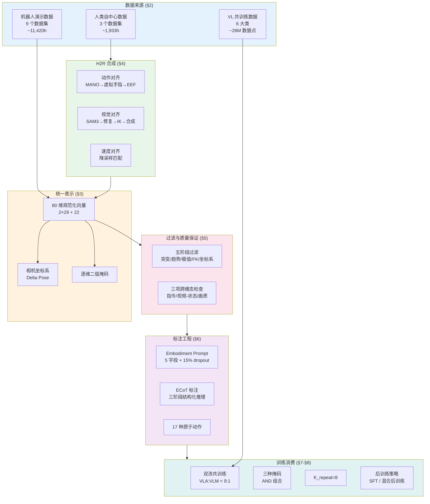
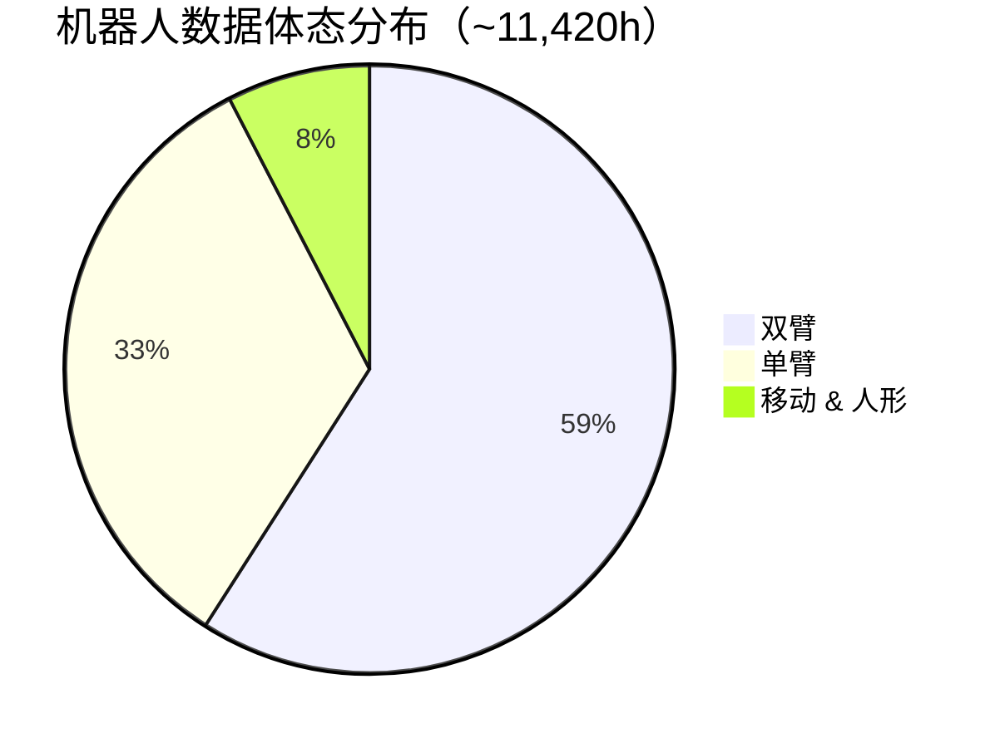
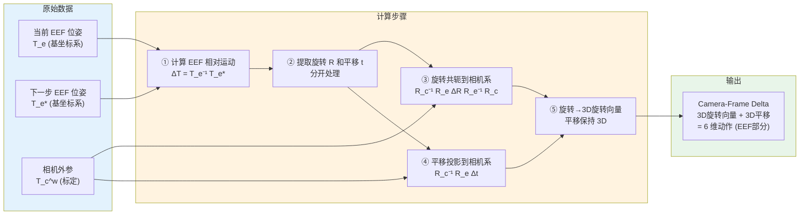
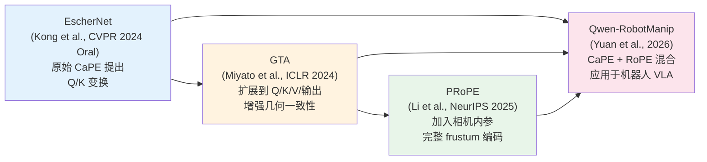
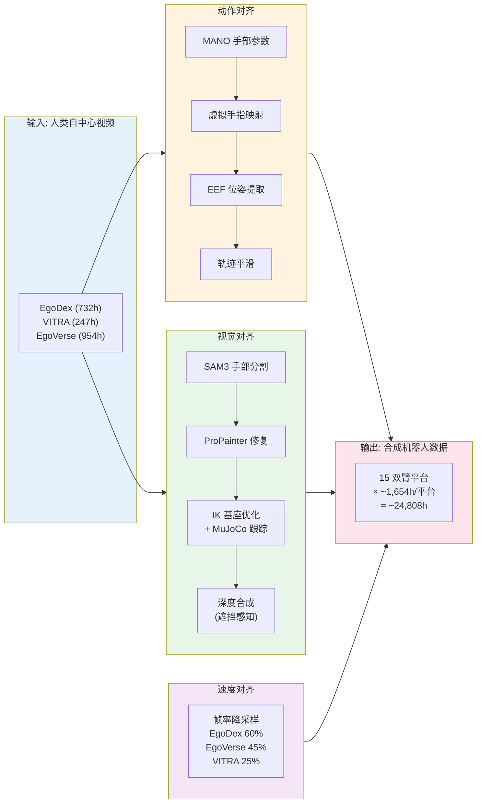
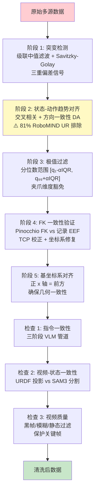
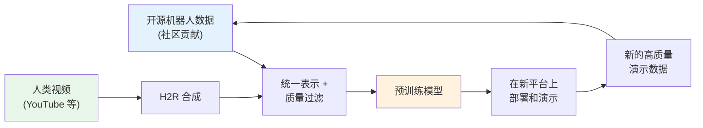

# Qwen-RobotManip 数据工程全流程深度解析

> **摘要**：本文以数据处理 pipeline 的逻辑顺序为主线，对 Qwen-RobotManip [Yuan et al., 2026] 论文中涉及数据采集、表示、合成、过滤、标注、消费和后训练的**所有**方法与做法进行逐一解析。所有关键数值和公式均来自论文 TeX 源码的精确提取，辅以官方博客和可靠第三方信息。

---

## 1. 引言：数据是 VLA 的燃料

### 1.1 VLA 模型对数据的独特需求

大语言模型（LLM）的训练数据是互联网文本——格式统一、获取成本低、规模几乎无限。但机器人操控的 Vision-Language-Action（VLA）模型面临着截然不同的数据困境 [Yuan et al., 2026]：

| 挑战维度 | LLM 数据 | VLA 数据 |
|---------|---------|---------|
| **格式统一性** | 所有文本都是 token 序列 | 不同机器人有不同自由度、坐标系、传感器 |
| **获取成本** | 互联网免费爬取 | 每小时遥操作数据需要人类操作员 + 机器人硬件 |
| **规模** | 数万亿 token | 全球公开机器人数据不到 5 万小时 |
| **数据间的冲突** | 不存在（都是 token） | 不同坐标系的动作信号互相矛盾 |
| **标注需求** | 自监督（下一个 token） | 需要精确的状态-动作对齐 |

这些挑战意味着：**VLA 模型不能简单地"堆数据"——在数据不对齐的情况下，数据越多冲突越大，性能反而下降。**

### 1.2 "先对齐，再规模化"的数据哲学

Qwen-RobotManip 的核心命题——**Alignment Unlocks Scale（对齐解锁规模）**——在数据维度有着最直接的体现 [Yuan et al., 2026]：

> "Without a unified cross-embodiment formulation, scaling data produces conflicts rather than synergy; without sufficient data diversity, even a well-aligned model cannot generalize beyond its training distribution."

翻译成数据工程语言：

```
  不对齐的数据规模化 = 冲突放大 → 性能下降
  对齐但数据不够 = 对齐框架空转 → 泛化不足
  对齐 + 规模化 = 协同效应 → 涌现能力
```

### 1.3 38,100 小时纯开源语料

Qwen-RobotManip 完全使用**开源数据**构建了 ~38,100 小时的预训练语料——不依赖任何私有遥操作数据 [Yuan et al., 2026; Qwen 官方博客]。这在 VLA 领域具有标杆意义：

| 模型 | 数据来源 | 数据规模 | 可复现性 |
|------|---------|---------|---------|
| π0 / π0.5 | 大量私有数据 + 开源 | 未公开 | ❌ |
| RT-2 | 私有 + 互联网视频 | 未公开 | ❌ |
| OpenVLA | OXE 开源子集 | ~数百小时 | ✅（但规模小） |
| **Qwen-RobotManip** | **纯开源 + H2R 合成** | **~38,100 小时** | **✅** |

### 1.4 数据 Pipeline 全局概览



---

## 2. 数据源全景：从哪里来？

Qwen-RobotManip 的训练语料由三大类数据组成 [Yuan et al., 2026]：

| 数据类别 | 来源 | 规模 | 占比 |
|---------|------|------|-----|
| 机器人演示数据 | 9 个开源数据集 | ~11,420h | 29.9% |
| 人类自中心数据 | 3 个自中心视频数据集 | ~1,933h | 5.1% |
| 人到机器人合成数据 | H2R 管道 × 15 平台 | ~24,808h | 65.0% |
| **总计** | | **~38,161h** | **100%** |

**关键洞察**：合成数据占总语料的 **65%**——H2R 管道是 Qwen-RobotManip 数据规模化的主要引擎。

### 2.1 机器人演示数据（~11,420 小时）

#### 2.1.1 数据集逐一分析

| 数据集 | 平台 | 类型 | 规模 | 特点 |
|--------|------|------|------|------|
| **OXE** (Fractal/Bridge/BC-Z) | Google Robot, WidowX | 单臂 | ~600h | 最早的大规模开源机器人数据集 |
| **AgiBotWorld-Beta** | AgiBot G1 (双臂) | 双臂 | ~2,400h | 200 种任务类型，规模最大的单一贡献者 |
| **RoboMIND + 2.0** | Franka, UR5e, AgileX, ARX, Tien Kung, Tian Yi | 混合 | ~1,400h | 6 种平台，但 **81% UR 数据被排除** |
| **Galaxea** | 双臂移动操控 | 移动双臂 | ~500h | 移动操控场景 |
| **RoboCOIN** | 10 种体态类型 | 混合 | ~430h | 体态多样性最高（10 种） |
| **DROID** | Franka Panda | 单臂 | ~500h | 86 个真实环境，95,000 条轨迹 |
| **RH20T** | Flexiv, UR5, Franka, Kuka | 混合 | ~1,100h | 140+ 任务，42 种技能类别 |
| **RDT-1B** | ALOHA | 双臂 | ~29h | 规模最小但提供双臂 ALOHA 数据 |
| **InternData-A1** | 仿真（单/双臂） | 仿真 | >3,600h | 高保真仿真，pick-and-place + 铰接物操控 |

#### 2.1.2 体态分布分析



**双臂数据占比最高（59%）**，这与 Qwen-RobotManip 的 80 维统一表示天然适配——80 维设计本身就以双臂为基础（2×29 + 22）。

#### 2.1.3 RoboMIND 81% 排除事件

这是数据工程中最引人注目的发现之一 [Yuan et al., 2026]：

> RoboMIND 的 UR 类型数据中，**81% 因状态-动作趋势失对齐被排除**。

这意味着超过四分之三的 UR 数据存在系统性的状态-动作不一致（例如：记录的动作指令与实际观测到的状态变化方向不匹配）。这一发现凸显了**盲目堆积开源数据的风险**——不经过严格过滤，低质量数据会引入系统性偏差。

### 2.2 人类自中心数据（~1,933 小时）

人类自中心（egocentric）视频提供了丰富的操控行为示范，但其数据格式与机器人数据截然不同——没有关节角度、没有控制信号，只有手部姿态和视觉观测 [Yuan et al., 2026]。

| 数据集 | 采集设备 | 使用规模 | 标注内容 | 特点 |
|--------|---------|---------|---------|------|
| **EgoDex** | Apple Vision Pro | 732h (原始 829h) | SE(3) 25 关节手部姿态 @30Hz | 设备端多相机 + 视觉惯性 SLAM 跟踪，338K 演示，194 任务 |
| **VITRA** | 混合 5 来源 | 247h | MANO 手参数空间 | Ego4D, EPIC-KITCHENS, EgoExo4D, SSv2，~1M 轨迹 |
| **EgoVerse** | 众包 | 954h (原始 1,362h) | 21 关键点/手 + 6-DoF 头部姿态 | 1,965 任务，240 场景，2,087 演示者 |

#### MANO 手模型

三个数据集的手部姿态标注最终被统一到 **MANO（hand Model with Articulated and Non-rigid defOrmations）** 参数空间 [Romero et al., 2017]：

$$
\text{MANO}: \quad \boldsymbol{\theta} \in \mathbb{R}^{45},\quad \boldsymbol{\beta} \in \mathbb{R}^{10}
$$

- $\boldsymbol{\theta}$：45 维姿态参数，编码 15 个手部关节的旋转（每个关节 3 维轴角表示）
- $\boldsymbol{\beta}$：10 维形状参数，编码手部形状的个体差异（通过 PCA 降维得到）

MANO 提供了一个**与具体传感器无关的统一手部表示**，使得来自 Apple Vision Pro、Ego4D 等不同来源的手部数据可以在同一空间中处理。

### 2.3 VL 共训练数据（~28M 数据点）

除了操控数据外，Qwen-RobotManip 还使用大规模视觉-语言（VL）数据进行共训练，以防止 VLM 骨干在动作预测优化过程中发生**灾难性遗忘**（catastrophic forgetting）[Yuan et al., 2026; Driess et al., 2025]。

#### 六大类 VL 数据

| 类别 | 内容 | 目的 |
|------|------|------|
| **通用视觉理解** | VQA、多图推理、图像描述（句子到段落级） | 维持通用视觉理解能力 |
| **空间感知与推理** | 2D/3D 定位、点定位、计数、空间关系、可行性推理 | 增强空间推理——操控的核心能力 |
| **OCR 与文档理解** | 文字/符号识别、标注物体识别 | 辅助指令理解 |
| **多模态专业知识** | STEM 问题、图表解读、视觉谜题 | 通用推理能力 |
| **指令跟随 & 多语言 & 纯文本** | 多语言控制、多样指令格式 | 语言鲁棒性 |
| **具身 VL 数据** | ECoT 推理、自中心视频理解、2D 轨迹预测 | **直接服务于操控任务** |

**VLA 流与 VLM 流的混合比例为 9:1**——即每 9 个操控样本搭配 1 个 VL 样本 [Yuan et al., 2026]。

---

## 3. 统一表示：80 维规范化向量

### 3.1 结构设计

Qwen-RobotManip 将所有机器人的状态和动作统一编码为一个 **80 维规范化向量**——无论是 7-DoF 单臂夹爪、ALOHA 双臂、还是灵巧手，都映射到同一个固定长度的表示 [Yuan et al., 2026]：

```
  80 维规范化向量结构：

  ├────────── 左臂 (29 维) ──────────┤ ├────────── 右臂 (29 维) ──────────┤ ├─ 保留 (22 维) ─┤
  │                                  │ │                                  │ │                │
  │ 关节(7) │ EEF(9) │ 夹爪(1) │ 手(12)│ │ 关节(7) │ EEF(9) │ 夹爪(1) │ 手(12)│ │ 基座/扩展(22) │
  │         │        │         │      │ │         │        │         │      │ │                │
  └──dim 0──┘        └──dim 16─┘      │ └─dim 29──┘        └──dim 45─┘      │ │                │
                                dim 28│                                dim 57│ └─dim 58 ~ 79───┘
```

每臂 29 维的语义分组 [Yuan et al., 2026]：

| 语义槽 | 维度数 | 内容 |
|--------|--------|------|
| 关节位置 | 7 | 机器人臂的关节角度 |
| 末端执行器位姿 | 9 | 笛卡尔位置(3) + 6D 连续旋转表示(6) |
| 夹爪状态 | 1 | 平行夹爪的开合程度 |
| 灵巧手关节 | 12 | 多指灵巧手的关节位置 |

**尾部 22 维保留维度**跨两臂共享，用于移动基座速度等额外自由度。

### 3.2 状态 vs 动作的坐标差异

同一个 80 维向量在表示**状态**和**动作**时使用不同的坐标约定 [Yuan et al., 2026]：

| 维度 | 状态向量 | 动作向量 |
|------|---------|---------|
| 关节位置 | 绝对值 | **绝对值** |
| EEF 位姿 | 绝对坐标 | **相对 delta**（相机坐标系） |
| EEF 方向 | 6D 连续旋转 | **3D 旋转向量**（delta） |
| 夹爪 | 绝对开合度 | 绝对开合度 |

**为什么 EEF 用相对 delta 而关节用绝对值？**

- 关节角度是**机器人特异的**——不同机器人的关节空间不可比较，绝对值保留了体态信息
- EEF 位姿在相机坐标系下的**相对 delta** 是**跨体态可比较的**——"向右移动 5cm" 在任何机器人上都有相同的视觉含义

### 3.3 Camera-Frame Delta Pose：从原始数据到统一动作表示

#### 3.3.1 问题动机：为什么不能用基坐标系？

在机器人数据集中，末端执行器（EEF）的位姿通常记录在**机器人基坐标系**（base frame）中。但不同数据集、不同机器人的基坐标系彼此不同——原点位置、轴方向、单位约定各异 [Lyu et al., 2026]。这导致一个根本性矛盾：

```
  同一个视觉动作"向右推杯子 5cm"：

  Franka (基坐标系 A):   Δx = +0.05, Δy = 0.00    ← x 轴朝右
  UR5e  (基坐标系 B):   Δx = 0.00,  Δy = -0.05   ← y 轴朝左
  ALOHA (基坐标系 C):   Δx = -0.05, Δy = 0.00    ← x 轴朝左

  → 在图像中看起来完全一样的动作，在数据中是三组不同的数值！
  → 模型必须学会"同一视觉动作在不同坐标系下的不同编码"——浪费容量，引入冲突
```

**Camera-Frame Delta Pose** 的核心思想是：将动作表达在**相机坐标系**中——因为相机是模型"看"世界的窗口，在相机坐标系下，**视觉上相似的动作在数值上也相近** [Chen et al., 2025; Yuan et al., 2026]。

#### 3.3.2 数据处理流程

从原始数据到 Camera-Frame Delta Pose 的完整处理步骤：



**关键前提**：这一转换需要**标定的相机内外参**——即相机相对于机器人基座（或世界坐标系）的精确位姿 ${}^w_c\mathbf{T}$。训练和推理时都需要这些参数 [Yuan et al., 2026]。

#### 3.3.3 公式推导与直觉

设 $c$ 为参考相机坐标系，$e$ 为当前 EEF 坐标系，$e^*$ 为下一时刻目标 EEF 坐标系。

论文考虑了两种公式 [Yuan et al., 2026]：

**公式 1（可分离形式，被采用）**：

$$
\mathbf{a}_p = \begin{bmatrix} {}^c_e\mathbf{R}\; {}^e_{e^*}\mathbf{R}\; {}^e_c\mathbf{R} & {}^c_e\mathbf{R}\; {}^e\mathbf{t}_{e^*} \\ \mathbf{0} & 1 \end{bmatrix}
$$

**符号定义**：

| 符号 | 含义 | 几何直觉 |
|------|------|---------|
| ${}^c_e\mathbf{R}$ | 从 EEF 坐标系到相机坐标系的旋转 | "站在相机的视角看 EEF" |
| ${}^e_{e^*}\mathbf{R}$ | EEF 从当前到目标的相对旋转 | "EEF 自身旋转了多少" |
| ${}^e_c\mathbf{R}$ | 从相机坐标系到 EEF 坐标系的旋转 | $= ({}^c_e\mathbf{R})^{-1}$ |
| ${}^e\mathbf{t}_{e^*}$ | EEF 坐标系下的位移向量 | "EEF 自身坐标系中移动了多少" |

**旋转部分的共轭变换**直觉：

$$
{}^c_e\mathbf{R}\; {}^e_{e^*}\mathbf{R}\; {}^e_c\mathbf{R} = {}^c_e\mathbf{R}\; {}^e_{e^*}\mathbf{R}\; ({}^c_e\mathbf{R})^{-1}
$$

这是一个经典的**相似变换（similarity transformation）**——将 EEF 坐标系中的旋转 ${}^e_{e^*}\mathbf{R}$ "搬运"到相机坐标系中表达。好比把一个在局部坐标系里描述的旋转"翻译"成在另一个坐标系里的等价描述。

```
  坐标变换链：

  相机系 (c) ──R_c→e──→ EEF系 (e) ──R_e→e*──→ 目标EEF系 (e*) ──R_e*→c──→ 相机系 (c)
       ↑                                                              ↑
       └──────────────── 整体效果：相机系中的旋转变化 ─────────────────┘

  平移部分：
  EEF系 (e) ──t_e→e*──→ 目标位置       ──R_c→e 投影──→ 相机系下的位移
       ↑                                                    ↑
       └─── 只经过旋转投影，不与 R_e→e* 耦合 ───────────────┘
```

**公式 2（紧凑形式，被拒绝）**：

$$
\mathbf{a}_p = {}^c_{e^*}\mathbf{T}\; {}^e_c\mathbf{T}
$$

等价于将整个 SE(3) 变换一次性共轭。看起来更优雅，但它的**平移分量**会展开为：

$$
\mathbf{t}_{\text{公式2}} = {}^c_e\mathbf{R}\; {}^e_{e^*}\mathbf{R}\; {}^e\mathbf{t}_c + {}^c_e\mathbf{R}\; {}^e\mathbf{t}_{e^*}
$$

相比公式 1 的平移 $\mathbf{t}_{\text{公式1}} = {}^c_e\mathbf{R}\; {}^e\mathbf{t}_{e^*}$，多出了 ${}^c_e\mathbf{R}\; {}^e_{e^*}\mathbf{R}\; {}^e\mathbf{t}_c$ 一项——它将**相对旋转 ${}^e_{e^*}\mathbf{R}$** 和**相机到 EEF 的偏移 ${}^e\mathbf{t}_c$** 耦合在一起 [Yuan et al., 2026]。

**为什么选择公式 1？**
1. **避免长尾分布**：公式 2 中耦合项的大小取决于 $\|{}^e\mathbf{t}_c\|$（相机到 EEF 的距离），当腕部相机距 EEF 较远时，即使微小的旋转也会产生较大的平移分量——形成长尾分布，增加学习难度
2. **降低标定敏感性**：公式 1 的平移只需要 ${}^c_e\mathbf{R}$（旋转外参），而公式 2 还需要 ${}^e\mathbf{t}_c$（平移外参），额外依赖的参数越多，标定误差的传播越严重
3. **消除 EEF 定义不一致**：不同机器人的 EEF 坐标系原点定义不同（工具中心点位置各异），公式 2 对此更敏感

#### 3.3.4 Per-End-Effector Token 提取

80 维规范化向量不是直接送入 DiT，而是先提取为 $N_{\text{ee}} \in \{1, 2\}$ 个独立的 **40 维 per-end-effector token** [Yuan et al., 2026]：

- 从每臂 29 个活跃维度中提取，填充到 40 维槽位（11 维保留用于扩展）
- 单臂系统提取 1 个 token，双臂系统提取 2 个 token
- DiT 通过 self-attention 联合处理这些 token——双臂 token 之间可以通过注意力交换协调信息

#### 3.3.5 Multi-view 参考相机选择

Camera-frame delta 需要一个**参考相机**来定义坐标系。当有多个视角时，如何选择？[Yuan et al., 2026]

| 场景 | 策略 | 具体做法 |
|------|------|---------|
| **单臂数据集** | 随机选择 | 从所有可用的外部或腕部视角中随机选一个作为参考 |
| **双臂数据集（策略 1）** | 共享参考 | 两臂共用头部相机或第三方视角 |
| **双臂数据集（策略 2）** | 分臂参考 | 左臂用左腕相机，右臂用右腕相机 |

训练时**随机切换**这两种策略——增加数据多样性，防止模型依赖特定的相机-手臂配对。

#### 3.3.6 后备机制：无标定参数时的退化

并非所有数据集都提供标定的相机参数。论文通过一个**辅助标志嵌入（auxiliary flag embedding）**来处理这种情况 [Yuan et al., 2026]：

- 二值标志，指示当前样本是否具有标定的相机参数
- 通过 adaLN（自适应层归一化）注入 DiT
- **有标定**：动作在 camera-frame delta 空间中预测
- **无标定**：动作退化为 robot-base relative 空间中预测

这使模型能够从两类数据中学习，而不是丢弃缺少标定的数据。

### 3.4 Camera Positional Encoding (CaPE)：将相机几何注入注意力机制

Camera-Frame Delta Pose 解决了"动作值在哪个坐标系"的问题，但 DiT 的注意力机制本身并不知道相机在哪里——它看到的只是一系列 image token 和 state/action token。**CaPE（Camera Positional Encoding）** 将相机的三维几何信息直接编码到注意力计算中，使模型能够推理视角之间的空间关系 [Yuan et al., 2026; Kong et al., 2024]。

#### 3.4.1 学术谱系：从视觉合成到机器人操控

CaPE 并非 Qwen-RobotManip 的原创——它源自计算机视觉中的多视角生成模型，经过几代演进后被引入机器人 VLA [Yuan et al., 2026]：



| 方法 | 来源 | 变换对象 | 编码内容 | 特点 |
|------|------|---------|---------|------|
| **CaPE** | EscherNet [Kong et al., 2024] | Q, K | SE(3) 外参 | 首次将相机位姿作为位置编码 |
| **GTA** | Miyato et al. [ICLR 2024] | Q, K, V, 输出 | SE(3) 外参 | 对 value 和输出也施加变换，增强几何一致性 |
| **PRoPE** | Li et al. [NeurIPS 2025] | Q, K, V, 输出 | 完整投影矩阵 $\mathbf{P} = \mathbf{K} \cdot \mathbf{T}$ | 加入内参 $\mathbf{K}$，捕获 FOV 差异 |
| **Qwen-RobotManip** | Yuan et al. [2026] | Q, K, V, 输出 | SE(3) 外参 + 内参分离处理 | CaPE(32d) + RoPE(32d) 混合 |

#### 3.4.2 CaPE 的数学原理

**核心思想**：标准 Transformer 的位置编码（如 RoPE）只编码 token 的**序列位置**（第几个 token），不知道 token 对应的**空间位置**（来自哪个相机的哪个角度）。CaPE 用相机外参矩阵构造一种**旋转位置编码**，使注意力的点积自动编码两个 token 之间的**相对相机位姿** [Kong et al., 2024]。

**标准 dot-product attention**：

$$
\text{Attn}(Q, K, V) = \text{softmax}\left(\frac{QK^\top}{\sqrt{d}}\right) V
$$

**CaPE 修改后的 attention**（EscherNet 原始版本）：

$$
\text{Attn}_{\text{CaPE}}(Q, K, V) = \text{softmax}\left(\frac{(\mathbf{D}^\top Q)(\mathbf{D}^{-1} K)^\top}{\sqrt{d}}\right) V
$$

其中 $\mathbf{D}_t$ 是由第 $t$ 个 token 对应的相机外参 $\mathbf{T}_t^{cw} \in \text{SE}(3)$ 构造的 **block-diagonal 矩阵**：

$$
\mathbf{D}_t = \mathbf{I}_{d/4} \otimes \mathbf{T}_t^{cw} \quad \in \mathbb{R}^{d \times d}
$$

即将 $4 \times 4$ 的相机外参矩阵沿对角线重复 $d/4$ 次，构成一个 $d \times d$ 的分块对角矩阵。

**关键性质——全局坐标系自动消去**：

$$
\mathbf{D}_{t_1}^\top \mathbf{D}_{t_2}^{-1} = \mathbf{I}_{d/4} \otimes \left(\mathbf{T}_{t_1}^{cw} \cdot (\mathbf{T}_{t_2}^{cw})^{-1}\right) = \mathbf{I}_{d/4} \otimes \mathbf{T}_{t_1 \to t_2}^{\text{rel}}
$$

在 $QK^\top$ 的点积中，两个 token 的 CaPE 变换相互作用，**只留下它们之间的相对相机位姿** $\mathbf{T}_{t_1 \to t_2}^{\text{rel}}$——无论世界坐标系的原点在哪里，结果都一样。

```
  CaPE 直觉：

  Token 1 (来自相机 A)              Token 2 (来自相机 B)
  ┌─────────────────┐              ┌─────────────────┐
  │ Q₁ × D_A^⊤      │              │ K₂ × D_B^{-1}   │
  └────────┬────────┘              └────────┬────────┘
           │                                │
           └──────── dot product ───────────┘
                         │
                    Q₁ᵀ D_A^⊤ D_B^{-1} K₂
                         │
                    Q₁ᵀ (T_rel) K₂      ← 只包含 A→B 的相对位姿！
                                           世界坐标系的选择无关紧要
```

**Qwen-RobotManip 采用 GTA 扩展版本**——不仅变换 Q 和 K，还对 V 和 attention 输出施加变换 [Miyato et al., 2024]：

$$
\text{Attn}_{\text{GTA}}(Q, K, V) = \mathbf{D} \cdot \text{softmax}\left(\frac{(\mathbf{D}^\top Q)(\mathbf{D}^{-1} K)^\top}{\sqrt{d}}\right) (\mathbf{D}^{-1} V)
$$

对 V 和输出也施加变换意味着**特征聚合也是几何感知的**——不仅"看哪里"（attention weights）考虑几何，"看到什么"（value aggregation）也考虑几何。

#### 3.4.3 Qwen-RobotManip 的具体实现

**维度分配**：在 DiT 的每个 64 维 attention head 中 [Yuan et al., 2026]：

```
  64 维 attention head：

  ├──────── CaPE (32 维) ────────┤ ├──────── RoPE (32 维) ────────┤
  │                              │ │                              │
  │  编码相机的 3D 空间几何       │ │  编码 token 的时间索引        │
  │  (相机在哪里? 朝哪看?)       │ │  (这是第几步? 哪个时刻?)     │
  │                              │ │                              │
  └──────────────────────────────┘ └──────────────────────────────┘

  CaPE: 空间几何感知 ← 来自 EscherNet
  RoPE: 时间序列感知 ← 来自 RoFormer [Su et al., 2021]
```

**CaPE 和 RoPE 互补**：CaPE 编码"这个 token 来自 3D 空间的哪个视角"，RoPE 编码"这个 token 在时间序列中的位置"。二者正交——一个管空间，一个管时间。

**不同 token 类型的 CaPE 来源**：

| Token 类型 | CaPE 编码来源 | 说明 |
|-----------|-------------|------|
| **Image token** | 对应相机自身的外参 | 每个视角的 image patch 用各自相机的位姿编码 |
| **State/Action token** | 选定的参考相机的外参 | 引导 DiT 在该参考相机的坐标系下去噪 |

当一个 state/action token 对多个视角的 image token 做 cross-attention 时：
- State token 的 CaPE 来自参考相机 A
- Image token 的 CaPE 来自各自的相机（A, B, C...）
- 点积中自动编码了参考相机 A 与每个视角相机之间的**相对位姿**
- 这使 DiT 知道"这个 image patch 是从距离我的参考相机多远、多大角度偏移的视角看到的"

#### 3.4.4 相机内参的处理

相机外参（位姿）通过 CaPE 编码，但相机**内参**（焦距、视场角、光心）同样影响视觉观测。Qwen-RobotManip 用一种更简单的方式处理内参 [Yuan et al., 2026]：

1. 计算每个 visual patch 在**归一化图像平面**上的坐标 $(u, v)$
2. 通过一个 **learned linear layer** 将 $(u, v)$ 投影为嵌入向量
3. **加法叠加**到对应的 image token 上

$$
\mathbf{h}_{\text{patch}}' = \mathbf{h}_{\text{patch}} + \text{Linear}(u, v)
$$

这提供了**逐 token 的视场角感知**——模型知道每个 patch 位于图像的边缘还是中心（边缘 patch 通常有更大的畸变和更宽的视角覆盖）。

#### 3.4.5 对数据处理的要求

CaPE + Camera-Frame Delta Pose 的组合对训练数据提出了明确的要求：

| 数据要求 | 用途 | 缺失时的影响 |
|---------|------|------------|
| **逐帧相机外参** $\mathbf{T}^{cw}$ | CaPE 编码 + Delta Pose 计算 | 退化为 robot-base 模式（via 辅助标志） |
| **相机内参** $\mathbf{K}$ | 内参嵌入 + patch 坐标归一化 | 假设默认内参 |
| **多视角标定** | 多视角 CaPE 相对位姿 | 仅使用单视角 |
| **EEF-相机相对位姿** | Delta Pose 坐标变换 | 无法计算 camera-frame delta |

这解释了为什么 §5.1 阶段 4（FK 一致性验证）和阶段 5（基坐标系对齐）如此重要——它们是确保 camera-frame 变换正确的**上游保障**。如果基坐标系对齐有误，camera-frame delta 的计算也会系统性偏差。

#### 3.4.6 与其他 VLA 的对比

| VLA 模型 | EEF 动作空间 | 相机几何编码 | 跨体态效果 |
|---------|------------|------------|-----------|
| OpenVLA | robot-base absolute | 无 | 差（坐标系冲突） |
| π0 / π0.5 | robot-base delta | 无 | 中等（7.5% zero-shot） |
| LDA-1B | 统一 delta | 无 | 中等 |
| **Qwen-RobotManip** | **camera-frame delta** | **CaPE + 内参嵌入** | **强（23.9% zero-shot, 3.2× vs π0.5）** |

Camera-Frame Delta Pose + CaPE 的组合使 Qwen-RobotManip 在 zero-shot 跨体态迁移上达到 23.9% 平均成功率——比 π0.5 的 joint-space 控制（7.5%）提升了 **3.2 倍** [Yuan et al., 2026]。

### 3.5 逐维二值掩码

不同机器人只占据 80 维中的一个子集。例如，7-DoF 单臂夹爪只使用 29 维中的 7(关节)+9(EEF)+1(夹爪)=17 维，其余维度为零 [Yuan et al., 2026]：

```
  单臂 Franka 的掩码:

  左臂:  [1 1 1 1 1 1 1 │ 1 1 1 1 1 1 1 1 1 │ 1 │ 0 0 0 0 0 0 0 0 0 0 0 0]
          关节 (7)        EEF (9)              夹   灵巧手 (12) = 0
                                               爪
  右臂:  [0 0 0 0 0 0 0 │ 0 0 0 0 0 0 0 0 0 │ 0 │ 0 0 0 0 0 0 0 0 0 0 0 0]
          全零 (单臂无右臂)

  保留:  [0 0 0 0 0 0 0 0 0 0 0 0 0 0 0 0 0 0 0 0 0 0]
          全零 (无移动基座)

  有效维度: 17/80 = 21.25%
```

训练时，掩码为 0 的维度**不参与损失计算**，确保不同体态的梯度信号互不干扰。

---

## 4. 人到机器人合成管道（H2R Pipeline）

H2R（Human-to-Robot）合成管道是 Qwen-RobotManip 数据规模化的核心引擎——它将 1,933 小时的人类自中心视频转化为 24,808 小时的机器人演示数据，覆盖 15 种双臂平台 [Yuan et al., 2026]。



### 4.1 动作对齐：从人手到机器人末端执行器

#### 4.1.1 虚拟手指（Virtual Finger）

人手有 5 根手指，但平行夹爪只有两个"指尖"。如何映射？Qwen-RobotManip 定义了一个**虚拟手指（virtual finger）**——食指和中指的加权组合 [Yuan et al., 2026]：

$$
\mathbf{k}_{\text{vf}} = 0.7 \cdot \mathbf{k}_{\text{index}} + 0.3 \cdot \mathbf{k}_{\text{middle}}
$$

**为什么是 0.7:0.3？** 在自然抓取中，食指承担主要的精细操控角色（如捏取），中指提供辅助支撑。这个加权使虚拟手指更接近人类抓取时的主要接触点。

#### 4.1.2 EEF 位姿提取

从虚拟手指和拇指推导出机器人的末端执行器（EEF）参数 [Yuan et al., 2026]：

- **位置**：$\mathbf{p} = \frac{1}{2}(\mathbf{k}_{\text{thumb}} + \mathbf{k}_{\text{vf}})$ （拇指与虚拟手指的中点）
- **夹爪宽度**：$w = \|\mathbf{k}_{\text{thumb}} - \mathbf{k}_{\text{vf}}\|_2$ （两者的欧氏距离）

```
  人手 → 虚拟手指 → EEF 位姿:

                       食指 (0.7)
                       ●
                      / \
  拇指 ●─────────────●   虚拟手指 = 0.7·食指 + 0.3·中指
        \            │
         \     ●─────●
          \   中指 (0.3)
           \
    EEF 位置 = ● (拇指与虚拟手指中点)
    夹爪宽度 = ‖拇指 - 虚拟手指‖₂
```

#### 4.1.3 夹爪方向构建

夹爪的三维朝向通过构建一个右手坐标系来定义 [Yuan et al., 2026]：

| 轴 | 定义 | 物理含义 |
|----|------|---------|
| **Z 轴**（jaw-line） | 拇指到虚拟手指的方向 | 夹爪的"开合方向" |
| **Y 轴**（jaw-plane normal） | 掌面法线（垂直于 Z 轴与手掌的平面） | 夹爪的"上方" |
| **X 轴**（approach） | Y × Z 的叉积 | 夹爪的"接近方向" |

**左右手符号校正**：左手和右手的掌面法线方向相反——如果不校正，同样的抓取动作在左手和右手上会产生镜像的方向向量。论文对左手施加符号翻转，确保两只手映射到一致的坐标系。

#### 4.1.4 轨迹平滑

原始手部跟踪数据包含高频噪声。论文使用两种平滑方法 [Yuan et al., 2026]：

- **位置和宽度**：Savitzky-Golay 滤波（多项式拟合的滑动窗口平滑）
- **方向**：Gaussian-weighted SLERP（球面线性插值的高斯加权版本）

**为什么方向不能用 Savitzky-Golay？** 旋转存在于 SO(3) 流形上，不能直接做线性平滑——需要使用球面插值（SLERP）来保证平滑后的旋转仍然是有效的旋转。

### 4.2 视觉对齐：用机器人替换人手

仅有动作对齐还不够——模型看到的**图像**中仍然是人手，而不是机器人。视觉对齐管道将人手从视频中"擦除"，并渲染一个执行相同动作的虚拟机器人 [Yuan et al., 2026]。

#### 4.2.1 人手擦除

1. **SAM3 分割**：使用文本提示的 SAM3 模型对每帧图像中的人手进行分割，生成二值掩码 $M_t \in \{0,1\}^{H \times W}$
2. **ProPainter 修复**：基于光流引导的视频修复模型填充人手区域，生成干净的背景序列 $\{\hat{I}_t\}$

#### 4.2.2 IK 基座优化

在渲染虚拟机器人之前，需要确定机器人**基座的最佳放置位置**——使得机器人的工作空间能够覆盖人手轨迹的空间范围 [Yuan et al., 2026]。

$$
\mathbf{T}_{\text{base}}^* = \arg\max_{\mathbf{T}_{\text{base}}} \frac{1}{|\mathcal{K}|} \sum_{k \in \mathcal{K}} \mathbb{1}\bigl[\text{IK}(\mathbf{T}_{\text{base}}^{-1}\mathbf{T}_k^{\text{ee}}) \text{ is feasible}\bigr]
$$

**直觉理解**：在轨迹的空间极端关键帧 $\mathcal{K}$ 上，寻找一个基座位姿 $\mathbf{T}_{\text{base}}^*$，使得**逆运动学（IK）可解的比例最大化**。搜索方法是以轨迹质心为中心的**网格搜索**，并且按不同机器人形态分别搜索（因为不同机器人的臂长和关节限位不同）。

#### 4.2.3 MuJoCo 渲染

确定基座位置后，使用 MuJoCo 物理引擎进行逆运动学求解，驱动虚拟机器人跟踪平滑后的 EEF 轨迹，并渲染出机器人图像 $I_t^{\text{robot}}$ 和深度图 $D_t^{\text{robot}}$。

#### 4.2.4 深度合成（遮挡感知）

最后一步是将渲染的机器人与修复后的背景合成，同时正确处理遮挡关系 [Yuan et al., 2026]：

1. **深度估计**：使用 Depth Anything v3 估计原始背景的度量深度 $D_t$
2. **遮挡掩码**：$M_t^{\text{occ}} = \mathbb{1}[D_t^{\text{robot}} \leq D_t]$ （机器人比背景更近的像素）
3. **合成**：

$$
I_t^{\text{syn}} = M_t^{\text{occ}} \odot I_t^{\text{robot}} + (1 - M_t^{\text{occ}}) \odot \hat{I}_t
$$

```
  深度合成示意:

  修复后背景 Î_t           机器人渲染 I_robot        合成结果 I_syn
  ┌──────────────┐        ┌──────────────┐        ┌──────────────┐
  │              │        │              │        │              │
  │  桌子  杯子  │    +   │   🤖 机器人  │   →    │  🤖 桌子  杯子│
  │              │        │   手臂       │        │  手臂在杯子前 │
  │              │        │              │        │  但在桌子后   │
  └──────────────┘        └──────────────┘        └──────────────┘
                           深度 < 桌子 → 显示                     
                           深度 > 杯子 → 遮挡                     
```

### 4.3 速度对齐

人类操控速度通常快于机器人遥操作。论文对每个人类数据集应用不同的降采样比例 [Yuan et al., 2026]：

| 数据集 | 原始帧率 | 降采样比例 | 等效减速 | 原因 |
|--------|---------|-----------|---------|------|
| EgoDex | 30 Hz | 60% | ~1.7× 慢 | 桌面操控，速度中等 |
| EgoVerse | 变化 | 45% | ~2.2× 慢 | 多样场景，速度偏快 |
| VITRA | 变化 | 25% | ~4× 慢 | 日常活动（如烹饪），速度最快 |

**为什么 VITRA 降采样最多？** VITRA 包含来自 Ego4D 和 EPIC-KITCHENS 的日常活动视频（如快速切菜、翻炒），人类动作速度远快于机器人遥操作。降采样到 25% 使动作速度分布与机器人数据对齐。

### 4.4 15 种机器人平台

H2R 管道为每段人类视频生成 15 种不同双臂机器人配置的合成数据 [Yuan et al., 2026]：

> Panda, UR5e, ARX-L5, xArm7, Sawyer, Kinova Gen3, IIWA, Jaco, FR3, UR10e, ViperX, WidowX, Piper, YAM, AgileX ALOHA

**为什么是 15 种？** 这些平台覆盖了学术界和工业界最常用的机器人臂——包括 6-DoF（UR5e, Sawyer）和 7-DoF（Panda, xArm7, IIWA）；不同尺寸（桌面级 WidowX vs 工业级 UR10e）；不同末端执行器（平行夹爪为主）。每种平台有不同的臂长、关节限位和外观，为跨体态预训练提供了最大化的多样性。

---

## 5. 数据过滤与质量保证

聚合来自多种体态的操控数据会引入**异构噪声**——离散异常值、时间失对齐、极端值、不一致的 EEF 约定 [Yuan et al., 2026]。Qwen-RobotManip 设计了一套**五阶段过滤管道 + 三项跨模态质量检查**来系统性地处理这些问题。



### 5.1 五阶段状态-动作过滤

#### 阶段 1：突变检测（Sudden Change Detection）

**目标**：检测轨迹中的离散异常值和瞬态不连续性（如夹爪碰撞、传感器跳变）[Yuan et al., 2026]。

**方法**：
1. 对每条轨迹施加**级联中值滤波 + Savitzky-Golay 平滑**，提取平滑趋势
2. 计算三种偏差信号：
   - **残差**：原始值与平滑值的绝对差
   - **加速度**：二阶有限差分
   - **加加速度（jerk）**：三阶有限差分
3. **标记准则**：当残差超过阈值 **AND**（加速度 OR 加加速度超过阈值）时标记该帧

**排除粒度**从帧级移除到全回合丢弃不等。例如，InternData-A1 中的突变通常意味着物理碰撞——整个回合被丢弃 [Yuan et al., 2026]。

**阈值设置**：按体态类型、旋转表示方式、真实 vs 仿真、基座是否移动分别设置阈值。

#### 阶段 2：状态-动作趋势对齐（State-Action Trend Alignment）

**目标**：验证动作指令与状态变化之间的因果一致性——动作应该**时间上领先或同步于**对应的状态变化 [Yuan et al., 2026]。

**方法**：
1. 分别平滑状态和动作轨迹
2. 通过**交叉相关**估计最优时间滞后
3. 在对齐后的一阶差分上计算**方向一致性（Directional Agreement, DA）**指标

$$
\text{DA} = \frac{1}{T}\sum_{t=1}^{T} \mathbb{1}\bigl[\text{sign}(\Delta s_t) = \text{sign}(\Delta a_{t-\tau^*})\bigr]
$$

其中 $\tau^*$ 是通过交叉相关估计的最优时间滞后。

- DA 阈值通常设为 **0.6-0.7**（按数据集调整）
- 对于 delta 动作格式的数据集：先积分恢复绝对值再计算

**关键发现**：RoboMIND UR 类型数据中 **81% 因 DA 低于阈值被排除**——这是整个管道中排除率最高的单一事件。

#### 阶段 3：极值过滤（Extreme Value Filtering）

**目标**：移除超出合理范围的帧，防止分位数归一化被极端值扭曲 [Yuan et al., 2026]。

**方法**：
- 按体态类型计算每个维度的 $q_1$ 和 $q_{99}$ 分位数
- 排除超出 $[q_1 - \alpha(q_{99} - q_1),\; q_{99} + \alpha(q_{99} - q_1)]$ 的帧
- **夹爪维度豁免**——因为夹爪状态是双峰分布（开 or 关），极值过滤会错误地移除正常状态

**归一化公式**：最终将每个维度归一化到 $[q_1, q_{99}] \to [-1, 1]$。

#### 阶段 4：关节-EEF 正运动学一致性（Joint-EEF FK Consistency）

**目标**：验证记录的关节状态与 EEF 位姿之间的物理一致性 [Yuan et al., 2026]。

**方法**：
- 使用 **Pinocchio** 库加载 URDF 模型，从记录的关节角度计算 FK（正运动学）得到的 EEF 位姿
- 与数据集中记录的 EEF 位姿进行比较

**重要发现**：这一阶段的主要功能是**数据校正而非激进过滤**——它发现并修正了：
- TCP（工具中心点）定义的常量偏移
- 双臂系统中肩部坐标系到世界坐标系的变换错误
- 同一机器人型号在不同数据集中使用**不同关节角度约定**的情况（甚至在同一数据集内！）

#### 阶段 5：基坐标系和 EEF 方向对齐

**目标**：确保所有数据集使用一致的世界坐标系约定 [Yuan et al., 2026]。

**方法**：
- 对每个数据集施加旋转校正
- 确保**正 x 轴一致对应机器人的正前方**
- 维护跨体态的几何一致性

### 5.2 三项跨模态质量检查

在状态-动作过滤之后，Qwen-RobotManip 还执行三项**跨模态一致性检查**——验证视觉、语言和动作三个模态之间的对齐 [Yuan et al., 2026]。

#### 检查 1：指令一致性（Instruction Consistency）

使用**三阶段 VLM 管道**验证语言指令是否与视频内容匹配：

1. **时间归一化**：将长回合分解为子任务级片段
2. **结构化推理引导标注**：提示 VLM 关注物体、动作语义、时间顺序、主体-环境交互
3. **多专家跨模型裁定**：多个 VLM 独立评估，通过投票确定最终标签

不一致的样本被排除。

#### 检查 2：视频-状态一致性（Video-State Consistency）

验证视频中**看到的**机器人姿态与数据中**记录的**关节状态是否匹配 [Yuan et al., 2026]：

1. 使用 URDF 模型 + 记录的关节状态，将机器人模型**投影到图像平面**
2. 使用微调的 **SAM3** 模型对实际视频中的机器人进行**语义分割**
3. 测量投影掩码与分割掩码的**重叠度**
4. 重叠度低的样本被过滤

#### 检查 3：视频质量过滤（Video Quality Filtering）

移除低质量视频帧 [Yuan et al., 2026]：

- **移除**：黑帧、损坏帧、模糊帧、长时间静态片段
- **方法**：联合图像处理 + 状态/动作信号检查
- **关键细节**：**显式保护任务关键帧**（如夹爪闭合瞬间、决定性状态转换），避免将"短暂停顿后的关键动作"误判为静态并删除

---

## 6. 数据标注工程

### 6.1 Embodiment Prompt 设计

每个训练样本都附带一个**结构化 embodiment prompt**，编码机器人的元数据信息 [Yuan et al., 2026]：

| 字段 | 示例 | 作用 |
|------|------|------|
| **Embodiment** | `robot_aloha` | 区分不同机器人平台的形态和控制特性 |
| **Instruction** | `Put the cup on the plate` | 任务语义描述 |
| **Speed** | `500` (步数, 按 500 步离散化) | 编码轨迹动态特性 |
| **FPS** | `15` | 时间采样率 |
| **Camera View Direction** | `arm side` / `opposite side` | 相机相对机器人臂的方位 |

**15% 概率随机丢弃** embodiment、speed 和 fps 字段——强制模型在部分信息缺失时也能泛化 [Yuan et al., 2026]。

消融实验表明 [Yuan et al., 2026]：

| 提示类型 | 平均成功率 |
|---------|-----------|
| 无提示（基线） | 62.7% |
| 可学习软提示 | 61.2%（反而下降） |
| 自然语言提示 | 63.4% |
| **结构化提示** | **65.9%** |

**可学习软提示为何失败？** 软提示（learned soft tokens）缺乏可解释的语义锚点，在训练数据有限的情况下容易过拟合到特定体态，泛化能力反而不如显式的结构化提示。

### 6.2 ECoT（Embodied Chain-of-Thought）标注管道

ECoT 是一种结构化推理标注，让模型在预测动作之前先"思考" [Yuan et al., 2026]。

#### 标注流程

1. 在轨迹中采样时间戳 $t$，提取多视角观测（前方、腕部、侧方）
2. 为 VLM 准备三种**标注时特权信息**（仅在标注时使用，训练时不提供）：
   - **记忆摘要（Memory Summary）**：从回合开始到 $t$ 均匀采样帧，VLM 总结已完成的动作和状态变化
   - **未来动作预览（Future Action Preview）**：从 $t$ 开始以 1 秒间隔采 6 帧，VLM 总结即将发生的行为
   - **时间进度（Temporal Progress）**：轨迹中的相对位置（弱监督信号）
3. 使用 **Qwen3.6-Plus（thinking mode）** 生成三部分结构化推理：

| 推理阶段 | 内容 | 示例 |
|---------|------|------|
| **场景描述** | 物体、空间关系、臂位置、夹爪状态 | "红色杯子在桌面中央，左臂夹爪张开，距杯 10cm" |
| **任务进度评估** | 已完成子目标、明确的完成判断 | "Task not yet complete. 左臂已到达杯子上方，但尚未闭合夹爪。" |
| **下一步动作** | 从 17 种原子动作中选择一个 | "Reach: 左臂向下移动并闭合夹爪抓取杯子" |

**训练时**：模型只接收多视角图像 + 任务指令，需要**自主生成**完整的 ECoT 文本——特权信号被排除，模型必须从视觉观测中推断场景和进度。

### 6.3 17 种原子动作类型

ECoT 的"下一步动作"从一个**封闭的原子动作词汇表**中选择 [Yuan et al., 2026]：

| 类别 | 动作类型 |
|------|---------|
| **运动 (2)** | Reach（接近并抓取）、Move（移动并释放） |
| **操控 (11)** | Flip（翻转）、Rotate（旋转）、Toggle（切换）、Open（打开）、Close（关闭）、Push（推）、Pull（拉）、Insert（插入）、Press（按压）、Click（点击）、Strike（敲击） |
| **特殊 (4)** | Handover（交接）、Return to home（回到初始位姿）、Other（其他）、Wait（等待） |

### 6.4 自中心视频理解标注

将自中心视频切分为 **1.5-3 秒**的短片段，每个片段均匀采样 **4 帧**（0%, 33%, 67%, 100% 位置），使用 VLM 描述 [Yuan et al., 2026]：

- 手/臂的运动方向和幅度
- 手-物体交互（抓取、释放、推动等）
- 物体状态变化（开→关、倒→立等）

**低运动片段被过滤**——如果连续帧间变化极小，该片段不提供有意义的操控信息。

### 6.5 2D 轨迹预测标注

将 EEF 和人手的 3D 轨迹**投影到图像空间**，生成归一化的 2D 坐标序列 [Yuan et al., 2026]。使用边界框准则过滤掉运动幅度过小的样本。

---

## 7. 训练时的数据消费策略

### 7.1 双流共训练

训练时同时使用两个数据流 [Yuan et al., 2026]：

```
  双流共训练架构:

  VLA 流（90%）                          VLM 流（10%）
  ┌──────────────────────┐              ┌──────────────────────┐
  │ 图像 + 指令 + 状态    │              │ 图像 + 文本 QA       │
  │     ↓                │              │     ↓                │
  │  VLM 骨干            │              │  VLM 骨干            │
  │     ↓                │              │     ↓                │
  │  DiT 动作头          │              │  自回归文本解码        │
  │     ↓                │              │     ↓                │
  │  L_FM (flow matching)│              │  L_VLM (next-token)  │
  └──────────────────────┘              └──────────────────────┘
           │                                     │
           └──────────── L = L_FM + λ·L_VLM ─────┘
                         λ = 0.1
```

**9:1 比例的设计逻辑**：VLA 数据是主要学习目标（动作预测），VLM 数据是**正则化**——防止 VLM 骨干在动作训练中丢失视觉和语言理解能力。$\lambda = 0.1$ 确保 VLM 损失提供稳定化约束而不压倒动作学习 [Yuan et al., 2026]。

### 7.2 三种训练掩码

训练损失仅在**有效条目**上计算，通过三种掩码的 AND 组合实现 [Yuan et al., 2026]：

| 掩码类型 | 维度 | 掩码逻辑 | 目的 |
|---------|------|---------|------|
| **Per-dimension Slot Mask** | 空间（D 维） | 当前体态使用的维度 = 1，未使用 = 0 | 梯度隔离，防止不同体态互相干扰 |
| **Step Validity Mask** | 时间（T 步） | 异常后全部截断（因果一致性） | 防止学习被污染的因果链 |
| **Per-hand Validity Mask** | 时空（T × 手臂维度） | 手出视野后该手臂全部掩码 | 防止学习不可见的手部动作 |

三种掩码 AND 组合后，**masked flow matching loss** 按有效条目归一化 [Yuan et al., 2026]：

$$
\mathcal{L}_{\mathrm{FM}} = \frac{1}{B}\sum_{i=1}^{B}
    \frac{\sum_{t,j}\, m_{i,t,j}\,\bigl(f_\theta(\mathbf{x}_{i,t},\, t_i,\, \mathbf{s}_i,\, \mathbf{o}_i)_{j} - v_{i,t,j}\bigr)^2}
         {\sum_{t,j}\, m_{i,t,j}}
$$

**归一化的关键作用**：确保每个样本对梯度的贡献平等——不论其有多少有效维度，防止"维度多的体态支配训练"。

### 7.3 $K_{\text{repeat}} = 8$ 与数据效率

对每个训练样本，VLM forward pass 只执行**一次**，但 DiT 用 8 组独立的噪声 $(\boldsymbol{\epsilon}_k, t_k)$ 分别 forward 8 次 [Yuan et al., 2026]：

- VLM 输出被**缓存**，8 次 DiT forward 共享
- 8 组 $(\boldsymbol{\epsilon}_k, t_k)$ 完全独立，覆盖不同噪声水平
- **不增加数据消耗**（同一样本不同"噪声角度"）
- 梯度方差降低至 $\sigma^2/8$

### 7.4 上下文适配的数据采样

In-context policy adaptation 的上下文窗口使用**随机位置采样**而非最近 $H$ 步 [Yuan et al., 2026]：

> "Rather than always supplying the H chunks immediately preceding the current step, the context window is drawn from a random position within the episode."

这迫使模型从整个回合的行为模式中推理，而不是利用时间临近性作为捷径——一种**课程多样化（curriculum diversification）**策略。

---

## 8. 后训练数据策略

### 8.1 标准领域 SFT

后训练（post-training）与预训练在数据处理上有几个关键差异 [Yuan et al., 2026]：

| 方面 | 预训练 | 后训练 SFT |
|------|--------|-----------|
| **损失函数** | $\mathcal{L}_{\text{FM}} + \lambda \cdot \mathcal{L}_{\text{VLM}}$ | 仅 $\mathcal{L}_{\text{FM}}$ |
| **数据过滤** | 五阶段过滤管道启用 | **禁用**（训练在完整未过滤数据上） |
| **数据增强** | 无 | **Color jitter**（颜色抖动） |
| **训练规模** | 全量 GPU，长训练 | 更少 GPU，更少步数 |
| **数据来源** | 全部异构预训练语料 | 目标领域的全部演示数据合并为单一训练集 |

**为什么后训练禁用过滤？** 预训练面对的是海量异构数据，过滤是必要的质量保障。但后训练面对的是**目标领域的特定数据集**，通常已经经过基准提供者的质量控制——禁用过滤可以保留每一条有效演示，最大化领域覆盖。

**为什么加 color jitter？** 后训练数据通常来自单一环境，视觉多样性有限。Color jitter 增加了颜色、亮度、对比度的随机扰动，作为一种轻量级的数据增强来提升视觉鲁棒性。

### 8.2 混合后训练（Mixed Post-Training）

标准 SFT 存在一个严重风险——**VLA-to-VA 降级**：模型在后训练中过度拟合基准数据的视觉模式，退化为"看图执行"而忽略语言指令 [Yuan et al., 2026]。

#### 三个根因

| 根因 | 说明 |
|------|------|
| **有限的 SFT 数据多样性** | 视觉布局和指令表达集中，模型容易学到场景模式与动作之间的捷径关联 |
| **训练-测试视觉重叠** | 训练集和测试集共享相似的视觉模式，基准分数通过模式记忆而非真正语言理解达成 |
| **弱组合基础能力** | 缺乏强组合性理解的模型倾向于将语言视为弱上下文信号，动作越来越由视觉捷径主导 |

#### 缓解策略

混合后训练不仅使用基准训练集，还**共训练一个按分布邻近度（distributional proximity）筛选的预训练数据子集** [Yuan et al., 2026]：

```
  标准 SFT:

  基准训练集 ──→ 后训练 ──→ 可能 VLA→VA 降级


  混合后训练:

  基准训练集 ─────────┐
                      ├──→ 联合训练 ──→ 保持语言条件化
  预训练子集 ─────────┘
  (按分布邻近度筛选)
```

**关键发现**：UnifiedEEF（统一末端执行器表示）是混合后训练的**先决条件** [Yuan et al., 2026]：
- 有 UnifiedEEF + 混合后训练：75.8%（最佳）
- 无 UnifiedEEF + 标准 SFT：71.6%
- 无 UnifiedEEF + 混合后训练：**0.0%（完全崩溃）**

没有统一表示，外部数据的引入导致**表示空间冲突**，策略完全崩溃。

---

## 9. 数据消融实验

### 9.1 数据规模效应

从完整预训练数据的 **1%, 5%, 10%, 25%, 50%, 100%** 子集训练，在 15 种体态 154 个任务的 OOD 验证集上评估 [Yuan et al., 2026]。

**关键发现**：

| 观测 | 含义 |
|------|------|
| Ours 和 w/o UnifiedEEF 展现**近似对数线性**的缩放律 | 统一表示使数据规模化产生稳定收益 |
| w/o UnifiedSpace 的缩放曲线**不稳定**，MSE 远高 | 没有对齐的数据堆积是有害的 |
| **IID Easy 设定下无明显上升趋势** | IID 评估无法捕捉预训练收益 |
| OOD Hard 设定下 Ours 稳定改善（至 56.6%） | OOD 评估才能揭示数据规模化的真正价值 |

**核心启示**：数据规模效应只有在**对齐的表示 + OOD 评估**条件下才能被观测到。IID 基准上的数据缩放实验会得出误导性结论——"数据量不影响性能"。

### 9.2 H2R 数据消融

在固定 7:3 机器人:辅助数据比例下，测试三种配置 [Yuan et al., 2026]：

**RoboTwin-Clean2Rand 上的 H2R 消融**：

| 配置 | Easy | Background | Light | Clutter | Height | **Hard** |
|------|------|------------|-------|---------|--------|----------|
| Robot-only | 72.9 | 70.4 | 70.3 | 57.2 | 67.8 | 54.7 |
| + Ego（原始自中心数据） | 73.4 | 70.6 | 71.7 | **59.2** | 70.2 | 55.0 |
| **+ H2R（管道合成）** | **74.2** | **71.4** | **73.3** | 58.1 | **71.0** | **58.7** |

**LIBERO-Plus 上的 H2R 消融**：

| 配置 | Camera | Robot | Language | ... | **Total** |
|------|--------|-------|----------|-----|-----------|
| Robot-only | 72.8 | 78.2 | 88.7 | ... | 87.1 |
| + Ego | 77.7 | 79.0 | 88.5 | ... | 88.4 |
| **+ H2R** | **80.0** | **80.2** | **89.3** | ... | **89.0** |

**Robot-only → +Ego → +H2R 单调递增**，确认 [Yuan et al., 2026]：
- 原始自中心数据通过**视觉多样性**贡献增益
- H2R 管道通过**动作和视觉对齐**解锁额外增益
- **Camera 维度改善最大**（+7.2），因自中心数据天然提供多样化视角

### 9.3 VL 共训练消融

| 基准 | 完整模型 | 去除 VL 数据 | 下降 |
|------|---------|------------|------|
| LIBERO（简单） | 99.1 | 98.2 | -0.9 |
| LIBERO-Plus（OOD） | 90.1 | 88.9 | -1.2 |
| RT-C2R Easy | 73.2 | 66.5 | **-6.7** |
| RT-C2R Hard | 62.6 | 54.4 | **-8.2** |
| RoboTwin-IF | 71.6 | 64.6 | **-7.0** |

**规律**：VL 数据的重要性随任务复杂性和 OOD 程度**单调递增** [Yuan et al., 2026]。简单基准上仅损失 ~1 点，但在需要空间推理、视角泛化和指令理解的复杂场景中，损失 **6-8 点**——VL 共训练是维持这些高阶能力的关键。

---

## 10. 关键洞见与反思

### 10.1 开源 vs 私有数据路线

Qwen-RobotManip 用纯开源数据 + 系统化合成管道击败了依赖大量私有数据的 π0.5——这一结果的意义超越了技术本身 [Yuan et al., 2026]：

> "The data barrier for manipulation foundation models may be lower than commonly assumed, provided the right synthesis and curation infrastructure is in place."

翻译为数据工程语言：**重要的不是数据的"独占性"，而是数据的"对齐性"和"清洁度"。**

### 10.2 "对齐解锁规模"在数据维度的含义

数据消融实验（§9.1）给出了最直接的证据：

```
  无对齐（w/o UnifiedSpace）:
  数据 ↑ → MSE 不稳定 → 性能不可预测 ← 冲突信号累积

  有对齐（Ours）:
  数据 ↑ → MSE 稳定下降 → 性能对数线性提升 ← 协同信号累积
```

对齐不是让数据"更好"，而是让数据"可累积"——将异构数据从**零和博弈**（互相冲突）转变为**正和博弈**（互相增强）。

### 10.3 合成数据的局限

论文坦承 [Yuan et al., 2026]：

> "The human-to-robot synthesis pipeline, while scalable, introduces distributional gaps from retargeting approximations and inpainting artifacts that bound the effective quality of synthesized data."

合成数据的两大局限：
1. **重定向近似**：人手到机器人的映射（虚拟手指、IK 优化）是近似的——机器人不可能完美复制人手的灵活性
2. **修复伪影**：ProPainter 修复的背景可能包含视觉伪影（模糊、纹理不连续），与真实环境有差距

### 10.4 数据飞轮效应

Qwen-RobotManip 的数据管道暗示了一个**数据飞轮**：



随着开源社区贡献更多数据、H2R 管道覆盖更多平台，训练语料持续增长——而对齐框架确保增长是**有益的**而非冲突的。

---

## 11. 参考文献

1. **Yuan, H. et al.** (2026). Qwen-RobotManip Technical Report: Alignment Unlocks Scale for Robotic Manipulation Foundation Models. *arXiv:2606.17846*. [链接](https://arxiv.org/abs/2606.17846)
2. **Qwen 官方博客** (2026). Qwen-RobotManip: Alignment Unlocks Scale for Robotic Manipulation Foundation Models. [链接](https://qwen.ai/blog?id=qwen-robotmanip)
3. **Alibaba Cloud Blog** (2026). Entering the Physical AI Era: Introducing the Qwen-Robot Suite. [链接](https://www.alibabacloud.com/blog/entering-the-physical-ai-era-introducing-the-qwen-robot-suite_603261)
4. **Romero, J. et al.** (2017). Embodied Hands: Modeling and Capturing Hands and Bodies Together. *ACM ToG*.
5. **Driess, T. et al.** (2025). Knowledge Distillation Prevents Catastrophic Forgetting in VLA Models.
6. **Padalkar, A. et al.** (2023). Open X-Embodiment: Robotic Learning Datasets and RT-X Models. *arXiv:2310.08864*.
7. **Chi, C. et al.** (2025). Diffusion Policy: Visuomotor Policy Learning via Action Diffusion. *IJRR*.
8. **Shaw, K. et al.** (2025). EgoDex: Learning Dexterous Manipulation from Large-Scale Egocentric Video.
9. **EgoVerse** (2025). EgoVerse: Egocentric Data for Robot Learning from Around the World. [GitHub](https://github.com/GaTech-RL2/EgoVerse)
10. **Fang, X. et al.** (2026). When Vision Overrides Language: Evaluating and Mitigating Counterfactual Failures in VLAs. *arXiv:2602.17659*.
11. **Zhou, Y. et al.** (2019). On the Continuity of Rotation Representations in Neural Networks. *CVPR 2019*.
12. **Physical Intelligence** (2025). π0.5: A Vision-Language-Action Model with Open-World Generalization.
13. **Themoonlight.io** (2026). Literature Review: Qwen-RobotManip Technical Report. [链接](https://www.themoonlight.io/en/review/qwen-robotmanip-technical-report-alignment-unlocks-scale-for-robotic-manipulation-foundation-models)
14. **Kong, X. et al.** (2024). EscherNet: A Generative Model for Scalable View Synthesis. *CVPR 2024 Oral*. [链接](https://arxiv.org/abs/2402.03908) — CaPE（Camera Positional Encoding）的原始提出者。
15. **Miyato, T. et al.** (2024). GTA: A Geometry-Aware Attention Mechanism for Multi-View Transformers. *ICLR 2024*. [链接](https://arxiv.org/abs/2310.10375) — 将 CaPE 扩展到 Q/K/V/输出的四路变换。
16. **Li, R. et al.** (2025). Cameras as Relative Positional Encoding (PRoPE). *NeurIPS 2025*. [链接](https://arxiv.org/abs/2507.10496) — 加入相机内参的完整 frustum 编码。
17. **Lyu, J. et al.** (2026). LDA-1B: Scaling Latent Dynamics Action Model via Universal Embodied Data Ingestion. *RSS 2026*. [链接](https://arxiv.org/abs/2602.12215) — 跨体态坐标系碎片化问题的讨论。
18. **Su, J. et al.** (2021). RoFormer: Enhanced Transformer with Rotary Position Embedding. *arXiv:2104.09864*. [链接](https://arxiv.org/abs/2104.09864) — RoPE 旋转位置编码。
19. **Chen, T. et al.** (2025). Toward Cross-Robot Transferable Manipulation. — Camera-frame delta pose 动作表示的思想来源。
20. **Zhang, Y. et al.** (2026). Grounding Robot Manipulation with Camera-Frame Actions. — Camera-frame delta pose 紧凑公式（公式 2）的来源。

---

> **免责声明**：本文基于 Qwen-RobotManip 论文 TeX 源码、官方博客和可靠第三方分析撰写。所有关键数值和公式均来自 TeX 源码的精确提取。
>
> **最后更新**：2026 年 6 月 27 日
