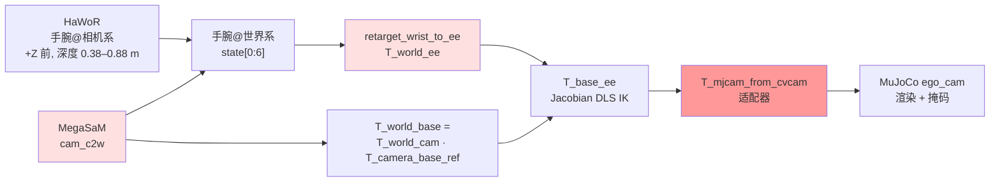
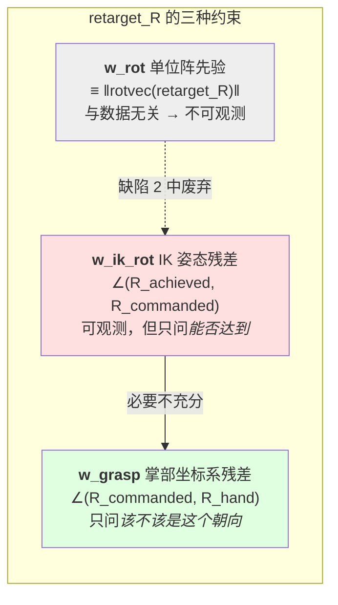

# Hand→Robot 渲染链路缺陷排查与修复报告

> **范围**：`data_juicer/_au` 中「人手腕位姿 → R1 Lite 末端 → MuJoCo 渲染合成」的标定与渲染链路
> **对应设计**：[`hand_to_robot_render_design.md`](./hand_to_robot_render_design.md)、[`hand_to_robot_code_design_summary.md`](./hand_to_robot_code_design_summary.md)
> **触发问题**：`robot_frames` 渲染出的仍是人手，机械臂完全不出现；机械臂渲染出来后，夹爪朝向与人手不一致
> **日期**：2026-07-28

---

## 1. 一句话结论

表面症状是「机械臂渲染不出来」，实际是 **五个相互独立、彼此掩盖** 的缺陷叠加：抽帧策略让 MegaSaM 输出垃圾相机轨迹、标定目标函数中的「姿态项」在代数上等价于一个把 `retarget_R` 钉死在单位阵的惩罚、局部优化器跨不过坐标系约定翻转、MuJoCo 相机适配器与 MJCF 相机定义**双重翻转**把机械臂送到相机背后、以及种子标定的基座平移符号错误。其中 **适配器双重翻转是根因**，它长期被标定优化器的补偿行为掩盖。

修复后 IK 位置误差从 **1.166 m 降到 0.0046 m**，姿态误差从 **2.018 rad 降到 0.039 rad**，机械臂首次在正确位置渲染出来。

机械臂渲染出来之后暴露出第六个缺陷：位置对了，**夹爪朝向不对**。根因是修复缺陷 2 时引入的 `w_ik_rot` 只衡量「机械臂能否达到该朝向」，不衡量「该朝向是否正确」。改为从 MANO 掌骨闭式解算后，指令朝向误差从 **177° 降到 4.05°**。但随之撞上一堵硬墙：R1 Lite 腕部关节仅 ±90°，该片段约 **65% 的人手朝向机械臂物理上无解**——这不是算法问题，是本体差异。详见第 9 节。

---

## 2. 缺陷清单

| # | 缺陷 | 层次 | 状态 |
|---|------|------|------|
| 1 | 抽帧间隔 54 秒，MegaSaM（DROID-SLAM）完全失效 | 配置 / recipe | **未修复**，测试中用连续片段绕过 |
| 2 | `w_rot` 是伪姿态项，实为单位阵惩罚，`retarget_R` 不可观测 | 标定目标函数 | 已修复 |
| 3 | L-BFGS-B 从单位阵出发跨不过 ~116° 的约定翻转 | 优化策略 | 已修复 |
| 4 | MuJoCo 相机适配器与 MJCF `ego_cam` 双重翻转（**根因**） | 坐标系约定 | 已修复 |
| 5 | 种子标定基座平移在相机后方，机械臂整体不可见 | 标定数据 | 已修复 |
| 6 | `retarget_R` 由 IK 可达性拟合，缺少解剖学约束，夹爪朝向错 115° | 标定目标函数 | 已修复（受本体可达性限制） |

---

## 3. 坐标系链路

理解后四个缺陷需要先看清位姿是怎么一路传下去的。



红色为出问题的三个环节，深红为根因。

---

## 4. 缺陷 1：抽帧策略与 MegaSaM 不兼容

### 现象

`hand_to_robot_render_quality` 显示 IK 成功率 8.7%，位置误差中位数 1.166 m，`workspace_projection_rate` 为 0。

### 定位

源视频是整段 EgoDex episode：

```
duration = 1634.8 s (27 分钟)，nb_frames = 49044，30 fps
```

而 recipe 用 `frame_sampling_method: uniform, frame_num: 30`，相邻抽样帧相隔约 **54.5 秒**。MegaSaM 底层是 DROID-SLAM，依赖帧间视觉连续性做特征跟踪，54 秒间隔等于毫无共视。

### 证据

对同一视频做对照实验（从 t=600 s 截 10 秒连续片段，抽 60 帧）：

| 指标 | uniform 30 帧 / 27 分钟 | 连续 10 秒 / 60 帧 |
|---|---|---|
| 抽样帧间隔 | 54.5 s | 0.17 s |
| 相机每步位移中位数 | 2.018 m | **0.005 m** |
| 相机每步位移最大值 | 6.361 m | 0.019 m |
| 相机轨迹总路径 | 63.38 m | **0.35 m** |
| IK 位置误差中位数 | 1.166 m | 0.592 m |
| 目标落在可达范围内 | 18/46 | **71/71** |

坐姿操作台面的场景，相机不可能走 63 米。垃圾轨迹同时污染两处：手腕从相机系转世界系用它，`T_world_base = T_world_camera · T_camera_base_ref` 也用它。

R1 Lite 可达半径实测 **0.808 m**（4000 次随机构型 FK 采样），而目标距离散布在 0.186–3.905 m。

需要强调 HaWoR 本身没问题——手腕在相机系的深度是 0.38–0.88 m，完全合理。坏的只有相机位姿。

### 状态

**未修复**。后续实验统一使用连续时间窗片段绕过。见第 10 节待办。

---

## 5. 缺陷 2：`w_rot` 是伪姿态项

### 现象

历次标定报告里 `retarget_quaternion_wxyz` 始终停在单位阵附近：

```yaml
retarget_quaternion_wxyz: [0.9999706, -1.66e-05, -0.00392, 0.00658]
```

而实跑的 IK 姿态误差中位数是 **2.018 rad ≈ 116°**，容差只有 0.0524 rad（3°）。

### 根因

`evaluate_clip` 中的姿态残差这样计算：

$$
R_{\text{err}} = R_{\text{cam,ee}} \cdot R_{\text{cam,wrist}}^{\top}
$$

其中 $R_{\text{cam,ee}} = R_{wc}^{\top} R_{\text{wrist}}^{w} R_{\text{retarget}}$，$R_{\text{cam,wrist}} = R_{wc}^{\top} R_{\text{wrist}}^{w}$。代入展开：

$$
R_{\text{err}} = R_{wc}^{\top} R_{\text{wrist}}^{w} \, R_{\text{retarget}} \, (R_{\text{wrist}}^{w})^{\top} R_{wc}
$$

这是 $R_{\text{retarget}}$ 的**相似变换**。相似变换保持旋转角不变，因此：

$$
\lVert \mathrm{rotvec}(R_{\text{err}}) \rVert \equiv \lVert \mathrm{rotvec}(R_{\text{retarget}}) \rVert
$$

与手腕位姿、相机位姿、乃至整个数据集**完全无关**。

所以 `w_rot · mean(rot_errs²)` 不是残差，而是一个把 `retarget_R` 往单位阵拽的惩罚项，默认权重 0.25。优化器不仅拿不到姿态信号，还被主动推向错误答案。

### 证据

三组随机输入的数值验证，两者严格相等：

```
rot_err=2.904932 rad   |rotvec(retarget_R)|=2.904932 rad   equal=True
rot_err=2.800256 rad   |rotvec(retarget_R)|=2.800256 rad   equal=True
rot_err=2.343143 rad   |rotvec(retarget_R)|=2.343143 rad   equal=True
```

历史标定报告也佐证：`median_cam_rot_err_rad` 优化前 ≈ 1e-16，优化后 0.0015，全程贴着 0。

### 修复

`data_juicer/_au/utils/hand_to_robot/calibrate.py`：

- `CalibWeights.w_rot` 默认 `0.25 → 0.0`，并在注释中说明它是先验而非残差
- 新增 `w_ik_rot`（默认 1.0）：把 IK 求解后的姿态残差 `orientation_error_rad` 计入损失。这是**唯一**能对 `retarget_R` 产生数据梯度的项，需要 MJCF 模型（`w_ik > 0`）
- `_jacobian_ik_multistart` 原来只按 `position_error_m` 挑最优种子，改为按 `pos_err + (tol_pos/tol_rot) · rot_err` 排序，避免为凑位置牺牲姿态
- 评估输出新增 `median_ik_orientation_error_rad`

CLI 新增 `--w-ik-rot`，`--w-rot` 默认改 0 并在 help 中注明语义。

---

## 6. 缺陷 3：局部优化跨不过约定翻转

### 问题

即使姿态项修好，`retarget_R` 的真值距离单位阵约 116°，而目标函数内部要跑 IK（不可微、不光滑），L-BFGS-B 靠有限差分根本走不出这么远。

### 修复

手腕到夹爪的不匹配本质是**坐标系约定互换**，真值必然落在带符号轴置换附近。新增 `axis_convention_rotations()` 枚举 24 个 $\det = +1$ 的带符号轴置换矩阵（按到单位阵的距离排序，单位阵在首位以便平局时保守），在局部精修前先做粗搜：

```python
# A wrist→gripper convention swap is ~90-180° away from identity, far outside the
# basin L-BFGS-B can cross on a finite-differenced IK objective. Coarse-search the
# 24 axis conventions first, then refine locally from the winner.
```

粗搜结果写入报告的 `retarget_seed_search` 字段。

### 效果

右手粗搜直接命中 **绕 Y 轴 180°**（四元数 `[0, 0, 1, 0]`）：

```json
{"n_seeds": 24, "best_index": 16,
 "identity_loss": 7.404, "best_loss": 1.808,
 "best_retarget_quaternion_wxyz": [0.0, 0.0, 1.0, 0.0]}
```

---

## 7. 缺陷 4：MuJoCo 相机适配器双重翻转（根因）

### 现象

修完前三项后，IK 成功率已达 97.2%、位置误差 3 毫米，但渲染掩码依然全空，`quality_flag` 全是 `no_robot_mask`。

### 根因

生成的 MJCF 这样定义相机：

```xml
<camera name="ego_cam" pos="0 0 0" xyaxes="1 0 0 0 -1 0" fovy="60" />
```

推导它的朝向：相机 x 轴 $=(1,0,0)$，y 轴 $=(0,-1,0)$，则 z 轴

$$
\mathbf{z} = \mathbf{x} \times \mathbf{y} = (1,0,0) \times (0,-1,0) = (0,0,-1)
$$

MuJoCo 相机沿自身 $-\mathbf{z}$ 观察，即看向世界 $+Z$；同时世界 $+Y$ 朝下。**这正是 OpenCV 相机的轴定义**（+X 右、+Y 下、+Z 前）——MJCF 世界轴与 OpenCV 相机轴已经重合，适配器应为单位阵。

但 `opencv_to_mujoco_camera_T()` 返回的是标准的 180° 绕 X 翻转：

$$
(x, y, z)_{\text{cv}} \mapsto (x, -y, -z)_{\text{mj}}
$$

两次翻转相叠，相机前方的物体被送到相机背后，渲染必然为空。

这个缺陷之所以长期潜伏，是因为标定优化器会把基座挪到「翻转后恰好可见」的位置来补偿，代价是所有位姿语义全错。代码里那段 hack 就是给同一个 bug 打的补丁：

```python
# When world is encoded with the OpenCV↔MuJoCo adapter (z flipped under
# identity cam_c2w), undo the flip so UV projection sees +Z OpenCV points.
if p_ee_cam[2] <= 1e-6:
    p_ee_cam = np.array([p_ee_cam[0], -p_ee_cam[1], -p_ee_cam[2]])
```

### 证据

同一基座位姿，只切换适配器：

| 适配器 | 掩码像素数 | site 在 MuJoCo 世界的 z |
|---|---|---|
| 180° 绕 X（原） | **0** | −0.243（相机背后） |
| 单位阵 | **10726** | +0.243（相机前方） |

### 修复

- `transforms.py`：`opencv_to_mujoco_camera_T()` 返回单位阵，docstring 说明 `ego_cam` 的 `xyaxes` 已承担了这次翻转，再叠加会双重翻转
- 19 个标定 YAML 的 `mujoco_camera_adapter` 统一改为单位四元数
- 删除 `evaluate_clip` 中的 `z <= 0` 翻转 hack —— 根因已除，该 hack 只会掩盖新错误；投影本来就会对 $z \le 0$ 返回无效
- 测试断言从「+Z 应映射到 −Z」改为「必须保持 +Z」，并写明理由

---

## 8. 缺陷 5：种子基座平移符号错误

### 问题

适配器修正后，`r1_right_v1.yaml` 的基座 `[0, 0.3, -0.2]`（相机后方 0.2 m）导致渲染为空，单元测试 `test_robot_mask_excludes_helper_geoms` 失败。这些数值都是在双重翻转的语义下写的。

### 定位

机械臂在 `q_reference` 姿态下，末端 site 相对基座的 z 是 **−0.393 m**，即沿基座自身 $-Z$ 方向伸展。扫描基座距离：

| 基座 z (m) | 掩码像素数 |
|---|---|
| 0.2 | 0 |
| 0.4 | 0 |
| 0.6 | 1118 |
| 0.8 | 1779 |
| 1.0 | 2341 |

基座近于约 0.6 m 时，整条手臂都落在相机背后。

### 修复

- `calibration.py` 中 `_parse_side` 的默认基座 `[0, 0.3, -0.2] → [0, 0.3, 0.8]`，注释说明原因
- `r1_{left,right,both}_v1.yaml` 三个种子文件的基座 z 同步改为 0.8

---

## 9. 缺陷 6：`retarget_R` 由可达性拟合而非解剖学

### 现象

前五个缺陷修完后机械臂终于渲染出来，位置也对（IK 位置误差中位数 4.6 毫米）。但肉眼可见**夹爪的朝向和人手对不上**——机械臂出现在手原来干活的地方，握持姿势却是另一回事。

### 根因：三个姿态项，各自观测什么

这个缺陷是修复缺陷 2 时埋下的。当时把恒为常数的 `w_rot` 换成了 `w_ik_rot`，解决了「`retarget_R` 完全不可观测」的问题，但 `w_ik_rot` 观测的其实是另一件事：



把三者的语义摊开就清楚了：

| 项 | 度量对象 | 最小化它会得到什么 |
|---|---|---|
| `w_rot` | `retarget_R` 到单位阵的角度 | 把夹爪钉在手腕原始朝向上（缺陷 2） |
| `w_ik_rot` | 机械臂**实际达到**的姿态 vs **指令**姿态 | 一个机械臂容易达到的指令姿态 |
| `w_grasp` | **指令**姿态 vs **人手**姿态 | 一个和人手一致的指令姿态 |

`w_ik_rot` 只约束「指令与实现之间」的差距，对「指令本身该是多少」毫无意见。优化器于是自由地把 `retarget_R` 挪到 IK 残差最小的地方——那正好是机械臂关节最舒服的朝向，和人手无关。**修复缺陷 2 让 `retarget_R` 从不可观测变成了被错误的量观测。**

### 定位：量化偏差

要判定朝向对错，先得有一个「人手朝向」的客观定义。用 MANO 关节构造掌部坐标系，与夹爪 site 坐标系逐帧比对（考虑平行夹爪绕接近轴 180° 的对称性）：

| 侧 | 帧数 | 坐标系整体偏差中位数 | 接近轴偏差 | 闭合轴偏差 |
|---|---|---|---|---|
| right | 54 | **115.3°**（105–135°） | 110.2° | 77.0° |
| left | 17 | **108.7°**（94–116°） | 82.3° | 69.0° |

逐帧偏差集中在 30° 带宽内，说明这是一个**常量**偏移——正是 `retarget_R` 该承担而没承担的那一份。

### 修复：从 MANO 掌骨闭式解算

#### 夹爪坐标系

先确定目标。MJCF 里两根手指相对 `gripper_site` 的位置是：

```xml
<site name="gripper_site" pos="0 0 0" size="0.008" rgba="1 0 0 1" />
<body name="right_gripper_finger_link1" pos="0.03689  0.013453  0.00012059">
<body name="right_gripper_finger_link2" pos="0.03689 -0.013453 -0.00012059">
```

手指沿 $+X$ 伸出 36.9 mm、沿 $\pm Y$ 张开 13.5 mm，所以 site 系的语义是 **$X$ = 接近轴、$Y$ = 闭合轴、$Z$ = 掌法向**。左臂 MJCF 数值完全相同，约定一致。

#### 手部关节布局

HaWoR 输出 21 个关节但未标注顺序。用「各链根节点到腕部的距离」判别：

| 关节 | 1 | 5 | 9 | 13 | 17 |
|---|---|---|---|---|---|
| 到腕距离 (m) | **0.039** | 0.091 | 0.095 | 0.086 | 0.082 |

关节 1 明显更靠近腕部——这是拇指腕掌关节的解剖学特征。再验证 5/9/13/17 的横向坐标单调排列（−0.036 → −0.017 → +0.002 → +0.012），确认是四指掌指关节连线。故布局为：0 腕、1–4 拇指、5–8 食指、9–12 中指、13–16 无名、17–20 小指，每链由根到尖。

#### 地标选择：指尖还是掌骨（消融）

最直觉的做法是用指尖定义抓取轴——毕竟人是用拇指和食指捏东西的。但夹爪是**刚性固连在腕部**的，只能跟踪相对腕部不动的方向。对四种定义各自求 $R_{\text{wrist}}^{\top} R_{\text{grasp}}$ 并统计其在片段内的离散度（离散度即「一个常量 `retarget_R` 能达到的精度下限」）：

| 定义 | 接近轴 | 闭合轴 | 右手离散度 | 左手离散度 |
|---|---|---|---|---|
| 指尖 | 腕 → 拇/食指尖中点 | 拇指尖 → 食指尖 | 31.8° | 5.5° |
| **掌骨** | 腕 → 中指 MCP | 小指 MCP → 食指 MCP | **4.1°** | **2.4°** |
| 混合 | 腕 → 中指 MCP | 拇指 MCP → 小指 MCP | 6.2° | 3.2° |
| 掌法向 | 掌平面法向 | 小指 MCP → 食指 MCP | 4.2° | 2.3° |

指尖方案在右手上离散度 31.8°，掌骨方案 4.1°，差了近 8 倍。差距来源很直白：这段视频里右手在反复开合抓取，指尖相对腕部摆动几十度，而掌骨是刚性的。左手因为只有 17 帧且动作较静，两者差距不明显——**如果只看左手就会得出错误结论**。

掌法向方案与掌骨方案数值几乎相同（两者只差一次绕闭合轴的旋转，都是刚性的），最终选掌骨方案，因为「手指伸出的方向对应夹爪伸出的方向」语义更直接。

#### 闭式解

`retarget_wrist_to_ee` 的定义是 $R_{\text{ee}} = R_{\text{wrist}} R_{\text{retarget}}$，所以 `retarget_R` **就是**腕系到夹爪系的常量变换。每一帧都直接观测到它：

$$
R_{\text{retarget}}^{(t)} = \left(R_{\text{wrist}}^{(t)}\right)^{\top} R_{\text{world,cam}}^{(t)} R_{\text{grasp,cam}}^{(t)}
$$

于是根本不需要搜索，做一次旋转平均即可。平行夹爪绕接近轴翻转 180° 是同一个物理抓取，所以平均前要先把所有样本对齐到对称性的同一侧，且用「对齐 → 求均值 → 以均值为基准重新对齐」迭代两轮，避免首帧异常带偏整体：

$$
\bar{R} = \arg\min_{R} \sum_t d\!\left(R,\; R_{\text{retarget}}^{(t)} S^{(t)}\right), \qquad S^{(t)} \in \{I,\; \mathrm{diag}(1,-1,-1)\}
$$

实现为 `fit_retarget_R_from_grasp()`，返回值附带离散度统计——它同时也是**该片段上任何常量 `retarget_R` 的精度天花板**，是个有用的诊断量。

优化器的种子策略相应改为：有 MANO 关节时用闭式解，没有时（如 Galaxea lerobot 路径只存了 3 个点）退回缺陷 3 的 24 约定粗搜。同时新增 `w_grasp` 残差项（默认 1.0）防止 L-BFGS-B 后续又把 `retarget_R` 拽回可达性最优处。

### 效果

| 指标 | 修复前 | 修复后 |
|---|---|---|
| 指令朝向 vs 人手（右手） | 3.09 rad = **177°** | 0.0707 rad = **4.05°** |
| 与掌部坐标系离散度下限的差距 | — | 0.05°（4.05 vs 4.10） |

误差正好落在刚性地标的离散度下限上，说明**这一项已经做到头了**，没有剩余可榨取的精度。

### 代价：本体可达性天花板

朝向指令正确之后，IK 成功率反而从 55.6% 跌到 29.6%，IK 姿态残差从 0.033 rad 升到 0.273 rad（15.6°）。这不是回归，而是之前被掩盖的真相浮出水面：**以前机械臂被指向它做得到的姿态，现在被指向解剖学上正确的姿态，于是够不着了。**

先排除求解器嫌疑。对每一帧在关节限位内做 200 次随机重启：

| 重启策略 | 成功帧数 |
|---|---|
| 7 个固定种子（现行） | 16 / 54 = 29.6% |
| 200 次均匀随机 | 19 / 54 = **35.2%** |

200 次随机只多找到 3 帧，**解是真的不存在**。位置上目标离基座中位数仅 0.411 m、p90 0.515 m，而臂展 0.808 m，位置绰绰有余。瓶颈在关节限位：

| 关节 | 1 | 2 | 3 | 4 | 5 | 6 |
|---|---|---|---|---|---|---|
| 范围 | ±165° | 0–180° | −190–0° | **±90°** | **±90°** | ±165° |

腕部两个关节各只有 ±90°，可达姿态集合远小于 $SO(3)$。人手腕加上前臂旋前旋后能覆盖的朝向范围，六自由度机械臂在这个限位下做不到。

**这是本体差异，不是算法缺陷。** 继续调求解器不会有收益，出路只有三条：换本体、在数据侧筛掉朝向不可达的片段、或明确接受「位置对齐 + 朝向尽力」的降级语义。

### 已探索并回退的方案

以下三项在本轮实现并实测后回退，记录下来避免重复投入：

**1. `best_effort` 渲染策略。** IK 失败时现行策略是复用上一帧关节角（`ik_hold_last`），而上一帧对应的是**另一个时刻**的手部姿态，夹爪指向必然与当前帧不符。改为渲染 DLS 求解器的最近可达解，实测夹爪朝向中位数 26.5° → 19.3°、20° 以内的帧 19 → 28。方向是对的，但绝对值仍差，且引入了新的语义（「渲染一个机器人做不到的动作的近似」）需要在下游 lerobot 导出时一并考虑，故暂缓。

**2. DLS 的旋转权重 `rot_weight`。** 猜想是位置和姿态放在同一个 6 维残差里等权求解，姿态不可达时会把位置一起拖偏（实测失败帧位置误差中位数 2.8 cm，确实偏了）。于是给旋转行加权，期望退化成「位置优先、姿态用剩余自由度」的软任务优先级。扫描结果：

| `rot_weight` | 位置误差中位数 | 位置 p90 | 夹爪朝向中位数 | 20° 以内 |
|---|---|---|---|---|
| **1.00**（原值） | **0.0323 m** | 0.1247 m | **18.5°** | **28/54** |
| 0.50 | 0.0434 m | 0.1370 m | 18.7° | 28/54 |
| 0.30 | 0.0410 m | 0.1085 m | 20.0° | 27/54 |
| 0.15 | 0.0681 m | 0.3598 m | 24.7° | 25/54 |
| 0.05 | 0.0636 m | 0.0825 m | 31.8° | 23/54 |

**降权在每个指标上都更差，且单调**。原因是这里的矛盾并非「两个任务争夺自由度」，而是姿态任务本身无解——降权只是让求解器更早放弃姿态，并没有把释放出来的自由度还给位置。真正的位置误差来自 DLS 在不可达目标附近的收敛行为，与加权无关。该参数已删除。

**3. 渲染路径改用多起点 IK。** 与标定路径保持一致，严格成功率 12 → 15 帧，但夹爪朝向中位数反而从 17.5° 劣化到 19.4°。多起点会跳到位置更优但朝向更差的另一个解支，而单起点从上一帧热启动天然带有时间连续性。调整 `_rank` 排序（改为「位置达标后只看姿态」）无任何改善。

三项的共同教训：**当瓶颈是可行性而非最优性时，所有在求解器层面的调优都只是在无解的邻域里挪动误差的分配方式。**

---

## 10. 新增能力

### 10.1 基座锚定 `anchor_base_to_hand`（推荐）

人手活动范围与机械臂工作空间不重合时，有两种解法：移动目标，或移动基座。锚定选择后者——把机械臂基座放到「可达空间中心正好落在人手位置」的地方：

$$
\mathbf{t}_{cb} = \mathbf{c}_{\text{hand}}^{\text{cam}} - R_{cb} \, \mathbf{c}_{\text{robot}}^{\text{base}}
$$

其中 $\mathbf{c}_{\text{robot}}^{\text{base}}$ 由 `sample_reachable_workspace` 对关节限位做 4000 次 FK 采样后取中位数，$\mathbf{c}_{\text{hand}}^{\text{cam}}$ 是片段内手腕在相机系的中位位置。

这样目标不动，机器人就在手原来干活的地方作业。CLI：`--anchor-base`。

实测右手 $\mathbf{c}_{\text{hand}}^{\text{cam}} = [0.132, 0.164, 0.453]$、$\mathbf{c}_{\text{robot}} = [0.004, -0.001, 0.383]$，解出基座 $[0.128, 0.160, 0.836]$——机器人站在台面前方约 0.85 m，符合物理直觉。

### 10.2 工作空间映射 `fit_workspace_map`（备选）

反向解法：把目标等比缩放平移进机械臂可达空间。新增 `WorkspaceMap` 数据结构（含 YAML 序列化）：

$$
\mathbf{p}_{\text{base}}^{\text{ee}} = \mathbf{c}_{\text{robot}} + s \cdot (\mathbf{p}_{\text{base}}^{\text{wrist}} - \mathbf{c}_{\text{human}})
$$

两个中心都在**基座系**——基座与相机刚性连接，所以映射在 ego 相机运动时保持有效；若在世界系做，锚点会随相机漂移。

缩放取各向同性 $s = \min(1, r_{\text{robot}} / r_{\text{human}})$：早先按轴独立缩放会顶到截断上限产生畸变解，且放大对机械臂毫无意义。

`retarget_wrist_to_ee` 新增可选参数 `T_world_base`，仅当配置了 `workspace_map` 且传入该参数时走基座系映射，否则完全保持原有锚点行为。渲染算子里相应调整了调用顺序（先算基座位姿再 retarget）。

CLI：`--fit-workspace`。**实测它把机器人挪到了画面左上角**——IK 舒服了但脱离作业位置，因此仅作备选。

### 10.3 已删除：人体肩部箱式约束

排查中途曾加入 `EGO_BASE_TRANSLATION_BOUNDS`，按人体肩部解剖学限制基座位置。适配器修好后才看清它编码的模型本身就是错的：EgoDex 场景中机器人是**站在台面前**的，基座就该在相机前方约 0.85 m，而非像躯干机械臂那样在相机后方。该约束连同 `--base-bounds` 一并删除，避免留下错误先验。

---

## 11. 效果

### 端到端（连续 10 秒片段，双臂）

| 指标 | 修复前 | 修复后 |
|---|---|---|
| IK 位置误差中位数 | 1.166 m | **0.0046 m** |
| IK 姿态误差中位数 | 2.018 rad (116°) | **0.039 rad (2.2°)** |
| IK 成功率 | 8.7% | 46.5% |
| 渲染出机械臂的帧 | 0 | 33 / 71 |
| 机械臂最大画面占比 | 0 | 11% |
| `quality_flag` 分布 | 全部 `no_robot_mask` | `ok` 33 / `ik_hold_last` 21 / `ik_failed` 17 |

### 标定报告（`r1_*_egodex_v2.yaml`）

| 侧 | 重投影误差 | IK 成功率 | IK 位置误差 | IK 姿态误差 |
|---|---|---|---|---|
| right | 86.9 → **26.8 px** | 0.519 → 0.444 | 0.0041 → **0.0036 m** | 0.0323 → **0.0158 rad** |
| left | 77.2 → **38.1 px** | 0.0 → **0.667** | 0.0776 → **0.0045 m** | 0.7857 → **0.0228 rad** |

### 朝向（缺陷 6，右手，`r1_right_egodex_v3.yaml`）

| 指标 | 修复前 | 修复后 |
|---|---|---|
| 指令朝向 vs 人手掌部坐标系 | 177° | **4.05°** |
| IK 成功率 | 55.6% | 29.6% |
| IK 姿态残差中位数 | 0.033 rad | 0.273 rad |

后两行的劣化是本体可达性所致而非回归，见第 9 节末尾。

### 测试

`tests_au` 中两个模块共 **30 个测试全部通过**，其中本次新增 10 个。

第一轮（缺陷 1–5、新增能力）：

| 测试 | 固化的性质 |
|---|---|
| `test_axis_convention_rotations` | 24 个矩阵正交、$\det=+1$、互不重复，单位阵在首位 |
| `test_rot_prior_is_data_independent` | `w_rot` 项与数据无关，防止再被当作残差使用 |
| `test_workspace_map_pulls_targets_into_reach` | 映射后所有目标进入可达半径；不传 `T_world_base` 时退回锚点行为 |
| `test_anchor_base_keeps_targets_on_hand_and_in_reach` | 锚定不位移目标，且目标进入可达范围 |
| `test_workspace_map_yaml_roundtrip` | `WorkspaceMap` 的 YAML 往返一致 |

第二轮（缺陷 6）：

| 测试 | 固化的性质 |
|---|---|
| `test_grasp_frame_axes_and_guard` | 掌部坐标系正交右手系；关节数不足 21 时返回 `None`（EgoDex lerobot 路径只存 3 个点，必须走这条分支） |
| `test_grasp_frame_ignores_finger_articulation` | 指尖任意扰动不改变坐标系——固化「用掌骨不用指尖」这个选择的理由 |
| `test_grasp_error_respects_jaw_symmetry` | 绕接近轴 180° 误差为 0；其余角度如实返回 |
| `test_fit_retarget_R_recovers_planted_rotation` | 植入已知 `retarget_R` 后闭式解精确还原（p90 离散度 < 1e-3 度） |
| `test_fit_retarget_R_needs_mano_joints` | 无 MANO 关节时返回 `None`，交由 24 约定粗搜兜底 |

---

## 12. 改动清单

| 文件 | 改动 |
|---|---|
| `_au/utils/hand_to_robot/transforms.py` | 适配器改单位阵 + 说明 |
| `_au/utils/hand_to_robot/calibration.py` | `WorkspaceMap` 数据结构与序列化；默认基座平移修正 |
| `_au/utils/hand_to_robot/retarget.py` | `retarget_wrist_to_ee` 新增 `T_world_base`，支持基座系映射；新增 `hand_grasp_frame`、`grasp_orientation_error`、MANO 掌骨索引常量与 `JAW_SYMMETRY` |
| `_au/utils/hand_to_robot/calibrate.py` | `w_ik_rot`、24 约定粗搜、`anchor_base_to_hand`、`fit_workspace_map`、`sample_reachable_workspace`；删除 z 翻转 hack 与箱式约束；新增 `fit_retarget_R_from_grasp` 与 `w_grasp` 残差项 |
| `_au/ops/mapper/video_hand_to_robot_render_mapper.py` | 调整 retarget 与基座位姿的计算顺序 |
| `_au/tools/calibrate_hand_to_robot.py` | `--anchor-base` / `--fit-workspace` / `--w-ik-rot` / `--w-grasp`；报告新增 `retarget_seed_search`、`workspace_fit` |
| `b/scripts/hand2robot/internal/04_calibrate_ego.sh` | 透传 `ANCHOR_BASE` / `FIT_WORKSPACE` |
| `b/scripts/hand2robot/{process,calibrate}.sh` 等 | 默认标定指向 `egodex_v2` |
| `b/d/hand2robot/calibration/*.yaml` | 19 个文件适配器改单位阵；v1 种子基座修正；新增 `r1_*_egodex_v2.yaml`、`r1_right_egodex_v3.yaml` |
| `tests_au/ops/mapper/test_calibrate_hand_to_robot.py` | 新增 10 个测试 |
| `tests_au/ops/mapper/test_video_hand_to_robot_render_mapper.py` | 适配器断言方向修正 |

第二轮中曾修改后回退、当前**未改动**的文件（结论见第 9 节「已探索并回退的方案」）：

| 文件 | 曾尝试 | 回退原因 |
|---|---|---|
| `_au/utils/hand_to_robot/ik.py` | `jacobian_ik` 增加 `rot_weight`；`jacobian_ik_multistart` 上移至此并改 `_rank` | 降权在所有指标上单调更差；多起点劣化朝向 |
| `_au/ops/mapper/video_hand_to_robot_render_mapper.py` | 默认策略改 `best_effort`、多起点 IK、`ik_best_effort_rate` 指标 | 语义需与下游 lerobot 导出一并设计，暂缓 |

---

## 13. 待办

### 高优先级

1. **修复 recipe 抽帧策略（缺陷 1 尚未修复）**
   目前 `ego_to_robot_recipe.yaml` 对 27 分钟长视频做 uniform 抽帧，MegaSaM 必然失效。两条路径：把长 episode 先切成任务片段再逐段处理；或改为连续时间窗抽帧。前者更符合数据集语义，建议优先。

2. **决定朝向不可达时的产品语义（原「提升 IK 成功率」，已重新定性）**
   第 9 节已证明这不是求解器问题：200 次随机重启只能把成功率从 29.6% 提到 35.2%，R1 Lite 腕部 ±90° 的限位使该片段约 65% 的人手朝向**无解**。因此「提升 IK 成功率」不是一个可通过调优达成的目标，需要先做产品决策，三条路互斥：

   - **换本体**：选用腕部自由度更大的机械臂，标定链路本身无需改动。
   - **数据侧筛选**：在 retarget 前用 `fit_retarget_R_from_grasp` + FK 可达性检查过滤片段，只保留朝向可达的段落。代价是数据量下降，且筛选本身有偏（会系统性丢掉某类操作姿势）。
   - **接受降级语义**：明确「位置对齐 + 朝向尽力」，采用 `best_effort` 渲染（已实现并验证可把夹爪朝向中位数从 26.5° 改善到 19.3°，代码已回退待重新引入）。需同步定义 lerobot 导出时这些帧的标注方式，否则会污染下游训练。

   建议先在更多片段上统计不可达比例，再决策——当前 65% 只来自单个 10 秒片段的右手。

3. **左右手标定质量不一致**
   right 重投影 26.8 px、left 38.1 px，都未达到 P1 门槛的 15 px。left 帧数偏少（片段内仅 17 帧有效）可能是主因，需要用更长片段复标。

4. **`v3` 标定只做了右手**
   `r1_right_egodex_v3.yaml` 是唯一带解剖学朝向的标定，左手和 `both` 尚未重标。左手片段仅 17 帧，掌部坐标系离散度虽只有 2.4°，但样本量不足以支撑旋转平均，建议连同待办 3 一起用更长片段处理。在此之前脚本默认值仍指向 `egodex_v2`（朝向未修正）。

### 中优先级

5. **重新验证 Galaxea 路径**
   适配器改动影响面覆盖 `evaluate_galaxea_fk_ik` 与 `clip_from_galaxea_lerobot`，这两条路径本次未做端到端回归。缺陷 6 的改动对它们无影响——Galaxea clip 的 `joints_cam` 为 `None`，`fit_retarget_R_from_grasp` 会返回 `None` 并退回 24 约定粗搜，行为与第一轮一致（已由 `test_fit_retarget_R_needs_mano_joints` 固化）。

6. **重跑全部验收脚本**
   `b/scripts/hand2robot/check.sh` 的 p1–p4 验收在本次改动后尚未重跑。

7. **`r1_*_egodex_v1.yaml` 的语义已失效**
   这些文件的基座位姿是在双重翻转的适配器下拟合出来的，虽然本次已把它们的适配器字段改成单位阵，但基座数值本身仍是旧语义下的补偿解。建议标注废弃或用 `--anchor-base` 重标。

### 低优先级

8. **手部 mask 与 inpaint 质量**
   渲染结果中人手移除后的修补痕迹仍较明显，`hand_mask_method` 与 `inpaint_method` 值得调优。

9. **`workspace_scale_xyz` 参数化**
   实验中发现放开正则后它会顶到内部 `[0.15, 2.0]` 截断边界，说明「各轴独立缩放」不足以表达工作空间映射。已由 `WorkspaceMap` 承接该职责，原参数可考虑弃用。
