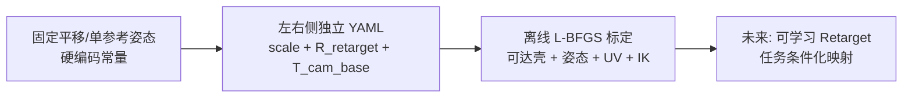
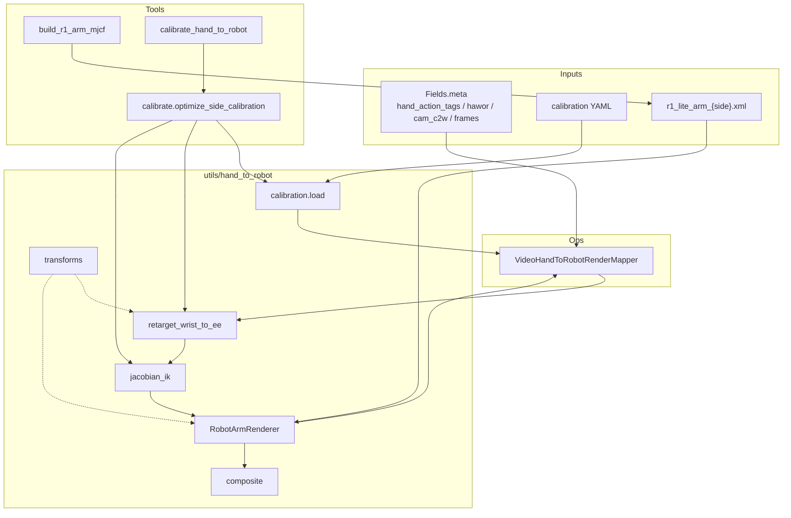
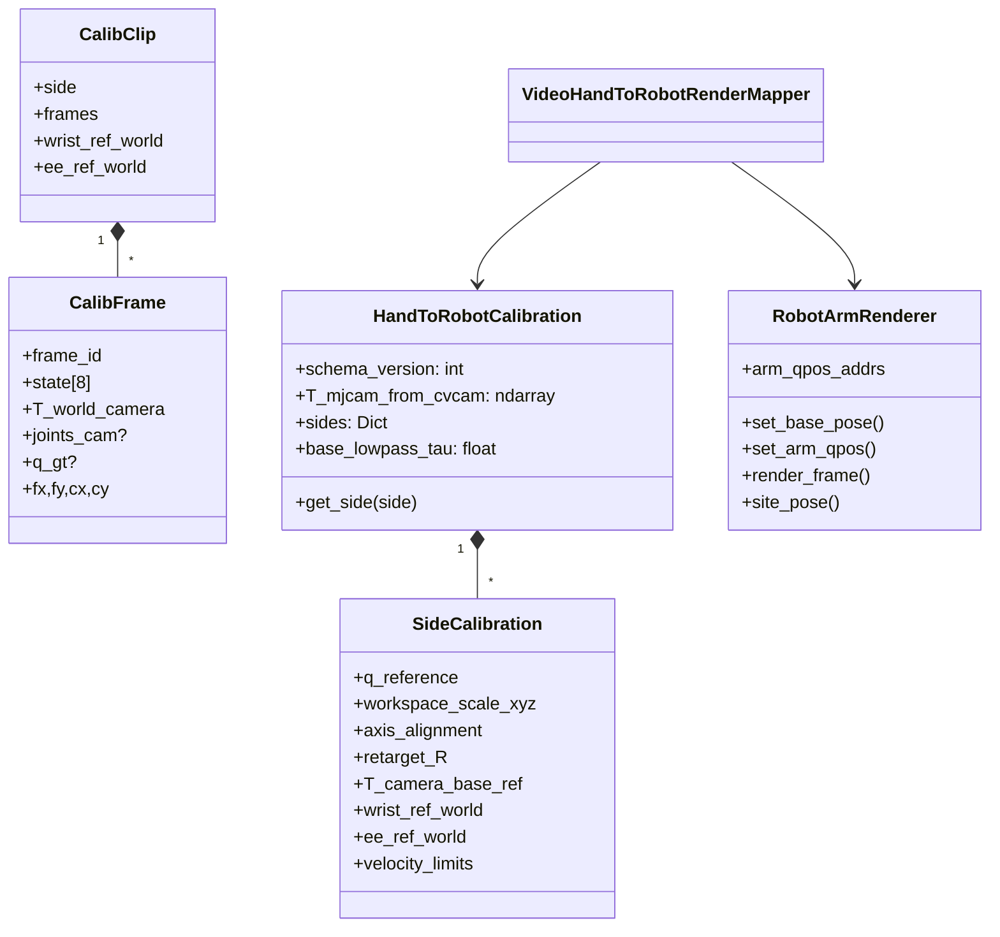
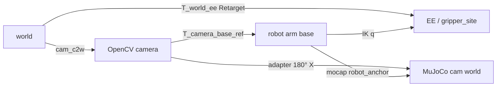
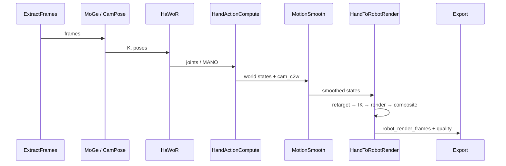
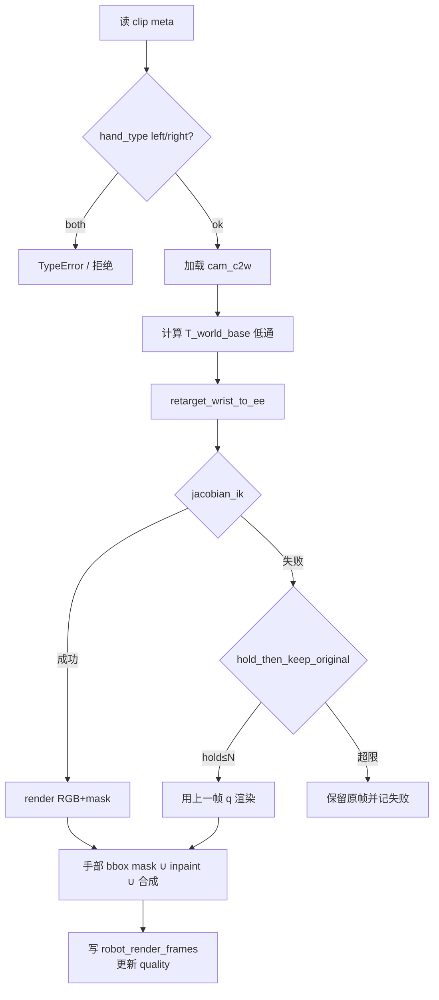
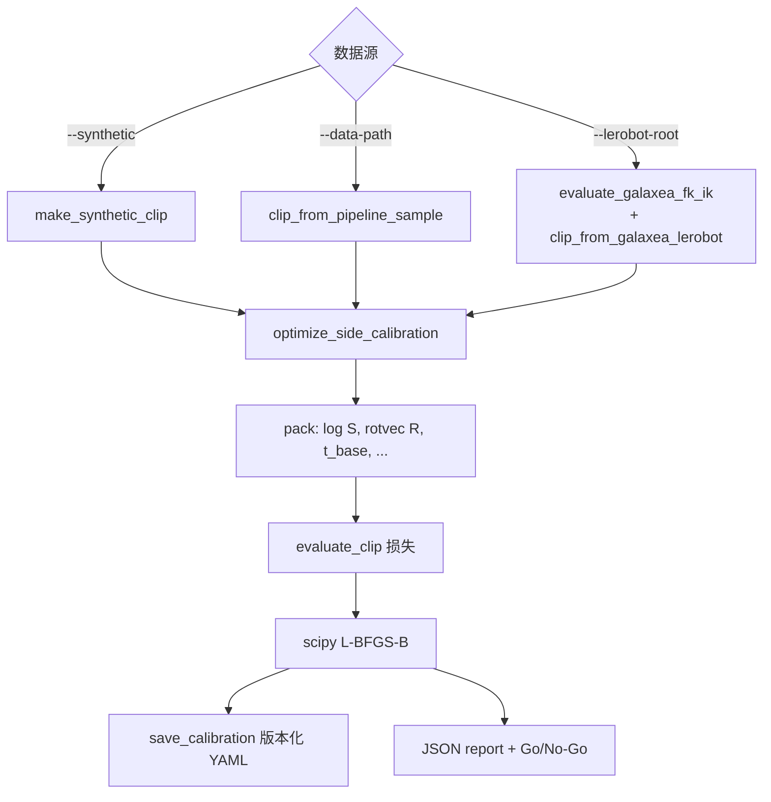

# Hand→Robot 表达层代码设计总结报告

> **范围**：`data_juicer/_au` 中「人手腕位姿 → R1 Lite 末端 → MuJoCo 渲染合成」的实现与标定工具链  
> **对应总设计**：[`hand_to_robot_render_design.md`](./hand_to_robot_render_design.md)  
> **状态**：P0 资产 + P1 单臂原型与离线标定已落地；深度遮挡 / mink IK / 双臂 / VLA A/B 仍为后续里程碑  
> **日期**：2026-07-24

---

## 1. 一句话结论

本表达层把 **MotionSmooth 产出的 world-frame 手腕状态**，经 **版本化 YAML 标定** 做解析式 Retarget，再在 **robot-base 求解 Jacobian DLS IK**，于 **ego 相机坐标系** 用 MuJoCo 渲染单臂并 **非破坏性合成** 到原视频；标定工具同时支持 **ego pipeline sample** 与 **Galaxea LeRobot 真机 episode（FK/IK 诊断）**。

---

## 2. 问题与「表达」含义

在 ego 人手动作标注流水线中，「表达」指把人的手腕轨迹 **改写成机器人可执行、可可视化的末端/关节表达**，并回投到第一人称画面：

| 输入表达 | 输出表达 |
|----------|----------|
| MANO / HaWoR → `hand_action_tags.states`（world，8D） | $T_{\mathrm{world},ee}$、臂关节 $q\in\mathbb{R}^6$、夹爪开合 |
| `cam_c2w`、可选 MoGe 内参 | ego 下 RGB / mask /（P2）depth |
| 版本化 `calibration/*.yaml` | `robot_render_frames` + `hand_to_robot_render_quality` |

与直接在相机系做渲染、却用世界系 action 训练的混用不同：本实现明确 **标签权威在 world，渲染在 camera**，中间用 $T_{\mathrm{camera}\leftarrow\mathrm{base}}$ 闭环。

---

## 3. 纵向演进：从固定偏移到可标定 Retarget



| 阶段 | 做法 | 优点 | 缺点 | 适用 |
|------|------|------|------|------|
| v0 硬编码 | 腕→EE 固定 offset | 实现快 | 难泛化、难版本化 | 废弃 |
| **v1 解析标定（当前）** | $S,A,R_{\mathrm{retarget}},T_{\mathrm{cam},base}$ 写 YAML | 可解释、可复现、左右独立 | 锚点覆盖不足时易偏 | P0–P1 离线原型 |
| v2+ 可学习 | 网络拟合腕→EE | 可吸收非线性/任务偏置 | 需大量对齐数据、难调试 | 解析基线稳定后 |

**消融直觉（实现与 Galaxea 实验已验证的点）**：

| 因子 | 有效性 | 证据 |
|------|--------|------|
| OpenCV↔MuJoCo adapter（绕 X 180°） | **关键** | adapter 与 `camera_to_base` 旋转配合错误时 mask 为空 |
| `camera_to_base` **平移** 在 FK 代理 clip 上 | 对 IK warm-start **敏感** | $t\neq0$ 时 GT $q$ 与目标站点不一致，IK 成功率崩塌 |
| workspace scale / retarget $R$ | 对人手 clip **必要**；对 FK 代理 clip 近恒等即可 | Galaxea FK clip 上 scale=I 时 IK≈100% |
| UV 重投影损失 | 对 HaWoR joints **有效**；对 FK 代理（$z_{\mathrm{cam}}<0$）**无效** | Galaxea 路径强制 `w_uv=0` |
| IK 项 + GT/上一帧 warm-start | **强有效** | 无 warm-start 时近家位姿易陷局部极小 |
| 常数偏置对齐 FK vs GT EE | 诊断 **必要** | 原始位置差 ~40 cm；对齐后中位 ~4 cm，姿态 ~0° |

---

## 4. 横向对比：同类表达路径

| 方案 | 核心 | 优点 | 缺点 | 本仓库选择 |
|------|------|------|------|------------|
| 纯 2D 贴图/手部 inpaint | 不建模臂 | 便宜 | 无 3D 一致性、难出 action | 否 |
| 直接拷贝腕位姿为 EE | 无 Retarget | 简单 | 工作空间/朝向不匹配 | 否 |
| Mink / 非线性约束 IK | 更稳的约束求解 | 奇异/限位更好 | 依赖更重 | P1 预留，`ik_solver=mink` 未实现 |
| **Jacobian DLS + YAML Retarget** | 轻量、可标定 | 可测、可版本化 | 近奇异依赖初值 | **当前默认** |
| 端到端视频生成 | 观感强 | 难保证可执行关节 | 研究向 | 否 |

---

## 5. 静态架构

### 5.1 目录与职责

```text
data_juicer/_au/
├── ops/mapper/video_hand_to_robot_render_mapper.py   # 流水线算子
├── tools/
│   ├── build_r1_arm_mjcf.py                          # URDF/STL → 单臂 MJCF
│   └── calibrate_hand_to_robot.py                    # 标定 CLI
└── utils/hand_to_robot/
    ├── transforms.py     # SE(3)、state↔T、OpenCV↔MuJoCo
    ├── calibration.py    # YAML ↔ SideCalibration
    ├── retarget.py       # 腕→EE、投影
    ├── ik.py             # Jacobian DLS、夹爪映射
    ├── renderer.py       # MuJoCo 离屏渲染
    ├── composite.py      # mask 合成 / inpaint
    └── calibrate.py      # 优化器 + clip 加载 + Galaxea FK/IK

b/d/hand2robot/calibration/   # r1_{left,right}_v1.yaml
b/d/urdf/generated/           # r1_lite_arm_{left,right}.xml

tests_au/ops/mapper/
├── test_video_hand_to_robot_render_mapper.py
├── test_calibrate_hand_to_robot.py
├── accept_hand_to_robot_render.{py,sh}
└── accept_calibrate_hand_to_robot.{py,sh}
```

扩展原则：**新逻辑只进 `_au/`**，通过 `@OPERATORS.register_module` 与 YAML `custom_operator_paths: ['data_juicer/_au']` 注入，避免改核心 `data_juicer/ops`。

### 5.2 组件图



### 5.3 关键数据结构



**手腕状态约定**（与 ActionCompute / MotionSmooth 对齐）：

\[
s = [x,y,z,\mathrm{roll},\mathrm{pitch},\mathrm{yaw},\mathrm{pad},g]^{\top}
\quad\Rightarrow\quad
T_{\mathrm{world},\mathrm{wrist}}=\mathrm{SE3}\big(R_{xyz}(rpy),\,p\big)
\]

夹爪 $g\in[-1,1]$（1=开）映射到 finger 位移：`map_gripper_to_finger`。

---

## 6. 坐标系与 Retarget 数学

### 6.1 帧关系



固定 adapter（OpenCV → MuJoCo）：

\[
R_{\mathrm{adapt}}=\mathrm{Rot}_{x}(\pi)
=\begin{bmatrix}1&0&0\\0&-1&0\\0&0&-1\end{bmatrix},
\quad
T_{\mathrm{mj},base}=T_{\mathrm{adapt}}\,T_{\mathrm{camera},base}
\]

YAML 中右臂默认将 `camera_to_base_reference.quaternion_wxyz` 设为与 adapter 相同，使静态调试时 $R_{\mathrm{mj},base}\approx I$，手臂朝向 ego 视野。

### 6.2 Retarget

\[
p_{ee}=p_{ee}^{\mathrm{ref}}+S\,A\,(p_{\mathrm{wrist}}-p_{\mathrm{wrist}}^{\mathrm{ref}})
\]
\[
R_{ee}=R_{\mathrm{wrist}}\,R_{\mathrm{retarget}}
\]

其中 $S=\mathrm{diag}(s_x,s_y,s_z)$，$A$ 为轴对齐正交阵。实现见 `retarget.retarget_wrist_to_ee`；Mapper 与标定 **共用** 同一函数，避免双份公式漂移。

### 6.3 每帧位姿链（Mapper）

1. $T_{\mathrm{world},ee}\leftarrow\mathrm{retarget}(s_t)$  
2. $T_{\mathrm{world},base}\leftarrow\mathrm{lowpass}(T_{\mathrm{world},cam}\,T_{\mathrm{cam},base}^{\mathrm{ref}})$  
3. $T_{\mathrm{base},ee}\leftarrow T_{\mathrm{world},base}^{-1}\,T_{\mathrm{world},ee}$  
4. 在 MuJoCo 世界中设 mocap，目标站点 $T_{\mathrm{mj},ee}=T_{\mathrm{mj},base}\,T_{\mathrm{base},ee}$  
5. `jacobian_ik` → $q_t$，渲染 → mask 合成

---

## 7. 动态架构

### 7.1 生产流水线中的位置



### 7.2 Mapper 单帧控制流



失败策略默认 `hold_then_keep_original`：短暂丢跟踪时冻结关节，超过 `max_hold_frames` 则不覆盖观感帧，但质量字段仍记录。

### 7.3 标定工具数据流



**默认优化变量**：$\log s$（3）、$R_{\mathrm{retarget}}$ rotvec（3）、$t_{\mathrm{cam},base}$（3）。可选 `--optimize-base-orient` / `--optimize-axis`。

**损失构成（概念）**：

\[
\mathcal{L}=
w_{\mathrm{pos}}\overline{e_{\mathrm{reach}}^{2}}
+w_{\mathrm{rot}}\overline{e_{\mathrm{rot}}^{2}}
+w_{\mathrm{uv}}\overline{e_{\mathrm{uv}}^{2}}
+w_{\mathrm{ik}}\big(\overline{e_{\mathrm{ik}}^{2}}+0.25\cdot\mathrm{fail}\big)
+\mathrm{reg}(S,t)
\]

锚点选取：在腕位置上做空间最远点采样（含端点），降低全序列 IK 开销。

---

## 8. 资产构建（MJCF）

`build_r1_arm_mjcf.py` 从全机 URDF 抽取单臂，视觉 mesh 优先 STL，碰撞用 capsule（geom group 分离：visual=1，collision=3），并注入：

- mocap body `robot_anchor`（基座位姿）
- site `gripper_site`（IK 目标）
- camera `ego_cam`
- 相对 `meshdir`，保证拷贝到临时目录仍可加载

左右臂 **各一份 XML**；Mapper 的 `hand_type` 在 P0–P1 **禁止 `both`**。

---

## 9. 标定 YAML 契约

最小字段（右臂示例见 `b/d/hand2robot/calibration/r1_right_v1.yaml`）：

```yaml
schema_version: 1
robot: r1_lite
action_frame: world
camera_convention: opencv
base_lowpass_tau: 0.3
mujoco_camera_adapter:
  quaternion_wxyz: [0.0, 1.0, 0.0, 0.0]  # ≡ Rot_x(π)
sides:
  right:
    q_reference: [...]
    workspace_scale_xyz: [sx, sy, sz]
    axis_alignment: [[...],[...],[...]]
    retarget_quaternion_wxyz: [w,x,y,z]
    camera_to_base_reference:
      translation_m: [tx, ty, tz]
      quaternion_wxyz: [w,x,y,z]
    velocity_limits: [...]
    # 标定后可写入:
    # wrist_ref_world / ee_ref_world / model_sha256
```

**版本纪律**：schema、资产哈希或坐标约定变更必须新文件名（如 `r1_right_v2.yaml`），禁止静默复用旧缓存。

---

## 10. 关键代码路径解读

### 10.1 Retarget（共享）

```14:41:data_juicer/_au/utils/hand_to_robot/retarget.py
def retarget_wrist_to_ee(
    smoothed_state: Sequence[float],
    side_cal: SideCalibration,
    wrist_ref_world: Optional[np.ndarray] = None,
    ee_ref_world: Optional[np.ndarray] = None,
) -> np.ndarray:
    """Map smoothed world-frame wrist state → T_world_ee."""
    T_wrist = state_to_T(smoothed_state)
    # ...
    p_ee = np.asarray(ee_ref_world, dtype=np.float64) + S @ A @ (
        p_wrist - np.asarray(wrist_ref_world, dtype=np.float64)
    )
    R_ee = R_wrist @ np.asarray(side_cal.retarget_R, dtype=np.float64)
    return se3(R_ee, p_ee)
```

设计点：参考点缺失时退化为「当前帧腕=参考」，保证单帧可跑；生产标定应写入稳定的 `wrist_ref_world` / `ee_ref_world`。

### 10.2 IK

`jacobian_ik` 对 `gripper_site` 堆叠位置/姿态雅可比，阻尼最小二乘更新 6 臂关节并裁剪限位。姿态误差用旋转矩阵的轴角形式。Mapper 侧用上一成功帧作 warm-start；标定侧对 Galaxea 帧可读 `CalibFrame.q_gt`。

### 10.3 Galaxea 真机路径（诊断 ≠ 人手标定）

`/mnt/r/DATA/pre_train_v1/Galaxea_R1_Lite` 是 **真机关节/EE** LeRobot，不是 HaWoR 出手。

| 步骤 | 作用 |
|------|------|
| `evaluate_galaxea_fk_ik` | FK vs GT EE；常数平移对齐；IK from FK / 对齐后 GT |
| `clip_from_galaxea_lerobot` | 用 FK site 构造可达 `CalibClip`（`T_{we}=T_{\mathrm{adapt}}T_{\mathrm{mj}}$） |
| CLI 强制 $t_{\mathrm{cam},base}=0$、$w_{uv}=0$ | 避免 mocap 平移破坏 GT warm-start；避免 $z_{\mathrm{cam}}<0$ 的假 UV |

**实测摘要（Handle_Plates ep2，右臂）**：FK 姿态误差 ≈0°；位置对齐后中位 ≈3.9 cm；IK from FK site = 100%；标定 clip IK = 100%；acceptance **go**。

原始 FK–GT 位置差约 40 cm，来自 **躯干/机体坐标系原点 ≠ 单臂 MJCF root**，不是 IK 实现错误。

---

## 11. 测试与验收

| 资产 | 内容 |
|------|------|
| `test_video_hand_to_robot_render_mapper.py` | 坐标往返、标定加载、IK from FK、非破坏输出、拒绝 `both` |
| `test_calibrate_hand_to_robot.py` | 锚点、合成优化、Galaxea FK/IK（数据存在时） |
| `accept_hand_to_robot_render.*` | 合成渲染 go/no-go |
| `accept_calibrate_hand_to_robot.*` | 默认自动选 Galaxea（若存在）否则 `--synthetic` |

常用命令：

```bash
# 合成标定 smoke
python -m data_juicer._au.tools.calibrate_hand_to_robot --synthetic --side right \
  --init-calib b/d/hand2robot/calibration/r1_right_v1.yaml \
  --model b/d/urdf/generated/r1_lite_arm_right.xml \
  --output-calib b/d/hand2robot/calib_out/r1_right_calibrated.yaml \
  --report-dir b/d/hand2robot/calib_out

# Galaxea 真机 FK/IK + 代理标定
python -m data_juicer._au.tools.calibrate_hand_to_robot \
  --lerobot-root /mnt/r/DATA/pre_train_v1/Galaxea_R1_Lite/Handle_Plates_20250619_001 \
  --episode 2 --side right --max-frames 80 --stride 3 \
  --init-calib b/d/hand2robot/calibration/r1_right_v1.yaml \
  --model b/d/urdf/generated/r1_lite_arm_right.xml \
  --output-calib b/d/hand2robot/calib_out_galaxea/r1_right_calibrated.yaml \
  --report-dir b/d/hand2robot/calib_out_galaxea

export MUJOCO_GL=egl
python tests_au/ops/mapper/accept_calibrate_hand_to_robot.py
```

---

## 12. 风险、边界与后续

| 风险 | 现状 | 缓解 / 下一步 |
|------|------|----------------|
| 人手真实标定数据 | 需 ego pipeline 产出 `hand_action_tags`+`cam_c2w` | 在指定 ego 子集跑通后升 YAML 版本 |
| 机体 vs 臂根坐标系 | Galaxea EE 有常偏置 | 完整上身 MJCF 或显式 $T_{\mathrm{torso},arm}$ |
| 深度遮挡 | `enable_depth_occlusion` 默认关 | P2 depth-aware composite |
| mink IK | `NotImplemented` | 奇异密集轨迹再启用 |
| 双臂 | `hand_type=both` 拒绝 | P4 双模型调度 |
| head 相机外参 | LeRobot 未直接提供 | 渲染叠加 QA 需额外标定 head→arm |

**Go/No-Go（与总设计对齐）**：单臂 ≥100 帧 IK≥90%、重投影中位 <15 px 前，不作为默认 VLA 生产环节。

---

## 13. 小结

本表达层代码把「标定—Retarget—IK—渲染—合成」拆成可单测的纯函数与薄 Mapper/CLI，用版本化 YAML 固化左右臂参数，并用 Galaxea 真机数据验证了 **运动学闭环与 IK 可恢复性**。下一步真正服务 VLA 的关键缺口是：**在带 HaWoR/MotionSmooth 的 ego 子集上做人手锚点标定**，再把 YAML 升到 `v2` 后接入生产 recipe。

---

## 附录 A：模块索引

| 模块 | 角色 |
|------|------|
| `transforms.py` | SE(3)、欧拉 state、FOV、adapter |
| `calibration.py` | YAML IO、Side/Hand 标定对象 |
| `retarget.py` | 腕→EE、像素投影 |
| `ik.py` | DLS IK、夹爪 |
| `renderer.py` | MuJoCo EGL 渲染 |
| `composite.py` | mask / inpaint / 叠加 |
| `calibrate.py` | 损失、优化、多数据源 clip |
| `video_hand_to_robot_render_mapper.py` | 生产算子 |
| `calibrate_hand_to_robot.py` | 离线标定入口 |
| `build_r1_arm_mjcf.py` | 资产生成 |

## 附录 B：与总设计文档的映射

| 设计文档章节 | 代码落点 |
|--------------|----------|
| world 标签 + camera 渲染 | Mapper `_compute_base_poses` + `retarget` + `renderer.set_base_pose` |
| 版本化标定 | `calibration.py` + `b/d/hand2robot/calibration/` |
| 非破坏输出 | `output_frame_field=robot_render_frames` |
| P0 资产 | `build_r1_arm_mjcf.py` + `b/d/urdf/generated/` |
| P1 IK≥90% | `accept_*` + Galaxea `galaxea_fk_ik` 报告字段 |
| P2 深度遮挡 | Mapper 开关预留，合成逻辑待补 |
| 扩展于 `_au` / 测于 `tests_au` | 已遵守 |
