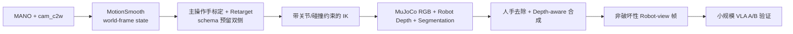
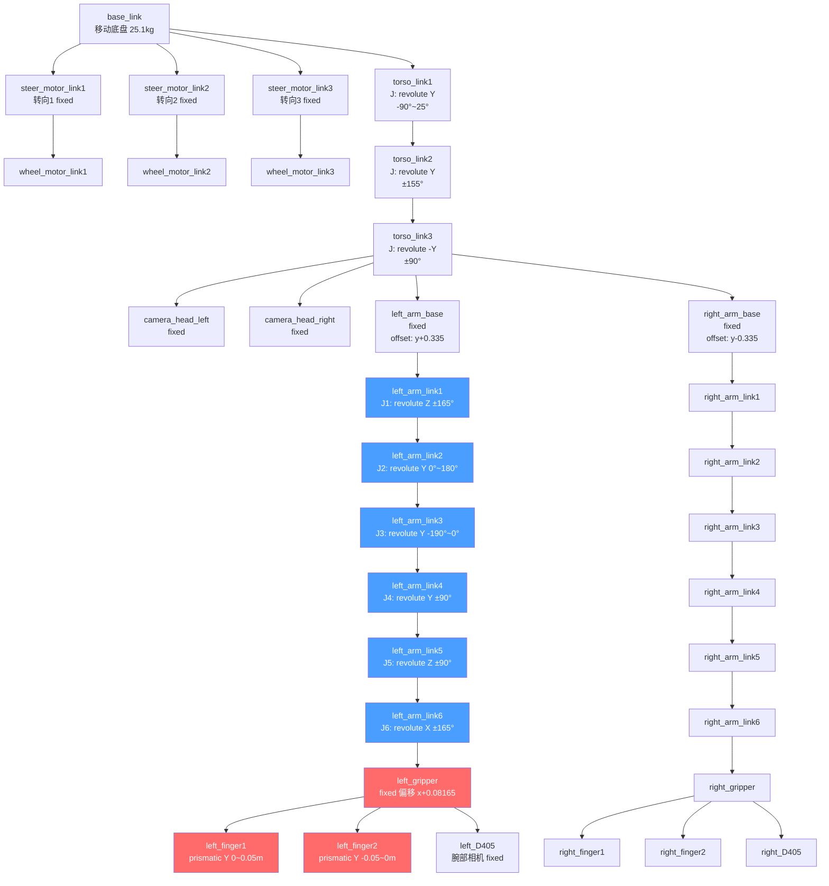
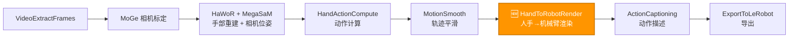
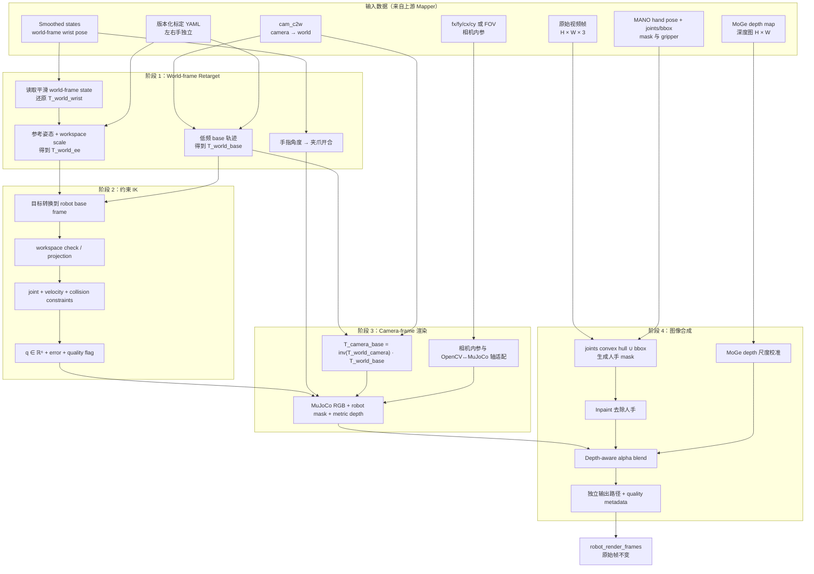

# Human Hand → Robot Arm 渲染替换方案设计

> **设计状态**：v2，Conditional Go  
> **当前决策**：允许推进单臂离线原型；在坐标系闭环、标定、遮挡和质量门槛通过前，不作为默认 VLA 数据生产环节。  
> **原则**：先证明视觉—动作一致性，再扩大渲染规模；保留原始数据，所有替换结果可追溯、可回滚。

## 0. 执行摘要与范围

本方案不是简单的“把手换成机器人贴图”，而是构造一条有明确几何约束的视觉域转换链：



### 0.1 首期范围

- **P0 只支持单主操作手**，先选择左手或右手，不允许用单侧模型伪装 `both`。
- 使用现有 R1 Lite STL mesh 构建左右臂独立 MJCF；首期碰撞几何使用简化 primitive 或降采样 mesh。
- action/state 继续保持现有 **world-frame** 定义；Renderer 以 `VideoHandMotionSmoothMapper`
  输出的平滑 world-frame state 为权威轨迹，避免视觉使用原始 MANO、标签却使用平滑 action。
- 原始 `video_frames` 不得覆盖；渲染结果写入独立字段和独立目录。
- P0/P1 面向离线数据生产，目标是稳定和可验收，不以实时 30 FPS 为首要目标。

### 0.2 非目标

- 首期不追求照片级生成效果，不引入 GAN/Diffusion 重绘。
- 首期不同时解决全身机器人、移动底盘和躯干运动生成。
- 在单臂指标未达标前，不做 Ray 大规模并行和双臂全量生产。

## 1. 问题背景与动机

### 1.1 核心问题

当前 ego-centric 数据处理 pipeline（`demos/ego_hand_action_annotation/vla_pipeline.py`）能够从人类手部操作视频中提取完整的运动学信息：

- **MANO 手部重建**：21 关节 3D 位置、腕部 6-DoF 位姿、手指关节角度
- **7-DoF 动作**：`[dx, dy, dz, droll, dpitch, dyaw, gripper]` delta action
- **8-dim 状态**：`[x, y, z, roll, pitch, yaw, pad, gripper]` 绝对状态

但导出的视频帧中**仍然是人手画面**。对于 VLA（Vision-Language-Action）模型的训练，这构成了一个关键的 domain gap：

```
训练数据：人手操作画面 + 机器人动作标签
部署环境：机器人夹爪画面 + 机器人动作标签
                ↑
           视觉域差异 (domain gap)
```

### 1.2 解决思路

在 pipeline 中新增一个阶段，将视频帧中的人手**替换渲染为 R1 Lite 机械臂与夹爪**。整体流程为：

1. **Retarget + IK**：将平滑后的 world-frame wrist state 映射为 R1 Lite 手臂关节角度
2. **MuJoCo 离屏渲染**：基于求解后的关节角度渲染机械臂图像
3. **图像合成**：去除原始帧中的人手，叠加渲染的机械臂

### 1.3 为什么选择 MuJoCo + IK 方案

| 方案 | 优点 | 缺点 |
|------|------|------|
| **仅渲染夹爪末端** | 简单，无需 IK | 缺乏真实感；VLA 模型看不到手臂进入视野的过程 |
| **GAN/Diffusion 风格迁移** | 效果逼真 | 几何不一致；无法保证机器人模型准确性 |
| **MuJoCo IK + 渲染（本方案）** | 几何精确；物理可行姿态；可复用真实 URDF | 需要 IK 求解；需要 mesh 资产 |

---

## 2. R1 Lite 运动学分析

### 2.1 URDF 运动链结构

从 `b/d/urdf/r1_lite.urdf` 提取的 R1 Lite 机器人完整运动链如下：



该图用于说明整机运动学关系；P0 只构建和渲染第 5.1 节定义的单侧手臂子模型，不包含底盘与完整躯干。

### 2.2 手臂关节参数表

每条手臂具有 **6 个旋转自由度 + 1 个夹爪自由度（2 指对称棱柱关节）**：

| 关节 | 类型 | 旋转轴 | 范围 (rad) | 范围 (°) | 力矩限 (Nm) | 运动学角色 |
|------|------|--------|-----------|----------|------------|-----------|
| `arm_joint1` | revolute | Z | $[-2.88, 2.88]$ | $[-165°, 165°]$ | 27 | 肩部偏航 |
| `arm_joint2` | revolute | Y | $[0, \pi]$ | $[0°, 180°]$ | 50 | 肩部俯仰 |
| `arm_joint3` | revolute | Y | $[-3.32, 0]$ | $[-190°, 0°]$ | 27 | 肘部弯曲 |
| `arm_joint4` | revolute | Y | $[-\pi/2, \pi/2]$ | $[-90°, 90°]$ | 14 | 腕部俯仰 |
| `arm_joint5` | revolute | Z | $[-\pi/2, \pi/2]$ | $[-90°, 90°]$ | 14 | 腕部偏航 |
| `arm_joint6` | revolute | X | $[-2.88, 2.88]$ | $[-165°, 165°]$ | 14 | 腕部横滚 |
| `gripper_finger1` | prismatic | Y | $[0, 0.05]$ m | — | 100 | 手指1 张开 |
| `gripper_finger2` | prismatic | Y | $[-0.05, 0]$ m | — | 100 | 手指2 张开 |

### 2.3 正向运动学链长

从 URDF 的 joint origin 提取各连杆偏移量：

$$
\text{arm\_base} \xrightarrow{[0, 0, 0.086]} \text{J1} \xrightarrow{[0, 0.031, 0.049]} \text{J2} \xrightarrow{[-0.3, 0, 0]} \text{J3} \xrightarrow{[0.175, 0, 0.075]} \text{J4} \xrightarrow{[0.08, -0.031, 0.041]} \text{J5} \xrightarrow{[0.023, 0, -0.041]} \text{J6} \xrightarrow{[0.082, 0, 0]} \text{gripper}
$$

总臂展（近似）：

$$
L_{arm} \approx 0.086 + 0.049 + 0.3 + 0.175 + 0.08 + 0.023 + 0.082 \approx 0.795 \text{ m}
$$

---

## 3. 系统架构设计

### 3.1 Pipeline 集成位置

新的渲染阶段固定插入在 `VideoHandMotionSmoothMapper` 之后、`VideoActionCaptioningMapper` 之前。
Renderer 读取平滑后的 world-frame state；Captioning 和 Export 均读取替换后的 `robot_render_frames`：



### 3.2 单帧处理数据流



---

## 4. IK 求解方案

### 4.1 坐标系契约：标签在 world frame，渲染投影在 camera frame

原方案把 MuJoCo world 直接等同于逐帧 camera frame，会使机器人基座随相机刚性移动；同时，现有
`VideoHandActionComputeMapper` 会使用 `cam_c2w` 将 MANO 位姿转换到 world frame 后计算 state/action，
`VideoHandMotionSmoothMapper` 又会平滑 state 并重新计算 action。渲染必须消费这份**平滑后的 world-frame
state**，而不是再次从原始 MANO `transl/global_orient` 独立计算另一条轨迹。

| 量 | 坐标系 | 用途 |
|---|---|---|
| `T_world_camera(t)` / `cam_c2w(t)` | camera → world | 稳定相机运动、计算 world-frame action |
| `T_camera_wrist(t)` | MANO camera frame | 原始观测与像素投影 |
| `T_world_wrist(t)` | world frame | 从平滑 state 还原，作为 Retarget 权威输入 |
| `T_world_base(t)` | world frame | 虚拟机器人基座轨迹 |
| `T_camera_base(t)`、`T_camera_ee(t)` | camera frame | MuJoCo 渲染与图像合成 |

核心变换为：

$$
T_{world}^{wrist,raw}(t) = T_{world}^{camera}(t) T_{camera}^{wrist}(t)
$$

上式在 ActionCompute 阶段完成；MotionSmooth 生成
$T_{world}^{wrist,smooth}(t)$，Render 阶段使用后者。原始 camera-frame joints/bbox 只用于手部 mask，
夹爪权威值取平滑 `states[t][7]`，原始 hand pose 仅在 state 缺失时作为回退输入。

$$
T_{camera}^{base}(t) =
\left(T_{world}^{camera}(t)\right)^{-1} T_{world}^{base}(t)
$$

$$
T_{camera}^{ee}(t) =
\left(T_{world}^{camera}(t)\right)^{-1} T_{world}^{ee}(t)
$$

因此，**action 数值仍保持 world-frame，不因渲染而修改**；Retarget 在 world frame 中完成，IK 目标随后
转换到 robot base frame 求解，最终把 base 和机器人几何变换到 camera frame 渲染。验收时同时检查
world-frame 轨迹误差与 camera-frame 像素重投影误差。

#### OpenCV、MANO 与 MuJoCo 轴约定

实现中必须只在一个适配层处理轴变换，并通过合成基准图验证：

- OpenCV/MANO 常用：$+X$ 向右，$+Y$ 向下，$+Z$ 向前。
- MuJoCo/OpenGL camera：相机看向 $-Z$，图像 $Y$ 方向需要翻转。
- 定义固定变换 $T_{mj\_cam}^{cv\_cam}$，禁止在 Retarget、Renderer 和 Composite 中分别做隐式 flip。
- 左手 HaWoR 可能包含额外镜像处理；左右手必须使用独立单元测试验证，不得共享未经验证的轴变换。

### 4.2 平滑 World-frame Wrist → Robot EE Retarget

不直接把原始 MANO 的绝对腕部位置加固定 offset 当作机器人 EE 目标。使用 MotionSmooth 输出的
`states=[x,y,z,roll,pitch,yaw,pad,gripper]` 还原平滑腕部位姿，再采用“参考姿态 + 工作空间归一化”的映射：

$$
\mathbf{p}_{ee}^{world}(t)
= \mathbf{p}_{ee,ref}^{world}
+ S_{side} A_{side}
\left(\mathbf{p}_{wrist}^{world}(t)-\mathbf{p}_{wrist,ref}^{world}\right)
$$

$$
R_{ee}^{world}(t)
= R_{wrist}^{world}(t) R_{retarget,side}
$$

其中：

- $A_{side}$：左右手独立的轴对齐矩阵，显式吸收 MANO 左手镜像与机器人左右臂差异。
- $S_{side}=\mathrm{diag}(s_x,s_y,s_z)$：人手活动范围到机器人工作空间的缩放，不默认等比例。
- $\mathbf{p}_{wrist,ref}^{world}$、$\mathbf{p}_{ee,ref}^{world}$：参考帧对应点。
- $R_{retarget,side}$：MANO 手坐标系到 R1 gripper 坐标系的旋转标定。

#### 标定流程

标定不能只依赖单个“手掌朝下”姿态。每一侧至少采集 3–5 个覆盖工作空间的锚点：

1. 中心自然姿态；
2. 前伸、内收、外展；
3. 至少两个显著不同的腕部朝向；
4. 以 EE 位置、姿态和 camera-frame 重投影误差联合优化
   $\{A_{side},S_{side},R_{retarget,side},T_{camera}^{base,ref}\}$；
5. 将结果写入版本化 YAML，不把标定常量硬编码在 Mapper 中。

建议的标定损失：

$$
\mathcal{L}_{calib}
= w_p \lVert \mathbf{p}_{ee}-\hat{\mathbf{p}}_{ee}\rVert_2^2
+ w_R \lVert \log(R_{ee}^{T}\hat{R}_{ee})\rVert_2^2
+ w_{uv}\lVert \pi(\mathbf{p}_{ee})-\mathbf{u}_{palm}\rVert_2^2
$$

### 4.3 虚拟机器人基座轨迹

固定的 camera-frame base offset 只能作为调试初值，不能作为生产定义。首期采用“相机位姿驱动、低频跟随”的
world-frame 基座：

$$
\tilde{T}_{world}^{base}(t)
= T_{world}^{camera}(t) T_{camera}^{base,calib}
$$

$$
T_{world}^{base}(t)
= \mathrm{SE3LowPass}\left(\tilde{T}_{world}^{base}(t);\ \tau_{base}\right)
$$

该策略让基座跟随人体/相机的低频整体移动，但不会跟随每一帧头部抖动。随后通过
$T_{camera}^{base}(t)=(T_{world}^{camera}(t))^{-1}T_{world}^{base}(t)$ 放入 MuJoCo。

默认调试初值可以来自 R1 Lite URDF 的 camera-to-arm-base 外参，但必须区分左右侧，并由标定文件覆盖。
若 clip 中 MegaSaM 相机轨迹不可靠，则该 clip 标记 `camera_pose_unreliable`，不进入生产数据。

### 4.4 IK 求解算法

IK 不直接接收 world-frame 目标。每帧先转换到 robot base frame：

$$
T_{base}^{ee}(t)
= \left(T_{world}^{base}(t)\right)^{-1} T_{world}^{ee}(t)
$$

`_retarget_state_to_ee` 输出 $T_{world}^{ee}$，`_solve_ik` 只接收
$T_{base}^{ee}$；函数名、参数注释和 quality metadata 都必须带坐标系语义。

#### 方案 A：`mink` 库（推荐）

[mink](https://github.com/kevinzakka/mink) 是基于 MuJoCo 的微分 IK 库，将 IK 问题建模为每步的二次规划（QP），原生支持关节极限、碰撞约束等。

```python
import mink
import mujoco
import numpy as np

# 加载手臂子模型（仅 arm_base → gripper 链）
model = mujoco.MjModel.from_xml_path("r1_lite_arm.xml")
data = mujoco.MjData(model)
configuration = mink.Configuration(model)

# 定义 IK 任务
ee_task = mink.FrameTask(
    frame_name="gripper_site",   # 在 MJCF 中定义的末端 site
    frame_type="site",
    position_cost=1.0,           # 位置权重
    orientation_cost=1.0,        # 姿态权重
    lm_damping=1e-3,             # Levenberg-Marquardt 阻尼
)

# 正则化：保持手臂接近左右侧各自标定的参考姿态（避免奇异解）
# q_reference 与 velocity_limits 均从版本化 calibration YAML 加载
q_reference = np.asarray(calibration["q_reference"], dtype=np.float64)
velocity_limits = calibration["velocity_limits"]
posture_task = mink.PostureTask(model, cost=1e-2)
posture_task.set_target(q_reference)

# 关节与速度限制是 P0 必选；P1 将 CollisionAvoidanceLimit 追加到 limits
limits = [
    mink.ConfigurationLimit(model),
    mink.VelocityLimit(model, velocity_limits),
]

tasks = [ee_task, posture_task]
dt = 0.1  # IK 步长

def solve_ik(target_pos, target_rot, gripper_state, q_init=None):
    """求解单帧 IK.

    Args:
        target_pos: (3,) 末端目标位置 (robot base frame)
        target_rot: (3,3) 末端目标旋转矩阵 (robot base frame)
        gripper_state: float in [-1, 1]
        q_init: (6,) 初始关节角度（用上一帧结果做 warm start）

    Returns:
        q: (6,) 手臂关节角度
        finger_pos: float 夹爪指位移
        success: bool IK 是否收敛
    """
    if q_init is not None:
        configuration.update(q_init)

    # 构造 SE(3) 目标
    target_SE3 = np.eye(4)
    target_SE3[:3, :3] = target_rot
    target_SE3[:3, 3] = target_pos
    ee_task.set_target(mink.SE3.from_matrix(target_SE3))

    # 迭代求解；这里的阈值仅为算法示例，阶段门槛以 §8.4 为准
    err = ee_task.compute_error(configuration)
    for _ in range(max_iters := 100):
        vel = mink.solve_ik(configuration, tasks, dt,
                           solver="quadprog", limits=limits)
        configuration.integrate_inplace(vel, dt)

        # 检查收敛
        err = ee_task.compute_error(configuration)
        if np.linalg.norm(err[:3]) < 1e-3 and np.linalg.norm(err[3:]) < 0.01:
            break

    q = configuration.q[:6]  # 6 DOF 手臂关节角

    # 夹爪映射: [-1, 1] → [0, 0.05]m
    finger_pos = (gripper_state + 1.0) / 2.0 * 0.05

    pos_err = np.linalg.norm(err[:3])
    rot_err = np.linalg.norm(err[3:])
    success = pos_err < 1e-3 and rot_err < 0.01
    return q, finger_pos, success, {
        "position_error_m": float(pos_err),
        "orientation_error_rad": float(rot_err),
    }
```

#### 方案 B：手动 Jacobian IK（无额外依赖）

如果不想引入 `mink` 依赖，可直接使用 MuJoCo 的 `mj_jac` API 实现阻尼最小二乘（Damped Least Squares，DLS）IK：

$$
\Delta \mathbf{q} = J^T (J J^T + \lambda^2 I)^{-1} \mathbf{e}
$$

其中 $J \in \mathbb{R}^{6 \times n_v}$ 是末端的 6D Jacobian（位置 + 姿态），$\mathbf{e} \in \mathbb{R}^6$ 是位姿误差，$\lambda$ 是阻尼系数。

```python
import mujoco
import numpy as np

def jacobian_ik(model, data, target_pos, target_rot,
                body_id, max_iter=200, tol_pos=1e-3,
                tol_rot=0.01, damping=1e-2, step=0.5):
    """Damped Least Squares IK.

    Args:
        model: MjModel
        data: MjData
        target_pos: (3,) 目标位置
        target_rot: (3,3) 目标旋转矩阵
        body_id: 末端 body 的 ID
        max_iter: 最大迭代次数
        tol_pos: 位置误差阈值 (m)
        tol_rot: 姿态误差阈值 (rad)
        damping: 阻尼系数 λ
        step: 步长缩放

    Returns:
        success: bool
        qpos: 求解后的关节角度
    """
    jacp = np.zeros((3, model.nv))  # 位置 Jacobian
    jacr = np.zeros((3, model.nv))  # 旋转 Jacobian

    for i in range(max_iter):
        mujoco.mj_forward(model, data)

        # 位置误差
        current_pos = data.body(body_id).xpos.copy()
        err_pos = target_pos - current_pos

        # 姿态误差（用旋转矩阵差的对数映射）
        current_rot = data.body(body_id).xmat.reshape(3, 3)
        R_err = target_rot @ current_rot.T
        # axis-angle from rotation matrix
        angle = np.arccos(np.clip((np.trace(R_err) - 1) / 2, -1, 1))
        if angle < 1e-6:
            err_rot = np.zeros(3)
        else:
            axis = np.array([
                R_err[2, 1] - R_err[1, 2],
                R_err[0, 2] - R_err[2, 0],
                R_err[1, 0] - R_err[0, 1]
            ]) / (2 * np.sin(angle))
            err_rot = axis * angle

        # 检查收敛
        if np.linalg.norm(err_pos) < tol_pos and \
           np.linalg.norm(err_rot) < tol_rot:
            return True, data.qpos.copy()

        # 计算 Jacobian
        mujoco.mj_jac(model, data, jacp, jacr, target_pos, body_id)

        # 堆叠 6D Jacobian 和误差
        J = np.vstack([jacp, jacr])       # (6, nv)
        err = np.concatenate([err_pos, err_rot])  # (6,)

        # Damped Least Squares
        JJT = J @ J.T + damping**2 * np.eye(6)
        dq = J.T @ np.linalg.solve(JJT, err)

        # 关节限制裁剪
        q_new = data.qpos + step * dq
        for j in range(model.njnt):
            if model.jnt_limited[j]:
                lo = model.jnt_range[j, 0]
                hi = model.jnt_range[j, 1]
                addr = model.jnt_qposadr[j]
                q_new[addr] = np.clip(q_new[addr], lo, hi)

        data.qpos[:] = q_new

    return False, data.qpos.copy()
```

#### 两种方案对比

| 特性 | mink (方案 A) | 手动 Jacobian (方案 B) |
|------|--------------|----------------------|
| 依赖 | `mink`, `qpSWIFT` 或 `quadprog` | 仅 `mujoco`, `numpy` |
| 关节限制 | QP 约束，严格满足 | 需手动 clip，可能震荡 |
| 碰撞约束 | 原生支持 | 需额外实现 |
| 收敛性 | QP 保证局部最优 | 依赖阻尼参数调节 |
| 速度 | 单帧 ~1ms | 单帧 ~0.5ms |
| 推荐场景 | 生产使用 | 快速原型验证 |

> 表中的速度仅代表 IK 求解的量级估计，不包含 mesh 加载、两次/三次渲染、inpaint、深度合成和磁盘 I/O。
> 性能验收必须测端到端 Mapper。

### 4.5 夹爪状态映射（权威源：平滑 State）

`VideoHandActionComputeMapper` 已从 MANO `hand_pose` 估算 gripper state，
`VideoHandMotionSmoothMapper` 将其保存在平滑 `states[t][7]` 并重算 action。Renderer 直接读取该值，
确保视觉夹爪状态与最终 action 标签一致。仅当平滑 state 缺失时，才回退到
`_estimate_gripper_from_hand_pose`。输出范围 $[-1,1]$，其中 $1$ 表示全开，$-1$ 表示全闭。

映射到 R1 Lite 的棱柱关节：

$$
d_{finger} = \frac{g_{state} + 1}{2} \times 0.05 \text{ m}
$$

$$
\text{finger\_joint1} = +d_{finger}, \quad \text{finger\_joint2} = -d_{finger}
$$

| gripper_state | 含义 | finger_joint1 (m) | finger_joint2 (m) |
|-------------|------|------------------|------------------|
| $+1.0$ | 全开 | $+0.05$ | $-0.05$ |
| $0.0$ | 半开 | $+0.025$ | $-0.025$ |
| $-1.0$ | 全闭 | $0.0$ | $0.0$ |

### 4.6 时序连续性：Warm Start

为保证帧间关节角度的连续性（避免 IK 跳解），每帧 IK 使用**上一帧的解作为初始值**：

$$
\mathbf{q}_0^{(t)} = \mathbf{q}^{(t-1)}
$$

第一帧使用手臂的中间位置作为初始猜测：

$$
\mathbf{q}_0^{(0)} = \frac{\mathbf{q}_{lower} + \mathbf{q}_{upper}}{2}
$$

仅 warm start 仍可能在冗余解之间跳变，因此增加速度正则项：

$$
\mathcal{L}_{smooth}
= w_v \lVert \mathbf{q}_t-\mathbf{q}_{t-1}\rVert_2^2
+ w_a \lVert \mathbf{q}_t-2\mathbf{q}_{t-1}+\mathbf{q}_{t-2}\rVert_2^2
$$

### 4.7 可达性、碰撞与失败帧策略

Retarget 后先做工作空间检查，再进入 IK：

1. 使用离线 FK 采样得到左右臂可达点云与方向分布；
2. 超出安全工作空间的目标投影到最近可达边界，并记录 `workspace_projected=true`；
3. P0 启用 joint/velocity limit；P1 增加 arm–torso、arm–table collision avoidance；
   arm–arm collision 在 P4 双臂模式启用；
4. 不允许静默使用失败解。

失败策略按优先级执行：

| 情况 | 处理 | 质量标记 |
|---|---|---|
| 单帧轻微不收敛 | 使用上一帧解，最多保持 2 帧 | `ik_hold_last` |
| 连续失败或误差超阈值 | 保留原始帧，不渲染机器人 | `ik_failed` |
| 目标被投影到工作空间 | 允许渲染，但记录投影距离 | `workspace_projected` |
| 相机轨迹或内参缺失 | 整个 clip 不进入生产输出 | `calibration_invalid` |

所有质量标记写入 `Fields.meta`，供后续过滤器排除低质量 clip。

---

## 5. MuJoCo 渲染管线

### 5.1 模型准备

#### 当前资产状态（2026-07-24）

`b/d/urdf/meshes/` 已包含 30 个 STL，包括左右 arm base、6 个 arm link、gripper 和两个 finger，
因此“无 mesh 可渲染”不再是阻塞项。但当前资产与 URDF 仍存在命名和用途差异：

- `r1_lite.urdf` 的 visual 引用 `*.obj`，当前实际提供的是 `*.STL`；
- URDF 的 collision 引用 `*_collision.STL`，当前文件名没有 `_collision` 后缀；
- 当前 STL 三角面较多，不应未经简化直接用于实时碰撞检测；
- D405、camera head 等非首期手臂渲染所需资产可以暂不纳入子模型。

因此不直接修改完整 `r1_lite.urdf`。新增一个**可复现资产构建步骤**，从原始 URDF 与 STL 生成：

```text
b/d/urdf/
├── r1_lite.urdf
├── meshes/                              # 原始 STL，已提供
└── generated/                           # 生成物，不手工编辑
    ├── intermediate/
    │   ├── r1_lite_arm_left.urdf
    │   └── r1_lite_arm_right.urdf
    ├── r1_lite_arm_left.xml
    ├── r1_lite_arm_right.xml
    └── asset_manifest.json

data_juicer/_au/tools/
└── build_r1_arm_mjcf.py                 # 校验、映射、生成、静态渲染冒烟测试
```

`asset_manifest.json` 明确记录每个 link 的 source mesh、用途、缩放、哈希与生成时间。例如：

```json
{
  "left_arm_link1": {
    "visual": "meshes/left_arm_link1.STL",
    "collision": "primitive:auto",
    "scale": [1.0, 1.0, 1.0]
  }
}
```

P0 使用 STL 作为 visual，collision 使用 capsule/box 等简化 primitive；P1 再评估降采样 collision mesh。
构建脚本必须检查文件存在性、单位、AABB 尺寸、左右侧完整性，并输出一张固定姿态的左右臂冒烟渲染图。

#### URDF / MJCF 编译策略

MuJoCo 加载 URDF 时需要保留 visual。对于中间 URDF，添加编译器指令：

```xml
<robot name="r1_lite_arm">
  <mujoco>
    <compiler meshdir="../meshes/" discardvisual="false"/>
  </mujoco>
  <!-- 仅保留手臂链：arm_base → link1-6 → gripper → fingers -->
  ...
</robot>
```

随后转换为左右臂独立 MJCF，以便添加材质、碰撞 proxy、IK site 和渲染分组：

```python
# build_r1_arm_mjcf.py 中执行，不在运行时转换
model = mujoco.MjModel.from_xml_path(
    "generated/intermediate/r1_lite_arm_left.urdf")
mujoco.mj_saveLastXML("generated/r1_lite_arm_left.xml", model)
```

然后在生成的 MJCF 中添加：

```xml
<!-- 在 gripper_link body 内添加 IK 目标 site -->
<site name="gripper_site" pos="0 0 0" size="0.005"/>

<!-- 可逐帧放置的机器人根节点；arm_base 及其关节链位于其下 -->
<body name="robot_anchor" mocap="true">
  <body name="left_arm_base_link">
    ...
  </body>
</body>

<!-- robot visual geom 使用固定 group，避免把地面/辅助几何计入 robot mask -->
<geom name="left_arm_link1_visual" group="1" .../>

<!-- 设置渲染相关属性 -->
<visual>
  <global offwidth="640" offheight="480"/>
</visual>

<!-- 匹配视频的相机 -->
<camera name="ego_cam" pos="0 0 0" xyaxes="1 0 0 0 -1 0"
        fovy="60"/>  <!-- fovy 运行时动态设置 -->
```

#### 仅提取手臂子链

完整 R1 Lite 包含底盘、躯干等，但渲染只需手臂部分。从 URDF 中提取仅包含以下链路的子模型：

```
arm_base_link → arm_link1 → arm_link2 → arm_link3
→ arm_link4 → arm_link5 → arm_link6
→ gripper_link → finger_link1 + finger_link2
                → D405_link (可选)
```

左右臂必须分别生成模型。P0–P3 配置一次只允许选择其中一侧；两个模型分别通过静态渲染、FK、IK、
合成与 VLA A/B 后，P4 才开放 `hand_type: both`。

### 5.2 相机参数匹配

MuJoCo 使用垂直 FOV（`fovy`），而 pipeline 中 HaWoR 输出的是水平 FOV（`fov_x`）和焦距（`img_focal`）。转换关系：

$$
f_{pixel} = \frac{W}{2 \tan(\text{fov}_x / 2)}
$$

$$
\text{fov}_y = 2 \arctan\left(\frac{H}{2 f_{pixel}}\right)
$$

$$
\text{fov}_{y,deg} = \text{fov}_y \times \frac{180}{\pi}
$$

```python
def compute_mujoco_fovy(fov_x_rad, img_width, img_height):
    """将 HaWoR 的水平 FOV 转换为 MuJoCo 的垂直 FOV (度)."""
    f_pixel = 0.5 * img_width / np.tan(0.5 * fov_x_rad)
    fov_y_rad = 2.0 * np.arctan(0.5 * img_height / f_pixel)
    return np.degrees(fov_y_rad)
```

### 5.3 离屏渲染

```python
import mujoco
import numpy as np

class RobotArmRenderer:
    def __init__(self, model_path, width, height):
        self.model = mujoco.MjModel.from_xml_path(model_path)
        self.data = mujoco.MjData(self.model)
        self.renderer = mujoco.Renderer(self.model, height=height, width=width)
        anchor_body_id = mujoco.mj_name2id(
            self.model, mujoco.mjtObj.mjOBJ_BODY, "robot_anchor")
        self.anchor_mocap_id = self.model.body_mocapid[anchor_body_id]
        self.robot_visual_geom_ids = np.flatnonzero(
            self.model.geom_group == 1)

    def set_camera_fov(self, fov_y_deg):
        """设置相机 FOV 匹配视频内参."""
        cam_id = mujoco.mj_name2id(
            self.model, mujoco.mjtObj.mjOBJ_CAMERA, "ego_cam")
        self.model.cam_fovy[cam_id] = fov_y_deg

    def set_base_pose(self, T_camera_base, T_mjcam_from_cvcam):
        """逐帧应用 base 位姿，并集中完成 OpenCV→MuJoCo camera 轴适配."""
        T_mj_base = T_mjcam_from_cvcam @ T_camera_base
        self.data.mocap_pos[self.anchor_mocap_id] = T_mj_base[:3, 3]
        self.data.mocap_quat[self.anchor_mocap_id] = (
            rotation_matrix_to_quaternion_wxyz(T_mj_base[:3, :3]))

    def render_frame(self, joint_angles, finger_pos, T_camera_base,
                     T_mjcam_from_cvcam, render_depth=False):
        """渲染单帧，返回 RGB、robot mask 和 metric depth.

        Args:
            joint_angles: (6,) 手臂关节角度
            finger_pos: float 夹爪指位移 [0, 0.05]
            T_camera_base: (4,4) 当前帧 robot base 在 camera frame 中的位姿
            T_mjcam_from_cvcam: (4,4) 固定轴适配矩阵
            render_depth: P2 起开启

        Returns:
            rgb: (H, W, 3) uint8
            mask: (H, W) bool, True = 机器人 visual geom
            depth: (H, W) float32, MuJoCo 相机空间的机器人深度（米）
        """
        self.set_base_pose(T_camera_base, T_mjcam_from_cvcam)

        # 设置关节角度
        self.data.qpos[:6] = joint_angles
        self.data.qpos[6] = finger_pos    # finger1
        self.data.qpos[7] = -finger_pos   # finger2 (对称)
        mujoco.mj_forward(self.model, self.data)

        # 渲染 RGB
        self.renderer.update_scene(self.data, camera="ego_cam")
        rgb = self.renderer.render().copy()

        # 渲染分割 mask
        self.renderer.enable_segmentation_rendering()
        self.renderer.update_scene(self.data, camera="ego_cam")
        seg = self.renderer.render()
        self.renderer.disable_segmentation_rendering()

        # 只保留 manifest 中登记的 robot visual geom，排除 ground/helper geom
        geom_ids = seg[:, :, 0]
        mask = np.isin(geom_ids, self.robot_visual_geom_ids)

        depth = None
        if render_depth:
            # 渲染 metric depth，用于 P2 场景遮挡
            self.renderer.enable_depth_rendering()
            self.renderer.update_scene(self.data, camera="ego_cam")
            depth = self.renderer.render().copy()
            self.renderer.disable_depth_rendering()

        return rgb, mask, depth
```

### 5.4 P0/P1 简化 Alpha 合成（无 Depth）

MuJoCo 不支持原生透明背景渲染，使用分割 mask 作为 alpha 通道：

```python
def composite_robot_on_frame(video_frame, robot_rgb, robot_mask,
                             hand_mask=None, edge_blur=3):
    """将渲染的机器人叠加到视频帧上.

    Args:
        video_frame: (H, W, 3) 原始视频帧
        robot_rgb: (H, W, 3) MuJoCo 渲染的机器人 RGB
        robot_mask: (H, W) bool 机器人区域
        hand_mask: (H, W) bool 人手区域 (可选, 用于 inpaint)
        edge_blur: int 边缘模糊核大小

    Returns:
        (H, W, 3) 合成结果
    """
    import cv2

    result = video_frame.copy()

    # Step 1: 如果有人手 mask，先 inpaint 去除人手
    if hand_mask is not None:
        inpaint_mask = hand_mask.astype(np.uint8) * 255
        result = cv2.inpaint(result, inpaint_mask, 5, cv2.INPAINT_TELEA)

    # Step 2: 边缘平滑处理（避免锯齿）
    alpha = robot_mask.astype(np.float32)
    if edge_blur > 0:
        alpha = cv2.GaussianBlur(alpha, (edge_blur * 2 + 1,) * 2, 0)

    # Step 3: Alpha blend
    alpha_3 = np.stack([alpha] * 3, axis=-1)
    result = (alpha_3 * robot_rgb.astype(np.float32) +
              (1 - alpha_3) * result.astype(np.float32))

    return result.astype(np.uint8)
```

### 5.5 遮挡与渲染效果增强

#### P2 必选：Depth-aware 遮挡

正确遮挡不是纯视觉增强，而是避免训练伪标签的必要条件。MuJoCo robot depth 与 MoGe scene depth
必须先确认单位和尺度；若 scene depth 只有仿射/尺度意义，则用腕部附近的 MANO metric depth 和稳定背景点
估计每个 clip 的尺度参数，不能直接比较原始数组。

机器人可见性：

$$
M_{visible}(u,v)
= M_{robot}(u,v)
\land
\left[D_{robot}(u,v) \le D_{scene}^{aligned}(u,v)+\epsilon_z\right]
$$

其中 $\epsilon_z$ 吸收深度噪声，初值可设为 1–2 cm，并通过真实数据标定。场景在机器人前方时保留原像素，
机器人在场景前方时才进行 alpha blend。对 depth 无效区域记录比例；无效比例超过阈值时整帧降级或拒绝。

```python
def composite_with_depth(inpainted_frame, robot_rgb, robot_mask,
                         robot_depth_m, scene_depth, depth_aligner,
                         epsilon_m=0.02, max_invalid_ratio=0.2):
    """P2 合成核心；depth_aligner 是按 clip 标定的尺度/仿射适配器."""
    scene_depth_m = depth_aligner(scene_depth)
    valid = (
        robot_mask
        & np.isfinite(robot_depth_m)
        & np.isfinite(scene_depth_m)
        & (robot_depth_m > 0)
        & (scene_depth_m > 0)
    )
    invalid_ratio = 1.0 - valid.sum() / max(robot_mask.sum(), 1)
    if invalid_ratio > max_invalid_ratio:
        return inpainted_frame, {
            "ok": False,
            "quality_flag": "depth_invalid",
            "depth_invalid_ratio": float(invalid_ratio),
        }

    visible = valid & (robot_depth_m <= scene_depth_m + epsilon_m)
    result = alpha_blend(
        background=inpainted_frame,
        foreground=robot_rgb,
        mask=visible,
    )
    return result, {
        "ok": True,
        "depth_invalid_ratio": float(invalid_ratio),
    }
```

#### P2/P3 可选增强项

为使渲染的机器人与真实场景更融合，可以考虑：

1. **光照估计**：从原始帧估计环境光方向和强度，设置 MuJoCo 灯光
2. **色调匹配**：将渲染结果的色彩分布匹配到原始帧（简单的直方图匹配即可）
3. **阴影投射**：利用场景深度和桌面估计，在机器人下方投射近似阴影

---

## 6. 人手去除方案

### 6.1 手部 Mask 生成

有三种可选方案，按复杂度递增：

#### 方案 1：基于 HaWoR 检测框（简单快速）

HaWoR 在手部重建过程中已经产生了 hand detection bounding box。扩展 bbox 为 mask：

```python
import cv2

def bbox_to_mask(bbox, img_shape, expand_ratio=1.3):
    """将检测框扩展为椭圆 mask."""
    x1, y1, x2, y2 = bbox
    cx, cy = (x1 + x2) / 2, (y1 + y2) / 2
    w, h = (x2 - x1) * expand_ratio, (y2 - y1) * expand_ratio
    mask = np.zeros(img_shape[:2], dtype=np.uint8)
    cv2.ellipse(mask, (int(cx), int(cy)), (int(w/2), int(h/2)),
                0, 0, 360, 255, -1)
    return mask > 0
```

#### 方案 2：MANO 关节凸包投影（利用已有数据）

已有 `joints_cam`（21 关节位置），可以将关节投影到图像平面后生成凸包 mask。该方案速度快，
但它不是 mesh 级精确分割：指间空隙、手腕和运动模糊区域可能漏检。

```python
import cv2

def project_mano_mask(joints_cam, fx, fy, cx, cy, img_w, img_h):
    """将 MANO 关节投影到图像并生成凸包 mask."""
    # 使用 MoGe/HaWoR 实际内参；不假设 fx=fy 或主点位于图像中心
    u = fx * joints_cam[:, 0] / joints_cam[:, 2] + cx
    v = fy * joints_cam[:, 1] / joints_cam[:, 2] + cy
    points = np.stack([u, v], axis=-1).astype(np.int32)

    mask = np.zeros((img_h, img_w), dtype=np.uint8)
    hull = cv2.convexHull(points)
    cv2.fillConvexPoly(mask, hull, 255)

    # 膨胀以覆盖手指边缘
    kernel = cv2.getStructuringElement(cv2.MORPH_ELLIPSE, (15, 15))
    mask = cv2.dilate(mask, kernel)
    return mask > 0
```

#### 方案 3：SAM2 精细分割（最高质量）

使用 SAM2 从 HaWoR 的 detection bbox 作为 prompt 进行精确手部分割。质量最好但计算开销大。

### 6.2 推荐策略

**P0 使用方案 2（MANO 关节凸包）**作为默认方案：
- 利用了已有的 `joints_cam` 数据，无需额外模型推理
- 通过 bbox mask 取并集并做自适应膨胀，优先保证不残留人手
- 速度快，与整体 pipeline 兼容

P1 在真实数据上比较“关节凸包 + bbox”与 SAM2。不要预设凸包精度足够；以人手残留率、
过度 inpaint 面积和边界伪影率决定默认实现。若上游可导出 MANO vertices，再新增真正的 mesh rasterization
作为第三种轻量方案。

---

## 7. 实现方案

### 7.1 代码组织

按 `_au` 扩展规范，新增以下文件：

```
data_juicer/_au/
├── ops/
│   └── mapper/
│       ├── __init__.py                          # 注册新 mapper
│       └── video_hand_to_robot_render_mapper.py # 核心实现
└── tools/
    └── build_r1_arm_mjcf.py                     # 可复现资产构建

b/d/urdf/
├── r1_lite.urdf                                 # 完整 URDF (已有)
├── meshes/                                      # 原始 STL (已有)
└── generated/
    ├── intermediate/
    │   ├── r1_lite_arm_left.urdf
    │   └── r1_lite_arm_right.urdf
    ├── r1_lite_arm_left.xml
    ├── r1_lite_arm_right.xml
    └── asset_manifest.json

tests_au/
└── ops/
    └── mapper/
        ├── test_video_hand_to_robot_render_mapper.py
        ├── test_r1_arm_asset_builder.py
        ├── accept_hand_to_robot_render.py
        └── accept_hand_to_robot_render.sh
```

### 7.2 Mapper 类设计

```python
@OPERATORS.register_module("video_hand_to_robot_render_mapper")
class VideoHandToRobotRenderMapper(Mapper):
    """将视频帧中的人手替换渲染为 R1 Lite 机械臂.

    使用 MuJoCo IK 求解 + 离屏渲染，将 MotionSmooth 输出的
    world-frame wrist state retarget 到机器人手臂关节角度，
    再结合 MANO mask/gripper 信息渲染到独立输出帧。
    """

    # 默认 MuJoCo + OpenCV 路径不声明 CUDA；SAM2 作为独立可选资源配置

    def __init__(
        self,
        # 模型路径
        robot_model_paths: dict,          # {"left": "...xml", "right": "...xml"}
        calibration_path: str,            # 版本化 retarget/base/camera 标定 YAML
        # 数据字段
        hand_reconstruction_field: str = MetaKeys.hand_reconstruction_hawor_tags,
        hand_action_field: str = MetaKeys.hand_action_tags,
        camera_calibration_field: str = MetaKeys.camera_calibration_moge_tags,
        camera_pose_field: str = MetaKeys.video_camera_pose_tags,
        frame_field: str = MetaKeys.video_frames,
        output_frame_field: str = "robot_render_frames",
        quality_field: str = "hand_to_robot_render_quality",
        # IK 参数
        ik_solver: str = "mink",         # "mink" 或 "jacobian"
        ik_max_iter: int = 100,
        ik_tol_pos: float = 5e-3,        # MVP: 5 mm
        ik_tol_rot: float = 0.0524,      # MVP: 3 degree
        ik_damping: float = 1e-3,
        ik_failure_policy: str = "hold_then_keep_original",
        max_hold_frames: int = 2,
        # 渲染参数
        hand_type: str = "right",        # P0-P3: "left" 或 "right"; P4 才开放 "both"
        enable_depth_occlusion: bool = False,  # P2 起开启
        depth_epsilon_m: float = 0.02,
        # 合成参数
        hand_mask_method: str = "joints_bbox_union",
        inpaint_method: str = "telea",    # "telea", "ns", "lama"
        edge_blur: int = 3,
        # 基类参数
        *args, **kwargs,
    ):
        super().__init__(*args, **kwargs)
        if hand_type == "both":
            raise NotImplementedError(
                "P0-P3 only support one side; dual-arm is a P4 feature")
        self._hand_sides = [hand_type]
        ...

    def _init_renderer(self):
        """懒初始化 MuJoCo 模型和渲染器（在 worker 进程中调用）."""
        ...

    def _retarget_state_to_ee(self, smoothed_state, hand_side):
        """将平滑 world-frame wrist state 转换为 T_world_ee."""
        ...

    def _compute_base_poses(self, cam_c2w, clip_idx, frame_id, hand_side):
        """返回 (T_world_base, T_camera_base)，并应用低频 base 轨迹."""
        ...

    def _solve_ik(self, T_base_ee, q_prev, hand_side):
        """在 robot base frame 求解 IK，返回关节角度与质量指标."""
        ...

    def _render_and_composite(self, frame, joint_angles, finger_pos,
                              T_camera_base, hand_mask, scene_depth,
                              fov_y_deg):
        """渲染机器人并合成到帧上."""
        ...

    def process_single(self, sample, rank=None):
        """处理单个 sample 的所有帧."""
        self._init_renderer()

        frames = sample[Fields.meta].get(self.frame_field, [])
        hawor = sample[Fields.meta].get(self.hand_reconstruction_field, [])
        actions = sample[Fields.meta].get(self.hand_action_field, [])
        camera = sample[Fields.meta].get(self.camera_calibration_field, [])
        camera_poses = sample[Fields.meta].get(self.camera_pose_field, [])
        output_frames = [list(clip) for clip in frames]  # 默认回退到原始帧路径
        quality_records = []

        for clip_idx, clip_frames in enumerate(frames):
            clip_hawor = hawor[clip_idx]
            clip_actions = actions[clip_idx]
            clip_camera = camera[clip_idx]
            clip_camera_pose = camera_poses[clip_idx]
            cam_c2w = np.asarray(load_numpy(
                clip_camera_pose[CameraCalibrationKeys.cam_c2w]))

            for hand_side in self._hand_sides:
                hand_data = clip_hawor.get(hand_side, {})
                action_data = clip_actions.get(hand_side, {})
                frame_ids = action_data.get("valid_frame_ids", [])
                states = action_data.get("states", [])
                if not hand_data or not frame_ids or len(states) != len(frame_ids):
                    continue

                hand_index_by_frame = {
                    fid: i for i, fid in enumerate(hand_data["frame_ids"])}
                q_prev = None  # IK warm start
                hold_count = 0
                for t, frame_id in enumerate(frame_ids):
                    hand_idx = hand_index_by_frame.get(frame_id)
                    if hand_idx is None:
                        continue
                    # 1. World-frame Retarget，并转换到 robot base frame
                    T_world_ee = self._retarget_state_to_ee(
                        states[t], hand_side)
                    T_world_base, T_camera_base = self._compute_base_poses(
                        cam_c2w, clip_idx, frame_id, hand_side)
                    T_base_ee = np.linalg.inv(T_world_base) @ T_world_ee
                    finger_pos = self._map_gripper(states[t][7])

                    # 2. IK
                    q, ok, ik_metrics = self._solve_ik(
                        T_base_ee, q_prev, hand_side)
                    if ok:
                        q_prev = q
                        hold_count = 0
                        render_ok = True
                        quality_flag = "ok"
                    elif q_prev is not None and hold_count < self.max_hold_frames:
                        q = q_prev
                        hold_count += 1
                        render_ok = True
                        quality_flag = "ik_hold_last"
                    else:
                        render_ok = False
                        quality_flag = "ik_failed"

                    # 3. Render + Composite
                    frame_path = clip_frames[frame_id]
                    frame_img = cv2.imread(frame_path)
                    hand_mask = self._get_hand_mask(
                        hand_data["joints_cam"][hand_idx],
                        clip_hawor, frame_img.shape)
                    scene_depth, fov_y_deg = self._load_camera_inputs(
                        clip_camera, frame_id, frame_img.shape)

                    if render_ok:
                        result = self._render_and_composite(
                            frame_img, q, finger_pos, T_camera_base, hand_mask,
                            scene_depth, fov_y_deg)
                    else:
                        result = frame_img  # 失败帧保留原图，并由 quality 标记

                    # 写入独立目录并原子 rename；绝不覆盖 frame_path
                    output_path = self._build_output_path(
                        sample, clip_idx, frame_id, hand_side)
                    self._atomic_imwrite(output_path, result)
                    output_frames[clip_idx][frame_id] = output_path
                    quality_records.append({
                        "clip_idx": clip_idx,
                        "frame_id": frame_id,
                        "hand_side": hand_side,
                        "quality_flag": quality_flag,
                        **ik_metrics,
                    })

        sample[Fields.meta][self.output_frame_field] = output_frames
        sample[Fields.meta][self.quality_field] = quality_records
        return sample
```

实际实现必须按帧组织左右手结果。双臂模式下两条手臂应进入同一个 MuJoCo scene，再通过 robot depth
统一合成，不能先后覆盖两次图像。

`quality_records` 是逐帧记录；Mapper 结束前还需聚合出第 7.5 节的 clip-level 成功率、中位误差、
投影率和失败帧列表。失败帧仍写入独立 output（内容等同原图），不得把原始路径冒充 robot-view 成功帧。

### 7.3 Pipeline 配置

```yaml
# recipe.yaml
custom_operator_paths:
  - data_juicer/_au

process:
  # ... 上游 ops ...
  - video_hand_to_robot_render_mapper:
      robot_model_paths:
        right: "b/d/urdf/generated/r1_lite_arm_right.xml"
      calibration_path: "b/d/hand2robot/calibration/r1_right_v1.yaml"
      ik_solver: "jacobian"               # P0；P1 切换 mink
      hand_type: "right"                  # P0 禁止 both
      hand_mask_method: "joints_bbox_union"
      enable_depth_occlusion: false            # P0/P1；P2 验收时改为 true
      output_frame_field: "robot_render_frames"
  # ... 下游 ops ...
```

Pipeline 顺序固定为：

```text
HaWoR/MegaSaM
→ VideoHandActionComputeMapper
→ VideoHandMotionSmoothMapper
→ VideoHandToRobotRenderMapper
→ VideoActionCaptioningMapper（读取 robot_render_frames）
→ ExportToLeRobotMapper（读取 robot_render_frames）
```

当前 `vla_pipeline.py` 在 ActionCompute 后直接进入 Captioning；实施时需要显式新增 Smooth 和 Render，
并同步将 Captioning/Export 的 `frame_field` 改为 `robot_render_frames`。`robot_type` 也应改为新的、
能表达 R1 Lite 视觉域和 world-frame action 的数据集类型，不能继续沿用 `egodex_hand`。

### 7.4 Ray 集成

在 `vla_pipeline.py` 中的调用方式：

```python
ds = ds.map_batches(
    VideoHandToRobotRenderMapper,
    fn_constructor_kwargs=dict(
        robot_model_paths={
            "right": "b/d/urdf/generated/r1_lite_arm_right.xml",
        },
        calibration_path="b/d/hand2robot/calibration/r1_right_v1.yaml",
        ik_solver="jacobian",
        hand_type="right",
        hand_mask_method="joints_bbox_union",
        enable_depth_occlusion=False,  # P0/P1；P2 起开启
        output_frame_field="robot_render_frames",
        batch_mode=True,
        skip_op_error=skip_op_error,
    ),
    batch_size=1,
    num_cpus=1,
    # num_gpus 仅在使用 EGL GPU 或 SAM2 时按实测配置
    batch_format="pyarrow",
    runtime_env={"conda": "data_juicer"},
)
```

扩容前先测单 actor 的峰值内存、模型初始化时间和端到端 FPS。每个 actor 懒加载并复用
`MjModel/MjData/Renderer`；不要逐帧或逐 batch 重载模型。EGL context 必须在 worker 内创建，
不能从 driver 进程序列化。

### 7.5 标定与输出数据契约

标定 YAML 至少包含：

```yaml
schema_version: 1
robot: r1_lite
action_frame: world
camera_convention: opencv
mujoco_camera_adapter:                 # T_mj_cam_from_cv_cam
  translation: [0.0, 0.0, 0.0]
  quaternion_wxyz: [0.0, 1.0, 0.0, 0.0]
sides:
  right:
    model_sha256: "..."
    q_reference: [0.0, 1.2, -1.5, 0.0, 0.0, 0.0]
    workspace_scale_xyz: [0.8, 0.8, 0.7]
    axis_alignment: [[1, 0, 0], [0, 1, 0], [0, 0, 1]]
    retarget_quaternion_wxyz: [1.0, 0.0, 0.0, 0.0]
    camera_to_base_reference:
      translation_m: [0.0, -0.3, -0.2]
      quaternion_wxyz: [1.0, 0.0, 0.0, 0.0]
```

每个输出 clip 的 quality metadata 至少记录：

```json
{
  "schema_version": 1,
  "calibration_version": "r1_right_v1",
  "asset_manifest_sha256": "...",
  "action_frame": "world",
  "render_frame": "camera",
  "hand_side": "right",
  "ik_success_rate": 0.94,
  "workspace_projection_rate": 0.03,
  "median_position_error_m": 0.003,
  "median_orientation_error_rad": 0.031,
  "median_reprojection_error_px": 9.2,
  "depth_invalid_ratio": 0.04,
  "failed_frame_ids": []
}
```

标定 schema、资产哈希或坐标系约定变化时必须生成新版本，禁止用旧缓存静默复用。

---

## 8. 验证方案

### 8.1 分阶段 MVP 与退出条件

| 阶段 | 范围 | 退出条件 | 不包含 |
|---|---|---|---|
| **P0 资产与静态渲染** | 单侧 MJCF、STL visual、primitive collision、固定姿态 RGB/mask/depth | 模型可加载；robot mask 非空；FK 与 URDF 基准一致 | 视频、inpaint、Ray |
| **P1 单臂运动原型** | 标定、world-frame Retarget、IK、warm start、失败标记 | ≥100 帧 IK 成功率 ≥90%；重投影中位误差 <15 px | 双臂、全量生产 |
| **P2 合成质量** | joints+bbox mask、inpaint、depth-aware 遮挡、非破坏性输出 | 人工抽检和定量指标通过；原始帧完整保留 | Ray 扩容 |
| **P3 Pipeline 与训练验证** | Render→Caption→Export、小规模 VLA A/B（Smooth 已是 P1 前置） | hold-out 无显著退化，关键任务有收益或明确中性 | 双臂、多机器人 |
| **P4 生产扩展** | 双臂、碰撞、Ray、性能优化 | 全量 acceptance 通过，资源成本可接受 | 生成式重绘 |

任一阶段不通过时停止扩范围，先定位是资产、标定、IK、遮挡还是模型收益问题。

### 8.2 单元测试

```python
class TestHandToRobotRender(DataJuicerTestCaseBase):

    def test_asset_manifest_and_static_render(self):
        """左右侧资产完整，单位/AABB 合理，RGB/mask/depth 非空."""
        ...

    def test_coordinate_round_trip(self):
        """world→camera→world 往返误差，以及 OpenCV↔MuJoCo 轴约定."""
        ...

    def test_left_right_axis_convention(self):
        """左右手参考姿态分别投影到正确图像侧，防止镜像错误."""
        ...

    def test_ik_convergence(self):
        """验证 IK 在典型位姿下同时满足位置和姿态阈值."""
        # 用 FK 生成已知关节角 → 末端位姿 → IK 求解 → 对比关节角
        ...

    def test_ik_failure_policy(self):
        """越界/不收敛目标不会静默写入失败解."""
        ...

    def test_gripper_mapping(self):
        """验证 gripper state [-1,1] → finger joint [0,0.05] 映射."""
        ...

    def test_camera_fov_conversion(self):
        """验证 fov_x → fov_y 转换的正确性."""
        ...

    def test_composite_output_shape(self):
        """验证合成结果维度与原始帧一致."""
        ...

    def test_original_frames_are_not_modified(self):
        """运行前后原始帧 hash 完全一致，输出路径与输入路径不同."""
        ...

    def test_robot_mask_excludes_helper_geoms(self):
        """ground、site、collision proxy 不得进入 robot visual mask."""
        ...

    def test_depth_occlusion_visibility(self):
        """合成前景/背景基准图，验证 robot/scene depth 的遮挡顺序."""
        ...

    def test_depth_invalid_ratio_gate(self):
        """无效 depth 超阈值时拒绝该帧并写入 depth_invalid."""
        ...
```

### 8.3 真实数据验收

使用真实数据集 `/mnt/r/DATA/tst/Galaxea-Open-World-Dataset/Connect_Router_Cables_20250625_002/` 运行完整 pipeline，人工检查：

1. **资产正确性**：左右臂 link、材质、尺度和 joint axis 与 URDF 一致。
2. **坐标系**：相机运动时机器人基座不随头部高频抖动；左右手不镜像错位。
3. **IK 可达性**：统计原始目标、workspace 投影目标和最终 EE 的误差分布。
4. **时序连续性**：可视化关节位置、速度、加速度和失败帧，检查跳解。
5. **重投影一致性**：将平滑 world-frame wrist/EE 变回 camera frame，比较其投影与渲染 gripper 像素轨迹。
6. **遮挡质量**：重点检查线缆、路由器、桌面与夹爪的前后关系。
7. **非破坏性**：原始帧 hash 不变，输出字段、质量字段和标定版本完整。
8. **动作不变性**：替换前后 world-frame 7-DoF action 数值逐元素一致。

验收脚本必须以 `accept_` 开头，并由同目录 `.sh` 包装；输出 JSON 报告、失败帧列表和可视化视频，
不能只返回进程退出码。脚本根据第 8.4 节门槛自动生成 `decision: go|no_go`；IK、重投影、
depth 和性能指标自动计算，人手残留与遮挡/穿模错误由固定抽检清单人工标注后合并。

### 8.4 定量指标与 Go/No-Go

| 指标 | P1/P2 Go 门槛 | 生产目标 | 说明 |
|---|---:|---:|---|
| Asset load/static render | 100% 通过 | 100% 通过 | 左右侧独立冒烟测试 |
| IK 成功率 | ≥90% | ≥95% | 排除输入缺失帧，但不排除越界目标 |
| IK 位置误差（中位数） | <5 mm | <2 mm | 同时报告 P95 |
| IK 姿态误差（中位数） | <3° | <1.5° | 同时报告 P95 |
| EE 重投影误差（中位数） | <15 px | <8 px | 必须按分辨率归一化同时报告 |
| 关节跳变 | 无 >0.5 rad/frame 异常跳变 | 无异常跳变 | 合法快速动作需人工复核 |
| 人手残留帧率 | <10% | <5% | 人工标注抽检集 |
| 明显遮挡/穿模错误率 | <10% | <5% | 重点物体边界抽检 |
| Depth 无效像素占比 | <20% | <10% | P2 起适用；机器人覆盖区域内统计 |
| 端到端性能 | ≥5 FPS/worker | ≥15 FPS/worker | 720p 单臂；含 I/O 与合成 |
| 原始帧 hash 变化 | 0 | 0 | 硬性门槛 |

以下任一条件触发 **No-Go**：

- 视觉—动作坐标系策略未写入数据 metadata，或重投影指标无法稳定复现；
- 100 帧子集 IK 成功率 <85%；
- 明显遮挡/穿模/人手残留错误帧 >20%；
- 原始帧被覆盖或失败帧无质量标记；
- 单 worker <2 FPS 且 profiling 无明确优化路径。

### 8.5 下游 VLA 消融实验

渲染质量通过不等于训练有效。使用同一数据子集、相同 action 和训练超参比较：

1. **Baseline**：原始人手帧；
2. **Gripper-only**：仅渲染夹爪；
3. **Arm-no-depth**：机械臂渲染但无 depth-aware 遮挡；
4. **Arm-depth**：完整方案；
5. **Arm-depth + domain randomization**：仅在前四组确认不退化后加入。

在 hold-out 任务上报告 action prediction error、成功率和跨场景泛化。只有完整方案相对 baseline
无显著退化，且至少在机器人部署视觉相似任务上有收益，才进入全量数据生产。

---

## 9. 依赖与环境

### 9.1 Python 依赖

```bash
uv pip install mujoco mink opencv-python
```

依赖应最终写入项目可选 extra，由锁文件确定版本；设计文档不把未验证的最低版本当作兼容性承诺。

### 9.2 系统依赖

```bash
# EGL 离屏渲染 (headless GPU server)
apt-get install libegl1-mesa-dev libgles2-mesa-dev

# 环境变量
export MUJOCO_GL=egl   # GPU 加速离屏渲染
# 或
export MUJOCO_GL=osmesa # 纯 CPU 渲染 (兼容性更好)
```

### 9.3 资产依赖

- `b/d/urdf/meshes/` 当前已有 30 个 STL；左右臂 P0 所需 link、gripper 和 finger visual 已具备。
- 当前 URDF 引用 `.obj` visual 与 `*_collision.STL`，和现有文件名不一致；由
  `build_r1_arm_mjcf.py` 显式映射，不手工批量改原始资产。
- 生成的 MJCF 和 `asset_manifest.json` 是构建产物，必须能从 URDF + STL 重建。
- P0 collision 使用 primitive；高面数 STL 不直接作为动态碰撞 mesh。
- 如果后续获得供应商原始 OBJ/材质贴图，作为新资产版本接入，不覆盖现有 manifest。

---

## 10. 实施顺序与首批交付物

按以下顺序实施，避免在几何基础不稳定时过早投入视觉增强：

1. **资产构建器**：完成左右臂 manifest、MJCF 生成、静态 RGB/mask/depth 冒烟图。
2. **坐标系基准**：用合成 FK 数据验证 OpenCV↔MuJoCo、world↔camera round-trip 和左右手约定。
3. **单臂标定工具**：生成版本化 YAML，并在 3–5 个锚点上输出位置/姿态/重投影残差。
4. **单臂 IK 原型**：先 Jacobian DLS 跑通，再以 mink 加入约束；输出逐帧质量报告。
5. **非破坏性合成**：实现 joints+bbox mask、depth-aware 遮挡和独立输出目录。
6. **真实数据 acceptance**：在指定 Galaxea 数据集上生成 JSON、失败帧与可视化视频。
7. **Pipeline 接入**：增加 MotionSmooth/Render，切换 Captioning/Export 的 `frame_field`。
8. **VLA 消融**：确认收益后再开放双臂、Ray 和性能优化。

首批交付物不是全量数据，而是：

- 一套可复现的单侧 MJCF 资产；
- 一个 100–500 帧的标定/验收子集；
- 原始帧、robot-view 帧、robot mask、robot depth、quality JSON 和对比视频；
- 一份根据 §8.4 自动生成的 Go/No-Go 报告。

---

## 11. 后续扩展方向

1. **多机器人支持**：将 robot model 作为可配置参数，支持不同机器人（Franka, UR5, ALOHA 等）
2. **光照一致性**：利用 NeRF 或 Gaussian Splatting 估计场景光照，使渲染更真实
3. **批量 IK**：使用 `mjinx`（JAX 加速）实现 GPU 上的并行 IK 求解
4. **训练域随机化**：随机扰动机器人材质、光照、相机噪声，增强 VLA 泛化性
5. **人体躯干估计**：引入肩部/躯干姿态，替代仅由相机低频轨迹估计 robot base
6. **可学习 Retarget**：在解析标定达到稳定基线后，再评估任务条件化的轨迹映射
