# Connect_Router_Cables_20250625_002 数据集分析报告

## 1. 数据集概述

### 1.1 数据来源与采集场景

本数据集属于 **Galaxea Open-World Dataset** 项目, 采集自 **Galaxea R1 Lite** 双臂轮式移动机器人 (机器人编号 `RB250319014`). 数据格式遵循 **LeRobot v2.1** 规范, 是专为具身智能 VLA (Vision-Language-Action) 模型训练设计的多模态操控数据集.

核心任务为 **"connect router cables"** (连接路由器线缆), 包含两个主要子任务流程:
1. **充电线插拔**: 左手拿起充电头 → 插入插排
2. **网线插拔**: 左手拿起网线头 → 双手配合调整位置 → 插入路由器

这是一个精细操控 (fine-grained manipulation) 任务, 对手眼协调和力控精度要求较高.

### 1.2 整体规模统计

| 指标 | 值 |
|------|-----|
| 总 Episode 数 | 125 |
| 总帧数 | 209,484 |
| 采样频率 | 15 fps |
| 总时长 | $\frac{209{,}484}{15} \approx 3{,}966$ 秒 $\approx$ **66.1 分钟** |
| 细粒度任务标签数 | 89 |
| 去重语义任务数 | 42 |
| 视频总数 | 500 (4 摄像头 × 125 episodes) |
| 数据总大小 | **19 GB** (视频 18.2 GB + Parquet 95 MB + 元数据 1.4 MB) |

---

## 2. 数据结构分析

### 2.1 目录结构

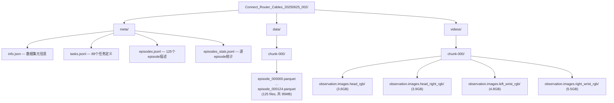

### 2.2 数据模态与特征维度

LeRobot v2.1 将 **结构化数据** (状态/动作) 存储为 Parquet, **视觉数据** 存储为独立的 MP4 视频文件, 通过 `frame_index` 对齐.

#### 视觉模态 (4 路视频)

| 摄像头 | 分辨率 | 编码 | 像素格式 | 单摄像头总大小 |
|--------|--------|------|----------|--------------|
| `head_rgb` | 1280×720 | AV1 (av01) | yuv420p | 3.6 GB |
| `head_right_rgb` | 1280×720 | AV1 | yuv420p | 3.9 GB |
| `left_wrist_rgb` | 1280×720 | AV1 | yuv420p | 4.8 GB |
| `right_wrist_rgb` | 1280×720 | AV1 | yuv420p | 5.6 GB |

> AV1 编码在相同视觉质量下比 H.264 节省约 30-50% 带宽, 但解码计算开销更大. 腕部摄像头文件更大是因为手部运动导致场景变化更剧烈, 压缩率更低.

#### 状态观测空间

| 特征 | 维度 | 数据类型 | 说明 |
|------|------|----------|------|
| `observation.state.left_arm` | 6 | float64 | 左臂6关节角度 (rad) |
| `observation.state.left_arm.velocities` | 6 | float64 | 左臂6关节角速度 |
| `observation.state.right_arm` | 6 | float64 | 右臂6关节角度 |
| `observation.state.right_arm.velocities` | 6 | float64 | 右臂6关节角速度 |
| `observation.state.left_gripper` | 1 | float64 | 左夹爪开合度 (0-100) |
| `observation.state.right_gripper` | 1 | float64 | 右夹爪开合度 (0-100) |
| `observation.state.left_ee_pose` | 7 | float64 | 左末端执行器位姿 (xyz + quaternion) |
| `observation.state.right_ee_pose` | 7 | float64 | 右末端执行器位姿 |
| `observation.state.chassis` | 3 | float64 | 底盘位置 |
| `observation.state.chassis.velocities` | 3 | float64 | 底盘速度 |
| `observation.state.chassis.imu` | 10 | float64 | IMU (四元数+角速度+线加速度) |
| `observation.state.torso` | 4 | float64 | 躯干关节位置 |
| `observation.state.torso.velocities` | 4 | float64 | 躯干关节速度 |
| **观测总维度** | **73** | | (不含视频) |

#### 动作空间

| 特征 | 维度 | 数据类型 | 说明 |
|------|------|----------|------|
| `action.left_arm` | 6 | float64 | 左臂目标关节位置 |
| `action.right_arm` | 6 | float64 | 右臂目标关节位置 |
| `action.left_gripper` | 1 | float64 | 左夹爪目标 (0 或 100) |
| `action.right_gripper` | 1 | float64 | 右夹爪目标 |
| `action.chassis.velocities` | 6 | float64 | 底盘目标速度 (Twist) |
| `action.torso.velocities` | 6 | float64 | 躯干目标速度 (Twist) |
| **动作总维度** | **26** | | |

#### 元数据列

| 列名 | 说明 |
|------|------|
| `frame_index` | 帧内序号 (从0开始) |
| `episode_index` | Episode 编号 |
| `index` | 全局帧索引 |
| `timestamp` | 时间戳 (秒) |
| `task_index` | 当前帧的细粒度任务标签 |
| `coarse_task_index` | 粗粒度任务标签 (全部为13: "connect router cables") |
| `quality_index` | 细粒度质量标签 (25=qualified, 9=unqualified) |
| `coarse_quality_index` | 粗粒度质量标签 (全部为25) |

---

## 3. Episode 统计分析

### 3.1 Episode 长度分布

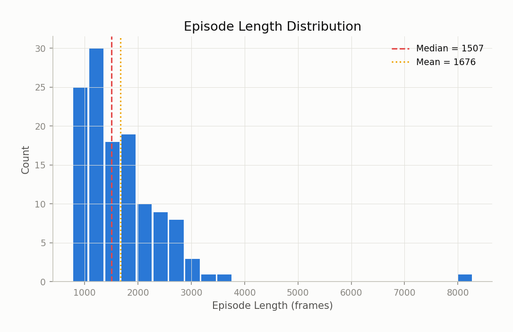

$$
\text{Length} \sim \begin{cases}
\min = 766 \text{ frames} \approx 51.1\text{s} \\
\max = 8{,}278 \text{ frames} \approx 551.9\text{s} \\
\mu = 1{,}675.9 \text{ frames} \approx 111.7\text{s} \\
\tilde{x} = 1{,}507 \text{ frames} \approx 100.5\text{s} \\
\sigma = 858.2 \text{ frames}
\end{cases}
$$

分布呈明显的 **右偏长尾** 特征:

| 区间 (frames) | Episode 数 | 占比 |
|--------------|-----------|------|
| 500–1,000 | 14 | 11.2% |
| 1,000–1,500 | 48 | 38.4% |
| 1,500–2,000 | 31 | 24.8% |
| 2,000–3,000 | 27 | 21.6% |
| 3,000–5,000 | 4 | 3.2% |
| 5,000–10,000 | 1 | 0.8% |

大多数 episode 集中在 1,000-2,000 帧 (约 67-133 秒). Episode 0 是明显的异常值 (8,278 帧 ≈ 9.2 分钟), 其中包含了冰箱整理等非核心任务, 可能是数据采集初期的混合录制.

### 3.2 每 Episode 任务数

$$
\text{Tasks per episode: } \min = 3, \quad \max = 27, \quad \mu = 10.1
$$

Episode 0 的 27 个任务标签远超其他 episode, 进一步印证其为混合录制.

---

## 4. 任务体系分析

### 4.1 任务层级结构

本数据集采用 **两级任务标注**:

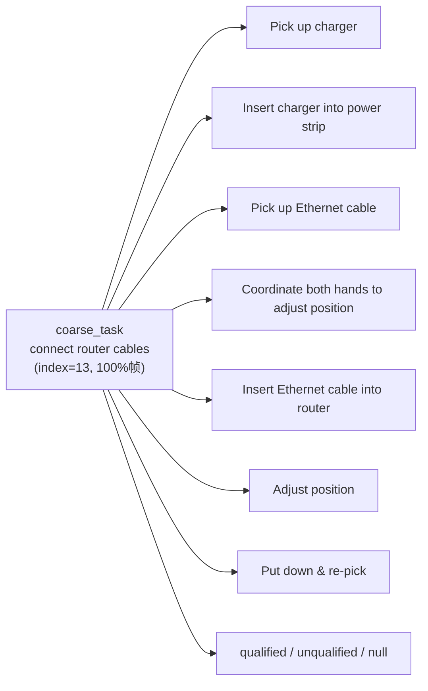

`coarse_task_index` 恒为 13 ("connect router cables"), 表明所有 125 个 episode 都属于同一个粗粒度任务. 细粒度 `task_index` 用于标注 episode 内各时间段的子动作.

### 4.2 任务语义去重

原始 89 个 `task_index` 中存在大量 **翻译变体** (同一中文语义, 不同英文翻译), 去重后仅 **42 个语义唯一任务**. 以下为变体数最多的语义:

| 中文语义 | 翻译变体数 | 说明 |
|---------|-----------|------|
| 左手将网线头插入路由器 | 9 | 核心操作, 标注最不一致 |
| 左手拿起网线头 | 9 | |
| 双手配合调整网线头的位置 | 8 | |
| 左手放下网线头后重新拿起 | 7 | 失误重试动作 |
| 左手拿起充电头 | 6 | |
| 左手放下充电头后重新拿起 | 5 | 失误重试动作 |
| 左手将充电头插入插排 | 4 | |

> **标注一致性问题**: 这是一个需要在数据清洗阶段解决的问题. 同一语义操作被标注为不同的 `task_index`, 会导致 VLA 模型在条件生成时无法正确关联语言指令与动作. 建议合并翻译变体, 建立规范化的 task 映射表.

### 4.3 任务频率分布

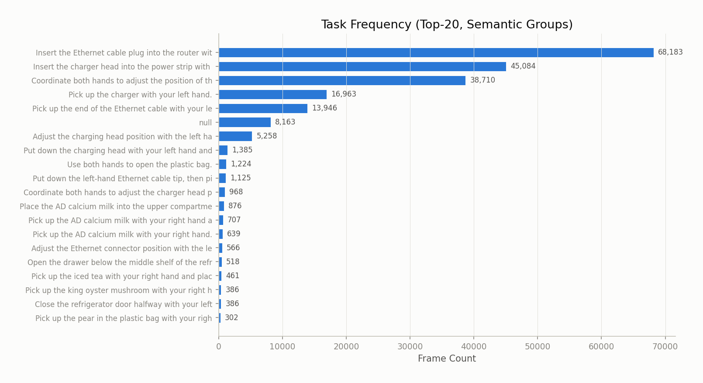

按帧数统计, 前三大任务占据了总帧数的 **72.5%**:

| 排名 | 任务 (语义合并) | 帧数 | 占比 |
|------|----------------|------|------|
| 1 | Insert Ethernet cable into router | 68,183 | 32.5% |
| 2 | Insert charger into power strip | 45,084 | 21.5% |
| 3 | Coordinate both hands to adjust position | 38,710 | 18.5% |
| 4 | Pick up charger | 16,963 | 8.1% |
| 5 | Pick up Ethernet cable | 13,946 | 6.7% |

**数据分布高度不均衡**: 插入动作 (insert) 占据了过半帧数, 而抓取动作 (pick up) 仅占约 15%. 这反映了插入操作的高难度和长耗时特性.

### 4.4 任务时长分析

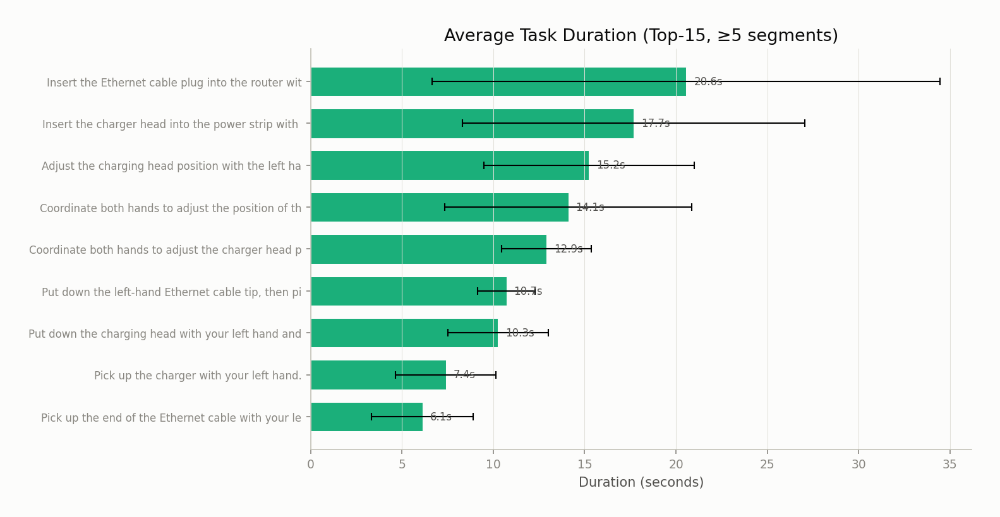

| 任务 | 平均时长 | 标准差 | 说明 |
|------|---------|--------|------|
| Insert Ethernet cable into router | 20.6s | ±14.6s | 最耗时, 方差大 — 精细对准难度高 |
| Insert charger into power strip | 17.7s | ±12.4s | 次耗时 |
| Adjust charging head position | 15.2s | ±5.5s | 方差较小, 相对一致 |
| Coordinate both hands | 14.1s | ±7.8s | 双手协调 |
| Pick up charger | 7.4s | ±3.8s | 抓取动作较快 |
| Pick up Ethernet cable | 6.1s | ±3.0s | 抓取动作较快 |

**关键发现**: 插入类操作的时间方差显著大于抓取类操作 ($\sigma_{\text{insert}} / \sigma_{\text{pick}} \approx 3\text{–}4\times$), 说明插入成功率不稳定, 常需多次尝试. 数据中确实存在 "放下后重新拿起" 的重试标签 (7个变体, 约 1,125 帧).

### 4.5 典型 Episode 任务流

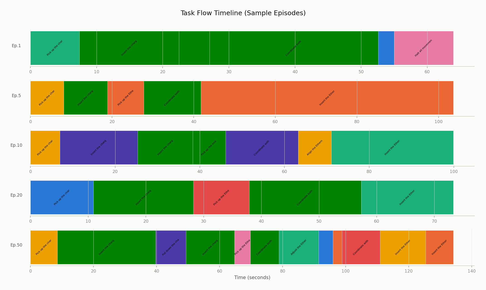

典型的 episode 遵循以下 **标准操作序列**:

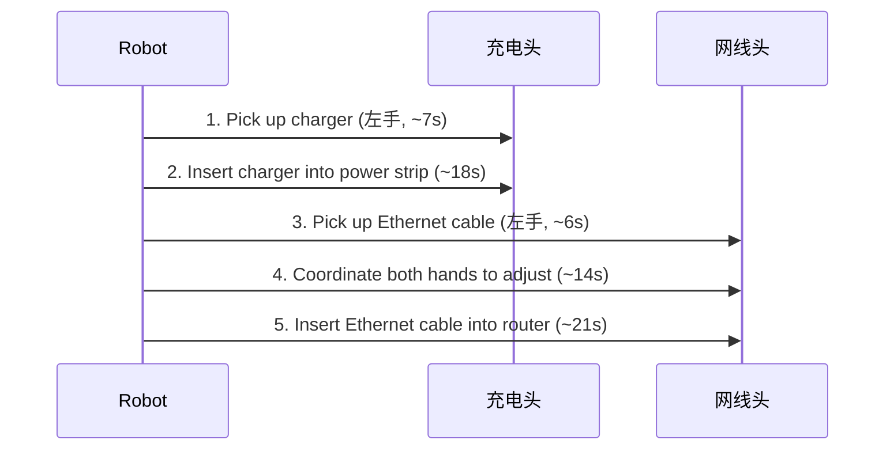

从 task flow 图可以观察到:
- **Ep.1, Ep.5, Ep.20**: 遵循标准流程, 耗时 60-100 秒
- **Ep.10**: 出现多次调整和重试, 耗时更长
- **Ep.50**: 出现 "放下充电头后重新拿起" 的重试行为, 反映操作失误

---

## 5. 状态-动作空间分析

### 5.1 关节空间范围

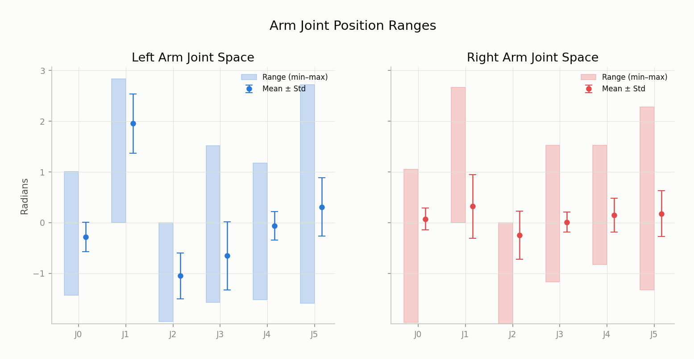

#### 左臂 (主操作臂)

| 关节 | Min (rad) | Max (rad) | Mean | Std | 活动范围 |
|------|-----------|-----------|------|-----|---------|
| J0 | -1.44 | 1.01 | -0.28 | 0.29 | 2.44 |
| J1 | -0.004 | 2.83 | 1.96 | 0.58 | 2.83 |
| J2 | -1.95 | 0.00 | -1.05 | 0.45 | 1.95 |
| J3 | -1.58 | 1.52 | -0.66 | 0.67 | 3.09 |
| J4 | -1.52 | 1.18 | -0.06 | 0.28 | 2.70 |
| J5 | -1.59 | 2.72 | 0.31 | 0.57 | 4.31 |

#### 右臂

| 关节 | Min (rad) | Max (rad) | Mean | Std | 活动范围 |
|------|-----------|-----------|------|-----|---------|
| J0 | -1.97 | 1.05 | 0.07 | 0.21 | 3.02 |
| J1 | -0.003 | 2.67 | 0.32 | 0.63 | 2.67 |
| J2 | -2.00 | 0.002 | -0.25 | 0.47 | 2.00 |
| J3 | -1.17 | 1.52 | 0.01 | 0.20 | 2.69 |
| J4 | -0.83 | 1.52 | 0.14 | 0.34 | 2.35 |
| J5 | -1.33 | 2.28 | 0.18 | 0.46 | 3.61 |

**对比分析**:
- **左臂** 的关节活动范围和标准差普遍大于右臂, 特别是 J1 (肩部) 和 J5 (腕部), 与其作为主操作臂执行精细插拔任务的角色一致
- **右臂** 的 J3-J4 标准差仅为左臂的 1/3 ($\sigma_R \approx 0.2$ vs $\sigma_L \approx 0.6$), 说明右臂在操作中主要起辅助定位作用, 活动幅度有限

### 5.2 末端执行器工作空间

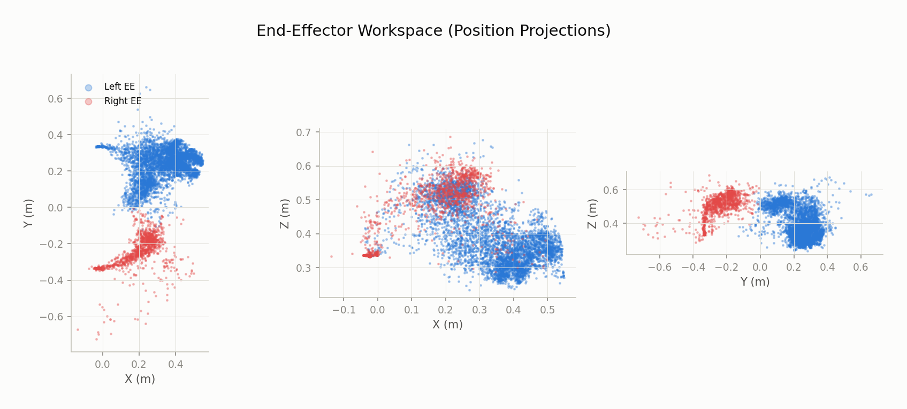

#### 左末端执行器

| 维度 | Min (m) | Max (m) | Mean | Std |
|------|---------|---------|------|-----|
| X | -0.062 | 0.550 | 0.323 | 0.135 |
| Y | -0.177 | 0.665 | 0.241 | 0.084 |
| Z | 0.231 | 0.677 | 0.387 | 0.085 |

#### 右末端执行器

| 维度 | Min (m) | Max (m) | Mean | Std |
|------|---------|---------|------|-----|
| X | -0.140 | 0.500 | 0.026 | 0.105 |
| Y | -0.777 | 0.004 | -0.313 | 0.060 |
| Z | 0.281 | 0.710 | 0.375 | 0.078 |

**工作空间特征**:

从 XY 投影可以清晰看到 **双臂分区操作** 的模式:
- 左臂 EE 工作区域集中在 $(X \in [0.1, 0.5], Y \in [0.15, 0.35])$ — 机器人正前方偏右
- 右臂 EE 工作区域集中在 $(X \in [-0.05, 0.15], Y \in [-0.35, -0.25])$ — 机器人正前方偏左
- 两臂在 XZ 平面存在交叉区域 ($X \in [0.1, 0.3]$), 这正是 "双手配合调整" 任务发生的空间

Z 轴范围 0.23-0.71m 反映了工作台面到路由器接口的高度范围.

### 5.3 夹爪状态分布

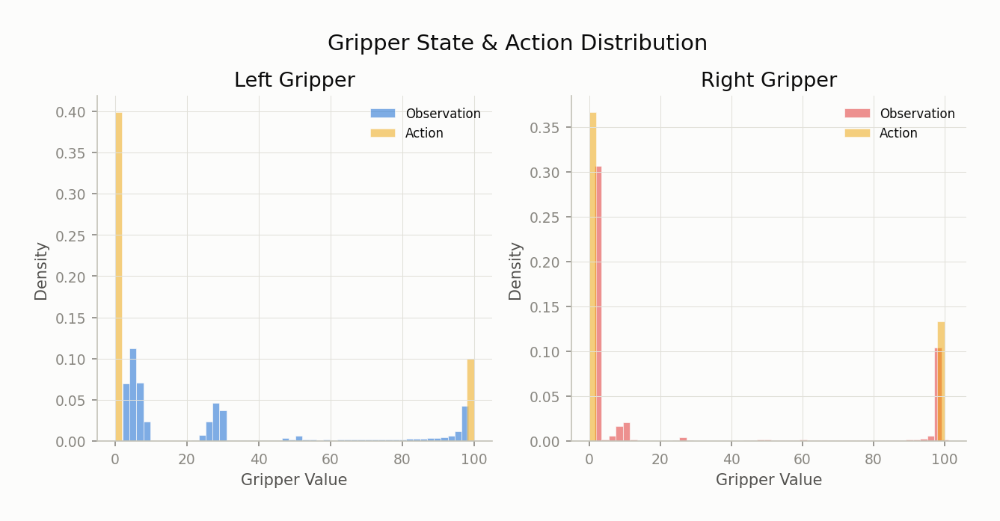

夹爪表现出强烈的 **双峰分布** (bimodal):

| | 左夹爪 | 右夹爪 |
|---|--------|--------|
| 动作命令 | 0 或 100 (二值) | 0 或 100 (二值) |
| 观测状态 | 集中在 2-10 和 90-100 | 集中在 1-5 和 95-101 |
| 开 (≈100) 占比 | ~20% | ~27% |

**关键发现**:
- **动作空间** 是严格的二值控制 (0=关闭, 100=打开), 没有中间值
- **观测空间** 存在连续值, 反映了夹爪实际运动的延迟和弹性
- 右夹爪大部分时间处于关闭状态 ($\approx 73\%$), 与其辅助角色一致 — 右手在 "connect router cables" 任务中主要负责固定线缆, 不频繁开合

### 5.4 底盘与躯干活动

底盘和躯干的动作空间存在大量 **恒零维度**:

| 动作通道 | 非零维度 | 恒零维度 | 说明 |
|---------|---------|---------|------|
| `action.chassis.velocities` (6D) | dim[0,1,5] | dim[2,3,4] | 仅 x/y 平移和 yaw 旋转有值 |
| `action.torso.velocities` (6D) | dim[2,4] | dim[0,1,3,5] | 仅 z 升降和 pitch 俯仰有值 |

有效动作维度: $6_{\text{chassis}} \to 3, \quad 6_{\text{torso}} \to 2$, 总动作空间可从 26D 压缩至 **21D**.

底盘速度极小 ($|\bar{v}| < 0.001$, $\sigma < 0.016$), 说明在 "connect router cables" 任务中机器人几乎不移动底盘, 这符合定点精细操作的特性.

### 5.5 IMU 数据特征

| 通道 | Mean | 说明 |
|------|------|------|
| `linear_acceleration.z` | -0.9996 | 接近 $-g \approx -9.8 \text{m/s}^2$ (归一化后) |
| `angular_velocity.*` | ≈ 0 | 机器人基本静止 |
| `orientation.z` | 0.282 | 底盘朝向有一定偏转 |

IMU 数据确认机器人在操作过程中基本保持静止姿态.

---

## 6. 质量标注分析

### 6.1 质量标签分布

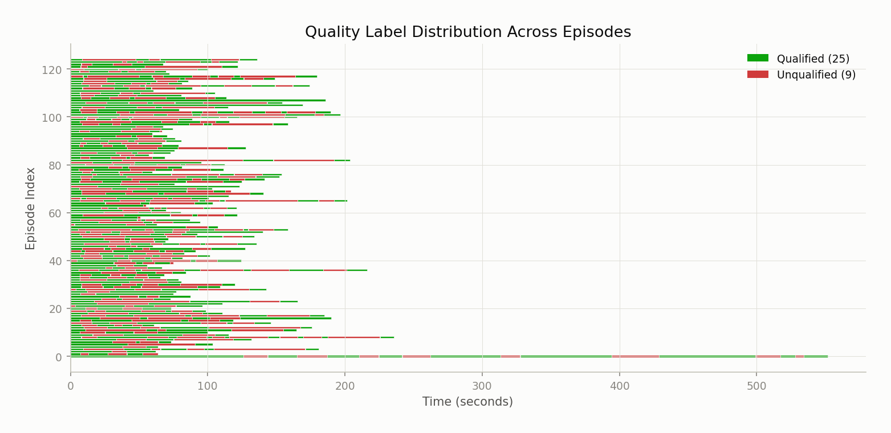

| 标签 | 帧数 | 占比 | 涉及 Episode 数 |
|------|------|------|----------------|
| `quality_index = 25` (qualified) | 115,512 | 55.1% | 125 |
| `quality_index = 9` (unqualified) | 93,972 | 44.9% | 118 |
| `coarse_quality_index = 25` | 209,484 | 100% | 125 |

### 6.2 质量标签的段内切换

质量标签 **不是 episode 级别的**, 而是 **帧级别的**, 在同一 episode 内会多次切换. 以 Episode 1 为例:

```
frame   0 → quality=25 (qualified)  | Pick up charger
frame 111 → quality=9  (unqualified) | Insert charger into power strip
frame 196 → quality=25 (qualified)  | Insert charger (成功段)
frame 406 → quality=9  (unqualified) | Coordinate both hands
frame 617 → quality=25 (qualified)  | Coordinate both hands (调整到位)
frame 789 → quality=9  (unqualified) | Insert Ethernet cable (尝试中)
```

**解读**: 质量标签标注的是每个时间段内操作的 "执行质量", 而非整个 episode 是否成功:
- `qualified (25)`: 操作动作规范, 手臂轨迹平滑, 可作为模仿学习的 **正样本**
- `unqualified (9)`: 操作存在犹豫、重试、偏差, 是 **负样本或次优样本**
- `coarse_quality_index` 恒为 25, 表示从 **粗粒度** (整个 episode) 角度看, 每个 episode 最终都完成了任务

### 6.3 对 VLA 训练的影响

近一半数据 (44.9%) 被标记为 unqualified, 这为训练策略提供了选择空间:

| 策略 | 使用数据 | 帧数 | 适用场景 |
|------|---------|------|---------|
| 仅用 qualified | quality=25 | 115,512 | 纯模仿学习, 追求动作质量 |
| 全部使用 | 全部 | 209,484 | 增加数据多样性, 配合奖励模型 |
| 对比学习 | qualified vs unqualified | 209,484 | 学习区分好/差操作 |

---

## 7. 数据质量问题与建议

### 7.1 任务标注冗余

**问题**: 89 个 `task_index` 中有 47 个 (53%) 是翻译变体, 去重后仅 42 个语义唯一任务. 例如 "左手将网线头插入路由器" 有 9 种不同的英文翻译, 分布在不同的 `task_index` 上.

**影响**: VLA 模型在处理 language-conditioned action 时, 无法将不同的 `task_index` 关联到同一操作语义, 导致:
1. 条件动作生成的语言空间碎片化
2. 任务相关的统计分析失真 (同一操作被拆分为多个低频任务)

**建议**: 建立 `task_index → canonical_task` 的映射表, 以中文语义为主键合并变体. 映射后实际任务数将从 89 降至 42.

### 7.2 动作空间稀疏维度

**问题**: 26D 动作空间中有 5 个维度恒为零 (底盘 dim[2,3,4] + 躯干 dim[0,1,3,5]).

**建议**: 对于该数据集的 VLA 训练, 可将动作空间裁剪为 21D, 减少模型需要预测的维度数. 如果需要跨任务泛化, 可保留全维度但在 loss 计算中屏蔽恒零维度.

### 7.3 Episode 异常值

**问题**: Episode 0 长度为 8,278 帧 (是中位数的 5.5 倍), 包含 27 个任务标签, 涵盖了冰箱整理等与 "connect router cables" 无关的操作 (如 "放冰红茶到冰箱", "拿起杏鲍菇" 等).

**建议**: Episode 0 应被标记为混合录制, 在训练 "connect router cables" 单任务模型时应排除, 或仅提取其中 `coarse_task_index=13` 对应的子段.

### 7.4 数据不均衡

**问题**: 任务帧数分布高度不均 — 插入类操作占 54%, 抓取类仅占 15%. 且 "放下后重新拿起" 等重试行为虽频率低但时长可观.

**建议**:
- 对低频任务 (如 "调整充电头位置") 进行过采样
- 考虑基于任务类型的分层采样策略
- 重试行为可作为 "failure recovery" 的额外训练信号

### 7.5 总结

| 维度 | 评估 | 说明 |
|------|------|------|
| 数据规模 | 中等 | 125 episodes / 66 分钟, 适合单任务微调 |
| 模态完整性 | 好 | 4 路视频 + 完整本体感知 |
| 标注粒度 | 好 | 帧级别任务+质量双重标注 |
| 标注一致性 | 需改进 | 翻译变体导致任务碎片化 |
| 动作空间 | 可优化 | 5个恒零维度可裁剪 |
| 数据平衡性 | 一般 | 插入操作占比过高 |
| 质量标注 | 有价值 | 55/45 的 qualified/unqualified 比例为对比学习提供了条件 |
