# Galaxea Open-World Dataset 分析: Connect_Router_Cables 任务

> **TL;DR** — 对 Galaxea R1 Lite 机器人的 Connect_Router_Cables 任务（125 episodes, 209K frames, 4 cameras × 720p@15fps）进行了多层次数据质量分析。发现三个关键问题：① Episode 0 混入了冰箱操作等无关任务（应移除）；② **44.9% 的帧被标记为 unqualified**（质量标签为帧级分段标注）；③ 32/125 episodes 存在 state-action 方向不一致。轨迹平滑度（SAL）中位数 −420，最粗糙的 Episode 0 为 −2813。建议使用 Data-Juicer 的 VLA 算子管道结合已有的 `clean_stage123.py` 三阶段清洗流程来提升数据质量。

---

## 目录

1. [具身智能数据需求分析](#1-具身智能数据需求分析)
2. [数据集概览与格式深度解析](#2-数据集概览与格式深度解析)
3. [数据质量分析框架](#3-数据质量分析框架)
4. [Connect_Router_Cables 质量分析结果](#4-connect_router_cables-质量分析结果)
5. [质量提升建议](#5-质量提升建议)
6. [Data-Juicer 处理管道设计](#6-data-juicer-处理管道设计)
7. [附录：快速参考表](#7-附录快速参考表)

---

## 1. 具身智能数据需求分析

### 1.1 VLA 模型的三阶段训练范式

Galaxea G0 论文 ([arXiv:2509.00576](https://arxiv.org/abs/2509.00576)) 提出了三阶段训练课程，每阶段对数据的需求不同：

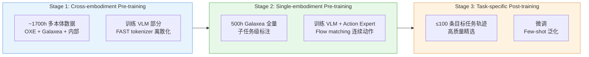

| 阶段 | 数据规模 | 数据要求 | 论文关键发现 |
|------|---------|---------|------------|
| **Stage 1** | ~1700h | 多本体、粗粒度标注即可 | 主要帮助「简单通用动作模式」如 pick-and-place |
| **Stage 2** | ~500h | 单一本体、**子任务级精细标注** | **最关键**——无此阶段的模型表现最差 |
| **Stage 3** | ≤100 条 | 高质量、目标任务特定 | 本体差距大时，cross-embodiment 收益减弱甚至有害 |

> **核心结论**：Stage 2 的单本体预训练数据**质量比数量更重要** — 论文中 200h vs 400h 的对比表明数据量翻倍带来的提升有限，但不合格数据的混入会直接拖累模型。

### 1.2 关键数据模态

对于 R1 Lite 这类全身移动操作机器人，完整的训练数据需包含：

| 模态 | 作用 | 本数据集支持 |
|------|-----|------------|
| **RGB 多视角** | 场景理解、目标定位 | ✅ 4 cameras (head×2, wrist×2) |
| **本体感知 state** | 关节位置/速度、底盘、IMU | ✅ 24 有效维度 |
| **连续动作** | 关节目标位置、底盘速度指令 | ✅ 22 有效维度 |
| **语言指令** | 任务语义、子任务分割 | ✅ 双语 (中文@English) |
| **末端执行器位姿** | 精准抓取定位 | ✅ left/right ee_pose (7-dim each, 原始格式) |
| **夹爪状态** | 抓取/释放时机 | ✅ 0(关)-100(开) |
| **深度图** | 3D 空间感知 | ❌ 不含（cameras 为 RGB-only） |

### 1.3 数据质量在模仿学习中的核心地位

RINSE 论文 ([arXiv:2604.23000](https://arxiv.org/abs/2604.23000)) 证明了轨迹平滑度是数据质量的有效代理指标：

- 使用 SAL（频域平滑度）筛选 **1/6 的数据可达到全量数据 +16% 的成功率**
- 使用 TED（空间平滑度）筛选 **1/2 的数据可达到 +20% 的提升**
- 关键数学直觉：平滑度筛选降低了保留数据分布的条件动作方差

$$\text{Var}[a|s, \mathcal{D}_{\text{filtered}}] \leq \text{Var}[a|s, \mathcal{D}_{\text{full}}]$$

这为我们评估 Connect_Router_Cables 数据集质量提供了理论依据。

---

## 2. 数据集概览与格式深度解析

### 2.1 Galaxea Open-World Dataset 总览

| 指标 | 数值 |
|------|------|
| 总轨迹数 | 100K+ |
| 任务类别 | 150+ |
| 真实场景 | 50 个，跨 11 个采集地点 |
| 场景类型 | 居家、零售、餐饮、办公 |
| 机器人平台 | Galaxea R1 Lite (23-DoF) |
| 总时长 | 500+ 小时 |
| 数据格式 | LeRobot v2.1 |
| 许可证 | CC BY-NC-SA 4.0 |

### 2.2 LeRobot v2.1 格式解析

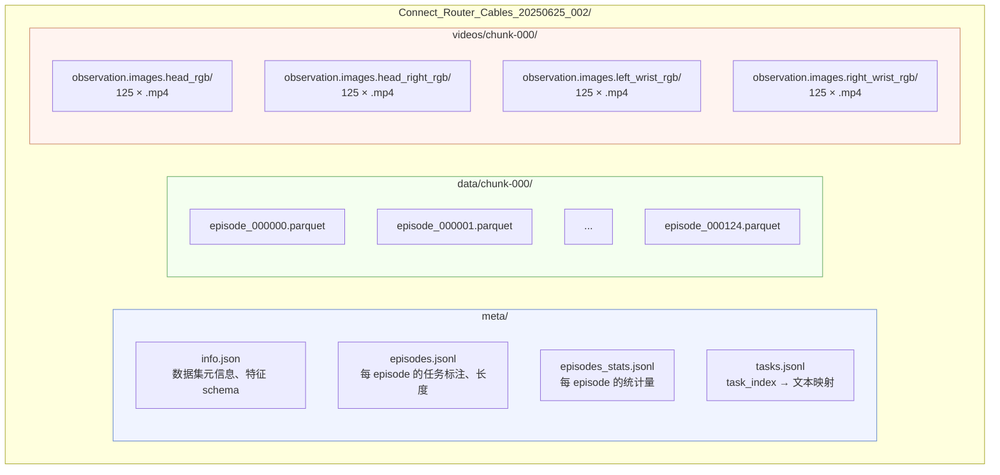

### 2.3 统一动作/状态空间映射

本数据集使用 `process_to_unified50.py` 从原始 per-feature 格式转换为统一格式。R1 Lite 是 6-DoF 手臂（缺 shoulder_roll），映射时该维度被 pad。

**State 空间 (56-dim)**:

| 语义槽位 | 维度范围 | 有效 | R1 Lite 映射 |
|----------|---------|------|-------------|
| left_arm | [0, 6] | 6/7 | slot 1 (shoulder_roll) = pad |
| left_hand | [7] | 1/1 | gripper 0-100 |
| right_arm | [8, 14] | 6/7 | slot 9 = pad |
| right_hand | [15] | 1/1 | gripper 0-100 |
| torso | [16, 20] | 4/5 | 4 关节位置，slot 20 pad |
| head | [21, 23] | 0/3 | 全 pad（R1 Lite 无头部 DOF） |
| chassis | [24, 32] | 6/9 | pos(3) + vel(3) + pad(3) |
| reserved | [33, 55] | 0/23 | 全 pad |
| **合计** | **56** | **24** | 有效率 42.9% |

**Action 空间 (50-dim)**:

| 语义槽位 | 维度范围 | 有效 | R1 Lite 映射 |
|----------|---------|------|-------------|
| left_arm | [0, 6] | 6/7 | slot 1 = pad |
| left_hand | [7] | 1/1 | gripper target 0-100 |
| right_arm | [8, 14] | 6/7 | slot 9 = pad |
| right_hand | [15] | 1/1 | gripper target 0-100 |
| torso | [16, 20] | 5/5 | 速度指令（torso_0/1 恒零） |
| head | [21, 23] | 0/3 | 全 pad |
| base | [24, 26] | 3/3 | vx, vy, ωz |
| reserved | [27, 49] | 0/23 | 全 pad |
| **合计** | **50** | **22** | 有效率 44.0% |

> **注意 state 与 action 的语义差异**：state 中 torso 是**位置**（关节角），action 中 torso 是**速度指令**；state 中 chassis 包含**位置+速度**，action 中 base 只有**速度指令** (vx, vy, ωz)。这种差异是设计上的——state 反映感知，action 反映控制指令。

### 2.4 Connect_Router_Cables 任务详情

| 属性 | 值 |
|------|-----|
| 任务名 | Connect_Router_Cables_20250625_002 |
| Episodes | 125 |
| 总帧数 | 209,484 |
| 总时长 | 232.8 分钟 |
| FPS | 15 |
| 相机数 | 4 (head_rgb, head_right_rgb, left_wrist_rgb, right_wrist_rgb) |
| 视频编码 | AV1, 720p (1280×720) |
| 机器人序列号 | RB250319014 |
| 采集日期 | 2025-06-25 / 2025-06-26 |
| 子任务标注数 | 879 条（双语中文@English） |
| 粗粒度任务标签 | "connect router cables" |

**典型子任务**:
- 左手拿起网线头 / Pick up the end of the Ethernet cable with your left hand
- 双手配合调整网线头的位置 / Coordinate both hands to adjust the position of the Ethernet connector
- 左手将网线头插入路由器 / Insert the Ethernet cable plug into the router with your left hand
- 左手拿起充电头 / Pick up the charger head with your left hand
- 左手将充电头插入插排 / Insert the charger head into the power strip with your left hand

---

## 3. 数据质量分析框架

### 3.1 三层质量模型

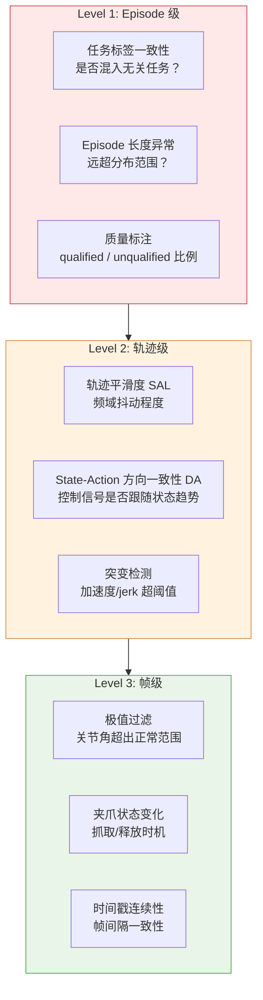

### 3.2 指标定义

#### 3.2.1 Spectral Arc Length (SAL)

对末端执行器速度信号 $v[0:T{-}1]$（采样间隔 $\Delta t = 1/15$ s）：

1. 计算 FFT：$V_k = \hat{v}(f_k)$，频率 $f_k = k / (T \Delta t)$
2. 取对数幅度：$L_k = \ln(|V_k| + \varepsilon)$，$\varepsilon = 10^{-5}$
3. 沿对数谱曲线求弧长：

$$\text{SAL}(v) = -\sum_{k=1}^{T/2} \sqrt{(f_k - f_{k-1})^2 + (L_k - L_{k-1})^2}$$

**SAL 越接近 0 表示运动越平滑**。低频主导（仅有缓慢运动）的信号 SAL 接近 0；高频能量大（抖动、毛刺）的信号 SAL 更负。

#### 3.2.2 状态-动作方向一致性 (DA)

对关节维度 $d$，取 state 差分 $\Delta s_t = s_{t+1}^d - s_t^d$ 和 action 差分 $\Delta a_t = a_{t+1}^d - a_t^d$，仅考虑「有效运动」帧（$|\Delta s_t| > \varepsilon$ 或 $|\Delta a_t| > \varepsilon$，$\varepsilon = 0.01 \times (q_{99} - q_{01})$）：

$$\text{DA}^d = \frac{1}{|\mathcal{A}|} \sum_{t \in \mathcal{A}} \mathbb{1}[\text{sign}(\Delta s_t) = \text{sign}(\Delta a_t)]$$

**DA < 0.65 表示该维度的 state 与 action 趋势不一致**，可能由时钟不同步、丢包、或控制延迟导致。

#### 3.2.3 突变检测

对位置信号 $q_t$（关节角 / 末端位置），计算二阶差分（加速度）：

$$\ddot{q}_t = q_{t+2} - 2q_{t+1} + q_t$$

设 $\sigma = \max(\text{std}(\ddot{q}),\; 0.02 \times (q_{99} - q_{01}),\; 0.01)$，当 $|\ddot{q}_t| > 8\sigma$ 时标记为突变。

---

## 4. Connect_Router_Cables 质量分析结果

> 以下结果由 `analyze_glx.py` 在 lerobot_door 统一格式数据上计算得出。

### 4.1 Episode 级异常

#### 4.1.1 Episode 0 — 混入无关任务

| 属性 | Episode 0 | 典型 Episode (1-124) |
|------|----------|---------------------|
| 帧数 | **8,278** (552s) | 766-3,869 (median 1,507) |
| 子任务数 | **23** | 5-11 |
| 子任务内容 | 冰箱操作（取冰红茶、蘑菇、西葫芦…） | 网线/充电线插拔 |
| SAL | **−2,813** | median −420 |
| 粗粒度标签 | "connect router cables" | "connect router cables" |

**结论**: Episode 0 的内容为冰箱整理操作，与路由器网线连接无关。其粗粒度标签仍为 "connect router cables"，属于**数据组织错误**。

**建议**: 🔴 **必须移除** — 此 episode 的动作分布与真实任务完全不同，混入训练会引入噪声。

#### 4.1.2 Episode 长度分布

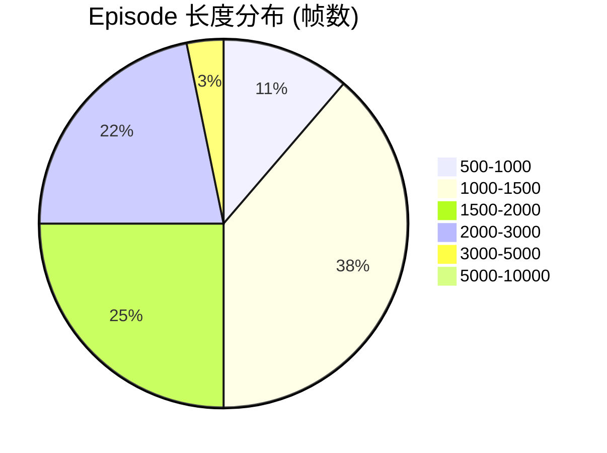

| 统计量 | 值 |
|--------|-----|
| 最短 | 766 帧 (51.1s) |
| 最长 | 8,278 帧 (551.9s) — Episode 0 |
| 中位数 | 1,507 帧 (100.5s) |
| 均值 | 1,675.9 帧 (111.7s) |
| 标准差 | 722.9 帧 |

排除 Episode 0 后，最长 episode 为 3,869 帧 (257.9s)，分布更集中。

### 4.2 帧级质量标签分析

质量标签是**帧级分段标注**（非 episode 级），同一 episode 内不同时段可分别标注为 qualified / unqualified：

| 质量标签 | 帧数 | 占比 | 涉及 Episodes |
|----------|------|------|-------------|
| **qualified** | 115,512 | **55.1%** | 125/125 |
| **unqualified** | 93,972 | **44.9%** | 118/125 |

> **发现**: 近半数帧被标记为 unqualified。118/125 episodes 含有 unqualified 段。这表明数据采集过程中有大量不合格操作（操作员失误、异常 ROS topic 频率等），且这些不合格段**未被过滤**就进入了数据集。

**建议**: 根据训练阶段决定处理策略：
- **Stage 2 预训练**: 可保留全部数据（含 unqualified），模型有一定容错能力
- **Stage 3 微调**: 🔴 **必须仅使用 qualified 段**，否则少量低质量数据会严重影响 few-shot 结果

### 4.3 轨迹平滑度 (SAL) 分布

| 统计量 | 左臂 SAL | 右臂 SAL | 综合均值 |
|--------|---------|---------|---------|
| 最佳（最平滑） | −173.1 | −160.3 | −202.5 |
| Q25 | | | −586.9 |
| 中位数 | −468.7 | −284.1 | −420.1 |
| Q75 | | | −326.1 |
| 最差（最粗糙） | −1,929.1 | −3,697.0 | −2,813.1 |
| 均值 | −566.2 | −442.6 | |
| 标准差 | 295.4 | 309.0 | |

**SAL 分布直方图**:

| SAL 范围 | 数量 | 占比 |
|----------|------|------|
| [−3000, −1500) | 1 | 0.8% — Episode 0 (异常) |
| [−1500, −1000) | 4 | 3.2% |
| [−1000, −750) | 12 | 9.6% |
| [−750, −500) | 29 | 23.2% |
| **[−500, −350)** | **40** | **32.0%** — 主峰 |
| [−350, −250) | 36 | 28.8% |
| [−250, 0) | 3 | 2.4% |

> **分析**: 大部分 episodes (60.8%) 的 SAL 在 [−500, −250) 范围内，表明整体平滑度中等偏好。SAL < −1000 的 5 个 episodes (含 Episode 0) 值得重点审查。

**最平滑 / 最粗糙 Top 5**:

| 排名 | 最平滑 (SAL ↑) | 最粗糙 (SAL ↓) |
|------|---------------|---------------|
| 1 | Episode 58 (−202.5) | Episode 0 (**−2,813.1**) |
| 2 | Episode 93 (−237.2) | Episode 8 (−1,213.5) |
| 3 | Episode 38 (−243.7) | Episode 36 (−1,116.0) |
| 4 | Episode 63 (−251.0) | Episode 82 (−1,090.8) |
| 5 | Episode 2 (−254.0) | Episode 65 (−1,011.6) |

### 4.4 State-Action 方向一致性

| 结果 | 数量 | 占比 |
|------|------|------|
| 完全对齐 (所有维度 DA ≥ 0.65) | **93** | 74.4% |
| 存在不对齐 | **32** | 25.6% |
| 严重不对齐 (≥8 维失败) | **10** | 8.0% |

**不对齐程度分布**:

| 不对齐维度数 | Episodes |
|-------------|---------|
| 1-3 维 | 10 |
| 4-7 维 | 12 |
| 8-10 维 | 7 |
| 11-12 维 | 3 |

> **分析**: 32 个 episodes 存在 state-action 方向不一致。最严重的 Episode 7, 123, 124 有 11/12 维不对齐，可能由 state/action 时钟偏移或控制回路延迟导致。

> **注意**：这里的 DA 阈值 (0.65) 与 `clean_stage123.py` 一致。该脚本在实际清洗中可通过 `--da-thresh` 调整敏感度。

### 4.5 关节活动范围统计

**手臂关节 (State, 单位: rad)**:

| 关节 | 左臂范围 | 左臂 std | 右臂范围 | 右臂 std |
|------|---------|---------|---------|---------|
| j0 | [−0.00, 2.83] | 0.583 | [−0.00, 2.67] | 0.627 |
| j2 | [−1.44, 1.01] | 0.290 | [−1.97, 1.05] | 0.212 |
| j3 | [−1.95, 0.00] | 0.451 | [−2.00, 0.00] | 0.474 |
| j4 | [−1.52, 1.18] | 0.280 | [−0.83, 1.52] | 0.335 |
| j5 | [−1.58, 1.52] | 0.671 | [−1.17, 1.52] | 0.197 |
| j6 | [−1.59, 2.72] | 0.573 | [−1.33, 2.28] | 0.456 |

> **发现**: 左臂活动范围普遍大于右臂（std 更大），与任务语义一致——子任务描述中左手执行大部分操作（拿起网线、插入路由器）。

**夹爪 (State)**:

| | 最小值 | 最大值 | 均值 | std |
|--|-------|-------|------|-----|
| 左夹爪 | 2.16 | 98.43 | 28.77 | 32.46 |
| 右夹爪 | 1.50 | 101.15 | 28.50 | 40.52 |

> **发现**: 夹爪 state 最小值不为 0（左 2.16, 右 1.50），而 action 范围为 [0, 100]，说明夹爪有物理死区。右夹爪最大值 101.15 > 100 可能是传感器噪声。

**底盘 (State)**:

| 维度 | 范围 | std |
|------|------|-----|
| chassis_x | [−1.57, 6.29] | 2.74 |
| chassis_y | [−1.54, 6.28] | 2.50 |
| chassis_z | [−1.57, 9.43] | 2.75 |
| chassis_vx | [−0.24, 0.21] | 0.009 |
| chassis_vy | [−0.21, 0.22] | 0.009 |
| chassis_vz | [−0.21, 0.21] | 0.010 |

> **发现**: 底盘位置跨度约 7-10 米，表明机器人在操作过程中有较大范围的移动。速度均值接近 0、std 很小，说明大部分时间机器人处于静止或缓慢移动状态。

### 4.6 突变检测

使用 $c = 8.0$（与 `clean_stage123.py` 默认值一致）进行突变检测：

**结果: 0/125 episodes 被标记** — 没有检测到符合阈值的突变。

> **解释**: 这可能是因为 `lerobot_door` 版本已经经过了预处理（统一到 unified 格式时可能做了初步平滑），或者原始数据本身的采集质量较好，不存在严重的碰撞/丢包毛刺。阈值 $8\sigma$ 是比较保守的设定，可以降到 $5\sigma$ 来捕获更轻微的抖动。

---

## 5. 质量提升建议

### 5.1 优先级排序

| 优先级 | 问题 | 建议措施 | 预期效果 |
|--------|------|---------|---------|
| **P0** | Episode 0 混入无关任务 | 过滤移除 | 消除噪声数据 |
| **P0** | 44.9% 帧标记为 unqualified | Stage 3 微调时仅用 qualified 段 | 保证 few-shot 数据质量 |
| **P1** | 32 episodes state-action 不对齐 | 运行 `clean_stage123.py` Stage 2 过滤 | 移除不可靠轨迹 |
| **P1** | SAL < −1000 的粗糙轨迹 | 基于 SAL 排序，丢弃最差 5% | 提升训练收敛速度 |
| **P2** | 关节运动毛刺 | Savitzky-Golay 平滑 (DJ `video_hand_motion_smooth_mapper` 同款算法) | 降低动作噪声 |
| **P2** | 夹爪传感器噪声 | 裁剪到 [0, 100] + 双模态阈值化 | 改善抓取/释放检测 |

### 5.2 具体措施

#### P0: Episode 过滤

```python
# 1. 基于任务标签过滤
# 检查 episodes.jsonl，移除子任务中含有无关关键词的 episode
off_task_keywords = ["冰箱", "refrigerator", "mushroom", "zucchini", "iced tea"]

# 2. 基于 quality_index 过滤（Stage 3 专用）
# 仅保留 quality_index 映射为 "qualified" 的帧
qualified_task_idx = 25  # 从 tasks.jsonl 获取
```

#### P1: 三阶段清洗流程

```bash
# 使用已有的 clean_stage123.py（在数据集根目录下）
cd /mnt/r/DATA/Galaxea-Open-World-Dataset
python3 clean_stage123.py \
    --root lerobot_processed \
    --only Connect_Router_Cables_20250625_002 \
    --da-thresh 0.65 \
    --c-res 8.0 \
    --alpha 0.1 \
    --jobs 4
```

#### P1: SAL 排序筛选

本项目的 `analyze_glx.py` 已经计算了每个 episode 的 SAL 值，可直接用于排序：

```python
# 从 analysis_results.json 读取 SAL，按平滑度排序
# 保留 SAL > Q25 (即 > -586.9) 的 episodes
import json
with open("analysis_results.json") as f:
    results = json.load(f)
sal_data = results["smoothness_sal"]["per_episode"]
keep = [int(k) for k, v in sal_data.items()
        if (v["sal_left_ee"] + v["sal_right_ee"]) / 2 > -586.9]
```

#### P2: 运动平滑化

Data-Juicer 的 `video_hand_motion_smooth_mapper` 使用以下流程（可复用其算法对关节数据做相同处理）：

1. MAD-based 异常速度检测 + 线性插值替换
2. Savitzky-Golay 滤波（window=11, polyorder=3）
3. 四元数空间姿态平滑（避免 gimbal lock）
4. 从平滑后的 state 重新计算 action

$$\hat{q}_t = \text{SavGol}(q_t,\; w{=}11,\; p{=}3) \quad \Longrightarrow \quad \hat{a}_t = \hat{q}_{t+1} - \hat{q}_t$$

### 5.3 清洗后预期数据量

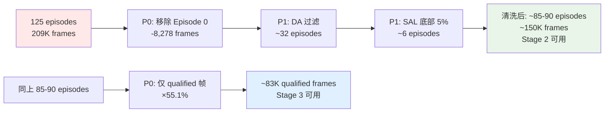

---

## 6. Data-Juicer 处理管道设计

### 6.1 DJ 算子适配性评估

| 需求 | DJ 算子 | 适配级别 | 说明 |
|------|---------|---------|------|
| Episode 元数据过滤 | 自定义 Filter | 🟡 | 需写 custom filter 基于 episode 级元数据 |
| 帧级质量标签过滤 | `text_action_filter` (类比) | 🟡 | 需适配 quality_index 字段 |
| SAL 计算与排序 | 无现成 | 🟡 | `analyze_glx.py` 已实现，可封装为 DJ Filter |
| State-action 对齐检测 | 无现成 | 🟡 | `clean_stage123.py` 已实现 Stage 2 |
| 运动平滑化 | `video_hand_motion_smooth_mapper` | 🔵 | 算法可复用，但原算子面向手部 MANO 参数 |
| 子任务分割 | `video_atomic_action_segment_mapper` | 🔵 | 速度极值分割，可适配关节速度 |
| 视频帧提取 | `video_extract_frames_mapper` | 🟢 | 直接可用 |
| 相机标定 | `video_camera_calibration_moge_mapper` | 🟢 | 可对 wrist cameras 做标定 |
| 深度估计 | `video_depth_estimation_mapper` | 🟢 | 可补充深度信息（原数据集无） |
| 文本标注质量 | `text_length_filter`, `language_id_score_filter` | 🟢 | 通过 `convert_to_jsonl.py` 转换后可用 |
| LeRobot 格式导出 | `export_to_lerobot_mapper` | 🟢 | 清洗后可重新导出 |

> **图标说明**: 🟢 直接可用 · 🔵 组合/适配可用 · 🟡 需自定义

### 6.2 推荐管道架构

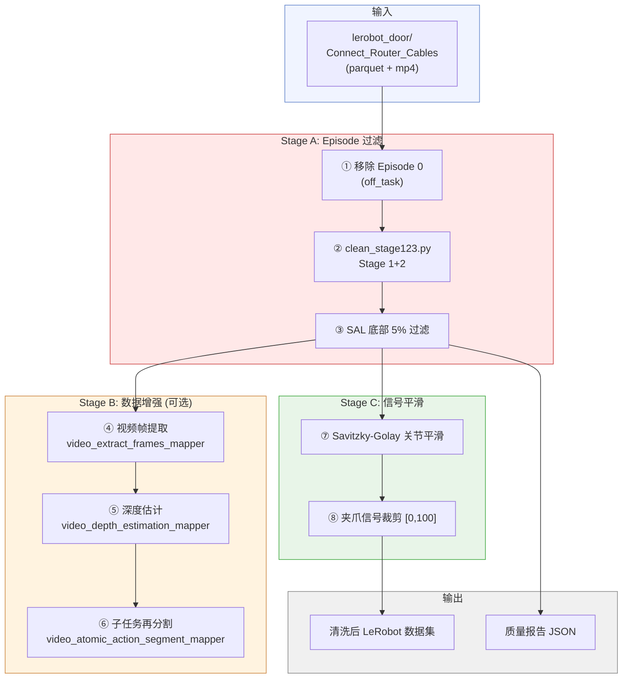

### 6.3 与 `clean_stage123.py` 的互补关系

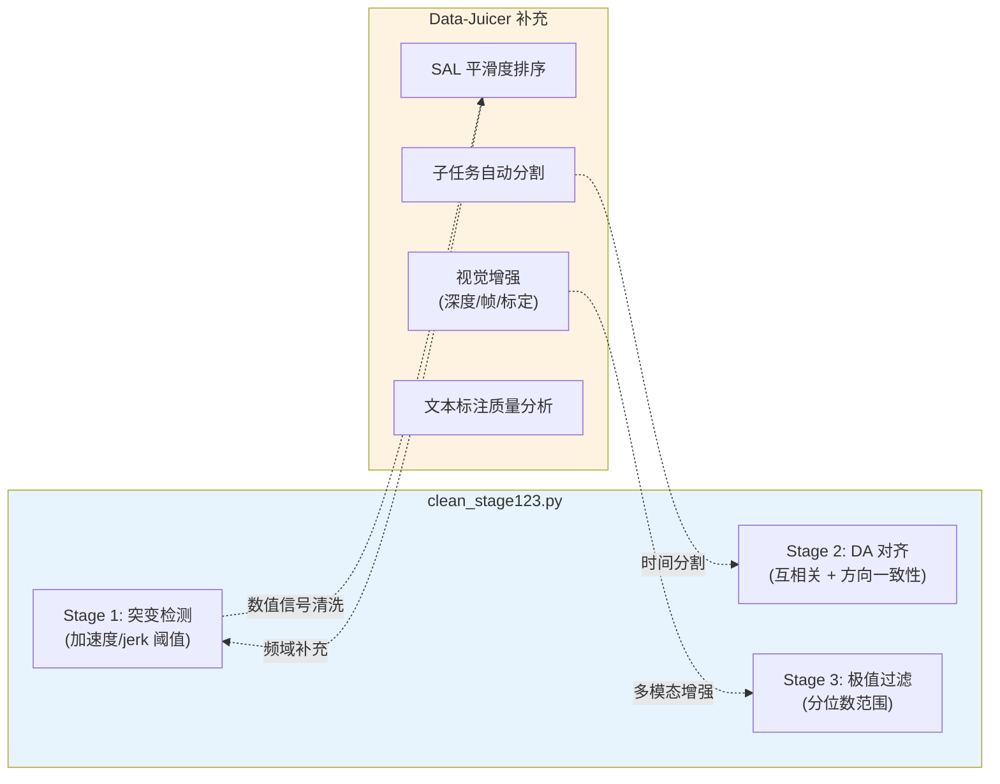

**分工**: `clean_stage123.py` 专注**数值信号域**的质量清洗（突变、对齐、极值），Data-Juicer 补充**频域分析**（SAL）、**视觉域增强**（深度估计、帧提取）和**语义域处理**（标注质量、子任务分割）。二者互补而非替代。

### 6.4 DJ 分析器配置

对子任务文本标注的质量分析已配置在 `dj_analyze.yaml` 中：

```yaml
project_name: 'galaxea-connect-router-cables'
dataset_path: './b/dm/glxOpnWld/dataset_annotations.jsonl'
process:
  - text_length_filter:
      min_len: 5
      max_len: 500
  - language_id_score_filter:
      lang: 'zh'
      min_score: 0.3
  - words_num_filter:
      min_num: 2
      max_num: 100
```

运行方式：先用 `convert_to_jsonl.py` 将 episodes 元数据转为 DJ 可读的 JSONL 格式（879 条子任务标注），再用 `dj-analyze` 分析。

---

## 7. 附录：快速参考表

### 7.1 文件清单

| 文件 | 用途 |
|------|------|
| `analysis.md` | 本文档 — 完整分析报告 |
| `analyze_glx.py` | 数据质量分析脚本（SAL、DA、异常检测） |
| `analysis_results.json` | 分析脚本输出的完整 JSON 报告 |
| `dj_analyze.yaml` | Data-Juicer 分析器配置（文本标注质量） |
| `convert_to_jsonl.py` | 将 episode 元数据转为 DJ JSONL 格式 |
| `dataset_annotations.jsonl` | 转换后的子任务标注数据 |

### 7.2 运行命令速查

```bash
# 1. 运行完整质量分析
/mnt/r/VENV/dj/bin/python b/dm/glxOpnWld/analyze_glx.py

# 2. 转换标注数据为 DJ 格式
/mnt/r/VENV/dj/bin/python b/dm/glxOpnWld/convert_to_jsonl.py

# 3. 运行 DJ 文本分析
/mnt/r/VENV/dj/bin/dj-analyze --config b/dm/glxOpnWld/dj_analyze.yaml

# 4. 运行三阶段清洗 (在数据集根目录)
cd /mnt/r/DATA/Galaxea-Open-World-Dataset
python3 clean_stage123.py --only Connect_Router_Cables_20250625_002
```

### 7.3 关键数据指标总结

| 指标 | 值 | 状态 |
|------|-----|------|
| Episodes | 125 | — |
| 有效 Episodes (排除 Episode 0) | 124 | — |
| 总帧数 | 209,484 | — |
| Qualified 帧占比 | 55.1% | ⚠️ 近半不合格 |
| SAL 中位数 | −420.1 | 中等偏好 |
| State-action 对齐率 | 74.4% | ⚠️ 1/4 不对齐 |
| 突变检测 | 0/125 | ✅ |
| State 有效维度 | 24/56 (42.9%) | — |
| Action 有效维度 | 22/50 (44.0%) | — |

### 7.4 质量标签来源说明

`qualified` / `unqualified` 标签**来自原始数据集，由 Galaxea 团队在数据采集阶段标注**，非本分析脚本生成。

论文中明确提到：

> "Every segment undergoes rigorous quality checks at both the episode and clip levels"
> — 排除标准包括 "operator mistakes or abnormal ROS topic frequencies"

具体流程：遥操作采集完成后，标注员对每个 episode 内的不同时间段进行**人工质量审核**，分别标记为 `qualified` 或 `unqualified`。不合格的典型原因包括：

| 不合格原因 | 说明 |
|-----------|------|
| 操作员失误 | 抓取失败、碰撞物体、动作不连贯 |
| ROS 通信异常 | topic 频率不稳定导致数据丢帧或时间戳跳变 |
| 任务未完成 | 操作中断、未达到子任务目标 |

在 parquet 中，每一帧的 `quality_index` 列指向 `tasks.jsonl` 中的标签（本数据集中 task_index 25 = `"qualified"`，task_index 9 = `"unqualified"`），因此同一 episode 内部不同时间段可以有不同的质量标注。

> **重要**: `lerobot_door` 版本保留了这些标签但**未过滤掉 unqualified 帧**——所有帧都仍在数据集中。论文在训练时用全量数据做 Stage 2 预训练，但 Stage 3 微调应只取 qualified 段。

### 7.5 参考文献

1. Galaxea G0 论文: [arXiv:2509.00576](https://arxiv.org/abs/2509.00576)
2. RINSE (SAL/TED 平滑度指标): [arXiv:2604.23000](https://arxiv.org/abs/2604.23000)
3. Data-Juicer 2.0: [arXiv:2501.14755](https://arxiv.org/abs/2501.14755)
4. Data-Juicer VLA Pipeline: [arXiv:2510.21571](https://arxiv.org/abs/2510.21571)
5. Eval-Actions (可信评估基准): [arXiv:2601.18723](https://arxiv.org/abs/2601.18723)

---

## 8. 核心概念深度解析

> 本章对分析报告中涉及的关键术语和方法进行系统性解释。每个概念先给出**直觉定义**，再展开**数学原理**和**数据实例**，最后阐明**概念间的联系**。

---

### 8.1 Episode 与 Trajectory — 数据的基本组织单元

#### 什么是 Episode

在强化学习和模仿学习中，一个 **episode**（情节/回合）是机器人从开始到完成（或失败）一次完整任务的全过程记录。类比日常生活：如果任务是「泡一杯咖啡」，那么从拿起杯子到咖啡倒好放下杯子，这整个过程就是一个 episode。

在本数据集中，一个 episode 包含：

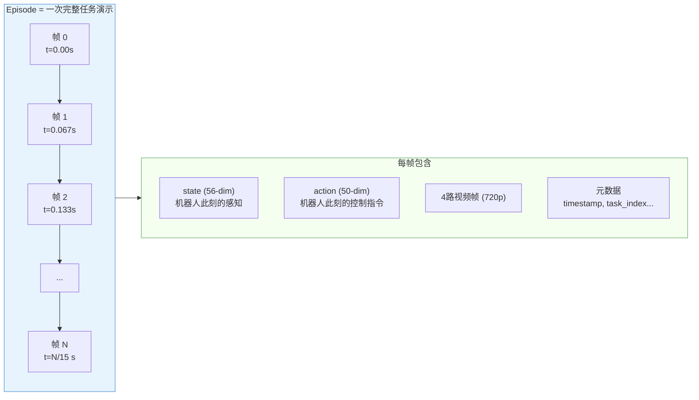

以 Episode 1 为例：它有 **959 帧**，在 15 fps 下对应 **63.9 秒**，记录了操作员遥控 R1 Lite 机器人完成「拿起网线 → 调整位置 → 插入路由器 → 拿起充电头 → 插入插排」的全过程。

#### 什么是 Trajectory

**Trajectory**（轨迹）是一个更数学化的概念——它是 episode 中某个物理量随时间变化的**连续路径**。一个 episode 中可以提取出多条 trajectory：

| 轨迹类型 | 数学表示 | 物理含义 |
|----------|---------|---------|
| 关节轨迹 | $q(t) = [q_1(t), q_2(t), \ldots, q_6(t)]$ | 6 个关节角随时间的变化 |
| 末端轨迹 | $\mathbf{p}(t) = [x(t), y(t), z(t)]$ | 手腕在三维空间中的位置路径 |
| 夹爪轨迹 | $g(t) \in [0, 100]$ | 夹爪开合程度的时序变化 |
| 底盘轨迹 | $\mathbf{c}(t) = [c_x(t), c_y(t), c_z(t)]$ | 机器人底盘的移动路线 |

**Episode 是数据层面的容器，trajectory 是其中的信号。** 当我们说「轨迹平滑度」时，指的是某条 trajectory 的曲线是否光滑连续；当我们说「episode 质量」时，指的是这个容器里所有 trajectory 的综合质量。

---

### 8.2 关节角 — 机器人运动的内在语言

#### 直觉：人体的关节角

想象你伸出右手去拿桌上的杯子——你的肩膀、肘部、手腕各弯曲了特定角度。如果我们能精确测量每个关节的弯曲程度（以弧度 rad 为单位），这组数值就是你手臂此刻的**关节角**（joint angles），也称为**关节空间坐标**。

R1 Lite 的每条手臂有 **6 个旋转关节**（6-DoF, 6 Degrees of Freedom），从肩到腕依次编号：

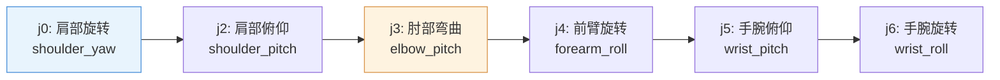

> **注意**：统一格式中 j1（shoulder_roll）被 pad 为 0，因为 R1 Lite 的 6-DoF 手臂缺少这个自由度。7-DoF 手臂（如 Franka Panda）拥有全部 7 个关节。

#### 数据实例

以 Episode 1、帧 0 的左臂 state 为例（从 56-dim state 向量的 slot [0, 2, 3, 4, 5, 6] 提取）：

$$\mathbf{q}_{\text{left}} = \begin{bmatrix} q_0 \\ q_2 \\ q_3 \\ q_4 \\ q_5 \\ q_6 \end{bmatrix} = \begin{bmatrix} 1.83 \\ -0.28 \\ -0.99 \\ 0.07 \\ -0.71 \\ 0.21 \end{bmatrix} \text{ rad}$$

每个值的范围约 $[-2, +3]$ rad，其中 $q_3$（肘部）几乎始终为负值（$[-1.95, 0]$），说明手臂在操作时肘部一直处于弯曲状态——这与人类做精细操作时的姿势一致。

#### 关节角的「速度」

关节角对时间的导数就是**关节角速度**（angular velocity）：

$$\dot{q}_i(t) = \frac{q_i(t + \Delta t) - q_i(t)}{\Delta t}, \quad \Delta t = \frac{1}{15} \text{ s}$$

在本数据集中，`observation.state.left_arm.velocities`（原始格式）即为此量。速度信号的高频分量直接反映了运动的「抖动」程度——这正是 SAL 度量的对象。

---

### 8.3 末端位置 — 关节角的空间投影

#### 从关节角到手腕位置：正运动学

**末端位置**（end-effector position）是机器人手腕（或工具尖端）在三维空间中的坐标 $\mathbf{p} = [x, y, z]^T$。它与关节角之间通过**正运动学**（Forward Kinematics, FK）联系：

$$\mathbf{p} = \text{FK}(\mathbf{q}) = \prod_{i=1}^{6} T_i(q_i) \cdot \mathbf{p}_0$$

其中 $T_i(q_i)$ 是第 $i$ 个关节的 $4 \times 4$ 齐次变换矩阵（由 Denavit-Hartenberg 参数和关节角 $q_i$ 决定），$\mathbf{p}_0$ 是初始工具位置。

**直觉**：关节角好比「方向盘转了几圈」，末端位置好比「车到了哪里」。同一个末端位置可能对应多组不同的关节角（这种多解性叫做**运动学冗余**），但同一组关节角只对应唯一的末端位置。

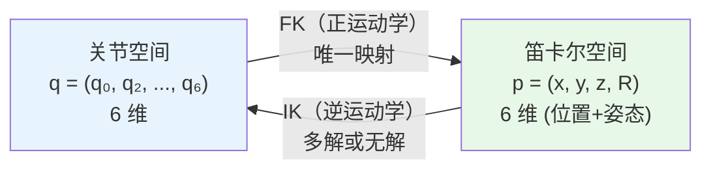

在本数据集的原始格式中，`observation.state.left_ee_pose` 包含 7 维：位置 $(x, y, z)$ + 姿态四元数 $(q_w, q_x, q_y, q_z)$。统一格式中这些信息被丢弃（unified 50/56 仅保留关节角），但可从原始 `lerobot/` 数据中获取。

#### 关节空间 vs 笛卡尔空间的意义

在数据质量分析中，我们同时关心两个空间：

| 空间 | 度量对象 | 优点 | 缺点 |
|------|---------|------|------|
| **关节空间** | $q_i(t)$ 的变化 | 直接对应电机控制、不存在奇异性 | 难以直观看到手腕的空间运动 |
| **笛卡尔空间** | $\mathbf{p}(t)$ 的变化 | 直观反映操作空间中的运动质量 | 受正运动学非线性放大、存在奇异构型 |

本分析中 SAL 的计算基于**关节空间**速度——因为统一格式中已无末端位姿，且关节空间度量不受 FK 奇异性影响。

---

### 8.4 速度指令 $(v_x, v_y, \omega_z)$ — 底盘的运动控制

#### 全向底盘的运动学

R1 Lite 拥有 **6-DoF 全向底盘**（omnidirectional base），可以在地面上做任意方向的平移和旋转，最大速度 1.5 m/s。它的运动由三个指令分量控制：

$$\mathbf{u}_{\text{base}} = \begin{bmatrix} v_x \\ v_y \\ \omega_z \end{bmatrix}$$

| 分量 | 名称 | 物理含义 | 单位 | 数据范围 |
|------|------|---------|------|---------|
| $v_x$ | 前进速度 | 机器人前后方向的线速度（正 = 前进） | m/s | $[-0.20, 0.20]$ |
| $v_y$ | 侧移速度 | 机器人左右方向的线速度（正 = 左移） | m/s | $[-0.20, 0.20]$ |
| $\omega_z$ | 偏航角速度 | 机器人绕竖直轴旋转的角速度（正 = 逆时针） | rad/s | $[-0.60, 0.60]$ |


**为什么 action 中底盘是速度指令，而 state 中却是位置？**

这是机器人控制中的常见架构分层：

- **state（感知层）** 记录底盘在世界坐标系中的**累积位置** $(c_x, c_y, c_z)$ 和**瞬时速度**——它告诉模型「我现在在哪」
- **action（控制层）** 发送**速度指令** $(v_x, v_y, \omega_z)$——它告诉底盘「你该怎么动」

速度指令是**增量式的**：每个时间步给一个瞬时速度，底盘按此速度运动 $\Delta t = 1/15$ 秒后等待下一个指令。而手臂关节的 action 是**绝对式的**：直接指定目标关节角，底层 PID 控制器负责追踪。这种差异体现了不同执行器的控制范式：

$$\text{手臂}: a_t^{\text{arm}} = q_t^{\text{target}} \quad \text{（绝对位置指令）}$$
$$\text{底盘}: a_t^{\text{base}} = \mathbf{u}_t = [v_x, v_y, \omega_z]^T \quad \text{（瞬时速度指令）}$$

---

### 8.5 SAL (Spectral Arc Length) — 用频谱度量运动平滑度

#### 为什么需要度量平滑度

人类演示的遥操作数据并非都是高质量的。操作员可能手抖、犹豫、或设备有延迟，这些都会在关节轨迹中引入**高频抖动**。RINSE 论文 (Bahl et al., 2026) 的核心发现是：**轨迹越平滑的演示，训练出的策略越好**——因为平滑运动隐含了更低的动作方差和更清晰的意图信号。

#### 直觉：弦乐演奏的类比

想象两位小提琴手演奏同一段旋律：
- **高手**：弓弦运动流畅连贯，音色纯净——频谱中只有基频和低次谐波
- **新手**：弓弦抖动、节奏不稳——频谱中充满高频噪声

SAL 所做的正是区分这两种「演奏」。它**不**看旋律本身（轨迹形状），而是看弓弦运动的**频率组成**。

#### 计算步骤详解

设某关节速度信号为 $v[0], v[1], \ldots, v[T{-}1]$（共 $T$ 个样本），采样间隔 $\Delta t = 1/15$ s：

**Step 1: FFT — 将时域信号转化为频域**

$$V_k = \sum_{n=0}^{T-1} v[n] \cdot e^{-j 2\pi k n / T}, \quad k = 0, 1, \ldots, T/2$$

$V_k$ 是信号在频率 $f_k = k / (T \Delta t)$ 处的复振幅。$|V_k|$ 大表示信号在该频率处有强能量。

**Step 2: 取对数幅度**

$$L_k = \ln(|V_k| + \varepsilon), \quad \varepsilon = 10^{-5}$$

取对数有两个作用：① 压缩动态范围（让大小信号可比较）；② 使度量具有尺度不变性（速度放大 10 倍不改变平滑度判断）。

**Step 3: 沿频谱曲线求弧长**

把 $(f_k, L_k)$ 看作二维平面上的一条曲线（横轴是频率，纵轴是对数振幅），计算这条曲线的**总弧长**：

$$\text{SAL} = -\sum_{k=1}^{T/2} \sqrt{(f_k - f_{k-1})^2 + (L_k - L_{k-1})^2}$$

取负号是为了让「更平滑 = 更大的值（更接近 0）」。

#### 为什么弧长能度量平滑度

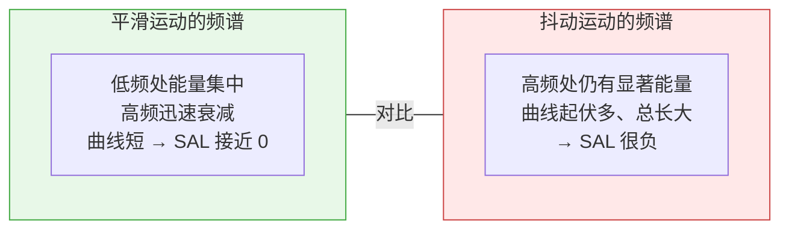

- **平滑运动**的频谱从低频到高频**单调快速下降**——曲线几乎是一条陡降的直线，弧长很短
- **抖动运动**的频谱在高频处仍有能量，曲线**起伏蜿蜒**，弧长长得多

这个思想源自临床康复科学中对人体运动平滑度的评估（Balasubramanian et al., 2012, *IEEE Trans. Biomed. Eng.*），被 RINSE 论文首次引入机器人数据质量评估。

#### 数值示例

以本数据集中的两个极端 episode 为例：

| | Episode 58 (最平滑) | Episode 0 (最粗糙) |
|--|--------------------|--------------------|
| 帧数 | 1,215 | 8,278 |
| 左臂 SAL | −173 | −1,929 |
| 右臂 SAL | −232 | −3,697 |
| 综合 SAL | **−202.5** | **−2,813.1** |
| 特征 | 短促、目标明确的操作 | 长时间多任务混合操作 |

Episode 58 的 SAL 是 Episode 0 的 **1/14**（绝对值），意味着其频谱曲线短 14 倍——运动极其平滑流畅。

---

### 8.6 DA (Directional Alignment) — State 与 Action 是否「步调一致」

#### 直觉：驾驶中的方向盘与车轮

想象你在开车：
- 你转动方向盘（**action**）向左 → 车轮（**state**）应该也在向左转
- 如果你向左转方向盘但车轮向右偏 → 说明转向系统有故障

DA 度量的就是这种**因果一致性**：action 指示关节往某个方向动，state 是否真的往那个方向变化了。

#### 为什么会出现不一致

在真实机器人遥操作数据中，state-action 不对齐有以下常见原因：

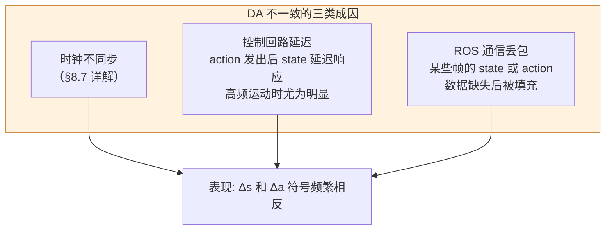

#### 计算细节

对于关节维度 $d$（共检查左右臂各 6 维 = 12 维）：

1. 计算 state 差分和 action 差分：
   $$\Delta s_t^d = s_{t+1}^d - s_t^d, \quad \Delta a_t^d = a_{t+1}^d - a_t^d$$

2. 确定「有效运动」帧集合 $\mathcal{A}$（排除静止帧，因为静止时符号随机跳变无意义）：
   $$\mathcal{A} = \{t : |\Delta s_t^d| > \varepsilon \;\text{or}\; |\Delta a_t^d| > \varepsilon\}$$
   其中 $\varepsilon = 0.01 \times (q_{99}^d - q_{01}^d)$ 是该关节量程的 1%。

3. 计算方向一致率：
   $$\text{DA}^d = \frac{\#\{t \in \mathcal{A} : \text{sign}(\Delta s_t^d) = \text{sign}(\Delta a_t^d)\}}{|\mathcal{A}|}$$

**DA = 1.0** 意味着 state 和 action 在每个有效运动帧都朝同一方向变化——完美一致。**DA = 0.5** 意味着一致性和随机乱猜一样——严重问题。阈值设为 **0.65**（与 `clean_stage123.py` 一致），低于此值则认为该维度不对齐。

#### 数据实例

以 Episode 7（11/12 维不对齐，最严重之一）为例：某关节维度的典型数据片段：

| 帧 $t$ | state $s_t$ | $\Delta s_t$ | action $a_t$ | $\Delta a_t$ | 方向一致？ |
|--------|------------|-------------|-------------|-------------|----------|
| 100 | −0.982 | −0.003 | −0.975 | +0.005 | ❌ |
| 101 | −0.985 | +0.001 | −0.970 | −0.008 | ❌ |
| 102 | −0.984 | −0.002 | −0.978 | +0.003 | ❌ |

state 在小幅下降时 action 在小幅上升，反之亦然——这正是**时钟偏移**的典型表征（见下节）。

---

### 8.7 时钟不同步 — 机器人数据的隐形杀手

#### 什么是时钟不同步

在 ROS（Robot Operating System）架构中，各传感器和控制器以独立的 topic（话题）发布数据，每个 topic 有自己的时间戳和发布频率：

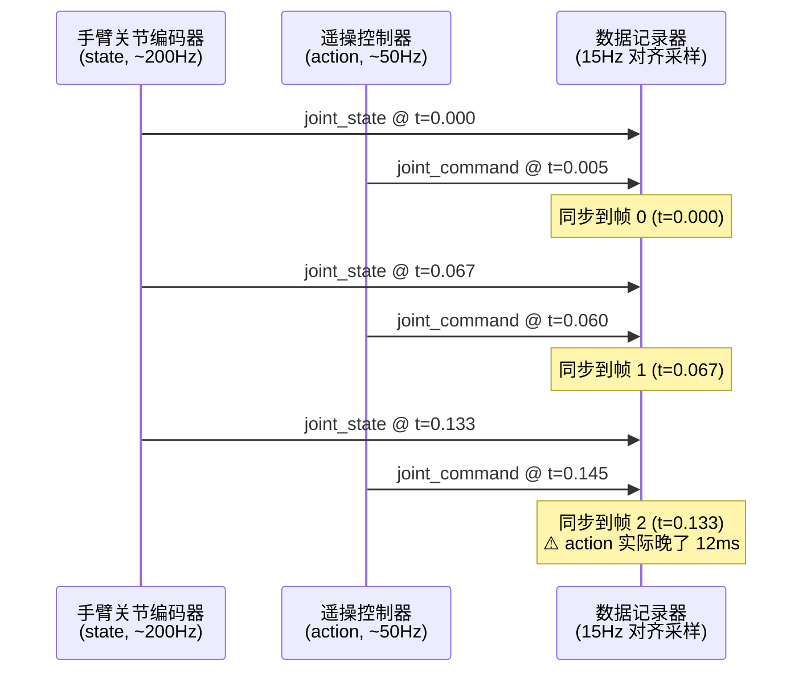

当数据记录器将不同频率的 topic 对齐到 15 fps 时，可能发生：

| 同步问题 | 原因 | 后果 |
|---------|------|------|
| **恒定延迟** | action 发出后经过控制回路才反映到 state | state 始终滞后 action 若干帧 |
| **随机抖动** | 操作系统调度不确定性、网络延迟 | 帧间 state-action 对应关系随机偏移 |
| **频率不匹配** | state 200Hz vs action 50Hz → 下采样到 15Hz | 高频运动的 action 信号可能被混叠 |
| **丢帧** | ROS topic 发布失败 | 某些帧用前一帧数据填充，造成「假静止」 |

**时钟不同步是 DA 不对齐的最主要原因。** 如果 action 比 state 早了 1 帧（67ms），那么 $\Delta a_t$ 反映的是下一步的意图，而 $\Delta s_t$ 反映的是上一步的结果——二者的符号自然经常相反。

#### `clean_stage123.py` 中的对策

Stage 2 在计算 DA 前，先做**互相关**（cross-correlation）搜索最佳时移（`--max-lag 15`，即最多搜索 ±1 秒），试图找到使 DA 最大化的 state-action 时间偏移量。如果在最优偏移下 DA 仍低于阈值，才判定该 episode 不合格。

---

### 8.8 四元数空间姿态平滑 — 避免 Gimbal Lock

#### 什么是姿态

机器人手腕（末端执行器）不仅有**位置** $(x, y, z)$，还有**姿态**（orientation）——手腕朝哪个方向。姿态描述的是一个刚体相对于参考系的旋转状态。

#### 姿态的三种表示方法

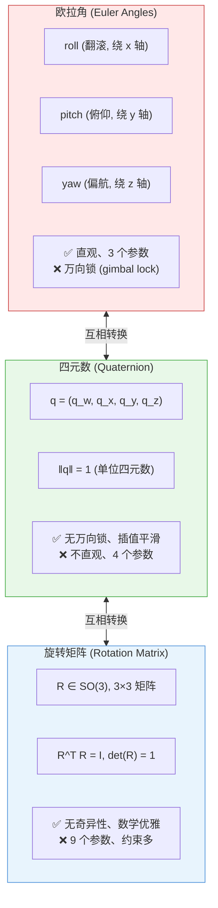

#### 什么是 Gimbal Lock（万向锁）

Gimbal lock 是欧拉角表示的一个**数学缺陷**，而非物理现象。当某个旋转角接近 ±90° 时，两个旋转轴重合，系统**丢失一个旋转自由度**。

**经典例子**：当 pitch = 90°（垂直朝上）时，roll 和 yaw 绕同一轴旋转，无法区分——此时无论怎么改变 roll 或 yaw，效果都一样。数学表达：

$$R(\alpha, \frac{\pi}{2}, \gamma) = \begin{bmatrix} 0 & 0 & 1 \\ \sin(\alpha + \gamma) & \cos(\alpha + \gamma) & 0 \\ -\cos(\alpha + \gamma) & \sin(\alpha + \gamma) & 0 \end{bmatrix}$$

注意矩阵只依赖 $\alpha + \gamma$，而非分别依赖 $\alpha$ 和 $\gamma$——两个参数退化成一个，自由度从 3 降到 2。

**后果**：在 gimbal lock 附近，欧拉角表示会出现数值跳变——连续的物理运动在数值上变成剧烈的角度突变。如果直接对欧拉角做 Savitzky-Golay 平滑，会把这种假突变「平滑」成错误的中间值。

#### 四元数如何解决

**四元数**（quaternion）用 4 个实数 $\mathbf{q} = (q_w, q_x, q_y, q_z)$ 表示旋转，约束 $\|\mathbf{q}\| = 1$（单位四元数）：

$$\mathbf{q} = \cos\frac{\theta}{2} + \sin\frac{\theta}{2}(u_x \mathbf{i} + u_y \mathbf{j} + u_z \mathbf{k})$$

其中 $\theta$ 是旋转角度，$(u_x, u_y, u_z)$ 是旋转轴的单位向量。

四元数的关键优势：

| 特性 | 欧拉角 | 四元数 |
|------|--------|--------|
| 奇异性 | 有 gimbal lock | **无**奇异性 |
| 插值 | 线性插值可能穿越奇异区 | **Slerp** 球面线性插值始终平滑 |
| 平滑 | 角度跳变 ±π 导致假突变 | 连续演化，无跳变 |
| 归一化 | 不需要 | 运算后需重新归一化到 $\|\mathbf{q}\|=1$ |

#### 在数据平滑中的应用

Data-Juicer 的 `video_hand_motion_smooth_mapper` 在平滑运动数据时采用**四元数空间平滑**策略：

1. 将欧拉角/旋转矩阵姿态转换为四元数
2. 在四元数空间做滑动窗口**测地线平均**（geodesic mean）：
   $$\bar{\mathbf{q}} = \arg\min_{\mathbf{q}} \sum_{i \in \text{window}} d_{\text{geo}}(\mathbf{q}, \mathbf{q}_i)^2$$
   其中测地线距离 $d_{\text{geo}}(\mathbf{q}_1, \mathbf{q}_2) = \arccos(|\mathbf{q}_1 \cdot \mathbf{q}_2|)$
3. 平滑后的四元数可按需转回欧拉角或旋转矩阵

**这就是文档中「四元数空间姿态平滑（避免 gimbal lock）」的完整含义**：不在欧拉角空间做平滑（会被 gimbal lock 陷害），而是在四元数空间的单位球面上做平均——保证旋转路径始终连续，不会产生假跳变。

---

### 8.9 概念关系总览

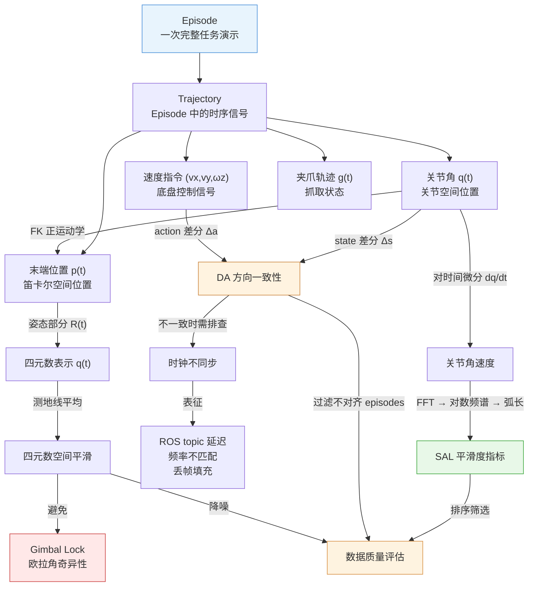

**阅读路径建议**：

- 如果你关心「如何判断一条轨迹好不好」→ 从 SAL (§8.5) 入手
- 如果你关心「state 和 action 为什么对不上」→ 从 DA (§8.6) → 时钟不同步 (§8.7)
- 如果你关心「平滑数据时为什么不能直接对角度做滤波」→ 从四元数 (§8.8) → gimbal lock
- 如果你需要理解数据格式中每个数值的物理含义 → 从关节角 (§8.2) → 末端位置 (§8.3) → 速度指令 (§8.4)
