# Open_And_Close_The_Door_20250802_012 数据集分析报告

## 1. 数据集概述

### 1.1 数据来源与采集场景

本数据集属于 **Galaxea Open-World Dataset** 项目, 采集自 **Galaxea R1 Lite** 双臂轮式移动机器人. 数据格式遵循 **LeRobot v2.1** 规范, 是专为具身智能 VLA (Vision-Language-Action) 模型训练设计的多模态操控数据集.

核心任务为 **"open and close the door"** (开关卧室门), 包含以下标准操作流程:
1. **开门阶段**: 左手打开卧室门 → 右手将门完全推开
2. **关门阶段**: 左手将门完全关闭
3. **过渡阶段**: 部分 episode 包含短暂的 "停止运动" 段

与 Connect_Router_Cables 数据集的精细插拔操作不同, 本任务属于 **大幅度全身协调操作**, 涉及底盘移动、躯干调整和双臂推拉, 对整体姿态控制和力矩协调的要求更高.

### 1.2 整体规模统计

| 指标 | 值 |
|------|-----|
| 总 Episode 数 | 54 |
| 总帧数 | 77,161 |
| 采样频率 | 15 fps |
| 总时长 | $\frac{77{,}161}{15} \approx 5{,}144$ 秒 $\approx$ **85.7 分钟** |
| 细粒度任务标签数 | 15 |
| 去重语义任务数 | 8 |
| 视频总数 | 216 (4 摄像头 × 54 episodes) |
| 机器人型号 | `r1lite` |

---

## 2. 数据结构分析

### 2.1 目录结构

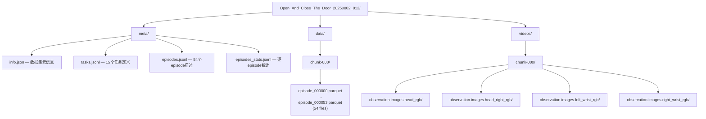

### 2.2 数据模态与特征维度

LeRobot v2.1 将 **结构化数据** (状态/动作) 存储为 Parquet, **视觉数据** 存储为独立的 MP4 视频文件, 通过 `frame_index` 对齐.

#### 视觉模态 (4 路视频)

| 摄像头 | 分辨率 | 编码 | 像素格式 |
|--------|--------|------|----------|
| `head_rgb` | 1280×720 | AV1 (av01) | yuv420p |
| `head_right_rgb` | 1280×720 | AV1 | yuv420p |
| `left_wrist_rgb` | 1280×720 | AV1 | yuv420p |
| `right_wrist_rgb` | 1280×720 | AV1 | yuv420p |

> AV1 编码在相同视觉质量下比 H.264 节省约 30-50% 带宽, 但解码计算开销更大.

#### 状态观测空间

本数据集采用 **分解式特征列** (decomposed columns), 每个子系统独立存储, 而非 Connect_Router_Cables 数据集中的统一向量格式:

| 特征 | 维度 | 数据类型 | 说明 |
|------|------|----------|------|
| `observation.state.left_arm` | 6 | float64 | 左臂6关节角度 (rad) |
| `observation.state.left_arm.velocities` | 6 | float64 | 左臂6关节角速度 |
| `observation.state.right_arm` | 6 | float64 | 右臂6关节角度 |
| `observation.state.right_arm.velocities` | 6 | float64 | 右臂6关节角速度 |
| `observation.state.left_gripper` | 1 | float64 | 左夹爪开合度 (标量) |
| `observation.state.right_gripper` | 1 | float64 | 右夹爪开合度 (标量) |
| `observation.state.left_ee_pose` | 7 | float64 | 左末端位姿 (xyz + quaternion) |
| `observation.state.right_ee_pose` | 7 | float64 | 右末端位姿 |
| `observation.state.chassis` | 3 | float64 | 底盘位置 (x, y, yaw) |
| `observation.state.chassis.velocities` | 3 | float64 | 底盘速度 |
| `observation.state.chassis.imu` | 10 | float64 | IMU (四元数4 + 线加速度3 + 角速度3) |
| `observation.state.torso` | 4 | float64 | 躯干关节位置 |
| `observation.state.torso.velocities` | 4 | float64 | 躯干关节速度 |
| **观测总维度** | **64** | | (不含视频) |

#### 动作空间

| 特征 | 维度 | 数据类型 | 说明 |
|------|------|----------|------|
| `action.left_arm` | 6 | float64 | 左臂目标关节位置 |
| `action.right_arm` | 6 | float64 | 右臂目标关节位置 |
| `action.left_gripper` | 1 | float64 | 左夹爪目标 |
| `action.right_gripper` | 1 | float64 | 右夹爪目标 |
| `action.chassis.velocities` | 6 | float64 | 底盘目标速度 (Twist) |
| `action.torso.velocities` | 6 | float64 | 躯干目标速度 (Twist) |
| **动作总维度** | **26** | | |

#### 元数据列

| 列名 | 说明 |
|------|------|
| `frame_index` | 帧内序号 (从0开始) |
| `episode_index` | Episode 编号 |
| `index` | 全局帧索引 |
| `timestamp` | 时间戳 (秒) |
| `task_index` | 当前帧的细粒度任务标签 |
| `coarse_task_index` | 粗粒度任务标签 (全部为6: "open and close the door") |
| `quality_index` | 细粒度质量标签 (1=qualified, 5=unqualified) |
| `coarse_quality_index` | 粗粒度质量标签 |

> **与 Connect_Router_Cables 的关键差异**: 质量标签编码不同 — 本数据集使用 `1=qualified, 5=unqualified`, 而 CncRutCbl 使用 `25=qualified, 9=unqualified`. 这一差异在跨数据集训练时需要统一映射.

---

## 3. Episode 统计分析

### 3.1 Episode 长度分布

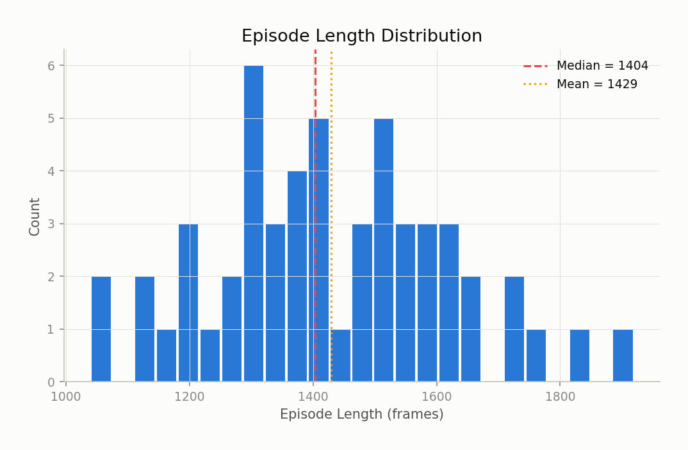

$$
\text{Length} \sim \begin{cases}
\min = 1{,}039 \text{ frames} \approx 69.3\text{s} \\
\max = 1{,}919 \text{ frames} \approx 127.9\text{s} \\
\mu = 1{,}428.9 \text{ frames} \approx 95.3\text{s} \\
\tilde{x} = 1{,}403.5 \text{ frames} \approx 93.6\text{s} \\
\sigma = 191.8 \text{ frames}
\end{cases}
$$

分布呈 **近似正态** 特征, 相较 Connect_Router_Cables 的强右偏长尾分布 ($\sigma = 858.2$), 本数据集的 episode 长度 **高度一致** ($\text{CV} = \sigma/\mu = 0.134$, CncRutCbl 的 $\text{CV} = 0.512$):

| 区间 (frames) | Episode 数 | 占比 |
|--------------|-----------|------|
| 1,000–1,200 | 10 | 18.5% |
| 1,200–1,400 | 16 | 29.6% |
| 1,400–1,600 | 15 | 27.8% |
| 1,600–1,800 | 8 | 14.8% |
| 1,800–2,000 | 5 | 9.3% |

**关键发现**: 没有明显的异常值 episode. 所有 54 个 episode 均在 1-2 分钟的合理范围内, 反映了 "开关门" 这一标准化操作的 **高可重复性**. Mean 与 Median 仅相差 25 帧 (1.7s), 进一步确认分布的对称性.

---

## 4. 任务体系分析

### 4.1 任务层级结构

本数据集采用 **两级任务标注**, 但结构比 CncRutCbl 更简洁:

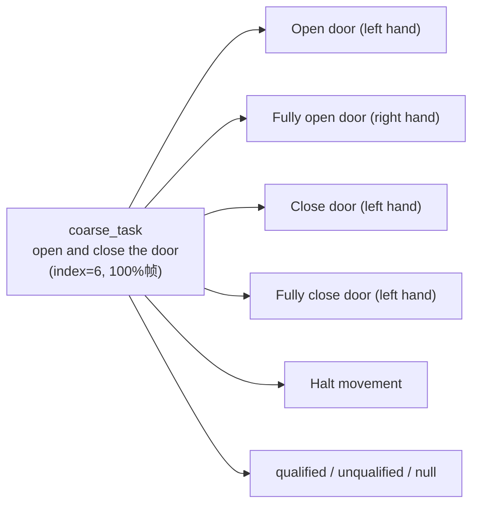

`coarse_task_index` 恒为 6 ("open and close the door"), 表明所有 54 个 episode 都属于同一个粗粒度任务.

### 4.2 任务语义去重

原始 15 个 `task_index` 中存在翻译变体, 去重后仅 **8 个语义唯一任务**:

| 语义组 | 涉及 task_index | 合并帧数 | 占比 |
|--------|----------------|---------|------|
| 完全关门 (左手) | 4, 7 | 40,483 | 52.5% |
| 完全开门 (右手) | 0, 10 | 18,064 | 23.4% |
| 开门 (左手) | 3, 14 | 15,315 | 19.8% |
| 停止运动 | 2, 8, 12, 13 | 1,720 | 2.2% |
| 关门 (左手, 非 "完全") | 11 | 1,571 | 2.0% |
| null | 9 | 8 | 0.01% |
| qualified | 1 | 0 | 0% |
| unqualified | 5 | 0 | 0% |

> **标注一致性**: 翻译变体数量 (15→8, 47% 冗余) 远少于 CncRutCbl (89→42, 53% 冗余), 但仍存在如 "Fully close the bedroom door with the left hand" vs "Fully close the bedroom door with your left hand" 这类近义变体.

### 4.3 任务频率分布

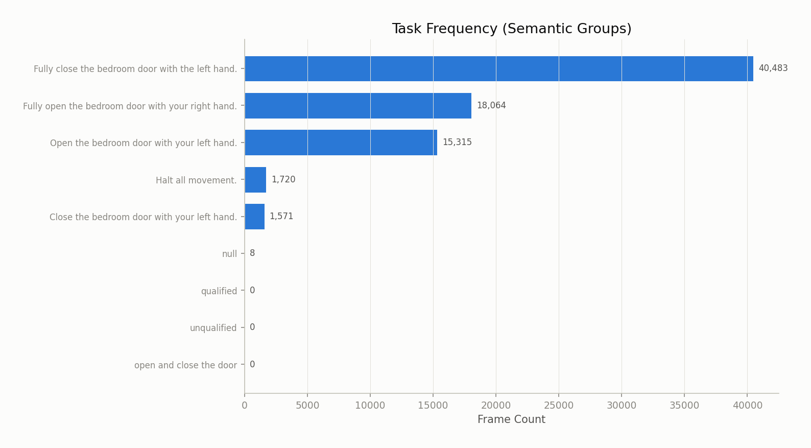

按帧数统计, 前三大任务占据了总帧数的 **95.7%**:

| 排名 | 任务 (语义合并) | 帧数 | 占比 |
|------|----------------|------|------|
| 1 | Fully close door (left hand) | 40,483 | 52.5% |
| 2 | Fully open door (right hand) | 18,064 | 23.4% |
| 3 | Open door (left hand) | 15,315 | 19.8% |
| 4 | Halt movement | 1,720 | 2.2% |
| 5 | Close door (partial, left hand) | 1,571 | 2.0% |

**数据分布高度不均衡**: 关门操作 (close) 占据了超过一半的帧数 (54.5%), 而开门操作仅占 43.2%. 这反映了关门动作需要更长的行程 — 从门完全打开到完全关闭, 手臂需要覆盖更大的弧线.

### 4.4 任务时长分析

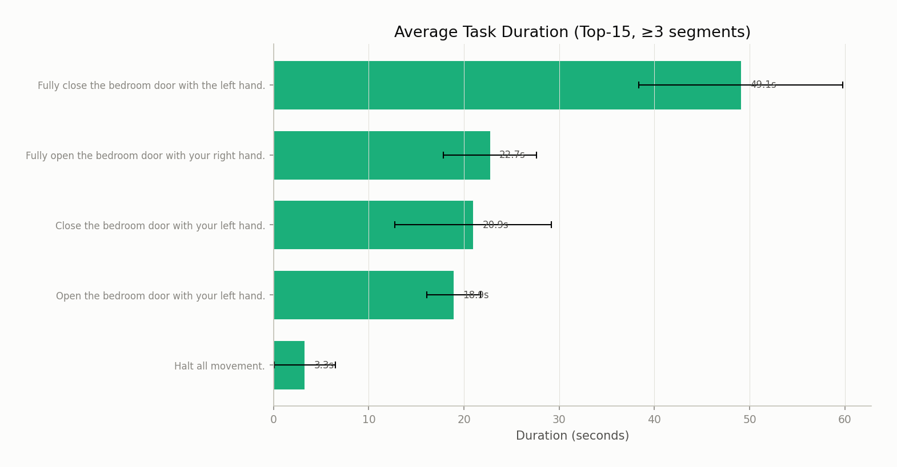

| 任务 | 平均时长 | 标准差 | 说明 |
|------|---------|--------|------|
| Fully close door (left hand) | 49.1s | ±13.6s | 最耗时 — 需要大范围推门 |
| Fully open door (right hand) | 22.7s | ±8.5s | 次耗时 |
| Close door (partial) | 20.9s | ±9.3s | 方差较大 |
| Open door (left hand) | 18.0s | ±6.1s | 方差最小, 操作一致 |
| Halt movement | 3.3s | ±2.0s | 短暂停顿 |

**关键发现**:

$$
\frac{\bar{t}_{\text{close}}}{\bar{t}_{\text{open}}} = \frac{49.1}{18.0} \approx 2.7\times
$$

关门操作平均时长是开门的 **2.7 倍**. 这一不对称性源自物理约束: 关门需要将门从完全打开状态 ($\theta \approx 90°$) 推回到完全关闭 ($\theta = 0°$), 行程更长, 且末段需要精确对齐门框和门锁.

### 4.5 典型 Episode 任务流

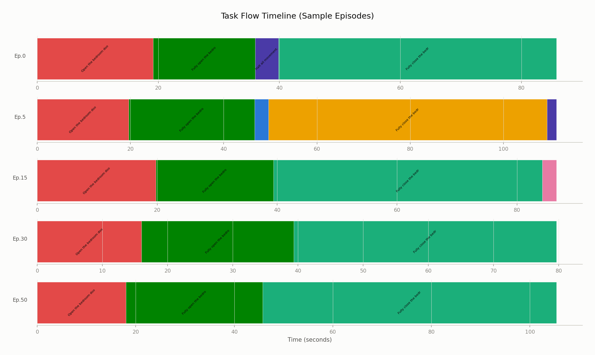

典型的 episode 遵循以下 **三阶段操作序列**:

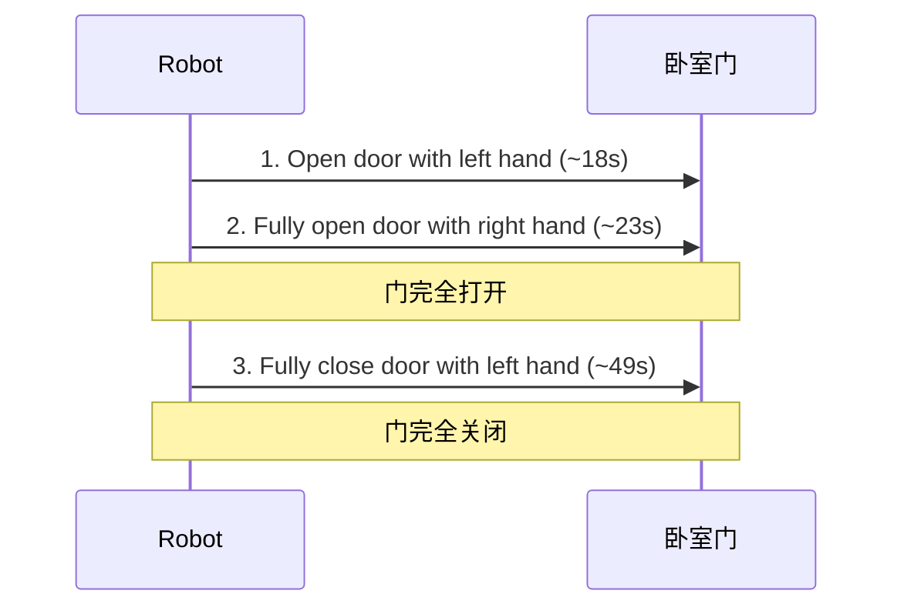

从 task flow 图可以观察到:
- **Ep.0, Ep.15, Ep.30, Ep.50**: 遵循标准三阶段流程, 结构清晰一致
- **Ep.5**: 出现较长的 "fully close" 段 (橙色), 暗示关门过程中存在犹豫或重试
- **Ep.0**: 在 "fully open" 和 "fully close" 之间有短暂的 "halt all movement" 段 (紫色), 属于子任务间的过渡停顿

**与 CncRutCbl 的对比**: CncRutCbl 的任务流包含 5-8 个子步骤且频繁切换, 而 Open_And_Close_The_Door 仅有 3 个主要阶段, 每个阶段持续时间长且边界清晰, 属于更粗粒度的操作模式.

---

## 5. 状态-动作空间分析

### 5.1 关节空间范围

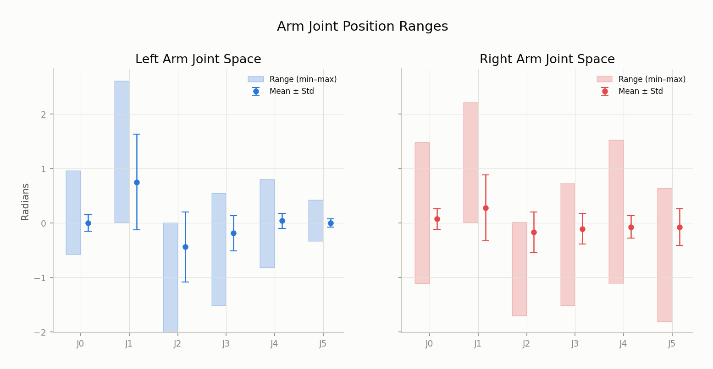

#### 左臂

| 关节 | Min (rad) | Max (rad) | Mean | Std | 活动范围 |
|------|-----------|-----------|------|-----|---------|
| J0 | -0.580 | 0.955 | 0.001 | 0.153 | 1.535 |
| J1 | -0.002 | 2.604 | 0.752 | 0.880 | 2.606 |
| J2 | -2.020 | 0.000 | -0.440 | 0.640 | 2.020 |
| J3 | -1.523 | 0.548 | -0.187 | 0.323 | 2.071 |
| J4 | -0.827 | 0.803 | 0.040 | 0.137 | 1.630 |
| J5 | -0.336 | 0.418 | 0.003 | 0.076 | 0.754 |

#### 右臂

| 关节 | Min (rad) | Max (rad) | Mean | Std | 活动范围 |
|------|-----------|-----------|------|-----|---------|
| J0 | -1.117 | 1.478 | 0.076 | 0.189 | 2.595 |
| J1 | -0.001 | 2.211 | 0.277 | 0.607 | 2.212 |
| J2 | -1.709 | 0.011 | -0.169 | 0.374 | 1.720 |
| J3 | -1.523 | 0.727 | -0.106 | 0.283 | 2.250 |
| J4 | -1.106 | 1.521 | -0.071 | 0.203 | 2.627 |
| J5 | -1.811 | 0.642 | -0.074 | 0.333 | 2.453 |

**对比分析**:

- **右臂 J0** 的活动范围 (2.60 rad) 显著大于左臂 (1.54 rad), 特别是 **J5 (腕关节)**: 右臂 2.45 rad vs 左臂 0.75 rad ($3.3\times$). 右臂在 "fully open door" 任务中需要大幅度旋转腕部来推门到极限位置
- **左臂 J1 (肩关节)** 的标准差最大 ($\sigma = 0.88$), 反映了开门/关门时肩部大范围摆动
- **右臂 J4-J5** 展现较大的活动范围和标准差, 与推门时需要的腕部灵活性一致

$$
\text{Total range: } \sum_{i=0}^{5} (\theta_{i,\max} - \theta_{i,\min}) = \begin{cases}
10.62 \text{ rad (左臂)} \\
13.86 \text{ rad (右臂)}
\end{cases}
$$

右臂总活动范围比左臂大 30%, 是本任务中的主要操作臂 — 负责将门完全推开.

### 5.2 末端执行器工作空间

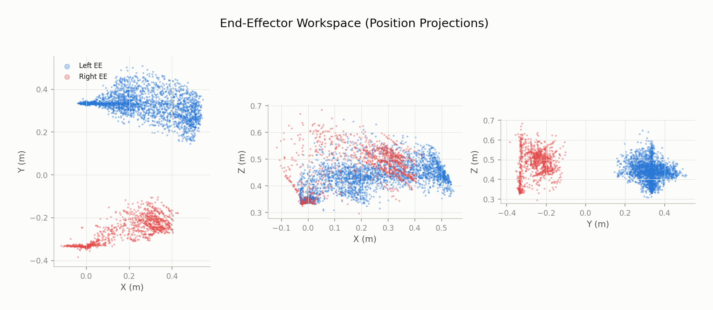

#### 左末端执行器

| 维度 | Min (m) | Max (m) | Mean | Std |
|------|---------|---------|------|-----|
| X | -0.044 | 0.544 | 0.116 | 0.184 |
| Y | 0.146 | 0.509 | 0.331 | 0.039 |
| Z | 0.303 | 0.653 | 0.385 | 0.063 |

#### 右末端执行器

| 维度 | Min (m) | Max (m) | Mean | Std |
|------|---------|---------|------|-----|
| X | -0.128 | 0.426 | 0.024 | 0.113 |
| Y | -0.387 | -0.101 | -0.318 | 0.042 |
| Z | 0.296 | 0.685 | 0.364 | 0.067 |

**工作空间特征**:

从 XY 投影可以清晰看到 **双臂空间分离** 的模式:
- 左臂 EE 工作区集中在 $Y > 0$ (机器人左前方), 呈 **扇形展开**  — 开门时向前伸展, 关门时向左后收回
- 右臂 EE 工作区集中在 $Y < 0$ (机器人右前方), 分布更紧凑 — 主要用于推门到极限位置

从 XZ 投影可见:
- 两臂在 X 方向有明显的重叠区域 ($X \in [-0.05, 0.4]$), 但 Z 方向基本一致 ($Z \in [0.3, 0.65]$), 反映了门把手的高度约束
- 左臂 X 方向的标准差 ($\sigma_X = 0.184$) 是右臂的 $1.6\times$, 与关门时大范围推门的动作一致

### 5.3 夹爪状态分布

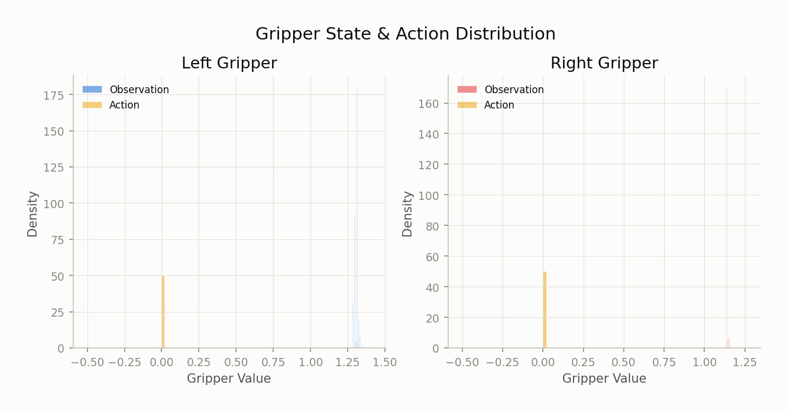

夹爪呈现出 **异常集中** 的分布, 与 CncRutCbl 的双峰模式完全不同:

| | 左夹爪观测 | 右夹爪观测 | 左夹爪动作 | 右夹爪动作 |
|---|-----------|-----------|-----------|-----------|
| Min | 1.2697 | 1.1353 | 0.0 | 0.0 |
| Max | 1.4078 | 1.2585 | 0.0 | 0.0 |
| Mean | 1.3052 | 1.1463 | 0.0 | 0.0 |
| Range | 0.138 | 0.123 | 0.0 | 0.0 |

**关键发现**:

1. **动作值恒为零**: 所有 77,161 帧中, 左右夹爪的动作命令 **均为 0.0** — 开关门任务完全不需要夹爪操作
2. **观测值极窄范围**: 左夹爪观测集中在 $[1.27, 1.41]$ (range = 0.14 rad), 右夹爪在 $[1.14, 1.26]$ (range = 0.12 rad). 这是夹爪在 **自然闭合状态** 下的微小传感器波动
3. **与 CncRutCbl 的对比**: CncRutCbl 的夹爪动作为二值 (0 或 100), 观测呈双峰分布, 反映了频繁的抓取/释放操作. 本数据集中夹爪完全不参与操作

> **VLA 训练建议**: 可在损失函数中 **屏蔽夹爪维度**, 或在动作空间中将其移除以减少模型输出维度. 原始 26D 动作空间中, 夹爪贡献了 2 个完全冗余的维度.

### 5.4 底盘与 IMU 运动分析

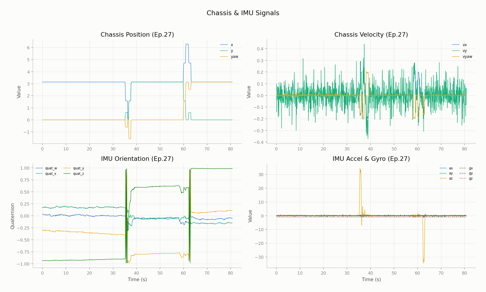

上图展示了 Episode 27 (中间位置的典型 episode) 的底盘与 IMU 时序数据.

#### 底盘运动模式

底盘位置在 episode 过程中展现出 **显著的大幅运动**:

- **X 方向**: 从 ~3.1 跳变至 ~5-6, 然后回落至 ~3.1 — 对应机器人前进靠近门 → 伸手推门 → 后退的过程
- **Y 方向**: 几乎恒为零, 说明机器人沿正前方直线运动
- **Yaw**: 从 0 变化至 $\approx -1.5$ rad ($\approx -86°$), 然后恢复 — 机器人转身以调整推门角度

底盘速度表现为 **脉冲式控制**:
- `vy` (侧向速度) 在大部分时间内有高频小幅波动 ($|v_y| < 0.3$), 反映了动态平衡调整
- `vyaw` 在 $t \approx 35$s 和 $t \approx 62$s 出现明显的旋转峰值, 对应开门和关门时的转体动作

#### IMU 数据特征

IMU 数据揭示了两个 **高冲击事件** ($t \approx 35$s 和 $t \approx 60$s):

- **四元数**: 在 $t \approx 35$s 发生突变 (quat_z 从 -0.95 跳至 0.6), 表明底盘发生了快速旋转. 这不是传感器异常, 而是真实的大角度转体
- **线加速度**: 在同一时刻出现 $|\mathbf{a}| > 30$ 的尖峰, 远超正常重力加速度范围. 这是门与机器人之间的 **物理接触冲击** — 开门/关门时的力反馈
- **角速度**: 在冲击时刻也出现尖峰, 与线加速度同步

> **数据质量警示**: IMU 加速度尖峰 ($>30 \text{ m/s}^2$) 可能对 VLA 训练造成干扰. 建议对 IMU 数据进行 **低通滤波** 或 **clip 处理**, 将加速度范围限制在 $[-10, 10] \text{ m/s}^2$.

### 5.5 底盘与 CncRutCbl 的对比

| 特征 | Open_And_Close_The_Door | Connect_Router_Cables |
|------|------------------------|----------------------|
| 底盘 X 范围 | ~3m (大幅前后移动) | < 0.01m (基本静止) |
| Yaw 变化 | ~1.5 rad (转体 ~86°) | < 0.01 rad |
| 底盘速度均值 | $|\bar{v}| \gg 0$ | $|\bar{v}| < 0.001$ |
| IMU 冲击 | 有 (>30 m/s²) | 无 |
| 操作类型 | 全身协调 + 移动 | 定点精细操作 |

这一对比清楚地说明了两类任务对底盘子系统的不同需求: 开关门属于 **移动操作 (mobile manipulation)** 任务, 而连接线缆属于 **定点操作 (stationary manipulation)** 任务.

---

## 6. 质量标注分析

### 6.1 质量标签分布

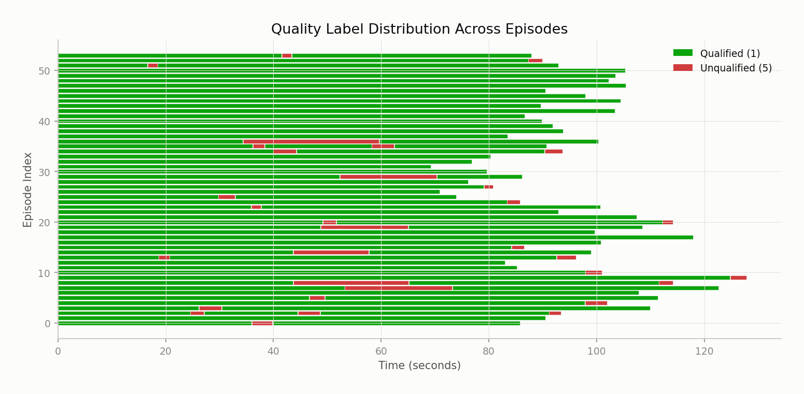

| 标签 | 帧数 | 占比 |
|------|------|------|
| `quality_index = 1` (qualified) | 74,314 | **96.3%** |
| `quality_index = 5` (unqualified) | 2,847 | **3.7%** |

### 6.2 与 CncRutCbl 的对比

$$
\text{Qualified ratio: } \begin{cases}
\text{Open\_And\_Close\_The\_Door} = 96.3\% \\
\text{Connect\_Router\_Cables} = 55.1\%
\end{cases}
$$

本数据集的 qualified 比例 **远高于** CncRutCbl ($96.3\%$ vs $55.1\%$). 原因分析:

1. **任务难度差异**: 开关门是相对简单的大幅度操作, 容错空间大; 线缆插拔要求毫米级精度, 失败率高
2. **操作可重复性**: 从 episode 长度的低方差 ($\text{CV} = 0.134$) 也可佐证, 该任务的执行高度标准化
3. **标注粒度**: 从 quality_dist 图可见, unqualified 段多为短暂片段 (红色条), 分散在少数 episode 中, 且通常出现在任务切换的过渡区域

### 6.3 Quality 的帧级切换模式

与 CncRutCbl 一样, 质量标签是 **帧级别** 的, 而非 episode 级别. 从 quality_dist 图可以观察到:

- **大多数 episode 全程 qualified** (纯绿色)
- **约 15-20 个 episode** 包含少量 unqualified 段 (红色), 主要集中在 episode 的中后段 (即关门阶段)
- **Ep.15-16, Ep.29-30**: unqualified 段相对较长, 可能对应操作人员对关门力度控制不佳的情况

### 6.4 对 VLA 训练的影响

| 策略 | 使用数据 | 帧数 | 适用场景 |
|------|---------|------|---------|
| 仅用 qualified | quality=1 | 74,314 | 纯模仿学习, 推荐 |
| 全部使用 | 全部 | 77,161 | 增加数据量, 增益有限 (+3.8%) |
| 排除 unqualified | 过滤 quality≠1 | 74,314 | 推荐: qualified 已覆盖 96.3% |

由于 unqualified 仅占 3.7%, **过滤带来的数据损失极小**, 建议默认排除以保证训练数据质量.

---

## 7. 数据质量问题与建议

### 7.1 夹爪维度冗余

**问题**: 26D 动作空间中, 左右夹爪 2 个维度 **恒为零**, 完全不携带信息.

**影响**: VLA 模型需要额外的参数来 "学习" 输出零值, 浪费模型容量.

**建议**: 在训练时将动作空间从 26D 裁剪为 **24D**, 或在 loss 中屏蔽夹爪维度. 若需跨任务泛化 (如与 CncRutCbl 联合训练), 保留全维度但对恒零维度施加 zero-weight.

### 7.2 IMU 冲击尖峰

**问题**: IMU 线加速度在门操作瞬间出现 $>30 \text{ m/s}^2$ 的尖峰值, 远超正常范围.

**影响**: 若直接用于状态输入, 尖峰可能导致:
1. 状态归一化失真 (极值拉大动态范围)
2. 模型对正常 IMU 值的分辨率下降

**建议**:
- 对 IMU 加速度进行 clip: $\mathbf{a} \leftarrow \text{clip}(\mathbf{a}, -15, 15)$
- 或使用滑动窗口中位数滤波 (window=5 frames)
- 在特征归一化时使用 robust scaler (基于中位数/IQR 而非 mean/std)

### 7.3 任务标注翻译变体

**问题**: 15 个 `task_index` 中有 7 个 (47%) 是翻译变体, 例如:
- task 4 "Fully close the bedroom door with the left hand" vs task 7 "Fully close the bedroom door with your left hand"
- task 0 "Fully open the bedroom door with your right hand" vs task 10 "Fully open the bedroom door with the right hand"

**建议**: 建立 `task_index → canonical_task` 的映射表:

```python
TASK_CANONICAL = {
    0: 'fully_open_door_right', 10: 'fully_open_door_right',
    3: 'open_door_left', 14: 'open_door_left',
    4: 'fully_close_door_left', 7: 'fully_close_door_left',
    11: 'close_door_left',
    2: 'halt', 8: 'halt', 12: 'halt', 13: 'halt',
    9: 'null', 1: 'qualified', 5: 'unqualified', 6: 'coarse_task',
}
```

### 7.4 底盘位置编码

**问题**: 底盘 X 坐标的绝对值约为 3.1 (而非从 0 开始), 暗示这是 **全局坐标系** 下的位置, 而非 episode 起始位置的相对偏移.

**影响**: 不同 episode 的起始底盘位置可能不同, 导致模型需要隐式学习位置偏移而非相对运动.

**建议**: 在预处理阶段对底盘位置做 **episode-level zero centering**:

$$
\mathbf{p}_t^{\text{rel}} = \mathbf{p}_t - \mathbf{p}_0
$$

### 7.5 总结

| 维度 | 评估 | 说明 |
|------|------|------|
| 数据规模 | 中等 | 54 episodes / 85.7 分钟, 适合单任务微调 |
| 模态完整性 | 好 | 4 路视频 + 完整本体感知 + IMU |
| Episode 一致性 | **优秀** | CV=0.134, 无异常值 |
| 标注粒度 | 好 | 帧级别任务+质量双重标注 |
| 标注一致性 | 需改进 | 47% 翻译变体 |
| 数据质量 | 优 | 96.3% qualified |
| 动作空间 | 可优化 | 2 个恒零维度 (夹爪) |
| 底盘运动 | 有 | 需注意 IMU 尖峰和坐标系选择 |
| 与 CncRutCbl 互补性 | **强** | 移动操作 vs 定点操作, 全身协调 vs 精细手部 |

---

## 8. 与 Connect_Router_Cables 数据集的对比总结

| 维度 | Open_And_Close_The_Door | Connect_Router_Cables |
|------|------------------------|----------------------|
| Episodes | 54 | 125 |
| 总帧数 | 77,161 | 209,484 |
| 总时长 | 85.7 min | 66.1 min |
| Episode 均长 | 95.3s ($\sigma$ = 12.8s) | 111.7s ($\sigma$ = 57.2s) |
| Episode CV | **0.134** (高一致性) | 0.512 (长尾分布) |
| 任务标签 | 15 (8 去重) | 89 (42 去重) |
| Qualified 占比 | **96.3%** | 55.1% |
| 特征格式 | 分解式 (decomposed) | 统一向量式 (unified) |
| 夹爪使用 | **不使用** (恒零) | 频繁使用 (双峰) |
| 底盘运动 | **大幅移动** | 基本静止 |
| 操作类型 | 全身协调 / Mobile Manipulation | 精细手部 / Dexterous Manipulation |
| 任务复杂度 | 低 (3 阶段线性) | 高 (5-8 步, 频繁切换) |
| 数据挑战 | IMU 尖峰, 底盘坐标系 | 标注碎片化, 异常 episode |

两个数据集在操作模式上形成 **互补**: 联合训练可使 VLA 模型同时具备移动协调能力和精细操控能力.
