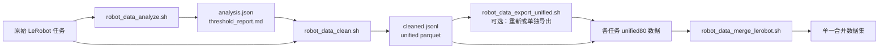

# 机器人数据处理脚本使用说明

本文说明本目录下 4 个批处理脚本的用途和用法：

- `robot_data_analyze.sh`：分析各任务并推荐清洗阈值。
- `robot_data_clean.sh`：按推荐阈值批量清洗任务。
- `robot_data_export_unified.sh`：将清洗结果导出为 80 维统一 LeRobot v2.1 数据。
- `robot_data_merge_lerobot.sh`：将多个 unified80 任务根目录合并为一个 LeRobot v2.1 数据集。

清洗阈值参数含义见 [ROBOT_CLEAN_FLAGS.md](./ROBOT_CLEAN_FLAGS.md)。

## 1. 推荐处理流程



通常依次执行：

```bash
bash robot_data_analyze.sh
bash robot_data_clean.sh
bash robot_data_merge_lerobot.sh
```

`robot_data_clean.sh` 对已支持的机器人布局默认启用 `--export-unified-parquet`，因此一般不需要再执行 `robot_data_export_unified.sh`。后者主要用于已有 `cleaned.jsonl` 的补导出、重新导出或兼容旧清洗结果。

## 2. 运行要求

### 2.1 Python 环境

脚本默认使用仓库根目录下的相对虚拟环境：

```text
<repo>/.venv/bin/python
```

（由 `b/scripts/` 上溯两级解析 `REPO_ROOT`，再拼 `.venv`。）

如环境位置不同，通过 `DJ_VENV` 指定虚拟环境根目录：

```bash
DJ_VENV=/path/to/venv bash robot_data_analyze.sh
```

虚拟环境需要安装当前项目及机器人数据处理所需依赖。脚本会自动切换到项目根目录，并把项目根目录加入 `PYTHONPATH`。

### 2.2 输入目录结构

数据集根目录下应包含多个 LeRobot v2.1 任务：

```text
<DATASET_ROOT>/
├── task_a/
│   ├── data/
│   ├── meta/
│   │   ├── info.json
│   │   └── embodiment.json      # 可选
│   └── videos/
└── task_b/
    ├── data/
    ├── meta/
    └── videos/
```

任务至少需要存在 `data/` 和 `meta/info.json`。脚本根据 `embodiment.json` 中的 `embodiment_tag` 或 `info.json` 中的 `robot_type` 选择布局：

- `r1lite`、`r1_lite` → `galaxea_r1_lite`
- `r1pro`、`r1_pro` → `galaxea_r1_pro`
- `R1Pro` → `sim_behavior_r1_pro`
- `sim_behavior_r1_pro`、`behavior_r1_pro` 标签 → `sim_behavior_r1_pro`
- `agilex_cobot_decoupled_magic`、`agilex_cobot_magic` → `agilex_cobot_magic`
- `aloha` → `aloha`

无法识别布局时，分析和统一导出会跳过该任务；清洗脚本仍可执行数值清洗和 Check3，但不会生成统一 80 维数据。

## 3. 分析脚本

### 3.1 功能

`robot_data_analyze.sh` 遍历 `DATASET_ROOT` 下的所有任务，分析数值异常和视频质量，为每个任务推荐清洗阈值。

### 3.2 基本用法

```bash
bash robot_data_analyze.sh
```

覆盖输入、输出和视频探针参数：

```bash
DATASET_ROOT=/path/to/tasks \
OUT_ROOT=/path/to/analyze \
PROBE_EPS=12 \
PROBE_FPS=2 \
bash robot_data_analyze.sh
```

也可以在脚本命令后追加底层分析程序参数：

```bash
bash robot_data_analyze.sh --max-episodes 50
bash robot_data_analyze.sh --no-video
bash robot_data_analyze.sh --video-key observation.images.head_rgb
```

### 3.3 环境变量

| 变量 | 默认值 | 说明 |
|---|---|---|
| `DATASET_ROOT` | `/mnt/r/DATA/PhysicalAI-Robotics-GR00T-X-Embodiment-Sim/press` | 原始任务根目录 |
| `OUT_ROOT` | `.../process_clean/analyze` | 分析结果根目录 |
| `DJ_VENV` | `<repo>/.venv` | Python 虚拟环境根目录 |
| `PROBE_EPS` | `8` | 每个任务抽取多少个 episode 做视频探针 |
| `PROBE_FPS` | `2` | 视频探针抽帧帧率 |

### 3.4 输出

```text
<OUT_ROOT>/
├── suggested_flags.txt
├── task_a/
│   ├── analysis.json
│   └── threshold_report.md
└── task_b/
    ├── analysis.json
    └── threshold_report.md
```

- `analysis.json`：机器可读的分析结果及 `suggested_clean_flags`。
- `threshold_report.md`：阈值、预估清洗比例和视频质量报告。
- `suggested_flags.txt`：所有任务的建议参数汇总。

各旗标含义见 [ROBOT_CLEAN_FLAGS.md](./ROBOT_CLEAN_FLAGS.md)。

## 4. 清洗脚本

### 4.1 功能

`robot_data_clean.sh` 遍历原始任务并执行默认清洗流程：

```text
Stage1 突变检测 → Stage2 状态/动作对齐 → Stage3 极值检测
→ Stage5 → Check3 视频质量门控 → 80 维统一映射
```

如果 `<ANALYZE_ROOT>/<task>/analysis.json` 存在，脚本自动读取其中的 `suggested_clean_flags`；否则使用 `BLUR_TH` 作为 Check3 模糊阈值。各旗标含义见 [ROBOT_CLEAN_FLAGS.md](./ROBOT_CLEAN_FLAGS.md)。

### 4.2 基本用法

```bash
bash robot_data_clean.sh
```

指定路径和并行度：

```bash
DATASET_ROOT=/path/to/tasks \
ANALYZE_ROOT=/path/to/analyze \
OUT_ROOT=/path/to/cleaned \
NP=16 \
bash robot_data_clean.sh
```

小规模试跑：

```bash
NP=2 bash robot_data_clean.sh --max-episodes 8
```

追加或覆盖底层清洗参数：

```bash
# 跳过视频质量门控
bash robot_data_clean.sh --no-check3

# 调整清洗阶段阈值
bash robot_data_clean.sh \
  --s1-max-flagged-ratio 0.3 \
  --s1-max-run-length 10 \
  --s2-da-threshold 0.65 \
  --s3-alpha 0.1

# 指定视频采样与解码器
bash robot_data_clean.sh \
  --check3-sampling-fps 2 \
  --check3-decoder ffmpeg
```

注意：当任务已有 `analysis.json` 时，脚本会先加入分析推荐参数，再追加命令行参数。不要重复传递同一个只允许出现一次的参数；若要人工覆盖阈值，可改用独立的 `ANALYZE_ROOT`，使脚本回退到默认值后再传入所需参数。

### 4.3 环境变量

| 变量 | 默认值 | 说明 |
|---|---|---|
| `DATASET_ROOT` | `/mnt/r/DATA/PhysicalAI-Robotics-GR00T-X-Embodiment-Sim/press` | 原始任务根目录 |
| `OUT_ROOT` | `.../process_clean` | 清洗结果根目录 |
| `ANALYZE_ROOT` | `.../process_clean/analyze` | 分析结果根目录 |
| `DJ_VENV` | `<repo>/.venv` | Python 虚拟环境根目录 |
| `NP` | `16` | Data-Juicer 进程数 |
| `BLUR_TH` | `20` | 无 `analysis.json` 时使用的模糊阈值 |

### 4.4 输出

每个任务输出到 `<OUT_ROOT>/<task>/`，主要文件包括：

```text
<OUT_ROOT>/<task>/
├── cleaned.jsonl
├── run_summary.json
├── recipe.yaml
├── pointer.jsonl
└── unified80_lerobot/           # 支持布局时生成
    ├── data/
    ├── meta/
    └── videos/
```

实际结果文件在分片场景下可能带有额外后缀，请以 `run_summary.json` 中的 `result` 字段为准。

## 5. 单独导出 unified80

### 5.1 功能

`robot_data_export_unified.sh` 读取各清洗任务的 `cleaned.jsonl`，仅导出保留的 episode，并将状态、动作和 mask 映射到统一 80 维布局。

### 5.2 基本用法

```bash
bash robot_data_export_unified.sh
```

指定清洗结果、原始数据和输出路径：

```bash
CLEAN_ROOT=/path/to/cleaned \
DATASET_ROOT=/path/to/source/tasks \
OUT_ROOT=/path/to/unified80 \
bash robot_data_export_unified.sh
```

### 5.3 环境变量

| 变量 | 默认值 | 说明 |
|---|---|---|
| `CLEAN_ROOT` | `.../process_clean` | 含各任务 `cleaned.jsonl` 的根目录 |
| `DATASET_ROOT` | `.../press` | 原始 LeRobot 任务根目录 |
| `OUT_ROOT` | `.../process_clean/unified80` | unified80 输出根目录 |
| `DJ_VENV` | `<repo>/.venv` | Python 虚拟环境根目录 |

### 5.4 输出

```text
<OUT_ROOT>/<task>/
├── data/chunk-XXX/episode_YYYYYY.parquet
├── meta/
│   ├── info.json
│   ├── episodes.jsonl
│   ├── tasks.jsonl
│   └── episodes_stats.jsonl
└── videos -> <源任务 videos>
```

其中 `observation.state`、`action` 和 `action_dim_mask` 均为 80 维（mask 为 action 有效维，供训练 `loss × mask`）。默认通过符号链接复用原始视频。

任务缺少 `cleaned.jsonl`、源 `data/` 或受支持的 embodiment 布局时会被跳过，并在结束时打印导出和跳过数量。

## 6. 合并 unified80 数据集

### 6.1 功能

`robot_data_merge_lerobot.sh` 将两个 unified80 根目录中的任务合并为单一 LeRobot v2.1 数据集，同时重新编号：

- `episode_index`
- 全局帧 `index`
- task 索引
- parquet 与视频 chunk

输出目录必须是不存在或为空的新目录，避免覆盖已有合并结果。

### 6.2 基本用法

```bash
bash robot_data_merge_lerobot.sh
```

自定义两个输入根目录和输出目录：

```bash
ROOT_SIM=/path/to/sim/unified80 \
ROOT_GLX=/path/to/galaxea/unified80 \
OUT_ROOT=/path/to/merged \
bash robot_data_merge_lerobot.sh
```

先执行 dry-run 检查：

```bash
DRY_RUN=1 bash robot_data_merge_lerobot.sh
```

小规模试跑：

```bash
MAX_TASKS=1 MAX_EPS=2 \
OUT_ROOT=/tmp/merged_unified80_smoke \
bash robot_data_merge_lerobot.sh
```

仅合并数值数据，不处理视频：

```bash
VIDEO_POLICY=none bash robot_data_merge_lerobot.sh
```

复制视频而不是创建符号链接：

```bash
LINK_MODE=copy bash robot_data_merge_lerobot.sh
```

### 6.3 环境变量

| 变量 | 默认值 | 说明 |
|---|---|---|
| `ROOT_SIM` | `.../PhysicalAI.../process_clean/unified80/use` | 第一组 unified80 任务根目录 |
| `ROOT_GLX` | `.../Galaxea.../process_clean/260711_unified80/use` | 第二组 unified80 任务根目录 |
| `OUT_ROOT` | `/mnt/r/DATA/merged_unified80` | 合并输出目录 |
| `DJ_VENV` | `<repo>/.venv` | Python 虚拟环境根目录 |
| `VIDEO_POLICY` | `keep` | `keep` 保留视频；`none` 不合并视频 |
| `LINK_MODE` | `symlink` | 视频处理方式：`symlink`、`hardlink` 或 `copy` |
| `MAX_TASKS` | 空 | 每个输入根目录最多处理的任务数 |
| `MAX_EPS` | 空 | 每个任务最多处理的 episode 数 |
| `DRY_RUN` | `0` | `1` 或 `true` 时只检查和统计，不正式写出 |

### 6.4 输出

```text
<OUT_ROOT>/
├── data/chunk-XXX/episode_YYYYYY.parquet
├── meta/
│   ├── info.json
│   ├── episodes.jsonl
│   ├── tasks.jsonl
│   ├── episodes_stats.jsonl
│   └── sources.jsonl
├── videos/chunk-XXX/<video_key>/episode_YYYYYY.mp4
└── merge_summary.json
```

`sources.jsonl` 记录合并后数据与原始任务的来源关系，`merge_summary.json` 记录任务数、episode 数、帧数及合并配置。

## 7. 完整示例

以下示例把分析、清洗、统一导出和合并结果分别放到独立目录：

```bash
# 默认使用 <repo>/.venv；如需覆盖：
# export DJ_VENV=/path/to/venv
export DATASET_ROOT=/mnt/r/DATA/my_robot_dataset/tasks

# 1. 分析
OUT_ROOT=/mnt/r/DATA/my_robot_dataset/process/analyze \
  bash robot_data_analyze.sh

# 2. 清洗并直接导出 unified parquet
ANALYZE_ROOT=/mnt/r/DATA/my_robot_dataset/process/analyze \
OUT_ROOT=/mnt/r/DATA/my_robot_dataset/process/clean \
NP=16 \
  bash robot_data_clean.sh

# 3. 可选：根据 cleaned.jsonl 单独重建 unified80
CLEAN_ROOT=/mnt/r/DATA/my_robot_dataset/process/clean \
OUT_ROOT=/mnt/r/DATA/my_robot_dataset/process/unified80 \
  bash robot_data_export_unified.sh

# 4. 合并两组 unified80
ROOT_SIM=/mnt/r/DATA/sim/process/unified80 \
ROOT_GLX=/mnt/r/DATA/galaxea/process/unified80 \
OUT_ROOT=/mnt/r/DATA/merged_unified80 \
DRY_RUN=1 \
  bash robot_data_merge_lerobot.sh

ROOT_SIM=/mnt/r/DATA/sim/process/unified80 \
ROOT_GLX=/mnt/r/DATA/galaxea/process/unified80 \
OUT_ROOT=/mnt/r/DATA/merged_unified80 \
  bash robot_data_merge_lerobot.sh
```

## 8. 常见问题

### 任务被直接跳过

检查：

1. 任务目录是否包含 `data/`。
2. `meta/info.json` 是否存在且包含可识别的 `robot_type`。
3. `meta/embodiment.json` 中是否提供正确的 `embodiment_tag`。
4. 导出时 `CLEAN_ROOT/<task>/cleaned.jsonl` 是否存在且非空。

### 清洗后保留 episode 数为 0

先查看 `<OUT_ROOT>/<task>/run_summary.json` 和分析报告。视频质量阈值过严时，可重新分析，或调整：

```bash
bash robot_data_clean.sh \
  --check3-blur-threshold 20 \
  --check3-max-bad-ratio 0.2
```

也可用 `--no-check3` 做诊断性试跑，但正式数据是否跳过视频质量检查应根据质量要求决定。

### 符号链接在目标机器上失效

合并时使用：

```bash
LINK_MODE=copy bash robot_data_merge_lerobot.sh
```

`copy` 占用空间最大但可独立搬运；`hardlink` 要求源和目标位于同一文件系统；`symlink` 最节省空间但依赖源路径长期可用。

### 查看底层完整参数

```bash
# 在仓库根目录执行：
.venv/bin/python -m \
  data_juicer._au.pipeline.robot_clean.analyze --help

.venv/bin/python -m \
  data_juicer._au.pipeline.robot_clean.run_robot_clean --help

.venv/bin/python -m \
  data_juicer._au.pipeline.robot_clean.export_unified --help

.venv/bin/python -m \
  data_juicer._au.pipeline.robot_clean.merge_lerobot --help
```
