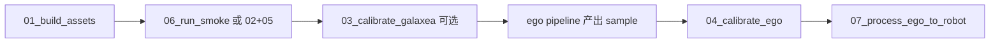

# Hand→Robot 执行脚本

本目录把「资产构建 → 标定 → 验收 → ego 处理」收成可直接跑的 bash。设计说明见：

- [`b/d/hand2robot/hand_to_robot_code_design_summary.md`](../../d/hand2robot/hand_to_robot_code_design_summary.md)
- [`b/d/hand2robot/hand_to_robot_render_design.md`](../../d/hand2robot/hand_to_robot_render_design.md)

（相对本 README：`../../d/hand2robot/...`）

## 脚本一览

| 脚本 | 作用 |
|------|------|
| `_env.sh` | 公共环境（REPO、conda/`data_juicer`、`MUJOCO_GL=egl`） |
| `01_build_assets.sh` | 生成 `r1_lite_arm_{left,right}.xml` |
| `02_calibrate_synthetic.sh` | 合成数据标定 smoke |
| `03_calibrate_galaxea.sh` | Galaxea 真机 FK/IK 诊断 + 代理标定 |
| `04_calibrate_ego.sh` | **真人手** pipeline sample 标定 → 版本化 YAML |
| `05_accept_render.sh` | 渲染 Mapper 验收 |
| `05_accept_calibrate.sh` | 标定工具验收 |
| `06_run_smoke.sh` | 本地一键 smoke（build→合成标定→双验收） |
| `07_process_ego_to_robot.sh` | 按 recipe 跑 ego→机器人画面 LeRobot |
| `configs/ego_to_robot_recipe.yaml` | 处理配方模板 |

默认产物目录：`b/d/hand2robot/runs/`。

## 推荐顺序



### 1. 本地 smoke（无真实视频）

```bash
bash b/scripts/hand2robot/06_run_smoke.sh
```

### 2. Galaxea 运动学验收（真机关节）

```bash
bash b/scripts/hand2robot/03_calibrate_galaxea.sh
# 或
LEROBOT_ROOT=/mnt/r/DATA/pre_train_v1/Galaxea_R1_Lite/Handle_Plates_20250619_001 \
EPISODE=2 SIDE=right \
  bash b/scripts/hand2robot/03_calibrate_galaxea.sh
```

### 3. Ego 人手标定（生产前必做）

先有一份含 `hand_action_tags` + `cam_c2w` 的 pipeline 输出（pkl/parquet/jsonl），再：

```bash
DATA_PATH=/path/to/pipeline_sample.pkl \
SIDE=right VERSION=v2 \
  bash b/scripts/hand2robot/04_calibrate_ego.sh
```

写出：`b/d/hand2robot/calibration/r1_right_v2.yaml`。

### 4. Ego → 机器人数据

先改 `configs/ego_to_robot_recipe.yaml` 里的模型权重 / MANO 路径，或用环境变量覆盖：

```bash
# 确保资产与标定已就绪
bash b/scripts/hand2robot/01_build_assets.sh

DATASET_PATH=./demos/ego_hand_action_annotation/data/demo-dataset.jsonl \
CALIBRATION_PATH=b/d/hand2robot/calibration/r1_right_v2.yaml \
SIDE=right \
  bash b/scripts/hand2robot/07_process_ego_to_robot.sh
```

运行时会生成 `b/d/hand2robot/runs/ego_process/ego_to_robot_runtime.yaml` 再调用 `dj-process`。

> MegaSaM / 大规模建议把 recipe 里 `executor_type` 改为 `ray`，并配置 `runtime_env: {conda: mega-sam}`（参考 `demos/ego_hand_action_annotation`）。

## 常用环境变量

| 变量 | 默认 | 含义 |
|------|------|------|
| `SIDE` | `right` | `left` / `right` |
| `MUJOCO_GL` | `egl` | MuJoCo 后端 |
| `OUT_ROOT` | `b/d/hand2robot/runs` | 输出根目录 |
| `INIT_CALIB` | `calibration/r1_${SIDE}_v1.yaml` | 标定初值 |
| `MODEL_XML` | `urdf/generated/r1_lite_arm_${SIDE}.xml` | 单臂 MJCF |
| `LEROBOT_ROOT` | Galaxea Handle_Plates… | `03` 用 |
| `DATA_PATH` | （必填） | `04` ego sample |
| `CALIBRATION_PATH` | （可选） | `07` 覆盖 recipe 标定 |
| `DATASET_PATH` | （可选） | `07` 覆盖输入 jsonl |
| `DJ_VENV` | — | 无 conda 时的 venv |

## 注意

1. **Galaxea ≠ 人手标定**：`03` 只验证 FK/IK；人手 retarget 必须用 `04`。  
2. **单臂**：P0–P1 的 `hand_type` / `SIDE` 不要用 `both`。  
3. **非破坏输出**：渲染写在 `robot_render_frames`，原帧保留。  
4. Export 的 `robot_type` 使用 `r1_lite_ego_retarget`，勿再写 `egodex_hand`。
