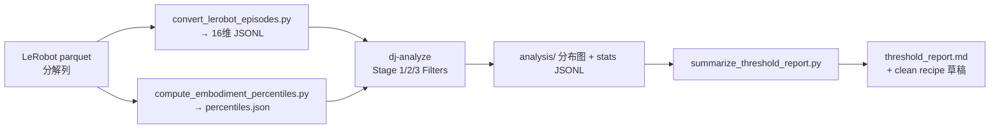

# Galaxea Pilot：Stage 1/2/3 轨迹质量分析与阈值建议

**日期**：2026-07-13  
**状态**：设计已批准，待实现  
**范围**：单任务 pilot（定阈值），不扫 227 全量

---

## 1. 目标与成功标准

### 目标

对 Galaxea Open-World Dataset 中的单个任务跑通「转换 → 分位数 → 分析 → 阈值建议」，输出可读报告，用于确定后续 `dj-process` 清洗阈值。

### 成功标准

1. 单任务 decomposd-column LeRobot parquet 可转为带 `states`/`actions` 的 JSONL。
2. `dj-analyze` 对 Stage 1/2/3 三个 Filter 产出完整 stats（不删除 episode）。
3. 生成 `threshold_report.md`：各 stage 关键 stats 分布摘要 + **建议阈值** + **按该阈值预计保留/丢弃量**。
4. 附带一份可直接改参数的清洗 YAML 草稿（建议值已填）。

### 非目标（本轮不做）

- 不处理全部 227 个任务。
- 不真正删除 / 改写 episode（分析阶段只 flag / frame_mask）。
- 不修改 `data_juicer/` 主干（仅 `_au` 注册已有算子 + `tests_au` 扩展脚本/配置）。
- 不做多组自动扫参对照表（那是后续可选 C 方案）。

---

## 2. Pilot 数据与布局

| 项 | 值 |
|----|-----|
| 任务目录 | `/mnt/r/DATA/Galaxea-Open-World-Dataset/lerobot/Connect_Router_Cables_20250625_002` |
| 格式 | LeRobot v2.1，**分解列**（无 `observation.state` / `action` 统一列） |
| robot | `r1lite`；recipe 中 embodiment 键用 `galaxea_r1_lite` |
| 分析用向量 | **16 维** unified 布局（与现有 Stage 1/2/3 验收 recipe 对齐） |

### 16 维布局（分解列 → unified）

```
state/action slots 0..15:
  left_arm:     [0,2,3,4,5,6]  ← observation.state.left_arm / action.left_arm (6,)
  left_pad:     [1]            ← 0
  left_gripper: [7]            ← *.left_gripper
  right_arm:    [8,10,11,12,13,14]
  right_pad:    [9]            ← 0
  right_gripper:[15]
```

夹爪维 `7, 15` 在 Stage 3 豁免；Stage 2 `shared_dims` 与现有验收一致：`[0..6, 8..14]`。

> Pilot 阶段 Stage 3 的 `percentiles.json` **仅用本任务全部帧**计算。全量 227 任务时应改为跨任务全局分位数；本设计明确记录该差异，避免后续误用。

---

## 3. 架构与数据流



### 组件职责

| 组件 | 职责 |
|------|------|
| `convert_lerobot_episodes.py` | 读 parquet；自动检测 unified / 分解列；写出每 episode 一行 JSONL |
| `compute_embodiment_percentiles.py` | 同格式检测；算 state/action 的 per-dim q01/q99 |
| `analyze_qwenrobomanip_pilot.yaml` | `dj-analyze` recipe：加载 `data_juicer/_au`，三级 Filter，不删样本 |
| `summarize_threshold_report.py` | 读 stats JSONL，算分位数与建议阈值，写 markdown + YAML 草稿 |
| `accept_analyze_qwenrobomanip_pilot.sh` | 一键：convert → percentiles → dj-analyze → summarize |

### 输出目录

```
tests_au/ops/filter/outputs/pilot_analyze/
  lerobot_episodes.jsonl
  percentiles.json
  analyze_result.jsonl          # dj-analyze export（含 stats）
  s1_stats.jsonl / s2_stats.jsonl / s3_stats.jsonl  # 若算子仍写 stats_export_path
  threshold_report.md
  clean_recipe_suggested.yaml
```

`dj-analyze` 的 work_dir/analysis 图表放在项目 `outputs/` 或 recipe 指定的 `export_path` 同级 `work_dir`（以 DJ 默认行为为准）。

---

## 4. 分析 recipe 行为约定

- 入口：`dj-analyze --config tests_au/ops/filter/analyze_qwenrobomanip_pilot.yaml`
- `custom_operator_paths: ['data_juicer/_au']`（包引入，非单文件）
- Stage 1：`exclusion_strategy: frame_mask`（或等效不丢弃；analyze 本身会跳过 Filter.process）
- Stage 2：`exclusion_strategy: flag_only`
- Stage 3：`percentile_source: stats_json`，`alpha: 0.1` 作为**探针默认值**（报告会建议是否放宽）
- `keep_stats_in_res_ds: true`，`text_keys: id`

基线参数与 `accept_qwenrobomanip_filter.yaml` 对齐，便于和验收结果对照。

---

## 5. 阈值建议规则

目标经验区间（来自项目内调参说明）：整体保留率约 **85%–95%**；Stage 3 帧标记率约 **5%–15%**。

| Stage | 输入 stats | 建议输出 | 规则 |
|-------|------------|----------|------|
| 1 | `sudden_change_flagged_ratio`, `sudden_change_max_run` | `max_flagged_ratio`, 可选 mad_scale 备注 | 列出 ratio 的 p50/p90/p95；建议 `max_flagged_ratio` 取使「若用 episode_discard 且 ratio>阈则丢」时保留率≈90% 的阈值；并报告当前 `frame_mask` 下 flagged 帧占比 |
| 2 | `state_action_min_da`, `state_action_mean_da` | `da_threshold` | 在候选 `{0.60, 0.65, 0.70}` 上估计「min_da < 阈」的 episode 丢弃数；默认推荐使丢弃率落在 5%–15% 的阈值，并列对照表 |
| 3 | `extreme_value_flagged_ratio` | `alpha` | 报告当前 α=0.1 的标记率；若 >15% 建议试 0.2/0.3；若 <5% 可保持 0.1 或略收紧；夹爪维保持 `exempt_dims: [7,15]` |

报告必须写清：**建议值是基于本任务分布的启发式，全量清洗前需用 5–10 任务或全量复核**。

---

## 6. 错误处理

- 任务目录不存在 / 无 parquet → 脚本非零退出并打印路径。
- 既无 unified 列也无必要分解列 → 明确报错，列出缺失列名。
- gripper 列可能是标量或 length-1 向量 → convert 时 `reshape(-1, 1)` / 展平兼容。
- `dj-analyze` 失败 → shell 脚本 `set -e` 中止，不生成半成品建议报告。
- stats 键缺失 → summarize 报 FAIL 并列出缺失键。

---

## 7. 测试与验收

| 层级 | 内容 |
|------|------|
| 单元 | convert：对 Connect_Router 一个 episode 断言 `states`/`actions` shape `(T,16)`，夹爪维非全零（若数据中有开合） |
| 单元 | summarize：用合成 stats JSONL 断言建议字段与 markdown 章节存在 |
| 验收 | `accept_analyze_qwenrobomanip_pilot.sh`：四步跑通；`threshold_report.md` 存在；报告含 Stage1/2/3 与建议阈值 |

真实数据路径固定为上述 Connect_Router 任务目录。

---

## 8. 文件清单（拟新增/修改）

| 路径 | 动作 |
|------|------|
| `tests_au/ops/filter/convert_lerobot_episodes.py` | 修改：支持分解列 → 16 维 |
| `tests_au/ops/filter/compute_embodiment_percentiles.py` | 修改：同上 |
| `tests_au/ops/filter/analyze_qwenrobomanip_pilot.yaml` | 新增 |
| `tests_au/ops/filter/summarize_threshold_report.py` | 新增 |
| `tests_au/ops/filter/accept_analyze_qwenrobomanip_pilot.sh` | 新增 |
| `tests_au/ops/filter/test_convert_lerobot_episodes.py` | 新增 |
| `tests_au/ops/filter/test_summarize_threshold_report.py` | 新增 |

不修改 `data_juicer/_au/ops/filter/robot_*.py`（除非发现 analyze 兼容性 bug）。

---

## 9. 一键运行（实现后）

```bash
cd /mnt/r/share/zwy/Projects/data-juicer
bash tests_au/ops/filter/accept_analyze_qwenrobomanip_pilot.sh
# 读报告
less tests_au/ops/filter/outputs/pilot_analyze/threshold_report.md
```

---

## 10. 后续扩展（本设计之外）

1. 多任务 convert + 全局 percentiles。  
2. 抽样 5–10 任务复核阈值。  
3. 全量 227 `dj-process` 清洗。  
4. 可选：多组阈值扫参对照（原方案 C）。
